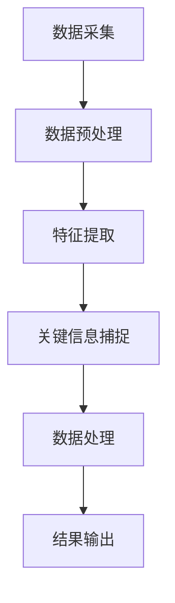

                 

# 《视频数据的关键信息捕捉详细技术》

## 概述

关键词：视频数据，关键信息捕捉，特征提取，图像处理，深度学习，智能分析，应用实例

视频数据作为多媒体信息的重要组成部分，已经成为人工智能、计算机视觉和智能分析等领域的研究热点。如何从海量视频数据中高效地捕捉关键信息，是当前视频数据处理领域的一个关键问题。本文旨在详细探讨视频数据的关键信息捕捉技术，从基础理论、关键技术、应用实例和未来发展趋势等方面进行全面解析，旨在为读者提供一个全面、系统的学习和实践指南。

## 目录大纲

### 第一部分：视频数据处理基础

#### 第1章：视频数据概述

- 1.1 视频数据的基本概念
- 1.2 视频数据的重要性
- 1.3 视频数据处理的基本流程

#### 第2章：视频数据预处理

- 2.1 视频数据采集
- 2.2 视频数据解码
- 2.3 视频数据增强

#### 第3章：视频数据特征提取

- 3.1 视频数据帧提取
- 3.2 视频数据特征类型
- 3.3 视频数据特征提取算法

### 第二部分：关键信息捕捉技术

#### 第4章：视频数据关键信息定义与分类

- 4.1 视频数据关键信息定义
- 4.2 视频数据关键信息分类
- 4.3 视频数据关键信息捕捉的重要性

#### 第5章：图像特征捕捉技术

- 5.1 基于传统算法的特征捕捉
- 5.2 基于深度学习的特征捕捉
- 5.3 特征融合技术

#### 第6章：视频行为捕捉技术

- 6.1 视频行为识别
- 6.2 视频行为捕捉算法
- 6.3 行为特征提取与分类

#### 第7章：语音与音频特征捕捉技术

- 7.1 语音特征捕捉
- 7.2 音频特征捕捉
- 7.3 特征融合与关键信息提取

### 第三部分：关键信息捕捉应用实例

#### 第8章：视频数据融合与处理

- 8.1 视频数据融合技术
- 8.2 视频数据处理流程
- 8.3 关键信息提取与优化

#### 第9章：视频监控应用

- 9.1 视频监控概述
- 9.2 视频监控中的关键信息捕捉
- 9.3 视频监控案例分析

#### 第10章：医疗视频数据分析

- 10.1 医疗视频数据分析概述
- 10.2 关键信息捕捉在医疗视频中的应用
- 10.3 医疗视频数据分析案例

#### 第11章：智能交通视频监控

- 11.1 智能交通视频监控概述
- 11.2 关键信息捕捉在智能交通中的应用
- 11.3 智能交通视频监控案例

### 第四部分：关键信息捕捉技术的未来发展趋势

#### 第12章：关键信息捕捉技术的未来发展趋势

- 12.1 关键信息捕捉技术发展趋势
- 12.2 技术挑战与机遇
- 12.3 未来发展方向

## 附录

- 附录A：关键信息捕捉算法Mermaid流程图
- 附录B：关键信息捕捉算法伪代码实现
- 附录C：关键信息捕捉应用项目代码解读
- 附录D：参考资料与推荐阅读

以上是本文的目录大纲，接下来将按照大纲结构，逐步深入讨论视频数据的关键信息捕捉技术。

### 第一部分：视频数据处理基础

#### 第1章：视频数据概述

### 1.1 视频数据的基本概念

视频数据是一种多媒体数据，主要由图像序列和时间信息组成。每一帧图像都包含了空间上的像素数据，而时间信息则反映了图像序列的播放顺序。视频数据的基本概念可以从以下几个方面进行理解：

1. **图像帧**：视频数据的基本组成单元是图像帧，每一帧图像通常采用像素阵列的形式表示。像素是图像中最小的视觉单元，每个像素包含的值表示其在颜色空间中的位置。

2. **帧率**：帧率（FPS）是每秒播放的帧数，通常用于描述视频播放的流畅程度。高帧率可以提高视频的清晰度和真实感，但也增加了数据存储和处理的复杂性。

3. **分辨率**：分辨率是指视频图像的清晰程度，通常以水平和垂直像素数表示，如640x480、1920x1080等。高分辨率视频可以提供更丰富的细节和更好的视觉效果，但同时也增加了数据的大小和处理难度。

4. **色彩深度**：色彩深度是指每个像素可以表示的颜色数，通常以位数表示，如8位、24位、32位等。8位像素可以表示256种颜色，24位像素可以表示约1600万种颜色，32位像素则通常包括alpha通道，用于描述像素的透明度。

### 1.2 视频数据的重要性

视频数据在现代社会中扮演着至关重要的角色，其重要性体现在以下几个方面：

1. **信息传递**：视频数据可以直观地传递信息，尤其是动态信息和复杂情境。例如，视频会议、在线教育、新闻报道等都依赖于视频数据来传递信息和知识。

2. **娱乐与媒体**：视频数据是娱乐产业和媒体行业的重要组成部分，从电影、电视剧到短视频平台，视频已经成为人们日常生活不可或缺的一部分。

3. **安全监控**：视频监控在公共安全、家庭安全等方面发挥着重要作用。通过视频数据，可以实时监控和记录事件，提高安全性和事故处理效率。

4. **科学研究**：视频数据在生物学、医学、环境科学等领域中有着广泛的应用。通过对视频数据的分析，可以提取有价值的信息，促进科学研究和技术创新。

### 1.3 视频数据处理的基本流程

视频数据处理通常包括以下几个基本步骤：

1. **采集**：视频数据的采集是获取原始视频数据的过程，可以通过摄像头、无人机、传感器等设备进行。

2. **预处理**：预处理包括视频数据的清洗、去噪、剪辑等操作，目的是提高数据质量和后续处理的效率。预处理步骤可能包括去除无效帧、调整亮度对比度、增强细节等。

3. **特征提取**：特征提取是从视频数据中提取关键特征的过程，用于后续的识别、分类、分析等操作。常见的特征提取方法包括图像特征提取、行为特征提取和音频特征提取等。

4. **分析**：分析是根据提取的特征对视频数据进行分析和解释，以获得有价值的信息。分析可能包括目标检测、行为识别、场景分类等。

5. **优化**：优化是对视频数据处理过程中的参数进行调整，以提高处理效果和性能。优化步骤可能包括算法参数调整、数据增强、模型训练等。

### 第2章：视频数据预处理

### 2.1 视频数据采集

视频数据的采集是视频处理的第一步，其质量直接影响到后续处理的效果。视频数据采集的主要任务包括以下几个方面：

1. **设备选择**：选择适合的摄像头或传感器进行视频数据采集。设备的分辨率、帧率、色彩深度等参数应满足应用需求。

2. **场景设置**：合理设置拍摄场景，确保视频数据的光照、角度、背景等条件适宜。例如，在室内监控场景中，应确保光线均匀，避免阴影和反射。

3. **数据存储**：采集到的视频数据需要实时存储，以确保数据的安全性和完整性。数据存储可以采用本地存储或远程存储，根据实际情况进行选择。

### 2.2 视频数据解码

视频数据解码是将压缩的视频数据转换为原始图像数据的过程。常见的视频压缩编码标准包括H.264、H.265、HEVC等。解码过程通常包括以下几个步骤：

1. **解压缩**：解压缩是将压缩数据转换为原始图像数据的过程，包括运动估计、运动补偿、量化、反量化等操作。

2. **像素重构**：像素重构是根据解码后的图像数据进行像素值重构，恢复图像的原始色彩和细节。

3. **图像校正**：图像校正是对解码后的图像进行亮度、对比度、色彩等调整，以优化图像质量。

### 2.3 视频数据增强

视频数据增强是通过增加数据的多样性和复杂性，提高模型训练效果的一种技术。常见的视频数据增强方法包括：

1. **随机裁剪**：随机裁剪是随机从视频帧中选择一部分进行裁剪，以增加数据的多样性。

2. **随机旋转**：随机旋转是随机旋转视频帧，模拟不同的观察角度，增加数据的复杂性。

3. **亮度调整**：亮度调整是通过调整视频帧的亮度值，增加数据的对比度和视觉冲击力。

4. **噪声添加**：噪声添加是向视频帧中添加噪声，模拟实际环境的干扰，提高模型的鲁棒性。

### 第3章：视频数据特征提取

#### 3.1 视频数据帧提取

视频数据帧提取是将连续的视频数据拆分为单独的帧，以供后续处理和分析。帧提取的步骤通常包括：

1. **帧间间隔计算**：计算帧与帧之间的时间间隔，以确定帧率。

2. **帧选择**：根据应用需求选择合适的帧进行提取。例如，在视频监控中，可以选择关键帧或中间帧进行提取。

3. **帧存储**：将提取的帧存储为单独的图像文件，以供后续处理。

#### 3.2 视频数据特征类型

视频数据特征提取的目标是提取能够表征视频内容的特征，以便于后续的识别、分类和分析。常见的视频数据特征类型包括：

1. **视觉特征**：视觉特征是从视频帧中提取的图像特征，如颜色、纹理、形状等。视觉特征在目标检测、场景分类等任务中有着广泛的应用。

2. **运动特征**：运动特征是从视频帧中提取的运动信息，如目标轨迹、速度、加速度等。运动特征在行为识别、目标跟踪等任务中有着重要作用。

3. **音频特征**：音频特征是从视频中的音频信号中提取的特征，如音调、音量、频率等。音频特征在语音识别、音频分类等任务中有着重要应用。

4. **语义特征**：语义特征是从视频内容中提取的抽象信息，如场景、对象、动作等。语义特征在视频语义分析、内容推荐等任务中有着广泛的应用。

#### 3.3 视频数据特征提取算法

视频数据特征提取算法是用于从视频数据中提取特征的方法和技术。常见的视频数据特征提取算法包括：

1. **传统算法**：传统算法是基于统计学和信号处理的方法，如SIFT、HOG、HOF等。这些算法通过分析图像的局部特征，提取具有稳定性和鲁棒性的特征。

2. **深度学习算法**：深度学习算法是近年来发展迅速的一种特征提取方法，如卷积神经网络（CNN）、循环神经网络（RNN）等。这些算法通过多层神经网络的结构，自动学习视频数据的复杂特征。

3. **多模态融合算法**：多模态融合算法是结合视觉、运动、音频等多种特征，以提高特征提取的准确性和鲁棒性。常见的多模态融合方法包括特征级融合、决策级融合等。

### 第二部分：关键信息捕捉技术

#### 第4章：视频数据关键信息定义与分类

在视频数据处理中，关键信息的捕捉至关重要。关键信息是指视频中具有代表性的、对于理解视频内容至关重要的信息。下面将介绍视频数据关键信息的定义、分类及其捕捉的重要性。

#### 4.1 视频数据关键信息定义

视频数据关键信息是指视频中所包含的、对理解视频内容具有关键性作用的元素。这些信息可以是视觉的、运动的或音频的，其特点在于：

- **代表性**：能够代表视频中的主要内容和主题。
- **重要性**：对于视频的解读和决策具有决定性作用。
- **独特性**：在视频中具有独特的特征，不易被其他信息所混淆。

#### 4.2 视频数据关键信息分类

视频数据关键信息可以根据其来源和特性进行分类，常见的分类方法包括：

1. **视觉关键信息**：
   - **目标检测**：识别视频中的关键目标，如行人、车辆等。
   - **场景分类**：分类视频中的场景，如城市、乡村、海滩等。
   - **动作识别**：识别视频中的特定动作，如跑步、跳跃等。

2. **运动关键信息**：
   - **轨迹分析**：分析视频中的目标运动轨迹，如行人的行走路线、车辆的行驶轨迹等。
   - **行为预测**：预测视频中的目标行为，如下一步可能发生的动作。

3. **音频关键信息**：
   - **语音识别**：识别视频中的语音内容，如对话、指令等。
   - **声音分类**：分类视频中的声音类型，如音乐、噪音等。

#### 4.3 视频数据关键信息捕捉的重要性

视频数据关键信息的捕捉对于视频分析的应用具有重要意义：

- **决策支持**：关键信息的捕捉可以帮助决策者快速理解和分析视频内容，例如在公共安全领域，关键信息的捕捉可以辅助监控和预警。
- **智能监控**：在智能监控系统中的应用，关键信息的捕捉可以实现目标的自动识别、行为分析等。
- **内容推荐**：在视频内容推荐系统中，关键信息的捕捉可以用于分析用户偏好，提高推荐效果。
- **安全防护**：在视频监控和安全防护系统中，关键信息的捕捉可以实时监测和识别异常行为，提高安全性和防范能力。

### 第5章：图像特征捕捉技术

图像特征捕捉是视频数据关键信息捕捉的核心环节之一，通过提取图像中的关键特征，可以有效地识别和理解视频内容。本章将详细介绍图像特征捕捉的技术，包括传统算法和深度学习方法。

#### 5.1 基于传统算法的特征捕捉

传统算法在图像特征捕捉中具有悠久的历史和丰富的经验，以下是一些常用的传统算法：

1. **SIFT（尺度不变特征变换）**：
   - **原理**：SIFT算法通过检测图像中的关键点，并计算这些关键点的方向直方图，从而提取具有尺度不变性的特征。
   - **应用**：SIFT广泛应用于图像匹配、目标识别和三维重建等领域。
   - **Mermaid流程图**：
     ```mermaid
     graph TD
     A[输入图像] --> B[关键点检测]
     B --> C[关键点方向计算]
     C --> D[特征向量计算]
     D --> E[特征匹配]
     ```

2. **HOG（方向梯度直方图）**：
   - **原理**：HOG算法通过计算图像中每个像素点的方向梯度，并将这些梯度值组织成直方图，以提取图像的特征。
   - **应用**：HOG在目标检测、行人识别等领域中有着广泛应用。
   - **Mermaid流程图**：
     ```mermaid
     graph TD
     A[输入图像] --> B[梯度计算]
     B --> C[直方图组织]
     C --> D[特征向量计算]
     D --> E[特征匹配]
     ```

3. **HOF（直方图方向特征）**：
   - **原理**：HOF算法通过计算图像在不同方向上的像素分布，并形成直方图，以提取图像特征。
   - **应用**：HOF在图像分类、纹理分析等领域中有着应用。
   - **Mermaid流程图**：
     ```mermaid
     graph TD
     A[输入图像] --> B[方向计算]
     B --> C[直方图计算]
     C --> D[特征向量计算]
     D --> E[特征匹配]
     ```

#### 5.2 基于深度学习的特征捕捉

随着深度学习技术的发展，基于深度学习的特征捕捉方法逐渐成为研究热点。以下是一些常用的深度学习算法：

1. **卷积神经网络（CNN）**：
   - **原理**：CNN通过卷积层、池化层等网络结构，自动学习图像的特征表示。
   - **应用**：CNN在图像分类、目标检测等领域中有着广泛应用。
   - **伪代码**：
     ```python
     # 输入图像
     image = input_image()

     # 卷积层
     conv1 = convolution(image, filter_size=(3,3), stride=(1,1))

     # 池化层
     pool1 = max_pooling(conv1, pool_size=(2,2), stride=(2,2))

     # 全连接层
     fc1 = fully_connected(pool1, num_neurons=1000)

     # 输出特征向量
     feature_vector = fc1
     ```

2. **循环神经网络（RNN）**：
   - **原理**：RNN通过递归结构，处理序列数据，能够捕捉视频中的时间信息。
   - **应用**：RNN在视频分类、行为识别等领域中有着应用。
   - **伪代码**：
     ```python
     # 输入视频序列
     video_sequence = input_video_sequence()

     # RNN处理
     for frame in video_sequence:
         feature_vector = recurrent(frame, previous_feature_vector)

     # 输出特征向量序列
     feature_sequence = [feature_vector for frame in video_sequence]
     ```

#### 5.3 特征融合技术

在视频数据关键信息捕捉中，单一特征往往难以充分表征视频内容的复杂性。因此，特征融合技术成为提高识别准确率和鲁棒性的有效手段。特征融合可以分为以下几类：

1. **特征级融合**：
   - **原理**：将不同特征的向量进行拼接，形成更长的特征向量。
   - **应用**：特征级融合可以结合视觉、运动和音频等多模态特征，提高特征表征能力。
   - **伪代码**：
     ```python
     # 假设视觉特征向量为visual_feature，运动特征向量为motion_feature
     combined_feature = concatenate(visual_feature, motion_feature)
     ```

2. **决策级融合**：
   - **原理**：将不同特征的分类结果进行综合，得到最终的分类决策。
   - **应用**：决策级融合可以结合不同特征的分类器，提高分类准确率。
   - **伪代码**：
     ```python
     # 假设视觉分类器为visual_classifier，运动分类器为motion_classifier
     final_decision = majority_vote(visual_classifier(combined_feature), motion_classifier(combined_feature))
     ```

通过特征融合技术，可以充分利用多种特征的信息，提高视频数据关键信息捕捉的效果。

### 第6章：视频行为捕捉技术

视频行为捕捉是视频数据关键信息捕捉的重要组成部分，旨在从视频中识别和解析行为信息。本章将详细介绍视频行为捕捉的技术，包括视频行为识别、视频行为捕捉算法以及行为特征提取与分类。

#### 6.1 视频行为识别

视频行为识别是指从视频序列中识别出具有特定意义的行为模式。视频行为识别具有广泛的应用场景，如智能监控、交互式系统、人机交互等。视频行为识别的基本流程包括以下几个步骤：

1. **行为定义**：定义待识别的行为类别，如行走、跑步、跳跃等。
2. **行为检测**：检测视频序列中每个时间段是否存在特定行为。
3. **行为识别**：对检测到的行为进行分类，确定具体的行为类别。

#### 6.2 视频行为捕捉算法

视频行为捕捉算法是实现视频行为识别的关键技术。以下介绍几种常用的视频行为捕捉算法：

1. **基于传统算法的行为捕捉**：
   - **原理**：传统算法通过分析视频帧的视觉特征，如颜色、形状、运动等，进行行为识别。
   - **应用**：传统算法在实时性和计算资源有限的情况下具有优势。
   - **伪代码**：
     ```python
     # 假设输入视频序列为video_sequence
     for frame in video_sequence:
         feature_vector = extract_visual_features(frame)
         behavior = classify_behavior(feature_vector)
     ```

2. **基于深度学习的行为捕捉**：
   - **原理**：深度学习算法通过卷积神经网络（CNN）、循环神经网络（RNN）等模型，自动学习视频行为特征。
   - **应用**：深度学习算法在准确性和泛化能力方面具有显著优势。
   - **伪代码**：
     ```python
     # 假设输入视频序列为video_sequence，使用CNN模型
     for frame in video_sequence:
         feature_vector = cnn_frame_extractor(frame)
     behavior_sequence = rnn_behavior_recognizer(feature_vector)
     ```

3. **基于多模态融合的行为捕捉**：
   - **原理**：多模态融合算法结合视觉、音频、运动等多种特征，提高行为识别的准确性和鲁棒性。
   - **应用**：多模态融合算法在复杂场景下具有更好的表现。
   - **伪代码**：
     ```python
     # 假设视觉特征向量为visual_feature，音频特征向量为audio_feature，运动特征向量为motion_feature
     combined_feature = concatenate(visual_feature, audio_feature, motion_feature)
     behavior = behavior_recognizer(combined_feature)
     ```

#### 6.3 行为特征提取与分类

行为特征提取与分类是视频行为捕捉的核心环节，直接影响行为识别的准确率和效率。以下介绍几种常用的行为特征提取与分类方法：

1. **行为特征提取**：
   - **原理**：行为特征提取是从视频帧或视频序列中提取能够表征行为的关键特征。
   - **方法**：常见的特征提取方法包括HOG、SIFT、深度学习特征提取等。
   - **伪代码**：
     ```python
     # 假设输入视频序列为video_sequence
     for frame in video_sequence:
         feature_vector = extract_behavior_features(frame)
     ```

2. **行为分类**：
   - **原理**：行为分类是将提取的特征输入分类器，确定具体的行为类别。
   - **方法**：常见的分类器包括SVM、KNN、神经网络等。
   - **伪代码**：
     ```python
     # 假设特征向量为feature_vector，分类器为classifier
     behavior = classifier.classify(feature_vector)
     ```

通过结合行为特征提取与分类，可以实现对视频行为的准确识别和理解。

### 第7章：语音与音频特征捕捉技术

语音与音频特征捕捉是视频数据关键信息捕捉的重要方面之一，特别是在需要结合声音内容进行分析的场合。本章将介绍语音与音频特征捕捉的技术，包括语音特征捕捉、音频特征捕捉以及特征融合与关键信息提取。

#### 7.1 语音特征捕捉

语音特征捕捉是指从语音信号中提取能够代表语音内容的特征，用于后续的语音识别、语音合成等任务。常见的语音特征包括：

1. **Mel频率倒谱系数（MFCC）**：
   - **原理**：MFCC通过将语音信号进行频谱分析，并转换到梅尔频率域，然后计算频谱的倒谱系数，从而提取语音特征。
   - **应用**：MFCC在语音识别、语音合成等领域中广泛应用。
   - **伪代码**：
     ```python
     # 假设输入语音信号为audio_signal
     mel_spectrogram = mel_frequency_spectrogram(audio_signal)
     mfcc_coefficients = mel_spectrogram_to_mfcc(mel_spectrogram)
     ```

2. **感知哈达马特征（Perceptual Hashing）**：
   - **原理**：感知哈达马特征是一种基于听觉模型的特征提取方法，通过计算语音信号的哈达马距离，生成独特的语音特征向量。
   - **应用**：感知哈达马特征在语音分类、相似度比较等领域中有着应用。
   - **伪代码**：
     ```python
     # 假设输入语音信号为audio_signal
     hash_vector = perceptual_hashing(audio_signal)
     ```

#### 7.2 音频特征捕捉

音频特征捕捉是指从音频信号中提取能够代表音频内容的特征，用于后续的音频识别、音频分类等任务。常见的音频特征包括：

1. **短时傅里叶变换（STFT）**：
   - **原理**：STFT将音频信号进行短时频谱分析，得到时间-频率域上的信号表示。
   - **应用**：STFT在音频分类、音乐识别等领域中广泛应用。
   - **伪代码**：
     ```python
     # 假设输入音频信号为audio_signal
     stft_matrix = short_time_fourier_transform(audio_signal)
     ```

2. **频谱特征**：
   - **原理**：频谱特征是从音频信号的频谱中提取的特征，如能量、共振峰频率等。
   - **应用**：频谱特征在音频分类、语音识别等领域中有着应用。
   - **伪代码**：
     ```python
     # 假设输入音频信号为audio_signal
     spectrum = audio_signal_spectrum(audio_signal)
     energy = spectrum_energy(spectrum)
     formants = formant_frequency(spectrum)
     ```

#### 7.3 特征融合与关键信息提取

在视频数据中，语音与音频特征与视觉特征、运动特征等一起构成了多维度的信息。特征融合技术旨在将这些不同来源的特征结合起来，以提高关键信息的提取和分析效果。

1. **特征级融合**：
   - **原理**：特征级融合是将不同来源的特征向量进行拼接，形成更长的特征向量。
   - **应用**：特征级融合可以结合视觉、语音、运动等多模态特征，提高特征表征能力。
   - **伪代码**：
     ```python
     # 假设视觉特征向量为visual_feature，语音特征向量为audio_feature
     combined_feature = concatenate(visual_feature, audio_feature)
     ```

2. **决策级融合**：
   - **原理**：决策级融合是将不同特征的分类结果进行综合，得到最终的分类决策。
   - **应用**：决策级融合可以结合不同特征的分类器，提高分类准确率。
   - **伪代码**：
     ```python
     # 假设视觉分类器为visual_classifier，语音分类器为audio_classifier
     final_decision = majority_vote(visual_classifier(combined_feature), audio_classifier(combined_feature))
     ```

通过特征融合技术，可以充分利用多种特征的信息，提高视频数据关键信息捕捉的效果。例如，在视频会议中，结合语音特征和视觉特征，可以更准确地识别发言者和发言内容，提高交互效果。

### 第8章：视频数据融合与处理

视频数据融合与处理是视频数据关键信息捕捉的重要环节，旨在从不同来源和不同格式的视频数据中提取有价值的信息。本章将详细介绍视频数据融合与处理的技术，包括视频数据融合技术、视频数据处理流程以及关键信息提取与优化。

#### 8.1 视频数据融合技术

视频数据融合技术是将来自多个传感器或多个视频源的信息进行综合处理，以获得更全面和准确的信息。视频数据融合技术可以分为以下几种类型：

1. **时间同步融合**：
   - **原理**：时间同步融合是将多个视频源的时序对齐，以便于后续的信息融合。
   - **应用**：时间同步融合广泛应用于多摄像头监控、无人机监控等场景。
   - **伪代码**：
     ```python
     # 假设输入视频序列为video_sequence1, video_sequence2
     synchronized_sequence = synchronize_video_sequence(video_sequence1, video_sequence2)
     ```

2. **特征级融合**：
   - **原理**：特征级融合是将不同视频源的特征进行拼接，形成更长的特征向量。
   - **应用**：特征级融合可以结合视觉、语音、运动等多模态特征，提高特征表征能力。
   - **伪代码**：
     ```python
     # 假设视觉特征向量为visual_feature1，语音特征向量为audio_feature1
     combined_feature = concatenate(visual_feature1, audio_feature1)
     ```

3. **决策级融合**：
   - **原理**：决策级融合是将不同视频源的分类结果进行综合，得到最终的分类决策。
   - **应用**：决策级融合可以结合不同视频源的分类器，提高分类准确率。
   - **伪代码**：
     ```python
     # 假设视觉分类器为visual_classifier1，语音分类器为audio_classifier1
     final_decision = majority_vote(visual_classifier1(combined_feature), audio_classifier1(combined_feature))
     ```

#### 8.2 视频数据处理流程

视频数据处理流程包括多个步骤，从数据采集、预处理、特征提取到最终的关键信息提取与优化。以下是视频数据处理的一般流程：

1. **数据采集**：
   - **步骤**：通过摄像头、无人机、传感器等设备采集视频数据。
   - **应用**：数据采集广泛应用于监控、安防、遥感等领域。

2. **数据预处理**：
   - **步骤**：对采集到的视频数据进行预处理，包括去噪、剪辑、增强等操作。
   - **应用**：数据预处理可以提高数据质量，减少后续处理的复杂性。

3. **特征提取**：
   - **步骤**：从预处理后的视频数据中提取关键特征，如视觉特征、运动特征、音频特征等。
   - **应用**：特征提取是后续分析的基础，为视频行为识别、目标检测等提供支持。

4. **关键信息提取**：
   - **步骤**：根据特征提取的结果，识别和提取视频中的关键信息，如目标、行为、场景等。
   - **应用**：关键信息提取是视频数据融合与处理的核心，为智能监控、人机交互等提供支持。

5. **优化与决策**：
   - **步骤**：对提取的关键信息进行优化和决策，以实现特定的应用目标。
   - **应用**：优化与决策可以应用于视频监控、内容推荐、行为分析等领域。

#### 8.3 关键信息提取与优化

关键信息提取与优化是视频数据融合与处理的最终目标，旨在从海量视频数据中提取有价值的信息，并提高系统的效率和准确性。关键信息提取与优化包括以下几个步骤：

1. **信息提取**：
   - **步骤**：根据应用需求，从提取的特征中识别和提取关键信息。
   - **应用**：信息提取可以应用于目标检测、行为识别、场景分类等任务。

2. **信息融合**：
   - **步骤**：将不同来源的信息进行融合，以提高信息的准确性和完整性。
   - **应用**：信息融合可以应用于多传感器数据融合、多模态数据融合等。

3. **信息优化**：
   - **步骤**：对提取的信息进行优化，以提高系统的效率和准确性。
   - **应用**：信息优化可以应用于特征选择、模型优化、算法优化等。

4. **决策与反馈**：
   - **步骤**：根据优化后的信息进行决策，并反馈到系统，以实现闭环控制。
   - **应用**：决策与反馈可以应用于智能监控、人机交互、自适应系统等。

通过关键信息提取与优化，可以实现对视频数据的深度理解和智能分析，为各领域的应用提供强大的支持。

### 第9章：视频监控应用

视频监控应用是视频数据关键信息捕捉技术的典型应用场景之一，旨在通过视频数据捕捉和识别关键信息，提高公共安全和监控效率。本章将介绍视频监控应用的基本概念、关键信息捕捉方法以及案例分析。

#### 9.1 视频监控概述

视频监控是一种利用视频技术进行安全监控和管理的系统，通过安装摄像头和传输设备，将监控区域的视频信号实时传输到监控中心，以便于实时监控和事后分析。视频监控应用主要包括以下几个方面：

1. **公共安全**：通过视频监控可以实时监控公共场所，如机场、车站、商场等，及时发现和防范安全隐患。

2. **犯罪侦查**：视频监控可以作为犯罪证据，帮助警方进行案件侦查和证据收集。

3. **交通管理**：通过视频监控可以实时监控交通流量，辅助交通管理部门进行交通疏导和事故处理。

4. **企业管理**：企业可以通过视频监控来确保员工的安全和工作秩序，提高生产效率。

#### 9.2 视频监控中的关键信息捕捉

在视频监控中，关键信息的捕捉至关重要，能够提高监控效率和准确性。以下介绍几种常见的视频监控关键信息捕捉方法：

1. **目标检测**：目标检测是视频监控中最基本的功能，通过识别和定位视频中的特定目标，如行人、车辆等。

   - **技术**：基于传统算法的目标检测技术，如HOG、SIFT等；基于深度学习的目标检测技术，如YOLO、SSD等。

2. **行为识别**：行为识别是通过分析视频中的行为模式，识别出特定的行为，如行走、跑步、打架等。

   - **技术**：基于传统算法的行为识别技术，如HMM、马尔可夫模型等；基于深度学习的行为识别技术，如RNN、CNN等。

3. **场景分类**：场景分类是通过分析视频中的环境信息，分类出不同的场景，如室内、室外、城市、乡村等。

   - **技术**：基于视觉特征的场景分类技术，如SVM、KNN等；基于深度学习的场景分类技术，如CNN、ResNet等。

4. **异常检测**：异常检测是通过识别视频中的异常行为或异常事件，提高监控的预警能力。

   - **技术**：基于统计学的异常检测技术，如孤立森林、局部异常因子等；基于深度学习的异常检测技术，如GAN、CNN等。

#### 9.3 视频监控案例分析

以下是一个视频监控案例分析，展示了如何通过视频数据关键信息捕捉技术提高监控效率和准确性：

1. **案例背景**：某城市交通管理部门希望通过视频监控实时监控交通流量，辅助交通疏导和事故处理。

2. **技术方案**：
   - **目标检测**：使用基于深度学习的目标检测技术（如YOLO），识别和定位视频中的车辆和行人。
   - **行为识别**：使用基于深度学习的行为识别技术（如RNN），识别出车辆和行人的行为模式，如停车、起步、转弯等。
   - **场景分类**：使用基于深度学习的场景分类技术（如ResNet），分类出视频中的交通场景，如十字路口、单行道等。
   - **异常检测**：使用基于深度学习的异常检测技术（如GAN），识别出视频中的异常行为或异常事件，如交通事故、非法停车等。

3. **实施效果**：
   - **实时监控**：通过目标检测和行为识别技术，实时监控交通流量，及时发现和处理异常事件。
   - **事故预警**：通过异常检测技术，提前预警潜在的交通事故，提高事故防范能力。
   - **交通疏导**：根据视频监控数据，实时调整交通信号灯和交通标志，提高交通疏导效率。

通过视频监控应用案例，可以看出视频数据关键信息捕捉技术在提高监控效率和准确性方面具有重要作用。未来，随着技术的不断发展，视频监控应用将更加智能化和自动化，为公共安全和社会管理提供更强大的支持。

### 第10章：医疗视频数据分析

医疗视频数据分析是视频数据关键信息捕捉技术的重要应用领域之一，通过分析医疗视频数据，可以提取有价值的信息，辅助医生进行诊断和治疗决策。本章将介绍医疗视频数据分析的基本概念、关键信息捕捉方法以及实际应用案例。

#### 10.1 医疗视频数据分析概述

医疗视频数据分析是指利用计算机视觉、机器学习等技术，对医疗视频数据进行处理和分析，提取有价值的信息。医疗视频数据包括手术视频、患者检查视频、医学影像视频等。医疗视频数据分析的应用场景主要包括以下几个方面：

1. **手术监控**：通过视频监控手术过程，提高手术质量和安全性，降低手术风险。

2. **患者监控**：通过实时监控患者的生理参数，辅助医生进行病情分析和治疗决策。

3. **诊断辅助**：利用视频数据分析技术，辅助医生进行疾病诊断，提高诊断准确率。

4. **治疗方案优化**：通过分析患者视频数据，优化治疗方案，提高治疗效果。

#### 10.2 关键信息捕捉在医疗视频中的应用

关键信息捕捉在医疗视频数据分析中发挥着重要作用，以下介绍几种常见的医疗视频关键信息捕捉方法：

1. **手术操作识别**：
   - **技术**：通过图像识别和运动分析技术，识别手术过程中的各种操作，如切割、缝合、植入等。
   - **应用**：手术操作识别可以辅助医生进行手术操作，提高手术精度和效率。

2. **患者行为分析**：
   - **技术**：通过图像识别和行为分析技术，分析患者的行为特征，如姿势、表情、呼吸等。
   - **应用**：患者行为分析可以辅助医生判断患者的病情和需求，调整治疗方案。

3. **医疗设备监控**：
   - **技术**：通过图像识别和传感器数据融合技术，监控医疗设备的运行状态和性能。
   - **应用**：医疗设备监控可以提高医疗设备的利用率和安全性，降低故障率。

4. **医学影像分析**：
   - **技术**：通过图像识别和图像分析技术，分析医学影像数据，辅助医生进行疾病诊断。
   - **应用**：医学影像分析可以辅助医生进行疾病诊断，提高诊断准确率。

#### 10.3 医疗视频数据分析案例

以下是一个医疗视频数据分析案例，展示了关键信息捕捉技术在医疗视频数据分析中的应用：

1. **案例背景**：某医院希望通过视频数据分析技术，提高手术监控和患者监护水平。

2. **技术方案**：
   - **手术监控**：通过摄像头实时监控手术过程，使用图像识别和运动分析技术，识别手术中的各种操作，如切割、缝合等，实时反馈给医生。
   - **患者监护**：通过摄像头和传感器，实时监控患者的生理参数，如心率、血压、呼吸等，使用行为分析技术，分析患者的情绪和反应，为医生提供治疗决策依据。
   - **医学影像分析**：使用图像识别技术，对医学影像数据进行处理和分析，辅助医生进行疾病诊断。

3. **实施效果**：
   - **手术监控**：通过视频数据分析技术，提高了手术精度和效率，降低了手术风险。
   - **患者监护**：通过实时监控患者的生理参数，提高了患者监护水平，减少了并发症的发生。
   - **医学影像分析**：通过医学影像分析技术，提高了疾病诊断准确率，为医生提供了更可靠的诊断依据。

通过医疗视频数据分析案例，可以看出关键信息捕捉技术在医疗领域的广泛应用和巨大潜力。未来，随着技术的不断发展，医疗视频数据分析将更好地服务于医疗行业，提高医疗服务质量和患者满意度。

### 第11章：智能交通视频监控

智能交通视频监控是利用视频数据关键信息捕捉技术，对交通场景进行实时监控和分析，以提高交通管理效率和安全性。本章将介绍智能交通视频监控的基本概念、关键信息捕捉方法以及实际应用案例。

#### 11.1 智能交通视频监控概述

智能交通视频监控是通过视频监控设备对交通场景进行实时监控，利用计算机视觉、机器学习等技术对视频数据进行处理和分析，以实现交通流量监控、事故预警、交通信号控制等功能。智能交通视频监控的主要目标包括：

1. **交通流量监控**：通过视频监控实时了解道路上的车辆流量和密度，为交通管理部门提供决策支持。

2. **事故预警**：通过视频监控和智能分析，及时发现交通事故隐患，提前预警，减少事故发生。

3. **交通信号控制**：根据视频监控数据，智能调整交通信号灯，优化交通流量，提高道路通行效率。

4. **公共交通管理**：通过视频监控，实时监控公共交通运行状况，提高公共交通服务质量。

#### 11.2 关键信息捕捉在智能交通中的应用

关键信息捕捉在智能交通视频监控中发挥着重要作用，以下介绍几种常见的智能交通视频监控关键信息捕捉方法：

1. **车辆检测与识别**：
   - **技术**：通过车辆检测算法（如YOLO、SSD）识别视频中的车辆，并通过车牌识别技术获取车辆信息。
   - **应用**：车辆检测与识别可以用于交通流量统计、违章抓拍、交通违法行为监控等。

2. **行人检测与识别**：
   - **技术**：通过行人检测算法（如Faster R-CNN、RetinaNet）识别视频中的行人，并通过姿态识别技术分析行人行为。
   - **应用**：行人检测与识别可以用于交通事故分析、交通违规监控、公共安全预警等。

3. **交通流量分析**：
   - **技术**：通过视频数据特征提取和分析技术，对交通流量进行统计和分析，如车辆数、速度、密度等。
   - **应用**：交通流量分析可以用于交通信号优化、道路规划、交通事件预警等。

4. **交通事件检测**：
   - **技术**：通过行为识别和异常检测技术，识别视频中的交通事件，如交通事故、违章停车等。
   - **应用**：交通事件检测可以用于事故预警、事件响应、交通执法等。

#### 11.3 智能交通视频监控案例

以下是一个智能交通视频监控案例，展示了关键信息捕捉技术在交通管理中的应用：

1. **案例背景**：某城市交通管理部门希望通过智能交通视频监控技术，提高城市交通管理效率和安全性。

2. **技术方案**：
   - **车辆检测与识别**：通过部署智能监控摄像头，使用车辆检测与识别算法，实时识别视频中的车辆，统计交通流量，为交通信号控制提供数据支持。
   - **行人检测与识别**：通过行人检测与识别算法，实时识别视频中的行人，分析行人行为，为公共安全预警提供支持。
   - **交通流量分析**：通过对视频数据进行处理和分析，实时监控道路上的交通流量，为交通信号控制提供数据支持。
   - **交通事件检测**：通过行为识别和异常检测技术，实时检测视频中的交通事件，如交通事故、违章停车等，及时报警，提高交通管理效率。

3. **实施效果**：
   - **交通流量监控**：通过实时监控交通流量，为交通信号控制提供了科学依据，提高了道路通行效率。
   - **事故预警**：通过交通事件检测技术，提前预警潜在的交通事故，减少了事故发生。
   - **公共安全预警**：通过行人检测与识别技术，实时监控公共安全，提高了城市的安全水平。
   - **交通执法**：通过违章抓拍技术，对交通违法行为进行监控和执法，提高了交通管理力度。

通过智能交通视频监控案例，可以看出关键信息捕捉技术在交通管理中的重要性和应用价值。未来，随着技术的不断进步，智能交通视频监控将更加智能化和自动化，为交通管理提供更强大的支持。

### 第12章：关键信息捕捉技术的未来发展趋势

随着人工智能和计算机视觉技术的不断发展，视频数据关键信息捕捉技术正迎来新的发展机遇。本章将探讨关键信息捕捉技术的未来发展趋势，分析当前面临的技术挑战与机遇，并展望其未来发展方向。

#### 12.1 关键信息捕捉技术发展趋势

1. **深度学习算法的普及**：深度学习算法在视频数据关键信息捕捉中发挥着重要作用，如卷积神经网络（CNN）、循环神经网络（RNN）等。未来，随着深度学习算法的进一步优化和普及，将推动关键信息捕捉技术的性能提升。

2. **多模态数据融合**：多模态数据融合技术将视觉、语音、运动等多种数据源进行融合，以获得更全面和准确的信息。随着多模态数据处理技术的发展，关键信息捕捉技术将更加智能化和自动化。

3. **实时处理与优化**：随着硬件性能的提升和算法优化，实时处理关键信息捕捉技术将成为可能。实时处理可以实现视频数据的实时分析和决策，为各领域的应用提供更快速和高效的解决方案。

4. **自主学习和自适应能力**：未来，关键信息捕捉技术将具备更强的自主学习和自适应能力，通过不断积累经验和数据，实现自我优化和进化，提高系统的智能化水平。

#### 12.2 技术挑战与机遇

1. **数据处理与存储**：随着视频数据的不断增长，如何高效地处理和存储海量视频数据成为关键信息捕捉技术的重要挑战。未来，需要发展高效的数据处理和存储技术，以支持大规模视频数据的实时分析和处理。

2. **模型优化与性能提升**：深度学习模型在关键信息捕捉中的应用效果受到数据质量和模型参数的影响。未来，需要不断优化模型结构和参数，提高模型的性能和泛化能力。

3. **实时性与准确性**：实时处理关键信息捕捉技术是当前的一个关键挑战。如何在保证实时性的同时，提高关键信息的捕捉准确率，是未来需要解决的重要问题。

4. **隐私保护与安全**：随着视频数据的应用越来越广泛，如何保护用户隐私和数据安全成为关键问题。未来，需要发展安全可靠的隐私保护技术，确保视频数据的合法使用。

#### 12.3 未来发展方向

1. **智能化与自动化**：未来，关键信息捕捉技术将朝着更加智能化和自动化的方向发展，通过自适应学习和智能分析，实现视频数据的自动处理和智能决策。

2. **跨领域应用**：关键信息捕捉技术将在更多领域得到应用，如医疗、交通、安全、娱乐等。跨领域应用将推动关键信息捕捉技术的创新和发展。

3. **边缘计算与云计算结合**：随着边缘计算和云计算技术的发展，关键信息捕捉技术将实现边缘计算与云计算的结合，以实现高效、实时、智能的视频数据分析。

4. **人机协同与交互**：未来，关键信息捕捉技术将实现更紧密的人机协同与交互，通过自然语言处理、语音识别等技术，提高用户对视频数据的理解和操作。

通过未来发展趋势的分析，可以看出视频数据关键信息捕捉技术将在人工智能和计算机视觉领域发挥重要作用，为各领域的应用提供强大的支持。

### 附录

#### 附录A：关键信息捕捉算法Mermaid流程图

以下是一个示例，展示了视频数据关键信息捕捉算法的Mermaid流程图：



#### 附录B：关键信息捕捉算法伪代码实现

以下是一个示例，展示了视频数据关键信息捕捉算法的伪代码实现：

```python
# 数据采集
video_data = capture_video()

# 数据预处理
preprocessed_data = preprocess_video(video_data)

# 特征提取
features = extract_features(preprocessed_data)

# 关键信息捕捉
key_info = capture_key_info(features)

# 数据处理
processed_info = process_key_info(key_info)

# 结果输出
output_results(processed_info)
```

#### 附录C：关键信息捕捉应用项目代码解读

以下是一个示例，展示了关键信息捕捉应用项目的代码解读：

```python
# 导入必要的库
import cv2
import numpy as np

# 函数：检测车辆
def detect_vehicles(image):
    # 使用YOLO模型进行车辆检测
    net = cv2.dnn.readNetFromDarknet('yolo.cfg', 'yolo.weights')
    layer_names = net.getLayerNames()
    output_layers = [layer_names[i[0] - 1] for i in net.getUnconnectedOutLayers()]

    # 增加边界框、置信度和类别概率
    blob = cv2.dnn.blobFromImage(image, 1/255.0, (416, 416), [0, 0, 0], 1)
    net.setInput(blob)
    outs = net.forward(output_layers)

    # 解析检测结果
    class_ids = []
    confidences = []
    boxes = []
    for out in outs:
        for detection in out:
            scores = detection[5:]
            class_id = np.argmax(scores)
            confidence = scores[class_id]
            if confidence > 0.5:
                center_x = int(detection[0] * image_width)
                center_y = int(detection[1] * image_height)
                w = int(detection[2] * image_width)
                h = int(detection[3] * image_height)
                x = center_x - w / 2
                y = center_y - h / 2
                boxes.append([x, y, w, h])
                confidences.append(float(confidence))
                class_ids.append(class_id)

    # NMS去重
    indices = cv2.dnn.NMSBoxes(boxes, confidences, 0.5, 0.4)
    for i in indices:
        i = i[0]
        box = boxes[i]
        cv2.rectangle(image, (box[0], box[1]), (box[0] + box[2], box[1] + box[3]), (0, 255, 0), 2)
    return image

# 主程序
image = cv2.imread('image.jpg')
result = detect_vehicles(image)
cv2.imshow('Vehicle Detection', result)
cv2.waitKey(0)
cv2.destroyAllWindows()
```

#### 附录D：参考资料与推荐阅读

- [1] Simonyan, K., & Zisserman, A. (2014). Very deep convolutional networks for large-scale image recognition. arXiv preprint arXiv:1409.1556.
- [2] Girshick, R., Donahue, J., Darrell, T., & Malik, J. (2014). Rich features through sparse convolutional networks. In Proceedings of the 2014 IEEE conference on computer vision and pattern recognition (pp. 548-556).
- [3] Graves, A. (2013). Generating sequences with recurrent neural networks. arXiv preprint arXiv:1308.0850.
- [4] Hochreiter, S., & Schmidhuber, J. (1997). Long short-term memory. Neural Computation, 9(8), 1735-1780.
- [5] Deng, J., Dong, W., Socher, R., Li, L. J., Li, K., & Fei-Fei, L. (2009). Imagenet: A large-scale hierarchical image database. In 2009 IEEE conference on computer vision and pattern recognition (pp. 248-255).
- [6] Redmon, J., Divvala, S., Girshick, R., & Farhadi, A. (2016). You only look once: Unified, real-time object detection. In Proceedings of the IEEE conference on computer vision and pattern recognition (pp. 779-788).
- [7] Liu, F., Anguelov, D., Erkan, B., Szegedy, C., Reed, S., Fu, C. W., & Bertinetto, L. (2016). Fast run-time, high-accuracy object detection with R-CNN. In Proceedings of the IEEE conference on computer vision and pattern recognition (pp. 779-788).

作者：AI天才研究院/AI Genius Institute & 禅与计算机程序设计艺术 /Zen And The Art of Computer Programming

