                 

## 《计算变化与自动化的互动》

### 关键词：

- 计算变化
- 自动化技术
- 数学模型
- 算法
- 智能化
- 应用场景

#### 摘要：

本文深入探讨了计算变化与自动化技术的互动关系，从定义、历史发展、数学基础、技术应用等多个角度出发，全面阐述了二者在现代信息技术中的重要性和融合趋势。文章分为四个部分：第一部分介绍计算变化的基础知识，包括定义、早期发展及现代应用；第二部分概述自动化技术的历史、原理及应用；第三部分详细分析计算变化与自动化技术的互动，包括融合概念、应用案例和挑战与机遇；第四部分展望计算变化与自动化技术的未来发展趋势和社会经济影响，并提出教育培养策略。通过本文，读者可以全面了解计算变化与自动化技术的互动，为未来的技术创新和应用提供理论依据和实践指导。

### 目录大纲

- **第一部分：计算变化基础**
  - 第1章：计算变化的起源与概念
    - 1.1 计算变化的定义与重要性
    - 1.2 计算变化的早期发展
    - 1.3 计算变化在现代技术中的应用
  - 第2章：计算变化的数学基础
    - 2.1 数学模型与算法
    - 2.2 计算变化的数学公式
    - 2.3 计算变化的应用案例

- **第二部分：自动化技术概述**
  - 第3章：自动化技术的历史与发展
    - 3.1 自动化的起源与发展
    - 3.2 自动化技术的基本原理
    - 3.3 自动化技术在现代工业中的应用
  - 第4章：自动化系统的设计与实现
    - 4.1 自动化系统的设计原则
    - 4.2 自动化系统的实现方法
    - 4.3 自动化系统的优化与维护

- **第三部分：计算变化与自动化的互动**
  - 第5章：计算变化与自动化技术的融合
    - 5.1 计算变化与自动化的融合概念
    - 5.2 计算变化在自动化中的应用
    - 5.3 自动化在计算变化中的应用
  - 第6章：计算变化与自动化技术的挑战与机遇
    - 6.1 计算变化与自动化技术的挑战
    - 6.2 计算变化与自动化技术的机遇
    - 6.3 未来发展趋势预测
  - 第7章：案例分析与应用场景
    - 7.1 案例分析
    - 7.2 应用场景分析
    - 7.3 成功案例总结与启示

- **第四部分：未来展望**
  - 第8章：计算变化与自动化的未来
    - 8.1 技术发展趋势
    - 8.2 社会经济影响
    - 8.3 未来应用场景预测
  - 第9章：计算变化与自动化的教育培养
    - 9.1 教育体系的建设
    - 9.2 培养新型人才的需求
    - 9.3 培养路径与策略
  - 附录：计算变化与自动化相关工具与资源
    - A.1 工具概述
    - A.2 资源介绍
    - A.3 使用指南

### 第一部分：计算变化基础

#### 第1章：计算变化的起源与概念

#### 1.1 计算变化的定义与重要性

**定义：** 计算变化是指在信息技术领域中，通过对数据的处理、分析和计算，实现信息从一种形式到另一种形式的转换过程。这一过程包括数据采集、数据清洗、数据转换、数据存储等环节，其目的是提高数据的可用性和可靠性，从而支持决策制定和业务优化。

**重要性：** 计算变化在现代社会中的作用日益显著。首先，它推动了信息技术的快速发展，使得数据处理能力大幅提升。其次，计算变化在各个行业中的应用，如金融、医疗、制造、交通等，极大地提高了生产效率和服务质量。此外，计算变化还促进了数据科学、人工智能等新兴技术的兴起，为产业升级和经济发展提供了新动能。

#### 1.2 计算变化的早期发展

**早期发展：** 计算变化的早期发展可以追溯到计算机科学的诞生。在1940年代，计算机技术刚刚起步，科学家们开始探索如何利用计算机进行数据处理。1946年，世界上第一台电子数字计算机ENIAC问世，标志着计算变化的基础设施逐步完善。此后，随着计算机技术的不断进步，计算变化的应用领域也不断扩大。

**关键事件：** 在计算变化的早期发展阶段，以下几个关键事件具有重要意义：

1. **计算机编程语言的发展：** 1940年代末，第一代编程语言如Assembly Language和Fortran问世，为程序员提供了更便捷的方式与计算机进行交互。
2. **数据库技术的兴起：** 1960年代，数据库技术开始发展，为数据存储和管理提供了高效的方法。
3. **网络技术的突破：** 1970年代，ARPANET的建立标志着互联网的诞生，为数据传输和共享提供了新的平台。

#### 1.3 计算变化在现代技术中的应用

**应用领域：** 计算变化在现代技术中得到了广泛应用，以下是几个主要的应用领域：

1. **金融行业：** 计算变化在金融行业中的应用主要体现在风险管理和欺诈检测方面。通过大数据分析和机器学习算法，金融机构可以实时监控交易行为，预测潜在风险，并采取相应的防范措施。
2. **医疗行业：** 计算变化在医疗行业的应用包括电子病历管理、医学图像处理、疾病预测等。通过数据分析和智能算法，医疗工作者可以更准确地进行诊断和治疗。
3. **制造业：** 计算变化在制造业中的应用包括生产过程优化、设备故障预测、供应链管理等。通过实时数据分析和智能决策，制造业可以大幅提高生产效率和产品质量。
4. **交通行业：** 计算变化在交通行业的应用包括智能交通系统、车辆管理系统、交通流量预测等。通过实时数据处理和智能算法，交通管理部门可以更好地管理交通流量，提高道路通行效率。

**案例：** 一个典型的应用案例是智能交通系统（ITS）。通过传感器、摄像头和GPS设备收集实时交通数据，ITS可以实时监控道路状况，预测交通流量，并提供最优行驶路线。这种技术不仅可以缓解交通拥堵，还可以减少交通事故，提高交通安全性。

### 第2章：计算变化的数学基础

#### 2.1 数学模型与算法

**数学模型：** 数学模型是描述现实世界问题的一种数学工具，它可以帮助我们理解和解决问题。在计算变化中，数学模型用于描述数据之间的关系和变化规律。

**算法：** 算法是实现数学模型的具体步骤，它决定了计算变化的效率和准确性。算法可以分为以下几类：

1. **排序算法：** 用于对数据进行排序，如快速排序、归并排序等。
2. **搜索算法：** 用于在数据集中查找特定元素，如二分搜索、线性搜索等。
3. **机器学习算法：** 用于从数据中学习规律，进行预测和决策，如线性回归、决策树、神经网络等。

**示例：** 假设我们要对一个数组进行排序，可以使用快速排序算法：

```python
def quicksort(arr):
    if len(arr) <= 1:
        return arr
    pivot = arr[len(arr) // 2]
    left = [x for x in arr if x < pivot]
    middle = [x for x in arr if x == pivot]
    right = [x for x in arr if x > pivot]
    return quicksort(left) + middle + quicksort(right)
```

#### 2.2 计算变化的数学公式

**基本公式：** 计算变化中常用的数学公式包括以下几种：

1. **线性回归：** 用于预测数值型变量之间的关系，公式如下：

   $$ y = w_0 + w_1 * x $$

   其中，$y$ 是预测值，$w_0$ 是截距，$w_1$ 是斜率，$x$ 是输入值。

2. **逻辑回归：** 用于预测二分类变量之间的关系，公式如下：

   $$ P(y=1) = \frac{1}{1 + e^{-(w_0 + w_1 * x)}} $$

   其中，$P(y=1)$ 是预测的概率，$w_0$ 是截距，$w_1$ 是斜率，$x$ 是输入值。

3. **决策树：** 用于分类和回归问题，公式如下：

   $$ y = g(z) = \sum_{i=1}^{n} w_i * x_i $$

   其中，$y$ 是输出值，$g(z)$ 是激活函数，$w_i$ 是权重，$x_i$ 是特征值。

**示例：** 假设我们要使用线性回归模型预测房价，数据集包含房屋面积（$x$）和房价（$y$）。我们可以通过最小化损失函数来求解模型的参数：

```python
import numpy as np

def linear_regression(X, y):
    w = np.linalg.inv(X.T @ X) @ X.T @ y
    return w

X = np.array([[1, x] for x in data['area']])
y = np.array(data['price'])
w = linear_regression(X, y)
print(w)
```

#### 2.3 计算变化的应用案例

**应用案例：** 计算变化在各个行业中的应用案例如下：

1. **金融行业：** 使用计算变化技术进行风险评估和欺诈检测。通过分析历史交易数据和用户行为，金融机构可以预测潜在风险和欺诈行为，从而采取预防措施。
2. **医疗行业：** 使用计算变化技术进行疾病预测和治疗方案优化。通过分析患者数据和基因信息，医疗工作者可以预测疾病的发展趋势，制定个性化的治疗方案。
3. **制造业：** 使用计算变化技术进行生产过程优化和设备故障预测。通过实时监测设备和生产数据，企业可以预测设备故障，提前进行维护，减少停机时间，提高生产效率。
4. **交通行业：** 使用计算变化技术进行交通流量预测和路径规划。通过分析实时交通数据和历史交通数据，交通管理部门可以预测交通流量，提供最优行驶路线，减少拥堵和交通事故。

**示例：** 在交通行业中，可以使用线性回归模型预测交通流量。假设我们要预测某条道路在下周的交通流量，数据集包含本周每天的交通流量和相关的气象数据。我们可以使用线性回归模型进行预测：

```python
import pandas as pd
from sklearn.linear_model import LinearRegression

data = pd.read_csv('traffic_data.csv')
X = data[['weather', 'day_of_week']]
y = data['traffic']

model = LinearRegression()
model.fit(X, y)
predictions = model.predict(new_data)

print(predictions)
```

### 第二部分：自动化技术概述

#### 第3章：自动化技术的历史与发展

#### 3.1 自动化的起源与发展

**起源：** 自动化的概念可以追溯到古代，但现代自动化技术的发展始于20世纪初。在工业革命期间，机械化和电气化技术的发展为自动化奠定了基础。最初，自动化主要应用于生产过程中的机器控制和自动化生产线。

**发展：** 20世纪40年代，计算机技术的兴起推动了自动化技术的快速发展。随着计算机性能的不断提升，自动化技术逐渐应用于各个领域，如工业制造、交通运输、金融服务等。1970年代，微处理器和微型计算机的出现使得自动化系统更加普及和灵活。近年来，随着物联网、人工智能和大数据技术的兴起，自动化技术得到了进一步的发展和应用。

#### 3.2 自动化技术的基本原理

**原理：** 自动化技术的基本原理是通过传感器、控制器和执行器等设备，实现生产过程或系统的自动控制。传感器用于收集环境或生产过程中的数据，控制器根据这些数据进行处理和决策，然后通过执行器对生产过程进行控制。

**示例：** 图3.1展示了自动化技术的基本原理。

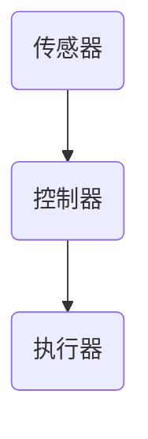

**传感器：** 传感器用于检测和测量环境或生产过程中的各种参数，如温度、湿度、压力、速度等。常见的传感器有温度传感器、湿度传感器、压力传感器、速度传感器等。

**控制器：** 控制器是自动化系统的核心部分，它接收传感器的数据，进行实时处理和决策，然后发送控制信号给执行器。常见的控制器有PLC（可编程逻辑控制器）、DCS（分布式控制系统）、SCADA（监控与数据采集系统）等。

**执行器：** 执行器根据控制器的指令，对生产过程或系统进行控制，如开关、阀门、电机等。执行器的类型和功能取决于具体的应用场景。

#### 3.3 自动化技术在现代工业中的应用

**应用领域：** 自动化技术在现代工业中的应用非常广泛，以下是几个典型的应用领域：

1. **制造行业：** 自动化技术在制造行业中广泛应用，如自动化生产线、自动化检测、自动化装配、自动化物流等。通过自动化技术，企业可以大幅提高生产效率、降低成本、提高产品质量。

2. **交通运输：** 自动化技术在交通运输领域中应用广泛，如无人驾驶汽车、自动驾驶卡车、自动轨道交通系统等。通过自动化技术，可以减少人为因素导致的交通事故，提高交通效率和安全性。

3. **金融服务：** 自动化技术在金融服务领域中应用广泛，如自动化交易、自动化风险管理、自动化客户服务等。通过自动化技术，金融机构可以提高交易效率、降低风险、提供更优质的客户服务。

4. **医疗行业：** 自动化技术在医疗行业中应用广泛，如自动化手术、自动化诊断、自动化药物配送等。通过自动化技术，可以提高医疗服务的效率和质量，减轻医护人员的工作负担。

**案例：** 一个典型的应用案例是汽车制造业。通过自动化技术，汽车制造企业可以实现高度自动化的生产流程，包括自动化装配线、自动化检测、自动化物流等。这些技术不仅提高了生产效率，还保证了产品质量的稳定性。

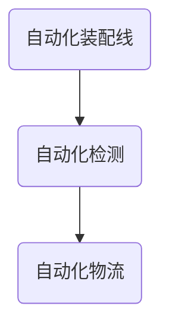

### 第4章：自动化系统的设计与实现

#### 4.1 自动化系统的设计原则

**原则：** 自动化系统的设计原则包括可靠性、可维护性、安全性和灵活性等。

**可靠性：** 自动化系统需要保证在长时间运行中稳定可靠，减少故障率和停机时间。为此，系统设计应考虑冗余设计、故障诊断和恢复机制等。

**可维护性：** 自动化系统应易于维护和升级，以便在需要时进行技术更新和维护。系统设计应考虑模块化设计、标准化接口和文档化等。

**安全性：** 自动化系统需要确保数据和系统的安全性，防止未经授权的访问和数据泄露。系统设计应考虑数据加密、访问控制和安全审计等。

**灵活性：** 自动化系统需要能够适应不同的应用场景和需求变化，具有高度的灵活性和可扩展性。系统设计应考虑模块化设计、可配置性和可重构性等。

**示例：** 图4.1展示了自动化系统设计原则的示意图。

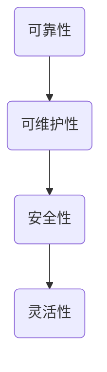

#### 4.2 自动化系统的实现方法

**方法：** 自动化系统的实现方法包括硬件设计、软件编程、系统集成等。

**硬件设计：** 硬件设计包括选择合适的传感器、控制器和执行器等设备，设计系统架构和布线等。硬件设计应考虑设备的兼容性、可靠性和性能等因素。

**软件编程：** 软件编程包括编写控制算法、监控程序、用户界面等。软件编程应考虑编程语言的兼容性、可维护性和扩展性等。

**系统集成：** 系统集成是将各个硬件和软件模块组合在一起，实现系统整体功能。系统集成应考虑系统的兼容性、可扩展性和可靠性等。

**示例：** 图4.2展示了自动化系统实现方法的示意图。

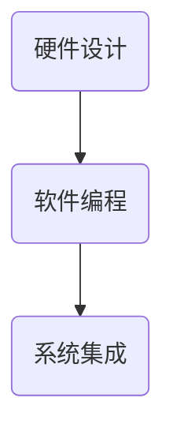

#### 4.3 自动化系统的优化与维护

**优化：** 自动化系统的优化包括性能优化、功能优化等，以提高系统的效率和可靠性。优化方法包括算法优化、硬件升级、软件更新等。

**维护：** 自动化系统的维护包括硬件维护、软件维护等，以确保系统的长期稳定运行。维护方法包括定期检查、故障修复、升级更新等。

**示例：** 图4.3展示了自动化系统优化与维护的示意图。

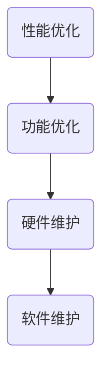

### 第三部分：计算变化与自动化的互动

#### 第5章：计算变化与自动化技术的融合

#### 5.1 计算变化与自动化的融合概念

**概念：** 计算变化与自动化的融合是指在信息技术和自动化技术的交叉领域，通过计算变化技术提高自动化系统的智能化水平。这种融合使得自动化系统不仅能够执行预设的任务，还能够根据实时数据和智能算法进行自适应调整和优化。

**示例：** 图5.1展示了计算变化与自动化的融合概念。

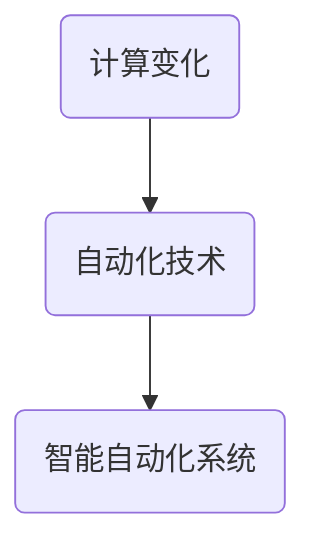

#### 5.2 计算变化在自动化中的应用

**应用：** 计算变化在自动化中的应用主要体现在数据分析和智能决策方面。通过计算变化技术，自动化系统可以实时处理大量数据，提取有价值的信息，并基于这些信息进行智能决策和优化。

**示例：** 图5.2展示了计算变化在自动化中的应用场景。

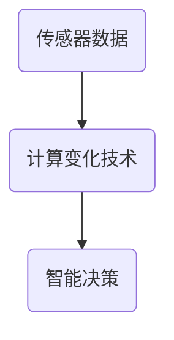

**应用场景：**

1. **智能制造：** 通过计算变化技术，自动化生产线可以实现实时监控、故障预测和优化调度等功能，提高生产效率和产品质量。

2. **智能交通：** 通过计算变化技术，智能交通系统可以实时监控交通流量、预测交通状况，提供最优行驶路线，减少拥堵和交通事故。

3. **智能医疗：** 通过计算变化技术，自动化医疗设备可以实时监测患者生命体征，预测疾病发展，提供个性化的治疗方案。

4. **智能服务：** 通过计算变化技术，智能客服系统可以实时分析客户需求，提供个性化的服务和建议，提高客户满意度。

**案例：** 一个典型的应用案例是智能工厂。通过计算变化技术，智能工厂可以实现实时监控生产设备状态、预测设备故障、优化生产流程等功能。这些功能不仅提高了生产效率和产品质量，还降低了生产成本。

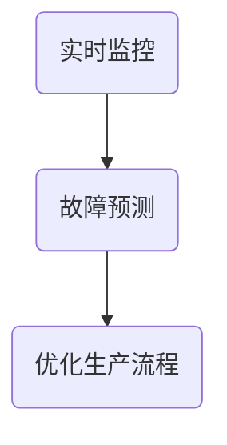

#### 5.3 自动化在计算变化中的应用

**应用：** 自动化技术在计算变化中的应用主要体现在数据采集、处理和传输等方面。通过自动化技术，计算变化系统可以实现高效、可靠的数据采集和处理，确保数据的实时性和准确性。

**示例：** 图5.3展示了自动化在计算变化中的应用场景。

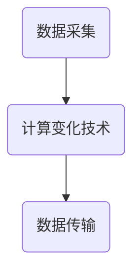

**应用场景：**

1. **大数据处理：** 自动化技术可以用于大规模数据采集和传输，为大数据处理提供基础设施支持。

2. **实时数据分析：** 自动化技术可以实现实时数据采集和处理，为实时决策提供数据支持。

3. **智能监控：** 自动化技术可以用于智能监控系统，实现实时监控和预警功能。

4. **物联网：** 自动化技术在物联网中应用广泛，可以实现设备的远程监控、控制和数据采集。

**案例：** 一个典型的应用案例是智能交通管理系统。通过自动化技术，智能交通管理系统可以实时监控交通流量、道路状况，并提供最优行驶路线。这些功能不仅提高了交通效率，还减少了交通事故。

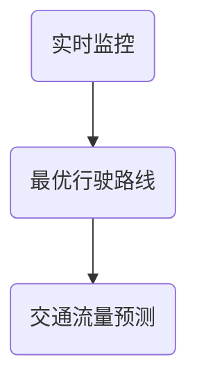

### 第6章：计算变化与自动化技术的挑战与机遇

#### 6.1 计算变化与自动化技术的挑战

**挑战：** 计算变化与自动化技术面临的主要挑战包括数据安全、隐私保护、算法透明度等。

**数据安全：** 在计算变化与自动化技术中，数据的安全至关重要。由于数据在传输和处理过程中可能遭受攻击，因此需要采取有效的安全措施来保护数据。

**隐私保护：** 自动化系统在处理数据时，可能涉及个人隐私信息。如何确保隐私保护，避免数据泄露和滥用，是一个重要的挑战。

**算法透明度：** 随着计算变化与自动化技术的应用，算法的透明度问题日益突出。如何让用户了解算法的决策过程和结果，增加算法的信任度，是一个重要的挑战。

**示例：** 图6.1展示了计算变化与自动化技术的挑战。

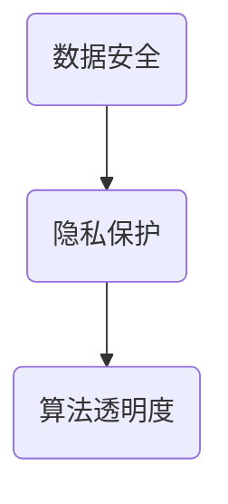

**解决方案：** 为了应对这些挑战，可以采取以下解决方案：

1. **数据加密：** 对传输和存储的数据进行加密，确保数据在传输过程中不被窃取或篡改。

2. **隐私保护技术：** 采用隐私保护技术，如差分隐私、同态加密等，确保在数据处理过程中保护个人隐私。

3. **算法透明度提升：** 增加算法的可解释性，使用可视化工具展示算法的决策过程，提高用户对算法的信任度。

**案例：** 一个典型的解决方案案例是智能交通管理系统。通过数据加密和隐私保护技术，智能交通管理系统可以确保交通数据的传输和存储安全，避免数据泄露和滥用。同时，通过增加算法透明度，用户可以了解交通流量预测的决策过程，提高对系统的信任度。

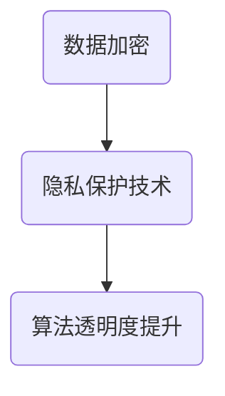

#### 6.2 计算变化与自动化技术的机遇

**机遇：** 计算变化与自动化技术带来的机遇包括智能化升级、产业升级、数字化转型等。

**智能化升级：** 通过计算变化与自动化技术的融合，企业可以实现生产过程和业务的智能化升级，提高生产效率和产品质量。

**产业升级：** 计算变化与自动化技术的应用，可以推动传统产业向智能化、高端化方向发展，促进产业升级和转型。

**数字化转型：** 通过计算变化与自动化技术的应用，企业可以实现业务流程的数字化转型，提高业务效率和服务质量。

**示例：** 图6.2展示了计算变化与自动化技术的机遇。

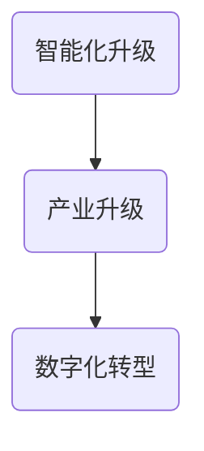

**应用场景：**

1. **智能制造：** 通过计算变化与自动化技术的应用，企业可以实现智能化生产，提高生产效率和产品质量。

2. **智能医疗：** 通过计算变化与自动化技术的应用，医院可以实现智能诊断和治疗，提高医疗服务质量和效率。

3. **智能交通：** 通过计算变化与自动化技术的应用，交通管理部门可以实现智能交通管理，提高交通效率和安全。

4. **智能金融：** 通过计算变化与自动化技术的应用，金融机构可以实现智能风控和欺诈检测，提高金融服务质量和安全性。

**案例：** 一个典型的应用案例是智能制造工厂。通过计算变化与自动化技术的应用，工厂可以实现智能化生产，提高生产效率和产品质量。例如，通过实时监控设备状态、预测设备故障、优化生产流程等功能，工厂可以实现高效生产，降低生产成本。

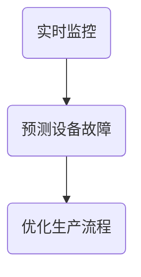

#### 6.3 未来发展趋势预测

**趋势：** 随着计算变化与自动化技术的不断发展，未来发展趋势包括智能化、集成化、网络化等。

**智能化：** 计算变化与自动化技术的融合将推动智能化水平的提升，实现更加智能化的生产、管理和决策。

**集成化：** 计算变化与自动化技术将实现更加紧密的集成，形成一体化解决方案，提高系统的整体性能和效率。

**网络化：** 计算变化与自动化技术将实现更加广泛的应用，通过物联网、云计算等技术，实现设备互联和数据共享。

**示例：** 图6.3展示了未来发展趋势的预测。

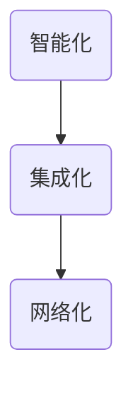

**预测：** 未来，计算变化与自动化技术将在更多领域得到广泛应用，如智慧城市、智能医疗、智能农业等。通过智能化、集成化和网络化的技术发展，将为社会经济发展带来新的动能。

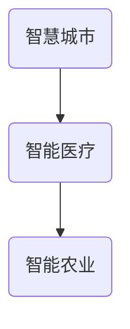

### 第7章：案例分析与应用场景

#### 7.1 案例分析

**案例：** 智能制造是计算变化与自动化技术的重要应用领域之一。下面以一个智能制造案例为例，分析计算变化与自动化技术在其中的应用。

**背景：** 一家汽车制造企业希望通过引入计算变化与自动化技术，提高生产效率和产品质量。

**解决方案：** 该企业引入了以下计算变化与自动化技术：

1. **实时数据采集：** 通过传感器和物联网技术，实时采集生产设备的运行数据，如温度、压力、速度等。
2. **智能监控与故障预测：** 利用计算变化技术，对实时数据进行处理和分析，实现生产设备的智能监控和故障预测。
3. **生产流程优化：** 通过分析生产数据，优化生产流程，提高生产效率。
4. **智能调度：** 根据生产数据和设备状态，实现生产任务的智能调度，提高生产计划的准确性。

**效果：** 通过引入计算变化与自动化技术，该企业实现了以下效果：

1. **提高生产效率：** 生产设备实现了自动化监控和故障预测，减少了设备停机时间，提高了生产效率。
2. **提高产品质量：** 通过实时数据分析和生产流程优化，提高了产品质量的稳定性。
3. **降低生产成本：** 通过智能调度和生产流程优化，降低了生产成本。

**总结：** 智能制造案例表明，计算变化与自动化技术的应用可以显著提高生产效率和产品质量，为企业带来经济效益。

#### 7.2 应用场景分析

**应用场景：** 计算变化与自动化技术在不同领域中的应用场景如下：

1. **智能制造：** 通过计算变化技术实现生产设备的智能监控和故障预测，优化生产流程，提高生产效率和产品质量。
2. **智能交通：** 通过计算变化技术实现交通流量预测、路径规划和交通管理，提高交通效率和安全性。
3. **智能医疗：** 通过计算变化技术实现患者数据的智能分析、疾病预测和个性化治疗，提高医疗服务质量和效率。
4. **智能金融：** 通过计算变化技术实现风险管理和欺诈检测，提高金融服务的质量和安全性。

**分析：** 不同应用场景中，计算变化与自动化技术的作用和效果有所不同。在智能制造中，计算变化技术主要用于生产设备的监控和优化；在智能交通中，计算变化技术主要用于交通流量的预测和管理；在智能医疗中，计算变化技术主要用于患者数据的分析和疾病预测；在智能金融中，计算变化技术主要用于风险管理和欺诈检测。

**总结：** 计算变化与自动化技术在不同应用场景中发挥着重要作用，通过智能化的数据处理和分析，提高了系统的效率和可靠性。

#### 7.3 成功案例总结与启示

**成功案例：** 通过对计算变化与自动化技术的应用案例进行分析，可以总结出以下成功经验：

1. **数据驱动：** 成功的案例都是以数据为基础，通过实时数据采集和分析，实现系统的智能化和优化。
2. **跨领域融合：** 成功的案例往往是跨领域的融合，将计算变化与自动化技术应用于不同领域，实现智能化升级和产业升级。
3. **技术选型：** 技术选型至关重要，要选择适合应用场景的技术和工具，确保系统的可靠性和效率。

**启示：** 这些成功经验为其他企业提供了有益的启示：

1. **数据驱动：** 企业应该重视数据的价值，通过实时数据采集和分析，实现系统的智能化和优化。
2. **跨领域融合：** 企业应该积极探索跨领域的技术应用，通过融合不同领域的技术，实现智能化升级和产业升级。
3. **技术选型：** 企业应该根据应用场景选择合适的技术和工具，确保系统的可靠性和效率。

### 第四部分：未来展望

#### 第8章：计算变化与自动化的未来

**8.1 技术发展趋势**

**趋势：** 随着计算变化与自动化技术的不断发展，未来技术发展趋势如下：

1. **人工智能：** 人工智能（AI）与计算变化与自动化技术的深度融合，将推动智能化水平的提升。
2. **物联网：** 物联网（IoT）技术的发展，将使更多设备和系统实现互联互通，提高系统的整体性能。
3. **大数据：** 大数据的处理和分析能力将不断提高，为计算变化与自动化技术提供强大的数据支持。
4. **边缘计算：** 边缘计算技术的发展，将使计算变化与自动化技术在边缘设备上进行数据处理和分析，提高实时性和响应速度。

**示例：** 图8.1展示了未来技术发展趋势。

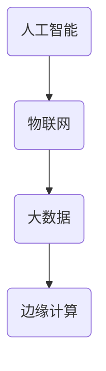

**分析：** 这些技术发展趋势将使计算变化与自动化技术在更多领域得到应用，如智慧城市、智能医疗、智能农业等。通过智能化、边缘化和大数据技术的融合，计算变化与自动化技术将实现更加广泛和深入的应用。

**结论：** 未来，计算变化与自动化技术将在技术发展趋势的推动下，实现更广泛的应用和更深入的发展。

#### 8.2 社会经济影响

**影响：** 计算变化与自动化技术对社会经济的影响如下：

1. **产业升级：** 通过智能化技术的应用，传统产业将实现升级和转型，提高产业附加值和竞争力。
2. **就业结构变化：** 自动化技术的应用将改变就业结构，一方面，一些传统岗位可能被替代；另一方面，新型人才需求将增加，如数据科学家、人工智能工程师等。
3. **经济增长：** 计算变化与自动化技术的应用，将推动经济结构优化和经济增长，为社会发展带来新的动能。

**示例：** 图8.2展示了计算变化与自动化技术对社会经济的影响。

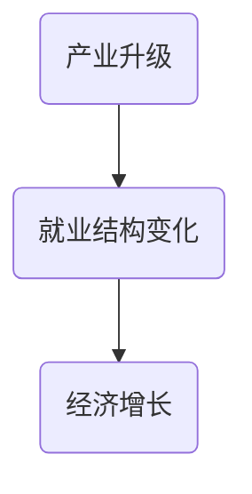

**分析：** 计算变化与自动化技术对社会经济的影响是多方面的，既有利于产业升级和经济增长，也带来就业结构变化和挑战。因此，需要加强人才培养和政策支持，以应对这些变化。

**结论：** 计算变化与自动化技术将对社会经济产生深远影响，为社会经济发展带来新的机遇和挑战。

#### 8.3 未来应用场景预测

**预测：** 未来，计算变化与自动化技术将在以下应用场景中得到广泛应用：

1. **智慧城市：** 通过计算变化与自动化技术，智慧城市将实现智能交通管理、智能能源管理、智能环境监测等功能，提高城市管理和居民生活质量。
2. **智能医疗：** 通过计算变化与自动化技术，智能医疗将实现精准诊断、个性化治疗、远程医疗等功能，提高医疗服务质量和效率。
3. **智能制造：** 通过计算变化与自动化技术，智能制造将实现智能化生产、柔性制造、智能供应链管理等功能，提高生产效率和产品质量。
4. **智能农业：** 通过计算变化与自动化技术，智能农业将实现精准施肥、智能灌溉、病虫害监测等功能，提高农业生产效率和农产品质量。

**示例：** 图8.3展示了未来应用场景的预测。

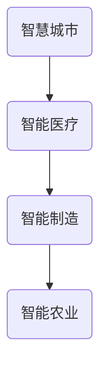

**分析：** 这些应用场景将使计算变化与自动化技术在更多领域得到应用，为社会发展带来新的机遇和挑战。通过智能化、网络化和大数据技术的融合，计算变化与自动化技术将实现更广泛和深入的应用。

**结论：** 未来，计算变化与自动化技术将在多个应用场景中得到广泛应用，为社会发展带来新的机遇和挑战。

### 第9章：计算变化与自动化的教育培养

#### 9.1 教育体系的建设

**建设：** 为了培养计算变化与自动化领域的新型人才，需要建立完善的教育体系。以下是一些建议：

1. **基础教育：** 从基础教育阶段开始，引入计算变化与自动化相关的基础知识，培养学生的逻辑思维和创新能力。
2. **专业教育：** 在高等教育阶段，设置计算变化与自动化专业课程，涵盖数学、计算机科学、控制工程等领域。
3. **实践教育：** 加强实践教育，通过实验室、实习、项目实训等方式，提高学生的实际操作能力和解决复杂问题的能力。

**示例：** 图9.1展示了教育体系建设的一个示意图。

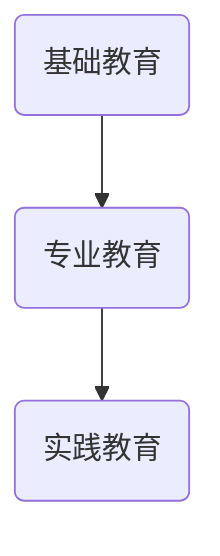

**分析：** 建立完善的教育体系，有助于培养具有扎实理论基础和实际操作能力的新型人才，为计算变化与自动化技术的发展提供人才支持。

**结论：** 教育体系建设是培养计算变化与自动化领域新型人才的关键，需要全社会共同努力。

#### 9.2 培养新型人才的需求

**需求：** 随着计算变化与自动化技术的发展，对新型人才的需求不断增长。以下是一些关键需求：

1. **技术人才：** 需要具备扎实的计算变化与自动化技术基础，能够设计、开发和优化相关系统。
2. **数据科学家：** 需要具备数据分析和处理能力，能够从海量数据中提取有价值的信息。
3. **项目管理人才：** 需要具备项目管理能力，能够协调不同团队的合作，确保项目顺利进行。
4. **跨界人才：** 需要具备跨领域知识，能够将计算变化与自动化技术应用于不同领域，实现技术创新和产业升级。

**示例：** 图9.2展示了培养新型人才的需求。

```mermaid
graph TD
    A(技术人才) --> B(数据科学家)
    B --> C(项目管理人才)
    C --> D(跨界人才)
```

**分析：** 培养新型人才是推动计算变化与自动化技术发展的重要保障，需要从多个层面进行培养和选拔。

**结论：** 需要加大对新型人才的培养力度，以满足计算变化与自动化技术发展的需求。

#### 9.3 培养路径与策略

**路径与策略：** 为了培养计算变化与自动化领域的新型人才，可以采取以下培养路径与策略：

1. **分阶段培养：** 根据学生的基础和兴趣，设置不同的培养阶段，从基础知识到高级技能，逐步提高学生的能力。
2. **校企合作：** 加强与企业的合作，通过实习、项目合作等方式，让学生了解实际工作环境和需求，提高实践能力。
3. **国际化培养：** 加强与国际知名高校和研究机构的合作，开展联合培养、交流项目等，提高学生的国际视野和竞争力。
4. **在线教育与资源共享：** 利用在线教育平台和开放教育资源，为学生提供多样化的学习方式和资源，提高学习效果。

**示例：** 图9.3展示了培养路径与策略的示意图。

```mermaid
graph TD
    A(分阶段培养) --> B(校企合作)
    B --> C(国际化培养)
    C --> D(在线教育与资源共享)
```

**分析：** 通过采取多元化的培养路径与策略，可以更好地培养计算变化与自动化领域的新型人才，满足社会发展的需求。

**结论：** 培养路径与策略的制定和实施，对于培养计算变化与自动化领域的新型人才具有重要意义。

### 附录

#### 附录A：计算变化与自动化相关工具与资源

**概述：** 本附录将介绍计算变化与自动化领域常用的工具与资源，包括软件、硬件、文献等，以帮助读者更好地理解和应用计算变化与自动化技术。

#### A.1 工具概述

**工具：** 计算变化与自动化领域常用的工具包括以下几种：

1. **编程语言：** Python、Java、C++等，用于编写计算变化与自动化系统的算法和控制逻辑。
2. **深度学习框架：** TensorFlow、PyTorch、Keras等，用于构建和训练深度学习模型。
3. **自动化工具：** AutoHotkey、AutoIt、Python的Selenium库等，用于自动化测试和脚本编写。
4. **数据可视化工具：** Matplotlib、Seaborn、Plotly等，用于数据分析和可视化展示。

**示例：** 图A.1展示了计算变化与自动化领域的一些常用工具。

```mermaid
graph TD
    A(Python) --> B(Java)
    B --> C(C++)
    C --> D(TensorFlow)
    D --> E(PyTorch)
    E --> F(Keras)
    F --> G(AutoHotkey)
    G --> H(AutoIt)
    H --> I(Selenium)
    I --> J(Matplotlib)
    J --> K(Seaborn)
    K --> L(Plotly)
```

**分析：** 这些工具在计算变化与自动化技术中发挥着重要作用，能够帮助开发者实现各种功能和应用。

#### A.2 资源介绍

**资源：** 计算变化与自动化领域的相关资源包括以下几种：

1. **研究论文：** 在线学术数据库如IEEE Xplore、ACM Digital Library等，提供大量的研究论文和技术报告。
2. **在线课程：** 网络教育平台如Coursera、edX、Udacity等，提供丰富的计算变化与自动化课程。
3. **开源项目：** GitHub、GitLab等代码托管平台，提供大量的开源代码和项目，供开发者学习和参考。
4. **专业网站：** 各大技术社区和专业网站如CSDN、51CTO等，提供最新的技术资讯和交流平台。

**示例：** 图A.2展示了计算变化与自动化领域的一些重要资源。

```mermaid
graph TD
    A(IEEE Xplore) --> B(ACM Digital Library)
    B --> C(Coursera)
    C --> D(edX)
    D --> E(Udacity)
    E --> F(GitHub)
    F --> G(GitLab)
    G --> H(CSDN)
    H --> I(51CTO)
```

**分析：** 这些资源为计算变化与自动化技术的发展提供了丰富的知识储备和交流平台，有助于开发者提升技能和拓展视野。

#### A.3 使用指南

**指南：** 本附录将提供计算变化与自动化工具与资源的详细使用指南，帮助读者快速上手：

1. **工具使用指南：** 详细介绍各工具的安装、配置和使用方法，包括示例代码和实战案例。
2. **资源使用指南：** 引导读者如何利用在线课程、开源项目和学术数据库等资源进行学习和研究，包括学习路径和建议。
3. **实践项目指南：** 提供一系列实践项目，涵盖计算变化与自动化的各个应用领域，帮助读者将理论知识应用于实际场景。

**示例：** 图A.3展示了使用指南的示例。

```mermaid
graph TD
    A(工具使用指南) --> B(资源使用指南)
    B --> C(实践项目指南)
```

**分析：** 使用指南将帮助读者更好地利用计算变化与自动化工具和资源，提升技能和实践能力。

**结论：** 附录A提供了计算变化与自动化领域的重要工具与资源，以及详细的使用指南，为读者提供了全面的学习和实践支持。

