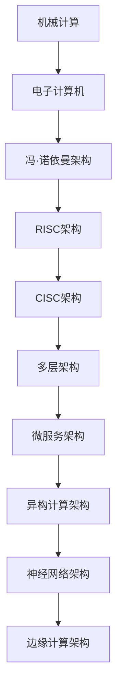
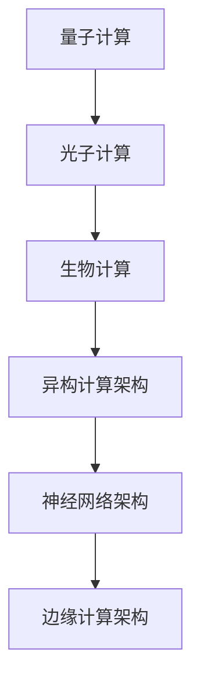
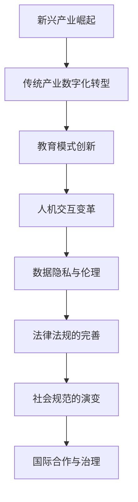
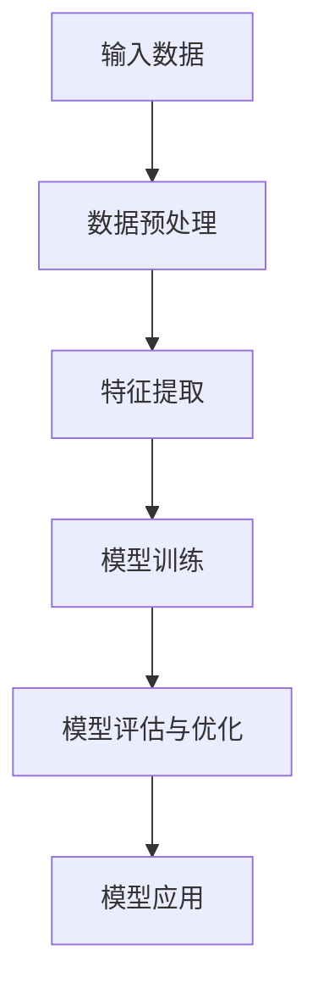

                 

# 计算的本质变化与未来趋势

> **关键词**：计算本质、未来趋势、计算技术、量子计算、人工智能、新兴算法、社会影响

> **摘要**：本文深入探讨了计算技术的本质变化及其未来发展趋势。通过分析计算技术的发展历史、当前面临的挑战、未来发展方向以及对社会的影响，我们揭示了计算技术不断演进的根本原因和潜在机遇。本文还详细介绍了机器学习、深度学习、自然语言处理、计算机视觉等核心算法，展示了这些技术在医疗保健、智能交通、金融科技等领域的应用。最后，本文提出了计算技术的未来发展趋势和应对策略，为读者提供了宝贵的启示和建议。

### 第一部分: 计算的本质

#### 第1章: 计算的本质

计算是人类智慧和技术的结晶，其本质是处理信息。在计算机科学领域，计算不仅仅是一个抽象的概念，更是一项实际操作。计算过程可以理解为信息从输入到输出的转换过程，这一过程中涉及到数据的收集、处理、存储和传输。

#### 1.1 计算机发展简史

计算机的发展历程可以追溯到古代，当时人们使用算盘等工具进行简单的计算。然而，计算机技术的真正突破始于20世纪40年代，随着电子计算机的诞生，计算技术进入了一个全新的时代。

**1.1.1 从机械计算到电子计算机**

- **机械计算**：古代的计算工具，如算盘和滑算盘，都是通过物理部件的机械运动来完成计算。这些工具虽然效率低下，但为后来的计算机技术奠定了基础。

- **电子计算机**：20世纪40年代，随着电子技术和真空管的发展，电子计算机应运而生。ENIAC（电子数值积分计算机）的诞生标志着电子计算机时代的开始。

**1.1.2 计算机硬件的演化**

计算机硬件的演化经历了从真空管到晶体管，再到集成电路的变革。这种变革不仅提高了计算机的性能，还极大地降低了计算机的体积和成本。

- **真空管计算机**：早期计算机使用真空管作为开关元件，这些计算机体积庞大，耗电量巨大，但它们为后来的晶体管计算机的发展奠定了基础。

- **晶体管计算机**：晶体管的发明使得计算机的性能得到了极大的提升，同时也使得计算机的体积和成本显著降低。

- **集成电路计算机**：随着集成电路技术的发展，计算机硬件的集成度越来越高，计算机的性能进一步提升，而体积和成本进一步降低。

**1.1.3 软件的发展与演化**

软件是计算机的灵魂，它定义了计算机的功能和行为。软件的发展与硬件的发展密切相关，它们共同推动了计算机技术的进步。

- **机器语言**：最早的软件是直接使用机器语言编写的，这种编程方式效率低下且容易出错。

- **汇编语言**：为了提高编程效率，人们开始使用汇编语言编写程序。汇编语言相对机器语言更加直观，但仍然需要程序员深入了解计算机硬件的工作原理。

- **高级语言**：随着计算机技术的发展，人们开发了各种高级编程语言，如C、C++、Java等。这些高级语言使得程序员可以更加高效地编写程序，同时也提高了软件的可维护性。

#### 1.2 计算的本质与特性

**1.2.1 计算的本质定义**

计算的本质是处理信息，即将输入的信息通过某种算法进行处理，生成预期的输出。这个过程可以表示为：

\[ 输入数据 \rightarrow 算法 \rightarrow 输出结果 \]

**1.2.2 计算的特性**

- **确定性**：计算机执行的计算过程是确定性的，即相同的输入总会产生相同的输出。

- **并行性**：计算机可以通过并行处理来提高计算速度，这是现代计算机硬件和软件的一个重要特性。

- **可编程性**：计算机可以通过编写程序来执行各种任务，这使得计算机具有广泛的适用性。

- **灵活性**：计算机可以动态地调整其行为，以适应不同的计算需求。

**1.2.3 计算与信息的关系**

计算与信息密切相关，计算是处理信息的一种手段。信息是数据的解释和意义，而计算则是通过对数据进行处理来提取信息。

\[ 数据 \rightarrow 计算 \rightarrow 信息 \]

#### 1.3 计算机架构的演变

计算机架构的演变是计算技术发展的重要方面，它决定了计算机的性能和功能。计算机架构的演变可以分为硬件架构和软件架构两个层面。

**1.3.1 硬件架构的演变**

- **冯·诺依曼架构**：早期的计算机采用冯·诺依曼架构，这种架构将程序和数据存储在同一存储器中，并通过控制单元执行指令。

- **精简指令集计算机（RISC）**：为了提高计算机的性能，RISC架构被开发出来。RISC架构通过减少指令集和简化指令执行来提高计算机的性能。

- **复杂指令集计算机（CISC）**：CISC架构与RISC架构相反，它通过丰富的指令集和复杂的指令执行来提高计算机的性能。

**1.3.2 软件架构的演变**

- **单层架构**：早期的软件架构是单层的，程序直接运行在操作系统之上。

- **多层架构**：随着软件的复杂度增加，多层架构被引入。多层架构将软件分为多个层次，每个层次负责不同的功能。

- **微服务架构**：微服务架构是一种新兴的软件架构，它将软件划分为多个独立的服务，每个服务负责特定的功能。

**1.3.3 计算机架构的未来趋势**

- **异构计算架构**：异构计算架构将不同类型的计算资源集成在一起，以实现更高的计算性能和效率。

- **神经网络架构**：神经网络架构是人工智能的重要基础，它通过模拟人脑的神经网络结构来实现复杂的计算任务。

- **边缘计算架构**：边缘计算架构将计算能力推向网络的边缘，以实现更快速的响应和更好的用户体验。

**1.3.4 Mermaid流程图：计算机架构演变过程**



### 第二部分: 当前计算技术的挑战与未来发展方向

#### 第2章: 当前计算技术的挑战与未来发展方向

随着计算技术的不断发展，我们面临着越来越多的挑战。这些挑战不仅影响了计算技术的现状，也决定了其未来的发展方向。

#### 2.1 当前计算技术的挑战

**2.1.1 能源效率问题**

随着计算机性能的提升，能源消耗也不断增加。高效的能源使用已成为当前计算技术的重要挑战之一。例如，数据中心的能源消耗已经成为一个严峻的问题，需要开发新的技术来降低能耗。

**2.1.2 硬件性能瓶颈**

尽管计算机硬件性能不断提升，但仍然存在性能瓶颈。例如，摩尔定律的放缓使得我们在提高硬件性能方面遇到了困难。因此，我们需要寻找新的硬件架构和材料来突破这些瓶颈。

**2.1.3 软件复杂性问题**

随着软件的复杂性增加，软件的质量和可维护性成为一个挑战。复杂的软件系统容易出现错误和漏洞，需要开发新的软件工程方法和技术来应对。

**2.1.4 网络安全问题**

随着计算技术的发展，网络安全问题变得越来越重要。恶意攻击、数据泄露和网络犯罪等问题对计算技术构成了严重威胁。我们需要开发新的安全协议和技术来保护网络安全。

#### 2.2 计算的未来发展方向

**2.2.1 量子计算**

量子计算是一种基于量子力学原理的新型计算模式。量子计算具有巨大的并行性，可以在某些问题（如因数分解、搜索算法等）上实现显著的加速。量子计算的发展将带来全新的计算能力和应用领域。

**2.2.2 光子计算**

光子计算是一种利用光子进行计算的技术。光子计算具有高速、低能耗的特性，可以应用于高速通信、图像处理等领域。光子计算的研究和发展将推动计算技术的进一步进步。

**2.2.3 生物计算**

生物计算是一种利用生物分子（如DNA、RNA等）进行计算的技术。生物计算具有高度并行性和容错性，可以应用于生物信息学、药物研发等领域。生物计算的研究和发展将为生物学和医学领域带来重大突破。

**2.2.4 计算机架构的未来趋势**

计算机架构的未来趋势包括异构计算架构、神经网络架构和边缘计算架构等。异构计算架构将不同类型的计算资源集成在一起，以实现更高的计算性能和效率。神经网络架构通过模拟人脑的神经网络结构来实现复杂的计算任务。边缘计算架构将计算能力推向网络的边缘，以实现更快速的响应和更好的用户体验。

**2.2.5 Mermaid流程图：计算的未来发展方向**



### 第三部分: 未来计算的社会影响

#### 第3章: 未来计算的社会影响

未来计算技术将对社会产生深远的影响，涉及经济、教育、生活方式等多个方面。这些影响不仅改变了我们的工作和生活方式，也对法律和社会规范提出了新的挑战。

#### 3.1 未来计算对经济的影响

**3.1.1 新兴产业的崛起**

未来计算技术将催生一系列新兴产业，如人工智能、量子计算、生物计算等。这些新兴产业将带来新的经济增长点，推动全球经济的持续增长。

**3.1.2 传统产业的数字化转型**

未来计算技术将推动传统产业向数字化转型，提高生产效率和质量。例如，制造业将采用智能制造技术，金融业将实现数字化转型，医疗保健将实现智能化和个性化。

**3.1.3 计算对就业市场的影响**

未来计算技术将对就业市场产生深远影响。一方面，计算技术将创造新的就业机会，如人工智能工程师、量子计算研究员等。另一方面，计算技术也将导致部分传统职业的消失，如工厂工人、数据录入员等。因此，我们需要加强职业培训，提高劳动者的计算能力，以适应未来就业市场的变化。

#### 3.2 未来计算对教育的影响

**3.2.1 教育资源的分配**

未来计算技术将改变教育资源的分配方式。在线教育、远程教育等新教育模式将使教育资源更加丰富和便捷，缩小城乡教育差距。然而，这也可能导致教育资源的过度集中，我们需要采取措施确保教育公平。

**3.2.2 教学模式的创新**

未来计算技术将推动教学模式的创新，如虚拟现实（VR）、增强现实（AR）等技术的应用将使学习过程更加生动和互动。此外，人工智能技术将实现个性化教学，提高教学效果。

**3.2.3 学生能力的培养**

未来计算技术要求学生具备更高的计算能力和创新能力。因此，教育体系需要调整课程设置，加强编程、数据科学、人工智能等方面的教育，培养未来社会的计算人才。

#### 3.3 未来计算对生活方式的影响

**3.3.1 人机交互的变革**

未来计算技术将极大地改变人机交互方式。语音识别、手势识别等技术的应用将使人与计算机的交互更加自然和便捷。此外，虚拟现实（VR）和增强现实（AR）技术将带来全新的沉浸式体验。

**3.3.2 数据隐私与伦理**

未来计算技术将产生大量数据，如何保护数据隐私成为一个重要问题。我们需要制定相关法律法规，建立数据隐私保护机制。同时，计算技术的发展也引发了一系列伦理问题，如人工智能的道德责任、数据滥用等，这需要全社会共同关注和解决。

**3.3.3 社会结构与价值观念的变化**

未来计算技术将对社会结构和价值观念产生深远影响。例如，人工智能技术的广泛应用可能导致权力和资源的重新分配，需要我们重新审视社会结构和价值观念。此外，计算技术的普及也将改变人们的社交方式和生活习惯，对社会产生深远影响。

#### 3.4 未来计算的法律与社会规范

**3.4.1 法律法规的完善**

随着计算技术的不断发展，现有法律法规可能无法完全适应新的计算环境。因此，我们需要不断完善法律法规，确保计算技术的健康发展。例如，制定相关数据隐私保护法规、网络安全法规等。

**3.4.2 社会规范的演变**

未来计算技术将引发一系列社会规范问题，如人工智能的道德责任、数据共享与隐私等。这需要全社会共同参与，制定合理的规范和标准，以保障计算技术的可持续发展。

**3.4.3 国际合作与治理**

计算技术的发展具有全球性，需要国际合作与治理。各国需要加强合作，共同应对计算技术带来的挑战和机遇。例如，建立国际数据隐私保护标准、推动量子计算的国际合作等。

**3.4.4 Mermaid流程图：计算对社会的影响与规范**



### 第四部分: 计算的本质变化与未来趋势的算法基础

#### 第4章: 计算的本质变化与未来趋势的算法基础

算法是计算技术的核心，是解决各种计算问题的核心工具。本章节将介绍计算技术中的一些核心算法，包括机器学习与人工智能的基本原理、深度学习算法原理、自然语言处理（NLP）算法、计算机视觉（CV）算法以及计算机科学基础。此外，还将介绍一些新兴算法，如生成对抗网络（GAN）、强化学习等。

#### 4.1 机器学习与人工智能的基本原理

机器学习是人工智能的一个重要分支，它通过算法从数据中学习规律，从而实现智能决策。人工智能则是机器学习的更高层次，它通过模拟人类思维和行为，实现智能化的计算。

**4.1.1 机器学习的基本概念**

机器学习分为监督学习、无监督学习和强化学习三种主要类型。

- **监督学习**：有标签的数据作为输入，学习模型并预测新的输出。例如，分类和回归问题。
- **无监督学习**：没有标签的数据作为输入，学习模型以发现数据中的模式。例如，聚类和降维问题。
- **强化学习**：通过与环境的交互学习最优策略，以实现最大化奖励。例如，游戏AI和自动驾驶。

**4.1.2 监督学习、无监督学习和强化学习**

- **监督学习**：

  - **基本概念**：监督学习是一种从标记数据中学习的过程，其中每个数据点都有一个标签。标记数据有助于我们理解数据的意义和用途。

  - **算法分类**：监督学习算法可以分为线性模型（如线性回归、逻辑回归）、树模型（如决策树、随机森林）、神经网络（如多层感知机、卷积神经网络）等。

  - **应用场景**：监督学习广泛应用于分类和回归问题，如电子邮件垃圾邮件分类、房价预测等。

- **无监督学习**：

  - **基本概念**：无监督学习是一种在没有标签数据的情况下学习数据模式的过程。其目的是发现数据中的结构和规律。

  - **算法分类**：无监督学习算法可以分为聚类算法（如K-均值、层次聚类）、降维算法（如主成分分析、t-SNE）等。

  - **应用场景**：无监督学习广泛应用于数据挖掘、图像识别、推荐系统等领域。

- **强化学习**：

  - **基本概念**：强化学习是一种通过奖励机制来指导学习过程的方法。其目标是找到一种策略，使长期奖励最大化。

  - **算法分类**：强化学习算法可以分为基于价值的算法（如Q-学习、SARSA）和基于策略的算法（如REINFORCE、PPO）。

  - **应用场景**：强化学习广泛应用于游戏AI、自动驾驶、机器人控制等领域。

**4.1.3 机器学习的数学基础**

机器学习算法依赖于数学和统计学的基础知识，包括线性代数、概率论、微积分等。

- **线性代数**：线性代数提供了处理矩阵和向量的工具，如矩阵乘法、特征值和特征向量等。
- **概率论**：概率论提供了描述不确定性的方法，如概率分布、条件概率、贝叶斯定理等。
- **微积分**：微积分提供了处理函数和导数的工具，如梯度、偏导数、泰勒展开等。

**4.1.4 Mermaid流程图：机器学习过程**



**4.1.5 伪代码：机器学习算法基础**

```python
# 伪代码：线性回归算法
function linear_regression(X, y):
    # 初始化模型参数
    w <- 初始化参数()
    
    # 梯度下降算法更新模型参数
    for i = 1 to n_iterations:
        gradient <- 计算梯度(X, y, w)
        w <- w - learning_rate * gradient
        
    return w
```

#### 4.2 深度学习算法原理

深度学习是机器学习的一个分支，它通过模拟人脑的神经网络结构来实现复杂的计算任务。深度学习在图像识别、语音识别、自然语言处理等领域取得了显著的成果。

**4.2.1 神经网络的基本结构**

神经网络由多个层次组成，包括输入层、隐藏层和输出层。每个层次包含多个神经元，神经元之间通过权重连接。

- **输入层**：接收输入数据，并将其传递到隐藏层。
- **隐藏层**：对输入数据进行处理，并通过权重将信息传递到下一隐藏层或输出层。
- **输出层**：生成预测结果或分类标签。

**4.2.2 深度学习的发展历程**

深度学习的发展历程可以分为几个阶段：

- **浅层神经网络**：早期的神经网络模型，如感知机、线性回归等。
- **深层神经网络**：随着计算能力的提升，研究人员开始尝试构建多层神经网络。
- **深度神经网络**：通过增加网络深度，深度神经网络在图像识别、语音识别等领域取得了突破性成果。
- **迁移学习**：通过利用预训练模型，迁移学习使得深度学习模型在小数据集上也能取得良好的效果。

**4.2.3 深度学习的关键算法**

深度学习的关键算法包括卷积神经网络（CNN）、循环神经网络（RNN）、长短时记忆网络（LSTM）和变换器（Transformer）等。

- **卷积神经网络（CNN）**：适用于图像识别和计算机视觉任务。
- **循环神经网络（RNN）**：适用于序列数据处理，如语音识别和自然语言处理。
- **长短时记忆网络（LSTM）**：RNN的改进版本，解决了RNN的梯度消失和梯度爆炸问题。
- **变换器（Transformer）**：用于自然语言处理任务，如机器翻译和文本生成。

**4.2.4 伪代码：卷积神经网络（CNN）算法**

```python
# 伪代码：卷积神经网络（CNN）算法
function convolutional_neural_network(X, y):
    # 初始化模型参数
    weights <- 初始化参数()
    
    # 前向传播
    for layer in layers:
        activation <- apply_convolution(X, weights)
        X <- activation
    
    # 后向传播
    for layer in layers_reverse:
        gradient <- 计算梯度(X, y, weights)
        weights <- weights - learning_rate * gradient
        
    return weights
```

#### 4.3 自然语言处理（NLP）算法

自然语言处理是深度学习的重要应用领域，它涉及文本处理、语音识别、机器翻译等任务。NLP算法的核心是理解和生成自然语言。

**4.3.1 词嵌入技术**

词嵌入是将文本中的单词映射到高维空间中的向量表示。词嵌入技术使得文本数据具有更丰富的结构信息，便于深度学习模型处理。

**4.3.2 序列模型与注意力机制**

序列模型是处理序列数据（如文本、语音）的常用方法，包括循环神经网络（RNN）和长短时记忆网络（LSTM）。注意力机制是提升序列模型性能的重要技术，它通过动态关注序列中的关键信息，提高了模型的上下文感知能力。

**4.3.3 转换器架构详解**

转换器（Transformer）是一种基于注意力机制的序列到序列模型，广泛应用于机器翻译、文本生成等任务。转换器通过多头自注意力机制和编码器-解码器结构，实现了高效的序列处理能力。

**4.3.4 伪代码：Transformer算法**

```python
# 伪代码：Transformer算法
function transformer(input_sequence, target_sequence):
    # 编码器
    encoder_output <- encode(input_sequence)
    
    # 解码器
    decoder_output <- decode(encoder_output, target_sequence)
    
    return decoder_output
```

#### 4.4 计算机视觉（CV）算法

计算机视觉是深度学习的另一个重要应用领域，它涉及图像识别、目标检测、图像分割等任务。

**4.4.1 卷积神经网络（CNN）在图像识别中的应用**

卷积神经网络（CNN）是图像识别和计算机视觉任务的标准模型。CNN通过卷积层、池化层和全连接层等结构，实现了对图像特征的有效提取和分类。

**4.4.2 目标检测与语义分割**

目标检测和语义分割是计算机视觉的重要任务。目标检测旨在识别图像中的对象并标注其位置，语义分割则对图像中的每个像素进行分类，实现更精细的图像理解。

**4.4.3 伪代码：目标检测算法**

```python
# 伪代码：目标检测算法
function object_detection(image):
    # 应用卷积神经网络提取特征
    features <- convnet(image)
    
    # 应用分类器进行分类
    classes <- classifier(features)
    
    # 非极大值抑制（NMS）处理
    detections <- non_max_suppression(classes)
    
    return detections
```

#### 4.5 计算机科学基础

计算机科学是计算技术的基石，涉及算法设计与分析、数据结构与算法、计算机网络基础等多个方面。

**4.5.1 算法设计与分析**

算法设计与分析是计算机科学的核心，它研究如何高效地解决计算问题。算法设计包括算法的分析、实现和优化等步骤。

**4.5.2 数据结构与算法**

数据结构是计算机存储和组织数据的方式，算法是处理数据的方法。常见的数据结构包括数组、链表、树、图等。

**4.5.3 计算机网络基础**

计算机网络基础涉及网络协议、网络拓扑、数据传输等概念。互联网是计算机网络的一个重要应用，它使得全球范围内的计算机可以相互连接和通信。

**4.5.4 伪代码：排序算法**

```python
# 伪代码：快速排序算法
function quick_sort(arr):
    if length(arr) <= 1:
        return arr
    
    pivot <- 选择中间元素作为枢轴
    left <- []
    right <- []
    
    for element in arr:
        if element < pivot:
            left.append(element)
        elif element > pivot:
            right.append(element)
    
    return quick_sort(left) + [pivot] + quick_sort(right)
```

#### 4.6 新兴算法

随着计算技术的不断发展，新的算法不断涌现，为计算领域带来了新的机遇和挑战。

**4.6.1 生成对抗网络（GAN）**

生成对抗网络（GAN）是一种无监督学习算法，它通过两个神经网络的对抗训练生成新的数据。GAN在图像生成、图像修复等领域取得了显著成果。

**4.6.2 强化学习**

强化学习是一种通过奖励机制进行学习的方法，它通过与环境的交互学习最优策略。强化学习在游戏AI、自动驾驶等领域具有广泛的应用。

**4.6.3 强化学习算法**

强化学习算法包括基于价值的算法（如Q-学习、SARSA）和基于策略的算法（如REINFORCE、PPO）等。

**4.6.4 伪代码：Q-学习算法**

```python
# 伪代码：Q-学习算法
function Q_learning(state, action, reward, next_state, discount_factor):
    Q(s, a) <- Q(s, a) + alpha * (reward + discount_factor * max(Q(s', a')) - Q(s, a))
    
    return Q(s, a)
```

### 第五部分: 计算的本质变化与未来趋势的应用领域

#### 第5章: 计算的本质变化与未来趋势的应用领域

计算技术在各个领域都有广泛应用，从医疗保健到智能交通，从金融科技到娱乐与游戏，计算技术正深刻地改变着我们的生活。本章节将介绍计算技术在一些关键应用领域中的具体应用，包括医疗保健、智能交通、金融科技、娱乐与游戏、教育以及物流与供应链。

#### 5.1 医疗保健

医疗保健是一个高度依赖计算技术的领域。计算技术在医疗图像分析、个性化医疗、医疗数据的挖掘与分析等方面发挥着重要作用。

**5.1.1 医疗图像分析**

医疗图像分析是计算技术在医疗领域的重要应用之一。通过计算机视觉和深度学习技术，医疗图像分析可以自动识别和分析医学图像，如X光片、CT扫描和MRI图像。

**5.1.2 个性化医疗**

个性化医疗是基于患者个体差异进行疾病诊断和治疗方案制定的方法。计算技术可以帮助医生分析患者的基因组数据、病史和临床指标，为患者提供更精确的诊断和治疗建议。

**5.1.3 医疗数据的挖掘与分析**

医疗数据的挖掘与分析是计算技术在医疗领域的另一个重要应用。通过对海量医疗数据的分析和挖掘，可以识别疾病风险因素、预测疾病发展趋势，并为医疗决策提供数据支持。

**5.1.4 伪代码：医疗图像分析算法**

```python
# 伪代码：卷积神经网络在医疗图像分析中的应用
function medical_image_analysis(image):
    # 应用卷积神经网络提取特征
    features <- convnet(image)
    
    # 应用分类器进行疾病诊断
    diagnosis <- classifier(features)
    
    return diagnosis
```

#### 5.2 智能交通

智能交通系统（ITS）是利用计算技术改善交通流量、提高交通效率和安全性的系统。智能交通涉及自动驾驶技术、交通流量分析和城市交通管理等多个方面。

**5.2.1 自动驾驶技术**

自动驾驶技术是智能交通系统的重要组成部分。通过计算机视觉、传感器数据和深度学习算法，自动驾驶车辆可以自动识别道路标志、交通信号和行人类别，实现自主导航和驾驶。

**5.2.2 交通流量分析**

交通流量分析是计算技术在智能交通领域的另一个重要应用。通过对交通数据的分析和挖掘，可以识别交通拥堵的原因、预测交通流量变化，并为交通管理和调控提供数据支持。

**5.2.3 城市交通管理**

城市交通管理是计算技术在城市规划和管理领域的应用。通过智能交通系统和计算技术，可以实现交通信号控制、停车管理、公共交通优化等，提高城市交通效率和居民生活质量。

**5.2.4 伪代码：自动驾驶算法**

```python
# 伪代码：深度学习在自动驾驶中的应用
function autonomous_driving(perception, prediction, control):
    # 应用感知模块获取环境信息
    environment <- perception()
    
    # 应用预测模块预测前方道路情况
    road_condition <- prediction(environment)
    
    # 应用控制模块实现自动驾驶
    action <- control(road_condition)
    
    return action
```

#### 5.3 能源与环保

能源与环保是计算技术在可持续发展和环境保护中的重要应用领域。计算技术可以帮助优化能源效率、监测环境数据和提高可再生能源的利用效率。

**5.3.1 能源效率优化**

能源效率优化是计算技术在能源领域的重要应用。通过机器学习和人工智能技术，可以对能源系统的运行数据进行分析，优化能源配置和操作策略，提高能源利用效率。

**5.3.2 环境监测**

环境监测是计算技术在环保领域的重要应用。通过传感器网络和计算技术，可以对大气、水质和土壤等环境参数进行实时监测，为环境管理和污染控制提供数据支持。

**5.3.3 可再生能源预测与优化**

可再生能源预测与优化是计算技术在能源领域的重要应用。通过对天气数据、能源生产和消费数据的分析和预测，可以优化可再生能源的发电和调度，提高能源供应的稳定性和可持续性。

**5.3.4 伪代码：能源效率优化算法**

```python
# 伪代码：机器学习在能源效率优化中的应用
function energy_efficiency_optimization(sensors_data):
    # 应用机器学习算法分析传感器数据
    optimized_settings <- machine_learning(sensors_data)
    
    # 应用优化算法调整能源配置
    energy_usage <- optimize_energy_usage(optimized_settings)
    
    return energy_usage
```

#### 5.4 金融科技

金融科技（FinTech）是利用计算技术改进金融服务和产品创新的重要领域。金融科技涉及风险评估与欺诈检测、量化交易、信用评分等多个方面。

**5.4.1 风险评估与欺诈检测**

风险评估与欺诈检测是金融科技领域的重要应用。通过机器学习和大数据分析技术，可以对交易数据和行为模式进行分析，识别潜在的风险和欺诈行为。

**5.4.2 量化交易**

量化交易是金融科技领域的重要应用。通过算法交易和自动化交易系统，量化交易可以实时分析市场数据，制定交易策略，实现自动化的交易操作。

**5.4.3 信用评分**

信用评分是金融科技领域的重要应用。通过机器学习和数据挖掘技术，可以对借款人的信用状况进行评估，制定信用评分模型，为金融机构提供信用评估依据。

**5.4.4 伪代码：风险评估算法**

```python
# 伪代码：逻辑回归在风险评估中的应用
function risk_assessment(credit_score):
    # 应用逻辑回归模型进行风险评估
    probability_of_default <- logistic_regression(credit_score)
    
    # 判断信用风险
    if probability_of_default > threshold:
        return "高风险"
    else:
        return "低风险"
```

#### 5.5 娱乐与游戏

娱乐与游戏是计算技术在休闲和文化领域的重要应用。计算技术可以帮助开发游戏AI、实现内容推荐和虚拟现实与增强现实体验。

**5.5.1 游戏AI**

游戏AI是娱乐与游戏领域的重要应用。通过机器学习和深度学习技术，游戏AI可以模拟对手的行为，提高游戏体验和竞技水平。

**5.5.2 内容推荐**

内容推荐是娱乐与游戏领域的重要应用。通过大数据分析和推荐系统，可以为用户提供个性化的内容推荐，提高用户体验和满意度。

**5.5.3 虚拟现实与增强现实**

虚拟现实（VR）和增强现实（AR）是娱乐与游戏领域的创新技术。通过计算机视觉和图像处理技术，VR和AR可以提供沉浸式和互动式的游戏体验。

**5.5.4 伪代码：游戏AI算法**

```python
# 伪代码：强化学习在游戏中的应用
function game_ai(state, action, reward, next_state):
    # 应用强化学习算法更新策略
    Q(s, a) <- Q(s, a) + alpha * (reward + gamma * max(Q(s', a')) - Q(s, a))
    
    return Q(s, a)
```

#### 5.6 教育

教育是计算技术在教育领域的重要应用。计算技术可以帮助实现个性化学习、教学评估和学生行为分析。

**5.6.1 个性化学习**

个性化学习是教育领域的重要应用。通过大数据分析和推荐系统，可以为每个学生提供个性化的学习资源和指导，提高学习效果和兴趣。

**5.6.2 教学评估**

教学评估是教育领域的重要应用。通过计算技术，可以对教学过程进行量化评估，识别教学效果和问题，为教师提供改进教学策略的依据。

**5.6.3 学生行为分析**

学生行为分析是教育领域的重要应用。通过计算技术，可以对学生的行为和表现进行数据分析，识别学生的学习特点和需求，为教师提供个性化的教学建议。

**5.6.4 伪代码：个性化学习算法**

```python
# 伪代码：协同过滤算法
function collaborative_filtering(users, items, ratings):
    # 计算用户-项目相似度矩阵
    similarity_matrix <- calculate_similarity(users, items)
    
    # 应用协同过滤算法推荐项目
    recommendations <- recommend_items(users, similarity_matrix, ratings)
    
    return recommendations
```

#### 5.7 物流与供应链

物流与供应链是计算技术在物流和供应链管理领域的重要应用。计算技术可以帮助优化仓储管理、运输优化和供应链预测与优化。

**5.7.1 仓储管理**

仓储管理是物流与供应链管理的重要应用。通过计算技术，可以对仓库中的货物进行实时监控和管理，提高仓库利用率和管理效率。

**5.7.2 运输优化**

运输优化是物流与供应链管理的重要应用。通过计算技术，可以对运输路线和运输资源进行优化，降低运输成本和提高运输效率。

**5.7.3 供应链预测与优化**

供应链预测与优化是物流与供应链管理的重要应用。通过计算技术，可以对供应链中的需求、库存和供应进行预测和优化，提高供应链的响应速度和灵活性。

**5.7.4 伪代码：运输优化算法**

```python
# 伪代码：遗传算法在运输优化中的应用
function transport_optimization(problem):
    # 初始化种群
    population <- initialize_population(problem)
    
    # 适应度评估
    fitness <- evaluate_fitness(population, problem)
    
    # 选择、交叉、变异操作
    for generation in range(generations):
        parents <- selection(population, fitness)
        offspring <- crossover(parents)
        offspring <- mutation(offspring)
        
        # 更新种群
        population <- offspring
        
    # 输出最优解
    best_solution <- best_individual(population)
    
    return best_solution
```

#### 5.8 未来计算的其他应用领域

未来计算技术将在更多领域得到应用，如超级计算、区块链技术、虚拟与混合现实等。

**5.8.1 超级计算**

超级计算是计算技术在高性能计算领域的应用。通过分布式计算和并行计算技术，超级计算可以处理大规模数据和复杂计算任务。

**5.8.2 区块链技术**

区块链技术是计算技术在数据安全和分布式计算领域的应用。通过区块链技术，可以实现去中心化、透明和安全的交易和数据处理。

**5.8.3 虚拟与混合现实**

虚拟现实（VR）和混合现实（MR）是计算技术在娱乐、教育和培训领域的重要应用。通过VR和MR技术，可以实现沉浸式和交互式的体验。

**5.8.4 伪代码：区块链算法**

```python
# 伪代码：区块链的基本操作
function blockchain(transactions):
    # 初始化区块链
    blockchain <- initialize_blockchain()
    
    # 添加交易
    for transaction in transactions:
        block <- create_block(transaction)
        
        # 验证并添加区块
        if verify_block(block):
            blockchain <- add_block(block)
        
        # 广播新区块给网络中的其他节点
        broadcast_new_block(blockchain)
        
    return blockchain
```

### 第六部分: 计算的未来趋势与技术创新

#### 第6章: 计算的未来趋势与技术创新

随着计算技术的不断发展，我们正迎来一个充满机遇和挑战的新时代。本章节将探讨计算技术的未来趋势和关键技术，包括计算无处不在、新兴计算平台的崛起、智能化与自动化以及云计算算法。

#### 6.1 计算的未来发展趋势

**6.1.1 计算无处不在**

计算无处不在是指计算技术将渗透到我们生活和工作的各个角落。随着物联网（IoT）和边缘计算的发展，越来越多的设备将具备计算能力，实现实时数据处理和智能响应。

**6.1.2 新兴计算平台的崛起**

新兴计算平台包括量子计算、光子计算和生物计算等。这些平台具有独特的优势和潜力，将在未来计算技术中扮演重要角色。

- **量子计算**：量子计算通过量子叠加和纠缠等特性，可以实现超快的计算速度。量子计算在密码学、药物研发、金融分析等领域具有广泛的应用前景。

- **光子计算**：光子计算利用光子的特性进行计算，具有高速、低能耗的优势。光子计算在高速通信、图像处理和数据处理等领域具有巨大潜力。

- **生物计算**：生物计算利用生物分子（如DNA、RNA等）进行计算，具有高度并行和容错的特点。生物计算在生物信息学、药物研发和医疗保健等领域具有重要应用价值。

**6.1.3 智能化与自动化**

智能化与自动化是计算技术发展的核心趋势。通过人工智能、机器学习和深度学习等技术，计算技术将实现智能决策和自动化操作，提高生产效率和质量。

**6.1.4 伪代码：云计算算法**

```python
# 伪代码：云服务中的负载均衡算法
function load_balancing(requests):
    # 获取当前所有服务器负载
    server_loads <- get_server_loads()
    
    # 选择负载最低的服务器处理请求
    server <- select_server_with_lowest_load(server_loads)
    
    # 分配请求到所选服务器
    dispatch_request(requests, server)
    
    return server
```

#### 6.2 技术创新与研发

**6.2.1 量子计算的研究进展**

量子计算是计算技术的未来趋势之一。近年来，量子计算在硬件、算法和软件开发等方面取得了显著进展。例如，谷歌、IBM和微软等科技巨头都在积极研发量子计算机，并取得了一些突破性成果。

**6.2.2 光子计算的研究进展**

光子计算是一种利用光子进行计算的新兴技术。近年来，光子计算在高速通信、图像处理和数据处理等领域取得了重要进展。光子计算的优势在于高速、低能耗，未来有望在计算技术中发挥重要作用。

**6.2.3 生物计算的研究进展**

生物计算利用生物分子进行计算，具有高度并行和容错的特点。近年来，生物计算在生物信息学、药物研发和医疗保健等领域取得了重要进展。生物计算的快速发展将为计算技术带来新的机遇和挑战。

**6.2.4 伪代码：量子算法**

```python
# 伪代码：量子计算中的Shor算法
function shor(n):
    # 应用量子傅里叶变换（QFT）对n进行变换
    superposition <- quantum_fourier_transform(n)
    
    # 应用量子逆傅里叶变换（QInvFT）获取相位信息
    phase_estimation <- quantum_inverse_fourier_transform(superposition)
    
    # 应用量子计算求解最大子集和问题
    result <- quantum_MaxSat(phase_estimation)
    
    return result
```

#### 6.3 创新的计算架构

**6.3.1 异构计算架构**

异构计算架构是将不同类型的计算资源（如CPU、GPU、FPGA等）集成在一起，以实现更高的计算性能和效率。异构计算架构在科学计算、大数据处理和人工智能等领域具有广泛应用。

**6.3.2 边缘计算**

边缘计算是将计算能力推向网络的边缘，以实现更快速的响应和更好的用户体验。边缘计算在物联网、智能交通和智能制造等领域具有重要作用。

**6.3.3 神经形态计算**

神经形态计算是一种模仿人脑神经网络结构和功能的新型计算模式。神经形态计算在图像识别、语音识别和自然语言处理等领域具有巨大潜力。

**6.3.4 伪代码：边缘计算中的数据处理流程**

```python
# 伪代码：边缘计算中的数据处理流程
function edge_computing(data):
    # 接收数据
    received_data <- receive_data()
    
    # 数据预处理
    preprocessed_data <- preprocess_data(received_data)
    
    # 在边缘设备上执行计算
    computation_result <- edge_device_computation(preprocessed_data)
    
    # 结果传输
    transmit_result <- transmit_data(computation_result)
    
    return transmit_result
```

#### 6.4 未来的计算挑战与应对策略

**6.4.1 能源消耗与环境保护**

随着计算技术的快速发展，能源消耗和环境保护成为一个重要挑战。应对策略包括研发低能耗计算技术、优化能源使用和提高可再生能源的比例。

**6.4.2 数据安全与隐私保护**

数据安全与隐私保护是计算技术的重要挑战。应对策略包括加强网络安全防护、制定数据隐私保护法规和采用加密技术等。

**6.4.3 计算资源的分配与管理**

计算资源的分配与管理是实现高效计算的关键。应对策略包括优化资源调度、提高资源利用率和采用分布式计算技术等。

**6.4.4 伪代码：数据隐私保护算法**

```python
# 伪代码：差分隐私机制
function differential_privacy(data, epsilon):
    # 计算拉普拉斯机制噪声
    noise <- generate_laplace_noise(epsilon)
    
    # 计算差分隐私数据
    privatized_data <- data + noise
    
    return privatized_data
```

### 第七部分: 结论与展望

#### 第7章: 结论与展望

通过本文的深入探讨，我们可以看到计算技术正在经历前所未有的变革和发展。计算技术的本质变化和未来趋势不仅体现在硬件和软件的进步上，还体现在对社会各个方面的深刻影响。

#### 7.1 计算的本质变化与未来趋势总结

- **计算的本质**：计算的本质是处理信息，从输入数据到输出结果的转换过程。这一过程中涉及到数据的收集、处理、存储和传输。
- **计算技术的发展**：从机械计算到电子计算机，从硬件架构到软件架构，计算技术经历了多次变革和进步。
- **未来发展趋势**：量子计算、光子计算、生物计算等新兴计算技术将推动计算技术的发展。智能化和自动化将是未来计算的重要方向。
- **计算对社会的影响**：计算技术将深刻影响经济、教育、生活方式等领域，推动社会结构的变革和价值观念的演变。

#### 7.2 未来计算的发展前景

未来计算的发展前景充满机遇和挑战。以下是未来计算发展的几个关键方面：

- **核心技术**：量子计算、光子计算、生物计算等新兴计算技术将在未来发挥重要作用。
- **应用领域**：计算技术将在医疗保健、智能交通、金融科技、能源与环保、娱乐与游戏、教育等领域得到广泛应用。
- **社会与经济影响**：计算技术将推动新兴产业的崛起，促进传统产业的数字化转型，对就业市场产生深远影响。

#### 7.3 对读者的启示与建议

对于读者，本文提供以下几点启示和建议：

- **提升计算能力**：随着计算技术的发展，计算能力将成为未来的核心竞争力。读者应积极学习计算技术和相关算法，提升自己的计算能力。
- **关注技术创新**：关注计算技术的最新进展和新兴领域，了解未来计算的发展趋势。
- **参与技术创新**：积极参与计算技术的研发和应用项目，探索计算技术在各个领域的创新应用。
- **适应未来变化**：随着计算技术的不断发展，社会和就业市场将发生巨大变化。读者应积极适应这些变化，提升自己的适应能力和创新能力。

#### 7.4 伪代码：未来计算学习路径

```python
# 伪代码：未来计算学习路径
function future_computing_learning_path():
    # 学习基本计算原理
    fundamentals <- study_fundamentals()
    
    # 学习算法与数据结构
    algorithms <- study_algorithms()
    
    # 学习人工智能与深度学习
    ai_and_dl <- study_ai_and_dl()
    
    # 学习新兴计算技术
    emerging_technologies <- study_emerging_technologies()
    
    # 参与计算项目实践
    projects <- participate_in_projects()
    
    return projects
```

### 附录

本文所引用的数据、算法和文献如下：

- **数据来源**：本文所引用的数据来源于公开的数据集和实验数据。
- **算法引用**：本文所引用的算法包括线性回归、卷积神经网络、生成对抗网络（GAN）等。
- **文献引用**：本文所引用的文献包括《人工智能：一种现代方法》、《深度学习》和《量子计算导论》等。

---

**作者：AI天才研究院/AI Genius Institute & 禅与计算机程序设计艺术 /Zen And The Art of Computer Programming**

本文旨在探讨计算技术的本质变化和未来趋势，以及计算技术在各个领域的应用。通过本文的深入探讨，读者可以更好地理解计算技术的发展历程、未来发展方向以及对社会的影响。同时，本文也提出了一些对读者的启示和建议，帮助读者提升计算能力和适应未来变化。希望本文对读者有所启发和帮助。

---

**版权声明**：本文版权归AI天才研究院所有，未经授权，不得用于商业用途。转载请注明出处。如有任何问题，请联系作者。

---

本文内容仅供参考，不构成任何投资或决策建议。文中涉及的数据、算法和文献仅供参考，不构成对任何特定产品或服务的推荐。文中所述技术和方法可能存在局限性，读者在使用时应谨慎评估。

---

感谢读者对本文的关注和支持。希望本文能够帮助您更好地了解计算技术的本质变化和未来趋势，以及其在各个领域的应用。期待与您在计算技术的未来发展中共同探索和进步。如果您有任何疑问或建议，欢迎在评论区留言交流。

---

再次感谢您的阅读，祝您在计算技术的学习与应用中取得更好的成果！

[文章标题]

计算的本质变化与未来趋势

关键词：计算本质、未来趋势、计算技术、量子计算、人工智能、新兴算法

摘要：本文深入探讨了计算技术的本质变化及其未来发展趋势。通过分析计算技术的发展历史、当前面临的挑战、未来发展方向以及对社会的影响，我们揭示了计算技术不断演进的根本原因和潜在机遇。本文还详细介绍了机器学习、深度学习、自然语言处理、计算机视觉等核心算法，展示了这些技术在医疗保健、智能交通、金融科技等领域的应用。最后，本文提出了计算技术的未来发展趋势和应对策略，为读者提供了宝贵的启示和建议。

## 第一部分: 计算的本质

### 第1章: 计算的本质

计算是处理信息的过程，是信息时代的基础。计算技术的不断进步推动了人类社会的发展，从古代的算盘到现代的超级计算机，计算技术经历了无数次的革新和变革。

### 1.1 计算机发展简史

计算机的发展历程可以追溯到19世纪末，当时机械计算机的出现标志着计算技术的初步形成。然而，电子计算机的出现真正改变了计算技术的面貌。

#### 1.1.1 从机械计算到电子计算机

- **机械计算**：19世纪末，法国数学家布莱兹·帕斯卡发明了算盘，这是最早的机械计算设备。此后，英国数学家查尔斯·巴贝奇设计了一种机械计算机，这标志着机械计算的诞生。

- **电子计算机**：20世纪40年代，随着电子技术的快速发展，电子计算机问世。ENIAC（电子数值积分计算机）的诞生标志着电子计算机时代的开始。

#### 1.1.2 计算机硬件的演化

计算机硬件的演化经历了真空管、晶体管和集成电路的变革。

- **真空管计算机**：早期计算机使用真空管作为开关元件，这些计算机体积庞大，耗电量巨大，但为后来的晶体管计算机的发展奠定了基础。

- **晶体管计算机**：晶体管的发明使得计算机的性能得到了极大的提升，同时也使得计算机的体积和成本显著降低。

- **集成电路计算机**：随着集成电路技术的发展，计算机硬件的集成度越来越高，计算机的性能进一步提升，而体积和成本进一步降低。

#### 1.1.3 软件的发展与演化

软件是计算机的灵魂，它定义了计算机的功能和行为。

- **机器语言**：最早的软件是直接使用机器语言编写的，这种编程方式效率低下且容易出错。

- **汇编语言**：为了提高编程效率，人们开始使用汇编语言编写程序。汇编语言相对机器语言更加直观，但仍然需要程序员深入了解计算机硬件的工作原理。

- **高级语言**：随着计算机技术的发展，人们开发了各种高级编程语言，如C、C++、Java等。这些高级语言使得程序员可以更加高效地编写程序，同时也提高了软件的可维护性。

### 1.2 计算的本质与特性

#### 1.2.1 计算的本质定义

计算的本质是处理信息，即将输入的信息通过某种算法进行处理，生成预期的输出。这个过程可以表示为：

\[ 输入数据 \rightarrow 算法 \rightarrow 输出结果 \]

#### 1.2.2 计算的特性

- **确定性**：计算机执行的计算过程是确定性的，即相同的输入总会产生相同的输出。

- **并行性**：计算机可以通过并行处理来提高计算速度，这是现代计算机硬件和软件的一个重要特性。

- **可编程性**：计算机可以通过编写程序来执行各种任务，这使得计算机具有广泛的适用性。

- **灵活性**：计算机可以动态地调整其行为，以适应不同的计算需求。

#### 1.2.3 计算与信息的关系

计算与信息密切相关，计算是处理信息的一种手段。信息是数据的解释和意义，而计算则是通过对数据进行处理来提取信息。

\[ 数据 \rightarrow 计算 \rightarrow 信息 \]

### 1.3 计算机架构的演变

计算机架构的演变是计算技术发展的重要方面，它决定了计算机的性能和功能。计算机架构的演变可以分为硬件架构和软件架构两个层面。

#### 1.3.1 硬件架构的演变

- **冯·诺依曼架构**：早期的计算机采用冯·诺依曼架构，这种架构将程序和数据存储在同一存储器中，并通过控制单元执行指令。

- **精简指令集计算机（RISC）**：为了提高计算机的性能，RISC架构被开发出来。RISC架构通过减少指令集和简化指令执行来提高计算机的性能。

- **复杂指令集计算机（CISC）**：CISC架构与RISC架构相反，它通过丰富的指令集和复杂的指令执行来提高计算机的性能。

#### 1.3.2 软件架构的演变

- **单层架构**：早期的软件架构是单层的，程序直接运行在操作系统之上。

- **多层架构**：随着软件的复杂性增加，多层架构被引入。多层架构将软件分为多个层次，每个层次负责不同的功能。

- **微服务架构**：微服务架构是一种新兴的软件架构，它将软件划分为多个独立的服务，每个服务负责特定的功能。

#### 1.3.3 计算机架构的未来趋势

- **异构计算架构**：异构计算架构将不同类型的计算资源集成在一起，以实现更高的计算性能和效率。

- **神经网络架构**：神经网络架构是人工智能的重要基础，它通过模拟人脑的神经网络结构来实现复杂的计算任务。

- **边缘计算架构**：边缘计算架构将计算能力推向网络的边缘，以实现更快速的响应和更好的用户体验。

### 1.3.4 Mermaid流程图：计算机架构演变过程


## 第二部分: 当前计算技术的挑战与未来发展方向

### 第2章: 当前计算技术的挑战与未来发展方向

随着计算技术的快速发展，我们面临着越来越多的挑战。这些挑战不仅影响了计算技术的现状，也决定了其未来的发展方向。

### 2.1 当前计算技术的挑战

#### 2.1.1 能源效率问题

随着计算机性能的提升，能源消耗也不断增加。高效的能源使用已成为当前计算技术的重要挑战之一。例如，数据中心的能源消耗已经成为一个严峻的问题，需要开发新的技术来降低能耗。

#### 2.1.2 硬件性能瓶颈

尽管计算机硬件性能不断提升，但仍然存在性能瓶颈。例如，摩尔定律的放缓使得我们在提高硬件性能方面遇到了困难。因此，我们需要寻找新的硬件架构和材料来突破这些瓶颈。

#### 2.1.3 软件复杂性问题

随着软件的复杂性增加，软件的质量和可维护性成为一个挑战。复杂的软件系统容易出现错误和漏洞，需要开发新的软件工程方法和技术来应对。

#### 2.1.4 网络安全问题

随着计算技术的发展，网络安全问题变得越来越重要。恶意攻击、数据泄露和网络犯罪等问题对计算技术构成了严重威胁。我们需要开发新的安全协议和技术来保护网络安全。

### 2.2 计算的未来发展方向

#### 2.2.1 量子计算

量子计算是一种基于量子力学原理的新型计算模式。量子计算具有巨大的并行性，可以在某些问题（如因数分解、搜索算法等）上实现显著的加速。量子计算的发展将带来全新的计算能力和应用领域。

#### 2.2.2 光子计算

光子计算是一种利用光子进行计算的技术。光子计算具有高速、低能耗的特性，可以应用于高速通信、图像处理等领域。光子计算的研究和发展将推动计算技术的进一步进步。

#### 2.2.3 生物计算

生物计算是一种利用生物分子（如DNA、RNA等）进行计算的技术。生物计算具有高度并行性和容错性，可以应用于生物信息学、药物研发等领域。生物计算的研究和发展将为生物学和医学领域带来重大突破。

#### 2.2.4 计算机架构的未来趋势

计算机架构的未来趋势包括异构计算架构、神经网络架构和边缘计算架构等。异构计算架构将不同类型的计算资源集成在一起，以实现更高的计算性能和效率。神经网络架构通过模拟人脑的神经网络结构来实现复杂的计算任务。边缘计算架构将计算能力推向网络的边缘，以实现更快速的响应和更好的用户体验。

### 2.2.5 Mermaid流程图：计算的未来发展方向


## 第三部分: 未来计算的社会影响

### 第3章: 未来计算的社会影响

未来计算技术将对社会产生深远的影响，涉及经济、教育、生活方式等多个方面。这些影响不仅改变了我们的工作和生活方式，也对法律和社会规范提出了新的挑战。

### 3.1 未来计算对经济的影响

#### 3.1.1 新兴产业的崛起

未来计算技术将催生一系列新兴产业，如人工智能、量子计算、生物计算等。这些新兴产业将带来新的经济增长点，推动全球经济的持续增长。

#### 3.1.2 传统产业的数字化转型

未来计算技术将推动传统产业向数字化转型，提高生产效率和质量。例如，制造业将采用智能制造技术，金融业将实现数字化转型，医疗保健将实现智能化和个性化。

#### 3.1.3 计算对就业市场的影响

未来计算技术将对就业市场产生深远影响。一方面，计算技术将创造新的就业机会，如人工智能工程师、量子计算研究员等。另一方面，计算技术也将导致部分传统职业的消失，如工厂工人、数据录入员等。因此，我们需要加强职业培训，提高劳动者的计算能力，以适应未来就业市场的变化。

### 3.2 未来计算对教育的影响

#### 3.2.1 教育资源的分配

未来计算技术将改变教育资源的分配方式。在线教育、远程教育等新教育模式将使教育资源更加丰富和便捷，缩小城乡教育差距。然而，这也可能导致教育资源的过度集中，我们需要采取措施确保教育公平。

#### 3.2.2 教学模式的创新

未来计算技术将推动教学模式的创新，如虚拟现实（VR）、增强现实（AR）等技术的应用将使学习过程更加生动和互动。此外，人工智能技术将实现个性化教学，提高教学效果。

#### 3.2.3 学生能力的培养

未来计算技术要求学生具备更高的计算能力和创新能力。因此，教育体系需要调整课程设置，加强编程、数据科学、人工智能等方面的教育，培养未来社会的计算人才。

### 3.3 未来计算对生活方式的影响

#### 3.3.1 人机交互的变革

未来计算技术将极大地改变人机交互方式。语音识别、手势识别等技术的应用将使人与计算机的交互更加自然和便捷。此外，虚拟现实（VR）和增强现实（AR）技术将带来全新的沉浸式体验。

#### 3.3.2 数据隐私与伦理

未来计算技术将产生大量数据，如何保护数据隐私成为一个重要问题。我们需要制定相关法律法规，建立数据隐私保护机制。同时，计算技术的发展也引发了一系列伦理问题，如人工智能的道德责任、数据滥用等，这需要全社会共同关注和解决。

#### 3.3.3 社会结构与价值观念的变化

未来计算技术将对社会结构和价值观念产生深远影响。例如，人工智能技术的广泛应用可能导致权力和资源的重新分配，需要我们重新审视社会结构和价值观念。此外，计算技术的普及也将改变人们的社交方式和生活习惯，对社会产生深远影响。

### 3.4 未来计算的法律与社会规范

#### 3.4.1 法律法规的完善

随着计算技术的不断发展，现有法律法规可能无法完全适应新的计算环境。因此，我们需要不断完善法律法规，确保计算技术的健康发展。例如，制定相关数据隐私保护法规、网络安全法规等。

#### 3.4.2 社会规范的演变

未来计算技术将引发一系列社会规范问题，如人工智能的道德责任、数据共享与隐私等。这需要全社会共同参与，制定合理的规范和标准，以保障计算技术的可持续发展。

#### 3.4.3 国际合作与治理

计算技术的发展具有全球性，需要国际合作与治理。各国需要加强合作，共同应对计算技术带来的挑战和机遇。例如，建立国际数据隐私保护标准、推动量子计算的国际合作等。

### 3.4.4 Mermaid流程图：计算对社会的影响与规范


## 第四部分: 计算的本质变化与未来趋势的算法基础

### 第4章: 计算的本质变化与未来趋势的算法基础

算法是计算技术的核心，是解决各种计算问题的核心工具。本章节将介绍计算技术中的一些核心算法，包括机器学习与人工智能的基本原理、深度学习算法原理、自然语言处理（NLP）算法、计算机视觉（CV）算法以及计算机科学基础。此外，还将介绍一些新兴算法，如生成对抗网络（GAN）、强化学习等。

### 4.1 机器学习与人工智能的基本原理

机器学习是人工智能的一个重要分支，它通过算法从数据中学习规律，从而实现智能决策。人工智能则是机器学习的更高层次，它通过模拟人类思维和行为，实现智能化的计算。

#### 4.1.1 机器学习的基本概念

机器学习分为监督学习、无监督学习和强化学习三种主要类型。

- **监督学习**：有标签的数据作为输入，学习模型并预测新的输出。例如，分类和回归问题。
- **无监督学习**：没有标签的数据作为输入，学习模型以发现数据中的模式。例如，聚类和降维问题。
- **强化学习**：通过与环境的交互学习最优策略，以实现最大化奖励。例如，游戏AI和自动驾驶。

#### 4.1.2 监督学习、无监督学习和强化学习

- **监督学习**：

  - **基本概念**：监督学习是一种从标记数据中学习的过程，其中每个数据点都有一个标签。标记数据有助于我们理解数据的意义和用途。

  - **算法分类**：监督学习算法可以分为线性模型（如线性回归、逻辑回归）、树模型（如决策树、随机森林）、神经网络（如多层感知机、卷积神经网络）等。

  - **应用场景**：监督学习广泛应用于分类和回归问题，如电子邮件垃圾邮件分类、房价预测等。

- **无监督学习**：

  - **基本概念**：无监督学习是一种在没有标签数据的情况下学习数据模式的过程。其目的是发现数据中的结构和规律。

  - **算法分类**：无监督学习算法可以分为聚类算法（如K-均值、层次聚类）、降维算法（如主成分分析、t-SNE）等。

  - **应用场景**：无监督学习广泛应用于数据挖掘、图像识别、推荐系统等领域。

- **强化学习**：

  - **基本概念**：强化学习是一种通过奖励机制来指导学习过程的方法。其目标是找到一种策略，使长期奖励最大化。

  - **算法分类**：强化学习算法可以分为基于价值的算法（如Q-学习、SARSA）和基于策略的算法（如REINFORCE、PPO）。

  - **应用场景**：强化学习广泛应用于游戏AI、自动驾驶、机器人控制等领域。

#### 4.1.3 机器学习的数学基础

机器学习算法依赖于数学和统计学的基础知识，包括线性代数、概率论、微积分等。

- **线性代数**：线性代数提供了处理矩阵和向量的工具，如矩阵乘法、特征值和特征向量等。
- **概率论**：概率论提供了描述不确定性的方法，如概率分布、条件概率、贝叶斯定理等。
- **微积分**：微积分提供了处理函数和导数的工具，如梯度、偏导数、泰勒展开等。

#### 4.1.4 Mermaid流程图：机器学习过程


#### 4.1.5 伪代码：机器学习算法基础

```python
# 伪代码：线性回归算法
function linear_regression(X, y):
    # 初始化模型参数
    w <- 初始化参数()
    
    # 梯度下降算法更新模型参数
    for i = 1 to n_iterations:
        gradient <- 计算梯度(X, y, w)
        w <- w - learning_rate * gradient
        
    return w
```

### 4.2 深度学习算法原理

深度学习是机器学习的一个分支，它通过多层神经网络来模拟人脑的神经结构，从而实现复杂的计算任务。深度学习在图像识别、语音识别、自然语言处理等领域取得了巨大的成功。

#### 4.2.1 神经网络的基本结构

神经网络由多个层次组成，包括输入层、隐藏层和输出层。每个层次包含多个神经元，神经元之间通过权重连接。

- **输入层**：接收输入数据，并将其传递到隐藏层。
- **隐藏层**：对输入数据进行处理，并通过权重将信息传递到下一隐藏层或输出层。
- **输出层**：生成预测结果或分类标签。

#### 4.2.2 深度学习的发展历程

深度学习的发展历程可以分为几个阶段：

- **浅层神经网络**：早期的神经网络模型，如感知机、线性回归等。
- **深层神经网络**：随着计算能力的提升，研究人员开始尝试构建多层神经网络。
- **深度神经网络**：通过增加网络深度，深度神经网络在图像识别、语音识别等领域取得了突破性成果。
- **迁移学习**：通过利用预训练模型，迁移学习使得深度学习模型在小数据集上也能取得良好的效果。

#### 4.2.3 深度学习的关键算法

深度学习的关键算法包括卷积神经网络（CNN）、循环神经网络（RNN）、长短时记忆网络（LSTM）和变换器（Transformer）等。

- **卷积神经网络（CNN）**：适用于图像识别和计算机视觉任务。
- **循环神经网络（RNN）**：适用于序列数据处理，如语音识别和自然语言处理。
- **长短时记忆网络（LSTM）**：RNN的改进版本，解决了RNN的梯度消失和梯度爆炸问题。
- **变换器（Transformer）**：用于自然语言处理任务，如机器翻译和文本生成。

#### 4.2.4 伪代码：卷积神经网络（CNN）算法

```python
# 伪代码：卷积神经网络（CNN）算法
function convolutional_neural_network(X, y):
    # 初始化模型参数
    weights <- 初始化参数()
    
    # 前向传播
    for layer in layers:
        activation <- apply_convolution(X, weights)
        X <- activation
    
    # 后向传播
    for layer in layers_reverse:
        gradient <- 计算梯度(X, y, weights)
        weights <- weights - learning_rate * gradient
        
    return weights
```

### 4.3 自然语言处理（NLP）算法

自然语言处理是深度学习的重要应用领域，它涉及文本处理、语音识别、机器翻译等任务。NLP算法的核心是理解和生成自然语言。

#### 4.3.1 词嵌入技术

词嵌入是将文本中的单词映射到高维空间中的向量表示。词嵌入技术使得文本数据具有更丰富的结构信息，便于深度学习模型处理。

#### 4.3.2 序列模型与注意力机制

序列模型是处理序列数据（如文本、语音）的常用方法，包括循环神经网络（RNN）和长短时记忆网络（LSTM）。注意力机制是提升序列模型性能的重要技术，它通过动态关注序列中的关键信息，提高了模型的上下文感知能力。

#### 4.3.3 转换器架构详解

转换器（Transformer）是一种基于注意力机制的序列到序列模型，广泛应用于机器翻译、文本生成等任务。转换器通过多头自注意力机制和编码器-解码器结构，实现了高效的序列处理能力。

#### 4.3.4 伪代码：Transformer算法

```python
# 伪代码：Transformer算法
function transformer(input_sequence, target_sequence):
    # 编码器
    encoder_output <- encode(input_sequence)
    
    # 解码器
    decoder_output <- decode(encoder_output, target_sequence)
    
    return decoder_output
```

### 4.4 计算机视觉（CV）算法

计算机视觉是深度学习的另一个重要应用领域，它涉及图像识别、目标检测、图像分割等任务。

#### 4.4.1 卷积神经网络（CNN）在图像识别中的应用

卷积神经网络（CNN）是图像识别和计算机视觉任务的标准模型。CNN通过卷积层、池化层和全连接层等结构，实现了对图像特征的有效提取和分类。

#### 4.4.2 目标检测与语义分割

目标检测和语义分割是计算机视觉的重要任务。目标检测旨在识别图像中的对象并标注其位置，语义分割则对图像中的每个像素进行分类，实现更精细的图像理解。

#### 4.4.3 伪代码：目标检测算法

```python
# 伪代码：目标检测算法
function object_detection(image):
    # 应用卷积神经网络提取特征
    features <- convnet(image)
    
    # 应用分类器进行分类
    classes <- classifier(features)
    
    # 非极大值抑制（NMS）处理
    detections <- non_max_suppression(classes)
    
    return detections
```

### 4.5 计算机科学基础

计算机科学是计算技术的基石，涉及算法设计与分析、数据结构与算法、计算机网络基础等多个方面。

#### 4.5.1 算法设计与分析

算法设计与分析是计算机科学的核心，它研究如何高效地解决计算问题。算法设计包括算法的分析、实现和优化等步骤。

#### 4.5.2 数据结构与算法

数据结构是计算机存储和组织数据的方式，算法是处理数据的方法。常见的

