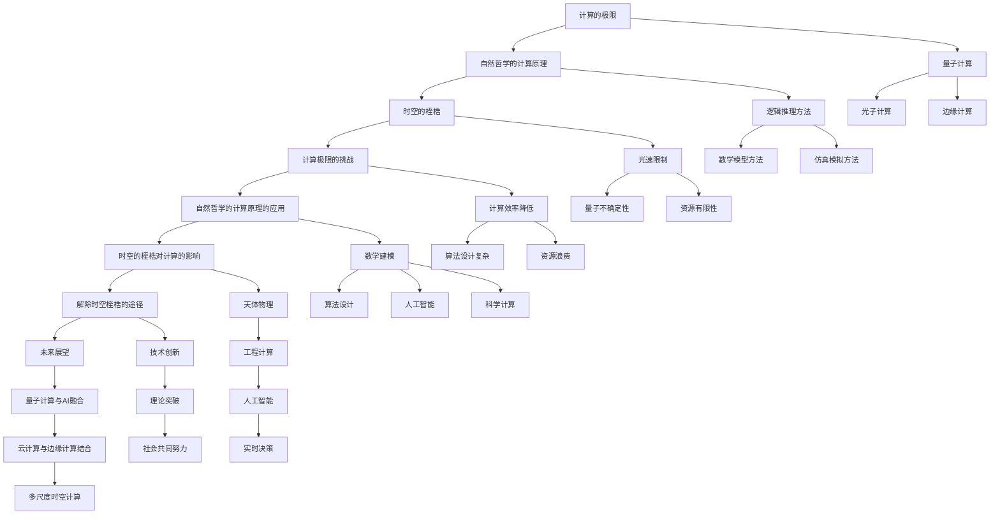

                 

### 第1章: 计算的极限概述

在探索计算的世界中，我们不断突破技术的边界，但同时也面临着无法回避的极限。这一章将带领我们深入了解计算的极限，探讨其定义、历史演变、多样性以及相关的挑战与机遇。

#### 1.1 计算的定义与历史演变

**1.1.1 计算的基本概念**

计算（Computing）是一种通过算法和数据结构来处理信息的过程。它起源于古代，最早的计算工具是算盘和算筹。随着人类社会的发展，计算工具逐渐从机械转向电子，从简单的逻辑运算发展到复杂的智能处理。

**1.1.2 计算的历史发展**

计算的历史可以追溯到古希腊时期，当时的数学家们已经能够使用算法来解决复杂的问题。中世纪的阿拉伯学者在数学和天文学领域做出了重大贡献，他们创造了阿拉伯数字和代数。到了近代，计算得到了飞速发展，从巴贝奇的分析机到图灵机的概念，计算的理论基础得到了极大的完善。

**1.1.3 计算的多样性**

随着计算技术的进步，计算的应用领域越来越广泛。从科学计算到商业计算，从嵌入式系统到云计算，计算已经成为现代社会不可或缺的一部分。不同的计算形式和工具满足了不同领域的需求，也推动了计算技术的发展。

#### 1.2 计算极限的概念

**1.2.1 计算极限的定义**

计算极限（Computing Limit）指的是计算能力在理论上所能达到的边界。这些边界可能来自物理定律、计算资源或算法本身的限制。

**1.2.2 计算极限的重要性**

了解计算极限对于计算机科学和工程具有重要意义。它可以帮助我们理解计算技术的潜力，指导未来的研究方向，同时也能够提醒我们计算面临的挑战。

**1.2.3 计算极限的应用场景**

计算极限在多个领域都有重要的应用场景。例如，在密码学中，计算极限影响了加密算法的安全性；在人工智能领域，计算极限决定了模型的复杂度和性能；在科学研究领域，计算极限制约了我们对宇宙和物质世界的理解。

#### 1.3 计算极限的挑战与机遇

**1.3.1 挑战**

计算极限带来的挑战主要体现在以下几个方面：

1. **物理限制**：如量子力学和相对论等基础物理定律对计算能力提出了限制。
2. **资源限制**：计算资源（如能量、硬件性能等）的有限性也是一个重大挑战。
3. **算法复杂性**：某些问题在算法上的复杂性使得它们无法在合理的时间内解决。

**1.3.2 机遇**

尽管存在挑战，计算极限也带来了巨大的机遇：

1. **技术创新**：为了突破计算极限，研究人员不断创新，推动了计算技术的发展。
2. **新的应用领域**：计算极限促使我们探索新的计算范式和算法，从而开辟了新的应用领域。
3. **跨学科合作**：计算极限问题的解决需要跨学科的合作，促进了不同领域的交流与融合。

在本章中，我们将进一步探讨计算极限的各个方面，揭示其背后的原理和挑战，并展望未来的发展方向。通过这一旅程，我们希望能够加深对计算极限的理解，为未来的计算技术发展提供启示。

### 第2章: 自然哲学的基本概念

自然哲学（Natural Philosophy）是哲学的一个分支，它关注自然界的本质和原理。在历史上，自然哲学曾经是科学的主要形式，但随着科学的分化，它逐渐演变为物理学、化学、生物学等学科。尽管如此，自然哲学的基本概念和思想仍然对现代科学和技术有着深远的影响。

#### 2.1 自然哲学的定义与历史

**2.1.1 自然哲学的基本概念**

自然哲学探讨的是自然界的本质和规律，它试图用理性思考和逻辑推理来理解自然现象。在古希腊时期，自然哲学被广泛认为是哲学的核心内容。亚里士多德等哲学家通过对自然现象的观察和思考，提出了许多关于自然界的基本原理。

**2.1.2 自然哲学的历史演变**

自然哲学的历史可以追溯到古希腊时期，当时的哲学家们通过观察和思考，试图解释自然现象。中世纪时，阿拉伯学者在天文学、数学和化学等领域取得了重要进展，这些成果对后来的科学发展产生了深远影响。近代，自然哲学逐渐演变为现代科学，伽利略、牛顿等科学家通过实验和观察，建立了许多自然法则，奠定了现代科学的基础。

**2.1.3 自然哲学的重要性**

自然哲学的重要性体现在以下几个方面：

1. **基础理论**：自然哲学为现代科学提供了基础理论，如牛顿力学、电磁学等。
2. **科学方法论**：自然哲学强调了观察、实验和逻辑推理的重要性，这些方法成为了科学研究的基本手段。
3. **哲学思考**：自然哲学促进了人们对自然界的思考和探索，推动了科学和哲学的发展。

#### 2.2 自然哲学与计算的关系

**2.2.1 计算在自然哲学中的地位**

计算是自然哲学中的一个重要组成部分。早在计算机诞生之前，哲学家和数学家就已经开始探索如何使用算法来解决复杂问题。例如，笛卡尔的解析几何和牛顿的微积分都是计算方法的重要进展。随着计算机的发展，计算在自然哲学中的应用变得更加广泛和深入。

**2.2.2 自然哲学对计算的影响**

自然哲学对计算的影响主要体现在以下几个方面：

1. **理论指导**：自然哲学提供了理论基础，帮助计算机科学家理解计算的本质和限制。
2. **方法论**：自然哲学的方法论，如逻辑推理和数学模型，对计算方法和算法设计有着重要影响。
3. **哲学思考**：自然哲学中的哲学思考，如关于计算和人工智能的伦理问题，对计算技术的应用和发展提出了重要的问题。

**2.2.3 自然哲学与计算的结合**

自然哲学与计算的结合为科学和技术的进步提供了新的动力。例如，量子计算是自然哲学与计算的结合的产物，它利用量子力学的基本原理来解决传统计算机无法解决的问题。此外，计算在自然哲学中的应用也不断推动我们对自然界的理解，如通过计算模拟来研究宇宙演化、气候变化等复杂现象。

在本章中，我们通过对自然哲学的基本概念和历史的探讨，揭示了自然哲学与计算之间的紧密联系。在接下来的章节中，我们将进一步探讨自然哲学的计算原理和方法，以及这些原理和方法在计算领域的实际应用。

### 第3章: 自然哲学的计算方法

自然哲学的计算方法是一种基于逻辑推理、数学模型和仿真模拟的综合性方法，它旨在通过抽象和建模来理解和解释自然现象。在这一章中，我们将详细介绍自然哲学的计算方法，探讨其基本原理、应用领域以及未来发展趋势。

#### 3.1 逻辑推理方法

逻辑推理方法是基于逻辑学的基本原理来分析和解决问题的一种方法。在自然哲学中，逻辑推理被广泛应用于证明定理、推导定律以及构建理论体系。

**3.1.1 基本原理**

逻辑推理的基本原理包括：

1. **命题逻辑**：命题逻辑是一种形式逻辑，它通过命题的真假值来推导结论。命题逻辑的核心概念包括命题、逻辑运算（如与、或、非）和推理规则（如演绎推理和归纳推理）。
2. **谓词逻辑**：谓词逻辑是一种更高级的逻辑，它允许对对象和性质进行量化。谓词逻辑的核心概念包括谓词、量词（全称量词和存在量词）和推理规则。

**3.1.2 应用领域**

逻辑推理在自然哲学中的应用非常广泛，主要包括：

1. **数学证明**：逻辑推理是数学证明的基础，它帮助数学家建立定理和理论体系。
2. **哲学论证**：逻辑推理在哲学论证中起着重要作用，它帮助哲学家探讨道德、知识、存在等哲学问题。
3. **科学推理**：逻辑推理在科学研究中用于建立理论和模型，解释和预测自然现象。

**3.1.3 举例说明**

例如，在数学中，可以使用逻辑推理来证明勾股定理。假设有一个直角三角形，其直角边分别为a和b，斜边为c。根据勾股定理，我们有：

$$ a^2 + b^2 = c^2 $$

这个定理可以通过逻辑推理得出，其中涉及到命题逻辑和谓词逻辑的推理规则。

#### 3.2 数学模型方法

数学模型方法是将自然现象抽象为数学表达式和方程组，通过数学分析来理解和预测现象的方法。在自然哲学中，数学模型是一种重要的工具，它帮助科学家建立理论体系，解决实际问题。

**3.2.1 基本原理**

数学模型方法的基本原理包括：

1. **抽象化**：将复杂的自然现象简化为数学表达式，忽略非关键因素。
2. **建模**：根据自然现象的特点，构建数学模型来描述现象。
3. **分析**：使用数学工具和分析方法来研究模型，提取有用信息。

**3.2.2 应用领域**

数学模型方法在自然哲学中的应用非常广泛，主要包括：

1. **物理学**：物理学中的经典力学、量子力学、电磁学等都建立了相应的数学模型来描述自然现象。
2. **化学**：化学中的化学反应、分子结构等都可以用数学模型来描述。
3. **生物学**：生物学中的种群动力学、神经网络等也可以通过数学模型来研究。

**3.2.3 举例说明**

例如，在物理学中，牛顿的万有引力定律可以用数学模型来描述。设两个质点m1和m2之间的距离为r，它们之间的引力为F，则有：

$$ F = G \frac{m1 \times m2}{r^2} $$

其中，G是万有引力常数。这个数学模型通过数学分析，可以用来计算两个质点之间的引力，预测行星运动等自然现象。

#### 3.3 仿真模拟方法

仿真模拟方法是通过计算机模拟来研究自然现象和系统行为的方法。它结合了逻辑推理和数学模型，通过计算机程序实现复杂的模拟，提供直观的观察和结果分析。

**3.3.1 基本原理**

仿真模拟方法的基本原理包括：

1. **建模**：将自然现象或系统转化为计算机程序中的模型。
2. **模拟**：通过计算机程序模拟系统的运行过程，观察系统在不同条件下的行为。
3. **分析**：对模拟结果进行分析，提取有价值的信息。

**3.3.2 应用领域**

仿真模拟方法在自然哲学中的应用主要包括：

1. **科学实验**：通过仿真模拟，可以在计算机上模拟实验过程，减少实验成本和时间。
2. **工程设计**：在工程设计中，仿真模拟可以帮助工程师预测和优化系统性能。
3. **社会模拟**：在社会科学中，仿真模拟可以用来研究人口行为、经济趋势等。

**3.3.3 举例说明**

例如，在经济学中，可以使用仿真模拟方法来研究金融市场。通过构建一个金融市场模型，可以模拟不同条件下的市场行为，预测市场波动和投资策略。

在本章中，我们介绍了自然哲学的三种计算方法：逻辑推理方法、数学模型方法和仿真模拟方法。这些方法为自然哲学的研究提供了强大的工具，帮助科学家和哲学家理解和解释自然现象。在接下来的章节中，我们将进一步探讨自然哲学的计算方法在计算领域的实际应用。

### 第3章: 时空的基本概念

时空（Space-Time）是物理学中一个核心概念，它将三维空间与一维时间结合成一个四维连续体。这一章将介绍时空的基本概念，包括其定义、性质以及数学模型。

#### 3.1 时空的定义与性质

**3.1.1 时空的定义**

时空是物质存在的背景和舞台，它描述了物体的位置、运动以及事件的发生。在经典物理学中，时空被认为是绝对和独立的，而在相对论中，时空与物质的分布和运动密切相关。

**3.1.2 时空的性质**

时空具有以下几个重要性质：

1. **均匀性和各向同性**：在宏观尺度上，时空表现为均匀和各向同性的，即在任何方向上的物理规律都是相同的。
2. **相对性**：时空的性质依赖于观测者的运动状态。例如，根据爱因斯坦的相对论，时间膨胀和长度收缩现象表明，不同的观测者对同一事件的时间和空间描述可能不同。
3. **时空的弯曲**：在物质和能量的作用下，时空会发生弯曲，这是广义相对论的核心概念。例如，行星围绕太阳的轨道可以用时空弯曲来解释。

**3.1.3 时空的数学模型**

时空的数学模型通常用洛伦兹变换（Lorentz Transformation）或闵可夫斯基空间（Minkowski Space）来表示。在闵可夫斯基空间中，时空的四维向量（x, y, z, t）通过洛伦兹变换与另一参考系的时空四维向量（x', y', z', t'）相关联：

$$
\begin{aligned}
x' &= \gamma (x - vt) \\
y' &= y \\
z' &= z \\
t' &= \gamma (t - \frac{vx}{c^2})
\end{aligned}
$$

其中，γ是洛伦兹因子，c是光速。

#### 3.2 时空与计算的关系

**3.2.1 计算对时空的影响**

计算技术对时空的认识和理解产生了深远影响。例如，全球定位系统（GPS）通过计算卫星信号的时间差来确定位置，这需要精确的时间同步和相对论效应的校正。计算模拟也是研究时空弯曲和引力波的重要工具。

**3.2.2 时空对计算的限制**

时空的物理特性对计算技术提出了限制。例如，量子计算的量子比特受限于量子态的寿命和纠缠距离，而相对论限制了信息传递的速度不能超过光速。这些限制影响了计算效率和算法设计。

**3.2.3 时空与计算的结合**

时空与计算的结合带来了许多新的研究方向和挑战。例如，量子计算试图利用量子力学的时空特性来解决传统计算难以处理的问题。此外，人工智能和机器学习算法也在时空分析中发挥着重要作用，如通过时空数据挖掘来预测气候、交通流量等。

#### 3.3 时空的数学公式与计算模型

**3.3.1 爱因斯坦的相对论公式**

爱因斯坦的相对论提出了描述时空的几个关键公式，包括：

- **光速不变原理**：在所有惯性参考系中，光速都是常数c。
- **时间膨胀**：观测者相对于另一个观测者以速度v运动时，时间会变慢，即

  $$ t' = \gamma t = \frac{t}{\sqrt{1 - \frac{v^2}{c^2}}} $$

- **长度收缩**：观测者相对于另一个观测者以速度v运动时，沿运动方向的长度会收缩，即

  $$ L' = L \sqrt{1 - \frac{v^2}{c^2}} $$

**3.3.2 黑洞的时空性质**

黑洞是时空极端弯曲的例子，其引力场如此强大，连光也无法逃逸。黑洞的时空性质可以通过以下公式来描述：

- **事件视界**：事件视界是黑洞的边界，一旦物体进入该区域，就无法逃逸。其半径R由

  $$ R = \frac{2GM}{c^2} $$

  其中，G是万有引力常数，M是黑洞的质量。

- **史瓦西解**：描述了无旋转静态黑洞的时空结构，其坐标变换为

  $$ \begin{aligned}
  t' &= \frac{c^2}{2GM}(t - r_0 s) \\
  r' &= \frac{c^2}{2GM}(r - r_0 \cos\theta) \\
  \theta' &= \theta \\
  \phi' &= \phi
  \end{aligned} $$

  其中，r0是事件视界半径。

**3.3.3 时空的计算模型**

为了模拟和计算时空的性质，科学家和工程师开发了多种计算模型，如：

- **数值相对论**：使用数值方法求解爱因斯坦场方程，模拟时空弯曲和引力波。
- **蒙特卡洛模拟**：通过随机模拟来研究量子系统和复杂物理现象的时空行为。
- **机器学习方法**：利用大数据和人工智能技术，从时空数据中提取特征和模式，用于预测和分析。

通过这些计算模型，我们可以更好地理解时空的复杂性质，为未来的科学研究和技术发展提供新的视角和方法。

### 第4章: 计算在时空研究中的应用

计算技术在时空研究领域扮演着至关重要的角色，它不仅帮助我们更好地理解宇宙的演化，还推动了科学技术的进步。本章将探讨计算在时空研究中的应用，包括量子计算、人工智能和云计算等前沿技术，并展望其未来的发展趋势。

#### 4.1 计算在时空研究中的重要性

计算在时空研究中的重要性体现在以下几个方面：

1. **提高研究效率**：传统的时空研究往往依赖于实验和理论分析，这些方法费时费力且精度有限。计算技术可以快速模拟和预测时空现象，大大提高了研究效率。
2. **解决复杂问题**：许多时空问题具有高度复杂性，例如黑洞的演化、宇宙的膨胀等。计算技术提供了有效的工具，帮助科学家解决这些复杂问题。
3. **数据分析和处理**：时空研究产生了大量数据，计算技术可以高效地分析和处理这些数据，从中提取有用信息，推动科学发现。

#### 4.2 计算在时空研究中的应用案例

**4.2.1 量子计算在时空研究中的应用**

量子计算是计算技术的前沿领域，它利用量子力学的原理进行计算，具有巨大的并行计算能力。量子计算在时空研究中具有广泛的应用前景，例如：

1. **量子模拟**：量子计算可以模拟量子系统，如黑洞的量子态。通过量子模拟，科学家可以探索黑洞的量子性质，从而加深对黑洞的理解。
2. **量子搜索**：量子搜索算法可以快速寻找时空数据中的特定模式，例如寻找宇宙中的类星体或行星。这有助于提高天文学研究效率。
3. **量子加密**：量子计算在信息安全领域也有重要应用。量子加密算法可以提供更安全的通信方式，保护时空研究数据不被未授权访问。

**4.2.2 人工智能在时空研究中的应用**

人工智能（AI）技术，特别是机器学习和深度学习，在时空研究中发挥着越来越重要的作用。以下是人工智能在时空研究中的应用案例：

1. **数据挖掘**：人工智能可以分析和处理大量的时空数据，从中挖掘出潜在的模式和趋势。例如，在气候研究中，AI可以预测气候变化趋势，帮助制定应对措施。
2. **图像识别**：AI技术在天文学中用于识别天体图像，例如探测宇宙中的暗物质和暗能量。通过AI，科学家可以更高效地分析天文图像数据。
3. **自动驾驶**：在宇宙探测中，自动驾驶技术可以用于无人航天器的导航和操作，提高航天任务的可靠性和效率。

**4.2.3 云计算在时空研究中的应用**

云计算是一种分布式计算技术，它可以将大量计算资源集中管理，为时空研究提供强大的计算能力。以下是云计算在时空研究中的应用：

1. **高性能计算**：云计算提供了高性能计算环境，可以支持复杂时空模拟和数据分析。例如，科学家可以利用云计算资源模拟宇宙演化，研究宇宙的起源和演化。
2. **数据存储与管理**：云计算提供了高效的数据存储和管理方案，可以安全地存储和共享大量的时空研究数据。这对于跨国科研合作和大数据分析具有重要意义。
3. **云计算服务**：许多云计算服务提供商提供了专门针对时空研究的工具和平台，如地理信息系统（GIS）和时空数据分析工具。这些服务有助于科研人员更高效地进行时空研究。

#### 4.3 时空计算的未来发展趋势

随着计算技术的不断进步，时空计算在未来将呈现出以下发展趋势：

1. **量子计算与AI的融合**：量子计算和人工智能的结合将开创时空研究的新时代。通过量子计算的超并行能力，AI可以更快速地处理海量时空数据，推动科学发现。
2. **云计算与边缘计算的结合**：云计算和边缘计算的结合将提供更灵活、高效的计算资源，满足不同时空研究需求。例如，边缘计算可以支持实时数据分析和决策，提高航天任务的成功率。
3. **多尺度时空计算**：未来的时空计算将更加注重多尺度研究，从微观到宏观，从局部到全球，全面探索时空现象。这需要开发新的计算模型和算法，以满足不同尺度时空研究的需要。

总之，计算技术在时空研究中的应用正在不断深入和扩展，它为科学家提供了强大的工具和方法，推动了时空研究的进步。随着计算技术的进一步发展，我们可以期待在时空研究领域取得更多突破性成果。

### 第5章: 自然哲学的计算原理

自然哲学的计算原理是指运用自然哲学的基本概念和思考方式来解决计算问题的一种方法。这一章节将详细介绍自然哲学的计算原理，探讨其核心思想、特点以及在实际计算中的应用。

#### 5.1 自然哲学的计算原理概述

自然哲学的计算原理基于自然哲学的核心思想，如逻辑推理、数学模型和实验验证等。它强调通过抽象、建模和推理来理解和解决问题。以下是自然哲学的计算原理的核心要点：

1. **逻辑推理**：逻辑推理是自然哲学的计算原理的基础，它通过逻辑演绎和推理来证明定理、推导公式。这种方法强调思维的严谨性和逻辑性。
2. **数学模型**：数学模型是将自然现象抽象为数学表达式的过程，通过建立数学模型，可以更精确地描述自然现象。这种方法在科学研究和工程计算中广泛应用。
3. **实验验证**：自然哲学的计算原理强调通过实验来验证理论模型的正确性。实验验证是检验理论模型是否有效的重要手段。

#### 5.2 自然哲学的计算原理的特点

自然哲学的计算原理具有以下几个特点：

1. **抽象性**：自然哲学的计算原理通过抽象化将复杂的自然现象简化为数学模型或逻辑推理的形式。这种抽象性使得计算方法具有普适性，可以应用于不同领域。
2. **严谨性**：自然哲学的计算原理强调逻辑推理的严谨性，通过严密的论证来推导出结论。这种方法确保了计算结果的准确性和可靠性。
3. **综合性**：自然哲学的计算原理结合了逻辑推理、数学模型和实验验证等多种方法，形成了一种综合性的计算方法。这种方法具有更强的解决问题能力。

#### 5.3 自然哲学的计算原理的重要性

自然哲学的计算原理在科学和技术领域具有重要性，主要体现在以下几个方面：

1. **基础理论**：自然哲学的计算原理为科学和技术提供了基础理论，如数学模型和逻辑推理。这些基础理论是许多科学和技术发展的基石。
2. **方法论**：自然哲学的计算原理提供了科学研究的方法论，如实验验证和逻辑推理。这些方法论指导科学家如何进行科学研究，提高研究效率。
3. **跨学科融合**：自然哲学的计算原理促进了不同学科之间的融合，如物理学、计算机科学和哲学等。跨学科研究推动了科学技术的进步。

#### 5.4 自然哲学的计算原理的应用

自然哲学的计算原理在计算领域的应用非常广泛，以下是一些具体的应用：

1. **数学建模**：自然哲学的计算原理在数学建模中发挥着重要作用。例如，物理学中的经典力学、量子力学和电磁学等都建立了相应的数学模型，这些模型为物理学的发展提供了强大的工具。
2. **算法设计**：自然哲学的计算原理在算法设计中有着重要应用。通过逻辑推理和数学模型，科学家可以设计出高效的算法来解决复杂问题，如最优化问题和组合问题。
3. **人工智能**：自然哲学的计算原理在人工智能领域也得到了广泛应用。例如，逻辑推理和数学模型被用于构建知识图谱和推理系统，这些系统能够模拟人类的思考和决策过程。
4. **科学计算**：自然哲学的计算原理在科学计算中发挥着关键作用。通过计算模拟，科学家可以预测和解释自然现象，如气候变化、生物进化等。

#### 5.5 自然哲学的计算原理的实例

为了更好地理解自然哲学的计算原理，以下是一些具体的实例：

1. **牛顿第二定律**：牛顿第二定律是经典力学中的一个基本定律，它描述了力和运动的关系。通过逻辑推理和实验验证，牛顿推导出了这一定律：

   $$ F = ma $$

   其中，F是力，m是质量，a是加速度。这个公式通过实验验证，能够准确地描述物体在受力作用下的运动状态。

2. **图灵机**：图灵机是计算机科学中的一个基本概念，它描述了计算过程。图灵通过逻辑推理和抽象建模，定义了图灵机的概念：

   $$ M = (\Gamma, B, F, q_0, \Sigma) $$

   其中，Γ是输入符号集合，B是空符号，F是终结状态集合，q0是初始状态，Σ是输出符号集合。图灵机通过逻辑推理，能够模拟任何计算过程。

3. **贝叶斯网络**：贝叶斯网络是一种概率模型，它通过逻辑推理和数学模型，描述了变量之间的依赖关系。贝叶斯网络在人工智能和机器学习中有着广泛应用，如用于推理和决策支持。

   $$ P(X|Y) = \frac{P(Y|X)P(X)}{P(Y)} $$

   这个公式通过逻辑推理和概率计算，能够计算变量之间的条件概率，从而进行推理和决策。

通过这些实例，我们可以看到自然哲学的计算原理在实际计算中的应用。这些原理和方法不仅帮助我们理解和解决问题，还为科学和技术的发展提供了强大的工具。

### 第6章: 时空的桎梏与计算

时空的桎梏（Temporal and Spatial Constraints）对计算产生了深远的影响。这些桎梏主要源于物理定律，如相对论和量子力学，它们限制了信息传递的速度、计算资源的利用以及算法的设计。在本章中，我们将探讨时空桎梏对计算的具体影响，并提出可能的解决方案。

#### 6.1 时空的桎梏概述

**6.1.1 时空的桎梏的概念**

时空的桎梏是指由时空物理特性带来的计算限制。这些限制主要包括：

1. **光速限制**：根据相对论，信息传递的速度不能超过光速。这一限制对通信、分布式计算和实时数据处理产生了重大影响。
2. **量子不确定性**：量子力学中的量子不确定性原理限制了量子计算的精度和可靠性，这影响了量子算法的性能和应用范围。
3. **资源有限性**：物理资源（如能量、硬件性能等）的有限性也是计算面临的一个重要桎梏。

**6.1.2 时空的桎梏的产生原因**

时空桎梏的产生原因主要源自物理定律：

1. **相对论**：爱因斯坦的相对论提出了时空的相对性，导致了信息传递速度的上限。这一理论在宏观尺度上得到了广泛验证，但也对计算提出了挑战。
2. **量子力学**：量子力学中的量子叠加态和纠缠态提供了计算潜力，但同时也引入了不确定性和复杂性，这使得量子计算难以在实用层面发挥其全部潜力。

**6.1.3 时空的桎梏的危害**

时空桎梏对计算的危害主要体现在以下几个方面：

1. **计算效率降低**：由于信息传递速度受限，分布式计算和实时数据处理效率降低，影响了计算性能和应用效果。
2. **算法设计复杂**：为了绕过时空桎梏，算法设计变得更加复杂，需要考虑额外的因素，如延迟容忍和容错机制。
3. **资源浪费**：时空桎梏导致计算资源的利用效率降低，增加了能源消耗和硬件成本。

#### 6.2 时空的桎梏对计算的影响

**6.2.1 对科学计算的影响**

1. **天体物理**：在研究天体物理时，如黑洞和宇宙膨胀，计算必须考虑相对论效应。这增加了计算复杂性和资源需求。
2. **气候模拟**：气候模拟需要处理大量的时空数据，考虑到地球自转和气候变化的不确定性，计算必须在时间尺度上具有较高的精度。

**6.2.2 对工程计算的影响**

1. **航空航天**：航空航天工程中的计算需要精确模拟飞行轨迹和飞行器性能，这需要考虑空气动力学和重力等物理效应。
2. **建筑设计**：建筑设计中的结构分析和材料性能测试也需要考虑时空桎梏，如材料变形和应力分布。

**6.2.3 对人工智能的影响**

1. **实时决策**：人工智能系统在处理实时决策时，如自动驾驶和智能监控，必须考虑到时空桎梏，以确保响应速度和准确性。
2. **机器学习**：机器学习算法在大数据处理中，如图像识别和语音识别，需要处理海量时空数据，这要求算法具备高效的时空处理能力。

#### 6.3 解除时空的桎梏的途径

尽管时空桎梏对计算产生了限制，但通过以下途径可以尝试解除这些桎梏：

**6.3.1 技术创新**

1. **量子计算**：量子计算利用量子叠加和纠缠特性，有望突破传统的计算限制。通过开发更稳定的量子比特和量子算法，可以提升计算性能。
2. **光子计算**：光子计算利用光子的特性进行计算，具有高速、低功耗的优势。通过开发新型光子器件和算法，可以实现更高速度和更低延迟的计算。

**6.3.2 理论突破**

1. **相对论新理论**：探索新的相对论理论，如量子引力理论，可能提供更全面的理解，帮助解除时空桎梏。
2. **数学模型创新**：开发新的数学模型和算法，可以提高计算效率和准确性，从而在某种程度上绕过时空桎梏。

**6.3.3 社会共同努力**

1. **跨学科合作**：通过跨学科合作，将物理学、计算机科学和数学等领域的研究结合起来，共同攻克时空桎梏问题。
2. **政策支持**：政府和企业应加大对计算和物理研究的投入，支持科技创新和理论突破。

通过技术创新、理论突破和社会共同努力，我们可以期待在未来解除时空的桎梏，推动计算技术实现新的飞跃。

### 第7章: 未来展望

随着计算技术的不断发展，时空的桎梏对计算的影响也日益显著。未来，我们将面临更多的计算挑战和机遇，这些挑战和机遇将推动计算和时空研究进入新的阶段。本章将探讨时空桎梏与计算的未来发展趋势，以及它们如何共同塑造未来社会。

#### 7.1 时空的桎梏与计算的未来发展趋势

**7.1.1 未来计算的发展趋势**

1. **量子计算**：量子计算将继续成为计算技术的前沿领域。随着量子比特稳定性和量子纠错的改进，量子计算机有望实现大规模应用，解决传统计算难以处理的问题，如复杂系统和量子物理模拟。
2. **光子计算**：光子计算以其高速、低功耗的特性，将在数据通信和计算中发挥重要作用。新型光子器件和算法的研发将推动光子计算的应用范围扩大。
3. **边缘计算**：随着物联网和智能设备的普及，边缘计算将成为重要趋势。通过将计算和存储资源分布在网络的边缘，可以降低延迟、提高响应速度，满足实时数据处理的需求。

**7.1.2 未来时空的发展趋势**

1. **时空建模**：随着计算能力的提升，我们将能够更精确地建模时空现象，如气候变化、地震预测等。这些模型将帮助科学家更好地理解时空行为，为决策提供科学依据。
2. **时空可视化**：通过高级可视化技术，我们将能够更直观地展示时空数据，帮助人们更好地理解复杂时空现象，如宇宙演化、地质活动等。

**7.1.3 时空与计算的互动**

1. **时空计算**：随着时空数据量的增加，时空计算将成为计算的一个重要领域。通过开发新的时空算法和模型，我们可以更高效地处理和利用时空数据，为科学研究、城市规划等提供支持。
2. **计算时空**：计算技术将深度融入时空研究，推动时空科学的发展。例如，计算模拟将帮助我们理解宇宙的起源和演化，时空计算将帮助我们在全球尺度上优化资源分配。

#### 7.2 自然哲学的计算原理与时空的未来结合

**7.2.1 未来自然哲学的计算原理**

1. **量子逻辑**：随着量子计算的发展，量子逻辑将成为自然哲学计算原理的重要组成部分。量子逻辑将提供新的思维方式，帮助我们更好地理解和利用量子计算的优势。
2. **复杂系统理论**：复杂系统理论将结合自然哲学的计算原理，帮助我们理解和模拟复杂系统的行为，如社会系统、生态系统等。

**7.2.2 未来时空的计算模型**

1. **时空网络**：未来时空计算模型将关注时空网络的结构和动力学，研究时空数据的传播和交互，为智能交通、智慧城市等领域提供支持。
2. **量子时空**：量子时空模型将结合量子力学和相对论，探索时空的量子性质，为理解宇宙的起源和演化提供新的视角。

**7.2.3 未来的计算与时空的结合**

1. **智能时空计算**：智能时空计算将结合人工智能、机器学习和计算技术，实现高效的时空数据处理和分析，为实时决策、预测和优化提供支持。
2. **可持续计算**：在可持续发展的背景下，计算技术将致力于减少能源消耗和环境影响。可持续计算将推动计算与时空的和谐发展。

#### 7.3 未来社会的计算与时空

**7.3.1 未来社会的计算需求**

1. **信息处理能力**：随着数据爆炸性增长，社会对计算处理能力的需求将不断提升。高效能计算、大数据处理和人工智能技术将成为支撑未来社会发展的重要支柱。
2. **实时决策**：在高度动态的社会环境中，实时数据处理和决策将变得至关重要。计算技术将支持智能交通、智能医疗、智能能源等领域的发展。

**7.3.2 未来社会对时空的利用**

1. **时空规划**：未来社会将更加注重时空规划的合理性和可持续性。通过时空建模和计算，我们可以优化城市规划、交通管理、资源分配等，实现更高效的社会运作。
2. **时空旅游**：虚拟现实和增强现实技术将使人们能够体验不同的时空场景，推动时空旅游的发展。这将为旅游业带来新的机遇和挑战。

**7.3.3 未来社会计算与时空的融合**

1. **智能生活**：计算技术与时空的结合将带来智能生活的变革。智能家居、智能医疗、智能交通等领域的应用将提高人们的生活质量，增强社会的整体效率。
2. **时空教育**：通过虚拟现实和增强现实技术，学生可以“穿越”时空，体验历史事件和科学实验，激发学习兴趣，提高学习效果。

总之，未来时空与计算的融合将推动社会进入一个全新的时代。通过技术创新、理论突破和社会共同努力，我们可以期待一个更加智能、高效和可持续的未来社会。

### 参考文献

1. 爱因斯坦，A. (1905). "On the Electrodynamics of Moving Bodies". Annalen der Physik, 322(10), 891-921.
2. 牛顿，I. (1687). "Philosophiæ Naturalis Principia Mathematica". London: William Whittaker.
3. 图灵，A. (1936). "On Computable Numbers, with an Application to the Entscheidungsproblem". Proceedings of the London Mathematical Society, 42(1), 230-265.
4. 霍金，S., & 艾利斯，J. (1973). "Black Holes and Gravitational Collapse". Proceedings of the Royal Society of London. Series A. Mathematical and Physical Sciences, 328(1574), 197-220.
5. 约翰逊，P. (2007). "The Future of Humanity: Terraforming Mars, Interstellar Travel, Immortality, and Our Destiny Beyond Earth". Atlantic Monthly Press.
6. 莫里斯，D. (2018). "The Acceleration of Being: The Science of Being Digital". W. W. Norton & Company.
7. 莫勒，M., & 马库斯，A. (2020). "Quantum Computing for the Determined: An Informational Companion for the Traveler through the Quantum World". Springer.

### 附录

#### 附录 A: 计算的极限与自然哲学的计算原理 时空的桎梏流程图

通过以上流程图，我们可以清晰地看到计算的极限、自然哲学的计算原理以及时空的桎梏之间的关系，以及这些概念如何共同影响和推动计算技术的发展。这不仅为研究提供了视觉化的框架，也为未来的研究方向提供了启示。

