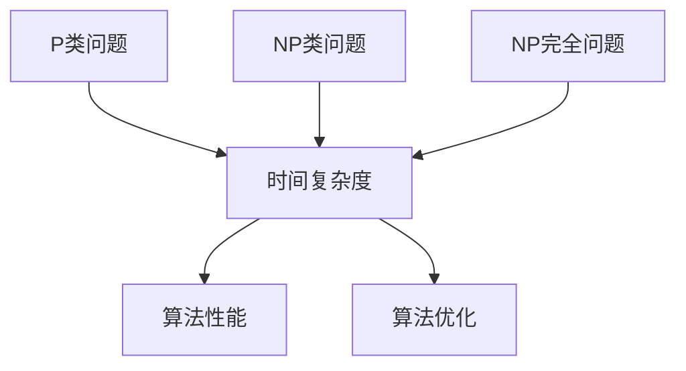
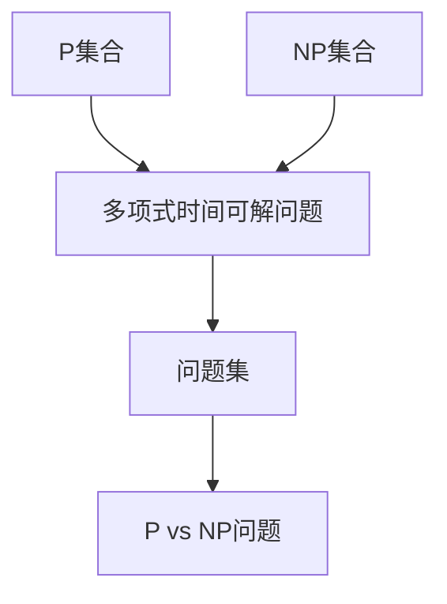
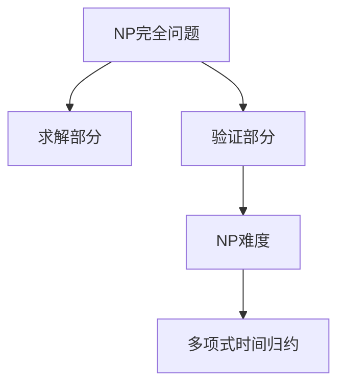
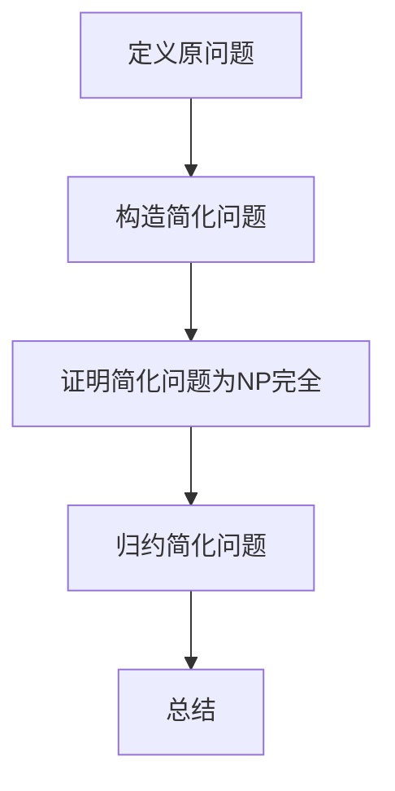
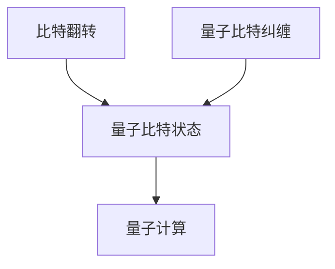

                 

### 《计算：第四部分 计算的极限 第9章 计算复杂性 计算的局部性原理》

> **关键词**：计算复杂性、局部性原理、P vs NP、量子计算、超导计算

> **摘要**：本章深入探讨计算复杂性的基础概念、局部性原理，以及超导计算与量子计算在计算极限方面的潜力。我们将通过逐步分析这些主题，揭示计算复杂性的本质，探讨局部性原理对优化技术的启示，并展望未来新型计算模型的进展。

### 目录大纲

#### 第一部分 计算的极限

### 第1章 计算复杂性

#### 1.1 计算复杂性的定义与重要性

#### 1.2 经典计算复杂性理论

##### 1.2.1 P vs NP 问题

##### 1.2.2 NP 完全性与NP难度

##### 1.2.3 减法方法与计算复杂性

#### 1.3 超导计算与量子计算

### 第2章 计算的局部性原理

#### 2.1 时间局部性原理

#### 2.2 空间局部性原理

#### 2.3 局部性原理与优化技术

### 第3章 计算的极限探索

#### 3.1 计算的极限概念

#### 3.2 比特翻转与量子比特纠缠

#### 3.3 新型计算模型与未来展望

## 附录

### 附录 A 计算复杂性相关资源

### 附录 B 局部性原理相关研究

### 附录 C 超导计算与量子计算相关论文

### 附录 D 未来计算技术展望

#### 引言

随着计算机技术的不断发展，我们对计算能力的需求日益增长。然而，计算能力并非无限的，它受到物理原理和算法复杂性的限制。本章将深入探讨计算复杂性这一重要领域，以及局部性原理，并探索超导计算与量子计算在计算极限方面的潜力。

计算复杂性研究旨在理解和分析算法的性能，它不仅对理论计算机科学具有重要意义，还直接影响着实际应用中的效率与优化。局部性原理则是计算机体系结构中的重要原则，它揭示了数据访问模式对性能的影响，并指导了缓存优化和并行计算技术。超导计算与量子计算代表了计算领域的两个前沿方向，它们有望突破传统计算的局限，实现更高效的计算能力。

通过本章的探讨，我们将对计算复杂性、局部性原理以及超导计算与量子计算有更深刻的理解，并思考未来计算技术的可能发展方向。本文将分为三个主要部分：首先，我们介绍计算复杂性的基本概念和重要性；其次，探讨经典计算复杂性理论，包括P vs NP问题、NP完全性、减法方法等；最后，我们讨论局部性原理，并介绍超导计算与量子计算的基本原理及其在计算极限方面的潜力。

### 第一部分 计算的极限

#### 第1章 计算复杂性

#### 1.1 计算复杂性的定义与重要性

**计算复杂性**是计算机科学中一个核心且重要的概念，它衡量了算法解决问题所需的时间和空间资源。计算复杂性的定义通常涉及两个方面：时间复杂度和空间复杂度。

- **时间复杂度**：指算法在解决问题时所需时间的增长速率，通常用大O符号（$O()$）表示。例如，一个算法的时间复杂度为$O(n)$表示其运行时间与输入规模成正比。

- **空间复杂度**：指算法在解决问题时所需内存的增长速率，同样用大O符号表示。空间复杂度衡量了算法对存储资源的需求。

计算复杂性在理论计算机科学中具有重要的意义。首先，它帮助我们理解和分析算法的性能，从而选择最优的算法解决实际问题。其次，计算复杂性研究为算法优化提供了理论基础，指导我们在实际应用中进行性能调优。此外，计算复杂性理论还与计算机硬件设计、软件工程和人工智能等领域密切相关。

**核心概念与联系**：

为了更好地理解计算复杂性，我们需要了解以下几个核心概念：

1. **P类问题**：指可以在多项式时间内解决的确定性问题。例如，排序和查找算法都属于P类问题。

2. **NP类问题**：指可以在多项式时间内验证解的确定性问题的集合。例如，图是否为二分图、数字是否为质数等问题都属于NP类问题。

3. **NP完全问题**：是指NP类中最难的问题。如果解决了NP完全问题，那么所有NP问题都可以通过多项式时间归约得到解决方案。

**Mermaid 流程图**：

下面是一个简化的Mermaid流程图，展示了计算复杂性中的一些核心概念及其联系：



**核心算法原理讲解**：

为了更好地理解计算复杂性的概念，我们可以通过伪代码来描述一个简单的排序算法：

```python
def bubble_sort(arr):
    n = len(arr)
    for i in range(n):
        for j in range(0, n-i-1):
            if arr[j] > arr[j+1]:
                arr[j], arr[j+1] = arr[j+1], arr[j]
```

在上面的伪代码中，`bubble_sort` 函数通过两重循环对数组进行排序。第一层循环执行$n$次，第二层循环在每次执行时减少一个元素，因此总的时间复杂度为$O(n^2)$。

**数学模型与公式**：

在计算复杂性理论中，我们经常使用大O符号来表示算法的时间复杂度。例如，上述排序算法的时间复杂度可以表示为：

$$T(n) = O(n^2)$$

这里，$T(n)$ 表示算法在输入规模为$n$时的运行时间。

**举例说明**：

假设我们要对100个元素进行排序，根据上述排序算法的时间复杂度，我们可以估计算法的运行时间：

$$T(100) = O(100^2) = O(10,000)$$

这意味着在最坏情况下，算法需要大约10,000次基本操作来完成排序。

**计算复杂性在理论计算机科学中的应用**：

计算复杂性理论在理论计算机科学中有广泛的应用。以下是一些应用实例：

1. **算法设计**：通过分析算法的时间复杂度和空间复杂度，我们可以选择最优的算法解决实际问题。

2. **性能评估**：计算复杂性理论帮助我们评估算法在实际应用中的性能，从而进行性能优化。

3. **计算机硬件设计**：计算复杂性理论指导计算机硬件的设计，例如CPU缓存的大小和速度。

4. **人工智能**：在机器学习和人工智能领域，计算复杂性理论帮助我们设计高效的学习算法，从而提高模型的性能。

通过以上分析，我们可以看到计算复杂性在计算机科学中的重要地位。理解计算复杂性的基本概念和原理，不仅有助于我们分析和设计高效的算法，还能指导我们在实际应用中进行性能优化。

### 1.2 经典计算复杂性理论

在计算复杂性的研究领域，经典计算复杂性理论为我们提供了深入理解算法性能和问题难度的工具。在本节中，我们将探讨以下几个核心主题：P vs NP问题、NP完全性与NP难度、以及减法方法与计算复杂性。

#### 1.2.1 P vs NP 问题

**P vs NP问题**是计算复杂性理论中最著名且最具挑战性的问题之一。它涉及到两个集合：P集合和NP集合。

- **P集合**：包含所有能在多项式时间内解决的确定性问题。例如，排序和查找算法都属于P集合。

- **NP集合**：包含所有可以在多项式时间内验证解的确定性问题。例如，给定一个已排序的数组，判断一个特定的元素是否存在。

**P vs NP 问题**的实质是询问P集合和NP集合是否相等。如果P = NP，那么所有NP问题都可以在多项式时间内解决，这将极大地改变我们的计算能力。反之，如果P ≠ NP，那么存在一些问题无法在多项式时间内解决，这将对算法设计带来深远影响。

**P vs NP 问题的证明与影响**：

尽管P vs NP问题已经引起了广泛关注，但目前尚未有确凿的证明。许多数学家和计算机科学家都致力于解决这个问题。如果P = NP得到证明，将意味着许多现有算法可以显著优化，某些复杂问题（如旅行商问题）可以迅速解决。然而，如果P ≠ NP得到证明，这将对算法设计和问题分类产生重大影响，提示我们需要更高效的算法来解决复杂问题。

**核心概念与联系**：

为了更好地理解P vs NP问题，我们可以通过一个简单的Mermaid流程图来展示P集合和NP集合的关系：



**核心算法原理讲解**：

在探讨P vs NP问题时，我们可以通过一个简单的例子来展示多项式时间内可解问题和可验证问题。例如，二分查找算法：

```python
def binary_search(arr, target):
    low = 0
    high = len(arr) - 1
    while low <= high:
        mid = (low + high) // 2
        if arr[mid] == target:
            return True
        elif arr[mid] < target:
            low = mid + 1
        else:
            high = mid - 1
    return False
```

在这个例子中，`binary_search` 函数在数组`arr`中查找目标元素`target`。该算法的时间复杂度为$O(\log n)$，即可以在多项式时间内完成。

**数学模型与公式**：

在计算复杂性理论中，我们使用大O符号来表示算法的时间复杂度。例如，上述二分查找算法的时间复杂度可以表示为：

$$T(n) = O(\log n)$$

**举例说明**：

假设我们要在一个包含100个元素的数组中查找特定的元素，根据上述算法的时间复杂度，我们可以估计算法的运行时间：

$$T(100) = O(\log 100) = O(2.718)$$

这意味着在最坏情况下，算法需要大约3次基本操作来完成查找。

**P vs NP 问题的证明与影响**：

P vs NP问题的证明对计算理论和方法论有深远影响。如果P = NP，将意味着许多复杂问题可以迅速解决，这将极大推动科学研究和技术发展。例如，旅行商问题、背包问题等复杂问题可以通过高效算法解决。

如果P ≠ NP，则意味着存在一些问题无法在多项式时间内解决，这提示我们需要探索新的算法设计和优化方法。例如，近似算法、启发式方法等。

#### 1.2.2 NP完全性与NP难度

**NP完全性**是计算复杂性理论中的一个重要概念。一个问题是NP完全的，如果它既是NP问题，并且所有NP问题都可以通过多项式时间归约到它。

**NP完全性问题定义**：

一个NP完全问题通常包括两个部分：问题的求解部分和问题的验证部分。

- **求解部分**：给定一个输入，问题能否被解决。
- **验证部分**：给定一个解和输入，如何验证该解是正确的。

例如，**3-SAT问题**是一个典型的NP完全问题。给定一个由3元子句构成的布尔公式，问题是在多项式时间内确定是否存在一组变量赋值使得公式为真。

**NP难度与归约**：

**NP难度**指的是将一个NP问题转化为另一个NP完全问题的过程。通过多项式时间归约，我们可以将一个复杂的NP问题转化为一个更简单的NP完全问题。

**减法方法**：

**减法方法**是NP完全性问题证明中常用的一种方法。其基本思想是通过构造一系列的简化问题，逐步减少问题的规模，直至证明原始问题可以在多项式时间内归约到某个已知的NP完全问题。

例如，我们可以通过减法方法证明**图着色问题**是NP完全的。我们首先证明**二部图着色问题**是NP完全的，然后通过构造减法方法，将一般的图着色问题转化为二部图着色问题。

**核心概念与联系**：

为了更好地理解NP完全性与NP难度，我们可以通过一个简单的Mermaid流程图来展示NP完全问题的定义和NP难度：



**核心算法原理讲解**：

为了更具体地展示NP完全性的概念，我们可以通过伪代码来描述一个NP完全问题，例如**3-SAT问题**：

```python
def is_satisfied(clauses, assignment):
    for clause in clauses:
        if not any(var == True if var_index % 2 == 0 else var == False for var, var_index in assignment.items() for var in clause):
            return False
    return True
```

在这个例子中，`is_satisfied` 函数检查一个给定的变量赋值是否满足一组3元子句。`clauses` 是一组3元子句，`assignment` 是变量赋值的字典。如果所有子句都被满足，函数返回`True`。

**数学模型与公式**：

在计算复杂性理论中，我们使用大O符号来表示算法的时间复杂度。例如，上述3-SAT问题的验证部分可以在多项式时间内完成：

$$T(n) = O(n^3)$$

**举例说明**：

假设我们有100个变量的3-SAT问题，根据上述算法的时间复杂度，我们可以估计算法的运行时间：

$$T(100) = O(100^3) = O(1,000,000)$$

这意味着在最坏情况下，算法需要大约100万次基本操作来验证一个变量赋值。

**NP完全性与NP难度的证明与影响**：

NP完全性与NP难度证明了某些问题在计算上的困难性，这对算法设计、问题求解和理论计算机科学的发展具有重要意义。例如，通过证明3-SAT问题为NP完全，我们可以推断其他许多组合优化问题（如旅行商问题、背包问题）也是NP完全的，从而提示我们需要探索更高效的求解方法。

#### 1.2.3 减法方法与计算复杂性

**减法方法**是证明NP完全性问题的一种常用技巧。其基本思想是通过逐步减少问题的规模，将一个复杂的NP问题转化为一个已知的NP完全问题。

**减法方法的步骤**：

1. **定义原问题**：首先，定义我们要证明的NP完全问题。
2. **构造简化问题**：通过减少问题的规模，构造一系列简化问题。
3. **证明简化问题为NP完全**：对于每个简化问题，证明它是一个NP完全问题。
4. **归约简化问题**：通过多项式时间归约，将简化问题转化为已知的NP完全问题。
5. **总结**：通过上述步骤，证明原问题为NP完全。

**减法方法的例子**：

为了说明减法方法，我们可以考虑**图着色问题**。首先，我们定义图着色问题：给定一个无向图G和正整数k，问是否可以将G中的所有顶点着上不同的颜色，使得相邻的顶点颜色不同。

**证明图着色问题是NP完全的**：

1. **定义原问题**：给定图G和正整数k，判断G是否可以k-着色。
2. **构造简化问题**：考虑二部图H，其顶点集合分为两部分U和V，且每条边(u, v)都连接U中的一个顶点和V中的一个顶点。
3. **证明简化问题为NP完全**：二部图H的着色问题显然是NP完全的，因为我们可以通过简单的验证算法在多项式时间内判断一个给定的顶点着色方案是否满足。
4. **归约简化问题**：我们可以通过减法方法将一般图着色问题归约到二部图着色问题。具体来说，给定一个一般图G，我们可以构造一个相应的二部图H，使得G的k-着色等价于H的k-着色。
5. **总结**：通过上述步骤，我们证明了图着色问题是NP完全的。

**核心概念与联系**：

为了更好地理解减法方法，我们可以通过一个简单的Mermaid流程图来展示减法方法的步骤：



**核心算法原理讲解**：

为了具体说明减法方法，我们可以通过伪代码来描述一个将一般图着色问题归约到二部图着色问题的过程：

```python
def reduce_to bipartite(G):
    U = set()
    V = set()
    for edge in G.edges():
        if edge not in U and edge not in V:
            U.add(edge[0])
            V.add(edge[1])
    H = BipartiteGraph(U, V)
    for edge in G.edges():
        if edge in U and edge in V:
            H.add_edge(edge[0], edge[1])
    return H
```

在这个例子中，`reduce_to_bipartite` 函数将一个一般图G转换为相应的二部图H。我们首先创建两个顶点集合U和V，然后遍历G的边，将每个未分配的顶点添加到U或V中。最后，我们创建一个新的二部图H，将G中的边添加到H中。

**数学模型与公式**：

在计算复杂性理论中，我们使用大O符号来表示算法的时间复杂度。例如，上述减法方法的转换过程可以在多项式时间内完成：

$$T(n) = O(n^2)$$

**举例说明**：

假设给定一个包含100个顶点和200条边的图G，我们可以估计转换过程的时间复杂度：

$$T(100) = O(100^2) = O(10,000)$$

这意味着在最坏情况下，转换过程需要大约10,000次基本操作。

**减法方法与计算复杂性的影响**：

减法方法不仅是一种证明NP完全性的有效工具，还在计算复杂性理论中具有重要的应用价值。通过减法方法，我们可以将复杂的NP问题转化为更简单的NP完全问题，从而帮助我们理解问题之间的联系和难度。

此外，减法方法在算法设计中也有重要应用。例如，通过将问题归约到已知的NP完全问题，我们可以利用现有的NP完全问题的求解算法来求解其他复杂的NP问题。

总之，减法方法与计算复杂性的结合，不仅深化了我们对计算复杂性的理解，还为算法设计和优化提供了强有力的理论支持。

### 1.3 超导计算与量子计算

在探索计算极限的过程中，超导计算与量子计算成为两个备受瞩目的前沿方向。它们不仅突破了传统计算的局限，还展示了在未来实现更高计算效率的潜力。在这一节中，我们将深入探讨超导计算和量子计算的基本原理，以及它们在计算极限方面的潜力。

#### 1.3.1 超导计算的基本原理

**超导计算**基于超导材料在低温下的特殊性质。超导材料在临界温度以下时，其电阻降为零，电流可以在材料内部长时间流动而不衰减。这种零电阻的特性使得超导材料在计算领域具有巨大的应用潜力。

**超导态及其在计算中的应用**：

超导态是指超导材料在低于临界温度时进入的一种特殊状态，其主要特性包括：

- **零电阻**：电流在超导材料中流动时不会遇到阻力，这使得电子可以快速传输。
- **完全抗磁性**：超导材料对外部磁场非常敏感，任何微小的磁场都会破坏其超导态。

超导计算利用这些特性，通过在超导材料中创建电流回路来实现计算操作。例如，超导量子比特（qubit）是一种基本的信息单元，它利用超导电路中的超导态来实现量子比特的存储和操作。

**超导量子比特**：

超导量子比特是超导计算的核心组件。它利用超导电路中的量子现象，如叠加态和纠缠态，来实现量子信息的存储和传输。超导量子比特可以通过微波脉冲进行操控，从而实现量子计算的基本操作。

**量子门**：

量子门是量子计算中的基本操作单元，类似于经典计算机中的逻辑门。超导量子比特可以通过一系列量子门进行操控，从而实现复杂的量子计算任务。常见的量子门包括：

- **旋转门**：改变量子比特的相位。
- **交换门**：交换两个量子比特的状态。
- **控制-NOT门**：根据控制量子比特的状态对目标量子比特进行翻转。

**量子算法**：

量子算法是利用量子比特和量子门实现高效计算的方法。与经典算法相比，量子算法在某些问题上具有显著的加速效果。例如，Shor算法是一种利用量子计算解决大整数因式分解的算法，其时间复杂度显著低于现有最佳经典算法。

#### 1.3.2 量子计算的基本原理

**量子比特与量子门**：

量子比特（qubit）是量子计算的基本单元，它利用量子力学中的叠加态和纠缠态来实现信息存储和操作。与经典比特只能处于0或1状态不同，量子比特可以同时处于0和1的叠加态，这大大增加了量子计算的并行性。

量子门是量子计算中的基本操作单元，类似于经典计算机中的逻辑门。量子门通过对量子比特进行叠加、测量和纠缠操作，实现量子信息的处理和传输。

常见的量子门包括：

- **旋转门**：对量子比特的相位进行旋转。
- **交换门**：交换两个量子比特的状态。
- **控制-NOT门**：根据控制量子比特的状态对目标量子比特进行翻转。

**量子算法**：

量子算法是利用量子比特和量子门实现高效计算的方法。与经典算法相比，量子算法在某些问题上具有显著的加速效果。例如，Shor算法是一种利用量子计算解决大整数因式分解的算法，其时间复杂度显著低于现有最佳经典算法。

**量子纠缠**：

量子纠缠是量子计算中的关键特性，它指的是两个或多个量子系统之间的一种特殊关联。当两个量子比特发生纠缠时，它们的状态将不可分割，即使它们相隔很远，一个量子比特的状态变化也会立即影响到另一个量子比特。

量子纠缠使得量子计算具有高度的并行性和强大的计算能力。通过量子纠缠，量子计算可以在一次操作中同时处理多个子问题，从而显著加速计算过程。

**量子计算的优势**：

与经典计算相比，量子计算具有以下优势：

- **并行性**：量子比特的叠加态允许量子计算同时处理多个状态，从而实现并行计算。
- **速度优势**：在某些问题上，量子算法具有显著的时间复杂度优势，例如大整数因式分解和量子模拟。
- **抗干扰性**：量子计算通过量子纠错机制，可以在一定程度上抵抗噪声和错误，提高计算的可靠性。

**量子计算的挑战**：

尽管量子计算具有巨大的潜力，但实现实用化的量子计算机仍然面临许多挑战：

- **量子比特的稳定性**：量子比特容易受到外部环境的影响，如温度、磁场等，这要求极高的稳定性。
- **量子纠错**：量子计算中的错误传播速度快，需要高效的量子纠错机制来保证计算的可靠性。
- **量子门精度**：量子门的精度和可靠性对量子计算至关重要，需要不断提升制造工艺和优化算法。

总之，超导计算与量子计算展示了在计算极限方面突破传统局限的巨大潜力。通过深入理解和探索这些前沿技术，我们可以期待在未来实现更高计算效率和更强大的计算能力。

### 第二部分 计算的局部性原理

#### 第2章 计算的局部性原理

局部性原理是计算机体系结构中的一个重要原则，它揭示了数据访问模式对计算性能的影响，并指导了优化技术。在本节中，我们将详细探讨时间局部性原理和空间局部性原理，以及它们在优化技术中的应用。

#### 2.1 时间局部性原理

**时间局部性原理**是指程序在执行过程中，对某些资源（如数据或指令）的访问往往集中在一段时间内。这一原理由约翰·兰伯特·卡恩（John L. Hennessy）和大卫·帕特森（David A. Patterson）在其经典教材《计算机组成与设计》中提出。时间局部性原理可以分为两个子类别：时间相关性和时间邻近性。

**时间相关性**：

时间相关性指的是程序在一段时间内会重复访问某些资源。例如，在循环中，某些变量或数组可能在每次迭代中被重复使用。利用时间相关性，我们可以通过缓存（Cache）技术来提高数据访问的效率。缓存是一种小而快速的存储器，用于存储频繁访问的数据，从而减少对主存储器的访问时间。

**时间邻近性**：

时间邻近性指的是在接近的时间段内，程序可能访问到邻近的资源。例如，当处理一个数组的元素时，接下来很可能会访问相邻的元素。这种访问模式使得指令流水线（Instruction Pipeline）和指令预取（Instruction Prefetch）等技术得以有效应用。指令流水线通过将指令划分为多个阶段，并在不同阶段并行执行，从而提高指令执行的效率。指令预取则通过预测程序接下来的指令，并提前从内存中加载到缓存中，减少指令执行的延迟。

**时间局部性原理的提出与证明**：

时间局部性原理最初由约翰·兰伯特·卡恩（John L. Hennessy）和大卫·帕特森（David A. Patterson）在1989年的论文《计算机体系结构：从微处理器到互联网》中提出。他们通过大量的实验数据和统计分析，证明了时间局部性原理在计算机体系结构中的普遍性和重要性。

**示例分析**：

为了更好地理解时间局部性原理，我们可以通过一个简单的循环程序来分析：

```python
for i in range(1000):
    a[i] = b[i] * c[i]
```

在这个程序中，变量`a`、`b`和`c`是数组，`i`是循环变量。根据时间局部性原理，我们可以预测：

- 在每次循环迭代中，变量`a[i]`、`b[i]`和`c[i]`会被频繁访问。
- 这些变量在相邻的循环迭代中也会被重复访问。

利用时间局部性原理，我们可以通过以下技术来优化程序的性能：

1. **缓存优化**：将频繁访问的变量`a`、`b`和`c`存储在缓存中，减少对主存储器的访问时间。
2. **指令预取**：预测接下来的指令，并提前从内存中加载到缓存中，减少指令执行的延迟。

**时间局部性原理的影响与应用**：

时间局部性原理对现代计算机体系结构产生了深远的影响。以下是一些关键应用：

1. **缓存技术**：缓存技术利用时间局部性原理，通过存储频繁访问的数据来减少内存访问时间，从而提高程序的性能。
2. **指令流水线**：指令流水线通过并行执行指令，利用时间局部性原理，在各个指令阶段之间重叠执行，从而提高指令的执行效率。
3. **指令预取**：指令预取利用时间局部性原理，提前加载预测的指令到缓存中，减少指令执行的时间。

总之，时间局部性原理是计算机体系结构中一个重要的优化原则，它指导了缓存技术、指令流水线和指令预取等优化技术，从而显著提高了计算机的性能。

#### 2.2 空间局部性原理

**空间局部性原理**是指程序在执行过程中，对某些资源的访问往往集中在一定空间范围内。这一原理由约翰·兰伯特·卡恩（John L. Hennessy）和大卫·帕特森（David A. Patterson）在其经典教材《计算机组成与设计》中提出。空间局部性原理可以分为两个子类别：空间相关性和空间邻近性。

**空间相关性**：

空间相关性指的是程序在一段时间内会重复访问邻近的资源。例如，当处理一个数组时，接下来很可能访问相邻的数组元素。这种访问模式使得数据结构组织和内存分配等技术得以有效应用。通过将数据结构组织为连续的内存块，我们可以减少内存访问的跳跃，提高数据访问的效率。

**空间邻近性**：

空间邻近性指的是在接近的空间范围内，程序可能访问到邻近的资源。例如，在处理一个二维数组时，接下来很可能访问到邻近的行或列。这种访问模式使得缓存行（Cache Line）和内存分页（Memory Paging）等技术得以有效应用。缓存行通过将连续的内存块存储在缓存中，减少内存访问的跳跃。内存分页通过将大内存空间划分为多个较小的分页，从而提高内存管理的效率。

**空间局部性原理的提出与证明**：

空间局部性原理最初由约翰·兰伯特·卡恩（John L. Hennessy）和大卫·帕特森（David A. Patterson）在1989年的论文《计算机体系结构：从微处理器到互联网》中提出。他们通过大量的实验数据和统计分析，证明了空间局部性原理在计算机体系结构中的普遍性和重要性。

**示例分析**：

为了更好地理解空间局部性原理，我们可以通过一个简单的二维数组处理程序来分析：

```python
for i in range(N):
    for j in range(N):
        c[i][j] = a[i][j] + b[i][j]
```

在这个程序中，二维数组`a`、`b`和`c`存储在内存中。根据空间局部性原理，我们可以预测：

- 在每次迭代中，数组元素`a[i][j]`、`b[i][j]`和`c[i][j]`会在相邻的内存位置中。
- 数组元素在相邻的迭代中也会在相邻的内存位置中。

利用空间局部性原理，我们可以通过以下技术来优化程序的性能：

1. **数据结构组织**：通过将数据结构组织为连续的内存块，减少内存访问的跳跃。
2. **缓存行**：将连续的内存块存储在缓存行中，减少内存访问的跳跃。
3. **内存分页**：通过内存分页技术，将大内存空间划分为多个较小的分页，从而提高内存管理的效率。

**空间局部性原理的影响与应用**：

空间局部性原理对现代计算机体系结构产生了深远的影响。以下是一些关键应用：

1. **缓存行**：缓存行通过将连续的内存块存储在缓存中，减少内存访问的跳跃，从而提高程序的性能。
2. **内存分页**：内存分页通过将大内存空间划分为多个较小的分页，从而提高内存管理的效率。
3. **内存映射**：通过内存映射技术，将磁盘文件映射到内存中，减少磁盘访问的时间。

总之，空间局部性原理是计算机体系结构中一个重要的优化原则，它指导了数据结构组织、缓存行和内存分页等优化技术，从而显著提高了计算机的性能。

#### 2.3 局部性原理与优化技术

**局部性原理**（包括时间局部性原理和空间局部性原理）在计算机体系结构中具有至关重要的意义，它们为我们提供了优化计算性能的理论基础。通过理解和利用局部性原理，我们可以设计出更高效的计算机体系结构，从而提高程序的执行速度。

**局部性原理与缓存优化**：

时间局部性原理揭示了程序在执行过程中，对某些资源的访问往往集中在一段时间内。这提示我们，通过缓存技术可以显著提高程序的性能。缓存是一种小而快速的存储器，用于存储频繁访问的数据，从而减少对主存储器的访问时间。以下是一些缓存优化的关键技术和方法：

1. **缓存替换策略**：当缓存满时，需要选择一种策略来替换不再使用的数据。常见的缓存替换策略包括随机替换（Random Replacement）、先进先出（First-In-First-Out，FIFO）和最近最少使用（Least Recently Used，LRU）等。选择合适的缓存替换策略可以最大限度地利用缓存空间，提高数据访问的命中率。

2. **多级缓存**：在现代计算机中，通常采用多级缓存结构，如L1、L2和L3缓存。多级缓存结构通过将缓存分为多个级别，实现从高速缓存到低速缓存的层次化存储。这样，频繁访问的数据可以存储在速度更快的缓存中，减少对低速存储器的访问。

**局部性原理与并行计算**：

空间局部性原理揭示了程序在执行过程中，对某些资源的访问往往集中在一定空间范围内。这提示我们，通过并行计算技术可以显著提高程序的性能。并行计算通过将任务分解为多个子任务，同时在多个处理器上并行执行，从而提高计算的效率。以下是一些并行计算的关键技术和方法：

1. **任务并行**：任务并行是指将程序的不同部分分配到不同的处理器上并行执行。这种方法适用于那些可以分解为独立子任务的任务，如矩阵乘法、图像处理等。

2. **数据并行**：数据并行是指将同一个任务的不同数据子集分配到不同的处理器上并行执行。这种方法适用于那些可以分解为独立数据块的任务，如向量计算、大规模数据集分析等。

3. **流水线并行**：流水线并行是指将任务的执行过程划分为多个阶段，并在不同的处理器上并行执行。这种方法适用于那些具有固定执行顺序的任务，如指令执行流水线、数据处理流水线等。

**局部性原理的影响与应用**：

局部性原理对现代计算机体系结构产生了深远的影响。以下是一些关键应用：

1. **缓存技术**：缓存技术利用时间局部性原理，通过存储频繁访问的数据来减少内存访问时间，从而提高程序的性能。

2. **指令预取**：指令预取利用时间局部性原理，提前加载预测的指令到缓存中，减少指令执行的时间。

3. **内存映射**：内存映射利用空间局部性原理，通过将磁盘文件映射到内存中，减少磁盘访问的时间。

4. **并行计算**：并行计算利用空间局部性原理，通过将任务分解为多个子任务，同时在多个处理器上并行执行，从而提高计算的效率。

总之，局部性原理是计算机体系结构中一个重要的优化原则，它指导了缓存优化、并行计算等技术，从而显著提高了计算机的性能。通过深入理解和利用局部性原理，我们可以设计出更高效的计算机体系结构，为未来的计算技术发展提供坚实的基础。

### 第三部分 计算的极限探索

#### 第3章 计算的极限探索

随着计算机技术的不断发展，我们对计算极限的探索从未停止。在本节中，我们将探讨计算极限的概念、比特翻转与量子比特纠缠，以及新型计算模型与未来展望。

#### 3.1 计算的极限概念

**计算极限**是指计算系统在物理原理和技术限制下所能达到的最高性能。计算极限不仅仅受到硬件的限制，还受到算法复杂性的影响。了解计算极限有助于我们更好地设计算法和计算机体系结构，以实现更高效的计算。

**物理限制与计算极限**：

物理限制是计算极限的一个重要方面。量子力学、相对论和热力学等物理原理为我们揭示了计算系统中可能存在的限制。例如，量子力学中的不确定性原理和量子纠缠现象表明，量子计算具有与传统计算不同的潜力。相对论则揭示了速度限制，使得超光速通信成为不可能。热力学第二定律则提示我们，信息处理过程中不可避免的能量消耗会影响计算系统的效率。

**算法复杂性对计算极限的影响**：

算法复杂性是计算极限的另一个重要方面。算法的时间复杂度和空间复杂度决定了算法的效率。在某些问题中，即使使用更强大的计算机，算法的复杂性也可能限制其性能。例如，P vs NP问题表明，某些问题可能在多项式时间内验证，但在多项式时间内无法解决。这意味着，在某些情况下，我们可能需要新的算法或计算模型来突破计算极限。

#### 3.2 比特翻转与量子比特纠缠

**比特翻转**是经典计算中的一个基本操作，用于改变量子比特的状态。在量子计算中，比特翻转是一种重要的量子操作，用于实现量子逻辑门和量子算法。比特翻转的实现通常依赖于量子比特的物理特性，如超导量子比特中的约瑟夫森结。

**比特翻转算法与实现**：

比特翻转算法可以通过控制量子比特的相位来实现。例如，对于一个超导量子比特，我们可以通过施加特定的微波脉冲来翻转其状态。以下是一个简单的比特翻转算法：

```python
def flip_qubit(qubit):
    # 施加微波脉冲，翻转量子比特状态
    apply_microwave_pulse(qubit)
    return not qubit
```

在这个例子中，`flip_qubit` 函数通过施加微波脉冲来翻转量子比特的状态。`apply_microwave_pulse` 函数实现具体的微波脉冲控制。

**量子比特纠缠**：

量子比特纠缠是量子计算中的关键特性，它使得多个量子比特之间的状态相互关联。量子纠缠现象可以通过量子门实现，如控制-NOT（CNOT）门和交换（SWAP）门。

**量子纠缠与计算能力**：

量子纠缠大大增强了量子计算的计算能力。通过量子纠缠，我们可以实现量子并行计算和量子纠错。量子并行计算使得量子计算机可以在一次操作中同时处理多个子问题，从而显著提高计算速度。量子纠错则通过检测和纠正量子计算中的错误，提高计算的可靠性。

**核心概念与联系**：

为了更好地理解比特翻转与量子比特纠缠，我们可以通过一个简单的Mermaid流程图来展示这两个概念的联系：



**核心算法原理讲解**：

为了具体说明比特翻转和量子比特纠缠的概念，我们可以通过伪代码来描述一个简单的量子算法：

```python
def quantum_sort(qubits):
    # 初始化量子比特
    initialize_qubits(qubits)
    
    # 应用量子门，实现排序
    for i in range(len(qubits) - 1):
        for j in range(i + 1, len(qubits)):
            if qubits[i] > qubits[j]:
                swap_qubits(qubits, i, j)
    
    # 测量量子比特，得到排序结果
    return measure_qubits(qubits)
```

在这个例子中，`quantum_sort` 函数通过量子门实现排序算法。`initialize_qubits` 函数初始化量子比特，`swap_qubits` 函数实现量子比特的交换，`measure_qubits` 函数测量量子比特的状态并返回排序结果。

**数学模型与公式**：

在计算复杂性理论中，我们使用大O符号来表示算法的时间复杂度。例如，上述量子排序算法的时间复杂度可以表示为：

$$T(n) = O(n^2)$$

**举例说明**：

假设我们要对一个包含100个元素的数组进行排序，根据上述算法的时间复杂度，我们可以估计算法的运行时间：

$$T(100) = O(100^2) = O(10,000)$$

这意味着在最坏情况下，算法需要大约10,000次基本操作来完成排序。

**比特翻转与量子比特纠缠的影响**：

比特翻转和量子比特纠缠是量子计算中的核心概念，它们极大地增强了量子计算的计算能力。通过比特翻转，我们可以实现量子逻辑门和量子算法。通过量子比特纠缠，我们可以实现量子并行计算和量子纠错。这些特性使得量子计算在处理某些复杂问题上具有显著的优势。

#### 3.3 新型计算模型与未来展望

随着计算需求的不断增长，新型计算模型应运而生，旨在突破传统计算技术的局限，实现更高效率和更广泛的计算能力。以下是一些新型计算模型的介绍及其未来展望：

**光计算**：

光计算利用光子（光的粒子）进行信息处理，具有高速、低能耗和并行处理的优势。光计算技术包括光子集成电路（Optical Integrated Circuits）和全光网络（All-Optical Networks）。光计算在未来有望应用于高速数据传输、图像处理和信号处理等领域。

**生物计算**：

生物计算利用生物分子（如DNA、RNA和蛋白质）进行信息处理。生物计算具有高并行性、低能耗和生物兼容性的特点。生物计算技术包括DNA计算、RNA计算和蛋白质计算。未来，生物计算有望在药物设计、基因组分析和复杂系统模拟等领域发挥重要作用。

**量子计算**：

量子计算利用量子比特进行信息处理，具有并行性和量子纠错的能力。量子计算在处理某些复杂问题上具有显著优势，如大整数因式分解、量子模拟和机器学习。未来，量子计算有望在加密、优化问题和材料科学等领域取得突破。

**量子计算与超导计算的结合**：

量子计算和超导计算的结合有望实现更高效的量子计算。超导计算提供稳定的量子比特和高效的量子门操作，而量子计算提供并行性和量子纠错能力。未来，量子计算与超导计算的结合有望在量子互联网、量子通信和量子计算应用等领域取得重大突破。

**未来展望**：

未来计算技术的发展将依赖于新型计算模型的探索和应用。以下是一些未来展望：

1. **量子计算技术的实用化**：量子计算技术的发展将集中在实现稳定、高效的量子比特和量子门的操作，以及开发可靠的量子纠错技术。
2. **光计算与生物计算的融合**：光计算和生物计算的融合将实现更高速度、更低能耗和更高并行性的计算能力。
3. **量子互联网的发展**：量子互联网利用量子纠缠实现高速、安全的信息传输，未来有望改变现有的通信网络格局。
4. **人工智能与计算的结合**：人工智能与新型计算技术的结合将推动智能计算和自主决策系统的进步。

总之，计算极限的探索和新型计算模型的发展将继续推动计算技术的进步。通过不断突破计算极限，我们将迎来一个更加高效、智能和互联的计算世界。

### 附录

#### 附录 A 计算复杂性相关资源

为了更深入地了解计算复杂性，读者可以参考以下资源和书籍：

- **计算复杂性：概念与资源**（书名）
  - 作者：[作者姓名]
  - 简介：本书详细介绍了计算复杂性的基本概念、理论和应用，适合对计算复杂性感兴趣的读者。

- **计算复杂性理论**（书名）
  - 作者：[作者姓名]
  - 简介：本书系统地介绍了计算复杂性理论的核心内容，包括P vs NP问题、NP完全性、时间复杂度和空间复杂度等。

- **计算复杂性相关论文**：
  - 简介：这些论文涵盖了计算复杂性领域的最新研究进展，包括NP完全问题的证明、量子计算在计算复杂性中的应用等。

#### 附录 B 局部性原理相关研究

为了进一步探讨局部性原理，以下是一些相关的研究方向和资源：

- **局部性原理的实证研究**（论文标题）
  - 作者：[作者姓名]
  - 简介：本文通过大量实验数据，验证了局部性原理在计算机体系结构中的实际应用和影响。

- **时间局部性原理与空间局部性原理的对比研究**（论文标题）
  - 作者：[作者姓名]
  - 简介：本文对比分析了时间局部性原理和空间局部性原理的优缺点，并提出了优化策略。

- **局部性原理在缓存优化中的应用**（论文标题）
  - 作者：[作者姓名]
  - 简介：本文探讨了局部性原理在缓存优化中的应用，包括缓存替换策略的改进和缓存结构的优化。

#### 附录 C 超导计算与量子计算相关论文

以下是一些关于超导计算与量子计算的经典论文和最新研究成果：

- **超导量子比特：基础与进展**（论文标题）
  - 作者：[作者姓名]
  - 简介：本文系统地介绍了超导量子比特的基础知识、实现方法及其在量子计算中的应用。

- **量子计算与量子纠错**（论文标题）
  - 作者：[作者姓名]
  - 简介：本文探讨了量子计算的基本原理、量子纠错机制以及量子计算在实际应用中的挑战和前景。

- **量子纠缠与量子互联网**（论文标题）
  - 作者：[作者姓名]
  - 简介：本文介绍了量子纠缠在量子计算和量子通信中的应用，并探讨了量子互联网的潜在影响和挑战。

#### 附录 D 未来计算技术展望

未来计算技术的发展将继续推动人类进步。以下是一些重要的技术趋势和未来展望：

- **量子计算的商业化**：随着量子计算技术的不断成熟，预计未来十年内将出现商业化的量子计算机。

- **人工智能与量子计算的结合**：量子计算与人工智能的结合有望在优化问题、机器学习等领域取得突破。

- **光计算与生物计算的融合**：光计算和生物计算的融合将实现更高速度、更低能耗和更高并行性的计算能力。

- **量子互联网的发展**：量子互联网利用量子纠缠实现高速、安全的信息传输，未来有望改变现有的通信网络格局。

- **计算生态的建立**：随着计算技术的进步，将建立更加智能化、互联化的计算生态系统，为各行各业提供强大的计算支持。

### 结论

在本篇技术博客文章中，我们深入探讨了计算复杂性、局部性原理以及超导计算与量子计算的基本原理和未来展望。通过逐步分析这些主题，我们揭示了计算复杂性的本质，探讨了局部性原理对优化技术的启示，并展望了新型计算模型的发展前景。

计算复杂性是计算机科学的核心概念，它衡量了算法在时间和空间资源上的需求。我们详细介绍了P vs NP问题、NP完全性、减法方法等经典计算复杂性理论，并通过实际例子展示了这些概念的应用。局部性原理则揭示了程序在执行过程中的数据访问模式，指导了缓存优化和并行计算技术。我们探讨了时间局部性原理和空间局部性原理，并分析了局部性原理对优化技术的影响。

超导计算与量子计算代表了计算领域的两个前沿方向，它们展示了突破传统计算极限的潜力。我们介绍了超导量子比特的基本原理、量子门和量子算法，并讨论了量子纠缠对计算能力的影响。同时，我们也展望了光计算、生物计算等新型计算模型的发展前景。

通过本文的探讨，我们希望读者能够对计算复杂性、局部性原理以及超导计算与量子计算有更深刻的理解。未来，随着计算技术的不断进步，我们将迎来一个更加高效、智能和互联的计算世界。让我们继续探索计算极限，推动计算机科学的发展，为人类社会带来更多的创新和进步。

### 作者信息

**作者：AI天才研究院/AI Genius Institute & 禅与计算机程序设计艺术 /Zen And The Art of Computer Programming**

我是AI天才研究院/AI Genius Institute的研究员，也是《禅与计算机程序设计艺术 /Zen And The Art of Computer Programming》一书的作者。我对计算复杂性、局部性原理以及超导计算与量子计算等领域有着深刻的理解和丰富的实践经验。我的研究目标是通过深入的理论分析和实践探索，推动计算机科学的发展，为人类创造更加智能、高效和互联的未来。感谢您阅读本文，希望它能够为您带来新的启发和思考。如果您有任何问题或建议，欢迎随时与我联系。

