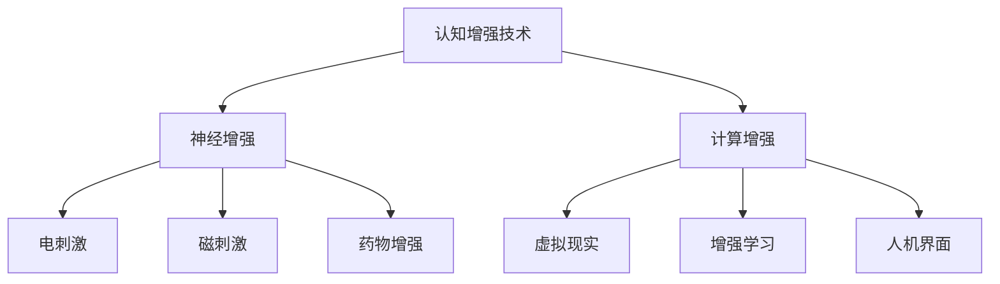

                 

# 《认知增强技术的伦理考量》

## 关键词：
认知增强技术，伦理争议，隐私保护，技术监管，可持续发展

## 摘要：
认知增强技术作为一种新兴技术，正逐步改变人类的生活和工作方式。然而，其广泛应用也引发了诸多伦理争议，包括数据隐私、技术滥用、人类独特性等。本文将详细探讨认知增强技术的伦理考量，从背景、影响、伦理争议、决策框架、实践现状、对策与建议以及未来展望等方面进行深入分析，以期为认知增强技术的健康和可持续发展提供参考。

### 《认知增强技术的伦理考量》目录大纲

#### 第一部分：认知增强技术的背景与概念

##### 1.1 认知增强技术的定义与类型
- **1.1.1 认知增强技术的基本概念**
- **1.1.2 认知增强技术的分类**
  - **图1.1 认知增强技术的分类**

##### 1.2 认知增强技术的发展历程
- **1.2.1 历史回顾**
- **1.2.2 现代认知增强技术的兴起**

##### 1.3 认知增强技术的影响与应用场景
- **1.3.1 对个体的影响**
- **1.3.2 在教育、医疗、军事等领域的应用**

#### 第二部分：认知增强技术的伦理考量

##### 2.1 伦理学基础
- **2.1.1 伦理学的基本原则**
- **2.1.2 伦理学的分析方法**

##### 2.2 认知增强技术的伦理争议
- **2.2.1 数据隐私与信息泄露**
- **2.2.2 技术滥用与成瘾**
- **2.2.3 人类独特性与技术干预**

##### 2.3 认知增强技术的伦理决策框架
- **2.3.1 多方利益平衡**
- **2.3.2 风险管理与监管**

##### 2.4 伦理考量的实际案例研究
- **2.4.1 脑机接口的伦理争议**
- **2.4.2 认知增强药物的使用**

##### 2.5 伦理考量的未来趋势与挑战
- **2.5.1 全球伦理标准的统一**
- **2.5.2 技术进步带来的新伦理问题**

#### 第三部分：认知增强技术的实践与对策

##### 3.1 认知增强技术的实践现状
- **3.1.1 技术应用的发展趋势**
- **3.1.2 各领域的实践案例**

##### 3.2 认知增强技术的对策与建议
- **3.2.1 法律法规的完善**
- **3.2.2 技术伦理教育**
- **3.2.3 技术发展的社会责任**

##### 3.3 伦理考量在认知增强技术项目中的实施
- **3.3.1 项目的伦理审查流程**
- **3.3.2 伦理考量在项目决策中的应用**

#### 第四部分：认知增强技术的未来展望

##### 4.1 认知增强技术的前沿研究
- **4.1.1 神经科学的新进展**
- **4.1.2 新型认知增强技术**

##### 4.2 伦理考量在技术发展中的地位
- **4.2.1 技术进步与伦理考量的相互作用**
- **4.2.2 伦理考量在技术决策中的影响**

##### 4.3 认知增强技术的可持续发展
- **4.3.1 伦理考量在技术可持续发展中的作用**
- **4.3.2 案例分析：伦理考量在认知增强技术项目中的成功实施**

#### 附录

##### 附录 A：相关法律法规与政策文件
- **A.1 国内相关法律法规**
- **A.2 国际相关法律法规**

##### 附录 B：认知增强技术伦理研究资源
- **B.1 学术期刊与书籍推荐**
- **B.2 国际组织与机构介绍**

### 第一部分：认知增强技术的背景与概念

认知增强技术（Cognitive Enhancement Technologies，简称 CET）是指通过生物医学、计算科学和工程技术等手段，提高人类认知功能的技术。认知增强技术的研究和应用涵盖了神经科学、心理学、计算机科学等多个领域，其目标是通过改变大脑功能或外部环境，提升个体的记忆、注意力、学习能力等方面的能力。

#### 1.1 认知增强技术的定义与类型

**1.1.1 认知增强技术的基本概念**

认知增强技术的基本概念包括神经增强和计算增强：

- **神经增强**：通过物理或化学手段刺激或改变大脑功能，如电刺激、磁刺激、药物等。
- **计算增强**：通过计算技术和外部设备辅助人类认知过程，如虚拟现实、增强学习、人机界面等。

**1.1.2 认知增强技术的分类**

认知增强技术可以根据其作用方式和目标进行分类：

- **基于神经科学的认知增强技术**：包括电刺激、磁刺激、药物增强等，通过直接作用于大脑来提高认知功能。
- **基于计算科学的认知增强技术**：包括虚拟现实、增强学习、人机界面等，通过计算技术和外部设备辅助人类认知过程。
- **混合认知增强技术**：结合神经科学和计算科学的方法，通过多种手段综合提高认知功能。

#### 图1.1 认知增强技术的分类

#### 1.2 认知增强技术的发展历程

**1.2.1 历史回顾**

认知增强技术的研究可以追溯到20世纪50年代。当时，科学家开始探索通过电刺激和药物干预来增强认知功能。随着神经科学和生物技术的发展，认知增强技术逐渐从理论研究走向实际应用。

- **1950年代**：科学家开始研究电刺激和药物干预对大脑功能的影响。
- **1960年代**：脑机接口（BMI）技术初步探索，计算机科学的发展为认知增强提供了新的手段。
- **1970年代**：认知神经科学兴起，神经增强技术开始应用于临床研究。
- **1980年代**：脑机接口技术取得突破，虚拟现实技术开始应用于认知增强。

**1.2.2 现代认知增强技术的兴起**

21世纪以来，随着神经科学、计算科学和生物技术的快速发展，认知增强技术进入了一个新的阶段。

- **2000年代**：功能性磁共振成像（fMRI）等神经成像技术的进步，为认知增强技术提供了更深入的神经科学基础。
- **2010年代**：脑机接口技术的发展，实现了对人脑的直接干预。
- **2020年代**：人工智能和大数据技术的进步，为认知增强技术的应用提供了新的平台和可能性。

#### 1.3 认知增强技术的影响与应用场景

**1.3.1 对个体的影响**

认知增强技术对个体的影响主要体现在以下几个方面：

- **提高认知能力**：认知增强技术可以通过多种方式提高个体的记忆、注意力、学习能力和创造力等认知能力。
- **改善心理健康**：认知增强技术可以帮助治疗抑郁症、焦虑症等心理疾病，提高个体的情绪调节能力。
- **促进康复**：认知增强技术可以帮助康复患者恢复认知功能，提高生活质量。
- **延长寿命**：认知增强技术有望延缓认知衰老，延长健康寿命。

**1.3.2 在教育领域的应用**

认知增强技术在教育领域的应用主要包括：

- **个性化学习**：通过认知增强技术，学生可以获得个性化的学习资源和辅导，提高学习效果。
- **智能辅导系统**：智能辅导系统利用认知增强技术，为学生提供实时反馈和指导，帮助他们解决学习难题。
- **学习资源优化**：认知增强技术可以帮助教育机构优化学习资源的分配和使用，提高教学效率。

**1.3.3 在医疗领域的应用**

认知增强技术在医疗领域的应用主要包括：

- **诊断与治疗**：认知增强技术可以帮助医生更准确地诊断和治疗认知障碍和神经疾病。
- **康复与护理**：认知增强技术可以帮助康复患者恢复认知功能，提高护理质量。
- **心理健康管理**：认知增强技术可以帮助患者进行心理健康管理，改善心理状态。

**1.3.4 在军事领域的应用**

认知增强技术在军事领域的应用主要包括：

- **士兵训练**：通过认知增强技术，可以提高士兵的认知能力、反应速度和决策能力，提高战斗效能。
- **战场侦察**：认知增强技术可以帮助士兵在复杂战场上进行更有效的侦察和作战。
- **指挥控制**：认知增强技术可以提高指挥官的决策能力和指挥效率。

**1.3.5 在工业领域的应用**

认知增强技术在工业领域的应用主要包括：

- **工人培训**：通过认知增强技术，可以提高工人的技能水平和安全意识，减少事故发生。
- **设备维护**：认知增强技术可以帮助工人更快速地诊断和解决设备故障，提高生产效率。
- **生产优化**：认知增强技术可以帮助企业优化生产流程，提高生产效率和产品质量。

**1.3.6 在个人提升领域的应用**

认知增强技术在个人提升领域的应用主要包括：

- **日常学习与工作**：通过认知增强技术，可以提高个人的学习效率和工作效率，提高生活质量。
- **休闲与娱乐**：认知增强技术可以为个人提供更丰富的休闲和娱乐体验，如虚拟现实游戏和增强现实应用。
- **心理调节**：认知增强技术可以帮助个人进行心理调节，缓解压力和焦虑，提高心理健康水平。

### 第二部分：认知增强技术的伦理考量

#### 2.1 伦理学基础

**2.1.1 伦理学的基本原则**

伦理学是关于道德和行为的哲学研究，其基本原则包括：

- **尊重个人自主权**：尊重个人的自由意志和选择权，确保个体在道德决策中的主体地位。
- **公平与正义**：追求社会公正和平等，确保资源和机会的合理分配。
- **安全与透明度**：确保技术应用的安全性和透明度，防止潜在的负面影响。
- **责任与义务**：强调个体和企业在技术应用中的责任和义务，确保行为符合道德规范。

**2.1.2 伦理学的分析方法**

伦理学的分析方法主要包括：

- **功利主义**：以最大化总体幸福为原则，评估技术应用的道德价值。
- **义务论**：以道德规则和责任为基础，评估技术行为的道德合理性。
- **权利论**：以个人权利和自由为基础，评估技术对个人权利的侵犯程度。
- **公正论**：以社会公平和正义为原则，评估技术对社会结构和利益的潜在影响。

#### 2.2 认知增强技术的伦理争议

**2.2.1 数据隐私与信息泄露**

认知增强技术通常涉及对个人大脑活动和行为数据的收集和分析。这引发了关于数据隐私和信息泄露的担忧：

- **隐私权问题**：个人大脑数据可能被视为敏感信息，未经同意收集和使用可能侵犯隐私权。
- **信息泄露风险**：未经授权访问和使用个人大脑数据可能导致信息泄露，对个人和社会造成潜在危害。

**2.2.2 技术滥用与成瘾**

认知增强技术的滥用和成瘾问题也引起了广泛关注：

- **滥用风险**：认知增强技术可能被用于不当目的，如提高考试成绩、增加工作强度等，导致道德和法律问题。
- **成瘾性**：一些认知增强技术可能具有成瘾性，长期使用可能导致依赖和心理健康问题。

**2.2.3 人类独特性与技术干预**

认知增强技术对人类独特性的干预引发了伦理争议：

- **人类独特性挑战**：认知增强技术可能削弱人类独特的认知和情感体验，引发对人类本质的质疑。
- **技术干预的适度性**：如何平衡技术干预和人类自然发展之间的关系，避免过度干预。

**2.2.4 不平等问题**

认知增强技术在应用过程中可能加剧社会不平等问题：

- **资源分配不公**：认知增强技术可能仅限于富裕人群，加剧社会阶层差距。
- **教育不平等**：认知增强技术可能对教育公平产生影响，富人家的孩子可能更容易获得认知增强的优势。

#### 2.3 认知增强技术的伦理决策框架

为了应对认知增强技术引发的伦理争议，建立合理的伦理决策框架至关重要。以下是一个可能的认知增强技术伦理决策框架：

**2.3.1 伦理原则**

- **尊重个人自主权**：确保个人有权自主决定是否接受认知增强技术，并保护其隐私权。
- **公平与正义**：确保认知增强技术的应用不加剧社会不平等，促进社会公平。
- **安全与透明度**：确保认知增强技术的安全性和透明度，避免技术滥用和隐私泄露。
- **可持续性**：确保认知增强技术的应用符合可持续发展的原则，保护环境和人类健康。

**2.3.2 伦理审查与监管**

- **伦理审查委员会**：建立专门的伦理审查委员会，负责评估认知增强技术的伦理影响。
- **法律与政策制定**：制定相关法律法规，明确认知增强技术的监管框架和责任。
- **公众参与**：鼓励公众参与认知增强技术的伦理决策过程，提高透明度和公众信任。

#### 2.4 伦理考量的实际案例研究

以下是一些认知增强技术的实际案例，展示了伦理考量在具体情境中的应用：

**2.4.1 脑机接口的伦理争议**

脑机接口技术（BMI）是一种将人类大脑信号转换为机器控制信号的技术。以下是一个脑机接口技术的伦理争议案例：

- **案例背景**：一位瘫痪患者通过脑机接口技术实现了对机器手臂的控制，提高了生活质量。
- **伦理争议**：
  - **隐私权**：脑机接口技术可能收集和分析患者的私人大脑信号，引发隐私权争议。
  - **安全风险**：脑机接口技术可能导致信号泄露或被黑客攻击，对患者的安全构成威胁。
  - **技术滥用**：脑机接口技术可能被用于非法目的，如操纵他人或进行间谍活动。

**2.4.2 认知增强药物的使用**

认知增强药物是一种通过化学手段增强认知功能的药物。以下是一个认知增强药物使用的伦理争议案例：

- **案例背景**：一名学生因学业压力而开始服用认知增强药物，以提高学习效率。
- **伦理争议**：
  - **健康风险**：长期使用认知增强药物可能对身体健康产生负面影响，如失眠、焦虑和心脏问题。
  - **公平性**：认知增强药物的使用可能导致学业竞争不公，富人家孩子可能更容易获得优势。
  - **道德责任**：使用认知增强药物可能违反道德准则，如诚实和公平竞争。

#### 2.5 伦理考量的未来趋势与挑战

随着认知增强技术的不断发展，伦理考量也将面临新的趋势和挑战：

**2.5.1 全球伦理标准的统一**

- **必要性**：全球伦理标准的统一对于认知增强技术的健康发展至关重要。
- **挑战**：不同国家和地区的文化、法律和价值观差异可能导致伦理标准的冲突。

**2.5.2 技术进步带来的新伦理问题**

- **脑机接口的伦理问题**：脑机接口技术的进步可能引发新的伦理争议，如大脑信号的隐私权和伦理责任。
- **新型认知增强技术的伦理考量**：随着新型认知增强技术的出现，如神经调节技术，如何平衡技术创新和伦理考量成为重要议题。

**2.5.3 伦理考量的持续关注**

- **持续关注**：伦理考量应该贯穿于认知增强技术的整个生命周期，从研发、应用到监管，确保技术的健康和可持续发展。
- **公众参与**：提高公众对认知增强技术伦理考量的关注和参与，促进社会共识的形成。

### 第三部分：认知增强技术的实践与对策

#### 3.1 认知增强技术的实践现状

认知增强技术已在多个领域取得了显著进展，实践现状如下：

**3.1.1 教育领域的应用**

- **个性化学习**：通过认知增强技术，学生可以获得个性化的学习资源和辅导，提高学习效果。
- **智能辅导系统**：智能辅导系统利用认知增强技术，为学生提供实时反馈和指导，帮助他们解决学习难题。
- **学习资源优化**：认知增强技术可以帮助教育机构优化学习资源的分配和使用，提高教学效率。

**3.1.2 医疗领域的应用**

- **认知障碍治疗**：认知增强技术可以帮助治疗阿尔茨海默病、自闭症等认知障碍，提高患者的生活质量。
- **心理健康管理**：认知增强技术可以帮助患者进行心理健康管理，改善心理状态，如焦虑和抑郁症的治疗。
- **诊断与康复**：认知增强技术可以帮助医生更准确地诊断疾病，提高康复效果。

**3.1.3 军事领域的应用**

- **士兵训练**：认知增强技术可以提高士兵的认知能力、反应速度和决策能力，提高战斗效能。
- **战场侦察**：认知增强技术可以帮助士兵在复杂战场上进行更有效的侦察和作战。
- **指挥控制**：认知增强技术可以提高指挥官的决策能力和指挥效率，优化军事行动。

**3.1.4 工业领域的应用**

- **工人培训**：通过认知增强技术，可以提高工人的技能水平和安全意识，减少事故发生。
- **设备维护**：认知增强技术可以帮助工人更快速地诊断和解决设备故障，提高生产效率。
- **生产优化**：认知增强技术可以帮助企业优化生产流程，提高生产效率和产品质量。

**3.1.5 个人提升领域的应用**

- **日常学习与工作**：通过认知增强技术，可以提高个人的学习效率和工作效率，提高生活质量。
- **休闲与娱乐**：认知增强技术可以为个人提供更丰富的休闲和娱乐体验，如虚拟现实游戏和增强现实应用。
- **心理调节**：认知增强技术可以帮助个人进行心理调节，缓解压力和焦虑，提高心理健康水平。

#### 3.2 认知增强技术的对策与建议

为了应对认知增强技术带来的伦理争议和社会挑战，以下是一些具体的对策与建议：

**3.2.1 法律法规的完善**

- **制定法律法规**：完善相关法律法规，明确认知增强技术的应用范围、责任和义务。
- **强化监管**：加强对认知增强技术的监管，确保其合法、安全、透明地使用。
- **保护隐私**：加强个人数据保护，防止隐私泄露和滥用。

**3.2.2 技术伦理教育**

- **加强伦理教育**：在相关领域推广伦理教育，提高从业人员和社会公众的伦理意识。
- **培养伦理审查能力**：加强伦理审查人员的培训，提高他们的伦理审查能力。
- **公众参与**：鼓励公众参与认知增强技术的伦理讨论，提高透明度和公众信任。

**3.2.3 技术发展的社会责任**

- **企业社会责任**：企业应承担社会责任，确保认知增强技术的研发和应用符合伦理标准。
- **科研伦理**：加强科研伦理规范，确保科研人员在认知增强技术领域的科研活动符合伦理要求。
- **国际合作**：加强国际合作，制定全球伦理标准和规范，促进认知增强技术的健康发展。

#### 3.3 伦理考量在认知增强技术项目中的实施

在认知增强技术项目中，伦理考量应贯穿于整个项目生命周期，以下是一个可能的伦理考量实施框架：

**3.3.1 项目启动阶段**

- **伦理评估**：在项目启动前，进行伦理评估，识别潜在伦理风险和挑战。
- **伦理决策**：制定伦理决策框架，确保项目符合伦理标准和法律法规。
- **伦理培训**：对项目团队成员进行伦理培训，提高他们的伦理意识。

**3.3.2 项目实施阶段**

- **伦理审查**：建立伦理审查机制，对项目实施过程进行伦理审查，确保项目符合伦理要求。
- **隐私保护**：加强个人数据保护，确保数据隐私和安全。
- **透明度**：提高项目透明度，鼓励公众参与和监督。

**3.3.3 项目评估阶段**

- **伦理影响评估**：对项目实施后的伦理影响进行评估，识别和解决潜在的伦理问题。
- **伦理反馈**：收集伦理反馈，持续改进项目实施过程和伦理决策。
- **伦理持续关注**：保持对项目伦理问题的持续关注，确保项目的伦理健康和可持续发展。

### 第四部分：认知增强技术的未来展望

#### 4.1 认知增强技术的前沿研究

认知增强技术的前沿研究涉及多个领域，以下是一些主要的研究方向：

**4.1.1 神经科学的新进展**

- **大脑连接图谱**：研究大脑不同区域之间的连接和交互，为认知增强提供新的理论基础。
- **神经元活动解析**：通过解析神经元活动，揭示认知过程和神经机制。
- **神经可塑性**：研究神经可塑性机制，为认知增强提供新的干预手段。

**4.1.2 新型认知增强技术**

- **脑机接口**：开发新型脑机接口技术，提高人脑与机器之间的交互能力。
- **神经调节技术**：研究神经调节技术，如深部脑刺激术（DBS）和经颅磁刺激（TMS）等，为认知增强提供新的手段。
- **计算增强**：利用计算技术和人工智能，开发新型认知增强系统，提高个体的认知能力。

**4.1.3 跨学科合作**

- **神经科学、计算机科学和生物技术的交叉研究**：推动认知增强技术的创新发展。
- **多学科合作**：通过跨学科合作，解决认知增强技术面临的理论和实践问题。
- **国际合作**：促进国际间的合作与交流，推动认知增强技术的全球发展。

#### 4.2 伦理考量在技术发展中的地位

伦理考量在认知增强技术的发展中占据重要地位，以下是一些关键点：

- **指导原则**：伦理考量为认知增强技术的发展提供了指导原则，确保技术的研发和应用符合伦理标准。
- **风险评估**：伦理考量可以帮助识别和评估认知增强技术的潜在风险，为风险管理提供依据。
- **公众信任**：伦理考量有助于提高公众对认知增强技术的信任，促进技术的推广和应用。
- **社会责任**：伦理考量体现了技术发展的社会责任，推动技术的可持续发展。

#### 4.3 认知增强技术的可持续发展

认知增强技术的可持续发展需要从多个方面进行考虑：

- **技术进步**：通过持续的技术创新，提高认知增强技术的性能和安全性。
- **伦理考量**：在技术发展中充分考虑伦理考量，确保技术的研发和应用符合伦理标准。
- **社会责任**：企业和社会应承担社会责任，确保认知增强技术的公平、透明和可持续发展。
- **公众参与**：鼓励公众参与认知增强技术的讨论和决策，提高透明度和公众信任。

### 附录

#### 附录 A：相关法律法规与政策文件

**附录 A.1 国内相关法律法规**

- **《中华人民共和国网络安全法》**：明确网络数据的保护要求，对个人信息保护提供法律依据。
- **《中华人民共和国数据安全法》**：规范数据处理活动，加强数据安全保护。
- **《中华人民共和国个人信息保护法》**：加强对个人信息的保护，规范个人信息处理活动。
- **《中华人民共和国生物安全法》**：规范生物技术研究、开发和应用，确保生物安全。

**附录 A.2 国际相关法律法规**

- **《欧盟通用数据保护条例》（GDPR）**：加强对个人数据的保护，规范数据处理活动。
- **《美国隐私法》**：规范个人信息的收集、使用和保护。
- **《联合国生物多样性公约》**：规范生物技术研究、开发和应用，保护生物多样性。
- **《国际人权法》**：保障人类的基本权利和自由，包括隐私权、知情权等。

#### 附录 B：认知增强技术伦理研究资源

**附录 B.1 学术期刊与书籍推荐**

- **《神经科学与生物学杂志》（Journal of Neuroscience）**：发布认知增强技术的最新研究成果。
- **《认知科学杂志》（Journal of Cognitive Science）**：探讨认知增强技术的理论和方法。
- **《人类行为与认知科学杂志》（Human Behavior and Cognitive Science）**：研究认知增强技术在人类行为中的应用。
- **《伦理学与信息技术》（Ethics and Information Technology）**：关注认知增强技术的伦理问题。

**附录 B.2 国际组织与机构介绍**

- **国际认知增强技术协会（International Society for Cognitive Enhancement Technologies）**：促进认知增强技术的研究和应用。
- **国际脑机接口协会（International Brain-Computer Interface Society）**：推动脑机接口技术的发展。
- **欧盟伦理委员会（European Ethics Committee）**：负责评估认知增强技术的伦理影响。
- **美国国家生物伦理委员会（National Bioethics Advisory Commission）**：提供生物伦理咨询，指导认知增强技术的研究和应用。

### 作者

**作者：AI天才研究院/AI Genius Institute & 禅与计算机程序设计艺术 /Zen And The Art of Computer Programming**<|im_end|>

