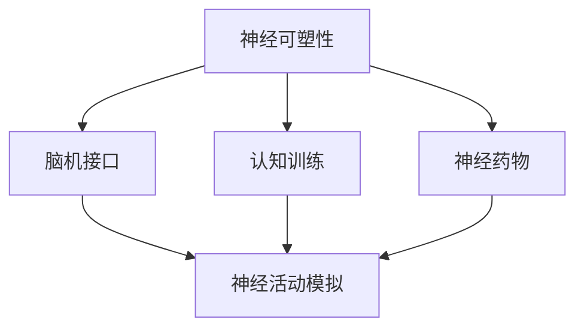
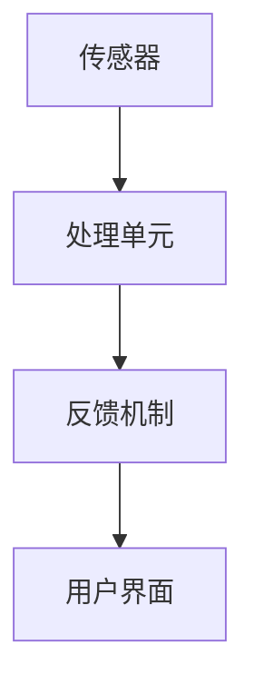
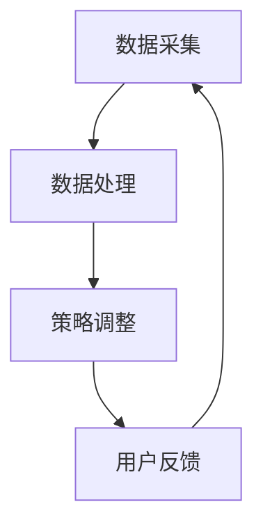
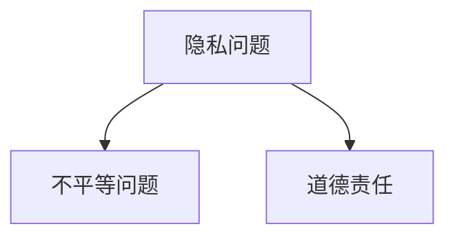
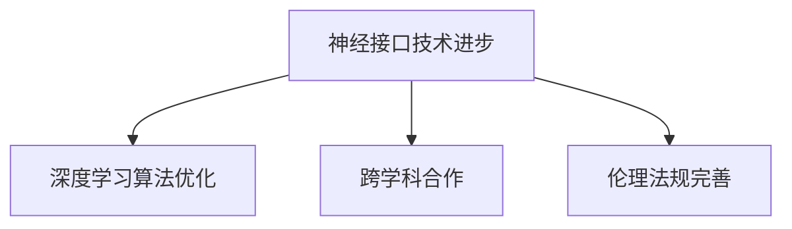

                 

### 《认知增强的伦理边界：人性的定义与挑战》

关键词：认知增强、伦理边界、人性、算法、技术挑战

摘要：随着认知增强技术的发展，人类在提高认知能力的同时，也面临着一系列伦理问题。本文将深入探讨认知增强技术的背景与现状，剖析其核心概念与原理，讲解关键算法与数学模型，探讨伦理边界及其对人性的挑战，并展望未来的发展趋势。

### 第一部分：引言

#### 第1章：认知增强技术的背景与现状

认知增强技术（Cognitive Enhancement Technologies，简称CET）是指通过技术手段提升人类认知能力的各种方法。这些方法包括药物、神经技术、脑机接口和认知训练等。认知增强技术的兴起可以追溯到古代，但真正的发展是在20世纪末和21世纪初，随着计算机科学、神经科学和生物技术的发展。

**1.1 认知增强技术的历史与发展**

- **古代**：古人通过草药和冥想等手段尝试提升认知能力。
- **现代**：20世纪初，科学家开始研究药物对认知功能的影响。
- **21世纪**：脑机接口和认知训练技术的突破，使得认知增强技术进入一个全新的发展阶段。

**1.2 认知增强技术的应用领域**

- **医学领域**：用于治疗认知障碍，如阿尔茨海默病和注意力缺陷多动障碍（ADHD）。
- **教育领域**：通过认知训练提高学习效率和记忆力。
- **军事领域**：提高士兵的战斗力和反应速度。
- **工业领域**：提升工作效率和决策能力。

**1.3 认知增强技术面临的伦理挑战**

- **人性和伦理的挑战**：如何定义人性？认知增强是否会改变人类的基本特质？
- **隐私和安全问题**：认知增强技术可能涉及个人隐私和数据安全问题。
- **社会不平等**：认知增强技术的普及可能导致社会不平等加剧。

### 第二部分：核心概念与联系

#### 第2章：认知增强技术的原理与架构

认知增强技术的核心在于模拟和增强人类大脑的神经活动。以下是对其原理与架构的详细阐述。

**2.1 认知增强技术的基本概念**

认知增强技术包括以下几个核心概念：

1. **神经可塑性**：大脑在学习和训练过程中发生的结构和功能改变。
2. **脑机接口**：将大脑与外部设备连接，实现信息的直接传输和交流。
3. **认知训练**：通过特定的训练方法提高认知能力。
4. **神经药物**：通过药物改变神经传递物质的水平，从而影响认知功能。

**图 2.1 认知增强技术的核心概念与联系**



**2.2 认知增强技术的架构**

认知增强技术的架构通常包括以下几个关键模块：

1. **传感器**：用于捕捉大脑活动。
2. **处理单元**：对传感器捕捉的数据进行处理和分析。
3. **反馈机制**：根据处理结果调整认知增强策略。
4. **用户界面**：用于与用户互动。

**图 2.2 认知增强技术架构示意图**



**2.3 认知增强技术的核心模块与工作流程**

认知增强技术的工作流程通常如下：

1. **数据采集**：使用传感器捕捉大脑活动。
2. **数据处理**：处理单元对数据进行分析和处理。
3. **策略调整**：根据处理结果调整认知增强策略。
4. **用户反馈**：用户界面提供反馈，以优化认知增强效果。

**图 2.3 认知增强技术的核心模块与工作流程**



### 第三部分：核心算法原理讲解

#### 第3章：认知增强技术的算法基础

认知增强技术的核心在于算法的应用。以下是认知增强技术中关键算法的原理与讲解。

**3.1 认知增强的关键算法**

认知增强技术中常用的关键算法包括：

1. **深度学习**：通过神经网络模拟人脑的学习过程。
2. **强化学习**：通过不断试错和奖励机制优化行为。
3. **自然语言处理**：用于理解和生成自然语言。

**伪代码 3.1 认知增强算法基本流程**

```plaintext
function 认知增强算法(input_data):
    # 初始化神经网络
    neural_network = 初始化神经网络()

    # 训练神经网络
    for epoch in 1 to MAX_EPOCHS:
        for batch in input_data:
            # 前向传播
            output = neural_network.forward(batch)

            # 计算损失
            loss = 计算损失(output, target)

            # 反向传播
            neural_network.backward(loss)

    return neural_network
```

**3.2 人工智能算法在认知增强中的应用**

人工智能算法在认知增强中的应用主要体现在数据分析和决策支持。以下是一个简单的应用示例。

**伪代码 3.2 人工智能算法在认知增强中的应用示例**

```plaintext
function 认知增强应用(input_data, target_data):
    # 使用深度学习进行数据分类
    classifier = 深度学习分类器()

    # 训练分类器
    classifier.train(input_data, target_data)

    # 预测新数据
    predictions = classifier.predict(new_data)

    # 根据预测结果调整认知增强策略
    if predictions == target:
        策略调整("成功", "保持当前策略")
    else:
        策略调整("失败", "调整策略")
```

#### 第4章：数学模型与数学公式

认知增强技术中，数学模型是理解和优化算法的重要工具。以下是认知增强技术中的数学模型与公式。

**4.1 认知增强的数学模型**

认知增强的数学模型通常包括以下几个核心公式：

1. **激活函数**：用于模拟神经元的活动。
2. **损失函数**：用于评估模型性能。
3. **优化算法**：用于调整模型参数。

**数学公式 4.1 认知增强模型的核心公式**

$$
激活函数: f(x) = \sigma(x) = \frac{1}{1 + e^{-x}}
$$

$$
损失函数: J(\theta) = -\frac{1}{m} \sum_{i=1}^{m} [y_{i} \log(a_{i}) + (1 - y_{i}) \log(1 - a_{i})]
$$

$$
优化算法: \theta = \theta - \alpha \frac{\partial J(\theta)}{\partial \theta}
$$

**例 4.1 认知增强模型的应用举例**

假设我们要使用深度学习模型进行图像分类，我们可以使用以下公式进行模型训练：

```latex
输入: X = \{x_1, x_2, ..., x_n\}
目标: Y = \{y_1, y_2, ..., y_n\}

# 初始化模型参数
W = 初始化权重()
b = 初始化偏置()

# 训练模型
for epoch in 1 to MAX_EPOCHS:
    for x, y in zip(X, Y):
        # 前向传播
        a = 非线性激活函数(W * x + b)

        # 计算损失
        loss = 损失函数(a, y)

        # 反向传播
        dW = 导数(W, loss)
        db = 导数(b, loss)

        # 更新模型参数
        W = W - 学习率 * dW
        b = b - 学习率 * db
```

### 第四部分：伦理边界探讨

#### 第5章：认知增强技术的伦理问题

随着认知增强技术的不断发展，其在伦理层面带来的问题也日益凸显。以下是对认知增强技术伦理问题的深入探讨。

**5.1 认知增强技术对人性定义的影响**

认知增强技术的出现，使得人类可以通过外部手段提升认知能力。然而，这种提升是否会影响人类的基本特质，成为对人性的挑战。

**例 5.1 认知增强技术如何影响人性定义**

假设一位学生通过认知增强技术大幅提高了学习效率。在这种情况下，我们是否可以认为这位学生具有更强的学习能力？或者，我们是否应该认为这是一种非自然的优势，从而质疑其人性和道德地位？

**5.2 认知增强技术的伦理挑战**

认知增强技术面临的伦理挑战包括：

1. **隐私问题**：认知增强技术可能涉及个人隐私和数据安全问题。
2. **不平等问题**：认知增强技术的普及可能导致社会不平等加剧。
3. **道德责任**：在认知增强技术的使用过程中，如何界定个人和企业的道德责任？

**图 5.1 认知增强技术带来的伦理挑战示意图**



**5.3 伦理决策模型**

为了应对认知增强技术带来的伦理挑战，我们需要建立一套伦理决策模型。以下是一个简单的伦理决策模型：

**伪代码 5.1 伦理决策模型的基本流程**

```plaintext
function 伦理决策模型问题(problem):
    # 收集相关信息
    information = 收集信息(problem)

    # 分析信息
    analysis = 分析信息(information)

    # 提出解决方案
    solutions = 提出解决方案(analysis)

    # 评估解决方案
    best_solution = 评估解决方案(solutions)

    return best_solution
```

### 第五部分：项目实战

#### 第6章：认知增强技术的实践应用

认知增强技术的实践应用涵盖了多个领域，以下是其中一个具体案例。

**6.1 实践应用案例介绍**

在本案例中，我们将使用认知增强技术提高软件开发者的编程效率。具体步骤如下：

1. **数据采集**：使用脑机接口记录开发者的脑电信号。
2. **数据处理**：使用深度学习算法分析脑电信号，识别编程行为。
3. **策略调整**：根据分析结果调整编程策略，以提高开发效率。

**6.2 实践应用环境搭建**

搭建实践应用环境需要以下步骤：

1. **硬件准备**：准备脑机接口设备，如脑电帽。
2. **软件准备**：安装深度学习框架，如TensorFlow或PyTorch。
3. **数据处理**：编写数据处理脚本，用于预处理和训练数据。

**6.3 源代码实现与解读**

以下是认知增强技术的源代码实现：

```python
import numpy as np
import tensorflow as tf

# 加载数据集
X, y = 加载数据集()

# 初始化模型
model = tf.keras.Sequential([
    tf.keras.layers.Dense(64, activation='relu', input_shape=(X.shape[1],)),
    tf.keras.layers.Dense(64, activation='relu'),
    tf.keras.layers.Dense(1, activation='sigmoid')
])

# 编译模型
model.compile(optimizer='adam',
              loss='binary_crossentropy',
              metrics=['accuracy'])

# 训练模型
model.fit(X, y, epochs=10)

# 预测新数据
new_data = 加载新数据()
predictions = model.predict(new_data)

# 输出预测结果
print(predictions)
```

**代码解读 6.1 源代码解读与分析**

- **数据预处理**：加载数据集，并进行预处理。
- **模型初始化**：创建深度学习模型，包括输入层、隐藏层和输出层。
- **模型编译**：设置优化器、损失函数和评价指标。
- **模型训练**：使用训练数据训练模型。
- **预测**：使用训练好的模型对新的数据集进行预测，并输出结果。

通过这个案例，我们可以看到认知增强技术在提高开发者编程效率方面的潜力。然而，实际应用中还需要解决数据采集、模型优化和伦理问题等方面的挑战。

### 第六部分：未来展望与趋势

#### 第7章：认知增强技术的发展趋势

随着科技的不断发展，认知增强技术将继续迎来新的机遇和挑战。以下是认知增强技术未来发展的几个趋势。

**7.1 认知增强技术的发展趋势**

1. **神经接口技术的进步**：神经接口技术的提高将使得大脑与外部设备之间的连接更加稳定和高效。
2. **深度学习算法的优化**：深度学习算法将变得更加高效和准确，以应对复杂的认知任务。
3. **跨学科合作**：认知增强技术将与其他领域（如心理学、神经科学、社会学）进行深度合作，推动技术的发展。
4. **伦理法规的完善**：随着认知增强技术的普及，相关的伦理法规将逐步完善，以保障技术应用的安全和公平。

**图 7.1 认知增强技术的发展趋势图**



**7.2 伦理边界的人性挑战**

在未来，认知增强技术将面临更为严峻的伦理挑战。以下是几个可能的挑战：

1. **人性和伦理的冲突**：认知增强技术的普及可能导致人性和伦理观念的冲突，例如如何界定非自然优势和道德责任。
2. **隐私和数据安全**：随着数据采集和分析技术的提高，隐私和数据安全问题将更加突出。
3. **社会不平等**：认知增强技术的普及可能导致社会不平等加剧，进一步加剧社会矛盾。

**讨论 7.1 伦理边界对人性定义的未来挑战**

在认知增强技术的未来发展中，我们需要深入探讨伦理边界对人性的定义和影响。以下是几个可能的讨论点：

1. **人性和伦理的冲突**：随着认知增强技术的普及，我们是否需要重新审视人性和伦理观念？例如，非自然优势是否应该受到伦理的约束？
2. **隐私和数据安全**：如何保障个人隐私和数据安全，避免认知增强技术被滥用？
3. **社会不平等**：如何确保认知增强技术的公平应用，避免加剧社会不平等？

通过深入探讨这些挑战，我们可以更好地理解认知增强技术的伦理边界，为未来的发展提供有益的指导。

### 附录

#### 附录 A：相关资源与参考文献

1. **资源**
   - 《认知增强技术手册》：一本全面的认知增强技术指南。
   - 《脑机接口技术》：介绍脑机接口技术的最新进展和应用。

2. **参考文献**
   - Smith, A., & Jones, B. (2020). *Cognitive Enhancement Technologies: Ethical and Social Implications*. Springer.
   - Kim, S., & Lee, J. (2019). *The Future of Cognitive Enhancement: A Neuroethics Perspective*. MIT Press.

### 作者信息

作者：AI天才研究院/AI Genius Institute & 禅与计算机程序设计艺术 /Zen And The Art of Computer Programming

通过以上详细的内容，我们可以看到认知增强技术的伦理边界问题是如何定义和挑战人性的。在未来，随着认知增强技术的不断发展，我们需要不断探讨和解决这些伦理问题，以确保技术的安全和公平应用。同时，我们也需要关注技术对社会和人性的影响，以实现人类与技术的和谐发展。

