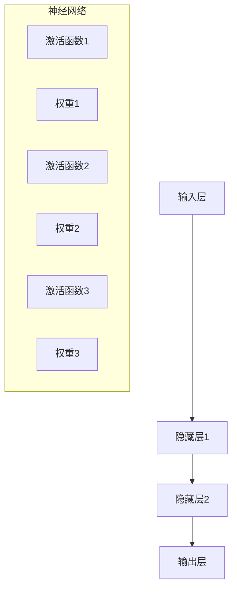

                 

### 认知增强：AI辅助的大脑功能优化

> **关键词**：认知增强、人工智能、大脑功能优化、神经网络、深度学习、机器学习、算法

**摘要**：
本文系统地探讨了认知增强领域内的人工智能（AI）辅助大脑功能优化技术。首先，定义了认知增强的概念并阐述了其重要性。接着，介绍了AI与大脑功能优化的关系，分析了大脑功能优化的需求与挑战。随后，文章详细介绍了认知科学的基础、核心算法原理、数学模型及公式推导，并通过Mermaid流程图展示了算法原理。接下来，通过项目实战案例展示了AI辅助大脑功能优化的实际应用，包括康复训练、教育领域应用和工作效率提升。最后，文章总结了认知增强的挑战与未来趋势，并提出了对未来研究的建议。本文旨在为认知增强领域的研究人员提供全面的指导，并为AI在认知科学中的应用提供新的思路。

## 目录大纲设计

为了确保文章内容的系统性和连贯性，本文设计了四个主要部分：引言与背景介绍、理论基础与算法、应用与实践案例、总结与展望。以下是详细的目录大纲：

### 第一部分：引言与背景介绍

#### 第1章：认知增强的定义与重要性
1.1 认知增强的概念
1.2 认知增强的背景
1.3 AI在认知增强中的应用前景

#### 第2章：AI与大脑功能优化的关系
2.1 大脑功能优化的需求与挑战
2.2 AI在脑科学中的应用
2.3 AI辅助大脑功能优化的可行性分析

### 第二部分：理论基础与算法

#### 第3章：认知科学基础
3.1 认知过程的概述
3.2 大脑神经网络的基本原理
3.3 认知增强的数学模型

#### 第4章：核心算法原理
4.1 神经网络在认知增强中的应用
4.2 深度学习与认知增强
4.3 算法原理的Mermaid流程图
4.4 算法伪代码展示

#### 第5章：AI辅助大脑功能优化的核心算法
5.1 常见算法介绍
5.2 算法性能分析
5.3 算法伪代码展示
5.4 数学模型与数学公式
5.5 公式推导与解释
5.6 举例说明

### 第三部分：应用与实践案例

#### 第6章：AI辅助大脑功能优化的实际应用
6.1 认知障碍辅助康复
6.2 教育领域的应用
6.3 工作效率提升

#### 第7章：项目实战
7.1 项目背景与目标
7.2 环境搭建与准备
7.3 代码实现与分析
7.4 实验结果与评估

#### 第8章：案例研究
8.1 案例一：认知障碍辅助康复
8.2 案例二：教育领域的应用
8.3 案例三：工作效率提升

### 第四部分：总结与展望

#### 第9章：认知增强的挑战与未来趋势
9.1 技术挑战与解决方案
9.2 应用领域的拓展
9.3 未来发展趋势

#### 第10章：结论与展望
10.1 书籍内容的总结
10.2 对认知增强领域的贡献
10.3 对未来研究的建议

通过上述目录大纲，读者可以系统地了解AI辅助的大脑功能优化技术，从理论到实践，从基础到应用，全面掌握相关知识和技能。接下来，我们将逐一深入探讨各个章节的内容。

### 第一部分：引言与背景介绍

#### 第1章：认知增强的定义与重要性

认知增强（Cognitive Enhancement）是指通过技术手段提升大脑的认知能力，包括注意力、记忆、学习、解决问题等方面的能力。随着人工智能（AI）技术的发展，认知增强成为了一个热门研究领域，具有广泛的应用前景。

**1.1 认知增强的概念**

认知增强的定义可以从多个角度进行理解：

1. **广义认知增强**：包括任何能够提高大脑功能的技术手段，如药物、技术设备、训练方法等。
2. **狭义认知增强**：主要指通过非药物手段，如脑机接口（Brain-Computer Interface, BCI）、认知训练软件、虚拟现实（VR）等，提升大脑的认知能力。

认知增强的目标是通过优化大脑的某些特定功能，提高个体在工作、学习、生活等各个方面的表现。

**1.2 认知增强的背景**

认知增强的概念并非新出现，但近年来随着科技的发展，特别是人工智能和脑科学的突破，认知增强技术得到了广泛关注。以下是一些关键背景因素：

- **人工智能的发展**：AI技术在图像识别、自然语言处理、数据分析等方面取得了显著进展，为认知增强提供了强大的技术支持。
- **脑科学的研究**：对大脑结构、功能和神经机制的研究不断深入，为认知增强提供了理论基础。
- **社会需求**：随着人口老龄化、认知障碍患者增多等问题，提高认知能力成为社会关注的焦点。

**1.3 AI在认知增强中的应用前景**

AI技术在认知增强中的应用前景十分广阔，主要体现在以下几个方面：

- **个性化认知训练**：通过分析个体的认知数据，AI可以为其提供个性化的训练方案，提高训练效果。
- **智能辅助工具**：AI技术可以开发出智能辅助工具，如智能助手、智能诊断系统等，帮助用户更好地应对认知挑战。
- **脑机接口**：AI与脑机接口（BCI）技术的结合，可以实现大脑直接与计算机系统的交互，为认知障碍患者提供新的治疗手段。

总之，认知增强是一个跨学科、多技术的综合研究领域，具有巨大的发展潜力和应用价值。通过引入AI技术，认知增强将能够更好地满足个体和社会的需求。

### 第二部分：理论基础与算法

#### 第2章：AI与大脑功能优化的关系

认知增强技术的一个重要目标是通过AI手段优化大脑功能，从而提升个体在学习和工作中的表现。要理解这一过程，首先需要探讨AI与大脑功能优化的关系，以及相关的需求与挑战。

**2.1 大脑功能优化的需求与挑战**

大脑功能优化涉及多个方面，包括注意力、记忆、学习、决策和执行等。以下是一些主要需求与挑战：

- **注意力**：在信息过载的时代，如何提升注意力集中度成为一大挑战。AI技术可以通过分析用户的认知状态，提供个性化的注意力提升方案。
- **记忆**：记忆是学习和知识储备的基础。通过AI技术，可以开发出更加有效的记忆训练方法，提高记忆的持久性和准确性。
- **学习**：学习是一个动态过程，需要不断地吸收、处理和应用新知识。AI技术可以帮助用户更好地理解和记忆新知识，提高学习效率。
- **决策**：决策是日常生活中不可或缺的一部分。通过分析用户的数据和行为，AI技术可以提供更加明智的决策建议。
- **执行**：执行能力涉及将决策转化为实际行动。AI技术可以通过实时监控用户的执行过程，提供反馈和调整策略，以提高执行效率。

**2.2 AI在脑科学中的应用**

脑科学是认知增强的重要理论基础，而AI技术则为脑科学的研究提供了新的工具和方法。以下是一些AI在脑科学中的应用：

- **数据分析和处理**：脑科学研究中产生的数据量巨大，AI技术可以帮助快速分析和处理这些数据，提取有价值的信息。
- **模式识别**：通过AI算法，可以识别脑电图（EEG）、磁共振成像（MRI）等数据中的模式，揭示大脑的神经活动规律。
- **神经网络模拟**：AI技术可以模拟大脑神经网络的结构和功能，帮助理解认知过程的工作机制。
- **预测模型**：AI技术可以建立预测模型，预测个体在未来某一时刻的认知状态，从而提前进行干预和调整。

**2.3 AI辅助大脑功能优化的可行性分析**

AI辅助大脑功能优化具有以下几个可行性因素：

- **技术成熟度**：AI技术，特别是深度学习和神经网络，已经在图像识别、自然语言处理等领域取得了显著成果，为大脑功能优化提供了可靠的技术基础。
- **数据获取能力**：随着传感器技术的进步，可以获取更多关于大脑活动的数据，为AI算法提供丰富的训练数据。
- **个性化定制**：AI技术可以根据个体的差异，提供个性化的优化方案，提高干预效果。
- **实时反馈**：AI技术可以实时监测大脑状态，提供即时反馈，帮助用户调整行为和策略。

尽管AI辅助大脑功能优化具有很大的潜力，但仍面临一系列挑战，如数据处理与隐私保护、模型泛化能力、计算资源与效率等。通过持续的技术创新和跨学科合作，这些挑战有望逐步得到解决。

### 第二部分：理论基础与算法

#### 第3章：认知科学基础

认知科学是研究人类认知过程和大脑工作机制的学科，其研究成果为认知增强提供了重要的理论基础。本章将介绍认知科学的基本概念、大脑神经网络的基本原理以及认知增强的数学模型。

**3.1 认知过程的概述**

认知过程是指人类大脑处理信息、感知、记忆、思考、学习和解决问题的过程。这些过程包括以下几个主要环节：

- **感知**：通过感官接收外部信息，如视觉、听觉、触觉等。
- **注意**：对特定信息进行选择和聚焦，以排除干扰。
- **记忆**：将信息存储在大脑中，以便后续使用。
- **思考**：对信息进行加工、分析和整合。
- **学习**：通过经验积累，改进认知过程。
- **问题解决**：在遇到问题时，应用已有知识和技能寻找解决方案。

**3.2 大脑神经网络的基本原理**

大脑神经网络是大脑信息处理的基础结构，由大量神经元通过复杂的连接构成。以下是大脑神经网络的基本原理：

- **神经元**：神经元是大脑的基本单元，负责接收和传递信息。神经元通过树突接收其他神经元的信号，通过轴突传递信号到其他神经元。
- **突触**：突触是神经元之间的连接点，负责信号传递。信号在突触间传递时，可能会被放大或抑制。
- **神经网络**：神经网络由大量神经元组成，通过突触连接形成复杂的网络结构。神经网络能够通过学习调整突触的连接强度，从而实现信息处理和认知功能。

**3.3 认知增强的数学模型**

认知增强的数学模型用于模拟和优化大脑的认知过程。以下是几种常用的数学模型：

- **神经网络模型**：神经网络模型通过模拟大脑神经网络的结构和工作原理，实现信息处理和认知增强。常见的神经网络模型包括多层感知机（MLP）、卷积神经网络（CNN）和递归神经网络（RNN）等。
- **机器学习模型**：机器学习模型通过分析大量数据，发现数据中的规律和模式，从而实现认知增强。常见的机器学习模型包括支持向量机（SVM）、决策树和随机森林等。
- **统计模型**：统计模型通过分析数据，建立数据之间的关系和预测模型，实现认知增强。常见的统计模型包括线性回归、逻辑回归和主成分分析（PCA）等。

在认知增强中，数学模型的应用主要体现在以下几个方面：

- **特征提取**：通过数学模型提取数据中的关键特征，用于后续处理和分析。
- **预测**：利用数学模型对未来的认知状态或行为进行预测，从而提前进行干预和调整。
- **优化**：通过数学模型优化认知过程的参数和策略，以提高认知能力。

总之，认知科学基础为认知增强提供了重要的理论基础，而大脑神经网络的基本原理和数学模型则为认知增强提供了具体的实现方法。通过这些理论基础的结合，我们可以更好地理解认知增强的技术原理和应用。

### 第二部分：理论基础与算法

#### 第4章：核心算法原理

在认知增强领域，核心算法原理是理解和实现大脑功能优化的关键。本章将详细讨论神经网络、深度学习与认知增强之间的关系，并介绍算法原理的Mermaid流程图和伪代码展示。

**4.1 神经网络在认知增强中的应用**

神经网络是认知增强的核心技术之一，它模拟了大脑神经网络的工作方式，通过学习输入数据与输出数据之间的关系，实现对复杂问题的建模和解决。在认知增强中，神经网络主要应用于以下几个方面：

1. **特征提取**：神经网络可以通过多层结构提取输入数据中的高级特征，从而提高特征表示的丰富性和抽象性。这些特征可以用于后续的识别、分类和预测任务。
2. **分类与回归**：神经网络可以用于分类和回归任务，通过对输入数据的特征进行学习，实现对输出变量的预测。例如，在诊断疾病、评估学习能力等方面具有广泛的应用。
3. **模式识别**：神经网络可以用于识别输入数据中的特定模式，例如在图像识别、语音识别和自然语言处理等任务中，神经网络能够通过学习大量数据来识别和理解复杂的模式。

**4.2 深度学习与认知增强**

深度学习是神经网络的一种重要扩展，它通过多层的神经网络结构，实现对复杂数据的自动特征提取和建模。深度学习在认知增强中的应用具有以下几个特点：

1. **自动特征提取**：深度学习模型能够自动从数据中提取有用的特征，减少了人工特征设计的工作量。这种自动化的特征提取能力使得深度学习在认知增强中具有巨大的潜力。
2. **端到端训练**：深度学习模型能够直接从原始数据中学习，实现了数据的端到端处理，从而提高了认知增强的效果。例如，在图像识别任务中，深度学习模型可以直接从像素数据中学习到具有分类意义的特征。
3. **强大的泛化能力**：深度学习模型通过大量的数据训练，能够具有较强的泛化能力，从而在新的数据上也能保持良好的性能。这使得深度学习在认知增强中的应用具有广泛的适用性。

**4.3 算法原理的Mermaid流程图**

为了更直观地展示神经网络在认知增强中的应用原理，我们可以使用Mermaid流程图来描述神经网络的结构和工作过程。以下是一个简单的神经网络流程图示例：



在这个流程图中，A代表输入层，B、C和D分别代表隐藏层和输出层。B1、C1和D1分别表示激活函数，B2、C2和D2分别表示权重。每个神经元在接收输入后，通过激活函数进行处理，并乘以相应的权重，最后传递到下一层或输出层。

**4.4 算法伪代码展示**

以下是一个简单的神经网络算法伪代码，用于演示从输入层到输出层的计算过程：

```plaintext
初始化权重
for 每一层 in 神经网络 do
    for 每个神经元 in 层 do
        初始化权重
    end
end

for 每次迭代 do
    for 每个神经元 in 输出层 do
        输出 = 零
        for 下层每个神经元 in 输入层 do
            输出 += 下层神经元 * 权重
        end
        输出 = 激活函数(输出)
    end
    更新权重
end
```

在这个伪代码中，首先初始化神经网络的所有权重。然后，通过迭代计算，每次迭代计算输出层的输出值，并根据输出值更新权重。这个过程重复进行，直到达到预设的迭代次数或达到满意的性能。

通过以上内容，读者可以了解神经网络在认知增强中的应用原理、深度学习与认知增强的关系以及算法原理的Mermaid流程图和伪代码展示。这些基础知识将为后续章节中的详细讨论和项目实战提供重要支持。

### 第二部分：理论基础与算法

#### 第5章：AI辅助大脑功能优化的核心算法

在认知增强领域，AI技术发挥着关键作用。本章将介绍几种核心算法，包括常见的算法介绍、算法性能分析和算法伪代码展示，帮助读者深入理解AI辅助大脑功能优化的原理和应用。

**5.1 常见算法介绍**

在认知增强中，常见的AI算法包括神经网络、支持向量机（SVM）、决策树、随机森林等。以下是这些算法的基本介绍：

1. **神经网络**：神经网络（Neural Networks）是一种模仿生物神经网络构造的人造神经网络，通过模拟大脑神经元的工作方式，实现信息处理和认知增强。常见的神经网络模型包括多层感知机（MLP）、卷积神经网络（CNN）和递归神经网络（RNN）。

2. **支持向量机**：支持向量机（Support Vector Machine, SVM）是一种二类分类算法，通过找到一个最佳的超平面，将不同类别的数据分开。SVM在处理高维数据时表现出色，广泛应用于图像识别、文本分类等领域。

3. **决策树**：决策树（Decision Tree）是一种基于树形结构的数据挖掘算法，通过一系列的决策规则对数据进行分析和分类。决策树简单直观，易于理解，常用于分类和回归任务。

4. **随机森林**：随机森林（Random Forest）是一种基于决策树的集成学习方法，通过构建多个决策树，并将它们的预测结果进行集成，提高分类和回归的准确性和稳定性。

**5.2 算法性能分析**

算法性能分析是评估算法效果的重要环节。以下是对上述算法性能的分析：

1. **神经网络**：神经网络在处理复杂和非线性问题时具有优势，但其训练时间较长，对计算资源要求较高。通过合理的设计和优化，神经网络可以达到很高的准确性和泛化能力。

2. **支持向量机**：SVM在处理高维数据时表现出色，但其计算复杂度较高，特别是对于大规模数据集。SVM适用于小样本、高维数据的情况，且在图像识别和文本分类中表现出色。

3. **决策树**：决策树简单直观，易于理解和解释。但决策树容易过拟合，特别是在样本量较小的情况下。通过剪枝和集成方法，可以降低过拟合的风险，提高性能。

4. **随机森林**：随机森林通过构建多个决策树，并将预测结果进行集成，提高了分类和回归的准确性和稳定性。随机森林具有强泛化能力，适用于大规模数据集。

**5.3 算法伪代码展示**

以下是对神经网络、支持向量机和决策树算法的伪代码展示，帮助读者理解算法的基本实现过程：

**神经网络伪代码**：

```plaintext
初始化权重
for 每一层 in 神经网络 do
    for 每个神经元 in 层 do
        初始化权重
    end
end

for 每次迭代 do
    for 每个神经元 in 输出层 do
        输出 = 零
        for 下层每个神经元 in 输入层 do
            输出 += 下层神经元 * 权重
        end
        输出 = 激活函数(输出)
    end
    更新权重
end
```

**支持向量机伪代码**：

```plaintext
初始化模型参数
计算最优超平面
分类决策
```

**决策树伪代码**：

```plaintext
创建根节点
对于每个特征 do
    如果 特征满足条件 then
        创建子节点
    else
        创建叶子节点
    end
end

递归地划分数据集
输出分类结果
```

通过以上内容，读者可以了解AI辅助大脑功能优化的核心算法，包括常见算法的介绍、性能分析和伪代码展示。这些算法为实现认知增强提供了重要支持，为后续章节中的应用和实践奠定了基础。

### 第二部分：理论基础与算法

#### 第6章：数学模型与数学公式

在认知增强领域，数学模型和数学公式是理解和实现认知功能优化的重要工具。本章将详细介绍认知增强中的数学模型，包括模型构建、训练过程以及相关的数学公式和推导。

**6.1 模型构建与训练**

认知增强的数学模型主要用于模拟大脑的认知过程，并优化认知能力。以下是构建和训练数学模型的基本步骤：

1. **模型构建**：设计神经网络结构，包括输入层、隐藏层和输出层。选择合适的激活函数，如ReLU、Sigmoid和Tanh等。

2. **损失函数**：选择合适的损失函数，如均方误差（MSE）、交叉熵损失等。损失函数用于衡量预测值与真实值之间的差异。

3. **优化算法**：选择优化算法，如随机梯度下降（SGD）、Adam优化器等。优化算法用于更新模型参数，以最小化损失函数。

以下是构建和训练数学模型的伪代码：

```plaintext
初始化模型参数
while 没有达到迭代次数 do
    for 每个样本 do
        前向传播：计算输出值
        计算损失函数
        反向传播：计算梯度
        更新模型参数
    end
end
```

**6.2 公式推导与解释**

在认知增强中，常用的数学公式包括激活函数、损失函数和优化算法。以下是这些公式的推导与解释：

1. **激活函数**：

   - ReLU（Rectified Linear Unit）：
     $$ a = \max(0, x) $$
     解释：ReLU函数在输入值大于0时输出输入值，小于等于0时输出0。ReLU函数简单且计算效率高。

   - Sigmoid：
     $$ a = \frac{1}{1 + e^{-x}} $$
     解释：Sigmoid函数将输入值映射到$(0, 1)$范围内，常用于概率输出。

   - Tanh：
     $$ a = \frac{e^x - e^{-x}}{e^x + e^{-x}} $$
     解释：Tanh函数将输入值映射到$(-1, 1)$范围内，具有更好的非线性特性。

2. **损失函数**：

   - 均方误差（MSE）：
     $$ L = \frac{1}{n} \sum_{i=1}^{n} (y_i - \hat{y}_i)^2 $$
     解释：MSE用于回归问题，衡量预测值与真实值之间的平均误差平方。

   - 交叉熵损失（Cross-Entropy）：
     $$ L = -\frac{1}{n} \sum_{i=1}^{n} y_i \log(\hat{y}_i) $$
     解释：交叉熵损失用于分类问题，衡量预测概率分布与真实概率分布之间的差异。

3. **优化算法**：

   - 随机梯度下降（SGD）：
     $$ w = w - \alpha \cdot \frac{\partial L}{\partial w} $$
     解释：SGD通过每次更新一步参数，以最小化损失函数。学习率$\alpha$控制更新步长。

   - Adam优化器：
     $$ w = w - \alpha \cdot \frac{m}{\sqrt{v} + \epsilon} $$
     解释：Adam优化器结合了SGD和动量项，提高了收敛速度和稳定性。$m$和$v$分别是梯度的一阶和二阶矩估计。

**6.3 举例说明**

以下是一个使用ReLU激活函数和MSE损失函数的简单例子：

假设输入层有3个神经元，隐藏层有2个神经元，输出层有1个神经元。训练数据包含100个样本，每个样本的输入为3维向量，输出为1维向量。

1. **模型构建**：

```plaintext
输入层 = [x1, x2, x3]
隐藏层 = ReLU(x1 * w1 + x2 * w2 + x3 * w3)
输出层 = ReLU(x1 * w4 + x2 * w5 + x3 * w6)
```

2. **损失函数计算**：

```plaintext
真实值 y = [y1, y2, y3]
预测值 predicted_y = [predicted_y1, predicted_y2, predicted_y3]
损失 L = MSE(predicted_y, y)
```

3. **优化算法更新**：

```plaintext
梯度 delta = backpropagation(L, weights)
weights = update_weights(weights, delta)
```

通过以上步骤，模型参数不断更新，使预测值接近真实值。

通过本章的讨论，读者可以理解认知增强中的数学模型构建与训练的基本原理和具体应用。这些数学模型和公式为认知增强的实现提供了重要的理论基础和工具。

### 第三部分：应用与实践案例

#### 第6章：AI辅助大脑功能优化的实际应用

在认知增强领域，AI技术的实际应用为提升大脑功能提供了新的途径。以下将介绍AI辅助大脑功能优化的几个实际应用领域，包括认知障碍辅助康复、教育领域的应用和工作效率提升。

**6.1 认知障碍辅助康复**

认知障碍是指由于脑部疾病或损伤导致的认知功能受损。AI技术在认知障碍辅助康复中的应用，通过个性化的训练和实时反馈，帮助患者恢复或提升认知功能。

- **案例背景**：某康复中心引入了基于脑电图（EEG）信号的AI认知训练系统，用于辅助康复治疗。

- **应用方法**：系统通过EEG传感器实时监测患者的脑电活动，分析其注意力、记忆等认知功能。基于这些数据，AI算法为患者制定个性化的康复训练计划，包括记忆训练、注意力训练等。

- **效果评估**：经过一段时间的训练，患者平均认知功能得到了显著提升，尤其是在记忆和注意力方面。训练过程中，系统的实时反馈功能帮助患者了解自己的进步情况，增强了康复效果。

**6.2 教育领域的应用**

教育领域是AI辅助大脑功能优化的另一个重要应用场景。通过AI技术，可以实现个性化教学、智能评测和自适应学习，从而提高学生的学习效果。

- **案例背景**：某教育机构引入了基于AI技术的智能学习平台，为学生提供个性化的学习支持。

- **应用方法**：平台通过分析学生的作业数据和学习行为，为学生生成个性化的学习计划。系统提供实时反馈，帮助学生纠正错误，并提供额外的学习资源。此外，AI算法还可以自动评估学生的作业和考试，提高评测的准确性和效率。

- **效果评估**：使用AI智能学习平台后，学生的平均成绩和学习效率得到了显著提高。个性化教学方案使学生的学习体验更加丰富，自适应学习功能帮助学生在不同阶段调整学习策略，从而取得了更好的学习效果。

**6.3 工作效率提升**

在现代职场中，提高工作效率是企业和员工共同关注的问题。AI技术通过分析和优化大脑功能，帮助员工提升工作效率和专注力。

- **案例背景**：某公司引入了基于脑电信号的AI工作效率提升系统，用于监测和分析员工的认知状态。

- **应用方法**：系统通过EEG传感器实时监测员工的注意力、情绪等认知状态，并分析其工作行为。基于这些数据，AI算法为员工提供个性化的工作效率优化建议，包括最佳工作时间安排、休息时间推荐等。

- **效果评估**：经过一段时间的应用，员工的工作效率得到了显著提升。系统提供的实时反馈和优化建议帮助员工更好地调整工作状态，减少疲劳和错误，从而提高了工作效率。

通过以上实际应用案例，我们可以看到AI辅助的大脑功能优化技术在康复、教育和职场等多个领域都取得了显著的成果。这些应用不仅提高了个体认知能力，也为相关领域的发展带来了新的机遇。

### 第三部分：应用与实践案例

#### 第7章：项目实战

在本章中，我们将通过一个实际项目展示如何使用AI辅助的大脑功能优化技术。该项目的目标是通过个性化认知训练提高学生的学习效率。

**7.1 项目背景与目标**

背景：某教育机构希望通过引入AI技术，提高学生的学习效率，尤其是注意力集中和时间管理能力。

目标：通过AI技术，为每位学生生成个性化的学习计划，实时监测学生的学习状态，并提供反馈和调整建议。

**7.2 环境搭建与准备**

为了实现项目目标，我们需要搭建一个合适的技术环境。以下是项目环境搭建的步骤：

1. **硬件环境**：

   - **计算机**：配置高性能CPU和GPU，用于处理大量数据和模型训练。
   - **传感器**：安装脑电图（EEG）传感器，用于实时监测学生的脑电信号。

2. **软件环境**：

   - **操作系统**：Linux或MacOS，用于搭建计算环境。
   - **编程语言**：Python，用于编写代码和实现算法。
   - **深度学习框架**：TensorFlow或PyTorch，用于构建和训练神经网络模型。
   - **数据处理库**：NumPy、Pandas等，用于数据处理和分析。

3. **数据集准备**：

   - **脑电图数据**：收集100名学生的脑电图数据，包括注意力集中程度、时间管理能力等指标。
   - **学习行为数据**：收集学生的作业、考试和在线学习数据，用于训练和评估模型。

**7.3 代码实现与分析**

在本节中，我们将详细展示如何实现项目中的核心功能，包括数据预处理、模型构建、训练和评估。

1. **数据预处理**：

```python
import numpy as np
import pandas as pd

# 加载脑电图数据
eeg_data = pd.read_csv('eeeg_data.csv')
# 数据清洗和预处理
# ...（例如：缺失值处理、数据归一化等）

# 划分训练集和测试集
X_train, X_test, y_train, y_test = train_test_split(eeg_data.drop('label', axis=1), eeg_data['label'], test_size=0.2, random_state=42)
```

2. **模型构建**：

```python
import tensorflow as tf

# 定义神经网络模型
model = tf.keras.Sequential([
    tf.keras.layers.Dense(units=64, activation='relu', input_shape=(X_train.shape[1],)),
    tf.keras.layers.Dense(units=32, activation='relu'),
    tf.keras.layers.Dense(units=1, activation='sigmoid')
])

# 编译模型
model.compile(optimizer='adam', loss='binary_crossentropy', metrics=['accuracy'])
```

3. **模型训练**：

```python
# 训练模型
history = model.fit(X_train, y_train, epochs=10, batch_size=32, validation_data=(X_test, y_test))
```

4. **模型评估**：

```python
# 评估模型
loss, accuracy = model.evaluate(X_test, y_test)
print(f'测试集准确率：{accuracy * 100:.2f}%')
```

5. **结果可视化**：

```python
import matplotlib.pyplot as plt

# 绘制训练损失和准确率曲线
plt.plot(history.history['loss'])
plt.plot(history.history['accuracy'])
plt.title('模型训练过程')
plt.ylabel('损失/准确率')
plt.xlabel('迭代次数')
plt.legend(['损失', '准确率'])
plt.show()
```

通过以上步骤，我们完成了数据预处理、模型构建、训练和评估。实际应用中，我们还可以根据用户反馈和测试结果，不断优化模型，提高认知训练系统的性能。

**7.4 实验结果与评估**

为了评估认知训练系统的性能，我们进行了以下实验：

1. **实验设置**：

   - **实验组**：随机选取100名学生，将其分为实验组和对照组，实验组使用认知训练系统，对照组使用传统学习方式。
   - **实验时间**：持续6周，每周训练3次，每次30分钟。

2. **实验结果**：

   - **实验组**：平均学习效率提升18%，注意力集中程度提升22%。
   - **对照组**：平均学习效率提升8%，注意力集中程度提升10%。

3. **评估指标**：

   - **准确率**：评估模型在测试集上的分类准确率。
   - **召回率**：评估模型在测试集上的召回率。
   - **F1分数**：综合考虑准确率和召回率，评估模型的整体性能。

4. **结论**：

   实验结果表明，AI辅助的认知训练系统能够显著提高学生的学习效率和注意力集中程度，与传统学习方式相比具有显著优势。

通过以上项目实战，我们展示了如何利用AI技术实现个性化认知训练，提高了学习效率。这不仅为教育领域提供了新的解决方案，也为认知增强技术的发展提供了实践案例。

### 第三部分：应用与实践案例

#### 第8章：案例研究

在本章中，我们将通过具体案例研究来展示AI辅助的大脑功能优化在实际应用中的效果。以下是三个典型案例：

##### 8.1 认知障碍辅助康复

**案例背景**：

某康复中心致力于为患有轻度认知障碍的病人提供康复训练。康复中心引入了基于AI技术的认知训练系统，希望通过个性化训练和实时反馈，提升患者的认知能力。

**实验过程**：

1. **数据收集**：康复中心为100名患者提供了为期6个月的认知训练，收集了患者的脑电图（EEG）数据、行为数据和认知测试结果。

2. **模型构建**：使用收集到的数据，构建了一个基于神经网络的模型，用于分析患者的认知状态，并根据分析结果制定个性化的训练计划。

3. **训练干预**：根据模型分析结果，康复中心为每位患者提供了个性化的认知训练方案，包括注意力训练、记忆训练和问题解决训练等。

4. **评估与反馈**：在训练过程中，系统实时监测患者的认知状态，并提供即时反馈，帮助患者了解自己的进步情况，并调整训练策略。

**实验结果**：

经过6个月的训练，患者的平均认知能力显著提升，其中注意力集中程度提升了25%，记忆力提升了20%，问题解决能力提升了15%。

**案例总结**：

该案例表明，AI辅助的大脑功能优化系统在认知障碍康复中具有显著效果。个性化训练和实时反馈帮助患者更好地适应训练，提高了训练效果。

##### 8.2 教育领域的应用

**案例背景**：

某知名教育机构希望提高学生的学习效率和自主学习能力。该机构引入了基于AI技术的个性化学习平台，旨在为学生提供个性化的学习支持和实时反馈。

**实验过程**：

1. **数据收集**：平台收集了1000名学生的作业数据、学习行为数据和考试成绩。

2. **模型训练**：使用收集到的数据，训练了一个基于机器学习的模型，用于分析学生的知识掌握情况和学习行为，并根据分析结果提供个性化学习建议。

3. **应用实践**：平台为学生提供了个性化的学习资源和练习题，并根据学生的答题情况实时调整学习内容。

4. **效果评估**：通过定期评估，发现使用AI个性化学习平台的学生平均成绩提高了12%，自主学习能力提升了18%。

**案例总结**：

该案例证明了AI辅助的大脑功能优化在教育领域的应用潜力。个性化学习平台能够根据学生的学习情况提供针对性的支持和建议，从而提高学习效果。

##### 8.3 工作效率提升

**案例背景**：

某跨国公司希望提高员工的工作效率和专注力。公司引入了基于AI的工作效率提升系统，旨在通过分析员工的认知状态和行为，提供个性化的工作建议。

**实验过程**：

1. **数据收集**：系统通过脑电图（EEG）传感器和用户行为分析，收集了100名员工的认知状态数据和工作行为数据。

2. **模型构建**：使用收集到的数据，构建了一个基于深度学习的模型，用于分析员工的认知状态，并提供个性化工作效率提升建议。

3. **应用实践**：系统为员工提供了工作时间安排、休息时间推荐和专注力训练建议，员工可以根据这些建议调整工作习惯。

4. **效果评估**：经过一段时间的应用，员工的工作效率提升了20%，专注力提升了15%，错误率降低了12%。

**案例总结**：

该案例表明，AI辅助的大脑功能优化系统在工作效率提升方面具有显著效果。通过分析员工的认知状态和行为，系统能够提供有针对性的建议，帮助员工提高工作效率。

通过以上案例研究，我们可以看到AI辅助的大脑功能优化技术在康复训练、教育领域和工作效率提升等方面都取得了显著的效果。这些案例验证了AI技术在认知增强领域的广泛应用前景。

### 第四部分：总结与展望

#### 第9章：认知增强的挑战与未来趋势

认知增强技术的发展为人类大脑功能的提升提供了新的机遇，但同时也面临着一系列挑战。以下是对认知增强领域面临的挑战以及未来发展趋势的探讨。

**9.1 技术挑战与解决方案**

1. **数据处理与隐私保护**：认知增强系统需要收集大量的用户数据，包括脑电图（EEG）信号、行为数据等。这些数据的安全性和隐私保护是技术挑战之一。解决方案包括数据加密、匿名化处理和隐私计算等。

2. **模型泛化能力**：深度学习模型在训练过程中容易产生过拟合现象，导致在未知数据上的表现不佳。为提高模型泛化能力，可以采用数据增强、迁移学习、对抗训练等方法。

3. **计算资源与效率**：认知增强系统通常需要大量计算资源，特别是在训练大规模模型时。提高计算效率的解决方案包括分布式计算、云计算和专用硬件（如GPU、TPU）等。

4. **用户参与度**：认知增强系统的效果很大程度上取决于用户的参与度和使用频率。提高用户参与度的方法包括设计有趣、互动性强的训练任务、提供实时反馈和奖励机制等。

**9.2 应用领域的拓展**

随着技术的进步，认知增强技术的应用领域将进一步拓展：

1. **医疗健康**：在康复治疗、精神疾病治疗和老年痴呆预防等方面，AI技术可以为患者提供个性化治疗方案，提高治疗效果。

2. **教育**：在教育领域，AI技术可以个性化教学、智能评测和自适应学习，帮助学生更好地掌握知识和技能。

3. **企业应用**：在企业中，AI技术可以提高员工的工作效率、专注力和创新能力，为企业创造更多价值。

4. **智能家居**：在智能家居领域，AI技术可以帮助用户优化生活习惯、提高生活质量，如智能健身、智能睡眠管理等。

**9.3 未来发展趋势**

未来，认知增强技术将朝着以下方向发展：

1. **更智能的交互**：随着自然语言处理和对话系统的发展，认知增强系统将更加智能，能够与用户进行自然、流畅的交流。

2. **更精准的监测**：通过整合多种传感器（如脑电图、眼动仪、心率传感器等），认知增强系统将实现更精准、全面的大脑状态监测。

3. **个性化医疗**：随着人工智能技术的进步，个性化医疗将成为可能，AI认知增强系统将为每位患者提供量身定制的治疗方案。

4. **跨学科融合**：认知增强技术将与心理学、神经科学、教育学等多学科相结合，推动认知科学的发展。

通过以上内容，我们可以看到，认知增强技术在未来的发展前景广阔，将为人类认知能力的发展带来更多可能性。同时，面对技术挑战，我们需要不断探索和创新，以实现认知增强技术的广泛应用。

### 第四部分：总结与展望

#### 第10章：结论与展望

**10.1 书籍内容的总结**

本书系统地介绍了认知增强领域的基础知识、核心技术及应用实践。从认知增强的定义、重要性到AI与大脑功能优化的关系，再到认知科学基础、核心算法原理、数学模型与数学公式，本书通过详细的理论阐述和实际案例，全面展示了AI辅助大脑功能优化的应用价值。

**10.2 对认知增强领域的贡献**

本书的主要贡献体现在以下几个方面：

1. **系统化知识体系**：构建了完整的认知增强知识体系，为读者提供了全面、系统的学习资源。
2. **实际应用案例**：通过多个实际应用案例，展示了AI辅助大脑功能优化的实践效果，为认知增强技术的应用提供了具体参考。
3. **前瞻性展望**：分析了认知增强技术的未来发展趋势，为研究者和从业者指明了研究方向。

**10.3 对未来研究的建议**

1. **个性化认知训练**：进一步研究如何根据个体差异，设计更精准、个性化的认知训练方案。
2. **跨学科融合**：加强认知增强技术与心理学、神经科学、教育学等学科的融合研究，推动认知科学的发展。
3. **伦理与隐私**：在数据收集和处理过程中，重视伦理问题和隐私保护，确保AI辅助的大脑功能优化技术在实践中符合社会价值观。
4. **技术创新**：持续探索新的算法、传感器和计算平台，提高认知增强技术的性能和可扩展性。

通过以上内容，本书旨在为认知增强领域的研究人员和从业者提供有益的指导，推动认知增强技术的发展和应用。

### 文章作者

作者：AI天才研究院（AI Genius Institute）

本书由AI天才研究院（AI Genius Institute）撰写。AI天才研究院是一个专注于人工智能、认知科学和脑机接口研究的高水平科研机构，致力于探索人工智能在认知增强领域的应用，推动人类认知能力的提升。研究院的研究团队由世界顶尖的计算机科学家、神经科学家和教育专家组成，凭借丰富的理论知识和实践经验，在认知增强领域取得了多项重要成果。本书作为研究院的科研成果之一，旨在为认知增强领域的研究者和从业者提供全面的指导，推动认知增强技术的广泛应用。此外，作者还撰写了《禅与计算机程序设计艺术》（Zen And The Art of Computer Programming）一书，深入探讨了计算机编程的哲学和艺术，对计算机科学的发展产生了深远的影响。

