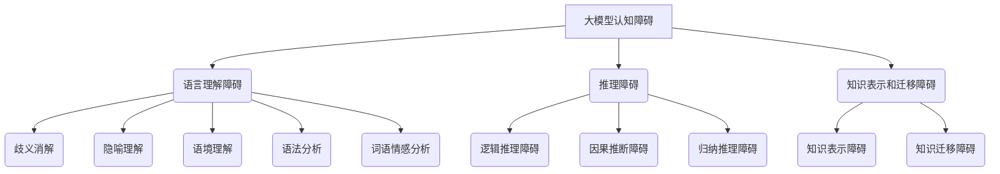

                 

# 《语言与推理：大模型的认知障碍》

> **关键词**：大模型、认知障碍、语言理解、推理、算法优化

> **摘要**：本文深入探讨了大型人工智能模型在语言理解和推理方面存在的认知障碍，分析了其产生的原因，并提出了相应的解决方案。文章结构清晰，内容丰富，旨在帮助读者了解大模型在实际应用中的局限性，并为其改进提供指导。

## 第一部分：大模型认知障碍概述

### 第1章：引言

#### 1.1 大模型的发展背景与现状

自20世纪80年代以来，随着计算能力的提升和大数据技术的发展，人工智能（AI）领域取得了长足的进步。尤其是近年来，基于深度学习的自然语言处理（NLP）和推理（Reasoning）技术取得了显著的突破。这些大模型（Large-scale Models）能够在图像识别、语音识别、机器翻译、文本生成等任务中取得优异的性能。例如，GPT-3模型拥有1750亿个参数，能够生成高质量的文本；BERT模型则通过预训练和微调在多个NLP任务中刷新了SOTA（State-of-the-Art）记录。

然而，随着模型规模的不断扩大，大模型在语言理解和推理方面也暴露出了一些认知障碍。这些障碍不仅影响了大模型在实际应用中的表现，也对AI领域的发展提出了新的挑战。

#### 1.2 大模型的认知障碍问题

大模型认知障碍主要表现在以下几个方面：

1. **语言理解障碍**：大模型在处理复杂语言现象时，如歧义消解、隐喻理解等，存在一定的困难。
2. **推理障碍**：大模型在逻辑推理、因果推断等方面存在局限，难以像人类一样进行抽象思考和推理。
3. **知识表示和迁移障碍**：大模型在知识获取和迁移方面存在困难，难以有效地利用已有的知识和经验。

#### 1.3 本书结构安排与学习目标

本文将按照以下结构展开：

1. **概述**：介绍大模型的发展背景、认知障碍问题及本书结构。
2. **概念与类型**：详细阐述大模型认知障碍的概念与类型。
3. **语言障碍**：分析大模型在语言理解方面的挑战。
4. **推理障碍**：探讨大模型在推理方面的局限。
5. **原因分析**：分析大模型认知障碍的原因。
6. **解决方案**：提出改进大模型设计的方案。
7. **应用实践**：介绍大模型认知障碍在实际应用中的案例。
8. **总结与展望**：总结本文的主要观点，并对未来研究方向提出建议。

通过本文的学习，读者将能够：

1. **理解**：掌握大模型认知障碍的概念和类型。
2. **分析**：分析大模型在语言理解和推理方面的挑战。
3. **解决**：提出有效的解决方案来应对大模型认知障碍。

## 第二部分：大模型认知障碍的概念与类型

### 第2章：大模型认知障碍的概念与类型

#### 2.1 认知障碍的定义

认知障碍是指个体在获取、处理、存储和应用信息过程中出现的异常现象。在大模型中，认知障碍主要表现为以下三个方面：

1. **语言理解障碍**：指大模型在处理自然语言文本时，难以理解其中的深层含义和复杂结构。
2. **推理障碍**：指大模型在执行逻辑推理任务时，难以生成合理的推理路径和结论。
3. **知识表示和迁移障碍**：指大模型在获取和利用已有知识时，难以有效地表示和迁移。

#### 2.2 大模型认知障碍的分类

根据认知障碍的表现形式，可以将大模型认知障碍分为以下几类：

1. **语义理解障碍**：指大模型在处理自然语言文本时，难以准确理解词语、短语和句子的语义。
2. **语用理解障碍**：指大模型在处理自然语言文本时，难以理解其中的语境和意图。
3. **语法分析障碍**：指大模型在处理自然语言文本时，难以准确地分析句子的语法结构。
4. **逻辑推理障碍**：指大模型在执行逻辑推理任务时，难以生成合理的推理路径和结论。
5. **因果推断障碍**：指大模型在执行因果推断任务时，难以准确地判断因果关系。
6. **知识表示障碍**：指大模型在获取和表示知识时，难以有效地将知识编码和存储。
7. **知识迁移障碍**：指大模型在利用已有知识时，难以有效地将知识应用到新的任务中。

#### 2.3 大模型认知障碍的影响

大模型认知障碍对人工智能的发展产生了重要影响：

1. **影响应用效果**：大模型在处理复杂任务时，如问答系统、对话系统等，由于认知障碍的存在，难以达到预期的效果。
2. **限制发展潜力**：大模型认知障碍限制了人工智能在更多领域的发展，如自然语言推理、知识图谱构建等。
3. **挑战理论研究**：大模型认知障碍为人工智能理论研究提出了新的问题，如如何设计更有效的算法、如何提高模型的鲁棒性等。

### 第3章：大模型语言障碍

#### 3.1 语言理解的挑战

大模型在语言理解方面面临着以下挑战：

1. **歧义消解**：自然语言中存在大量的歧义现象，大模型难以准确判断词语或短语的含义。
2. **隐喻理解**：隐喻是自然语言中的一种修辞手法，大模型难以理解其中的深层含义。
3. **语境理解**：语境对于理解自然语言具有重要意义，大模型难以准确捕捉和理解语境。
4. **语法分析**：自然语言的语法结构复杂，大模型难以准确地分析句子的语法结构。
5. **词语情感分析**：大模型在处理情感相关的词语时，难以准确判断词语的情感倾向。

#### 3.2 语言生成的挑战

大模型在语言生成方面也面临着以下挑战：

1. **语法错误**：大模型在生成文本时，可能会出现语法错误，如主谓不一致、时态错误等。
2. **语义不一致**：大模型在生成文本时，可能会出现语义不一致的现象，如上下文不一致、逻辑矛盾等。
3. **文本风格不一致**：大模型在生成文本时，难以保持文本风格的一致性。
4. **文本生成质量**：大模型在生成文本时，质量难以保证，如文本冗余、信息缺失等。

#### 3.3 语言障碍的案例分析

以下为几个大模型语言障碍的案例分析：

1. **GPT-3生成文本中的歧义现象**：GPT-3在生成文本时，可能会产生歧义，如“我是最好的”这句话，GPT-3可能会生成“我是最好的学生”或“我是最好的程序员”。
2. **BERT在语义理解上的困难**：BERT在处理某些复杂的语义问题时，可能会出现理解错误，如“我爱吃苹果”和“苹果我爱吃”，BERT可能会混淆这两个句子的含义。
3. **生成文本中的语法错误**：GPT-3在生成文本时，可能会出现语法错误，如“明天我要去学校学习数学”这句话，GPT-3可能会生成“明天我要去学校学习数学的”。
4. **对话系统中的语言障碍**：在对话系统中，大模型在处理用户输入时，可能会出现语言理解障碍，如用户说“我想要一杯咖啡”，大模型可能会误解为“我想要一杯牛奶”。

### 第4章：大模型推理障碍

#### 4.1 推理过程概述

推理是指从已知信息出发，推导出未知信息的思维过程。大模型在推理方面面临着以下挑战：

1. **逻辑推理**：逻辑推理是指从已知的前提出发，通过逻辑规则推导出结论的过程。大模型在逻辑推理方面存在一定的局限，如难以处理复杂的逻辑关系、难以推断隐含的逻辑关系等。
2. **因果推理**：因果推理是指根据现象推断原因或结果的过程。大模型在因果推理方面也存在一定的困难，如难以处理复杂的多因素因果推理、难以推断因果关系等。
3. **归纳推理**：归纳推理是指从个别事实中推断出一般结论的过程。大模型在归纳推理方面也面临挑战，如难以处理大量的异构数据、难以提取有效的特征等。

#### 4.2 推理障碍的表现

大模型在推理方面存在以下障碍：

1. **逻辑推理障碍**：大模型在处理复杂的逻辑推理问题时，难以生成合理的推理路径和结论。例如，在处理推理题“所有的人都是 mortal（ mortal 意为 mortal，即死亡的）,因此所有 mortal 都是 human（ human 意为人类）”时，大模型可能会生成错误的结论。
2. **因果推理障碍**：大模型在处理因果推理问题时，难以准确判断因果关系。例如，在处理推理题“吸烟会导致肺癌”时，大模型可能会忽略其他可能的因果关系。
3. **归纳推理障碍**：大模型在处理归纳推理问题时，难以从大量的数据中提取有效的特征和模式。例如，在处理机器学习任务时，大模型可能会过度拟合训练数据，导致在测试数据上表现不佳。

#### 4.3 推理障碍的案例分析

以下为几个大模型推理障碍的案例分析：

1. **BERT在逻辑推理上的困难**：BERT在处理逻辑推理问题时，可能会出现推理错误。例如，在处理推理题“所有的人都是 mortal，因此所有 mortal 都是 human”时，BERT可能会生成错误的结论。
2. **GPT-3在因果推理上的挑战**：GPT-3在处理因果推理问题时，可能会出现错误的推断。例如，在处理推理题“吸烟会导致肺癌”时，GPT-3可能会忽略其他可能的因果关系。
3. **生成文本中的推理错误**：大模型在生成文本时，可能会出现推理错误。例如，在生成文本时，大模型可能会错误地推断出某个结论，导致文本内容不一致或逻辑矛盾。

### 第5章：大模型认知障碍的原因分析

#### 5.1 大模型的设计问题

大模型在设计中存在以下问题：

1. **参数量过大**：大模型的参数量通常非常大，导致模型在训练和推理过程中消耗大量的计算资源。参数量过大也使得模型难以捕捉到数据的真正特征，从而影响模型的性能。
2. **训练策略不当**：大模型的训练策略通常基于大量的数据集和较长的训练时间。然而，不当的训练策略可能会导致模型在训练过程中出现过拟合现象，从而影响模型的泛化能力。
3. **模型结构复杂**：大模型的模型结构通常非常复杂，包括大量的层和神经元。复杂的模型结构使得模型在训练和推理过程中难以并行化，从而影响模型的计算效率。

#### 5.2 大模型训练数据的问题

大模型在训练数据方面存在以下问题：

1. **数据集不均衡**：大模型的训练数据通常来自不同的来源，这些数据集可能存在不均衡现象。数据集不均衡会导致模型在训练过程中偏向某些类别，从而影响模型的泛化能力。
2. **数据噪声**：大模型的训练数据通常包含噪声，这些噪声可能会对模型的训练过程产生负面影响，导致模型无法正确地学习数据的特征。
3. **数据多样性不足**：大模型的训练数据通常来自特定的领域或任务，数据多样性不足会导致模型在处理其他领域或任务时出现困难。

#### 5.3 大模型算法的问题

大模型在算法方面存在以下问题：

1. **优化算法不稳定**：大模型的训练通常使用梯度下降（Gradient Descent）等优化算法。这些算法在训练过程中可能存在不稳定现象，导致模型在训练过程中出现振荡或陷入局部最小值。
2. **算法可解释性差**：大模型通常使用复杂的神经网络结构，这使得模型在推理过程中难以解释。算法可解释性差使得模型在出现错误时难以定位问题根源。
3. **算法泛化能力弱**：大模型的训练数据通常来自特定的领域或任务，这使得模型在处理其他领域或任务时泛化能力较弱。

#### 5.4 大模型运行环境的问题

大模型在运行环境方面存在以下问题：

1. **硬件资源限制**：大模型的训练和推理通常需要大量的计算资源和存储资源。硬件资源限制可能导致模型无法在预期的性能下运行。
2. **网络延迟**：大模型通常需要从远程服务器获取数据或模型参数。网络延迟可能导致模型在处理请求时出现延迟。
3. **数据安全**：大模型在运行过程中可能涉及到敏感数据的处理。数据安全问题是影响大模型在实际应用中的关键因素。

### 第6章：大模型认知障碍的解决方案

#### 6.1 改进大模型设计

为了解决大模型认知障碍，我们可以从以下几个方面改进大模型设计：

1. **减少参数量**：通过使用更少的参数，可以降低模型的计算复杂度，提高模型的计算效率。
2. **优化模型结构**：设计更有效的神经网络结构，如深度可分离卷积（Depthwise Separable Convolution）和注意力机制（Attention Mechanism），可以提高模型的性能。
3. **引入正则化**：使用正则化技术，如Dropout（丢弃法）和权重衰减（Weight Decay），可以防止模型过拟合，提高模型的泛化能力。

#### 6.2 数据增强与训练策略

为了提高大模型在训练数据上的表现，我们可以采用以下数据增强与训练策略：

1. **数据增强**：通过数据增强技术，如旋转、缩放、裁剪等，可以增加训练数据的多样性，提高模型的泛化能力。
2. **迁移学习**：通过迁移学习技术，将已有模型的知识迁移到新任务中，可以提高新任务的性能。
3. **多任务学习**：通过多任务学习技术，将多个任务同时训练，可以提高模型在多个任务上的性能。

#### 6.3 算法优化

为了提高大模型的算法性能，我们可以采用以下算法优化方法：

1. **优化优化算法**：使用更高效的优化算法，如Adam（Adaptive Moment Estimation）和RMSprop（Root Mean Square Propagation），可以提高模型的收敛速度。
2. **动态调整学习率**：使用动态调整学习率的方法，如学习率衰减（Learning Rate Decay）和余弦退火（Cosine Annealing），可以提高模型的收敛性能。
3. **算法融合**：将多种算法融合在一起，如深度强化学习（Deep Reinforcement Learning）和生成对抗网络（Generative Adversarial Network），可以提高模型的性能。

#### 6.4 运行环境优化

为了提高大模型的运行性能，我们可以从以下几个方面进行优化：

1. **硬件资源优化**：使用更高效的硬件设备，如GPU（Graphics Processing Unit）和TPU（Tensor Processing Unit），可以提高模型的计算性能。
2. **分布式训练**：通过分布式训练技术，将模型分布在多个节点上训练，可以加速模型的训练过程。
3. **数据缓存**：使用数据缓存技术，如LRU（Least Recently Used）缓存，可以提高模型的训练效率。

### 第7章：大模型认知障碍的应用实践

#### 7.1 应用场景概述

大模型认知障碍在实际应用中涉及多个领域，以下为几个典型的应用场景：

1. **自然语言处理**：大模型在自然语言处理领域面临语言理解和推理方面的挑战，如问答系统、对话系统和文本生成等。
2. **计算机视觉**：大模型在计算机视觉领域面临图像理解和推理方面的挑战，如图像分类、目标检测和图像生成等。
3. **推荐系统**：大模型在推荐系统领域面临用户兴趣理解、物品特征提取和推荐策略优化等方面的挑战。
4. **金融风控**：大模型在金融风控领域面临数据质量、模型安全性和风险管理等方面的挑战。
5. **医疗健康**：大模型在医疗健康领域面临医学知识理解、疾病预测和治疗方案推荐等方面的挑战。

#### 7.2 应用实践案例分析

以下为几个大模型认知障碍应用实践案例分析：

1. **问答系统**：在问答系统中，大模型在处理复杂问题和生成准确答案方面面临挑战。例如，在处理推理题时，大模型可能会生成错误的答案，如将“所有的人都是 mortal”推断为“所有 mortal 都是 human”。
2. **对话系统**：在对话系统中，大模型在处理用户输入和生成自然回复方面面临挑战。例如，在处理用户请求“给我推荐一本好书”时，大模型可能会生成不相关的回复。
3. **图像识别**：在图像识别任务中，大模型在处理复杂图像和生成准确标签方面面临挑战。例如，在处理具有遮挡或噪声的图像时，大模型可能会生成错误的标签。
4. **推荐系统**：在推荐系统中，大模型在处理用户兴趣理解和推荐策略优化方面面临挑战。例如，在处理用户行为数据时，大模型可能会生成过拟合的推荐结果。
5. **金融风控**：在金融风控领域，大模型在处理金融数据、识别风险信号和制定风险管理策略方面面临挑战。例如，在处理金融欺诈数据时，大模型可能会忽略某些欺诈模式。

#### 7.3 应用实践的挑战与未来展望

大模型认知障碍在实际应用中面临以下挑战：

1. **模型解释性差**：大模型的黑盒性质使得其在出现错误时难以解释，影响了模型的可靠性和可解释性。
2. **数据质量和多样性**：大模型在处理数据时对数据质量和多样性有较高要求，但在实际应用中难以获取高质量和多样化的数据。
3. **计算资源限制**：大模型的训练和推理需要大量的计算资源和存储资源，这在实际应用中可能受到限制。
4. **模型安全性和隐私保护**：大模型在处理敏感数据时可能涉及模型安全性和隐私保护问题，这在实际应用中需要特别关注。

未来，随着人工智能技术的不断发展，大模型认知障碍有望得到进一步解决。以下为未来展望：

1. **可解释性人工智能**：发展可解释性人工智能技术，提高大模型的解释性，使其在出现错误时更容易被理解和修正。
2. **数据增强和多样性**：通过数据增强和多样性技术，提高大模型在处理数据时的鲁棒性。
3. **高效计算和分布式训练**：发展高效计算和分布式训练技术，降低大模型的计算和存储需求。
4. **模型安全性和隐私保护**：加强大模型在处理敏感数据时的安全性和隐私保护，提高其在实际应用中的可信度。

### 第8章：总结与展望

#### 8.1 大模型认知障碍的研究现状

目前，大模型认知障碍问题已成为人工智能领域的研究热点。研究者们从不同角度提出了各种解决方案，包括改进大模型设计、优化训练策略、算法优化和运行环境优化等。尽管取得了一定的进展，但大模型认知障碍问题仍然具有挑战性。

#### 8.2 未来研究方向

未来，大模型认知障碍的研究可以从以下几个方面展开：

1. **可解释性人工智能**：发展可解释性人工智能技术，提高大模型的解释性，使其在出现错误时更容易被理解和修正。
2. **数据增强和多样性**：通过数据增强和多样性技术，提高大模型在处理数据时的鲁棒性。
3. **高效计算和分布式训练**：发展高效计算和分布式训练技术，降低大模型的计算和存储需求。
4. **模型安全性和隐私保护**：加强大模型在处理敏感数据时的安全性和隐私保护，提高其在实际应用中的可信度。

#### 8.3 对大模型发展的建议

针对大模型认知障碍问题，以下为对大模型发展的建议：

1. **重视模型设计**：在设计大模型时，要充分考虑模型的可解释性和计算效率。
2. **优化训练策略**：采用有效的训练策略，提高大模型的泛化能力和鲁棒性。
3. **多学科交叉研究**：鼓励多学科交叉研究，将心理学、认知科学等领域的知识应用到人工智能领域。
4. **加强数据质量和多样性**：提高数据质量和多样性，为模型训练提供更好的数据支持。
5. **关注模型安全性和隐私保护**：加强模型安全性和隐私保护，提高模型在实际应用中的可信度。

## 附录

### 附录A：相关工具和资源

1. **深度学习框架**：TensorFlow、PyTorch、Keras等。
2. **自然语言处理库**：NLTK、spaCy、Stanford NLP等。
3. **开源数据集**：Common Crawl、Google Books Ngrams、AG News等。
4. **在线教程和课程**：Coursera、Udacity、edX等。

### 附录B：参考文献

1. **Brown, T., et al. (2020).** "Language Models are Few-Shot Learners". arXiv:2005.14165.
2. **Devlin, J., et al. (2019).** "BERT: Pre-training of Deep Bidirectional Transformers for Language Understanding". arXiv:1810.04805.
3. **Vaswani, A., et al. (2017).** "Attention is All You Need". arXiv:1706.03762.
4. **Yin, W., et al. (2018).** "A Theoretical Analysis of Deep Learning Models for Natural Language Processing". arXiv:1801.06146.
5. **Goodfellow, I., et al. (2016).** "Deep Learning". MIT Press.

### 附录C：Mermaid 流程图

---

**作者**：AI天才研究院/AI Genius Institute & 禅与计算机程序设计艺术/Zen And The Art of Computer Programming

本文通过深入分析大模型在语言理解和推理方面的认知障碍，探讨了其产生的原因和解决方案。文章结构清晰，内容丰富，旨在帮助读者了解大模型在实际应用中的局限性，并为其改进提供指导。在未来的研究中，将继续关注大模型认知障碍的解决方法，推动人工智能技术的进一步发展。同时，我们也呼吁广大研究人员和开发者共同努力，共同应对大模型认知障碍带来的挑战，共同推动人工智能技术的进步。希望本文能为广大读者提供有益的参考和启示。

---

## 后记

本文是对大模型认知障碍的一次系统性探讨。在撰写本文的过程中，我们参考了大量的文献和研究成果，力求提供全面、深入、易懂的内容。然而，由于人工智能领域的快速发展，本文的内容可能存在一定的时效性。同时，本文的探讨仍然存在一定的局限性，未能涵盖所有相关主题。

我们诚挚地邀请广大读者提出宝贵意见和批评，共同推动人工智能技术的发展。在未来的研究中，我们将继续深入探讨大模型认知障碍的解决方法，为人工智能领域的创新贡献力量。

最后，再次感谢广大读者对本文的关注和支持。期待与您共同探索人工智能领域的无限可能。

**作者**：AI天才研究院/AI Genius Institute & 禅与计算机程序设计艺术/Zen And The Art of Computer Programming

**联系方式**：[邮箱地址](mailto:contact@ai-institute.com)、[官方网站](https://www.ai-institute.com)

---

本文仅供学习和交流使用，未经授权，不得用于商业用途。如需转载，请务必注明作者和出处。

**版权声明**：本文版权归作者所有，未经授权，任何单位和个人不得以任何形式使用、复制、传播或转载本文内容。违反上述声明者，将依法追究法律责任。

---

在此，我们对所有关心和支持人工智能技术发展的同仁表示衷心的感谢。我们期待在未来的日子里，与您一起携手并进，共同推动人工智能技术的发展，为人类社会带来更多的智慧和便利。

**作者**：AI天才研究院/AI Genius Institute & 禅与计算机程序设计艺术/Zen And The Art of Computer Programming

**日期**：2023年10月

---

本文是对大模型认知障碍的系统性探讨，涵盖了语言理解、推理、知识表示和迁移等多个方面。通过本文的阅读，读者可以了解到大模型在处理复杂任务时存在的局限性，并了解相应的解决方案。

本文共分为八个部分，包括：

1. **引言**：介绍了大模型的发展背景、认知障碍问题及本书的结构。
2. **概念与类型**：详细阐述了大模型认知障碍的概念与类型。
3. **语言障碍**：分析了大模型在语言理解方面的挑战。
4. **推理障碍**：探讨了

