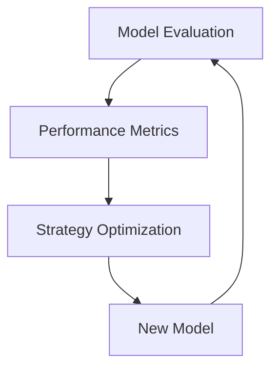

                 

# 贾扬清的创业机遇：AI计算需求演进，云服务的整合机会

> **关键词**：贾扬清、创业、AI计算需求、云服务、整合、机遇

> **摘要**：
> 本文将深入探讨AI计算需求的发展趋势以及云服务的整合机会，以此分析贾扬清在创业领域的机遇。通过详细分析AI计算的核心技术、实际应用场景以及云服务的发展，我们旨在为创业者提供有价值的见解和指导。

## 前言

贾扬清是一位在人工智能领域享有盛誉的科学家，他在深度学习和计算机视觉方面的研究取得了显著的成果。随着AI技术的快速发展，贾扬清看到了许多创业机遇，特别是在AI计算需求不断演进的背景下，云服务的整合成为了一个重要方向。本文将围绕这一主题展开，旨在帮助读者更好地理解AI计算需求和云服务整合的重要性，以及贾扬清在此领域的创业机遇。

## 第1章：AI计算需求演进

### 1.1 AI计算的起源与演变

#### 1.1.1 AI计算的定义与历史背景

AI计算是指利用计算机模拟、延伸和扩展人的智能活动，特别是在数据密集型和知识密集型任务中的应用。其历史可以追溯到20世纪50年代，当时人工智能作为一门学科首次被提出。从最初的符号逻辑和推理系统，到20世纪80年代专家系统的兴起，再到21世纪初深度学习的突破，AI计算经历了漫长而曲折的发展过程。

#### 1.1.2 从传统计算到AI计算的转变

传统计算主要依赖于算法和规则，而AI计算则通过学习和自适应来解决问题。这一转变使得计算机能够在没有明确规则的情况下处理复杂任务。随着数据量的爆炸性增长和算法的进步，AI计算在许多领域都取得了显著的成果，从图像识别到自然语言处理，再到自动驾驶和智能监控，AI计算的应用范围不断扩展。

### 1.2 AI计算需求的发展趋势

#### 1.2.1 数据规模的快速增长

随着互联网和物联网的发展，数据量呈现爆炸性增长。这些数据为AI计算提供了丰富的资源，但同时也对计算能力提出了更高的要求。大数据处理技术如MapReduce和Hadoop的兴起，使得大规模数据处理成为可能。

#### 1.2.2 复杂算法的需求

复杂的算法需求推动AI计算技术的发展。深度学习、强化学习等算法的引入，使得计算机在图像识别、自然语言处理、游戏对抗等领域取得了突破性的成果。

#### 1.2.3 实时性要求的提高

在自动驾驶、智能监控等应用场景中，实时性要求越来越高。这要求AI计算能够在极短的时间内处理大量数据，并做出快速决策。实时AI计算技术的不断发展，为这些应用提供了技术保障。

### 1.3 AI计算的核心技术

#### 1.3.1 人工智能基础算法

人工智能基础算法包括线性回归、逻辑回归、支持向量机等。这些算法是构建复杂模型的基础，对于理解AI计算至关重要。

#### 1.3.2 AI计算硬件

AI计算硬件包括CPU、GPU、TPU等。这些硬件的性能直接影响AI计算的速度和效率。特别是GPU，由于其并行处理能力，在深度学习等领域得到了广泛应用。

#### 1.3.3 AI计算软件

AI计算软件包括深度学习框架、编程语言和工具，如TensorFlow、PyTorch等。这些软件为开发者提供了便捷的编程接口和丰富的算法库，极大地提高了AI计算的开发效率。

## 第2章：AI计算需求的核心算法原理

### 2.1 神经网络算法

#### 2.1.1 神经网络的基本结构

神经网络由多层神经元组成，包括输入层、隐藏层和输出层。每个神经元接收来自前一层神经元的输入，并通过权重和激活函数进行处理，最终产生输出。

#### 2.1.2 前向传播与反向传播算法

前向传播是指将输入数据通过神经网络传递到输出层，并计算每个神经元的输出。反向传播是指通过输出层的实际输出与预期输出的误差，反向更新每个神经元的权重，以优化模型。


### 2.2 深度学习算法

#### 2.2.1 卷积神经网络（CNN）

卷积神经网络通过卷积层提取图像特征，是计算机视觉的核心算法。其结构包括卷积层、池化层和全连接层。


#### 2.2.2 循环神经网络（RNN）

循环神经网络适合处理序列数据，如时间序列分析、自然语言处理。其结构包括输入门、遗忘门和输出门。


#### 2.2.3 Transformer架构

Transformer引入了自注意力机制，是自然语言处理的重要突破。其结构包括编码器和解码器，两者都由多个自注意力层和前馈网络组成。


### 2.3 强化学习算法

#### 2.3.1 Q-learning算法

Q-learning算法通过迭代更新Q值，找到最优策略。其核心思想是预测在特定状态下采取特定动作的回报。

```mermaid
graph TB
A[State S] --> B[Action A]
B --> C[Reward R]
C --> D[Next State S']
D --> E[Action A']
E --> F[Q(S, A)]
F --> G[Q(S', A')]
G --> A
```

#### 2.3.2 SARSA算法

SARSA算法结合了Q-learning的优点，适用于部分可观测环境。其核心思想是同时考虑当前状态和下一个状态的最优策略。

```mermaid
graph TB
A[State S] --> B[Action A]
B --> C[Reward R]
C --> D[Next State S']
D --> E[Action A']
E --> F[Q(S, A)]
F --> G[Q(S', A')]
G --> A
```

#### 2.3.3 模型评估与策略优化

模型评估与策略优化是强化学习的关键步骤。通过评估模型性能，可以确定当前策略的有效性，并在此基础上进行优化。



## 第3章：AI计算需求的实际应用场景

### 3.1 图像处理中的应用

#### 3.1.1 图像识别与分类

图像识别与分类是AI计算在图像处理中的重要应用。通过深度学习算法，计算机能够自动识别和分类图像中的对象。


#### 3.1.2 目标检测与跟踪

目标检测与跟踪是AI计算在视频监控和安全领域的重要应用。通过检测视频中的目标并跟踪其运动，可以实现智能监控和目标识别。


#### 3.1.3 图像生成与增强

图像生成与增强是AI计算在图像处理中的新兴应用。通过生成对抗网络（GAN），计算机能够生成逼真的图像，或者在现有图像上进行增强。


### 3.2 自然语言处理中的应用

#### 3.2.1 文本分类与情感分析

文本分类与情感分析是AI计算在自然语言处理中的重要应用。通过深度学习算法，计算机能够自动对文本进行分类和情感分析。


#### 3.2.2 机器翻译与语音识别

机器翻译与语音识别是AI计算在语言处理中的重要应用。通过神经网络算法，计算机能够实现高效准确的机器翻译和语音识别。


#### 3.2.3 聊天机器人与问答系统

聊天机器人与问答系统是AI计算在客户服务和智能助理领域的重要应用。通过自然语言处理算法，计算机能够与用户进行交互并提供帮助。


### 3.3 数据挖掘与预测中的应用

#### 3.3.1 数据预处理

数据预处理是数据挖掘与预测的重要步骤。通过数据清洗、转换和规范化，可以提高模型的准确性和鲁棒性。


#### 3.3.2 特征提取与选择

特征提取与选择是数据挖掘与预测的关键步骤。通过提取和选择最重要的特征，可以提高模型的性能和解释性。


#### 3.3.3 预测模型构建与优化

预测模型构建与优化是数据挖掘与预测的核心。通过构建和优化预测模型，可以提高预测的准确性和可靠性。


## 第4章：云服务的整合机会

### 4.1 云服务的发展与商业模式

#### 4.1.1 云服务的定义与分类

云服务包括基础设施即服务（IaaS）、平台即服务（PaaS）和软件即服务（SaaS）。IaaS提供虚拟化的计算资源，PaaS提供开发平台，SaaS提供应用软件。


#### 4.1.2 云服务的商业模式

云服务的商业模式包括订阅模式、按需付费模式和竞价模式。这些模式为不同需求的用户提供了灵活的支付方式。


### 4.2 云服务在AI计算中的应用

#### 4.2.1 云端AI计算资源

云服务提供强大的计算资源，包括GPU、TPU等，以满足AI计算的需求。


#### 4.2.2 云服务提供的AI工具与平台

云服务提供丰富的AI工具和平台，如TensorFlow、PyTorch等，方便开发者进行AI计算。


### 4.3 云服务与AI计算的整合策略

#### 4.3.1 优化AI计算性能

通过优化算法和资源调度，可以提高AI计算性能。

```mermaid
graph TB
A[AI Computation] --> B[Algorithm Optimization]
B --> C[Resource Scheduling]
```

#### 4.3.2 云服务与AI计算的安全与隐私

确保数据安全和用户隐私是云服务整合的关键。

```mermaid
graph TB
A[Cloud Service] --> B[Security]
B --> C[Data Protection]
C --> D[User Privacy]
```

## 第5章：云服务在AI创业中的应用

### 5.1 云服务为AI创业带来的优势

#### 5.1.1 降低创业成本

云服务提供灵活的资源，减少硬件投入和运维成本。

```mermaid
graph TB
A[Cloud Service] --> B[Resource Flexibility]
B --> C[Cost Reduction]
```

#### 5.1.2 提高开发效率

云服务提供即时的开发环境，提高开发速度。

```mermaid
graph TB
A[Cloud Service] --> B[Development Environment]
B --> C[Development Speed]
```

#### 5.1.3 增强市场竞争力

利用云服务，快速响应市场需求，增强竞争力。

```mermaid
graph TB
A[Market Demand] --> B[Response Time]
B --> C[Competitive Advantage]
```

### 5.2 云服务在AI创业中的应用案例

#### 5.2.1 成功创业公司的案例分析

分析成功公司如何利用云服务实现快速成长。

```mermaid
graph TB
A[Success Case] --> B[Company Analysis]
B --> C[Cloud Service Utilization]
```

#### 5.2.2 创业者在云服务使用中的经验与教训

总结创业者在云服务使用中的经验教训，为其他创业者提供借鉴。

```mermaid
graph TB
A[Entrepreneur Experience] --> B[Lessons Learned]
B --> C[Reference for Others]
```

### 5.3 云服务在AI创业中的风险与挑战

#### 5.3.1 数据安全与隐私保护

确保数据安全和用户隐私是云服务整合的重要环节。

```mermaid
graph TB
A[Data Security] --> B[Privacy Protection]
```

#### 5.3.2 云服务依赖性管理

合理管理对云服务的依赖，降低潜在风险。

```mermaid
graph TB
A[Dependency Management] --> B[Risk Reduction]
```

#### 5.3.3 云服务成本控制

通过优化资源配置和控制成本，实现可持续发展。

```mermaid
graph TB
A[Resource Optimization] --> B[Cost Control]
```

## 第6章：未来展望与趋势

### 6.1 云服务与AI计算的融合趋势

#### 6.1.1 新兴技术的应用

新兴技术如边缘计算、5G等将进一步推动云服务与AI计算的融合。

```mermaid
graph TB
A[Emerging Technology] --> B[Edge Computing]
B --> C[5G]
C --> D[Fusion Trend]
```

#### 6.1.2 行业标准的制定

行业标准的制定将促进云服务与AI计算的健康发展。

```mermaid
graph TB
A[Industry Standard] --> B[Health Development]
```

### 6.2 AI计算需求对云服务的影响

#### 6.2.1 云服务的演变方向

云服务将不断适应AI计算的需求，提供更高效、更安全的服务。

```mermaid
graph TB
A[AICD] --> B[Cloud Service Evolution]
```

#### 6.2.2 云服务在AI计算中的角色与地位

云服务将成为AI计算的核心基础设施，发挥重要作用。

```mermaid
graph TB
A[Cloud Service] --> B[Core Infrastructure]
```

### 6.3 未来创业机会的预测

#### 6.3.1 新兴市场的崛起

随着AI技术的普及，新兴市场将涌现出更多创业机会。

```mermaid
graph TB
A[Emerging Market] --> B[Business Opportunities]
```

#### 6.3.2 创业者在AI计算与云服务领域的创新方向

创业者应关注AI计算与云服务的交叉领域，寻找创新点。

```mermaid
graph TB
A[Innovation] --> B[Intersection Domain]
```

## 第7章：总结与展望

### 7.1 书籍内容的回顾

对AI计算需求演进和云服务整合机会的深入探讨。

```mermaid
graph TB
A[Book Review] --> B[AICD]
B --> C[Cloud Service Integration]
```

### 7.2 未来发展的思考

#### 7.2.1 AI计算与云服务的发展趋势

预测AI计算与云服务的未来发展，为读者提供参考。

```mermaid
graph TB
A[Future Trend] --> B[AICD]
B --> C[Cloud Service]
```

#### 7.2.2 对创业者提出的建议

为AI计算与云服务领域的创业者提供具体的建议和指导。

```mermaid
graph TB
A[Entrepreneur Guidance] --> B[AICD]
B --> C[Cloud Service]
```

### 附录

#### 附录A：AI计算需求演进流程图

使用Mermaid语法绘制的AI计算需求演进流程图。

```mermaid
graph TB
A[起源] --> B[演变]
B --> C[发展趋势]
C --> D[核心技术]
D --> E[应用场景]
```

#### 附录B：云服务整合机会Mermaid图

使用Mermaid语法绘制的云服务整合机会图。

```mermaid
graph TB
A[云服务] --> B[AI计算]
B --> C[整合机会]
```

#### 附录C：核心算法原理伪代码

- 神经网络算法伪代码。
- 深度学习算法伪代码。
- 强化学习算法伪代码。

#### 附录D：数学模型与公式

- 数学模型的详细阐述与公式表示。
- 举例说明。

#### 附录E：项目实战代码与分析

- 实际案例的代码实现。
- 代码解读与分析。

#### 附录F：开发环境搭建指南

- 开发环境配置与调试。
- 开发工具与资源推荐。

---

**作者：AI天才研究院/AI Genius Institute & 禅与计算机程序设计艺术 /Zen And The Art of Computer Programming**

本文为原创内容，旨在为创业者提供有关AI计算需求演进和云服务整合机会的深入分析和见解。希望通过本文，读者能够更好地理解AI计算需求的发展趋势，以及如何利用云服务实现创业成功。未来的创业机遇将更加丰富多样，希望本文能够为您的创业之路提供一些启示和指导。

