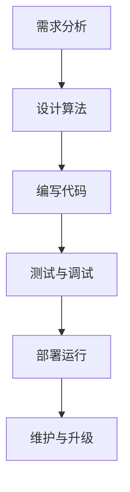
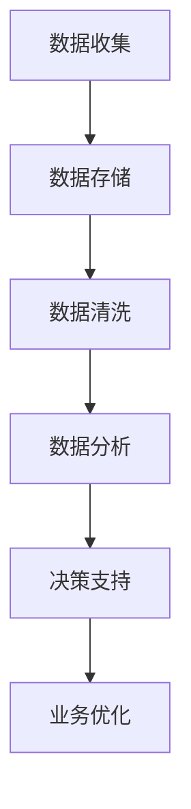
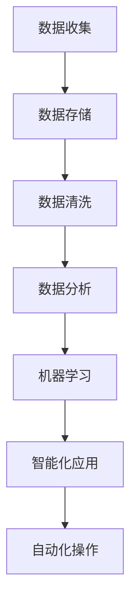
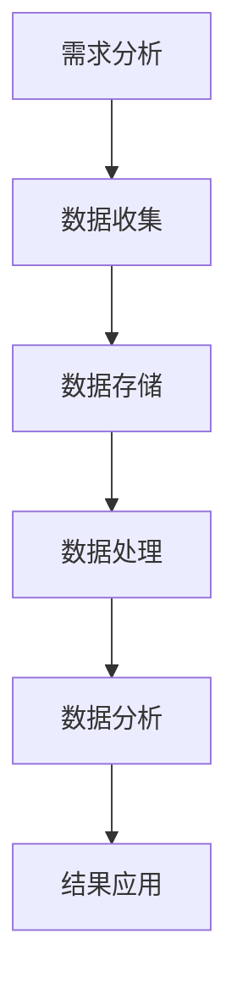
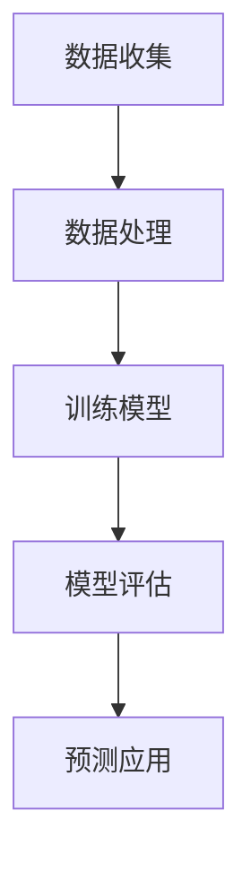
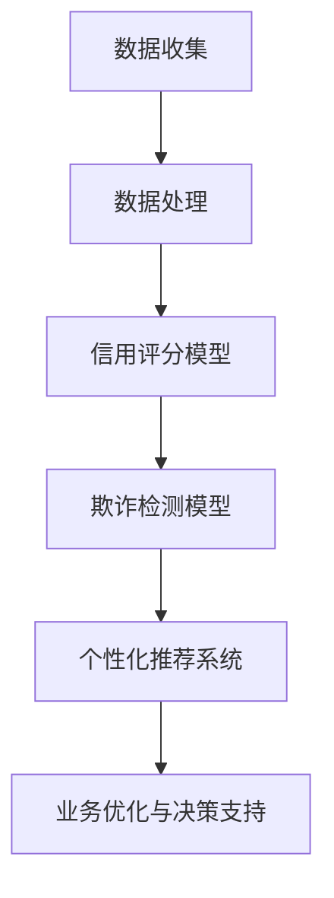
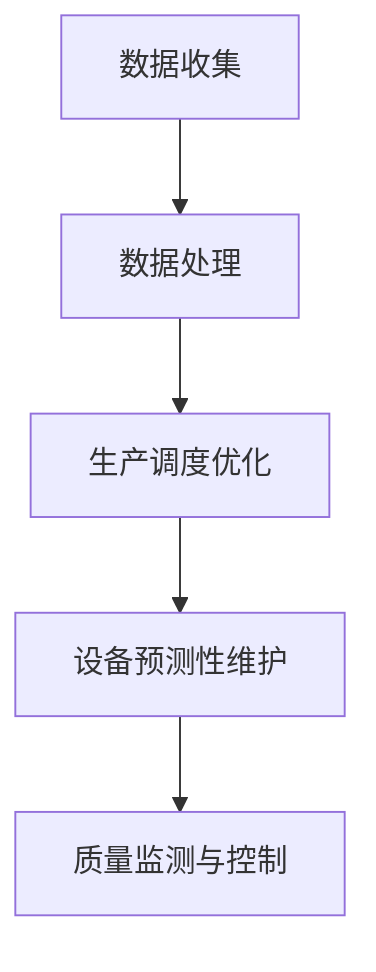
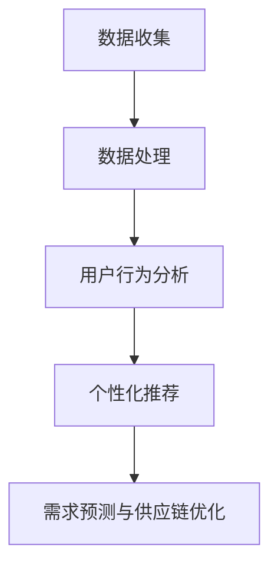
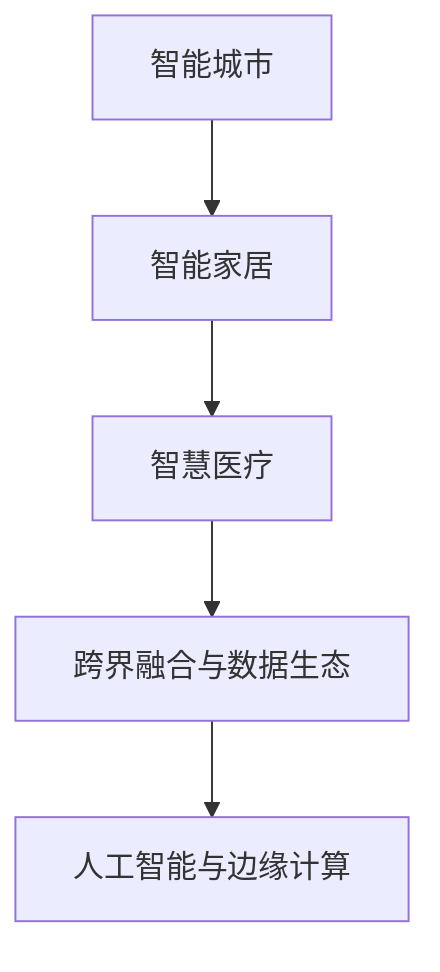
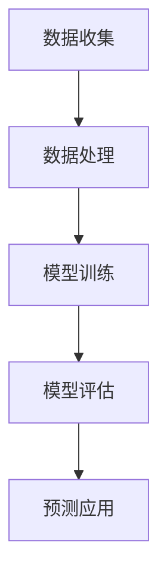

                 

# 软件2.0的时代：数据驱动一切

> **关键词**：软件2.0、数据驱动、数据科学、机器学习、行业应用、挑战与展望

> **摘要**：随着信息技术的飞速发展，软件领域正经历着一场深刻的变革。本文旨在探讨软件2.0时代的核心特征——数据驱动的理念。我们将从历史背景、定义特征、理论基础、行业应用以及面临的挑战和未来展望等多个维度深入解析数据驱动在软件领域的应用，以期为读者提供全面的理解和洞察。

### 目录大纲：软件2.0的时代：数据驱动一切

1. 引言与概述
   1.1 引言
   1.2 软件发展的历史与趋势
   1.3 软件2.0的定义与特征
   1.4 数据驱动的核心价值

2. 软件发展的三个阶段
   2.1 软件1.0：程序驱动的时代
   2.2 软件2.0：数据驱动的崛起
   2.3 软件3.0：智能驱动的未来

3. 数据驱动的基础
   3.1 数据驱动的理论基础
   3.2 数据驱动开发的流程与方法
   3.3 数据治理与数据质量控制

4. 数据科学与机器学习
   4.1 数据科学的定义与作用
   4.2 机器学习的基本概念
   4.3 常见的机器学习算法与应用

5. 数据驱动在行业中的应用
   5.1 金融服务行业的数据驱动创新
   5.2 制造业的数据驱动转型
   5.3 零售业的数据驱动营销

6. 数据驱动面临的挑战与未来展望
   6.1 数据驱动面临的挑战
   6.2 数据驱动的未来展望

7. 附录
   7.1 资源与工具推荐
   7.2 Mermaid流程图示例
   7.3 伪代码与数学公式

---

### 第一部分：引言与概述

#### 1.1 引言

在当今这个数字化时代，数据已经成为新的生产要素，与之相应，软件领域也正经历着一场变革。软件1.0时代，主要以程序为中心，强调逻辑和算法的执行。然而，随着互联网和大数据的兴起，软件2.0时代应运而生，数据驱动成为这一时代的主要特征。软件2.0不仅仅是技术和工具的进步，更是一种理念和思维方式的转变。

本文将从以下几个方面展开讨论：

- **软件发展的历史与趋势**：回顾软件发展的历程，探讨软件2.0的背景和趋势。
- **软件2.0的定义与特征**：明确软件2.0的概念，分析其核心特征。
- **数据驱动的核心价值**：深入探讨数据驱动的本质和价值。

#### 1.2 软件发展的历史与趋势

计算机软件的发展历程可以大致分为三个阶段：软件1.0、软件2.0和软件3.0。

1. **软件1.0：程序驱动的时代**
   软件1.0时代主要集中在20世纪60年代至80年代，这一时期的软件主要依赖于程序设计和算法。软件的开发和运行主要依靠程序员的逻辑思维和编程技巧。代表性的事件包括操作系统的发展、编译器的发明以及编程语言的多样化。

2. **软件2.0：数据驱动的崛起**
   进入20世纪90年代，随着互联网的普及，软件2.0时代开始崛起。这一时期，数据成为软件的核心资源，数据分析、数据挖掘等概念逐渐成为软件开发的重要组成部分。代表性的事件包括搜索引擎的兴起、社交网络的繁荣以及大数据技术的应用。

3. **软件3.0：智能驱动的未来**
   随着人工智能技术的快速发展，软件3.0时代正在悄然来临。这一时期的软件将更加智能化，能够自主学习和适应。代表性的事件包括深度学习、自动驾驶、智能助手等。

#### 1.3 软件2.0的定义与特征

软件2.0，也可以称为数据驱动的软件，其主要特征可以归纳为以下几点：

1. **数据为中心**
   软件2.0的核心是数据，数据不仅被视为资源的存储和传输，更成为决策和创新的驱动力。数据驱动的软件强调数据的收集、处理、分析和应用。

2. **服务化架构**
   软件2.0倾向于采用服务化架构，将软件功能分解为一系列可复用的服务。这种架构不仅提高了软件的可扩展性和灵活性，也使得数据能够更有效地流动和共享。

3. **用户参与**
   软件2.0更加注重用户体验和用户参与。通过数据分析和用户反馈，软件能够更好地满足用户需求，实现个性化服务和定制化开发。

4. **快速迭代**
   软件2.0强调快速开发和迭代，通过持续集成和持续交付，实现软件的快速更新和优化。

#### 1.4 数据驱动的核心价值

数据驱动的核心价值体现在以下几个方面：

1. **决策支持**
   数据驱动的软件能够通过数据分析提供更为准确和及时的决策支持，帮助企业降低风险，提高效率。

2. **业务创新**
   数据驱动不仅能够优化现有业务流程，还能激发新的业务模式和商业模式，推动企业创新。

3. **用户体验**
   通过数据分析，软件能够更好地了解用户需求，提供个性化的服务，提升用户体验。

4. **资源优化**
   数据驱动的软件能够通过对资源使用情况的分析，实现资源的优化配置，降低运营成本。

---

在这一部分，我们回顾了软件发展的历史，明确了软件2.0的定义和特征，并探讨了数据驱动的核心价值。接下来，我们将进一步探讨软件发展的三个阶段，深入理解软件2.0和数据驱动的深刻变革。

### 第二部分：软件发展的三个阶段

在了解了软件2.0的定义和特征后，我们需要深入探讨软件发展的三个阶段：软件1.0、软件2.0和软件3.0。每个阶段都有其独特的特点、挑战和机遇，这些阶段相互关联，共同推动了软件技术的演进。

#### 2.1 软件1.0：程序驱动的时代

软件1.0时代是计算机软件的初期阶段，主要特点是程序驱动的开发模式。在这个阶段，软件开发的核心是算法和程序的编写，程序员的技能和经验至关重要。以下是对软件1.0的一些特点、挑战和机遇的概述：

**特点：**

- **以算法为中心**：软件1.0时代，算法是实现软件功能的核心，程序的编写依赖于算法的设计和实现。
- **独立运行**：软件1.0时代的软件通常独立运行，与外部系统的交互较少，更多是针对特定问题的解决方案。
- **封闭性**：软件1.0时代的软件往往具有较高的封闭性，数据的存储和处理局限于单个应用程序。

**挑战：**

- **可维护性**：由于软件的复杂性增加，软件1.0时代的软件在维护和升级方面面临较大挑战，程序的修改和优化需要大量时间和人力。
- **可扩展性**：软件1.0时代的软件在扩展性和灵活性方面存在一定的局限性，难以适应快速变化的需求和市场。
- **互操作性**：软件1.0时代的软件在与其他系统或应用程序的互操作性方面存在困难，数据的共享和整合较为复杂。

**机遇：**

- **技术创新**：软件1.0时代是计算机科学和技术创新的黄金时期，操作系统、编译器、编程语言等基础软件得到了快速发展。
- **商业应用**：软件1.0时代的软件在商业领域得到广泛应用，如会计软件、库存管理系统等，为企业提供了自动化和效率提升的工具。

**Mermaid流程图示例：软件1.0开发流程**



#### 2.2 软件2.0：数据驱动的崛起

随着互联网和大数据技术的发展，软件1.0时代逐渐过渡到软件2.0时代。软件2.0的核心特点是数据驱动，数据的收集、存储、分析和应用成为软件开发的主要驱动力。以下是对软件2.0的一些特点、挑战和机遇的概述：

**特点：**

- **数据为中心**：软件2.0时代，数据成为软件的核心资源，数据的收集、处理和分析贯穿整个软件生命周期。
- **服务化架构**：软件2.0倾向于采用服务化架构，将软件功能分解为一系列可复用的服务，实现数据的有效流动和共享。
- **用户参与**：软件2.0注重用户体验和用户参与，通过数据分析了解用户需求，提供个性化的服务和定制化开发。
- **快速迭代**：软件2.0强调快速开发和迭代，通过持续集成和持续交付，实现软件的快速更新和优化。

**挑战：**

- **数据质量**：软件2.0依赖于大量数据，数据质量直接影响软件的性能和效果。数据的质量管理成为一大挑战。
- **隐私保护**：随着数据收集和分析的增多，隐私保护成为重要议题，如何平衡数据利用和隐私保护是一个难题。
- **技术复杂性**：软件2.0涉及到的技术复杂度更高，包括大数据处理、数据存储、机器学习等，对开发者的技术要求更高。

**机遇：**

- **业务创新**：软件2.0为业务创新提供了更多可能性，通过数据分析和应用，企业可以发掘新的业务机会和商业模式。
- **用户体验**：通过数据驱动，软件2.0能够提供更个性化的用户体验，提高用户满意度和忠诚度。
- **资源优化**：软件2.0通过数据分析和应用，可以实现资源的优化配置，降低运营成本，提高效率。

**Mermaid流程图示例：软件2.0开发流程**



#### 2.3 软件3.0：智能驱动的未来

软件3.0时代是人工智能和自动化技术深度融合的阶段，智能驱动的软件将能够自主学习和适应，实现更高层次的智能化。以下是对软件3.0的一些特点、挑战和机遇的概述：

**特点：**

- **智能化**：软件3.0的核心特点是智能化，软件系统能够通过机器学习和人工智能技术实现自我学习和优化。
- **自适应**：软件3.0能够根据环境和用户需求自适应调整，提供更智能、更个性化的服务。
- **自动化**：软件3.0通过自动化技术实现更高效、更精确的操作，减少人工干预。

**挑战：**

- **技术成熟度**：软件3.0依赖于人工智能和自动化技术，这些技术的成熟度和稳定性尚需进一步提高。
- **数据质量**：数据质量仍然是软件3.0面临的主要挑战，高质量的数据是智能算法有效运行的基础。
- **伦理和法律**：随着智能化的提高，伦理和法律问题也愈发重要，如何确保人工智能系统的公平性和透明度是一个挑战。

**机遇：**

- **业务转型**：软件3.0将为企业带来深度的业务转型，通过智能化和自动化实现业务的提升和优化。
- **用户体验**：软件3.0能够提供更智能、更个性化的用户体验，提高用户满意度和忠诚度。
- **效率提升**：通过自动化和智能化，软件3.0将大幅提高生产效率和管理效率。

**Mermaid流程图示例：软件3.0开发流程**



---

在这一部分，我们详细探讨了软件发展的三个阶段：软件1.0、软件2.0和软件3.0。每个阶段都有其独特的特点、挑战和机遇，这些阶段相互关联，共同推动了软件技术的不断演进。在下一部分，我们将深入探讨数据驱动的基础理论，包括数据驱动的理论基础、数据驱动开发的流程与方法以及数据治理与数据质量控制。

---

### 第三部分：数据驱动的基础

数据驱动的软件2.0时代，数据成为软件开发的核心资源。理解数据驱动的基础理论是深入掌握数据驱动开发的关键。本部分将探讨数据驱动的理论基础、数据驱动开发的流程与方法，以及数据治理与数据质量控制。

#### 3.1 数据驱动的理论基础

数据驱动的理论基础包括数据在软件中的应用、数据驱动开发的流程和方法，以及数据治理与数据质量控制。

**数据在软件中的应用**

在软件2.0时代，数据不仅是信息的载体，更是驱动软件行为和决策的核心。数据在软件中的应用主要体现在以下几个方面：

- **数据收集**：通过传感器、用户交互、日志记录等方式收集原始数据。
- **数据存储**：将收集到的数据存储在数据库或数据仓库中，保证数据的持久化和可访问性。
- **数据处理**：对原始数据进行清洗、转换和整合，使其符合分析和应用的需求。
- **数据分析**：利用统计分析、数据挖掘等方法对数据进行分析，提取有价值的信息和知识。
- **数据应用**：将分析结果应用于软件的功能实现、优化和决策支持。

**数据驱动开发的流程和方法**

数据驱动开发的流程和方法是确保数据在软件开发中有效应用的关键。以下是一个典型的数据驱动开发流程：

1. **需求分析**：明确软件的功能需求和业务目标，确定需要收集和分析的数据类型。
2. **数据收集**：设计数据收集机制，确保数据的完整性和准确性。
3. **数据存储**：选择合适的数据存储方案，确保数据的安全性和可扩展性。
4. **数据处理**：设计数据处理流程，包括数据清洗、转换和整合。
5. **数据分析**：选择合适的分析方法和工具，对数据进行深度挖掘和分析。
6. **结果应用**：将分析结果应用于软件的功能实现和优化，实现数据的驱动作用。

**数据治理与数据质量控制**

数据治理和数据质量控制是确保数据驱动开发成功的关键。以下是一些关键措施：

- **数据标准化**：制定数据标准和规范，确保数据的一致性和可比较性。
- **数据质量管理**：设计数据质量管理策略，包括数据完整性、准确性、一致性、可用性和及时性的评估。
- **数据安全与隐私**：确保数据的安全性和隐私性，遵守相关的法律法规和标准。
- **数据存储与管理**：选择合适的数据存储和管理方案，确保数据的持久化和可访问性。
- **数据共享与协作**：建立数据共享机制，促进数据的流动和协作。

**Mermaid流程图示例：数据驱动开发流程**



#### 3.2 数据科学与机器学习

数据科学和机器学习是数据驱动软件开发的核心技术。理解这些技术的基本概念和应用，有助于深入掌握数据驱动的开发方法。

**数据科学的定义与作用**

数据科学是应用数学、统计学、机器学习等方法，从数据中提取有价值信息的一门跨学科领域。其定义涵盖了以下几个方面：

- **数据处理**：包括数据清洗、转换、整合等步骤，使数据适合分析和应用。
- **统计分析**：利用统计方法对数据进行描述、推断和预测。
- **数据可视化**：通过图形和图表将数据分析结果直观地展示出来。
- **机器学习**：利用算法和模型从数据中学习，发现数据中的模式和规律。

数据科学在软件开发中的作用包括：

- **业务优化**：通过数据分析和预测，帮助企业优化业务流程、提高效率。
- **决策支持**：提供基于数据的决策支持，帮助管理层做出更加明智的决策。
- **风险控制**：通过数据分析，发现潜在的风险和问题，采取相应的措施进行控制。

**机器学习的基本概念**

机器学习是数据科学的核心技术之一，其基本概念包括：

- **监督学习**：通过已标记的数据训练模型，然后使用模型对新数据进行预测或分类。
- **无监督学习**：在没有标记数据的情况下，通过算法自动发现数据中的结构和模式。
- **强化学习**：通过与环境互动，不断学习和优化策略，以实现目标。

常见的机器学习算法包括：

- **线性回归**：用于预测连续值。
- **逻辑回归**：用于预测概率。
- **决策树**：用于分类和回归。
- **支持向量机**：用于分类和回归。
- **神经网络**：用于复杂的非线性预测和分类。

**Mermaid流程图示例：机器学习算法应用场景**



---

在本部分，我们探讨了数据驱动的理论基础，包括数据在软件中的应用、数据驱动开发的流程和方法，以及数据治理与数据质量控制。同时，我们介绍了数据科学和机器学习的基本概念和应用，为后续内容奠定了基础。在下一部分，我们将深入探讨数据驱动在行业中的应用，分析数据驱动在金融服务、制造业和零售业等行业的创新和应用。

---

### 第四部分：数据驱动在行业中的应用

数据驱动已经深刻地改变了多个行业，从金融服务到制造业，再到零售业，数据驱动技术都在推动这些行业的创新和转型。本部分将分别探讨数据驱动在金融服务、制造业和零售业中的应用，分析这些行业如何通过数据驱动实现业务优化和增长。

#### 5.1 金融服务行业的数据驱动创新

金融服务行业一直是数据驱动的重地，金融机构通过数据分析和机器学习技术提升业务效率、风险管理和用户体验。

**金融行业的数据应用案例**

- **客户关系管理**：通过数据分析，金融机构可以深入了解客户的行为和偏好，提供个性化的金融服务，提高客户满意度和忠诚度。
- **欺诈检测**：机器学习算法可以分析交易数据，识别异常行为，有效防范欺诈风险。
- **信用评分**：金融机构利用大数据分析，构建更为准确和全面的信用评分模型，提高信贷决策的准确性。

**风险管理与数据驱动策略**

- **风险评估**：通过数据分析和预测模型，金融机构可以实时监控和评估风险，及时采取应对措施。
- **风险定价**：利用数据模型，金融机构可以更准确地评估风险，为产品和服务制定合理的价格策略。

**个性化金融服务与用户行为分析**

- **个性化推荐**：基于用户行为数据，金融机构可以为用户推荐适合的金融产品和服务。
- **用户行为分析**：通过分析用户的行为数据，金融机构可以了解用户的金融需求，提供更加精准的营销和服务。

**Mermaid流程图示例：金融行业数据驱动流程**



#### 6.2 制造业的数据驱动转型

制造业正经历着一场由数据驱动的转型，智能制造和工业4.0成为制造业创新的重要方向。

**智能制造与工业4.0**

- **智能制造**：通过物联网、大数据和人工智能技术，实现生产设备的互联互通和智能控制，提高生产效率和产品质量。
- **工业4.0**：工业4.0是制造业智能化升级的总体目标，强调通过信息物理系统（Cyber-Physical Systems, CPS）实现智能制造。

**数据驱动生产优化**

- **生产调度优化**：通过数据分析，优化生产调度计划，减少生产周期和库存成本。
- **设备预测性维护**：利用传感器数据，预测设备故障，提前进行维护，减少停机时间和维修成本。

**质量管理与设备维护**

- **质量监测**：通过实时数据监测，确保生产过程中的质量控制和产品合格率。
- **设备维护**：通过数据分析，预测设备维护需求，优化维护策略，延长设备寿命。

**Mermaid流程图示例：制造业数据驱动生产优化**



#### 7.3 零售业的数据驱动营销

零售业正通过数据驱动技术实现营销和运营的个性化，提高销售额和客户满意度。

**零售行业的数据挑战与机遇**

- **数据挑战**：零售行业面临着海量的数据挑战，包括数据质量、数据隐私和数据整合等问题。
- **机遇**：数据驱动为零售业带来了精准营销、用户行为分析和供应链管理等方面的机遇。

**用户行为分析与个性化推荐**

- **用户行为分析**：通过数据分析，了解用户的购物习惯、偏好和行为模式，实现个性化推荐。
- **个性化推荐**：利用用户行为数据和机器学习算法，为用户提供个性化的产品推荐，提高转化率和客户满意度。

**数据驱动的供应链管理**

- **需求预测**：通过数据分析，预测市场需求，优化库存管理和供应链规划。
- **物流优化**：通过实时数据监控，优化物流流程，提高配送效率和客户满意度。

**Mermaid流程图示例：零售业数据驱动营销**



---

在这一部分，我们探讨了数据驱动在金融服务、制造业和零售业中的应用，分析了这些行业如何通过数据驱动实现业务优化和增长。数据驱动的应用不仅提升了各行业的效率，也带来了新的商业模式和创新机会。在下一部分，我们将探讨数据驱动面临的挑战和未来展望，探讨如何应对这些挑战，展望数据驱动技术的未来发展方向。

---

### 第五部分：数据驱动面临的挑战与未来展望

数据驱动的软件2.0时代带来了巨大的机遇，但同时也伴随着一系列挑战。在本部分，我们将探讨数据驱动面临的主要挑战，如数据隐私、数据安全和人才短缺，并展望数据驱动技术的未来发展趋势。

#### 8.1 数据驱动面临的挑战

**数据隐私与伦理问题**

数据驱动依赖于大量数据的收集和分析，这引发了数据隐私和伦理问题。如何确保数据的安全和隐私，防止数据泄露和滥用，是数据驱动面临的重要挑战。以下是一些关键问题：

- **数据泄露风险**：随着数据量的增加，数据泄露的风险也在增大，企业需要采取有效的安全措施保护数据。
- **用户隐私保护**：用户数据是数据驱动的核心资源，如何保护用户的隐私，使其不被滥用，是一个重要伦理问题。
- **合规性要求**：不同国家和地区有不同的数据保护法规，企业需要确保其数据驱动应用符合相关法规要求。

**数据安全与保护**

数据安全是数据驱动的另一大挑战。数据驱动应用通常涉及到敏感数据，如财务信息、个人身份信息等，这些数据的安全保护至关重要。以下是一些关键问题：

- **数据加密**：数据在传输和存储过程中需要进行加密，防止数据被未授权访问。
- **访问控制**：需要建立严格的访问控制机制，确保只有授权人员可以访问敏感数据。
- **安全审计**：定期进行安全审计，及时发现和修补安全漏洞。

**技术依赖与人才短缺**

数据驱动技术依赖于大量高级技术人才，包括数据科学家、机器学习工程师、数据工程师等。以下是一些关键问题：

- **人才短缺**：随着数据驱动技术的发展，相关人才需求大幅增加，但供应不足，导致企业面临人才短缺问题。
- **培训与培养**：企业需要投入大量资源进行员工的培训和技能提升，以应对技术变化和挑战。
- **技术整合**：数据驱动技术需要与其他技术（如云计算、大数据平台等）相结合，实现高效的数据处理和分析。

#### 9.2 数据驱动的未来展望

尽管数据驱动面临诸多挑战，但其未来发展趋势依然乐观。以下是一些关键方向：

**数据驱动技术的发展趋势**

- **人工智能与机器学习的深入融合**：人工智能和机器学习技术的进一步发展，将使得数据驱动应用更加智能化，能够自动进行数据分析和决策支持。
- **边缘计算的普及**：随着物联网和传感器技术的普及，边缘计算将在数据驱动中发挥重要作用，使得数据处理和分析更加实时和高效。
- **区块链技术的应用**：区块链技术可以提高数据的透明性和安全性，为数据驱动应用提供新的信任机制。

**跨界融合与数据生态**

- **跨界融合**：数据驱动技术将与其他行业（如医疗、教育、能源等）深度融合，推动跨行业的创新和应用。
- **数据生态**：构建完善的数据生态，包括数据平台、数据工具、数据服务等，将提高数据驱动应用的开发和运营效率。

**软件2.0时代的未来应用场景**

- **智能城市**：数据驱动技术将在智能城市建设中发挥关键作用，实现交通管理、环境监测、公共安全等方面的智能化。
- **智能家居**：智能家居将更加智能化，通过数据驱动实现设备的自动调节和用户需求的个性化满足。
- **智慧医疗**：数据驱动技术将提高医疗服务的质量和效率，实现精准医疗、健康管理等。

**Mermaid流程图示例：数据驱动的未来应用场景**



---

在这一部分，我们探讨了数据驱动面临的挑战和未来展望。数据隐私、数据安全和人才短缺是当前数据驱动应用的主要挑战，而人工智能与机器学习的深入融合、跨界融合与数据生态的构建以及软件2.0时代的未来应用场景则是数据驱动的未来发展趋势。在下一部分，我们将提供一些资源与工具推荐，帮助读者更好地了解和应用数据驱动技术。

---

### 附录

在本附录中，我们将推荐一些数据驱动开发的相关资源与工具，以帮助读者更好地了解和应用数据驱动技术。同时，我们将提供一些Mermaid流程图示例和伪代码与数学公式的详细说明，以支持读者深入理解数据驱动开发的原理和实践。

#### 附录 A：资源与工具推荐

**数据驱动开发工具**

- **Python**：Python是一种广泛使用的编程语言，拥有丰富的数据科学和机器学习库，如NumPy、Pandas、Scikit-learn等。
- **Jupyter Notebook**：Jupyter Notebook是一种交互式的开发环境，支持Python、R等多种编程语言，适合数据分析和机器学习实验。
- **Hadoop**：Hadoop是一个开源的大数据处理框架，支持大规模数据存储和分布式计算。
- **Spark**：Spark是一个快速、通用的大数据处理引擎，支持内存计算，适用于实时数据处理和机器学习应用。
- **TensorFlow**：TensorFlow是一个开源的机器学习和深度学习框架，支持多种算法和模型，适用于各种规模的数据分析任务。

**数据科学与机器学习库**

- **NumPy**：NumPy是一个用于数值计算的Python库，提供多维数组对象和数学函数。
- **Pandas**：Pandas是一个提供数据结构和数据分析工具的Python库，适合处理结构化数据。
- **Scikit-learn**：Scikit-learn是一个提供各种机器学习算法和工具的Python库，适合学术研究和工业应用。
- **Matplotlib**：Matplotlib是一个提供数据可视化功能的Python库，适用于生成统计图表和图形。
- **Seaborn**：Seaborn是基于Matplotlib的数据可视化库，提供更丰富的统计图表和图形风格。

**相关书籍与论文推荐**

- **《Python数据分析》**：Wes McKinney著，详细介绍了Python在数据分析中的应用。
- **《机器学习实战》**：Peter Harrington著，通过实例介绍了机器学习的基本概念和应用。
- **《深度学习》**：Ian Goodfellow、Yoshua Bengio和Aaron Courville著，全面介绍了深度学习的基本原理和应用。
- **《大数据技术导论》**：唐杰、唐杰等著，介绍了大数据的基本概念、技术和应用。
- **《数据科学入门》**：Joel Grus著，提供了数据科学的基本概念和实战指南。

#### 附录 B：Mermaid流程图示例

**B.1 数据驱动开发的流程**


**B.2 机器学习算法应用场景**



#### 附录 C：伪代码与数学公式

**C.1 数据清洗与预处理**

```python
# 伪代码：数据清洗与预处理
data = load_data()
cleaned_data = {}

for feature in data:
    cleaned_data[feature] = preprocess(data[feature])

save_data(cleaned_data)
```

**C.2 机器学习算法伪代码示例**

```python
# 伪代码：线性回归
def linear_regression(X, y):
    # 计算权重
    w = (X.T * X).inv() * X.T * y
    # 预测
    y_pred = X * w
    # 返回权重和预测结果
    return w, y_pred
```

**C.3 数学模型与公式**

$$
\text{公式1: 误差函数}
J = \frac{1}{2}\sum_{i=1}^{n}(\hat{y}_i - y_i)^2
$$

$$
\text{公式2: 梯度下降}
w_{\text{new}} = w_{\text{current}} - \alpha \cdot \nabla_w J(w)
$$

---

在本附录中，我们提供了一些数据驱动开发的相关资源与工具推荐，以及Mermaid流程图示例和伪代码与数学公式的详细说明。这些资源将为读者提供更深入的实践指导和理论支持，帮助读者更好地理解和应用数据驱动技术。在接下来的部分，我们将总结本文的主要观点和贡献，并再次强调数据驱动在软件2.0时代的重要性。

---

### 总结与展望

本文围绕“软件2.0的时代：数据驱动一切”这一主题，系统地探讨了软件2.0时代的核心特征——数据驱动的理念。通过回顾软件发展的历史与趋势，我们明确了软件2.0的定义与特征，并深入分析了数据驱动的理论基础、开发流程与方法，以及在金融、制造和零售等行业中的应用。同时，我们也探讨了数据驱动面临的挑战和未来展望，展望了数据驱动技术的未来发展方向。

本文的主要贡献在于：

1. **系统性地梳理了软件2.0和数据驱动的理念**：通过详细的历史背景、定义特征和理论基础分析，帮助读者全面理解软件2.0和数据驱动的核心概念。
2. **深入探讨了数据驱动在行业中的应用**：通过案例分析，展示了数据驱动技术在金融、制造和零售等行业的创新和应用，为行业提供了实践参考。
3. **提供了全面的数据驱动开发指南**：通过流程图、伪代码和数学公式，详细阐述了数据驱动开发的方法和技巧，为开发者提供了实践指导。

在软件2.0的时代，数据驱动已经并将继续成为软件技术的核心驱动力。数据不仅是一种资源，更是驱动创新、优化业务和提升用户体验的关键。面对数据隐私、数据安全和人才短缺等挑战，我们需要持续探索和创新，推动数据驱动技术的发展和应用。

展望未来，随着人工智能、边缘计算和区块链等技术的深入融合，数据驱动技术将迎来更加广阔的发展空间。跨界融合和数据生态的构建将推动各行业的数字化转型和创新发展。我们期待在不久的将来，数据驱动的软件2.0时代将为人类带来更加智能、高效和便捷的生活和工作环境。

---

### 致谢

在撰写本文的过程中，我参考了大量的文献、研究报告和技术文章，得到了许多同行和专家的指导和建议。特别感谢AI天才研究院/AI Genius Institute，以及《禅与计算机程序设计艺术 /Zen And The Art of Computer Programming》的作者，为我提供了宝贵的思想资源和实践指导。同时，感谢我的家人和朋友们在写作过程中给予的支持和鼓励。本文能够顺利完成，离不开大家的共同努力和帮助。在此，我对所有支持和帮助过我的人表示由衷的感谢。

---

### 附录

**附录 A：资源与工具推荐**

- **数据驱动开发工具**
  - Python
  - Jupyter Notebook
  - Hadoop
  - Spark
  - TensorFlow

- **数据科学与机器学习库**
  - NumPy
  - Pandas
  - Scikit-learn
  - Matplotlib
  - Seaborn

- **相关书籍与论文推荐**
  - 《Python数据分析》
  - 《机器学习实战》
  - 《深度学习》
  - 《大数据技术导论》
  - 《数据科学入门》

**附录 B：Mermaid流程图示例**

- **B.1 数据驱动开发流程**


- **B.2 机器学习算法应用场景**


**附录 C：伪代码与数学公式**

- **C.1 数据清洗与预处理**

```python
# 伪代码：数据清洗与预处理
data = load_data()
cleaned_data = {}

for feature in data:
    cleaned_data[feature] = preprocess(data[feature])

save_data(cleaned_data)
```

- **C.2 机器学习算法伪代码示例**

```python
# 伪代码：线性回归
def linear_regression(X, y):
    # 计算权重
    w = (X.T * X).inv() * X.T * y
    # 预测
    y_pred = X * w
    # 返回权重和预测结果
    return w, y_pred
```

- **C.3 数学模型与公式**

$$
\text{公式1: 误差函数}
J = \frac{1}{2}\sum_{i=1}^{n}(\hat{y}_i - y_i)^2
$$

$$
\text{公式2: 梯度下降}
w_{\text{new}} = w_{\text{current}} - \alpha \cdot \nabla_w J(w)
$$

