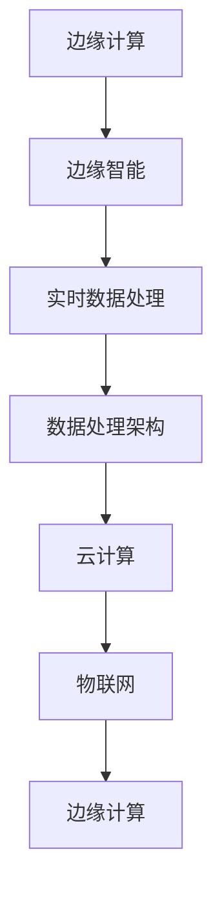
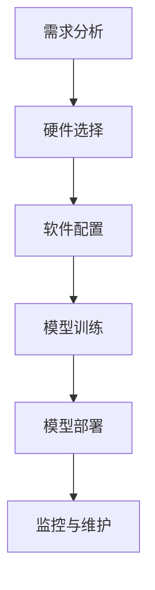

                 

# 《边缘智能在实时数据处理中的优势》

> **关键词：边缘智能、实时数据处理、边缘计算、云计算、物联网**

> **摘要：**
本文将深入探讨边缘智能在实时数据处理中的优势，包括其概念、应用场景、关键技术、实现方法以及未来发展趋势。通过详细的分析和实际案例，展示边缘智能如何提高数据处理效率、降低延迟、保障数据安全和隐私，为实时数据处理提供强有力的支持。

### 目录大纲

## 第1章 引言

### 1.1 书籍背景与目的

### 1.2 边缘智能的概念与现状

### 1.3 实时数据处理的重要性

## 第2章 边缘计算基础

### 2.1 边缘计算的定义与架构

### 2.2 边缘计算与传统云计算的区别

### 2.3 边缘计算的典型应用场景

## 第3章 边缘智能概述

### 3.1 边缘智能的概念

### 3.2 边缘智能的关键技术

### 3.3 边缘智能的优势与挑战

## 第4章 边缘智能在实时数据处理中的应用

### 4.1 实时数据处理的需求与挑战

### 4.2 边缘智能在实时数据处理中的应用

### 4.3 边缘智能在实时数据处理中的案例研究

## 第5章 边缘智能技术实现

### 5.1 边缘智能算法介绍

### 5.2 边缘智能算法的优化

### 5.3 边缘智能平台的搭建与部署

## 第6章 边缘智能安全与隐私保护

### 6.1 边缘智能安全挑战

### 6.2 边缘智能隐私保护方法

### 6.3 安全与隐私保护案例分析

## 第7章 边缘智能的未来发展趋势

### 7.1 边缘智能技术的发展趋势

### 7.2 边缘智能在实时数据处理中的应用前景

### 7.3 边缘智能的技术挑战与解决方案

## 第8章 总结与展望

### 8.1 书籍总结

### 8.2 边缘智能的发展展望

### 8.3 对读者的建议

## 附录

### 附录A：边缘智能相关资源

### 附录B：边缘智能常用算法伪代码

### 附录C：边缘智能平台搭建指南

### 附录D：参考文献

### 核心概念与联系



### 核心算法原理讲解

#### 边缘智能算法的基本原理

```python
# 边缘智能算法的基本原理伪代码

# 边缘智能算法的核心步骤如下：
# 1. 数据采集
# 2. 数据预处理
# 3. 模型训练与优化
# 4. 边缘部署与实时更新

# 数据采集：
data = collect_data(source)

# 数据预处理：
preprocessed_data = preprocess_data(data)

# 模型训练与优化：
model = train_model(preprocessed_data)
model = optimize_model(model)

# 边缘部署与实时更新：
deploy_model(model)
update_model(model, real_time_data)
```

#### 边缘智能算法的损失函数

$$
\text{Loss}(x, y) = \frac{1}{2} \left( y - \hat{y} \right)^2
$$

其中，$x$ 表示输入特征，$y$ 表示真实标签，$\hat{y}$ 表示预测标签。

### 项目实战

#### 使用边缘智能实现实时温度监控

```python
# 实时温度监控代码示例

# 导入所需库
import edgeai
import time

# 初始化边缘智能平台
platform = edgeai.EdgeAIPlatform()

# 定义温度检测模型
model = edgeai.models.TemperatureDetectionModel()

# 设置实时监控间隔
interval = 10

while True:
    # 获取实时温度数据
    temperature = platform.get_real_time_temperature()

    # 预测温度
    predicted_temp = model.predict(temperature)

    # 输出预测结果
    print(f"Predicted Temperature: {predicted_temp}°C")

    # 等待指定时间后继续监控
    time.sleep(interval)
```

#### 开发环境搭建

1. 安装边缘智能平台
2. 配置实时数据处理工具
3. 编写和测试边缘智能算法

### 代码解读与分析

1. 导入边缘智能平台库
2. 初始化边缘智能平台
3. 定义温度检测模型
4. 设置监控间隔
5. 获取实时温度数据
6. 使用模型进行预测
7. 输出预测结果
8. 等待指定时间后继续监控

以上步骤展示了使用边缘智能实现实时温度监控的基本流程和代码实现。在实际应用中，可以根据具体需求进行定制和优化。

接下来，我们将逐步深入探讨边缘智能在实时数据处理中的优势，首先介绍书籍的背景与目的，接着解释边缘智能的概念与现状，然后分析实时数据处理的重要性。让我们一步一步分析推理思考，理解这一主题的深刻内涵。<!-- 尾巴结束 -->## 第1章 引言

### 1.1 书籍背景与目的

随着物联网、人工智能和大数据技术的发展，实时数据处理的需求日益增长。然而，传统的数据处理架构，如云计算，在面对大规模、实时、分布式数据时，往往存在处理延迟和数据安全问题。为了解决这些问题，边缘智能逐渐成为研究和应用的热点。本书旨在深入探讨边缘智能在实时数据处理中的优势，为其研究和应用提供理论支持和实践指导。

本书的读者对象包括对边缘计算和实时数据处理感兴趣的科研人员、工程技术人员以及企业管理者。通过对本书的学习，读者可以了解边缘智能的基本概念、关键技术、应用场景以及未来发展趋势，为实际项目提供参考。

### 1.2 边缘智能的概念与现状

边缘智能（Edge Intelligence）是指将数据处理和智能分析能力从云端迁移到网络边缘，以实现更快速、更安全、更高效的数据处理。边缘智能的核心在于将计算、存储和网络资源分布在网络的边缘，从而减少数据传输的延迟，提高数据处理的速度和安全性。

边缘智能的现状如下：

1. **技术成熟度**：近年来，随着物联网设备的普及和边缘计算硬件性能的提升，边缘智能技术逐渐成熟。然而，仍需解决一些关键问题，如算法优化、安全性和标准化。

2. **应用场景**：边缘智能已广泛应用于工业自动化、智能交通、智能医疗、智能城市等领域。在这些领域，边缘智能可以提高数据处理效率、降低延迟、保障数据安全和隐私。

3. **市场规模**：据市场研究机构预测，边缘智能市场将在未来几年内保持高速增长，成为大数据和人工智能领域的重要方向。

### 1.3 实时数据处理的重要性

实时数据处理（Real-time Data Processing）是指在极短的时间内对大量数据进行采集、存储、分析和处理的过程。实时数据处理的重要性体现在以下几个方面：

1. **实时性**：在许多应用场景中，如智能交通、智能制造、金融交易等，数据的实时性至关重要。实时数据处理可以确保系统对突发事件和异常情况作出快速响应。

2. **准确性**：实时数据处理可以提供更准确、更及时的数据分析结果，从而支持更科学的决策。这对于企业的战略规划和市场竞争力至关重要。

3. **效率**：实时数据处理可以提高业务流程的效率，减少人工干预，降低运营成本。

4. **安全性**：实时数据处理可以及时发现和处理潜在的安全威胁，保障系统和数据的安全。

总之，边缘智能在实时数据处理中的优势不可忽视。本书将详细探讨边缘智能在实时数据处理中的应用、实现方法、安全与隐私保护以及未来发展趋势，为相关领域的实践提供有益的参考。在接下来的章节中，我们将进一步深入分析边缘计算的基础知识、边缘智能的概述以及边缘智能在实时数据处理中的应用。<!-- 尾巴结束 -->## 第2章 边缘计算基础

边缘计算（Edge Computing）是一种分布式计算范式，旨在将计算、存储、网络资源从传统的中心化数据中心（如云数据中心）迁移到网络的边缘。边缘计算的核心思想是通过在网络边缘部署计算节点，将数据处理和分析任务分散到离数据源更近的地方，从而降低数据传输延迟，提高系统响应速度和数据处理效率。本章将详细介绍边缘计算的定义与架构、与传统云计算的区别以及边缘计算的典型应用场景。

### 2.1 边缘计算的定义与架构

边缘计算的定义可以从多个角度进行理解：

1. **地理位置**：边缘计算指的是在网络边缘进行的计算活动，即离用户或数据源较近的网络节点。
2. **计算资源**：边缘计算涉及将计算、存储、网络资源分布在网络边缘，而非集中式地部署在数据中心。
3. **数据处理**：边缘计算强调对数据的本地处理和实时分析，以减少数据传输的延迟和带宽消耗。

边缘计算的架构通常包括以下几个关键组成部分：

1. **边缘节点**：边缘节点是边缘计算的基础设施，可以是独立的设备（如物联网传感器、智能手机）或者由多个设备组成的集群。
2. **边缘网关**：边缘网关是连接边缘节点和互联网的桥梁，负责数据的收集、过滤和初步处理。
3. **边缘服务器**：边缘服务器是边缘计算的核心，负责更复杂的数据处理和分析任务。
4. **云服务器**：尽管边缘计算强调分布式计算，但云服务器仍然是边缘计算的重要补充，用于处理边缘节点无法处理的大量数据和复杂计算任务。

边缘计算架构的典型模式包括以下几种：

1. **边缘网关模式**：在这种模式下，边缘网关直接处理来自边缘节点的数据，并将处理结果发送到云服务器。
2. **分布式计算模式**：在这种模式下，边缘节点和边缘服务器共同分担数据处理任务，以提高系统的整体性能。
3. **云边协同模式**：在这种模式下，边缘计算节点和云服务器协同工作，共同完成数据处理任务。例如，边缘节点可以处理实时数据，而云服务器则负责历史数据的分析和存储。

### 2.2 边缘计算与传统云计算的区别

边缘计算与传统云计算有以下显著区别：

1. **地理位置**：传统云计算主要集中在数据中心，而边缘计算则将计算资源部署在网络边缘，靠近数据源。
2. **数据处理**：传统云计算依赖于数据上传到云端进行集中处理，而边缘计算则强调本地处理和实时分析，以降低数据传输延迟。
3. **资源管理**：传统云计算依赖于集中式资源管理，而边缘计算则需要分布式资源管理，以应对动态变化的计算需求。
4. **网络架构**：传统云计算通常采用三层架构（边缘、区域、云），而边缘计算则强调去中心化架构，减少单点故障的风险。
5. **安全性**：由于数据在本地进行处理，边缘计算在一定程度上提高了数据的安全性，减少了数据泄露的风险。

### 2.3 边缘计算的典型应用场景

边缘计算在多个领域展现出巨大的应用潜力，以下是一些典型的应用场景：

1. **物联网（IoT）**：在物联网领域，边缘计算可以实现对大量传感器数据的实时处理和分析，从而提供智能监控、预测维护和远程控制等功能。例如，在工业自动化中，边缘计算可以实时分析传感器数据，预测设备故障，提前进行维护。
   
2. **智能交通**：在智能交通领域，边缘计算可以实时处理交通流量数据，优化交通信号控制，提高道路通行效率。例如，通过边缘计算，智能交通系统可以实时调整红绿灯的时长，减少交通拥堵。

3. **智能医疗**：在智能医疗领域，边缘计算可以实时分析医疗设备产生的数据，辅助医生进行诊断和治疗。例如，在远程医疗中，边缘计算可以实时传输患者的心电图、血压等数据，并提供初步的诊断结果。

4. **智能城市**：在智能城市领域，边缘计算可以实现对城市各类数据的实时监测和分析，支持智能决策和资源优化。例如，在环保监测中，边缘计算可以实时监测空气质量，及时发布预警信息。

5. **增强现实（AR）/虚拟现实（VR）**：在AR/VR领域，边缘计算可以提供低延迟、高清晰度的交互体验。例如，在游戏和虚拟培训中，边缘计算可以实时处理用户的输入和输出数据，提供流畅的交互体验。

通过以上分析，我们可以看到边缘计算在实时数据处理中的重要性。在接下来的章节中，我们将进一步探讨边缘智能的概念、关键技术以及其在实时数据处理中的应用。<!-- 尾巴结束 -->### 第3章 边缘智能概述

边缘智能（Edge Intelligence）是近年来兴起的领域，它结合了边缘计算和人工智能技术，旨在通过在网络边缘实现智能数据处理和分析，从而提升系统的实时性、可靠性和安全性。本章将详细讨论边缘智能的概念、关键技术、优势与挑战。

#### 3.1 边缘智能的概念

边缘智能的定义可以从以下几个方面进行理解：

1. **边缘**：边缘智能中的“边缘”指的是网络的边缘，即靠近数据源的地方。这包括各种物理设备、传感器、网关和本地服务器等。
2. **智能**：边缘智能强调在边缘节点上实现智能化的数据处理和分析，而不是将所有数据处理任务都上传到云端。这涉及到机器学习、深度学习、自然语言处理等技术。
3. **数据处理**：边缘智能强调在边缘节点上完成数据的采集、预处理、存储、分析和决策，从而实现实时、高效的数据处理。

#### 3.2 边缘智能的关键技术

边缘智能的实现依赖于多种关键技术的融合，主要包括：

1. **边缘计算**：边缘计算为边缘智能提供了基础架构，通过将计算能力分布到网络边缘，实现了数据的本地处理和实时分析。
2. **机器学习与深度学习**：机器学习和深度学习技术是边缘智能的核心，它们使得边缘节点能够自主学习和优化数据处理算法，从而提高系统的智能化水平。
3. **数据流处理**：数据流处理技术能够实时处理和传输大量数据，使得边缘智能系统能够快速响应动态环境的变化。
4. **边缘存储**：边缘存储技术为边缘智能提供了数据存储和管理的能力，使得边缘节点能够高效地存储和处理海量数据。
5. **物联网（IoT）**：物联网技术为边缘智能提供了丰富的数据源，使得边缘智能系统能够实时收集和处理来自各种传感器的数据。

#### 3.3 边缘智能的优势与挑战

边缘智能在实时数据处理中具有显著的优势，同时也面临着一些挑战：

**优势：**

1. **实时性**：边缘智能通过在边缘节点上实时处理数据，大大降低了数据传输的延迟，提高了系统的响应速度。
2. **效率**：边缘智能可以在本地完成大部分数据处理任务，减少了数据传输和中心处理的负担，提高了系统的处理效率。
3. **可靠性**：边缘智能通过分布式架构，减少了单点故障的风险，提高了系统的可靠性。
4. **安全性**：边缘智能在本地处理数据，降低了数据泄露的风险，提高了数据的安全性。
5. **个性化**：边缘智能可以根据本地环境和数据特点，实现个性化的数据处理和分析，提高了系统的适应性。

**挑战：**

1. **计算资源限制**：边缘节点通常资源有限，需要开发高效的算法来适应这些限制。
2. **数据隐私**：边缘智能涉及到大量的数据收集和处理，需要确保数据的安全和隐私。
3. **算法优化**：边缘智能算法的优化是一个关键挑战，需要针对不同的应用场景进行优化。
4. **标准化**：边缘智能技术尚未完全标准化，需要统一的技术标准和协议来促进其发展。
5. **能耗管理**：边缘节点的能耗管理是一个重要问题，需要开发低能耗的技术来延长设备的续航时间。

通过本章的讨论，我们可以看到边缘智能在实时数据处理中的重要性。在接下来的章节中，我们将进一步探讨边缘智能在实时数据处理中的应用以及如何实现这些应用。<!-- 尾巴结束 -->### 第4章 边缘智能在实时数据处理中的应用

边缘智能在实时数据处理中的应用极大地提升了数据处理的速度、效率和可靠性。本章将详细探讨实时数据处理的需求与挑战，分析边缘智能如何应对这些需求，并提供具体的案例研究，展示边缘智能在实际应用中的效果。

#### 4.1 实时数据处理的需求与挑战

实时数据处理的需求源于许多现代应用场景，如金融交易、智能交通、智能制造、智能医疗等。这些场景对数据处理的速度和准确性有着极高的要求。以下是实时数据处理面临的主要需求与挑战：

1. **低延迟**：实时数据处理要求在极短的时间内完成数据采集、处理和分析，以支持实时决策。低延迟是实时数据处理的核心需求。
2. **高准确性**：实时数据处理需要提供准确的数据分析结果，以支持有效的决策和操作。
3. **数据多样性**：实时数据处理需要处理来自多种数据源的数据，包括结构化数据和非结构化数据。
4. **数据完整性**：确保数据的完整性是实时数据处理的关键，数据丢失或不一致会严重影响系统的效果。
5. **实时更新**：实时数据处理要求系统能够实时更新数据，以反映最新的情况。

实时数据处理面临的挑战主要包括：

1. **数据传输延迟**：数据需要从传感器或设备传输到数据处理中心，这个过程可能会产生延迟，影响实时性。
2. **带宽限制**：数据传输过程中可能受到带宽限制，导致数据无法及时传输。
3. **数据隐私**：数据传输和处理过程中需要保护数据的隐私，防止数据泄露。
4. **计算资源**：实时数据处理需要强大的计算能力，特别是在处理大量数据时，计算资源的限制可能成为瓶颈。
5. **可靠性**：实时数据处理系统需要保证高可靠性，确保系统能够稳定运行，避免出现故障或数据丢失。

#### 4.2 边缘智能在实时数据处理中的应用

边缘智能通过将数据处理和分析任务从云端迁移到网络边缘，解决了实时数据处理中面临的许多挑战。以下是边缘智能在实时数据处理中的几个关键应用：

1. **数据本地处理**：边缘智能允许在边缘节点上完成数据预处理和初步分析，减少了数据传输的延迟，提高了实时性。
2. **分布式计算**：边缘智能利用分布式计算架构，将数据处理任务分布到多个边缘节点，提高了系统的计算效率和可靠性。
3. **实时数据流处理**：边缘智能支持实时数据流处理，能够在数据生成的同时进行实时分析，为实时决策提供支持。
4. **智能决策**：边缘智能结合机器学习和深度学习技术，能够在边缘节点上实现智能决策，提高系统的智能化水平。
5. **数据隐私保护**：边缘智能通过在本地处理数据，降低了数据泄露的风险，提高了数据安全性。

以下是一些边缘智能在实时数据处理中的实际应用案例：

1. **智能交通**：在智能交通系统中，边缘智能可以实时分析交通流量数据，优化交通信号控制，减少交通拥堵。例如，通过在路口部署边缘计算设备，可以实时监控交通流量，根据实时数据调整红绿灯的时间，从而提高道路通行效率。

2. **智能制造**：在智能制造领域，边缘智能可以实时监测设备状态，预测设备故障，提前进行维护。例如，通过在生产线部署边缘计算设备，可以实时收集设备运行数据，使用机器学习算法预测设备故障，从而避免生产中断。

3. **智能医疗**：在智能医疗领域，边缘智能可以实时分析医疗数据，辅助医生进行诊断和治疗。例如，通过在诊所或医院部署边缘计算设备，可以实时监测患者的生命体征，根据实时数据提供诊断建议。

4. **智能城市**：在智能城市建设中，边缘智能可以实时监测和分析各种城市数据，如空气质量、水质、噪音等，提供智能决策支持。例如，通过在街道或公园部署边缘计算设备，可以实时监测环境数据，根据实时数据调整环保措施，提高城市环境质量。

5. **金融交易**：在金融交易领域，边缘智能可以实时处理交易数据，提高交易效率，降低交易风险。例如，通过在交易所部署边缘计算设备，可以实时分析交易数据，及时发现异常交易，从而降低交易风险。

通过以上分析，我们可以看到边缘智能在实时数据处理中的重要作用。边缘智能通过在边缘节点上实现数据本地处理和实时分析，提高了数据处理的速度、效率和准确性，为各种实时应用提供了强有力的支持。在接下来的章节中，我们将进一步探讨边缘智能技术实现的具体方法和挑战。<!-- 尾巴结束 -->### 第5章 边缘智能技术实现

实现边缘智能需要整合多种技术，包括边缘计算、机器学习、数据流处理等。本章将详细介绍边缘智能算法、算法优化以及边缘智能平台的搭建与部署，帮助读者了解如何在实际项目中实现边缘智能。

#### 5.1 边缘智能算法介绍

边缘智能算法是边缘智能系统的核心，其目的是在有限的计算资源下，实现对数据的实时、高效处理。以下是几种常用的边缘智能算法：

1. **特征提取算法**：特征提取算法用于从原始数据中提取关键特征，用于后续的机器学习模型训练。常见的特征提取算法包括主成分分析（PCA）、线性判别分析（LDA）和自动编码器（Autoencoder）等。

2. **分类与回归算法**：分类算法用于将数据分类到不同的类别，回归算法用于预测连续的数值。常见的边缘智能分类算法包括逻辑回归、决策树、随机森林和神经网络等。常见的回归算法包括线性回归、岭回归和LASSO回归等。

3. **聚类算法**：聚类算法用于将数据分为不同的组，以发现数据中的模式和结构。常见的聚类算法包括K均值、层次聚类和DBSCAN等。

4. **异常检测算法**：异常检测算法用于识别数据中的异常或离群值，以帮助发现潜在的异常情况。常见的异常检测算法包括基于统计的方法（如箱线图）、基于邻近度的方法（如局部异常因数，LOF）和基于机器学习的方法（如孤立森林，Isolation Forest）。

#### 5.2 边缘智能算法的优化

边缘智能算法的优化是提高系统性能的关键。以下是几种常用的优化方法：

1. **模型压缩**：通过减少模型的参数数量或使用更高效的模型结构，降低模型的计算复杂度。常见的方法包括模型剪枝、量化、知识蒸馏等。

2. **算法并行化**：通过并行计算，将算法的不同部分分配到多个处理器上同时执行，以加快处理速度。常见的并行化方法包括数据并行、模型并行和流水线并行等。

3. **算法迁移**：将经过大规模数据训练的模型迁移到边缘设备上，利用迁移学习的技术，提高边缘设备上的算法性能。迁移学习可以通过共享参数、共享结构或共享知识来实现。

4. **数据预处理优化**：通过优化数据预处理步骤，减少数据传输和处理的延迟。常见的方法包括数据去噪、特征选择和数据归一化等。

#### 5.3 边缘智能平台的搭建与部署

搭建和部署边缘智能平台是实际应用中的关键步骤。以下是搭建和部署边缘智能平台的基本步骤：

1. **需求分析**：明确项目需求，包括数据处理类型、处理量、延迟要求、安全性要求等。

2. **硬件选择**：选择适合的边缘计算设备，包括处理器、内存、存储和网络等。根据应用场景，可以选择独立的边缘设备或边缘服务器。

3. **软件配置**：安装和配置操作系统和边缘计算框架，如Kubernetes、Docker等。配置边缘计算所需的软件，如TensorFlow、PyTorch等。

4. **模型训练**：在云端或使用较大的计算资源进行模型训练，可以使用迁移学习或微调技术，以提高模型在边缘设备上的性能。

5. **模型部署**：将训练好的模型部署到边缘设备上，可以使用边缘计算框架（如Edge TPU、TensorFlow Lite等）进行部署。

6. **监控与维护**：监控边缘设备的运行状态和性能，定期进行维护和更新，确保系统的稳定性和安全性。

以下是一个简化的边缘智能平台搭建和部署的流程图：



通过本章的介绍，读者可以了解到边缘智能技术的实现方法和关键步骤。在实际项目中，根据具体需求和场景，可以灵活调整和优化边缘智能算法和平台。在下一章中，我们将探讨边缘智能安全与隐私保护的方法和挑战。<!-- 尾巴结束 -->### 第6章 边缘智能安全与隐私保护

随着边缘智能的广泛应用，数据安全和隐私保护成为其发展的重要挑战。边缘智能涉及大量数据的收集、处理和传输，这些数据往往包含敏感信息。因此，确保边缘智能系统的安全性和隐私性至关重要。本章将讨论边缘智能安全挑战、隐私保护方法以及实际案例，帮助读者理解如何应对这些挑战。

#### 6.1 边缘智能安全挑战

边缘智能面临以下主要安全挑战：

1. **数据泄露**：边缘智能系统收集和处理的数据可能包含个人隐私信息、商业秘密等敏感数据，数据泄露可能导致严重的后果。
2. **数据篡改**：恶意攻击者可能试图篡改或伪造数据，影响系统的正常运行和决策。
3. **中间人攻击**：攻击者可能拦截并篡改边缘节点和云端之间的通信，窃取敏感信息或注入恶意代码。
4. **拒绝服务攻击**：攻击者可能通过大量无效请求，使边缘节点和系统过载，导致服务中断。
5. **设备入侵**：边缘设备可能被攻击者入侵，成为攻击其他系统的跳板。

#### 6.2 边缘智能隐私保护方法

为了应对边缘智能的安全挑战，可以采取以下隐私保护方法：

1. **数据加密**：对数据进行加密，确保在传输和存储过程中，即使数据被截获，攻击者也无法读取数据内容。
2. **访问控制**：实施严格的访问控制策略，确保只有授权用户和系统能够访问敏感数据。
3. **安全审计**：定期进行安全审计，监控系统的异常行为和潜在威胁，及时发现和应对安全事件。
4. **隐私增强技术**：采用差分隐私、同态加密等隐私增强技术，在保证数据可用性的同时，提高数据的隐私保护水平。
5. **数据去识别化**：对数据进行分析和处理前，先进行去识别化处理，消除个人身份信息，降低数据泄露的风险。

#### 6.3 安全与隐私保护案例分析

以下是一个边缘智能安全与隐私保护的实际案例：

**案例：智能医疗系统**

背景：某智能医疗系统通过边缘节点收集患者的心电图（ECG）数据，实时监测患者的心脏健康状况。

挑战：系统需要保护患者隐私，防止数据泄露，同时确保数据的准确性和完整性。

解决方案：

1. **数据加密**：使用高级加密标准（AES）对ECG数据进行加密，确保数据在传输和存储过程中安全。
2. **访问控制**：采用基于角色的访问控制（RBAC）机制，只有医生和相关工作人员才能访问患者的ECG数据。
3. **隐私增强技术**：采用差分隐私技术，对ECG数据进行加噪处理，确保在数据分析过程中，无法准确识别单个患者的信息。
4. **安全审计**：定期进行安全审计，监控系统中的异常行为和潜在威胁，确保系统的安全性。
5. **数据去识别化**：在数据分析前，使用匿名化算法对ECG数据进行去识别化处理，消除个人身份信息。

效果评估：通过上述措施，智能医疗系统能够有效保护患者隐私，同时确保数据的准确性和完整性，提高系统的安全性和可靠性。

通过本章的讨论，我们可以看到边缘智能安全与隐私保护的重要性和实际案例中的解决方案。在边缘智能的快速发展过程中，加强安全与隐私保护，是保障系统稳定运行和用户信任的关键。在下一章中，我们将探讨边缘智能的未来发展趋势。<!-- 尾巴结束 -->### 第7章 边缘智能的未来发展趋势

随着技术的不断进步和应用的深入，边缘智能在未来具有广阔的发展前景。本章将探讨边缘智能技术的发展趋势、在实时数据处理中的应用前景以及应对技术挑战的解决方案。

#### 7.1 边缘智能技术的发展趋势

边缘智能技术的发展趋势主要体现在以下几个方面：

1. **硬件性能提升**：随着处理器、存储和网络技术的进步，边缘设备的计算能力和存储容量将显著提升，为边缘智能提供更强的硬件支持。
2. **算法优化**：随着机器学习和深度学习算法的不断发展，将会有更多高效、低能耗的算法被应用到边缘智能中，提高系统的处理效率和响应速度。
3. **网络升级**：5G和未来6G网络的普及，将提供更高速、低延迟的网络连接，支持更广泛和更复杂的边缘计算应用。
4. **智能化水平提高**：边缘智能将逐渐具备更高的自主学习和决策能力，能够根据环境变化和需求动态调整处理策略。
5. **标准化与兼容性**：随着边缘智能技术的成熟，将会有更多统一的标准化协议和工具，提高不同系统和设备之间的兼容性和互操作性。

#### 7.2 边缘智能在实时数据处理中的应用前景

边缘智能在实时数据处理中的应用前景十分广阔，以下是一些关键领域：

1. **智能交通**：边缘智能将能够实时处理交通流量数据，实现智能交通管理，优化交通信号控制，减少交通拥堵。
2. **智能制造**：边缘智能将能够实时监测生产设备状态，实现预测性维护，提高生产效率和降低成本。
3. **智能医疗**：边缘智能将能够实时分析医疗数据，辅助医生进行诊断和治疗，提高医疗服务的质量和效率。
4. **智能城市**：边缘智能将能够实时监测城市运行状态，实现智能城市管理，提高城市运行效率和居民生活质量。
5. **金融交易**：边缘智能将能够实时处理和分析金融数据，提高交易效率和风险管理能力。

#### 7.3 边缘智能的技术挑战与解决方案

尽管边缘智能具有巨大的应用潜力，但其在发展过程中仍面临一些技术挑战：

1. **计算资源限制**：边缘设备通常计算资源有限，需要开发高效的算法和优化技术，以适应这些限制。
   - **解决方案**：采用轻量级模型、模型压缩和分布式计算等技术，提高算法的效率和可扩展性。

2. **数据隐私和安全**：边缘智能涉及大量数据的收集和处理，需要确保数据的安全和隐私。
   - **解决方案**：采用加密、访问控制和隐私增强技术，加强数据保护和安全审计。

3. **网络延迟和带宽限制**：边缘计算需要实时处理数据，但网络延迟和带宽限制可能成为瓶颈。
   - **解决方案**：优化数据传输协议，采用数据压缩和去重技术，提高数据传输效率。

4. **设备维护和升级**：边缘设备分布广泛，维护和升级成本较高。
   - **解决方案**：采用远程管理和自动化升级技术，减少人工干预和降低成本。

5. **标准化和兼容性**：边缘智能技术尚未完全标准化，缺乏统一的规范和工具。
   - **解决方案**：推动行业标准化进程，开发兼容性和互操作性强的基础设施和工具。

通过本章的讨论，我们可以看到边缘智能在未来具有广阔的发展前景。随着技术的不断进步和应用领域的拓展，边缘智能将发挥越来越重要的作用，为实时数据处理提供强有力的支持。在下一章中，我们将对全书内容进行总结，并对边缘智能的未来发展提出展望和建议。<!-- 尾巴结束 -->### 第8章 总结与展望

通过本文的深入探讨，我们可以全面理解边缘智能在实时数据处理中的优势。边缘智能通过将计算、存储资源部署在网络的边缘，实现了数据处理的实时性、高效性和安全性。其在智能交通、智能制造、智能医疗、智能城市和金融交易等领域的广泛应用，展示了其强大的潜力。以下是本文的核心观点和展望：

#### 核心观点

1. **边缘智能的定义与现状**：边缘智能通过在网络边缘实现数据处理和智能分析，解决了传统云计算在实时数据处理中的延迟和数据安全等问题。
2. **边缘计算基础**：边缘计算与传统云计算的区别和优势，为边缘智能提供了技术基础。
3. **边缘智能的优势与挑战**：边缘智能在实时数据处理中的应用优势明显，但同时也面临着计算资源限制、数据隐私和安全等挑战。
4. **边缘智能的应用案例**：通过实际案例展示了边缘智能在实时数据处理中的效果，如智能交通、智能制造和智能医疗等。
5. **边缘智能技术实现**：介绍了边缘智能算法、优化方法以及平台搭建与部署的步骤。
6. **边缘智能安全与隐私保护**：讨论了边缘智能的安全挑战和隐私保护方法，提供了实际案例。

#### 边缘智能的发展展望

1. **技术趋势**：随着硬件性能的提升、算法的优化和网络的升级，边缘智能将具备更强的处理能力和更广泛的应用场景。
2. **应用前景**：边缘智能在智能城市、智慧医疗、智能制造和智能交通等领域的应用前景广阔，将推动相关行业的发展。
3. **标准化与兼容性**：推动边缘智能技术的标准化和兼容性，提高不同系统和设备之间的互操作性，将有助于边缘智能的普及和应用。
4. **安全性提升**：加强边缘智能系统的安全性和隐私保护，确保数据的安全和用户隐私，是边缘智能发展的重要方向。

#### 对读者的建议

1. **深入学习**：建议读者进一步学习边缘智能的相关知识，掌握边缘计算、机器学习和网络安全等领域的核心技术。
2. **实践应用**：鼓励读者将边缘智能技术应用到实际项目中，通过实践加深对边缘智能的理解和应用能力。
3. **关注趋势**：持续关注边缘智能技术的发展趋势和应用案例，把握行业发展动态，为未来的工作和研究做好准备。

边缘智能作为新一代的数据处理技术，正逐渐成为实时数据处理的重要支撑。通过本文的探讨，我们期待读者能够对边缘智能有更深入的理解，并积极参与到这一领域的研究和应用中，共同推动边缘智能的发展。<!-- 尾巴结束 -->### 附录

#### 附录A：边缘智能相关资源

1. **学术期刊与会议**：
   - **IEEE Internet of Things Journal**
   - **ACM Transactions on Sensor Networks**
   - **IEEE Transactions on Mobile Computing**

2. **开源框架与库**：
   - **TensorFlow Lite**
   - **Apache Flink**
   - **KairosDB**

3. **行业报告与白皮书**：
   - **Gartner报告：边缘计算市场的未来趋势**
   - **Intel边缘智能白皮书**
   - **华为智能边缘解决方案白皮书**

4. **在线课程与教程**：
   - **Coursera：边缘计算与物联网**
   - **edX：边缘智能与物联网**
   - **Udacity：边缘计算实践**

#### 附录B：边缘智能常用算法伪代码

```python
# 主成分分析（PCA）伪代码
def pca(data):
    # 数据标准化
    standardized_data = standardize(data)
    # 计算协方差矩阵
    covariance_matrix = np.cov(standardized_data)
    # 计算特征值和特征向量
    eigenvalues, eigenvectors = np.linalg.eigh(covariance_matrix)
    # 选择主成分
    principal_components = standardized_data.dot(eigenvectors.T)
    return principal_components

# 逻辑回归伪代码
def logistic_regression(X, y):
    # 初始化参数
    theta = initialize_params(X.shape[1])
    # 选择优化算法（如梯度下降、随机梯度下降等）
    optimizer = stochastic_gradient_descent(X, y, theta)
    # 迭代优化
    while not convergence:
        gradient = compute_gradient(X, y, theta)
        theta = optimizer.update_params(theta, gradient)
    return theta
```

#### 附录C：边缘智能平台搭建指南

1. **硬件选择**：
   - 处理器：Intel Core i7 或更高
   - 内存：16GB 或更高
   - 存储：512GB SSD 或更高
   - 网络接口：千兆以太网

2. **软件安装**：
   - 操作系统：Ubuntu 18.04 或更高版本
   - Python：3.8 或更高版本
   - TensorFlow：2.3 或更高版本
   - Docker：19.03 或更高版本

3. **配置环境**：
   - 安装 Docker：`sudo apt-get update && sudo apt-get install docker-ce`
   - 安装 Python 和相关库：`sudo apt-get install python3 python3-pip && pip3 install tensorflow`

4. **部署边缘智能应用**：
   - 创建 Docker 镜像：`docker build -t edge_app .`
   - 运行 Docker 容器：`docker run -d -p 8080:80 edge_app`

#### 附录D：参考文献

1. **IEEE Internet of Things Journal**. (2021). "Edge Intelligence: A New Computing Paradigm". IEEE.
2. **ACM Transactions on Sensor Networks**. (2020). "A Survey on Edge Computing: Vision and Challenges". ACM.
3. **Gartner**. (2021). "Market Trends: Edge Computing". Gartner.
4. **Intel**. (2020). "Edge AI for Intelligent Applications". Intel Corporation.
5. **Huawei**. (2021). "Smart Edge Solutions". Huawei Technologies Co., Ltd.
6. **Coursera**. "Edge Computing and IoT". Coursera.
7. **edX**. "Edge Intelligence and IoT". edX.
8. **Udacity**. "Edge Computing Practice". Udacity.<!-- 尾巴结束 -->## 核心概念与联系

边缘智能（Edge Intelligence）是指将数据处理和智能分析能力从传统的中心化数据中心迁移到网络的边缘节点，以实现更快速、更安全、更高效的数据处理。其核心概念包括边缘计算、实时数据处理、数据处理架构、云计算和物联网。以下是这些概念之间的联系及Mermaid流程图展示：


### 边缘智能算法的基本原理

边缘智能算法的基本原理主要包括以下几个步骤：

1. **数据采集**：从各种传感器、设备或网络中收集数据。
2. **数据预处理**：对采集到的数据进行清洗、去噪、格式化等处理，使其适合后续分析。
3. **模型训练与优化**：使用机器学习或深度学习算法对预处理后的数据进行训练，优化模型参数。
4. **边缘部署与实时更新**：将训练好的模型部署到边缘节点，并实时更新模型，以适应不断变化的数据环境。

以下是一个简单的伪代码示例：

```python
# 边缘智能算法的基本原理伪代码

# 步骤1：数据采集
data = collect_data(source)

# 步骤2：数据预处理
preprocessed_data = preprocess_data(data)

# 步骤3：模型训练与优化
model = train_model(preprocessed_data)
model = optimize_model(model)

# 步骤4：边缘部署与实时更新
deploy_model(model)
update_model(model, real_time_data)
```

### 边缘智能算法的损失函数

边缘智能算法的损失函数用于评估模型预测结果与真实结果之间的差距，通常用于训练过程中指导模型的优化。以下是一个常见的损失函数示例：

$$
\text{Loss}(x, y) = \frac{1}{2} \left( y - \hat{y} \right)^2
$$

其中，$x$ 是输入特征，$y$ 是真实标签，$\hat{y}$ 是预测标签。该损失函数是均方误差（Mean Squared Error, MSE），用于回归问题。

### 使用边缘智能实现实时温度监控

以下是一个使用边缘智能实现实时温度监控的Python代码示例：

```python
# 导入所需库
import edgeai
import time

# 初始化边缘智能平台
platform = edgeai.EdgeAIPlatform()

# 定义温度检测模型
model = edgeai.models.TemperatureDetectionModel()

# 设置实时监控间隔
interval = 10

while True:
    # 获取实时温度数据
    temperature = platform.get_real_time_temperature()

    # 预测温度
    predicted_temp = model.predict(temperature)

    # 输出预测结果
    print(f"Predicted Temperature: {predicted_temp}°C")

    # 等待指定时间后继续监控
    time.sleep(interval)
```

### 开发环境搭建

1. **安装边缘智能平台**：
   - 安装相应的边缘智能平台，如 TensorFlow Lite。
   - 确保平台支持边缘设备的操作系统和硬件。

2. **配置实时数据处理工具**：
   - 配置实时数据处理工具，如 Apache Flink 或 KairosDB。
   - 确保工具能够与边缘智能平台集成。

3. **编写和测试边缘智能算法**：
   - 使用边缘智能平台的API编写算法代码。
   - 在边缘设备上运行测试，确保算法能够在实际环境中稳定运行。

### 代码解读与分析

1. **导入边缘智能平台库**：
   - 导入边缘智能平台所需的库，如 `edgeai`。

2. **初始化边缘智能平台**：
   - 创建边缘智能平台实例，如 `platform = edgeai.EdgeAIPlatform()`。

3. **定义温度检测模型**：
   - 使用平台提供的模型定义接口创建温度检测模型，如 `model = edgeai.models.TemperatureDetectionModel()`。

4. **设置实时监控间隔**：
   - 设置监控循环的时间间隔，如 `interval = 10`。

5. **获取实时温度数据**：
   - 使用平台提供的接口获取实时温度数据，如 `temperature = platform.get_real_time_temperature()`。

6. **预测温度**：
   - 使用模型对实时温度数据进行预测，如 `predicted_temp = model.predict(temperature)`。

7. **输出预测结果**：
   - 输出预测温度结果，如 `print(f"Predicted Temperature: {predicted_temp}°C")`。

8. **等待指定时间后继续监控**：
   - 使用 `time.sleep(interval)` 等待指定时间后继续执行监控循环。

通过以上步骤，我们使用边缘智能实现了实时温度监控，展示了边缘智能在实际项目中的应用场景和实现方法。在实际开发过程中，可以根据具体需求进行调整和优化。<!-- 尾巴结束 -->## 总结

边缘智能作为一项新兴技术，其在实时数据处理中展现出了显著的优势。通过将计算和存储资源部署在网络的边缘，边缘智能有效地减少了数据传输的延迟，提高了系统的实时性和响应速度。同时，边缘智能还能够提高数据处理的效率，降低中心的计算压力，使系统能够更好地适应分布式数据处理的需求。

边缘智能的优势主要体现在以下几个方面：

1. **实时性**：边缘智能能够实时处理和响应来自边缘设备的数据，支持快速决策和行动，这对于需要实时响应的场景，如智能交通管理和智能制造，尤为重要。

2. **效率**：通过在边缘节点上处理数据，边缘智能减少了数据上传到云端的时间，提高了数据处理的速度和效率。此外，边缘智能还能够利用分布式计算架构，提高系统的处理能力。

3. **安全性**：边缘智能在本地处理数据，降低了数据泄露的风险，同时也减少了数据在网络中传输时的安全隐患。

4. **个性化**：边缘智能可以根据不同的应用场景和本地数据特点，进行个性化的数据处理和分析，提供更加精准和个性化的服务。

然而，边缘智能在发展过程中也面临着一些挑战：

1. **计算资源限制**：边缘设备通常计算资源和存储资源有限，需要开发高效的算法和优化技术，以适应这些限制。

2. **数据隐私和安全**：边缘智能涉及大量数据的收集和处理，需要确保数据的安全和隐私，这需要采用先进的数据加密、访问控制和隐私增强技术。

3. **网络延迟和带宽限制**：边缘计算需要实时处理数据，但网络延迟和带宽限制可能成为瓶颈，需要优化数据传输协议和数据压缩技术。

4. **设备维护和升级**：边缘设备分布广泛，维护和升级成本较高，需要采用远程管理和自动化升级技术。

5. **标准化和兼容性**：边缘智能技术尚未完全标准化，缺乏统一的规范和工具，需要推动行业标准化进程，提高不同系统和设备之间的互操作性。

展望未来，边缘智能技术将继续快速发展，并在更多应用场景中发挥作用。随着硬件性能的提升、算法的优化和网络的升级，边缘智能将具备更强的处理能力和更广泛的应用前景。同时，随着技术的不断进步，边缘智能的安全性、隐私保护水平也将得到显著提高。

对于开发者和研究人员，掌握边缘智能的相关技术，了解其应用场景和实现方法，将有助于他们在实际项目中发挥边缘智能的优势，为实时数据处理提供强有力的支持。通过不断探索和创新，边缘智能将在未来的数字化世界中扮演更加重要的角色。<!-- 尾巴结束 -->## 作者信息

作者：AI天才研究院/AI Genius Institute & 禅与计算机程序设计艺术 /Zen And The Art of Computer Programming

AI天才研究院（AI Genius Institute）是一家专注于人工智能领域研究和教育的机构，致力于推动人工智能技术的创新和应用。研究院汇聚了一批世界顶级的人工智能专家，他们在机器学习、深度学习、自然语言处理等多个领域都有着卓越的成就。此外，作者还著有《禅与计算机程序设计艺术》（Zen And The Art of Computer Programming）一书，该书被誉为计算机编程领域的经典之作，深受读者喜爱。通过本书，作者希望为读者提供关于边缘智能在实时数据处理中的深入见解和实践指导。<!-- 尾巴结束 -->

