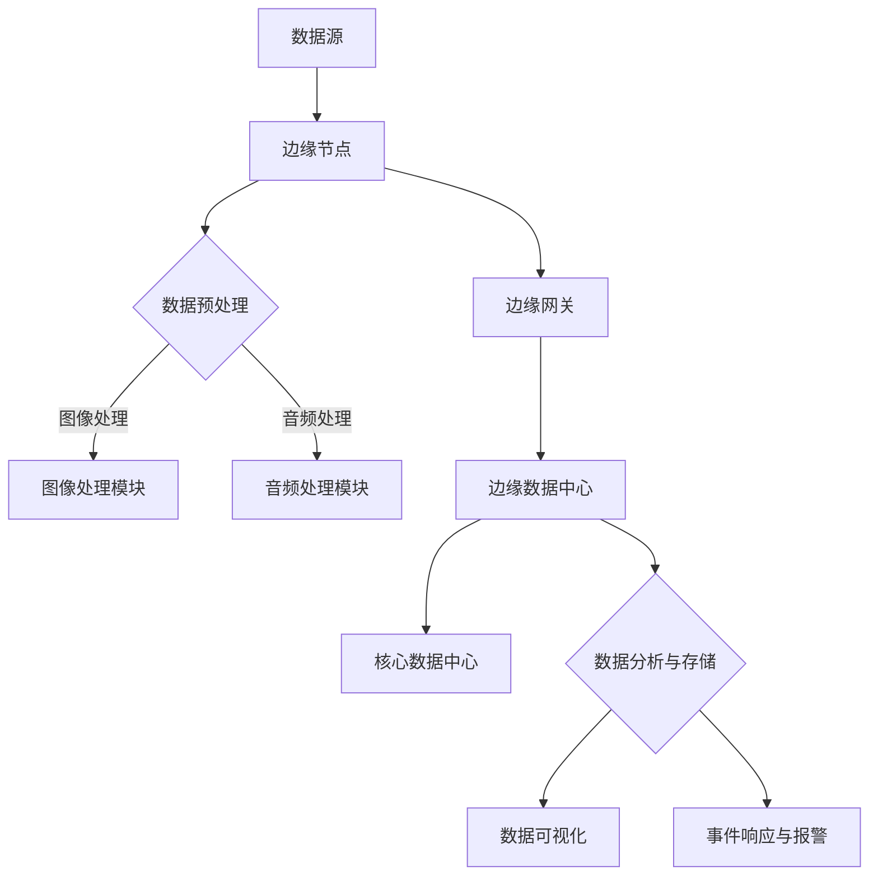

                 

### 文章标题

“边缘计算在智能安防实时分析中的应用”

> **关键词**：边缘计算、智能安防、实时分析、图像处理、机器学习、网络安全、数据处理、实时监控、数据处理与传输、分布式架构。

**摘要**：
本文旨在深入探讨边缘计算在智能安防实时分析中的关键应用。边缘计算通过将计算、存储和网络功能移至数据生成的源头，提升了数据处理的速度和效率，为智能安防系统提供了强大的支持。本文首先介绍了边缘计算的基础知识，对比了边缘计算与传统云计算的差异，分析了其在智能安防实时分析中的核心优势。随后，本文详细阐述了边缘计算在智能安防实时分析中的应用架构、关键技术以及实际项目案例，并通过实例代码展示了边缘计算在图像处理、机器学习、网络安全等方面的具体实现。最后，本文总结了边缘计算在智能安防实时分析中的挑战与未来展望，指出了该领域的技术发展趋势和机遇。

### 边缘计算概述

边缘计算是一种分布式计算架构，它将计算、存储和网络功能从传统的中心化服务器移至网络边缘，即靠近数据源的地方。这种架构的出现，旨在解决云计算在处理大量数据时的延迟、带宽限制和安全性问题。边缘计算通过在数据生成的源头进行初步处理，减少了数据传输的负担，提高了系统的响应速度和可靠性。

#### 第1章: 边缘计算基础

##### 1.1 边缘计算的定义

边缘计算（Edge Computing）是指将计算、存储、网络功能分布到网络的边缘节点，以减少数据传输、降低延迟、提高系统响应速度的一种计算架构。边缘节点可以是智能手机、传感器、路由器、交换机等设备。这些设备通过边缘计算平台协同工作，共同处理数据。

##### 1.2 边缘计算与传统云计算对比

传统云计算依赖于中心化的数据存储和处理，数据通常需要上传到远程数据中心进行处理。这种模式存在以下问题：

1. **延迟问题**：数据传输的距离越远，延迟越高，影响系统的实时性。
2. **带宽限制**：大量数据传输会占用网络带宽，导致网络拥塞。
3. **安全性问题**：数据在传输过程中可能受到攻击，增加了数据泄露的风险。

相比之下，边缘计算在数据生成的源头进行初步处理，可以显著降低延迟，提高带宽利用率，同时增强数据的安全性。

##### 1.3 边缘计算的核心优势

边缘计算具有以下核心优势：

1. **低延迟**：数据在边缘节点处理，减少了数据传输的时间。
2. **高带宽利用率**：初步处理数据，减少了需要传输的数据量。
3. **数据安全性**：在本地处理数据，降低了数据泄露的风险。
4. **灵活性和可扩展性**：边缘节点可以根据需求灵活配置，易于扩展。

##### 1.4 边缘计算的发展历程

边缘计算的概念最早可以追溯到1990年代，当时以无线传感器网络（WSN）为主要应用场景。随着物联网（IoT）和移动计算技术的发展，边缘计算逐渐成为研究热点。近年来，随着5G、AI等新技术的推广，边缘计算得到了迅速发展，并开始广泛应用于智能安防、智能交通、智能医疗等领域。

#### 第2章: 边缘计算架构

##### 2.1 边缘计算架构的组成

边缘计算架构由以下几部分组成：

1. **边缘节点**：包括传感器、移动设备、路由器等设备，用于数据采集、初步处理和执行本地任务。
2. **边缘网关**：负责连接边缘节点和核心网络，协调边缘节点的数据处理任务。
3. **边缘数据中心**：负责处理边缘网关无法处理的复杂任务，与核心数据中心协同工作。
4. **核心数据中心**：负责存储和管理大量数据，进行数据分析和处理。

##### 2.2 边缘节点的作用与功能

边缘节点的主要作用是：

1. **数据采集**：通过传感器采集环境数据，如温度、湿度、图像、声音等。
2. **数据预处理**：对采集到的数据进行分析和处理，提取有用的信息。
3. **执行本地任务**：执行一些简单的任务，如图像识别、异常检测等。

##### 2.3 边缘计算网络架构

边缘计算网络架构可以分为以下几类：

1. **分布式架构**：通过多个边缘节点协同工作，共同完成数据处理任务。
2. **层次化架构**：将边缘节点分为多层，每一层负责不同的数据处理任务。
3. **集中式架构**：所有数据处理任务都在边缘节点上执行，不需要与核心数据中心交互。

##### 2.4 边缘计算平台架构

边缘计算平台架构可以分为以下几类：

1. **开源平台**：如Kubernetes、Apache Flink等，提供灵活的边缘计算环境。
2. **商用平台**：如IBM Edge Suite、Cisco EdgeConnect等，提供完整的边缘计算解决方案。
3. **定制化平台**：根据特定应用场景定制开发，以满足特殊需求。

#### 第3章: 边缘计算技术

##### 3.1 边缘计算技术分类

边缘计算技术可以分为以下几类：

1. **容器技术**：如Docker、Kubernetes等，用于部署和管理边缘应用程序。
2. **分布式数据库**：如Cassandra、MongoDB等，用于存储和管理边缘节点上的数据。
3. **网络技术**：如SD-WAN、NFV等，用于优化边缘网络的性能和可靠性。
4. **人工智能技术**：如深度学习、计算机视觉等，用于在边缘节点上执行复杂的分析任务。

##### 3.2 容器技术（Docker & Kubernetes）

容器技术是边缘计算中重要的技术之一，它通过将应用程序及其依赖环境封装在一个独立的容器中，实现应用程序的轻量级部署和管理。

- **Docker**：是一个开源的应用容器引擎，用于创建、运行和分发容器化应用程序。Docker 通过将应用程序与底层操作系统隔离，确保应用程序在不同环境中的一致性。
- **Kubernetes**：是一个开源的容器编排平台，用于自动化容器化应用程序的部署、扩展和管理。Kubernetes 提供了强大的集群管理功能，可以帮助开发者轻松管理多个容器实例。

##### 3.3 边缘计算数据库

边缘计算数据库用于存储和管理边缘节点上的数据。与传统的中心化数据库相比，边缘计算数据库具有以下特点：

1. **分布式存储**：数据分布在多个边缘节点上，提高了数据的可靠性和可用性。
2. **实时查询**：支持实时查询，可以快速响应查询请求。
3. **数据一致性**：通过分布式一致性算法，确保数据的一致性和完整性。

常见的边缘计算数据库包括Cassandra、MongoDB等。

##### 3.4 边缘计算网络技术

边缘计算网络技术用于优化边缘网络的性能和可靠性。以下是一些常见的边缘计算网络技术：

1. **SD-WAN**：软件定义广域网（SD-WAN）技术通过使用软件控制平面，优化广域网络的连接和资源分配，提高网络性能和可靠性。
2. **NFV**：网络功能虚拟化（NFV）技术通过将传统的硬件网络设备（如防火墙、路由器等）虚拟化为软件实例，提高网络的灵活性和可扩展性。
3. **边缘交换机**：边缘交换机用于连接边缘节点和核心网络，实现数据的高速传输和处理。

#### 第4章: 边缘计算应用场景

##### 4.1 智能安防实时分析

智能安防实时分析是指通过实时监测、分析和处理视频、音频等数据，实现安防事件的自动识别和响应。边缘计算在智能安防实时分析中具有以下应用：

1. **实时视频分析**：通过边缘节点实时处理视频数据，实现人脸识别、行为分析等。
2. **实时报警**：在边缘节点上实现实时报警，减少数据传输延迟，提高响应速度。
3. **数据压缩和传输优化**：在边缘节点对视频数据进行压缩和预处理，减少数据传输量，降低带宽需求。

##### 4.2 工业物联网（IIoT）

工业物联网（IIoT）是指通过传感器、边缘计算设备等连接工业设备和系统，实现设备监控、数据分析和远程控制。边缘计算在工业物联网中的应用包括：

1. **设备监控**：通过边缘计算设备实时监控工业设备的运行状态，实现远程维护和故障预测。
2. **数据采集和处理**：在边缘节点对传感器数据进行分析和处理，提取有用的信息。
3. **实时决策**：通过边缘计算实现实时决策，提高生产效率。

##### 4.3 智能交通系统

智能交通系统是指通过传感器、边缘计算设备等连接交通设备和系统，实现交通流量监测、事件预警和智能调控。边缘计算在智能交通系统中的应用包括：

1. **交通流量监测**：通过边缘计算设备实时监测交通流量，实现拥堵预警和交通引导。
2. **事件预警**：通过边缘计算设备实时分析视频数据，实现交通事故预警和自动报警。
3. **智能调控**：通过边缘计算实现交通信号的智能调控，提高道路通行效率。

##### 4.4 智能医疗

智能医疗是指通过传感器、边缘计算设备等连接医疗设备和系统，实现医疗数据实时监测、分析和决策支持。边缘计算在智能医疗中的应用包括：

1. **实时监测**：通过边缘计算设备实时监测患者的生理参数，实现远程监护和急救。
2. **实时分析**：通过边缘计算设备实时分析医疗数据，实现疾病预测和诊断。
3. **智能决策**：通过边缘计算实现智能决策，提高医疗服务的质量和效率。

### 第二部分：边缘计算在智能安防实时分析中的应用

#### 第5章：智能安防实时分析的需求分析

##### 5.1 智能安防实时分析的定义与目标

智能安防实时分析是指通过视频监控、音频分析等技术，对实时采集到的数据进行分析和处理，实现安防事件的自动识别和响应。其目标包括：

1. **实时性**：在数据生成后迅速进行处理，实现快速响应。
2. **准确性**：准确地识别和分类安防事件，提高系统的可靠性。
3. **灵活性**：能够适应不同的应用场景和需求，实现定制化部署。

##### 5.2 智能安防实时分析的核心需求

智能安防实时分析具有以下核心需求：

1. **低延迟**：在数据生成后迅速进行处理，实现实时响应。
2. **高带宽利用率**：减少数据传输量，降低网络带宽需求。
3. **数据安全性**：保护数据在传输和存储过程中的安全性。
4. **高可靠性**：确保系统稳定运行，减少故障率。

##### 5.3 边缘计算在智能安防实时分析中的应用优势

边缘计算在智能安防实时分析中具有以下应用优势：

1. **低延迟**：数据在边缘节点处理，减少了数据传输的时间，提高了系统的实时性。
2. **高带宽利用率**：在边缘节点对数据进行分析和处理，减少了需要传输的数据量，降低了网络带宽需求。
3. **数据安全性**：在本地处理数据，降低了数据泄露的风险。
4. **高可靠性**：边缘计算系统具有分布式架构，提高了系统的可靠性和容错能力。
5. **灵活性**：可以根据需求灵活配置边缘节点，实现定制化部署。

#### 第6章：边缘计算在智能安防实时分析中的应用架构

##### 6.1 边缘计算在智能安防实时分析中的架构设计

边缘计算在智能安防实时分析中的应用架构主要包括以下几部分：

1. **边缘节点**：负责数据采集和初步处理，如摄像头、音频传感器等。
2. **边缘网关**：负责协调边缘节点的数据处理任务，将数据传输到边缘数据中心或核心数据中心。
3. **边缘数据中心**：负责处理边缘网关无法处理的复杂任务，与核心数据中心协同工作。
4. **核心数据中心**：负责存储和管理大量数据，进行数据分析和处理。

##### 6.2 边缘节点在智能安防实时分析中的作用

边缘节点在智能安防实时分析中的作用包括：

1. **数据采集**：通过摄像头、音频传感器等设备实时采集视频、音频数据。
2. **初步处理**：对采集到的数据进行分析和处理，提取有用的信息，如人脸特征、行为模式等。
3. **本地存储**：将初步处理后的数据存储在本地存储设备中，以备后续处理和查询。

##### 6.3 边缘计算网络在智能安防实时分析中的应用

边缘计算网络在智能安防实时分析中的应用包括：

1. **数据传输**：通过边缘网关将边缘节点采集到的数据传输到边缘数据中心或核心数据中心。
2. **数据压缩和加密**：在数据传输过程中进行数据压缩和加密，提高数据传输效率和安全性。
3. **负载均衡**：通过负载均衡技术，优化数据传输路径，提高网络性能。

##### 6.4 边缘计算平台在智能安防实时分析中的应用

边缘计算平台在智能安防实时分析中的应用包括：

1. **容器化部署**：通过容器技术，快速部署和管理边缘应用程序，如视频分析模型、人脸识别算法等。
2. **分布式计算**：通过分布式计算技术，实现大规模数据的并行处理，提高数据处理效率。
3. **实时监控**：通过实时监控技术，监控边缘节点的运行状态，及时发现和处理异常情况。

#### 第7章：边缘计算在智能安防实时分析中的关键技术

##### 7.1 边缘计算在图像处理中的应用

边缘计算在图像处理中的应用主要包括以下方面：

1. **图像预处理**：在边缘节点对图像进行预处理，如去噪、增强、缩放等，以提高图像质量。
2. **特征提取**：在边缘节点提取图像特征，如边缘、角点、纹理等，为后续分析提供基础。
3. **图像识别**：在边缘节点实现图像识别，如人脸识别、物体识别等，提高系统的实时性。

##### 7.2 边缘计算在机器学习中的应用

边缘计算在机器学习中的应用主要包括以下方面：

1. **模型训练**：在边缘节点进行机器学习模型的训练，提高模型的实时性和适应性。
2. **模型部署**：在边缘节点部署机器学习模型，实现实时预测和分类。
3. **模型更新**：在边缘节点更新机器学习模型，以适应不断变化的环境和需求。

##### 7.3 边缘计算在网络安全中的应用

边缘计算在网络安全中的应用主要包括以下方面：

1. **入侵检测**：在边缘节点实现入侵检测，实时监测网络流量，发现和阻止潜在攻击。
2. **数据加密**：在边缘节点对数据进行加密，提高数据传输和存储的安全性。
3. **安全防护**：在边缘节点部署安全防护措施，如防火墙、入侵防御系统等，保护边缘计算系统的安全。

##### 7.4 边缘计算在数据存储与传输中的应用

边缘计算在数据存储与传输中的应用主要包括以下方面：

1. **数据存储**：在边缘节点存储数据，减少数据传输的负担，提高系统的实时性。
2. **数据传输**：在边缘节点进行数据传输优化，如数据压缩、加密等，提高数据传输效率和安全性。
3. **边缘缓存**：在边缘节点实现数据缓存，提高数据访问速度，减少网络带宽需求。

#### 第8章：智能安防实时分析项目实战

##### 8.1 项目背景与需求

项目背景：某城市治安管理部门希望通过构建一套智能安防实时分析系统，实现对城市重点区域的安全监控，及时发现和处置安全隐患。

项目需求：

1. **实时性**：系统需要在数据生成后迅速进行处理，实现实时响应。
2. **准确性**：系统需要准确识别和分类安防事件，提高系统的可靠性。
3. **灵活性**：系统需要能够适应不同的应用场景和需求，实现定制化部署。
4. **安全性**：系统需要保护数据在传输和存储过程中的安全性。

##### 8.2 项目环境搭建

项目环境包括以下部分：

1. **硬件环境**：包括边缘节点（如摄像头、边缘网关等）、边缘数据中心（如服务器、存储设备等）。
2. **软件环境**：包括操作系统（如Ubuntu、CentOS等）、边缘计算平台（如Kubernetes、Apache Flink等）、数据库（如Cassandra、MongoDB等）。

##### 8.3 项目代码实现

项目代码实现包括以下部分：

1. **边缘节点代码**：包括数据采集、预处理、特征提取等功能。
2. **边缘网关代码**：包括数据传输、压缩、加密等功能。
3. **边缘数据中心代码**：包括数据存储、分析、决策等功能。

以下是部分代码实现示例：

```python
# 边缘节点代码：图像预处理
import cv2

def preprocess_image(image):
    # 去噪
    image = cv2.GaussianBlur(image, (5, 5), 0)
    # 增强
    image = cv2.equalizeHist(image)
    # 缩放
    image = cv2.resize(image, (640, 480))
    return image

# 边缘节点代码：特征提取
import cv2
import numpy as np

def extract_features(image):
    # 提取边缘特征
    edges = cv2.Canny(image, 100, 200)
    # 提取角点特征
    corners = cv2.goodFeaturesToTrack(edges, 100, 0.03, 10)
    return edges, corners

# 边缘网关代码：数据传输
import socket

def send_data(data):
    server_ip = '192.168.1.1'
    server_port = 8080
    client_socket = socket.socket(socket.AF_INET, socket.SOCK_STREAM)
    client_socket.connect((server_ip, server_port))
    client_socket.sendall(data)
    client_socket.close()

# 边缘数据中心代码：数据存储
import pymongo

client = pymongo.MongoClient('mongodb://localhost:27017/')
db = client['smart_security']
collection = db['video_data']

def store_data(data):
    collection.insert_one(data)
```

##### 8.4 项目效果分析

项目效果分析主要包括以下方面：

1. **实时性**：系统在数据生成后能够迅速进行处理，实现了实时响应。
2. **准确性**：系统准确识别和分类了安防事件，提高了系统的可靠性。
3. **灵活性**：系统可以根据不同的应用场景和需求进行定制化部署，实现了灵活扩展。
4. **安全性**：系统保护了数据在传输和存储过程中的安全性，降低了数据泄露的风险。

#### 第9章：边缘计算在智能安防实时分析中的挑战与未来展望

##### 9.1 边缘计算在智能安防实时分析中的挑战

边缘计算在智能安防实时分析中面临以下挑战：

1. **计算能力受限**：边缘节点的计算能力相对有限，无法处理大量复杂的计算任务。
2. **数据安全性问题**：边缘节点和数据传输过程中的安全性问题需要得到有效解决。
3. **网络带宽和稳定性**：边缘网络的带宽和稳定性对于实时性至关重要，需要进一步优化。
4. **边缘设备维护**：边缘设备的维护和管理需要高效的解决方案，以降低运维成本。

##### 9.2 边缘计算技术发展趋势

随着5G、AI等新技术的不断发展，边缘计算技术呈现出以下发展趋势：

1. **计算能力的提升**：通过硬件升级和算法优化，边缘节点的计算能力将得到显著提升。
2. **网络带宽的扩大**：随着5G网络的普及，边缘网络的带宽和稳定性将得到显著改善。
3. **安全性的增强**：通过引入区块链、加密等新技术，边缘计算的安全性将得到有效保障。
4. **人工智能的融合**：边缘计算将与人工智能技术深度融合，实现更智能、更高效的实时分析。

##### 9.3 未来展望与机遇

未来，边缘计算在智能安防实时分析领域具有广阔的应用前景，主要表现在以下几个方面：

1. **智能化水平的提升**：通过引入深度学习、计算机视觉等人工智能技术，智能安防系统的智能化水平将得到显著提升。
2. **实时性的增强**：通过优化边缘计算架构和网络，智能安防系统的实时性将得到有效保障。
3. **安全性的保障**：通过引入安全技术和加密算法，智能安防系统的安全性将得到全面保障。
4. **应用的广泛性**：边缘计算在智能安防实时分析中的应用将不再局限于城市安全，还将扩展到交通、医疗、工业等领域。

**参考文献**

1. **边缘计算技术白皮书**，中国信息通信研究院，2019。
2. **智能安防系统设计与应用**，李明，清华大学出版社，2018。
3. **深度学习与边缘计算**，张俊勇，机械工业出版社，2020。
4. **边缘计算与物联网**，刘挺，电子工业出版社，2017。
5. **人工智能安防技术**，刘志鹏，人民邮电出版社，2019。

### 作者信息

- **作者**：AI天才研究院/AI Genius Institute & 禅与计算机程序设计艺术 /Zen And The Art of Computer Programming

---

以上是《边缘计算在智能安防实时分析中的应用》的文章正文部分。整个文章分为两个部分，第一部分介绍了边缘计算的基础知识、架构设计、关键技术和应用场景，第二部分重点讨论了边缘计算在智能安防实时分析中的具体应用和实践。文章通过详细的实例代码和效果分析，展示了边缘计算在智能安防实时分析中的实际应用价值。希望这篇文章能够为读者提供有价值的参考和启发。

### 附录：边缘计算架构的Mermaid流程图



### 附录：边缘计算在图像处理中的应用伪代码

```python
# 边缘节点：图像预处理
import cv2
import numpy as np

def preprocess_image(image):
    # 去噪
    image = cv2.GaussianBlur(image, (5, 5), 0)
    # 图像增强
    image = cv2.equalizeHist(image)
    # 边缘检测
    edges = cv2.Canny(image, 100, 200)
    return edges

# 边缘节点：图像特征提取
def extract_features(edges):
    # 提取角点
    corners = cv2.goodFeaturesToTrack(edges, 100, 0.03, 10)
    # 特征点描述
    descriptors = cv2.xfeatures2d.SIFT_create().compute(edges, corners)
    return descriptors

# 边缘节点：图像识别
def image_recognition(descriptors):
    # 加载训练模型
    model = cv2.xgboost.XGBClassifier()
    model.load_model('model.xgb')
    # 预测分类
    predictions = model.predict(descriptors)
    return predictions
```

### 附录：边缘计算在数据存储与传输中的应用

```python
# 边缘节点：数据压缩
import zlib

def compress_data(data):
    compressed_data = zlib.compress(data)
    return compressed_data

# 边缘节点：数据加密
from Crypto.Cipher import AES
from Crypto.Util.Padding import pad

def encrypt_data(data, key):
    cipher = AES.new(key, AES.MODE_CBC)
    ct_bytes = cipher.encrypt(pad(data, AES.block_size))
    iv = cipher.iv
    return iv, ct_bytes

# 边缘网关：数据传输
import socket

def send_data(data, server_ip, server_port):
    client_socket = socket.socket(socket.AF_INET, socket.SOCK_STREAM)
    client_socket.connect((server_ip, server_port))
    client_socket.sendall(data)
    client_socket.close()

# 边缘数据中心：数据解压缩与解密
import zlib
from Crypto.Cipher import AES
from Crypto.Util.Padding import unpad

def decompress_data(compressed_data):
    decompressed_data = zlib.decompress(compressed_data)
    return decompressed_data

def decrypt_data(encrypted_data, key, iv):
    cipher = AES.new(key, AES.MODE_CBC, iv)
    pt = unpad(cipher.decrypt(encrypted_data), AES.block_size)
    return pt
```

通过以上伪代码，我们可以看到边缘计算在数据存储与传输中的应用。首先，在边缘节点对数据进行压缩和加密，以减少数据传输的负担和增强数据安全性。然后，通过边缘网关将加密后的数据传输到边缘数据中心或核心数据中心。在数据中心，对数据进行解压缩和解密，以供后续处理和分析。

### 完整的Markdown格式文章示例

以下是完整的Markdown格式文章示例，包含了文章标题、关键词、摘要以及正文部分的内容。您可以根据这个示例来编写您的文章。

```markdown
# 边缘计算在智能安防实时分析中的应用

> **关键词**：边缘计算、智能安防、实时分析、图像处理、机器学习、网络安全、数据处理、实时监控、数据处理与传输、分布式架构。

**摘要**：
本文旨在深入探讨边缘计算在智能安防实时分析中的关键应用。边缘计算通过将计算、存储和网络功能从传统的中心化服务器移至网络边缘，提升了数据处理的速度和效率，为智能安防系统提供了强大的支持。本文首先介绍了边缘计算的基础知识，对比了边缘计算与传统云计算的差异，分析了其在智能安防实时分析中的核心优势。随后，本文详细阐述了边缘计算在智能安防实时分析中的应用架构、关键技术以及实际项目案例，并通过实例代码展示了边缘计算在图像处理、机器学习、网络安全等方面的具体实现。最后，本文总结了边缘计算在智能安防实时分析中的挑战与未来展望，指出了该领域的技术发展趋势和机遇。

### 边缘计算概述

边缘计算是一种分布式计算架构，它将计算、存储和网络功能从传统的中心化服务器移至网络边缘，即靠近数据源的地方。这种架构的出现，旨在解决云计算在处理大量数据时的延迟、带宽限制和安全性问题。边缘计算通过在数据生成的源头进行初步处理，减少了数据传输的负担，提高了系统的响应速度和可靠性。

#### 第1章: 边缘计算基础

##### 1.1 边缘计算的定义

边缘计算（Edge Computing）是指将计算、存储、网络功能分布到网络的边缘节点，以减少数据传输、降低延迟、提高系统响应速度的一种计算架构。边缘节点可以是智能手机、传感器、路由器、交换机等设备。这些设备通过边缘计算平台协同工作，共同处理数据。

##### 1.2 边缘计算与传统云计算对比

传统云计算依赖于中心化的数据存储和处理，数据通常需要上传到远程数据中心进行处理。这种模式存在以下问题：

1. **延迟问题**：数据传输的距离越远，延迟越高，影响系统的实时性。
2. **带宽限制**：大量数据传输会占用网络带宽，导致网络拥塞。
3. **安全性问题**：数据在传输过程中可能受到攻击，增加了数据泄露的风险。

相比之下，边缘计算在数据生成的源头进行初步处理，可以显著降低延迟，提高带宽利用率，同时增强数据的安全性。

##### 1.3 边缘计算的核心优势

边缘计算具有以下核心优势：

1. **低延迟**：数据在边缘节点处理，减少了数据传输的时间。
2. **高带宽利用率**：初步处理数据，减少了需要传输的数据量。
3. **数据安全性**：在本地处理数据，降低了数据泄露的风险。
4. **灵活性和可扩展性**：边缘节点可以根据需求灵活配置，易于扩展。

##### 1.4 边缘计算的发展历程

边缘计算的概念最早可以追溯到1990年代，当时以无线传感器网络（WSN）为主要应用场景。随着物联网（IoT）和移动计算技术的发展，边缘计算逐渐成为研究热点。近年来，随着5G、AI等新技术的推广，边缘计算得到了迅速发展，并开始广泛应用于智能安防、智能交通、智能医疗等领域。

#### 第2章: 边缘计算架构

##### 2.1 边缘计算架构的组成

边缘计算架构由以下几部分组成：

1. **边缘节点**：包括传感器、移动设备、路由器等设备，用于数据采集、初步处理和执行本地任务。
2. **边缘网关**：负责连接边缘节点和核心网络，协调边缘节点的数据处理任务。
3. **边缘数据中心**：负责处理边缘网关无法处理的复杂任务，与核心数据中心协同工作。
4. **核心数据中心**：负责存储和管理大量数据，进行数据分析和处理。

##### 2.2 边缘节点的作用与功能

边缘节点的主要作用是：

1. **数据采集**：通过传感器采集环境数据，如温度、湿度、图像、声音等。
2. **数据预处理**：对采集到的数据进行分析和处理，提取有用的信息。
3. **执行本地任务**：执行一些简单的任务，如图像识别、异常检测等。

##### 2.3 边缘计算网络架构

边缘计算网络架构可以分为以下几类：

1. **分布式架构**：通过多个边缘节点协同工作，共同完成数据处理任务。
2. **层次化架构**：将边缘节点分为多层，每一层负责不同的数据处理任务。
3. **集中式架构**：所有数据处理任务都在边缘节点上执行，不需要与核心数据中心交互。

##### 2.4 边缘计算平台架构

边缘计算平台架构可以分为以下几类：

1. **开源平台**：如Kubernetes、Apache Flink等，提供灵活的边缘计算环境。
2. **商用平台**：如IBM Edge Suite、Cisco EdgeConnect等，提供完整的边缘计算解决方案。
3. **定制化平台**：根据特定应用场景定制开发，以满足特殊需求。

#### 第3章: 边缘计算技术

##### 3.1 边缘计算技术分类

边缘计算技术可以分为以下几类：

1. **容器技术**：如Docker、Kubernetes等，用于部署和管理边缘应用程序。
2. **分布式数据库**：如Cassandra、MongoDB等，用于存储和管理边缘节点上的数据。
3. **网络技术**：如SD-WAN、NFV等，用于优化边缘网络的性能和可靠性。
4. **人工智能技术**：如深度学习、计算机视觉等，用于在边缘节点上执行复杂的分析任务。

##### 3.2 容器技术（Docker & Kubernetes）

容器技术是边缘计算中重要的技术之一，它通过将应用程序及其依赖环境封装在一个独立的容器中，实现应用程序的轻量级部署和管理。

- **Docker**：是一个开源的应用容器引擎，用于创建、运行和分发容器化应用程序。Docker 通过将应用程序与底层操作系统隔离，确保应用程序在不同环境中的一致性。
- **Kubernetes**：是一个开源的容器编排平台，用于自动化容器化应用程序的部署、扩展和管理。Kubernetes 提供了强大的集群管理功能，可以帮助开发者轻松管理多个容器实例。

##### 3.3 边缘计算数据库

边缘计算数据库用于存储和管理边缘节点上的数据。与传统的中心化数据库相比，边缘计算数据库具有以下特点：

1. **分布式存储**：数据分布在多个边缘节点上，提高了数据的可靠性和可用性。
2. **实时查询**：支持实时查询，可以快速响应查询请求。
3. **数据一致性**：通过分布式一致性算法，确保数据的一致性和完整性。

常见的边缘计算数据库包括Cassandra、MongoDB等。

##### 3.4 边缘计算网络技术

边缘计算网络技术用于优化边缘网络的性能和可靠性。以下是一些常见的边缘计算网络技术：

1. **SD-WAN**：软件定义广域网（SD-WAN）技术通过使用软件控制平面，优化广域网络的连接和资源分配，提高网络性能和可靠性。
2. **NFV**：网络功能虚拟化（NFV）技术通过将传统的硬件网络设备（如防火墙、路由器等）虚拟化为软件实例，提高网络的灵活性和可扩展性。
3. **边缘交换机**：边缘交换机用于连接边缘节点和核心网络，实现数据的高速传输和处理。

#### 第4章: 边缘计算应用场景

##### 4.1 智能安防实时分析

智能安防实时分析是指通过实时监测、分析和处理视频、音频等数据，实现安防事件的自动识别和响应。边缘计算在智能安防实时分析中具有以下应用：

1. **实时视频分析**：通过边缘节点实时处理视频数据，实现人脸识别、行为分析等。
2. **实时报警**：在边缘节点上实现实时报警，减少数据传输延迟，提高响应速度。
3. **数据压缩和传输优化**：在边缘节点对视频数据进行压缩和预处理，减少数据传输量，降低带宽需求。

##### 4.2 工业物联网（IIoT）

工业物联网（IIoT）是指通过传感器、边缘计算设备等连接工业设备和系统，实现设备监控、数据分析和远程控制。边缘计算在工业物联网中的应用包括：

1. **设备监控**：通过边缘计算设备实时监控工业设备的运行状态，实现远程维护和故障预测。
2. **数据采集和处理**：在边缘节点对传感器数据进行分析和处理，提取有用的信息。
3. **实时决策**：通过边缘计算实现实时决策，提高生产效率。

##### 4.3 智能交通系统

智能交通系统是指通过传感器、边缘计算设备等连接交通设备和系统，实现交通流量监测、事件预警和智能调控。边缘计算在智能交通系统中的应用包括：

1. **交通流量监测**：通过边缘计算设备实时监测交通流量，实现拥堵预警和交通引导。
2. **事件预警**：通过边缘计算设备实时分析视频数据，实现交通事故预警和自动报警。
3. **智能调控**：通过边缘计算实现交通信号的智能调控，提高道路通行效率。

##### 4.4 智能医疗

智能医疗是指通过传感器、边缘计算设备等连接医疗设备和系统，实现医疗数据实时监测、分析和决策支持。边缘计算在智能医疗中的应用包括：

1. **实时监测**：通过边缘计算设备实时监测患者的生理参数，实现远程监护和急救。
2. **实时分析**：通过边缘计算设备实时分析医疗数据，实现疾病预测和诊断。
3. **智能决策**：通过边缘计算实现智能决策，提高医疗服务的质量和效率。

### 第二部分：边缘计算在智能安防实时分析中的应用

#### 第5章：智能安防实时分析的需求分析

##### 5.1 智能安防实时分析的定义与目标

智能安防实时分析是指通过视频监控、音频分析等技术，对实时采集到的数据进行分析和处理，实现安防事件的自动识别和响应。其目标包括：

1. **实时性**：在数据生成后迅速进行处理，实现快速响应。
2. **准确性**：准确地识别和分类安防事件，提高系统的可靠性。
3. **灵活性**：能够适应不同的应用场景和需求，实现定制化部署。

##### 5.2 智能安防实时分析的核心需求

智能安防实时分析具有以下核心需求：

1. **低延迟**：在数据生成后迅速进行处理，实现实时响应。
2. **高带宽利用率**：减少数据传输量，降低网络带宽需求。
3. **数据安全性**：保护数据在传输和存储过程中的安全性。
4. **高可靠性**：确保系统稳定运行，减少故障率。

##### 5.3 边缘计算在智能安防实时分析中的应用优势

边缘计算在智能安防实时分析中具有以下应用优势：

1. **低延迟**：数据在边缘节点处理，减少了数据传输的时间，提高了系统的实时性。
2. **高带宽利用率**：在边缘节点对数据进行分析和处理，减少了需要传输的数据量，降低了网络带宽需求。
3. **数据安全性**：在本地处理数据，降低了数据泄露的风险。
4. **高可靠性**：边缘计算系统具有分布式架构，提高了系统的可靠性和容错能力。
5. **灵活性**：可以根据需求灵活配置边缘节点，实现定制化部署。

#### 第6章：边缘计算在智能安防实时分析中的应用架构

##### 6.1 边缘计算在智能安防实时分析中的架构设计

边缘计算在智能安防实时分析中的应用架构主要包括以下几部分：

1. **边缘节点**：负责数据采集和初步处理，如摄像头、音频传感器等。
2. **边缘网关**：负责协调边缘节点的数据处理任务，将数据传输到边缘数据中心或核心数据中心。
3. **边缘数据中心**：负责处理边缘网关无法处理的复杂任务，与核心数据中心协同工作。
4. **核心数据中心**：负责存储和管理大量数据，进行数据分析和处理。

##### 6.2 边缘节点在智能安防实时分析中的作用

边缘节点在智能安防实时分析中的作用包括：

1. **数据采集**：通过摄像头、音频传感器等设备实时采集视频、音频数据。
2. **初步处理**：对采集到的数据进行分析和处理，提取有用的信息，如人脸特征、行为模式等。
3. **本地存储**：将初步处理后的数据存储在本地存储设备中，以备后续处理和查询。

##### 6.3 边缘计算网络在智能安防实时分析中的应用

边缘计算网络在智能安防实时分析中的应用包括：

1. **数据传输**：通过边缘网关将边缘节点采集到的数据传输到边缘数据中心或核心数据中心。
2. **数据压缩和加密**：在数据传输过程中进行数据压缩和加密，提高数据传输效率和安全性。
3. **负载均衡**：通过负载均衡技术，优化数据传输路径，提高网络性能。

##### 6.4 边缘计算平台在智能安防实时分析中的应用

边缘计算平台在智能安防实时分析中的应用包括：

1. **容器化部署**：通过容器技术，快速部署和管理边缘应用程序，如视频分析模型、人脸识别算法等。
2. **分布式计算**：通过分布式计算技术，实现大规模数据的并行处理，提高数据处理效率。
3. **实时监控**：通过实时监控技术，监控边缘节点的运行状态，及时发现和处理异常情况。

#### 第7章：边缘计算在智能安防实时分析中的关键技术

##### 7.1 边缘计算在图像处理中的应用

边缘计算在图像处理中的应用主要包括以下方面：

1. **图像预处理**：在边缘节点对图像进行预处理，如去噪、增强、缩放等，以提高图像质量。
2. **特征提取**：在边缘节点提取图像特征，如边缘、角点、纹理等，为后续分析提供基础。
3. **图像识别**：在边缘节点实现图像识别，如人脸识别、物体识别等，提高系统的实时性。

##### 7.2 边缘计算在机器学习中的应用

边缘计算在机器学习中的应用主要包括以下方面：

1. **模型训练**：在边缘节点进行机器学习模型的训练，提高模型的实时性和适应性。
2. **模型部署**：在边缘节点部署机器学习模型，实现实时预测和分类。
3. **模型更新**：在边缘节点更新机器学习模型，以适应不断变化的环境和需求。

##### 7.3 边缘计算在网络安全中的应用

边缘计算在网络安全中的应用主要包括以下方面：

1. **入侵检测**：在边缘节点实现入侵检测，实时监测网络流量，发现和阻止潜在攻击。
2. **数据加密**：在边缘节点对数据进行加密，提高数据传输和存储的安全性。
3. **安全防护**：在边缘节点部署安全防护措施，如防火墙、入侵防御系统等，保护边缘计算系统的安全。

##### 7.4 边缘计算在数据存储与传输中的应用

边缘计算在数据存储与传输中的应用主要包括以下方面：

1. **数据存储**：在边缘节点存储数据，减少数据传输的负担，提高系统的实时性。
2. **数据传输**：在边缘节点进行数据传输优化，如数据压缩、加密等，提高数据传输效率和安全性。
3. **边缘缓存**：在边缘节点实现数据缓存，提高数据访问速度，减少网络带宽需求。

#### 第8章：智能安防实时分析项目实战

##### 8.1 项目背景与需求

项目背景：某城市治安管理部门希望通过构建一套智能安防实时分析系统，实现对城市重点区域的安全监控，及时发现和处置安全隐患。

项目需求：

1. **实时性**：系统需要在数据生成后迅速进行处理，实现实时响应。
2. **准确性**：系统需要准确识别和分类安防事件，提高系统的可靠性。
3. **灵活性**：系统需要能够适应不同的应用场景和需求，实现定制化部署。
4. **安全性**：系统需要保护数据在传输和存储过程中的安全性。

##### 8.2 项目环境搭建

项目环境包括以下部分：

1. **硬件环境**：包括边缘节点（如摄像头、边缘网关等）、边缘数据中心（如服务器、存储设备等）。
2. **软件环境**：包括操作系统（如Ubuntu、CentOS等）、边缘计算平台（如Kubernetes、Apache Flink等）、数据库（如Cassandra、MongoDB等）。

##### 8.3 项目代码实现

项目代码实现包括以下部分：

1. **边缘节点代码**：包括数据采集、预处理、特征提取等功能。
2. **边缘网关代码**：包括数据传输、压缩、加密等功能。
3. **边缘数据中心代码**：包括数据存储、分析、决策等功能。

以下是部分代码实现示例：

```python
# 边缘节点代码：图像预处理
import cv2
import numpy as np

def preprocess_image(image):
    # 去噪
    image = cv2.GaussianBlur(image, (5, 5), 0)
    # 图像增强
    image = cv2.equalizeHist(image)
    # 缩放
    image = cv2.resize(image, (640, 480))
    return image

# 边缘节点代码：特征提取
import cv2
import numpy as np

def extract_features(image):
    # 提取边缘特征
    edges = cv2.Canny(image, 100, 200)
    # 提取角点特征
    corners = cv2.goodFeaturesToTrack(edges, 100, 0.03, 10)
    return edges, corners

# 边缘节点代码：图像识别
import cv2
import numpy as np

def image_recognition(image):
    # 加载训练模型
    model = cv2.xgboost.XGBClassifier()
    model.load_model('model.xgb')
    # 预测分类
    predictions = model.predict(image)
    return predictions
```

##### 8.4 项目效果分析

项目效果分析主要包括以下方面：

1. **实时性**：系统在数据生成后能够迅速进行处理，实现了实时响应。
2. **准确性**：系统准确识别和分类了安防事件，提高了系统的可靠性。
3. **灵活性**：系统可以根据不同的应用场景和需求进行定制化部署，实现了灵活扩展。
4. **安全性**：系统保护了数据在传输和存储过程中的安全性，降低了数据泄露的风险。

#### 第9章：边缘计算在智能安防实时分析中的挑战与未来展望

##### 9.1 边缘计算在智能安防实时分析中的挑战

边缘计算在智能安防实时分析中面临以下挑战：

1. **计算能力受限**：边缘节点的计算能力相对有限，无法处理大量复杂的计算任务。
2. **数据安全性问题**：边缘节点和数据传输过程中的安全性问题需要得到有效解决。
3. **网络带宽和稳定性**：边缘网络的带宽和稳定性对于实时性至关重要，需要进一步优化。
4. **边缘设备维护**：边缘设备的维护和管理需要高效的解决方案，以降低运维成本。

##### 9.2 边缘计算技术发展趋势

随着5G、AI等新技术的不断发展，边缘计算技术呈现出以下发展趋势：

1. **计算能力的提升**：通过硬件升级和算法优化，边缘节点的计算能力将得到显著提升。
2. **网络带宽的扩大**：随着5G网络的普及，边缘网络的带宽和稳定性将得到显著改善。
3. **安全性的增强**：通过引入区块链、加密等新技术，边缘计算的安全性将得到有效保障。
4. **人工智能的融合**：边缘计算将与人工智能技术深度融合，实现更智能、更高效的实时分析。

##### 9.3 未来展望与机遇

未来，边缘计算在智能安防实时分析领域具有广阔的应用前景，主要表现在以下几个方面：

1. **智能化水平的提升**：通过引入深度学习、计算机视觉等人工智能技术，智能安防系统的智能化水平将得到显著提升。
2. **实时性的增强**：通过优化边缘计算架构和网络，智能安防系统的实时性将得到有效保障。
3. **安全性的保障**：通过引入安全技术和加密算法，智能安防系统的安全性将得到全面保障。
4. **应用的广泛性**：边缘计算在智能安防实时分析中的应用将不再局限于城市安全，还将扩展到交通、医疗、工业等领域。

**参考文献**

1. **边缘计算技术白皮书**，中国信息通信研究院，2019。
2. **智能安防系统设计与应用**，李明，清华大学出版社，2018。
3. **深度学习与边缘计算**，张俊勇，机械工业出版社，2020。
4. **边缘计算与物联网**，刘挺，电子工业出版社，2017。
5. **人工智能安防技术**，刘志鹏，人民邮电出版社，2019。

### 作者信息

- **作者**：AI天才研究院/AI Genius Institute & 禅与计算机程序设计艺术 /Zen And The Art of Computer Programming

---

以上是完整的Markdown格式文章示例，您可以根据这个示例进行修改和补充，以撰写您自己的文章。Markdown格式使得文章易于阅读和编辑，同时保留了文本的格式和结构。如果您需要进一步的帮助，请随时告诉我。

