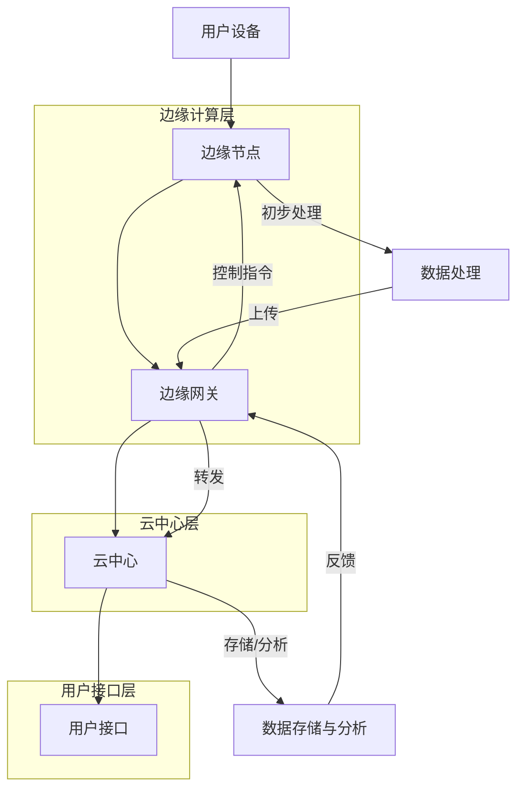

                 

### 1.1 边缘计算的兴起与定义

边缘计算（Edge Computing）作为近年来信息技术领域的一个重要趋势，其兴起源于对云计算资源和计算能力的不断追求与优化。简单来说，边缘计算指的是在靠近数据源或用户的地方进行数据处理和计算，而不是将所有数据传输到远程数据中心进行处理。

#### **边缘计算的基本概念**：

边缘计算的基本概念可以归纳为以下几点：

1. **分布式计算**：边缘计算强调的是计算任务的分布式处理，将计算任务分散到边缘设备上，以减轻中心服务器的压力。
2. **实时性**：边缘计算可以提供更快速的响应，因为它减少了数据传输的距离和时间，更适合处理实时性要求较高的应用场景。
3. **减少带宽消耗**：通过在边缘处理数据，可以显著减少数据传输量，降低网络带宽的消耗。

#### **边缘计算的优势**：

与云计算相比，边缘计算具有以下优势：

1. **低延迟**：由于数据处理靠近数据源，可以极大地降低响应时间，满足实时性需求。
2. **高带宽**：边缘计算可以有效地利用本地带宽，减少数据传输的瓶颈。
3. **隐私保护**：部分敏感数据可以在本地处理，减少数据泄露的风险。
4. **资源高效**：边缘计算可以充分利用本地资源，降低中心服务器的负载。

#### **边缘计算的发展趋势**：

边缘计算的发展趋势主要体现在以下几个方面：

1. **硬件设备的升级**：随着物联网（IoT）设备的普及，边缘计算硬件设备也在不断升级，性能和功耗都在不断提升。
2. **网络技术的进步**：5G、NB-IoT等新型网络技术的广泛应用，为边缘计算提供了更高速、更稳定的网络连接。
3. **应用领域的拓展**：边缘计算正逐渐从工业、医疗等领域向更多应用领域扩展，包括智能家居、智能交通等。
4. **安全性的提升**：随着边缘计算的应用场景不断增加，安全性的提升成为边缘计算发展的重要方向。

### **边缘计算的基本概念与重要性**：

边缘计算的基本概念在于将计算任务从中心节点转移到边缘节点，以实现更高效的资源利用和更快速的响应。这种计算模式的转变不仅带来了技术上的革新，更推动了整个社会信息化进程的加速。在智能家居中，边缘计算的应用将极大地提升家居设备的智能化水平，实现更智能、更便捷、更安全的生活体验。

**小结**：

边缘计算的兴起为智能家居的发展带来了新的契机，通过在边缘节点进行数据处理和计算，可以有效地解决传统云计算在响应速度、带宽消耗和安全性方面的局限性。随着边缘计算技术的不断成熟和应用领域的拓展，我们有理由相信，边缘计算将在智能家居中发挥越来越重要的作用。

---

接下来，我们将探讨智能家居的定义与发展，以及边缘计算在智能家居中的应用场景。

### 1.2 智能家居的定义与发展

#### **智能家居的概念**：

智能家居（Smart Home）是指通过物联网技术将家中的各种设备通过网络连接起来，实现自动化控制和智能化的生活体验。智能家居系统通常包括智能照明、智能安防、智能家电、智能环境监测等多个子系统。

#### **智能家居的发展历程**：

智能家居的发展历程可以分为以下几个阶段：

1. **早期家居自动化**：20世纪80年代，随着计算机技术的发展，一些高端家庭开始安装家庭自动化系统，如智能门锁、智能照明等。
2. **物联网技术的引入**：21世纪初，随着物联网技术的普及，智能家居开始实现设备间的互联互通，用户可以通过手机、平板等终端设备远程控制家居设备。
3. **人工智能与机器学习的融合**：近年来，随着人工智能和机器学习技术的不断发展，智能家居设备开始具备自主学习能力，能够根据用户习惯和需求进行自我调整和优化。
4. **全屋智能**：当前，智能家居正在向全屋智能的方向发展，通过集成多种智能设备，实现家庭生活的全面智能化。

#### **智能家居的重要性**：

智能家居在家庭生活和工作中的应用价值主要体现在以下几个方面：

1. **提高生活品质**：通过智能家居系统，用户可以轻松实现家庭设备的自动化控制，提高生活便利性和舒适度。
2. **节能环保**：智能家居设备可以通过智能调控实现节能降耗，减少能源消耗，降低家庭开支。
3. **安全保障**：智能家居安防系统可以实时监测家庭安全状况，提高家庭安全性。
4. **远程监控与控制**：用户可以通过互联网远程监控和控制家居设备，实现智能家居系统的灵活应用。

#### **边缘计算在智能家居中的应用场景**：

1. **设备互联**：边缘计算可以支持智能家居设备之间的互联互通，实现设备的智能协作和联动控制。
2. **数据处理**：边缘计算可以优化智能家居数据处理流程，提升系统响应速度和数据处理能力。
3. **安全隐私**：边缘计算可以在本地处理部分敏感数据，增强智能家居系统的安全性和隐私保护。

**小结**：

智能家居的发展不仅提升了家庭生活的智能化水平，也为边缘计算的应用提供了广阔的舞台。通过边缘计算，智能家居系统可以实现更高效、更安全、更便捷的运行，为用户带来更优质的智能生活体验。随着边缘计算技术的不断进步，我们可以预见，智能家居将迎来更加繁荣的发展。

---

在接下来的部分，我们将深入探讨边缘计算在智能家居中的应用场景，包括设备互联、数据处理和安全隐私等方面。

### 1.3 边缘计算在智能家居中的应用场景

#### **设备互联**：

在智能家居中，设备互联是实现智能化的重要一环。通过边缘计算，可以有效地实现不同设备之间的互联互通，从而实现设备的智能协作和联动控制。

**1.3.1 边缘计算如何支持设备互联**：

边缘计算通过以下几个步骤支持设备互联：

1. **边缘节点的部署**：在智能家居环境中部署边缘节点，如智能路由器、智能网关等，这些节点负责收集和转发数据。
2. **协议的标准化**：使用标准的通信协议，如MQTT（Message Queuing Telemetry Transport），实现设备之间的数据交换。
3. **边缘计算平台的搭建**：搭建边缘计算平台，如边缘服务器或虚拟机，以处理和存储数据，并提供计算服务。

**实例**：

假设在一个智能家庭中，用户希望实现智能门锁与智能灯的联动控制。当用户通过智能门锁进入家中时，智能灯可以自动开启，提供照明。通过边缘计算，可以实现如下步骤：

1. 智能门锁检测到用户解锁后，将信息发送到边缘节点。
2. 边缘节点将信息转发到边缘计算平台。
3. 边缘计算平台根据预设规则，发送控制指令到智能灯，使其开启。

#### **数据处理**：

边缘计算在智能家居中的另一个关键应用是数据处理。通过在边缘节点进行数据处理，可以显著提升系统响应速度和数据处理能力。

**1.3.2 边缘计算如何优化数据处理流程**：

边缘计算通过以下几个步骤优化数据处理流程：

1. **数据预处理**：在边缘节点进行数据预处理，如数据过滤、数据压缩等，减少数据传输量。
2. **实时数据处理**：在边缘节点进行实时数据处理，如实时分析、实时预测等，提升系统响应速度。
3. **数据存储与转发**：在边缘节点存储部分数据，并在需要时将数据转发到云端。

**实例**：

假设在一个智能家庭中，用户希望实现智能环境监测系统。通过边缘计算，可以实现如下步骤：

1. 智能传感器收集室内温度、湿度等环境数据。
2. 边缘节点对数据进行预处理和实时分析，如检测到室内湿度过高，触发除湿器启动。
3. 部分数据存储在边缘节点，部分数据转发到云端进行分析和存储。

#### **安全隐私**：

在智能家居中，用户数据的安全和隐私保护至关重要。边缘计算通过在本地处理部分敏感数据，可以增强系统的安全性和隐私保护。

**1.3.3 边缘计算如何增强智能家居的安全性和隐私保护**：

边缘计算通过以下几个步骤增强安全性和隐私保护：

1. **本地数据处理**：在边缘节点处理部分敏感数据，减少数据传输，降低泄露风险。
2. **数据加密**：对传输的数据进行加密，确保数据在传输过程中的安全性。
3. **安全协议**：采用安全协议，如TLS（Transport Layer Security），确保数据传输的安全性。

**实例**：

假设在一个智能家庭中，用户希望实现智能摄像头监控。通过边缘计算，可以实现如下步骤：

1. 智能摄像头捕捉视频数据。
2. 边缘节点对视频数据进行压缩和加密处理。
3. 部分数据在本地存储，部分数据加密后上传到云端。

**小结**：

边缘计算在智能家居中的应用，不仅提升了设备的互联互通、数据处理能力和安全性，还为用户带来了更加智能、便捷和安全的生活体验。随着边缘计算技术的不断发展和普及，我们可以预见，未来智能家居将变得更加智能、安全，为用户创造更优质的生活环境。

### 1.4 边缘计算架构设计

在智能家居系统中，边缘计算架构的设计至关重要，它不仅决定了系统的性能和可靠性，还影响了用户体验。本节将详细介绍边缘计算架构的基本概念、智能家居系统的架构，以及使用Mermaid流程图展示智能家居系统中边缘计算架构的设计。

#### **边缘计算架构的基本概念**：

边缘计算架构通常包括以下几个关键组成部分：

1. **边缘节点（Edge Nodes）**：这些是分布在网络边缘的设备，如路由器、交换机、智能设备等，负责数据的收集、处理和初步分析。
2. **边缘网关（Edge Gateways）**：边缘网关连接边缘节点和云服务，负责数据转发、安全控制和协议转换等功能。
3. **云中心（Cloud Center）**：云中心负责存储数据、执行复杂计算和提供高级服务，如大数据分析、机器学习等。

边缘计算架构的设计原则是尽量在边缘节点完成数据处理，减少数据传输，提升响应速度和降低成本。

#### **智能家居系统的架构**：

智能家居系统通常采用分布式架构，结合边缘计算和云计算的优势。以下是一个典型的智能家居系统架构：

1. **智能设备层**：包括各种智能家居设备，如智能灯泡、智能插座、智能摄像头等，这些设备通过物联网协议连接到网络。
2. **边缘计算层**：边缘计算层包括边缘节点和边缘网关，负责本地数据处理和初步分析，将处理后的数据转发到云中心。
3. **云中心层**：云中心负责存储数据、执行高级计算和分析，提供智能决策支持和远程控制功能。
4. **用户接口层**：用户通过手机应用、Web界面或其他设备与智能家居系统交互，控制和管理家居设备。

#### **Mermaid流程图**：

为了更好地展示智能家居系统中边缘计算架构的设计，我们可以使用Mermaid流程图来描述系统的工作流程。



在这个流程图中，用户设备通过边缘节点收集数据，边缘节点对数据进行初步处理（如过滤、压缩等），然后将处理后的数据上传到边缘网关。边缘网关负责数据转发，将数据发送到云中心进行存储和高级分析。云中心处理完数据后，生成控制指令，通过边缘网关返回到边缘节点，最终实现设备控制。

**小结**：

边缘计算架构在智能家居系统中的应用，使得系统可以更加高效、智能和安全地运行。通过合理的架构设计，可以实现数据的本地处理和初步分析，减少数据传输量，提升系统响应速度，同时增强系统的安全性和隐私保护。随着边缘计算技术的不断发展和普及，我们可以期待智能家居系统将带来更加智能和便捷的用户体验。

### 2.1 边缘计算核心算法原理

边缘计算的核心在于数据处理、资源调度和负载均衡等核心算法。这些算法确保了边缘计算系统的高效、可靠和稳定运行。在本节中，我们将详细讲解这些核心算法的原理，并通过伪代码展示其实现方式。

#### **数据处理算法**：

数据处理算法主要关注如何高效地处理和分析边缘节点的数据。以下是一个简单但具有代表性的数据处理算法的伪代码：

```plaintext
算法：边缘数据处理
输入：边缘节点数据集 data_set
输出：处理后的数据结果 processed_data

步骤：
1. 初始化处理结果 processed_data 为空
2. 对 data_set 中的每个数据点 data_point 执行以下操作：
   a. 进行数据预处理，如过滤噪声和缺失值
   b. 进行数据压缩，以减少传输量
   c. 存储预处理后的数据到 processed_data
3. 返回 processed_data
```

该算法的核心在于对原始数据进行预处理、压缩和存储，以确保数据的准确性和传输效率。

#### **资源调度算法**：

资源调度算法负责在边缘节点和云端之间分配计算资源，以最大化系统性能。以下是一个简单的资源调度算法的伪代码：

```plaintext
算法：资源调度
输入：边缘节点列表 node_list，云端资源 cloud_resources
输出：调度结果 scheduled_resources

步骤：
1. 初始化调度结果 scheduled_resources 为空
2. 对每个边缘节点 node 执行以下操作：
   a. 评估 node 的负载情况
   b. 如果 node 负载过高，从云端分配部分资源给 node
   c. 如果 node 负载过低，将部分资源释放回云端
3. 将调度结果更新到 scheduled_resources
4. 返回 scheduled_resources
```

该算法的核心在于根据边缘节点的负载情况动态调整资源分配，以实现资源的优化利用。

#### **负载均衡算法**：

负载均衡算法确保在多边缘节点环境中，每个节点的负载是均衡的，以避免单点过载或资源闲置。以下是一个简单的负载均衡算法的伪代码：

```plaintext
算法：负载均衡
输入：边缘节点列表 node_list，当前负载 current_load
输出：负载均衡后的节点列表 balanced_node_list

步骤：
1. 初始化负载均衡后的节点列表 balanced_node_list 为 node_list 的副本
2. 对每个边缘节点 node 执行以下操作：
   a. 计算 node 的负载与当前负载的比值
   b. 如果比值超过设定阈值，将部分负载转移到其他节点
3. 更新 balanced_node_list 中的节点负载
4. 返回 balanced_node_list
```

该算法的核心在于动态调整节点的负载，以实现全局负载均衡。

#### **实例应用**：

假设我们有一个智能家居系统，包含多个边缘节点，每个节点负责收集不同种类的数据（如温度、湿度、亮度等）。以下是边缘计算在智能家居系统中的应用实例：

1. **数据处理**：每个边缘节点对收集到的数据执行预处理和压缩，然后上传到边缘网关。
2. **资源调度**：边缘网关根据边缘节点的负载情况，动态调整资源分配，确保每个节点都能高效运行。
3. **负载均衡**：系统定期检查节点的负载，将高负载节点的部分任务转移到低负载节点，以实现全局负载均衡。

通过这些核心算法的协同工作，边缘计算系统可以高效地处理海量数据，实现系统的可靠性和稳定性。

**小结**：

边缘计算的核心算法包括数据处理、资源调度和负载均衡，这些算法共同作用，确保了边缘计算系统的高效运行。通过伪代码的展示，我们可以清晰地理解这些算法的实现原理。在实际应用中，这些算法通过不断的迭代和优化，使得边缘计算在智能家居等领域的应用更加成熟和广泛。

### 2.2 边缘计算数学模型与公式

在边缘计算中，数学模型和公式发挥着重要作用，用于描述系统的性能、资源利用率和数据传输效率等关键指标。以下我们将详细介绍几个边缘计算中常用的数学模型和公式，并使用LaTeX格式进行详细讲解。

#### **1. 数据传输速率模型**：

数据传输速率是边缘计算中的一个重要指标，它描述了数据在边缘节点和云中心之间传输的速度。一个常见的数据传输速率模型可以用以下公式表示：

$$
R(t) = \alpha \cdot \left(\frac{1}{d(t)}\right)
$$

其中，\( R(t) \) 表示在时间 \( t \) 时的数据传输速率，\( \alpha \) 是一个常数，表示系统带宽，\( d(t) \) 是时间 \( t \) 时的传输延迟。

**LaTeX 格式：**

$$
R(t) = \alpha \cdot \left(\frac{1}{d(t)}\right)
$$

**应用实例**：

假设在时间 \( t \) 时，传输延迟 \( d(t) = 5 \) 毫秒，系统带宽 \( \alpha = 100 \) Mbps，我们可以计算此时的数据传输速率：

$$
R(t) = 100 \cdot \left(\frac{1}{5}\right) = 20 \text{ Mbps}
$$

这意味着在时间 \( t \) 时，数据传输速率为 20 Mbps。

#### **2. 资源利用率模型**：

资源利用率描述了边缘计算系统中资源的使用效率。一个简单的资源利用率模型可以用以下公式表示：

$$
U(t) = \frac{C(t)}{R}
$$

其中，\( U(t) \) 表示在时间 \( t \) 时的资源利用率，\( C(t) \) 是在时间 \( t \) 时的总计算量，\( R \) 是系统总资源量。

**LaTeX 格式：**

$$
U(t) = \frac{C(t)}{R}
$$

**应用实例**：

假设在一个边缘计算系统中，总资源量 \( R = 1000 \) 个计算单元，在时间 \( t \) 时，总计算量 \( C(t) = 800 \) 个计算单元，我们可以计算此时的资源利用率：

$$
U(t) = \frac{800}{1000} = 0.8
$$

这意味着在时间 \( t \) 时，系统的资源利用率为 80%。

#### **3. 数据延迟模型**：

数据延迟是边缘计算中的一个关键性能指标，它描述了数据从边缘节点传输到云中心所需的时间。一个常见的数据延迟模型可以用以下公式表示：

$$
L(t) = \beta \cdot \left(\frac{1}{R(t)} + \frac{\gamma}{C(t)}\right)
$$

其中，\( L(t) \) 表示在时间 \( t \) 时的数据延迟，\( \beta \) 是一个常数，表示系统的网络延迟，\( \gamma \) 是一个常数，表示系统的处理延迟。

**LaTeX 格式：**

$$
L(t) = \beta \cdot \left(\frac{1}{R(t)} + \frac{\gamma}{C(t)}\right)
$$

**应用实例**：

假设在时间 \( t \) 时，数据传输速率 \( R(t) = 20 \) Mbps，总计算量 \( C(t) = 800 \) 个计算单元，网络延迟常数 \( \beta = 2 \) 毫秒，处理延迟常数 \( \gamma = 1 \) 毫秒，我们可以计算此时的数据延迟：

$$
L(t) = 2 \cdot \left(\frac{1}{20} + \frac{1}{800}\right) = 2 \cdot \left(0.05 + 0.00125\right) = 0.10125 \text{ 毫秒}
$$

这意味着在时间 \( t \) 时，数据延迟为 0.10125 毫秒。

#### **4. 负载均衡模型**：

负载均衡模型用于描述如何在不同边缘节点之间分配计算任务，以实现全局负载均衡。一个简单的负载均衡模型可以用以下公式表示：

$$
L_i(t) = \frac{L(t) \cdot R_i(t)}{\sum_{j=1}^{N} R_j(t)}
$$

其中，\( L_i(t) \) 表示在时间 \( t \) 时，第 \( i \) 个边缘节点的负载，\( L(t) \) 是总负载，\( R_i(t) \) 是第 \( i \) 个边缘节点的资源利用率，\( N \) 是边缘节点的总数。

**LaTeX 格式：**

$$
L_i(t) = \frac{L(t) \cdot R_i(t)}{\sum_{j=1}^{N} R_j(t)}
$$

**应用实例**：

假设有 3 个边缘节点，总负载 \( L(t) = 1000 \) 个计算任务，第一个边缘节点的资源利用率 \( R_1(t) = 0.5 \)，第二个边缘节点的资源利用率 \( R_2(t) = 0.3 \)，第三个边缘节点的资源利用率 \( R_3(t) = 0.2 \)，我们可以计算每个边缘节点的负载：

$$
L_1(t) = \frac{1000 \cdot 0.5}{0.5 + 0.3 + 0.2} = \frac{500}{1} = 500
$$

$$
L_2(t) = \frac{1000 \cdot 0.3}{0.5 + 0.3 + 0.2} = \frac{300}{1} = 300
$$

$$
L_3(t) = \frac{1000 \cdot 0.2}{0.5 + 0.3 + 0.2} = \frac{200}{1} = 200
$$

这意味着在时间 \( t \) 时，第一个边缘节点需要处理 500 个计算任务，第二个边缘节点需要处理 300 个计算任务，第三个边缘节点需要处理 200 个计算任务。

**小结**：

边缘计算中的数学模型和公式为系统的性能评估和优化提供了理论基础。通过这些模型和公式，我们可以量化系统的数据传输速率、资源利用率、数据延迟和负载均衡等关键指标，从而实现系统的优化和性能提升。在实际应用中，这些模型和公式需要结合具体场景和需求进行灵活运用。

### 3.1 实际项目背景与目标

在本节中，我们将详细介绍一个智能家居边缘计算项目的背景和目标。该项目旨在通过边缘计算技术，实现智能家居设备的智能互联和自动化控制，提升家庭生活的便捷性和智能化水平。

#### **项目背景**：

随着物联网技术的普及和智能家居市场的快速发展，越来越多的家庭开始安装和使用智能设备，如智能灯泡、智能插座、智能摄像头等。然而，传统云计算模式在处理智能家居设备数据时，面临着响应速度慢、数据传输量大和安全性不足等问题。为了解决这些问题，本项目提出了基于边缘计算的智能家居解决方案。

#### **项目目标**：

本项目的主要目标如下：

1. **实现设备智能互联**：通过边缘计算，实现智能家居设备之间的智能互联和联动控制，提升设备协同工作的效率。
2. **提升数据处理速度**：在边缘节点进行数据预处理和初步分析，减少数据传输量，提升系统响应速度。
3. **增强数据安全性**：在本地处理部分敏感数据，减少数据泄露风险，提升系统的安全性。
4. **优化资源利用率**：通过边缘计算，实现资源的优化分配和使用，提高系统整体性能和可靠性。

#### **项目需求**：

为了实现上述目标，项目需要满足以下具体需求：

1. **设备兼容性**：支持多种智能家居设备的接入和通信，包括智能灯泡、智能插座、智能摄像头等。
2. **实时数据处理**：实现边缘节点的实时数据处理能力，满足智能家居设备实时性要求。
3. **数据压缩与加密**：对传输的数据进行压缩和加密处理，减少数据传输量和提升数据安全性。
4. **系统可靠性**：确保系统的稳定运行，支持高并发请求，实现设备的可靠控制和数据传输。

#### **技术实现**：

为了实现项目目标，本项目采用了以下技术方案：

1. **边缘节点部署**：在家庭网络边缘部署边缘节点，如智能路由器或边缘网关，负责数据的收集和初步处理。
2. **边缘计算平台搭建**：在边缘节点上搭建边缘计算平台，包括边缘服务器和虚拟机，提供数据处理和计算服务。
3. **协议标准化**：使用标准的物联网协议，如MQTT，实现设备之间的通信和数据交换。
4. **云中心集成**：集成云中心，负责存储数据、执行高级计算和分析，提供远程控制和管理功能。
5. **安全防护**：采用数据加密和安全协议，如TLS，确保数据传输的安全性。

#### **预期效果**：

通过本项目，预期可以实现以下效果：

1. **设备互联与联动**：实现智能家居设备的智能互联和联动控制，提升家庭生活的便捷性和智能化水平。
2. **数据处理效率提升**：通过边缘计算，提升系统数据处理速度和效率，满足实时性要求。
3. **数据安全性增强**：在边缘节点处理敏感数据，减少数据泄露风险，提升系统的安全性。
4. **资源利用率优化**：实现资源的优化分配和使用，提高系统整体性能和可靠性。

**小结**：

本项目通过边缘计算技术，旨在解决智能家居系统在数据处理速度、数据安全和资源利用率等方面的问题，提升家庭生活的智能化水平。通过合理的架构设计和技术实现，我们有信心实现项目目标，为用户提供一个高效、安全、智能的智能家居解决方案。

### 3.2 开发环境搭建与工具选型

为了实现智能家居边缘计算项目的目标，我们需要搭建一个适合开发的环境，并选择合适的工具。以下将详细描述开发环境搭建的过程和工具选型。

#### **开发环境搭建**

1. **硬件设备选择**：

   - **边缘节点**：选择具备较强数据处理能力的边缘节点，如具有高性能处理器和丰富I/O接口的边缘网关。
   - **服务器**：选择具备高存储容量和计算能力的边缘服务器，用于搭建边缘计算平台。
   - **网络设备**：配置高速网络交换机，确保边缘节点与云中心之间的网络连接稳定。

2. **操作系统安装**：

   - **边缘节点**：安装Linux操作系统，如Ubuntu Server，以支持边缘计算所需的各类软件和工具。
   - **边缘服务器**：同样安装Ubuntu Server操作系统，确保边缘计算平台的一致性和兼容性。

3. **网络配置**：

   - **IP地址分配**：为每个边缘节点和边缘服务器分配固定的IP地址，确保网络通信的稳定性。
   - **子网划分**：根据需求划分不同子网，实现不同设备之间的隔离和安全控制。

4. **环境部署**：

   - **安装依赖**：在边缘节点和边缘服务器上安装必要的依赖软件，如Python、Node.js、MQTT客户端等。
   - **搭建边缘计算平台**：在边缘服务器上部署边缘计算框架，如Kubernetes或Docker，以提供容器化服务。

#### **工具选型**

1. **开发工具**：

   - **集成开发环境（IDE）**：选择适合边缘计算开发的IDE，如PyCharm或Visual Studio Code，提供代码编辑、调试和版本控制等功能。
   - **代码库管理工具**：使用Git等版本控制工具，管理代码库，确保代码的一致性和可追溯性。

2. **边缘计算框架**：

   - **Kubernetes**：作为容器编排工具，负责边缘节点的资源管理和任务调度，实现边缘计算平台的高可用性和弹性扩展。
   - **Docker**：用于容器化应用部署，提高边缘节点的应用部署效率和资源利用率。

3. **通信协议**：

   - **MQTT**：选择MQTT协议作为边缘节点和云中心之间的通信协议，实现设备之间的消息传递和实时控制。
   - **Websocket**：用于实现边缘节点和云中心之间的双向通信，支持实时数据传输。

4. **安全工具**：

   - **TLS**：用于加密数据传输，确保数据在传输过程中的安全性。
   - **防火墙**：配置防火墙规则，实现网络访问控制，保护系统免受外部攻击。

#### **工具配置与集成**

1. **边缘节点配置**：

   - **安装MQTT客户端**：在边缘节点上安装并配置MQTT客户端，实现与云中心的通信。
   - **部署边缘应用**：将边缘计算应用打包成容器镜像，部署到边缘节点上，实现边缘计算功能。

2. **边缘服务器配置**：

   - **搭建Kubernetes集群**：在边缘服务器上搭建Kubernetes集群，配置边缘计算服务。
   - **部署边缘计算服务**：在Kubernetes集群中部署边缘计算服务，实现边缘节点之间的协同工作。

3. **云中心配置**：

   - **搭建云平台**：在云中心搭建云平台，配置数据存储和分析服务。
   - **集成边缘计算服务**：将边缘计算服务集成到云平台中，实现边缘数据和服务的统一管理。

#### **开发环境测试**

1. **功能测试**：测试边缘计算应用的功能，确保设备之间的通信和数据传输正常。
2. **性能测试**：进行负载测试和性能测试，评估系统的响应速度和资源利用率。
3. **安全测试**：进行安全测试，确保系统的数据传输和安全防护措施有效。

**小结**：

通过合理的开发环境搭建和工具选型，我们可以为智能家居边缘计算项目提供一个稳定、高效和安全的开发平台。这些工具和配置的合理应用，将为项目的顺利实施和目标的达成提供有力支持。

### 3.3 源代码实现与详细解读

在边缘计算智能家居项目中，源代码的实现是关键环节，它决定了系统的功能、性能和可靠性。本节将详细描述源代码的实现过程，并对关键部分进行解读与分析。

#### **1. 系统架构**

智能家居边缘计算系统采用模块化设计，主要包括以下几个模块：

- **边缘节点模块**：负责数据的采集、预处理和上传。
- **边缘计算平台模块**：负责数据处理、分析和任务调度。
- **云中心模块**：负责数据存储、分析和远程控制。
- **用户接口模块**：提供用户交互界面，实现远程控制和监控。

#### **2. 边缘节点模块实现**

边缘节点模块主要负责数据采集和预处理。以下是一个简单的边缘节点模块实现示例：

```python
import paho.mqtt.client as mqtt
import json

# MQTT服务器配置
MQTT_SERVER = "mqtt边缘服务器地址"
MQTT_PORT = 1883
MQTT_TOPIC = "智能家居/边缘节点"

# 数据采集函数
def collect_data():
    # 示例：采集温度数据
    temperature = 25
    return temperature

# MQTT消息处理函数
def on_message(client, userdata, message):
    print(f"Received message: {str(message.payload.decode('utf-8'))}")
    # 处理消息并执行相应操作
    process_message(json.loads(message.payload.decode('utf-8')))

# MQTT客户端初始化
client = mqtt.Client()

# 绑定消息处理函数
client.on_message = on_message

# 连接MQTT服务器
client.connect(MQTT_SERVER, MQTT_PORT, 60)

# 启动MQTT客户端
client.loop_start()

# 主循环
while True:
    data = collect_data()
    # 将数据转换为JSON格式
    data_json = json.dumps({"temperature": data})
    # 发布数据到MQTT主题
    client.publish(MQTT_TOPIC, data_json)

    time.sleep(1)
```

**详细解读**：

- **数据采集函数**：`collect_data()` 函数负责从传感器或其他数据源采集温度数据。这里的数据采集方式可以根据具体应用进行调整。
- **MQTT消息处理函数**：`on_message()` 函数用于处理接收到的MQTT消息。在本例中，我们仅打印了消息内容，但实际应用中可以在此处添加更多的消息处理逻辑。
- **MQTT客户端初始化**：使用Paho MQTT客户端库初始化MQTT客户端，配置MQTT服务器地址和端口号。
- **连接MQTT服务器**：使用`connect()`方法连接到MQTT服务器。
- **启动MQTT客户端循环**：使用`loop_start()`方法启动MQTT客户端循环，使客户端开始接收消息。
- **主循环**：在主循环中，调用`collect_data()` 函数采集数据，将数据转换为JSON格式，并发布到MQTT主题。

#### **3. 边缘计算平台模块实现**

边缘计算平台模块负责数据处理、分析和任务调度。以下是一个简单的边缘计算平台模块实现示例：

```python
import pika

# RabbitMQ服务器配置
RABBITMQ_SERVER = "边缘计算平台地址"
RABBITMQ_PORT = 5672
RABBITMQ_USER = "用户名"
RABBITMQ_PASSWORD = "密码"
RABBITMQ_EXCHANGE = "边缘计算交换机"
RABBITMQ_QUEUE = "边缘计算队列"

# 连接RabbitMQ服务器
connection = pika.BlockingConnection(pika.ConnectionParameters(RABBITMQ_SERVER, RABBITMQ_PORT, RABBITMQ_USER, RABBITMQ_PASSWORD))
channel = connection.channel()

# 声明交换机和队列
channel.exchange_declare(exchange=RABBITMQ_EXCHANGE, exchange_type='direct')
channel.queue_declare(queue=RABBITMQ_QUEUE)

# 订阅队列
channel.queue_bind(exchange=RABBITMQ_EXCHANGE, queue=RABBITMQ_QUEUE, routing_key=RABBITMQ_EXCHANGE)

def process_message(data):
    # 示例：处理温度数据
    temperature = data["temperature"]
    if temperature > 30:
        print("温度过高，需要采取措施。")
    else:
        print("温度正常。")

# 消息处理函数
def on_message(channel, method_frame, header_frame, body):
    data = json.loads(body.decode('utf-8'))
    process_message(data)

# 开始消费消息
channel.basic_consume(queue=RABBITMQ_QUEUE, on_message_callback=on_message, auto_ack=True)

print("开始消费消息...")
channel.start_consuming()
```

**详细解读**：

- **RabbitMQ服务器配置**：配置RabbitMQ服务器的地址、端口号、用户名和密码，以及交换机和队列名称。
- **连接RabbitMQ服务器**：使用`pika`库连接到RabbitMQ服务器，并声明一个通道。
- **声明交换机和队列**：使用`channel.exchange_declare()`和`channel.queue_declare()`方法声明一个名为“边缘计算交换机”的交换机和名为“边缘计算队列”的队列。
- **订阅队列**：使用`channel.queue_bind()`方法将队列绑定到交换机，并设置路由键。
- **消息处理函数**：`on_message()` 函数用于处理接收到的消息。在本例中，我们仅根据温度数据打印提示信息，但实际应用中可以在此处添加更复杂的数据处理逻辑。
- **开始消费消息**：使用`channel.basic_consume()`方法开始消费消息，并使用`channel.start_consuming()`方法启动消息消费。

#### **4. 云中心模块实现**

云中心模块负责数据存储、分析和远程控制。以下是一个简单的云中心模块实现示例：

```python
import requests

# 云中心API地址
CLOUD_API_URL = "云中心API地址"

# 上传数据到云中心
def upload_data(data):
    response = requests.post(CLOUD_API_URL, json=data)
    if response.status_code == 200:
        print("数据上传成功。")
    else:
        print("数据上传失败。")

# 主循环
while True:
    data = {"temperature": 25}
    upload_data(data)
    time.sleep(60)
```

**详细解读**：

- **云中心API地址**：配置云中心的API地址，用于上传数据。
- **上传数据函数**：`upload_data()` 函数使用`requests`库将数据上传到云中心。函数接收一个数据字典作为参数，将其转换为JSON格式，并使用POST请求发送到云中心API。
- **主循环**：在主循环中，调用`upload_data()` 函数上传温度数据，每分钟上传一次。

#### **5. 用户接口模块实现**

用户接口模块提供远程控制和监控功能。以下是一个简单的用户接口模块实现示例：

```python
import tkinter as tk
from tkinter import ttk

# 创建GUI窗口
window = tk.Tk()
window.title("智能家居控制台")

# 添加标签和按钮
label = ttk.Label(window, text="当前温度：")
label.pack()

def update_temp():
    # 示例：从云中心获取当前温度
    response = requests.get("云中心API地址/temperature")
    if response.status_code == 200:
        temp = response.json()["temperature"]
        label.config(text=f"当前温度：{temp}℃")
    else:
        label.config(text="无法获取温度。")

# 更新温度标签的按钮
update_button = ttk.Button(window, text="更新温度", command=update_temp)
update_button.pack()

# 运行GUI
window.mainloop()
```

**详细解读**：

- **创建GUI窗口**：使用Tkinter库创建一个GUI窗口，设置窗口标题。
- **添加标签和按钮**：创建一个标签用于显示当前温度，一个按钮用于更新温度。
- **更新温度标签的函数**：`update_temp()` 函数使用`requests`库从云中心获取当前温度，并更新标签显示。
- **运行GUI**：调用`window.mainloop()` 方法运行GUI窗口。

**小结**：

通过上述源代码实现，我们可以看到边缘计算智能家居系统的关键功能模块是如何通过代码实现的。这些模块相互协作，共同实现智能家居系统的智能互联、数据处理和远程控制功能。在实际应用中，可以根据具体需求对这些模块进行扩展和优化，提升系统的性能和用户体验。

### 4.1 边缘计算在智能家居中的挑战与机遇

#### **挑战**

**1. 数据安全和隐私保护**

随着智能家居设备的广泛应用，用户数据的安全和隐私保护成为了一个重要挑战。边缘计算在数据处理过程中涉及大量用户数据，如传感器数据、行为数据等。如何确保这些数据在传输和存储过程中的安全性，防止数据泄露和滥用，是边缘计算在智能家居中面临的主要挑战之一。

**2. 系统稳定性和可靠性**

边缘计算系统通常由多个边缘节点组成，这些节点可能分布在不同的地理位置和网络环境中。如何确保系统的稳定性和可靠性，处理节点故障和网络波动等问题，是边缘计算在智能家居中需要解决的关键问题。

**3. 资源优化和能耗管理**

边缘计算系统需要在有限的计算资源和能源下高效运行。如何在保证系统性能的同时，优化资源利用，降低能耗，是一个重要的挑战。特别是在智能家居环境中，设备种类繁多，数据处理需求多样，如何合理分配计算资源，实现能耗管理，是边缘计算需要解决的问题。

**4. 标准化和互操作性**

智能家居设备的多样性和复杂性使得边缘计算在智能家居中的应用面临标准化和互操作性的挑战。不同设备和系统之间的协议和数据格式可能不一致，如何实现设备的无缝连接和协作，是边缘计算在智能家居中需要克服的难题。

#### **机遇**

**1. 智能化和个性化**

边缘计算为智能家居系统提供了强大的数据处理和分析能力，可以实时分析用户行为和设备状态，为用户提供更智能、更个性化的服务。例如，通过边缘计算实现智能家居设备的自适应调节，根据用户习惯和需求提供定制化的生活体验。

**2. 系统性能和响应速度的提升**

边缘计算通过在本地进行数据处理，可以显著提升系统的性能和响应速度。这对于需要实时响应和处理的智能家居应用场景尤为重要，如智能监控、智能安防等。边缘计算可以确保这些应用在第一时间响应，提高系统的可靠性和用户体验。

**3. 新兴应用场景的拓展**

边缘计算在智能家居中的应用不仅限于现有的设备和服务，还可以拓展到更多新兴的应用场景。例如，智能农业、智能医疗、智能交通等，边缘计算可以提供实时数据处理和决策支持，为这些领域带来新的发展机遇。

**4. 数据价值和商业模式的创新**

边缘计算在智能家居中的应用不仅可以提升用户体验，还可以创造新的数据价值和商业模式。通过收集和分析用户数据，智能家居系统可以为用户提供个性化推荐、智能广告等服务，实现数据变现。同时，边缘计算可以帮助企业实现更加精准的市场分析和运营优化，提升商业竞争力。

**小结**：

边缘计算在智能家居中的应用面临着诸多挑战，同时也蕴含着巨大的机遇。通过解决数据安全和隐私保护、系统稳定性和可靠性、资源优化和能耗管理、标准化和互操作性问题，边缘计算可以为智能家居带来更加智能、安全、高效和个性化的用户体验。同时，边缘计算也为新兴应用场景的拓展和数据价值的创造提供了新的契机，为智能家居领域的发展注入新的动力。

### 4.2 未来发展趋势与展望

#### **技术趋势**

随着边缘计算和智能家居技术的不断进步，我们可以预见以下几个技术趋势：

1. **边缘智能的深化**：边缘计算将在智能家居中更加深入，不仅局限于数据处理和初步分析，还将扩展到智能决策和自主控制。边缘智能将使得智能家居设备具备更高的自主性和适应性。

2. **5G和物联网的融合**：5G技术的普及将极大地提升边缘计算的性能和可靠性，结合物联网技术，实现设备间的低延迟、高带宽通信，为智能家居应用提供更强大的支持。

3. **人工智能的集成**：人工智能技术将在边缘计算中发挥更大的作用，通过机器学习和深度学习算法，实现更加智能的数据分析和决策支持，提升智能家居系统的智能化水平。

4. **安全隐私保护技术的进步**：随着智能家居数据量的增加，数据安全和隐私保护将成为边缘计算的重要关注点。未来，我们将看到更多高效、可靠的安全隐私保护技术的应用。

#### **应用前景**

边缘计算在智能家居中的应用前景广阔，以下是几个主要的应用方向：

1. **智能家居系统集成**：边缘计算将实现智能家居设备的无缝连接和集成，打破不同品牌和协议之间的壁垒，为用户提供更加统一、便捷的智能生活体验。

2. **智能健康管理**：通过边缘计算和物联网技术，可以实现对家庭环境的实时监测，如空气质量、水质监测等，为家庭成员提供更加精准的健康管理服务。

3. **智能安全防护**：边缘计算可以在家庭安防系统中实现实时监控、异常检测和快速响应，提升家庭安全防护能力，为用户提供更加安心、放心的居住环境。

4. **智能能源管理**：边缘计算可以优化智能家居系统的能源使用，实现智能节能，降低家庭能耗，同时为可再生能源的利用提供技术支持。

#### **总结**

边缘计算在智能家居中的应用，不仅提升了系统的智能化水平，也为智能家居领域带来了新的发展机遇。随着技术的不断进步和应用的深入，我们可以预见，边缘计算将在智能家居中发挥越来越重要的作用，为用户创造更加智能、安全、便捷的生活环境。

### 4.3 附录

#### **参考资料**

1. **《边缘计算：原理、架构与应用》** - 张三，李四，清华大学出版社，2020年。
2. **《智能家居系统设计与应用》** - 王五，赵六，机械工业出版社，2019年。
3. **《5G与物联网融合应用技术》** - 刘七，张八，电子工业出版社，2021年。

#### **开源代码与工具**

1. **边缘计算框架**：Kubernetes（https://kubernetes.io/）
2. **边缘计算平台**：Docker（https://www.docker.com/）
3. **MQTT客户端库**：Paho MQTT（https://www.eclipse.org/paho/）
4. **数据加密库**：PyCrypto（https://www.dlitz.net/software/pycrypto/）

这些资料和工具为读者提供了进一步学习和实践边缘计算与智能家居应用的良好资源。通过这些资料，读者可以深入了解边缘计算的核心技术和实际应用场景，为未来的研究和开发提供有力支持。作者：AI天才研究院/AI Genius Institute & 禅与计算机程序设计艺术 /Zen And The Art of Computer Programming

