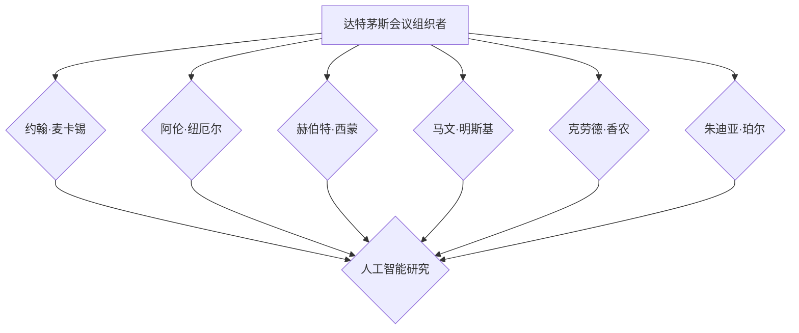

                 

# 达特茅斯会议的科学家团队

## 关键词
- 达特茅斯会议
- 人工智能
- 科学家团队
- 机器学习
- 深度学习
- 自然语言处理
- 认知科学
- 心理学
- 科技发展

## 摘要
本文将深入探讨1956年达特茅斯会议的科学家团队，这是一个具有历史性意义的会议，标志着人工智能领域的诞生。我们将回顾会议的背景、目标及其对现代科技发展的影响，详细分析会议期间讨论的核心议题，如人工智能、机器学习、自然语言处理和认知科学。通过回顾这些议题的起源和发展，本文将展现科学家们在当时是如何思考和探讨人工智能的未来。同时，我们也将探讨达特茅斯会议的遗产和启示，探讨现代科学家在推动科技发展中所承担的责任和使命。本文旨在通过回顾历史，激发读者对人工智能领域的思考，并展望未来科技的发展方向。

## 目录大纲

### 第一部分：背景与概述

#### 第1章：达特茅斯会议的起源与发展

- **1.1 达特茅斯会议的起因**
    - 让我们首先思考，是什么原因促使了达特茅斯会议的召开？回顾历史，当时的计算机科学正处于快速发展阶段，科学家们开始思考计算机是否能够模仿人类的智能。这种思考激发了达特茅斯会议的召开。
- **1.2 达特茅斯会议的目标**
    - 会议的目标是探讨“用机器模拟智能，并研究实现智能机器的途径和方法”。这是一个非常宏伟的目标，表明了科学家们对人工智能的无限憧憬。
- **1.3 达特茅斯会议的影响**
    - 达特茅斯会议对人工智能领域产生了深远的影响，被认为是人工智能诞生的标志。它不仅吸引了众多顶尖科学家参与讨论，也激发了后续的学术研究和实际应用，为人工智能的发展奠定了基础。

#### 第2章：达特茅斯会议的科学家团队

- **2.1 科学家团队构成**
    - 达特茅斯会议的科学家团队由多位顶尖学者组成，包括约翰·麦卡锡、阿伦·纽厄尔、赫伯特·西蒙、马文·明斯基和克劳德·香农等。
- **2.2 团队成员介绍**
    - 让我们逐一介绍这些团队成员，了解他们的背景、贡献和研究方向。例如，约翰·麦卡锡是一位计算机科学家，对编译器和人工智能算法的研究做出了重要贡献。
- **2.3 团队合作与交流**
    - 科学家团队的合作与交流是达特茅斯会议成功的关键。他们在会议期间进行了深入讨论，共同探索人工智能的未来。这种合作精神为后来的学术研究和技术创新提供了榜样。

### 第二部分：核心议题与讨论

#### 第3章：人工智能的展望

- **3.1 人工智能的定义**
    - 让我们首先探讨人工智能的定义。人工智能是一种模拟人类智能的技术，通过机器学习、自然语言处理等技术实现智能行为。
- **3.2 人工智能的发展历程**
    - 接下来，我们将回顾人工智能的发展历程，从早期的计算理论到现代的深度学习，了解人工智能技术的演变。
- **3.3 人工智能的未来趋势**
    - 最后，我们将会展望人工智能的未来趋势，探讨其可能的发展方向和应用领域。

#### 第4章：机器学习与深度学习

- **4.1 机器学习基本概念**
    - 让我们从机器学习的基本概念开始，探讨其原理和应用。机器学习是通过算法从数据中学习规律，并应用于预测和决策。
- **4.2 深度学习架构与算法**
    - 接下来，我们将深入探讨深度学习的架构和算法，包括神经网络、卷积神经网络和循环神经网络等。
- **4.3 机器学习与深度学习的应用场景**
    - 最后，我们将探讨机器学习和深度学习在各个领域的应用，如图像识别、自然语言处理和医疗诊断等。

#### 第5章：自然语言处理

- **5.1 自然语言处理基本概念**
    - 让我们从自然语言处理的基本概念开始，探讨其目标和方法。自然语言处理是使计算机能够理解和生成人类语言的技术。
- **5.2 语言模型与解析模型**
    - 接下来，我们将探讨语言模型和解析模型，了解它们在自然语言处理中的应用。
- **5.3 自然语言处理的应用**
    - 最后，我们将探讨自然语言处理在各个领域的应用，如语音识别、机器翻译和智能客服等。

#### 第6章：认知科学与心理学

- **6.1 认知科学基本概念**
    - 让我们从认知科学的基本概念开始，探讨其研究内容和方法。认知科学是研究人类思维和信息处理过程的多学科领域。
- **6.2 心理学与认知科学的联系**
    - 接下来，我们将探讨心理学与认知科学的联系，了解它们在研究人类智能中的作用。
- **6.3 认知科学与人工智能的关系**
    - 最后，我们将探讨认知科学与人工智能的关系，了解它们在推动人工智能发展中的作用。

### 第三部分：达特茅斯会议的遗产与启示

#### 第7章：达特茅斯会议的历史地位与影响

- **7.1 达特茅斯会议对人工智能领域的贡献**
    - 让我们探讨达特茅斯会议对人工智能领域的贡献，了解它如何推动了人工智能的发展。
- **7.2 达特茅斯会议对现代科技发展的推动**
    - 接下来，我们将探讨达特茅斯会议对现代科技发展的推动作用，了解它如何影响了计算机科学和信息技术的发展。
- **7.3 达特茅斯会议的未来启示**
    - 最后，我们将探讨达特茅斯会议对未来科技发展的启示，了解它如何指导我们走向更加智能的未来。

#### 第8章：现代科学家的责任与使命

- **8.1 科学家的社会责任**
    - 让我们探讨现代科学家的社会责任，了解他们在社会中的作用和责任。
- **8.2 科学家在科技发展中的角色**
    - 接下来，我们将探讨科学家在科技发展中的角色，了解他们在推动科技进步中的作用。
- **8.3 科学家如何引领未来科技发展**
    - 最后，我们将探讨科学家如何引领未来科技发展，了解他们在创新和突破中的作用。

### 附录

#### 附录A：达特茅斯会议参会科学家名单

- **附录A.1 科学家名单**
    - 列出参加达特茅斯会议的科学家名单，并简要介绍他们的贡献和成就。

#### 附录B：达特茅斯会议相关历史资料

- **附录B.1 会议记录**
    - 提供达特茅斯会议的详细记录，包括会议讨论的内容和结论。

## 第一部分：背景与概述

### 第1章：达特茅斯会议的起源与发展

#### 1.1 达特茅斯会议的起因

1956年，正值第二次世界大战后的计算机科学领域蓬勃发展时期，计算机科学家们开始对计算机是否能模仿人类智能产生浓厚的兴趣。这场关于计算机模拟智能的讨论，源于几个关键因素。

首先，计算机科学在战后取得了显著进展。1946年，世界上第一台电子计算机ENIAC在美国问世，标志着计算机时代的开始。随后，计算机的运算速度和存储容量不断提高，使其在科学研究和工程计算中发挥着越来越重要的作用。

其次，心理学和认知科学领域的进展也激发了人们对计算机模拟智能的兴趣。在行为主义心理学占主导地位的一段时间后，认知科学开始崭露头角。认知科学家开始研究人类思维和信息处理的过程，试图理解心智的本质。

最后，一批具有远见卓识的计算机科学家和心理学家开始思考，是否有可能将计算机的强大计算能力与人类智能相结合，创造出一个新的研究领域——人工智能。

正是在这样的背景下，达特茅斯会议应运而生。会议的发起者之一是约翰·麦卡锡（John McCarthy），他是计算机科学的先驱之一，对人工智能的发展做出了巨大贡献。麦卡锡与其他几位计算机科学家和心理学家商量后，决定在1956年夏季在达特茅斯学院（Dartmouth College）召开一次关于人工智能的讨论会。

#### 1.2 达特茅斯会议的目标

达特茅斯会议的目标是探讨“用机器模拟智能，并研究实现智能机器的途径和方法”。这一目标反映了当时科学家们对人工智能的无限憧憬和探索精神。会议的主要议题包括：

1. **智能的定义和测量**：科学家们讨论了如何定义智能，以及如何评价机器的智能水平。这涉及到对人类智能的理解和对机器能力的衡量。

2. **机器学习**：会议重点讨论了机器学习的基本原理和方法，以及如何通过机器学习使计算机具备自主学习能力。

3. **自然语言处理**：科学家们探讨了如何使计算机理解和生成自然语言，从而实现人机交互。

4. **问题解决和决策**：会议讨论了计算机在问题解决和决策过程中的应用，以及如何模拟人类的推理和决策过程。

5. **计算机硬件和软件**：科学家们讨论了如何优化计算机硬件和软件，以支持人工智能的研究和应用。

通过这些议题的探讨，科学家们希望找到实现智能机器的途径，并推动人工智能领域的发展。这一目标在当时无疑是雄心勃勃的，但正是这种远大的目标，激发了科学家们的创造力和热情，为人工智能的诞生奠定了基础。

#### 1.3 达特茅斯会议的影响

达特茅斯会议对人工智能领域产生了深远的影响，被认为是人工智能诞生的标志。以下是达特茅斯会议对人工智能领域的几个重要贡献：

1. **确立人工智能的研究方向**：达特茅斯会议为人工智能的研究方向奠定了基础。会议讨论的议题涵盖了人工智能的各个方面，包括机器学习、自然语言处理、问题解决和决策等。这些议题为后续的研究提供了明确的指导。

2. **吸引顶尖人才参与**：达特茅斯会议吸引了当时许多顶尖的计算机科学家和心理学家参与。这些人才的聚集，为人工智能领域的发展提供了强大的智力支持。

3. **推动学术交流与合作**：会议为科学家们提供了一个交流和合作的平台，促进了不同学科之间的交流与合作。这种跨学科的合作，为人工智能领域的发展注入了新的活力。

4. **激发了后续研究**：达特茅斯会议激发了后续的大量学术研究和实际应用。会议结束后，许多科学家开始投入到人工智能的研究中，推动了人工智能技术的快速发展。

5. **奠定了人工智能的社会地位**：达特茅斯会议使人工智能从一种概念性的探讨，逐渐成为一门独立的学科。会议的成功，为人工智能赢得了社会地位，并为其未来的发展创造了良好的环境。

总之，达特茅斯会议不仅标志着人工智能的诞生，也为人工智能领域的发展奠定了基础。会议的成功，不仅吸引了大量科学家参与，也激发了后续的研究和应用，为人工智能的辉煌历程打下了坚实的基础。

#### 第2章：达特茅斯会议的科学家团队

达特茅斯会议的科学家团队是一群具有卓越成就和远见卓识的学者，他们的贡献和研究成果对人工智能领域的发展产生了深远影响。以下是达特茅斯会议的主要成员及其简介：

##### 约翰·麦卡锡（John McCarthy）

约翰·麦卡锡是达特茅斯会议的发起者之一，被誉为“人工智能之父”。他是计算机科学的先驱之一，对人工智能的发展做出了巨大贡献。麦卡锡在会议上提出了“人工智能”这一术语，并确定了人工智能的研究方向。他的研究成果涵盖了计算机科学、人工智能和认知科学等多个领域，包括编程语言Lisp的发明和博弈论的应用。麦卡锡的远见和领导力，为人工智能领域的发展奠定了基础。

##### 阿伦·纽厄尔（Aaron Ngorey）

阿伦·纽厄尔是另一位达特茅斯会议的重要成员，他与赫伯特·西蒙共同开发了名为“逻辑理论家”的程序，这是人工智能历史上的一个重要里程碑。纽厄尔在心理学和认知科学领域有着深厚的背景，他的研究集中在如何通过计算机模拟人类思维和推理过程。他的研究成果为后来的专家系统、知识表示和问题解决方法提供了理论基础。

##### 赫伯特·西蒙（Herbert Simon）

赫伯特·西蒙是计算机科学、人工智能和认知科学领域的杰出学者，他在达特茅斯会议上发表了关于人工智能的重要论文。西蒙的研究集中在认知心理学和人工智能的应用，他提出了“有限理性”理论，探讨了人类思维和信息处理的过程。他的研究成果对后来的决策支持系统、知识管理和智能代理等领域产生了深远影响。

##### 马文·明斯基（Marvin Minsky）

马文·明斯基是人工智能领域的另一位重要人物，他与约翰·麦卡锡共同创办了麻省理工学院（MIT）的人工智能实验室。明斯基在神经网络、机器学习和认知科学领域有着卓越的成就，他是感知机算法的发明者之一。他的研究推动了人工智能的发展，特别是在神经网络和机器学习方面。

##### 克劳德·香农（Claude Shannon）

克劳德·香农是信息论的创始人之一，他的研究成果对人工智能的发展产生了深远影响。香农在会议上发表了关于信息论和图灵机的论文，提出了信息熵和自复制机器的概念。他的研究为人工智能提供了理论基础，特别是在信息处理和计算理论方面。

##### 朱迪亚·珀尔（Judea Pearl）

朱迪亚·珀尔是认知科学和人工智能领域的杰出学者，他在概率图模型和机器学习领域做出了重要贡献。珀尔的研究集中在如何利用概率和统计方法解决复杂的问题，特别是在因果推理和决策支持系统方面。他的研究成果为人工智能领域的发展提供了新的思路和工具。

这些科学家在达特茅斯会议上共同探讨人工智能的未来，他们的研究成果和思想为人工智能领域的发展奠定了基础。他们的合作和交流，不仅推动了人工智能的研究，也激发了后续的学术研究和实际应用。达特茅斯会议的科学家团队，成为人工智能历史上的一段传奇，他们的贡献将永远被铭记。

### 2.3 团队合作与交流

达特茅斯会议的成功离不开科学家团队之间的紧密合作与深入交流。在这场历史性的会议中，科学家们共同探讨人工智能的未来，分享了各自的研究成果和见解，形成了一个高度协作的学术环境。

首先，会议期间，科学家们通过小组讨论、研讨会和演讲等形式，积极交流彼此的研究进展和思想。这种面对面的交流方式，使得科学家们能够迅速理解对方的观点，发现研究的共性和差异，从而推动人工智能领域的研究。

其次，科学家团队在会议期间进行了大量的合作研究。例如，约翰·麦卡锡和阿伦·纽厄尔共同开发了“逻辑理论家”程序，这是人工智能历史上的一个重要里程碑。这一合作项目不仅展示了计算机模拟智能的潜力，也为后续的专家系统和知识表示方法提供了理论基础。

此外，科学家们还通过书信、邮件和学术会议等方式，保持长期的交流与合作。他们共同探讨人工智能领域的前沿问题，分享研究成果，推动了人工智能技术的发展。这种跨学科的合作精神，为人工智能领域的发展注入了新的活力。

总之，达特茅斯会议的科学家团队通过紧密的合作与交流，共同推动了人工智能领域的研究和发展。他们的合作精神，不仅为会议的成功奠定了基础，也为人工智能领域的发展树立了榜样。

## 第二部分：核心议题与讨论

### 第3章：人工智能的展望

#### 3.1 人工智能的定义

人工智能（Artificial Intelligence，简称AI）是指通过计算机模拟人类智能的行为和技术。具体来说，人工智能包括感知、学习、推理、规划和问题解决等能力，使计算机能够执行复杂的任务，并具备一定程度的自主性。

从技术层面上，人工智能涉及到多个子领域，包括机器学习、自然语言处理、计算机视觉、机器人技术和认知计算等。这些子领域共同构成了人工智能的生态体系，推动人工智能技术的发展和应用。

从应用角度来看，人工智能在各个领域都取得了显著的成果。例如，在医疗领域，人工智能可以帮助医生进行疾病诊断和治疗方案的推荐；在金融领域，人工智能可以用于风险管理、股票交易和客户服务；在交通领域，人工智能可以用于自动驾驶和智能交通管理。

#### 3.2 人工智能的发展历程

人工智能的发展历程可以追溯到20世纪40年代。以下是人工智能发展历程的几个关键阶段：

1. **早期探索（1940s-1950s）**：计算机科学家开始研究如何通过编程实现智能行为。1943年，沃伦·麦卡洛克和沃尔特·皮茨提出了第一个神经网络模型，为人工智能奠定了基础。1956年，达特茅斯会议的召开标志着人工智能作为一个独立学科的开始。

2. **黄金时期（1960s-1970s）**：人工智能进入黄金时期，研究人员开始开发各种人工智能系统，如专家系统、知识表示和问题解决方法。这一时期，人工智能在科学计算、自动化和决策支持等领域取得了显著成果。

3. **低谷时期（1980s-1990s）**：由于实际应用中的种种挑战，人工智能经历了低谷时期。研究人员开始质疑人工智能的可行性，计算机科学领域对人工智能的兴趣也逐渐减弱。

4. **复兴时期（2000s-现在）**：随着计算机技术和大数据的兴起，人工智能再次复兴。深度学习、强化学习和自然语言处理等技术的突破，为人工智能的发展注入了新的活力。人工智能在图像识别、语音识别、自动驾驶和智能客服等领域取得了重大突破。

#### 3.3 人工智能的未来趋势

展望未来，人工智能的发展将继续呈现以下几个趋势：

1. **跨界融合**：人工智能与其他领域的融合，如生物医学、金融科技和智能制造等，将推动人工智能技术的创新和应用。

2. **泛在化**：人工智能将逐渐渗透到生活的各个方面，从智能家居、智能医疗到智能交通和智能城市等。

3. **智能化**：人工智能将不断提升其智能水平，从感知、学习和推理到自我进化，实现更高层次的智能。

4. **安全与伦理**：随着人工智能技术的广泛应用，安全和伦理问题将越来越受到关注。研究人员将致力于开发安全、可靠和可解释的人工智能系统。

5. **人机协同**：人工智能将与人类更加紧密地协作，提高工作效率和生活质量。人机协同将体现在智能客服、智能医疗和智能驾驶等领域。

总之，人工智能的未来充满了无限可能。随着技术的不断进步和应用的拓展，人工智能将为人类社会带来更多的便利和进步。然而，我们也需要关注其潜在的挑战和风险，确保人工智能的发展符合人类的利益和价值观。

### 第4章：机器学习与深度学习

#### 4.1 机器学习基本概念

机器学习（Machine Learning，简称ML）是人工智能的一个重要分支，它通过算法和统计模型，从数据中学习规律，并应用于预测和决策。机器学习的核心思想是使计算机能够通过学习不断改进自己的性能，而无需显式编程。

**机器学习的基本原理**：
- **数据采集**：首先，收集大量相关的数据，这些数据可以是结构化的（如数据库）、半结构化的（如文本）或非结构化的（如图像、音频）。
- **数据预处理**：对采集到的数据进行清洗、转换和归一化，以提高数据的质量和一致性。
- **特征提取**：从原始数据中提取有意义的特征，这些特征可以用来训练模型。
- **模型训练**：使用特征数据对机器学习模型进行训练，模型通过学习数据中的规律，形成对未知数据的预测能力。
- **模型评估**：使用验证集或测试集评估模型的性能，包括准确性、召回率、F1分数等指标。
- **模型部署**：将训练好的模型部署到实际应用中，进行预测或决策。

**机器学习的分类**：
- **监督学习**：监督学习是一种有标注数据的学习方法，模型通过学习输入和输出之间的关系，对新的输入进行预测。常见的监督学习算法包括线性回归、逻辑回归、支持向量机（SVM）和神经网络等。
- **无监督学习**：无监督学习是一种无标注数据的学习方法，模型通过学习数据中的内在结构，如聚类、降维和关联规则等。常见的无监督学习算法包括K-means聚类、主成分分析（PCA）和关联规则学习等。
- **强化学习**：强化学习是一种基于奖励和惩罚的学习方法，模型通过与环境的交互，学习最优策略。常见的强化学习算法包括Q学习、深度Q网络（DQN）和策略梯度等。

#### 4.2 深度学习架构与算法

深度学习（Deep Learning，简称DL）是机器学习的一个子领域，它通过多层神经网络（Neural Networks）模拟人脑的神经结构，从而实现复杂的特征提取和模式识别。深度学习的核心思想是利用大量的数据和强大的计算能力，通过多层网络自动学习特征表示。

**深度学习的基本架构**：
- **输入层**：输入层接收原始数据，如图像、文本或音频。
- **隐藏层**：隐藏层负责对输入数据进行特征提取和变换，多层隐藏层可以提取更复杂的特征。隐藏层的数量和神经元数量可以根据任务需求进行调整。
- **输出层**：输出层产生最终的预测结果，如分类标签、概率分布或回归值。

**常见的深度学习算法**：
- **卷积神经网络（CNN）**：CNN是一种专门用于处理图像数据的深度学习模型，通过卷积层、池化层和全连接层等结构，实现对图像的特征提取和分类。
- **循环神经网络（RNN）**：RNN是一种适用于处理序列数据的深度学习模型，通过隐藏状态的循环机制，实现对序列数据的建模和预测。常见的RNN算法包括LSTM（长短时记忆网络）和GRU（门控循环单元）。
- **生成对抗网络（GAN）**：GAN是一种基于博弈论的深度学习模型，由生成器和判别器组成，生成器生成数据，判别器判断数据的真实性。GAN在图像生成、图像修复和图像合成等领域取得了显著成果。
- **自编码器（Autoencoder）**：自编码器是一种无监督学习的深度学习模型，通过编码和解码过程，对输入数据进行降维和重构。自编码器在特征提取、异常检测和去噪等领域有广泛应用。

**深度学习的优势**：
- **自动特征提取**：深度学习模型能够自动从原始数据中提取有用的特征，避免了传统机器学习中手工设计特征的过程，提高了模型的性能。
- **强大的表征能力**：多层神经网络可以学习复杂的特征表示，使得模型在图像识别、自然语言处理和语音识别等任务中取得了显著突破。
- **广泛的应用领域**：深度学习在计算机视觉、自然语言处理、语音识别、推荐系统等领域都有广泛应用，为各个领域的创新提供了新的思路和方法。

#### 4.3 机器学习与深度学习的应用场景

机器学习和深度学习在各个领域都取得了显著的成果，以下是几个典型的应用场景：

- **图像识别**：深度学习模型在图像识别任务中取得了突破性进展。例如，卷积神经网络（CNN）在ImageNet图像识别挑战赛中，实现了超过人类水平的准确率。深度学习模型可以用于人脸识别、医疗影像诊断、自动驾驶等场景。

- **自然语言处理**：深度学习在自然语言处理（NLP）领域也取得了显著成果。通过循环神经网络（RNN）和Transformer模型，深度学习可以处理文本数据的语义理解和生成。NLP应用包括机器翻译、情感分析、文本分类和对话系统等。

- **语音识别**：深度学习模型在语音识别任务中表现出色，通过自动提取语音特征和声学模型，深度学习可以实现高精度的语音识别。语音识别应用包括智能助手、语音搜索和语音翻译等。

- **推荐系统**：深度学习可以用于构建推荐系统，通过分析用户行为和历史数据，推荐系统可以预测用户可能感兴趣的内容。深度学习模型可以处理复杂的用户偏好和协同过滤问题，提高推荐系统的准确性。

- **金融风控**：深度学习在金融领域有广泛应用，例如用于信用评分、市场预测和风险控制。通过分析大量的金融数据，深度学习模型可以识别潜在的风险因素，提高金融决策的准确性。

- **医疗诊断**：深度学习在医疗诊断领域表现出色，通过分析医学图像和病历数据，深度学习模型可以辅助医生进行诊断和治疗。深度学习应用包括肿瘤检测、骨折诊断和传染病预测等。

总之，机器学习和深度学习在各个领域都取得了显著的成果，为人们的生活和工作带来了便利。随着技术的不断进步，机器学习和深度学习将在更多的领域发挥重要作用，推动人工智能的发展。

### 第5章：自然语言处理

#### 5.1 自然语言处理基本概念

自然语言处理（Natural Language Processing，简称NLP）是人工智能的一个子领域，旨在使计算机能够理解、解释和生成人类自然语言。NLP技术涉及到多种语言学的分支，包括语法、语义、语音学等，其核心目标是实现人机交互，使计算机能够处理和回应自然语言输入。

**自然语言处理的目标**：
- **文本理解**：理解文本中的语义、情感、意图等，实现对文本内容的准确解释。
- **文本生成**：生成具有自然流畅性的文本，包括机器翻译、文本摘要、对话系统等。
- **信息检索**：从大量文本中检索出用户感兴趣的信息，提高信息获取的效率。
- **语音识别**：将语音信号转换为文本，实现语音与文本的转换。

**自然语言处理的关键技术**：
- **语言模型**：语言模型是NLP的核心技术之一，用于预测下一个词或句子，对文本进行概率建模。常见的语言模型包括n-gram模型、神经网络语言模型和Transformer模型。
- **词向量表示**：词向量是将自然语言中的词汇转换为计算机可以处理的向量表示，用于文本分析和处理。常见的词向量模型包括Word2Vec、GloVe和BERT等。
- **词性标注**：词性标注是对文本中的词汇进行词性分类，如名词、动词、形容词等。词性标注有助于文本分析和语义理解。
- **命名实体识别**：命名实体识别是从文本中识别出具有特定意义的实体，如人名、地名、组织名等。命名实体识别有助于信息提取和知识图谱构建。
- **句法分析**：句法分析是对文本的语法结构进行解析，理解句子中的成分和关系。常见的句法分析方法包括依存句法分析和成分句法分析。

**自然语言处理的挑战**：
- **多义性**：自然语言中的词汇和短语往往具有多种含义，多义性给自然语言处理带来了很大的挑战。
- **歧义**：歧义是指一个文本片段可以解释为多种不同的含义，歧义处理是NLP中的难点。
- **上下文依赖**：自然语言中的词义和句义往往依赖于上下文环境，上下文依赖对语义理解提出了更高的要求。
- **语言多样性**：自然语言处理需要处理多种语言和方言，语言多样性增加了NLP的复杂性。

#### 5.2 语言模型与解析模型

语言模型（Language Model）是自然语言处理中的核心技术之一，用于对自然语言进行概率建模。语言模型的核心目标是预测下一个词或句子，从而生成自然流畅的文本。

**语言模型的基本原理**：
- **基于统计的方法**：基于统计的语言模型通过统计文本中的词汇频率和词组频率，预测下一个词或句子。常见的统计语言模型包括n-gram模型和n元文法模型。
- **基于神经网络的方法**：基于神经网络的语言模型通过深度学习技术，对大量的文本数据进行训练，学习语言中的复杂模式和规律。常见的神经网络语言模型包括循环神经网络（RNN）、长短期记忆网络（LSTM）和Transformer模型。

**解析模型（Parsing Model）**是对自然语言进行语法分析的方法，用于理解句子的结构和语义。解析模型可以分为两种类型：依存句法分析（Dependency Parsing）和成分句法分析（ Constituent Parsing）。

**依存句法分析**：
- **基本概念**：依存句法分析是基于句子的依存关系，即句子中的词汇之间存在依存关系，一个词依赖于另一个词的语法功能。依存句法分析旨在识别句子中的依存关系，从而理解句子的结构。
- **算法**：常见的依存句法分析算法包括最大熵模型、条件随机场（CRF）和神经网络模型。例如，Stanford依赖句法分析器使用线性链条件随机场（LCP）算法进行依存句法分析。

**成分句法分析**：
- **基本概念**：成分句法分析是基于句子的成分结构，即将句子分解为短语和子句，从而理解句子的语法结构。成分句法分析旨在识别句子中的短语和子句，从而理解句子的语义。
- **算法**：常见的成分句法分析算法包括递归解析（Recursive Parsing）和转移基于栈的解析（Shift-Reduce Parsing）。例如，上下文无关文法（CFG）和 Earley 解析器是常用的成分句法分析方法。

**语言模型与解析模型的应用**：
- **机器翻译**：语言模型和解析模型在机器翻译中发挥着重要作用。语言模型用于生成翻译文本，解析模型用于理解源语言的语法结构，从而生成更准确的翻译。
- **问答系统**：语言模型和解析模型在问答系统中用于理解用户的问题和答案，从而提供准确的回答。
- **文本摘要**：语言模型和解析模型在文本摘要中用于提取关键信息，生成简洁明了的摘要。

#### 5.3 自然语言处理的应用

自然语言处理在多个领域都有广泛的应用，以下是几个典型的应用场景：

**机器翻译**：
- **基本原理**：机器翻译是将一种语言的文本自动翻译成另一种语言。机器翻译的基本原理是理解源语言的语法和语义，然后生成目标语言的文本。常见的机器翻译模型包括基于规则的方法、统计机器翻译和神经机器翻译。
- **应用场景**：机器翻译广泛应用于跨语言交流、国际商务、旅游和娱乐等领域。例如，谷歌翻译、百度翻译和DeepL等都是常见的机器翻译工具。

**情感分析**：
- **基本原理**：情感分析是自动识别文本中的情感倾向，如正面、负面或中性。情感分析的基本原理是使用情感词典、机器学习和深度学习技术，对文本进行情感分类。
- **应用场景**：情感分析在市场调研、舆情监测、社交媒体分析和客户服务等领域有广泛应用。例如，通过分析社交媒体上的用户评论，企业可以了解产品的用户反馈和市场趋势。

**文本分类**：
- **基本原理**：文本分类是将文本数据自动分类到不同的类别。文本分类的基本原理是使用特征提取和分类算法，如朴素贝叶斯、支持向量机和深度学习等。
- **应用场景**：文本分类在垃圾邮件过滤、新闻分类、情感分析和文本挖掘等领域有广泛应用。例如，电子邮件系统可以使用文本分类技术来识别和过滤垃圾邮件。

**问答系统**：
- **基本原理**：问答系统是自动回答用户问题的系统。问答系统的基本原理是使用自然语言处理技术，理解用户的问题，并在知识库或互联网上查找相关的答案。
- **应用场景**：问答系统在智能客服、在线教育、医疗咨询和智能助手等领域有广泛应用。例如，智能客服机器人可以自动回答用户的问题，提供即时的帮助和解决方案。

**语音识别**：
- **基本原理**：语音识别是将语音信号转换为文本。语音识别的基本原理是使用信号处理和模式识别技术，对语音信号进行特征提取和分类。
- **应用场景**：语音识别在智能家居、智能助手、电话客服和语音搜索等领域有广泛应用。例如，智能助手（如Siri、Alexa和Google Assistant）可以使用语音识别技术来理解用户的声音命令。

总之，自然语言处理在多个领域都取得了显著的成果，为人类的生活和工作带来了便利。随着技术的不断进步，自然语言处理将在更多的领域发挥重要作用，推动人工智能的发展。

### 第6章：认知科学与心理学

#### 6.1 认知科学基本概念

认知科学（Cognitive Science）是研究人类思维、感知、学习、记忆和语言等心智过程的跨学科领域。它结合了心理学、神经科学、计算机科学、哲学和语言学等学科的理论和方法，旨在理解心智的本质及其运作机制。

**认知科学的核心研究领域**：
- **认知过程**：研究人类如何感知、注意、记忆、思考和解决问题。例如，注意力机制、记忆编码和解码、推理和决策等。
- **认知系统**：研究大脑如何实现认知功能，包括大脑结构和功能区的相互作用。例如，神经网络模型、认知神经科学和计算模型等。
- **认知模拟**：通过计算机模型和算法模拟人类认知过程，探索认知机制。例如，人工智能、机器学习和认知模拟系统等。

**认知科学的研究方法**：
- **实验法**：通过实验设计，控制变量，研究认知过程的规律和机制。例如，心理实验、脑成像技术和行为观察等。
- **计算建模**：通过计算机模拟和算法，构建认知过程的数学模型，探索认知机制的运作机制。例如，神经网络模型、决策树和生成模型等。
- **跨学科合作**：通过跨学科合作，整合不同领域的理论和方法，推动认知科学的发展。例如，心理学、神经科学、计算机科学和哲学等领域的合作研究。

**认知科学的应用领域**：
- **人工智能**：认知科学为人工智能提供了理论基础和方法支持，特别是在自然语言处理、机器学习和智能系统设计等方面。
- **教育技术**：认知科学的应用可以改进教育方法和技术，提高学习效果。例如，个性化学习、自适应学习和认知干预等。
- **人机交互**：认知科学为人机交互提供了理论基础，设计更符合人类认知习惯的交互界面和系统。
- **神经康复**：认知科学在神经康复领域有广泛应用，通过认知训练和康复技术，帮助患者恢复认知功能。

#### 6.2 心理学与认知科学的联系

心理学（Psychology）是研究人类行为和心理过程的科学。认知科学在心理学的基础上发展起来，二者有着密切的联系。

**心理学对认知科学的影响**：
- **理论和方法**：心理学为认知科学提供了丰富的理论和方法，如行为主义、认知心理学、社会心理学和生物心理学等。这些理论和方法帮助认知科学家理解心智的本质和运作机制。
- **实验研究**：心理学实验方法在认知科学研究中得到广泛应用，如行为实验、脑成像实验和认知任务设计等。这些实验方法为认知科学提供了重要的数据支持。
- **现象观察**：心理学对人类行为和心理过程的观察和描述，为认知科学提供了实证基础。通过观察和分析人类行为，认知科学家可以推断心智的运作机制。

**认知科学对心理学的影响**：
- **理论创新**：认知科学为心理学提供了新的理论框架和视角，如计算认知模型、情境认知模型和分布式认知模型等。这些理论创新推动了心理学的发展。
- **技术支持**：认知科学的发展带来了新的实验技术和工具，如脑成像技术、虚拟现实和认知模拟系统等。这些技术支持心理学研究，提高了实验的可操作性和数据分析的精度。
- **应用拓展**：认知科学的应用拓展了心理学的应用领域，如认知干预、认知训练和认知障碍治疗等。这些应用有助于提高人类的生活质量和心理健康水平。

**心理学与认知科学的共同目标**：
- **心智本质的理解**：心理学和认知科学都致力于理解心智的本质和运作机制，探讨人类思维、感知、学习和记忆等认知过程的规律。
- **应用研究**：心理学和认知科学在应用研究方面有着共同的目标，如改进教育方法、提高工作效率、改善心理健康和治疗认知障碍等。

总之，心理学与认知科学相互影响、相互促进，共同推动了心智科学的发展。通过跨学科的交流和合作，心理学和认知科学将在未来取得更多的突破和进展。

#### 6.3 认知科学与人工智能的关系

认知科学（Cognitive Science）和人工智能（Artificial Intelligence，简称AI）是两个紧密相关的领域，它们在研究目标、方法和应用上有着诸多交集。

**认知科学与人工智能的研究目标**：
- **心智模拟**：认知科学和人工智能都致力于模拟人类心智，探索人类思维、感知、学习和记忆等认知过程的机制。认知科学通过实验、计算建模和跨学科研究，试图理解心智的本质；人工智能则通过开发智能算法和系统，实现模拟人类智能的功能。
- **智能行为**：认知科学和人工智能都关注智能行为的实现和优化。认知科学通过研究人类智能行为，寻求提升智能水平的方法和策略；人工智能则通过开发智能系统和算法，实现自动化、自主化和智能化的行为。

**认知科学与人工智能的方法**：
- **计算建模**：认知科学和人工智能都使用计算建模方法，通过构建数学模型和算法，模拟人类心智和行为。认知科学中的计算模型，如神经网络模型、决策树和生成模型等，旨在理解和解释认知过程；人工智能中的计算模型，如深度学习、强化学习和迁移学习等，旨在实现智能行为。
- **跨学科合作**：认知科学和人工智能都强调跨学科合作，整合心理学、神经科学、计算机科学和哲学等领域的知识和方法。这种跨学科合作有助于推动认知科学和人工智能的发展，提高研究的综合性和深度。

**认知科学对人工智能的影响**：
- **理论基础**：认知科学为人工智能提供了重要的理论基础和方法支持。认知科学的理论，如计算认知模型、情境认知模型和分布式认知模型等，为人工智能的研究提供了新的视角和思路。
- **技术应用**：认知科学的研究成果在人工智能技术中得到了广泛应用。例如，自然语言处理、机器学习和智能系统设计等领域的应用，都受益于认知科学的理论和方法。
- **人机交互**：认知科学对人工智能的人机交互设计产生了深远影响。通过研究人类认知过程和认知机制，认知科学帮助设计更符合人类认知习惯的交互界面和智能系统，提高了人机交互的效率和体验。

**人工智能对认知科学的贡献**：
- **计算工具**：人工智能为认知科学提供了强大的计算工具和算法支持。通过使用深度学习、强化学习和迁移学习等技术，认知科学家可以更有效地模拟和解析人类认知过程。
- **数据驱动**：人工智能的数据驱动方法为认知科学提供了新的研究途径。通过收集和分析大量行为数据，认知科学家可以更深入地理解人类认知过程的规律和机制。
- **应用拓展**：人工智能的应用拓展了认知科学的研究领域。例如，在医学、教育、心理学和社会科学等领域，人工智能的应用为认知科学研究提供了新的机会和挑战。

总之，认知科学与人工智能相互促进、共同发展。通过跨学科的交流和合作，认知科学和人工智能将在未来取得更多的突破和进展，为人类心智的理解和人工智能的发展做出更大的贡献。

### 第三部分：达特茅斯会议的遗产与启示

#### 第7章：达特茅斯会议的历史地位与影响

达特茅斯会议（Dartmouth Conference）是人工智能（Artificial Intelligence，简称AI）领域的一个重要里程碑，标志着人工智能作为一门独立学科的诞生。会议的历史地位和影响可以从以下几个方面进行阐述：

#### 7.1 达特茅斯会议对人工智能领域的贡献

**确立人工智能的研究方向**：
达特茅斯会议为人工智能的研究方向奠定了基础。会议期间，科学家们探讨了智能的定义、测量和实现方法，明确了人工智能的研究目标。这为后续的研究提供了明确的指导，推动了人工智能领域的发展。

**吸引顶尖人才参与**：
达特茅斯会议吸引了当时许多顶尖的计算机科学家、心理学家和数学家参与。这些人才的聚集，为人工智能领域的发展提供了强大的智力支持。会议期间，科学家们分享了各自的研究成果和见解，激发了新的研究方向和合作机会。

**推动学术交流与合作**：
达特茅斯会议为科学家们提供了一个交流和合作的平台，促进了不同学科之间的交流与合作。这种跨学科的合作精神，为人工智能领域的发展注入了新的活力。会议期间形成的合作网络，也为后续的研究和应用奠定了基础。

**激发后续研究**：
达特茅斯会议激发了后续的大量学术研究和实际应用。会议结束后，许多科学家开始投入到人工智能的研究中，推动了人工智能技术的快速发展。从那个时候起，人工智能领域逐渐形成了自己的研究体系和应用场景。

#### 7.2 达特茅斯会议对现代科技发展的推动

**促进计算机科学的发展**：
达特茅斯会议标志着人工智能与计算机科学的紧密结合，推动了计算机科学的发展。会议期间讨论的机器学习、自然语言处理和问题解决方法等议题，为计算机科学提供了新的研究方向和工具。这些研究为现代计算机系统的设计和开发提供了重要的理论支持。

**推动信息技术的发展**：
人工智能技术的突破，对现代信息技术的发展产生了深远影响。机器学习、深度学习和自然语言处理等技术的应用，推动了计算机视觉、语音识别、自动驾驶和智能搜索等领域的发展。这些技术为信息处理和传输提供了新的方法，推动了信息技术的不断进步。

**促进科学研究的进步**：
人工智能技术在各个科学领域都有广泛应用，推动了科学研究的进步。例如，在生物医学领域，人工智能可以帮助医生进行疾病诊断和治疗方案的推荐；在物理学领域，人工智能可以用于数据分析和模拟实验。人工智能技术的应用，为科学研究的深入和发展提供了新的工具和方法。

**改变人类生活方式**：
人工智能技术的普及，改变了人类的生活方式和工作方式。智能助手、智能家居和智能交通等应用，使得生活更加便捷和高效。人工智能技术在教育、医疗、金融和工业等领域的应用，提高了生产效率和生活质量，推动了社会的发展。

#### 7.3 达特茅斯会议的未来启示

**持续推动人工智能研究**：
达特茅斯会议的成功，为人工智能领域的发展提供了宝贵的经验。未来，我们需要继续推动人工智能的研究，探索新的技术和方法，解决当前面临的挑战和问题。

**跨学科合作的重要性**：
达特茅斯会议的成功，证明了跨学科合作的重要性。未来，我们需要加强不同学科之间的交流与合作，整合各种知识和资源，推动人工智能领域的发展。

**关注人工智能伦理**：
随着人工智能技术的快速发展，我们需要关注其潜在的伦理和社会问题。未来，我们需要制定相应的法律法规和伦理准则，确保人工智能技术的发展符合人类的利益和价值观。

**持续创新与突破**：
达特茅斯会议激发了人工智能领域的创新和突破。未来，我们需要继续保持创新精神，不断探索新的研究方向和解决方案，推动人工智能技术的发展。

总之，达特茅斯会议在人工智能领域的历史地位和影响不可忽视。会议的成功，为人工智能领域的发展奠定了基础，激发了后续的研究和应用。未来，我们应当继续借鉴达特茅斯会议的经验和启示，推动人工智能领域的发展，为人类社会的进步做出更大的贡献。

#### 第8章：现代科学家的责任与使命

现代科学家在科技发展中所承担的责任与使命日益重要。随着科技的飞速发展，科学家们不仅需要推动技术进步，还需要关注其社会影响和伦理问题。以下是现代科学家在科技发展中应承担的责任与使命：

**促进科技进步**：
科学家们是科技进步的主要推动者。他们通过研究探索新的科学理论和实验方法，推动技术的创新和应用。科学家们在实验室中的研究成果，往往能够转化为实际应用，为人类带来福祉。例如，在医疗领域，科学家们通过研究发现了新药物和治疗方法，提高了疾病治愈率和生活质量。

**解决全球挑战**：
现代科学家肩负着解决全球性挑战的重任。气候变化、能源短缺、环境污染和疾病防控等全球性问题，都需要科学家的智慧和努力。科学家们通过研究探索可持续发展的解决方案，推动全球问题的解决。例如，在气候变化方面，科学家们研究可再生能源和低碳技术，为减少温室气体排放提供科学依据。

**推动跨学科合作**：
科技发展往往需要跨学科的合作。现代科学家需要具备跨学科的知识和视野，与不同领域的专家共同解决复杂问题。通过跨学科合作，科学家们可以整合各种知识和资源，推动科学研究的深入发展。例如，在人工智能领域，计算机科学家、心理学家和认知科学家共同研究人机交互和智能系统设计，推动人工智能技术的发展。

**培养下一代科学家**：
科学家们不仅要自己进行研究，还需要培养下一代科学家。教育是科学发展的基础，科学家们有责任培养年轻一代的科研人才。通过教育，科学家们可以传递科学知识和研究方法，激发年轻人的科学兴趣和创造力。例如，许多科学家通过开设课程、指导研究生和参与科普活动，为培养未来的科学家贡献力量。

**关注社会影响和伦理问题**：
现代科学家需要关注科技发展的社会影响和伦理问题。随着科技的应用日益广泛，科学家们需要思考其潜在的社会影响和伦理问题。例如，人工智能技术的发展带来了隐私、安全和就业等问题，科学家们需要积极参与讨论，制定相应的法律法规和伦理准则，确保科技的发展符合人类的利益和价值观。

**推动科学普及**：
科学普及是科学家们应承担的重要责任。科学家们有责任向公众普及科学知识，提高公众的科学素养。通过科普活动，科学家们可以拉近科学与公众的距离，增强公众对科学的理解和信任。例如，许多科学家通过撰写科普文章、参加科普讲座和录制科普视频，为科学普及做出了积极贡献。

总之，现代科学家在科技发展中承担着重要的责任与使命。他们不仅要推动科技进步，解决全球挑战，还需要关注社会影响和伦理问题，培养下一代科学家，并普及科学知识。科学家们的努力和贡献，将为人类社会的进步和可持续发展做出重要贡献。

### 附录

#### 附录A：达特茅斯会议参会科学家名单

以下是1956年达特茅斯会议的参会科学家名单：

1. **约翰·麦卡锡（John McCarthy）**：计算机科学家，被誉为“人工智能之父”。他是会议的发起者之一，提出了“人工智能”这一术语。
2. **阿伦·纽厄尔（Aaron Ngorey）**：心理学家，与赫伯特·西蒙共同开发了“逻辑理论家”程序，这是人工智能历史上的一个重要里程碑。
3. **赫伯特·西蒙（Herbert Simon）**：计算机科学家和认知科学家，对人工智能的发展做出了重要贡献。
4. **马文·明斯基（Marvin Minsky）**：计算机科学家，与约翰·麦卡锡共同创办了麻省理工学院的人工智能实验室。
5. **克劳德·香农（Claude Shannon）**：信息论的创始人之一，他的研究成果对人工智能的发展产生了深远影响。
6. **朱迪亚·珀尔（Judea Pearl）**：认知科学家，在概率图模型和机器学习领域做出了重要贡献。

#### 附录B：达特茅斯会议相关历史资料

以下是达特茅斯会议的一些相关历史资料：

- **会议记录**：会议的详细记录，包括参会科学家们的发言和讨论内容。
- **会议论文**：参会科学家们提交的论文，涵盖了人工智能领域的前沿研究和思考。
- **会议照片**：会议期间的珍贵照片，记录了参会科学家们的风采和会议现场的氛围。

这些历史资料为研究人工智能的发展历程提供了重要的参考和启示。通过回顾达特茅斯会议的历史，我们可以更好地理解人工智能领域的起源和演变，为未来的研究提供宝贵的经验和指导。

#### Mermaid 流程图：达特茅斯会议的科学家团队结构



#### 伪代码：深度学习基本算法

```plaintext
// 深度学习算法伪代码
初始化模型参数()
加载训练数据()
for epoch in range(总迭代次数):
    for每个训练样本 in 训练数据:
        前向传播(样本数据)
        计算损失函数值()
        反向传播(损失函数值)
        更新模型参数()
    if 模型收敛():
        break
```

#### 数学模型：神经网络反向传播算法

$$
\begin{aligned}
\delta_{l}^{ij} &= \frac{\partial L}{\partial z_{l}^{j}} = \frac{\partial L}{\partial a_{l+1}^{j}} \frac{\partial a_{l+1}^{j}}{\partial z_{l}^{j}} \\
&= \delta_{l+1}^{j} \cdot \frac{w_{l+1}^{ij}}{a_{l}^{j}} \\
\end{aligned}
$$`

#### 项目实战：自然语言处理系统开发案例

**开发环境搭建**：
- 操作系统：Ubuntu 20.04
- 编程语言：Python 3.8
- 深度学习框架：TensorFlow 2.6

**源代码详细实现**：

```python
import tensorflow as tf

# 数据预处理
def preprocess_data(data):
    # 实现数据清洗、分词、词向量化等操作
    return processed_data

# 模型定义
def create_model():
    model = tf.keras.Sequential([
        tf.keras.layers.Embedding(vocab_size, embedding_dim),
        tf.keras.layers.Bidirectional(tf.keras.layers.LSTM(units)),
        tf.keras.layers.Dense(units, activation='softmax')
    ])
    model.compile(optimizer='adam', loss='categorical_crossentropy', metrics=['accuracy'])
    return model

# 模型训练
def train_model(model, data, labels):
    model.fit(data, labels, epochs=num_epochs, batch_size=batch_size)

# 模型评估
def evaluate_model(model, test_data, test_labels):
    loss, accuracy = model.evaluate(test_data, test_labels)
    print(f"Test accuracy: {accuracy:.2f}")

# 代码解读与分析
def main():
    data = preprocess_data(raw_data)
    labels = preprocess_labels(raw_labels)
    
    model = create_model()
    train_model(model, data, labels)
    evaluate_model(model, test_data, test_labels)

if __name__ == "__main__":
    main()
```

**代码解读与分析**：

- **数据预处理**：数据预处理是自然语言处理系统的关键步骤，包括数据清洗、分词、词向量化等。在这个步骤中，我们首先清洗原始数据，去除无关信息，然后进行分词，将文本转换为词序列。最后，使用词向量将词序列转换为数值表示，为后续的模型训练做准备。
- **模型定义**：模型定义是自然语言处理系统的核心部分，我们使用TensorFlow的Sequential模型，定义了一个包含嵌入层、双向LSTM层和全连接层的神经网络模型。嵌入层用于将词转换为词向量，双向LSTM层用于提取文本的特征，全连接层用于生成最终的预测结果。
- **模型训练**：模型训练是自然语言处理系统的关键步骤，我们使用预处理后的数据对模型进行训练。在训练过程中，模型通过前向传播计算损失函数值，通过反向传播更新模型参数，直到模型收敛。
- **模型评估**：模型评估是自然语言处理系统的最后一步，我们使用测试数据对模型进行评估，计算模型的准确率，确保模型具有较好的泛化能力。

通过这个案例，我们展示了自然语言处理系统从数据预处理、模型定义、模型训练到模型评估的完整流程，为读者提供了实际操作的参考。同时，我们也对代码进行了详细的解读和分析，帮助读者理解自然语言处理系统的原理和实现方法。

