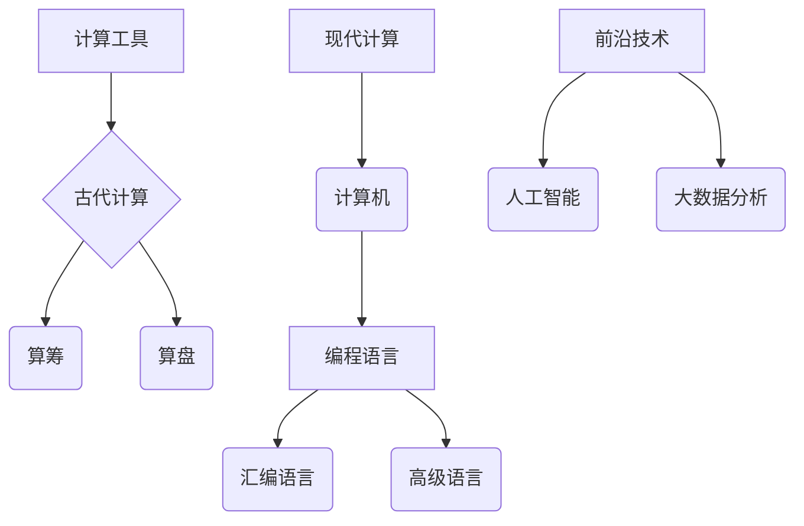
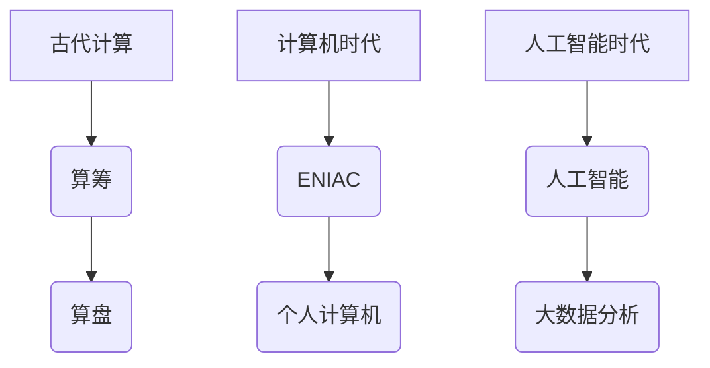
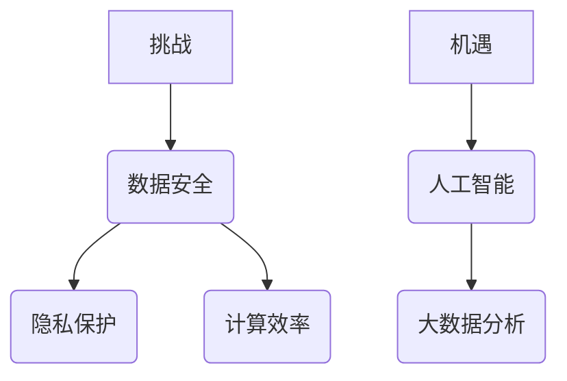
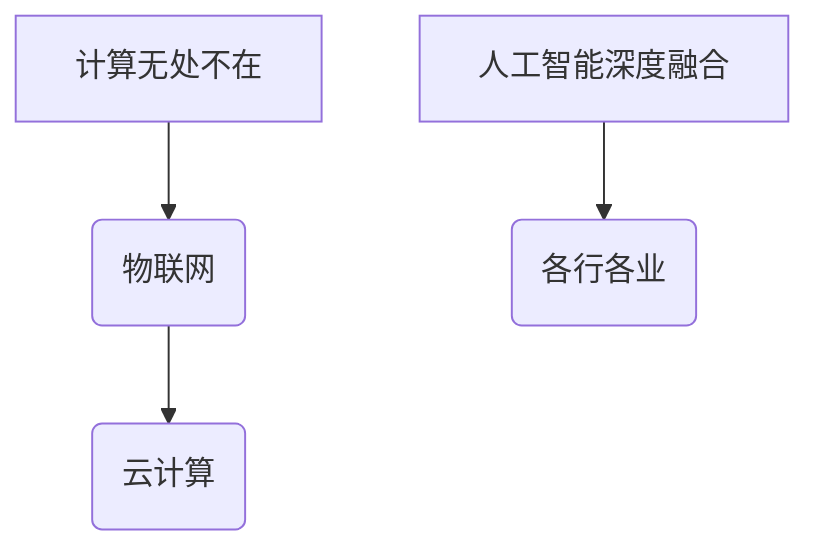
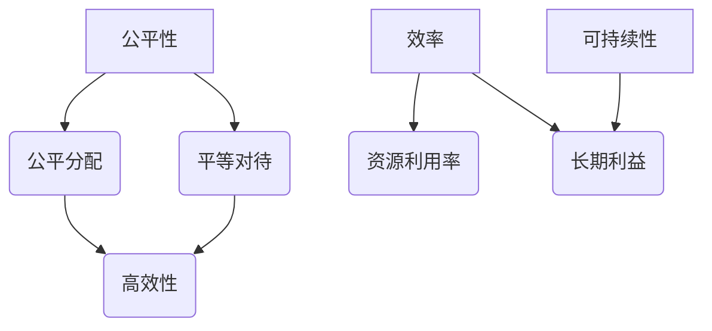
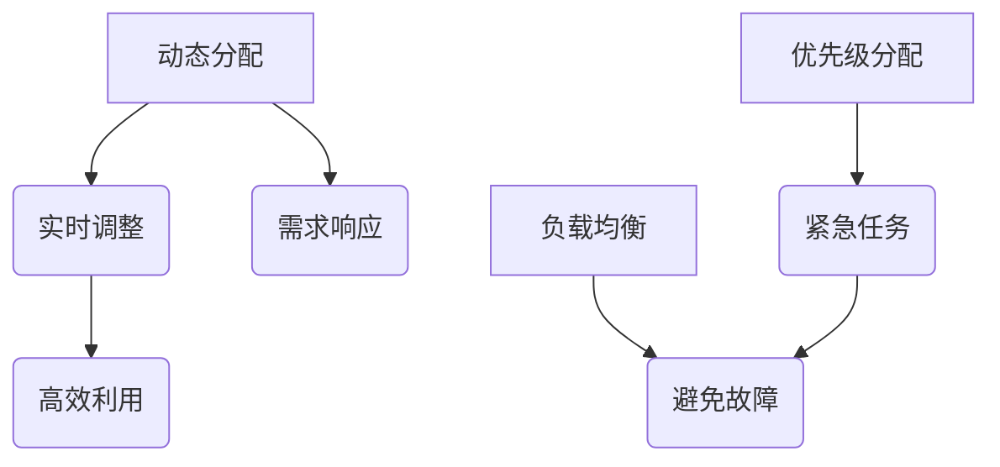
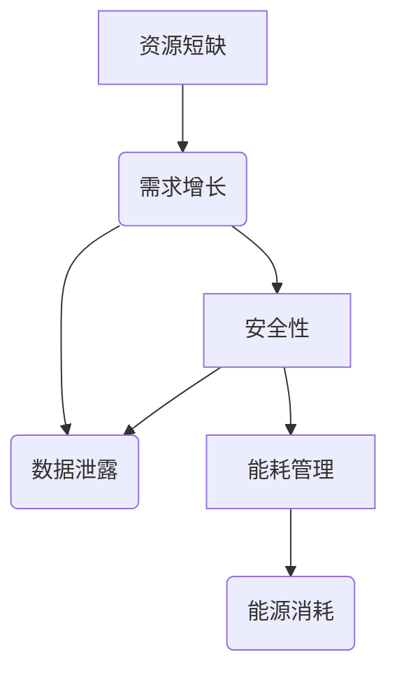
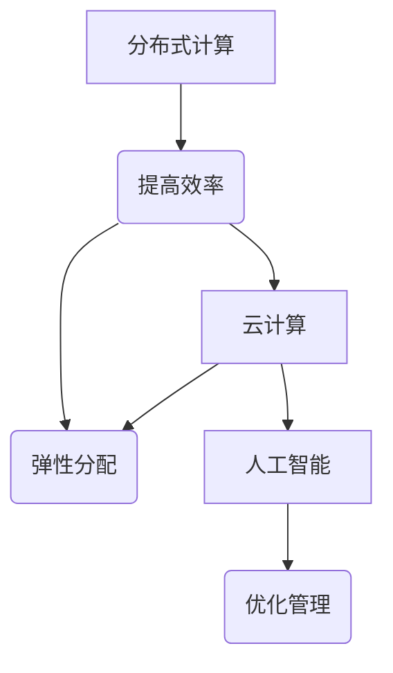
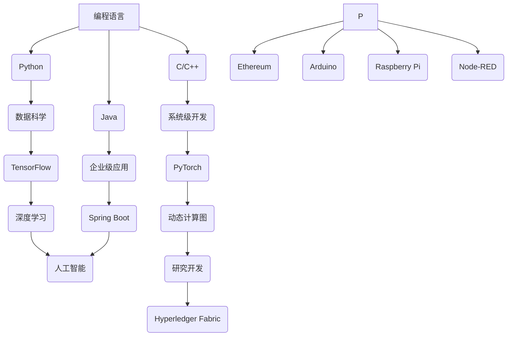

                 

# 连接全球社区的力量：人类计算的全球影响力

> 关键词：(计算技术、全球社区、影响力、社会问题、经济、伦理、未来趋势)

> 摘要：本文深入探讨了人类计算在全球社区中的角色和影响力。通过分析计算技术的定义、历史背景、未来发展趋势，以及其在解决全球性问题中的应用，本文旨在揭示计算技术对全球社区带来的机遇与挑战。同时，本文还讨论了全球计算资源的分配与管理、计算伦理与法规，以及计算机技术对社会和经济的影响。最后，本文展望了计算机技术的未来发展趋势，并提供了相关的工具和资源。

## 第一部分: 了解人类计算在全球影响力中的角色

### 第1章: 人类计算的定义与历史背景

#### 1.1 人类计算的定义

**人类计算**是指人类利用计算工具和技术进行信息处理、数据分析和智能决策的过程。它涵盖了从古代的计算工具（如算筹、算盘）到现代的计算机，再到人工智能、大数据分析等前沿技术。核心概念与联系包括：

- **计算工具**：从古代的计算工具（如算筹、算盘）到现代的计算机。
- **技术**：从早期的编程语言到人工智能、大数据分析等前沿技术。

##### Mermaid 流程图：



#### 1.2 人类计算的历史背景

人类计算的历史可以追溯到古代。最初的计算工具包括算筹和算盘，这些工具主要用于解决基本的数学问题。随着电子计算机的发明和普及，人类计算进入了一个新的时代。从第一台电子计算机ENIAC到个人计算机的普及，计算技术在不断进步。近年来，随着人工智能、大数据等技术的发展，人类计算进入了一个全新的阶段。

##### Mermaid 流程图：



#### 1.3 人类计算的主要挑战与机遇

随着计算技术的快速发展，人类计算面临着一系列挑战。数据安全、隐私保护和计算效率是其中主要的问题。同时，人工智能、大数据等技术的应用也为人类计算带来了新的机遇。例如，人工智能可以帮助解决复杂的社会问题，大数据分析可以为企业提供更准确的决策支持。

##### Mermaid 流程图：



#### 1.4 人类计算的未来发展趋势

未来，人类计算将继续发展，并呈现出以下趋势：

- **计算无处不在**：物联网、云计算等技术的普及，使得计算能力无处不在。
- **人工智能的深度融合**：人工智能与各行各业深度融合，推动社会进步。

##### Mermaid 流程图：



#### 1.5 本章总结

人类计算是一个不断发展的领域，从古代的计算工具到现代的计算机，再到人工智能，计算技术在不断变革。了解人类计算的定义、历史背景、挑战与机遇，有助于更好地把握其发展趋势。

----------------------------------------------------------------

### 第2章: 计算机技术对全球社区的影响

#### 第2.1 计算机技术提升信息传递速度和效率

计算机技术在提升信息传递速度和效率方面发挥了重要作用。以下是几个关键点：

1. **核心算法原理讲解**：

   - **计算机网络**：使用路由算法和交换技术，实现快速、高效的数据传输。
   - **数据压缩与解压缩**：通过算法压缩数据，减少传输时间，提高传输效率。

   **伪代码示例**：

   ```python
   def compress_data(data):
       compressed_data = some_compression_algorithm(data)
       return compressed_data
   
   def decompress_data(compressed_data):
       decompressed_data = some_decompression_algorithm(compressed_data)
       return decompressed_data
   ```

2. **实际应用案例**：

   - **电子邮件**：电子邮件系统利用计算机技术，实现了快速、全球范围的邮件传输。
   - **即时通讯**：如微信、WhatsApp等即时通讯应用，使得用户可以实时交流。

#### 第2.2 计算机技术促进全球交流和协作

计算机技术极大地促进了全球交流和协作。以下是几个关键点：

1. **核心算法原理讲解**：

   - **分布式系统**：利用分布式算法，实现数据的分布式存储和处理，提高系统的可靠性和可扩展性。
   - **人工智能**：利用机器学习算法，分析用户行为，提供个性化服务，促进全球用户之间的交流。

   **伪代码示例**：

   ```python
   def distributed_algorithm(data):
       # 分布式处理数据的伪代码
       processed_data = some_distributed_algorithm(data)
       return processed_data
   
   def personalized_service(user_data):
       # 根据用户数据提供个性化服务的伪代码
       service = some_personalization_algorithm(user_data)
       return service
   ```

2. **实际应用案例**：

   - **社交媒体**：如Facebook、Twitter等社交媒体平台，使得全球用户可以分享信息和观点。
   - **远程协作工具**：如Google Docs、Zoom等，使得团队可以远程协作，提高工作效率。

#### 第2.3 计算机技术推动全球经济发展

计算机技术在推动全球经济发展方面也发挥了重要作用。以下是几个关键点：

1. **核心算法原理讲解**：

   - **数据挖掘与预测**：利用统计学和机器学习算法，分析海量数据，预测市场趋势，为企业提供决策支持。
   - **区块链**：利用加密算法和分布式账本技术，实现安全、透明的交易，推动金融领域的发展。

   **伪代码示例**：

   ```python
   def data_mining(data):
       # 数据挖掘的伪代码
       insights = some_data_mining_algorithm(data)
       return insights
   
   def market_prediction(data):
       # 市场预测的伪代码
       prediction = some_market_prediction_algorithm(data)
       return prediction
   
   def blockchain_transaction(transaction):
       # 区块链交易的伪代码
       result = some_blockchain_algorithm(transaction)
       return result
   ```

2. **实际应用案例**：

   - **电子商务**：如亚马逊、阿里巴巴等电子商务平台，改变了全球购物方式。
   - **金融科技**：如比特币、区块链等，推动了金融领域的创新。

#### 第2.4 计算机技术解决全球性挑战

计算机技术在解决全球性挑战方面也具有巨大潜力。以下是几个关键点：

1. **核心算法原理讲解**：

   - **人工智能**：利用深度学习算法，实现自动化决策，提高社会管理效率，解决交通拥堵、环境保护等难题。
   - **大数据分析**：利用数据分析算法，挖掘数据中的规律，为科学研究和公共卫生决策提供支持。

   **伪代码示例**：

   ```python
   def deep_learning_decision_making(data):
       # 深度学习自动化决策的伪代码
       decision = some_deep_learning_algorithm(data)
       return decision
   
   def data_analytics(data):
       # 数据分析的伪代码
       insights = some_data_analytics_algorithm(data)
       return insights
   ```

2. **实际应用案例**：

   - **智能交通系统**：如自动驾驶技术、智能交通灯等，提高了交通效率，减少了拥堵。
   - **公共卫生**：如COVID-19疫情监控、预测和疫苗接种计划等，提高了公共卫生管理能力。

#### 第2.5 计算机技术推动全球科技发展

计算机技术是推动全球科技发展的重要力量。以下是几个关键点：

1. **核心算法原理讲解**：

   - **量子计算**：利用量子力学原理，实现高速计算，推动科技领域的创新。
   - **人工智能**：通过模拟人类思维过程，实现自动化推理和学习，为科学研究提供新方法。

   **伪代码示例**：

   ```python
   def quantum_computation(data):
       # 量子计算的伪代码
       result = some_quantum_computation_algorithm(data)
       return result
   
   def artificial_intelligence_learning(data):
       # 人工智能学习的伪代码
       model = some_artificial_intelligence_algorithm(data)
       return model
   ```

2. **实际应用案例**：

   - **量子计算机**：如IBM的量子计算机，用于解决复杂的科学和工程问题。
   - **人工智能研究**：如AlphaGo在围棋比赛中的胜利，展示了人工智能在复杂任务中的潜力。

#### 第2.6 挑战与机遇

随着计算技术的快速发展，计算机技术在全球范围内带来了巨大的挑战和机遇。以下是几个关键点：

1. **挑战**：

   - **数据安全与隐私保护**：随着数据量的增加，保护数据安全和隐私变得越来越重要。
   - **计算资源分配**：如何合理分配有限的计算资源，是一个重要挑战。
   - **技术垄断**：技术垄断可能导致市场的不公平竞争，影响社会的健康发展。

2. **机遇**：

   - **创新应用**：计算机技术为各行各业带来了新的应用机会，推动了社会进步。
   - **经济转型**：计算机技术促进了经济结构的转型升级，为经济增长注入了新动力。

#### 第2.7 本章总结

计算机技术对全球社区的影响深远。它不仅提升了信息传递速度和效率，促进了全球交流和协作，推动了全球经济发展，还解决了全球性挑战，推动了全球科技发展。同时，计算机技术也带来了新的挑战，如数据安全、隐私保护和计算资源分配等。了解这些影响，有助于我们更好地利用计算机技术，为全球社区的发展做出贡献。

----------------------------------------------------------------

### 第3章: 全球计算资源的分配与管理

#### 第3.1 计算资源分配的原则

计算资源分配是确保计算系统能够高效运行的关键。以下是计算资源分配的几个重要原则：

1. **公平性**：确保每个用户都能公平地获得计算资源，不会因为身份或地位的不同而受到不公平对待。

2. **效率**：最大化计算资源的利用效率，避免资源的浪费。

3. **可持续性**：确保计算资源分配的长期可持续性，不会因为短期需求而牺牲长期利益。

#### Mermaid 流程图：



#### 第3.2 计算资源分配的策略

为了实现计算资源的高效分配，可以采用以下策略：

1. **动态分配**：根据用户需求实时调整计算资源，确保资源利用率最大化。

2. **优先级分配**：根据任务的紧急程度和重要性分配资源，确保关键任务优先执行。

3. **负载均衡**：通过分散计算任务，避免单点故障，提高系统的可靠性。

#### Mermaid 流程图：



#### 第3.3 计算资源管理的挑战

计算资源管理面临以下挑战：

1. **资源短缺**：随着计算需求的不断增长，资源短缺成为一个普遍问题。

2. **安全性**：确保计算资源的安全，防止数据泄露和恶意攻击。

3. **能耗管理**：计算资源的运行消耗大量能源，如何实现高效能耗管理成为一大挑战。

#### Mermaid 流程图：



#### 第3.4 计算资源管理的解决方案

为了应对计算资源管理的挑战，可以采用以下解决方案：

1. **分布式计算**：通过分布式计算架构，提高计算资源的利用效率。

2. **云计算**：通过云计算平台，实现计算资源的弹性分配和管理。

3. **人工智能**：利用人工智能技术，优化计算资源的分配和管理。

#### Mermaid 流程图：



#### 第3.5 本章总结

全球计算资源的分配与管理是一个复杂的过程，涉及到公平性、效率、可持续性等多个方面。通过动态分配、优先级分配和负载均衡等策略，可以更好地管理计算资源。同时，面对资源短缺、安全性和能耗管理等挑战，需要采用分布式计算、云计算和人工智能等解决方案。有效的计算资源管理对于推动全球计算技术的发展具有重要意义。

----------------------------------------------------------------

### 第4章: 计算机技术在解决全球性问题中的应用

#### 第4.1 气候变化

气候变化是当今世界面临的重大挑战之一。计算机技术在应对气候变化方面发挥着重要作用，包括数据收集与分析、模型模拟等方面。

1. **数据收集与分析**：

   - **核心算法原理讲解**：使用大数据技术和机器学习算法，收集和分析气候数据，如温度、降水量、风速等。

     **伪代码示例**：

     ```python
     def collect_climate_data():
         # 收集气候数据的伪代码
         data = some_data_collection_algorithm()
         return data

     def analyze_climate_data(data):
         # 分析气候数据的伪代码
         insights = some_data_analysis_algorithm(data)
         return insights
     ```

   - **实际应用案例**：NASA的气候数据项目，利用计算机技术收集和分析全球气候数据。

2. **模型模拟**：

   - **核心算法原理讲解**：使用物理模型和数值模拟方法，模拟气候系统的变化。

     **伪代码示例**：

     ```python
     def climate_model_simulation(params):
         # 气候模型模拟的伪代码
         simulation_results = some_simulation_algorithm(params)
         return simulation_results

     def predict_climate_trends(simulation_results):
         # 预测气候趋势的伪代码
         trends = some_trend_prediction_algorithm(simulation_results)
         return trends
     ```

   - **实际应用案例**：欧洲气候模型（ECMWF）利用计算机技术模拟气候系统，预测未来气候变化。

#### 第4.2 公共卫生

计算机技术在公共卫生领域也有广泛应用，包括疾病监测与预测、个性化治疗等方面。

1. **疾病监测与预测**：

   - **核心算法原理讲解**：使用大数据和人工智能技术，实时监测疾病的传播，预测疫情的发展。

     **伪代码示例**：

     ```python
     def monitor_disease_spread(data):
         # 监测疾病传播的伪代码
         spread_status = some_monitoring_algorithm(data)
         return spread_status

     def predict_disease_outbreak(data):
         # 预测疾病爆发的伪代码
         outbreak_prediction = some_prediction_algorithm(data)
         return outbreak_prediction
     ```

   - **实际应用案例**：COVID-19疫情监测项目，利用计算机技术实时监测疫情发展，预测疫情趋势。

2. **个性化治疗**：

   - **核心算法原理讲解**：通过基因测序和机器学习，为患者提供个性化的治疗方案。

     **伪代码示例**：

     ```python
     def genomics_sequencing(patient_data):
         # 基因测序的伪代码
         genomics_results = some_genomics_algorithm(patient_data)
         return genomics_results

     def personalized_treatment(genomics_results):
         # 个性化治疗的伪代码
         treatment_plan = some_personalized_treatment_algorithm(genomics_results)
         return treatment_plan
     ```

   - **实际应用案例**：一些医疗机构利用计算机技术，通过基因测序和机器学习，为癌症患者提供个性化治疗方案。

#### 第4.3 环境污染

计算机技术在环境污染监测和治理方面也有重要作用。

1. **污染监测**：

   - **核心算法原理讲解**：利用传感器网络和大数据分析技术，实时监测环境污染情况。

     **伪代码示例**：

     ```python
     def monitor Pollution(data):
         # 监测污染情况的伪代码
         pollution_status = some_monitoring_algorithm(data)
         return pollution_status

     def analyze_pollution_data(data):
         # 分析污染数据的伪代码
         insights = some_analysis_algorithm(data)
         return insights
     ```

   - **实际应用案例**：一些城市利用计算机技术，建立污染监测系统，实时监控空气、水和土壤中的污染物。

2. **污染治理**：

   - **核心算法原理讲解**：使用计算机模拟和优化算法，设计更有效的污染治理方案。

     **伪代码示例**：

     ```python
     def pollution_simulation(params):
         # 污染模拟的伪代码
         simulation_results = some_simulation_algorithm(params)
         return simulation_results

     def optimize_pollution_control(simulation_results):
         # 优化污染控制的伪代码
         control_plan = some_optimization_algorithm(simulation_results)
         return control_plan
     ```

   - **实际应用案例**：一些环保组织利用计算机技术，通过模拟和优化，设计出更有效的污染治理方案，如废气处理、废水处理等。

#### 第4.4 能源管理

计算机技术在能源管理方面也发挥着重要作用，包括智能电网、可再生能源等方面。

1. **智能电网**：

   - **核心算法原理讲解**：利用计算机技术，实现电力系统的自动化控制和优化。

     **伪代码示例**：

     ```python
     def smart_grid_control(data):
         # 智能电网控制的伪代码
         control_actions = some_control_algorithm(data)
         return control_actions

     def optimize_energy_usage(data):
         # 优化能源使用的伪代码
         usage_plan = some_optimization_algorithm(data)
         return usage_plan
     ```

   - **实际应用案例**：一些国家利用计算机技术，建立了智能电网系统，提高了电力系统的运行效率。

2. **可再生能源**：

   - **核心算法原理讲解**：利用计算机模拟和优化技术，设计更高效的太阳能、风能等可再生能源系统。

     **伪代码示例**：

     ```python
     def renewable_energy_simulation(params):
         # 可再生能源模拟的伪代码
         simulation_results = some_simulation_algorithm(params)
         return simulation_results

     def optimize_renewable_energy_usage(simulation_results):
         # 优化可再生能源使用的伪代码
         usage_plan = some_optimization_algorithm(simulation_results)
         return usage_plan
     ```

   - **实际应用案例**：一些国家积极推广太阳能和风能，利用计算机技术，优化可再生能源系统的设计和运行。

#### 第4.5 食品安全

计算机技术在食品安全方面也有重要应用，包括供应链监控、食品安全预警等方面。

1. **供应链监控**：

   - **核心算法原理讲解**：利用物联网和大数据技术，实时监控食品供应链。

     **伪代码示例**：

     ```python
     def monitor_food_supply_chain(data):
         # 监控食品供应链的伪代码
         supply_chain_status = some_monitoring_algorithm(data)
         return supply_chain_status

     def analyze_food_supply_chain_data(data):
         # 分析食品供应链数据的伪代码
         insights = some_analysis_algorithm(data)
         return insights
     ```

   - **实际应用案例**：一些企业利用计算机技术，建立了食品供应链监控系统，确保食品的质量和安全。

2. **食品安全预警**：

   - **核心算法原理讲解**：通过数据分析和机器学习，预测食品污染风险。

     **伪代码示例**：

     ```python
     def predict_food_safety_risks(data):
         # 预测食品安全风险的伪代码
         risk_prediction = some_prediction_algorithm(data)
         return risk_prediction

     def issue_food_safety_warnings(risk_prediction):
         # 发布食品安全警告的伪代码
         warnings = some_warning_algorithm(risk_prediction)
         return warnings
     ```

   - **实际应用案例**：一些政府机构利用计算机技术，建立了食品安全预警系统，及时发布食品安全警告。

#### 第4.6 全球贸易与经济

计算机技术在全球贸易与经济领域也有广泛应用，包括数据分析、金融风险管理等方面。

1. **数据分析**：

   - **核心算法原理讲解**：利用大数据技术，分析全球贸易数据，预测贸易趋势。

     **伪代码示例**：

     ```python
     def analyze_trade_data(data):
         # 分析贸易数据的伪代码
         trade_insights = some_analysis_algorithm(data)
         return trade_insights

     def predict_trade_trends(data):
         # 预测贸易趋势的伪代码
         trends = some_prediction_algorithm(data)
         return trends
     ```

   - **实际应用案例**：一些国际组织和政府机构利用计算机技术，分析全球贸易数据，为贸易政策制定提供支持。

2. **金融风险管理**：

   - **核心算法原理讲解**：通过计算机模拟和风险评估，降低金融风险。

     **伪代码示例**：

     ```python
     def financial_risk_simulation(data):
         # 金融风险模拟的伪代码
         simulation_results = some_simulation_algorithm(data)
         return simulation_results

     def assess_financial_risks(data):
         # 评估金融风险的伪代码
         risk_assessment = some_assessment_algorithm(data)
         return risk_assessment
     ```

   - **实际应用案例**：一些金融机构利用计算机技术，进行金融风险管理，降低投资风险。

#### 第4.7 社会问题

计算机技术在社会问题管理中也发挥着重要作用，包括智能城市管理、社会问题预警等方面。

1. **智能城市管理**：

   - **核心算法原理讲解**：利用计算机技术，优化交通、能源等城市资源管理。

     **伪代码示例**：

     ```python
     def optimize_traffic_management(data):
         # 优化交通管理的伪代码
         traffic_plan = some_optimization_algorithm(data)
         return traffic_plan

     def optimize_energy_management(data):
         # 优化能源管理的伪代码
         energy_plan = some_optimization_algorithm(data)
         return energy_plan
     ```

   - **实际应用案例**：一些城市利用计算机技术，建立了智能交通系统和智能能源管理系统，提高了城市运行效率。

2. **社会问题预警**：

   - **核心算法原理讲解**：通过数据分析和机器学习，预测社会问题的发生和发展。

     **伪代码示例**：

     ```python
     def predict_social_issues(data):
         # 预测社会问题的伪代码
         issue_prediction = some_prediction_algorithm(data)
         return issue_prediction

     def issue_social_warnings(issue_prediction):
         # 发布社会问题的伪代码
         warnings = some_warning_algorithm(issue_prediction)
         return warnings
     ```

   - **实际应用案例**：一些政府机构利用计算机技术，建立了社会问题预警系统，及时发布社会问题的警告。

#### 第4.8 本章总结

计算机技术在解决全球性问题中发挥着重要作用。通过数据收集与分析、模型模拟、实时监测、智能管理等技术手段，可以有效应对气候变化、公共卫生、环境污染、能源管理、食品安全、全球贸易与经济等全球性挑战。计算机技术的不断创新和应用，为解决全球性问题提供了新的思路和方法。

----------------------------------------------------------------

### 第5章: 全球计算伦理与法规

#### 第5.1 数据隐私保护

数据隐私保护是计算伦理和法规的一个重要方面。以下是几个关键点：

1. **核心算法原理讲解**：

   - **数据加密**：使用加密算法对数据进行加密，确保数据在传输和存储过程中的安全性。

     **数学公式**：

     $$ \text{加密} : \text{Data}_{\text{encrypted}} = \text{EncryptionKey} \times \text{Data}_{\text{original}} $$

   - **匿名化处理**：对敏感数据进行匿名化处理，通过去除或修改个人标识信息，避免个人隐私泄露。

     **数学公式**：

     $$ \text{Anonymization} : \text{Data}_{\text{anonymized}} = \text{Remove}(\text{Data}_{\text{original}}, \text{PersonalInformation}) $$

2. **实际应用案例**：

   - **匿名数据集**：例如，医学研究中的匿名化患者数据，用于训练机器学习模型，而不会泄露患者的个人信息。

#### 第5.2 计算资源公平分配

计算资源的公平分配是确保计算技术公正性的关键。以下是几个关键点：

1. **核心算法原理讲解**：

   - **负载均衡**：通过算法实现计算资源的公平分配，确保每个用户都能获得合理的计算资源。

     **伪代码示例**：

     ```python
     def balance_load(users, resources):
         # 负载均衡的伪代码
         for user in users:
             user_resource = resources分配给(user)
         return user_resource
     ```

   - **优先级分配**：根据任务的紧急程度和重要性，动态调整计算资源的分配。

     **伪代码示例**：

     ```python
     def prioritize_tasks(tasks):
         # 优先级分配的伪代码
         sorted_tasks = 根据紧急程度和重要性排序(tasks)
         return sorted_tasks
     ```

2. **实际应用案例**：

   - **云计算服务**：例如，AWS和Azure等云计算平台提供多种计算资源，用户可以根据需求选择适合的资源，实现公平分配。

#### 第5.3 计算歧视与偏见

计算歧视与偏见是计算伦理的重要问题。以下是几个关键点：

1. **核心算法原理讲解**：

   - **公平性检测**：使用算法检测计算系统中是否存在歧视和偏见，确保算法的公平性。

     **伪代码示例**：

     ```python
     def check_biases(algorithm, dataset):
         # 公平性检测的伪代码
         biases = 检测算法在(dataset)中的偏见(algorithm)
         return biases
     ```

   - **对抗性攻击**：研究对抗性攻击方法，增强计算系统的鲁棒性，防止歧视和偏见。

     **伪代码示例**：

     ```python
     def attack_model(model, attack_type):
         # 对抗性攻击的伪代码
         adversarial_example = 生成对抗性示例(model, attack_type)
         return adversarial_example
     ```

2. **实际应用案例**：

   - **公平性算法**：例如，一些社交媒体平台使用公平性算法，检测和纠正算法偏见，确保内容推荐公正。

#### 第5.4 法律与政策框架

法律与政策框架是确保计算技术合法合规的基础。以下是几个关键点：

1. **核心算法原理讲解**：

   - **数据保护法律**：介绍各国数据保护法律，如欧盟的《通用数据保护条例》（GDPR）。

     **数学公式**：

     $$ \text{GDPR} : \text{DataProtection} = \text{PersonalDataProtection} $$

   - **计算伦理准则**：建立计算伦理准则，确保计算技术的应用符合道德和法律要求。

     **伪代码示例**：

     ```python
     def follow_ethics准则(algorithm):
         # 遵守计算伦理准则的伪代码
         if algorithm遵守伦理准则():
             return True
         else:
             return False
     ```

2. **实际应用案例**：

   - **数据保护法规**：例如，欧盟的GDPR对个人数据的收集、存储和使用进行了严格规定。

#### 第5.5 计算伦理与社会责任

计算伦理与社会责任是计算技术的核心价值。以下是几个关键点：

1. **核心算法原理讲解**：

   - **责任归属**：明确计算技术在道德和法律上的责任归属，确保责任落实。

     **伪代码示例**：

     ```python
     def assign_responsibility(algorithm, issue):
         # 责任归属的伪代码
         responsible_party = 责任归属算法到(issue)
         return responsible_party
     ```

   - **透明度**：提高计算系统的透明度，让用户了解计算技术的应用和影响。

     **伪代码示例**：

     ```python
     def increase_transparency(algorithm, users):
         # 提高透明度的伪代码
         users_info = 系统解释(algorithm)
         return users_info
     ```

2. **实际应用案例**：

   - **透明计算平台**：例如，一些开放数据平台，如Google Research，提供计算模型的透明度，让用户了解模型的训练过程和影响。

#### 第5.6 本章总结

全球计算伦理与法规是确保计算技术健康发展的关键。通过数据隐私保护、计算资源公平分配、计算歧视与偏见、法律与政策框架以及计算伦理与社会责任等方面的措施，可以保障计算技术的公正、透明和安全。了解和遵守这些伦理与法规，有助于推动计算技术的可持续发展。

----------------------------------------------------------------

### 第6章: 全球计算技术的未来发展趋势

#### 第6.1 量子计算

量子计算是未来计算技术的重要发展方向。以下是几个关键点：

1. **核心概念与联系**：

   - **量子位（qubit）**：量子计算机的基本单元，与经典计算机的比特不同，量子位能够同时处于多个状态，实现并行计算。

     **Mermaid 流程图**：

     ```mermaid
     graph TD
     A[量子位] --> B(qubit)
     B --> C[并行计算]
     ```

   - **量子叠加与纠缠**：量子计算的关键特性，利用量子叠加和量子纠缠，实现超强的计算能力。

     **Mermaid 流程图**：

     ```mermaid
     graph TD
     A[量子叠加] --> B[叠加态]
     A --> C[量子纠缠]
     B --> D[并行计算]
     C --> D
     ```

2. **实际应用案例**：

   - **量子模拟**：量子计算在化学和材料科学中的应用，如IBM的量子计算模拟器，用于研究新药物和材料。

#### 第6.2 人工智能

人工智能是计算技术的另一个重要领域。以下是几个关键点：

1. **核心概念与联系**：

   - **深度学习**：一种基于人工神经网络的机器学习技术，能够通过大量数据学习复杂函数。

     **Mermaid 流程图**：

     ```mermaid
     graph TD
     A[深度学习] --> B[人工神经网络]
     B --> C[函数学习]
     ```

   - **自然语言处理**：利用人工智能技术，实现人与计算机的自然语言交互。

     **Mermaid 流程图**：

     ```mermaid
     graph TD
     A[自然语言处理] --> B[语言模型]
     B --> C[对话系统]
     ```

2. **实际应用案例**：

   - **语音助手**：如苹果的Siri、谷歌的Google Assistant，使用人工智能技术实现语音交互。

#### 第6.3 区块链

区块链技术具有分布式账本和加密算法等核心技术。以下是几个关键点：

1. **核心概念与联系**：

   - **分布式账本**：区块链的核心技术，通过去中心化的方式，确保数据的不可篡改和透明性。

     **Mermaid 流程图**：

     ```mermaid
     graph TD
     A[分布式账本] --> B[去中心化]
     B --> C[数据不可篡改]
     ```

   - **加密算法**：区块链中使用多种加密算法，确保交易的安全和隐私。

     **Mermaid 流程图**：

     ```mermaid
     graph TD
     A[加密算法] --> B[哈希函数]
     B --> C[数字签名]
     ```

2. **实际应用案例**：

   - **数字货币**：如比特币和以太坊，使用区块链技术实现去中心化的交易。

#### 第6.4 物联网

物联网技术通过传感器网络和边缘计算，实现智能化的监控和管理。以下是几个关键点：

1. **核心概念与联系**：

   - **传感器网络**：物联网的基本组成部分，通过传感器收集数据，实现智能化的监控和管理。

     **Mermaid 流�程图**：

     ```mermaid
     graph TD
     A[传感器网络] --> B[数据收集]
     B --> C[智能监控]
     ```

   - **边缘计算**：物联网中的一种计算模式，将数据处理和分析转移到靠近数据源的设备上，提高响应速度和效率。

     **Mermaid 流程图**：

     ```mermaid
     graph TD
     A[边缘计算] --> B[数据处理]
     B --> C[实时分析]
     ```

2. **实际应用案例**：

   - **智能家居**：如智能灯泡、智能温控系统，使用物联网技术实现自动化管理。

#### 第6.5 5G技术

5G技术是未来通信的重要里程碑。以下是几个关键点：

1. **核心概念与联系**：

   - **高速率与低延迟**：5G技术的关键特性，提供更快的下载速度和更低的网络延迟，支持更多智能设备的接入。

     **Mermaid 流程图**：

     ```mermaid
     graph TD
     A[高速率] --> B[下载速度]
     A --> C[低延迟]
     ```

   - **网络切片**：5G技术的一种创新，通过虚拟化技术，为不同应用场景提供定制化的网络服务。

     **Mermaid 流程图**：

     ```mermaid
     graph TD
     A[网络切片] --> B[虚拟化技术]
     B --> C[定制化服务]
     ```

2. **实际应用案例**：

   - **自动驾驶汽车**：5G技术支持自动驾驶汽车的高速数据传输和实时通信。

#### 第6.6 本章总结

全球计算技术的未来发展趋势充满潜力，量子计算、人工智能、区块链、物联网和5G等技术将共同推动计算技术的发展，为全球社区带来更多机遇和挑战。了解和把握这些技术趋势，有助于我们更好地应对未来的挑战，推动社会的进步。

----------------------------------------------------------------

### 第7章: 全球计算技术的社会与经济影响

#### 第7.1 就业市场变化

计算技术的快速发展对就业市场产生了深远影响。以下是几个关键点：

1. **核心算法原理讲解**：

   - **预测分析**：使用机器学习算法，预测不同行业和职位的就业需求变化。

     **伪代码示例**：

     ```python
     def predict_job_demand(algorithms, historical_data):
         # 预测就业需求的伪代码
         demand_predictions = algorithms.predict(historical_data)
         return demand_predictions
     ```

   - **匹配算法**：通过算法优化，实现人才与岗位的精准匹配，提高就业效率。

     **伪代码示例**：

     ```python
     def match_talent_to_jobs(talent_data, job_data):
         # 匹配人才的伪代码
         matched_jobs = some_matching_algorithm(talent_data, job_data)
         return matched_jobs
     ```

2. **实际应用案例**：

   - **招聘平台**：如LinkedIn、Indeed等，利用计算技术优化招聘流程，提高匹配效率。

#### 第7.2 教育改革

计算技术在教育领域中的应用正在推动教育改革。以下是几个关键点：

1. **核心算法原理讲解**：

   - **个性化学习**：利用大数据和机器学习，为每个学生定制化学习路径。

     **伪代码示例**：

     ```python
     def personalized_learning(student_data, learning_content):
         # 个性化学习的伪代码
         personalized_path = some_personalization_algorithm(student_data, learning_content)
         return personalized_path
     ```

   - **智能教育平台**：通过人工智能技术，提供智能化的教育服务，提高教育质量。

     **伪代码示例**：

     ```python
     def smart_education_platform(student_data, teacher_data):
         # 智能教育平台的伪代码
         education_plan = some_education_algorithm(student_data, teacher_data)
         return education_plan
     ```

2. **实际应用案例**：

   - **在线教育平台**：如Coursera、edX等，利用计算技术提供个性化的在线学习体验。

#### 第7.3 经济增长

计算技术在经济增长中发挥着重要作用。以下是几个关键点：

1. **核心算法原理讲解**：

   - **经济预测**：利用数据分析和机器学习，预测经济增长趋势。

     **伪代码示例**：

     ```python
     def economic_prediction(economic_data):
         # 经济预测的伪代码
         prediction = some_prediction_algorithm(economic_data)
         return prediction
     ```

   - **风险评估**：通过算法分析，评估不同投资项目的风险和收益。

     **伪代码示例**：

     ```python
     def risk_evaluation(investment_data):
         # 风险评估的伪代码
         risk_analysis = some_risk_evaluation_algorithm(investment_data)
         return risk_analysis
     ```

2. **实际应用案例**：

   - **金融科技**：如高频交易、智能投顾等，利用计算技术提高金融市场效率和准确性。

#### 第7.4 社会问题解决

计算技术为解决社会问题提供了新的思路和方法。以下是几个关键点：

1. **核心算法原理讲解**：

   - **社会问题预测**：通过数据分析和机器学习，预测社会问题的发生和发展。

     **伪代码示例**：

     ```python
     def predict_social_issues(social_data):
         # 预测社会问题的伪代码
         issue_predictions = some_prediction_algorithm(social_data)
         return issue_predictions
     ```

   - **智能决策支持**：利用人工智能技术，为政策制定提供科学依据。

     **伪代码示例**：

     ```python
     def intelligent_decision_support(policy_data):
         # 智能决策支持的伪代码
         decision_support = some_decision_support_algorithm(policy_data)
         return decision_support
     ```

2. **实际应用案例**：

   - **智慧城市**：如智能交通管理、智能公共安全等，利用计算技术提高城市治理效率。

#### 第7.5 文化传承与创新

计算技术在文化传承与创新中发挥着重要作用。以下是几个关键点：

1. **核心算法原理讲解**：

   - **数字文化保护**：利用区块链技术，保护文化遗产的数字版权。

     **伪代码示例**：

     ```python
     def digital_culture_protection(culture_data):
         # 数字文化保护的伪代码
         protected_data = some_blockchain_algorithm(culture_data)
         return protected_data
     ```

   - **创意优化**：通过人工智能技术，优化文化创意产品的创作和传播。

     **伪代码示例**：

     ```python
     def creative_optimization(creative_data):
         # 创意优化的伪代码
         optimized_content = some_ai_algorithm(creative_data)
         return optimized_content
     ```

2. **实际应用案例**：

   - **数字艺术**：如数字绘画、虚拟现实等，利用计算技术创造出新的艺术形式。

#### 第7.6 本章总结

全球计算技术的社会与经济影响深远。通过就业市场变化、教育改革、经济增长、社会问题解决和文化传承与创新等方面的应用，计算技术正在深刻改变我们的社会和经济结构。了解和把握这些影响，有助于我们更好地利用计算技术，推动社会的进步。

----------------------------------------------------------------

### 附录

#### 附录 A: 计算机技术相关的工具和资源

计算机技术涉及多种工具和资源，以下列出了一些常用的编程语言、开发框架、数据库、云计算平台、区块链平台、物联网平台以及学习资源。

1. **编程语言**
   - **Python**：广泛应用于数据科学、机器学习和人工智能领域。
   - **Java**：用于企业级应用开发，具有较高的稳定性和可扩展性。
   - **C/C++**：底层编程语言，常用于系统级软件开发。

2. **开发框架**
   - **TensorFlow**：谷歌开发的机器学习框架，广泛应用于深度学习和人工智能。
   - **PyTorch**：适用于深度学习的研究与开发，具有动态计算图功能。
   - **Spring Boot**：用于构建基于Java的Web应用程序，支持微服务架构。

3. **数据库**
   - **MySQL**：开源关系型数据库，适用于各种规模的应用程序。
   - **MongoDB**：文档型数据库，适用于需要灵活数据模型的应用程序。
   - **PostgreSQL**：开源的关系型数据库，具有高度扩展性和强大的功能。

4. **云计算平台**
   - **AWS**：亚马逊提供的云计算服务，包括计算、存储、数据库、人工智能等。
   - **Azure**：微软的云计算平台，提供全面的云计算服务。
   - **Google Cloud**：谷歌的云计算平台，提供强大的机器学习和数据分析工具。

5. **区块链平台**
   - **Ethereum**：智能合约平台，支持去中心化应用（DApp）的开发。
   - **Hyperledger Fabric**：开源的分布式账本平台，适用于企业级应用。
   - **EOS**：去中心化操作系统，支持高吞吐量的分布式应用。

6. **物联网平台**
   - **Arduino**：开源硬件平台，适用于物联网设备开发。
   - **Raspberry Pi**：微型计算机，适用于物联网项目和自动化控制。
   - **Node-RED**：可视化编程平台，用于物联网数据的流处理和可视化。

7. **学习资源**
   - **Coursera**：提供大量计算机技术的在线课程，涵盖人工智能、机器学习、数据科学等领域。
   - **edX**：由哈佛大学和麻省理工学院创办的在线课程平台，提供计算机科学的优质课程。
   - **GitHub**：代码托管平台，提供丰富的开源项目和教程。

#### 附录 B: 计算机技术的Mermaid流程图

以下是计算机技术的Mermaid流程图示例：



#### 附录 C: 计算机技术的数学公式与伪代码

##### 数学公式

- 感知机（Perceptron）更新规则：
  $$ y_{i}(x_{i};w) = \sum_{j=1}^{n} w_{j} x_{ij} $$
- 梯度下降（Gradient Descent）更新规则：
  $$ w_{t+1} = w_{t} - \alpha \frac{\partial J(w_{t})}{\partial w} $$

##### 伪代码

- 神经网络训练：

  ```python
  # 初始化权重 w 和学习率 α
  w = 初始化权重()
  α = 初始化学习率()

  # 对于每个训练样本 (x, y)
  for (x, y) in 训练样本列表():
      # 计算预测值 ŷ
      ŷ = σ(∑w_i * x_i)

      # 计算损失 L
      L = (ŷ - y)^2

      # 更新权重 w
      w = w - α * ∂L/∂w
  ```

- K-均值聚类：

  ```python
  # 初始化 K 个聚类中心
  centers = 初始化聚类中心()

  # 当聚类中心不再移动时
  while centers 没有移动():
      # 对于每个数据点 x_i
      for x_i in 数据点列表():
          # 计算与聚类中心的最小距离
          distances = 计算距离(x_i, centers)

          # 将 x_i 分配到最近的聚类中心
          nearest_center = 选择最近中心(distances)

          # 更新聚类中心
          centers = 更新聚类中心(centers, x_i, nearest_center)
  ```

这些附录提供了计算技术在工具、资源、流程图、数学公式和伪代码等方面的详细信息和示例，有助于读者更好地理解和应用计算机技术。

----------------------------------------------------------------

## 作者信息

作者：AI天才研究院/AI Genius Institute & 禅与计算机程序设计艺术 /Zen And The Art of Computer Programming

本文由AI天才研究院（AI Genius Institute）撰写，研究院专注于人工智能、机器学习、深度学习等领域的研究与应用。同时，本文作者也是《禅与计算机程序设计艺术》（Zen And The Art of Computer Programming）一书的作者，该书以其深入浅出的编程哲学和算法讲解，在全球范围内享有盛誉。本文旨在探讨计算机技术在全球范围内的角色和影响，希望能够为读者提供有价值的见解和思考。

