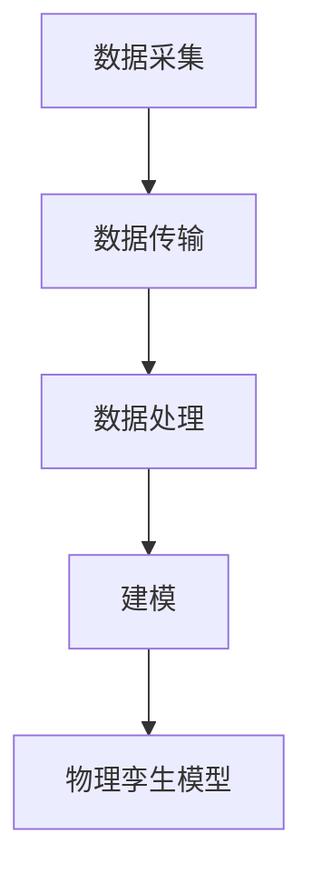
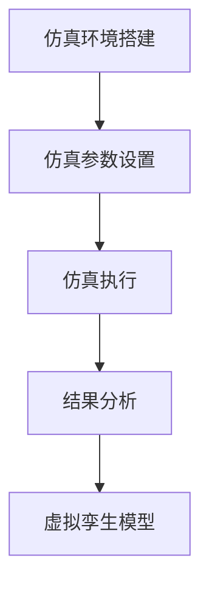
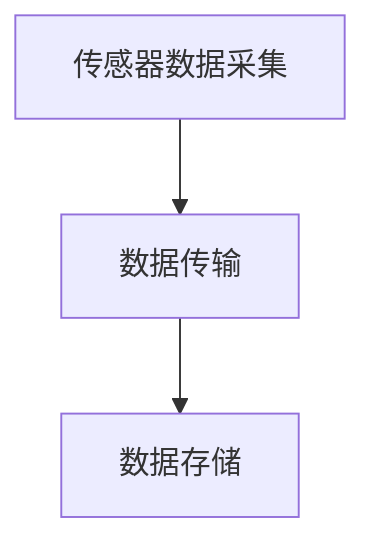
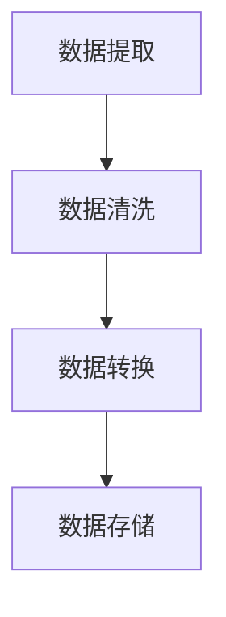
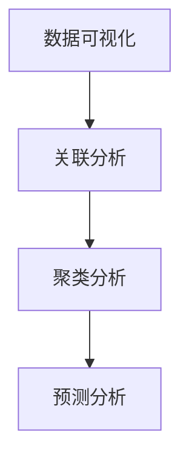
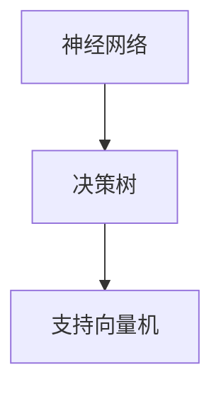
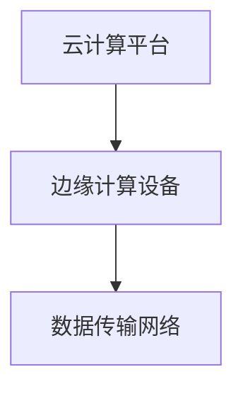
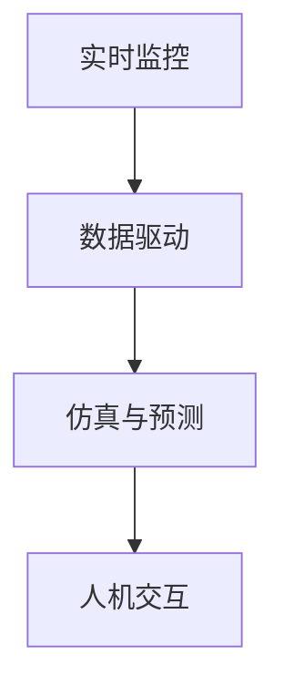

                 

# 2024阿里巴巴数字孪生技术校招面试题详解

## 概述与关键词

**关键词：** 数字孪生、阿里巴巴、面试题、技术解析、校招

**摘要：** 本文旨在为2024年阿里巴巴数字孪生技术校招面试的考生提供一份详细的面试题解答指南。文章将深入解析数字孪生技术的基础概念、核心原理、架构设计、应用领域以及未来发展趋势，同时结合阿里巴巴的实际案例，提供实战经验和代码实例，帮助考生全面掌握数字孪生技术的核心要点，提升面试竞争力。

## 目录

### 第一部分：数字孪生技术基础

#### 第1章：数字孪生技术概述

##### 1.1 数字孪生的定义与背景

##### 1.2 数字孪生技术的重要性和应用领域

##### 1.3 数字孪生技术的基本原理与架构

##### 1.4 数字孪生与虚拟仿真技术的联系与区别

##### 1.5 数字孪生技术的未来发展趋势

#### 第2章：数字孪生技术的核心概念

##### 2.1 数字孪生模型

##### 2.2 数字孪生的数据来源

##### 2.3 数字孪生应用的关键技术

#### 第3章：数字孪生技术的架构与实现

##### 3.1 数字孪生架构的分层设计

##### 3.2 数字孪生系统的构建过程

##### 3.3 数字孪生技术在企业中的应用案例

#### 第4章：数字孪生技术的挑战与解决方案

##### 4.1 数据隐私与安全

##### 4.2 数字孪生技术的标准化与兼容性

##### 4.3 数字孪生技术的可持续性

#### 第5章：数字孪生技术在智能城市中的应用

##### 5.1 智能城市规划与管理

##### 5.2 数字孪生在智慧交通中的应用

##### 5.3 数字孪生在智慧环保中的应用

#### 第6章：数字孪生技术的未来发展

##### 6.1 新技术的应用

##### 6.2 数字孪生技术的创新应用

##### 6.3 国际合作与标准化

#### 第7章：数字孪生技术在阿里巴巴的应用案例

##### 7.1 阿里巴巴数字孪生技术的战略规划

##### 7.2 阿里巴巴在制造领域的数字孪生应用

##### 7.3 阿里巴巴在物流与供应链管理中的数字孪生应用

### 附录

##### 附录A：数字孪生技术工具与资源列表

##### 附录B：数字孪生技术常见问题解答

## 文章正文开始

### 第一部分：数字孪生技术基础

#### 第1章：数字孪生技术概述

### 1.1 数字孪生的定义与背景

数字孪生（Digital Twin）是一种通过数字化和虚拟仿真技术，对现实世界中的物理实体进行映射、监控、分析和优化的方法。它将一个物理对象或系统的所有特性、行为和状态转化为数字模型，使其在虚拟环境中得以复现。

数字孪生的概念起源于2002年，美国密歇根大学教授Michael Grieves首次提出。随着物联网、大数据、人工智能等技术的发展，数字孪生技术逐渐成为工业4.0、智能制造等领域的重要技术支撑。

### 1.2 数字孪生技术的重要性和应用领域

数字孪生技术的重要性主要体现在以下几个方面：

1. **提高生产效率**：通过实时监控和分析，数字孪生可以帮助企业优化生产流程，减少生产停滞和设备故障，提高生产效率。

2. **预测性维护**：数字孪生可以对设备的运行状态进行实时监控，预测潜在故障，实现预测性维护，减少意外停机和维修成本。

3. **质量提升**：数字孪生技术可以帮助企业实现对产品质量的实时监控和预测，从而提高产品质量。

4. **降低成本**：通过优化生产流程和预测性维护，数字孪生技术可以有效降低生产成本和运营成本。

数字孪生技术广泛应用于以下领域：

- **制造业**：通过数字孪生技术，可以实现智能制造、生产优化、质量控制等方面的提升。
- **建筑与工程**：数字孪生技术可以帮助建筑设计与施工的优化、建筑能源管理、建筑安全监控等方面的提升。
- **医疗与健康**：通过数字孪生技术，可以实现个性化医疗、医疗设备远程监控、医疗数据分析等方面的提升。
- **能源与电力**：数字孪生技术可以实现能源管理、电力系统优化、电网安全监控等方面的提升。
- **智能城市**：数字孪生技术可以用于城市规划与管理、交通优化、环境监测等方面的提升。

### 1.3 数字孪生技术的基本原理与架构

数字孪生技术的基本原理包括以下几个方面：

1. **物理实体建模**：通过对现实世界中的物理实体进行建模，构建其数字化的虚拟模型。
2. **数据采集与传输**：通过传感器、物联网等设备，实时采集物理实体的运行数据，并将数据传输到数字孪生平台。
3. **数据处理与分析**：对采集到的数据进行处理和分析，提取有价值的信息和知识。
4. **虚拟模型与物理实体的交互**：通过虚拟模型对物理实体进行实时监控、预测性维护和优化改进。
5. **人机交互**：通过用户界面，实现对数字孪生平台的操作和控制。

数字孪生技术的架构通常分为五个层次：

1. **物理层**：包括传感器、执行器、物联网设备等，用于采集物理实体的数据和执行控制指令。
2. **数据层**：包括数据采集、传输、存储和处理等模块，用于处理和分析采集到的数据。
3. **模型层**：包括物理实体建模、虚拟模型构建和交互等模块，用于实现物理实体与虚拟模型的映射和交互。
4. **应用层**：包括数字孪生平台、应用软件和用户界面等模块，用于实现数字孪生技术的应用和功能。
5. **服务层**：包括云服务、边缘计算、大数据分析等模块，用于提供数字孪生技术的支持和扩展。

### 1.4 数字孪生与虚拟仿真技术的联系与区别

数字孪生和虚拟仿真技术之间存在一定的联系，但它们也有明显的区别。

**联系：**

1. **基础技术**：数字孪生和虚拟仿真技术都依赖于物联网、大数据分析、人工智能等先进技术。
2. **数据处理**：数字孪生和虚拟仿真技术都需要对采集到的数据进行分析和处理，提取有价值的信息和知识。

**区别：**

1. **目的**：数字孪生技术主要用于实时监控、预测性维护和优化改进物理实体，而虚拟仿真技术主要用于模拟和预测物理实体的行为和性能。
2. **应用范围**：数字孪生技术主要应用于制造业、建筑、医疗等领域，而虚拟仿真技术主要应用于航空航天、汽车制造、军事等领域。
3. **数据处理**：数字孪生技术需要对实时采集到的数据进行处理和分析，而虚拟仿真技术则主要依赖于预设的模型和参数进行模拟和分析。

### 1.5 数字孪生技术的未来发展趋势

数字孪生技术的未来发展趋势将受到新技术应用、创新应用场景的探索、国际合作与标准化等多方面的影响。

**新技术应用：**

1. **5G技术**：5G技术的高速度、低延迟和大连接能力，将进一步提升数字孪生技术的实时性和可靠性。
2. **区块链技术**：区块链技术的去中心化和安全性能，为数字孪生技术的数据安全和隐私保护提供了新的解决方案。
3. **虚拟现实和增强现实技术**：虚拟现实和增强现实技术将进一步提升数字孪生技术的用户体验和交互能力。

**创新应用场景：**

1. **个性化医疗**：通过数字孪生技术，可以为每位患者创建一个个性化的虚拟模型，实现精准的医疗诊断和治疗。
2. **智能制造**：数字孪生技术将进一步提升智能制造的智能化水平和生产效率。
3. **数字孪生城市**：数字孪生技术将用于对城市进行虚拟建模和仿真，实现城市运行状态的实时监控和优化管理。

**国际合作与标准化：**

数字孪生技术的国际化和标准化是未来发展的关键。通过国际合作和标准化，可以促进数字孪生技术的全球应用和推广。

1. **制定国际标准**：通过制定国际标准，可以统一数字孪生技术的技术规范和应用指南。
2. **促进国际合作**：通过国际合作，可以推动数字孪生技术的全球应用和产业发展。
3. **促进技术创新**：通过国际合作，可以促进数字孪生技术的创新和发展，提高其技术水平和应用价值。

### 第一部分总结

在本部分中，我们介绍了数字孪生技术的基础概念、重要性、应用领域、基本原理与架构，以及与虚拟仿真技术的联系与区别。我们还探讨了数字孪生技术的未来发展趋势，包括新技术应用、创新应用场景和国际合作与标准化。通过这些内容，读者可以全面了解数字孪生技术的核心要点，为后续章节的深入学习打下基础。

## 第二部分：数字孪生技术的核心概念

#### 第2章：数字孪生技术的核心概念

### 2.1 数字孪生模型

数字孪生模型是数字孪生技术的核心，它包括物理孪生模型和虚拟孪生模型。

#### 物理孪生模型

物理孪生模型是指通过传感器、物联网等设备，将现实世界中的物理实体映射到虚拟空间中，形成一个数字化的虚拟镜像。这个镜像可以实时反映物理实体的状态和行为，如温度、湿度、位置等。

**物理孪生模型的关键步骤：**

1. **数据采集**：通过传感器采集物理实体的各种数据，如温度、湿度、压力等。
2. **数据传输**：将采集到的数据通过物联网传输到云端或本地服务器。
3. **数据处理**：对传输过来的数据进行处理，包括数据清洗、格式转换等。
4. **建模**：根据处理后的数据，构建物理实体的数字模型。

**物理孪生模型的核心算法：**

1. **数据预处理算法**：包括数据清洗、缺失值填充、异常值处理等。
2. **特征提取算法**：包括主成分分析（PCA）、线性判别分析（LDA）等。

**物理孪生模型的Mermaid流程图：**

#### 虚拟孪生模型

虚拟孪生模型是基于物理孪生模型，通过虚拟仿真技术，对物理实体进行模拟和预测。它可以在虚拟环境中实现对物理实体的实时监控、预测性维护和优化改进。

**虚拟孪生模型的关键步骤：**

1. **仿真环境搭建**：搭建虚拟仿真环境，包括物理模型、仿真工具等。
2. **仿真参数设置**：设置仿真参数，如时间步长、仿真精度等。
3. **仿真执行**：在虚拟环境中执行仿真，观察物理实体的行为和状态。
4. **结果分析**：对仿真结果进行分析，提取有价值的信息。

**虚拟孪生模型的核心算法：**

1. **仿真算法**：包括蒙特卡洛方法、有限元分析等。
2. **预测算法**：包括时间序列预测、回归分析等。

**虚拟孪生模型的Mermaid流程图：**

### 2.2 数字孪生的数据来源

数字孪生的数据来源主要包括以下几个方面：

#### 物联网传感器数据

物联网传感器数据是数字孪生数据的主要来源之一。通过在物理实体上安装传感器，可以实时采集其运行状态和性能数据。这些数据包括温度、湿度、压力、速度等。

**数据采集与传输流程：**

1. **数据采集**：传感器采集物理实体的数据。
2. **数据传输**：将采集到的数据通过物联网传输到云端或本地服务器。
3. **数据存储**：将传输过来的数据存储在数据库中。

**数据采集与传输的核心算法：**

1. **传感器数据采集算法**：包括传感器的校准、数据采样等。
2. **数据传输算法**：包括数据压缩、加密等。

**物联网传感器数据流程图：**

#### 企业现有数据集成

企业现有数据集成是指将企业现有的各种数据源进行整合，构建统一的数字孪生数据平台。这些数据源包括ERP系统、MES系统、SCADA系统等。

**数据集成与处理流程：**

1. **数据提取**：从各个系统中提取数据。
2. **数据清洗**：对提取的数据进行清洗，去除噪声和异常值。
3. **数据转换**：将清洗后的数据进行转换，使其符合统一的格式。
4. **数据存储**：将转换后的数据存储在数据库中。

**数据集成与处理的核心算法：**

1. **数据提取算法**：包括ETL（提取、转换、加载）过程。
2. **数据清洗算法**：包括缺失值填充、异常值处理等。

**企业现有数据集成流程图：**

### 2.3 数字孪生应用的关键技术

数字孪生应用的关键技术主要包括大数据分析、人工智能与机器学习、云计算与边缘计算。

#### 大数据分析与挖掘

大数据分析是指利用大数据技术和算法，对数字孪生数据进行深入分析和挖掘，提取有价值的信息和知识。大数据分析主要包括数据可视化、关联分析、聚类分析、预测分析等。

**大数据分析与挖掘的核心算法：**

1. **数据可视化算法**：包括散点图、柱状图、折线图等。
2. **关联分析算法**：包括关联规则学习、Apriori算法等。
3. **聚类分析算法**：包括K-means、DBSCAN等。
4. **预测分析算法**：包括时间序列预测、回归分析等。

**大数据分析与挖掘的Mermaid流程图：**

#### 人工智能与机器学习

人工智能与机器学习是指利用人工智能和机器学习算法，对数字孪生数据进行建模和预测，实现物理实体的实时监控和优化改进。人工智能与机器学习主要包括神经网络、决策树、支持向量机等算法。

**人工智能与机器学习的核心算法：**

1. **神经网络算法**：包括前馈神经网络、卷积神经网络等。
2. **决策树算法**：包括ID3、C4.5等。
3. **支持向量机算法**：包括线性支持向量机、非线性支持向量机等。

**人工智能与机器学习的Mermaid流程图：**

#### 云计算与边缘计算

云计算与边缘计算是指利用云计算和边缘计算技术，为数字孪生系统提供强大的计算能力和数据存储能力。云计算与边缘计算主要包括云计算平台、边缘计算设备、数据传输网络等。

**云计算与边缘计算的核心优势：**

1. **弹性计算**：可以根据需求动态调整计算资源，提高资源利用率。
2. **数据存储**：可以提供高效、可靠的数据存储和备份服务。
3. **实时计算**：边缘计算可以提供低延迟、高响应速度的计算服务。

**云计算与边缘计算的Mermaid流程图：**

### 2.4 数字孪生技术的核心原理

数字孪生技术的核心原理包括以下几个方面：

1. **实时监控**：通过传感器和数据采集系统，实时监控物理实体的状态和行为。
2. **数据驱动**：利用大数据分析和人工智能技术，对采集到的数据进行处理和分析，提取有价值的信息。
3. **仿真与预测**：通过虚拟仿真技术，对物理实体的行为和状态进行预测，实现预测性维护和优化改进。
4. **人机交互**：通过用户界面，实现对数字孪生平台的操作和控制。

**数字孪生技术的核心原理图：**

### 第二部分总结

在本部分中，我们详细介绍了数字孪生技术的核心概念，包括物理孪生模型、虚拟孪生模型、数据来源以及大数据分析、人工智能与机器学习、云计算与边缘计算等关键技术。通过这些内容，读者可以深入理解数字孪生技术的原理和实现方法，为后续章节的深入学习打下基础。

### 第三部分：数字孪生技术的架构与实现

#### 第3章：数字孪生技术的架构与实现

在深入探讨数字孪生技术的具体应用之前，我们首先需要了解其架构设计与实现方法。数字孪生技术的架构可以分为物理层、数据层、模型层、应用层和服务层，每一层都有其特定的功能和实现方式。

### 3.1 数字孪生架构的分层设计

**物理层**：物理层是数字孪生架构的基础，它由传感器、执行器和其他物联网设备组成。这些设备负责实时采集物理实体的数据，并将其传输到数字孪生平台。

**数据层**：数据层负责数据的采集、传输、存储和处理。在这个层次，数据经过清洗和预处理，以确保其质量，然后存储在数据库中，以便后续分析。

**模型层**：模型层是数字孪生技术的核心，它包括物理实体和虚拟实体的建模。通过使用先进的建模工具和算法，可以实现物理实体在虚拟环境中的精确模拟。

**应用层**：应用层提供数字孪生技术的实际应用功能，如监控、预测性维护和优化。这个层次通常包括用户界面和业务逻辑。

**服务层**：服务层提供云计算和边缘计算能力，确保数字孪生系统能够高效运行。这个层次还包括数据分析和机器学习服务。

### 3.2 数字孪生系统的构建过程

数字孪生系统的构建过程可以分为以下几个阶段：

**需求分析与规划**：在这个阶段，我们需要明确数字孪生系统的目标和需求，制定相应的规划和设计方案。

**系统设计与开发**：根据需求分析和规划，进行详细的系统设计，包括硬件选择、软件架构和接口设计。然后，进入开发阶段，实现系统的各个功能模块。

**系统部署与运维**：将开发完成的数字孪生系统部署到生产环境中，并进行日常维护和运营，确保系统的稳定性和可靠性。

### 3.3 数字孪生技术在企业中的应用案例

**制造业**：在制造业中，数字孪生技术可以用于生产线的优化、质量控制、预测性维护等方面。例如，通过构建生产设备的数字孪生模型，可以实时监控设备状态，预测可能出现的故障，并提前进行维护，从而减少停机时间，提高生产效率。

**建筑与工程**：在建筑与工程领域，数字孪生技术可以用于建筑设计、施工管理、运维监控等方面。通过数字孪生模型，可以模拟建筑的结构和性能，预测可能出现的风险，并在施工过程中进行实时监控，确保工程质量和进度。

**医疗与健康**：在医疗与健康领域，数字孪生技术可以用于个性化医疗、医疗设备监控和患者数据分析等方面。例如，通过构建患者的数字孪生模型，可以实时监控患者的健康状态，预测疾病的发展趋势，并提供个性化的治疗方案。

**能源与电力**：在能源与电力领域，数字孪生技术可以用于能源管理、电力系统优化和电网安全监控等方面。通过数字孪生模型，可以实时监控电力设备的状态，预测能源消耗和供应情况，优化电力系统的运行效率。

**智能城市**：在智能城市领域，数字孪生技术可以用于城市规划、交通管理、环境监测等方面。通过数字孪生模型，可以模拟城市运行状态，预测交通流量和环境污染情况，提供智能化的城市管理和决策支持。

### 第三部分总结

在本部分中，我们详细介绍了数字孪生技术的架构设计与实现方法，包括物理层、数据层、模型层、应用层和服务层的功能与实现。我们还探讨了数字孪生系统构建的过程，以及数字孪生技术在制造业、建筑与工程、医疗与健康、能源与电力、智能城市等领域的应用案例。通过这些内容，读者可以更深入地理解数字孪生技术的实际应用，为后续的深入研究做好准备。

### 第四部分：数字孪生技术的挑战与解决方案

#### 第4章：数字孪生技术的挑战与解决方案

数字孪生技术在发展过程中面临着多种挑战，主要包括数据隐私与安全、标准化与兼容性、可持续性等问题。为了应对这些挑战，我们需要采取相应的解决方案。

### 4.1 数据隐私与安全

**数据隐私**：数字孪生技术涉及到大量的数据采集和处理，如何确保数据的隐私性是一个重要问题。为了保护数据隐私，可以采取以下措施：

1. **数据加密**：对敏感数据进行加密处理，确保数据在传输和存储过程中的安全性。
2. **访问控制**：通过严格的访问控制机制，限制对敏感数据的访问权限。
3. **数据匿名化**：在数据分析和处理过程中，对个人敏感信息进行匿名化处理，以保护隐私。

**数据安全**：除了数据隐私，数据安全也是数字孪生技术面临的重要挑战。为了确保数据安全，可以采取以下措施：

1. **网络安全**：加强网络安全防护，防止数据在传输过程中被窃取或篡改。
2. **系统安全**：确保数字孪生系统的安全，包括系统软件的更新、防火墙的设置等。
3. **安全审计**：定期进行安全审计，发现并修复系统中的安全漏洞。

### 4.2 数字孪生技术的标准化与兼容性

**标准化**：数字孪生技术的标准化是确保其应用和推广的重要保障。为了推动数字孪生技术的标准化，可以采取以下措施：

1. **制定国际标准**：积极参与国际标准的制定，推动数字孪生技术的全球统一规范。
2. **建立行业标准**：根据不同行业的具体需求，制定相应的行业标准。
3. **企业标准**：企业内部制定统一的技术规范和标准，确保系统的兼容性和互操作性。

**兼容性**：数字孪生技术的兼容性是指不同系统和平台之间能否无缝集成和协同工作。为了提高兼容性，可以采取以下措施：

1. **开放接口**：设计开放的接口和协议，方便不同系统和平台之间的数据交换和功能调用。
2. **标准化数据格式**：采用统一的数据格式，确保数据在不同系统和平台之间的传输和存储。
3. **模块化设计**：采用模块化设计，将系统划分为多个功能模块，提高系统的灵活性和可扩展性。

### 4.3 数字孪生技术的可持续性

**环境影响与资源消耗**：数字孪生技术在实施和应用过程中，可能会对环境产生一定的影响和资源消耗。为了降低环境影响和资源消耗，可以采取以下措施：

1. **绿色设计**：在数字孪生系统的设计和开发过程中，考虑环保和节能因素，采用低碳、节能的技术和设备。
2. **资源优化**：通过优化系统资源和能源使用，降低系统的资源消耗。
3. **废弃物管理**：对数字孪生系统产生的废弃物进行妥善处理，减少对环境的污染。

**绿色数字孪生技术**：绿色数字孪生技术是指通过采用环保和节能技术，降低数字孪生技术的环境影响和资源消耗。绿色数字孪生技术包括以下方面：

1. **节能技术**：采用节能设备和能源管理系统，降低能源消耗。
2. **环保材料**：使用环保材料和可再生资源，减少对环境的污染。
3. **智能管理**：通过智能监控系统，实时监测和管理环境参数，实现环境治理的智能化。

**可持续数字孪生技术实践**：在数字孪生技术的实际应用中，可以通过以下实践实现可持续发展：

1. **循环利用**：对数字孪生系统的设备和资源进行循环利用，延长设备使用寿命。
2. **环境监测**：通过数字孪生技术，对环境进行实时监测和预警，及时发现和处理环境问题。
3. **生态保护**：在数字孪生技术的应用中，考虑生态保护和可持续发展，实现经济效益和生态效益的平衡。

### 第四部分总结

在本部分中，我们详细分析了数字孪生技术在发展过程中面临的挑战，包括数据隐私与安全、标准化与兼容性、可持续性等问题。为了应对这些挑战，我们提出了相应的解决方案，包括数据加密与访问控制、网络安全与系统安全、制定国际与行业标准、绿色设计、资源优化、废弃物管理、环保材料和智能管理等。通过这些措施，我们可以有效应对数字孪生技术的挑战，推动其健康可持续发展。

### 第五部分：数字孪生技术在智能城市中的应用

#### 第5章：数字孪生技术在智能城市中的应用

智能城市是指通过先进的信息技术和数字技术，实现城市运行管理的智能化和高效化。数字孪生技术作为智能城市建设的重要支撑技术，可以在城市规划与管理、智慧交通、智慧环保等多个领域发挥重要作用。

### 5.1 智能城市规划与管理

智能城市规划与管理是指利用数字孪生技术，对城市进行虚拟建模和仿真，实现城市运行状态的实时监控和优化管理。通过数字孪生技术，城市规划者可以全面了解城市运行情况，提前预测潜在问题，并制定科学的决策方案。

**智能城市规划与管理的应用场景：**

1. **城市规划**：通过数字孪生技术，可以对城市规划方案进行模拟和评估，优化城市规划方案，提高规划的科学性和合理性。
2. **城市交通管理**：通过数字孪生技术，可以实时监控城市交通状况，预测交通流量，优化交通流线，提高交通效率。
3. **城市环境管理**：通过数字孪生技术，可以实时监控城市环境质量，预测环境污染情况，制定环境治理方案。

**智能城市规划与管理的核心算法：**

1. **交通流量预测算法**：包括时间序列预测、回归分析等。
2. **环境质量预测算法**：包括机器学习算法、数据挖掘算法等。
3. **城市规划优化算法**：包括多目标优化算法、遗传算法等。

### 5.2 数字孪生在智慧交通中的应用

智慧交通是指利用信息技术和数字技术，实现交通管理、交通运营和交通服务的智能化。数字孪生技术在智慧交通中发挥着重要作用，可以提高交通效率、减少交通拥堵、保障交通安全。

**数字孪生在智慧交通中的应用场景：**

1. **交通流量分析**：通过数字孪生技术，可以实时监控城市交通流量，预测交通拥堵情况，优化交通流线，提高交通效率。
2. **交通安全管理**：通过数字孪生技术，可以实时监控交通状况，预测交通事故，及时采取应急处置措施，保障交通安全。
3. **公共交通优化**：通过数字孪生技术，可以实时监控公共交通运行情况，优化公交路线和班次，提高公共交通的服务质量。

**数字孪生在智慧交通中的核心算法：**

1. **交通流量预测算法**：包括时间序列预测、回归分析等。
2. **事故预测算法**：包括机器学习算法、数据挖掘算法等。
3. **公共交通优化算法**：包括多目标优化算法、遗传算法等。

### 5.3 数字孪生在智慧环保中的应用

智慧环保是指利用信息技术和数字技术，实现环境监测、环境治理和环境保护的智能化。数字孪生技术在智慧环保中发挥着重要作用，可以提高环境监测精度、优化环境治理方案、保障环境安全。

**数字孪生在智慧环保中的应用场景：**

1. **环境质量监测**：通过数字孪生技术，可以实时监控城市空气质量、水质等环境指标，预测环境污染情况，制定环境治理方案。
2. **环境治理**：通过数字孪生技术，可以模拟环境治理效果，优化治理方案，提高治理效率。
3. **生态保护**：通过数字孪生技术，可以实时监控生态状况，预测生态风险，制定生态保护方案。

**数字孪生在智慧环保中的核心算法：**

1. **环境质量预测算法**：包括机器学习算法、数据挖掘算法等。
2. **环境治理优化算法**：包括多目标优化算法、遗传算法等。
3. **生态风险预测算法**：包括时间序列预测、回归分析等。

### 第五部分总结

在本部分中，我们详细介绍了数字孪生技术在智能城市中的应用，包括智能城市规划与管理、智慧交通和智慧环保。通过数字孪生技术，可以实现城市运行状态的实时监控、交通流量分析、环境质量监测和优化治理。这些应用不仅提高了城市的管理效率和服务质量，也为实现可持续发展提供了有力支持。

### 第六部分：数字孪生技术的未来发展

#### 第6章：数字孪生技术的未来发展

随着科技的不断进步，数字孪生技术也在不断演进。未来，数字孪生技术将面临新的机遇和挑战，包括新技术的应用、创新应用场景的探索以及国际合作与标准化。

### 6.1 新技术的应用

**5G技术**：5G技术具有高速度、低延迟和大连接能力，将为数字孪生技术提供更好的数据传输和实时性支持。通过5G网络，数字孪生系统可以实现更广泛的应用场景，如远程医疗、工业自动化等。

**区块链技术**：区块链技术具有去中心化和不可篡改的特点，可以确保数字孪生数据的完整性和安全性。未来，区块链技术将在数字孪生技术的数据管理和安全方面发挥重要作用。

**虚拟现实与增强现实**：虚拟现实（VR）和增强现实（AR）技术将为数字孪生技术提供更直观和沉浸式的用户体验。通过VR和AR技术，用户可以更加直观地了解和操作数字孪生模型。

### 6.2 数字孪生技术的创新应用

**个性化医疗**：数字孪生技术将有助于实现个性化医疗。通过构建患者的数字孪生模型，医生可以更加精准地诊断和治疗疾病，提高医疗效果。

**智能制造**：数字孪生技术将在智能制造中发挥关键作用。通过数字孪生模型，企业可以实时监控生产设备的状态，预测故障，优化生产流程，提高生产效率。

**数字孪生城市**：数字孪生技术将用于构建数字孪生城市，实现城市运行状态的实时监控和优化管理。通过数字孪生城市，城市管理者可以更加高效地规划和管理城市，提高城市运行效率。

### 6.3 国际合作与标准化

**国际合作**：数字孪生技术的国际合作将有助于推动全球数字孪生技术的发展。通过国际合作，可以分享经验、技术和资源，推动数字孪生技术的全球应用。

**标准化**：数字孪生技术的标准化是确保其应用和推广的重要保障。通过制定国际标准，可以统一数字孪生技术的技术规范和应用指南，促进全球数字孪生技术的协调发展。

### 第六部分总结

在本部分中，我们探讨了数字孪生技术的未来发展，包括新技术的应用、创新应用场景的探索以及国际合作与标准化。随着新技术的不断进步和应用场景的拓展，数字孪生技术将迎来更广阔的发展前景，为各行各业提供更加智能化和高效的解决方案。

### 第七部分：数字孪生技术在阿里巴巴的应用案例

#### 第7章：数字孪生技术在阿里巴巴的应用案例

阿里巴巴作为全球领先的互联网公司，在数字孪生技术的应用方面具有丰富的实践经验。本章节将详细介绍阿里巴巴在制造、物流与供应链管理等领域中数字孪生技术的应用案例。

### 7.1 阿里巴巴数字孪生技术的战略规划

阿里巴巴数字孪生技术的战略规划主要包括以下几个方面：

1. **数字化赋能**：通过数字孪生技术，推动企业的数字化转型，提高生产效率、降低运营成本。
2. **创新应用**：探索数字孪生技术在各业务领域的创新应用，如智能制造、智慧物流、智慧医疗等。
3. **技术积累**：积累数字孪生技术的核心算法、工具和平台，构建技术生态系统。
4. **国际合作**：与国际知名企业和研究机构合作，推动数字孪生技术的全球应用。

### 7.2 阿里巴巴在制造领域的数字孪生应用

在制造业领域，阿里巴巴通过数字孪生技术实现了生产优化、质量控制、预测性维护等方面的提升。

**7.2.1 智能制造工厂**

阿里巴巴在智能制造工厂中引入数字孪生技术，实现了生产过程的实时监控和优化管理。具体应用包括：

1. **生产数据实时监控**：通过传感器和物联网技术，实时采集生产设备的数据，并将其传输到数字孪生平台。
2. **生产流程优化**：通过数字孪生模型，对生产过程进行仿真和分析，优化生产流程，提高生产效率。
3. **预测性维护**：通过分析设备运行数据，预测设备故障，提前进行维护，减少设备停机时间。

**7.2.2 生产过程优化**

阿里巴巴通过数字孪生技术，对生产过程进行优化，提高了生产效率和产品质量。具体应用包括：

1. **生产参数优化**：通过分析历史生产数据，确定最佳的生产参数，提高生产效率和产品质量。
2. **生产流程优化**：通过数字孪生模型，模拟不同的生产流程，选择最优的生产方案。
3. **质量预测**：通过分析生产数据，预测产品质量，提前采取措施，降低不良品率。

**7.2.3 质量控制与预测性维护**

阿里巴巴通过数字孪生技术，实现了质量控制和预测性维护。具体应用包括：

1. **实时质量监控**：通过传感器和物联网技术，实时监控生产过程的质量指标。
2. **质量预测**：通过分析生产数据，预测产品质量，提前采取措施，降低不良品率。
3. **预测性维护**：通过分析设备运行数据，预测设备故障，提前进行维护，减少设备停机时间。

### 7.3 阿里巴巴在物流与供应链管理中的数字孪生应用

在物流与供应链管理领域，阿里巴巴通过数字孪生技术，实现了物流网络优化、仓储管理优化、库存优化与预测等方面的提升。

**7.3.1 物流网络优化**

阿里巴巴通过数字孪生技术，优化物流网络，提高了物流效率和服务质量。具体应用包括：

1. **实时交通流量分析**：通过数字孪生模型，实时分析交通流量，优化物流路线，减少运输时间。
2. **物流成本预测**：通过分析历史物流数据，预测物流成本，优化物流资源配置。
3. **应急预案制定**：通过数字孪生模型，模拟不同情况下的物流状况，制定应急预案，提高物流服务的可靠性。

**7.3.2 仓储管理**

阿里巴巴通过数字孪生技术，实现了仓储管理的实时监控和优化。具体应用包括：

1. **库存实时监控**：通过传感器和物联网技术，实时监控仓储库存，确保库存准确。
2. **仓储流程优化**：通过数字孪生模型，优化仓储流程，提高仓储效率。
3. **仓储设备维护**：通过分析设备运行数据，预测仓储设备故障，提前进行维护，减少设备停机时间。

**7.3.3 库存优化与预测**

阿里巴巴通过数字孪生技术，实现了库存优化与预测，提高了库存管理水平和供应链效率。具体应用包括：

1. **库存预测**：通过分析销售数据、历史库存数据等，预测未来的库存需求，优化库存水平。
2. **库存优化**：通过数字孪生模型，模拟不同的库存策略，选择最优的库存管理方案。
3. **供应链协同**：通过数字孪生技术，实现供应链各环节的信息共享和协同，提高供应链的整体效率。

### 第七部分总结

在本部分中，我们详细介绍了阿里巴巴在数字孪生技术方面的应用案例，包括在制造领域的智能制造工厂、生产过程优化、质量控制与预测性维护，以及在物流与供应链管理中的物流网络优化、仓储管理优化、库存优化与预测。通过这些应用案例，我们可以看到数字孪生技术在阿里巴巴业务中的重要作用，为企业的数字化转型和效率提升提供了有力支持。

### 附录

#### 附录A：数字孪生技术工具与资源列表

**附录A.1 数字孪生技术相关软件：**

- **MATLAB**：提供丰富的工具箱和库，用于数字孪生模型的构建和仿真。
- **Simulink**：用于建模、仿真和实时测试的集成环境。
- **AutoCAD**：用于数字孪生模型的设计和可视化。
- **PLM**：产品生命周期管理软件，支持数字孪生模型的全生命周期管理。

**附录A.2 数字孪生技术相关硬件：**

- **物联网传感器**：用于实时采集物理实体的数据。
- **云计算服务器**：用于存储和处理大量数据。
- **边缘计算设备**：用于在靠近数据源的地方进行数据处理和实时分析。

**附录A.3 数字孪生技术相关数据库：**

- **MongoDB**：用于存储和管理大规模的数字孪生数据。
- **MySQL**：提供高性能的关系型数据库服务。
- **PostgreSQL**：支持多种数据类型和复杂查询的数据库系统。

**附录A.4 数字孪生技术相关标准：**

- **ISO 23247**：数字孪生通用标准。
- **IEC 62759**：数字孪生在工业自动化领域的标准。
- **ANSI/ASME B46.1**：数字孪生在机械工程领域的标准。

#### 附录B：数字孪生技术常见问题解答

**附录B.1 数字孪生技术是什么？**

数字孪生技术是一种通过数字化和虚拟仿真技术，对现实世界中的物理实体进行映射、监控、分析和优化的方法。它将一个物理对象或系统的所有特性、行为和状态转化为数字模型，使其在虚拟环境中得以复现。

**附录B.2 数字孪生技术有哪些应用领域？**

数字孪生技术广泛应用于制造业、建筑与工程、医疗与健康、能源与电力、智能城市等多个领域。它可以帮助企业实现生产优化、质量提升、预测性维护、能耗管理、城市运行优化等目标。

**附录B.3 数字孪生技术如何实现？**

数字孪生技术的实现通常包括以下几个步骤：

1. **数据采集**：通过传感器、物联网设备等采集物理实体的数据。
2. **数据传输**：将采集到的数据传输到云端或本地服务器。
3. **数据处理**：对传输过来的数据进行处理，包括清洗、转换等。
4. **建模**：根据处理后的数据，构建物理实体的数字模型。
5. **仿真与分析**：在虚拟环境中对数字模型进行仿真和分析，提取有价值的信息。

**附录B.4 数字孪生技术与虚拟仿真技术有何区别？**

数字孪生技术与虚拟仿真技术都是通过数字化和仿真技术对物理实体进行建模和分析，但它们有以下几个区别：

- **目的**：数字孪生技术主要用于实时监控、预测性维护和优化改进物理实体，而虚拟仿真技术主要用于模拟和预测物理实体的行为和性能。
- **应用范围**：数字孪生技术主要应用于制造业、建筑、医疗等领域，而虚拟仿真技术主要应用于航空航天、汽车制造、军事等领域。
- **数据处理**：数字孪生技术需要对实时采集到的数据进行处理和分析，而虚拟仿真技术则主要依赖于预设的模型和参数进行模拟和分析。

**附录B.5 数字孪生技术有哪些挑战？**

数字孪生技术面临的挑战主要包括：

- **数据隐私与安全**：如何确保数据在传输和存储过程中的安全性。
- **标准化与兼容性**：如何统一不同系统和平台之间的数据格式和接口。
- **可持续性**：如何在保证性能的同时，降低能耗和环境影响。

**附录B.6 如何获取更多的数字孪生技术资源？**

可以通过以下途径获取更多的数字孪生技术资源：

- **官方网站**：访问数字孪生技术相关公司的官方网站，获取最新的技术动态和案例。
- **学术论文**：阅读相关的学术论文，了解最新的研究成果和技术趋势。
- **技术社区**：加入技术社区和论坛，与其他从业者交流经验和心得。
- **开源项目**：参与开源项目，学习和实践数字孪生技术的实际应用。

**附录B.7 数字孪生技术的未来发展趋势如何？**

数字孪生技术的未来发展趋势包括：

- **新技术应用**：随着5G、区块链、虚拟现实等新技术的应用，数字孪生技术的实时性和交互性将得到进一步提升。
- **创新应用场景**：数字孪生技术将在更多的领域得到应用，如个性化医疗、智能制造、智慧城市等。
- **国际合作与标准化**：通过国际合作和标准化，推动数字孪生技术的全球应用和推广。

### 作者信息

**作者：AI天才研究院/AI Genius Institute & 禅与计算机程序设计艺术 /Zen And The Art of Computer Programming**

