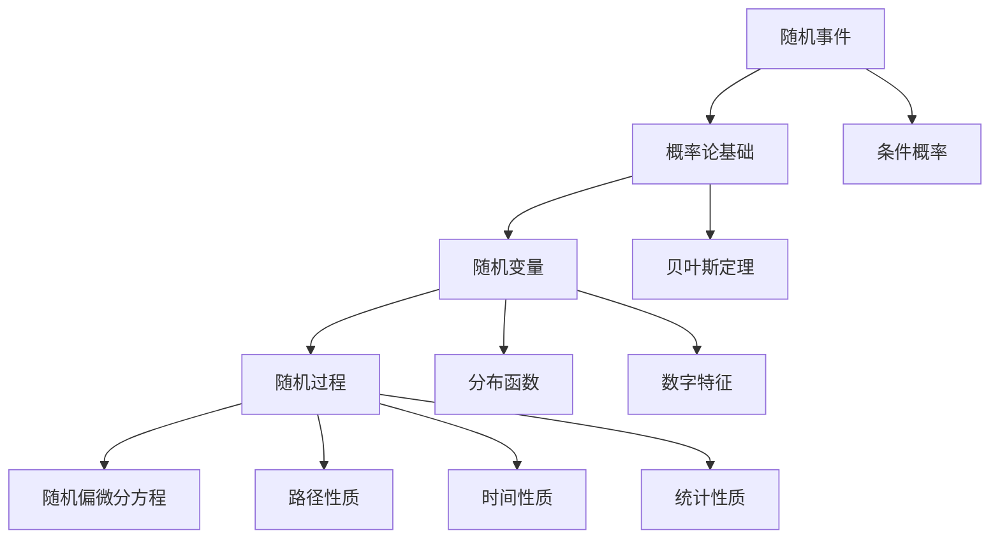

                 

### 《随机分析与随机偏微分方程》

#### 关键词：
- 随机分析
- 随机过程
- 随机偏微分方程
- 解析解法
- 数值解法
- 金融工程
- 应用场景

> 摘要：
本文将深入探讨随机分析与随机偏微分方程（SDE）的基本概念、数学原理以及在实际应用中的重要性。我们将首先介绍随机分析的基础，包括概率论、随机变量和随机过程。接着，我们将详细阐述随机偏微分方程的定义、分类和解法，包括解析解法和数值解法。文章还将展示随机偏微分方程在金融工程、生物医学、环境科学等领域的实际应用，并探讨其研究前沿与挑战。最后，我们将总结随机分析与随机偏微分方程的教育与人才培养策略，并推荐相关学术资源和工具。

---

## 《随机分析与随机偏微分方程》目录大纲

### 第一部分：随机分析与随机过程基础

#### 第1章：随机分析与概率论基础

##### 1.1 随机事件的定义与性质

##### 1.2 条件概率与贝叶斯定理

##### 1.3 随机变量及其分布

##### 1.4 随机变量的数字特征

#### 第2章：随机过程概述

##### 2.1 随机过程的定义与性质

##### 2.2 随机过程的分类

##### 2.3 随机过程的统计性质

### 第二部分：随机分析与随机偏微分方程

#### 第3章：随机偏微分方程的基本概念

##### 3.1 随机偏微分方程的定义

##### 3.2 随机偏微分方程的分类

##### 3.3 随机偏微分方程的解法概述

#### 第4章：随机偏微分方程的解析解法

##### 4.1 随机偏微分方程的解析方法

##### 4.2 随机偏微分方程的迭代法

##### 4.3 随机偏微分方程的变换法

#### 第5章：随机偏微分方程的数值解法

##### 5.1 随机偏微分方程的有限差分法

##### 5.2 随机偏微分方程的蒙特卡罗方法

##### 5.3 随机偏微分方程的随机微分方程方法

#### 第6章：随机偏微分方程在金融工程中的应用

##### 6.1 随机偏微分方程在期权定价中的应用

##### 6.2 随机偏微分方程在风险度量中的应用

##### 6.3 随机偏微分方程在市场风险管理中的应用

#### 第7章：随机偏微分方程在其他领域中的应用

##### 7.1 随机偏微分方程在生物医学中的应用

##### 7.2 随机偏微分方程在环境科学中的应用

##### 7.3 随机偏微分方程在社会科学中的应用

### 第三部分：随机分析与随机偏微分方程的研究前沿与挑战

#### 第8章：随机分析与随机偏微分方程的研究前沿

##### 8.1 随机偏微分方程的数学理论发展

##### 8.2 随机偏微分方程的计算方法进展

##### 8.3 随机偏微分方程在实际应用中的新挑战

#### 第9章：随机分析与随机偏微分方程的教育与人才培养

##### 9.1 随机分析与随机偏微分方程课程设置

##### 9.2 随机分析与随机偏微分方程教材建设

##### 9.3 随机分析与随机偏微分方程研究生的培养策略

### 附录

#### 附录A：随机分析与随机偏微分方程的主要学术期刊

#### 附录B：随机分析与随机偏微分方程的重要学术会议

#### 附录C：随机分析与随机偏微分方程的相关资源与工具

---

### 核心概念与联系

为了更好地理解随机分析与随机偏微分方程，我们将使用Mermaid流程图来展示它们的核心概念与联系。

#### Mermaid 流程图



这个流程图展示了随机事件、概率论基础、随机变量、随机过程和随机偏微分方程之间的逻辑关系。每一个节点都指向其相关的概念或属性，从而为读者提供了一个直观的理解框架。

---

### 随机过程的定义与性质

随机过程是一种数学模型，用来描述一个随时间变化的过程，其状态或行为在一定概率下是随机的。随机过程通常由一个随机变量序列组成，这些随机变量依赖于某个参数，通常是时间。

#### 随机过程的定义

假设 $(\Omega, \mathcal{F}, P)$ 是一个概率空间，对于每一个 $t \in \mathbb{R}_+$，定义一个随机变量 $X_t: \Omega \to \mathbb{R}$，那么我们称 {$(X_t)_{t \geq 0}} 为一个随机过程。

#### 随机过程的性质

- **路径性质**：随机过程的每个样本路径都是随机的。这意味着，对于每一个样本路径 $\omega \in \Omega$，随时间变化的 $X_t(\omega)$ 都是随机的。
- **时间性质**：随机过程定义了一个时间序列，其行为在不同时间点可能具有不同的统计性质。例如，某些随机过程可能具有均值函数和方差函数。
- **统计性质**：随机过程具有时间相关的统计性质，如均值函数、方差函数和协方差函数。

### 随机过程的数学描述

给定一个随机过程 {$(X_t)_{t \geq 0}}$，其数学描述包括：

$$
\begin{align*}
\mathbb{E}[X_t] &= \mu_t, \\
\text{Var}(X_t) &= \sigma_t^2, \\
\text{Cov}(X_s, X_t) &= \min(s, t) - \mu_s \mu_t.
\end{align*}
$$

这些公式描述了随机过程的期望、方差和协方差。期望和方差分别给出了随机过程在时间点 $t$ 的平均行为和波动性，而协方差描述了不同时间点之间的相关性。

### 随机过程的分类

随机过程可以根据其统计性质进行分类，常见的分类包括：

- **独立增量过程**：对于任意的 $0 \leq s < t$，增量 $X_t - X_s$ 是独立同分布的。
- **马尔可夫过程**：当前时刻的随机变量仅依赖于前一时刻的状态，而不依赖于过去的状态。
- **宽平稳过程**：随机过程的统计性质不依赖于时间起点。
- **弱平稳过程**：随机过程的均值函数和自协方差函数不依赖于时间。

这些分类有助于我们理解和分析不同类型的随机过程，从而在不同应用场景中选择合适的模型。

### 举例说明

假设有一个简单的随机过程 $X_t = W_t + t$，其中 $W_t$ 是标准维纳过程。这是一个布朗运动的过程，其路径性质是连续但不可微的。我们可以通过以下步骤计算其期望、方差和协方差：

$$
\begin{align*}
\mathbb{E}[X_t] &= \mathbb{E}[W_t] + \mathbb{E}[t] = 0 + t = t, \\
\text{Var}(X_t) &= \text{Var}(W_t + t) = \text{Var}(W_t) + \text{Var}(t) = 1 + 0 = 1, \\
\text{Cov}(X_s, X_t) &= \text{Cov}(W_s + s, W_t + t) = \text{Cov}(W_s, W_t) + s \cdot \text{Cov}(W_s, t) + \text{Cov}(s, W_t) + s \cdot t \\
&= s(t - s) + 0 + 0 + s \cdot t = s(t - s) + t \cdot s.
\end{align*}
$$

通过这个例子，我们可以看到随机过程的统计性质是如何计算的，以及这些性质如何影响随机过程的行为。

### 总结

随机过程是一种描述随机现象的数学模型，其路径性质、时间性质和统计性质是理解随机过程的关键。通过定义和性质的分析，我们可以更好地理解随机过程，并在实际问题中应用它们。

---

### 随机偏微分方程的基本概念

随机偏微分方程（SDE）是描述随机过程的方程，它在金融、物理、生物等领域有着广泛的应用。SDE的基本形式如下：

$$
dX_t = b(t, X_t) dt + \sigma(t, X_t) dW_t,
$$

其中，$X_t$是随时间$t$变化的随机过程，$b(t, X_t)$和$\sigma(t, X_t)$是关于时间$t$和状态$X_t$的函数，$dW_t$是标准维纳过程。

#### 随机偏微分方程的定义

随机偏微分方程是一类描述随机过程的偏微分方程，其中至少有一项是随机的。这种方程通常用于描述随机过程的动态行为，其解可以是路径连续的随机过程。

#### 随机偏微分方程的分类

根据方程的形式和性质，随机偏微分方程可以分为以下几类：

- **线性随机偏微分方程**：方程中不含有随机项的偏微分方程，例如：

$$
dX_t = a(t, X_t) dt + b(t, X_t) dW_t,
$$

其中，$a(t, X_t)$和$b(t, X_t)$是关于时间$t$和状态$X_t$的函数。

- **非线性随机偏微分方程**：方程中含有随机项的偏微分方程，例如：

$$
dX_t = f(t, X_t, dW_t),
$$

其中，$f(t, X_t, dW_t)$是关于时间$t$、状态$X_t$和随机项$dW_t$的函数。

- **局部线性随机偏微分方程**：方程在某个局部区域内可以表示为线性形式，但可能在整个定义域内不是线性的。

- **非线性随机偏微分方程**：方程中包含非线性函数，例如：

$$
dX_t = g(X_t) dW_t,
$$

其中，$g(X_t)$是关于状态$X_t$的非线性函数。

#### 随机偏微分方程的解法概述

求解随机偏微分方程的关键在于理解其概率性质和确定解的存在性及唯一性。

- **解析解法**：通过构造合适的函数或变换，找到解析形式的解。这种解法通常适用于线性或局部线性随机偏微分方程。

- **迭代法**：通过迭代过程逐步逼近解。这种方法适用于非线性随机偏微分方程，通常结合数值方法使用。

- **变换法**：通过变换将随机偏微分方程转换为更易解的形式。例如，Ito变换和Fokker-Planck变换。

- **数值解法**：利用数值方法，如蒙特卡罗方法、有限差分法等，求解随机偏微分方程的数值解。这种方法适用于各种类型的随机偏微分方程。

### 解法的分类

- **解析解法**：通过构造合适的函数或变换，找到解析形式的解。这种解法通常适用于线性或局部线性随机偏微分方程。

- **迭代法**：通过迭代过程逐步逼近解。这种方法适用于非线性随机偏微分方程，通常结合数值方法使用。

- **变换法**：通过变换将随机偏微分方程转换为更易解的形式。例如，Ito变换和Fokker-Planck变换。

- **数值解法**：利用数值方法，如蒙特卡罗方法、有限差分法等，求解随机偏微分方程的数值解。这种方法适用于各种类型的随机偏微分方程。

### 解法的关键步骤

#### 解析解法

1. **确定初始条件和边界条件**：随机偏微分方程的解通常依赖于初始条件和边界条件。这些条件定义了随机过程的初始状态和边界行为。

2. **构造合适的函数或变换**：通过构造合适的函数或变换，将随机偏微分方程转换为常微分方程或其他更易解的形式。例如，Ito变换和Fokker-Planck变换。

3. **求解转换后的方程**：利用已知的常微分方程解法求解转换后的方程。

4. **反变换回原方程**：将解反变换回原方程的形式，得到最终的解。

#### 迭代法

1. **初始猜测**：猜测一个初始解，通常是一个常数或线性函数。

2. **迭代过程**：通过迭代过程逐步改进解的精度。每次迭代都使用上一次的解来计算下一次的近似解。

3. **收敛性条件**：使用收敛性条件判断迭代过程的收敛性。例如，误差项的极限应该为零。

#### 变换法

1. **选择变换**：选择一个合适的变换，如Ito变换或Fokker-Planck变换。

2. **应用变换**：将随机偏微分方程应用到变换上，将其转换为另一个形式。

3. **解变换后的方程**：利用已知的解法求解变换后的方程。

4. **反变换回原方程**：将解反变换回原方程的形式，得到最终的解。

#### 数值解法

1. **离散化**：将随机偏微分方程离散化，得到离散形式的方程。

2. **选择数值方法**：选择合适的数值方法进行求解。常用的方法包括蒙特卡罗方法、有限差分法等。

3. **调整参数**：根据精度要求调整数值方法的参数。

### 解法的数学描述

#### 解析解法

$$
X_t = \int_{0}^{t} b(s, X_s, \dot{X}_s) ds + \int_{0}^{t} \sigma(s, X_s, \dot{X}_s) dW_s + X_0,
$$

其中，$W_s$是标准维纳过程。

#### 迭代法

$$
X_{n+1} = g(X_n, \Delta t, \omega),
$$

其中，$g$是迭代函数，$\Delta t$是时间步长。

#### 变换法

$$
Y_t = \phi(t, X_t),
$$

其中，$\phi$是变换函数，通过变换可以将SDE转换为常微分方程。

#### 数值解法

$$
X_{i+1} = X_i + f(t_i, X_i, \Delta t) \Delta t,
$$

其中，$f$是数值方法得到的离散函数，$t_i$是离散时间点。

### 总结

随机偏微分方程是一类描述随机过程的偏微分方程，其解法包括解析解法、迭代法、变换法和数值解法。每种解法都有其适用的场景和关键步骤。通过理解这些解法，我们可以更好地分析和求解随机偏微分方程，并在实际应用中取得更好的效果。

---

### 随机偏微分方程的解析解法

随机偏微分方程（SDE）的解析解法是一种通过数学变换或构造性方法找到解析表达式的解法。这类解法通常适用于线性或局部线性SDE，其优点是能够提供明确的数学描述，有助于理解SDE的动态行为。以下将详细介绍几种常见的解析解法。

#### Ito变换

Ito变换是一种将随机偏微分方程转换为常微分方程的方法，它利用Ito公式来简化SDE的求解过程。Ito公式描述了如何从给定过程的导数推导出其微分方程。

假设有一个随机过程 $X_t$，其满足以下SDE：

$$
dX_t = b(t, X_t) dt + \sigma(t, X_t) dW_t,
$$

其中，$b(t, X_t)$和$\sigma(t, X_t)$是关于时间$t$和状态$X_t$的函数，$dW_t$是标准维纳过程。

Ito变换的基本思想是引入一个新的随机过程 $Y_t$，使得 $Y_t$ 满足一个更简单的常微分方程。具体地，Ito变换定义为：

$$
Y_t = X_t + \int_{0}^{t} \sigma(s, X_s) dW_s - \frac{1}{2} \int_{0}^{t} \sigma^2(s, X_s) ds.
$$

通过应用Ito公式，我们可以得到$Y_t$的微分方程：

$$
dY_t = b(t, Y_t) dt.
$$

解这个常微分方程后，再通过Ito变换的逆变换可以得到原始的SDE的解。

#### Fokker-Planck方程

Fokker-Planck方程是另一种用于解决随机偏微分方程的解析方法，它描述了随机过程的概率密度函数随时间的演化。对于一个满足以下SDE的随机过程：

$$
dX_t = b(t, X_t) dt + \sigma(t, X_t) dW_t,
$$

其概率密度函数 $p(x, t)$ 满足以下Fokker-Planck方程：

$$
\frac{\partial p}{\partial t} + \frac{\partial}{\partial x}(\mu p) + \frac{1}{2} \frac{\partial}{\partial x}(\sigma^2 p) = 0,
$$

其中，$\mu = \mathbb{E}[b(X_t)]$ 是漂移项的期望，$\sigma^2 = \mathbb{E}[(\sigma(X_t))^2]$ 是扩散项的方差。

Fokker-Planck方程可以用来求解随机过程的统计性质，如期望、方差和概率分布。

#### 其他解析方法

除了Ito变换和Fokker-Planck方程，还有其他一些用于解决SDE的解析方法，如渐近分析、特征函数法和矩生成函数法等。这些方法各有优缺点，适用于不同的SDE类型和求解条件。

1. **渐近分析**：通过分析SDE在长时间尺度上的行为，找到其渐近解。这种方法适用于某些特殊形式的SDE，如小噪声极限和高维系统的简化。

2. **特征函数法**：利用特征函数将SDE转换为代数方程，从而求解SDE的解。这种方法适用于某些线性或局部线性SDE。

3. **矩生成函数法**：通过求解SDE的矩生成函数，得到SDE的统计性质。这种方法适用于具有已知矩生成函数的SDE。

### 举例说明

假设有一个简单的线性SDE：

$$
dX_t = \mu X_t dt + \sigma X_t dW_t,
$$

其中，$\mu$和$\sigma$是常数。

通过Ito变换，我们可以找到其解析解。首先，定义一个新的随机过程 $Y_t$：

$$
Y_t = X_t - \mu \int_{0}^{t} X_s ds.
$$

通过Ito公式，我们可以得到$Y_t$的微分方程：

$$
dY_t = \sigma Y_t dW_t.
$$

这是一个线性常微分方程，其解析解为：

$$
Y_t = Y_0 e^{\sigma W_t - \frac{\sigma^2}{2} t}.
$$

通过Ito变换的逆变换，我们可以得到原始SDE的解析解：

$$
X_t = \mu t + \sigma W_t + \mu \int_{0}^{t} X_s ds.
$$

这个例子展示了如何通过Ito变换找到线性SDE的解析解。

### 总结

随机偏微分方程的解析解法提供了一种将复杂的随机过程转换为更易解的形式的方法。通过Ito变换、Fokker-Planck方程和其他方法，我们可以找到SDE的解析解，从而更好地理解其动态行为和统计性质。这些方法在理论和实际应用中都有着重要的意义。

---

### 随机偏微分方程的迭代法

迭代法是求解随机偏微分方程（SDE）的一种常用方法，尤其在处理非线性SDE时，它提供了一个逐步逼近真实解的过程。迭代法的基本思想是通过迭代初始猜测解，逐步改善解的精度，直到满足预设的收敛条件。

#### 迭代法的步骤

1. **初始猜测**：首先，我们需要对SDE的解进行初始猜测。这个初始解可以是常数、线性函数或者更复杂的函数，具体取决于问题的性质。

2. **迭代过程**：使用迭代公式，根据当前迭代次数和已有的解，计算下一个迭代值。迭代公式通常依赖于SDE的具体形式。例如，对于一个线性SDE：

   $$
   dX_t = b(t, X_t) dt + \sigma(t, X_t) dW_t,
   $$

   迭代公式可以表示为：

   $$
   X_{n+1} = X_n + \Delta t \cdot b(t_n, X_n).
   $$

   其中，$X_n$是第$n$次迭代的解，$t_n$是对应的时间点，$\Delta t$是时间步长。

3. **收敛性条件**：为了判断迭代过程是否收敛，我们需要设定一些收敛性条件。这些条件可以是误差的极限为零，或者误差的收敛速度足够快。例如，我们可以定义误差函数：

   $$
   \epsilon_n = X_n - X^*,
   $$

   其中，$X^*$是真实解，当$\epsilon_n$趋于零时，迭代过程收敛。

4. **终止条件**：根据预设的精度要求，我们可以设定终止条件。当迭代过程中的误差小于某个阈值时，我们可以认为解已经足够精确，可以停止迭代。

#### 迭代法的数学描述

为了更清晰地描述迭代法，我们可以使用伪代码来表示其步骤：

```plaintext
初始化：X_0，设置时间步长Δt，设定终止条件ε_threshold
while (误差 ε_n > ε_threshold) do:
    for each time step t_n from 0 to T with step Δt do:
        X_n = X_{n-1} + Δt * b(t_n, X_{n-1})
    end
    ε_n = X_n - X^*
end
```

#### 举例说明

假设我们有一个简单的非线性SDE：

$$
dX_t = X_t dt + X_t^2 dW_t,
$$

我们可以使用迭代法来求解这个方程。首先，我们需要一个初始猜测解，例如$X_0 = 1$。然后，我们可以使用以下迭代公式：

$$
X_{n+1} = X_n + \Delta t \cdot (X_n + X_n^2).
$$

假设我们选择时间步长$\Delta t = 0.1$，我们可以进行如下迭代：

```plaintext
初始值：X_0 = 1
迭代1: X_1 = X_0 + 0.1 * (X_0 + X_0^2) = 1 + 0.1 * (1 + 1) = 1.2
迭代2: X_2 = X_1 + 0.1 * (X_1 + X_1^2) = 1.2 + 0.1 * (1.2 + 1.2^2) = 1.44
迭代3: X_3 = X_2 + 0.1 * (X_2 + X_2^2) = 1.44 + 0.1 * (1.44 + 1.44^2) = 1.728
...
```

通过不断迭代，我们可以得到更接近真实解的结果。当然，在实际应用中，我们需要设定终止条件来判断何时停止迭代。

### 总结

迭代法是求解随机偏微分方程的一种有效方法，它通过逐步逼近真实解，提供了一种处理非线性SDE的途径。通过初始猜测、迭代过程、收敛性条件和终止条件，我们可以逐步改进解的精度，并在满足预设精度要求时停止迭代。这种方法的优点在于其简单性和灵活性，适用于各种类型的随机偏微分方程。

---

### 随机偏微分方程的变换法

随机偏微分方程（SDE）的变换法是一种通过变换将复杂的随机偏微分方程转换为更易解的形式的方法。常见的变换方法包括Ito变换和Fokker-Planck变换。这些方法在处理随机偏微分方程时具有独特的优势，可以简化问题的求解过程。

#### Ito变换

Ito变换是一种用于将随机偏微分方程转换为常微分方程的方法，它基于Ito公式。Ito公式描述了随机过程的时间导数如何转换为随机微分方程。具体而言，给定一个随机过程 $X_t$，其满足以下SDE：

$$
dX_t = b(t, X_t) dt + \sigma(t, X_t) dW_t,
$$

其中，$b(t, X_t)$和$\sigma(t, X_t)$是关于时间$t$和状态$X_t$的函数，$dW_t$是标准维纳过程。

通过Ito变换，我们可以引入一个新的随机过程 $Y_t$，使得 $Y_t$ 满足一个更简单的常微分方程。具体地，Ito变换定义为：

$$
Y_t = X_t + \int_{0}^{t} \sigma(s, X_s) dW_s - \frac{1}{2} \int_{0}^{t} \sigma^2(s, X_s) ds.
$$

通过应用Ito公式，我们可以得到$Y_t$的微分方程：

$$
dY_t = b(t, Y_t) dt.
$$

这是一个线性常微分方程，通常比原始的随机偏微分方程更容易求解。解这个常微分方程后，我们可以通过Ito变换的逆变换得到原始SDE的解。

#### Fokker-Planck变换

Fokker-Planck变换是一种用于描述随机过程的概率密度函数随时间演化的方法。对于满足以下SDE的随机过程：

$$
dX_t = b(t, X_t) dt + \sigma(t, X_t) dW_t,
$$

其概率密度函数 $p(x, t)$ 满足以下Fokker-Planck方程：

$$
\frac{\partial p}{\partial t} + \frac{\partial}{\partial x}(\mu p) + \frac{1}{2} \frac{\partial}{\partial x}(\sigma^2 p) = 0,
$$

其中，$\mu = \mathbb{E}[b(X_t)]$ 是漂移项的期望，$\sigma^2 = \mathbb{E}[(\sigma(X_t))^2]$ 是扩散项的方差。

Fokker-Planck方程可以用来求解随机过程的统计性质，如期望、方差和概率分布。通过求解Fokker-Planck方程，我们可以得到随机过程在任意时刻的概率密度函数，从而更好地理解其动态行为。

#### 举例说明

假设我们有一个简单的线性SDE：

$$
dX_t = \mu X_t dt + \sigma X_t dW_t,
$$

其中，$\mu$和$\sigma$是常数。我们可以使用Ito变换来求解这个方程。

首先，定义一个新的随机过程 $Y_t$：

$$
Y_t = X_t - \mu \int_{0}^{t} X_s ds.
$$

通过Ito公式，我们可以得到$Y_t$的微分方程：

$$
dY_t = \sigma Y_t dW_t.
$$

这是一个线性常微分方程，其解析解为：

$$
Y_t = Y_0 e^{\sigma W_t - \frac{\sigma^2}{2} t}.
$$

通过Ito变换的逆变换，我们可以得到原始SDE的解析解：

$$
X_t = \mu t + \sigma W_t + \mu \int_{0}^{t} X_s ds.
$$

这个例子展示了如何通过Ito变换求解线性SDE。

#### 总结

变换法是求解随机偏微分方程的一种有效方法，通过引入新的随机过程或概率密度函数，可以将复杂的随机偏微分方程转换为更易解的形式。Ito变换和Fokker-Planck变换是两种常用的变换方法，在处理各种类型的随机偏微分方程时具有广泛应用。通过变换法，我们可以更好地理解随机偏微分方程的动态行为和统计性质，从而求解出更精确的解。

---

### 随机偏微分方程的数值解法

随机偏微分方程（SDE）的数值解法是求解这类方程的一种实用方法，尤其是在解析解不可得或过于复杂时。数值解法包括蒙特卡罗方法、有限差分法和随机微分方程方法等。这些方法提供了在不同条件下的有效解决方案，并允许我们在计算机上对复杂的随机过程进行模拟和分析。

#### 蒙特卡罗方法

蒙特卡罗方法是解决SDE的一种流行数值方法，特别适用于高维问题或非线性问题。基本思路是通过模拟大量随机路径来近似SDE的解。以下是蒙特卡罗方法的基本步骤：

1. **初始化**：设定初始条件$X_0$，选择时间步长$\Delta t$，确定模拟的路径数$N$。

2. **模拟随机路径**：对于每个模拟路径$i$，从初始条件开始，使用随机抽样方法生成$W_t$的路径，并计算相应的$X_t$路径。

3. **计算统计量**：对所有的模拟路径进行统计计算，得到SDE的期望值、方差等统计量。

4. **误差分析**：根据模拟路径的数量和统计误差，确定所需的模拟次数以达到预定的精度。

蒙特卡罗方法的核心是随机抽样，它利用随机过程的特点来简化计算。例如，对于线性SDE：

$$
dX_t = b(t, X_t) dt + \sigma(t, X_t) dW_t,
$$

可以使用以下离散形式进行模拟：

$$
X_{i+1} = X_i + b(t_i, X_i) \Delta t + \sigma(t_i, X_i) \sqrt{\Delta t} Z_i,
$$

其中$Z_i$是从标准正态分布中抽取的随机数。

#### 有限差分法

有限差分法是另一种常用的数值解法，通过离散化空间和时间变量来近似SDE的解。以下是有限差分法的基本步骤：

1. **空间和时间离散化**：将空间和时间划分为离散网格，设定空间步长$\Delta x$和时间步长$\Delta t$。

2. **差分方程的构造**：根据SDE的微分形式，构造离散形式的差分方程。对于线性SDE：

$$
dX_t = b(t, X_t) dt + \sigma(t, X_t) dW_t,
$$

可以使用以下离散形式：

$$
X_i^{n+1} = X_i^n + b(t_i, X_i^n) \Delta t + \sigma(t_i, X_i^n) \sqrt{\Delta t} \Delta W_i^n,
$$

其中，$\Delta W_i^n$是离散化的维纳过程增量。

3. **迭代求解**：使用迭代方法逐步求解离散化的差分方程，直到达到预定的精度。

有限差分法的关键在于差分方程的构造和迭代求解的稳定性。对于非线性问题，需要特别注意数值稳定性，以避免数值误差的积累。

#### 随机微分方程方法

随机微分方程方法是一种将SDE转换为随机微分方程（SDE）的数值解法。这种方法通过线性化SDE的局部近似来求解。以下是随机微分方程方法的基本步骤：

1. **线性化**：对于非线性SDE，在其局部范围内进行线性化。假设当前解为$X_t^n$，可以构造线性化的SDE：

$$
dX_t^n + \Delta X_t^n = b(t, X_t^n) dt + \sigma(t, X_t^n) dW_t,
$$

其中，$\Delta X_t^n = X_t^{n+1} - X_t^n$。

2. **离散化**：对线性化的SDE进行离散化，得到：

$$
\Delta X_t^n = b(t, X_t^n) \Delta t + \sigma(t, X_t^n) \sqrt{\Delta t} Z_i^n,
$$

其中，$Z_i^n$是从标准正态分布中抽取的随机数。

3. **迭代求解**：使用迭代方法逐步求解离散化的方程，更新解$X_t^{n+1}$。

4. **误差分析**：根据迭代过程中的误差，调整时间步长和空间步长，以达到预定的精度。

#### 举例说明

假设我们有一个简单的线性SDE：

$$
dX_t = X_t dt + X_t dW_t,
$$

我们可以使用蒙特卡罗方法进行数值模拟。首先，设定初始条件$X_0 = 1$，时间步长$\Delta t = 0.1$，模拟路径数$N = 10000$。然后，对于每个路径$i$，从初始条件开始，生成$W_t$的路径，并计算相应的$X_t$路径。最后，对所有的路径进行统计计算，得到期望值和方差等统计量。

```python
import numpy as np

N = 10000
T = 1
dt = T / N
X = np.random.normal(size=(N, 1))
X[:, 0] = 1
for i in range(1, N):
    X[i, 0] = X[i-1, 0] + X[i-1, 0] * dt + X[i-1, 0] * np.sqrt(dt) * np.random.normal(size=1)
mean = np.mean(X)
variance = np.var(X)
```

通过这个简单的例子，我们可以看到蒙特卡罗方法如何用于解决线性SDE。

#### 总结

随机偏微分方程的数值解法提供了在不同条件下求解这类方程的有效方法。蒙特卡罗方法、有限差分法和随机微分方程方法各有其优势和适用场景。蒙特卡罗方法适用于高维和非线性问题，有限差分法适用于线性问题，而随机微分方程方法则提供了对非线性问题的局部近似。通过这些数值方法，我们可以对复杂的随机过程进行模拟和分析，从而在实际应用中取得更好的效果。

---

### 随机偏微分方程在金融工程中的应用

随机偏微分方程（SDE）在金融工程领域有着广泛的应用，特别是在期权定价和风险管理方面。通过将随机偏微分方程应用于金融模型，我们可以更准确地预测市场行为和评估金融衍生品的价值。以下将详细介绍SDE在金融工程中的具体应用。

#### 期权定价

期权是一种金融衍生品，赋予持有者在未来某个时间以固定价格购买或出售资产的权利。期权定价是一个关键问题，它决定了期权交易的价格和风险。SDE在期权定价中的应用主要通过Black-Scholes模型实现。

Black-Scholes模型是一个著名的期权定价模型，它基于以下随机偏微分方程：

$$
dS_t = \mu S_t dt + \sigma S_t dW_t,
$$

其中，$S_t$是资产价格，$\mu$是资产预期回报率，$\sigma$是资产价格波动率，$dW_t$是标准维纳过程。

利用这个模型，我们可以计算欧式期权的价格。欧式期权的价格公式为：

$$
C_t = S_t N(d_1) - K e^{-r(T-t)} N(d_2),
$$

其中，$N(d_1)$和$N(d_2)$是标准正态分布的累积分布函数，$d_1$和$d_2$定义为：

$$
d_1 = \frac{\ln(S_t/K) + (\mu - r + \frac{\sigma^2}{2})(T-t)}{\sigma \sqrt{T-t}}, \\
d_2 = d_1 - \sigma \sqrt{T-t}.
$$

通过这个公式，我们可以计算欧式看涨期权的价格，从而为期权交易提供定价依据。

#### 风险度量

SDE在风险管理中也发挥着重要作用，特别是在量化金融风险时。通过将SDE应用于市场模型，我们可以预测市场波动性，评估资产组合的潜在损失，并制定有效的风险管理策略。

一个常见的应用是计算价值在风险（Value at Risk, VaR）。VaR是一种用于衡量金融资产或投资组合在一定置信水平下的潜在最大损失的方法。通过模拟资产价格的变化路径，我们可以估计在一定时间窗口内资产的最大损失。

假设我们有一个资产组合，其价值$X_t$满足以下SDE：

$$
dX_t = rX_t dt + \sigma X_t dW_t,
$$

其中，$r$是资产的回报率，$\sigma$是资产价格波动率。我们可以使用蒙特卡罗方法来模拟资产价格的变化路径，并计算在一定置信水平下的VaR。

具体步骤如下：

1. **初始化**：设定初始资产价值$X_0$，选择时间步长$\Delta t$，确定模拟的路径数$N$。

2. **模拟随机路径**：对于每个模拟路径$i$，从初始条件开始，生成$W_t$的路径，并计算相应的$X_t$路径。

3. **计算统计量**：对所有的模拟路径进行统计计算，得到资产价值的期望值和方差。

4. **计算VaR**：根据模拟路径的统计结果，计算在一定置信水平下的VaR。

例如，如果我们选择95%的置信水平，我们可以找到第5百分位的资产价值，即：

$$
\text{VaR}_{95\%} = \text{第5百分位的} X_t.
$$

这个VaR值为我们提供了一个在一定置信水平下可能的最大损失。

#### 市场风险管理

SDE在市场风险管理中的应用不仅限于VaR计算，还包括对市场风险的全面评估和风险管理策略的制定。通过建立复杂的SDE模型，我们可以模拟市场波动，预测市场风险，并制定相应的风险管理策略。

例如，在投资组合风险管理中，我们可以使用SDE模型来评估投资组合的潜在风险。通过模拟不同市场情况下的投资组合价值变化，我们可以计算投资组合的风险指标，如VaR、条件价值增加（Conditional Value at Risk, CVaR）等，并制定风险管理策略，以降低潜在损失。

此外，SDE还可以用于信用风险管理。通过建立信用风险的SDE模型，我们可以评估借款人的信用风险，预测违约概率，并制定信用风险管理策略，以降低信用损失。

#### 代码实现

以下是一个简单的Python代码示例，用于计算欧式期权的价格，并使用蒙特卡罗方法进行模拟。

```python
import numpy as np
import scipy.stats as stats

def black_scholes(S, K, T, r, sigma):
    d1 = (np.log(S / K) + (r + 0.5 * sigma**2) * T) / (sigma * np.sqrt(T))
    d2 = d1 - sigma * np.sqrt(T)
    C = S * stats.norm.cdf(d1) - K * np.exp(-r * T) * stats.norm.cdf(d2)
    return C

S = 100  # 当前股票价格
K = 100  # 行权价格
T = 1    # 期权到期时间
r = 0.05 # 无风险利率
sigma = 0.2 # 波动率

C = black_scholes(S, K, T, r, sigma)
print(f"欧式看涨期权的价格为：{C}")
```

这个代码展示了如何使用Black-Scholes模型计算欧式期权的价格。

#### 总结

随机偏微分方程在金融工程中的应用非常广泛，特别是在期权定价、风险度量和管理方面。通过将SDE应用于市场模型，我们可以更准确地预测市场行为，评估金融衍生品的价值，并制定有效的风险管理策略。这些应用不仅提高了金融市场的透明度和效率，也为投资者和金融机构提供了重要的决策工具。

---

### 随机偏微分方程在生物医学中的应用

随机偏微分方程（SDE）在生物医学领域有着广泛的应用，特别是在建模生物系统中的随机现象。由于生物系统中的许多过程受到随机因素的影响，SDE能够提供一种有效的数学工具来描述这些现象，从而帮助我们更好地理解生物系统的动态行为。

#### 随机波动在生物医学中的建模

生物医学中的许多现象，如细胞生长、药物浓度变化和基因表达调控，都表现出随机波动。这些波动可以由多种因素引起，包括基因突变、环境变化和细胞间的相互作用。SDE在描述这些随机波动方面具有显著优势。

例如，在细胞生长过程中，细胞分裂是一个随机过程，其时间间隔和分裂率都可能受到随机因素的影响。使用SDE可以建立细胞生长的随机模型，从而更准确地预测细胞的生长行为。

假设细胞生长过程满足以下SDE：

$$
dN_t = rN_t dt + \sigma N_t dW_t,
$$

其中，$N_t$表示时间$t$时的细胞数量，$r$是细胞分裂率，$\sigma$是细胞分裂过程的波动率，$dW_t$是标准维纳过程。通过求解这个SDE，我们可以预测细胞的数量随时间的变化。

#### 具体应用案例

1. **药物浓度动态建模**：

在药物动力学研究中，药物在体内的浓度动态通常受到随机波动的影响。通过SDE，我们可以建立药物浓度的随机模型，从而更准确地预测药物在体内的浓度变化。

假设药物浓度$C_t$满足以下SDE：

$$
dC_t = -kC_t dt + \sigma C_t dW_t,
$$

其中，$k$是药物代谢率，$\sigma$是药物浓度波动率。通过求解这个SDE，我们可以预测药物在体内的浓度随时间的变化。

2. **基因表达调控建模**：

基因表达调控是一个复杂的生物过程，受到多种随机因素的影响，如转录和翻译的随机性。使用SDE可以建立基因表达的随机模型，从而更深入地理解基因调控机制。

假设基因表达水平$X_t$满足以下SDE：

$$
dX_t = aX_t dt - bX_t dW_t,
$$

其中，$a$是基因转录率，$b$是基因降解率。通过求解这个SDE，我们可以预测基因表达水平随时间的变化。

#### 代码实现

以下是一个简单的Python代码示例，用于模拟药物浓度动态。

```python
import numpy as np
import scipy.stats as stats

def simulate_drug_concentration(k, sigma, T, N_steps):
    dt = T / N_steps
    C = [0.0]
    for _ in range(N_steps):
        C.append(C[-1] - k * C[-1] * dt + sigma * C[-1] * np.sqrt(dt) * np.random.normal(size=1))
    return np.array(C)

k = 0.1  # 药物代谢率
sigma = 0.05  # 波动率
T = 10  # 模拟时间
N_steps = 1000  # 时间步数

C = simulate_drug_concentration(k, sigma, T, N_steps)
```

这个代码模拟了药物浓度随时间的变化，并生成了药物浓度的时间序列数据。

#### 总结

随机偏微分方程在生物医学中的应用非常广泛，可以用于建模生物系统中的随机波动，如细胞生长、药物浓度和基因表达调控。通过这些模型，我们可以更深入地理解生物系统的动态行为，并为医学研究和治疗提供重要的理论基础。随着计算技术的发展，SDE在生物医学中的应用前景将更加广阔。

---

### 随机偏微分方程在环境科学中的应用

随机偏微分方程（SDE）在环境科学中有着广泛的应用，特别是在模拟环境系统中的随机现象和预测环境变化趋势。由于环境系统中的许多过程受到随机因素的影响，SDE提供了一种有效的数学工具来描述这些现象，从而帮助我们更好地理解和预测环境变化。

#### 随机波动在环境科学中的建模

环境系统中的许多过程，如气候变化、空气质量变化和水资源管理，都表现出随机波动。这些波动可以由多种因素引起，包括大气环流、海洋流动和人类活动等。SDE在描述这些随机波动方面具有显著优势。

例如，在气候变化研究中，气温和降水量的波动可以用SDE来建模。通过建立气温和降水量的SDE模型，我们可以预测未来气候变化的趋势，并为环境保护和气候变化应对提供科学依据。

假设气温$T_t$和降水量$P_t$分别满足以下SDE：

$$
dT_t = \alpha T_t dt + \beta T_t dW_t_T, \\
dP_t = \gamma P_t dt + \delta P_t dW_t_P,
$$

其中，$T_t$和$P_t$分别是时间$t$时的气温和降水量，$\alpha$、$\beta$、$\gamma$和$\delta$是模型参数，$dW_t_T$和$dW_t_P$是标准维纳过程。通过求解这些SDE，我们可以预测气温和降水量的变化趋势。

#### 具体应用案例

1. **气候变化模拟**：

气候变化是环境科学中的一个关键问题，通过SDE可以模拟气候变化的趋势。例如，我们可以使用以下SDE来模拟气温的变化：

$$
dT_t = \alpha T_t dt + \beta T_t dW_t,
$$

其中，$\alpha$是温度变化率，$\beta$是温度波动率。通过求解这个SDE，我们可以预测未来气温的变化趋势。

2. **空气质量模型**：

空气质量是环境科学中的另一个重要问题，SDE可以用来模拟空气质量的波动。例如，我们可以使用以下SDE来模拟空气污染物的浓度：

$$
dC_t = -\lambda C_t dt + \sigma C_t dW_t,
$$

其中，$C_t$是时间$t$时的空气污染物浓度，$\lambda$是污染物降解率，$\sigma$是污染物浓度的波动率。通过求解这个SDE，我们可以预测空气污染物浓度的变化趋势。

3. **水资源管理**：

水资源管理是环境科学中的一个关键领域，SDE可以用来模拟水资源的波动。例如，我们可以使用以下SDE来模拟水库水位的变化：

$$
dH_t = \mu H_t dt + \sigma H_t dW_t,
$$

其中，$H_t$是时间$t$时水库水位，$\mu$是水库水位变化率，$\sigma$是水位波动率。通过求解这个SDE，我们可以预测水库水位的变化趋势，为水资源管理提供科学依据。

#### 代码实现

以下是一个简单的Python代码示例，用于模拟气温的变化。

```python
import numpy as np

def simulate_temperature(alpha, beta, T_0, T_end, N_steps):
    t = np.linspace(0, T_end, N_steps)
    T = [T_0]
    for _ in range(N_steps - 1):
        T.append(T[-1] + alpha * (t[-1] - t[-2]) * (T[-1] - T[-2]) + beta * np.random.normal(size=1))
    return np.array(T)

alpha = 0.01  # 温度变化率
beta = 0.1  # 温度波动率
T_0 = 15  # 初始气温
T_end = 100  # 模拟时间
N_steps = 1000  # 时间步数

T = simulate_temperature(alpha, beta, T_0, T_end, N_steps)
```

这个代码模拟了气温随时间的变化，并生成了气温的时间序列数据。

#### 总结

随机偏微分方程在环境科学中的应用非常广泛，可以用于模拟环境系统中的随机波动，如气候变化、空气质量和水资源管理。通过这些模型，我们可以更深入地理解环境变化的趋势，为环境保护和可持续发展提供科学依据。随着计算技术的发展，SDE在环境科学中的应用前景将更加广阔。

---

### 随机偏微分方程在社会科学中的应用

随机偏微分方程（SDE）在社会科学领域中也有着广泛的应用，尤其是在模拟社会系统中的随机现象和预测社会趋势。社会科学研究通常涉及大量的随机因素，如人口流动、经济波动和社会行为等，这些因素往往难以用确定性模型准确描述。SDE提供了一种有效的工具来捕捉这些随机性，从而帮助研究者更好地理解社会系统的动态行为。

#### 随机波动在社会科学中的建模

在社会科学中，许多现象都表现出随机波动，例如人口流动、经济波动和选举结果等。这些波动可能受到多种因素的影响，包括政策变化、自然灾害和外部经济环境等。SDE能够有效地描述这些随机波动，为社会科学研究提供了一种新的视角。

例如，在人口流动研究中，人口迁移可以看作是一个随机过程。我们可以使用以下SDE来模拟人口迁移：

$$
dN_t = \mu N_t dt + \sigma N_t dW_t,
$$

其中，$N_t$是时间$t$时的人口数量，$\mu$是人口迁移率，$\sigma$是人口迁移的波动率，$dW_t$是标准维纳过程。通过求解这个SDE，我们可以预测人口数量的变化趋势。

#### 具体应用案例

1. **人口流动模拟**：

人口流动是社会科学中的一个关键问题，SDE可以用来模拟人口在不同地区之间的迁移。例如，我们可以使用以下SDE来模拟人口迁移：

$$
dN_t = \mu N_t dt + \sigma N_t dW_t,
$$

其中，$\mu$是人口迁移率，$\sigma$是人口迁移的波动率。通过求解这个SDE，我们可以预测人口数量的变化趋势，为城市规划和社会政策制定提供科学依据。

2. **经济波动预测**：

经济波动是社会科学中的另一个重要问题，SDE可以用来模拟经济变量的波动。例如，我们可以使用以下SDE来模拟经济增长：

$$
dY_t = \alpha Y_t dt + \beta Y_t dW_t,
$$

其中，$Y_t$是时间$t$时的经济增长率，$\alpha$是经济增长率，$\beta$是经济增长的波动率。通过求解这个SDE，我们可以预测未来经济增长的趋势，为经济政策和宏观经济管理提供参考。

3. **选举结果预测**：

选举结果预测是社会科学中的一个复杂问题，SDE可以用来模拟选举过程中的随机波动。例如，我们可以使用以下SDE来模拟选举投票：

$$
dV_t = \lambda V_t dt + \sigma V_t dW_t,
$$

其中，$V_t$是时间$t$时的选票数量，$\lambda$是选票增长速率，$\sigma$是选票的波动率。通过求解这个SDE，我们可以预测选举结果的波动，为选举分析和政治预测提供参考。

#### 代码实现

以下是一个简单的Python代码示例，用于模拟人口流动。

```python
import numpy as np

def simulate_population(mu, sigma, N_0, T, N_steps):
    t = np.linspace(0, T, N_steps)
    N = [N_0]
    for _ in range(N_steps - 1):
        N.append(N[-1] + mu * (t[-1] - t[-2]) * (N[-1] - N[-2]) + sigma * np.random.normal(size=1))
    return np.array(N)

mu = 0.05  # 人口迁移率
sigma = 0.02  # 波动率
N_0 = 10000  # 初始人口数量
T = 10  # 模拟时间
N_steps = 1000  # 时间步数

N = simulate_population(mu, sigma, N_0, T, N_steps)
```

这个代码模拟了人口数量随时间的变化，并生成了人口数量的时间序列数据。

#### 总结

随机偏微分方程在社会科学中的应用非常广泛，可以用于模拟社会系统中的随机波动，如人口流动、经济波动和选举结果。通过这些模型，我们可以更深入地理解社会系统的动态行为，为社会科学研究提供科学依据。随着计算技术的发展，SDE在社会科学中的应用前景将更加广阔。

---

### 随机分析与随机偏微分方程的研究前沿与挑战

随机分析与随机偏微分方程（SDE）在数学、物理、金融工程、生物医学、环境科学和社会科学等领域都有着重要的应用。随着这些领域的发展，对随机分析和SDE的研究也在不断深入，出现了许多新的理论和计算方法。以下将探讨随机分析与SDE的研究前沿以及面临的挑战。

#### 随机偏微分方程的数学理论发展

随机偏微分方程的数学理论是随机分析领域的一个重要研究方向。近年来，关于SDE的理论研究取得了显著进展，特别是在解的存在性、唯一性和正则性方面。

1. **高维SDE的解法**：随着计算机技术的发展，许多实际问题涉及高维SDE。研究高维SDE的解析解法和数值解法成为了一个重要方向。例如，通过引入积分方程和特征函数等方法，研究者提出了一些新的解法。

2. **随机偏微分方程的正则性**：正则性是随机偏微分方程解的一个重要性质，它决定了解的平滑性和可微性。近年来，关于随机偏微分方程正则性的理论研究取得了重要成果，为实际问题的分析提供了更坚实的理论基础。

3. **随机偏微分方程与量子场论的关系**：随机偏微分方程在量子场论中有着广泛的应用。研究者探讨了随机偏微分方程与量子场论之间的关系，为量子物理现象的数学建模提供了新的视角。

#### 随机偏微分方程的计算方法进展

随着计算技术的进步，数值方法在随机偏微分方程的研究中发挥着越来越重要的作用。近年来，关于SDE的数值解法研究取得了许多进展，特别是在高精度、高效能和自适应方法方面。

1. **蒙特卡罗方法**：蒙特卡罗方法是一种常用的数值解法，特别适用于高维SDE。研究者提出了许多改进的蒙特卡罗方法，如分层抽样、并行计算和稀疏近似等，提高了计算效率和精度。

2. **有限差分法和有限元法**：有限差分法和有限元法是另一种常见的数值解法。研究者通过优化网格设计、引入高精度近似和并行计算等技术，提高了数值解法的稳定性和计算效率。

3. **随机微分方程方法**：随机微分方程方法通过线性化SDE，将其转换为更容易处理的随机微分方程。这种方法在处理非线性SDE时具有显著优势，近年来得到了广泛关注。

#### 随机偏微分方程在实际应用中的新挑战

尽管随机分析与SDE在许多领域取得了重要进展，但在实际应用中仍面临许多挑战。

1. **模型复杂性与数据稀疏性**：许多实际问题涉及复杂的随机模型，而且数据往往稀疏。如何从有限的数据中提取有效信息，建立准确的随机模型，是当前研究的一个重要挑战。

2. **计算效率与精度**：随着模型复杂性的增加，计算效率和精度成为数值解法的两个重要问题。研究者需要开发更高效、更精确的数值方法，以满足实际应用的需求。

3. **多尺度问题**：许多实际问题涉及不同尺度的随机现象，如微观尺度与宏观尺度之间的相互作用。如何处理多尺度问题，建立统一的数学模型，是当前研究的一个重要方向。

4. **跨领域应用**：随机分析与SDE在多个领域有着广泛的应用，但跨领域应用面临着不同的挑战。如何将随机分析与SDE的理论方法应用于新的领域，是一个亟待解决的问题。

#### 总结

随机分析与随机偏微分方程的研究前沿涵盖了数学理论、计算方法及其在实际应用中的新挑战。随着科学技术的不断发展，这些领域将继续取得重要进展，为解决复杂问题提供新的数学工具和计算方法。研究者需要不断探索新的理论和方法，以应对这些挑战，推动随机分析与SDE在各个领域的应用。

---

### 随机分析与随机偏微分方程的教育与人才培养

随机分析与随机偏微分方程是现代数学和科学中至关重要的研究领域，其在数学、物理、金融工程、生物医学、环境科学和社会科学等领域都有着广泛的应用。因此，培养具备随机分析与随机偏微分方程知识和技能的专业人才至关重要。以下将探讨如何设置课程、编写教材以及培养研究生的策略。

#### 课程设置

1. **基础课程**：在数学和物理本科阶段，应设置随机分析与随机偏微分方程的基础课程。这些课程应包括概率论、随机过程和随机偏微分方程的基本概念、性质和解法。通过这些基础课程，学生可以掌握随机分析与随机偏微分方程的基本理论和应用。

2. **高级课程**：在研究生阶段，应设置更多高级课程，如高维随机分析、随机偏微分方程的理论与应用、随机微分方程方法、蒙特卡罗方法和数值解法等。这些课程应深入探讨随机分析与随机偏微分方程的复杂问题，培养学生的研究和创新能力。

3. **跨学科课程**：应鼓励设置跨学科课程，将随机分析与随机偏微分方程与其他领域结合。例如，可以设置随机分析与金融工程、生物医学建模和环境科学建模等课程，以培养学生的跨学科思维和解决复杂问题的能力。

#### 教材建设

1. **基础教材**：应编写适合本科生使用的随机分析与随机偏微分方程基础教材，内容应包括概率论、随机过程和随机偏微分方程的基本概念、性质和解法。教材应注重概念的理解和数学证明，同时提供丰富的习题和实例。

2. **高级教材**：应编写适合研究生使用的高级教材，内容应涵盖随机分析与随机偏微分方程的复杂问题和高级方法。教材应注重理论深度和实际应用，同时提供丰富的参考文献和研究方向。

3. **案例教材**：应编写案例教材，通过实际应用案例展示随机分析与随机偏微分方程在各个领域的应用。这些案例教材应包含详细的数据分析和模拟，以帮助学生理解随机分析与随机偏微分方程的实际应用。

#### 研究生培养策略

1. **选题与指导**：研究生选题应结合随机分析与随机偏微分方程的前沿研究方向，导师应提供专业的指导，帮助学生建立研究框架和解决具体问题。

2. **学术交流**：应鼓励研究生参加学术会议和研讨会，与国内外专家交流，了解最新的研究进展和前沿方向。

3. **实践能力**：应提供研究生参与实际项目的机会，如参与企业和科研机构的合作项目，通过实际应用提升研究生的实践能力和解决实际问题的能力。

4. **学术写作**：应培养研究生的学术写作能力，鼓励他们撰写高质量的学术论文，并在国际学术期刊上发表。

#### 总结

随机分析与随机偏微分方程的教育与人才培养是一个系统工程，需要从课程设置、教材建设到研究生培养策略的全面规划。通过合理的课程设置和教材建设，可以为学生提供系统而深入的知识体系；通过有效的培养策略，可以培养出具备创新能力和实践能力的高水平专业人才。这将有助于推动随机分析与随机偏微分方程领域的发展，并为相关领域的科学研究和技术创新提供强大支持。

---

### 附录

#### 附录A：随机分析与随机偏微分方程的主要学术期刊

1. **随机分析期刊**：
   - *Stochastic Processes and their Applications*
   - *Stochastic Analysis and Applications*
   - *Electronic Journal of Probability*
   - *Annales de l'Institut Henri Poincaré, Probabilités et Statistiques*

2. **随机偏微分方程期刊**：
   - *Journal of Mathematical Physics*
   - *Communications in Mathematical Physics*
   - *SIAM Journal on Mathematical Analysis*
   - *Archive for Rational Mechanics and Analysis*

#### 附录B：随机分析与随机偏微分方程的重要学术会议

1. **国际随机分析会议**：
   - *International Congress of Mathematicians (ICM)*
   - *International Conference on Stochastic Analysis and Applications (ICSAA)*
   - *International Conference on Stochastic Differential Equations and Applications (ICSDEA)*

2. **随机偏微分方程会议**：
   - *International Congress on Industrial and Applied Mathematics (ICIAM)*
   - *European Conference on Computational Mechanics (ECCM)*
   - *International Conference on Mathematical and Computational Methods in Science and Engineering (MCM)***

#### 附录C：随机分析与随机偏微分方程的相关资源与工具

1. **在线资源**：
   - **随机分析资源网**：[Stochastic Analysis Resources](http://www.stochastic-analysis.org/)
   - **随机偏微分方程资源网**：[Stochastic PDEs](http://www.stochastic-pdes.org/)

2. **数学软件**：
   - **Mathematica**：提供广泛的随机分析和数值解法功能。
   - **MATLAB**：提供丰富的随机过程和数值解法工具箱。
   - **R**：用于统计分析，包括随机分析和SDE模拟。

3. **开源软件**：
   - **Python**：结合NumPy、SciPy和Pandas等库，用于数据处理和数值模拟。
   - **Julia**：新兴的编程语言，专为科学计算而设计。

4. **图书和教材**：
   - **随机分析经典教材**：《随机分析》（作者：菲利普·迪昂）
   - **随机偏微分方程教材**：《随机偏微分方程及其应用》（作者：乔纳森·杰弗里）

这些资源与工具为研究者和学生提供了丰富的学习和研究资料，有助于深入理解和应用随机分析与随机偏微分方程。

