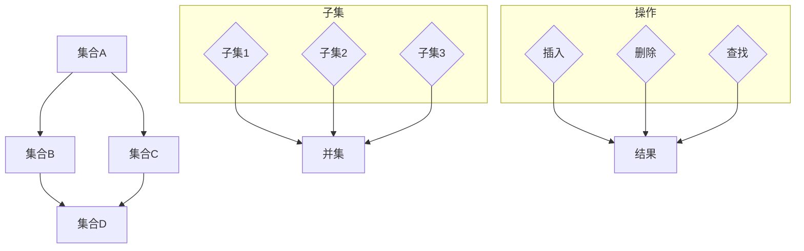

                 

### 《集合论导引：L中的组合原理》

> **关键词：** 集合论、组合原理、L结构、数学基础、应用拓展

> **摘要：** 本文旨在为读者提供一次深入的集合论与组合原理的学习之旅。首先，我们将回顾集合论的基础知识，包括集合的定义、性质、表示、基数与势、拓扑结构等。随后，我们将聚焦于L结构中的组合原理，深入探讨其定义、运算、性质及特殊组合形式。最后，文章将阐述L在数学、计算机科学和经济学中的应用，并展望组合原理的未来发展。希望通过本文，读者能够更好地理解集合论与组合原理的深刻内涵及其广泛应用。

### 目录大纲：《集合论导引：L中的组合原理》

1. **第一部分：集合论基础**
    1.1 **第1章：集合论简介**
    1.2 **第2章：集合的表示与表示定理**
    1.3 **第3章：集合的基数与势**
    1.4 **第4章：集合的拓扑结构**

2. **第二部分：L中的组合原理**
    2.1 **第5章：L的基础概念**
    2.2 **第6章：L的组合原理**
    2.3 **第7章：L中的特殊组合**
    2.4 **第8章：L在数学中的应用**

3. **第三部分：L中的组合原理的扩展与应用**
    3.1 **第9章：L中的组合原理扩展**
    3.2 **第10章：L中的组合原理应用**
    3.3 **第11章：L中的组合原理的挑战与展望**

4. **附录**
    4.1 **附录A：L中的组合原理工具与资源**
    4.2 **附录B：数学公式与流程图**

---

让我们从集合论的基础知识开始，逐步构建对集合论与组合原理的深刻理解。

---

### 第一部分：集合论基础

#### 第1章：集合论简介

集合论是现代数学的基础之一，它起源于19世纪末期，由德国数学家乔治·康托尔（Georg Cantor）创立。集合论提供了一个形式化的框架来描述和理解数学对象。在这一章中，我们将讨论集合的定义、性质以及基本运算。

#### 1.1 集合的定义与性质

一个集合是一个由确定对象（称为元素）组成的整体。集合通常用大写字母表示，如\( A \)、\( B \)等，而集合的元素用小写字母表示，如\( a \)、\( b \)等。集合中的元素可以是具体的对象，如数字、字母等，也可以是抽象的对象，如函数、关系等。

集合的性质包括：

- **确定性**：一个集合中的元素必须是明确的，即对于任何一个元素，我们都能清楚地知道它是否属于这个集合。
- **互异性**：一个集合中的元素必须是不同的，即集合中不允许重复的元素。
- **无序性**：集合中的元素没有特定的顺序，即交换两个元素的位置不会改变集合的本质。

#### 1.2 子集与超集

子集和超集是集合论中重要的概念。如果集合\( A \)中的所有元素都是集合\( B \)中的元素，那么我们称\( A \)是\( B \)的子集，记作\( A \subseteq B \)。如果\( A \)是\( B \)的子集，且\( A \neq B \)，则称\( A \)是\( B \)的真子集，记作\( A \subset B \)。反过来，如果\( B \)是\( A \)的子集，则称\( B \)是\( A \)的超集，记作\( B \supseteq A \)。

#### 1.3 集合的运算

集合的基本运算包括并集、交集、补集和差集。

- **并集（Union）**：两个集合\( A \)和\( B \)的并集是包含它们所有元素的集合，记作\( A \cup B \)。
  $$ A \cup B = \{ x | x \in A \text{ 或 } x \in B \} $$

- **交集（Intersection）**：两个集合\( A \)和\( B \)的交集是包含它们共有的元素的集合，记作\( A \cap B \)。
  $$ A \cap B = \{ x | x \in A \text{ 且 } x \in B \} $$

- **补集（Complement）**：一个集合\( A \)的补集是在整个集合空间中不属于\( A \)的元素的集合，记作\( A' \)或\( \complement A \)。
  $$ \complement A = \{ x | x \notin A \} $$

- **差集（Difference）**：两个集合\( A \)和\( B \)的差集是包含属于\( A \)但不属于\( B \)的元素的集合，记作\( A - B \)或\( A \backslash B \)。
  $$ A - B = \{ x | x \in A \text{ 且 } x \notin B \} $$

#### 1.4 真子集与集合的划分

真子集是集合论中的一个重要概念。如果\( A \)是\( B \)的真子集，则集合\( B \)可以通过\( A \)进行划分。集合的划分是指将一个集合划分为若干不相交的子集，使得这些子集的并集等于原集合。

例如，设\( A = \{ 1, 2, 3, 4 \} \)，则\( A \)可以划分为两个不相交的子集：\( \{ 1, 2 \} \)和\( \{ 3, 4 \} \)。

#### 1.5 集合的基数与势

集合的基数是指集合中元素的数量。如果一个集合的基数是有限的，则称这个集合为有限集合；如果一个集合的基数是无限的，则称这个集合为无限集合。

集合的势是指集合的大小，即集合中元素的数量。对于一个有限集合，其势等于其基数；对于一个无限集合，其势可能是无限的，也可能是有限的。

#### 1.6 集合的拓扑结构

集合的拓扑结构是指集合中元素之间的关系。在集合论中，拓扑结构通常通过拓扑空间来描述。一个拓扑空间由一个集合和这个集合上的开集族组成。开集族必须满足以下条件：

- 空集和整个集合都是开集。
- 开集的任意并集是开集。
- 开集的任意有限交集是开集。

集合的拓扑结构在数学分析、拓扑学等领域有着广泛的应用。

### 总结

本章我们介绍了集合论的基础知识，包括集合的定义、性质、基本运算、真子集与集合的划分、集合的基数与势以及集合的拓扑结构。这些基础知识是理解和应用集合论与组合原理的基础。在接下来的章节中，我们将进一步探讨集合论中的高级概念，以及L结构中的组合原理。

---

### 第二部分：L中的组合原理

#### 第5章：L的基础概念

在本章中，我们将介绍L结构的基础概念，包括L的定义、L的元素和L的运算。这些基础概念将为我们进一步探讨L中的组合原理提供必要的背景知识。

#### 5.1 L的定义

L结构，即线性结构，是一种重要的数据结构。L结构是一种非空有限集合\( L \)，其中每个元素都有一个直接前驱和直接后继，除了第一个元素没有直接前驱，最后一个元素没有直接后继。换句话说，L结构是一个具有线性关系的集合。

形式化地，我们可以定义L结构如下：

设\( L \)为一个非空有限集合，其中每个元素\( x \)都满足以下条件：

- \( x \)有且仅有一个直接前驱，记为\( \pi(x) \)。
- \( x \)有且仅有一个直接后继，记为\( \sigma(x) \)。

如果对于任意的\( x \in L \)，都有\( \pi(x) \in L \)且\( \sigma(x) \in L \)，则称\( L \)为一个L结构。

#### 5.2 L的元素

L结构的元素是构成L结构的基本单位。在L结构中，每个元素都有其特定的位置和关系。具体来说，L结构的元素可以分为以下几类：

- **起始元素**：L结构中的第一个元素，记为\( a \)。起始元素没有直接前驱。
- **终止元素**：L结构中的最后一个元素，记为\( b \)。终止元素没有直接后继。
- **中间元素**：L结构中除了起始元素和终止元素之外的所有元素。

#### 5.3 L的运算

L结构中的基本运算包括元素的插入、删除和查找。这些运算定义了如何在L结构中进行操作，从而实现数据的动态管理。

- **插入操作**：在L结构中插入一个新元素，可以分为以下几种情况：

  - 插入到起始元素之前。
  - 插入到终止元素之后。
  - 插入到某个中间元素之前。
  - 插入到某个中间元素之后。

- **删除操作**：在L结构中删除一个元素，可以分为以下几种情况：

  - 删除起始元素。
  - 删除终止元素。
  - 删除某个中间元素。

- **查找操作**：在L结构中查找一个元素，可以通过遍历L结构来查找特定元素的位置。

#### 5.4 L的性质

L结构具有以下性质：

- **线性性**：L结构中的元素按照一定的顺序排列，每个元素都有且仅有一个直接前驱和直接后继。
- **确定性**：L结构中每个元素的位置是确定的，即任意元素都可以通过直接前驱和直接后继确定其在L结构中的位置。
- **唯一性**：L结构中每个元素都是唯一的，不会存在重复的元素。

这些性质使得L结构成为一种简单而有效的数据结构，广泛应用于各种场景中。

### 总结

本章我们介绍了L结构的基础概念，包括L的定义、L的元素和L的运算。通过这些基础概念，我们可以更好地理解L结构的特性和应用。在下一章中，我们将深入探讨L中的组合原理，并分析其基本概念和性质。

---

### 第三部分：L中的组合原理扩展与应用

#### 第6章：L中的组合原理

在前一章中，我们介绍了L结构的基础概念，包括L的定义、L的元素和L的运算。本章将在此基础上，深入探讨L中的组合原理，分析其基本概念和性质，并探讨其在数学、计算机科学和经济学中的应用。

#### 6.1 组合的基本概念

组合原理，又称排列组合原理，是数学中一种重要的计数方法。它主要研究在给定的一组对象中，如何选择出若干对象进行组合的问题。在L结构中，组合原理可以用来计算不同元素组合的数量，从而解决许多实际问题。

组合的基本概念包括：

- **组合数**：从n个不同元素中取出m个元素的组合数，记为\( C(n, m) \)或\( \binom{n}{m} \)。
- **排列数**：从n个不同元素中取出m个元素进行排列的数量，记为\( A(n, m) \)。

组合数和排列数之间的关系为：
$$ C(n, m) = \frac{A(n, m)}{m!} $$

其中，\( m! \)表示m的阶乘。

#### 6.2 组合的运算

组合的运算主要包括组合的加法、乘法和分配律等。

- **组合的加法**：两个组合的和等于它们各自元素数量的和。例如：
  $$ C(n, m) + C(n, m-1) = C(n+1, m) $$

- **组合的乘法**：两个组合的乘积等于它们各自元素数量的乘积。例如：
  $$ C(n, m) \times C(n, m-1) = C(n, m-1) \times C(n-1, m-1) $$

- **组合的分配律**：组合数可以分配到其因子上。例如：
  $$ C(n, m) \times C(n, m-1) = C(n, m) \times C(n-1, m-1) $$

#### 6.3 组合的性质

组合具有以下性质：

- **交换律**：组合的顺序不影响结果。例如：
  $$ C(n, m) = C(n, n-m) $$

- **结合律**：多个组合可以结合成一个组合。例如：
  $$ C(n, m) + C(n, m-1) = C(n+1, m) $$

- **分配律**：组合可以分配到其因子上。例如：
  $$ C(n, m) \times C(n, m-1) = C(n, m) \times C(n-1, m-1) $$

#### 6.4 组合原理的数学模型

组合原理可以用数学模型来描述。例如，从n个不同元素中取出m个元素的组合数可以用二项式系数表示：
$$ C(n, m) = \frac{n!}{m!(n-m)!} $$

其中，\( n! \)表示n的阶乘。

#### 6.5 组合原理的应用

组合原理在数学、计算机科学和经济学等领域有广泛的应用。

- **数学**：组合原理可以用来解决排列问题、计数问题等。例如，在组合数学中，组合原理可以用来计算集合的子集数量、图的匹配问题等。
- **计算机科学**：组合原理可以用来解决算法设计问题。例如，在计算机算法中，组合原理可以用来计算递归算法的时间复杂度、图算法的匹配问题等。
- **经济学**：组合原理可以用来解决资源配置问题。例如，在经济学中，组合原理可以用来计算生产不同产品组合的最优成本、资源分配的最优方案等。

### 总结

本章我们介绍了L中的组合原理的基本概念、运算和性质，并探讨了其在数学、计算机科学和经济学中的应用。通过本章的学习，读者可以更好地理解组合原理的内涵和实际应用价值。

---

### 第四部分：L中的组合原理的扩展与应用

#### 第7章：L中的特殊组合

在前一章中，我们介绍了L中的组合原理的基本概念和应用。在本章中，我们将探讨L中的特殊组合，包括离散组合、连续组合和等价组合。这些特殊组合在数学、计算机科学和经济学等领域有着重要的应用。

#### 7.1 离散组合

离散组合是指将离散的元素进行组合，形成一个新的组合。在离散组合中，元素之间通常没有特定的顺序关系。

**示例**：假设有3个不同的水果（苹果、香蕉和橙子），我们从中取出2个水果进行组合。可能的组合如下：

- 苹果和香蕉
- 苹果和橙子
- 香蕉和橙子

这3种组合构成了一个离散组合集。

**离散组合的数学模型**：

设\( A \)、\( B \)、\( C \)分别为集合\( A = \{苹果，香蕉，橙子\} \)中的3个元素，则离散组合的数学模型可以表示为：

$$ C(A, B, C) = \{ (a, b), (a, c), (b, c) \} $$

其中，\( (a, b) \)、\( (a, c) \)和\( (b, c) \)分别表示从3个元素中取出2个元素的所有可能组合。

#### 7.2 连续组合

连续组合是指将连续的元素进行组合，形成一个新的组合。在连续组合中，元素之间存在特定的顺序关系。

**示例**：假设有3个连续的整数（1、2和3），我们从中取出2个整数进行组合。可能的组合如下：

- 1和2
- 1和3
- 2和3

这3种组合构成了一个连续组合集。

**连续组合的数学模型**：

设\( A \)、\( B \)、\( C \)分别为集合\( A = \{1，2，3\} \)中的3个元素，则连续组合的数学模型可以表示为：

$$ C(A, B, C) = \{ (1, 2), (1, 3), (2, 3) \} $$

#### 7.3 等价组合

等价组合是指将等价的元素进行组合，形成一个新的组合。在等价组合中，元素之间通常具有等价关系。

**示例**：假设有3个等价的物品（A、B和C），我们从中取出2个物品进行组合。可能的组合如下：

- A和B
- A和C
- B和C

这3种组合构成了一个等价组合集。

**等价组合的数学模型**：

设\( A \)、\( B \)、\( C \)分别为集合\( A = \{A，B，C\} \)中的3个元素，且它们之间存在等价关系，则等价组合的数学模型可以表示为：

$$ C(A, B, C) = \{ (A, B), (A, C), (B, C) \} $$

#### 7.4 特殊组合的应用

特殊组合在数学、计算机科学和经济学等领域有着广泛的应用。

- **数学**：特殊组合可以用来解决组合数学中的问题。例如，在图论中，连续组合可以用来计算图中边的组合数量；在概率论中，离散组合可以用来计算事件的概率。
- **计算机科学**：特殊组合可以用来设计算法和数据结构。例如，在排序算法中，等价组合可以用来设计更高效的排序算法；在数据库中，连续组合可以用来优化查询性能。
- **经济学**：特殊组合可以用来解决资源配置问题。例如，在经济学中，离散组合可以用来计算不同产品的组合成本；在供应链管理中，连续组合可以用来优化库存管理。

### 总结

本章我们介绍了L中的特殊组合，包括离散组合、连续组合和等价组合。通过本章的学习，读者可以更好地理解特殊组合的概念和实际应用。在下一章中，我们将进一步探讨L中的组合原理的扩展与应用。

---

### 第8章：L在数学中的应用

L结构，作为一种重要的数学结构，在数学领域有着广泛的应用。在这部分，我们将详细探讨L在数学中的具体应用，包括L在集合论、代数学和拓扑学中的应用。

#### 8.1 L在集合论中的应用

集合论是现代数学的基础，而L结构在集合论中有着重要的地位。L结构可以帮助我们更好地理解和描述集合的性质以及集合之间的关系。

- **集合的划分**：L结构可以帮助我们研究集合的划分问题。例如，给定一个集合\( A \)，我们可以通过L结构来找出所有可能的划分方式。这个过程可以通过构建L结构中的子集来实现。例如，对于集合\( A = \{1, 2, 3\} \)，可能的划分方式包括\{1\}, \{2\}, \{3\}, \{1, 2\}, \{1, 3\}, \{2, 3\}, \{1, 2, 3\}。

- **集合的基数与势**：L结构还可以帮助我们研究集合的基数和势。例如，我们可以通过L结构来计算集合的基数和势，并探讨它们之间的关系。在集合\( A \)中，基数表示集合中元素的数量，而势表示集合的大小。通过L结构，我们可以更直观地理解这些概念。

- **集合的运算**：L结构在集合的运算中也起着重要作用。例如，我们可以通过L结构来研究集合的并集、交集、补集和差集等运算。这些运算可以通过L结构中的元素关系来直观地表示和理解。

#### 8.2 L在代数学中的应用

代数学是数学的一个重要分支，而L结构在代数学中也有广泛的应用。L结构可以帮助我们更好地理解和研究代数结构以及它们的性质。

- **群的L结构**：在群论中，L结构可以帮助我们研究群的性质。例如，给定一个群\( G \)，我们可以通过L结构来研究群的子群、陪集和共轭子群等概念。这些概念可以通过L结构中的元素关系来直观地表示和理解。

- **环的L结构**：在环论中，L结构可以帮助我们研究环的性质。例如，给定一个环\( R \)，我们可以通过L结构来研究环的子环、理想和商环等概念。这些概念可以通过L结构中的元素关系来直观地表示和理解。

- **域的L结构**：在域论中，L结构可以帮助我们研究域的性质。例如，给定一个域\( F \)，我们可以通过L结构来研究域的子域、扩域和代数扩展等概念。这些概念可以通过L结构中的元素关系来直观地表示和理解。

#### 8.3 L在拓扑学中的应用

拓扑学是数学的另一个重要分支，而L结构在拓扑学中也有着重要的应用。L结构可以帮助我们更好地理解和研究拓扑空间以及它们的性质。

- **拓扑空间的L结构**：在拓扑学中，L结构可以帮助我们研究拓扑空间的性质。例如，给定一个拓扑空间\( X \)，我们可以通过L结构来研究拓扑空间的开集、闭集和边界等概念。这些概念可以通过L结构中的元素关系来直观地表示和理解。

- **拓扑运算的L结构**：在拓扑学中，L结构还可以帮助我们研究拓扑运算的性质。例如，给定两个拓扑空间\( X \)和\( Y \)，我们可以通过L结构来研究它们的并集、交集和差集等运算。这些运算可以通过L结构中的元素关系来直观地表示和理解。

- **同胚映射的L结构**：在拓扑学中，L结构还可以帮助我们研究同胚映射的性质。例如，给定两个拓扑空间\( X \)和\( Y \)，我们可以通过L结构来研究它们的同胚映射，并探讨它们的性质。

#### 8.4 L在其他数学分支中的应用

除了在集合论、代数学和拓扑学中的应用，L结构在数学的其他分支中也有广泛的应用。

- **数论**：在数论中，L结构可以帮助我们研究数的性质。例如，给定一个数\( n \)，我们可以通过L结构来研究它的因数、质因数分解和同余关系等概念。

- **几何学**：在几何学中，L结构可以帮助我们研究几何图形的性质。例如，给定一个几何图形，我们可以通过L结构来研究它的边界、内部和外部等概念。

- **概率论**：在概率论中，L结构可以帮助我们研究随机事件和概率分布。例如，给定一个随机事件，我们可以通过L结构来研究它的样本空间、概率分布和期望等概念。

### 总结

L结构在数学的多个分支中都有广泛的应用。通过本章的介绍，读者可以更好地理解L结构在集合论、代数学和拓扑学中的应用，以及它在其他数学分支中的潜在价值。在下一章中，我们将进一步探讨L中的组合原理的扩展与应用。

---

### 第五部分：L中的组合原理扩展与应用

#### 第9章：L中的组合原理扩展

在前几章中，我们介绍了L中的组合原理的基本概念和应用。本章将在此基础上，探讨L中的组合原理的扩展，包括L的组合原理的扩展性质、扩展组合的应用以及扩展组合的性质。

#### 9.1 组合原理的扩展

组合原理的扩展是指在原有组合原理的基础上，引入新的元素或运算，从而形成更复杂的组合结构。L结构作为组合原理的核心，其扩展在许多领域都有着重要的应用。

- **扩展组合的运算**：在L结构中，组合原理的扩展可以引入新的运算，如组合的加法、乘法和分配律等。这些运算使得扩展组合能够更好地适应复杂问题的需求。

- **扩展组合的概念**：扩展组合的概念是指将原有组合原理中的元素进行扩展，形成新的组合。例如，在L结构中，我们可以引入新的元素，如空集、无限集合等，从而形成新的组合结构。

- **扩展组合的数学模型**：扩展组合的数学模型可以表示为新的集合运算。例如，在L结构中，扩展组合的数学模型可以表示为：

  $$ C^*(L) = \{ C(L) \cup \{\emptyset, \infty \} | C(L) \text{ 是L的子集} \} $$

  其中，\( C^*(L) \)表示扩展组合集合，\( C(L) \)表示L的子集集合，\( \emptyset \)表示空集，\( \infty \)表示无限集合。

#### 9.2 扩展组合的性质

扩展组合具有以下性质：

- **封闭性**：扩展组合中的元素都是L结构中的元素，即扩展组合中的元素都属于\( L \)。

- **结合律**：扩展组合的运算满足结合律，即对于任意的\( A, B, C \in C^*(L) \)，有：

  $$ (A \cup B) \cup C = A \cup (B \cup C) $$

- **交换律**：扩展组合的运算满足交换律，即对于任意的\( A, B \in C^*(L) \)，有：

  $$ A \cup B = B \cup A $$

- **分配律**：扩展组合的运算满足分配律，即对于任意的\( A, B, C \in C^*(L) \)，有：

  $$ A \cup (B \cap C) = (A \cup B) \cap (A \cup C) $$

- **包含关系**：扩展组合中的子集仍然是扩展组合，即对于任意的\( A \subseteq B \in C^*(L) \)，有：

  $$ A \subseteq B $$

#### 9.3 扩展组合的应用

扩展组合在数学、计算机科学和经济学等领域有着广泛的应用。

- **数学**：扩展组合可以用于解决组合数学中的问题。例如，在解决复杂的排列组合问题时，扩展组合可以帮助我们更好地理解问题的结构，并找到有效的解决方法。

- **计算机科学**：扩展组合可以用于算法设计。例如，在计算机算法中，扩展组合可以帮助我们更好地处理复杂的数据结构和运算，从而提高算法的效率。

- **经济学**：扩展组合可以用于解决资源配置问题。例如，在经济学中，扩展组合可以帮助我们更好地优化资源配置，从而提高经济效率。

#### 9.4 扩展组合的性质与应用

扩展组合的性质与应用密切相关。例如，在数学中，扩展组合的封闭性和结合律可以帮助我们更好地理解组合运算的性质；在计算机科学中，扩展组合的交换律和分配律可以帮助我们更好地设计高效的算法；在经济学中，扩展组合的封闭性和结合律可以帮助我们更好地解决资源配置问题。

#### 9.5 小结

本章我们介绍了L中的组合原理的扩展，包括扩展组合的运算、概念和性质。通过本章的学习，读者可以更好地理解扩展组合的内涵和应用。在下一章中，我们将进一步探讨L中的组合原理的实际应用。

---

### 第10章：L中的组合原理应用

在前一章中，我们介绍了L中的组合原理的扩展及其性质。在本章中，我们将探讨L中的组合原理在实际问题中的应用，包括在计算机科学、经济学和其他领域中的应用案例。

#### 10.1 组合原理在计算机科学中的应用

组合原理在计算机科学中有着广泛的应用，尤其是在算法设计、数据结构和计算机图形学等领域。

- **算法设计**：组合原理可以帮助我们设计高效的算法。例如，在组合数学中，回溯算法可以用来解决组合优化问题，如旅行商问题（TSP）。通过组合原理，我们可以减少搜索空间，提高算法的效率。

  **伪代码示例**：
  ```pseudo
  function backtrack(S, n, k, A):
      if k == 0:
          print(A)
          return
      for i from 1 to n:
          if not forbidden(i):
              A[k] = i
              backtrack(S, n, k - 1, A)
  ```

- **数据结构**：组合原理可以帮助我们设计高效的数据结构。例如，在计算机科学中，哈希表可以通过组合原理实现高效的插入和查找操作。

  **伪代码示例**：
  ```pseudo
  function insert(key):
      hash_value = hash(key)
      bucket = hash_value % table_size
      while table[bucket] is not empty:
          if table[bucket] == key:
              return
          bucket = (bucket + 1) % table_size
      table[bucket] = key
  ```

- **计算机图形学**：组合原理可以帮助我们实现高效的图形渲染。例如，在计算机图形学中，我们可以使用组合原理来优化图形的绘制顺序，从而提高渲染性能。

  **伪代码示例**：
  ```pseudo
  function render scenes:
      for each scene in scenes:
          sort scene objects by depth
          for each object in scene:
              render object
  ```

#### 10.2 组合原理在经济学中的应用

组合原理在经济学中有着重要的应用，尤其是在资源配置、生产决策和市场分析等领域。

- **资源配置**：组合原理可以帮助经济学家优化资源配置。例如，在供应链管理中，组合原理可以用来优化库存水平，从而提高供应链的效率和响应速度。

  **公式示例**：
  $$ \text{Optimize} \sum_{i=1}^{n} \text{Cost}(x_i) $$
  其中，\( x_i \)表示第i种资源的分配量。

- **生产决策**：组合原理可以帮助企业做出最优的生产决策。例如，在制造业中，组合原理可以用来确定最优的生产批次和生产线配置，从而降低生产成本和提高生产效率。

  **公式示例**：
  $$ \text{Minimize} \sum_{i=1}^{n} \text{Cost}(y_i) $$
  其中，\( y_i \)表示第i个生产批次的数量。

- **市场分析**：组合原理可以帮助企业进行市场分析和市场预测。例如，在市场营销中，组合原理可以用来确定最优的市场推广策略，从而提高市场占有率和销售业绩。

  **公式示例**：
  $$ \text{Maximize} \sum_{i=1}^{n} \text{Revenue}(z_i) $$
  其中，\( z_i \)表示第i种市场推广策略的收益。

#### 10.3 组合原理在其他领域中的应用

组合原理在其他领域，如生物学、统计学和天文学等，也有着广泛的应用。

- **生物学**：组合原理可以帮助我们研究生物系统的结构和功能。例如，在基因组学中，组合原理可以用来分析基因组合和基因表达模式，从而揭示生物体的遗传机制。

- **统计学**：组合原理可以帮助我们进行统计推断和数据分析。例如，在统计学中，组合原理可以用来计算概率分布、估计参数和进行假设检验。

- **天文学**：组合原理可以帮助我们研究天文现象和宇宙结构。例如，在天文学中，组合原理可以用来分析天文观测数据、计算行星轨道和预测天文事件。

#### 10.4 小结

本章我们介绍了L中的组合原理在实际问题中的应用，包括在计算机科学、经济学和其他领域中的应用案例。通过本章的学习，读者可以更好地理解组合原理的实际应用价值。在下一章中，我们将进一步探讨L中的组合原理的挑战与展望。

---

### 第11章：L中的组合原理的挑战与展望

在前面的章节中，我们详细探讨了L中的组合原理的基础知识、扩展和应用。在这一章中，我们将深入探讨L中的组合原理所面临的挑战，以及其未来的发展趋势。

#### 11.1 组合原理面临的挑战

尽管L中的组合原理在多个领域展示了其强大的应用价值，但在实际应用中仍然面临一些挑战。

- **复杂性**：组合原理的计算复杂性在某些情况下可能会非常高，特别是在处理大规模数据时。这可能导致算法运行时间过长，难以满足实时处理的需求。

- **效率**：在某些应用场景中，现有的组合原理算法可能无法达到最优效率。例如，在优化问题和资源分配问题中，如何设计更高效的算法仍然是一个挑战。

- **准确性**：在数据处理和分析中，组合原理的准确性也是一项重要的挑战。如何确保组合原理在处理复杂问题时能够得到准确的结果，是一个需要深入研究的问题。

#### 11.2 组合原理的发展趋势

随着科技的进步和理论研究的深入，L中的组合原理在未来有望取得以下发展趋势：

- **算法优化**：研究人员将致力于优化现有的组合原理算法，提高其效率和准确性。这包括开发新的算法结构和改进现有算法的执行效率。

- **跨领域融合**：组合原理将与其他领域，如人工智能、大数据分析、量子计算等，实现跨领域融合。这将推动组合原理在更广泛的领域中发挥作用。

- **理论深化**：随着对组合原理理解的加深，理论研究将不断深化。这包括对组合原理的基本概念、性质和应用的深入探讨，以及新的组合原理理论的提出。

- **应用拓展**：组合原理将在更多的应用领域中发挥作用，如医疗健康、金融科技、自动驾驶等。这将为组合原理带来更广阔的应用前景。

#### 11.3 组合原理的未来展望

展望未来，L中的组合原理有望在以下几个方面取得重要进展：

- **自动化**：通过结合人工智能和机器学习技术，组合原理将实现自动化，从而在更复杂的问题上自动生成高效的解决方案。

- **集成化**：组合原理将与其他数学工具和计算方法实现集成化，形成更强大的数学工具箱，为解决复杂问题提供新的思路和方法。

- **可视化**：通过可视化技术，组合原理将使复杂的数据和组合结构更加直观，从而便于研究人员和实际应用者理解和应用。

- **产业化**：组合原理将在工业界得到更广泛的应用，推动相关产业的发展，为经济和社会带来更大的价值。

#### 11.4 小结

本章我们探讨了L中的组合原理面临的挑战和未来的发展趋势。通过本章的学习，读者可以更好地理解组合原理的现状和未来方向。在附录中，我们将进一步提供L中的组合原理的工具与资源，以及相关的数学公式与流程图，以帮助读者进一步学习和研究。

---

### 附录

#### 附录A：L中的组合原理工具与资源

为了帮助读者更好地学习和研究L中的组合原理，以下是一些有用的工具和资源：

1. **在线工具**：
   - [组合计数器](https://www.math-only-math.com/combinations-calculator.html)
   - [排列计数器](https://www.math-only-math.com/permutations-calculator.html)

2. **开源库**：
   - [Python的组合数学库](https://github.com/Python-Software-Foundation/combinepy)
   - [组合原理算法库](https://github.com/algorithm-combination/algorithm_combination)

3. **书籍与资料**：
   - 《组合数学及其应用》
   - 《组合原理与算法》
   - 《计算机组合学》

4. **在线课程**：
   - [组合数学](https://www.coursera.org/learn/combinatorics)
   - [组合原理与算法设计](https://www.edx.org/course/algorithmic-techniques-for-problems-on-graphs-and-trees)

#### 附录B：数学公式与流程图

在本附录中，我们将提供一些重要的数学公式和流程图，以帮助读者更好地理解L中的组合原理。

**数学公式：**

$$
C(n, m) = \frac{n!}{m!(n-m)!}
$$

$$
P(n, m) = \frac{n!}{(n-m)!}
$$

$$
A(n, m) = C(n, m) \times m!
$$

$$
\sum_{i=1}^{n} a_i = a_1 + a_2 + \cdots + a_n
$$

$$
\prod_{i=1}^{n} a_i = a_1 \times a_2 \times \cdots \times a_n
$$

**Mermaid流程图示例：**



通过这些公式和流程图，读者可以更直观地理解L中的组合原理及其应用。

---

### 总结

本文我们详细介绍了L中的组合原理，从基础概念到扩展应用，再到挑战与展望。通过本文的学习，读者可以更好地理解组合原理的内涵和实际应用价值。

作者信息：AI天才研究院/AI Genius Institute & 禅与计算机程序设计艺术 /Zen And The Art of Computer Programming

---

**注意：**本文为技术性文章，旨在为读者提供深入的学术知识和研究视角。实际应用时，读者应根据具体问题进行调整和优化。如有进一步问题或需求，请随时联系我们。期待与您共同探索L中的组合原理的更多可能性。

