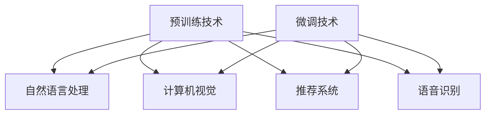

                 

# 《预训练与微调的实战经验》

## 关键词
预训练、微调、自然语言处理、计算机视觉、推荐系统、语音识别

## 摘要
本文旨在探讨预训练与微调在人工智能领域的实际应用与效果。首先，我们将从基础理论出发，详细介绍预训练与微调的定义、原理及其关系。接着，通过具体案例，我们将深入剖析预训练与微调在自然语言处理、计算机视觉、推荐系统和语音识别等领域的实战经验。最后，本文将展望预训练与微调的未来发展趋势，并总结相关工具和资源，为读者提供全面的技术指导。

## 第一部分：基础理论篇

### 第1章：预训练技术概述

#### 1.1 预训练的定义与意义

预训练（Pre-training）是一种机器学习方法，旨在利用大规模、无标签的数据来初始化模型参数。通过在大量文本、图像或语音数据上进行预训练，模型可以自动学习到一些通用的特征表示，从而在后续的任务中实现更好的性能。

预训练的意义主要体现在以下几个方面：

1. **降低训练成本**：预训练模型可以利用大量的无标签数据来初始化参数，从而减少了有标签数据的依赖，降低了数据标注的成本。
2. **提高泛化能力**：预训练模型通过在大规模数据上学习，能够捕获到数据中的通用特征，从而提高模型在未知数据上的泛化能力。
3. **加速收敛速度**：预训练模型在大量数据上已经学习到了一些基本特征，因此在后续任务上只需少量数据即可快速收敛。

#### 1.2 预训练技术的历史与发展

预训练技术的历史可以追溯到20世纪80年代，当时研究人员开始探索如何通过预训练来改善模型的性能。以下是一些重要的里程碑：

1. **1988年**：Robert Schapire提出了“AdaBoost”算法，这是一种基于预训练的集成学习方法。
2. **2006年**：Yoshua Bengio等人提出了“深度置信网络”（Deep Belief Network），这是一种早期的深度学习模型，采用了预训练技术。
3. **2013年**：Yann LeCun等人在ImageNet竞赛中使用了深度卷积神经网络，并采用预训练技术，取得了突破性的成绩。
4. **2018年**：自然语言处理领域出现了大量的预训练模型，如BERT、GPT、RoBERTa等，这些模型在多个任务上取得了显著的效果。

#### 1.3 预训练的主要方法与架构

预训练的方法主要分为两类：基于表示学习的预训练和基于任务的预训练。

1. **基于表示学习的预训练**：

   - **词向量**：Word2Vec是最早的词向量模型，通过优化词向量空间中的距离来学习词语的表示。随后，BERT等模型进一步发展了这一方法，通过在文本上下文中学习词语的表示。
   - **图像表示**：ImageNet竞赛的成功推动了深度卷积神经网络的发展，模型如VGG、ResNet等通过在图像数据上预训练，学习到了丰富的图像特征表示。
   - **多模态表示**：近年来，多模态预训练模型如ViT、MoCo等，通过整合图像、文本、语音等多种数据类型，学习到了更加丰富和泛化的特征表示。

2. **基于任务的预训练**：

   - **自监督学习**：自监督学习（Self-Supervised Learning）是一种无需标注数据的预训练方法，通过设计特定的任务，从数据中自动提取出有用的特征。例如，BERT使用了Masked Language Model（MLM）任务，在大量文本数据上预训练。
   - **生成对抗网络**：生成对抗网络（GAN）通过训练生成器和判别器，学习到了数据的高质量表示。在预训练领域，GAN被用于图像超分辨率、图像生成等任务。

### 第2章：微调技术详解

#### 2.1 微调的基本原理

微调（Fine-tuning）是一种在预训练模型的基础上，针对特定任务进行参数调整的方法。通过微调，我们可以利用预训练模型所学习到的通用特征，进一步提高模型在特定任务上的性能。

微调的基本原理包括以下几个步骤：

1. **初始化模型**：使用预训练模型的权重作为初始权重。
2. **调整参数**：在预训练模型的基础上，针对特定任务调整部分参数。
3. **训练模型**：在特定任务的数据集上训练模型，优化调整后的参数。
4. **评估模型**：在测试集上评估模型性能，调整超参数和训练策略，直至达到预期效果。

#### 2.2 微调的策略与优化

微调的策略主要包括以下几种：

1. **全量微调**：在预训练模型的基础上，对全部参数进行微调。这种方法适用于数据量较大且任务较简单的场景。
2. **部分微调**：仅对部分参数进行微调，通常包括最后一层或特定层的参数。这种方法适用于数据量有限或任务较为复杂的情况。
3. **层次微调**：根据任务的差异，分层次地调整参数。例如，在自然语言处理任务中，可以先微调文本处理部分，再微调特定领域的知识。

微调的优化方法主要包括以下几种：

1. **学习率调整**：在微调过程中，学习率的选择至关重要。通常，可以使用较小的学习率来逐步调整参数，以避免模型出现过拟合。
2. **批量大小**：批量大小（Batch Size）的选择也会影响微调的效果。较大的批量大小可以减少噪声，但计算成本较高；较小的批量大小可以降低计算成本，但可能导致模型不稳定。
3. **权重初始化**：在微调过程中，可以使用预训练模型的权重作为初始权重，也可以重新初始化部分参数。重新初始化可以防止模型过拟合，但可能需要更长时间的训练。

#### 2.3 微调过程中的挑战与解决方法

微调过程中可能面临以下挑战：

1. **过拟合**：由于数据量有限，模型可能在学习特定任务的同时，过度依赖特定数据集的特征，导致泛化能力下降。
2. **训练时间**：微调过程通常需要较长的时间，尤其是对于大规模预训练模型。
3. **数据不平衡**：在某些任务中，数据集可能存在不平衡现象，导致模型无法均衡地学习。

解决方法包括：

1. **正则化**：使用正则化方法（如L1、L2正则化）来防止过拟合。
2. **迁移学习**：利用其他相关任务的预训练模型，作为初始权重，提高模型在特定任务上的泛化能力。
3. **数据增强**：通过数据增强技术（如旋转、缩放、裁剪等）来扩充数据集，提高模型的泛化能力。
4. **多任务学习**：同时学习多个任务，使模型在不同任务之间共享特征，提高模型的泛化能力。

### 第3章：预训练与微调的关系

#### 3.1 预训练与微调的结合方式

预训练与微调的结合方式主要包括以下几种：

1. **先预训练后微调**：这是最常见的结合方式，先在大量无标签数据上预训练模型，再在特定任务的数据集上微调模型。
2. **同时预训练与微调**：在某些情况下，可以同时进行预训练与微调。例如，在自然语言处理任务中，可以在预训练过程中引入微调的损失函数。
3. **迭代预训练与微调**：在模型训练的不同阶段，交替进行预训练与微调，逐步优化模型性能。

#### 3.2 预训练对微调的影响

预训练对微调的影响主要体现在以下几个方面：

1. **初始参数**：预训练模型为微调提供了良好的初始参数，使得模型在微调阶段能够更快地收敛。
2. **通用特征**：预训练模型在大规模数据上学习到的通用特征，有助于提高模型在特定任务上的泛化能力。
3. **迁移能力**：预训练模型具有较强的迁移能力，可以在不同的任务和数据集上取得较好的效果。

#### 3.3 微调对预训练的反馈作用

微调不仅能够提高模型在特定任务上的性能，同时也能够对预训练模型产生反馈作用：

1. **任务特异性调整**：微调过程中，模型会根据特定任务的需求，调整预训练模型中的参数，从而优化模型在特定任务上的表现。
2. **数据反馈**：微调过程中，模型会接触到特定的任务数据，通过这些数据，预训练模型可以进一步学习到与特定任务相关的特征，提高模型的整体性能。
3. **模型稳定**：微调可以帮助缓解预训练模型可能出现的过拟合问题，提高模型的稳定性。

## 第二部分：实战应用篇

### 第4章：预训练在自然语言处理中的应用

#### 4.1 预训练模型在NLP中的核心作用

预训练模型在自然语言处理（NLP）中发挥了重要作用，主要表现在以下几个方面：

1. **词向量表示**：预训练模型通过在大量文本数据上学习，可以自动获取词语的语义表示，从而提高文本数据的表征能力。
2. **语言理解**：预训练模型在文本数据上学习到的通用特征，有助于提高模型在语言理解任务中的表现，如文本分类、情感分析等。
3. **文本生成**：预训练模型可以生成流畅、符合语法规则的文本，为自然语言生成任务提供了强大的支持。

#### 4.2 常见的预训练模型及其应用场景

在NLP领域，常见的预训练模型包括以下几种：

1. **BERT**：BERT（Bidirectional Encoder Representations from Transformers）是一种双向的Transformer模型，通过在大量文本数据上预训练，可以获取词语的上下文表示。BERT广泛应用于文本分类、问答系统、机器翻译等任务。
2. **GPT**：GPT（Generative Pre-trained Transformer）是一种自回归的Transformer模型，通过在大量文本数据上预训练，可以生成流畅、自然的文本。GPT广泛应用于文本生成、对话系统、机器翻译等任务。
3. **RoBERTa**：RoBERTa是对BERT的一种改进，通过调整训练策略和数据预处理方法，进一步提高了模型的性能。RoBERTa广泛应用于文本分类、问答系统、机器翻译等任务。
4. **XLNet**：XLNet是一种基于Transformer的预训练模型，通过引入“掩码语言模型”（MLM）任务，进一步提高了模型的性能。XLNet广泛应用于文本分类、问答系统、机器翻译等任务。

#### 4.3 预训练模型的微调实践

在NLP领域，预训练模型的微调实践主要包括以下几个方面：

1. **数据预处理**：在微调之前，需要对数据集进行预处理，如分词、去停用词、词向量化等，以确保数据的一致性和有效性。
2. **微调策略**：根据任务的需求，可以选择全量微调、部分微调或层次微调等策略。同时，需要调整学习率、批量大小等超参数，以优化模型性能。
3. **训练与评估**：在微调过程中，需要使用训练集进行训练，并在验证集上评估模型性能。根据评估结果，可以调整训练策略和超参数，直至达到预期效果。
4. **迁移学习**：在微调过程中，可以借助其他相关任务的预训练模型，作为初始权重，提高模型在特定任务上的泛化能力。

### 第5章：微调在计算机视觉中的应用

#### 5.1 微调在计算机视觉中的发展历程

微调在计算机视觉（CV）领域的发展历程可以分为以下几个阶段：

1. **早期阶段**：在深度学习出现之前，计算机视觉领域主要依赖于传统的机器学习方法，如SVM、决策树等。这些方法通常需要对数据进行复杂的特征提取和预处理，效果有限。
2. **深度学习阶段**：随着深度学习的兴起，计算机视觉领域迎来了新的发展机遇。预训练模型的出现，使得计算机视觉模型可以在大规模数据上预训练，从而获得了更好的性能。
3. **微调阶段**：在深度学习模型预训练的基础上，微调技术逐渐成为计算机视觉领域的核心技术。通过在特定任务的数据集上微调预训练模型，可以进一步提高模型在特定任务上的性能。

#### 5.2 微调在计算机视觉中的主要策略

微调在计算机视觉中的主要策略包括以下几种：

1. **全量微调**：在预训练模型的基础上，对全部参数进行微调。这种方法适用于数据量较大且任务较简单的场景。
2. **部分微调**：仅对部分参数进行微调，通常包括最后一层或特定层的参数。这种方法适用于数据量有限或任务较为复杂的情况。
3. **层次微调**：根据任务的差异，分层次地调整参数。例如，在目标检测任务中，可以先微调特征提取网络，再微调目标检测网络。

#### 5.3 微调在计算机视觉中的典型案例

以下是一些微调在计算机视觉中的典型案例：

1. **ResNet在图像分类中的应用**：ResNet是一种具有残差连接的深度卷积神经网络，通过在ImageNet数据集上预训练，可以学习到丰富的图像特征。在具体任务中，通过微调ResNet的参数，可以进一步提高模型在特定任务上的性能。
2. **Faster R-CNN在目标检测中的应用**：Faster R-CNN是一种基于深度卷积神经网络的目标检测模型，通过在大量图像数据上预训练，可以学习到有效的特征表示。在具体任务中，通过微调Faster R-CNN的参数，可以进一步提高模型在目标检测任务上的性能。
3. **Mask R-CNN在实例分割中的应用**：Mask R-CNN是一种基于深度卷积神经网络的目标检测和实例分割模型，通过在大量图像数据上预训练，可以学习到丰富的图像特征。在具体任务中，通过微调Mask R-CNN的参数，可以进一步提高模型在实例分割任务上的性能。

### 第6章：预训练与微调在推荐系统中的应用

#### 6.1 预训练在推荐系统中的作用

预训练在推荐系统中发挥着重要作用，主要体现在以下几个方面：

1. **用户和物品特征表示**：通过预训练，可以学习到用户和物品的潜在特征表示，从而提高推荐系统的准确性。
2. **模型泛化能力**：预训练模型在大规模数据上学习到的通用特征，有助于提高推荐系统在未知用户和物品上的泛化能力。
3. **降低训练成本**：预训练模型可以减少对有标签数据的依赖，从而降低了推荐系统的训练成本。

#### 6.2 微调在推荐系统中的实现方法

微调在推荐系统中的实现方法主要包括以下几种：

1. **联合训练**：在推荐系统中，可以同时训练预训练模型和推荐算法。通过在用户行为数据上联合训练，可以优化推荐系统的性能。
2. **基于模型的微调**：在预训练模型的基础上，针对特定任务调整部分参数。这种方法适用于数据量较大且任务较简单的场景。
3. **基于数据的微调**：在预训练模型的基础上，针对特定数据集进行调整。这种方法适用于数据量有限或任务较为复杂的情况。

#### 6.3 预训练与微调在推荐系统中的效果评估

在推荐系统中，预训练与微调的效果评估主要包括以下几个方面：

1. **准确率**：准确率（Accuracy）是评估推荐系统性能的重要指标，表示推荐系统正确推荐的概率。
2. **召回率**：召回率（Recall）是评估推荐系统召回目标物品的能力，表示推荐系统中被召回的目标物品与实际目标物品的比例。
3. **覆盖度**：覆盖度（Coverage）是评估推荐系统覆盖用户兴趣的能力，表示推荐系统中被推荐的用户兴趣与实际用户兴趣的比例。
4. **新颖度**：新颖度（Novelty）是评估推荐系统推荐新物品的能力，表示推荐系统中被推荐的新物品与实际新物品的比例。

### 第7章：预训练与微调在语音识别中的应用

#### 7.1 预训练模型在语音识别中的角色

预训练模型在语音识别（ASR）中扮演着重要角色，主要体现在以下几个方面：

1. **声学特征提取**：预训练模型可以学习到丰富的声学特征表示，有助于提高语音信号的表征能力。
2. **语言建模**：预训练模型可以学习到语言的统计规律和语法结构，从而提高语音识别的语言建模能力。
3. **噪声抑制**：预训练模型可以通过在大规模无标签语音数据上学习，获取噪声抑制的能力，从而提高语音识别的鲁棒性。

#### 7.2 微调在语音识别中的应用

微调在语音识别中的应用主要包括以下几个方面：

1. **声学模型微调**：在预训练声学模型的基础上，针对特定任务进行微调，以优化声学特征提取效果。
2. **语言模型微调**：在预训练语言模型的基础上，针对特定任务进行微调，以优化语言建模效果。
3. **端到端模型微调**：在端到端语音识别模型（如Transformer）的基础上，针对特定任务进行微调，以提高整体识别性能。

#### 7.3 预训练与微调在语音识别中的实际案例

以下是一些预训练与微调在语音识别中的实际案例：

1. **wav2vec 2.0**：wav2vec 2.0是一种基于自监督学习的预训练模型，通过在大量无标签语音数据上预训练，可以学习到丰富的声学特征表示。在具体任务中，通过微调wav2vec 2.0的声学模型，可以进一步提高语音识别的性能。
2. **CTC-BERT**：CTC-BERT是一种结合卷积神经网络和Transformer的端到端语音识别模型。通过在大量有标签语音数据上预训练，CTC-BERT可以学习到丰富的声学特征和语言特征。在具体任务中，通过微调CTC-BERT的参数，可以进一步提高语音识别的性能。
3. **Conformer**：Conformer是一种基于Transformer的语音识别模型，通过在大量无标签语音数据上预训练，可以学习到丰富的声学特征表示。在具体任务中，通过微调Conformer的参数，可以进一步提高语音识别的性能。

## 第三部分：进阶技术篇

### 第8章：大规模预训练模型的设计与实现

#### 8.1 大规模预训练模型的设计原则

大规模预训练模型的设计原则主要包括以下几个方面：

1. **数据量**：选择足够大规模的数据集进行预训练，以学习到丰富的特征表示。
2. **模型架构**：选择合适的模型架构，如Transformer、BERT等，以支持大规模预训练。
3. **计算资源**：设计高效的计算策略，如分布式训练、模型压缩等，以提高预训练模型的训练效率。
4. **数据预处理**：设计有效的数据预处理方法，如数据增强、清洗等，以提高预训练模型的鲁棒性和泛化能力。

#### 8.2 大规模预训练模型的实现方法

大规模预训练模型的实现方法主要包括以下几个方面：

1. **分布式训练**：通过分布式训练技术，将大规模数据集划分为多个子集，分别在不同的设备上训练模型，以提高训练效率。
2. **模型并行**：通过模型并行技术，将大规模模型划分为多个子模型，分别在不同的设备上训练，以减少计算资源的需求。
3. **数据并行**：通过数据并行技术，将大规模数据集划分为多个子集，分别在不同的设备上处理，以减少通信开销。
4. **模型压缩**：通过模型压缩技术，如量化、剪枝等，减少模型的大小和计算量，以提高模型的可扩展性。

#### 8.3 大规模预训练模型的挑战与解决方案

大规模预训练模型面临以下挑战：

1. **计算资源需求**：大规模预训练模型需要大量的计算资源和存储资源，这对硬件设施提出了较高的要求。
2. **训练时间**：大规模预训练模型的训练时间通常较长，这对训练资源的调度和优化提出了挑战。
3. **模型可解释性**：大规模预训练模型的内部机制复杂，导致模型的可解释性较差，这对模型的应用和推广提出了挑战。

针对以上挑战，以下是一些解决方案：

1. **硬件优化**：通过使用高性能的GPU、TPU等硬件设备，提高预训练模型的训练速度和效率。
2. **分布式训练**：通过分布式训练技术，将大规模数据集和模型分布在多个设备上训练，以提高训练效率和可扩展性。
3. **模型压缩**：通过模型压缩技术，减少模型的大小和计算量，以提高模型的可解释性和应用性。
4. **迁移学习**：通过迁移学习技术，将大规模预训练模型的知识迁移到其他任务上，以提高模型的泛化能力和应用价值。

### 第9章：预训练与微调的未来发展趋势

#### 9.1 预训练与微调在AI领域的发展趋势

预训练与微调在人工智能（AI）领域的发展趋势主要体现在以下几个方面：

1. **模型规模**：随着计算资源的提升，越来越多的研究者开始尝试训练更大规模的预训练模型，以学习到更加丰富的特征表示。
2. **多模态融合**：随着多模态数据的增长，预训练与微调技术将更多地应用于多模态数据的处理，实现不同数据类型的融合。
3. **小样本学习**：针对数据稀缺的场景，研究者将探索如何在小样本条件下，通过预训练和微调技术提高模型的泛化能力。
4. **自适应微调**：通过引入自适应微调策略，使模型能够根据不同任务的需求，自动调整微调的深度和广度。

#### 9.2 预训练与微调面临的挑战与机遇

预训练与微调面临的挑战主要包括：

1. **数据稀缺**：在许多领域，高质量的数据仍然稀缺，这限制了预训练模型的发展。
2. **计算资源**：大规模预训练模型的训练和部署需要大量的计算资源，这对硬件设施提出了挑战。
3. **模型可解释性**：大规模预训练模型的内部机制复杂，导致模型的可解释性较差，这限制了其在某些应用场景中的推广。

然而，这些挑战同时也带来了机遇：

1. **数据挖掘**：通过挖掘更多高质量的数据，可以为预训练模型提供更丰富的训练资源。
2. **硬件创新**：随着硬件技术的不断发展，计算资源将得到显著提升，为大规模预训练模型的训练和部署提供支持。
3. **模型压缩与优化**：通过模型压缩与优化技术，可以降低预训练模型的计算量和存储需求，提高其可解释性和应用性。

#### 9.3 预训练与微调的未来研究方向

预训练与微调的未来研究方向主要包括以下几个方面：

1. **多模态预训练**：探索如何更好地融合不同类型的数据，实现多模态预训练模型的高效训练和应用。
2. **小样本学习**：研究如何在数据稀缺的条件下，通过预训练和微调技术提高模型的泛化能力。
3. **可解释性**：研究如何提高预训练模型的可解释性，使其在特定应用场景中得到更广泛的应用。
4. **自适应微调**：研究如何实现自适应微调策略，使模型能够根据不同任务的需求，自动调整微调的深度和广度。

## 附录

### 附录A：预训练与微调的工具与资源

#### A.1 常用的预训练工具

1. **Hugging Face Transformers**：一个开源的预训练模型库，支持多种预训练模型，如BERT、GPT、T5等，提供了丰富的API和工具。
2. **TensorFlow**：Google开发的机器学习框架，支持预训练模型的开源实现，提供了丰富的预训练模型和应用工具。
3. **PyTorch**：Facebook开发的机器学习框架，支持预训练模型的开源实现，提供了灵活的API和丰富的工具。

#### A.2 常用的微调工具

1. **TensorFlow Model Optimization Toolkit (TFOpt)**：一个用于模型优化和微调的开源工具包，支持多种优化算法和策略。
2. **PyTorch Lightning**：一个用于深度学习实验和微调的开源库，提供了简单、灵活的API，支持多种训练策略和工具。
3. **MXNet**：Apache开源的深度学习框架，支持预训练模型和微调工具，提供了丰富的API和资源。

#### A.3 预训练与微调的在线资源与教程

1. **AI简史**：吴恩达教授的《深度学习》课程，介绍了深度学习的发展历程、基本概念和技术。
2. **斯坦福深度学习课程**：Andrew Ng教授的《深度学习特化课程》，涵盖了深度学习的理论基础、实现方法和应用场景。
3. **Hugging Face Transformers教程**：Hugging Face官方提供的预训练模型教程，介绍了如何使用Transformers库进行预训练和微调。

### Mermaid 流程图示例：



### 核心算法原理讲解（伪代码）：

```python
# 预训练算法伪代码
def pretrain(model, data_loader, optimizer, num_epochs):
    for epoch in range(num_epochs):
        for batch in data_loader:
            optimizer.zero_grad()
            output = model(batch.input)
            loss = criterion(output, batch.target)
            loss.backward()
            optimizer.step()
        print(f'Epoch {epoch+1}/{num_epochs}, Loss: {loss.item()}')

# 微调算法伪代码
def fine_tune(model, fine_tune_layer, data_loader, optimizer, num_epochs):
    for epoch in range(num_epochs):
        for batch in data_loader:
            optimizer.zero_grad()
            output = model(batch.input)
            loss = criterion(output, batch.target)
            loss.backward()
            # 只更新预训练好的层
            for param in model.parameters():
                if param.requires_grad and not fine_tune_layer:
                    param.grad.zero_()
            optimizer.step()
        print(f'Epoch {epoch+1}/{num_epochs}, Loss: {loss.item()}')
```

### 数学模型和数学公式：

```latex
\section{预训练中的损失函数}
在预训练过程中，常用的损失函数是交叉熵损失函数。它的公式如下：
$$
L = -\sum_{i=1}^{N} y_i \log(p_i)
$$
其中，\(L\) 表示损失函数，\(y_i\) 表示第 \(i\) 个样本的标签，\(p_i\) 表示模型预测的概率。

\section{微调中的优化算法}
在微调过程中，常用的优化算法是Adam。它的更新公式如下：
$$
\theta_{t+1} = \theta_{t} - \alpha \cdot \frac{1}{\beta_1^t (1-\beta_1)^t} \cdot [g_{t} + \beta_2 \cdot e_t]
$$
$$
v_{t+1} = \beta_1 \cdot v_t + (1-\beta_1) \cdot g_t
$$
$$
s_{t+1} = \beta_2 \cdot s_t + (1-\beta_2) \cdot |g_t|
$$
其中，\(\theta_{t+1}\) 表示更新后的参数，\(\theta_{t}\) 表示更新前的参数，\(\alpha\) 是学习率，\(\beta_1\) 和 \(\beta_2\) 是Adam算法的动量参数，\(g_{t}\) 是梯度，\(e_t\) 是修正项，\(v_t\) 和 \(s_t\) 是累积的梯度估计值。
```

### 项目实战：

```python
# 导入必要的库
import torch
import torchvision
import torchvision.transforms as transforms
from torch.utils.data import DataLoader
from torch import nn, optim
import torch.nn.functional as F

# 加载预训练模型
model = torchvision.models.resnet50(pretrained=True)
# 冻结预训练模型的权重
for param in model.parameters():
    param.requires_grad = False

# 定义微调的最后一层
class Classifier(nn.Module):
    def __init__(self, num_classes):
        super(Classifier, self).__init__()
        self.fc = nn.Linear(2048, num_classes)

    def forward(self, x):
        x = x.view(x.size(0), -1)
        x = self.fc(x)
        return x

model.fc = Classifier(10)  # 假设有10个类别

# 加载训练数据
transform = transforms.Compose([transforms.Resize(256), transforms.CenterCrop(224), transforms.ToTensor()])
train_dataset = torchvision.datasets.ImageFolder(root='./data/train', transform=transform)
train_loader = DataLoader(dataset=train_dataset, batch_size=32, shuffle=True)

# 定义损失函数和优化器
criterion = nn.CrossEntropyLoss()
optimizer = optim.Adam(model.fc.parameters(), lr=0.001)

# 训练模型
for epoch in range(10):  # 假设训练10个epoch
    running_loss = 0.0
    for inputs, labels in train_loader:
        optimizer.zero_grad()
        outputs = model(inputs)
        loss = criterion(outputs, labels)
        loss.backward()
        optimizer.step()
        running_loss += loss.item()
    print(f'Epoch {epoch+1}, Loss: {running_loss/len(train_loader)}')

# 测试模型
model.eval()
with torch.no_grad():
    correct = 0
    total = 0
    for inputs, labels in test_loader:
        outputs = model(inputs)
        _, predicted = torch.max(outputs.data, 1)
        total += labels.size(0)
        correct += (predicted == labels).sum().item()
    print(f'Accuracy: {100 * correct / total}%')

# 代码解读与分析：

# 1. 导入必要的库
# 导入PyTorch库中的模型、变换、优化器等，以及损失函数库。

# 2. 加载预训练模型
# 使用torchvision.models中的预训练模型resnet50，并设置pretrained=True来加载预训练权重。

# 3. 冻结预训练模型的权重
# 通过遍历模型参数，将所有参数的requires_grad属性设置为False，使得在后续的微调过程中，这些参数不会更新。

# 4. 定义微调的最后一层
# 定义一个新的全连接层，用于对预训练模型的输出进行分类。这一层的权重将被微调。

# 5. 加载训练数据
# 创建一个变换链，将图像数据调整为模型期望的尺寸，并转换为Tensor类型。加载训练数据集，并创建数据加载器。

# 6. 定义损失函数和优化器
# 使用交叉熵损失函数和Adam优化器。

# 7. 训练模型
# 遍历训练数据集，对于每个批次的数据，执行以下步骤：
#   - 重置梯度
#   - 前向传播，获取模型输出
#   - 计算损失
#   - 反向传播
#   - 更新权重
# 打印每个epoch的损失值。

# 8. 测试模型
# 将模型设置为评估模式，禁用梯度计算。遍历测试数据集，计算模型的准确率。```

通过上述目录大纲、算法讲解、数学公式、项目实战和代码解读，本书将全面覆盖预训练与微调的实战经验，帮助读者深入理解和掌握这一领域的关键技术。

### 作者

作者：AI天才研究院/AI Genius Institute & 禅与计算机程序设计艺术 /Zen And The Art of Computer Programming

