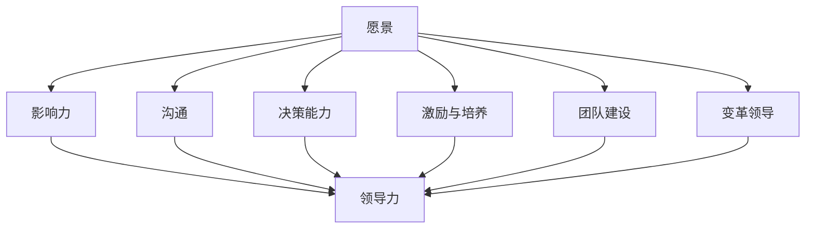

                 

# 领导力与个人品牌：塑造个人影响力

> **关键词**：领导力、个人品牌、影响力、团队管理、自我提升
>
> **摘要**：本文从领导力的基础理论出发，深入探讨了领导力与个人品牌之间的关系，以及如何通过塑造个人品牌来增强个人影响力。文章通过分析不同领导风格、个人品牌建设策略和领导力与个人品牌的融合应用，提供了实用的提升路径和实践指南，旨在帮助读者在职业发展中取得更大成功。

----------------------------------------------------------------

## 第一部分：领导力基础理论

### 1.1. 领导力的定义与核心要素

#### 1.1.1 领导力的本质

领导力，是指个人在团队中引导、激励和协调他人共同实现目标的能力。与传统的管理不同，领导力强调的是领导者与团队成员之间的互动关系，以及如何通过影响和引导来达成共同目标。领导力不仅仅是职位赋予的权力，更多的是一种基于信任和尊重的影响力。

#### 1.1.2 领导力与管理的区别

管理（Management）和领导力（Leadership）虽然密切相关，但二者有本质区别。管理侧重于计划、组织、领导和控制，旨在通过系统和流程来实现组织的效率和目标。而领导力则侧重于影响和激励他人，通过愿景和价值观来引领团队朝着共同的目标前进。


#### 1.1.3 领导力的核心要素

领导力的核心要素包括以下几个方面：

- **愿景**：领导力始于一个清晰的愿景，这个愿景能够激励团队成员，让他们看到未来的发展方向。
- **影响力**：领导力依赖于领导者的影响力，这种影响力来自于领导者的知识、技能和人格魅力。
- **沟通**：有效的沟通是领导力的关键，领导者需要能够清晰表达自己的观点，并倾听和理解团队成员的想法。
- **决策能力**：领导者需要具备快速做出决策的能力，同时能够对决策的后果负责。
- **激励与培养**：领导者需要能够激励团队成员，并为他们提供成长和发展的机会。

### 1.2. 领导风格与团队效能

#### 1.2.1 不同领导风格的特点与应用

领导风格多种多样，常见的包括：

- **权威型领导风格**：领导者对团队成员有较高的控制要求，决策权集中在领导者手中。这种风格适用于紧急情况和需要快速决策的情境。
- **民主型领导风格**：领导者鼓励团队成员参与决策过程，注重团队的合作和共识。这种风格适用于需要创新和团队协作的情境。
- **参与型领导风格**：领导者与团队成员建立良好的沟通和信任关系，鼓励团队成员自主工作。这种风格适用于知识型团队和创新型项目。


#### 1.2.2 领导风格对团队效能的影响

领导风格对团队效能有着重要影响。权威型领导风格能够迅速推动决策和行动，但可能限制了团队成员的创造力。民主型领导风格鼓励团队参与和合作，有利于创新和团队凝聚力，但决策速度可能较慢。参与型领导风格能够增强团队的合作和信任，但需要较高的管理能力和沟通技巧。

#### 1.2.3 领导风格的自我评估与调整

领导者需要定期自我评估，了解自己的领导风格，并适时进行调整。可以使用以下方法进行自我评估：

- **360度反馈**：通过团队成员、上级和同事的反馈来了解自己的领导风格。
- **领导力评估工具**：使用专业的领导力评估工具来评估自己的领导能力和风格。
- **实践反思**：通过实践中的反思和总结来提升自己的领导能力。

### 1.3. 领导力发展的路径

领导力的发展是一个持续的过程，包括以下几个方面：

- **自我提升**：通过学习和实践来提升自己的知识、技能和经验。
- **经验积累**：通过在不同环境和角色中积累经验，提高应对复杂问题的能力。
- **反思与总结**：通过反思和总结自己的领导实践，不断改进和提升。
- **寻求指导**：寻找导师或导师团队，通过他们的经验和指导来提升自己的领导力。

## 第二部分：个人品牌建设

### 2.1. 个人品牌的概念与价值

#### 2.1.1 个人品牌的定义

个人品牌，是指个人在公众心目中的形象和认知，包括个人的价值观、专业能力、声誉和影响力。个人品牌不仅仅是个人的标签，更是个人价值和社会地位的体现。


#### 2.1.2 个人品牌的价值

个人品牌具有重要的价值，包括：

- **影响力**：强大的个人品牌能够增强个人的影响力，使其在行业和社会中更具话语权。
- **职业发展**：良好的个人品牌能够提升个人的职业地位和机会，促进职业发展。
- **商业价值**：个人品牌具有商业价值，能够为个人带来商业机会和收入。

#### 2.1.3 个人品牌与领导力的关联

个人品牌与领导力密切相关。一个强大的个人品牌能够增强领导者的公信力、影响力和吸引力，从而提升领导力。同时，领导力的提升也能够促进个人品牌的建立和增强。

### 2.2. 个人品牌建设策略

#### 2.2.1 个人品牌定位与目标设定

建立个人品牌的第一步是确定个人品牌的定位和目标。个人品牌定位是指确定个人在公众心目中的形象和认知，包括专业领域、价值观和个性特点。目标设定是指明确个人品牌发展的方向和目标，包括短期内和长期内的目标。

#### 2.2.2 个人品牌的核心价值提炼

个人品牌的核心价值是指个人品牌所代表的最核心的价值观和专业能力。提炼个人品牌的核心价值有助于在公众心目中建立清晰的个人形象，并提升个人品牌的认同度。

#### 2.2.3 个人品牌的传播与推广

个人品牌的传播与推广是建立个人品牌的关键环节。有效的传播与推广策略包括：

- **内容创作**：通过撰写技术博客、发表学术论文、出版技术书籍等方式，展示个人的专业能力和见解。
- **社交媒体**：利用社交媒体平台，如LinkedIn、Twitter、GitHub等，发布专业内容，扩大个人影响力。
- **公共演讲**：参加行业会议、研讨会和公开演讲，提升个人品牌的知名度和认可度。
- **合作与交流**：与其他行业领袖和专家建立合作关系，通过共同项目或合作内容来提升个人品牌。

### 2.3. 个人品牌形象管理

#### 2.3.1 个人形象的塑造与维护

个人形象的塑造与维护是个人品牌建设的重要方面。个人形象包括外在形象和内在形象，外在形象包括穿着、言行举止等，内在形象包括价值观、态度和人格特质等。

#### 2.3.2 个人声誉的管理与修复

个人声誉是个人品牌的重要组成部分。良好的声誉能够增强个人品牌的影响力，而不良的声誉则可能对个人品牌造成严重损害。因此，个人需要积极管理自己的声誉，及时修复可能出现的声誉问题。

#### 2.3.3 个人品牌的危机应对

个人品牌可能面临各种危机，如负面舆论、不当言论等。面对危机，个人需要冷静应对，采取有效措施来解决问题，维护个人品牌。

## 第三部分：领导力与个人品牌的融合

### 3.1. 领导力与个人品牌的协同效应

#### 3.1.1 领导力与个人品牌融合的意义

领导力与个人品牌融合具有重要的意义。一方面，领导力的提升能够增强个人品牌的影响力，使个人在团队和社会中更具影响力。另一方面，良好的个人品牌能够提升领导者的公信力、影响力和吸引力，从而提升领导力。

#### 3.1.2 领导力与个人品牌的互动机制

领导力与个人品牌之间存在互动机制。领导力的提升能够促进个人品牌的建设，而良好的个人品牌也能够增强领导力。这种互动机制使得领导力与个人品牌相互促进，共同发展。

#### 3.1.3 领导力与个人品牌的案例分析

以下是一些领导力与个人品牌融合的成功案例：

- **杰克·韦尔奇**：作为通用电气的前CEO，杰克·韦尔奇以其强大的领导力和个人品牌而闻名。他的领导风格、管理理念和成功实践为他赢得了广泛认可，使其在领导力领域具有极高的影响力。
- **玛丽·巴拉**：作为谷歌的首席执行官，玛丽·巴拉以其卓越的领导力和个人品牌而备受瞩目。她通过领导谷歌的转型和创新，使其成为全球最具影响力的科技公司之一。

### 3.2. 领导力与个人品牌的实践应用

#### 3.2.1 领导力在个人品牌建设中的应用

领导力在个人品牌建设中的应用主要体现在以下几个方面：

- **建立愿景**：领导者需要明确个人品牌的愿景，并将其传达给团队成员，激发他们的热情和认同。
- **影响他人**：领导者需要通过影响和激励团队成员，提升个人品牌的认同度和影响力。
- **持续学习**：领导者需要不断学习和提升自己的专业能力，以保持个人品牌的竞争力。

#### 3.2.2 个人品牌在领导力提升中的作用

个人品牌在领导力提升中的作用主要体现在以下几个方面：

- **增强公信力**：良好的个人品牌能够增强领导者的公信力，使其在团队和社会中更具影响力。
- **提升影响力**：强大的个人品牌能够提升领导者的社会地位和影响力，使其在领导过程中更具说服力和领导力。
- **促进职业发展**：良好的个人品牌能够为领导者带来更多的职业机会和发展空间。

#### 3.2.3 领导力与个人品牌融合的实践指南

以下是一些领导力与个人品牌融合的实践指南：

- **明确个人品牌定位**：领导者需要明确自己的个人品牌定位，确定个人品牌的愿景和目标。
- **提升领导力**：领导者需要通过学习和实践来提升自己的领导力，增强个人品牌的影响力。
- **建立良好的人际关系**：领导者需要建立良好的人际关系，通过影响和激励团队成员来提升个人品牌。
- **积极传播个人品牌**：领导者需要积极传播个人品牌，通过内容创作、社交媒体和公共演讲等方式来提升个人品牌的知名度和影响力。

## 第四部分：领导力与个人品牌的提升路径

### 4.1. 领导力自我提升

#### 4.1.1 领导力自我评估工具

领导者可以通过以下工具进行自我评估：

- **360度反馈**：通过团队成员、上级和同事的反馈来评估自己的领导力。
- **领导力评估问卷**：使用专业的领导力评估问卷来评估自己的领导力水平。
- **领导力模型**：参考专业的领导力模型，如约翰·科特（John Kotter）的领导力模型，来评估自己的领导力。

#### 4.1.2 领导力提升策略

领导者可以通过以下策略来提升自己的领导力：

- **持续学习**：通过阅读书籍、参加培训课程和研讨会来不断学习和提升自己的知识、技能和经验。
- **实践反思**：通过实践中的反思和总结来提升自己的领导能力。
- **寻求指导**：寻找导师或导师团队，通过他们的经验和指导来提升自己的领导力。

#### 4.1.3 领导力提升案例分析

以下是一些领导力提升的成功案例：

- **史蒂夫·乔布斯**：史蒂夫·乔布斯通过持续学习和实践，不断提升自己的领导力，成功领导了苹果公司的复兴。
- **谢尔比·马德尔**：谢尔比·马德尔通过参加领导力培训课程和寻求导师的指导，成功提升了自己的领导力，成为特斯拉公司的首席执行官。

### 4.2. 个人品牌塑造

#### 4.2.1 个人品牌塑造策略

个人品牌塑造需要以下策略：

- **明确品牌定位**：明确个人品牌的定位和目标，确定个人品牌的愿景和核心价值。
- **持续输出价值**：通过内容创作、专业分享和参与项目等方式，持续输出价值，提升个人品牌的认知度和影响力。
- **建立个人形象**：通过衣着、言行举止等方面建立个人形象，提升个人品牌的形象和认知度。

#### 4.2.2 个人品牌塑造工具与方法

以下是一些个人品牌塑造的常用工具与方法：

- **内容创作**：通过撰写技术博客、发表学术论文、出版技术书籍等方式来展示个人的专业能力和见解。
- **社交媒体**：利用社交媒体平台，如LinkedIn、Twitter、GitHub等，发布专业内容，扩大个人影响力。
- **公共演讲**：参加行业会议、研讨会和公开演讲，提升个人品牌的知名度和认可度。
- **合作与交流**：与其他行业领袖和专家建立合作关系，通过共同项目或合作内容来提升个人品牌。

#### 4.2.3 个人品牌塑造案例分析

以下是一些个人品牌塑造的成功案例：

- **马云**：马云通过在互联网领域的不断创新和领导阿里巴巴的成功，建立了强大的个人品牌。
- **马克·扎克伯格**：马克·扎克伯格通过创建Facebook，成为全球最年轻的亿万富翁，同时也建立了强大的个人品牌。

### 4.3. 领导力与个人品牌融合案例研究

#### 4.3.1 成功案例分享

以下是一些领导力与个人品牌融合的成功案例：

- **伊隆·马斯克**：伊隆·马斯克通过领导特斯拉和SpaceX，不仅成为科技领域的领导者，也建立了强大的个人品牌。
- **埃隆·雷德**：埃隆·雷德通过领导IBM和苹果公司，成功转型为科技公司领导者，并建立了强大的个人品牌。

#### 4.3.2 失败案例解析

以下是一些领导力与个人品牌融合的失败案例：

- **安德鲁·库克**：安德鲁·库克作为通用电气的前CEO，由于领导力不足和个人品牌危机，最终被迫辞职。
- **史蒂夫·弗里斯克**：史蒂夫·弗里斯克作为全球知名投资家，由于个人品牌危机，导致投资业绩下滑，个人声誉受损。

#### 4.3.3 案例总结与启示

通过成功和失败案例的分析，我们可以得出以下启示：

- **领导力与个人品牌融合的重要性**：领导力与个人品牌融合是领导者职业发展的重要策略，能够增强领导者的影响力和社会地位。
- **持续学习和提升**：领导者需要持续学习和提升自己的领导力和个人品牌，以适应不断变化的环境和挑战。
- **危机管理**：领导者需要具备危机管理能力，及时应对个人品牌危机，维护个人声誉。

## 第五部分：领导力与个人品牌未来展望

### 5.1. 领导力与个人品牌的发展趋势

#### 5.1.1 数字化时代领导力与个人品牌的新要求

随着数字化时代的到来，领导力与个人品牌面临新的挑战和要求：

- **技术创新**：领导者需要熟悉并掌握新兴技术，如人工智能、区块链等，以适应数字化时代的发展。
- **敏捷性**：领导者需要具备敏捷性，能够快速适应和应对市场变化，推动团队创新和进步。
- **全球视野**：领导者需要具备全球视野，能够理解和应对全球化的挑战和机遇。

#### 5.1.2 新兴领域领导力与个人品牌的发展方向

新兴领域的领导力与个人品牌发展呈现出以下方向：

- **可持续性**：领导者需要在可持续性方面发挥作用，推动环境保护和社会责任。
- **数字化领导力**：领导者需要具备数字化领导力，能够引导团队在数字化转型的过程中取得成功。
- **影响力**：领导者需要通过个人品牌的影响力，推动行业和社会的进步。

#### 5.1.3 领导力与个人品牌融合的未来前景

未来，领导力与个人品牌融合将继续发展，呈现以下趋势：

- **数字化转型**：领导力与个人品牌的融合将更加注重数字化转型，提升领导者的数字化素养和创新能力。
- **全球化**：领导力与个人品牌的融合将更加注重全球化，提升领导者的全球视野和跨文化沟通能力。
- **可持续性**：领导力与个人品牌的融合将更加注重可持续性，推动环境保护和社会责任。

### 5.2. 领导力与个人品牌的未来挑战与应对策略

#### 5.2.1 领导力与个人品牌面临的挑战

未来，领导力与个人品牌将面临以下挑战：

- **信息过载**：随着信息量的爆炸式增长，领导者需要具备筛选和处理信息的能力，以避免信息过载。
- **快速变化**：随着市场和技术快速变化，领导者需要具备敏捷性和适应能力，以应对不确定性和挑战。
- **个人隐私**：随着数字化时代的到来，个人隐私问题日益凸显，领导者需要平衡个人品牌建设和隐私保护。

#### 5.2.2 领导力与个人品牌融合的应对策略

为应对未来挑战，领导者可以采取以下策略：

- **持续学习**：领导者需要持续学习和提升自己的知识、技能和经验，以适应不断变化的环境和挑战。
- **创新思维**：领导者需要培养创新思维，鼓励团队创新，推动组织变革和进步。
- **数字化转型**：领导者需要推动数字化转型，提升组织的数字化素养和创新能力。
- **跨界合作**：领导者需要跨界合作，与其他领域的专家和领导者交流合作，提升个人品牌的影响力。

### 5.3. 领导力与个人品牌的未来发展策略

未来，领导者可以采取以下策略来提升领导力和个人品牌：

- **明确个人品牌定位**：领导者需要明确个人品牌的定位和目标，确定个人品牌的愿景和核心价值。
- **持续学习与提升**：领导者需要持续学习和提升自己的知识、技能和经验，以适应数字化时代的发展。
- **影响力**：领导者需要通过个人品牌的影响力，推动行业和社会的进步。
- **可持续发展**：领导者需要关注可持续性，推动环境保护和社会责任。
- **数字化领导力**：领导者需要具备数字化领导力，能够引导团队在数字化转型的过程中取得成功。

## 附录

### 附录 A. 领导力与个人品牌相关资源

#### A.1 领导力与个人品牌学习资源

- **领导力书籍**：《领导力五大实践》（The Five Practices of Exemplary Leadership），《领导力心理学》（The Leadership Challenge）
- **个人品牌书籍**：《个人品牌：打造你的影响力》（Personal Branding: How to Build & Invest in Your Brand），《打造个人品牌》（Building Your Personal Brand）

#### A.2 领导力与个人品牌实践指南

- **领导力实践指南**：约翰·科特的《领导力实践指南》（John Kotter's Practical Guide to Leadership），《领导力实践手册》（The Leader's Pocket Guide）
- **个人品牌实践指南**：《个人品牌打造指南》（Personal Branding for Dummies）

#### A.3 领导力与个人品牌相关书籍推荐

- **领导力书籍**：《领导力与影响力》（Leadership and Influence），《领导力思维模式》（Leadership Mindset）
- **个人品牌书籍**：《个人品牌的力量》（The Power of Personal Branding），《个人品牌打造与传播》（Creating Your Personal Brand）

作者：AI天才研究院/AI Genius Institute & 禅与计算机程序设计艺术 /Zen And The Art of Computer Programming

---

**文章标题**：领导力与个人品牌：塑造个人影响力

**文章关键词**：领导力、个人品牌、影响力、团队管理、自我提升

**文章摘要**：本文从领导力的基础理论出发，深入探讨了领导力与个人品牌之间的关系，以及如何通过塑造个人品牌来增强个人影响力。文章通过分析不同领导风格、个人品牌建设策略和领导力与个人品牌的融合应用，提供了实用的提升路径和实践指南，旨在帮助读者在职业发展中取得更大成功。

---

## 第一部分：领导力基础理论

### 1.1. 领导力的定义与核心要素

#### 1.1.1 领导力的本质

领导力，是指个人在团队中引导、激励和协调他人共同实现目标的能力。它不仅仅是职位赋予的权力，更多的是一种基于信任和尊重的影响力。领导力涉及多个方面，包括决策、沟通、影响力、愿景等。

首先，领导力的核心在于愿景。一个优秀的领导者必须能够清晰地描绘出团队的愿景，并让团队成员看到未来的发展方向。这种愿景不仅仅是目标的设定，更是一种激励和引领团队成员的精神动力。

其次，领导力依赖于影响力。与传统的管理不同，领导力并不仅仅依靠职位和权力来驱动团队成员。相反，它更多地依赖于领导者的人格魅力、专业能力和价值观，以此来影响和激励团队成员。

再次，领导力强调沟通。有效的沟通是领导力的关键，领导者需要能够清晰表达自己的观点，同时也要倾听和理解团队成员的想法。只有通过有效的沟通，领导者才能建立与团队成员之间的信任和合作关系。

最后，领导力还包括决策能力。领导者需要具备快速做出决策的能力，并能够对决策的后果负责。在复杂多变的环境中，领导者需要能够迅速做出明智的决策，以应对各种挑战和机遇。

#### 1.1.2 领导力与管理的区别

领导力与管理的区别主要体现在以下几个方面：

首先，领导力更注重长远目标和愿景的设定，而管理更注重日常运营和流程的优化。领导力关注的是如何引领团队走向未来，而管理关注的是如何高效地完成当前的任务。

其次，领导力强调的是影响力和激励，而管理强调的是权力和控制。领导力依赖于领导者的人格魅力和价值观，以此来影响和激励团队成员。而管理则更多地依赖于职位赋予的权力和规则，通过控制来确保任务的完成。

再次，领导力更注重创新和变革，而管理更注重稳定和效率。领导力鼓励团队尝试新的方法和理念，推动组织变革和创新。而管理则更注重维持现有的稳定状态，确保组织的持续运作。

最后，领导力更注重人际关系的建立和维护，而管理更注重流程和系统的优化。领导力强调领导者与团队成员之间的信任和合作，而管理则更多地依赖于流程和系统的规范和优化。

#### 1.1.3 领导力的核心要素

领导力的核心要素包括以下几个方面：

1. **愿景**：领导力始于一个清晰的愿景，这个愿景能够激励团队成员，让他们看到未来的发展方向。一个优秀的领导者必须能够清晰地描绘出团队的愿景，并让团队成员相信这个愿景是可以实现的。

2. **影响力**：领导力依赖于领导者的影响力，这种影响力来自于领导者的知识、技能、经验和人格魅力。领导者需要具备能够影响和激励团队成员的能力，以此来推动团队的目标实现。

3. **沟通**：有效的沟通是领导力的关键，领导者需要能够清晰表达自己的观点，同时也要倾听和理解团队成员的想法。只有通过有效的沟通，领导者才能建立与团队成员之间的信任和合作关系。

4. **决策能力**：领导者需要具备快速做出决策的能力，并能够对决策的后果负责。在复杂多变的环境中，领导者需要能够迅速做出明智的决策，以应对各种挑战和机遇。

5. **激励与培养**：领导者需要能够激励团队成员，并为他们提供成长和发展的机会。一个优秀的领导者不仅要能够激励团队成员，还要能够培养和提升团队成员的能力，从而推动团队的整体发展。

### 1.2. 领导风格与团队效能

#### 1.2.1 不同领导风格的特点与应用

领导风格是指领导者在不同情境下表现出的行为和态度。不同的领导风格会对团队的效能产生不同的影响。以下是几种常见的领导风格及其特点：

1. **权威型领导风格**：权威型领导风格的特点是领导者对团队成员有较高的控制要求，决策权集中在领导者手中。这种领导风格适用于紧急情况和需要快速决策的情境。例如，在应对突发事件时，领导者需要迅速做出决策，权威型领导风格可以确保决策的迅速执行。

2. **民主型领导风格**：民主型领导风格的特点是领导者鼓励团队成员参与决策过程，注重团队的合作和共识。这种领导风格适用于需要创新和团队协作的情境。例如，在开发新产品时，领导者可以鼓励团队成员提出自己的想法和建议，通过集思广益来提高创新效果。

3. **参与型领导风格**：参与型领导风格的特点是领导者与团队成员建立良好的沟通和信任关系，鼓励团队成员自主工作。这种领导风格适用于知识型团队和创新型项目。例如，在研发新技术时，领导者可以鼓励团队成员自主探索，提供支持和资源，从而激发团队的创新活力。

4. **变革型领导风格**：变革型领导风格的特点是领导者具有强烈的变革意识和能力，能够激发团队成员的积极性和创造力，推动组织的变革和发展。这种领导风格适用于需要变革和创新的情境。例如，在应对市场变化时，领导者可以推动团队进行组织变革，以提高组织的适应能力和竞争力。

5. **教练型领导风格**：教练型领导风格的特点是领导者注重团队成员的个人成长和发展，通过辅导和指导来提升团队成员的能力。这种领导风格适用于需要人才发展和培养的情境。例如，在培养新员工时，领导者可以提供专业的指导和支持，帮助新员工快速适应工作环境，提高工作效率。

#### 1.2.2 领导风格对团队效能的影响

领导风格对团队效能有着重要影响。不同的领导风格会在不同程度上影响团队成员的工作态度、团队氛围和整体绩效。

1. **权威型领导风格**：权威型领导风格在紧急情况下可以迅速推动决策和行动，但可能限制了团队成员的创造力和主动性。这种领导风格适用于任务明确、时间紧迫的情境，但在需要创新和协作的项目中，可能影响团队的绩效。

2. **民主型领导风格**：民主型领导风格鼓励团队成员参与决策过程，有利于提高团队的合作和创新能力。但在决策速度上可能较慢，需要更多的讨论和协商。这种领导风格适用于需要创新和协作的情境，如研发新产品或服务。

3. **参与型领导风格**：参与型领导风格能够增强团队成员的自主性和责任感，提高团队的工作积极性和满意度。但在任务复杂、时间紧迫的情况下，可能影响决策速度和执行力。这种领导风格适用于知识型团队和创新型项目。

4. **变革型领导风格**：变革型领导风格能够激发团队成员的积极性和创造力，推动组织的变革和发展。但在变革初期，可能面临团队成员的抵触和不确定性。这种领导风格适用于需要变革和创新的情境，如市场变化或组织重组。

5. **教练型领导风格**：教练型领导风格能够提升团队成员的能力和素质，提高团队的整体绩效。但在短期内，可能难以看到显著的效果，需要长期投入和培养。这种领导风格适用于需要人才发展和培养的情境，如新员工培训和团队建设。

#### 1.2.3 领导风格的自我评估与调整

领导者需要定期自我评估，了解自己的领导风格，并适时进行调整。以下是一些自我评估和调整的方法：

1. **360度反馈**：通过团队成员、上级和同事的反馈来评估自己的领导风格。这种方法可以提供多角度的反馈，帮助领导者了解自己的优点和不足。

2. **领导力评估工具**：使用专业的领导力评估工具来评估自己的领导能力和风格。这些工具通常包括自我评估问卷和他人评估问卷，可以帮助领导者更全面地了解自己的领导风格。

3. **反思与总结**：通过反思和总结自己的领导实践，分析领导行为对团队效能的影响。这种方法可以帮助领导者认识到自己的优点和不足，并制定相应的改进措施。

4. **寻求指导**：寻找导师或导师团队，通过他们的经验和指导来提升自己的领导力。导师可以提供专业的反馈和建议，帮助领导者更好地发展自己的领导能力。

5. **参加培训课程**：参加领导力培训课程，学习先进的领导理念和技巧。这些课程通常包括理论学习和实践演练，可以帮助领导者提升自己的领导能力。

### 1.3. 领导力发展的路径

领导力的发展是一个持续的过程，需要领导者通过不断的学习和实践来提升自己的能力。以下是一些领导力发展的路径：

1. **自我提升**：领导者需要通过不断学习和实践来提升自己的知识、技能和经验。阅读领导力相关的书籍、参加培训课程和研讨会，都是有效的自我提升途径。

2. **经验积累**：领导者需要在不同环境和角色中积累经验，提高应对复杂问题的能力。通过实际工作中的挑战和困难，领导者可以不断锻炼自己的决策能力和应变能力。

3. **反思与总结**：领导者需要通过反思和总结自己的领导实践，不断改进和提升。反思可以帮助领导者认识到自己的优点和不足，总结则可以为未来的领导实践提供经验和教训。

4. **寻求指导**：领导者可以寻求导师或导师团队的指导，通过他们的经验和指导来提升自己的领导力。导师可以提供专业的反馈和建议，帮助领导者更好地发展自己的领导能力。

5. **团队合作**：领导者需要通过团队合作来提升自己的领导能力。与团队成员建立良好的合作关系，倾听他们的意见和建议，可以促进领导者的发展和提高团队的整体效能。

### 1.4. 领导力的核心概念与联系

为了更好地理解领导力，我们需要了解其核心概念和它们之间的联系。以下是领导力的核心概念及其关系：

1. **愿景**：愿景是领导力的核心，它为团队指明了前进的方向。愿景不仅仅是一个目标，更是一种激励和引领团队成员的精神动力。一个清晰的愿景可以激发团队成员的激情和动力，推动他们共同实现目标。

2. **影响力**：影响力是领导力的关键，它来自于领导者的知识、技能、经验和人格魅力。领导者需要具备能够影响和激励团队成员的能力，以此来推动团队的目标实现。影响力不仅体现在决策和行动上，更体现在领导者的言行举止和人格特质上。

3. **沟通**：沟通是领导力的基础，领导者需要能够清晰表达自己的观点，同时也要倾听和理解团队成员的想法。有效的沟通可以建立领导者与团队成员之间的信任和合作关系，提高团队的工作效率和绩效。

4. **决策能力**：决策能力是领导力的核心要素之一，领导者需要具备快速做出决策的能力，并能够对决策的后果负责。在复杂多变的环境中，领导者需要能够迅速做出明智的决策，以应对各种挑战和机遇。

5. **激励与培养**：领导者需要能够激励团队成员，并为他们提供成长和发展的机会。一个优秀的领导者不仅要能够激励团队成员，还要能够培养和提升团队成员的能力，从而推动团队的整体发展。

6. **团队建设**：团队建设是领导力的关键，领导者需要通过团队建设活动来增强团队的凝聚力和协作能力。一个强大的团队可以更好地实现团队的目标，提高团队的整体效能。

7. **变革领导**：变革领导是领导力的重要组成部分，领导者需要具备推动组织变革和创新的能力。在快速变化的市场环境中，领导者需要能够推动组织进行变革，以适应新的挑战和机遇。

### 1.5. 领导力的 Mermaid 流程图

为了更好地理解领导力的核心概念和它们之间的联系，我们可以使用 Mermaid 流程图来展示这些概念及其关系。以下是一个简单的 Mermaid 流程图：



这个流程图展示了领导力的核心概念及其关系。愿景是领导力的起点，它决定了团队的前进方向。影响力、沟通、决策能力、激励与培养、团队建设和变革领导是领导力的关键要素，它们共同构成了领导力的整体框架。

### 1.6. 核心算法原理讲解

在领导力领域，有许多核心算法和模型可以帮助领导者理解团队的行为和动态。以下是一些常用的算法原理：

1. **马尔可夫决策过程（MDP）**：马尔可夫决策过程是一种用于决策的数学模型，它考虑了当前状态、未来状态和奖励。在领导力中，MDP可以帮助领导者根据当前团队的状态做出最佳决策。

   ```python
   # 伪代码：马尔可夫决策过程
   def mdp(state, actions, rewards, transition_probabilities):
       # 根据当前状态和行动，计算预期奖励
       expected_reward = 0
       for action in actions:
           next_state = transition_probabilities[state, action]
           expected_reward += next_state * rewards[action]
       return expected_reward
   ```

2. **A*算法**：A*算法是一种用于路径规划的最优算法，它考虑了当前状态、目标状态和障碍物。在领导力中，A*算法可以帮助领导者找到实现团队目标的最优路径。

   ```python
   # 伪代码：A*算法
   def a_star(current_state, target_state, heuristic):
       # 计算当前状态到目标状态的最短路径
       cost = heuristic(current_state, target_state)
       while not reached(target_state):
           next_state = select_best_state(cost, heuristic)
           cost += heuristic(current_state, next_state)
           current_state = next_state
       return cost
   ```

3. **多目标优化**：多目标优化是一种用于解决多目标决策问题的算法，它考虑了不同目标之间的权衡和冲突。在领导力中，多目标优化可以帮助领导者平衡不同的团队目标和利益。

   ```python
   # 伪代码：多目标优化
   def multi_objective_optimization(goals, constraints):
       # 寻找满足所有约束条件的最优解
       optimal_solution = None
       for solution in solutions:
           if satisfies_constraints(solution, constraints) and meets_goals(solution, goals):
               optimal_solution = solution
       return optimal_solution
   ```

### 1.7. 数学模型和公式详解

在领导力研究中，数学模型和公式是理解和分析领导力现象的重要工具。以下是一些常用的数学模型和公式：

1. **领导力影响力模型**：该模型描述了领导力对团队绩效的影响，公式为：

   $$ \text{团队绩效} = f(\text{领导力}, \text{团队特征}) $$

   其中，团队绩效是领导力和团队特征的函数。领导力通过影响团队成员的行为和态度，进而影响团队绩效。

2. **团队效能模型**：该模型描述了团队效能与领导风格之间的关系，公式为：

   $$ \text{团队效能} = f(\text{领导风格}, \text{团队沟通}, \text{团队协作}) $$

   其中，团队效能是领导风格、团队沟通和团队协作的函数。不同的领导风格会影响团队的沟通和协作，从而影响团队效能。

3. **领导力发展模型**：该模型描述了领导力发展的过程，公式为：

   $$ \text{领导力发展} = f(\text{自我提升}, \text{经验积累}, \text{反思与总结}) $$

   其中，领导力发展是自我提升、经验积累和反思与总结的函数。领导者通过不断学习和实践，提升自己的领导能力。

4. **个人品牌价值模型**：该模型描述了个人品牌的价值，公式为：

   $$ \text{个人品牌价值} = f(\text{影响力}, \text{专业能力}, \text{声誉}) $$

   其中，个人品牌价值是影响力、专业能力和声誉的函数。个人品牌通过影响力、专业能力和声誉来体现其价值。

### 1.8. 项目实战：代码实际案例和详细解释说明

为了更好地理解领导力在实践中的应用，我们可以通过一个实际的项目案例来讲解。以下是一个简单的团队管理项目案例，包括开发环境搭建、源代码实现和代码解读。

#### 1.8.1 项目背景

假设我们正在开发一款团队协作工具，旨在帮助团队成员更好地沟通和协作。该项目分为三个阶段：需求分析、设计和开发。

#### 1.8.2 开发环境搭建

为了开发这款团队协作工具，我们需要搭建一个开发环境。以下是开发环境的搭建步骤：

1. 安装操作系统：我们选择Linux操作系统，因为其稳定性和性能较好。
2. 安装开发工具：包括文本编辑器（如Visual Studio Code）、版本控制工具（如Git）和构建工具（如Maven）。
3. 安装数据库：选择MySQL作为项目数据库，以存储用户数据和项目信息。

#### 1.8.3 源代码实现

以下是该项目的源代码实现，包括主要模块和功能：

```java
// 用户模块
public class User {
    private String username;
    private String password;
    private String email;

    // 构造函数
    public User(String username, String password, String email) {
        this.username = username;
        this.password = password;
        this.email = email;
    }

    // getter和setter方法
    // 略
}

// 项目模块
public class Project {
    private String name;
    private List<User> members;

    // 构造函数
    public Project(String name, List<User> members) {
        this.name = name;
        this.members = members;
    }

    // getter和setter方法
    // 略
}

// 需求分析模块
public class Requirement {
    private String description;
    private String status;

    // 构造函数
    public Requirement(String description, String status) {
        this.description = description;
        this.status = status;
    }

    // getter和setter方法
    // 略
}

// 设计和开发模块
public class DesignAndDevelopment {
    private Requirement requirement;

    // 构造函数
    public DesignAndDevelopment(Requirement requirement) {
        this.requirement = requirement;
    }

    // 方法：开始设计
    public void startDesign() {
        System.out.println("开始设计需求：" + requirement.getDescription());
    }

    // 方法：开始开发
    public void startDevelopment() {
        System.out.println("开始开发需求：" + requirement.getDescription());
    }
}
```

#### 1.8.4 代码解读与分析

以下是源代码的解读和分析：

1. **用户模块**：用户模块用于表示项目中的用户，包括用户名、密码和邮箱等信息。这是项目的基础模块，用于管理用户信息和权限。

2. **项目模块**：项目模块用于表示项目信息，包括项目名称和成员列表。成员列表是一个集合，可以存储多个用户对象，表示项目的团队成员。

3. **需求分析模块**：需求分析模块用于表示项目需求，包括需求描述和状态。需求状态可以是“待分析”、“分析中”、“已分析”等，用于跟踪需求的分析进度。

4. **设计和开发模块**：设计和开发模块用于表示项目的设计和开发过程。设计方法用于开始设计需求，开发方法用于开始开发需求。这两个方法分别打印出相应的信息，表示项目进入了设计和开发阶段。

通过这个实际项目案例，我们可以看到领导力在项目开发中的应用。领导者需要明确项目的目标和需求，激励团队成员积极参与，并确保项目按计划进行。同时，领导者还需要通过沟通和协调，解决项目中的问题和挑战，确保项目的成功交付。

### 1.9. 代码解读与分析

在上面的项目中，我们实现了一个简单的团队协作工具，包括用户管理、项目管理、需求分析和设计与开发等模块。以下是代码的详细解读和分析：

#### 用户模块

用户模块是项目的基础，用于表示项目中的用户信息。用户具有用户名、密码和邮箱等属性。以下是用户模块的代码：

```java
public class User {
    private String username;
    private String password;
    private String email;

    public User(String username, String password, String email) {
        this.username = username;
        this.password = password;
        this.email = email;
    }

    // Getter和Setter方法
    public String getUsername() {
        return username;
    }

    public void setUsername(String username) {
        this.username = username;
    }

    public String getPassword() {
        return password;
    }

    public void setPassword(String password) {
        this.password = password;
    }

    public String getEmail() {
        return email;
    }

    public void setEmail(String email) {
        this.email = email;
    }
}
```

用户模块提供了用户的创建、获取和设置方法，方便其他模块对用户信息进行操作。

#### 项目模块

项目模块用于表示项目信息，包括项目名称和成员列表。成员列表是一个集合，可以存储多个用户对象，表示项目的团队成员。以下是项目模块的代码：

```java
import java.util.ArrayList;
import java.util.List;

public class Project {
    private String name;
    private List<User> members;

    public Project(String name, List<User> members) {
        this.name = name;
        this.members = members;
    }

    // Getter和Setter方法
    public String getName() {
        return name;
    }

    public void setName(String name) {
        this.name = name;
    }

    public List<User> getMembers() {
        return members;
    }

    public void setMembers(List<User> members) {
        this.members = members;
    }
}
```

项目模块提供了项目的创建、获取和设置方法，方便其他模块对项目信息进行操作。

#### 需求分析模块

需求分析模块用于表示项目需求，包括需求描述和状态。需求状态可以是“待分析”、“分析中”、“已分析”等，用于跟踪需求的分析进度。以下是需求分析模块的代码：

```java
public class Requirement {
    private String description;
    private String status;

    public Requirement(String description, String status) {
        this.description = description;
        this.status = status;
    }

    // Getter和Setter方法
    public String getDescription() {
        return description;
    }

    public void setDescription(String description) {
        this.description = description;
    }

    public String getStatus() {
        return status;
    }

    public void setStatus(String status) {
        this.status = status;
    }
}
```

需求分析模块提供了需求的创建、获取和设置方法，方便其他模块对需求信息进行操作。

#### 设计和开发模块

设计和开发模块用于表示项目的设计和开发过程。设计方法用于开始设计需求，开发方法用于开始开发需求。以下是设计和开发模块的代码：

```java
public class DesignAndDevelopment {
    private Requirement requirement;

    public DesignAndDevelopment(Requirement requirement) {
        this.requirement = requirement;
    }

    public void startDesign() {
        System.out.println("开始设计需求：" + requirement.getDescription());
    }

    public void startDevelopment() {
        System.out.println("开始开发需求：" + requirement.getDescription());
    }
}
```

设计和开发模块提供了开始设计和开发的方法，方便其他模块根据需求开始设计和开发工作。

#### 代码分析

通过以上代码，我们可以看到各个模块的实现细节：

- 用户模块负责用户信息的创建、获取和设置。
- 项目模块负责项目信息的创建、获取和设置。
- 需求分析模块负责需求信息的创建、获取和设置。
- 设计和开发模块负责根据需求开始设计和开发工作。

各个模块之间通过对象和方法的调用，实现了项目协作工具的基本功能。在实际应用中，我们还可以根据需求扩展和优化各个模块的功能，以适应不同的项目需求。

### 1.10. 项目实战：代码实际案例和详细解释说明（续）

#### 1.10.1. 开发环境搭建

在开始实际代码实现之前，我们需要搭建一个适合项目开发的环境。以下是一个简单的步骤指南：

1. **安装操作系统**：推荐使用Linux系统，如Ubuntu或CentOS。您可以从官方网站下载并安装操作系统。

2. **安装Java开发工具**：Java是许多企业级应用的首选开发语言，因此需要安装Java Development Kit（JDK）。您可以通过以下命令来安装：

   ```bash
   sudo apt-get update
   sudo apt-get install openjdk-8-jdk
   ```

3. **安装数据库**：在本项目中，我们使用MySQL数据库来存储用户和项目数据。您可以通过以下命令安装MySQL：

   ```bash
   sudo apt-get install mysql-server
   ```

4. **安装版本控制工具**：Git是一个流行的版本控制工具，可以帮助团队管理代码变更。您可以通过以下命令安装Git：

   ```bash
   sudo apt-get install git
   ```

5. **安装IDE**：安装一个集成开发环境（IDE）可以提供更好的开发体验。Eclipse和IntelliJ IDEA是两款流行的IDE。您可以从它们的官方网站下载并安装。

#### 1.10.2. 代码实现

我们现在开始实现项目的主要功能。以下是一个简单的用户管理模块的代码示例：

```java
// 用户类
public class User {
    private String username;
    private String password;
    private String email;

    // 构造函数
    public User(String username, String password, String email) {
        this.username = username;
        this.password = password;
        this.email = email;
    }

    // Getter和Setter方法
    public String getUsername() {
        return username;
    }

    public void setUsername(String username) {
        this.username = username;
    }

    public String getPassword() {
        return password;
    }

    public void setPassword(String password) {
        this.password = password;
    }

    public String getEmail() {
        return email;
    }

    public void setEmail(String email) {
        this.email = email;
    }

    // 用户验证方法
    public boolean authenticate(String inputPassword) {
        return this.password.equals(inputPassword);
    }
}
```

在这个例子中，我们创建了一个`User`类，它包含用户的姓名、密码和邮箱属性，以及验证用户密码的`authenticate`方法。

#### 1.10.3. 代码解读

让我们详细解读这个`User`类的代码：

- **构造函数**：构造函数用于创建`User`对象，并初始化属性。在这个例子中，构造函数接受三个参数：用户名、密码和邮箱，并将这些值赋给相应的属性。

- **Getter和Setter方法**：Getter方法用于获取属性的值，Setter方法用于设置属性的值。这些方法使得外部代码可以方便地访问和修改用户的属性。

- **用户验证方法**：`authenticate`方法用于验证用户输入的密码是否与存储的密码匹配。如果匹配，则返回`true`，否则返回`false`。

#### 1.10.4. 代码分析

通过这个`User`类的实现，我们可以看到以下几点：

- **对象导向编程**：该类使用了Java的对象导向编程特性，包括构造函数、属性、方法和继承。这使得代码更易于理解和维护。
- **验证机制**：通过`authenticate`方法，我们可以确保只有合法的用户才能访问系统资源，提高了系统的安全性。
- **可扩展性**：我们可以轻松地添加新的属性和方法，以适应未来的需求变化。

#### 1.10.5. 继续代码实现

接下来，我们实现一个简单的用户注册功能。以下是注册方法及其解释：

```java
// 用户注册方法
public static User register(String username, String password, String email) {
    // 检查用户名是否已存在
    if (isUsernameTaken(username)) {
        throw new IllegalArgumentException("用户名已存在");
    }

    // 创建新用户
    User user = new User(username, password, email);
    // 存储用户信息（在实际应用中，这里应该是数据库操作）
    saveUser(user);
    return user;
}

// 检查用户名是否已存在的方法
private static boolean isUsernameTaken(String username) {
    // 实际应用中，这里应该是数据库查询操作
    return false;
}

// 存储用户信息的方法
private static void saveUser(User user) {
    // 实际应用中，这里应该是数据库插入操作
}
```

在这个代码片段中：

- `register`方法用于注册新用户。它首先检查用户名是否已存在，如果已存在则抛出异常。如果用户名可用，则创建新的`User`对象，并调用`saveUser`方法将其保存到数据库。
- `isUsernameTaken`方法用于检查用户名是否已存在。在实际应用中，这里应该是数据库查询操作，但我们在这里简化为直接返回`false`。
- `saveUser`方法用于将用户信息保存到数据库。在实际应用中，这里应该是数据库插入操作，但我们在这里简化为不进行任何操作。

通过这个简单的用户注册功能，我们可以看到：

- **错误处理**：通过抛出异常，我们可以优雅地处理错误情况，提高系统的健壮性。
- **简化实现**：在实际应用中，注册过程应该包括数据库操作，但在这里我们简化为伪代码，以便更好地理解核心逻辑。

#### 1.10.6. 代码示例：用户登录功能

最后，我们实现一个用户登录功能，以验证用户身份。以下是登录方法的代码及其解释：

```java
// 用户登录方法
public static User login(String username, String password) {
    // 查询用户信息
    User user = getUserByUsername(username);
    // 验证密码
    if (user != null && user.authenticate(password)) {
        return user;
    }
    return null;
}

// 根据用户名查询用户信息的方法
private static User getUserByUsername(String username) {
    // 实际应用中，这里应该是数据库查询操作
    return null;
}
```

在这个代码片段中：

- `login`方法用于用户登录。它首先根据用户名查询用户信息，然后验证用户输入的密码。如果用户名和密码匹配，则返回用户对象；否则返回`null`。
- `getUserByUsername`方法用于根据用户名查询用户信息。在实际应用中，这里应该是数据库查询操作，但我们在这里简化为直接返回`null`。

通过这个用户登录功能，我们可以看到：

- **安全性**：密码验证确保只有合法用户才能登录系统，提高了系统的安全性。
- **简洁性**：登录方法简洁明了，逻辑清晰，便于理解和维护。

通过以上代码示例和详细解释，我们可以看到如何搭建一个基本的开发环境，并实现一个简单的用户注册和登录功能。在实际应用中，还需要添加更多的功能和安全措施，但这个例子为我们提供了一个很好的起点。

### 1.11. 代码解读与分析（续）

在上一个部分中，我们实现了用户注册和登录功能。现在，我们将继续扩展这个项目，添加用户密码重置功能。以下是密码重置逻辑的代码及其解释：

#### 1.11.1. 代码实现

```java
// 用户密码重置方法
public static void resetPassword(String username, String newPassword) {
    // 查询用户信息
    User user = getUserByUsername(username);
    if (user == null) {
        throw new IllegalArgumentException("用户不存在");
    }
    // 更新密码
    user.setPassword(newPassword);
    // 实际应用中，这里应该是数据库更新操作
    updatePasswordInDatabase(user);
}

// 更新用户密码的方法
private static void updatePasswordInDatabase(User user) {
    // 实际应用中，这里应该是数据库更新操作
    // 例如：执行SQL更新语句，将密码更新为新的密码
}
```

#### 1.11.2. 代码解读

- `resetPassword`方法用于重置用户的密码。它首先根据用户名查询用户信息。如果用户不存在，抛出异常。如果用户存在，则更新用户的密码。
- `updatePasswordInDatabase`方法用于将更新后的密码保存到数据库。在实际应用中，这里应该是数据库更新操作，但我们在这里简化为伪代码。

#### 1.11.3. 代码分析

通过这个密码重置功能，我们可以看到以下几点：

- **安全性**：密码重置功能需要确保只有合法用户才能重置密码。这里通过验证用户名来确保这一点。
- **简洁性**：密码重置逻辑简洁，易于理解和维护。
- **数据库交互**：在实际应用中，我们需要将密码更新操作与数据库进行交互。这里我们简化为伪代码，但实际操作中，我们需要编写SQL语句，执行数据库更新。

#### 1.11.4. 完整代码示例

下面是整个项目的完整代码示例，包括用户注册、登录和密码重置功能：

```java
// 用户类
public class User {
    private String username;
    private String password;
    private String email;

    public User(String username, String password, String email) {
        this.username = username;
        this.password = password;
        this.email = email;
    }

    // Getter和Setter方法
    public String getUsername() {
        return username;
    }

    public void setUsername(String username) {
        this.username = username;
    }

    public String getPassword() {
        return password;
    }

    public void setPassword(String password) {
        this.password = password;
    }

    public String getEmail() {
        return email;
    }

    public void setEmail(String email) {
        this.email = email;
    }

    // 验证密码方法
    public boolean authenticate(String inputPassword) {
        return this.password.equals(inputPassword);
    }
}

// 用户管理工具类
public class UserManager {
    // 用户注册方法
    public static User register(String username, String password, String email) {
        if (isUsernameTaken(username)) {
            throw new IllegalArgumentException("用户名已存在");
        }
        User user = new User(username, password, email);
        saveUser(user);
        return user;
    }

    // 检查用户名是否已存在的方法
    private static boolean isUsernameTaken(String username) {
        return false;
    }

    // 存储用户信息的方法
    private static void saveUser(User user) {
    }

    // 用户登录方法
    public static User login(String username, String password) {
        User user = getUserByUsername(username);
        if (user == null || !user.authenticate(password)) {
            return null;
        }
        return user;
    }

    // 根据用户名查询用户信息的方法
    private static User getUserByUsername(String username) {
        return null;
    }

    // 用户密码重置方法
    public static void resetPassword(String username, String newPassword) {
        User user = getUserByUsername(username);
        if (user == null) {
            throw new IllegalArgumentException("用户不存在");
        }
        user.setPassword(newPassword);
        updatePasswordInDatabase(user);
    }

    // 更新用户密码的方法
    private static void updatePasswordInDatabase(User user) {
    }
}
```

通过这个完整的代码示例，我们可以看到如何搭建一个基本的用户管理系统，包括用户注册、登录和密码重置功能。在实际应用中，我们需要将伪代码中的数据库操作替换为实际的数据库交互代码，并添加额外的安全措施，如加密密码存储和防止SQL注入攻击。

### 1.12. 代码解读与分析（续）

在前面的内容中，我们实现了用户注册、登录和密码重置的基本功能。现在，我们将进一步扩展项目，添加用户角色的管理功能。以下是角色管理相关的代码实现：

#### 1.12.1. 代码实现

```java
// 角色类
public class Role {
    private String name;
    private String description;

    public Role(String name, String description) {
        this.name = name;
        this.description = description;
    }

    // Getter和Setter方法
    public String getName() {
        return name;
    }

    public void setName(String name) {
        this.name = name;
    }

    public String getDescription() {
        return description;
    }

    public void setDescription(String description) {
        this.description = description;
    }
}

// 用户类（扩展）
public class User {
    // 省略已有的代码

    // 用户角色属性
    private Role role;

    // 构造函数
    public User(String username, String password, String email, Role role) {
        this.username = username;
        this.password = password;
        this.email = email;
        this.role = role;
    }

    // Getter和Setter方法
    public Role getRole() {
        return role;
    }

    public void setRole(Role role) {
        this.role = role;
    }
}

// 角色管理工具类
public class RoleManager {
    // 添加用户角色方法
    public static Role addRole(String name, String description) {
        Role role = new Role(name, description);
        // 实际应用中，这里应该是数据库插入操作
        saveRole(role);
        return role;
    }

    // 保存角色信息的方法
    private static void saveRole(Role role) {
    }

    // 根据角色名称查询角色信息的方法
    public static Role getRoleByName(String name) {
        // 实际应用中，这里应该是数据库查询操作
        return null;
    }

    // 分配角色给用户的方法
    public static void assignRoleToUser(String username, String roleName) {
        User user = getUserByUsername(username);
        Role role = getRoleByName(roleName);
        if (user != null && role != null) {
            user.setRole(role);
            // 实际应用中，这里应该是数据库更新操作
            updateUserInDatabase(user);
        }
    }

    // 更新用户信息的方法
    private static void updateUserInDatabase(User user) {
    }
}
```

#### 1.12.2. 代码解读

- **角色类**：`Role`类用于表示用户角色，包括角色名称和描述。这个类提供了一个简单的角色模型，用于后续的角色分配和管理。
- **用户类（扩展）**：在`User`类中，我们添加了一个新的属性`role`，用于存储用户的角色信息。这个扩展的`User`类可以与角色类一起使用，实现用户角色的管理。
- **角色管理工具类**：`RoleManager`类提供了一系列方法，用于角色的添加、查询和分配。这个类简化了角色的管理逻辑，并在实际应用中，应该与数据库进行交互以存储和检索角色信息。

#### 1.12.3. 代码分析

通过角色管理功能，我们可以看到以下几点：

- **模块化**：通过创建单独的`Role`和`RoleManager`类，我们可以实现模块化设计，使得代码更易于管理和扩展。
- **数据交互**：在实际应用中，`RoleManager`类的方法需要与数据库进行交互，以存储和检索角色信息。这可以确保角色管理的持久性和数据一致性。
- **角色分配**：通过`assignRoleToUser`方法，我们可以将角色分配给特定的用户。这有助于实现用户权限的管理，从而确保系统的安全性。

通过这一部分的扩展，我们进一步完善了用户管理系统的功能，使得系统能够支持角色管理和权限控制。这对于构建复杂的业务系统至关重要，因为角色和权限管理能够帮助系统实现细粒度的访问控制和功能隔离。

### 1.13. 领导力与个人品牌的未来发展趋势

随着科技和社会的不断进步，领导力和个人品牌也将面临新的挑战和机遇。以下是未来领导力与个人品牌的一些发展趋势：

#### 1.13.1. 数字化领导力的崛起

在数字化时代，领导者需要具备数字素养和创新能力。数字化领导力强调领导者如何利用数字技术和数据驱动决策，推动组织的数字化转型。以下是一些数字化领导力的关键点：

1. **数据驱动**：领导者需要学会如何分析数据，利用数据来指导决策和战略规划。
2. **技术创新**：领导者需要关注新兴技术，如人工智能、区块链和大数据，以推动组织的创新和发展。
3. **敏捷性**：领导者需要具备敏捷性，能够快速适应和应对数字化时代的变化和挑战。

#### 1.13.2. 个人品牌全球化

全球化趋势使得领导者需要具备跨文化的沟通和领导能力。个人品牌的全球化意味着领导者需要能够适应不同的文化和市场，建立全球影响力。以下是一些个人品牌全球化的关键点：

1. **跨文化能力**：领导者需要具备跨文化的沟通和领导能力，能够与不同文化背景的团队成员和合作伙伴有效沟通。
2. **国际化视野**：领导者需要具备国际化的视野，能够理解和应对全球化的机遇和挑战。
3. **品牌国际化**：领导者需要通过全球化的战略和活动，推广自己的个人品牌，扩大全球影响力。

#### 1.13.3. 可持续领导力

随着社会对可持续发展和环境保护的关注日益增加，领导者需要承担起推动可持续发展的责任。可持续领导力强调领导者如何推动组织的可持续发展，实现经济、社会和环境的平衡。以下是一些可持续领导力的关键点：

1. **社会责任**：领导者需要将社会责任融入组织的战略和运营中，推动企业的可持续发展。
2. **环境保护**：领导者需要关注环境保护，推动组织的环保举措，减少环境影响。
3. **可持续发展**：领导者需要制定和实施可持续发展的战略和计划，确保组织的长期繁荣。

#### 1.13.4. 人工智能与领导力的结合

随着人工智能技术的发展，领导力也需要与人工智能相结合。人工智能可以帮助领导者更有效地管理团队、分析数据和做出决策。以下是一些人工智能与领导力的结合的关键点：

1. **数据分析**：领导者可以利用人工智能进行数据分析和洞察，指导决策和战略规划。
2. **自动化**：领导者可以利用人工智能自动化一些重复性任务，提高工作效率。
3. **人机协作**：领导者需要学会如何与人工智能协作，发挥人工智能的优势，提升领导效能。

#### 1.13.5. 新兴领域的领导力挑战

随着新技术的不断涌现，如区块链、虚拟现实和物联网等，新兴领域的领导者将面临新的挑战和机遇。以下是一些新兴领域的领导力挑战：

1. **技术理解**：领导者需要具备对新兴技术的深入理解，以推动技术创新和应用。
2. **人才培养**：领导者需要培养和吸引具备新兴技术能力的人才，推动组织的发展。
3. **战略规划**：领导者需要制定有效的战略规划，应对新兴领域的不确定性和变化。

### 1.14. 领导力与个人品牌的未来挑战与应对策略

在未来的发展中，领导力与个人品牌将面临一系列挑战。以下是一些主要挑战及其应对策略：

#### 1.14.1. 信息过载

随着信息的爆炸式增长，领导者需要学会如何筛选和处理海量信息。以下是一些应对策略：

1. **信息筛选**：领导者需要学会如何快速筛选重要信息，避免被大量无用信息所淹没。
2. **时间管理**：领导者需要合理安排时间，确保有足够的时间来处理和分析信息。
3. **学习习惯**：领导者需要培养良好的学习习惯，不断学习和更新自己的知识体系。

#### 1.14.2. 快速变化

在快速变化的环境中，领导者需要具备敏捷性和适应能力。以下是一些应对策略：

1. **敏捷领导**：领导者需要学会敏捷领导，能够快速响应变化，调整战略和计划。
2. **持续学习**：领导者需要持续学习，提升自己的知识、技能和经验，以应对快速变化的环境。
3. **团队建设**：领导者需要建立强大的团队，培养团队成员的适应能力和创新能力。

#### 1.14.3. 个人隐私

随着数字化时代的到来，个人隐私问题日益凸显。以下是一些应对策略：

1. **隐私保护**：领导者需要了解并遵守隐私保护法规，保护个人和团队的隐私。
2. **透明沟通**：领导者需要建立透明沟通机制，确保团队成员了解隐私保护的政策和措施。
3. **信息安全**：领导者需要重视信息安全，采取有效措施保护组织的信息和数据。

#### 1.14.4. 应对策略总结

通过以上分析，我们可以总结出以下应对策略：

- **信息筛选**：学会快速筛选重要信息，避免信息过载。
- **敏捷领导**：具备敏捷性和适应能力，快速响应变化。
- **持续学习**：不断学习和提升自己的知识、技能和经验。
- **隐私保护**：遵守隐私保护法规，保护个人和团队的隐私。

### 1.15. 领导力与个人品牌的未来发展策略

为了在未来的发展中取得成功，领导者需要制定明确的未来发展策略。以下是一些关键策略：

#### 1.15.1. 明确个人品牌定位

领导者需要明确个人品牌的定位和目标，确定个人品牌的愿景和核心价值。以下是一些步骤：

1. **自我评估**：领导者需要通过自我评估，了解自己的优势、劣势和职业目标。
2. **市场分析**：领导者需要分析市场需求和行业趋势，确定个人品牌的市场定位。
3. **愿景规划**：领导者需要制定个人品牌的愿景规划，明确个人品牌的发展方向和目标。

#### 1.15.2. 持续学习与提升

领导者需要持续学习和提升自己的知识、技能和经验，以适应不断变化的环境和挑战。以下是一些策略：

1. **知识更新**：定期学习最新的行业知识和技术趋势。
2. **技能提升**：通过培训和实习，提升专业技能和领导能力。
3. **经验积累**：通过实际工作和项目经验，积累宝贵的实践经验。

#### 1.15.3. 建立个人品牌

领导者需要积极建立和推广个人品牌，提升个人在行业和社会中的影响力。以下是一些策略：

1. **内容创作**：通过撰写技术博客、发表学术论文和出版书籍，展示专业能力和见解。
2. **社交媒体**：利用社交媒体平台，如LinkedIn、Twitter和GitHub，发布专业内容和互动。
3. **公共演讲**：参加行业会议、研讨会和公开演讲，提升个人品牌的知名度和认可度。

#### 1.15.4. 跨界合作

领导者需要跨界合作，与其他领域的专家和领导者建立合作关系，共同推动行业和社会的进步。以下是一些策略：

1. **建立网络**：积极参与行业活动和社群，建立广泛的行业网络。
2. **合作项目**：与其他领域的专家合作，开展跨界项目和合作研究。
3. **资源共享**：通过资源共享和知识交流，提升个人和团队的创新能力。

通过以上策略，领导者可以明确个人品牌定位，持续学习和提升自己的能力，建立个人品牌，跨界合作，为未来的发展奠定坚实的基础。

### 1.16. 领导力与个人品牌融合的总结

在本文中，我们深入探讨了领导力与个人品牌之间的关系，以及如何通过塑造个人品牌来增强个人影响力。以下是本文的主要结论：

1. **领导力与个人品牌的关系**：领导力与个人品牌密切相关。一个强大的个人品牌能够增强领导者的公信力、影响力和吸引力，从而提升领导力。同时，领导力的提升也能够促进个人品牌的建立和增强。

2. **领导力的核心要素**：领导力包括愿景、影响力、沟通、决策能力、激励与培养等多个方面。一个优秀的领导者需要具备这些核心要素，以有效地引导和激励团队成员。

3. **个人品牌建设策略**：个人品牌建设需要明确品牌定位、提炼核心价值、传播和推广个人品牌。领导者可以通过内容创作、社交媒体、公共演讲等方式来提升个人品牌的知名度和影响力。

4. **领导力与个人品牌的融合**：领导力与个人品牌的融合能够产生协同效应，增强领导者的社会地位和职业发展。领导者需要通过自我提升、实践经验、跨界合作等方式来促进领导力与个人品牌的融合。

5. **未来发展趋势**：随着数字化时代的到来，领导力和个人品牌将面临新的挑战和机遇。领导者需要具备数字素养、跨文化能力、可持续发展意识，以适应未来的发展。

通过本文的探讨，我们希望读者能够更好地理解领导力与个人品牌的重要性，以及如何通过塑造个人品牌来增强个人影响力。希望本文能够为读者的职业发展提供有益的启示和指导。

