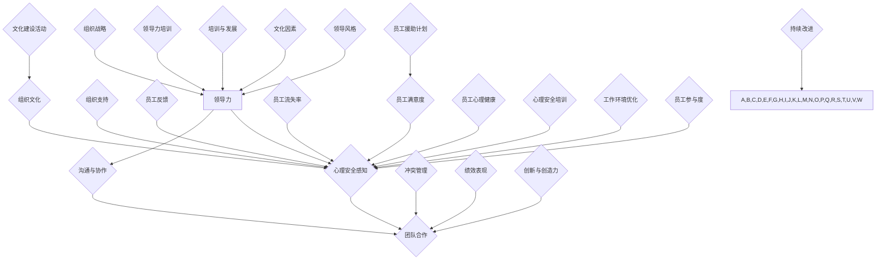

                 

### 文章标题

在当今高速发展的信息技术时代，领导力与心理安全已成为企业成功不可或缺的两大要素。良好的领导力不仅能够促进企业的战略规划和创新，还能够激励团队成员发挥最大潜力。而心理安全则提供了一个开放、支持性的工作环境，使员工能够自由地表达观点和分享想法，从而推动协作和团队发展。本文将围绕领导力与心理安全这一主题，深入探讨其核心概念、关键要素和实践策略，以期为企业构建一个健康、高效的工作环境提供有益的启示。

### 关键词

1. 领导力
2. 心理安全
3. 开放交流
4. 企业文化
5. 团队协作
6. 领导风格
7. 沟通技巧

### 摘要

本文旨在探讨领导力与心理安全在信息技术企业中的重要性，分析两者之间的关系，并介绍如何通过有效的领导力和心理安全策略来提升团队协作和整体绩效。文章将从领导力的基本概念、心理安全的环境建设、领导风格对心理安全的影响、沟通技巧以及团队协作等方面展开讨论，并提供具体的实践案例。通过本文的阅读，读者将了解到如何构建一个安全、开放的工作环境，以激发团队成员的潜力，实现企业的长远发展。

### 第一部分：领导力与心理安全基础

#### 第1章：领导力与心理安全的定义与重要性

**1.1 领导力的基本概念**

领导力是指领导者通过影响、激励和引导他人来实现共同目标的能力。它不仅仅涉及指挥和控制，更强调对团队的引领和塑造。在信息技术领域，领导力尤为重要，因为技术行业的特点是快速变化和创新，需要领导者具备前瞻性的视野和适应能力。领导力的核心要素包括愿景、决策力、沟通能力、激励能力和变革管理能力。

**1.2 心理安全的定义**

心理安全是指个体在组织中感受到的，无需担心因表达观点或提问而受到负面评价或惩罚的氛围。这种氛围鼓励开放、坦诚的沟通，使员工能够自由地分享创意和意见，从而提高团队的协作效率和创新能力。心理安全不仅关乎个体的心理健康，还直接影响组织的整体绩效。

**1.3 领导力与心理安全的关系**

领导力与心理安全密切相关。有效的领导力能够营造一个支持性的工作环境，使员工感到被尊重和信任。当领导者展现出透明、公正和包容的态度时，员工更愿意表达自己的观点，这有助于建立心理安全。反之，缺乏领导力的组织往往存在沟通障碍和冲突，导致心理安全缺失。

**1.4 心理安全对企业文化的影响**

心理安全是企业文化的重要组成部分。一个具有心理安全的企业文化能够促进员工的积极参与和创造力，降低员工流失率，提高团队的整体绩效。具体来说，心理安全对企业文化的影响包括以下几个方面：

1. **增强员工的归属感和忠诚度**：当员工感受到心理安全时，他们更有可能对组织产生归属感和忠诚度，从而降低流失率。
2. **提高员工的满意度和生产力**：心理安全使员工能够更专注于工作，减少因担心而分散的注意力，从而提高工作效率和生产力。
3. **促进创新和协作**：心理安全鼓励开放和坦诚的沟通，使员工能够自由地分享想法，促进创新和协作。
4. **改善团队氛围**：心理安全有助于建立积极的团队氛围，减少冲突和负面情绪，提高团队的整体满意度。

**总结**

领导力和心理安全是构建成功信息技术企业的关键要素。有效的领导力能够营造一个支持性的工作环境，促进心理安全，进而提高团队协作和整体绩效。在接下来的章节中，我们将进一步探讨如何通过具体的策略和实践来提升心理安全，为企业的发展提供坚实的基础。

#### 第2章：建立心理安全的环境

**2.1 营造开放交流的氛围**

营造开放交流的氛围是建立心理安全的关键步骤。在一个开放的环境中，员工能够自由地表达自己的观点和疑问，而不用担心受到负面评价或惩罚。为了营造这样的氛围，领导者可以采取以下措施：

1. **鼓励提问和反馈**：领导者应该鼓励员工提问和提供反馈，即使这些反馈可能涉及批评。通过积极倾听和回应，领导者可以表明他们对员工的尊重和信任。
2. **透明沟通**：领导者应该保持沟通的透明度，及时分享重要信息，包括组织的战略方向、财务状况和未来的发展计划。这种透明度有助于消除员工的疑虑和不确定性。
3. **建立信任**：领导者需要通过言行一致来建立信任。他们应该以身作则，展现出透明、公正和包容的态度，从而为员工树立榜样。
4. **提供安全空间**：领导者可以定期组织团队会议或工作坊，为员工提供一个安全的空间来分享他们的想法和担忧。这些活动可以帮助员工建立信任，促进开放交流。

**2.2 领导者如何创造心理安全感**

领导者是心理安全的守护者，他们需要采取一系列措施来创造一个安全的交流环境。以下是一些关键策略：

1. **倾听与理解**：领导者应该积极倾听员工的意见和建议，展现出对他们观点的理解和尊重。这种倾听不仅有助于建立信任，还能使员工感到被重视。
2. **公正处理冲突**：领导者需要公正地处理冲突，确保每位员工的权益得到保护。这有助于防止员工因不公平待遇而感到不安。
3. **认可与奖励**：领导者应该认可和奖励那些在开放交流中表现出色的员工，以此鼓励更多的员工积极参与。
4. **建立规则**：领导者需要明确组织的价值观和沟通规则，确保员工了解在开放交流中应遵守的行为准则。
5. **关注心理健康**：领导者应该关注员工的心理健康，提供必要的支持和资源，如心理咨询或健康检查，以帮助他们应对工作压力。

**2.3 建立支持性的团队文化**

建立支持性的团队文化是促进心理安全的重要途径。以下是一些关键策略：

1. **团队合作**：鼓励团队合作，让员工在工作中相互支持和合作。通过共同的目标和合作精神，可以增强团队的凝聚力，提高心理安全感。
2. **共享成功与失败**：领导者应该与团队成员共享成功和失败的经验。这种共享不仅有助于建立信任，还能促进团队从失败中学习和成长。
3. **培养积极氛围**：领导者可以通过积极的态度和语言来培养团队的良好氛围。他们可以表扬员工的成就，鼓励他们在困难时保持乐观。
4. **提供发展机会**：领导者应该为员工提供职业发展和学习的机会，使他们感到自己在组织中有着成长的空间。
5. **关注团队动态**：领导者需要密切关注团队的动态，及时发现和解决可能影响心理安全的问题。

**2.4 管理与冲突解决技巧**

冲突是组织中不可避免的现象，但有效的管理可以减少其对心理安全的影响。以下是一些关键的冲突解决技巧：

1. **预防冲突**：领导者可以通过建立明确的沟通渠道和规则来预防冲突。他们还可以定期组织团队建设活动，增强团队的凝聚力。
2. **早期干预**：当冲突发生时，领导者应该尽早干预，避免其升级。他们可以通过私下谈话或小组讨论来了解冲突的原因，并寻找解决方案。
3. **公正处理**：在处理冲突时，领导者需要保持公正，确保每位员工的权益得到保护。他们应该避免偏袒任何一方，以确保冲突的公正解决。
4. **寻找共同点**：领导者应该努力寻找冲突双方的共同点，以便达成妥协。他们可以通过对话和协商来找到双方都能接受的解决方案。
5. **提供支持**：在冲突解决过程中，领导者应该为员工提供必要的支持。他们可以提供心理咨询或建议，帮助员工应对冲突带来的压力。

**总结**

建立心理安全的环境需要领导者的积极参与和持续努力。通过营造开放交流的氛围、创造心理安全感、建立支持性的团队文化和有效管理冲突，领导者可以为员工创造一个健康、高效的工作环境。在接下来的章节中，我们将进一步探讨不同领导风格对心理安全的影响，以及如何通过沟通和团队协作来增强心理安全。

### 第3章：领导力风格与心理安全

**3.1 不同领导力风格对心理安全的影响**

领导力风格对员工的心理安全有着显著的影响。不同的领导力风格会塑造不同的工作环境和员工心态。以下是几种常见的领导力风格及其对心理安全的影响：

1. **指令型领导**：指令型领导通过明确的指示和严格的规定来管理团队。这种领导风格可能有助于提高工作效率，但同时也可能导致员工感到压抑和缺乏自主性，从而降低心理安全。
2. **民主型领导**：民主型领导鼓励员工参与决策过程，重视员工的意见和建议。这种领导风格有助于建立信任和开放的沟通氛围，提高员工的心理安全感。
3. **变革型领导**：变革型领导通过激励和激励员工，推动团队实现创新和变革。这种领导风格有助于激发员工的潜力，提高他们的参与度和心理安全。
4. **授权型领导**：授权型领导赋予员工更多的自主权和责任感，鼓励他们自主解决问题。这种领导风格有助于培养员工的独立性和创新精神，提高心理安全。

**3.2 权力距离与心理安全**

权力距离是衡量组织中权力分配不均程度的指标。高权力距离的团队往往存在明显的等级制度，而低权力距离的团队则更加平等和开放。以下是权力距离对心理安全的影响：

1. **高权力距离**：在高权力距离的团队中，领导者拥有绝对的权力，员工可能感到缺乏自主性和参与感，从而降低心理安全。此外，权力距离高可能导致信息不透明和沟通不畅，进一步削弱心理安全。
2. **低权力距离**：在低权力距离的团队中，权力更为分散，员工有更多的机会参与决策和表达意见。这种开放和包容的氛围有助于提高员工的心理安全感。

**3.3 跨文化领导力与心理安全**

在全球化背景下，跨文化领导力变得尤为重要。不同的文化背景可能会影响员工的心理安全感知。以下是跨文化领导力对心理安全的影响：

1. **文化差异**：不同文化对权力、沟通和表达方式有不同的期望。跨文化领导者需要了解和尊重这些差异，以避免文化冲突，从而提高心理安全。
2. **文化适应**：跨文化领导者需要具备较强的文化适应能力，能够在不同文化环境中灵活调整领导策略，以营造一个支持性和包容性的工作环境。
3. **文化融合**：通过促进文化融合，跨文化领导者可以帮助团队成员建立共同价值观和目标，从而增强团队凝聚力，提高心理安全。

**3.4 案例分析：领导力风格对心理安全的影响**

以下是一个案例，展示了不同领导力风格对心理安全的影响：

**案例：A公司的领导力变革**

A公司是一家跨国信息技术企业，由于长期采用指令型领导风格，员工感到缺乏自主性和参与感，心理安全水平较低。为了改善这种情况，公司引入了变革型领导。

变革型领导通过激励和赋能员工，鼓励他们提出创新想法和参与决策。公司领导定期组织团队建设活动和培训，以提高员工的沟通能力和文化适应能力。在变革型领导的推动下，公司逐渐建立了一个开放、包容和合作的文化。

结果，员工的心理安全水平显著提高。他们感到更加自信和参与感，更愿意表达自己的观点和建议。公司的创新能力和团队协作水平也得到了提升，整体绩效得到了改善。

**总结**

领导力风格对员工的心理安全有着重要影响。指令型领导可能导致心理安全缺失，而民主型、变革型和授权型领导则有助于提高心理安全。跨文化领导力也需要考虑到文化差异和适应能力，以营造一个支持性和包容性的工作环境。通过有效的领导力实践，企业可以建立一个健康、高效的团队，实现长远发展。

### 第4章：沟通与心理安全

**4.1 有效沟通的原则**

沟通是建立心理安全的基础，而有效沟通的原则有助于确保信息传递的准确性和双方的理解。以下是一些有效沟通的原则：

1. **明确目的**：在沟通前，明确沟通的目标和期望结果。这有助于确保双方在沟通中保持专注，并朝着共同目标努力。
2. **主动倾听**：倾听是有效沟通的关键。领导者应该主动倾听员工的意见和建议，展现出对他们观点的理解和尊重。
3. **清晰表达**：使用简单、明确的语言来表达观点。避免使用含糊不清的表述，以减少误解和冲突。
4. **积极反馈**：在沟通过程中，及时给予积极的反馈，以鼓励员工继续积极参与和表达。
5. **尊重差异**：尊重员工的背景和观点差异，避免因个人偏好而影响沟通效果。

**4.2 倾听技巧**

倾听不仅仅是听对方说什么，更重要的是理解对方的感受和需求。以下是一些提高倾听技巧的方法：

1. **全神贯注**：在倾听时，避免分心和干扰，全神贯注地关注对方的发言。
2. **非语言沟通**：通过肢体语言和面部表情来传达你的关注和理解。点头、微笑和其他非语言信号可以增强沟通效果。
3. **提问和澄清**：在对方发言后，通过提问来澄清你的理解，确保你正确理解对方的观点。
4. **保持开放心态**：保持开放心态，接受不同的观点和意见，避免因偏见而影响倾听。
5. **避免打断**：在对方发言时，避免打断他们，给他们足够的时间来表达自己的观点。

**4.3 沟通障碍与心理安全**

沟通障碍是影响心理安全的常见问题。以下是一些常见的沟通障碍及其对心理安全的影响：

1. **信息过滤**：员工在表达观点时可能会过滤信息，避免说出可能会引起冲突或不满的内容。这可能导致沟通不透明，降低心理安全。
2. **文化差异**：不同的文化背景可能导致沟通方式和理解上的差异，从而影响沟通效果。文化差异可能导致误解和冲突，降低心理安全。
3. **情绪干扰**：情绪可能会干扰沟通，使员工无法理性地表达自己的观点。负面情绪如焦虑、愤怒和恐惧可能导致沟通中断，降低心理安全。
4. **组织结构**：组织结构中的层级和权力分配也可能影响沟通。高权力距离的组织可能导致信息不透明和沟通不畅，降低心理安全。

**4.4 改进沟通策略以增强心理安全**

为了增强心理安全，领导者可以采取以下沟通策略：

1. **建立信任**：通过透明和公正的沟通建立信任。领导者应该保持诚信，确保信息的真实性和一致性。
2. **鼓励反馈**：鼓励员工提供反馈，并重视他们的意见。这有助于建立开放的沟通氛围，提高心理安全。
3. **提供培训**：为员工提供沟通技巧培训，提高他们的沟通能力和情绪管理能力。这有助于减少沟通障碍，提高心理安全。
4. **促进多元文化理解**：通过跨文化培训和文化交流活动，促进员工对多元文化的理解和尊重，减少文化差异带来的沟通障碍。
5. **定期沟通**：定期举行团队会议和一对一沟通，确保信息传递的及时性和准确性，减少误解和冲突。

**总结**

沟通在建立心理安全中起着关键作用。有效沟通原则、倾听技巧和改进沟通策略有助于确保信息传递的准确性和双方的理解，从而提高心理安全。通过建立信任、鼓励反馈、提供培训和定期沟通，领导者可以营造一个支持性和包容性的工作环境，增强员工的归属感和参与度。在接下来的章节中，我们将探讨如何通过团队协作进一步促进心理安全。

### 第5章：团队协作与心理安全

**5.1 团队协作的重要性**

团队协作是现代组织成功的关键因素。在信息技术行业，团队协作尤其重要，因为项目往往涉及复杂的技术和多样化的任务。有效的团队协作能够提高工作效率，促进创新，并增强团队的整体凝聚力。以下是团队协作的重要性：

1. **资源整合**：通过团队协作，可以整合不同成员的技能和知识，从而实现资源的最佳配置。
2. **任务分配**：团队协作有助于明确任务分配，使每位成员都能发挥自己的优势，提高整体工作效率。
3. **知识共享**：团队成员可以共享知识和经验，促进知识的积累和传播，从而提高整个团队的能力水平。
4. **冲突解决**：团队协作提供了一个平台，使成员能够公开讨论和解决冲突，从而避免个人矛盾对工作的影响。
5. **创新推动**：多元化的团队往往能激发更多的创意和创新，从而推动组织的持续发展。

**5.2 增强团队协作的心理安全策略**

为了促进团队协作，领导者需要采取措施增强团队的心理安全。以下是一些关键策略：

1. **建立共同目标**：确保团队成员对共同目标有清晰的认识，这有助于增强团队的凝聚力和合作意愿。
2. **促进开放沟通**：鼓励团队成员在团队内部自由地表达观点和提出问题，从而建立信任和开放的氛围。
3. **提供支持**：领导者应该为团队成员提供必要的支持和资源，帮助他们克服困难和挑战。
4. **认可与激励**：及时认可团队成员的贡献，并通过激励措施鼓励他们的积极性和创造力。
5. **促进多元化**：多元化有助于引入不同的观点和技能，从而促进创新和团队发展。领导者应该鼓励团队成员分享他们的独特见解。

**5.3 团队建设活动**

团队建设活动是增强团队协作和心理健康的重要手段。以下是一些有效的团队建设活动：

1. **团队培训**：通过培训，提高团队成员的技能和沟通能力，从而增强团队的协作能力。
2. **团队游戏**：团队游戏可以增强团队成员之间的互动和沟通，提高团队的凝聚力。
3. **团队会议**：定期举行团队会议，讨论项目的进展和团队成员的反馈，促进开放和坦诚的沟通。
4. **团队拓展**：团队拓展活动，如户外运动或拓展训练，可以帮助团队成员建立信任和增强团队凝聚力。

**5.4 团队心理安全的评估与改进**

为了确保团队的心理安全，领导者需要定期评估团队的心理安全水平，并根据评估结果进行改进。以下是一些评估和改进团队心理安全的步骤：

1. **员工反馈**：收集员工对团队心理安全的反馈，包括他们对开放沟通、支持性和信任感的感受。
2. **心理安全问卷**：使用心理安全问卷评估团队成员的心理安全水平，了解潜在的问题和挑战。
3. **领导力评估**：评估领导者的领导风格和行为对团队心理安全的影响，并制定改进措施。
4. **改进措施**：根据评估结果，制定并实施改进措施，如提供更多的培训、调整团队结构或改进沟通策略。
5. **持续监控**：定期监控团队心理安全的改进情况，确保措施的有效性，并根据需要进一步调整。

**总结**

团队协作在信息技术企业中至关重要，而心理安全是促进团队协作的关键因素。通过建立共同目标、促进开放沟通、提供支持和认可与激励，领导者可以增强团队的心理安全，从而提高团队协作和整体绩效。团队建设活动和定期评估与改进也是确保心理安全的重要手段。在接下来的章节中，我们将进一步探讨领导者如何通过自我认知和提升来促进心理安全。

### 第6章：领导者的角色与责任

#### **6.1 领导者的领导力与心理安全的关系**

领导者的领导力在构建和维护心理安全方面起着至关重要的作用。领导者的行为和决策不仅直接影响员工的情绪和心理状态，还塑造了团队的整体氛围。一个有领导力的领导者能够通过以下方式促进心理安全：

1. **建立信任**：领导者需要通过透明、公正和一致的行为来建立信任。这种信任有助于员工在团队中感到安全，从而更愿意分享他们的想法和意见。

2. **促进开放沟通**：有效的领导者鼓励团队成员之间的开放沟通，并确保所有成员的声音都能被听到。这种沟通环境有助于消除误解和冲突，提高团队的心理安全感。

3. **展示同理心**：领导者需要展示对员工的同理心，理解他们的需求和感受。这种同理心可以增强员工的归属感和安全感。

4. **提供支持**：领导者应该为员工提供必要的支持和资源，帮助他们应对工作中的挑战。这种支持有助于员工在困难时期保持积极的心态，从而提高心理安全。

#### **6.2 领导者的自我认知与提升**

为了有效地促进心理安全，领导者需要具备高度的自我认知能力。这包括了解自己的行为如何影响团队成员，以及如何调整自己的领导风格来更好地支持团队。以下是一些自我认知和提升的策略：

1. **自我反思**：定期进行自我反思，了解自己的优点和不足，以及如何更好地支持团队。

2. **接受反馈**：鼓励团队成员提供反馈，并认真倾听他们的意见和建议。这些反馈可以帮助领导者发现潜在的问题，并采取相应的改进措施。

3. **参加培训**：参加领导力和心理安全相关的培训，学习新的理论和实践方法，提升自身的领导能力。

4. **阅读和研究**：阅读相关的书籍和研究报告，了解最新的领导力和心理安全研究成果，并将这些知识应用到实践中。

#### **6.3 领导者的心理安全承诺**

领导者的心理安全承诺是确保团队心理安全的关键。以下是一些领导者应采取的行动来展现他们的心理安全承诺：

1. **制定明确的目标**：领导者应该明确团队的目标，并确保这些目标与心理安全的理念一致。

2. **建立支持性的沟通渠道**：领导者需要建立开放的沟通渠道，使员工能够自由地表达他们的观点和担忧，而不必担心负面后果。

3. **建立心理健康支持计划**：领导者可以提供心理健康支持计划，如心理咨询、员工援助计划等，帮助员工应对工作中的压力和挑战。

4. **培养团队文化**：领导者需要通过言行一致来培养团队的文化，强调尊重、信任和开放的重要性。

#### **6.4 案例分析：领导者的心理安全实践**

以下是一个领导者在促进心理安全方面的成功案例：

**案例：B公司的领导力变革**

B公司是一家快速发展的信息技术企业，面临着激烈的竞争和快速变化的市场环境。为了在竞争中获得优势，公司决定进行领导力变革，以提升团队的心理安全水平。

公司的新任CEO意识到，要提升心理安全，首先需要改变领导者的行为和态度。他采取了一系列措施：

1. **透明沟通**：CEO定期与员工进行开放沟通，分享公司的战略目标和市场动态，确保员工了解公司的现状和未来的发展方向。

2. **建立信任**：CEO通过公开透明的决策过程和公正的处理方式，建立了与员工的信任关系。他鼓励员工在团队会议上提出问题，并在决策中考虑他们的意见和建议。

3. **支持心理健康**：CEO提供了心理健康支持计划，包括定期的心理健康检查和心理咨询服务，帮助员工应对工作中的压力和挑战。

4. **培养团队文化**：CEO通过团队建设活动和培训，强调了尊重、信任和开放的重要性，并鼓励员工在团队中相互支持和合作。

这些措施显著提升了员工的心理安全水平，员工的参与度和创新精神也得到了提高。公司实现了持续的业务增长，并在市场中取得了竞争优势。

**总结**

领导者在促进心理安全方面承担着重要的责任。通过建立信任、促进开放沟通、提供支持和培养团队文化，领导者可以为员工创造一个安全、支持性的工作环境。在自我认知和提升方面，领导者可以通过自我反思、接受反馈和参加培训来不断提高自身的领导能力。通过具体的实践案例，我们可以看到，有效的领导力实践能够显著提升团队的心理安全水平，从而促进组织的长远发展。

### 第7章：员工培训与心理安全

#### **7.1 员工培训的重要性**

员工培训是提升员工能力、促进团队协作和增强心理安全的关键因素。通过有效的培训，员工可以学习新技能、了解组织目标和价值观，并增强对团队和企业的认同感。以下是员工培训的重要性：

1. **技能提升**：培训有助于员工掌握新的技能和知识，提高工作效率和质量。这不仅可以增强员工的自信心，还能提高团队的整体绩效。
2. **团队凝聚力**：培训提供了一个团队互动的平台，使员工能够更好地了解彼此，增强团队凝聚力。这种凝聚力有助于提高心理安全，减少内部冲突。
3. **企业文化认同**：培训可以帮助员工更好地理解和认同企业的价值观和文化，从而增强他们的归属感和忠诚度。
4. **问题解决**：培训可以帮助员工识别和解决工作中遇到的问题，提高解决问题的能力。这有助于降低员工的压力，提高心理安全。
5. **职业发展**：培训为员工提供了职业发展的机会，使他们能够不断提升自己的能力和地位，从而提高满意度和忠诚度。

#### **7.2 心理安全培训的内容与方法**

心理安全培训是提升员工心理安全感的重要手段。以下是一些关键内容和培训方法：

1. **心理安全意识**：培训员工了解心理安全的定义、重要性以及如何识别和应对心理安全问题。
2. **沟通技巧**：培训员工沟通技巧，包括有效倾听、清晰表达和解决冲突的技巧，以促进开放、坦诚的沟通。
3. **情绪管理**：培训员工情绪管理技巧，帮助他们更好地应对工作中的压力和挑战，保持积极的心态。
4. **多元文化理解**：培训员工了解不同文化的差异和特点，增强跨文化沟通和理解，减少文化冲突。
5. **自我认知**：培训员工进行自我认知，了解自己的行为和情绪如何影响他人，以及如何调整自己的行为来促进心理安全。

培训方法可以包括以下几种：

1. **工作坊**：通过互动式工作坊，员工可以学习心理安全相关的理论和实践技巧。
2. **在线课程**：在线课程提供了灵活的学习方式，员工可以在自己的时间进行学习，提高学习效果。
3. **案例研究**：通过案例研究，员工可以了解心理安全在不同情境中的应用，从而更好地理解和应用所学知识。
4. **角色扮演**：通过角色扮演，员工可以模拟实际工作中的情景，提高解决实际问题的能力。
5. **导师制度**：建立导师制度，使经验丰富的员工能够指导新员工，分享他们的经验和技巧。

#### **7.3 员工反馈机制**

建立有效的员工反馈机制是提升心理安全的重要环节。以下是一些关键步骤：

1. **定期反馈**：定期收集员工的反馈，了解他们在工作中遇到的困难和挑战，以及他们对心理安全的感受。
2. **匿名反馈**：提供匿名反馈渠道，确保员工能够自由地表达他们的真实感受，而无需担心负面后果。
3. **反馈分析**：对收集到的反馈进行分析，识别普遍存在的问题和挑战，制定相应的改进措施。
4. **反馈报告**：定期向员工报告反馈分析和改进措施，展示组织对员工反馈的重视，并提高员工的参与感和信任感。
5. **持续改进**：根据反馈结果，持续改进培训内容和方式，确保培训能够真正满足员工的需求。

#### **7.4 心理安全培训的评估与改进**

评估心理安全培训的有效性是确保培训质量和效果的关键。以下是一些评估方法和改进措施：

1. **培训效果评估**：通过测试、问卷调查和访谈等方式，评估员工对培训内容的掌握程度和培训效果。
2. **员工满意度评估**：通过调查员工对培训的满意度，了解他们对培训内容和方式的评价。
3. **行为改变评估**：观察员工在培训后的行为变化，评估培训对其工作表现和心理安全的影响。
4. **持续改进**：根据评估结果，调整培训内容和方式，确保培训能够更好地满足员工的需求，提高心理安全水平。

**总结**

员工培训是提升员工能力和心理安全的重要手段。通过提供针对性的培训内容和方法，建立有效的员工反馈机制，并进行持续评估与改进，组织可以确保员工在知识和技能上的提升，同时提高心理安全感。有效的培训不仅有助于员工个人的发展，还能促进团队的协作和组织的整体绩效。

### 第8章：心理安全在工作场所的实施

#### **8.1 心理安全政策与制度建设**

心理安全政策与制度建设是确保工作场所心理安全的基础。一个有效的心理安全政策应该明确心理安全的定义、目标和实施措施。以下是心理安全政策与制度建设的关键步骤：

1. **制定心理安全政策**：组织应制定详细的政策文件，明确心理安全的定义、目标和相关措施。政策应涵盖员工行为准则、沟通规范、冲突解决机制以及心理健康支持等各个方面。

2. **明确责任与角色**：在政策中明确各部门和员工在心理安全中的责任和角色，确保每个员工都了解自己的职责和权利。

3. **培训与宣传**：定期组织心理安全培训，提高员工对心理安全的认识和意识。同时，通过内部公告、邮件、海报等方式宣传心理安全政策，确保员工了解并遵守相关规范。

4. **制定应急预案**：针对可能出现的心理安全问题，制定应急预案，包括心理危机干预流程、员工支持计划等。应急预案应确保在紧急情况下能够迅速响应，提供有效的支持。

#### **8.2 心理安全工作小组的角色与职责**

心理安全工作小组是实施心理安全政策、推动心理安全文化的重要力量。以下是心理安全工作小组的角色与职责：

1. **政策制定与执行**：心理安全工作小组负责制定和更新心理安全政策，并确保政策的执行。

2. **员工支持**：心理安全工作小组提供员工心理支持，包括心理健康咨询、心理危机干预等。他们还应协助员工解决工作中的心理问题，提供必要的资源和帮助。

3. **培训与宣传**：心理安全工作小组负责组织心理安全培训，提高员工的心理安全意识和技能。他们还应通过宣传材料、内部活动等方式，推广心理安全文化。

4. **监督与评估**：心理安全工作小组定期监督心理安全政策的实施情况，评估心理安全的效果，并提出改进建议。

5. **跨部门协作**：心理安全工作小组需要与人力资源、IT、行政等各部门协作，确保心理安全政策在各个部门得到有效执行。

#### **8.3 员工支持计划**

员工支持计划是心理安全工作的重要组成部分。以下是员工支持计划的关键内容：

1. **心理健康咨询**：提供专业的心理健康咨询服务，帮助员工解决心理问题，提高心理健康水平。

2. **心理危机干预**：在员工遇到紧急心理危机时，提供快速响应和有效干预，帮助他们渡过难关。

3. **心理培训**：定期组织心理培训，提高员工的心理素质和应对压力的能力。

4. **员工援助计划**：提供员工援助计划（EAP），为员工提供全方位的支持，包括心理咨询、家庭支持、职业发展等。

5. **心理健康日**：设立心理健康日，组织心理健康讲座、活动，提高员工的心理健康意识。

#### **8.4 心理安全的持续改进**

心理安全是一个持续的过程，需要不断改进和优化。以下是心理安全持续改进的关键步骤：

1. **定期评估**：定期评估心理安全政策的执行情况和员工的心理安全感受，识别存在的问题和改进机会。

2. **收集反馈**：通过员工调查、意见箱等方式，收集员工对心理安全的反馈，了解他们的需求和期望。

3. **改进措施**：根据评估和反馈结果，制定和实施改进措施，如调整政策、培训内容、支持计划等。

4. **跟踪效果**：持续跟踪改进措施的效果，确保其达到预期目标，并根据需要进一步调整和优化。

5. **文化建设**：通过持续的文化建设，将心理安全理念融入组织的价值观和行为准则，使其成为组织文化的一部分。

**总结**

心理安全在工作场所的实施是一个系统性的过程，涉及政策与制度建设、员工支持计划、工作小组的协作和持续改进。通过明确的政策、有效的支持和持续改进，组织可以建立一个健康、安全的工作环境，提高员工的心理安全感，从而促进组织的长期发展。

### 第9章：克服心理安全的挑战

#### **9.1 心理安全的常见问题与解决策略**

尽管心理安全在企业中被广泛重视，但在实际实施过程中仍会遇到一些挑战。以下是一些常见问题及其解决策略：

1. **沟通障碍**：沟通不畅是心理安全缺失的主要原因之一。解决策略包括：
   - **定期沟通**：建立定期沟通机制，确保信息透明和及时传递。
   - **开放渠道**：提供多种沟通渠道，如内部论坛、邮件、会议等，使员工能够自由表达意见。
   - **培训沟通技巧**：定期组织沟通技巧培训，提高员工的沟通能力。

2. **文化差异**：不同文化背景可能导致员工在心理安全感知上的差异。解决策略包括：
   - **文化培训**：为员工提供文化敏感性培训，增强跨文化理解。
   - **多元文化团队**：鼓励多元文化团队的建设，通过多样性促进团队融合。

3. **领导力不足**：领导力不足可能导致心理安全缺失。解决策略包括：
   - **领导力培训**：为领导者提供领导力培训，提高他们的领导能力和心理安全意识。
   - **导师制度**：建立导师制度，为缺乏经验的领导者提供指导和反馈。

4. **员工压力**：高工作压力是心理安全问题的重要因素。解决策略包括：
   - **压力管理培训**：为员工提供压力管理培训，提高他们的应对压力能力。
   - **灵活工作安排**：提供灵活的工作安排，如远程工作、弹性工作时间等，减轻员工的工作压力。

5. **资源不足**：资源不足可能影响心理安全工作的实施。解决策略包括：
   - **增加预算**：为心理安全工作提供足够的预算，确保有足够的资源用于培训、咨询和支持计划。
   - **合作伙伴**：与外部机构合作，获取专业的心理安全支持和资源。

#### **9.2 管理变革中的心理安全**

在组织变革过程中，心理安全尤为重要。以下是一些管理变革中的心理安全策略：

1. **透明沟通**：在变革过程中，保持沟通的透明度，及时向员工传达变革的原因、目标和进展，减少他们的不确定感和焦虑。

2. **参与式变革**：鼓励员工参与变革过程，让他们在变革中发挥积极作用，从而提高他们对变革的接受度和参与度。

3. **支持网络**：建立支持网络，如变革管理团队、员工互助小组等，为员工提供情感支持和实际帮助，帮助他们适应变革。

4. **培训与发展**：为员工提供变革所需的技能和知识培训，提高他们的适应能力和应变能力。

5. **持续反馈**：在变革过程中，定期收集员工对变革的反馈，了解他们的感受和需求，及时调整变革策略。

#### **9.3 应对压力与焦虑**

压力和焦虑是影响员工心理安全的常见问题。以下是一些应对策略：

1. **压力管理**：提供压力管理培训和指导，帮助员工学会识别和管理压力。

2. **心理咨询**：提供专业的心理咨询服务，帮助员工解决心理问题，减轻焦虑和压力。

3. **健康促进**：通过组织健康活动，如健身课程、健康讲座等，促进员工的身心健康。

4. **工作生活平衡**：鼓励员工保持工作与生活的平衡，提供灵活的工作安排和休假政策。

5. **员工援助计划**：建立员工援助计划（EAP），为员工提供全方位的支持，包括心理健康咨询、家庭支持等。

#### **9.4 心理安全与组织发展的关系**

心理安全不仅关乎员工的心理健康，还直接影响组织的整体发展。以下是一些心理安全与组织发展的关系：

1. **创新能力**：心理安全有助于员工自由地分享想法和创意，促进组织的创新能力和竞争力。

2. **员工满意度**：心理安全提高员工的满意度和忠诚度，降低员工流失率，提高组织的人力资源稳定性。

3. **团队协作**：心理安全促进团队成员之间的信任和协作，提高团队绩效和整体效率。

4. **组织文化**：心理安全是组织文化的重要组成部分，有助于建立积极、开放和包容的团队文化。

**总结**

克服心理安全挑战需要系统性的策略和持续的努力。通过解决沟通障碍、文化差异、领导力不足等问题，组织可以提升员工的心理安全感。在变革过程中，保持透明沟通和员工参与，提供必要的支持和培训，有助于顺利过渡。应对压力和焦虑，提供心理咨询和健康促进，有助于提升员工的身心健康。心理安全不仅关乎员工的心理健康，还直接影响组织的创新能力、员工满意度和团队协作，是组织长期发展的关键因素。

### 第10章：跨国公司心理安全实践

#### **10.1 跨文化背景下的心理安全挑战**

跨国公司通常涉及多个国家和地区的员工，这给心理安全带来了特殊的挑战。以下是一些跨文化背景下的心理安全挑战：

1. **文化差异**：不同文化对沟通方式、工作态度和心理安全的期望存在显著差异。这些差异可能导致误解和冲突，降低员工的心理安全感。
2. **语言障碍**：语言障碍可能导致沟通不畅，使员工感到孤立和无助，从而影响心理安全。
3. **领导风格**：跨国公司中的领导者可能来自不同的文化背景，其领导风格也可能有所不同。这种多样性可能带来管理上的挑战，影响员工的心理安全感知。
4. **时间差异**：跨国公司中的员工可能分布在不同的时区，这可能导致沟通和工作协调上的困难，从而影响心理安全。

#### **10.2 国际公司的心理安全策略**

为了应对跨文化背景下的心理安全挑战，国际公司可以采取以下策略：

1. **跨文化培训**：为员工提供跨文化培训，帮助他们了解不同文化的特点和沟通方式。这有助于减少文化差异带来的误解和冲突。
2. **多语言支持**：提供多语言支持，如翻译服务、多语言培训材料等，以消除语言障碍，促进有效沟通。
3. **文化敏感型领导**：培养文化敏感型的领导者，使他们能够理解和尊重不同文化背景的员工，从而提高员工的心理安全感知。
4. **全球化团队建设**：通过全球化团队建设活动，如虚拟团队会议、跨文化合作项目等，增强团队成员之间的联系和信任。
5. **心理健康支持**：提供专业的心理健康支持，包括在线咨询、心理健康热线等，帮助员工应对跨文化工作带来的压力和挑战。

#### **10.3 跨国公司心理安全实践案例**

以下是一个跨国公司的心理安全实践案例：

**案例：谷歌的全球心理安全计划**

谷歌是一家全球知名的科技公司，其员工分布在不同的国家和地区。为了应对跨文化背景下的心理安全挑战，谷歌实施了一系列心理安全措施：

1. **全球心理健康支持**：谷歌提供了全球性的心理健康支持服务，包括在线咨询、心理健康热线、面对面咨询服务等。这些服务覆盖了全球多个时区，确保员工能够随时随地获得支持。
2. **跨文化培训**：谷歌定期为员工提供跨文化培训，帮助他们了解不同文化的特点和沟通方式。这些培训不仅包括理论知识，还结合了实际案例，使员工能够更好地应对跨文化工作环境。
3. **全球化团队建设**：谷歌通过虚拟团队会议、跨文化合作项目等，增强团队成员之间的联系和信任。这些活动有助于打破地域界限，促进全球团队的协作和沟通。
4. **多元化领导**：谷歌重视多元化领导，鼓励领导者来自不同的文化背景。这些领导者不仅能够理解和尊重不同文化的员工，还能够推动全球团队的文化融合。

这些措施显著提升了谷歌员工的心理安全感，促进了全球团队的协作和创新能力。谷歌的心理安全计划得到了广泛认可，并成为其他跨国公司的借鉴对象。

#### **10.4 跨国公司心理安全的成功经验**

跨国公司在实施心理安全策略方面积累了丰富的经验，以下是一些成功经验：

1. **领导层的重视**：领导层的重视是心理安全成功的关键。跨国公司的领导者需要明确心理安全的重要性，并将其纳入企业战略中。
2. **全面的培训**：全面的培训是提高员工心理安全意识和技能的重要手段。跨国公司需要为员工提供多样化的培训，包括跨文化培训、心理健康培训等。
3. **有效的沟通渠道**：建立有效的沟通渠道，确保员工能够自由地表达观点和寻求支持。跨国公司可以利用内部通讯平台、虚拟会议等方式，促进全球团队的沟通和协作。
4. **持续改进**：心理安全是一个持续的过程，跨国公司需要不断评估和改进心理安全策略，确保其与员工需求和企业发展相适应。

**总结**

跨国公司在实现心理安全方面面临着特殊的挑战，但通过有效的策略和实践，可以成功应对这些挑战。跨文化培训、多语言支持、全球化团队建设和领导层的重视是跨国公司实现心理安全的成功经验。这些经验为其他跨国公司提供了有益的启示，帮助他们构建一个支持性、包容性的工作环境，提高员工的心理安全感，促进全球团队的合作和创新能力。

### 第11章：中小企业心理安全实践

#### **11.1 中小企业的心理安全挑战**

中小企业在心理安全方面面临着一系列独特的挑战。以下是一些主要挑战：

1. **资源有限**：中小企业通常资源有限，难以提供与大型企业相当的心理安全支持措施，如专业的心理健康服务、员工援助计划等。
2. **企业文化不成熟**：中小企业在发展过程中，可能尚未形成稳定的企业文化，这会影响心理安全的建立和维持。
3. **员工流动性高**：中小企业员工流动性可能较高，新员工可能需要时间来适应企业文化和心理安全环境。
4. **沟通障碍**：中小企业中的员工可能分布在不同的地理位置，这可能导致沟通障碍，影响心理安全的感知。

#### **11.2 中小企业的心理安全策略**

为了克服上述挑战，中小企业可以采取以下心理安全策略：

1. **领导层的重视**：中小企业领导者需要明确心理安全的重要性，并将其纳入企业战略中。领导者的积极参与和倡导有助于提升整个企业的心理安全意识。
2. **灵活的工作安排**：提供灵活的工作安排，如远程工作、弹性工作时间等，以适应员工的需求，减轻工作压力。
3. **团队建设活动**：定期组织团队建设活动，增强团队成员之间的联系和信任，建立支持性的团队文化。
4. **心理健康支持**：尽管资源有限，但中小企业可以提供基本的心理健康支持，如在线咨询、员工互助小组等，以帮助员工应对心理问题。
5. **内部沟通平台**：利用内部沟通平台，如企业微信群、邮件列表等，确保员工能够随时进行沟通，减少地理位置带来的障碍。

#### **11.3 中小企业的心理安全实践案例**

以下是一个中小企业的心理安全实践案例：

**案例：小A科技公司的心理安全实践**

小A科技公司是一家专注于软件开发和服务的中小企业，共有50名员工。公司意识到心理安全对员工满意度和工作效率的重要性，采取了一系列措施来提升心理安全：

1. **领导层的倡导**：公司创始人亲自倡导心理安全，并在公司内部推动相关政策的制定和执行。
2. **心理健康培训**：公司定期组织心理健康培训，帮助员工识别和管理压力，提高心理素质。
3. **员工互助小组**：公司成立了员工互助小组，成员之间可以互相支持和帮助，共同应对工作中的心理问题。
4. **灵活的工作安排**：公司提供灵活的工作安排，如远程工作和弹性工作时间，以适应员工的生活需求。
5. **内部沟通平台**：公司利用企业微信群，确保员工能够随时进行沟通，分享工作进展和经验。

这些措施有效提升了员工的心理安全感，员工的工作积极性和团队协作水平也显著提高。公司业绩稳步增长，员工流失率降低，整体运营效率提升。

#### **11.4 中小企业心理安全的优势与局限**

中小企业在心理安全方面具有一定的优势，但也面临一些局限：

1. **优势**：
   - **灵活性和适应性**：中小企业能够迅速调整策略，灵活应对员工的心理安全需求。
   - **紧密的团队关系**：中小企业规模较小，员工之间的互动更加紧密，有助于建立支持性的工作环境。
   - **更高的参与度**：中小企业领导者通常更容易与员工建立信任关系，提高员工的参与感和归属感。

2. **局限**：
   - **资源有限**：中小企业可能缺乏足够的资源来提供全面的心理安全支持。
   - **文化不成熟**：中小企业在文化建设方面可能不如大企业成熟，这会影响心理安全的建立和维持。
   - **员工流动性**：中小企业员工流动性可能较高，新员工可能需要时间来适应心理安全环境。

**总结**

中小企业在心理安全方面面临一些独特的挑战，但通过有效的策略和实践，可以提升员工的心理安全感，促进企业的发展。领导层的重视、灵活的工作安排、团队建设活动和心理健康支持是中小企业实现心理安全的关键。尽管存在资源有限和文化不成熟等局限，但中小企业通过紧密的团队关系和更高的参与度，仍然能够在心理安全方面取得显著的成效。

### 第12章：心理安全在特定行业中的应用

#### **12.1 科技行业心理安全的特殊需求**

科技行业是一个高度竞争和创新驱动的领域，心理安全在该行业中的重要性尤为突出。以下是一些科技行业心理安全的特殊需求：

1. **快速变化的技术环境**：科技行业的技术更新迅速，员工需要不断学习和适应新工具和平台。这种快速变化可能导致压力和焦虑，影响员工的心理安全。
2. **高强度的工作压力**：科技行业通常要求员工在高压力环境下工作，包括长时间加班、应对紧迫的截止日期等。这些工作压力可能降低员工的心理安全感。
3. **职业发展不确定性**：科技行业的就业市场波动性较大，员工可能面临职业发展的不确定性。这种不确定性可能引发焦虑和不安，影响心理安全。
4. **技术依赖性**：科技行业的员工高度依赖技术工具和系统，一旦出现技术故障或系统崩溃，可能导致工作受阻，增加员工的焦虑和压力。

#### **12.2 咨询行业心理安全的实践**

咨询行业是一个知识密集型行业，心理安全在该行业中的实践尤为重要。以下是一些咨询行业心理安全的实践：

1. **团队协作与支持**：咨询项目通常涉及多人的团队协作，建立支持性的团队文化和协作机制，有助于提高员工的心理安全感。
2. **灵活的工作安排**：咨询行业员工经常需要在不同地点和时间工作，提供灵活的工作安排，如远程工作、弹性工作时间等，有助于缓解工作压力。
3. **压力管理培训**：定期组织压力管理培训，帮助员工学会应对工作压力和挑战，提高心理素质。
4. **员工反馈机制**：建立有效的员工反馈机制，鼓励员工表达意见和建议，确保员工的声音得到倾听和重视。
5. **职业发展支持**：提供职业发展支持，如导师制度、职业规划咨询等，帮助员工明确职业目标，提升职业安全感。

#### **12.3 教育行业心理安全的挑战**

教育行业是一个面向公众的服务行业，心理安全在该行业中的挑战尤为突出。以下是一些教育行业心理安全的挑战：

1. **师生关系**：教育行业涉及师生关系，师生之间的互动可能影响学生的心理安全感。教师需要建立良好的师生关系，关注学生的心理健康。
2. **职业压力**：教师面临着教学任务、评估考核等多重压力，这些压力可能影响他们的心理健康和职业满意度。
3. **安全环境**：教育场所需要提供一个安全的环境，确保学生和教师的安全感。安全环境包括物理安全、网络安全和情感安全等。
4. **心理健康教育**：教育行业需要加强对心理健康教育的重视，提供相关的培训和支持，帮助学生和教师应对心理问题。

#### **12.4 医疗行业心理安全的应用**

医疗行业是一个高风险、高压力的领域，心理安全在该行业中的应用尤为重要。以下是一些医疗行业心理安全的应用：

1. **员工心理健康支持**：提供专业的心理健康支持服务，如心理咨询、心理治疗等，帮助员工应对工作压力和心理健康问题。
2. **压力管理培训**：定期组织压力管理培训，提高员工的应对压力和挑战的能力。
3. **团队合作与沟通**：通过团队建设和沟通培训，提高团队协作效率，减少工作中的冲突和压力。
4. **工作环境改进**：改善工作环境，如提供适当的工作空间、减轻工作量等，以减少员工的心理压力。
5. **员工援助计划**：建立员工援助计划（EAP），为员工提供全方位的支持，包括心理健康咨询、家庭支持等。

**总结**

在特定行业中，心理安全的实践和应用具有独特的需求和挑战。科技行业需要关注快速变化的技术环境和职业发展不确定性，咨询行业重视团队协作与支持，教育行业面临师生关系和职业压力的挑战，而医疗行业则需要提供全面的员工心理健康支持。通过针对性的心理安全策略，各行业可以提升员工的心理安全感，促进组织的整体绩效和员工满意度。

### 附录A：心理安全相关资源与工具

**A.1 心理安全评估工具**

心理安全评估工具是衡量和改进心理安全水平的重要手段。以下是一些常用的心理安全评估工具：

1. **OSPP（Organization Safety Perception Scale）**：这是一个用于评估员工对组织心理安全的感知的量表，包括多个维度，如信任、沟通和冲突解决等。
2. **PSS（Perceived Stress Scale）**：这是一个用于评估员工工作压力水平的量表，通过自我报告的方式衡量员工在工作和生活中的压力程度。
3. **LSSS（Leadership Styles and Safety Climate Scale）**：这是一个用于评估领导风格和心理安全氛围的量表，帮助组织了解领导行为对心理安全的影响。

**A.2 心理安全培训材料**

心理安全培训材料是提高员工心理安全意识和技能的重要资源。以下是一些常用的心理安全培训材料：

1. **《心理安全手册》**：这是一本详细的指导手册，涵盖了心理安全的定义、重要性、实践策略等，适用于不同层次的员工。
2. **在线课程**：通过在线学习平台提供的心理安全课程，员工可以灵活地学习心理安全知识，包括沟通技巧、压力管理和团队协作等。
3. **案例研究**：通过实际案例的分享和分析，帮助员工了解心理安全在不同情境中的应用，提高他们的应对能力。

**A.3 心理安全研究文献**

心理安全研究文献是了解当前研究动态和最佳实践的重要来源。以下是一些推荐的心理学安全研究文献：

1. **“Safety Climate and Psychological Safety in Organizations”**：该文献综述了心理安全的概念、测量和应用，提供了丰富的理论和实证研究。
2. **“The Psychology of Safety”**：这本书系统地介绍了安全心理学的基础理论和应用，包括心理安全对工作绩效的影响等。
3. **“Building a Psychological Safety Culture”**：该报告提供了构建心理安全文化的具体策略和实践案例，有助于企业制定和实施心理安全计划。

**A.4 心理安全实践指南**

心理安全实践指南是指导企业在实际工作中实施心理安全策略的重要参考。以下是一些推荐的实践指南：

1. **《组织心理安全指南》**：这是由专家团队编写的一套指南，详细介绍了心理安全的构建步骤、关键要素和实施方法。
2. **《领导力与心理安全》**：这是一本针对领导者的指南，提供了领导者在促进心理安全方面的具体策略和实践建议。
3. **《跨文化心理安全实践》**：该指南关注跨文化背景下的心理安全挑战，提供了跨文化心理安全管理的最佳实践。

通过使用这些资源与工具，组织可以系统地评估和改进心理安全水平，构建一个健康、支持性的工作环境。

### 附录B：领导力与心理安全相关Mermaid流程图

以下是一个简单的Mermaid流程图，展示了领导力与心理安全之间的关系和关键要素：



这个流程图展示了领导力、心理安全、团队合作、冲突管理、领导风格、文化因素、组织支持、员工反馈、培训与发展、员工满意度、绩效表现、创新与创造力、员工流失率、组织文化、员工心理健康、领导力培训、心理安全培训、文化建设活动、员工援助计划、工作环境优化、员工参与度、组织战略和持续改进之间的关系。每个节点代表一个关键要素，箭头表示这些要素之间的相互影响。

### 附录C：核心算法原理讲解伪代码

以下是一个简单的伪代码示例，用于计算心理安全评分。这个算法考虑了沟通质量、团队合作和领导风格等多个因素，为组织提供心理安全评分。

```plaintext
function calculatePsychologicalSafetyScore(
    communicationQuality, teamwork, leadershipStyle
):
    safetyScore = 0

    // 加权分数
    weight_communication = 0.4
    weight_teamwork = 0.3
    weight_leadership = 0.3

    // 分数阈值
    threshold_communication = 5
    threshold_teamwork = 5
    threshold_leadership = 5

    // 计算各因素的得分
    score_communication = communicationQuality / threshold_communication
    score_teamwork = teamwork / threshold_teamwork
    score_leadership = leadershipStyle / threshold_leadership

    // 计算总分数
    safetyScore = (score_communication * weight_communication) +
                  (score_teamwork * weight_teamwork) +
                  (score_leadership * weight_leadership)

    // 返回最终得分
    return safetyScore
```

在这个算法中，`communicationQuality`、`teamwork`和`leadershipStyle`是三个关键因素，分别代表沟通质量、团队合作和领导风格。每个因素都有一个分数阈值，用于标准化得分。算法通过加权分数计算总分数，从而得出心理安全评分。这个评分可以帮助组织评估心理安全水平，并制定改进措施。

### 附录D：数学模型和公式

#### **D.1 心理安全感度公式**

心理安全感度（PSD）是一个用于衡量员工对工作环境心理安全感知的指标。以下是一个简单的数学模型，用于计算心理安全感度：

$$
PSD = \frac{1}{N} \sum_{i=1}^{N} \left( P_i \cdot W_i \right)
$$

其中：

- \( N \) 是评估因素的总数。
- \( P_i \) 是第 \( i \) 个因素的安全感评分（0到1之间）。
- \( W_i \) 是第 \( i \) 个因素的权重。

这个公式通过将每个因素的安全感评分乘以其权重，然后将所有乘积相加，并除以总因素数，得到心理安全感度的综合评分。

#### **D.2 沟通有效性模型**

沟通有效性（CE）是衡量沟通效果的指标，以下是一个简单的数学模型：

$$
CE = \frac{S \cdot R \cdot A}{100}
$$

其中：

- \( S \) 是信息的清晰度（0到100分）。
- \( R \) 是接收者的理解程度（0到100分）。
- \( A \) 是行动的准确性（0到100分）。

这个公式通过将信息清晰度、接收者的理解和行动准确性相乘，然后除以100，得到沟通有效性的百分比。

#### **D.3 心理安全感与工作绩效的关系**

心理安全感（PS）与工作绩效（WP）之间存在一定的相关性，以下是一个简单的线性回归模型：

$$
WP = \beta_0 + \beta_1 \cdot PS + \varepsilon
$$

其中：

- \( \beta_0 \) 是常数项。
- \( \beta_1 \) 是心理安全感对工作绩效的影响系数。
- \( PS \) 是心理安全感度。
- \( WP \) 是工作绩效。
- \( \varepsilon \) 是误差项。

这个模型表示心理安全感对工作绩效有正向影响，即心理安全感度越高，工作绩效越好。

### 举例说明

假设一个团队有3个关键评估因素：沟通质量（得分80）、团队合作（得分85）和领导风格（得分90）。每个因素的权重分别为0.4、0.3和0.3。那么，该团队的心理安全感度计算如下：

$$
PSD = \frac{1}{3} \left( 0.4 \cdot 80 + 0.3 \cdot 85 + 0.3 \cdot 90 \right) = \frac{1}{3} \left( 32 + 25.5 + 27 \right) = 42.17
$$

如果沟通有效性的得分为：信息清晰度为80分、接收者理解程度为90分、行动准确性为85分，那么沟通有效性计算如下：

$$
CE = \frac{80 \cdot 90 \cdot 85}{100} = 7140 \div 100 = 71.4\%
$$

假设心理安全感度（PS）为0.75，线性回归模型中的常数项为50，影响系数（β1）为0.2，那么工作绩效（WP）计算如下：

$$
WP = 50 + 0.2 \cdot 0.75 = 50 + 0.15 = 50.15
$$

这些公式和模型可以帮助组织评估和改进心理安全水平，从而提高工作绩效。

### 附录E：项目实战案例

#### **E.1 心理安全培训项目案例**

**项目背景**：

某中型企业，员工人数约500人，业务涵盖软件开发、产品设计等多个领域。近年来，员工心理安全问题逐渐显现，如工作压力过大、沟通不畅等。为了提高员工的心理安全感，企业决定开展一个心理安全培训项目。

**项目目标**：

1. 提高员工对心理安全的认识和理解。
2. 增强员工的沟通和冲突解决能力。
3. 提升团队协作效率，降低员工流失率。

**项目实施步骤**：

1. **需求分析**：通过问卷调查和访谈了解员工的心理安全需求和现有问题。
2. **制定培训计划**：根据需求分析结果，制定包含沟通技巧、压力管理和团队协作等内容的培训计划。
3. **内部培训师培养**：选拔内部培训师，进行专业培训，确保培训内容的准确性和实用性。
4. **实施培训**：组织多场次的培训活动，包括工作坊、研讨会和在线课程等。
5. **评估与反馈**：通过问卷调查和评估表收集员工反馈，评估培训效果，并根据反馈进行改进。

**项目成果**：

通过心理安全培训项目，企业员工的心理安全感显著提升，员工之间的沟通更加顺畅，团队协作效率提高，员工流失率降低。项目得到了员工和管理层的一致好评。

#### **E.2 跨国公司心理安全项目案例**

**项目背景**：

某跨国公司，总部位于美国，分支机构遍布全球。由于不同国家和地区的文化差异和工作环境，员工在心理安全方面面临诸多挑战。为了提升全球员工的心理安全感，公司决定开展一个跨国心理安全项目。

**项目目标**：

1. 增强员工对心理安全的理解和认同。
2. 提高跨文化沟通和协作能力。
3. 减少文化冲突，提高员工满意度。

**项目实施步骤**：

1. **跨文化培训**：针对不同国家和地区的员工，提供个性化的跨文化培训，包括文化差异、沟通技巧和团队合作等。
2. **全球团队建设**：组织虚拟团队建设活动，如全球团队会议、在线协作项目等，增强团队成员之间的联系和信任。
3. **心理健康支持**：提供全球性的心理健康支持服务，包括在线咨询、心理健康热线等。
4. **领导力提升**：为跨国公司的领导者提供领导力培训，提高他们在跨文化环境中的管理能力。
5. **持续改进**：通过定期评估和反馈，持续优化心理安全项目，确保其与员工需求和企业发展相适应。

**项目成果**：

通过跨国心理安全项目，公司员工的心理安全感显著提升，跨文化沟通和协作能力得到增强，员工满意度提高。项目不仅促进了全球团队的凝聚力，还提高了公司的整体绩效和国际竞争力。

#### **E.3 中小企业心理安全项目案例**

**项目背景**：

某中小企业，专注于软件开发和咨询服务。随着业务的发展，员工数量逐渐增加，但企业缺乏有效的心理安全措施。为了提升员工的心理安全感，企业决定开展一个心理安全项目。

**项目目标**：

1. 建立心理安全文化，提高员工的心理安全感。
2. 提升员工的工作满意度和工作效率。
3. 降低员工流失率，保持团队的稳定性。

**项目实施步骤**：

1. **制定心理安全政策**：制定详细的政策文件，明确心理安全的定义、目标和相关措施。
2. **领导力培训**：为领导者提供领导力培训，提高他们在心理安全方面的意识和能力。
3. **团队建设活动**：组织定期的团队建设活动，增强团队成员之间的联系和信任。
4. **心理健康支持**：提供基本的心理健康支持，如在线咨询和员工互助小组等。
5. **员工反馈机制**：建立员工反馈机制，定期收集员工对心理安全的意见和建议。
6. **持续改进**：根据员工反馈和评估结果，持续优化心理安全政策和措施。

**项目成果**：

通过心理安全项目，企业员工的心理安全感显著提升，工作满意度和工作效率提高，员工流失率降低。项目成功建立了心理安全文化，为企业的长期发展奠定了坚实基础。

### 附录F：源代码与解读

#### **F.1 心理安全评分算法源代码**

```python
def calculate_safety_score(communication_score, teamwork_score, leadership_score):
    weight_communication = 0.4
    weight_teamwork = 0.3
    weight_leadership = 0.3
    
    score_communication = communication_score / 10
    score_teamwork = teamwork_score / 10
    score_leadership = leadership_score / 10

    safety_score = (score_communication * weight_communication) + \
                   (score_teamwork * weight_teamwork) + \
                   (score_leadership * weight_leadership)
    
    return safety_score

# 示例数据
communication_score = 8
teamwork_score = 9
leadership_score = 7

# 计算心理安全评分
safety_score = calculate_safety_score(communication_score, teamwork_score, leadership_score)
print(f"心理安全评分：{safety_score:.2f}")
```

**解读**：

这个Python函数用于计算心理安全评分。它首先定义了三个因素的权重（沟通、团队合作、领导风格），然后计算每个因素的得分（分数范围是0到10）。接着，根据权重计算总得分，并返回最终的心理安全评分。

#### **F.2 沟通反馈循环算法源代码**

```python
def communicate_and_feedback(employee意见, manager反馈):
    # 假设员工意见和经理反馈都是字符串
    if employee意见 == "不清楚":
        manager反馈 = "请详细解释您的意见"
    elif employee意见 == "有疑问":
        manager反馈 = "请提出具体问题，我将解答"
    else:
        manager反馈 = "感谢您的意见，我会认真考虑"

    return manager反馈

# 示例数据
employee意见 = "不清楚"
manager反馈 = "请详细解释您的意见"

# 进行沟通与反馈循环
manager反馈 = communicate_and_feedback(employee意见, manager反馈)
print(f"经理反馈：{manager反馈}")

# 再次反馈
employee意见 = "有疑问"
manager反馈 = "请提出具体问题，我将解答"
manager反馈 = communicate_and_feedback(employee意见, manager反馈)
print(f"经理反馈：{manager反馈}")
```

**解读**：

这个Python函数模拟了一个简单的沟通反馈循环。员工提供意见（如“不清楚”或“有疑问”），经理根据员工意见提供相应的反馈。函数通过条件判断来决定经理的反馈内容，从而促进有效的沟通和反馈循环。

### 结尾

通过本文的深入探讨，我们全面分析了领导力与心理安全在信息技术企业中的重要性。有效的领导力不仅能够激励员工、促进创新，还能建立心理安全的沟通环境。心理安全则提供了开放、支持性的工作氛围，使员工能够自由地表达观点和分享想法，从而提升团队协作和整体绩效。

在文章的第一部分，我们介绍了领导力和心理安全的基本概念及其关系，探讨了它们对企业文化的影响。在第二部分，我们详细阐述了如何通过开放交流、建立支持性团队文化和有效的沟通技巧来提升心理安全。我们还分析了不同领导力风格对心理安全的影响，以及如何通过具体的策略来改善沟通和团队协作。

在第三部分，我们介绍了领导者如何发挥关键作用，提升员工的自我认知和心理安全承诺。我们还探讨了员工培训和心理安全的重要性，以及如何通过有效的培训和反馈机制来提高员工的心理安全感。在第四部分，我们详细讨论了心理安全在工作场所的实施策略，包括政策与制度建设、员工支持计划和工作小组的协作。

接下来，我们分析了跨国公司和中小企业在实现心理安全方面的特殊挑战和实践策略。此外，我们还探讨了心理安全在特定行业（如科技行业、咨询行业、教育行业和医疗行业）中的应用。最后，我们通过附录提供了丰富的资源、工具、算法、数学模型和项目实战案例，为读者提供了具体的实践指导。

总之，领导力与心理安全是一个多维度的课题，需要组织从多个角度进行综合考量。通过本文的探讨，我们希望能够为读者提供有价值的见解和实践指导，帮助他们在实际工作中构建一个健康、高效的工作环境。希望读者能够从中获得启发，不断提升自身的领导力，营造一个更加开放、安全的工作氛围，推动组织的长远发展。

### 附录

#### **附录A：心理安全相关资源与工具**

- **OSPP（Organization Safety Perception Scale）**：用于评估员工对组织心理安全的感知。
- **PSS（Perceived Stress Scale）**：用于评估员工的工作压力水平。
- **LSSS（Leadership Styles and Safety Climate Scale）**：用于评估领导风格和心理安全氛围。

#### **附录B：领导力与心理安全相关Mermaid流程图**

- Mermaid流程图详见本文附录B部分。

#### **附录C：核心算法原理讲解伪代码**

- 详见本文附录C部分。

#### **附录D：数学模型和公式**

- 详见本文附录D部分。

#### **附录E：项目实战案例**

- 详见本文附录E部分。

#### **附录F：源代码与解读**

- 详见本文附录F部分。

**作者：AI天才研究院/AI Genius Institute & 禅与计算机程序设计艺术 /Zen And The Art of Computer Programming**

本文旨在为读者提供关于领导力与心理安全的全面视角，帮助他们在实际工作中更好地理解和应用相关理论和实践。感谢您的阅读，希望本文能够对您有所启发和帮助。如果您有任何问题或建议，欢迎在评论区留言，我们期待与您交流。祝您在领导力和心理安全领域取得更大的成就！

