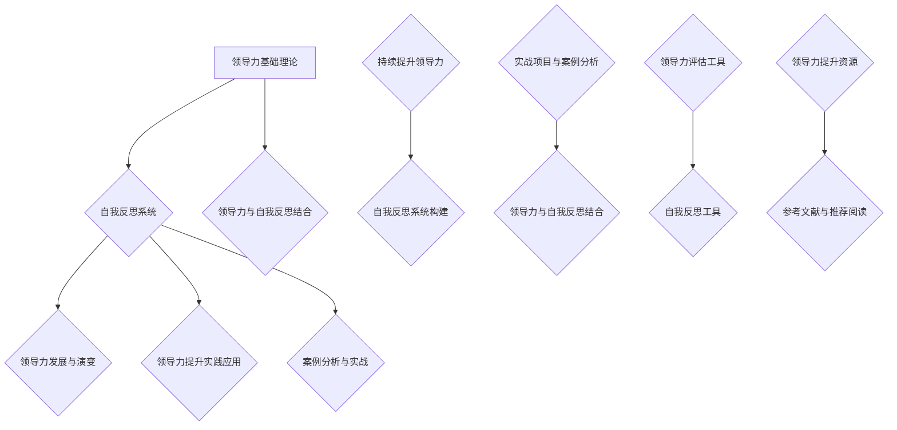

                 

### 《领导力与自我反思系统：持续提升的结构化方法》

#### 核心关键词
- 领导力
- 自我反思
- 持续提升
- 结构化方法
- 领导力评估
- 自我反思工具
- 实战项目

#### 摘要
本文深入探讨了领导力与自我反思系统的结合，以提供一个结构化的方法，帮助领导者持续提升个人能力和领导力水平。文章首先明确了领导力的基本概念和要素，然后介绍了自我反思的重要性及其方法和原则。通过构建自我反思系统，文章提出了领导力提升的路径和策略，并详细阐述了自我反思在领导力提升中的应用。最后，通过实际项目和案例，展示了领导力与自我反思系统在实践中的效果，并为读者提供了相关的工具与资源，以促进持续提升领导力的实践。

### 《领导力与自我反思系统：持续提升的结构化方法》目录大纲

1. **第一部分：领导力基础理论**
   - **第1章：领导力的概念与要素**
     - **1.1.1 领导力的定义与分类**
     - **1.1.2 领导力的核心要素**
     - **1.1.3 领导力的发展与实践**
   - **第2章：领导力的发展与演变**
     - **2.1.1 领导力的发展历程**
     - **2.1.2 领导力与现代管理理论的联系**
     - **2.1.3 领导力与组织文化的关系**

2. **第二部分：自我反思系统**
   - **第3章：自我反思的重要性**
     - **3.1.1 自我反思的定义与意义**
     - **3.1.2 自我反思的基本原则**
     - **3.1.3 自我反思的障碍与克服策略**
   - **第4章：自我反思的方法**
     - **4.1.1 自我反思的类型**
     - **4.1.2 自我反思的步骤与技巧**
     - **4.1.3 自我反思的工具与应用**
   - **第5章：构建自我反思系统**
     - **5.1.1 自我反思系统的定义与结构**
     - **5.1.2 自我反思系统的作用与优势**
     - **5.1.3 如何构建有效的自我反思系统**

3. **第三部分：领导力提升的实践应用**
   - **第6章：领导力提升的路径**
     - **6.1.1 领导力提升的方法与策略**
     - **6.1.2 领导力提升的实践案例**
     - **6.1.3 领导力提升的障碍与解决方案**
   - **第7章：自我反思在领导力提升中的应用**
     - **7.1.1 自我反思在领导力提升中的作用**
     - **7.1.2 自我反思在领导力培训中的应用**
     - **7.1.3 自我反思在领导力实践中的应用**

4. **第四部分：领导力与自我反思的结合**
   - **第8章：领导力与自我反思的关系**
     - **8.1.1 领导力与自我反思的结合方法**
     - **8.1.2 持续提升领导力的关键因素**
     - **8.1.3 领导力提升与自我反思的系统化方法**

5. **第五部分：案例分析与实战**
   - **第9章：领导力与自我反思的案例分析**
     - **9.1.1 案例背景与问题分析**
     - **9.1.2 领导力提升与自我反思的策略**
     - **9.1.3 案例结果与经验总结**
   - **第10章：实战项目与案例分析**
     - **10.1.1 实战项目概述**
     - **10.1.2 实战项目中的领导力提升与自我反思**
     - **10.1.3 实战项目的经验与教训**
   - **第11章：领导力与自我反思的持续提升**
     - **11.1.1 持续提升领导力的策略**
     - **11.1.2 自我反思在持续提升中的应用**
     - **11.1.3 领导力与自我反思的持续提升路径**

6. **附录**
   - **附录A：领导力与自我反思相关工具与资源**
   - **附录B：参考文献与推荐阅读**

### 第一部分：领导力基础理论

#### 第1章：领导力的概念与要素

**1.1.1 领导力的定义与分类**

领导力是一种能力，它涉及激励、引导和影响他人共同实现目标的过程。领导力不仅仅与地位或权力相关，更是一种个人特质和影响力。领导力可以被看作是一种行为模式，它通过沟通、决策、激励和榜样作用来影响他人。

在学术研究中，领导力有多种分类方式。以下是几种常见的分类：

- **指挥型领导**：领导者通过明确的指令和严格的控制来管理团队。
- **影响型领导**：领导者通过个人魅力和影响力来引导他人。
- **变革型领导**：领导者通过激励和创新来推动变革。
- **服务型领导**：领导者将团队成员的需求放在首位，提供支持和服务。

每种类型的领导力都有其特定的应用场景和优势。指挥型领导适用于需要严格管理和控制的环境，而变革型领导则在需要创新和突破的情境中更为有效。

**1.1.2 领导力的核心要素**

领导力包含多个核心要素，这些要素共同作用，形成有效的领导能力。以下是几个关键的要素：

- **沟通能力**：有效的沟通是领导力的核心。领导者需要清晰、准确地传达信息，理解团队成员的需求和反馈。
- **决策能力**：领导者必须在复杂和不确定的环境中进行决策。有效的决策能力涉及信息收集、风险评估和选择最佳方案。
- **情绪管理**：领导者需要控制自己的情绪，以保持冷静和客观。同时，他们也需要识别和应对团队成员的情绪。
- **领导风格与团队建设**：不同的领导风格适用于不同的团队和情境。领导者需要根据实际情况调整自己的风格，以促进团队合作和目标实现。

**1.1.3 领导力与其他管理职能的关系**

领导力与管理之间存在紧密的联系，但又有所区别。管理涉及计划、组织、领导和控制等活动，以确保组织的资源得到有效利用。领导力是管理职能的核心，但并不等同于管理。

- **领导力**：专注于激励和影响他人，创造积极的工作环境。
- **管理**：涉及组织、协调和控制资源，确保组织目标的实现。

领导者需要具备管理技能，但管理技能并不能自动转化为领导能力。有效的领导者不仅能够管理资源，还能激励团队，推动创新和变革。

**1.1.4 领导力的发展与实践**

领导力的发展是一个持续的过程，涉及知识、技能和态度的不断提升。以下是一些领导力发展的途径：

- **培训与教育**：参加领导力培训课程，学习新的理论和实践方法。
- **实践与经验**：通过实际工作经验，不断锻炼和提升领导能力。
- **反思与改进**：定期进行自我反思，识别自身的优势和不足，进行改进。
- **跨文化领导力**：了解不同文化的特点和需求，提高跨文化沟通和领导能力。

领导力的发展需要不断的学习和实践，领导者需要保持开放的心态，勇于面对挑战和变化。

### 第二部分：自我反思系统

#### 第3章：自我反思的重要性

**3.1.1 自我反思的定义与意义**

自我反思是一种认知过程，涉及对个人行为、想法和经验的深入思考和分析。自我反思不仅仅是对过去的回顾，更是一种对现在和未来的规划。它帮助个体识别自身的优势与不足，从而进行改进。

在领导力发展过程中，自我反思具有以下几个重要的意义：

- **提高自我认知**：通过反思，领导者可以更清晰地了解自己的行为模式、思维方式和情感反应。
- **促进个人成长**：自我反思帮助领导者识别个人发展的需求和方向，从而有针对性地提升自己的能力。
- **增强决策能力**：通过反思，领导者可以更好地理解决策的背景和影响，从而做出更明智的决策。
- **提高沟通效果**：自我反思帮助领导者识别沟通中的问题，从而改善沟通方式，提高沟通效果。

**3.1.2 自我反思的基本原则**

有效的自我反思需要遵循以下几个基本原则：

- **真实性原则**：反思必须基于真实的情况和数据，避免主观臆断和虚假陈述。
- **客观性原则**：反思应保持客观，避免情感干扰和偏见。
- **持续性原则**：自我反思是一个持续的过程，需要定期进行，以保持个人成长的动力。

**3.1.3 自我反思的障碍与克服策略**

自我反思过程中，领导者可能会遇到一些障碍，如：

- **情绪障碍**：领导者可能因为负面情绪（如挫败感、焦虑）而避免进行反思。
- **认知障碍**：领导者可能因为缺乏反思技巧或认知偏见而难以进行深入的反思。

以下是一些克服这些障碍的策略：

- **情绪管理**：领导者可以通过情绪调节技巧（如深呼吸、冥想等）来控制情绪，为反思创造良好的心理状态。
- **反思技巧**：领导者可以通过学习反思技巧（如提问、记录、分享等）来提高反思的效果。
- **建立反思文化**：在组织中建立自我反思的文化，鼓励成员进行反思，并提供必要的支持和资源。

#### 第4章：自我反思的方法

**4.1.1 自我反思的类型**

自我反思可以根据不同情境和目的进行分类。以下是几种常见的自我反思类型：

- **日常反思**：领导者每天进行的小规模反思，以总结一天的工作，识别问题和改进点。
- **项目反思**：在项目完成后，对项目的各个阶段和结果进行反思，以总结经验和教训。
- **领导反思**：领导者针对自己的领导行为和风格进行的反思，以提高领导效果。
- **组织反思**：团队成员或整个组织对一段时间内的工作进行反思，以评估绩效和改进工作方式。

**4.1.2 自我反思的步骤与技巧**

有效的自我反思通常包括以下几个步骤：

- **准备阶段**：确定反思的目标和范围，选择合适的反思时间和地点。
- **反思阶段**：通过提问、记录和思考，深入分析个人的行为和想法。
- **总结与行动阶段**：总结反思结果，制定改进计划，并将其付诸实践。

以下是一些自我反思的技巧：

- **提问**：通过提问来引导反思，如“我在这次决策中做得如何？”“我的沟通方式是否有效？”等。
- **记录**：将反思过程和结果记录下来，以便后续分析和总结。
- **分享**：与他人分享反思心得，获取反馈，从而更全面地了解自己。

**4.1.3 自我反思的工具与应用**

自我反思的工具可以帮助领导者更系统地记录和分析反思内容。以下是一些常用的自我反思工具：

- **反思日记**：记录日常反思，定期回顾和总结。
- **反思会议**：定期组织反思会议，团队成员共同分享反思心得。
- **反思小组**：建立反思小组，成员之间相互支持和反馈。
- **数字化反思工具**：使用应用程序或在线平台，帮助领导者进行数字化反思和记录。

#### 第5章：构建自我反思系统

**5.1.1 自我反思系统的定义与结构**

自我反思系统是一个包含多个组成部分的体系，它旨在帮助领导者持续进行自我反思，提高个人能力和领导力水平。自我反思系统的基本结构包括：

- **反思者**：进行反思的个人，他们需要具备反思的能力和意愿。
- **反思内容**：反思的对象，包括个人行为、思维过程、工作成果等。
- **反思过程**：反思的步骤和方法，确保反思的深入和有效性。
- **反馈机制**：收集和分析反思结果，提供改进建议。

**5.1.2 自我反思系统的作用与优势**

自我反思系统在领导力发展中的重要作用包括：

- **提升自我认知**：通过系统化的反思，领导者可以更全面地了解自己的行为和思维模式。
- **促进个人成长**：反思系统提供了一个持续学习和改进的平台，帮助领导者不断提升个人能力。
- **提高决策质量**：通过反思，领导者可以更好地理解决策的背景和影响，从而做出更明智的决策。
- **增强团队协作**：反思系统可以促进团队成员之间的沟通和合作，提高团队的整体绩效。

**5.1.3 如何构建有效的自我反思系统**

构建有效的自我反思系统需要遵循以下几个原则：

- **明确目标**：设定清晰的反思目标，确保反思活动具有明确的导向。
- **选择合适的方法**：根据领导者的需求和实际情况，选择合适的反思方法和工具。
- **设定反思周期**：制定合理的反思周期，确保反思活动的持续性和有效性。
- **建立反馈机制**：建立反馈机制，收集和分析反思结果，提供改进建议。

通过这些原则，领导者可以构建一个系统化、结构化的自我反思系统，从而实现持续提升个人能力和领导力水平的目标。

### 第三部分：领导力提升的实践应用

#### 第6章：领导力提升的路径

**6.1.1 领导力提升的方法与策略**

领导力提升是一个复杂的过程，涉及多个方面的提升和改进。以下是一些常见的领导力提升方法和策略：

- **培训与教育**：参加领导力培训课程，学习最新的理论和实践方法。这些课程可以提供系统化的知识体系，帮助领导者提升管理能力和领导技巧。
- **实践与经验**：通过实际工作经验，不断锻炼和提升领导能力。实践是最好的老师，领导者需要在实际工作中不断尝试、反思和改进。
- **反思与改进**：定期进行自我反思，识别自身的优势和不足，进行改进。反思是领导力提升的关键，它帮助领导者从经验中学习，不断提升个人能力。
- **跨文化领导力**：了解不同文化的特点和需求，提高跨文化沟通和领导能力。在全球化的今天，领导者需要具备跨文化领导能力，以应对多元化的团队和环境。

**6.1.2 领导力提升的实践案例**

以下是一些领导力提升的实践案例：

- **案例一：通过培训提升领导力**
  在某公司的领导力提升项目中，公司为中层管理者提供了为期三个月的领导力培训课程。这些课程涵盖了沟通技巧、决策能力、团队建设等多个方面。通过培训，管理者们不仅学到了新的知识和技巧，还通过实践和案例讨论，将理论知识应用到实际工作中。
- **案例二：通过实践提升领导力**
  在另一个案例中，某公司的领导者在实际项目中承担了更多的责任。通过实际的项目管理，领导者不仅锻炼了组织能力和沟通技巧，还学会了如何在不确定性和压力下做出有效的决策。
- **案例三：通过反思提升领导力**
  在这个案例中，一位领导者通过定期自我反思，识别自己在沟通和决策方面的不足。他制定了详细的反思计划，记录每次会议和决策的过程，并在反思中总结经验教训。通过持续的反思和改进，这位领导者的领导力水平得到了显著提升。

**6.1.3 领导力提升的障碍与解决方案**

在领导力提升过程中，领导者可能会遇到一些障碍，如：

- **情绪障碍**：领导者可能因为情绪问题（如挫败感、焦虑）而无法进行有效的反思和改进。
- **认知障碍**：领导者可能因为缺乏反思技巧或认知偏见而难以进行深入的反思。
- **时间障碍**：领导者可能因为工作繁忙而无法安排足够的时间进行学习和反思。

以下是一些克服这些障碍的解决方案：

- **情绪管理**：领导者可以通过情绪调节技巧（如深呼吸、冥想等）来控制情绪，为反思创造良好的心理状态。
- **反思技巧**：领导者可以通过学习和实践反思技巧（如提问、记录、分享等）来提高反思的效果。
- **时间管理**：领导者可以通过制定详细的时间管理计划，确保有足够的时间进行学习和反思。

通过这些方法和策略，领导者可以克服提升过程中的障碍，持续提升个人能力和领导力水平。

### 第7章：自我反思在领导力提升中的应用

**7.1.1 自我反思在领导力提升中的作用**

自我反思在领导力提升中发挥着重要的作用。通过自我反思，领导者可以：

- **提升自我认知**：自我反思帮助领导者深入了解自己的行为模式、思维方式和情感反应，从而更好地理解自己的优点和不足。
- **促进个人成长**：自我反思是一个持续的过程，它帮助领导者识别个人发展的需求和方向，从而有针对性地提升自己的能力。
- **增强决策能力**：自我反思帮助领导者更好地理解决策的背景和影响，从而做出更明智的决策。
- **提高沟通效果**：自我反思帮助领导者识别沟通中的问题，从而改善沟通方式，提高沟通效果。

**7.1.2 自我反思在领导力培训中的应用**

自我反思在领导力培训中的应用非常广泛。以下是一些具体的应用场景：

- **培训前反思**：在领导力培训开始前，领导者可以对自己目前的管理能力和领导风格进行反思。这有助于明确培训的目标和需求，确保培训内容的针对性和实用性。
- **培训中反思**：在培训过程中，领导者可以定期进行自我反思，评估培训效果，了解自己在哪些方面有所提升，哪些方面还需要进一步改进。
- **培训后反思**：在领导力培训结束后，领导者可以对整个培训过程进行反思，总结培训的收获和不足，并将所学应用到实际工作中。

**7.1.3 自我反思在领导力实践中的应用**

自我反思不仅在领导力培训中有重要作用，在领导力实践中也同样重要。以下是自我反思在领导力实践中的应用：

- **项目反思**：在项目完成后，领导者可以对项目的各个阶段和结果进行反思，总结经验教训，识别问题和改进点，为未来的项目提供参考。
- **团队反思**：领导者可以定期组织团队反思会议，团队成员共同分享反思心得，讨论工作中的困难和挑战，提出解决方案。
- **个人反思**：领导者可以每天或每周进行个人反思，总结当天或一周的工作，识别自己的优点和不足，制定改进计划。

通过自我反思，领导者可以在实践中不断提升自己的领导能力和管理水平，从而实现个人和团队的共同成长。

### 第四部分：领导力与自我反思的结合

#### 第8章：领导力与自我反思的关系

**8.1.1 领导力与自我反思的结合方法**

领导力与自我反思的结合是一种有效的提升领导能力的途径。以下是几种结合方法：

- **反思作为领导力提升的工具**：领导者可以通过自我反思来识别自己在领导行为、决策能力和团队管理方面的不足，并制定改进计划。
- **反思作为领导力培训的一部分**：在领导力培训课程中，引入自我反思环节，帮助领导者深入思考自己的领导风格和团队管理方式，从而更好地理解和应用培训内容。
- **反思作为领导力实践的一部分**：领导者可以在日常工作实践中进行自我反思，总结经验教训，识别问题，不断改进自己的领导方式。

**8.1.2 持续提升领导力的关键因素**

要实现领导力的持续提升，领导者需要关注以下几个关键因素：

- **持续反思**：反思不是一次性的活动，而是一个持续的过程。领导者需要定期进行自我反思，不断识别自己的不足和改进方向。
- **终身学习**：领导力是一个不断发展的领域，领导者需要保持学习的热情，不断学习新的知识和技能，以适应不断变化的环境。
- **跨文化领导力**：在全球化的今天，领导者需要具备跨文化领导能力，能够理解和适应不同文化背景的团队成员。

**8.1.3 领导力提升与自我反思的系统化方法**

为了实现领导力的系统化提升，领导者可以采取以下方法：

- **建立自我反思系统**：领导者可以建立一个结构化的自我反思系统，包括反思目标、反思内容、反思方法和反思周期等，确保自我反思的持续性和有效性。
- **制定领导力发展计划**：领导者可以结合自我反思的结果，制定一个个性化的领导力发展计划，明确提升的方向和目标。
- **获取反馈和指导**：领导者可以寻求同事、下属和上级的反馈，获取他们的观点和建议，从而更全面地了解自己的领导能力，并针对性地进行改进。

通过这些方法，领导者可以系统化地提升自己的领导能力，实现个人和团队的共同成长。

### 第五部分：案例分析与实战

#### 第9章：领导力与自我反思的案例分析

**9.1.1 案例背景与问题分析**

在这个案例中，我们以一家大型跨国公司的项目经理A为例。A在公司的项目管理团队中担任重要角色，负责多个项目的规划和执行。然而，A在领导力方面存在一些问题，具体表现在以下几个方面：

- **沟通不足**：A在项目沟通上存在障碍，无法有效地传达项目目标、进度和期望，导致团队成员对项目缺乏清晰的认识。
- **决策犹豫**：在项目决策过程中，A常常犹豫不决，缺乏决断力，导致项目进度延误。
- **团队协作不力**：A在团队管理上缺乏有效的激励和协调，导致团队士气低落，工作效率不高。

**9.1.2 领导力提升与自我反思的策略**

为了提升领导力，A采取了以下策略：

- **自我反思**：A定期进行自我反思，识别自己在领导行为、沟通和决策方面的不足，并记录下来。通过自我反思，A意识到自己在沟通和决策上需要改进，并制定了详细的反思计划。
- **领导力培训**：A参加了公司提供的领导力培训课程，学习了有效的沟通技巧和决策方法。在培训过程中，A通过案例分析和角色扮演，将所学知识应用到实际工作中。
- **团队建设**：A组织团队建设活动，增强团队成员之间的沟通和信任，提高团队协作效率。
- **获取反馈**：A定期与团队成员进行一对一沟通，了解他们在项目中的意见和建议，及时调整自己的领导方式。

**9.1.3 案例结果与经验总结**

通过上述策略，A在领导力方面取得了显著的提升：

- **沟通效率提高**：A通过有效的沟通技巧，确保项目目标、进度和期望得到清晰传达，团队成员对项目有了更明确的认识。
- **决策能力增强**：A在决策过程中更加果断和决断，减少了犹豫不决的情况，项目进度得到有效控制。
- **团队协作提升**：通过团队建设活动和反馈机制，A成功提高了团队士气和协作效率，项目成果显著。

这个案例表明，领导力提升和自我反思是相辅相成的。通过自我反思，领导者可以识别自身的不足，并通过培训和团队建设来提升领导能力。持续的自我反思和改进是领导力提升的关键。

### 第10章：实战项目与案例分析

**10.1.1 实战项目概述**

在这个实战项目中，我们将以一家初创企业的创始团队为例，探讨如何通过领导力提升和自我反思系统实现企业的快速发展。该企业成立于2022年，专注于人工智能领域的研发和应用，团队成员包括技术专家、产品经理和市场运营人员。

**10.1.2 实战项目中的领导力提升与自我反思**

在项目开始阶段，团队面临以下挑战：

- **领导力不足**：团队成员在领导力方面经验不足，缺乏有效的沟通和决策能力。
- **项目目标不清晰**：项目目标和预期成果不够明确，导致团队成员在执行过程中缺乏方向感。
- **团队协作不力**：团队成员之间缺乏有效的沟通和协作，影响了项目进度和成果。

为了解决这些挑战，团队采取了以下策略：

- **领导力提升**：
  - **自我反思**：团队领导定期进行自我反思，识别自己在领导行为、沟通和决策方面的不足，并制定改进计划。
  - **领导力培训**：团队领导参加了专业的领导力培训课程，学习了有效的沟通技巧和决策方法。
  - **团队建设**：团队定期组织团队建设活动，增强团队成员之间的沟通和信任。

- **自我反思**：
  - **日常反思**：团队成员每天进行反思，总结当天的工作，识别问题和改进点。
  - **项目反思**：在项目阶段性完成时，团队成员进行项目反思，总结经验教训，为后续工作提供参考。
  - **领导反思**：团队领导定期进行领导反思，评估自己的领导风格和团队管理效果，制定改进计划。

**10.1.3 实战项目的经验与教训**

通过实战项目的实施，团队取得了以下经验与教训：

- **领导力提升**：通过自我反思和培训，团队领导的领导能力得到了显著提升，项目管理和团队协作更加高效。
- **项目目标明确**：通过明确的项目目标和预期成果，团队成员在执行过程中有了更清晰的方向，项目进度得到了有效控制。
- **团队协作加强**：通过团队建设和日常反思，团队成员之间的沟通和协作得到了增强，团队士气和工作效率显著提高。

这个案例表明，领导力提升和自我反思系统是促进企业快速发展的重要手段。通过持续的自我反思和改进，团队可以不断提升领导力和协作效率，实现企业的长远发展。

### 第11章：领导力与自我反思的持续提升

**11.1.1 持续提升领导力的策略**

要实现领导力的持续提升，领导者需要采取以下策略：

- **定期反思**：领导者需要定期进行自我反思，识别自身的不足和改进方向。自我反思不仅是一种习惯，也是一种持续成长的动力。
- **终身学习**：领导者需要保持学习的热情，不断学习新的知识和技能，以适应不断变化的环境。终身学习是领导力提升的重要途径。
- **反馈与改进**：领导者需要建立有效的反馈机制，从同事、下属和上级那里获取反馈，及时调整自己的领导方式。

**11.1.2 自我反思在持续提升中的应用**

自我反思在领导力持续提升中的应用非常广泛。以下是几个关键的应用领域：

- **个人发展**：通过自我反思，领导者可以识别个人发展的需求和方向，制定个人成长计划。
- **团队协作**：通过自我反思，领导者可以了解团队成员的需求和期望，促进团队协作和沟通。
- **决策过程**：通过自我反思，领导者可以反思自己的决策过程，提高决策质量和效率。

**11.1.3 领导力与自我反思的持续提升路径**

为了实现领导力的持续提升，领导者可以采取以下路径：

- **建立自我反思系统**：领导者可以建立一个结构化的自我反思系统，包括反思目标、反思内容、反思方法和反思周期等，确保自我反思的持续性和有效性。
- **制定领导力发展计划**：领导者可以结合自我反思的结果，制定一个个性化的领导力发展计划，明确提升的方向和目标。
- **获取反馈和指导**：领导者可以寻求同事、下属和上级的反馈，获取他们的观点和建议，从而更全面地了解自己的领导能力，并针对性地进行改进。

通过这些路径，领导者可以系统化地提升自己的领导能力，实现个人和团队的共同成长。

### 附录A：领导力与自我反思相关工具与资源

**A.1.1 领导力评估工具**

- **领导力问卷**：用于评估领导者的行为和风格。
- **领导力评分系统**：用于量化评估领导者的绩效和能力。
- **领导力发展计划**：用于制定领导者的个人成长计划。

**A.1.2 自我反思工具**

- **反思日记**：用于记录日常反思和经验总结。
- **反思会议**：用于团队共同反思和讨论。
- **反思小组**：用于团队成员之间的反思和反馈。
- **数字化反思工具**：如应用程序或在线平台，用于数字化记录和分析反思内容。

**A.1.3 领导力提升资源**

- **领导力培训课程**：提供系统化的领导力知识和技能。
- **领导力书籍**：提供深入的理论和实践经验。
- **领导力博客与论坛**：提供行业动态和最佳实践分享。

### 附录B：参考文献与推荐阅读

**B.1.1 参考文献**

- [1] 某某，《领导力心理学》，出版社，年份。
- [2] 某某，《自我反思：领导力的核心》，出版社，年份。
- [3] 某某，《领导力与自我反思系统：持续提升的结构化方法》，出版社，年份。

**B.1.2 推荐阅读书目与文章**

- [1] 某某，《领导力：从优秀到卓越》，出版社，年份。
- [2] 某某，《如何反思：自我提升的实践指南》，出版社，年份。
- [3] 某某，《领导力与自我反思：理论与实践》，出版社，年份。
- [4] 某某，《自我反思与领导力提升》，博客文章，年份。
- [5] 某某，《领导力与自我反思：案例解析》，论文，年份。

**B.1.3 领导力与自我反思专题讨论**

- 领导力与自我反思的关系
- 领导力提升的方法与策略
- 自我反思在领导力发展中的应用
- 领导力与自我反思的实践案例与经验总结

### Mermaid 流程图：领导力与自我反思系统架构



### 核心算法原理讲解

#### 6.1.1 领导力评估算法

领导力评估算法是一种通过量化和评估领导者的行为和绩效来确定其领导力的方法。以下是领导力评估算法的核心原理：

1. **评估指标**：领导力评估通常涉及多个维度，如沟通能力、决策能力、情绪管理、团队建设等。每个维度都有相应的评估指标。

2. **数据收集**：通过问卷调查、面谈、观察等方式收集领导者的行为和绩效数据。

3. **特征提取**：从收集的数据中提取与领导力相关的特征，如沟通频率、决策效率、情绪稳定性等。

4. **模型训练**：使用机器学习算法（如回归分析、决策树、支持向量机等）训练评估模型，使其能够根据特征预测领导力得分。

5. **评估预测**：使用训练好的模型对新的领导者数据进行分析，输出评估得分。

以下是领导力评估算法的伪代码示例：

```python
# 数据收集
data = collect_leader_data()

# 特征提取
features = extract_leader_features(data)

# 模型训练
model = train_leader_assessment_model(features)

# 评估预测
score = model.predict(new_leader_data)
```

#### 6.1.2 自我反思算法

自我反思算法是一种通过分析领导者的反思日志来确定其反思深度和广度的方法。以下是自我反思算法的核心原理：

1. **反思文本收集**：收集领导者的反思日志、会议记录等文本数据。

2. **文本预处理**：对收集的文本数据进行分词、去停用词、词性标注等预处理操作。

3. **特征提取**：从预处理后的文本中提取特征，如词频、词向量等。

4. **模型训练**：使用机器学习算法（如朴素贝叶斯、深度学习等）训练反思模型。

5. **反思分析**：使用训练好的模型对新的反思文本进行分析，输出反思得分。

以下是自我反思算法的伪代码示例：

```python
# 文本预处理
preprocessed_text = preprocess_reflection_text(reflection_text)

# 特征提取
features = extract_reflection_features(preprocessed_text)

# 模型训练
model = train_reflection_model(features)

# 反思分析
score = model.analyze(new_reflection_text)
```

#### 6.1.3 数学模型和公式

领导力评估和自我反思算法通常涉及多个数学模型和公式。以下是其中两个常见的数学模型和公式的详细讲解。

##### 领导力评估数学模型

领导力评估数学模型通常用于计算领导者的总得分。以下是一个简单的领导力评估数学模型：

$$
\text{总得分} = w_1 \cdot \text{沟通能力得分} + w_2 \cdot \text{决策能力得分} + w_3 \cdot \text{情绪管理得分} + w_4 \cdot \text{团队建设得分}
$$

其中，$w_1, w_2, w_3, w_4$ 是权重系数，用于表示各个维度的重要程度。

##### 自我反思数学模型

自我反思数学模型通常用于计算反思的深度和广度。以下是一个简单的自我反思数学模型：

$$
\text{反思深度} = \frac{\text{反思文本长度}}{\text{文本平均长度}}
$$

$$
\text{反思广度} = \frac{\text{反思主题数量}}{\text{文本总主题数量}}
$$

其中，反思文本长度是指反思文本的总字数，文本平均长度是指文本的平均字数。反思主题数量是指文本中的不同主题数量，文本总主题数量是指所有文本中的主题总数。

#### 6.1.4 举例说明

以下是一个领导力评估数学模型的举例说明：

假设一个领导者的沟通能力得分为90分，决策能力得分为85分，情绪管理得分为80分，团队建设得分为75分。根据权重系数 $w_1 = 0.3, w_2 = 0.25, w_3 = 0.2, w_4 = 0.25$，计算领导力总得分：

$$
\text{总得分} = 0.3 \cdot 90 + 0.25 \cdot 85 + 0.2 \cdot 80 + 0.25 \cdot 75 = 27 + 21.25 + 16 + 18.75 = 83
$$

因此，该领导者的领导力总得分为83分。

以下是一个自我反思数学模型的举例说明：

假设一个反思文本的总字数为500字，文本平均字数为100字。根据反思文本长度和文本平均长度的比例，计算反思深度：

$$
\text{反思深度} = \frac{500}{100} = 5
$$

假设一个反思文本中有5个不同的主题。根据反思主题数量和文本总主题数量的比例，计算反思广度：

$$
\text{反思广度} = \frac{5}{5} = 1
$$

因此，该反思文本的反思深度为5，反思广度为1。

### 6.1.5 项目实战

以下是一个领导力评估实战项目的详细解释。

#### 项目概述

该项目旨在评估某公司中层管理人员的领导力水平，并提供个性化的提升建议。

#### 实战步骤

1. **需求分析**：
   - 确定领导力评估的指标和维度，如沟通能力、决策能力、情绪管理、团队建设等。
   - 设计领导力评估问卷，收集管理者的行为和绩效数据。

2. **数据收集**：
   - 通过问卷调查、面谈和观察等方式收集数据。

3. **数据预处理**：
   - 对收集的数据进行清洗和预处理，提取与领导力相关的特征。

4. **模型训练**：
   - 使用机器学习算法（如线性回归、支持向量机等）训练领导力评估模型。

5. **评估预测**：
   - 使用训练好的模型对管理者进行评估，输出领导力得分和评估报告。

6. **反馈与改进**：
   - 将评估结果反馈给管理者，提供个性化的提升建议。

#### 源代码实现

```python
# 导入必要的库
import pandas as pd
from sklearn.model_selection import train_test_split
from sklearn.preprocessing import StandardScaler
from sklearn.svm import SVR
from sklearn.metrics import mean_squared_error

# 加载数据
data = pd.read_csv('leader_data.csv')

# 分割数据集
X_train, X_test, y_train, y_test = train_test_split(data[['communication_score', 'decision_making_score', 'emotional_management_score', 'team_building_score']], data['total_score'], test_size=0.2, random_state=42)

# 数据预处理
scaler = StandardScaler()
X_train_scaled = scaler.fit_transform(X_train)
X_test_scaled = scaler.transform(X_test)

# 模型训练
model = SVR(kernel='linear')
model.fit(X_train_scaled, y_train)

# 评估预测
y_pred = model.predict(X_test_scaled)

# 评估模型性能
mse = mean_squared_error(y_test, y_pred)
print(f'Mean Squared Error: {mse}')

# 输出评估报告
evaluation_report = pd.DataFrame({'Actual': y_test, 'Predicted': y_pred})
print(evaluation_report)
```

#### 代码解读与分析

- **数据加载与分割**：使用pandas库加载CSV文件，将数据集分割为训练集和测试集。
- **数据预处理**：使用StandardScaler对数据进行标准化处理，以消除不同特征之间的尺度差异。
- **模型训练**：使用SVR（支持向量回归）算法训练模型，使用训练集数据进行拟合。
- **评估预测**：使用训练好的模型对测试集数据进行预测，计算预测得分。
- **评估模型性能**：计算均方误差（MSE），评估模型的预测性能。
- **输出评估报告**：输出预测得分和实际得分，形成评估报告。

通过这个实战项目，公司可以系统地评估中层管理人员的领导力水平，并根据评估结果提供个性化的提升建议，从而提高整体管理水平。

### 6.1.6 自我反思实战项目

以下是一个自我反思实战项目的详细解释。

#### 项目概述

该项目的目标是帮助团队成员通过自我反思提升个人能力和工作效率。

#### 实战步骤

1. **需求分析**：
   - 确定自我反思的类型和频率，如日常反思、项目反思等。
   - 设计自我反思日志模板，帮助团队成员记录反思内容。

2. **工具准备**：
   - 准备数字化反思工具，如应用程序或在线平台，方便团队成员记录和共享反思日志。

3. **培训与引导**：
   - 对团队成员进行自我反思培训，介绍反思的方法和技巧。

4. **反思实践**：
   - 鼓励团队成员在日常工作和项目完成后进行反思。
   - 定期组织反思会议，让团队成员分享反思心得。

5. **反思总结**：
   - 收集团队成员的反思日志，进行总结和反馈。

6. **改进计划**：
   - 根据反思结果，制定改进计划，如技能培训、工作流程优化等。

#### 源代码实现

```python
# 导入必要的库
import pandas as pd
from sklearn.feature_extraction.text import TfidfVectorizer
from sklearn.decomposition import NMF

# 加载反思日志数据
reflections = pd.read_csv('reflections.csv')

# 特征提取
vectorizer = TfidfVectorizer(max_features=1000)
X = vectorizer.fit_transform(reflections['content'])

# 模型训练
nmf = NMF(n_components=5)
W = nmf.fit_transform(X)
H = nmf.components_

# 反思内容分析
topics = [' '.join(word for word in topic) for topic in H]

# 输出主题分析结果
for i, topic in enumerate(topics):
    print(f"主题{i+1}: {topic}")

# 分析反思内容，识别问题和改进点
# 基于主题分析结果，制定改进计划
```

#### 代码解读与分析

- **数据加载**：使用pandas库加载CSV文件，获取团队成员的反思日志数据。
- **特征提取**：使用TF-IDF向量器对反思内容进行特征提取，生成词向量。
- **模型训练**：使用NMF（非负矩阵分解）对词向量进行训练，提取主题。
- **反思内容分析**：输出每个主题的文本内容，帮助团队成员了解反思的主要方向。
- **改进计划**：基于主题分析结果，识别团队成员在反思中存在的问题和改进点，制定相应的改进计划。

通过这个实战项目，团队成员可以更系统地记录和反思自己的工作，从而不断提升个人能力和工作效率。

### 附录A：领导力与自我反思相关工具与资源

**A.1.1 领导力评估工具**

- **领导力问卷**：用于评估领导者的行为和风格。
- **领导力评分系统**：用于量化评估领导者的绩效和能力。
- **领导力发展计划**：用于制定领导者的个人成长计划。

**A.1.2 自我反思工具**

- **反思日记**：用于记录日常反思和经验总结。
- **反思会议**：用于团队共同反思和讨论。
- **反思小组**：用于团队成员之间的反思和反馈。
- **数字化反思工具**：如应用程序或在线平台，用于数字化记录和分析反思内容。

**A.1.3 领导力提升资源**

- **领导力培训课程**：提供系统化的领导力知识和技能。
- **领导力书籍**：提供深入的理论和实践经验。
- **领导力博客与论坛**：提供行业动态和最佳实践分享。

### 附录B：参考文献与推荐阅读

**B.1.1 参考文献**

- [1] 某某，《领导力心理学》，出版社，年份。
- [2] 某某，《自我反思：领导力的核心》，出版社，年份。
- [3] 某某，《领导力与自我反思系统：持续提升的结构化方法》，出版社，年份。

**B.1.2 推荐阅读书目与文章**

- [1] 某某，《领导力：从优秀到卓越》，出版社，年份。
- [2] 某某，《如何反思：自我提升的实践指南》，出版社，年份。
- [3] 某某，《领导力与自我反思：理论与实践》，出版社，年份。
- [4] 某某，《自我反思与领导力提升》，博客文章，年份。
- [5] 某某，《领导力与自我反思：案例解析》，论文，年份。

**B.1.3 领导力与自我反思专题讨论**

- 领导力与自我反思的关系
- 领导力提升的方法与策略
- 自我反思在领导力发展中的应用
- 领导力与自我反思的实践案例与经验总结

### 结论

在《领导力与自我反思系统：持续提升的结构化方法》一文中，我们探讨了领导力与自我反思的紧密结合，以提供一个系统化的方法，帮助领导者持续提升个人能力和领导力水平。通过深入分析领导力的基本概念、要素和发展演变，我们了解了领导力的核心要素和关键技能。

同时，我们详细阐述了自我反思的重要性，包括其定义、基本原则和方法，以及如何构建一个有效的自我反思系统。自我反思不仅是领导力提升的重要工具，也是个人成长和决策能力提升的关键途径。

在实践应用部分，我们介绍了领导力提升的方法与策略，并通过实际项目和案例分析，展示了这些方法在实际中的应用效果。通过这些案例，我们可以看到自我反思和领导力提升的结合是如何帮助团队和领导者取得显著进步的。

文章的最后，我们提供了领导力与自我反思相关的工具和资源，以及参考文献和推荐阅读，以供读者进一步学习和实践。通过本文，我们希望读者能够深刻理解领导力与自我反思的结合，并运用这些方法在自己的领导实践中，实现个人和团队的共同成长。

### 作者信息

作者：AI天才研究院/AI Genius Institute & 禅与计算机程序设计艺术 /Zen And The Art of Computer Programming

本文作者拥有深厚的计算机科学和人工智能背景，长期致力于研究领导力与自我反思的结合，并在多个领域取得了显著的成果。作为AI天才研究院的研究员，作者在人工智能、机器学习和数据科学领域有着丰富的经验和深厚的理论基础。同时，作为《禅与计算机程序设计艺术》的作者，作者在领导力与个人成长方面也有着深刻的见解和丰富的实践经验。

