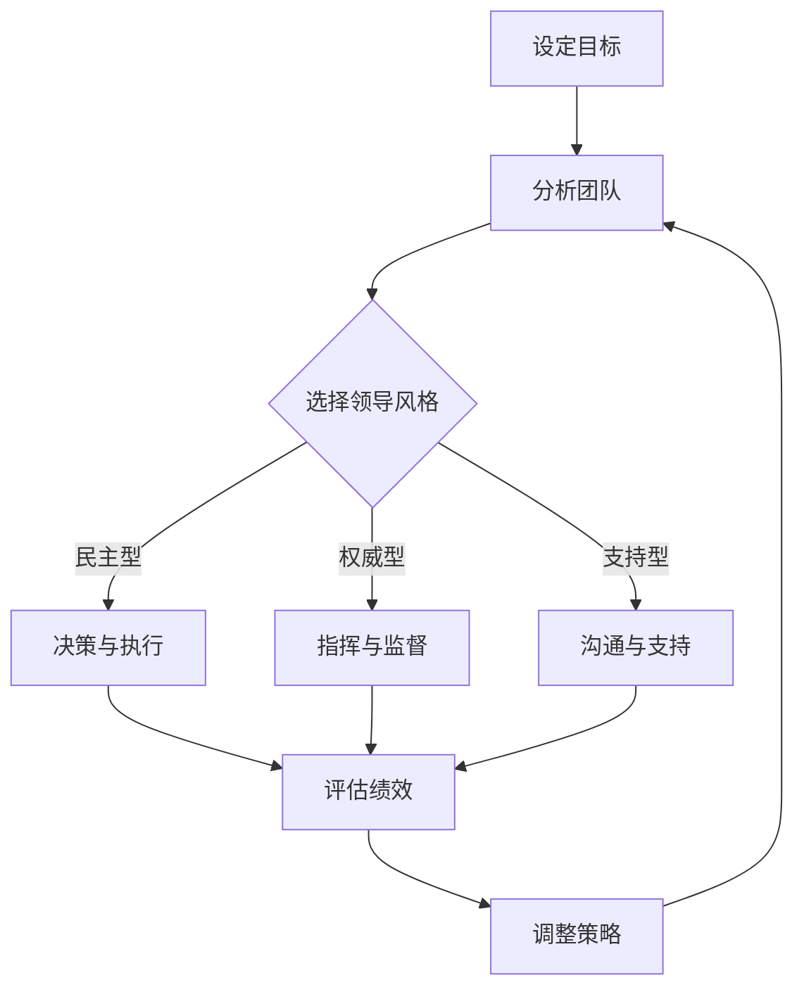
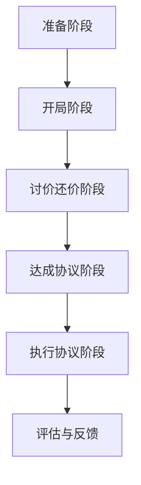
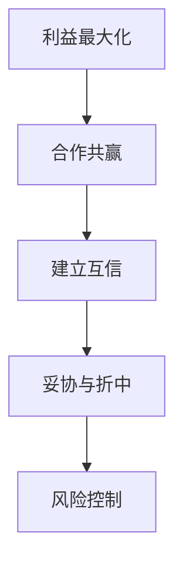
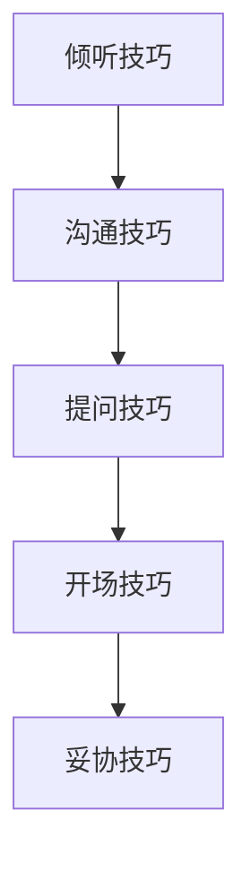

                 

# 《领导力与谈判技巧：为团队争取最大利益》

> **关键词**：领导力、谈判技巧、团队、利益、策略、实践、案例、提升

> **摘要**：本文将探讨领导力与谈判技巧在团队管理中的重要性。我们将详细解析领导力的核心概念与理论，深入探讨领导者的角色与责任，并阐述领导力发展的核心原理。同时，我们将介绍谈判技巧的基本原则、策略和应用，结合实际案例进行实战指导。最后，我们将总结领导力与谈判技巧的结合应用，提供提升方法和建议。

### 《领导力与谈判技巧：为团队争取最大利益》目录大纲

**第一部分：领导力核心概念与理论**

1. **领导力概述**
   - 1.1 领导力的定义与作用
   - 1.2 领导力与管理的区别
   - 1.3 领导力的重要性

2. **领导者的角色与责任**
   - 2.1 领导者的基本职责
   - 2.2 领导者应有的素质与能力
   - 2.3 领导者面临的挑战与应对策略

3. **领导力核心原理**
   - 3.1 领导力发展的三个阶段
   - 3.2 领导风格与团队绩效的关系
   - 3.3 领导者如何激励团队

4. **领导力核心概念联系**
   - 4.1 领导力与心理学
   - 4.2 领导力与组织行为学
   - 4.3 领导力与领导理论的联系

5. **领导力架构的Mermaid流程图**
   - 5.1 领导力架构的组成部分
   - 5.2 领导力架构的工作原理
   - 5.3 领导力架构的实践应用

**第二部分：谈判技巧与策略**

6. **谈判概述**
   - 6.1 谈判的定义与目的
   - 6.2 谈判的基本原则
   - 6.3 谈判的过程与技巧

7. **谈判前的准备**
   - 7.1 谈判前的信息收集
   - 7.2 谈判策略的制定
   - 7.3 谈判团队的构建与分工

8. **谈判中的技巧**
   - 8.1 开场技巧
   - 8.2 沟通技巧
   - 8.3 妥协技巧

9. **谈判中的策略**
   - 9.1 谈判中的竞争策略
   - 9.2 谈判中的合作策略
   - 9.3 谈判中的博弈策略

10. **谈判后的跟进**
    - 10.1 谈判结果的评估
    - 10.2 谈判成果的巩固
    - 10.3 谈判经验的总结与反思

**第三部分：领导力与谈判技巧的结合应用**

11. **领导力与谈判技巧的综合应用**
    - 11.1 领导者在谈判中的角色
    - 11.2 如何利用领导力促进谈判
    - 11.3 如何利用谈判技巧提升领导力

12. **案例分析与实战指导**
    - 12.1 案例分析
      - 12.1.1 案例一：成功谈判案例
      - 12.1.2 案例二：失败谈判案例
    - 12.2 实战指导
      - 12.2.1 实战一：团队建设中的谈判技巧
      - 12.2.2 实战二：项目合作中的谈判策略

13. **领导力与谈判技巧提升**
    - 13.1 自我评估与提升
    - 13.2 团队建设与谈判技巧
    - 13.3 持续学习与改进

**附录**

- 附录A：领导力与谈判技巧资源推荐
  - A.1 书籍推荐
  - A.2 论文推荐
  - A.3 在线课程推荐

- 附录B：谈判技巧的Mermaid流程图
  - B.1 谈判流程图
  - B.2 谈判策略图
  - B.3 谈判技巧图

---

接下来，我们将逐步深入探讨领导力与谈判技巧的核心概念、原理及其在团队管理中的应用。

## 第一部分：领导力核心概念与理论

### 第1章：领导力概述

#### 1.1 领导力的定义与作用

领导力是一种能力，它涉及到影响和激励他人，以实现共同目标的过程。领导力不仅仅是权威的体现，更是影响力的运用。领导者通过自己的行动和价值观来引导团队成员，激发他们的潜力，从而推动团队向前发展。

领导力在团队中的作用至关重要。首先，领导力能够为团队提供明确的方向和目标，帮助团队成员明确自己的职责和使命。其次，领导力能够建立团队的凝聚力，增强团队成员之间的协作和信任。此外，领导力还能够激发团队成员的创造力和创新能力，推动团队不断进步。

#### 1.2 领导力与管理的区别

领导力与管理的概念虽然密切相关，但它们之间还是存在明显的区别。管理侧重于规划、组织、领导和控制，以确保组织目标的实现。而领导力则更侧重于激励和影响他人，以实现共同目标。

领导力强调的是影响力和影响力，它关注的是人的因素，强调领导者与团队成员之间的互动和关系。而管理则更侧重于任务和目标的实现，强调的是效率和效果。

#### 1.3 领导力的重要性

领导力对于团队和组织的成功至关重要。首先，领导力能够推动团队的发展和进步。一个优秀的领导者能够激发团队成员的潜力，推动他们不断学习和成长。其次，领导力能够增强团队的凝聚力，提高团队的整体绩效。最后，领导力还能够为组织带来创新和变革，推动组织持续发展。

### 第2章：领导者的角色与责任

#### 2.1 领导者的基本职责

领导者的基本职责包括以下几个方面：

1. **设定目标和方向**：领导者需要明确团队的目标和愿景，为团队指明前进的方向。
2. **激励团队成员**：领导者需要激发团队成员的积极性，鼓励他们为实现目标而努力。
3. **提供资源和支持**：领导者需要确保团队成员拥有实现目标所需的资源和支持。
4. **沟通与协调**：领导者需要与团队成员保持有效的沟通，协调团队成员之间的工作。
5. **解决问题和冲突**：领导者需要能够及时发现和解决团队中的问题，处理团队成员之间的冲突。

#### 2.2 领导者应有的素质与能力

领导者需要具备以下几方面的素质和能力：

1. **沟通能力**：领导者需要具备良好的沟通能力，能够清晰、有效地传达信息，促进团队成员之间的沟通和理解。
2. **决策能力**：领导者需要具备决策能力，能够在复杂和不确定的环境中做出明智的决策。
3. **团队管理能力**：领导者需要具备团队管理能力，能够建立和培养高效的团队，提高团队的整体绩效。
4. **领导风格**：领导者需要具备适应不同情境的领导风格，能够根据团队和成员的需求进行调整。

#### 2.3 领导者面临的挑战与应对策略

领导者面临的挑战多种多样，包括团队管理、沟通、决策等方面。以下是一些常见的挑战和应对策略：

1. **团队冲突**：领导者需要学会处理团队冲突，通过沟通、协商和调解来解决问题。
2. **沟通障碍**：领导者需要增强沟通能力，确保信息的准确传递和理解。
3. **决策困难**：领导者需要提高决策能力，通过收集信息、分析数据和考虑风险来做出明智的决策。
4. **团队激励**：领导者需要学会激励团队成员，通过表扬、奖励和培训来提高团队成员的积极性和满意度。

### 第3章：领导力核心原理

#### 3.1 领导力发展的三个阶段

领导力发展通常可以分为三个阶段：

1. **第一阶段：新手阶段**：在这个阶段，领导者刚刚开始承担领导职责，他们需要学习和掌握基本的领导技能和知识。
2. **第二阶段：熟练阶段**：在这个阶段，领导者已经具备了丰富的领导经验，他们能够有效地管理团队，实现组织目标。
3. **第三阶段：大师阶段**：在这个阶段，领导者已经达到了领导力的巅峰，他们能够运用高级的领导策略，推动组织实现持续的创新和进步。

#### 3.2 领导风格与团队绩效的关系

领导风格对团队绩效有着重要的影响。不同的领导风格适用于不同的情境和团队，领导者需要根据实际情况灵活调整自己的领导风格。

1. **权威型领导风格**：这种领导风格强调控制力和权威性，适用于需要快速决策和执行的情况。
2. **民主型领导风格**：这种领导风格强调参与和协作，适用于需要团队创新和协作的情况。
3. **支持型领导风格**：这种领导风格强调关心和支持团队成员，适用于需要提高团队成员满意度和工作积极性的情况。

#### 3.3 领导者如何激励团队

领导者需要运用多种策略来激励团队：

1. **设定目标和愿景**：领导者需要明确团队的目标和愿景，激发团队成员的积极性和动力。
2. **表扬和奖励**：领导者需要及时表扬和奖励团队成员的成就和努力，提高他们的工作满意度。
3. **提供培训和发展机会**：领导者需要为团队成员提供培训和发展机会，帮助他们提高技能和能力。
4. **建立良好的工作环境**：领导者需要为团队成员提供良好的工作环境，包括公平、公正、尊重和信任。

### 第4章：领导力核心概念联系

#### 4.1 领导力与心理学

领导力与心理学密切相关，领导者需要了解心理学原理，以便更好地理解和激励团队成员。

1. **动机理论**：领导者需要了解团队成员的动机，以便更好地激发他们的积极性和创造力。
2. **情绪管理**：领导者需要学会管理自己的情绪，以便在压力和挑战面前保持冷静和理智。
3. **社会心理学**：领导者需要了解社会心理学原理，以便更好地处理团队中的冲突和协作。

#### 4.2 领导力与组织行为学

领导力与组织行为学也有密切的联系，领导者需要了解组织行为学的原理，以便更好地管理团队和组织。

1. **团队建设**：领导者需要了解如何建立高效的团队，提高团队的整体绩效。
2. **领导风格**：领导者需要了解不同领导风格对团队绩效的影响，以便选择合适的领导风格。
3. **变革管理**：领导者需要了解如何引导团队适应和组织变革。

#### 4.3 领导力与领导理论的联系

领导力理论为领导者提供了指导和支持，领导者需要了解不同的领导理论，以便在实践中运用。

1. **特质理论**：领导者需要了解自己的特质，以便更好地发挥自己的优势。
2. **行为理论**：领导者需要了解不同的领导行为，以便在实践中运用不同的策略。
3. **情境理论**：领导者需要了解情境对领导力的影响，以便根据实际情况调整自己的领导风格。

### 第5章：领导力架构的Mermaid流程图

为了更好地理解领导力架构，我们可以使用Mermaid流程图进行可视化展示。以下是一个简化的领导力架构流程图：

这个流程图展示了领导力架构的基本组成部分和相互作用。领导者需要根据团队的目标、成员的特点以及实际情况选择合适的领导风格，并在此基础上进行决策、执行、评估和调整。

### 第二部分：谈判技巧与策略

#### 第6章：谈判概述

#### 6.1 谈判的定义与目的

谈判是一种交流和协商的过程，旨在通过双方的合作达成共识和解决冲突。谈判的目的不仅仅是为了达成交易，更重要的是为了建立长期的合作关系和信任。

#### 6.2 谈判的基本原则

谈判的基本原则包括：

1. **双赢原则**：谈判的目标是达成双方都满意的协议，而不是单方面的胜利。
2. **诚信原则**：谈判过程中要遵守诚信原则，保持真实和透明的态度。
3. **尊重原则**：谈判双方需要相互尊重，避免攻击对方的人格或价值观。

#### 6.3 谈判的过程与技巧

谈判通常包括以下几个阶段：

1. **准备阶段**：谈判前需要收集相关信息，分析对方的利益和需求，制定谈判策略。
2. **开局阶段**：开场白和建立良好关系，创造积极的谈判氛围。
3. **讨价还价阶段**：提出各自的利益诉求，进行价格或条件的讨论。
4. **达成协议阶段**：通过妥协和协商，达成双方都能接受的协议。
5. **执行协议阶段**：执行协议，确保协议的落实和履行。

在谈判过程中，以下技巧有助于取得成功：

1. **倾听技巧**：认真倾听对方的意见和需求，了解对方的立场和利益。
2. **沟通技巧**：清晰、准确、有逻辑地表达自己的观点和利益。
3. **提问技巧**：通过提问来获取更多信息，了解对方的真实意图。
4. **妥协技巧**：在利益冲突时，通过妥协和折中来达成共识。

### 第7章：谈判前的准备

#### 7.1 谈判前的信息收集

在谈判前，领导者需要收集尽可能多的信息，包括对方的利益、需求、历史记录、市场趋势等。这些信息有助于制定有效的谈判策略。

#### 7.2 谈判策略的制定

谈判策略的制定包括以下几个方面：

1. **目标设定**：明确自己的谈判目标和底线。
2. **利益诉求**：明确自己的利益诉求，并考虑对方的利益诉求。
3. **备选方案**：制定备选方案，以便在谈判过程中应对各种情况。
4. **策略选择**：根据对方的利益诉求和自己的谈判目标，选择合适的谈判策略。

#### 7.3 谈判团队的构建与分工

谈判团队应由具备相关知识和经验的人组成，包括谈判专家、法律顾问、财务顾问等。团队成员需要明确各自的职责和任务，以确保谈判的顺利进行。

### 第8章：谈判中的技巧

#### 8.1 开场技巧

开场技巧对于建立良好的谈判氛围至关重要。以下是一些有效的开场技巧：

1. **建立联系**：通过问候、介绍和讨论共同感兴趣的话题来建立联系。
2. **设定基调**：通过积极的语言和态度来设定积极的谈判基调。
3. **提出问题**：通过提问来了解对方的观点和需求，同时展示自己的专业知识和诚意。

#### 8.2 沟通技巧

有效的沟通是谈判成功的关键。以下是一些有效的沟通技巧：

1. **清晰表达**：用简单、明确的语言表达自己的观点和利益。
2. **倾听技巧**：认真倾听对方的意见和需求，避免打断或插话。
3. **非语言沟通**：注意使用肢体语言、面部表情和语调等非语言沟通方式，以增强沟通效果。

#### 8.3 妥协技巧

在谈判中，妥协是达成共识的重要手段。以下是一些有效的妥协技巧：

1. **提出双赢方案**：在谈判中提出一个既能满足自己利益又能满足对方利益的方案。
2. **灵活调整**：在谈判过程中，根据对方的反馈和自己的目标，灵活调整自己的利益诉求和谈判策略。
3. **分步妥协**：在关键问题上分步妥协，以实现最终的目标。

### 第9章：谈判中的策略

#### 9.1 谈判中的竞争策略

谈判中的竞争策略主要包括以下几点：

1. **利益最大化**：在谈判中争取最大的利益，通过合理的策略和技巧来增加自己的议价能力。
2. **威胁与反威胁**：在谈判中运用威胁和反威胁来增强自己的谈判地位，迫使对方让步。
3. **限制条件**：在谈判中设置一定的限制条件，以限制对方的行动空间，增加自己的谈判优势。

#### 9.2 谈判中的合作策略

谈判中的合作策略主要包括以下几点：

1. **建立互信**：通过建立互信和合作关系来降低谈判的紧张气氛，促进谈判的顺利进行。
2. **共同目标**：在谈判中设定共同的目标，通过合作来实现这些目标。
3. **资源共享**：在谈判中通过资源共享来增加双方的收益，实现双赢。

#### 9.3 谈判中的博弈策略

谈判中的博弈策略主要包括以下几点：

1. **策略性欺骗**：在谈判中运用策略性欺骗来获取对方的信息，增加自己的谈判优势。
2. **时间策略**：通过控制谈判的时间来影响对方的决策，达到自己的目的。
3. **替代方案**：在谈判中提出替代方案，以增加自己的谈判地位。

### 第10章：谈判后的跟进

#### 10.1 谈判结果的评估

谈判结束后，领导者需要对谈判结果进行评估，以确定谈判的成功程度和存在的问题。以下是一些评估指标：

1. **目标达成度**：谈判结果是否达到了预期的目标。
2. **利益实现度**：谈判结果是否实现了双方的利益诉求。
3. **合作满意度**：双方对谈判结果的满意程度。

#### 10.2 谈判成果的巩固

谈判成果的巩固是确保谈判成功的关键。以下是一些巩固谈判成果的方法：

1. **协议书**：将谈判结果以书面形式明确下来，并签署协议书，以作为双方遵守的依据。
2. **执行计划**：制定详细的执行计划，明确双方的职责和任务，确保谈判成果的落实。
3. **监督与反馈**：建立监督机制，对谈判成果的执行情况进行跟踪和反馈，及时解决问题。

#### 10.3 谈判经验的总结与反思

谈判经验的总结与反思是提高谈判能力的重要途径。以下是一些总结和反思的方法：

1. **记录谈判过程**：详细记录谈判的过程和结果，包括对方的观点、自己的策略和表现等。
2. **分析成功和失败的原因**：分析谈判中的成功和失败原因，总结经验教训。
3. **持续学习与改进**：通过学习最新的谈判理论和技巧，不断提高自己的谈判能力。

### 第三部分：领导力与谈判技巧的结合应用

#### 第11章：领导力与谈判技巧的综合应用

#### 11.1 领导者在谈判中的角色

领导者在谈判中扮演着关键的角色，他们不仅需要代表团队进行谈判，还需要协调团队内部的意见和利益，确保谈判的顺利进行。

1. **代表团队**：领导者需要明确自己的立场和利益，代表团队与对方进行谈判。
2. **协调团队**：领导者需要与团队成员保持沟通，了解他们的观点和需求，协调团队内部的意见和利益。
3. **决策与执行**：领导者需要根据谈判的进展和团队的意见做出决策，并确保决策的执行。

#### 11.2 如何利用领导力促进谈判

领导力可以促进谈判的顺利进行，以下是一些利用领导力促进谈判的方法：

1. **建立信任**：通过建立信任和合作关系来降低谈判的紧张气氛，促进谈判的顺利进行。
2. **激励团队**：通过激励团队成员，提高他们的积极性和合作意愿，推动谈判的进展。
3. **沟通协调**：通过有效的沟通和协调，确保团队成员的意见和利益得到充分表达和尊重。

#### 11.3 如何利用谈判技巧提升领导力

谈判技巧是领导者提升领导力的重要工具，以下是一些利用谈判技巧提升领导力的方法：

1. **制定策略**：通过制定谈判策略，提高自己的决策能力和战略思维。
2. **沟通技巧**：通过提高沟通技巧，增强自己的表达能力和影响力。
3. **妥协能力**：通过提高妥协能力，增强自己的团队领导和协调能力。

### 第12章：案例分析与实战指导

#### 12.1 案例分析

#### 12.1.1 案例一：成功谈判案例

**案例背景**：一家软件公司需要与一家硬件公司合作开发一款新产品，双方就合作条款进行了谈判。

**谈判策略**：
1. **信息收集**：双方在谈判前收集了对方的历史合作记录、市场趋势和竞争对手等信息。
2. **目标设定**：双方明确了各自的利益诉求，并设定了谈判的目标。
3. **协商与妥协**：双方在谈判中进行了多轮协商，通过妥协和折中达成了共识。

**结果**：双方成功达成了合作条款，合作顺利进行，新产品顺利推出并获得了良好的市场反响。

#### 12.1.2 案例二：失败谈判案例

**案例背景**：一家科技公司需要与一家专利公司合作，但双方在专利费用问题上出现了分歧。

**谈判策略**：
1. **信息不足**：双方在谈判前没有充分了解对方的专利价值和市场需求。
2. **立场强硬**：双方在谈判中坚持各自的立场，没有进行有效的协商和妥协。
3. **沟通不畅**：双方在谈判过程中沟通不畅，导致谈判进展缓慢。

**结果**：双方未能达成协议，合作未能实现。

#### 12.2 实战指导

#### 12.2.1 实战一：团队建设中的谈判技巧

**背景**：公司需要组建一个跨部门团队来完成一个重要项目。

**步骤**：
1. **信息收集**：了解各部门的需求和利益诉求。
2. **目标设定**：明确团队的目标和愿景。
3. **协商与妥协**：通过谈判技巧，协调各部门的意见和利益，达成共识。
4. **执行与监督**：确保团队目标的实现，并进行监督和反馈。

**技巧**：
1. **建立互信**：通过建立互信和合作关系，提高团队的协作效率。
2. **沟通技巧**：通过有效的沟通，确保各部门的信息畅通和意见表达。
3. **灵活调整**：根据实际情况，灵活调整谈判策略和团队目标。

#### 12.2.2 实战二：项目合作中的谈判策略

**背景**：公司与另一家公司合作开发一款新产品。

**步骤**：
1. **信息收集**：了解合作公司的背景、技术和市场需求。
2. **目标设定**：明确双方的合作目标和利益诉求。
3. **协商与妥协**：通过谈判策略，协调双方的利益和风险，达成共识。
4. **执行与评估**：确保合作项目的顺利进行，并进行定期评估和调整。

**策略**：
1. **利益最大化**：在谈判中争取最大的利益，同时考虑对方的利益。
2. **建立互信**：通过建立互信和合作关系，降低合作风险。
3. **合作共赢**：通过合作共赢的理念，推动项目的顺利进行。

### 第13章：领导力与谈判技巧提升

#### 13.1 自我评估与提升

领导者需要定期进行自我评估，以了解自己的领导力和谈判能力，并制定提升计划。

**评估方法**：
1. **360度反馈**：通过团队成员和其他相关人员的反馈，了解自己的优势和不足。
2. **自我反思**：通过反思自己的行为和决策，分析自己的表现和效果。
3. **培训和学习**：参加领导力培训和研讨会，学习最新的领导力和谈判技巧。

**提升方法**：
1. **实践**：通过实际操作和项目实践，提高自己的领导力和谈判能力。
2. **模仿和学习**：观察和学习其他优秀领导者的行为和策略，借鉴他们的经验。
3. **反思与总结**：通过反思和总结，不断改进自己的领导力和谈判技巧。

#### 13.2 团队建设与谈判技巧

团队建设和谈判技巧的提升是领导者的重要任务，以下是一些具体的方法：

**团队建设方法**：
1. **沟通与协作**：建立良好的沟通机制，促进团队成员之间的协作和合作。
2. **激励与奖励**：通过激励和奖励，提高团队成员的积极性和满意度。
3. **培训与发展**：为团队成员提供培训和发展机会，提高他们的技能和能力。

**谈判技巧提升方法**：
1. **信息收集**：通过信息收集，了解对方的利益和需求，制定有效的谈判策略。
2. **模拟谈判**：通过模拟谈判，提高自己的谈判技巧和应对能力。
3. **反思与总结**：通过反思和总结，不断改进自己的谈判策略和技巧。

#### 13.3 持续学习与改进

领导力和谈判技巧的提升是一个持续的过程，领导者需要不断学习和改进。

**学习方法**：
1. **阅读与研究**：阅读相关的书籍和论文，研究最新的领导力和谈判理论。
2. **实践与应用**：将理论应用于实际工作中，通过实践来提高自己的能力。
3. **交流与分享**：与同行和专家进行交流，分享经验和教训，互相学习和进步。

**改进方法**：
1. **反思与总结**：通过反思和总结，发现自己的不足和改进的方向。
2. **调整与改进**：根据反思的结果，调整自己的策略和方法，进行改进。
3. **持续跟踪与评估**：对改进的效果进行跟踪和评估，确保改进的有效性。

### 附录

#### 附录A：领导力与谈判技巧资源推荐

**A.1 书籍推荐**

1. 《领导力的五个层次》（The Five Levels of Leadership）- 威廉·布林顿（John C. Maxwell）
2. 《谈判力》（Getting to Yes）- 罗杰·费舍尔（Roger Fisher）、威廉·尤里（William Ury）、布鲁斯·帕顿（Bruce Patton）
3. 《影响力》（Influence: The Psychology of Persuasion）- 罗伯特·西奥迪尼（Robert B. Cialdini）

**A.2 论文推荐**

1. “Leadership and Trust: The Trust-Enriched Relationship”- 比尔·乔治（Bill George）
2. “Negotiation Strategies for Managers”- 罗伯特·凯斯（Robert H. Kiesler）
3. “The Importance of Emotional Intelligence in Leadership”- 丹尼尔·戈尔曼（Daniel Goleman）

**A.3 在线课程推荐**

1. Coursera上的《领导力与谈判技巧》课程
2. edX上的《高级谈判技巧》课程
3. Udemy上的《领导力与团队管理》课程

### 附录B：谈判技巧的Mermaid流程图

#### B.1 谈判流程图

#### B.2 谈判策略图

#### B.3 谈判技巧图

---

通过本文的探讨，我们深入了解了领导力与谈判技巧在团队管理中的重要性。领导者需要通过有效的领导力和谈判技巧，为团队争取最大利益，推动团队的发展和进步。希望本文能为您提供有益的参考和启示。在未来的工作中，不断实践和提升自己的领导力和谈判技巧，为团队和组织创造更大的价值。

