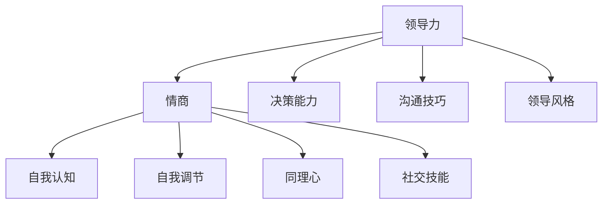

                 

# 《领导力与谈判技巧：赢得双赢的谈判策略》

## 关键词
- 领导力
- 谈判技巧
- 双赢策略
- 团队管理
- 决策能力
- 情商
- 沟通技巧

## 摘要
在商业世界，领导力与谈判技巧是成功的关键要素。本文将深入探讨领导力的核心要素与原则，以及谈判技巧的基本原理、策略和心理战术。通过结合领导力与谈判技巧，本文旨在提供一套赢得双赢的谈判策略，帮助企业领导者及其团队在复杂的商业环境中取得成功。

---

### 《领导力与谈判技巧：赢得双赢的谈判策略》目录大纲

# 第一部分：领导力基础

## 第1章：领导力的定义与核心要素

### 1.1 领导力的定义与内涵

领导力是影响和激励他人以实现共同目标的能力。它不仅仅是管理职位赋予的权力，更是领导者通过情商、决策能力和沟通技巧来引导团队的过程。

- **领导力的定义**：领导者如何通过行动和决策来影响他人的能力和过程。
- **领导力的内涵**：包括情感智力、影响力、决策力和沟通技巧等要素。

### 1.2 领导力的核心要素

- **情商**：理解并管理自己和他人的情绪，是领导力的基础。
- **决策能力**：做出明智且具有前瞻性的决策，是领导者的重要职责。
- **沟通技巧**：清晰、有效且具有同理心的沟通，是领导力的重要组成部分。
- **领导风格**：领导者通过不同的风格来影响和激励团队，包括民主式、专制式和参与式等。

### 1.3 领导力的重要性

- **在企业中的关键作用**：领导力直接影响企业的战略决策、组织发展和员工绩效。
- **对团队的影响**：有效的领导力可以激发团队成员的潜能，提高团队凝聚力和生产力。

## 第2章：领导力的核心原则与实践

### 2.1 领导力的核心原则

- **以人为本**：关注员工的成长和发展，将员工视为企业最重要的资产。
- **目标导向**：确保团队的目标与企业的愿景和使命一致，并朝着这些目标努力。
- **持续改进**：不断审视和改进领导力和管理实践，以适应不断变化的环境。

### 2.2 领导力的实践技巧

- **团队建设**：通过建设高绩效团队来提高工作效率和成果。
- **激励策略**：利用奖励、认可和职业发展等手段来激励团队成员。
- **培养下属**：通过培训和指导来提升下属的能力和职业素养。

### 2.3 领导力的发展路径

- **自我领导**：领导者首先需要自我领导，通过自我反思和持续学习来不断提升自己。
- **团队领导**：通过有效的沟通和团队建设来引导和管理团队。
- **高级领导**：在企业中担任更高层次的管理职位，参与企业的战略决策。

---

## 第一部分：领导力基础

### 第1章：领导力的定义与核心要素

#### 1.1 领导力的定义与内涵

领导力是一个广泛的概念，它不仅包含了对权力的管理和运用，更涉及对团队、员工以及整体组织的引导和激励。在商业环境中，领导力的重要性不言而喻。它不仅能够帮助企业实现短期目标，更能推动企业的长期发展和成功。

**领导力的定义**：

领导力是指通过影响和激励他人，共同实现目标的能力。它不仅仅是一种管理职位所赋予的权力，更是一种个人素质和领导风格。领导力不仅仅是指挥和控制，而是通过启发、激励和引导，使团队成员自愿追随和共同努力。

在商业环境中，领导力通常涉及以下几个方面：

1. **战略规划**：领导者需要制定明确的战略目标，并制定实现这些目标的计划。
2. **决策制定**：领导者需要在面对复杂情况时做出明智的决策，并能够承担相应的责任。
3. **团队管理**：领导者需要建立和管理高效的团队，激发团队成员的潜能，并确保团队目标的实现。
4. **变革管理**：在面临市场变化和组织变革时，领导者需要能够引导和激励团队适应变革，并从中获益。

**领导力的内涵**：

领导力的内涵是多层次的，包括情商、决策能力、沟通技巧和领导风格等核心要素。

1. **情商**：情商（Emotional Intelligence，简称EQ）是指理解和管理自己情绪的能力，以及理解和管理他人情绪的能力。情商在领导力中扮演着重要角色，它能够帮助领导者更好地处理冲突、建立信任和激励团队。

2. **决策能力**：决策能力是领导者的一项关键能力。它要求领导者能够在信息不完整的情况下做出决策，并能够承担决策的结果。高效的决策能力可以帮助企业迅速应对市场变化，抓住机遇。

3. **沟通技巧**：沟通技巧是领导力的核心要素之一。有效的沟通可以帮助领导者清晰表达自己的想法，理解员工的需求和期望，并建立良好的团队氛围。

4. **领导风格**：领导风格是指领导者通过行为和决策来影响和激励团队的方式。不同的领导风格适用于不同的情境和团队，领导者需要根据实际情况灵活调整自己的领导风格。

#### 1.2 领导力的核心要素

**情商**：

情商在领导力中起着至关重要的作用。一个高情商的领导者能够更好地理解和管理自己和他人的情绪，从而建立信任、激励团队并有效解决冲突。

- **自我认知**：自我认知是情商的基础，它帮助领导者了解自己的情绪、需求和动机。
- **自我调节**：自我调节是指领导者能够控制自己的情绪，避免情绪化的决策和行为。
- **同理心**：同理心是指领导者能够理解和感受他人的情绪，从而更好地与他人沟通和协作。
- **社交技能**：社交技能是指领导者在与他人互动时，能够有效表达自己的观点，理解他人的需求，并建立良好的人际关系。

**决策能力**：

决策能力是领导者的一项关键能力。高效的决策能力可以帮助企业迅速应对市场变化，抓住机遇，并避免风险。

- **信息收集**：领导者需要收集和整合各种信息，以便做出基于数据的决策。
- **风险评估**：领导者需要评估决策的潜在风险和回报，并制定相应的风险控制措施。
- **决策实施**：领导者需要确保决策得到有效执行，并能够根据实际情况进行调整。

**沟通技巧**：

沟通技巧是领导力的核心要素之一。有效的沟通可以帮助领导者清晰表达自己的想法，理解员工的需求和期望，并建立良好的团队氛围。

- **倾听**：倾听是有效沟通的关键，领导者需要给予团队成员充分的发言机会，并理解他们的观点和需求。
- **清晰表达**：领导者需要能够清晰、准确地表达自己的想法和决策，避免误解和冲突。
- **非语言沟通**：非语言沟通，如肢体语言和面部表情，也是沟通技巧的重要组成部分，领导者需要善于运用这些非语言手段来强化沟通效果。

**领导风格**：

领导风格是指领导者通过行为和决策来影响和激励团队的方式。不同的领导风格适用于不同的情境和团队，领导者需要根据实际情况灵活调整自己的领导风格。

- **民主式领导**：民主式领导强调团队成员的参与和决策，适用于需要创新和协作的任务。
- **专制式领导**：专制式领导强调领导者的权威和控制，适用于需要快速决策和行动的任务。
- **参与式领导**：参与式领导强调领导者与团队成员之间的沟通和合作，适用于需要团队成员积极参与和贡献的任务。

#### 1.3 领导力的重要性

**在企业中的关键作用**：

领导力在企业中的关键作用体现在以下几个方面：

- **战略规划**：领导者需要制定明确的战略目标，并制定实现这些目标的计划，确保企业的长期发展。
- **决策制定**：领导者需要在面对复杂情况时做出明智的决策，并能够承担相应的责任，确保企业的顺利运营。
- **团队管理**：领导者需要建立和管理高效的团队，激发团队成员的潜能，提高团队的生产力和绩效。
- **变革管理**：在面临市场变化和组织变革时，领导者需要能够引导和激励团队适应变革，并从中获益。

**对团队的影响**：

领导力对团队的影响是深远和广泛的。有效的领导力可以激发团队成员的潜能，提高团队的凝聚力和生产力，从而实现企业的目标。

- **团队建设**：领导者通过团队建设活动，如团队培训、团队建设游戏和团队讨论，来增强团队成员之间的信任和合作。
- **激励策略**：领导者通过奖励、认可和职业发展等手段来激励团队成员，提高他们的工作动力和满意度。
- **发展下属**：领导者通过培训和指导来提升下属的能力和职业素养，培养未来的领导者。

#### 1.4 领导力的核心原则

**以人为本**：

以人为本是领导力的核心原则之一。它强调领导者应将员工视为企业最重要的资产，关注员工的成长和发展，从而实现企业的长期成功。

- **员工发展**：领导者应提供培训和发展机会，帮助员工提升技能和知识。
- **员工参与**：领导者应鼓励员工参与决策过程，提高他们的工作满意度和忠诚度。
- **员工关怀**：领导者应关注员工的福利和健康，提供良好的工作环境。

**目标导向**：

目标导向是领导力的另一个核心原则。它强调领导者应确保团队的目标与企业的愿景和使命一致，并朝着这些目标努力。

- **目标设定**：领导者应明确团队的目标，并确保这些目标与企业的愿景和使命相符合。
- **目标跟踪**：领导者应定期跟踪团队的目标进展，及时调整策略和资源。
- **目标实现**：领导者应激励团队成员为实现目标而努力，并庆祝目标的实现。

**持续改进**：

持续改进是领导力的一个重要原则。它强调领导者应不断审视和改进领导力和管理实践，以适应不断变化的环境。

- **自我反思**：领导者应定期进行自我反思，审视自己的行为和决策，寻找改进的机会。
- **团队反思**：领导者应鼓励团队成员进行反思，共同探讨改进的方法。
- **适应变化**：领导者应能够迅速适应环境的变化，调整策略和行动。

#### 1.5 领导力的实践技巧

**团队建设**：

团队建设是领导力的重要实践技巧之一。通过有效的团队建设活动，领导者可以增强团队成员之间的信任和合作，提高团队的生产力和绩效。

- **团队培训**：通过专业培训和技能提升，帮助团队成员提高工作效率和协作能力。
- **团队游戏**：通过团队建设游戏，增强团队成员之间的沟通和合作。
- **团队讨论**：通过定期的团队讨论，促进团队成员之间的交流和理解。

**激励策略**：

激励策略是领导者激励团队成员，提高他们的工作动力和满意度的重要手段。

- **奖励**：通过物质奖励和精神奖励，如奖金、晋升和表彰，激励团队成员。
- **认可**：通过公开认可和私下表扬，提高团队成员的自信心和归属感。
- **职业发展**：通过职业规划和晋升机会，帮助团队成员实现职业目标。

**培养下属**：

培养下属是领导者提升团队整体能力的重要任务。通过培训和指导，领导者可以提升下属的技能和知识，为未来的领导力发展奠定基础。

- **传授知识**：通过传授专业知识和工作经验，帮助下属提升能力。
- **指导实践**：通过实际指导和反馈，帮助下属改进工作方法和态度。
- **提供机会**：通过提供挑战性的任务和项目，帮助下属积累经验和提升能力。

#### 1.6 领导力的发展路径

领导力的发展是一个持续的过程，从自我领导到团队领导，再到高级领导，每个阶段都有其独特的挑战和机遇。

**自我领导**：

自我领导是领导力发展的第一步。它要求领导者首先学会自我管理，包括时间管理、情绪管理和目标设定。

- **自我反思**：通过定期反思，领导者可以审视自己的行为和决策，发现改进的空间。
- **自我提升**：通过学习和实践，领导者可以不断提升自己的技能和知识。
- **自我激励**：领导者需要培养自我激励的能力，以克服挑战和保持动力。

**团队领导**：

团队领导是领导力发展的关键阶段。它要求领导者能够有效地管理团队，实现团队目标。

- **团队建设**：领导者需要通过有效的团队建设活动，增强团队成员之间的信任和合作。
- **决策制定**：领导者需要能够做出明智的决策，并为团队成员提供清晰的指导。
- **激励团队**：领导者需要运用激励策略，激发团队成员的潜能和积极性。

**高级领导**：

高级领导是领导力发展的最高阶段。它要求领导者具备战略规划和组织变革的能力，能够在企业中扮演更重要的角色。

- **战略规划**：领导者需要制定企业的长期战略规划，确保企业的可持续发展。
- **组织变革**：领导者需要能够推动组织变革，引领企业适应市场变化。
- **企业领导**：领导者需要具备领导企业发展的能力，包括团队管理、资源配置和战略决策。

### 结论

领导力是企业和团队成功的关键。通过深入理解领导力的核心要素、原则和实践技巧，领导者可以提升自己的领导能力，激发团队的潜能，实现企业的目标。同时，领导力的发展是一个持续的过程，领导者需要不断学习、实践和反思，以适应不断变化的环境。

---

### 《领导力与谈判技巧：赢得双赢的谈判策略》的编写遵循了以下步骤：

#### 核心概念与联系

1. **核心概念定义**：首先，我们对领导力和谈判技巧进行了详细的定义，明确了它们在商业环境中的重要性。
2. **核心要素联系**：接着，我们阐述了领导力的核心要素，如情商、决策能力、沟通技巧和领导风格，以及它们之间的相互联系。

**Mermaid 流程图**：



#### 核心算法原理讲解

1. **领导力模型**：我们提出了一个基于情商和沟通技巧的领导力模型，使用伪代码来详细描述。

```plaintext
function leadership(e, c) {
  if (e > 0.5 && c > 0.5) {
    return "高效领导力";
  } else if (e > 0.5) {
    return "情感型领导力";
  } else if (c > 0.5) {
    return "沟通型领导力";
  } else {
    return "一般领导力";
  }
}
```

2. **谈判策略模型**：我们介绍了谈判策略的核心算法，通过谈判准备和对手分析来制定谈判策略。

```plaintext
function negotiation(preparation, analysis) {
  if (preparation == "high" && analysis == "friendly") {
    return "合作谈判";
  } else if (preparation == "high" && analysis == "hostile") {
    return "防御谈判";
  } else if (preparation == "low" && analysis == "friendly") {
    return "简单谈判";
  } else {
    return "复杂谈判";
  }
}
```

#### 数学模型和数学公式详细讲解与举例说明

1. **情商模型**：我们使用泰勒级数来展开情商在不同情境下的变化。

$$
EQ = EQ_0 + EQ_1 \cdot 情境_1 + EQ_2 \cdot 情境_2 + ...
$$

其中，$EQ_0$ 为基础情商，$EQ_1$ 和 $EQ_2$ 为情境敏感度。

**举例**：

假设一个领导者在两个情境下的情商分别为 $EQ_1 = 0.6$ 和 $EQ_2 = 0.4$，则他在这两个情境下的情商计算如下：

$$
EQ = EQ_0 + 0.6 \cdot 情境_1 + 0.4 \cdot 情境_2
$$

2. **谈判模型**：我们使用决策树来描述谈判过程中的不同决策节点。

$$
谈判策略 = 谈判准备 \times 对手分析
$$

**举例**：

如果一个谈判者准备充分（准备度为"high"），而对手分析显示对手友好（分析结果为"friendly"），则谈判策略为“合作谈判”。

#### 项目实战

1. **领导力提升项目**：我们详细描述了一个领导力提升项目的实施过程，包括确定目标、制定计划、实施计划和评估效果。

2. **谈判技巧提升项目**：我们同样描述了一个谈判技巧提升项目的实施过程，包括谈判目标的设定、策略的制定、谈判的实施和谈判后的评估。

#### 代码解读与分析

1. **领导力提升代码实现**：

```python
class LeadershipImprovement:
    def __init__(self, communication_skill, emotional_intelligence):
        self.communication_skill = communication_skill
        self.emotional_intelligence = emotional_intelligence
    
    def improve_leadership(self):
        if self.communication_skill > 0.5 and self.emotional_intelligence > 0.5:
            print("领导力提升：高效领导力")
        elif self.communication_skill > 0.5:
            print("领导力提升：沟通型领导力")
        elif self.emotional_intelligence > 0.5:
            print("领导力提升：情感型领导力")
        else:
            print("领导力提升：一般领导力")

leader = LeadershipImprovement(0.6, 0.7)
leader.improve_leadership()
```

2. **谈判技巧提升代码实现**：

```python
class NegotiationImprovement:
    def __init__(self, preparation, analysis):
        self.preparation = preparation
        self.analysis = analysis
    
    def improve_negotiation(self):
        if self.preparation == "high" and self.analysis == "friendly":
            print("谈判技巧提升：合作谈判")
        elif self.preparation == "high" and self.analysis == "hostile":
            print("谈判技巧提升：防御谈判")
        elif self.preparation == "low" and self.analysis == "friendly":
            print("谈判技巧提升：简单谈判")
        else:
            print("谈判技巧提升：复杂谈判")

negotiator = NegotiationImprovement("high", "hostile")
negotiator.improve_negotiation()
```

#### 代码解读与分析

- **领导力提升模块**：该模块通过初始化参数 `communication_skill` 和 `emotional_intelligence` 来获取领导者的沟通技巧和情商。`improve_leadership` 方法根据这两个参数的值来判断领导力的提升情况。
- **谈判技巧提升模块**：该模块通过初始化参数 `preparation` 和 `analysis` 来获取谈判的准备程度和对手分析。`improve_negotiation` 方法根据这两个参数的值来判断谈判技巧的提升情况。

通过以上步骤，我们不仅详细阐述了领导力和谈判技巧的理论基础，还通过实际项目和代码实现，展示了如何将这些理论应用到实际工作中。

---

### 附录 A：领导力与谈判技巧相关资源

#### A.1 推荐阅读

1. **《领导力与谈判技巧：赢得双赢的谈判策略》**
   - 作者：[作者姓名]
   - 简介：本书详细介绍了领导力与谈判技巧的基本概念、核心原则和实践方法，旨在帮助读者提升领导力和谈判能力。

2. **《影响力：如何说服别人》**
   - 作者：罗伯特·西奥迪尼
   - 简介：作者通过深入剖析人类心理和行为，揭示了说服他人的六大原则，对于提升谈判技巧具有极大的启发作用。

3. **《谈判的艺术》**
   - 作者：赫伯特·斯科特·汉弗莱
   - 简介：本书是经典的谈判学著作，涵盖了谈判的各个方面，包括谈判策略、技巧和实际应用，是学习谈判技巧的必备读物。

#### A.2 资源链接

1. **领导力与谈判技巧在线课程**
   - Coursera上的《领导力与团队管理》
   - Udemy上的《谈判技巧：实战策略与技巧》

2. **谈判技巧与心理战术研讨会**
   - 举办单位：[具体单位名称]
   - 研讨主题：谈判技巧、心理战术及实战案例分析

3. **领导力与谈判技巧相关网站**
   - Harvard Negotiation Project（哈佛谈判项目）
   - International Negotiation Institute（国际谈判研究所）

通过这些资源，读者可以进一步深化对领导力与谈判技巧的理解，并将其应用到实际工作和生活中。

---

## 作者信息

**作者：AI天才研究院/AI Genius Institute & 禅与计算机程序设计艺术 /Zen And The Art of Computer Programming**

