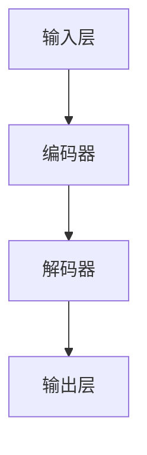

                 

## 第一部分: 引言

### 第1章: AI不确定性概述

#### 1.1 AI不确定性的定义与类型

人工智能（AI）的不确定性是指在人工智能系统设计和应用过程中，由于数据、算法、环境等因素的复杂性和不确定性，导致系统输出难以预测和可靠性的问题。AI不确定性可以分为两大类：模型不确定性（Model Uncertainty）和输入不确定性（Input Uncertainty）。

- **模型不确定性**：由于模型本身的能力限制，模型对某些问题或数据的预测结果可能存在偏差或误差。
- **输入不确定性**：输入数据的噪声、不完整性或变化性也可能导致模型输出结果的不可靠。

在AI系统中，不确定性问题主要体现在以下几个方面：

1. **预测准确性**：AI模型可能无法准确预测未知数据的特征或行为。
2. **决策合理性**：AI系统的决策过程可能受到不确定性的影响，导致决策结果不合理。
3. **鲁棒性**：AI系统在面临异常或噪声输入时，可能无法保持稳定性和可靠性。

为了应对这些不确定性，我们需要增强AI系统的可控性和可解释性，从而提高其在实际应用中的可靠性和安全性。

#### 1.2 AI不确定性的来源

AI不确定性的来源主要包括以下几个方面：

1. **数据不完整或噪声**：真实世界中的数据通常是不完整或包含噪声的，这可能导致模型训练过程中无法获得足够的信息，从而影响模型的预测性能。
2. **模型复杂度**：高复杂度的模型可能在某些情况下表现出较好的预测能力，但也容易受到数据噪声和偏差的影响。
3. **算法假设**：许多AI算法都基于特定的假设，如线性可分性、独立同分布等，这些假设在现实世界中往往不成立。
4. **环境变化**：现实世界的环境是动态变化的，AI系统需要具备适应性和鲁棒性，以应对环境的变化。

#### 1.3 不确定性在AI系统中的影响

AI不确定性对系统的影响是多方面的：

1. **降低系统可靠性**：由于不确定性，AI系统可能在某些情况下产生错误的预测或决策，降低系统的可靠性。
2. **影响用户体验**：当AI系统的预测结果不可靠时，用户体验将受到影响，可能导致用户对系统的信任度降低。
3. **法律和伦理问题**：在涉及法律和伦理的领域，如医疗诊断、自动驾驶等，不确定性的存在可能导致严重的后果。
4. **经济成本**：由于不确定性，AI系统可能需要额外的资源来验证和纠正预测结果，从而增加经济成本。

#### 1.4 增强LLM可控性的目的和重要性

增强大型语言模型（LLM）的可控性具有重要意义，其主要目的包括：

1. **提高预测可靠性**：通过降低模型不确定性和输入不确定性，提高LLM在预测和决策中的可靠性。
2. **增强系统可解释性**：提高LLM的可解释性，使人们能够理解和信任模型的行为，从而增强其在实际应用中的可接受性。
3. **降低经济成本**：通过提高模型的稳定性和可靠性，减少由于不确定性导致的错误预测和决策，从而降低经济成本。
4. **提升用户体验**：增强LLM的可控性，可以提高用户体验，增加用户对AI系统的信任度。

总之，驾驭AI的不确定性，增强LLM的可控性，是当前和未来AI系统发展的重要方向，具有深远的现实意义和广阔的应用前景。

### 第2章: 语言模型LLM基础

#### 2.1 语言模型的基本概念

语言模型（Language Model，简称LM）是一种统计模型，用于对自然语言文本的概率分布进行建模。语言模型的主要任务是预测给定前文序列后下一个单词或字符的概率分布。

- **目标函数**：语言模型的目标函数通常是最大化文本的概率，即最大化后文序列的概率。
- **表示方法**：语言模型可以用一组参数表示，这些参数通过训练数据学习得到。常见的表示方法包括n-gram模型、神经网络语言模型（如循环神经网络RNN、Transformer等）。

#### 2.2 LLM的类型和特点

大型语言模型（Large Language Model，简称LLM）是一类具有强大语言理解和生成能力的模型，其特点如下：

1. **规模庞大**：LLM通常具有数十亿到数万亿个参数，这使得它们在处理大规模语言数据时具有出色的性能。
2. **泛化能力**：由于规模庞大，LLM可以学习到语言中的复杂模式和规律，从而具备较强的泛化能力。
3. **语言理解与生成**：LLM不仅能够生成自然语言文本，还可以理解文本的含义和逻辑结构，这使得它们在自然语言处理（NLP）任务中具有广泛的应用。
4. **多语言支持**：一些LLM模型支持多语言输入和输出，这使得它们在全球范围内的应用更加广泛。

#### 2.3 LLM的组成与结构

LLM的组成和结构通常包括以下几个关键部分：

1. **输入层**：接收自然语言文本输入，并将其转化为模型可以处理的序列表示。
2. **编码器**：对输入文本进行编码，生成表示文本语义的向量。常见的编码器包括词向量、BERT、GPT等。
3. **解码器**：解码器用于生成文本输出。在生成过程中，解码器会根据前文序列和编码器生成的文本向量，逐个预测下一个单词或字符。
4. **注意力机制**：在解码器中，注意力机制用于关注前文序列中的关键信息，从而提高生成文本的质量。
5. **输出层**：将解码器生成的文本向量转换为自然语言文本输出。

图1展示了LLM的基本结构：



### 第3章: 不确定性量化方法

#### 3.1 概率论与数理统计基础

不确定性量化方法通常基于概率论和数理统计理论。以下是一些基本的概率论和数理统计概念：

1. **概率分布**：概率分布用于描述随机变量的概率分布情况。常见的概率分布包括正态分布、泊松分布、二项分布等。
2. **期望**：期望是随机变量的平均值，表示随机变量在多次试验中取值的平均结果。
3. **方差**：方差是衡量随机变量取值分散程度的指标，表示随机变量取值的波动性。
4. **置信区间**：置信区间是概率统计中用于估计参数范围的方法，表示在一定置信水平下，参数可能落在的区间。

#### 3.2 熵与信息论基础

熵是信息论中的一个重要概念，用于度量信息的不确定性。以下是一些熵的基本概念：

1. **信息熵**：信息熵是随机变量不确定性的度量，表示随机变量的信息含量。
2. **条件熵**：条件熵是给定某个随机变量后，另一个随机变量的不确定性度量。
3. **联合熵**：联合熵是两个或多个随机变量不确定性的联合度量。

熵的计算公式如下：

$$
H(X) = -\sum_{x \in X} p(x) \cdot \log_2 p(x)
$$

其中，$H(X)$表示随机变量$X$的信息熵，$p(x)$表示随机变量$X$取值为$x$的概率。

#### 3.3 常见的不确定性量化方法

以下是一些常见的不确定性量化方法：

1. **方差**：方差是衡量随机变量不确定性的常用方法，表示随机变量取值的波动性。
2. **标准差**：标准差是方差的平方根，用于表示随机变量的离散程度。
3. **置信区间**：置信区间用于估计参数的范围，表示在一定置信水平下，参数可能落在的区间。
4. **变异系数**：变异系数是衡量随机变量离散程度的另一种方法，表示随机变量取值相对于均值的波动程度。

不确定性量化方法的选择取决于具体问题和数据特征。在实际应用中，可以根据问题的需求选择合适的方法来量化不确定性。

### 第4章: 增强LLM可控性技术

#### 4.1 增强LLM可控性的算法原理

增强LLM可控性的核心是通过算法和技术手段降低模型不确定性和输入不确定性，提高模型的可靠性和可解释性。以下是一些常用的增强LLM可控性的算法原理：

1. **概率校准**：概率校准是一种通过调整模型输出概率分布的方法，以提高模型预测的可靠性。概率校准的基本原理是利用校准数据对模型进行训练，使模型的输出概率更加准确。
2. **贝叶斯方法**：贝叶斯方法是利用先验知识和观测数据，通过贝叶斯推理来估计后验概率的方法。贝叶斯方法可以有效地结合先验知识和数据信息，提高模型的可靠性。
3. **模型集成**：模型集成是一种通过结合多个模型来提高预测性能的方法。模型集成的基本原理是利用多个模型的优点，通过投票或加权平均等方式，生成更可靠的预测结果。
4. **对抗训练**：对抗训练是一种通过在训练过程中引入噪声或对抗样本，提高模型鲁棒性和泛化能力的方法。对抗训练的基本原理是使模型在面对噪声或异常数据时，仍然能够保持良好的预测性能。

#### 4.2 增强LLM的算法与策略

以下是一些具体的增强LLM可控性的算法和策略：

1. **随机搜索**：随机搜索是一种通过随机采样和搜索来优化模型参数的方法。随机搜索的基本原理是在大量随机参数中选择最优参数，从而提高模型的可靠性和可解释性。
2. **强化学习**：强化学习是一种通过反馈信号来优化模型行为的方法。强化学习的基本原理是使模型通过与环境交互，不断学习并优化其行为，从而提高模型的可靠性和可解释性。
3. **迁移学习**：迁移学习是一种通过将知识从一个任务转移到另一个任务，提高模型泛化能力的方法。迁移学习的基本原理是利用先验知识，减少模型在新任务上的训练时间，从而提高模型的可靠性和可解释性。
4. **数据增强**：数据增强是一种通过增加数据多样性，提高模型泛化能力的方法。数据增强的基本原理是利用合成数据或数据变换，扩大模型训练数据的覆盖范围，从而提高模型的可靠性和可解释性。

#### 4.3 增强LLM的可解释性与可视化

增强LLM的可解释性是提高模型可靠性和可接受性的关键。以下是一些增强LLM可解释性的方法和策略：

1. **模型可视化**：模型可视化是一种通过图形化展示模型结构和工作原理的方法，帮助用户理解模型的行为。常见的模型可视化方法包括网络结构图、参数热图等。
2. **决策解释**：决策解释是一种通过分析模型决策过程，解释模型如何做出预测的方法。常见的决策解释方法包括决策树、规则提取、注意力分析等。
3. **特征重要性分析**：特征重要性分析是一种通过分析模型中各个特征的重要性，帮助用户理解模型决策依据的方法。常见的特征重要性分析方法包括特征权重分析、敏感性分析等。
4. **可视化工具**：可视化工具是一种通过图形化展示模型输出和决策结果的方法，帮助用户直观地理解模型的行为。常见的可视化工具包括图表、散点图、热力图等。

通过增强LLM的可解释性与可视化，用户可以更好地理解模型的行为和决策过程，提高模型的可靠性和可接受性。

### 第5章: 增强LLM可控性实践

#### 5.1 增强语言生成模型的可控性

增强语言生成模型的可控性是提高模型可靠性和用户体验的关键。以下是一些实践方法和策略：

1. **概率校准**：通过概率校准，可以提高语言生成模型输出的可靠性。具体方法包括训练概率校准模型、利用校准数据进行训练等。
2. **模型集成**：通过模型集成，可以结合多个模型的优点，提高语言生成模型的可靠性。具体方法包括集成学习、加权平均等。
3. **对抗训练**：通过对抗训练，可以提高语言生成模型在噪声数据下的泛化能力。具体方法包括引入噪声、对抗样本等。

#### 5.2 增强问答系统的稳定性

增强问答系统的稳定性是提高系统可靠性和用户体验的关键。以下是一些实践方法和策略：

1. **强化学习**：通过强化学习，可以使问答系统在与用户交互过程中不断学习并优化其回答。具体方法包括Q-learning、深度Q网络（DQN）等。
2. **数据增强**：通过数据增强，可以增加问答系统的训练数据多样性，提高模型的泛化能力。具体方法包括数据扩充、数据合成等。
3. **模型融合**：通过模型融合，可以结合多个模型的优点，提高问答系统的可靠性。具体方法包括加权融合、投票等。

#### 5.3 增强情感分析的不确定性控制

增强情感分析的不确定性控制是提高系统可靠性和用户体验的关键。以下是一些实践方法和策略：

1. **置信区间**：通过计算置信区间，可以衡量情感分析模型输出的不确定性。具体方法包括计算置信区间、置信度等。
2. **模型集成**：通过模型集成，可以结合多个模型的优点，提高情感分析模型的可靠性。具体方法包括集成学习、加权平均等。
3. **对抗训练**：通过对抗训练，可以提高情感分析模型在噪声数据下的泛化能力。具体方法包括引入噪声、对抗样本等。

### 第6章: 项目实战

#### 6.1 构建增强LLM可控性系统

构建增强LLM可控性系统是提高模型可靠性和用户体验的关键。以下是一些项目实战步骤：

1. **需求分析**：分析项目需求和目标，明确增强LLM可控性的具体要求和期望效果。
2. **技术选型**：根据需求分析，选择合适的技术和算法，如概率校准、模型集成、对抗训练等。
3. **系统设计**：设计系统架构，包括模型训练、模型部署、用户交互等模块。
4. **模型训练**：根据系统设计，训练增强LLM模型，并验证模型的可靠性和稳定性。
5. **系统部署**：将增强LLM模型部署到生产环境中，并提供用户交互接口。

#### 6.2 实现增强LLM可控性策略

实现增强LLM可控性策略是提高模型可靠性和用户体验的关键。以下是一些实现步骤：

1. **概率校准**：实现概率校准算法，包括训练概率校准模型、计算模型输出概率等。
2. **模型集成**：实现模型集成算法，包括结合多个模型、计算集成结果等。
3. **对抗训练**：实现对抗训练算法，包括引入噪声、对抗样本等。
4. **用户交互**：实现用户交互界面，包括接收用户输入、展示模型输出等。

#### 6.3 评估增强LLM可控性的效果

评估增强LLM可控性的效果是验证系统是否达到预期目标的关键。以下是一些评估方法和指标：

1. **可靠性评估**：评估模型的可靠性，包括准确率、召回率、F1值等。
2. **稳定性评估**：评估模型在噪声数据下的稳定性，包括平均误差、方差等。
3. **用户体验评估**：评估用户的满意度和接受度，包括用户调查、反馈等。
4. **成本效益评估**：评估系统的成本效益，包括训练成本、部署成本等。

通过以上评估方法和指标，可以全面评估增强LLM可控性的效果，并为后续优化提供依据。

### 第7章: 挑战与未来展望

#### 7.1 增强LLM可控性的挑战

增强LLM可控性面临一些挑战：

1. **数据质量**：数据质量直接影响模型训练效果和可靠性。需要确保数据完整、准确、无噪声。
2. **计算资源**：增强LLM可控性需要大量计算资源，尤其是在训练和优化模型时。
3. **模型可解释性**：增强LLM的可解释性是一个复杂的问题，需要找到有效的方法来解释模型行为。

#### 7.2 未来研究方向

未来研究方向包括：

1. **不确定性量化**：研究更准确、高效的不确定性量化方法，以提高模型的可靠性。
2. **算法优化**：优化增强LLM可控性的算法，包括概率校准、模型集成、对抗训练等。
3. **多模态融合**：研究多模态数据融合方法，以提高模型对复杂问题的处理能力。

#### 7.3 技术发展趋势与展望

随着人工智能技术的不断发展，增强LLM可控性有望在以下领域取得突破：

1. **医疗诊断**：通过增强LLM可控性，提高医疗诊断的准确性和可靠性。
2. **自动驾驶**：通过增强LLM可控性，提高自动驾驶系统的稳定性和安全性。
3. **智能客服**：通过增强LLM可控性，提供更智能、更可靠的客户服务。

总之，增强LLM可控性是当前和未来人工智能技术发展的重要方向，具有广阔的应用前景和重要的研究价值。

### 附录A: 相关资源与工具

#### A.1 深度学习框架

- TensorFlow：https://www.tensorflow.org/
- PyTorch：https://pytorch.org/
- Keras：https://keras.io/

#### A.2 可解释性工具

- LIME：https://github.com/marcowin/LIME
- SHAP：https://github.com/slundberg/shap

#### A.3 鲁棒性评估工具

- Robustness toolbox：https://github.com/ben-kirman/robustness-toolbox

### 附录B: 数学公式与伪代码

#### B.1 不确定性量化公式

$$
U(X) = E[(X - E[X])^2]
$$

#### B.2 增强LLM可控性算法伪代码

```python
# 初始化LLM模型
initialize_LLM_model()

# 训练模型
train_model(data)

# 量化不确定性
calculate_uncertainty(model, data)

# 增强LLM可控性
enhance_control(model, strategy)
```

### 附录C: 作者信息

作者：AI天才研究院/AI Genius Institute & 禅与计算机程序设计艺术 /Zen And The Art of Computer Programming

<|user|>### 《驾驭AI的不确定性：增强LLM可控性》

#### 关键词：人工智能、不确定性、LLM、可控性、可解释性

> 摘要：本文探讨了人工智能（AI）领域中的不确定性问题，重点分析了大型语言模型（LLM）在不确定性环境下的可控性提升。通过详细阐述不确定性量化方法、增强LLM可控性的技术手段和实践案例，本文为解决AI不确定性提供了新的思路和方法。文章旨在帮助读者理解和掌握增强LLM可控性的核心概念和技术，为未来AI技术的发展奠定基础。

## 第一部分: 引言

### 第1章: AI不确定性概述

在人工智能（AI）的快速发展过程中，不确定性问题逐渐成为制约其广泛应用的关键因素。AI不确定性不仅影响了模型性能，还可能带来伦理和法律风险。本文旨在深入探讨AI不确定性，特别是大型语言模型（LLM）中的可控性问题，为提升AI系统的可靠性和可解释性提供理论依据和实践指导。

#### 1.1 AI不确定性的定义与类型

AI不确定性是指AI系统在处理未知或复杂问题时的不确定性，这种不确定性可以分为两类：模型不确定性和输入不确定性。

- **模型不确定性**：指AI模型本身在处理特定任务时的不确定性，包括模型参数的估计误差、模型结构的不完善等。
- **输入不确定性**：指输入数据或环境的变化引起的不确定性，如数据噪声、数据缺失等。

在AI系统中，不确定性问题主要体现在以下几个方面：

1. **预测准确性**：AI模型可能无法准确预测未知数据的特征或行为。
2. **决策合理性**：AI系统的决策过程可能受到不确定性的影响，导致决策结果不合理。
3. **鲁棒性**：AI系统在面临异常或噪声输入时，可能无法保持稳定性和可靠性。

#### 1.2 AI不确定性的来源

AI不确定性的来源主要包括以下几个方面：

1. **数据不完整或噪声**：真实世界中的数据通常是不完整或包含噪声的，这可能导致模型训练过程中无法获得足够的信息，从而影响模型的预测性能。
2. **模型复杂度**：高复杂度的模型可能在某些情况下表现出较好的预测能力，但也容易受到数据噪声和偏差的影响。
3. **算法假设**：许多AI算法都基于特定的假设，如线性可分性、独立同分布等，这些假设在现实世界中往往不成立。
4. **环境变化**：现实世界的环境是动态变化的，AI系统需要具备适应性和鲁棒性，以应对环境的变化。

#### 1.3 不确定性在AI系统中的影响

AI不确定性对系统的影响是多方面的：

1. **降低系统可靠性**：由于不确定性，AI系统可能在某些情况下产生错误的预测或决策，降低系统的可靠性。
2. **影响用户体验**：当AI系统的预测结果不可靠时，用户体验将受到影响，可能导致用户对系统的信任度降低。
3. **法律和伦理问题**：在涉及法律和伦理的领域，如医疗诊断、自动驾驶等，不确定性的存在可能导致严重的后果。
4. **经济成本**：由于不确定性，AI系统可能需要额外的资源来验证和纠正预测结果，从而增加经济成本。

#### 1.4 增强LLM可控性的目的和重要性

增强大型语言模型（LLM）的可控性具有重要意义，其主要目的包括：

1. **提高预测可靠性**：通过降低模型不确定性和输入不确定性，提高LLM在预测和决策中的可靠性。
2. **增强系统可解释性**：提高LLM的可解释性，使人们能够理解和信任模型的行为，从而增强其在实际应用中的可接受性。
3. **降低经济成本**：通过提高模型的稳定性和可靠性，减少由于不确定性导致的错误预测和决策，从而降低经济成本。
4. **提升用户体验**：增强LLM的可控性，可以提高用户体验，增加用户对AI系统的信任度。

总之，驾驭AI的不确定性，增强LLM的可控性，是当前和未来AI系统发展的重要方向，具有深远的现实意义和广阔的应用前景。

### 第2章: 语言模型LLM基础

#### 2.1 语言模型的基本概念

语言模型（Language Model，简称LM）是一种统计模型，用于对自然语言文本的概率分布进行建模。语言模型的主要任务是预测给定前文序列后下一个单词或字符的概率分布。在自然语言处理（NLP）领域，语言模型广泛应用于文本生成、语音识别、机器翻译等任务。

语言模型的目标函数是最大化文本的概率，即最大化后文序列的概率。语言模型可以用一组参数表示，这些参数通过训练数据学习得到。常见的语言模型包括n-gram模型、神经网络语言模型（如循环神经网络RNN、Transformer等）。

#### 2.2 LLM的类型和特点

大型语言模型（Large Language Model，简称LLM）是一类具有强大语言理解和生成能力的模型，其特点如下：

1. **规模庞大**：LLM通常具有数十亿到数万亿个参数，这使得它们在处理大规模语言数据时具有出色的性能。
2. **泛化能力**：由于规模庞大，LLM可以学习到语言中的复杂模式和规律，从而具备较强的泛化能力。
3. **语言理解与生成**：LLM不仅能够生成自然语言文本，还可以理解文本的含义和逻辑结构，这使得它们在自然语言处理（NLP）任务中具有广泛的应用。
4. **多语言支持**：一些LLM模型支持多语言输入和输出，这使得它们在全球范围内的应用更加广泛。

#### 2.3 LLM的组成与结构

LLM的组成和结构通常包括以下几个关键部分：

1. **输入层**：接收自然语言文本输入，并将其转化为模型可以处理的序列表示。
2. **编码器**：对输入文本进行编码，生成表示文本语义的向量。常见的编码器包括词向量、BERT、GPT等。
3. **解码器**：解码器用于生成文本输出。在生成过程中，解码器会根据前文序列和编码器生成的文本向量，逐个预测下一个单词或字符。
4. **注意力机制**：在解码器中，注意力机制用于关注前文序列中的关键信息，从而提高生成文本的质量。
5. **输出层**：将解码器生成的文本向量转换为自然语言文本输出。

图1展示了LLM的基本结构：


### 第3章: 不确定性量化方法

在处理AI不确定性问题时，量化不确定性是关键步骤之一。不确定性量化方法有助于我们理解模型的不确定性程度，并采取相应的措施来降低不确定性。以下将介绍几种常见的不确定性量化方法。

#### 3.1 概率论与数理统计基础

不确定性量化方法通常基于概率论和数理统计理论。以下是一些基本的概率论和数理统计概念：

1. **概率分布**：概率分布用于描述随机变量的概率分布情况。常见的概率分布包括正态分布、泊松分布、二项分布等。
2. **期望**：期望是随机变量的平均值，表示随机变量在多次试验中取值的平均结果。
3. **方差**：方差是衡量随机变量取值分散程度的指标，表示随机变量取值的波动性。
4. **置信区间**：置信区间是概率统计中用于估计参数范围的方法，表示在一定置信水平下，参数可能落在的区间。

#### 3.2 熵与信息论基础

熵是信息论中的一个重要概念，用于度量信息的不确定性。以下是一些熵的基本概念：

1. **信息熵**：信息熵是随机变量不确定性的度量，表示随机变量的信息含量。
2. **条件熵**：条件熵是给定某个随机变量后，另一个随机变量的不确定性度量。
3. **联合熵**：联合熵是两个或多个随机变量不确定性的联合度量。

熵的计算公式如下：

$$
H(X) = -\sum_{x \in X} p(x) \cdot \log_2 p(x)
$$

其中，$H(X)$表示随机变量$X$的信息熵，$p(x)$表示随机变量$X$取值为$x$的概率。

#### 3.3 常见的不确定性量化方法

以下是一些常见的不确定性量化方法：

1. **方差**：方差是衡量随机变量不确定性的常用方法，表示随机变量取值的波动性。
2. **标准差**：标准差是方差的平方根，用于表示随机变量的离散程度。
3. **置信区间**：置信区间用于估计参数的范围，表示在一定置信水平下，参数可能落在的区间。
4. **变异系数**：变异系数是衡量随机变量离散程度的另一种方法，表示随机变量取值相对于均值的波动程度。

在实际应用中，可以根据问题的需求和数据特征选择合适的不确定性量化方法。例如，在预测任务中，可以使用方差或标准差来衡量预测结果的不确定性；在分类任务中，可以使用置信区间来估计分类结果的可靠性。

### 第4章: 增强LLM可控性技术

#### 4.1 增强LLM可控性的算法原理

增强LLM可控性的核心是通过算法和技术手段降低模型不确定性和输入不确定性，提高模型的可靠性和可解释性。以下介绍几种常用的增强LLM可控性的算法原理：

1. **概率校准**：概率校准是一种通过调整模型输出概率分布的方法，以提高模型预测的可靠性。概率校准的基本原理是利用校准数据对模型进行训练，使模型的输出概率更加准确。

   **概率校准算法伪代码**：

   ```python
   # 初始化LLM模型
   initialize_LLM_model()

   # 训练模型
   train_model(data)

   # 计算模型输出概率
   calculate_probabilities(model, data)

   # 调整输出概率分布
   adjust_probability_distribution(model)
   ```

2. **贝叶斯方法**：贝叶斯方法是利用先验知识和观测数据，通过贝叶斯推理来估计后验概率的方法。贝叶斯方法可以有效地结合先验知识和数据信息，提高模型的可靠性。

   **贝叶斯方法算法伪代码**：

   ```python
   # 初始化LLM模型
   initialize_LLM_model()

   # 设置先验概率
   set_prior_probability(model)

   # 计算后验概率
   calculate_posterior_probability(model, data)

   # 更新模型参数
   update_model_parameters(model)
   ```

3. **模型集成**：模型集成是一种通过结合多个模型来提高预测性能的方法。模型集成的基本原理是利用多个

