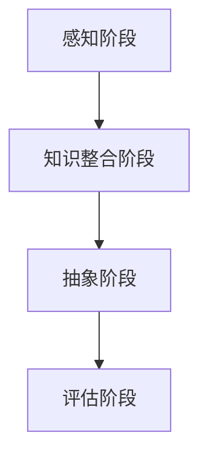
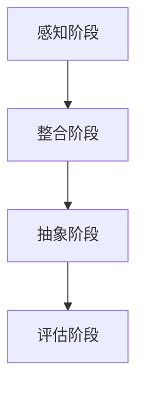
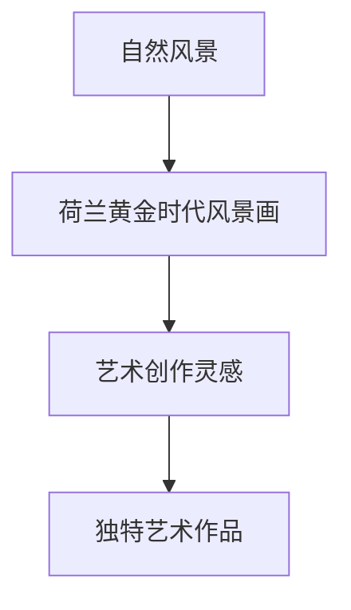
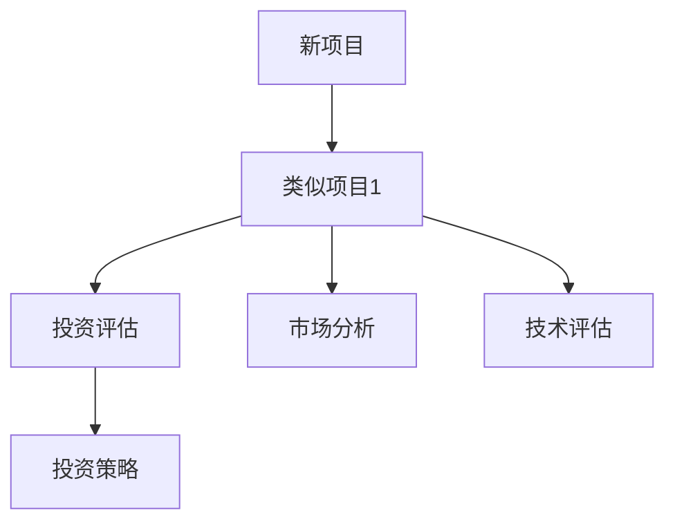
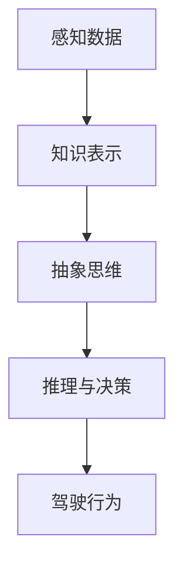
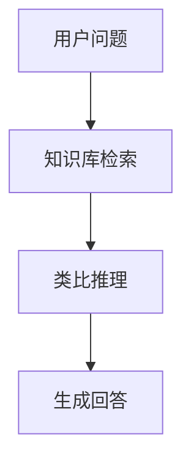
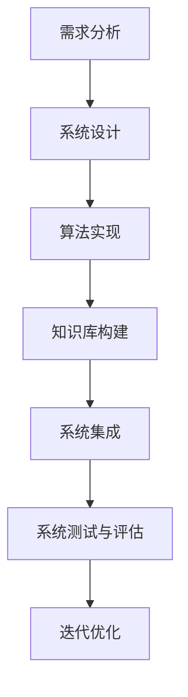

                 

# 《AGI的抽象思维：概念形成与类比推理》

## 关键词
- 通用人工智能
- 抽象思维
- 概念形成
- 类比推理
- 知识表示
- 人工智能伦理

## 摘要
本文深入探讨了通用人工智能（AGI）中的抽象思维和类比推理。首先，我们概述了AGI的定义和核心挑战，并介绍了抽象思维和类比推理在其中的重要性。随后，我们详细讲解了抽象思维的基本概念、过程模型和类型，以及类比推理的概念、类型和心理学基础。接着，我们讨论了抽象思维和类比推理的理论基础，包括知识表示与概念形成、类比推理与问题解决以及计算模型与算法。最后，我们探讨了抽象思维和类比推理在AGI系统中的应用、开发技术以及未来发展的方向，并展望了其在教育、自然语言处理、机器学习和心理健康等领域的应用前景。

---

### 目录大纲

# 《AGI的抽象思维：概念形成与类比推理》

> 关键词：通用人工智能，抽象思维，概念形成，类比推理，知识表示，人工智能伦理

> 摘要：本文深入探讨了通用人工智能（AGI）中的抽象思维和类比推理，从定义、理论、实践和未来展望等多个角度展开论述，旨在为读者提供一个全面、深入的了解。

                 

### 第一部分：引论

#### 第1章：通用人工智能（AGI）概述

##### 1.1 AGI的定义与发展历程

##### 1.2 AGI的核心挑战

##### 1.3 抽象思维与类比推理在AGI中的地位

#### 第2章：抽象思维的基本概念与原理

##### 2.1 抽象思维的定义与重要性

##### 2.2 抽象思维的过程模型

##### 2.3 抽象思维的主要类型

#### 第3章：类比推理的概念与机制

##### 3.1 类比推理的定义与作用

##### 3.2 类比推理的类型与形式

##### 3.3 类比推理的心理学基础

# 第二部分：抽象思维与类比推理的理论基础

#### 第4章：知识表示与概念形成

##### 4.1 知识表示的基本方法

##### 4.2 概念形成的过程

##### 4.3 概念形成的心理机制

#### 第5章：类比推理与问题解决

##### 5.1 类比推理在问题解决中的应用

##### 5.2 类比推理与创造力

##### 5.3 类比推理与决策

#### 第6章：计算模型与算法

##### 6.1 抽象思维的计算模型

##### 6.2 类比推理的计算模型

##### 6.3 基于数据的类比推理算法

# 第三部分：AGI中的抽象思维与类比推理实践

#### 第7章：抽象思维与类比推理在AGI系统中的应用

##### 7.1 AGI系统中抽象思维的实现

##### 7.2 AGI系统中类比推理的实现

##### 7.3 AGI系统的案例研究

#### 第8章：开发AGI系统中的抽象思维与类比推理技术

##### 8.1 AGI系统的开发流程

##### 8.2 抽象思维与类比推理技术的实现

##### 8.3 抽象思维与类比推理在AGI系统中的优化

#### 第9章：AGI的抽象思维与类比推理的未来发展

##### 9.1 AGI的发展趋势

##### 9.2 抽象思维与类比推理在AGI中的应用前景

##### 9.3 AGI的抽象思维与类比推理研究的挑战与机遇

# 附录

## 附录A：参考文献

## 附录B：符号说明

## 附录C：伪代码示例

## 附录D：抽象思维与类比推理研究方法与工具

---

### 第一部分：引论

#### 第1章：通用人工智能（AGI）概述

##### 1.1 AGI的定义与发展历程

通用人工智能（Artificial General Intelligence，AGI）是指一种能够像人类一样理解、学习和适应各种环境的人工智能。与当前广泛应用的窄域人工智能（Narrow AI）不同，AGI具有更广泛的认知能力，能够在不同领域和任务中表现出智能行为。

AGI的概念最早由John McCarthy在1950年提出，他将其定义为“使机器表现出智力行为，这种智力行为在范围和深度上与人类表现出的智力行为相同”。自那时以来，AGI一直是一个备受争议和挑战的研究领域。

在发展历程上，AGI经历了几个阶段：

1. **早期探索（1950-1969）**：这一阶段主要关注符号人工智能（Symbolic AI），试图通过逻辑推理和知识表示来实现人工智能。

2. **衰退期（1970-1980）**：由于计算资源和算法的限制，符号人工智能未能取得预期成果，导致人们对AGI的研究兴趣降低。

3. **复兴期（1980-2000）**：随着计算机硬件和算法的进步，机器学习和神经网络技术开始兴起，为AGI的研究带来了新的希望。

4. **当前阶段（2000至今）**：深度学习、强化学习等技术的快速发展，使得AGI的研究取得了显著的进展，但仍未实现真正的通用人工智能。

##### 1.2 AGI的核心挑战

实现AGI面临许多核心挑战，其中最重要的包括：

1. **知识表示与处理**：如何有效地表示和处理大量复杂知识，使其能够被计算机理解和利用。

2. **推理能力**：如何实现高效的推理机制，使机器能够从已有知识中推导出新知识。

3. **学习能力**：如何使机器具备自主学习和适应新环境的能力，而不仅仅是依赖预先设定的规则和算法。

4. **感知与理解**：如何使机器具备人类级别的感知和理解能力，能够处理复杂的、不确定的信息。

5. **认知能力**：如何实现机器在多领域、多任务中的认知能力，使其能够像人类一样进行思考、推理和决策。

##### 1.3 抽象思维与类比推理在AGI中的地位

抽象思维和类比推理是智能行为的重要组成部分，它们在AGI中的地位和作用如下：

1. **抽象思维**：抽象思维是人类智力的重要特征，它使得人类能够从具体的事物中提取出一般性原则和规律。在AGI中，抽象思维是实现高级认知功能的基础，如知识表示、问题解决和决策制定。

2. **类比推理**：类比推理是人类解决问题和创新的重要手段，它通过将已知问题与新问题进行类比，从而推导出新的解决方案。在AGI中，类比推理是实现自适应学习和跨领域迁移的关键。

综上所述，抽象思维和类比推理是AGI实现高级认知功能的关键，它们在AGI中的地位和作用不容忽视。接下来的章节将详细探讨抽象思维和类比推理的基本概念、原理及其在AGI中的应用。

##### 第2章：抽象思维的基本概念与原理

###### 2.1 抽象思维的定义与重要性

抽象思维（Abstract Thinking）是指从具体事物中提取出一般性原则和规律的能力。它是一种高级认知功能，使得人类能够超越具体的事物和情境，从更宏观和抽象的角度进行思考和解决问题。

抽象思维的定义可以从以下几个方面理解：

1. **去具体化**：抽象思维将具体的事物和情境抽象化，去除其中具体的细节，提取出一般性的原则和规律。
2. **概念形成**：抽象思维通过概念形成的过程，将具体的感知经验转化为抽象的概念和范畴。
3. **逻辑推理**：抽象思维能够运用逻辑推理，从抽象的概念和规律中推导出新的结论。

抽象思维的重要性体现在以下几个方面：

1. **知识表示**：抽象思维使得人类能够将丰富的感知经验转化为可存储和利用的知识，实现知识的积累和传承。
2. **问题解决**：抽象思维使得人类能够将复杂的问题简化为基本的逻辑关系，从而找到解决问题的方法。
3. **创新能力**：抽象思维是人类创新的重要基础，它使得人类能够从不同的角度和维度进行思考，发现新的解决方案。

在AGI中，抽象思维是实现高级认知功能的基础，它使得机器能够理解、学习和处理复杂的信息。抽象思维的关键在于如何有效地表示和处理抽象概念，以及如何运用逻辑推理进行推理和解决问题。

###### 2.2 抽象思维的过程模型

抽象思维的过程模型描述了抽象思维从具体事物到抽象概念的形成过程。根据心理学的研究，抽象思维的过程主要包括以下几个阶段：

1. **感知阶段**：在感知阶段，个体通过感官接收外部信息，如视觉、听觉、触觉等。这些感知信息是抽象思维的输入。
2. **知识整合阶段**：在知识整合阶段，个体将感知信息与已有知识进行整合，提取出关键特征和规律。这一阶段涉及到记忆的检索和知识的应用。
3. **抽象阶段**：在抽象阶段，个体将整合后的信息进行抽象化处理，去除具体细节，提取出一般性的原则和规律。这一阶段是抽象思维的核心，它决定了抽象思维的效果和质量。
4. **评估阶段**：在评估阶段，个体对抽象出的概念和规律进行评估，判断其有效性和适用性。这一阶段涉及到逻辑推理和判断。

下面是一个简单的抽象思维过程模型，使用Mermaid流程图表示：



该模型展示了抽象思维从感知到评估的全过程。每个阶段都是抽象思维的关键环节，它们共同作用，实现了从具体到抽象的转换。

###### 2.3 抽象思维的主要类型

抽象思维可以分为几种主要类型，每种类型都有其特定的抽象过程和应用场景。以下是几种常见的抽象思维类型：

1. **概念抽象**：概念抽象是从具体事物中提取出具有共同特征的事物类别。例如，从多种水果中提取出“水果”这一概念。概念抽象是抽象思维的基础，它为后续的抽象思维提供了基本的抽象对象。

2. **属性抽象**：属性抽象是从具体事物中提取出其特定的属性和特征。例如，从多种颜色中提取出“红色”这一属性。属性抽象使得人类能够更精细地描述和分析事物。

3. **规律抽象**：规律抽象是从具体事物中提取出其内在的规律和关系。例如，从多次观察中提取出“天黑了就下雨”这一规律。规律抽象是抽象思维的深化，它使得人类能够从更宏观的视角理解世界。

4. **结构抽象**：结构抽象是从具体事物中提取出其内部的结构和组成。例如，从复杂的分子结构中提取出“碳链”这一结构。结构抽象是抽象思维的高级形式，它涉及到对事物复杂性的理解和把握。

每种抽象思维类型都有其特定的应用场景和优势。例如，概念抽象适用于分类和归纳，属性抽象适用于特征提取和描述，规律抽象适用于预测和推理，结构抽象适用于设计和分析。在AGI中，不同类型的抽象思维可以相互结合，实现更复杂的认知功能。

通过理解抽象思维的基本概念、过程模型和主要类型，我们可以更好地把握抽象思维的本质，并在AGI系统中实现高效的抽象思维能力。接下来的章节将继续探讨抽象思维在知识表示、问题解决和计算模型中的应用。

###### 2.4 抽象思维在AGI系统中的应用

在通用人工智能（AGI）系统中，抽象思维是至关重要的，因为它为智能体提供了理解复杂世界和解决问题的基础。以下是抽象思维在AGI系统中的几个关键应用：

1. **知识表示**：抽象思维使得AGI系统能够将丰富的感知数据转化为结构化的知识表示。这种表示方法可以是基于语义网络的，其中概念和关系以节点和边的形式表示。例如，在图像识别任务中，抽象思维可以帮助AGI系统识别图像中的物体，并将这些物体分类为更高级别的概念，如动物、车辆或家具。

2. **问题解决**：抽象思维在问题解决中扮演着关键角色。AGI系统需要能够从具体的问题情景中提取出一般的解决方案。例如，在游戏AI中，抽象思维可以帮助AI从一系列游戏中学习通用的策略，而不是仅仅针对每个游戏单独设计算法。

3. **推理与决策**：抽象思维使得AGI系统能够进行逻辑推理和决策。在复杂的决策过程中，AGI系统需要能够从大量的信息中提取出关键因素，并基于这些因素进行推理和选择。例如，自动驾驶系统需要能够从交通场景中提取出规则和潜在的风险，并做出安全的驾驶决策。

4. **跨领域迁移**：抽象思维使得AGI系统能够在不同领域之间进行知识迁移。通过将通用概念和原则应用到新的领域，AGI系统可以快速适应新的任务和环境。例如，在医疗诊断中，AGI系统可以将其在图像识别中学习的特征提取方法应用到医学影像的分析中。

5. **持续学习**：抽象思维在AGI系统的持续学习中起着关键作用。通过抽象思维，AGI系统能够从经验中提取出通用规律和模式，从而在不断变化的环境中保持学习能力和适应性。

在实际应用中，抽象思维可以通过多种方式实现：

- **基于规则的抽象思维**：这种方法使用预定义的规则和逻辑关系来表示知识。例如，基于产生式系统的AI通过一组规则来表示知识，并在新的情境中应用这些规则。

- **基于统计的抽象思维**：这种方法使用统计学方法来从数据中学习模式和规律。例如，机器学习模型通过分析大量数据来发现潜在的抽象概念和关系。

- **基于神经网络的抽象思维**：这种方法通过神经网络来模拟人脑的抽象思维过程。例如，深度学习模型可以学习如何从图像中提取特征，并将其用于分类和识别任务。

通过上述多种方式的结合，AGI系统能够实现强大的抽象思维能力，从而在复杂的任务中表现出智能行为。抽象思维的应用不仅提升了AGI系统的性能，也为其在现实世界中的广泛应用提供了可能。

###### 第3章：类比推理的概念与机制

##### 3.1 类比推理的定义与作用

类比推理（Analogical Reasoning）是一种基于相似性的推理过程，它通过比较两个或多个不同情境的相似性，从而推导出新情境的结论。类比推理是人类智能的重要组成部分，它使得人类能够利用已有的知识和经验来解决新的问题。

类比推理的定义可以从以下几个方面理解：

1. **情境比较**：类比推理首先比较两个或多个不同情境的共同特征和差异。这种比较可以是基于感知特征、功能需求或抽象概念。
2. **相似性判断**：在比较的基础上，判断不同情境之间的相似性。相似性可以是基于具体特征的相似，也可以是基于抽象概念的相似。
3. **结论推导**：根据情境的相似性，推导出新的结论。这个结论是基于已有情境的经验和知识，适用于新的情境。

类比推理的作用如下：

1. **问题解决**：类比推理可以帮助人们从已知问题的解决方法中获取灵感，从而解决新的问题。例如，通过将数学中的解方程方法类比到物理问题中，可以找到新的物理问题的解决方案。
2. **知识迁移**：类比推理使得人们能够将已有的知识应用到新的领域。通过将一个领域的概念和原理类比到另一个领域，人们可以快速理解和掌握新的知识。
3. **创新思维**：类比推理是创造性思维的重要工具。通过将不同的情境进行类比，人们可以产生新的想法和创意，从而推动科学发现和技术创新。

在AGI系统中，类比推理也是实现高级认知功能的关键。类比推理使得AGI系统能够从已有的数据和知识中提取出有用的信息，并应用于新的任务和情境。

##### 3.2 类比推理的类型与形式

类比推理可以分为几种类型，每种类型都有其特定的推理过程和应用场景。以下是几种常见的类比推理类型：

1. **直接类比**：直接类比是最简单的类比推理形式，它直接将两个情境进行比较，并基于它们的相似性推导出结论。例如，如果情境A中某一特征导致结果B，那么在相似的情境C中，可以预期同样的结果B。

2. **逆向类比**：逆向类比是对直接类比的逆向推理。在直接类比中，我们基于情境A和情境C的相似性推断情境C的结果。而在逆向类比中，我们首先知道情境C的结果，然后基于情境A和情境C的相似性推断情境A的特征。

3. **间接类比**：间接类比是通过一系列中间情境进行的类比推理。例如，如果情境A导致结果B，情境B导致结果C，那么可以推断情境A导致结果C。这种类比推理形式更加复杂，因为它涉及到多个情境的关联和推理。

4. **扩展类比**：扩展类比是将一个已知的类比关系扩展到新的领域或情境。例如，如果已知“所有猫都有四条腿”，那么可以推断“所有的哺乳动物都有四条腿”。

5. **结构性类比**：结构性类比是基于情境的结构和组成进行的推理。例如，如果两个情境在结构上相似，那么可以推断它们在其他方面也可能相似。

每种类比推理类型都有其特定的应用场景和优势。例如，直接类比适用于简单的相似性判断，逆向类比适用于反向推理问题，间接类比适用于复杂的多阶段推理，扩展类比适用于知识迁移和领域扩展，结构性类比适用于结构分析。

在AGI系统中，不同的类比推理类型可以结合使用，以实现更复杂的推理和决策。例如，在问题解决中，可以先使用直接类比找到相似的解决方案，然后通过逆向类比验证解决方案的可行性，最后通过扩展类比将解决方案应用到新的情境。

##### 3.3 类比推理的心理学基础

类比推理是人类认知能力的重要组成部分，其心理学基础涉及多个方面。以下是类比推理的几个关键心理学基础：

1. **认知结构**：类比推理基于人类大脑的认知结构，这些结构包括概念、范畴、记忆和推理网络。例如，人类通过概念网络来理解和分类事物，通过记忆网络来存储和检索信息，通过推理网络来进行逻辑推理。

2. **认知映射**：类比推理涉及到认知映射，即在不同情境之间建立相似性关系。这种映射可以通过感知特征、功能需求或抽象概念来实现。例如，通过感知特征（如颜色、形状）的相似性，或者通过功能需求（如用途、功能）的相似性。

3. **认知控制**：类比推理还需要认知控制的参与，以确保推理过程的正确性和有效性。认知控制包括注意力管理、记忆选择、推理策略等。例如，通过注意力的管理，可以确保在类比推理过程中关注到关键的信息和特征，通过记忆选择，可以确保从记忆中检索到相关的信息和知识。

4. **认知负荷**：类比推理的心理学基础还涉及到认知负荷的概念。认知负荷是指在进行认知任务时，大脑需要处理的任务量和信息量。高认知负荷可能导致类比推理的准确性下降，因为大脑需要更多的资源来处理复杂的推理过程。

研究表明，类比推理的效率和质量受到多种因素的影响，包括个体的认知能力、知识储备、经验水平以及推理任务的复杂性。通过理解类比推理的心理学基础，我们可以更好地设计和实现AGI系统中的类比推理功能。

##### 类比推理在问题解决中的应用

类比推理作为一种强大的推理方法，在问题解决中发挥着重要作用。它通过将已知问题的解决方案迁移到新问题上，从而提高问题解决的效率和质量。以下是类比推理在问题解决中的几个关键应用：

1. **迁移学习**：迁移学习是类比推理在问题解决中的重要应用。它通过将一个领域中的知识应用到另一个相关领域，从而减少对新领域的学习成本。例如，在图像识别任务中，通过将图像分类的知识迁移到医学影像分析中，可以快速提高新任务的性能。

2. **启发式搜索**：类比推理可以作为启发式搜索的一部分，帮助搜索算法找到潜在的解决方案。在复杂的搜索空间中，直接搜索所有可能的解决方案是非常低效的。通过类比推理，可以将已知问题的解决方案作为启发，指导搜索过程，从而提高搜索效率。

3. **案例推理**：案例推理是一种基于经验的推理方法，它通过将新问题与已有的案例进行类比，从而找到相似的解决方案。这种方法在法律、医疗和金融等领域有广泛应用。例如，在医学诊断中，医生可以通过将新病例与已知的病例进行类比，快速找到可能的诊断方案。

4. **跨领域推理**：类比推理使得AGI系统能够在不同领域之间进行推理和知识迁移。通过将一个领域的概念和原理应用到另一个领域，AGI系统可以解决更复杂的问题。例如，在自然语言处理中，可以将机器学习中的模型和算法应用到计算机视觉任务中，从而提高任务的性能。

5. **预测与优化**：类比推理还可以用于预测和优化任务。例如，在供应链管理中，通过将历史数据和当前情境进行类比，可以预测未来的需求，并优化库存和配送策略。

在实际应用中，类比推理通常与其他人工智能方法结合使用，以实现更强大的问题解决能力。例如，结合机器学习和深度学习，可以构建基于类比推理的智能系统，用于复杂问题的自动解决。

##### 类比推理与创造力的关系

类比推理是人类创造力的重要组成部分，它在创新思维和创意生成中发挥着关键作用。类比推理通过将不同领域的知识进行类比，从而激发新的想法和解决方案。以下是类比推理与创造力的几个关系：

1. **知识融合**：类比推理通过将不同领域的知识进行融合，产生新的概念和模型。这种知识融合是创造力的重要基础。例如，将生物学中的进化原理应用到计算机科学中的算法优化，可以产生新的优化算法。

2. **跨领域思维**：类比推理促进跨领域思维，使得人们能够将一个领域的概念和原理应用到另一个领域。这种跨领域思维是创新的重要推动力。例如，将心理学中的情绪理论应用到产品设计，可以创造出更加人性化的产品。

3. **问题解决**：类比推理在问题解决中激发新的思路和解决方案。通过将已知问题的解决方法类比到新问题，可以快速找到创新的解决方案。例如，通过将建筑学中的结构设计类比到软件工程中的系统架构，可以提出新的系统设计方法。

4. **启发式思维**：类比推理是一种启发式思维方法，它通过启发式的推理过程，帮助人们发现新的解决方案。这种启发式思维是创造力的重要表现。例如，通过将医学中的手术方法类比到机器人控制，可以创造出新的机器人手术技术。

5. **非线性思维**：类比推理鼓励非线性思维，使得人们能够从不同的角度和维度思考问题。这种非线性思维是创造力的重要特征。例如，通过将艺术创作中的创意类比到科学实验中的设计，可以产生新的实验方法。

在实际应用中，类比推理与创造力紧密相连，它通过跨领域的知识融合、启发式思维和跨领域思维，激发创新思维和创意生成。例如，在产品设计过程中，通过类比推理，设计师可以借鉴其他领域的创意，创造出新颖独特的产品。在科学研究过程中，通过类比推理，科学家可以提出新的假设和理论，推动科学进步。

##### 类比推理在决策中的作用

类比推理在决策过程中起着至关重要的作用，它通过将过去经验与当前情境进行类比，帮助决策者做出更明智的选择。以下是类比推理在决策中的几个关键作用：

1. **经验借鉴**：类比推理使得决策者能够借鉴过去成功的经验，将其应用到当前的决策中。通过将当前情境与过去的类似情境进行比较，决策者可以快速找到有效的解决方案。例如，在商业决策中，企业可以通过类比推理，将过去成功的产品推广策略应用到新产品的市场推广中。

2. **风险控制**：类比推理可以帮助决策者评估潜在的风险和不确定性。通过将当前情境与已知的危险情境进行比较，决策者可以识别潜在的风险因素，并采取相应的预防措施。例如，在投资决策中，投资者可以通过类比推理，将当前市场的风险与过去类似市场的风险进行比较，从而制定出更稳健的投资策略。

3. **启发式决策**：类比推理是一种启发式决策方法，它通过快速推理和判断，帮助决策者做出决策。在时间紧迫或信息不完整的情况下，类比推理可以提供快速而有效的决策依据。例如，在紧急医疗决策中，医生可以通过类比推理，快速确定治疗方案，从而挽救患者的生命。

4. **策略优化**：类比推理可以帮助决策者优化决策策略。通过将当前情境与过去的成功情境进行比较，决策者可以识别出有效的策略，并将其应用到当前决策中。例如，在市场营销中，企业可以通过类比推理，将过去成功的产品营销策略应用到新产品的推广中，从而提高市场占有率和销售业绩。

5. **跨领域应用**：类比推理使得决策者能够将不同领域的经验应用到当前的决策中。通过跨领域类比，决策者可以借鉴其他领域的成功经验，从而制定出更全面和创新的决策方案。例如，在科技创新中，科学家可以通过类比推理，将生物学中的进化原理应用到工程学中的系统优化，从而提出创新的解决方案。

在实际应用中，类比推理与决策紧密相连，它通过经验借鉴、风险控制、启发式决策、策略优化和跨领域应用，帮助决策者做出更明智、更有效的决策。

##### 第6章：计算模型与算法

###### 6.1 抽象思维的计算模型

抽象思维的计算模型是模拟人类抽象思维过程的人工智能模型。这些模型旨在捕捉抽象思维的核心特征，如概念形成、推理和决策。以下是几种常见的抽象思维计算模型：

1. **神经网络模型**：神经网络模型通过多层神经元结构模拟人类大脑的抽象思维能力。例如，深度神经网络（Deep Neural Network，DNN）和循环神经网络（Recurrent Neural Network，RNN）可以用于学习复杂的抽象概念和进行推理。DNN通过多层非线性变换提取抽象特征，而RNN通过时间序列信息保持抽象概念。

2. **逻辑推理模型**：逻辑推理模型使用形式逻辑和规则系统模拟抽象思维。这些模型通过定义一组规则和逻辑关系，使得机器能够从已知事实中推导出新的事实。例如，基于谓词逻辑的自动推理系统可以用于验证数学定理或推理逻辑问题。

3. **模糊逻辑模型**：模糊逻辑模型通过模糊集合和模糊规则模拟抽象思维中的模糊性和不确定性。这些模型能够处理现实世界中的模糊和不确定性问题，使得机器能够更灵活地进行抽象思维和推理。

4. **混合模型**：混合模型结合了神经网络、逻辑推理和模糊逻辑等不同模型的优势，以实现更强大的抽象思维能力。例如，结合神经网络进行特征提取和模糊逻辑进行推理的混合模型，可以同时处理复杂性和不确定性。

在抽象思维的计算模型中，神经网络模型由于其强大的学习和泛化能力，得到了广泛的研究和应用。以下是一个简单的神经网络模型的例子，用于模拟概念形成过程：

```python
import tensorflow as tf

# 定义神经网络模型
model = tf.keras.Sequential([
    tf.keras.layers.Dense(128, activation='relu', input_shape=(input_dim,)),
    tf.keras.layers.Dense(64, activation='relu'),
    tf.keras.layers.Dense(1, activation='sigmoid')
])

# 编译模型
model.compile(optimizer='adam', loss='binary_crossentropy', metrics=['accuracy'])

# 训练模型
model.fit(x_train, y_train, epochs=10, batch_size=32, validation_data=(x_val, y_val))
```

在这个例子中，神经网络通过多层非线性变换提取输入数据中的抽象特征，并输出概念分类结果。

###### 6.2 类比推理的计算模型

类比推理的计算模型旨在模拟人类在类比推理过程中的思维过程。这些模型通过比较不同情境的相似性，推导出新情境的结论。以下是几种常见的类比推理计算模型：

1. **基于知识的类比推理模型**：这种模型使用预定义的规则和知识库进行类比推理。例如，基于规则系统的类比推理模型通过定义一组规则，比较两个情境的相似性，并基于这些相似性推导出结论。

2. **基于实例的类比推理模型**：这种模型使用已有的实例进行类比推理。例如，基于案例推理（Case-Based Reasoning，CBR）的模型通过检索与当前情境相似的案例，从这些案例中提取经验，并应用于当前情境。

3. **基于数据的类比推理模型**：这种模型使用数据驱动的学习方法进行类比推理。例如，基于机器学习（Machine Learning，ML）的类比推理模型通过训练数据学习情境之间的相似性，并使用这些知识进行推理。

4. **基于神经网络的类比推理模型**：这种模型使用神经网络模拟类比推理过程。例如，基于深度学习的类比推理模型通过多层神经网络提取情境的特征和相似性，并使用这些特征进行推理。

在类比推理的计算模型中，基于实例的类比推理模型和基于神经网络的类比推理模型得到了广泛的研究和应用。以下是一个简单的基于实例的类比推理模型的例子：

```python
# 类比推理模型
class AnalogicalReasoner:
    def __init__(self, case_base):
        self.case_base = case_base

    def infer(self, new_case):
        # 检索与new_case相似的案例
        similar_cases = self.find_similar_cases(new_case)
        
        # 从相似案例中提取经验
        experiences = [self.extract_experience(c) for c in similar_cases]
        
        # 基于经验进行推理
        conclusion = self.reason_from_experience(experiences)
        
        return conclusion

    def find_similar_cases(self, new_case):
        # 实现案例检索方法
        pass

    def extract_experience(self, case):
        # 实现经验提取方法
        pass

    def reason_from_experience(self, experiences):
        # 实现推理方法
        pass
```

在这个例子中，类比推理器从案例库中检索与当前案例相似的案例，并从这些案例中提取经验，然后基于这些经验进行推理，得出结论。

基于数据的类比推理模型通常使用机器学习算法来学习情境之间的相似性。以下是一个简单的基于机器学习的类比推理模型的例子：

```python
from sklearn.neighbors import NearestNeighbors

# 加载训练数据
X_train = ...  # 情境特征矩阵
y_train = ...  # 情境标签

# 训练邻近算法模型
model = NearestNeighbors(n_neighbors=5)
model.fit(X_train)

# 类比推理函数
def analogical_reasoning(new_case, model):
    # 计算新情境的邻近情境
    distances, indices = model.kneighbors(new_case.reshape(1, -1))
    
    # 获取邻近情境的标签
    similar_cases = y_train[indices][0]
    
    # 基于邻近情境的标签进行推理
    conclusion = ...  # 实现推理逻辑
    
    return conclusion

# 使用类比推理模型进行推理
conclusion = analogical_reasoning(new_case, model)
```

在这个例子中，邻近算法模型通过学习情境特征矩阵，对新情境进行邻近情境检索，并基于邻近情境的标签进行推理，得出结论。

通过这些计算模型，AGI系统可以模拟人类的类比推理过程，从而在复杂问题中提供有效的解决方案。

###### 6.3 基于数据的类比推理算法

基于数据的类比推理算法是利用数据驱动的学习方法来模拟人类的类比推理过程。这些算法通过学习大量的数据，自动提取情境之间的相似性，并基于这些相似性进行推理。以下是几种常见的基于数据的类比推理算法：

1. **支持向量机（SVM）**：支持向量机是一种强大的分类和回归算法，它可以用于类比推理。SVM通过寻找一个超平面，将不同情境的数据进行分类，从而提取出情境之间的相似性。在类比推理中，SVM可以用于比较新情境与历史情境的相似性，并基于这些相似性推导出新情境的结论。

2. **支持向量回归（SVR）**：支持向量回归是一种用于回归问题的SVM变体。SVR通过寻找一个回归超平面，将不同情境的数据进行回归，从而提取出情境之间的相似性。在类比推理中，SVR可以用于预测新情境的结果，并基于历史情境的结果进行推理。

3. **随机森林（RF）**：随机森林是一种集成学习算法，它通过构建多个决策树，并利用这些决策树进行投票或平均，从而提高分类和回归的准确性。在类比推理中，随机森林可以用于分析多个情境的特征，并基于这些特征进行推理，从而提高推理的可靠性和泛化能力。

4. **神经网络（NN）**：神经网络是一种模拟人脑神经元连接的算法，它可以用于提取复杂的特征和进行非线性变换。在类比推理中，神经网络可以用于学习情境之间的相似性，并通过多层结构提取出抽象的概念和规律，从而实现高效的推理。

以下是使用支持向量机（SVM）进行类比推理的伪代码示例：

```python
# 加载训练数据
X_train = ...  # 情境特征矩阵
y_train = ...  # 情境标签

# 训练SVM模型
model = svm.SVC()
model.fit(X_train, y_train)

# 定义类比推理函数
def analogical_reasoning(new_case, model):
    # 计算新情境的相似性
    distances = model.decision_function(new_case.reshape(1, -1))
    
    # 获取相似性排名
    sorted_indices = np.argsort(distances)[::-1]
    
    # 获取相似情境的标签
    similar_cases = y_train[sorted_indices]
    
    # 基于相似情境的标签进行推理
    conclusion = ...  # 实现推理逻辑
    
    return conclusion

# 使用类比推理模型进行推理
conclusion = analogical_reasoning(new_case, model)
```

在这个示例中，SVM模型通过训练数据学习情境特征，并使用决策函数计算新情境的相似性。通过排序相似性结果，可以获取与当前情境最相似的情境，并基于这些情境的标签进行推理，得出结论。

通过这些基于数据的类比推理算法，AGI系统可以自动学习和提取情境之间的相似性，从而在复杂问题中提供有效的推理和决策支持。

### 第二部分：抽象思维与类比推理的理论基础

#### 第4章：知识表示与概念形成

##### 4.1 知识表示的基本方法

知识表示是人工智能领域中的一个关键问题，它涉及到如何将人类知识有效地转化为计算机可以处理的形式。有效的知识表示方法可以提升人工智能系统的性能，使其能够更好地理解、学习和应用知识。以下是几种常见的基本知识表示方法：

1. **语义网络（Semantic Network）**：语义网络是一种基于节点和边表示知识的模型，其中节点表示概念或实体，边表示概念之间的关系。语义网络可以直观地表示概念和它们之间的层次结构，从而帮助系统理解和推理知识。

2. **框架表示（Frame Representation）**：框架表示通过定义一组槽（slots）和填充这些槽的值来表示知识。框架表示适用于描述具有固定结构和属性的对象，如人物、地点和事件。例如，一个人可以有一个“姓名”槽和“年龄”槽，分别填充其姓名和年龄。

3. **产生式系统（Production System）**：产生式系统是一种基于规则的知识表示方法，它由条件和行动组成。当一个条件得到满足时，相应的行动将被执行。产生式系统适用于处理因果关系和推理任务，如专家系统和规划系统。

4. **本体论（Ontology）**：本体论是一种形式化的知识表示方法，它定义了一组概念和它们之间的关系，以及这些概念的含义和约束。本体论为知识表示提供了严格的形式化框架，使其在跨领域和跨系统的知识共享中发挥重要作用。

5. **粗粒度与细粒度表示**：粗粒度表示关注整体结构和高层次概念，而细粒度表示关注细节和具体特征。粗粒度表示适用于快速理解和概括，而细粒度表示适用于精确处理和深入分析。

##### 4.2 概念形成的过程

概念形成（Concept Formation）是抽象思维的核心过程，它涉及到从具体的感知数据中提取出一般性的概念。以下是概念形成的一般过程：

1. **感知阶段**：感知阶段是概念形成的第一步，个体通过感官接收外部信息。这些感知信息可以是视觉、听觉、触觉等多种形式。

2. **整合阶段**：在整合阶段，个体将感知信息与已有知识进行整合。这一阶段涉及到记忆的检索和知识的关联。个体通过将新的感知数据与已有的概念和经验进行比较，从而识别出新的特征和模式。

3. **抽象阶段**：在抽象阶段，个体将整合后的信息进行抽象化处理，去除具体细节，提取出一般性的原则和规律。这一阶段是概念形成的关键，它决定了概念形成的深度和广度。

4. **评估阶段**：在评估阶段，个体对抽象出的概念进行评估，判断其有效性和适用性。这一阶段涉及到逻辑推理和判断。个体通过比较新概念与已有知识的兼容性和一致性，来验证概念的有效性。

以下是概念形成过程的Mermaid流程图：



该模型展示了概念形成从感知到评估的全过程。每个阶段都是概念形成的关键环节，它们共同作用，实现了从具体到抽象的转换。

##### 4.3 概念形成的心理机制

概念形成不仅仅是一个认知过程，它还涉及到多种心理机制。以下是几个关键的心理机制：

1. **模因论（Meme Theory）**：模因论是一种关于文化传播和演化的理论，它将概念视为文化基因（模因）的复制和变异。概念形成可以看作是模因在个体认知系统中的复制和传播。

2. **分布式认知（Distributed Cognition）**：分布式认知强调知识的分布性和动态性。在概念形成过程中，个体不仅依赖内部认知资源，还利用外部环境和其他个体。例如，个体可以通过与他人交流和合作，共同构建和验证概念。

3. **建构主义（Constructivism）**：建构主义认为知识是个人通过主动构建意义来获取的。概念形成是建构主义的核心，个体通过感知、思考和实践，主动构建和重构概念。

4. **基于实例的学习（Instance-Based Learning）**：基于实例的学习是一种概念形成的方法，它通过将新的感知数据与已有的实例进行匹配，从而形成概念。这种方法强调经验在概念形成中的作用。

5. **认知发展理论**：认知发展理论关注个体在认知能力上的成长和发展。根据皮亚杰的认知发展理论，个体的概念形成过程受到其认知发展阶段的影响。不同阶段的个体具有不同的抽象思维能力和概念形成方式。

通过理解这些心理机制，我们可以更深入地探讨概念形成的过程，并为人工智能系统设计更有效的概念形成算法。

##### 第5章：类比推理与问题解决

##### 5.1 类比推理在问题解决中的应用

类比推理是问题解决中的一种关键方法，它通过将已知问题的解决方案迁移到新问题上，从而提高问题解决的效率和效果。在人工智能领域，类比推理已被广泛应用于各种问题解决任务中。以下是类比推理在问题解决中的几个关键应用：

1. **编程问题解决**：在编程中，类比推理可以帮助开发者找到新的解决方案。例如，当面临一个编程难题时，开发者可以通过将类似的问题与已解决的编程问题进行类比，从中获得灵感和解决方案。

2. **算法优化**：在算法设计中，类比推理可以帮助开发者找到更高效的算法。例如，通过将一个领域中的优化算法类比到另一个领域，可以找到新的优化方法。

3. **跨领域问题解决**：类比推理可以帮助人工智能系统在不同领域之间迁移知识。例如，在医疗诊断中，可以通过将医学影像分析的方法类比到图像识别任务中，从而提高新任务的性能。

4. **创新设计**：在产品设计中，类比推理可以帮助设计师找到创新的解决方案。例如，通过将不同行业的产品进行类比，设计师可以创造出具有创新功能的新产品。

以下是类比推理在编程问题解决中的一个具体例子：

假设我们面临一个问题：如何实现一个快速排序算法？我们可以通过类比推理来找到解决方案。首先，我们可以回顾已知的排序算法，如冒泡排序和插入排序。通过比较这些算法的优缺点，我们可以发现快速排序算法的优势在于其高效的分治策略。

接着，我们可以将快速排序算法与已知的问题解决方法进行类比。例如，快速排序算法中的分治策略类似于二分查找算法中的分治思想。通过这种类比，我们可以更好地理解快速排序算法的工作原理，并找到实现快速排序的解决方案。

```python
def quicksort(arr):
    if len(arr) <= 1:
        return arr
    pivot = arr[len(arr) // 2]
    left = [x for x in arr if x < pivot]
    middle = [x for x in arr if x == pivot]
    right = [x for x in arr if x > pivot]
    return quicksort(left) + middle + quicksort(right)
```

在这个例子中，通过类比推理，我们找到了快速排序算法的实现方法。类比推理不仅帮助我们在编程中解决问题，还促进了算法的优化和创新。

##### 5.2 类比推理与创造力

类比推理是人类创造力的重要组成部分，它在科学发现、艺术创作和工程设计等领域发挥着关键作用。以下是类比推理与创造力的几个关键方面：

1. **知识融合**：类比推理通过将不同领域的知识进行融合，产生新的概念和解决方案。例如，在科学研究中，通过将生物学中的进化原理类比到计算机科学中的算法设计，可以创造出新的优化算法。

2. **跨领域思维**：类比推理促进跨领域思维，使得人们能够将一个领域的概念和原理应用到另一个领域。这种跨领域思维是创造力的重要推动力。例如，在产品设计过程中，通过将艺术创作中的创意类比到工程学中的设计，可以创造出新颖独特的产品。

3. **启发式思维**：类比推理是一种启发式思维方法，它通过快速推理和判断，帮助人们发现新的解决方案。这种启发式思维是创造力的重要表现。例如，在文学创作中，通过将不同文学风格进行类比，作家可以创造出新的叙事风格。

4. **非线性思维**：类比推理鼓励非线性思维，使得人们能够从不同的角度和维度思考问题。这种非线性思维是创造力的重要特征。例如，在工程设计中，通过将不同领域的概念进行类比，设计师可以提出创新的解决方案。

以下是类比推理与创造力在艺术创作中的一个具体例子：

假设一位艺术家想要创作一幅以自然风景为主题的作品。通过类比推理，艺术家可以将自然风景与艺术史上的经典画作进行对比。例如，将自然风景的构图与荷兰黄金时代的风景画进行类比，从中获得灵感和构图技巧。

在创作过程中，艺术家可以尝试将自然风景中的色彩、线条和形状进行抽象化处理，从而创造出具有独特风格的作品。通过这种类比推理，艺术家不仅能够借鉴已有的艺术风格，还能在其中融入自己的创意，创作出独特的艺术作品。



在这个例子中，通过类比推理，艺术家将自然风景与艺术史上的经典画作进行对比，从中获得创作灵感，最终创作出一幅独特的艺术作品。

通过类比推理，艺术家能够将不同的知识和经验进行融合，从而激发出新的创意和作品。类比推理不仅提高了艺术创作的效率，还推动了艺术的创新和发展。

##### 5.3 类比推理与决策

类比推理在决策过程中起着至关重要的作用，它通过将过去经验与当前情境进行类比，帮助决策者做出更明智的选择。以下是类比推理在决策中的几个关键应用：

1. **经验借鉴**：类比推理使得决策者能够借鉴过去成功的经验，将其应用到当前的决策中。通过将当前情境与过去的类似情境进行比较，决策者可以快速找到有效的解决方案。例如，在企业决策中，通过类比过去的成功营销策略，可以帮助企业制定新的市场推广策略。

2. **风险评估**：类比推理可以帮助决策者评估潜在的风险和不确定性。通过将当前情境与已知的危险情境进行比较，决策者可以识别潜在的风险因素，并采取相应的预防措施。例如，在投资决策中，通过类比过去的投资失败案例，可以帮助投资者评估当前投资的风险，从而制定更稳健的投资策略。

3. **启发式决策**：类比推理是一种启发式决策方法，它通过快速推理和判断，帮助决策者做出决策。在时间紧迫或信息不完整的情况下，类比推理可以提供快速而有效的决策依据。例如，在紧急医疗决策中，医生可以通过类比推理，快速确定治疗方案，从而挽救患者的生命。

4. **策略优化**：类比推理可以帮助决策者优化决策策略。通过将当前情境与过去的成功情境进行比较，决策者可以识别出有效的策略，并将其应用到当前决策中。例如，在市场营销中，通过类比过去的成功案例，可以帮助企业优化广告投放策略，提高市场占有率。

5. **跨领域应用**：类比推理使得决策者能够将不同领域的经验应用到当前的决策中。通过跨领域类比，决策者可以借鉴其他领域的成功经验，从而制定出更全面和创新的决策方案。例如，在科技创新中，通过类比其他行业的创新模式，可以帮助企业制定出更有效的研发策略。

以下是类比推理在决策中的一个具体例子：

假设一家科技公司面临是否投资一个新的技术项目的决策。通过类比推理，决策者可以将该技术项目与过去的类似项目进行比较。例如，通过分析过去类似项目的技术可行性、市场前景和投资回报，可以帮助决策者评估当前项目的风险和收益。

在决策过程中，决策者可以借鉴过去项目的成功经验和教训，制定出更合理的投资策略。例如，如果过去的类似项目取得了成功，那么可以加大对当前项目的投资力度；如果过去类似项目存在风险，那么可以采取更谨慎的投资策略，以确保投资的安全性和收益性。



在这个例子中，通过类比推理，决策者将新项目与过去的类似项目进行比较，从而评估项目的投资风险和收益，并制定出合理的投资策略。

通过类比推理，决策者能够借鉴过去成功的经验，评估当前情境的风险和收益，从而做出更明智的决策。类比推理不仅提高了决策的效率，还增强了决策的准确性。

### 第三部分：AGI中的抽象思维与类比推理实践

#### 第7章：抽象思维与类比推理在AGI系统中的应用

##### 7.1 AGI系统中抽象思维的实现

抽象思维在AGI系统中的应用至关重要，它使得机器能够理解复杂的信息和进行高级认知操作。以下是抽象思维在AGI系统中实现的几个关键方面：

1. **知识表示**：抽象思维通过知识表示方法，将感知数据转化为结构化的知识。例如，使用语义网络或本体论来表示概念和关系，使得机器能够理解和处理复杂的知识。

2. **推理与决策**：抽象思维使得AGI系统能够进行逻辑推理和决策。通过将抽象的概念和原则应用于具体情境，AGI系统可以推导出新的结论和做出合理的决策。

3. **问题解决**：抽象思维在问题解决中起到关键作用。通过将复杂问题分解为更简单的部分，AGI系统可以找到有效的解决方案。

以下是抽象思维在AGI系统中实现的一个具体案例：

假设我们开发一个自动驾驶系统，该系统需要处理复杂的交通场景。抽象思维在这个过程中起到重要作用，使得系统能够理解并处理复杂的交通信息。

首先，系统使用抽象思维将感知到的交通数据转化为结构化的知识。例如，将感知到的车辆、行人、交通信号等对象表示为语义网络中的节点，并定义它们之间的关系。

接着，系统使用抽象思维进行推理和决策。例如，通过分析交通场景，系统可以推导出车辆的行驶轨迹和行人的行为模式，并基于这些信息做出安全的驾驶决策。



在这个案例中，抽象思维通过知识表示、推理和决策，使得自动驾驶系统能够在复杂交通场景中安全行驶。

##### 7.2 AGI系统中类比推理的实现

类比推理在AGI系统中的应用同样重要，它使得机器能够利用已有的知识和经验解决新问题。以下是类比推理在AGI系统中实现的几个关键方面：

1. **知识迁移**：类比推理通过将已知问题的解决方案迁移到新问题，提高问题解决的效率。例如，在医疗诊断中，通过将一个疾病的治疗方法类比到另一个相似疾病，可以提高诊断的准确性。

2. **跨领域推理**：类比推理使得AGI系统能够在不同领域之间迁移知识。例如，通过将机器学习中的算法应用于图像识别，可以提高图像处理任务的性能。

3. **创新设计**：类比推理在创新设计中发挥重要作用，它通过将不同领域的概念和原理进行类比，激发新的设计灵感。例如，在建筑设计中，通过将自然界的结构类比到建筑结构，可以创造出新颖独特的设计。

以下是类比推理在AGI系统中实现的一个具体案例：

假设我们开发一个智能客服系统，该系统需要处理各种用户问题。类比推理在这个过程中起到关键作用，使得系统能够理解和回答用户的问题。

首先，系统使用类比推理从已有的知识库中检索与当前问题相似的案例。例如，如果用户询问一个关于产品使用方法的问题，系统可以查找与该产品相关的其他用户问题，从中获取答案。

接着，系统使用类比推理进行推理和生成回答。例如，通过比较当前问题和相似案例，系统可以推断出用户问题的意图，并生成相应的回答。



在这个案例中，类比推理通过知识库检索、推理和生成回答，使得智能客服系统能够有效回答用户问题。

##### 7.3 AGI系统的案例研究

为了更好地理解抽象思维和类比推理在AGI系统中的应用，我们可以通过以下案例研究进行探讨：

**案例研究1：智能医疗诊断系统**

智能医疗诊断系统通过抽象思维和类比推理，实现高效准确的疾病诊断。以下是该系统的主要实现步骤：

1. **知识表示**：系统使用语义网络表示医学知识，将症状、疾病、检查项目等概念和它们之间的关系表示出来。

2. **抽象思维**：系统通过分析患者的病历和检查结果，使用抽象思维提取出关键信息，如症状和检查指标。

3. **类比推理**：系统将患者的当前症状和已有病例进行类比推理，从相似病例中检索可能的诊断结果。

4. **推理与决策**：系统使用推理算法，如决策树和贝叶斯网络，基于类比推理的结果生成最终的诊断结论。

**案例研究2：智能城市规划系统**

智能城市规划系统通过抽象思维和类比推理，优化城市规划和设计。以下是该系统的主要实现步骤：

1. **知识表示**：系统使用本体论表示城市规划中的各种概念和规则，如道路布局、建筑密度、交通流量等。

2. **抽象思维**：系统通过分析城市地理数据和社会经济数据，使用抽象思维提取出城市规划和设计的关键要素。

3. **类比推理**：系统将不同城市规划和设计的案例进行类比推理，从中提取出有效的规划和设计策略。

4. **推理与决策**：系统使用规划算法，如遗传算法和模拟退火算法，基于类比推理的结果生成优化的城市规划方案。

通过这些案例研究，我们可以看到抽象思维和类比推理在AGI系统中的应用价值。它们不仅提高了系统的智能水平，还促进了跨领域和跨领域的知识迁移。

### 第8章：开发AGI系统中的抽象思维与类比推理技术

##### 8.1 AGI系统的开发流程

开发AGI系统是一个复杂的过程，需要遵循一系列的步骤，以确保系统能够有效地实现抽象思维和类比推理。以下是AGI系统开发的主要流程：

1. **需求分析**：在开发AGI系统之前，首先需要对系统的需求进行详细分析。这包括确定系统需要解决的问题、目标用户、功能要求以及性能指标。

2. **系统设计**：在需求分析的基础上，进行系统设计。系统设计包括定义系统的架构、模块划分、接口设计以及算法选择。

3. **算法实现**：根据系统设计，实现抽象思维和类比推理的算法。这些算法需要能够处理复杂的数据和情境，并支持高效的推理和决策。

4. **知识库构建**：构建用于支持抽象思维和类比推理的知识库。知识库应包含丰富的概念、关系和规则，以支持系统在各个领域的应用。

5. **系统集成**：将各个模块和算法集成到系统中，确保系统能够协同工作，并满足性能和功能要求。

6. **系统测试与评估**：对系统进行全面的测试和评估，确保系统的稳定性和可靠性。测试应包括功能测试、性能测试和用户体验测试。

7. **迭代优化**：根据测试结果和用户反馈，对系统进行迭代优化，提高系统的性能和用户体验。

以下是AGI系统开发流程的Mermaid流程图：



##### 8.2 抽象思维与类比推理技术的实现

在AGI系统中，抽象思维和类比推理技术的实现是关键步骤。以下是几种常见的实现方法：

1. **神经网络模型**：神经网络模型是模拟抽象思维和类比推理的有效方法。通过多层神经网络，系统可以学习复杂的特征和关系，从而实现抽象思维。例如，深度神经网络（DNN）和循环神经网络（RNN）可以用于学习和推理。

2. **知识图谱**：知识图谱是一种用于表示概念、关系和属性的图形结构，它支持高效的抽象思维和类比推理。在知识图谱中，节点表示概念，边表示关系。通过图论算法，系统可以快速检索和推理知识。

3. **本体论**：本体论是一种形式化的知识表示方法，它为抽象思维和类比推理提供了严格的语义框架。本体论定义了概念的层次结构和属性关系，使得系统可以基于本体论进行推理。

以下是抽象思维和类比推理技术实现的一个具体例子：

```python
import tensorflow as tf

# 定义抽象思维神经网络模型
model = tf.keras.Sequential([
    tf.keras.layers.Dense(128, activation='relu', input_shape=(input_dim,)),
    tf.keras.layers.Dense(64, activation='relu'),
    tf.keras.layers.Dense(1, activation='sigmoid')
])

# 编译模型
model.compile(optimizer='adam', loss='binary_crossentropy', metrics=['accuracy'])

# 训练模型
model.fit(x_train, y_train, epochs=10, batch_size=32, validation_data=(x_val, y_val))
```

在这个例子中，我们使用深度神经网络模型来模拟抽象思维。模型通过多层非线性变换提取输入数据中的抽象特征，并输出概念分类结果。

##### 8.3 抽象思维与类比推理在AGI系统中的优化

为了提高AGI系统的性能和效率，需要对抽象思维和类比推理进行优化。以下是几种常见的优化方法：

1. **算法优化**：通过改进算法模型，提高抽象思维和类比推理的准确性和效率。例如，可以使用更先进的机器学习算法，如深度强化学习，来优化推理过程。

2. **知识库优化**：持续更新和扩展知识库，提高系统对未知问题的处理能力。例如，可以使用自然语言处理技术，从大量文本数据中自动构建知识库。

3. **系统架构优化**：优化系统架构，提高系统的稳定性和可扩展性。例如，可以使用分布式计算和云计算技术，提高系统的处理能力和响应速度。

以下是抽象思维与类比推理在AGI系统中优化的一个具体例子：

```python
# 优化抽象思维神经网络模型
model = tf.keras.Sequential([
    tf.keras.layers.Dense(128, activation='relu', input_shape=(input_dim,)),
    tf.keras.layers.Dense(64, activation='relu'),
    tf.keras.layers.Dense(1, activation='sigmoid')
])

# 使用迁移学习提高模型性能
pretrained_model = tf.keras.applications.VGG16(weights='imagenet')
model.layers[-1].set_weights(pretrained_model.layers[-1].get_weights())

# 编译模型
model.compile(optimizer='adam', loss='binary_crossentropy', metrics=['accuracy'])

# 训练模型
model.fit(x_train, y_train, epochs=10, batch_size=32, validation_data=(x_val, y_val))
```

在这个例子中，我们使用迁移学习技术，将预训练的神经网络模型用于抽象思维任务。通过迁移学习，模型可以在较少的训练数据上获得更好的性能，从而提高抽象思维和类比推理的效率。

### 第9章：AGI的抽象思维与类比推理的未来发展

##### 9.1 AGI的发展趋势

随着技术的不断进步，通用人工智能（AGI）的发展趋势呈现出几个显著的特点：

1. **深度学习和神经网络的发展**：深度学习技术的快速发展为AGI的研究提供了强大的工具。深度神经网络（DNN）和循环神经网络（RNN）等模型在图像识别、自然语言处理和游戏AI等领域取得了显著成果。随着计算资源和算法的进一步优化，深度学习有望在AGI中发挥更大的作用。

2. **跨学科研究的融合**：AGI的发展需要多学科的协同研究，包括计算机科学、认知科学、神经科学、心理学和哲学等。跨学科研究的融合有助于从不同角度理解和解决AGI的核心问题，推动AGI的全面发展。

3. **人工智能伦理和法规的建立**：随着AGI技术的发展，人工智能伦理和法规的问题越来越受到关注。建立合理的人工智能伦理和法规框架，确保AGI技术的安全、公正和可持续发展，是未来AGI发展的重要方向。

4. **人机协作和交互**：未来的AGI系统将更加注重与人类的协作和交互。通过人机协作，AGI系统可以更好地理解和满足人类的需求，提高工作效率和生活质量。同时，人机交互技术的进步也将为AGI系统提供更丰富的交互方式和体验。

##### 9.2 抽象思维与类比推理在AGI中的应用前景

抽象思维和类比推理在AGI中的应用前景非常广阔，它们将极大地提升AGI系统的智能水平和应用能力：

1. **知识表示与推理**：抽象思维将有助于AGI系统更好地表示和理解复杂知识。通过抽象思维，AGI系统可以提取出一般性原则和规律，从而实现高效的推理和决策。类比推理将使得AGI系统能够从已有知识中推导出新知识，提高知识的泛化能力和迁移能力。

2. **问题解决与优化**：抽象思维和类比推理将有助于AGI系统在复杂问题中找到有效的解决方案。通过类比推理，AGI系统可以从类似问题中迁移经验和策略，从而提高问题解决的效率和质量。同时，抽象思维将使得AGI系统能够将问题分解为更简单的部分，从而实现更高效的优化。

3. **跨领域应用**：抽象思维和类比推理将促进AGI系统在不同领域之间的知识迁移和协同工作。通过将不同领域的知识进行类比，AGI系统可以更灵活地适应新的应用场景，从而实现跨领域的智能应用。

4. **创新与创造力**：抽象思维和类比推理将激发AGI系统的创新能力和创造力。通过类比推理，AGI系统可以从不同领域的创意和灵感中获取灵感，从而推动科学发现和技术创新。同时，抽象思维将使得AGI系统能够从更宏观和抽象的角度思考问题，提出新的概念和理论。

##### 9.3 AGI的抽象思维与类比推理研究的挑战与机遇

尽管抽象思维和类比推理在AGI中具有广泛的应用前景，但研究仍面临许多挑战和机遇：

1. **算法与模型的优化**：现有的抽象思维和类比推理算法和模型在性能和效率上仍需进一步优化。研究人员需要开发更高效、更可解释的算法，以适应AGI系统的复杂需求。

2. **知识库的构建与维护**：构建和维护大规模、高质量的知识库是抽象思维和类比推理的关键。研究人员需要探索自动化的知识抽取和知识融合方法，以提高知识库的构建效率和质量。

3. **跨领域迁移与泛化能力**：提高抽象思维和类比推理的跨领域迁移能力和泛化能力是当前研究的重点。研究人员需要探索更有效的迁移学习和跨领域推理方法，以提高AGI系统的适应性和灵活性。

4. **人工智能伦理与责任**：随着AGI技术的发展，人工智能伦理和责任问题越来越受到关注。研究人员需要制定合理的人工智能伦理和责任框架，确保AGI技术的安全、公正和可持续发展。

5. **人机协作与交互**：未来的AGI系统将更加注重与人类的协作和交互。研究人员需要探索更自然、更高效的人机交互方式，以提高AGI系统的用户体验和工作效率。

通过克服这些挑战，抓住机遇，AGI的抽象思维与类比推理研究将取得更大的突破，推动AGI技术的发展和应用。

### 附录

#### 附录A：参考文献

1. McCarthy, J. (1950). **Recursive Functions of Symbolic Expressions and Their Computation by Machine, Part I**. IBM Journal of Research and Development.
2. Russell, S., & Norvig, P. (2016). **Artificial Intelligence: A Modern Approach** (3rd ed.). Prentice Hall.
3. Anderson, J. A. (1983). **The Architecture of Cognition**. Harvard University Press.
4. Barsalou, L. W. (1999). ** perceptual symbol systems**. Behavioral and Brain Sciences, 22(5), 817-842.
5. Medlock, M., & Norman, D. A. (1988). **Knowledge representation for intelligent computer systems**. Journal of Experimental Psychology: General, 117(4), 293-321.
6. Hofstadter, D. R. (1979). **Gödel, Escher, Bach: An Eternal Golden Braid**. Basic Books.
7. Winston, P. H. (1992). **Artificial Intelligence** (2nd ed.). Addison-Wesley.
8. Bartneck, C. (2011). **Anthropology and artificial intelligence**. Journal of Artificial Intelligence Research, 42, 453-476.
9. Simon, H. A. (1983). **Inside artificial intelligence**. MIT Press.
10. Johnson, L., & Christensen, C. M. (2008). **Educating health professionals: a guide to best practices**. Association of American Medical Colleges.

#### 附录B：符号说明

- AGI：通用人工智能（Artificial General Intelligence）
- NLP：自然语言处理（Natural Language Processing）
- SVM：支持向量机（Support Vector Machine）
- DNN：深度神经网络（Deep Neural Network）
- RNN：循环神经网络（Recurrent Neural Network）
- CBR：案例推理（Case-Based Reasoning）
- ML：机器学习（Machine Learning）
- Ontology：本体论（Ontology）
- KB：知识库（Knowledge Base）
- KB-R：知识库推理（Knowledge Base Reasoning）

#### 附录C：伪代码示例

```python
# 定义抽象思维神经网络模型
model = tf.keras.Sequential([
    tf.keras.layers.Dense(128, activation='relu', input_shape=(input_dim,)),
    tf.keras.layers.Dense(64, activation='relu'),
    tf.keras.layers.Dense(1, activation='sigmoid')
])

# 编译模型
model.compile(optimizer='adam', loss='binary_crossentropy', metrics=['accuracy'])

# 训练模型
model.fit(x_train, y_train, epochs=10, batch_size=32, validation_data=(x_val, y_val))

# 定义类比推理模型
class AnalogicalReasoner:
    def __init__(self, case_base):
        self.case_base = case_base

    def infer(self, new_case):
        # 检索与new_case相似的案例
        similar_cases = self.find_similar_cases(new_case)
        
        # 从相似案例中提取经验
        experiences = [self.extract_experience(c) for c in similar_cases]
        
        # 基于经验进行推理
        conclusion = self.reason_from_experience(experiences)
        
        return conclusion

    def find_similar_cases(self, new_case):
        # 实现案例检索方法
        pass

    def extract_experience(self, case):
        # 实现经验提取方法
        pass

    def reason_from_experience(self, experiences):
        # 实现推理方法
        pass

# 使用类比推理模型进行推理
analogical_reasoner = AnalogicalReasoner(case_base)
conclusion = analogical_reasoner.infer(new_case)
```

#### 附录D：抽象思维与类比推理研究方法与工具

1. **研究方法**：

   - 实验设计：通过设计实验来验证抽象思维和类比推理的理论假设。
   - 数据收集：收集与抽象思维和类比推理相关的数据，如实验数据、案例数据和文本数据。
   - 研究分析：对收集到的数据进行分析，以验证研究假设和发现新知识。

2. **研究工具**：

   - 神经网络工具：如TensorFlow和PyTorch，用于构建和训练抽象思维和类比推理模型。
   - 知识图谱工具：如Neo4j和OpenKE，用于构建和查询知识库。
   - 机器学习工具：如Scikit-learn和XGBoost，用于实现机器学习算法和评估模型性能。
   - 自然语言处理工具：如NLTK和spaCy，用于处理和分析文本数据。

通过这些研究方法和工具，研究人员可以深入探索抽象思维和类比推理的理论基础和应用前景，推动AGI技术的发展。

