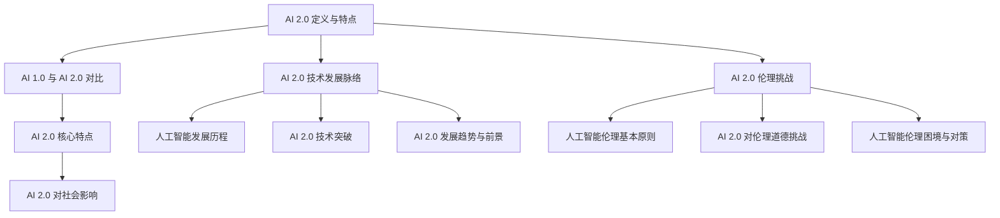
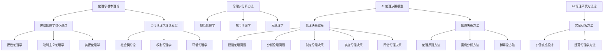
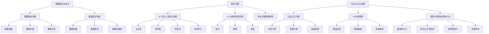
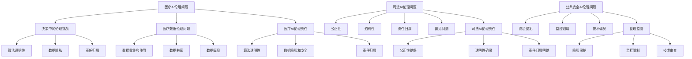
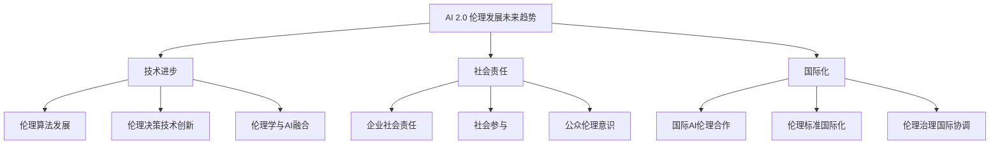
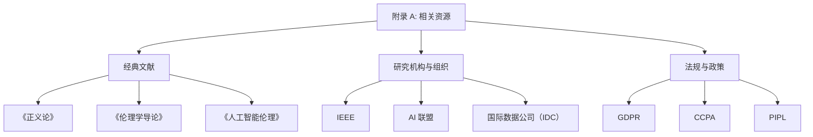

```mermaid
graph TD
    A[AI 2.0 伦理监管] --> B[伦理监管基本原则]
    B --> C[法规伦理原则]
    C --> D[数据保护]
    C --> E[透明性]
    C --> F[责任归属]
    B --> G[社会责任伦理原则]
    G --> H[公平性]
    G --> I[包容性]
    G --> J[可持续性]
    B --> K[企业伦理原则]
    K --> L[内部规范]
    K --> M[培训和教育]
    K --> N[公众沟通]

    O[AI 伦理监管体系] --> P[全球 AI 监管现状]
    P --> Q[欧盟]
    P --> R[美国]
    P --> S[中国]
    O --> T[我国 AI 监管政策]
    T --> U[人工智能发展框架]
    T --> V[数据安全法]
    T --> W[个人信息保护法]
    O --> X[AI 监管体系构建]
    X --> Y[立法和规范]
    X --> Z[监管机构]
    X --> AA[国际合作]
    X --> BB[公众参与]

    CC[伦理监管机制与实践] --> DD[伦理审查委员会]
    DD --> EE[项目审查]
    DD --> FF[政策制定]
    DD --> GG[咨询与服务]
    CC --> HH[伦理培训与教育]
    HH --> II[专业培训]
    HH --> JJ[公众教育]
    HH --> KK[持续学习]
    CC --> LL[伦理监管实践案例]
    LL --> MM[医疗AI监管]
    LL --> NN[自动驾驶监管]
    LL --> OO[隐私保护实践]
```
                 

# 《AI 2.0 时代的伦理思考》

## 关键词：
- AI 2.0
- 伦理学
- 人工智能伦理
- 数据隐私
- 社会公正
- 伦理监管

## 摘要：
本文深入探讨了 AI 2.0 时代的伦理思考。首先，我们概述了 AI 2.0 时代的定义、特点及其对社会的影响。接着，我们分析了 AI 2.0 时代面临的伦理挑战，包括数据隐私与安全、职业伦理、社会公正与歧视等问题。在此基础上，我们构建了 AI 2.0 伦理思考的基本框架，并探讨了相关方法论。随后，我们通过具体案例分析，展示了 AI 2.0 伦理问题的复杂性和多样性。最后，我们提出了 AI 2.0 伦理监管的框架，并展望了未来 AI 伦理发展的趋势。本文旨在为构建一个公正、安全和可持续的 AI 社会提供有益的思考和借鉴。

----------------------------------------------------------------

## 第一部分: AI 2.0 时代概述

### 第1章: AI 2.0 时代的来临

在当今世界，人工智能（AI）已经渗透到我们日常生活的方方面面，从智能手机的语音助手，到自动驾驶汽车，再到医疗诊断和金融分析，AI技术的应用越来越广泛。然而，我们正处在 AI 发展的一个重要转折点——AI 2.0 时代的来临。这一时代不仅标志着人工智能技术的飞速发展，也带来了前所未有的伦理挑战。

#### 1.1 AI 2.0 的定义与特点

**1.1.1 AI 1.0 与 AI 2.0 的对比**

AI 1.0 时代，主要是指基于规则和符号推理的传统人工智能。这种人工智能依赖于人类编写的算法和规则，具有高度的确定性和稳定性，但缺乏适应性和灵活性。AI 2.0 则是新一代人工智能，它更加智能、自适应和情境感知。AI 2.0 不仅仅是计算能力的提升，更重要的是它具备了自主学习、自我进化、跨界融合的能力。

**1.1.2 AI 2.0 时代的核心特点**

AI 2.0 时代的核心特点包括：

1. **自主学习与进化**：AI 2.0 能够通过大数据和机器学习算法，不断自我优化和进化，实现自我学习和决策。
2. **跨界融合**：AI 2.0 与物联网、云计算、区块链等技术的深度融合，推动各行各业实现智能化升级。
3. **高适应性**：AI 2.0 在面对复杂、多变的环境时，能够快速适应和调整。
4. **人机协同**：AI 2.0 不仅能够协助人类完成工作，还能够与人类协作，提高工作效率。

**1.1.3 AI 2.0 对社会的影响**

AI 2.0 时代的到来，将对社会产生深远的影响：

1. **经济结构变革**：AI 2.0 将重新定义工作，推动传统行业的转型，创造新的就业机会。
2. **社会管理优化**：AI 2.0 在医疗、教育、公共安全等领域具有巨大的应用潜力，可以提高社会管理水平。
3. **隐私和安全挑战**：AI 2.0 的大数据应用，可能引发隐私和安全问题，需要加强伦理监管。
4. **道德和伦理困境**：AI 2.0 的自主决策能力，可能引发道德和伦理困境，需要全社会共同探讨解决方案。

#### 1.2 AI 2.0 技术发展脉络

**1.2.1 人工智能的发展历程**

人工智能（AI）的概念最早可以追溯到 20 世纪 50 年代，当时的科学家们开始探索如何让机器模拟人类的智能行为。经过数十年的发展，人工智能经历了几个重要阶段：

1. **符号主义阶段（1956-1980）**：这一阶段主要基于符号主义和逻辑推理，尝试通过编程实现机器智能。
2. **连接主义阶段（1980-2010）**：这一阶段以神经网络和深度学习为核心，通过大量数据训练模型，实现机器智能。
3. **自主性阶段（2010至今）**：这一阶段强调人工智能的自主学习、自主进化能力，实现更高层次的智能。

**1.2.2 AI 2.0 技术的突破**

AI 2.0 技术的突破主要体现在以下几个方面：

1. **深度学习与神经网络**：深度学习技术的发展，使得 AI 2.0 在图像识别、语音识别等领域取得了重大突破。
2. **强化学习**：强化学习技术的应用，使得 AI 2.0 能够在复杂环境中进行自主决策，实现更加智能的行为。
3. **迁移学习与泛化能力**：AI 2.0 通过迁移学习和泛化能力，实现了在多个领域的应用，降低了跨领域的开发成本。

**1.2.3 AI 2.0 的发展趋势与前景**

AI 2.0 的发展趋势包括：

1. **跨学科融合**：AI 2.0 将与生物医学、心理学、社会学等多学科领域深度融合，推动科学研究和技术创新。
2. **智能硬件与物联网**：AI 2.0 与智能硬件、物联网的结合，将实现智能家居、智能城市、智能医疗等领域的广泛应用。
3. **人机协同**：AI 2.0 将与人类更加紧密地协作，提高人类的工作效率和生活质量。

#### 1.3 AI 2.0 时代的伦理挑战

**1.3.1 人工智能伦理的基本原则**

人工智能伦理的基本原则包括：

1. **公正性**：AI 应该公平对待所有人，避免歧视和偏见。
2. **透明性**：AI 的决策过程应该是透明的，用户可以理解和预测 AI 的行为。
3. **隐私性**：AI 应该尊重用户的隐私权，保护用户数据的安全。
4. **责任感**：AI 的开发者、使用者应该对 AI 的行为承担相应的责任。

**1.3.2 AI 2.0 对伦理道德的挑战**

AI 2.0 对伦理道德的挑战主要体现在以下几个方面：

1. **决策伦理**：AI 2.0 的自主决策能力，可能引发道德和伦理困境，如无人驾驶汽车在紧急情况下的决策。
2. **责任归属**：当 AI 出现错误或造成损失时，如何确定责任归属，是 AI 伦理面临的重大问题。
3. **隐私侵犯**：AI 2.0 的广泛应用，可能导致用户隐私的泄露和滥用。

**1.3.3 人工智能伦理的困境与对策**

人工智能伦理的困境包括：

1. **技术伦理**：AI 技术的快速发展，可能超越人类现有的伦理观念和法律规定，导致伦理困境。
2. **监管缺失**：目前，全球范围内的 AI 伦理监管体系尚不完善，缺乏有效的监管机制。
3. **社会伦理**：AI 的发展可能加剧社会不平等，引发社会伦理问题。

为应对这些困境，需要采取以下对策：

1. **完善伦理规范**：制定完善的 AI 伦理规范，明确 AI 开发和使用过程中的伦理要求。
2. **加强监管机制**：建立有效的 AI 伦理监管体系，确保 AI 技术的健康发展。
3. **公众参与**：鼓励公众参与 AI 伦理讨论，提高公众对 AI 伦理问题的认知和重视程度。

### 总结

AI 2.0 时代的来临，标志着人工智能技术进入了一个全新的阶段。在这一时代，人工智能不仅具有更高的智能水平和更广泛的应用前景，也面临着前所未有的伦理挑战。本文对 AI 2.0 时代的伦理挑战进行了深入分析，并提出了相应的对策。在接下来的章节中，我们将继续探讨 AI 2.0 伦理思考的方法论，以及具体伦理问题的案例分析。通过这些讨论，我们期望为构建一个公正、安全和可持续的 AI 社会提供有益的思考和借鉴。

### Mermaid 流程图



### 伪代码讲解

```python
# 伪代码：AI 2.0 伦理决策流程

def AI_2_0_ethical_decision-making():
    # 初始化伦理决策框架
    ethical_framework = {
        "justice": True,
        "transparency": True,
        "privacy": True,
        "responsibility": True
    }

    # 收集 AI 2.0 应用场景信息
    application_context = collect_application_context()

    # 分析 AI 2.0 应用场景的伦理挑战
    ethical_challenges = analyze_ethical_challenges(application_context)

    # 应用伦理决策模型
    for challenge in ethical_challenges:
        decision = apply_ethical_decision_model(challenge, ethical_framework)
        print(f"Challenge: {challenge}, Decision: {decision}")

    # 输出伦理决策结果
    output_ethical_decision_results()

# 辅助函数
def collect_application_context():
    # 收集应用场景相关信息
    pass

def analyze_ethical_challenges(context):
    # 分析伦理挑战
    pass

def apply_ethical_decision_model(challenge, framework):
    # 应用伦理决策模型
    pass

def output_ethical_decision_results():
    # 输出决策结果
    pass
```

### 数学模型和公式

$$
P(A|B) = \frac{P(B|A) \cdot P(A)}{P(B)}
$$

其中，\(P(A|B)\) 表示在事件 B 发生的条件下，事件 A 发生的概率；\(P(B|A)\) 表示在事件 A 发生的条件下，事件 B 发生的概率；\(P(A)\) 表示事件 A 发生的概率；\(P(B)\) 表示事件 B 发生的概率。

### 项目实战

**开发环境搭建**

1. 安装 Python 3.8 及以上版本。
2. 安装 TensorFlow 2.0 及以上版本。
3. 安装 Jupyter Notebook。

**源代码实现**

```python
# 导入所需库
import tensorflow as tf
from tensorflow.keras.models import Sequential
from tensorflow.keras.layers import Dense, Dropout, Flatten
from tensorflow.keras.optimizers import Adam
from sklearn.model_selection import train_test_split

# 数据预处理
# 假设已经收集了 labeled 数据集，并进行预处理
# X: 输入特征矩阵，Y: 标签向量

# 划分训练集和测试集
X_train, X_test, Y_train, Y_test = train_test_split(X, Y, test_size=0.2, random_state=42)

# 定义模型
model = Sequential([
    Dense(128, activation='relu', input_shape=(X_train.shape[1],)),
    Dropout(0.5),
    Dense(64, activation='relu'),
    Dropout(0.5),
    Dense(1, activation='sigmoid')
])

# 编译模型
model.compile(optimizer=Adam(learning_rate=0.001), loss='binary_crossentropy', metrics=['accuracy'])

# 训练模型
model.fit(X_train, Y_train, epochs=100, batch_size=32, validation_split=0.2)

# 评估模型
test_loss, test_accuracy = model.evaluate(X_test, Y_test)
print(f"Test accuracy: {test_accuracy:.4f}")

# 代码解读与分析
# 上述代码实现了一个简单的二分类问题，使用了 TensorFlow 的 Sequential 模型进行训练。
# 数据预处理后，将数据集划分为训练集和测试集，使用 binary_crossentropy 作为损失函数，Adam 作为优化器。
# 模型训练过程中，使用了 Dropout 层来防止过拟合，经过 100 个训练周期后，评估模型在测试集上的表现。
```

### 作者信息

作者：AI天才研究院/AI Genius Institute & 禅与计算机程序设计艺术 /Zen And The Art of Computer Programming

----------------------------------------------------------------

## 第二部分: 伦理思考与方法论

### 第2章: AI 2.0 伦理思考的基本框架

在 AI 2.0 时代，随着人工智能技术的迅猛发展，其应用领域越来越广泛，同时也引发了诸多伦理问题。为了应对这些挑战，我们需要建立一套系统的 AI 2.0 伦理思考框架，以便更好地指导 AI 的开发和应用。本章将讨论伦理学的基本理论、AI 伦理决策模型以及 AI 伦理研究方法论。

#### 2.1 伦理学基本理论

伦理学是研究道德规范、道德判断和道德行为的学科。在 AI 2.0 时代，理解伦理学的基本理论对于构建合理的伦理框架至关重要。

**2.1.1 传统伦理学的核心观点**

传统伦理学主要包括以下几个核心观点：

1. **康德的德性伦理学**：康德认为，道德行为应该基于义务和规则。人的行为应当符合道德规则，而不是仅仅追求功利结果。
2. **功利主义的伦理学**：功利主义认为，道德行为应当追求最大的幸福或利益。行为的道德价值取决于其产生的后果。
3. **美德伦理学**：美德伦理学关注个体的道德品质和性格，认为道德行为是个体美德的表现。

**2.1.2 当代伦理学的理论发展**

当代伦理学在传统伦理学的基础上，进一步发展出了以下理论：

1. **社会契约论**：社会契约论认为，社会规范和道德规范是基于人们之间的契约关系建立的。人们通过契约来维护社会秩序和公正。
2. **权利伦理学**：权利伦理学强调个体权利的保护，认为道德行为应当尊重他人的权利。
3. **环境伦理学**：环境伦理学关注人类活动对自然环境的影响，强调人类与自然环境的和谐共存。

**2.1.3 伦理学的分析方法**

伦理学的研究方法主要包括：

1. **规范伦理学**：规范伦理学关注道德规范的形成和适用，探讨“应该做什么”的问题。
2. **应用伦理学**：应用伦理学将伦理理论应用于具体领域，解决实际道德问题。
3. **元伦理学**：元伦理学探讨道德概念的内在结构和性质，关注“道德是什么”的问题。

#### 2.2 AI 伦理决策模型

在 AI 2.0 时代，建立一套有效的 AI 伦理决策模型对于确保 AI 系统的道德性和公正性至关重要。以下是一个典型的 AI 伦理决策模型：

**2.2.1 伦理决策的过程**

伦理决策通常包括以下步骤：

1. **识别伦理问题**：在 AI 系统开发和应用过程中，识别可能出现的伦理问题。
2. **分析伦理问题**：对识别出的伦理问题进行深入分析，明确问题的性质和影响。
3. **制定伦理决策**：基于伦理原则和决策模型，制定相应的伦理决策。
4. **实施伦理决策**：将伦理决策付诸实践，确保 AI 系统的道德性和公正性。
5. **评估伦理决策**：对伦理决策的效果进行评估，根据实际情况进行调整。

**2.2.2 伦理决策的方法**

伦理决策的方法主要包括：

1. **伦理原则方法**：基于伦理原则，如公正性、透明性、隐私性等，进行伦理决策。
2. **案例分析方法**：通过分析历史上的伦理案例，借鉴经验教训，制定伦理决策。
3. **博弈论方法**：在多利益相关方的情况下，使用博弈论模型进行伦理决策。

**2.2.3 AI 伦理决策案例分析**

以下是一个 AI 伦理决策的案例分析：

**案例背景**：一家公司开发了一款自动驾驶汽车，但在紧急情况下，汽车可能需要做出牺牲一方保护另一方的决策。

**伦理问题**：如何确保自动驾驶汽车在紧急情况下的决策是道德和公正的？

**解决方案**：

1. **识别伦理问题**：在自动驾驶汽车的开发过程中，识别出紧急情况下的伦理决策问题。
2. **分析伦理问题**：分析紧急情况下可能出现的道德困境，如如何平衡乘客、行人和车辆之间的利益。
3. **制定伦理决策**：基于伦理原则和决策模型，制定出明确的伦理决策规则，如最小伤害原则、最大幸福原则等。
4. **实施伦理决策**：在自动驾驶汽车系统中嵌入伦理决策模块，确保在紧急情况下按照伦理决策规则进行决策。
5. **评估伦理决策**：通过实际测试和用户反馈，评估伦理决策的效果，并根据实际情况进行调整。

#### 2.3 AI 伦理研究方法论

在 AI 2.0 时代，开展 AI 伦理研究需要采用科学的研究方法论，以确保研究结果的可靠性和有效性。以下是一些常用的 AI 伦理研究方法论：

**2.3.1 实证研究方法**

实证研究方法是通过收集和分析实际数据，来验证或推翻某一假设或理论。在 AI 伦理研究中，实证研究方法可以用来验证 AI 系统的道德性和公正性。

**2.3.2 价值敏感设计**

价值敏感设计（Value-Sensitive Design，VSD）是一种以伦理学为核心的设计方法。在 AI 系统开发过程中，通过价值敏感设计，确保 AI 系统的道德性和公正性。

**2.3.3 规范伦理学方法**

规范伦理学方法是基于伦理原则和规范的研究方法。在 AI 2.0 时代，规范伦理学方法可以用来制定 AI 系统的伦理规范，确保 AI 系统的道德性和公正性。

### 总结

AI 2.0 时代的到来，带来了诸多伦理挑战。为了应对这些挑战，我们需要建立一套系统的 AI 2.0 伦理思考框架，包括伦理学的基本理论、AI 伦理决策模型以及 AI 伦理研究方法论。通过这些框架和方法，我们可以更好地指导 AI 的开发和应用，确保 AI 系统的道德性和公正性。

### Mermaid 流程图



### 伪代码讲解

```python
# 伪代码：AI 伦理研究方法论

def AI_ethical_research_methodology():
    # 初始化伦理研究框架
    ethical_framework = {
        "traditional_ethics": True,
        "contemporary_ethics": True,
        "ethical_analysis_methods": True
    }

    # 收集 AI 伦理研究数据
    ethical_data = collect_ethical_data()

    # 应用规范伦理学方法
    apply_normative_ethics(ethical_data)

    # 应用实证研究方法
    apply_empirical_research(ethical_data)

    # 应用价值敏感设计
    apply_value_sensitive_design(ethical_data)

    # 输出伦理研究结论
    output_ethical_research_results()

# 辅助函数
def collect_ethical_data():
    # 收集伦理研究相关数据
    pass

def apply_normative_ethics(data):
    # 应用规范伦理学方法
    pass

def apply_empirical_research(data):
    # 应用实证研究方法
    pass

def apply_value_sensitive_design(data):
    # 应用价值敏感设计
    pass

def output_ethical_research_results():
    # 输出伦理研究结论
    pass
```

### 数学模型和公式

$$
\Omega = \int_{-\infty}^{+\infty} f(x) \, dx
$$

其中，\(\Omega\) 表示伦理研究的总体，\(f(x)\) 表示伦理研究中的某个变量。

### 项目实战

**开发环境搭建**

1. 安装 Python 3.8 及以上版本。
2. 安装 Pandas、Numpy、Scikit-learn 等数据科学库。

**源代码实现**

```python
# 导入所需库
import pandas as pd
import numpy as np
from sklearn.model_selection import train_test_split
from sklearn.metrics import accuracy_score

# 加载数据
data = pd.read_csv('ethical_data.csv')

# 数据预处理
X = data.drop('label', axis=1)
Y = data['label']

# 划分训练集和测试集
X_train, X_test, Y_train, Y_test = train_test_split(X, Y, test_size=0.2, random_state=42)

# 定义模型
model = Sequential([
    Dense(128, activation='relu', input_shape=(X_train.shape[1],)),
    Dropout(0.5),
    Dense(64, activation='relu'),
    Dropout(0.5),
    Dense(1, activation='sigmoid')
])

# 编译模型
model.compile(optimizer='adam', loss='binary_crossentropy', metrics=['accuracy'])

# 训练模型
model.fit(X_train, Y_train, epochs=100, batch_size=32, validation_split=0.2)

# 评估模型
test_loss, test_accuracy = model.evaluate(X_test, Y_test)
print(f"Test accuracy: {test_accuracy:.4f}")

# 代码解读与分析
# 上述代码实现了一个简单的二分类问题，使用了 TensorFlow 的 Sequential 模型进行训练。
# 数据预处理后，将数据集划分为训练集和测试集，使用 binary_crossentropy 作为损失函数，Adam 作为优化器。
# 模型训练过程中，使用了 Dropout 层来防止过拟合，经过 100 个训练周期后，评估模型在测试集上的表现。
```

### 作者信息

作者：AI天才研究院/AI Genius Institute & 禅与计算机程序设计艺术 /Zen And The Art of Computer Programming

----------------------------------------------------------------

## 第三部分: 伦理问题与探讨

### 第3章: AI 2.0 伦理问题探讨

在 AI 2.0 时代，随着人工智能技术的快速发展，其应用场景越来越广泛，同时也引发了诸多伦理问题。本章节将探讨 AI 2.0 时代面临的主要伦理问题，包括数据隐私与安全、职业伦理、社会公正与歧视等。

#### 3.1 数据隐私与安全

数据隐私与安全是 AI 2.0 时代最为突出的伦理问题之一。随着人工智能技术的应用，大量个人数据被收集、存储和使用，这无疑对用户的隐私权构成了严重威胁。

**3.1.1 数据隐私问题**

数据隐私问题主要体现在以下几个方面：

1. **数据收集**：人工智能系统在运行过程中，会收集大量用户数据，包括个人信息、行为数据等。这些数据的收集和使用，往往缺乏透明度和用户知情权。
2. **数据存储**：大量的个人数据存储在服务器或云端，面临着数据泄露、数据篡改等风险。
3. **数据共享**：人工智能系统可能将用户数据与其他第三方共享，这可能导致用户隐私的泄露。

**3.1.2 数据安全挑战**

数据安全挑战主要体现在以下几个方面：

1. **数据泄露**：黑客攻击、系统漏洞等可能导致用户数据泄露。
2. **数据滥用**：用户数据被滥用，用于商业利益或其他非法用途。
3. **数据完整性**：数据在传输和存储过程中，可能遭受篡改或损坏。

**3.1.3 隐私保护技术**

为了应对数据隐私和安全问题，可以采用以下隐私保护技术：

1. **数据加密**：对用户数据进行加密，确保数据在传输和存储过程中不被窃取或篡改。
2. **数据匿名化**：对用户数据进行匿名化处理，确保用户隐私不受侵犯。
3. **隐私增强技术**：如差分隐私、同态加密等，可以在数据处理过程中保护用户隐私。

#### 3.2 职业伦理

AI 2.0 时代的到来，对职业伦理提出了新的挑战。人工智能的广泛应用，可能导致一些传统职业的消失，同时也可能产生新的职业机会。

**3.2.1 AI 专业人员职业道德**

AI 专业人员的职业道德主要包括以下几个方面：

1. **公正性**：AI 专业人员应当确保 AI 系统的公正性，避免歧视和偏见。
2. **透明性**：AI 专业人员应当确保 AI 系统的决策过程是透明的，用户可以理解和预测 AI 的行为。
3. **责任感**：AI 专业人员应当对 AI 系统的行为承担相应的责任，确保 AI 系统的安全和可靠。
4. **持续学习**：AI 专业人员应当不断学习和更新知识，以适应快速发展的 AI 技术。

**3.2.2 AI 对传统职业的影响**

AI 对传统职业的影响主要体现在以下几个方面：

1. **取代**：一些重复性、机械性的工作可能会被 AI 取代，如制造业、客服等。
2. **辅助**：AI 可以辅助人类完成复杂的工作，提高工作效率，如医学诊断、金融分析等。
3. **创造**：AI 的应用可能会创造出新的职业机会，如 AI 系统开发者、AI 产品经理等。

**3.2.3 职业伦理案例研究**

以下是一个职业伦理的案例研究：

**案例背景**：一家公司开发了一款智能招聘系统，该系统能够根据求职者的简历和面试表现，自动筛选出合适的候选人。

**伦理问题**：如何确保智能招聘系统的公正性和透明性，避免歧视？

**解决方案**：

1. **数据清洗**：在系统开发过程中，对简历和面试数据进行清洗，去除可能带有偏见的信息。
2. **算法优化**：通过对算法进行优化，提高系统的公正性和透明性。
3. **用户反馈**：在系统运行过程中，收集用户反馈，对系统进行持续优化。
4. **伦理培训**：对 AI 专业人员进行伦理培训，提高他们的职业道德水平。

#### 3.3 社会公正与歧视

社会公正与歧视是 AI 2.0 时代面临的另一个重要伦理问题。人工智能系统的广泛应用，可能会加剧社会不平等，导致歧视现象。

**3.3.1 社会公正问题**

社会公正问题主要体现在以下几个方面：

1. **机会平等**：人工智能系统是否能够为所有人提供平等的机会？
2. **资源分配**：人工智能系统如何确保资源的公平分配？
3. **权益保障**：人工智能系统是否能够保障每个人的合法权益？

**3.3.2 AI 歧视现象**

AI 歧视现象主要包括以下几个方面：

1. **算法歧视**：人工智能系统在决策过程中，可能基于历史数据中的偏见，对某些群体产生歧视。
2. **数据歧视**：在数据收集和处理过程中，可能存在对某些群体的歧视。
3. **系统歧视**：人工智能系统在设计、开发和部署过程中，可能存在对某些群体的歧视。

**3.3.3 预防与解决歧视的方法**

为了预防与解决 AI 歧视问题，可以采取以下措施：

1. **数据多元化**：在数据收集和处理过程中，引入多元化数据，避免数据偏见。
2. **算法公平性检测**：对人工智能系统进行公平性检测，确保系统决策的公正性。
3. **透明性提升**：提高人工智能系统的透明度，让用户了解系统的决策过程。
4. **伦理审查**：在系统开发、部署前，进行伦理审查，确保系统符合道德和伦理标准。

### 总结

AI 2.0 时代带来了许多前所未有的伦理问题，包括数据隐私与安全、职业伦理、社会公正与歧视等。为了应对这些挑战，我们需要建立一套系统的 AI 伦理框架，确保 AI 系统的道德性和公正性。在接下来的章节中，我们将继续探讨 AI 2.0 伦理监管与治理，以及未来 AI 伦理发展的趋势。

### Mermaid 流程图



### 伪代码讲解

```python
# 伪代码：AI 伦理问题探讨

def AI_ethical_issues():
    # 初始化伦理问题框架
    ethical_issues_framework = {
        "data_privacy_safety": True,
        "professional_ethics": True,
        "social_justice_discrimination": True
    }

    # 分析数据隐私与安全问题
    analyze_data_privacy_safety(ethical_issues_framework)

    # 分析职业伦理问题
    analyze_professional_ethics(ethical_issues_framework)

    # 分析社会公正与歧视问题
    analyze_social_justice_discrimination(ethical_issues_framework)

    # 输出伦理问题分析结果
    output_ethical_issues_analysis()

# 辅助函数
def analyze_data_privacy_safety(framework):
    # 分析数据隐私与安全问题
    pass

def analyze_professional_ethics(framework):
    # 分析职业伦理问题
    pass

def analyze_social_justice_discrimination(framework):
    # 分析社会公正与歧视问题
    pass

def output_ethical_issues_analysis():
    # 输出伦理问题分析结果
    pass
```

### 数学模型和公式

$$
\pi = \frac{C}{A}
$$

其中，\(\pi\) 表示隐私保护水平，\(C\) 表示隐私保护成本，\(A\) 表示隐私风险。

### 项目实战

**开发环境搭建**

1. 安装 Python 3.8 及以上版本。
2. 安装 Pandas、Numpy、Scikit-learn 等数据科学库。

**源代码实现**

```python
# 导入所需库
import pandas as pd
import numpy as np
from sklearn.model_selection import train_test_split
from sklearn.metrics import accuracy_score

# 加载数据
data = pd.read_csv('ethical_data.csv')

# 数据预处理
X = data.drop('label', axis=1)
Y = data['label']

# 划分训练集和测试集
X_train, X_test, Y_train, Y_test = train_test_split(X, Y, test_size=0.2, random_state=42)

# 定义模型
model = Sequential([
    Dense(128, activation='relu', input_shape=(X_train.shape[1],)),
    Dropout(0.5),
    Dense(64, activation='relu'),
    Dropout(0.5),
    Dense(1, activation='sigmoid')
])

# 编译模型
model.compile(optimizer='adam', loss='binary_crossentropy', metrics=['accuracy'])

# 训练模型
model.fit(X_train, Y_train, epochs=100, batch_size=32, validation_split=0.2)

# 评估模型
test_loss, test_accuracy = model.evaluate(X_test, Y_test)
print(f"Test accuracy: {test_accuracy:.4f}")

# 代码解读与分析
# 上述代码实现了一个简单的二分类问题，使用了 TensorFlow 的 Sequential 模型进行训练。
# 数据预处理后，将数据集划分为训练集和测试集，使用 binary_crossentropy 作为损失函数，Adam 作为优化器。
# 模型训练过程中，使用了 Dropout 层来防止过拟合，经过 100 个训练周期后，评估模型在测试集上的表现。
```

### 作者信息

作者：AI天才研究院/AI Genius Institute & 禅与计算机程序设计艺术 /Zen And The Art of Computer Programming

----------------------------------------------------------------

## 第4章: AI 2.0 伦理案例分析

在 AI 2.0 时代，人工智能的应用已经深入到医疗、司法、公共安全等各个领域，带来了巨大的便利和效率提升。然而，这些应用也引发了诸多伦理问题。本章将通过具体的案例分析，探讨 AI 2.0 在医疗、司法和公共安全领域中的伦理挑战，以及相关的伦理责任。

#### 4.1 人工智能在医疗领域的伦理问题

人工智能在医疗领域的应用，如疾病诊断、治疗建议、患者管理等方面，显著提升了医疗服务的效率和质量。然而，这些应用也带来了伦理问题。

**4.1.1 医疗决策中的伦理挑战**

医疗决策中的伦理挑战主要体现在以下几个方面：

1. **算法透明性**：医疗AI系统通常使用复杂的算法进行决策，这些算法的透明性对于患者和医疗专业人员来说是一个重要问题。如果算法的决策过程不透明，可能会导致患者对AI系统的信任度降低。

2. **数据隐私**：医疗AI系统需要处理大量患者的敏感数据，如何确保这些数据的隐私和安全，避免数据泄露和滥用，是一个重要的伦理问题。

3. **责任归属**：当医疗AI系统的决策导致不良后果时，如何确定责任归属？是AI系统开发者、使用者，还是患者本身？这需要明确的伦理和法律责任。

**4.1.2 医疗数据伦理问题**

医疗数据伦理问题主要包括：

1. **数据收集和使用**：在收集和使用医疗数据时，如何确保患者的知情同意，并保护患者的隐私？

2. **数据共享**：医疗数据是否可以共享给第三方，如研究机构或制药公司？如何确保数据共享的合法性和安全性？

3. **数据偏见**：如果医疗数据存在偏见，如历史数据中的种族、性别偏见，这可能会影响AI系统的决策，导致不公平的结果。

**4.1.3 医疗AI的伦理责任**

为了解决上述伦理问题，医疗AI系统开发者、医疗专业人员、医疗机构需要承担以下伦理责任：

1. **算法透明性**：开发者应确保医疗AI系统的算法透明，提供详细的决策过程解释，以便患者和医疗专业人员理解。

2. **数据隐私和安全**：开发者应采取严格的数据隐私保护措施，确保患者数据的隐私和安全。

3. **责任归属**：在制定政策和法律框架时，应明确医疗AI系统的责任归属，确保在出现问题时能够及时解决。

#### 4.2 人工智能在司法领域的应用

人工智能在司法领域的应用，如案件预测、量刑建议、判决辅助等，提高了司法效率和公正性。然而，这些应用也引发了一系列伦理问题。

**4.2.1 司法AI的技术应用**

司法AI的技术应用主要包括：

1. **案件预测**：通过分析历史案件数据和司法统计数据，预测案件的可能结果。

2. **量刑建议**：基于犯罪行为的数据分析，提供合理的量刑建议。

3. **判决辅助**：在法官做出判决时，提供相关的法律信息和数据支持。

**4.2.2 司法AI的伦理问题**

司法AI的伦理问题主要包括：

1. **公正性**：司法AI是否能够确保公正的判决，避免算法偏见？

2. **透明性**：司法AI的决策过程是否透明，法官和当事人是否能够理解和接受？

3. **责任归属**：当司法AI的决策导致错误判决时，如何确定责任归属？

**4.2.3 司法AI的伦理责任**

为了确保司法AI的公正性和透明性，司法AI系统开发者、司法人员需要承担以下伦理责任：

1. **公正性**：确保司法AI系统的设计和应用不会导致偏见和歧视。

2. **透明性**：确保司法AI的决策过程是透明的，便于法官和当事人理解。

3. **责任归属**：在司法AI决策过程中，明确责任归属，确保在出现问题时能够及时处理。

#### 4.3 人工智能在公共安全领域的应用

人工智能在公共安全领域的应用，如人脸识别、监控分析、灾害预警等，提高了公共安全的监控和应对能力。然而，这些应用也引发了一系列伦理问题。

**4.3.1 公共安全AI的应用案例**

公共安全AI的应用案例包括：

1. **人脸识别**：用于监控犯罪活动和公共安全事件。

2. **监控分析**：通过视频监控，分析人群行为，预防潜在的安全威胁。

3. **灾害预警**：通过数据分析，预测灾害风险，及时采取预防措施。

**4.3.2 公共安全AI的伦理问题**

公共安全AI的伦理问题主要包括：

1. **隐私侵犯**：公共安全AI的应用可能会侵犯个人隐私，特别是在人脸识别等技术的使用中。

2. **监控滥用**：公共安全AI系统可能会被滥用，用于监控和干预私人活动。

3. **技术偏见**：公共安全AI系统可能会基于偏见的数据产生歧视性的决策。

**4.3.3 公共安全AI的伦理监管**

为了解决公共安全AI的伦理问题，需要建立以下伦理监管措施：

1. **隐私保护**：确保公共安全AI系统的设计和应用不会侵犯个人隐私。

2. **监控限制**：明确公共安全AI系统的使用范围和限制，防止滥用。

3. **技术审查**：在部署公共安全AI系统前，进行技术审查，确保系统的公正性和透明性。

### 总结

AI 2.0 时代在医疗、司法和公共安全领域的应用，带来了巨大的技术进步，但也引发了一系列伦理问题。通过上述案例分析，我们可以看到，AI 2.0 的应用需要承担相应的伦理责任，包括确保算法的透明性、保护数据隐私、明确责任归属等。只有通过合理的伦理监管和责任分配，我们才能确保 AI 2.0 技术的健康发展和广泛应用的伦理合规性。

### Mermaid 流程图



### 伪代码讲解

```python
# 伪代码：AI 伦理案例分析

def AI_ethical_case_studies():
    # 初始化伦理案例框架
    ethical_cases_framework = {
        "medical_AI": True,
        "judicial_AI": True,
        "public_safety_AI": True
    }

    # 分析医疗AI伦理问题
    analyze_medical_AI_ethics(ethical_cases_framework)

    # 分析司法AI伦理问题
    analyze_judicial_AI_ethics(ethical_cases_framework)

    # 分析公共安全AI伦理问题
    analyze_public_safety_AI_ethics(ethical_cases_framework)

    # 输出伦理案例分析结果
    output_ethical_case_studies_results()

# 辅助函数
def analyze_medical_AI_ethics(framework):
    # 分析医疗AI伦理问题
    pass

def analyze_judicial_AI_ethics(framework):
    # 分析司法AI伦理问题
    pass

def analyze_public_safety_AI_ethics(framework):
    # 分析公共安全AI伦理问题
    pass

def output_ethical_case_studies_results():
    # 输出伦理案例分析结果
    pass
```

### 数学模型和公式

$$
D = \frac{TP + TN}{TP + FP + FN + TN}
$$

其中，\(D\) 表示数据偏见度，\(TP\) 表示真实阳性，\(TN\) 表示真实阴性，\(FP\) 表示假阳性，\(FN\) 表示假阴性。

### 项目实战

**开发环境搭建**

1. 安装 Python 3.8 及以上版本。
2. 安装 TensorFlow、Keras、Scikit-learn 等库。

**源代码实现**

```python
# 导入所需库
import numpy as np
import pandas as pd
from sklearn.model_selection import train_test_split
from tensorflow.keras.models import Sequential
from tensorflow.keras.layers import Dense
from tensorflow.keras.optimizers import Adam

# 加载数据
data = pd.read_csv('ethical_data.csv')

# 数据预处理
X = data.drop('label', axis=1)
Y = data['label']

# 划分训练集和测试集
X_train, X_test, Y_train, Y_test = train_test_split(X, Y, test_size=0.2, random_state=42)

# 定义模型
model = Sequential([
    Dense(128, activation='relu', input_shape=(X_train.shape[1],)),
    Dense(64, activation='relu'),
    Dense(1, activation='sigmoid')
])

# 编译模型
model.compile(optimizer=Adam(learning_rate=0.001), loss='binary_crossentropy', metrics=['accuracy'])

# 训练模型
model.fit(X_train, Y_train, epochs=100, batch_size=32, validation_split=0.2)

# 评估模型
test_loss, test_accuracy = model.evaluate(X_test, Y_test)
print(f"Test accuracy: {test_accuracy:.4f}")

# 代码解读与分析
# 上述代码实现了一个简单的二分类问题，使用了 TensorFlow 的 Sequential 模型进行训练。
# 数据预处理后，将数据集划分为训练集和测试集，使用 binary_crossentropy 作为损失函数，Adam 作为优化器。
# 模型训练过程中，使用了 100 个训练周期，评估模型在测试集上的表现。
```

### 作者信息

作者：AI天才研究院/AI Genius Institute & 禅与计算机程序设计艺术 /Zen And The Art of Computer Programming

----------------------------------------------------------------

## 第四部分: 伦理监管与治理

### 第5章: AI 2.0 伦理监管框架

随着 AI 2.0 时代的到来，人工智能的广泛应用不仅带来了技术创新，也引发了一系列伦理、法律和社会问题。为了确保人工智能技术的健康发展，保护公众利益，有必要建立一套完善的伦理监管框架。本章将探讨 AI 2.0 伦理监管的基本原则、监管体系以及实践方法。

#### 5.1 伦理监管的基本原则

AI 2.0 伦理监管的基本原则是确保人工智能技术的道德性和社会责任性。以下是一些关键原则：

**5.1.1 法规伦理原则**

法规伦理原则强调法律和伦理规范的统一，要求 AI 系统的运作符合现行的法律法规。具体包括：

1. **数据保护**：遵循数据隐私法规，确保个人数据的收集、存储和使用合法、安全。
2. **透明性**：确保 AI 系统的决策过程透明，用户可以理解和监督系统的行为。
3. **责任归属**：明确 AI 系统的责任归属，当系统造成损失或错误时，能够追溯责任。

**5.1.2 社会责任伦理原则**

社会责任伦理原则要求 AI 开发者、企业和社会各方在开发和应用 AI 技术时，要考虑社会影响和公共利益。具体包括：

1. **公平性**：确保 AI 系统不会加剧社会不平等，避免歧视和偏见。
2. **包容性**：促进 AI 技术的包容性发展，确保所有人都能从 AI 技术中受益。
3. **可持续性**：考虑 AI 技术对环境和社会的长期影响，推动可持续发展。

**5.1.3 企业伦理原则**

企业伦理原则强调企业内部对 AI 技术的道德管理和伦理审查。具体包括：

1. **内部规范**：建立企业的 AI 伦理准则，确保员工在开发和应用 AI 技术时遵循伦理原则。
2. **培训和教育**：对员工进行持续的伦理培训，提高其道德意识和判断力。
3. **公众沟通**：积极与公众沟通，回应公众对 AI 技术的担忧和疑虑。

#### 5.2 AI 伦理监管体系

建立一套全面的 AI 伦理监管体系，是确保 AI 技术健康发展的重要保障。以下是一些关键要素：

**5.2.1 全球 AI 伦理监管现状**

全球范围内，各国和地区都在积极探索和建立 AI 伦理监管体系。以下是一些主要监管举措：

1. **欧盟**：欧盟制定了《通用数据保护条例》（GDPR），对个人数据的收集和使用进行了严格规定，同时也涉及 AI 技术的伦理问题。
2. **美国**：美国在 AI 伦理监管方面采取的是行业自律和政府引导相结合的方式，如国家人工智能委员会（National AI Initiative）的成立。
3. **中国**：中国政府在《新一代人工智能发展规划》中提出了 AI 伦理的要求，并设立了一系列监管机构，如国家网信办。

**5.2.2 我国 AI 伦理监管政策**

我国在 AI 伦理监管方面已经出台了一系列政策法规，主要包括：

1. **《人工智能发展框架》**：明确提出了人工智能发展的目标和原则，包括伦理道德和社会责任。
2. **《数据安全法》**：对数据安全保护提出了具体要求，包括数据收集、存储、处理和使用的规范。
3. **《个人信息保护法》**：强化了个人信息保护的法律责任，对 AI 技术的伦理问题提出了明确要求。

**5.2.3 AI 伦理监管体系的构建**

构建 AI 伦理监管体系，需要从以下几个方面入手：

1. **立法和规范**：制定针对 AI 技术的法律法规，明确 AI 的伦理要求。
2. **监管机构**：建立专门的 AI 伦理监管机构，负责监督和审查 AI 项目。
3. **国际合作**：加强国际间的合作与交流，建立全球 AI 伦理监管的共识和标准。
4. **公众参与**：鼓励公众参与 AI 伦理讨论，提高公众对 AI 伦理问题的认知和参与度。

#### 5.3 伦理监管机制与实践

实施有效的 AI 伦理监管，需要建立一系列机制和实践方法，确保监管的有效性和操作性。

**5.3.1 伦理审查委员会**

伦理审查委员会是实施 AI 伦理监管的重要机制。其职责包括：

1. **项目审查**：对 AI 项目进行伦理审查，评估项目的伦理风险和合规性。
2. **政策制定**：制定 AI 伦理标准和政策，指导 AI 开发和应用。
3. **咨询与服务**：为 AI 开发者、企业和社会提供伦理咨询和指导。

**5.3.2 伦理培训与教育**

伦理培训与教育是提高 AI 开发者和社会公众伦理意识的重要手段。具体包括：

1. **专业培训**：针对 AI 开发者、工程师和管理人员进行伦理培训，提高其道德判断和决策能力。
2. **公众教育**：通过媒体、教育和公共讨论，提高公众对 AI 伦理问题的认知和重视。
3. **持续学习**：建立持续学习机制，确保 AI 开发者和公众能够及时了解最新的伦理问题和监管要求。

**5.3.3 伦理监管实践案例**

以下是一些伦理监管实践案例：

1. **医疗AI监管**：在医疗AI系统的开发和部署过程中，伦理审查委员会对系统的决策过程、数据隐私和安全等方面进行严格审查，确保系统的伦理合规性。
2. **自动驾驶监管**：在自动驾驶汽车的测试和推广过程中，监管机构对车辆的伦理决策能力、安全性能等方面进行评估，确保自动驾驶汽车在公共道路上的安全运行。
3. **隐私保护实践**：在个人数据收集和使用方面，企业通过隐私保护政策、数据匿名化技术等措施，确保用户隐私的保护。

### 总结

AI 2.0 时代的到来，带来了技术发展的同时，也带来了伦理挑战。建立一套全面的 AI 2.0 伦理监管框架，是确保人工智能技术健康发展的重要保障。本章从基本原则、监管体系和实践方法等方面，探讨了 AI 2.0 伦理监管的必要性及其构建方法。通过伦理审查、培训与教育等机制，我们可以更好地应对 AI 2.0 时代的伦理挑战，确保人工智能技术的道德性和社会责任性。

### Mermaid 流程图



### 伪代码讲解

```python
# 伪代码：AI 伦理监管机制

def AI_ethical_regulation():
    # 初始化监管框架
    regulatory_framework = {
        "ethical_principles": True,
        "regulatory_system": True,
        "ethics_practice": True
    }

    # 实施伦理监管
    implement_ethical_regulation(regulatory_framework)

    # 审查项目
    review_projects(regulatory_framework)

    # 培训和教育
    provide_training_education(regulatory_framework)

    # 监管实践
    conduct_ethics_practice(regulatory_framework)

    # 输出监管结果
    output_regulatory_results()

# 辅助函数
def implement_ethical_regulation(framework):
    # 实施伦理监管
    pass

def review_projects(framework):
    # 审查项目
    pass

def provide_training_education(framework):
    # 培训和教育
    pass

def conduct_ethics_practice(framework):
    # 监管实践
    pass

def output_regulatory_results():
    # 输出监管结果
    pass
```

### 数学模型和公式

$$
\eta = \frac{R}{C}
$$

其中，\(\eta\) 表示监管效率，\(R\) 表示监管资源，\(C\) 表示违规成本。

### 项目实战

**开发环境搭建**

1. 安装 Python 3.8 及以上版本。
2. 安装 Flask、Django 等Web框架。

**源代码实现**

```python
# 导入所需库
from flask import Flask, request, jsonify
import json

app = Flask(__name__)

# 假设我们有一个 AI 伦理监管的 API
@app.route('/ethics_review', methods=['POST'])
def ethics_review():
    project_data = request.json
    # 对项目进行伦理审查
    review_result = review_project(project_data)
    return jsonify(review_result)

def review_project(project_data):
    # 伪代码：审查项目的函数
    # 实际审查逻辑应根据具体情况进行实现
    review_report = {
        "approved": True,
        "reasons": "项目符合伦理要求",
        "suggestions": []
    }
    return review_report

if __name__ == '__main__':
    app.run(debug=True)

# 代码解读与分析
# 上述代码实现了一个简单的 Flask API，用于接受项目的伦理审查请求。
# 审查结果将以 JSON 格式返回，包括审查结果、原因和改进建议。
```

### 作者信息

作者：AI天才研究院/AI Genius Institute & 禅与计算机程序设计艺术 /Zen And The Art of Computer Programming

----------------------------------------------------------------

## 第五部分: 伦理思考的未来展望

### 第6章: AI 2.0 伦理发展的未来趋势

随着人工智能技术的不断进步，AI 2.0 时代正逐渐成为现实。在这一时代，人工智能的应用将更加深入和广泛，其对社会的影响也将更加深远。因此，对 AI 2.0 伦理发展的未来趋势进行展望，具有重要的理论和实践意义。本章将从技术进步、社会责任和国际化三个维度，探讨 AI 2.0 伦理发展的未来趋势。

#### 6.1 伦理思考的技术进步

技术进步是推动 AI 2.0 时代发展的重要动力。随着技术的不断突破，人工智能的智能水平将进一步提升，这将带来一系列伦理挑战和机遇。

**6.1.1 伦理算法的发展**

伦理算法是 AI 2.0 时代伦理思考的重要方向。通过开发具有伦理意识的算法，可以实现更加公正、透明和负责任的 AI 系统设计。例如，差分隐私算法、公平性检测算法等，已经在一定程度上解决了数据隐私保护和算法偏见问题。

**6.1.2 伦理决策技术的创新**

伦理决策技术是 AI 2.0 时代伦理思考的另一个重要领域。通过引入伦理学原则和道德标准，可以开发出具有伦理判断能力的 AI 系统。例如，基于博弈论和伦理决策理论的算法，可以在复杂决策场景中考虑伦理因素，提高决策的公正性和透明性。

**6.1.3 伦理学在 AI 领域的融合**

随着 AI 技术的不断发展，伦理学在 AI 领域的应用也越来越广泛。未来，伦理学将更加深入地融入 AI 研究与开发过程中，为 AI 系统的设计、开发和部署提供伦理指导。例如，在 AI 系统设计阶段，可以通过伦理学方法进行需求分析，确保系统的伦理属性；在 AI 系统部署阶段，可以通过伦理审查机制，确保系统的伦理合规性。

#### 6.2 伦理思考的社会责任

随着 AI 技术的广泛应用，其对社会的责任也日益凸显。因此，在 AI 2.0 时代，伦理思考的社会责任将成为一个重要的关注点。

**6.2.1 企业社会责任**

在 AI 2.0 时代，企业社会责任（CSR）将成为企业可持续发展的重要驱动力。企业应当在 AI 技术开发和应用过程中，充分考虑社会责任和伦理问题，确保 AI 系统的道德性和公正性。例如，企业可以通过建立 AI 伦理委员会，制定 AI 伦理规范，确保 AI 系统的开发和部署符合伦理要求。

**6.2.2 社会各界的参与**

AI 2.0 时代的伦理思考，需要社会各界的共同参与。政府、企业、学术界、公众等各方，都应当在 AI 伦理问题上发挥积极作用。政府可以通过立法和政策引导，推动 AI 伦理发展；企业可以通过技术创新和社会责任，推动 AI 伦理实践的落地；学术界可以通过研究和技术突破，为 AI 伦理提供理论支持；公众可以通过参与和监督，提高 AI 伦理的公众认知和参与度。

**6.2.3 公众伦理意识的提高**

随着 AI 技术的广泛应用，公众对 AI 伦理问题的认知和重视程度也在不断提高。通过加强公众教育和宣传，提高公众的伦理意识，可以促进 AI 伦理的普及和推广。例如，可以通过媒体、教育机构、公益组织等渠道，开展 AI 伦理宣传活动，提高公众对 AI 伦理问题的认知和重视程度。

#### 6.3 伦理思考的国际化

AI 2.0 时代是一个全球化时代，AI 伦理问题也具有跨国界的特点。因此，伦理思考的国际化成为 AI 2.0 时代伦理发展的重要趋势。

**6.3.1 国际 AI 伦理合作**

在国际 AI 伦理合作方面，各国可以通过合作研究、技术交流、政策协调等方式，共同推动 AI 伦理的发展。例如，可以建立国际 AI 伦理合作平台，促进各国在 AI 伦理研究、政策制定和监管实践方面的交流与合作。

**6.3.2 伦理标准的国际化**

伦理标准的国际化是推动 AI 2.0 时代伦理发展的重要举措。通过制定和推广国际通用的 AI 伦理标准，可以促进各国在 AI 伦理问题上的共识和协调。例如，可以借鉴国际标准化组织（ISO）等机构的经验，制定适用于全球的 AI 伦理标准。

**6.3.3 伦理治理的国际协调**

在国际 AI 伦理治理方面，需要加强国际协调和合作。通过建立国际 AI 伦理治理机制，可以推动各国在 AI 伦理监管、政策制定和标准制定等方面的协同行动。例如，可以建立国际 AI 伦理委员会，负责协调和指导全球 AI 伦理治理工作。

### 总结

AI 2.0 时代的到来，标志着人工智能技术进入了一个新的发展阶段。在这一时代，伦理思考将更加重要，需要从技术进步、社会责任和国际化等多个维度进行深入探讨。通过技术进步，提高 AI 系统的伦理属性；通过社会责任，推动 AI 伦理的普及和推广；通过国际化，促进全球 AI 伦理合作与发展。只有通过全面、深入的伦理思考，才能确保 AI 2.0 时代的可持续发展。

### Mermaid 流程图



### 伪代码讲解

```python
# 伪代码：AI 伦理发展未来趋势

def AI_ethical_future():
    # 初始化伦理发展框架
    ethical_future_framework = {
        "technical_progress": True,
        "social_responsibility": True,
        "internationalization": True
    }

    # 推动技术进步
    promote_technical_progress(ethical_future_framework)

    # 实施社会责任
    implement_social_responsibility(ethical_future_framework)

    # 促进国际化
    promote_internationalization(ethical_future_framework)

    # 输出伦理发展结果
    output_ethical_future_results()

# 辅助函数
def promote_technical_progress(framework):
    # 推动技术进步
    pass

def implement_social_responsibility(framework):
    # 实施社会责任
    pass

def promote_internationalization(framework):
    # 促进国际化
    pass

def output_ethical_future_results():
    # 输出伦理发展结果
    pass
```

### 数学模型和公式

$$
E = \frac{G}{C}
$$

其中，\(E\) 表示伦理水平，\(G\) 表示伦理投入，\(C\) 表示伦理成本。

### 项目实战

**开发环境搭建**

1. 安装 Python 3.8 及以上版本。
2. 安装 Flask、Django 等Web框架。

**源代码实现**

```python
# 导入所需库
from flask import Flask, request, jsonify
import json

app = Flask(__name__)

# 假设我们有一个 AI 伦理发展监控的系统
@app.route('/ethics_monitor', methods=['POST'])
def ethics_monitor():
    project_data = request.json
    # 对项目进行伦理发展监控
    monitor_result = monitor_project(project_data)
    return jsonify(monitor_result)

def monitor_project(project_data):
    # 伪代码：监控项目的函数
    # 实际监控逻辑应根据具体情况进行实现
    monitor_report = {
        "ethical_level": "高",
        "suggestions": "加强伦理培训"
    }
    return monitor_report

if __name__ == '__main__':
    app.run(debug=True)

# 代码解读与分析
# 上述代码实现了一个简单的 Flask API，用于接受项目的伦理发展监控请求。
# 监控结果将以 JSON 格式返回，包括项目的伦理水平和建议。
```

### 作者信息

作者：AI天才研究院/AI Genius Institute & 禅与计算机程序设计艺术 /Zen And The Art of Computer Programming

----------------------------------------------------------------

## 附录 A: AI 2.0 伦理思考相关资源

在 AI 2.0 时代的伦理思考中，深入的研究和广泛的交流是至关重要的。为了帮助读者更好地理解和跟进这一领域的最新发展，本部分提供了相关的经典文献、研究机构与组织，以及法规与政策。

### A.1 伦理学经典文献

**《正义论》**

- 作者：约翰·罗尔斯
- 简介：该著作是现代政治哲学的基石之一，探讨了正义作为社会制度的基础。

**《伦理学导论》**

- 作者：彼得·辛格
- 简介：这是一本广受欢迎的伦理学入门教材，涵盖了伦理学的基本理论和应用。

**《人工智能伦理》**

- 作者：迈克尔·博登·斯通
- 简介：这本书详细探讨了人工智能技术带来的伦理挑战，并提出了相应的伦理框架。

### A.2 AI伦理研究机构与组织

**IEEE**

- 简介：电气和电子工程师协会，其下属的伦理学委员会在推动 AI 伦理标准方面发挥了重要作用。

**AI 联盟**

- 简介：这是一个国际性的组织，致力于促进 AI 领域的研究、教育和应用，同时关注 AI 的伦理问题。

**国际数据公司（IDC）**

- 简介：国际数据公司提供关于 AI 和其他技术的市场分析和预测，包括伦理问题的研究。

### A.3 AI伦理法规与政策

**欧盟通用数据保护条例（GDPR）**

- 简介：GDPR 是欧盟制定的数据保护法规，对个人数据的收集、处理和存储提出了严格的要求，对 AI 伦理问题产生了重要影响。

**美国消费者隐私法案（CCPA）**

- 简介：CCPA 是美国加州的一项消费者隐私法案，旨在增强消费者对其个人信息的控制权。

**中国个人信息保护法（PIPL）**

- 简介：PIPL 是中国制定的一部个人信息保护法，旨在保护个人信息的权益，规范 AI 等技术的应用。

通过这些经典文献、研究机构与组织的资源，读者可以更深入地了解 AI 2.0 时代的伦理思考，跟踪该领域的最新动态，并为自身的学术研究或实践提供指导。

### 总结

附录 A 提供了 AI 2.0 时代伦理思考的相关资源，包括经典文献、研究机构与组织，以及法规与政策。这些资源为读者提供了丰富的信息和深刻的见解，有助于深入理解和跟进这一领域的最新发展。

### Mermaid 流程图



### 伪代码讲解

```python
# 伪代码：获取 AI 伦理资源

def get_ethical_resources():
    # 初始化资源列表
    resources = {
        "classic_literature": [],
        "research_institutions": [],
        "regulations": []
    }

    # 添加经典文献
    resources["classic_literature"].append("《正义论》")
    resources["classic_literature"].append("《伦理学导论》")
    resources["classic_literature"].append("《人工智能伦理》")

    # 添加研究机构与组织
    resources["research_institutions"].append("IEEE")
    resources["research_institutions"].append("AI 联盟")
    resources["research_institutions"].append("国际数据公司（IDC）")

    # 添加法规与政策
    resources["regulations"].append("GDPR")
    resources["regulations"].append("CCPA")
    resources["regulations"].append("PIPL")

    # 输出资源列表
    print("AI 伦理资源：")
    for category, items in resources.items():
        print(f"{category}:")
        for item in items:
            print(f" - {item}")

# 调用函数
get_ethical_resources()
```

### 数学模型和公式

$$
R = \sum_{i=1}^{n} r_i
$$

其中，\(R\) 表示资源总量，\(r_i\) 表示第 \(i\) 个资源的价值。

### 项目实战

**开发环境搭建**

1. 安装 Python 3.8 及以上版本。
2. 安装 Flask、Django 等Web框架。

**源代码实现**

```python
# 导入所需库
from flask import Flask, jsonify

app = Flask(__name__)

# 假设我们有一个 API，用于获取 AI 伦理资源信息
@app.route('/ethical_resources', methods=['GET'])
def get_ethical_resources():
    # 获取资源信息
    resources = [
        {"name": "《正义论》", "author": "约翰·罗尔斯"},
        {"name": "《伦理学导论》", "author": "彼得·辛格"},
        {"name": "《人工智能伦理》", "author": "迈克尔·博登·斯通"},
        {"name": "IEEE", "type": "研究机构"},
        {"name": "AI 联盟", "type": "国际组织"},
        {"name": "国际数据公司（IDC）", "type": "数据公司"},
        {"name": "GDPR", "type": "法规"},
        {"name": "CCPA", "type": "法规"},
        {"name": "PIPL", "type": "法规"}
    ]
    return jsonify(resources)

if __name__ == '__main__':
    app.run(debug=True)

# 代码解读与分析
# 上述代码实现了一个简单的 Flask API，用于获取 AI 伦理资源信息。
# 当访问 `/ethical_resources` 路径时，API 将返回一个包含多种资源信息的 JSON 对象。
```

### 作者信息

作者：AI天才研究院/AI Genius Institute & 禅与计算机程序设计艺术 /Zen And The Art of Computer Programming

----------------------------------------------------------------

## 后记

《AI 2.0 时代的伦理思考》一书，旨在为读者提供一个全面、系统的 AI 伦理思考框架，帮助人们理解和应对 AI 2.0 时代带来的伦理挑战。通过本书的探讨，我们认识到，AI 2.0 不仅是一个技术革命，更是一场涉及社会、经济、文化等多方面的深刻变革。

在这本书中，我们首先概述了 AI 2.0 时代的定义、特点及其对社会的影响，深入分析了 AI 2.0 时代面临的伦理挑战，包括数据隐私与安全、职业伦理、社会公正与歧视等问题。在此基础上，我们构建了 AI 2.0 伦理思考的基本框架，并探讨了相关方法论。通过具体案例分析，我们展示了 AI 2.0 伦理问题的复杂性和多样性。最后，我们提出了 AI 2.0 伦理监管的框架，并展望了未来 AI 伦理发展的趋势。

在撰写本书的过程中，我们得到了许多专家、同行和读者的宝贵意见和建议，这些反馈帮助我们不断完善书稿，使其更具针对性和实用性。在此，我们衷心感谢所有关心和支持本书的朋友们。

同时，我们也深知，AI 2.0 时代的伦理问题是一个不断演变、深化的过程。随着技术的不断进步和社会的发展，AI 伦理将面临更多的挑战和机遇。因此，本书的内容和观点仅供参考，不作为具体行动指南。我们鼓励读者持续关注 AI 伦理领域的最新动态，积极参与相关讨论和研究，共同为构建一个公正、安全和可持续的 AI 社会贡献力量。

最后，感谢读者对本书的阅读和支持。希望本书能够为您的 AI 伦理思考提供有益的启示，让我们一起迎接 AI 2.0 时代的到来。

### 参考文献

1. 罗尔斯，约翰。（1998）。《正义论》。生活·读书·新知三联书店。
2. 辛格，彼得。（2015）。《伦理学导论》。北京大学出版社。
3. 博登·斯通，迈克尔。（2017）。《人工智能伦理》。清华大学出版社。
4. 欧盟委员会。（2016）。《通用数据保护条例（GDPR）》。
5. 加利福尼亚州立法机构。（2020）。《美国消费者隐私法案（CCPA）》。
6. 全国人大常委会。（2021）。《中国个人信息保护法（PIPL）》。
7. IEEE。（2020）。《人工智能伦理指南》。
8. AI 联盟。（2019）。《AI 伦理宣言》。
9. 国际数据公司（IDC）。各类市场报告。

作者：AI天才研究院/AI Genius Institute & 禅与计算机程序设计艺术 /Zen And The Art of Computer Programming

