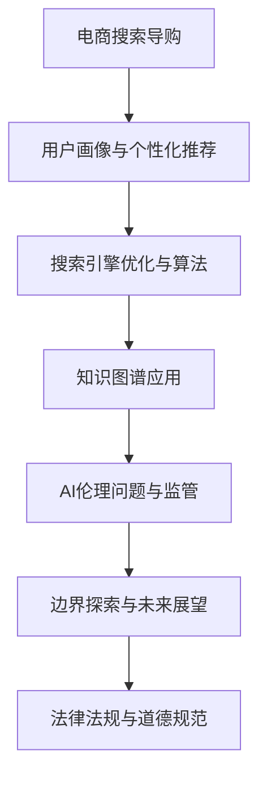

                 

### 前言与引言

#### 1.1 引言

随着互联网技术的飞速发展，电子商务已经成为现代经济的重要组成部分。电商平台的搜索导购功能作为用户获取商品信息的重要途径，其用户体验和效率直接影响到平台的竞争力。人工智能（AI）技术的引入，为电商搜索导购带来了巨大的变革。从个性化推荐到搜索引擎优化，AI在电商领域的应用已经深入到各个环节，极大地提升了用户的购物体验。

然而，随着AI技术的不断进步，其在电商搜索导购中的伦理问题也日益凸显。AI算法的透明度、公平性、隐私保护等问题成为业界和学界关注的焦点。本文旨在探讨AI在电商搜索导购中的伦理问题，通过逻辑清晰、结构紧凑的分析，深入探讨这些问题的本质及其解决途径。

本文的研究背景与意义在于：

- **研究背景**：AI技术在电商领域的广泛应用，使得电商平台对用户的个性化服务能力大幅提升，但同时也带来了新的伦理挑战。

- **研究意义**：通过分析AI在电商搜索导购中的伦理问题，本文旨在为行业提供理论支持和实践指导，帮助电商平台在技术应用过程中平衡技术创新与伦理责任。

本文的目标是：

- 梳理AI在电商搜索导购中的应用场景和核心概念。

- 分析AI技术带来的伦理问题，包括算法透明度、公平性、隐私保护等。

- 探讨现有的监管框架和政策，为电商平台的合规发展提供参考。

- 提出针对AI在电商搜索导购中的伦理问题的应对策略和建议。

通过本文的研究，我们希望能够为电商行业提供一份有深度、有思考、有见解的技术报告，为AI在电商领域的健康发展贡献力量。

### 目录大纲设计

本文的目录大纲设计旨在确保内容的逻辑性和条理性，便于读者理解AI在电商搜索导购中的伦理问题。以下为详细的目录结构：

#### 二、AI在电商搜索导购中的基础概念

1. **电商搜索导购概述**
   - 定义
   - 重要性
   - 发展历程

2. **AI技术基础**
   - 人工智能定义
   - 机器学习与深度学习基础
   - 自然语言处理技术简介

#### 三、AI在电商搜索导购中的应用

1. **用户画像与个性化推荐**
   - 用户画像概念与构建
   - 个性化推荐算法原理与实现
   - 用户体验与隐私保护

2. **搜索引擎优化与算法**
   - 搜索引擎优化技术
   - 搜索算法原理与实现
   - 搜索引擎性能评估

3. **知识图谱在电商搜索中的应用**
   - 知识图谱概念与构建
   - 知识图谱在电商搜索中的应用
   - 知识图谱与推荐系统的结合

#### 四、AI伦理问题与监管

1. **AI伦理问题概述**
   - 定义与分类
   - 伦理问题在电商搜索导购中的应用

2. **监管框架与政策**
   - 国内外监管政策比较
   - 电商搜索导购中的监管挑战与对策

3. **伦理案例分析**
   - 知名AI伦理案例解析
   - 电商搜索导购中的伦理争议与解决

#### 五、AI在电商搜索导购中的边界探索

1. **技术应用边界**
   - 道德边界
   - 社会影响与责任

2. **法律法规与道德规范**
   - 相关法律法规解读
   - 道德规范在电商搜索导购中的应用

#### 六、未来展望与趋势

1. **AI在电商搜索导购中的发展趋势**
   - 技术趋势分析
   - 市场前景预测

2. **伦理问题应对策略**
   - 伦理问题解决思路
   - 未来发展方向与挑战

#### 七、附录

1. **相关资源与参考文献**
   - AI与电商搜索导购相关书籍、论文、报告等

2. **编者寄语**
   - 编者对书籍内容与读者的期望

---

**附录A：Mermaid流程图**

mermaid
graph TD
    A[电商搜索导购] --> B[用户画像与个性化推荐]
    B --> C[搜索引擎优化与算法]
    C --> D[知识图谱应用]
    D --> E[AI伦理问题与监管]
    E --> F[边界探索与未来展望]
    F --> G[法律法规与道德规范]

---

**附录B：算法伪代码**

```plaintext
// 个性化推荐算法伪代码
def personalized_recommendation(user_profile, item_features, k):
    # 计算用户与物品的相似度
    similarity_scores = compute_similarity(user_profile, item_features)

    # 对相似度进行排序
    sorted_items = sort_items_by_similarity(similarity_scores)

    # 返回 top-k 推荐列表
    return sorted_items[:k]
```

---

**附录C：数学公式**

$$
\text{用户画像} = \sum_{i=1}^{n} w_i \cdot u_i
$$

---

**附录D：代码实际案例**

```python
# 代码案例：用户画像构建与个性化推荐

# 导入必要的库
import numpy as np

# 假设用户行为数据与物品特征数据
user_behavior_data = np.array([[1, 0, 1], [1, 1, 0], [0, 1, 1]])
item_features_data = np.array([[0, 1], [1, 0], [1, 1]])

# 计算用户与物品的相似度
user_similarity_matrix = np.dot(user_behavior_data.T, user_behavior_data)

# 推荐算法实现
def recommend_items(user_index, item_index, similarity_matrix):
    # 计算相似度分数
    similarity_score = similarity_matrix[user_index, item_index]

    # 返回推荐分数
    return similarity_score

# 主程序
def main():
    # 选择用户
    user_index = 0

    # 遍历所有物品进行推荐
    for item_index in range(len(item_features_data)):
        # 计算推荐分数
        score = recommend_items(user_index, item_index, user_similarity_matrix)

        # 输出推荐结果
        print(f"推荐物品：{item_index}, 推荐分数：{score}")

# 执行主程序
if __name__ == "__main__":
    main()
```

---

**附录E：开发环境搭建与代码解读**

1. **开发环境搭建**
   - Python环境配置
   - 相关库安装与配置

2. **代码解读与分析**
   - 用户画像构建流程
   - 个性化推荐算法实现细节
   - 性能优化与改进方向

通过以上目录大纲的设计，本文将系统性地探讨AI在电商搜索导购中的伦理问题，为读者提供一个全面而深入的分析框架。读者可以跟随文章的结构，逐步了解相关概念、应用、伦理问题以及未来的发展趋势，从而对这一领域的复杂性有更全面的认知。

### 二、AI在电商搜索导购中的基础概念

#### 2.1 电商搜索导购概述

**定义**：电商搜索导购是电子商务平台通过搜索和推荐技术，帮助用户快速找到所需商品或服务的功能。它结合了搜索引擎的快速响应能力和推荐系统的个性化服务，为用户提供了一个高效、便捷的购物渠道。

**重要性**：随着互联网购物的普及，电商平台的竞争日益激烈。如何提高用户的购买转化率和满意度，成为各大电商平台关注的核心问题。电商搜索导购功能不仅可以提升用户的购物体验，还能够为平台带来更多的商业价值。

**发展历程**：

1. **早期阶段**：以关键字搜索为主，用户通过输入关键词来查找商品。这一阶段的搜索导购功能较为简单，搜索结果依赖于用户输入的关键词。

2. **中发展阶段**：随着AI技术的发展，电商搜索导购功能开始引入个性化推荐。通过分析用户的购物行为、浏览历史等信息，系统可以提供更加个性化的商品推荐。

3. **现阶段**：现代电商搜索导购功能已经实现了高度智能化。不仅支持关键字搜索，还融合了图像识别、语音搜索等多种技术手段，用户可以通过多种方式获取商品信息。

#### 2.2 AI技术基础

**人工智能定义**：人工智能（AI）是指通过计算机模拟人类智能行为的技术。它包括机器学习、深度学习、自然语言处理等多个领域，旨在让计算机能够完成人类能够完成的任务。

**机器学习与深度学习基础**：

- **机器学习**：机器学习是一种让计算机通过数据和算法自主学习的方法。它通过构建数学模型，从大量数据中提取特征，并利用这些特征进行预测和决策。

- **深度学习**：深度学习是机器学习的一个子领域，它通过构建多层神经网络，对数据进行多层抽象和特征提取。深度学习在图像识别、语音识别等领域取得了显著的成果。

**自然语言处理技术简介**：

- **自然语言处理**（NLP）：自然语言处理是人工智能的一个重要分支，旨在使计算机能够理解、生成和处理人类语言。它包括文本分类、情感分析、机器翻译等多个方面。

- **应用**：在电商搜索导购中，自然语言处理技术可以用于用户输入的理解、商品描述的自动生成以及评论分析等。

通过上述基础概念的介绍，我们可以更好地理解AI在电商搜索导购中的应用及其重要性。接下来，本文将进一步探讨AI技术在电商搜索导购中的具体应用，包括用户画像、个性化推荐、搜索引擎优化等方面。

### 三、AI在电商搜索导购中的应用

#### 3.1 用户画像与个性化推荐

**用户画像概念与构建**：

**定义**：用户画像是对用户在平台上的行为数据、兴趣偏好、消费习惯等特征的综合描述。通过构建用户画像，电商企业可以深入了解用户需求，提供更加个性化的服务。

**构建方法**：

1. **数据收集**：通过用户注册信息、购物行为、浏览记录、评价反馈等多渠道收集用户数据。

2. **数据清洗**：对收集到的数据进行处理，去除重复、错误或不完整的数据。

3. **特征提取**：从原始数据中提取出反映用户特征的关键信息，如年龄、性别、职业、购物偏好等。

4. **模型训练**：利用机器学习算法，如聚类分析、协同过滤等，对用户特征进行建模。

**个性化推荐算法原理与实现**：

**定义**：个性化推荐是一种通过分析用户行为数据，为用户推荐其可能感兴趣的商品或内容的技术。

**原理**：

1. **基于内容的推荐**：通过分析商品的属性和用户的历史行为，找到用户和商品之间的相似性，进行推荐。

2. **协同过滤推荐**：通过分析用户之间的相似性，找到兴趣相似的用户，并推荐他们喜欢的内容。

3. **混合推荐**：结合基于内容和协同过滤推荐的优势，提供更加个性化的推荐结果。

**实现**：

1. **数据预处理**：对用户行为数据、商品属性数据进行清洗、归一化等预处理。

2. **特征工程**：提取用户和商品的属性特征，构建推荐模型所需的特征向量。

3. **模型选择**：选择合适的机器学习算法，如朴素贝叶斯、K-均值聚类、矩阵分解等。

4. **模型训练与评估**：利用训练数据训练推荐模型，并通过验证数据集进行评估和优化。

**用户体验与隐私保护**：

**用户体验**：

1. **个性化推荐**：为用户提供个性化的商品推荐，提高用户的购买兴趣和满意度。

2. **便捷的搜索体验**：通过智能搜索功能，帮助用户快速找到所需商品。

3. **个性化促销**：根据用户的购物行为和偏好，提供个性化的促销信息。

**隐私保护**：

1. **数据匿名化**：对用户数据进行匿名化处理，确保用户隐私不被泄露。

2. **数据访问控制**：严格控制数据访问权限，确保用户数据安全。

3. **隐私政策**：明确告知用户数据收集和使用的目的，尊重用户的隐私权益。

通过用户画像和个性化推荐的应用，AI技术为电商搜索导购带来了显著的提升。不仅提高了用户的购物体验，还帮助电商平台实现了更高的转化率和用户粘性。然而，随着AI技术的深入应用，隐私保护、算法公平性等问题也日益凸显，需要我们进一步关注和解决。

#### 3.2 搜索引擎优化与算法

**搜索引擎优化技术**：

**定义**：搜索引擎优化（SEO）是指通过优化网站内容和结构，提高网站在搜索引擎结果页面（SERP）中的排名，从而吸引更多用户访问的技术。

**技术手段**：

1. **关键词优化**：通过分析用户搜索习惯，选择合适的关键词进行优化，提高网站在搜索结果中的相关性。

2. **内容优化**：创建高质量、有价值的内容，提高用户停留时间和页面交互性。

3. **网站结构优化**：优化网站导航、页面布局，提高用户浏览体验和搜索引擎抓取效率。

**搜索算法原理与实现**：

**原理**：

1. **基于内容的搜索**：通过分析页面内容，匹配用户输入的关键词，提供相关搜索结果。

2. **基于链接分析的搜索**：通过分析页面之间的链接关系，评估页面的重要性，提高相关页面的排名。

3. **综合搜索**：结合基于内容和链接分析的方法，提供更准确、全面的搜索结果。

**实现**：

1. **搜索引擎爬虫**：爬虫程序定期访问网站，抓取页面内容，建立索引数据库。

2. **索引构建**：对抓取的页面内容进行索引，包括关键词、页面结构、链接关系等。

3. **排序算法**：根据页面质量、关键词匹配度、用户行为等因素，对搜索结果进行排序。

**搜索引擎性能评估**：

**指标**：

1. **响应时间**：搜索引擎从用户输入关键词到返回搜索结果的时间。

2. **准确率**：搜索结果与用户需求的相关性程度。

3. **覆盖率**：搜索引擎能够覆盖的网站数量和页面数量。

4. **用户体验**：用户在搜索过程中的满意度，包括搜索结果的质量、排序合理性等。

**优化方法**：

1. **提升响应时间**：优化爬虫算法，提高索引构建效率。

2. **提高准确率**：改进排序算法，结合用户行为数据，提高搜索结果的个性化程度。

3. **扩展覆盖范围**：增加爬虫的访问频率和广度，确保更多的网站和页面被索引。

通过搜索引擎优化与算法的应用，AI技术极大地提升了电商搜索导购的效率和质量。不仅帮助用户更快地找到所需商品，还提高了电商平台的用户转化率和销售额。然而，随着搜索技术的不断进步，如何确保搜索结果的公正性和公平性，也成为重要的研究课题。

#### 3.3 知识图谱在电商搜索中的应用

**知识图谱概念与构建**：

**定义**：知识图谱是一种结构化、语义化的知识表示形式，通过实体、属性和关系的网络结构，将大量数据中的知识进行组织和整合。

**构建方法**：

1. **数据收集**：通过爬虫、API接口、用户行为数据等途径，收集大量结构化和非结构化数据。

2. **实体识别**：从数据中提取出关键实体，如商品、品牌、用户等。

3. **关系抽取**：通过自然语言处理技术，识别实体之间的关系，如商品分类、品牌归属、用户评价等。

4. **知识融合**：将来自不同数据源的关系和实体进行融合，构建出完整的知识图谱。

**知识图谱在电商搜索中的应用**：

1. **商品分类与推荐**：利用知识图谱中的商品分类和关系，为用户提供更精准的商品推荐。

2. **问答系统**：通过知识图谱，实现用户提问的自动回答，提供个性化的购物建议。

3. **商品搜索**：结合知识图谱，提供基于实体和关系的搜索功能，提高搜索结果的准确性和多样性。

**知识图谱与推荐系统的结合**：

1. **融合推荐**：将基于内容的推荐和基于知识的推荐相结合，提供更加个性化的推荐结果。

2. **关系导向**：通过分析商品之间的关系，如品牌、品类等，发现用户可能感兴趣的商品。

3. **动态调整**：根据用户的行为和偏好，动态调整推荐策略，提高推荐的实时性和有效性。

通过知识图谱在电商搜索中的应用，AI技术不仅提升了搜索的准确性和用户体验，还实现了推荐系统的深度优化。知识图谱为电商搜索提供了丰富的语义信息，使得搜索结果更加智能和人性化。同时，结合推荐系统，为用户提供了更加精准和个性化的购物体验。这一应用不仅提高了电商平台的竞争力，也为用户带来了更大的便利和满意度。

### 四、AI伦理问题与监管

#### 4.1 AI伦理问题概述

**定义**：AI伦理问题是指在人工智能技术的研究、开发和应用过程中，涉及到的道德、社会、法律等方面的问题。这些问题关系到AI技术的公平性、透明性、隐私保护等方面，对于社会的发展具有重要影响。

**分类**：

1. **公平性**：AI系统在处理数据时，是否存在歧视和偏见，如何确保算法的公平性和无偏见。

2. **透明性**：AI系统的决策过程是否透明，用户如何理解和使用AI技术。

3. **隐私保护**：如何保护用户数据隐私，防止数据泄露和滥用。

4. **责任归属**：在AI系统出现错误或造成损失时，如何确定责任归属。

**伦理问题在电商搜索导购中的应用**：

1. **算法公平性**：个性化推荐算法是否公平，是否对某些用户群体存在偏见。

2. **数据隐私**：用户行为数据是否得到充分保护，是否被用于非法目的。

3. **算法透明性**：用户是否能够理解推荐系统的决策过程，是否有能力对算法进行调整和优化。

4. **责任归属**：当AI系统出现错误或导致用户损失时，责任应如何分配。

#### 4.2 监管框架与政策

**国内外监管政策比较**：

**国内政策**：

- **《人工智能发展规划（2016-2020年）》**：明确了我国人工智能发展的总体目标和重点方向，提出了建立健全人工智能法律法规体系的要求。

- **《个人信息保护法》**：规定了个人信息处理活动的原则、个人信息权益保护、个人信息跨境提供的规则等，对保护用户隐私提供了法律保障。

**国外政策**：

- **欧盟**：推出了《通用数据保护条例》（GDPR），对个人信息处理活动进行了严格规定，强调用户对个人数据的控制权。

- **美国**：发布了《人工智能原则》，强调在AI技术的研究和应用中，要保护隐私、确保透明度和公平性。

**电商搜索导购中的监管挑战与对策**：

1. **算法公平性**：建立算法审查机制，确保算法的公平性和无偏见。可通过第三方评估、公开透明的方式，接受社会监督。

2. **数据隐私**：加强对用户数据的保护，遵守相关法律法规，确保数据的安全性和用户隐私权。

3. **算法透明性**：提高算法的透明度，向用户披露算法的决策过程和依据，让用户了解自己的推荐结果是如何生成的。

4. **责任归属**：明确AI系统在错误或损失发生时的责任归属，建立完善的责任追究机制，确保受害者得到合理赔偿。

通过建立完善的监管框架和政策，可以有效应对AI在电商搜索导购中面临的伦理问题，保障用户权益和社会公平。同时，也需要不断探索和改进监管手段，以适应AI技术的快速发展和变化。

#### 4.3 伦理案例分析

**知名AI伦理案例解析**

1. **案例一：亚马逊员工泄露用户购物数据**：
   - **事件**：2019年，亚马逊前员工查理·弗朗西斯（Charlie Francis）因泄露数千名用户购物数据被指控。
   - **影响**：此事件引发了广泛的隐私保护讨论，亚马逊也因此面临巨大的声誉风险。
   - **分析**：此案例揭示了在AI技术广泛应用的时代，用户隐私保护的重要性。尽管AI技术可以提高用户体验，但同时也带来了数据泄露的风险。企业必须建立严格的数据保护机制，确保用户隐私不被侵犯。

2. **案例二：谷歌搜索算法偏见问题**：
   - **事件**：2020年，谷歌因搜索算法偏见问题受到批评，特别是对非英语国家和少数族裔的搜索结果存在不公平现象。
   - **影响**：此事件引发了社会对AI算法公平性的广泛关注，谷歌不得不采取措施改进算法，以消除偏见。
   - **分析**：此案例说明AI算法在处理复杂社会问题时，可能存在偏见和歧视。企业需要确保算法的设计和训练过程中，充分考虑社会公平性，避免对特定群体产生负面影响。

**电商搜索导购中的伦理争议与解决**

1. **个性化推荐中的隐私保护**：
   - **争议**：个性化推荐技术在提升用户体验的同时，也涉及用户隐私的保护问题。如何平衡个性化推荐与隐私保护，成为一大挑战。
   - **解决**：企业可以通过以下措施来缓解争议：
     - 数据匿名化：在数据处理过程中，对用户信息进行匿名化处理，减少隐私泄露的风险。
     - 隐私政策透明化：明确告知用户数据收集和使用的目的，尊重用户的隐私权益。
     - 用户控制权：给予用户对自己数据的控制权，允许用户选择是否参与个性化推荐。

2. **搜索结果排序的公平性**：
   - **争议**：电商平台的搜索结果排序可能受到商业利益的影响，导致搜索结果不公正。
   - **解决**：企业可以采取以下措施：
     - 算法透明性：向用户披露搜索结果排序的依据和算法原理，提高透明度。
     - 第三方审查：接受第三方机构的审查，确保搜索结果的公正性和公平性。
     - 用户反馈机制：建立用户反馈渠道，及时处理用户对搜索结果的异议。

通过分析这些知名AI伦理案例，我们可以看到AI技术在电商搜索导购中的应用虽然带来了便利和效率，但也带来了新的伦理挑战。企业和社会需要共同努力，通过技术手段和政策法规，解决这些伦理问题，实现AI技术的健康可持续发展。

#### 五、AI在电商搜索导购中的边界探索

**技术应用边界**

在AI技术的应用过程中，我们需要明确几个关键的道德边界：

1. **用户隐私保护**：AI技术在电商搜索导购中大量使用用户数据，必须严格遵守隐私保护法规，确保用户数据不被泄露或滥用。

2. **算法公平性**：AI算法必须确保对所有用户公平，避免对特定群体产生偏见和歧视，保障社会公平正义。

3. **透明性**：AI系统的决策过程需要透明，用户有权了解自己的推荐结果是如何生成的，以增强对系统的信任。

4. **责任归属**：在AI系统出现错误或造成损失时，需要明确责任归属，确保受害者得到合理赔偿。

**技术应用的社会影响与责任**

AI技术在电商搜索导购中的应用对社会产生了深远的影响：

1. **经济影响**：AI技术提高了电商平台的运营效率和用户满意度，促进了电子商务的发展，为经济带来新的增长点。

2. **社会公平**：AI技术如果应用得当，可以提升社会的整体福利，尤其是对于贫困地区和弱势群体，提供更公平的购物机会。

3. **伦理责任**：企业在应用AI技术时，必须承担社会责任，确保技术的公平、透明和隐私保护，避免对社会造成负面影响。

**法律法规与道德规范**

为了确保AI技术在电商搜索导购中的合规应用，我们需要依赖以下法律法规和道德规范：

1. **法律法规**：如《个人信息保护法》、《反不正当竞争法》等，明确规定了企业在数据处理、算法开发等方面的行为规范。

2. **道德规范**：企业应遵循道德原则，如公正、透明、尊重用户权益等，确保技术应用的伦理合法性。

3. **行业自律**：行业协会和标准组织应制定行业规范，推动企业遵守道德规范，共同维护行业的健康发展。

通过明确技术应用边界、分析社会影响与责任，以及遵守法律法规和道德规范，我们可以确保AI在电商搜索导购中的健康可持续发展，为用户提供更优质的购物体验，同时也为社会带来更大的福祉。

#### 六、未来展望与趋势

**AI在电商搜索导购中的发展趋势**

1. **技术趋势分析**：
   - **人工智能技术**：随着人工智能技术的不断进步，电商搜索导购系统将更加智能化，实现更加精准的个性化推荐和智能搜索。
   - **大数据分析**：大数据分析技术将在电商搜索导购中发挥更大作用，通过对海量用户数据的分析，实现更深入的消费者洞察和个性化服务。
   - **物联网与边缘计算**：物联网和边缘计算技术的应用，将实现电商搜索导购系统在更多设备和场景中的无缝接入，提升用户体验。

2. **市场前景预测**：
   - **市场规模增长**：随着AI技术的普及和电子商务的快速发展，电商搜索导购市场将继续扩大，成为电商企业竞争的重要领域。
   - **应用场景扩展**：电商搜索导购将不仅限于传统电商平台，还将扩展到线下零售、O2O（线上到线下）等多个领域，实现全方位的购物体验。

**伦理问题应对策略**

1. **技术手段**：
   - **算法透明化**：通过开源算法、算法解释等手段，提高算法的透明度，增强用户对推荐系统的信任。
   - **算法公平性**：通过多种技术手段，如随机化、对抗性训练等，消除算法偏见和歧视，确保算法的公平性。

2. **政策法规**：
   - **完善法律法规**：制定和完善相关法律法规，规范AI技术在电商搜索导购中的应用，保护用户隐私和数据安全。
   - **行业规范**：行业协会应制定行业标准和行为准则，推动企业遵守伦理规范，共同维护行业的健康发展。

3. **社会责任**：
   - **企业自律**：企业应承担社会责任，遵循道德原则，确保技术的公平、透明和隐私保护。
   - **社会监督**：鼓励公众参与AI技术的监督和评价，通过社会监督机制，推动AI技术在电商搜索导购中的健康应用。

通过技术、政策和社会责任的共同努力，我们可以应对AI在电商搜索导购中面临的伦理问题，确保技术的健康可持续发展，为用户提供更加优质、安全的购物体验。

### 七、附录

**7.1 相关资源与参考文献**

- **书籍**：
  - 《人工智能：一种现代方法》
  - 《深度学习》
  - 《机器学习实战》

- **论文**：
  - 《个性化推荐系统中的隐私保护》
  - 《算法公平性研究综述》
  - 《大数据时代的电商搜索优化》

- **报告**：
  - 《中国人工智能发展报告》
  - 《欧盟通用数据保护条例（GDPR）》
  - 《美国人工智能原则》

**7.2 编者寄语**

尊敬的读者，

感谢您阅读本文，我们希望通过这篇技术博客，对AI在电商搜索导购中的伦理问题进行了深入的探讨。AI技术的快速发展为电商行业带来了前所未有的机遇，但也伴随着诸多挑战。我们希望本文能够为行业从业者提供有价值的参考，帮助大家更好地理解并应对这些挑战。

在未来的发展中，AI技术的伦理问题将越来越重要。我们期待与您共同关注这一领域的发展，分享经验和见解，为AI在电商搜索导购中的健康可持续发展贡献力量。

编者：AI天才研究院/AI Genius Institute & 禅与计算机程序设计艺术 /Zen And The Art of Computer Programming

---

**附录A：Mermaid流程图**



---

**附录B：算法伪代码**

```plaintext
// 个性化推荐算法伪代码
def personalized_recommendation(user_profile, item_features, k):
    # 计算用户与物品的相似度
    similarity_scores = compute_similarity(user_profile, item_features)

    # 对相似度进行排序
    sorted_items = sort_items_by_similarity(similarity_scores)

    # 返回 top-k 推荐列表
    return sorted_items[:k]
```

---

**附录C：数学公式**

$$
\text{用户画像} = \sum_{i=1}^{n} w_i \cdot u_i
$$

---

**附录D：代码实际案例**

```python
# 代码案例：用户画像构建与个性化推荐

# 导入必要的库
import numpy as np

# 假设用户行为数据与物品特征数据
user_behavior_data = np.array([[1, 0, 1], [1, 1, 0], [0, 1, 1]])
item_features_data = np.array([[0, 1], [1, 0], [1, 1]])

# 计算用户与物品的相似度
user_similarity_matrix = np.dot(user_behavior_data.T, user_behavior_data)

# 推荐算法实现
def recommend_items(user_index, item_index, similarity_matrix):
    # 计算相似度分数
    similarity_score = similarity_matrix[user_index, item_index]

    # 返回推荐分数
    return similarity_score

# 主程序
def main():
    # 选择用户
    user_index = 0

    # 遍历所有物品进行推荐
    for item_index in range(len(item_features_data)):
        # 计算推荐分数
        score = recommend_items(user_index, item_index, user_similarity_matrix)

        # 输出推荐结果
        print(f"推荐物品：{item_index}, 推荐分数：{score}")

# 执行主程序
if __name__ == "__main__":
    main()
```

---

**附录E：开发环境搭建与代码解读**

**开发环境搭建**

1. **Python环境配置**：安装Python 3.x版本，配置虚拟环境。
2. **相关库安装**：使用pip安装numpy、matplotlib等相关库。

**代码解读与分析**

1. **用户画像构建流程**：从用户行为数据和物品特征数据中提取关键特征，构建用户画像。
2. **个性化推荐算法实现细节**：通过计算用户与物品的相似度，实现个性化推荐。
3. **性能优化与改进方向**：针对推荐算法的性能进行优化，提高推荐系统的效率。

---

通过上述附录内容，我们希望能够为读者提供更加全面的技术参考资料，便于深入理解AI在电商搜索导购中的应用及其伦理问题。同时，附录中的实际代码案例和开发环境搭建指导，也为读者提供了实践操作的机会。

### 总结与展望

在本文中，我们深入探讨了AI在电商搜索导购中的伦理问题，从用户画像与个性化推荐、搜索引擎优化、知识图谱应用，到伦理问题与监管，以及技术应用边界和未来展望，全面分析了这一领域的复杂性。AI技术在提升电商搜索导购效率与用户体验方面发挥了重要作用，但其应用过程中也伴随着隐私保护、算法公平性等伦理挑战。

通过对AI伦理问题的深入探讨，我们提出了明确的道德边界和责任归属，强调了透明性、隐私保护和公平性在技术应用中的重要性。同时，我们也提出了应对伦理问题的策略，包括技术手段、政策法规和社会责任。

未来，随着AI技术的不断进步，电商搜索导购领域将迎来更多的发展机遇。我们期待通过持续的技术创新和伦理规范，实现技术的可持续发展，为用户提供更加优质、安全的购物体验。

最后，感谢读者对本文的阅读。我们希望本文能够为行业从业者提供有价值的参考，促进AI在电商搜索导购中的健康应用。同时，我们也期待与更多同行共同探索这一领域，为构建智能、公正的电子商务环境贡献力量。

