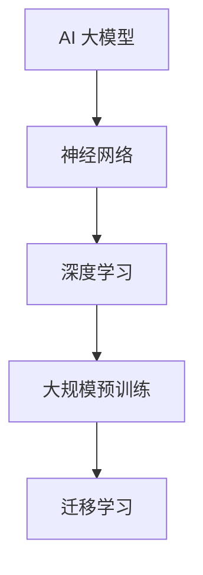
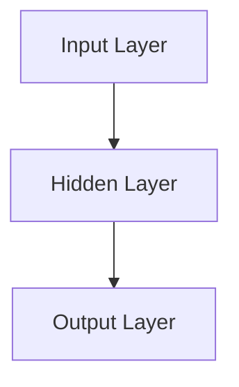
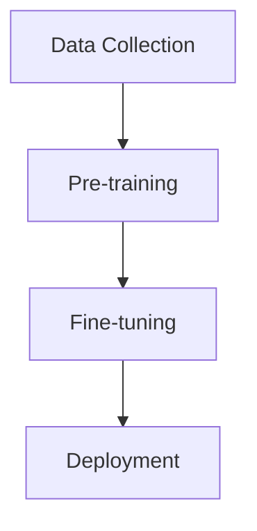

                 

# 《AI 大模型创业：如何利用技术优势？》

## 关键词
AI 大模型、创业、技术优势、神经网络、深度学习、风险、商业模式、应用领域

## 摘要
本文旨在探讨 AI 大模型在创业领域中的应用与利用技术优势的方法。通过分析 AI 大模型的基本概念、核心算法原理、应用领域和创业策略，我们帮助创业者深入了解如何把握市场机会，降低风险，并利用 AI 大模型的技术优势实现商业价值。本文还将结合实战案例，提供详细的代码实现和解码，为创业者提供实际操作指导。

## 第一部分：AI 大模型基础与创业环境

### 第1章：AI 大模型概述

#### 1.1 AI 大模型的基本概念

AI 大模型是指具有强大表征能力和高度参数化的机器学习模型，通常通过大规模数据集进行训练。它们通常采用深度神经网络架构，能够自动学习数据的复杂结构，并在各种任务中表现出优异的性能。AI 大模型的发展经历了从简单的线性模型到复杂的深度学习模型的过程，其核心在于通过增加网络层数和参数量，提升模型的表征能力和泛化能力。

#### 1.2 AI 大模型的核心技术与架构

AI 大模型的核心技术包括神经网络、深度学习、大规模预训练和迁移学习。神经网络是深度学习的基础，通过模拟人脑神经元之间的连接来构建模型。深度学习则通过多层神经网络的堆叠，使模型能够处理更加复杂的任务。大规模预训练是指在模型训练之前，使用大量未标记的数据进行预训练，以提高模型在特定任务上的表现。迁移学习则利用预训练模型的知识，迁移到新的任务上，减少训练时间和数据需求。

下面是 AI 大模型的基本概念和架构的 Mermaid 流程图：



### 第2章：AI 大模型的应用领域

#### 2.1 人工智能领域的细分市场

AI 大模型在各个领域都有广泛的应用，包括但不限于自然语言处理、计算机视觉、语音识别、推荐系统、自动驾驶等。在自然语言处理领域，AI 大模型被用于文本分类、情感分析、机器翻译等任务；在计算机视觉领域，AI 大模型被用于图像分类、目标检测、图像生成等任务。

#### 2.2 AI 大模型的价值创造

AI 大模型的价值主要体现在以下几个方面：

- **提高效率**：通过自动化处理大量的数据和任务，提高工作效率。
- **降低成本**：减少人工干预和操作，降低运营成本。
- **提升质量**：通过模型的精确预测和分析，提升决策质量和准确性。
- **创新应用**：开辟新的业务模式和机会，推动行业创新。

### 第3章：AI 大模型创业策略

#### 3.1 创业者视角下的 AI 大模型

创业者应具备以下 AI 技术素养：

- **技术理解**：了解 AI 大模型的基本原理和核心技术。
- **数据思维**：掌握数据处理和分析的方法，能够利用数据驱动决策。
- **创新能力**：不断探索新的业务模式和应用场景，利用 AI 大模型实现价值创造。

#### 3.2 AI 大模型创业的商业模式

创业者在选择商业模式时，应考虑以下几个方面：

- **产品导向**：开发以用户需求为中心的 AI 产品或服务。
- **平台模式**：构建开放的 AI 平台，吸引第三方开发者和服务提供商。
- **合作共赢**：与行业伙伴合作，共同开发和应用 AI 技术。

### 第4章：AI 大模型创业的风险与应对

#### 4.1 AI 大模型创业的潜在风险

AI 大模型创业过程中可能面临以下风险：

- **技术风险**：模型性能不稳定、过拟合、训练数据不足等。
- **市场风险**：市场需求不明确、竞争对手激烈等。
- **法律与伦理风险**：数据隐私、知识产权保护、伦理问题等。

#### 4.2 风险管理策略

针对上述风险，创业者可以采取以下策略：

- **技术风险管理**：持续优化模型、进行交叉验证、使用更多数据等。
- **市场风险管理**：进行市场调研、分析竞争对手、制定差异化的市场策略等。
- **法律与伦理风险管理**：遵守相关法律法规、保护用户隐私、制定伦理准则等。

## 第二部分：技术深度与实战

### 第5章：AI 大模型的核心算法原理

#### 5.1 神经网络与深度学习基础

神经网络（Neural Networks）是深度学习（Deep Learning）的基础，它通过模拟人脑神经元之间的连接来构建模型。一个简单的神经网络通常由输入层、隐藏层和输出层组成。每个神经元都与前一层和后一层相连，通过权重和偏置进行加权求和并应用激活函数。

以下是一个简化的神经网络结构图：



#### 5.2 大规模预训练模型的原理与实践

大规模预训练模型（Large-scale Pre-trained Models）是指通过在大规模数据集上进行预训练，然后在不同任务上微调（Fine-tuning）的模型。预训练的目的是让模型学习到数据的通用表征，从而在后续任务中能够更好地泛化和适应。

下面是一个大规模预训练模型的一般流程：



### 第6章：数学模型与公式讲解

#### 6.1 AI 大模型中的数学模型

AI 大模型中的数学模型主要包括损失函数（Loss Function）和优化算法（Optimization Algorithm）。损失函数用于衡量模型预测值与实际值之间的差距，优化算法用于调整模型参数，以最小化损失函数。

以下是一个简单的损失函数和优化算法的伪代码：

```python
# 损失函数：均方误差（MSE）
def mean_squared_error(y_true, y_pred):
    return (y_true - y_pred) ** 2

# 优化算法：梯度下降（Gradient Descent）
def gradient_descent(weights, learning_rate, epochs):
    for epoch in range(epochs):
        # 计算梯度
        gradients = compute_gradients(weights)
        # 更新权重
        weights -= learning_rate * gradients
    return weights
```

#### 6.2 公式详解与举例

在深度学习中，常见的激活函数包括 sigmoid、ReLU 和 tanh。以下是对这些激活函数的公式详解和举例：

- **sigmoid 函数**：
  $$ f(x) = \frac{1}{1 + e^{-x}} $$

  示例：计算输入 x = 2 的 sigmoid 函数值：
  $$ f(2) = \frac{1}{1 + e^{-2}} \approx 0.869 $$

- **ReLU 函数**：
  $$ f(x) = \max(0, x) $$

  示例：计算输入 x = -2 的 ReLU 函数值：
  $$ f(-2) = \max(0, -2) = 0 $$

- **tanh 函数**：
  $$ f(x) = \frac{e^{x} - e^{-x}}{e^{x} + e^{-x}} $$

  示例：计算输入 x = 2 的 tanh 函数值：
  $$ f(2) = \frac{e^{2} - e^{-2}}{e^{2} + e^{-2}} \approx 0.96 $$

### 第7章：AI 大模型项目实战案例

#### 7.1 创业项目介绍

本项目旨在构建一个基于 AI 大模型的智能客服系统，该系统利用自然语言处理技术，实现与用户的实时交互，提供在线客服服务。项目团队由人工智能专家、软件工程师和产品经理组成。

#### 7.2 项目实战流程

1. **数据收集与处理**：

   - 收集用户聊天记录、产品文档等数据。
   - 进行数据清洗，去除噪声和重复数据。
   - 对文本数据进行分词、词性标注等预处理。

2. **模型设计与训练**：

   - 选择合适的神经网络架构，如 Transformer 或 BERT。
   - 使用预训练模型进行微调，以适应客服场景。
   - 使用交叉验证方法进行模型评估和优化。

3. **模型评估与优化**：

   - 在测试集上评估模型性能，如准确率、召回率等指标。
   - 调整模型参数，如学习率、批量大小等，以提升模型性能。

4. **部署与监控**：

   - 将训练好的模型部署到生产环境中。
   - 监控模型性能和系统稳定性，确保服务的连续性和可靠性。

#### 7.3 代码解读与分析

在本项目中，我们使用 Python 和 PyTorch 框架进行模型训练和部署。以下是关键代码片段及其解读：

```python
# 导入 PyTorch 和其他库
import torch
import torch.nn as nn
import torch.optim as optim

# 定义神经网络架构
class ChatbotModel(nn.Module):
    def __init__(self):
        super(ChatbotModel, self).__init__()
        self.embedding = nn.Embedding(vocab_size, embedding_dim)
        self.encoder = nn.LSTM(embedding_dim, hidden_dim)
        self.decoder = nn.LSTM(hidden_dim, vocab_size)
        self.fc = nn.Linear(hidden_dim, vocab_size)

    def forward(self, input_seq, hidden):
        embedded = self.embedding(input_seq)
        encoder_output, hidden = self.encoder(embedded, hidden)
        decoder_output, hidden = self.decoder(encoder_output, hidden)
        output = self.fc(decoder_output)
        return output, hidden

# 实例化模型
model = ChatbotModel()

# 定义损失函数和优化器
criterion = nn.CrossEntropyLoss()
optimizer = optim.Adam(model.parameters(), lr=learning_rate)

# 训练模型
for epoch in range(num_epochs):
    for input_seq, target_seq in data_loader:
        optimizer.zero_grad()
        output, hidden = model(input_seq, hidden)
        loss = criterion(output.view(-1, vocab_size), target_seq.view(-1))
        loss.backward()
        optimizer.step()
    print(f'Epoch {epoch+1}/{num_epochs}, Loss: {loss.item()}')

# 部署模型
model.eval()
with torch.no_grad():
    input_seq = torch.tensor([input_id])  # 输入序列
    output_seq = model(input_seq, None)  # 预测输出
    print(f'Predicted response: {output_seq}')
```

上述代码实现了基于 LSTM 的聊天机器人模型，包括模型定义、损失函数和优化器的设置，以及模型训练和预测的流程。通过这一过程，我们可以看到 AI 大模型在创业项目中的应用和实现。

## 附录

### 附录 A：AI 大模型开发工具与资源

- **主流深度学习框架**：
  - TensorFlow
  - PyTorch
  - Keras

- **开发工具与资源推荐**：
  - Jupyter Notebook：用于编写和运行代码。
  - Google Colab：免费的云端 Jupyter Notebook 环境。
  - Coursera、edX 等：在线课程和教程，涵盖深度学习、机器学习等主题。

### 附录 B：常见问题与解答

- **Q：AI 大模型是否容易过拟合？**
  - **A：是的，AI 大模型容易过拟合，特别是在训练数据量较小的情况下。为了避免过拟合，可以采用正则化、dropout、数据增强等方法。**

- **Q：如何选择合适的预训练模型？**
  - **A：选择预训练模型时，应考虑任务类型、数据规模和模型性能。对于图像识别任务，可以选择 ResNet、Inception 等；对于自然语言处理任务，可以选择 BERT、GPT 等。**

- **Q：AI 大模型创业过程中如何进行风险管理？**
  - **A：AI 大模型创业过程中，应进行全面的风险评估，并制定相应的风险管理策略。例如，通过技术测试和验证、市场调研、知识产权保护等手段降低风险。**

### 作者

作者：AI 天才研究院 / AI Genius Institute & 禅与计算机程序设计艺术 / Zen And The Art of Computer Programming

<|im_end|>

