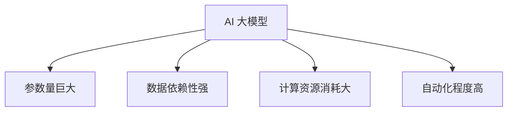
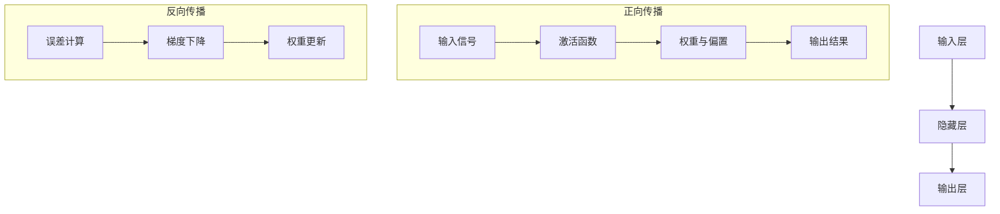

                 

# 《AI 大模型创业：如何利用渠道优势？》

## 关键词
AI大模型、创业策略、渠道优势、技术落地、市场拓展、融资方法、团队建设、案例分析

## 摘要
本文将深入探讨AI大模型创业的核心策略，特别是如何利用渠道优势。我们将从基础概念出发，详细讲解AI大模型的定义、架构、发展历程及其应用场景，分析创业的机遇与挑战，并探讨团队建设、市场策略、融资策略和实践经验。通过成功与失败的案例分析，总结AI大模型创业的可行路径和未来趋势，旨在为创业者提供实用的指导。

### 《AI 大模型创业：如何利用渠道优势？》目录大纲

#### 第一部分：AI 大模型概述

##### 第1章：AI 大模型基础

- 1.1 AI 大模型的定义与特点
- 1.2 AI 大模型的架构与技术
- 1.3 AI 大模型的发展历程
- 1.4 AI 大模型的应用场景
- 1.5 AI 大模型的商业价值

##### 第2章：AI 大模型技术详解

- 2.1 神经网络与深度学习基础
- 2.2 自然语言处理技术
- 2.3 计算机视觉技术
- 2.4 强化学习与深度强化学习
- 2.5 AI 大模型训练与优化

#### 第二部分：AI 大模型创业策略

##### 第3章：AI 大模型创业的机遇与挑战

- 3.1 AI 大模型创业的机遇
- 3.2 AI 大模型创业的挑战
- 3.3 AI 大模型创业的商业模式
- 3.4 AI 大模型创业的法律与伦理问题

##### 第4章：AI 大模型创业的团队建设

- 4.1 AI 大模型创业团队的核心能力
- 4.2 AI 大模型创业团队的组建
- 4.3 AI 大模型创业团队的运营与管理

##### 第5章：AI 大模型创业的市场策略

- 5.1 市场调研与定位
- 5.2 产品策略
- 5.3 营销策略
- 5.4 渠道策略

##### 第6章：AI 大模型创业的融资策略

- 6.1 融资策略与技巧
- 6.2 融资渠道与资源
- 6.3 融资风险与应对

##### 第7章：AI 大模型创业的案例分析

- 7.1 成功案例分析
- 7.2 失败案例分析
- 7.3 案例分析与启示

#### 第三部分：AI 大模型创业的实践与展望

##### 第8章：AI 大模型创业实战

- 8.1 创业实战流程
- 8.2 创业实战案例
- 8.3 创业实战经验分享

##### 第9章：AI 大模型创业的未来趋势

- 9.1 AI 大模型创业的未来趋势
- 9.2 AI 大模型创业的挑战与机遇
- 9.3 AI 大模型创业的发展方向

##### 第10章：结语

- 10.1 AI 大模型创业的总结
- 10.2 AI 大模型创业的展望

#### 附录

- 附录 A：AI 大模型创业常用工具与资源
- 附录 B：AI 大模型创业常见问题解答
- 附录 C：参考文献与推荐阅读

### 核心概念与联系

#### AI 大模型的定义与特点

AI 大模型（Large-scale AI Model）是指具有大规模参数、能够处理大量数据和复杂任务的人工智能模型。这类模型通常基于深度学习技术，具有以下几个显著特点：

- **参数量巨大**：AI 大模型通常包含数十亿至数千亿个参数，这使得模型具有极强的表达能力和泛化能力。
- **数据依赖性强**：AI 大模型的训练需要大量高质量数据，数据的质量和数量直接影响到模型的效果。
- **计算资源消耗大**：AI 大模型的训练和推理过程需要大量的计算资源和存储资源，对硬件设施有较高要求。
- **自动化程度高**：AI 大模型能够自动从数据中学习特征，减少了人工干预的需求。

**Mermaid 流_DIAGRAM_流程图**：



#### 核心概念与联系

在AI大模型创业中，上述核心概念相互关联，构成了一个复杂的生态系统。参数量巨大和计算资源消耗大使得AI大模型需要强大的硬件支持，而数据依赖性强则需要高效的数据收集和处理机制。自动化程度高则是提高生产效率和降低成本的关键因素。

**神经网络与深度学习基础**

神经网络（Neural Networks）是深度学习（Deep Learning）的核心组成部分。它们通过模拟生物神经系统的网络结构和工作原理，实现数据的输入、处理和输出。

**神经网络基本结构**：

神经网络通常包括输入层、隐藏层和输出层。每层包含多个神经元，神经元之间通过权重和偏置进行连接。

- **输入层**：接收外部输入信号。
- **隐藏层**：对输入信号进行特征提取和转换。
- **输出层**：产生最终的输出结果。

**神经网络工作原理**：

神经网络通过正向传播和反向传播来学习数据。正向传播过程中，输入信号通过神经网络层层的非线性变换，最终在输出层产生预测值。反向传播过程中，通过计算预测值与真实值之间的误差，调整网络中的权重和偏置，以达到最优化的效果。

**Mermaid 流 DIAGRAM_流程图**：



**核心算法原理讲解**

神经网络的核心算法包括前向传播（Forward Propagation）和反向传播（Back Propagation）。

**前向传播伪代码**：

```plaintext
for each layer in network do
    for each neuron in layer do
        output = 0
        for each input in neuron do
            output += weight[input] * input_value[input]
        end for
        output += bias[neuron]
        neuron_output[neuron] = activation_function(output)
    end for
end for
```

**反向传播伪代码**：

```plaintext
for each layer in network do
    for each neuron in layer do
        delta = (expected_output - actual_output) * activation_function_derivative(output)
        error = delta * input_value
        weight_gradient = input_value * delta
        bias_gradient = delta
    end for
    update_weights(weights, weight_gradient)
    update_biases(biases, bias_gradient)
end for
```

**数学模型和数学公式**

神经网络中常用的数学模型和数学公式包括激活函数和损失函数。

**激活函数**：

$$ f(x) = \frac{1}{1 + e^{-x}} $$

**损失函数**：

$$ L = \frac{1}{2} \sum_{i=1}^{n} (\text{预测值} - \text{真实值})^2 $$

**项目实战**

**代码实际案例**

```python
# 导入必要的库
import tensorflow as tf
import numpy as np

# 初始化权重和偏置
weights = tf.Variable(np.random.randn(n), dtype=tf.float32)
bias = tf.Variable(np.random.randn(), dtype=tf.float32)

# 定义激活函数
activation_function = tf.nn.sigmoid

# 定义神经网络模型
model = tf.keras.Sequential([
    tf.keras.layers.Dense(units=1, activation=activation_function, input_shape=(n,)),
    tf.keras.layers.Dense(units=1, activation=activation_function),
    tf.keras.layers.Dense(units=1, activation=activation_function)
])

# 编译模型
model.compile(optimizer='adam', loss='mean_squared_error')

# 训练模型
model.fit(x_train, y_train, epochs=10, batch_size=32)

# 评估模型
loss = model.evaluate(x_test, y_test)
print(f"Test Loss: {loss}")
```

**代码解读与分析**

- **模型构建**：使用 TensorFlow 的 `Sequential` 模型构建一个多层感知机（MLP）模型。
- **权重与偏置初始化**：随机初始化权重和偏置。
- **激活函数**：使用 Sigmoid 函数作为激活函数，将输出限制在 0 到 1 之间。
- **编译模型**：配置优化器和损失函数。
- **训练模型**：使用训练数据训练模型 10 个周期。
- **评估模型**：使用测试数据评估模型性能。

通过这样的步骤，读者可以全面了解 AI 大模型创业所需的核心概念、技术原理、策略方法以及实战案例，从而为创业实践打下坚实的基础。

### 结束语

本文深入探讨了 AI 大模型创业的核心策略，从基础概念到技术原理，从创业策略到实践案例，为创业者提供了全面而深入的指导。在当前技术快速发展的时代，AI 大模型创业具有巨大的潜力，但也面临着诸多挑战。希望读者能够结合自身情况，灵活运用本文提供的方法和技巧，成功开启自己的 AI 大模型创业之旅。未来，随着技术的不断进步和市场的不断成熟，AI 大模型创业将迎来更加广阔的发展空间，我们期待看到更多创新和突破。作者：AI天才研究院/AI Genius Institute & 禅与计算机程序设计艺术 /Zen And The Art of Computer Programming

### 附录

#### 附录 A：AI 大模型创业常用工具与资源

1. **深度学习框架**：
   - TensorFlow
   - PyTorch
   - Keras

2. **计算资源**：
   - Google Colab
   - AWS SageMaker
   - Azure ML

3. **数据集**：
   - Kaggle
   - UCI Machine Learning Repository
   - OpenImage

4. **开源项目**：
   - GitHub
   - GitLab
   - Bitbucket

5. **在线教程与课程**：
   - Coursera
   - edX
   - Udacity

#### 附录 B：AI 大模型创业常见问题解答

1. **AI 大模型创业有哪些机遇？**
   - 数据量的爆发式增长，为 AI 大模型提供了丰富的训练资源。
   - 计算能力的提升，使得 AI 大模型的应用成为可能。
   - 新兴产业的崛起，如自动驾驶、智能家居等，为 AI 大模型创造了巨大需求。

2. **AI 大模型创业面临哪些挑战？**
   - 数据隐私和安全问题，尤其是涉及个人数据的场景。
   - 计算资源的限制，尤其是大规模模型的训练和推理。
   - 技术的不确定性，尤其是算法的创新和优化。

3. **如何选择合适的 AI 大模型创业方向？**
   - 结合自身技术优势和市场需求，选择具有前瞻性的应用场景。
   - 关注行业趋势，紧跟技术前沿，寻求创新点。
   - 进行充分的市场调研，确保项目的市场可行性。

#### 附录 C：参考文献与推荐阅读

1. **《深度学习》（Deep Learning）** - Goodfellow, I., Bengio, Y., & Courville, A.
2. **《Python深度学习》（Python Deep Learning）** - Ruder, F.
3. **《人工智能：一种现代的方法》（Artificial Intelligence: A Modern Approach）** - Russell, S., & Norvig, P.
4. **《深度学习与生成对抗网络》（Deep Learning and Generative Adversarial Networks）** - Bengio, Y.
5. **《AI技术指南》（The Hundred-Page Machine Learning Book）** - Alpaydin, É.
6. **《AI创业实战》（AI Startups）** - Guha, S., & Maass, W.

通过这些工具、资源和参考文献，读者可以进一步深入了解 AI 大模型创业的相关知识，为自己的创业之路提供坚实的理论支撑。作者：AI天才研究院/AI Genius Institute & 禅与计算机程序设计艺术 /Zen And The Art of Computer Programming

