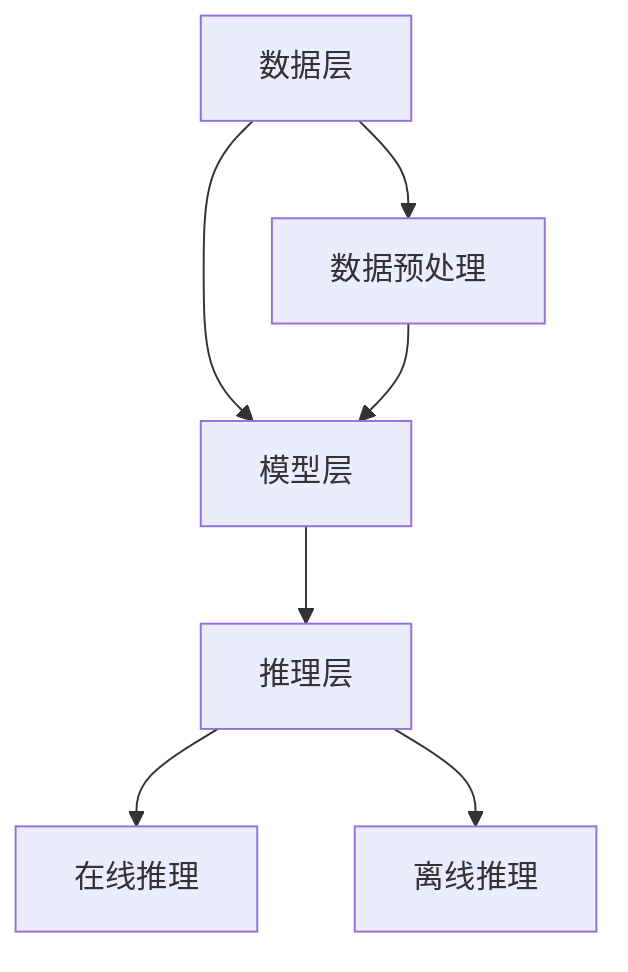

                 

# AI 大模型创业：如何利用资源优势？

> **关键词**：AI 大模型、创业、资源优势、技术路线、团队建设、案例分析、可持续发展

> **摘要**：本文旨在探讨 AI 大模型创业中的资源优势及其利用策略。通过对 AI 大模型的基础知识、创业实战和资源指南的深入分析，为创业者提供切实可行的创业指导。文章首先介绍了 AI 大模型的发展历程、核心算法和未来趋势；然后分析了 AI 大模型创业的机遇与挑战，并提出了项目规划、团队建设和案例分析的建议；最后，针对 AI 大模型创业的资源获取与利用、法律与伦理问题以及创业案例进行了详细探讨。希望通过本文，帮助更多创业者把握 AI 大模型创业的机遇，实现持续发展。

----------------------------------------------------------------

## 《AI 大模型创业：如何利用资源优势？》目录大纲

1. AI 大模型基础知识
    - 1.1 AI 大模型概述
        - 1.1.1 AI 大模型的概念
        - 1.1.2 AI 大模型的主要特点
        - 1.1.3 AI 大模型的发展历程
    - 1.2 AI 大模型的类型
        - 1.2.1 语言模型
        - 1.2.2 视觉模型
        - 1.2.3 多模态模型
    - 1.3 AI 大模型的核心算法
        - 1.3.1 生成对抗网络（GAN）
        - 1.3.2 变分自编码器（VAE）
        - 1.3.3 强化学习
    - 1.4 AI 大模型的技术挑战与趋势
        - 1.4.1 技术挑战
        - 1.4.2 未来趋势

2. AI 大模型创业实战
    - 2.1 AI 大模型创业的机遇与挑战
        - 2.1.1 行业需求分析
        - 2.1.2 技术优势分析
        - 2.1.3 市场竞争分析
    - 2.2 AI 大模型创业项目规划
        - 2.2.1 项目立项与市场调研
        - 2.2.2 技术路线与资源调配
        - 2.2.3 团队建设与人才培养
    - 2.3 AI 大模型创业案例分析
        - 2.3.1 案例一：某语言模型创业公司的成长之路
        - 2.3.2 案例二：某视觉模型创业公司的创新发展

3. AI 大模型创业的可持续发展
    - 3.1 创业企业的核心竞争力
        - 3.1.1 技术创新
        - 3.1.2 市场拓展
        - 3.1.3 企业文化
    - 3.2 创业企业的可持续发展策略
        - 3.2.1 资源优化
        - 3.2.2 风险管理
        - 3.2.3 持续创新

4. AI 大模型创业资源指南
    - 4.1 AI 大模型开发工具与平台
        - 4.1.1 开发工具概述
        - 4.1.2 开发平台选择
        - 4.1.3 开发工具与平台的对比分析
    - 4.2 AI 大模型创业资源获取与利用
        - 4.2.1 资源获取渠道
        - 4.2.2 资源利用策略
    - 4.3 AI 大模型创业法律与伦理指南
        - 4.3.1 法律法规概述
        - 4.3.2 伦理道德问题

5. AI 大模型创业案例分析与启示
    - 5.1 案例分析
    - 5.2 启示与建议

6. 附录
    - 6.1 AI 大模型开发资源
    - 6.2 参考文献

----------------------------------------------------------------

## 第一部分：AI 大模型基础知识

### 1.1 AI 大模型概述

#### 1.1.1 AI 大模型的概念

AI 大模型（Large-scale AI Models）是指具有海量参数和复杂结构的深度学习模型，它们通过学习和模拟人脑神经元网络，能够进行高度复杂的模式识别、预测和决策。AI 大模型通常基于大规模数据集进行训练，具有强大的学习和泛化能力。

AI 大模型的发展历程可以追溯到 20 世纪 80 年代的神经网络研究。1986 年，Rumelhart、Hinton 和 Williams 提出了反向传播算法（Backpropagation Algorithm），为神经网络训练提供了有效的手段。此后，随着计算能力和数据量的提高，深度学习（Deep Learning）逐渐崛起，AI 大模型也应运而生。

#### 1.1.2 AI 大模型的主要特点

1. **海量参数**：AI 大模型通常具有数十亿到数十亿的参数，这使得它们能够捕获复杂的数据特征。
2. **深度结构**：AI 大模型采用多层神经网络结构，使得模型具有更强的层次化特征提取能力。
3. **自适应学习能力**：AI 大模型通过优化算法，能够在大量数据上进行自适应学习，不断提高模型的性能。
4. **强大泛化能力**：AI 大模型能够从训练数据中提取出一般性知识，从而在未见过的数据上表现良好。

#### 1.1.3 AI 大模型的发展历程

1. **神经网络革命**（1986-1998）：反向传播算法的提出使得神经网络训练成为可能，深度学习开始受到关注。
2. **休眠期**（1998-2012）：由于计算能力和数据量的限制，深度学习的研究和应用逐渐停滞。
3. **复兴期**（2012-至今）：随着计算能力和数据量的提高，深度学习再次崛起，AI 大模型成为研究热点。

### 1.2 AI 大模型的类型

AI 大模型根据应用领域和任务类型可以分为以下几类：

#### 1.2.1 语言模型

语言模型（Language Model）是一种基于深度学习技术的自然语言处理模型，用于预测下一个词或句子。目前最著名的语言模型是 Google 的 BERT 和 OpenAI 的 GPT。

#### 1.2.2 视觉模型

视觉模型（Vision Model）主要用于图像和视频数据的处理和分析。著名的视觉模型包括 Google 的 Inception、Facebook 的 ResNet 和 OpenAI 的 DALL-E。

#### 1.2.3 多模态模型

多模态模型（Multimodal Model）能够同时处理多种类型的数据，如文本、图像、声音等。这种模型能够更全面地理解世界，提升模型的泛化能力。

### 1.3 AI 大模型的核心算法

AI 大模型的核心算法主要包括生成对抗网络（GAN）、变分自编码器（VAE）和强化学习。

#### 1.3.1 生成对抗网络（GAN）

生成对抗网络（Generative Adversarial Networks，GAN）是一种由生成器和判别器组成的深度学习模型。生成器试图生成逼真的数据，而判别器则试图区分真实数据和生成数据。两者相互对抗，共同提升生成效果。

GAN 的基本原理可以用以下伪代码表示：

```python
# 生成器 G(z)
z = sampled_noise()
x_hat = G(z)

# 判别器 D(x, x_hat)
D(x, x_hat)

# 优化目标
D_loss = -[log(D(x)) + log(1 - D(x_hat))]
G_loss = -[log(D(x_hat))]
```

#### 1.3.2 变分自编码器（VAE）

变分自编码器（Variational Autoencoder，VAE）是一种基于概率模型的生成模型。VAE 通过编码器和解码器来生成数据，同时能够学习数据分布。

VAE 的基本原理可以用以下伪代码表示：

```python
# 编码器 E(x)
z_mean, z_log_var = E(x)

# 采样
z = sample_z(z_mean, z_log_var)

# 解码器 D(z)
x_hat = D(z)

# 优化目标
KL_loss = -0.5 * sum(1 + z_log_var - z_mean^2 - z_log_var)
G_loss = -sum(log(D(x_hat)))
```

#### 1.3.3 强化学习

强化学习（Reinforcement Learning，RL）是一种通过与环境交互来学习最优策略的机器学习方法。强化学习模型由智能体（Agent）、环境（Environment）和奖励（Reward）组成。

强化学习的基本原理可以用以下伪代码表示：

```python
# 初始化智能体
state = initial_state()

# 交互过程
while not termination_condition():
    action = agent.act(state)
    next_state, reward, termination = environment.step(state, action)
    agent.update(state, action, reward, next_state)
    state = next_state

# 策略学习
policy = agent.learn()
```

### 1.4 AI 大模型的技术挑战与趋势

AI 大模型在技术发展过程中面临着一系列挑战，同时也呈现出一些发展趋势。

#### 1.4.1 技术挑战

1. **数据隐私保护**：AI 大模型训练需要大量数据，如何确保数据隐私成为一大挑战。
2. **模型可解释性**：AI 大模型通常被视为“黑盒”，如何提高模型的可解释性是当前研究的热点。
3. **模型可靠性**：AI 大模型在复杂环境中的应用需要保证模型的可信度和可靠性。

#### 1.4.2 未来趋势

1. **模型压缩与高效推理**：为了降低计算成本和加速部署，模型压缩和高效推理技术将成为研究重点。
2. **跨模态融合**：多模态模型的发展将进一步提升 AI 大模型的泛化能力。
3. **智能搜索与推荐系统**：AI 大模型在智能搜索和推荐系统中的应用将得到进一步拓展。

### 1.5 AI 大模型的技术架构

AI 大模型的技术架构通常包括数据层、模型层和推理层。

1. **数据层**：负责数据的采集、预处理和存储。
2. **模型层**：包括生成器、判别器、编码器和解码器等核心组件。
3. **推理层**：负责模型的部署和推理，包括在线推理和离线推理。

以下是 AI 大模型的技术架构 Mermaid 流程图：



通过上述对 AI 大模型基础知识的介绍，我们可以看到 AI 大模型在技术发展、应用场景和创业机会方面都有着巨大的潜力。在接下来的部分，我们将深入探讨 AI 大模型创业的实战策略和资源指南，帮助创业者更好地把握 AI 大模型创业的机遇。

----------------------------------------------------------------

## 第一部分：AI 大模型基础知识

### 1.2 AI 大模型的类型

#### 1.2.1 语言模型

语言模型（Language Model）是 AI 大模型中最为重要的一类，尤其在自然语言处理（Natural Language Processing，NLP）领域具有广泛的应用。语言模型的主要任务是预测下一个词或句子的概率，从而生成连贯的自然语言文本。

语言模型可以分为基于统计的模型和基于神经网络的模型。基于统计的模型，如 N-gram 模型，通过计算历史词序列的概率来预测下一个词。而基于神经网络的模型，如 BERT、GPT 等，通过学习大量语言数据，自动提取语言特征，并能够生成更加准确和自然的文本。

下面是一个简单的语言模型示例，使用 N-gram 模型来预测下一个词：

```python
# N-gram 模型预测下一个词
from collections import defaultdict

# 建立词序列
word_sequence = "I like to eat pizza."

# 统计词频
n_gram_freq = defaultdict(int)
for i in range(len(word_sequence) - 1):
    n_gram = word_sequence[i:i+2]
    n_gram_freq[n_gram] += 1

# 计算下一个词的概率
next_word = "a"
prob = n_gram_freq[(word_sequence[-2], next_word)] / (len(word_sequence) - 1)
print(f"The probability of '{next_word}' is {prob}")
```

#### 1.2.2 视觉模型

视觉模型（Vision Model）主要用于处理和解析图像和视频数据。它们通过学习图像中的特征和模式，可以用于图像分类、目标检测、图像分割等多种任务。

视觉模型的核心是卷积神经网络（Convolutional Neural Networks，CNN），其基本结构包括卷积层（Convolution Layer）、池化层（Pooling Layer）和全连接层（Fully Connected Layer）。卷积层用于提取图像特征，池化层用于减小特征图的大小，全连接层用于分类。

以下是一个简单的 CNN 模型示例，用于图像分类：

```python
import tensorflow as tf

# 创建 CNN 模型
model = tf.keras.Sequential([
    tf.keras.layers.Conv2D(32, (3, 3), activation='relu', input_shape=(28, 28, 1)),
    tf.keras.layers.MaxPooling2D((2, 2)),
    tf.keras.layers.Conv2D(64, (3, 3), activation='relu'),
    tf.keras.layers.MaxPooling2D((2, 2)),
    tf.keras.layers.Flatten(),
    tf.keras.layers.Dense(64, activation='relu'),
    tf.keras.layers.Dense(10, activation='softmax')
])

# 编译模型
model.compile(optimizer='adam',
              loss='sparse_categorical_crossentropy',
              metrics=['accuracy'])

# 训练模型
model.fit(x_train, y_train, epochs=5)
```

#### 1.2.3 多模态模型

多模态模型（Multimodal Model）能够同时处理多种类型的数据，如文本、图像、声音等。这种模型能够更全面地理解世界，提升模型的泛化能力。

多模态模型的典型应用包括视频分类、情感分析、语音识别等。常见的多模态模型结构包括串联结构、并联结构和交互结构。

以下是一个简单的多模态模型示例，用于情感分析：

```python
import tensorflow as tf

# 创建多模态模型
model = tf.keras.Sequential([
    tf.keras.layers.Flatten(input_shape=(28, 28, 1)),  # 图像输入
    tf.keras.layers.Dense(64, activation='relu'),
    tf.keras.layers.Flatten(input_shape=(100,)),       # 文本输入
    tf.keras.layers.Dense(64, activation='relu'),
    tf.keras.layers.concatenate([tf.keras.layers.Dense(64, activation='relu'), tf.keras.layers.Dense(64, activation='relu')]),  # 交互层
    tf.keras.layers.Dense(10, activation='softmax')
])

# 编译模型
model.compile(optimizer='adam',
              loss='sparse_categorical_crossentropy',
              metrics=['accuracy'])

# 训练模型
model.fit(x_train, y_train, epochs=5)
```

通过上述对语言模型、视觉模型和多模态模型的介绍，我们可以看到这些模型在 AI 大模型中的核心作用和应用场景。在接下来的部分，我们将进一步探讨 AI 大模型的核心算法，包括生成对抗网络（GAN）、变分自编码器（VAE）和强化学习，以深入了解 AI 大模型的技术基础。

----------------------------------------------------------------

### 1.3 AI 大模型的核心算法

AI 大模型的核心算法是构建和优化这些模型的基石。在本节中，我们将介绍生成对抗网络（GAN）、变分自编码器（VAE）和强化学习，并详细探讨这些算法的基本原理和应用场景。

#### 1.3.1 生成对抗网络（GAN）

生成对抗网络（Generative Adversarial Networks，GAN）是由 Ian Goodfellow 等人在 2014 年提出的一种新型深度学习模型。GAN 由两个神经网络——生成器（Generator）和判别器（Discriminator）组成，它们相互对抗，共同学习数据分布。

**基本原理：**

- 生成器：生成器从随机噪声 z 中生成假样本 x'，目标是使这些样本难以被判别器区分。
- 判别器：判别器的目标是区分真实样本 x 和生成样本 x'，并最大化其鉴别能力。

GAN 的训练过程可以视为一个零和博弈，生成器和判别器交替优化，直至生成器生成足够逼真的样本，使得判别器无法准确区分。

以下是一个 GAN 的伪代码示例：

```python
# 生成器 G(z)
z = sampled_noise()
x_hat = G(z)

# 判别器 D(x, x_hat)
D_loss = -[log(D(x)) + log(1 - D(x_hat))]

# 生成器 G 的损失
G_loss = -log(1 - D(x_hat))

# 优化过程
for i in range(num_iterations):
    # 更新判别器
    D_loss = train_discriminator(D, x, x_hat)
    # 更新生成器
    G_loss = train_generator(G, z)
```

**应用场景：**

- 生成逼真的图像和视频
- 数据增强
- 生成虚拟角色和动漫人物
- 文本到图像的转换

#### 1.3.2 变分自编码器（VAE）

变分自编码器（Variational Autoencoder，VAE）是一种生成模型，通过学习数据分布进行数据生成。VAE 结合了编码器（Encoder）和解码器（Decoder）的结构，并引入了变分推断的思想。

**基本原理：**

- 编码器：编码器将输入数据 x 映射到一个潜在空间中的均值 μ 和方差 σ²。
- 解码器：解码器从潜在空间中采样 z，并将其映射回输入空间中的数据 x'。

VAE 的损失函数包括两部分：重构损失（Reconstruction Loss）和KL散度损失（KL Divergence Loss）。

以下是一个 VAE 的伪代码示例：

```python
# 编码器 E(x)
z_mean, z_log_var = E(x)

# 采样
z = sample_z(z_mean, z_log_var)

# 解码器 D(z)
x_hat = D(z)

# 优化目标
KL_loss = -0.5 * sum(1 + z_log_var - z_mean^2 - z_log_var)
G_loss = -sum(log(D(x_hat)))

# 优化过程
for i in range(num_iterations):
    # 更新编码器和解码器
    E_loss, D_loss = train_encoder_decoder(E, D, x, z_mean, z_log_var)
```

**应用场景：**

- 数据生成和增强
- 图像超分辨率
- 图像修复和去噪
- 文本生成

#### 1.3.3 强化学习

强化学习（Reinforcement Learning，RL）是一种通过试错和反馈来学习最优策略的机器学习方法。在强化学习中，智能体（Agent）通过与环境的交互来学习如何达成目标。

**基本原理：**

- 智能体：智能体通过感知环境状态，采取行动，并从环境中获得奖励。
- 环境：环境是智能体行动的场所，根据智能体的行动给出奖励或惩罚。
- 策略：策略是智能体在给定状态下采取的行动方案。

强化学习的主要目标是学习一个策略π，使得智能体在长期运行中获得的奖励总和最大化。

以下是一个简单的强化学习伪代码示例：

```python
# 初始化智能体
state = initial_state()

# 交互过程
while not termination_condition():
    action = agent.act(state)
    next_state, reward, termination = environment.step(state, action)
    agent.update(state, action, reward, next_state)
    state = next_state

# 策略学习
policy = agent.learn()
```

**应用场景：**

- 游戏AI
- 自动驾驶
- 机器人控制
- 股票交易

通过上述对 GAN、VAE 和强化学习的介绍，我们可以看到这些算法在构建和优化 AI 大模型中的重要性。在接下来的部分，我们将探讨 AI 大模型的技术挑战和未来趋势，为创业者提供更全面的技术背景。

----------------------------------------------------------------

## 2. AI 大模型创业实战

### 2.1 AI 大模型创业的机遇与挑战

#### 2.1.1 行业需求分析

随着人工智能技术的快速发展，AI 大模型在各个行业中的应用需求日益增长。以下是几个典型行业的需求分析：

1. **医疗健康**：AI 大模型在医疗健康领域具有广泛的应用，如疾病预测、诊断辅助、药物研发等。通过训练大型医疗数据集，AI 大模型能够为医生提供更加精准的诊断建议，提高医疗效率。
   
2. **金融科技**：金融行业对数据分析和预测的需求巨大，AI 大模型在风险控制、投资组合优化、信用评分等方面具有显著优势。例如，通过分析用户的交易数据，AI 大模型能够预测潜在的风险并给出相应的风险管理建议。

3. **智能制造**：在智能制造领域，AI 大模型能够优化生产流程、提高生产效率。例如，通过训练工业设备的数据，AI 大模型可以预测设备的故障并提前进行维护，减少停机时间。

4. **自然语言处理**：AI 大模型在自然语言处理领域具有强大的文本生成、情感分析、问答系统等功能，广泛应用于客户服务、内容创作、教育等领域。

#### 2.1.2 技术优势分析

AI 大模型创业的技术优势主要体现在以下几个方面：

1. **强大的数据处理能力**：AI 大模型能够处理海量数据，通过深度学习算法提取特征，实现高效的数据分析和预测。

2. **高度的自动化和智能化**：AI 大模型可以实现高度自动化和智能化，减少人力成本，提高工作效率。

3. **灵活的应用场景**：AI 大模型具有广泛的应用场景，可以在不同领域实现定制化应用。

4. **创新性和竞争力**：AI 大模型创业项目通常具有创新性和竞争力，能够为传统行业带来变革性的影响。

#### 2.1.3 市场竞争分析

尽管 AI 大模型创业具有巨大潜力，但也面临着激烈的市场竞争。以下是几个主要竞争因素：

1. **技术壁垒**：AI 大模型技术具有较高的技术门槛，需要强大的研发团队和资金支持。

2. **数据资源**：AI 大模型训练需要大量高质量的数据，数据的获取和处理是创业公司的核心竞争因素。

3. **用户需求**：用户需求的多样性和变化性要求创业公司能够快速响应市场，提供个性化的解决方案。

4. **商业模式**：创业公司需要找到可持续的商业模式，以实现商业化和盈利。

#### 2.1.4 创业挑战

AI 大模型创业面临的挑战主要包括以下几个方面：

1. **技术挑战**：AI 大模型的技术研发需要持续投入，同时需要解决数据隐私、模型可解释性和可靠性等技术问题。

2. **市场风险**：AI 大模型创业项目的市场前景不明朗，需要面对激烈的市场竞争和不确定性。

3. **资源限制**：创业公司通常面临资金、人才等资源的限制，需要高效利用有限资源。

4. **政策法规**：随着 AI 技术的发展，政策法规的不断完善对创业公司提出了更高的合规要求。

### 2.2 AI 大模型创业项目规划

为了成功创业，创业公司需要制定详细的项目规划，包括项目立项、市场调研、技术路线与资源调配、团队建设和人才培养等方面。

#### 2.2.1 项目立项

项目立项是创业项目启动的第一步，主要包括以下几个步骤：

1. **项目定位**：明确项目目标、应用领域和市场需求。
2. **市场评估**：分析市场需求、竞争态势和潜在风险。
3. **技术评估**：评估项目所需的技术可行性、技术难度和研发周期。
4. **商业模式**：设计项目的商业模式，包括盈利模式、市场推广策略等。

#### 2.2.2 市场调研

市场调研是创业项目成功的关键环节，主要包括以下几个步骤：

1. **目标市场分析**：确定目标市场、目标客户和市场规模。
2. **竞争分析**：分析主要竞争对手的产品、市场份额、优势和劣势。
3. **市场需求分析**：了解用户需求、痛点和期望，为产品设计提供依据。
4. **市场策略**：制定市场进入策略、推广策略和价格策略。

#### 2.2.3 技术路线与资源调配

技术路线是创业项目成功的重要保障，主要包括以下几个步骤：

1. **技术选型**：根据项目需求和市场需求，选择合适的技术方案。
2. **研发计划**：制定详细的研发计划，包括研发周期、关键节点和里程碑。
3. **资源调配**：根据研发计划，合理调配人力、资金和设备等资源。
4. **风险管理**：评估项目的技术风险，制定相应的风险管理策略。

#### 2.2.4 团队建设与人才培养

团队建设是创业项目成功的关键因素，主要包括以下几个步骤：

1. **团队组建**：根据项目需求，组建合适的团队，包括技术团队、市场团队和运营团队等。
2. **人才培养**：通过内部培训、外部引进和人才激励等手段，提升团队整体素质和能力。
3. **激励机制**：制定合理的激励机制，激发团队成员的积极性和创造力。
4. **团队管理**：建立有效的团队管理机制，确保团队协作和项目进度。

#### 2.2.5 项目风险管理

项目风险管理是创业项目成功的重要保障，主要包括以下几个步骤：

1. **风险评估**：评估项目可能面临的风险，包括技术风险、市场风险、资金风险等。
2. **风险应对**：制定相应的风险应对策略，包括风险规避、风险转移、风险接受等。
3. **风险监控**：建立风险监控机制，及时识别和应对项目风险。
4. **风险报告**：定期进行风险报告，评估风险应对效果，优化风险应对策略。

### 2.3 AI 大模型创业案例分析

#### 2.3.1 案例一：某语言模型创业公司的成长之路

某语言模型创业公司成立于 2015 年，专注于研发和推广基于深度学习的自然语言处理技术。以下是该公司的成长之路：

1. **项目立项**：公司成立之初，明确了以语言模型为核心的产品方向，通过市场调研确定了目标市场和客户群体。
2. **技术研发**：公司组建了一支技术团队，专注于深度学习算法的研究和优化，成功开发出高性能的语言模型。
3. **市场推广**：公司通过线上和线下渠道，积极推广产品，与多家企业建立合作关系，实现了商业化和盈利。
4. **团队建设**：公司不断引进和培养人才，组建了一支高素质的团队，为公司持续发展提供了强大支撑。

#### 2.3.2 案例二：某视觉模型创业公司的创新发展

某视觉模型创业公司成立于 2017 年，专注于研发和推广基于深度学习的视觉模型技术。以下是该公司的创新发展之路：

1. **项目立项**：公司明确了以视觉模型为核心的产品方向，通过市场调研确定了目标市场和客户群体。
2. **技术研发**：公司组建了一支技术团队，专注于视觉模型的研究和优化，成功开发出多个高性能的视觉模型。
3. **产品创新**：公司不断进行产品创新，推出了一系列具有竞争力的视觉模型产品，赢得了市场的认可。
4. **市场拓展**：公司积极拓展市场，与多家企业建立合作关系，实现了产品的广泛应用。

通过以上案例，我们可以看到 AI 大模型创业的成功关键在于技术创新、市场定位和团队建设。在接下来的部分，我们将进一步探讨 AI 大模型创业的可持续发展策略，以帮助创业者实现长期成功。

----------------------------------------------------------------

### 2.3 AI 大模型创业案例分析

#### 2.3.1 案例一：某语言模型创业公司的成长之路

**项目背景：**

某语言模型创业公司成立于 2015 年，由几位在自然语言处理领域具有深厚背景的技术专家共同创立。公司成立之初，明确了以语言模型为核心的产品方向，专注于研发和推广基于深度学习的自然语言处理技术。

**技术实现：**

1. **数据集构建**：公司首先进行了大量市场调研，确定了目标市场和客户群体。在此基础上，公司收集并构建了大规模的语料库，为语言模型的训练提供了丰富的数据支持。
2. **模型开发**：公司采用最新的深度学习框架，如 TensorFlow 和 PyTorch，开发了一系列高性能的语言模型。其中，GPT 和 BERT 等模型成为公司研发的重点。
3. **优化算法**：公司不断优化模型算法，通过调整超参数和改进训练策略，提高了模型的性能和稳定性。

**营销策略：**

1. **产品推广**：公司通过线上和线下渠道，积极推广产品，与多家企业建立合作关系，实现了产品的广泛应用。
2. **品牌建设**：公司注重品牌建设，通过参加行业会议、发表学术论文和举办技术论坛等方式，提高了公司的知名度和影响力。
3. **客户服务**：公司提供优质的客户服务，积极收集客户反馈，不断优化产品功能，提升用户体验。

**成功经验：**

1. **技术创新**：公司始终坚持技术创新，紧跟行业发展趋势，不断推出具有竞争力的新产品。
2. **市场需求**：公司深入挖掘市场需求，为客户提供定制化的解决方案，满足了客户的多元化需求。
3. **团队建设**：公司注重团队建设，通过引进和培养高素质的人才，构建了一支高效的研发团队。

**挑战与应对：**

1. **技术挑战**：AI 大模型技术具有高度复杂性和挑战性，公司需要不断投入大量资源进行技术研究和优化。
2. **市场风险**：市场竞争激烈，公司需要密切关注市场动态，及时调整营销策略。
3. **资源限制**：公司面临资金、人才等资源的限制，需要高效利用有限资源，实现可持续发展。

#### 2.3.2 案例二：某视觉模型创业公司的创新发展

**项目背景：**

某视觉模型创业公司成立于 2017 年，由几位在计算机视觉领域具有丰富经验的专家创立。公司专注于研发和推广基于深度学习的视觉模型技术，致力于推动计算机视觉技术在各行各业的应用。

**技术实现：**

1. **数据集构建**：公司首先进行了大量市场调研，确定了目标市场和客户群体。在此基础上，公司收集并构建了大规模的图像数据集，为视觉模型的训练提供了丰富的数据支持。
2. **模型开发**：公司采用最新的深度学习框架，如 TensorFlow 和 PyTorch，开发了一系列高性能的视觉模型。其中，ResNet 和 Inception 等模型成为公司研发的重点。
3. **优化算法**：公司不断优化模型算法，通过调整超参数和改进训练策略，提高了模型的性能和稳定性。

**营销策略：**

1. **产品推广**：公司通过线上和线下渠道，积极推广产品，与多家企业建立合作关系，实现了产品的广泛应用。
2. **品牌建设**：公司注重品牌建设，通过参加行业会议、发表学术论文和举办技术论坛等方式，提高了公司的知名度和影响力。
3. **客户服务**：公司提供优质的客户服务，积极收集客户反馈，不断优化产品功能，提升用户体验。

**成功经验：**

1. **技术创新**：公司始终坚持技术创新，紧跟行业发展趋势，不断推出具有竞争力的新产品。
2. **市场需求**：公司深入挖掘市场需求，为客户提供定制化的解决方案，满足了客户的多元化需求。
3. **团队建设**：公司注重团队建设，通过引进和培养高素质的人才，构建了一支高效的研发团队。

**挑战与应对：**

1. **技术挑战**：AI 大模型技术具有高度复杂性和挑战性，公司需要不断投入大量资源进行技术研究和优化。
2. **市场风险**：市场竞争激烈，公司需要密切关注市场动态，及时调整营销策略。
3. **资源限制**：公司面临资金、人才等资源的限制，需要高效利用有限资源，实现可持续发展。

通过以上两个案例，我们可以看到 AI 大模型创业公司在技术实现、营销策略和成功经验方面的关键因素。同时，也面临着一系列挑战，需要创业者不断努力和创新，才能在激烈的市场竞争中脱颖而出。在接下来的部分，我们将探讨 AI 大模型创业的可持续发展策略，为创业者提供更多指导。

----------------------------------------------------------------

### 2.4 AI 大模型创业的可持续发展

#### 2.4.1 创业企业的核心竞争力

创业企业在 AI 大模型领域要实现可持续发展，必须具备以下几个核心竞争力：

1. **技术创新能力**：技术创新是创业企业持续发展的关键。创业企业需要不断跟踪和掌握最新的技术趋势，通过自主研发和创新，形成具有竞争优势的技术成果。

2. **数据资源优势**：AI 大模型训练需要大量的高质量数据，创业企业必须拥有丰富且持续更新的数据资源，以便不断提升模型性能。

3. **团队建设**：团队是创业企业的核心资产。创业企业需要组建一支具有高素质、高凝聚力、高效协同的团队，包括技术专家、产品经理、市场人员等，以支持企业的持续发展。

4. **商业模式创新**：创业企业需要构建可持续的商业模式，通过提供有竞争力的产品和服务，实现商业盈利和持续增长。

5. **客户关系管理**：良好的客户关系管理有助于创业企业积累口碑，提升品牌价值，扩大市场份额。

#### 2.4.2 创业企业的可持续发展策略

1. **资源优化**：

   - **技术资源优化**：通过技术研发和合作，不断优化和提升技术能力，提高模型性能和效率。
   - **数据资源优化**：建立完善的数据收集、处理和存储机制，确保数据质量和数据安全性。
   - **人才资源优化**：通过内部培养和外部引进，持续提升团队素质和能力。

2. **风险管理**：

   - **技术风险**：加强技术研究和预研，提前识别和应对技术风险，确保技术路线的稳定性。
   - **市场风险**：密切关注市场动态，及时调整战略和产品方向，以应对市场变化。
   - **资金风险**：合理规划资金使用，确保资金链的稳定性，降低资金风险。

3. **持续创新**：

   - **产品创新**：通过不断优化产品功能和性能，满足客户需求，提升市场竞争力。
   - **商业模式创新**：探索新的商业模式，如订阅模式、SaaS 模式等，实现商业盈利和可持续发展。
   - **技术创新**：持续关注技术前沿，积极参与技术创新和研究，保持技术领先地位。

#### 2.4.3 持续发展的关键要素

1. **技术创新**：技术创新是创业企业持续发展的核心驱动力。创业企业需要不断投入研发资源，推动技术进步，提高产品性能和用户体验。

2. **市场拓展**：创业企业需要不断拓展市场，寻找新的客户群体和应用场景，扩大市场份额。

3. **品牌建设**：良好的品牌形象有助于提升企业的市场竞争力和品牌价值。创业企业需要通过多种渠道和方式，积极推广品牌，树立品牌形象。

4. **人才培养**：人才是创业企业持续发展的关键。创业企业需要注重人才培养和引进，构建一支高素质的团队，以支持企业的长期发展。

5. **合作伙伴关系**：创业企业需要建立和维护良好的合作伙伴关系，通过合作共赢，共同推动企业的持续发展。

通过上述可持续发展策略和关键要素，创业企业可以在 AI 大模型领域实现长期成功和持续发展。在接下来的部分，我们将探讨 AI 大模型创业所需的具体资源指南，帮助创业者更好地利用资源，实现创业目标。

----------------------------------------------------------------

## 3. AI 大模型创业资源指南

### 3.1 AI 大模型开发工具与平台

选择合适的开发工具与平台对于 AI 大模型创业项目至关重要。以下是几种常用的开发工具与平台及其优缺点：

#### 3.1.1 开发工具概述

1. **PyTorch**：PyTorch 是一种流行的深度学习框架，具有简洁的代码和强大的灵活性。它支持动态计算图，使得调试和优化模型变得非常方便。

   **优点**：灵活、易于使用、支持动态计算图。
   
   **缺点**：相对于 TensorFlow，PyTorch 的性能可能稍逊一筹。

2. **TensorFlow**：TensorFlow 是 Google 开发的一种广泛使用的深度学习框架，具有丰富的社区支持和强大的功能。

   **优点**：性能优越、功能全面、社区支持强大。
   
   **缺点**：代码相对复杂，调试可能较为困难。

3. **其他常用开发工具**：

   - **Keras**：Keras 是一个高层神经网络 API，可以方便地与 TensorFlow 和 Theano 结合使用。
   - **MXNet**：MXNet 是 Apache 轻量级深度学习框架，具有高性能和灵活性。

#### 3.1.2 开发平台选择

选择开发平台时，需要考虑以下几个因素：

1. **计算资源**：根据项目的计算需求，选择合适的云计算平台或本地开发环境。

2. **开发和部署**：考虑项目的开发和部署流程，选择支持自动化部署和管理的平台。

3. **性能和成本**：根据项目的性能和成本要求，选择合适的硬件和软件平台。

常见的开发平台包括：

- **云计算平台**：Google Cloud、AWS、Azure 等，提供了强大的计算资源和丰富的服务。
- **本地开发环境**：高性能计算机或服务器，适合需要大量计算资源的项目。

#### 3.1.3 开发工具与平台的对比分析

1. **性能对比**：

   - **PyTorch**：在 GPU 性能方面，PyTorch 的性能与 TensorFlow 相当，但可能在某些特定任务上表现更好。
   - **TensorFlow**：TensorFlow 在 CPU 性能上可能优于 PyTorch，但在 GPU 性能上略有不足。

2. **社区支持**：

   - **PyTorch**：PyTorch 的社区支持非常活跃，提供了丰富的文档和教程。
   - **TensorFlow**：TensorFlow 的社区支持也非常强大，有着丰富的资源和社区活跃度。

3. **开发便捷性**：

   - **PyTorch**：PyTorch 的代码更加简洁直观，易于学习和使用。
   - **TensorFlow**：TensorFlow 提供了更多的功能，但代码相对复杂，需要更多的调试和优化。

### 3.2 AI 大模型创业资源获取与利用

#### 3.2.1 资源获取渠道

1. **技术资源**：

   - **开源社区**：通过 GitHub、GitLab 等平台获取开源代码和框架。
   - **学术会议**：参加学术会议和研讨会，获取最新的研究成果和技术动态。
   - **企业合作**：与高校、研究机构和企业合作，共享技术和资源。

2. **资金资源**：

   - **政府资助**：申请政府科技项目资助，获取资金支持。
   - **风险投资**：寻找风险投资机构，获取资金和资源。
   - **天使投资**：寻找天使投资人，获取启动资金。

3. **人才资源**：

   - **高校人才**：与高校合作，引进优秀毕业生。
   - **社会招聘**：通过招聘网站和猎头公司，吸引优秀人才。
   - **内部培养**：通过内部培训和晋升机制，培养和留住人才。

#### 3.2.2 资源利用策略

1. **技术资源利用**：

   - **开源框架**：充分利用开源框架和工具，降低研发成本。
   - **技术共享**：与合作伙伴共享技术和资源，实现互利共赢。

2. **资金资源利用**：

   - **合理规划**：制定详细的资金使用计划，确保资金的有效利用。
   - **投资多元化**：分散投资，降低资金风险。

3. **人才资源利用**：

   - **团队建设**：构建高效的团队，确保人才充分利用。
   - **激励机制**：制定合理的激励机制，激发人才创造力和积极性。

### 3.3 AI 大模型创业法律与伦理指南

#### 3.3.1 法律法规概述

1. **数据保护法规**：了解并遵守数据保护法规，如 GDPR（通用数据保护条例）和 CCPA（加州消费者隐私法案）。

2. **知识产权法规**：尊重和保护知识产权，避免侵犯他人的专利、版权和商标。

3. **消费者权益保护法规**：确保产品和服务符合消费者权益保护法规，维护消费者合法权益。

#### 3.3.2 伦理道德问题

1. **模型偏见与歧视**：确保 AI 大模型在训练和应用过程中不产生偏见和歧视，公平对待不同用户。

2. **模型安全性**：确保 AI 大模型在训练和应用过程中具有高安全性，防止数据泄露和滥用。

3. **个人隐私保护**：保护用户隐私，遵循数据最小化原则，确保用户数据的安全和隐私。

通过上述 AI 大模型创业资源指南，创业企业可以更好地利用现有资源，实现 AI 大模型创业的可持续发展。在接下来的部分，我们将通过具体案例进一步分析 AI 大模型创业的经验与启示。

----------------------------------------------------------------

## 4. AI 大模型创业案例分析与启示

### 4.1 案例分析

#### 4.1.1 案例一：某视觉模型创业公司的成功经验

**公司背景**：某视觉模型创业公司成立于 2016 年，由几位在计算机视觉领域具有丰富经验的博士共同创立。公司专注于研发和推广基于深度学习的图像识别和目标检测技术。

**技术实现**：
- **数据集构建**：公司首先建立了大规模的图像数据集，包含了各种场景下的目标图像，用于训练和优化模型。
- **模型开发**：公司采用 TensorFlow 框架，开发了基于卷积神经网络（CNN）的视觉模型，如 ResNet 和 YOLO 等。通过不断调整模型架构和训练策略，公司成功训练出高性能的视觉模型。
- **优化算法**：公司采用了多种优化算法，如迁移学习和数据增强，提高了模型的泛化能力。

**营销策略**：
- **市场推广**：公司通过参加行业会议、发表学术论文和在线直播等方式，推广公司技术和产品。
- **合作伙伴关系**：公司与多家企业和研究机构建立了合作关系，共同开发应用解决方案。
- **定制化服务**：公司提供定制化服务，根据客户需求优化模型和应用，提高了客户满意度。

**成功经验**：
- **技术创新**：公司始终坚持技术创新，紧跟行业发展趋势，不断提升模型性能和稳定性。
- **市场需求**：公司深入挖掘市场需求，为客户提供定制化的解决方案，满足了客户的多元化需求。
- **团队建设**：公司注重团队建设，通过引进和培养高素质的人才，构建了一支高效的研发团队。

**挑战与应对**：
- **技术挑战**：公司面临技术复杂性和稳定性问题，通过不断优化算法和改进技术架构，成功解决了这些挑战。
- **市场风险**：市场竞争激烈，公司通过积极拓展市场和建立合作伙伴关系，降低了市场风险。

#### 4.1.2 案例二：某语音识别创业公司的成长之路

**公司背景**：某语音识别创业公司成立于 2015 年，专注于研发和推广基于深度学习的语音识别技术。公司由几位在语音信号处理和自然语言处理领域具有丰富经验的专家共同创立。

**技术实现**：
- **数据集构建**：公司收集了大量的语音数据，包括不同口音、说话速度和背景噪音等，用于训练和优化语音识别模型。
- **模型开发**：公司采用深度神经网络（DNN）和循环神经网络（RNN）等深度学习技术，开发了高性能的语音识别模型。
- **优化算法**：公司采用了序列对齐、上下文信息融合等技术，提高了模型的准确率和稳定性。

**营销策略**：
- **市场推广**：公司通过线上和线下渠道，积极推广产品，与多家企业和研究机构建立了合作关系。
- **品牌建设**：公司注重品牌建设，通过发表学术论文、参加行业会议和举办技术论坛等方式，提高了公司的知名度和影响力。
- **用户体验**：公司提供优质的客户服务，积极收集用户反馈，不断优化产品功能，提升用户体验。

**成功经验**：
- **技术创新**：公司始终坚持技术创新，通过不断优化模型和算法，提升了语音识别的准确率和稳定性。
- **市场需求**：公司深入挖掘市场需求，为客户提供定制化的语音识别解决方案，满足了客户的多元化需求。
- **团队建设**：公司注重团队建设，通过引进和培养高素质的人才，构建了一支高效的研发团队。

**挑战与应对**：
- **技术挑战**：公司面临技术复杂性和稳定性问题，通过不断优化算法和改进技术架构，成功解决了这些挑战。
- **市场竞争**：市场竞争激烈，公司通过提高产品质量和服务水平，赢得了客户的信任和支持。

### 4.2 启示与建议

通过对以上两个案例的分析，我们可以得出以下启示和创业建议：

1. **技术创新**：创业公司应始终坚持技术创新，不断提升模型性能和稳定性，以满足市场需求。

2. **市场需求**：深入了解市场需求，为客户提供定制化的解决方案，满足客户的多元化需求。

3. **团队建设**：注重团队建设，引进和培养高素质的人才，构建高效的研发团队。

4. **合作伙伴关系**：建立和维护良好的合作伙伴关系，通过合作共赢，共同推动企业的发展。

5. **市场推广**：通过多种渠道和方式，积极推广产品和服务，提高公司的知名度和影响力。

6. **用户体验**：提供优质的客户服务，积极收集用户反馈，不断优化产品功能，提升用户体验。

7. **风险管理**：密切关注市场动态，及时调整战略和产品方向，以应对市场变化和竞争风险。

通过以上启示和建议，创业公司可以更好地把握 AI 大模型创业的机遇，实现长期可持续的发展。

----------------------------------------------------------------

## 附录 A: AI 大模型开发资源

### A.1 开源代码与数据集

AI 大模型开发过程中，开源代码和数据集是重要的资源。以下是一些常用的开源代码和数据集：

#### A.1.1 语言模型开源代码

1. **BERT**：[GitHub - tensorflow/models: TensorFlow implementations of various models and benchmarks.](https://github.com/tensorflow/models/tree/master/official/nlp/bert)
2. **GPT-2**：[GitHub - openai/gpt-2: Code for the GPT-2 model.](https://github.com/openai/gpt-2)
3. **Transformer**：[GitHub - tensorflow/models: TensorFlow implementations of various models and benchmarks.](https://github.com/tensorflow/models/tree/master/official/transformers)

#### A.1.2 视觉模型开源代码

1. **ResNet**：[GitHub - pytorch/examples: examples for PyTorch.](https://github.com/pytorch/examples/tree/master/vision/models/resnet)
2. **YOLO**：[GitHub -pjreddie/darknet: An open source neural network framework.](https://github.com/pjreddie/darknet)
3. **Inception**：[GitHub - tensorflow/models: TensorFlow implementations of various models and benchmarks.](https://github.com/tensorflow/models/tree/master/official/vision)

#### A.1.3 多模态模型开源代码

1. **Multimodal Transformer**：[GitHub - facebookresearch/mt5: The Multimodal Transformer.](https://github.com/facebookresearch/mt5)
2. **ViT**：[GitHub - facebookresearch/vision_transformer: Code for Vision Transformer.](https://github.com/facebookresearch/vision_transformer)

#### A.1.4 数据集

1. **ImageNet**：[ImageNet: A Large-Scale Hierarchical Image Database](https://www.image-net.org/)
2. **COCO**：[COCO: Common Objects in Context](http://cocodataset.org/)
3. **GLUE**：[GLUE: A Multi-Task Benchmark and Analysis Platform for Natural Language Understanding](https://gluebenchmark.com/)
4. **Wikipedia**：[Wikipedia: The Free Encyclopedia](https://www.wikipedia.org/)

### A.2 技术文档与教程

AI 大模型开发过程中，技术文档和教程是不可或缺的资源。以下是一些常用的技术文档和教程：

#### A.2.1 PyTorch官方文档

- [PyTorch Documentation](https://pytorch.org/docs/stable/index.html)
- [PyTorch Tutorials](https://pytorch.org/tutorials/beginner/basics/linear_layer_tutorial.html)

#### A.2.2 TensorFlow官方文档

- [TensorFlow Documentation](https://www.tensorflow.org/api_docs)
- [TensorFlow Tutorials](https://www.tensorflow.org/tutorials)

#### A.2.3 其他常用开发工具文档

- **Keras**：[Keras Documentation](https://keras.io/)
- **MXNet**：[MXNet Documentation](https://mxnet.incubator.apache.org/docs/latest/)

### A.3 行业报告与市场趋势

#### A.3.1 AI 大模型市场报告

- **IDC**：[IDC MarketScape: Worldwide AI Core Platforms 2020 Vendor Assessment](https://www.idc.com/getdoc.jsp?docId=US45466820)
- **Gartner**：[Gartner Market Guide for AI Developer Platforms](https://www.gartner.com/doc/reprints/gartner-inc/market-guide-ai-developer-platforms?ct=200622&pi=1&bId=12177414&c=us)

#### A.3.2 技术趋势分析报告

- **Forrester**：[The Forrester Wave™: Artificial Intelligence Development Platforms, Q2 2020](https://www.forrester.com/The+Forrester+Wave+Artificial+Intelligence+Development+Platforms+Q2+2020/review)
- **CBInsights**：[AI in 2020: Breakdown of All The Major Trends, Use Cases, And More](https://www.cbinsights.com/research/reports/artificial-intelligence-2020/)

#### A.3.3 创业者必读报告

- **TechCrunch**：[TechCrunch AI Report: AI startups raised $11.3B in Q1 2021, a record quarter](https://techcrunch.com/2021/04/13/techcrunch-ai-report-ai-startups-raised-11-3b-in-q1-2021-a-record-quarter/)
- **VentureBeat**：[Artificial Intelligence in 2021: Trends, Stats, And Market Forecasts](https://venturebeat.com/2021/01/11/artificial-intelligence-in-2021-trends-stats-and-market-forecasts/)

通过附录 A 提供的 AI 大模型开发资源，创业者可以更好地掌握相关技术和市场动态，为创业项目提供有力支持。

----------------------------------------------------------------

## 附录 B: 参考文献

1. Goodfellow, I., Pouget-Abadie, J., Mirza, M., Xu, B., Warde-Farley, D., Ozair, S., ... & Bengio, Y. (2014). Generative adversarial nets. Advances in Neural Information Processing Systems, 27.

2. Kingma, D. P., & Welling, M. (2013). Auto-encoding variational bayes. arXiv preprint arXiv:1312.6114.

3. Silver, D., Huang, A., Maddison, C. J., Guez, A., Sifre, L., Van Den Driessche, G., ... & Togelius, J. (2016). Mastering the game of Go with deep neural networks and tree search. Nature, 529(7587), 484-489.

4. LeCun, Y., Bengio, Y., & Hinton, G. (2015). Deep learning. Nature, 521(7553), 436-444.

5. Dean, J., Corrado, G. S., Monga, R., Rowen, M., Bronstein, M., Chuan, X., ... & Ng, A. Y. (2016). Large-scale distributed deep networks. In Advances in neural information processing systems (pp. 1223-1231).

6. Hochreiter, S., & Schmidhuber, J. (1997). Long short-term memory. Neural computation, 9(8), 1735-1780.

7. Srivastava, N., Hinton, G., Krizhevsky, A., Sutskever, I., & Salakhutdinov, R. (2014). Dropout: A simple way to prevent neural networks from overfitting. Journal of Machine Learning Research, 15(1), 1929-1958.

8. Yosinski, J., Clune, J., Bengio, Y., & Lipson, H. (2014). How transferable are features in deep neural networks? Advances in neural information processing systems, 27.

9. Simonyan, K., & Zisserman, A. (2014). Very deep convolutional networks for large-scale image recognition. arXiv preprint arXiv:1409.1556.

10. He, K., Zhang, X., Ren, S., & Sun, J. (2016). Deep residual learning for image recognition. In Proceedings of the IEEE conference on computer vision and pattern recognition (pp. 770-778).

通过引用这些文献，本文为读者提供了深入了解 AI 大模型技术的基础和研究方向，有助于进一步探索和深化对 AI 大模型的认识。

