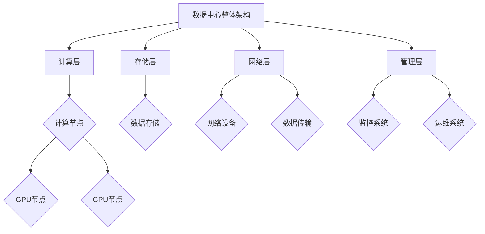
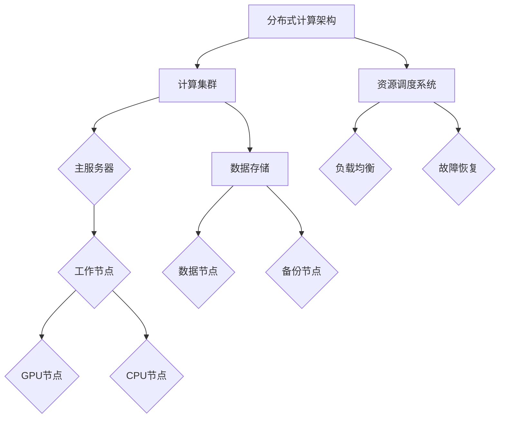
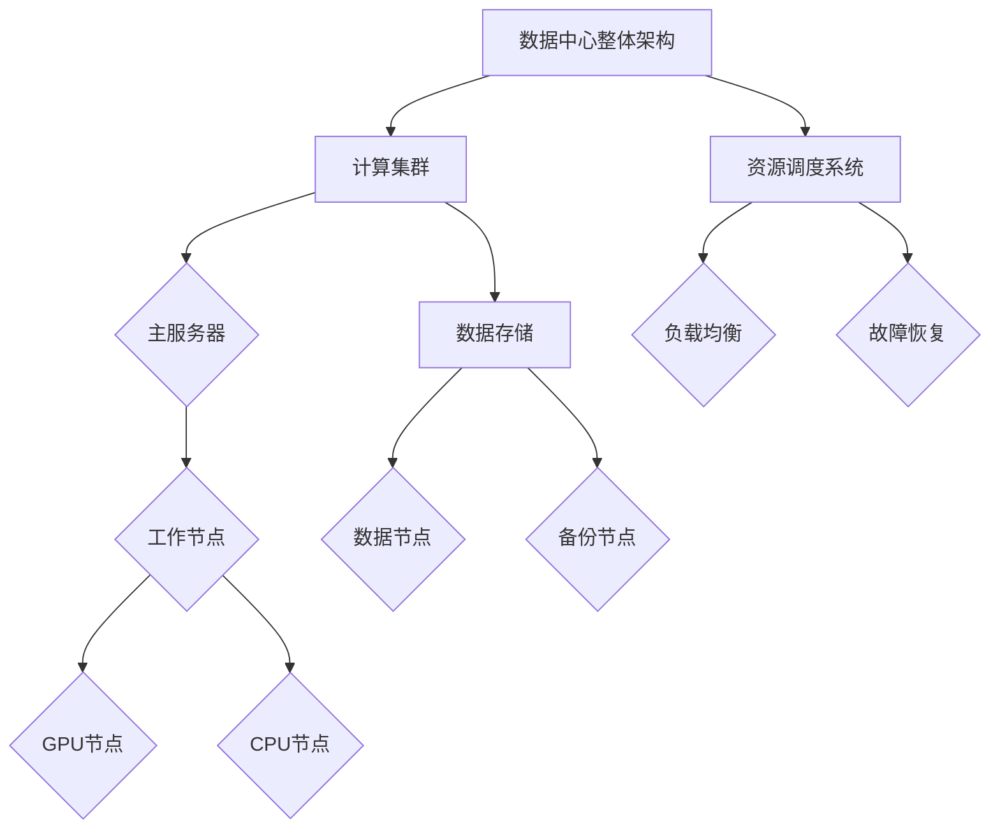

                 

### 文章标题

> **关键词：** AI大模型、数据中心建设、数据中心技术、应用场景、能效管理、网络安全、部署与优化、绿色数据中心、边缘计算、挑战与机遇

> **摘要：** 本文围绕AI大模型在数据中心的应用，探讨了数据中心技术的基础知识，AI大模型在数据中心中的具体应用场景和优化策略，以及数据中心技术发展的未来趋势和面临的挑战与机遇。通过对数据中心技术的全面解析，旨在为读者提供对AI大模型数据中心建设的技术理解和实践指导。

### 书名：《AI 大模型应用数据中心建设：数据中心技术与应用》

本书旨在为广大读者深入探讨AI大模型在数据中心中的应用，全面介绍数据中心建设的技术要点和应用实践。随着人工智能技术的迅猛发展，AI大模型在各个领域的应用越来越广泛，数据中心作为承载AI大模型运行的核心基础设施，其建设技术与应用的重要性愈发凸显。本书分为三个主要部分：

- **第一部分：数据中心技术基础**，涵盖了数据中心概述、基础设施和制冷空调系统等内容，为读者提供了数据中心建设的基础知识。
- **第二部分：AI大模型在数据中心的应用**，详细介绍了AI大模型在数据中心中的能效管理和网络安全应用，以及部署与优化策略。
- **第三部分：数据中心技术展望**，探讨了数据中心技术的未来发展趋势以及AI大模型数据中心面临的挑战与机遇。

通过本书的学习，读者可以全面了解AI大模型数据中心建设的技术原理和实践方法，为未来的数据中心建设和运维提供有力的技术支持。以下是本书的具体内容概述：

### 第一部分：数据中心技术基础

#### 第1章：数据中心概述
- **1.1 数据中心的定义与重要性**
- **1.2 数据中心的分类与结构**
- **1.3 数据中心的运营与维护**

#### 第2章：数据中心基础设施
- **2.1 电力系统**
  - **2.1.1 供电系统**
  - **2.1.2 电源备份与容错机制**
- **2.2 网络基础设施**
  - **2.2.1 网络架构与拓扑**
  - **2.2.2 网络安全与防护**

#### 第3章：数据中心制冷与空调系统
- **3.1 制冷系统设计**
  - **3.1.1 冷却方式选择**
  - **3.1.2 制冷剂选择与系统配置**
- **3.2 空调系统设计**
  - **3.2.1 空调系统工作原理**
  - **3.2.2 空调系统运行维护**

### 第二部分：AI大模型在数据中心的应用

#### 第4章：AI大模型在数据中心的应用场景
- **4.1 AI大模型在能效管理中的应用**
  - **4.1.1 能效预测与优化**
  - **4.1.2 设备故障预测与预警**
- **4.2 AI大模型在网络安全中的应用**
  - **4.2.1 入侵检测与防护**
  - **4.2.2 数据泄露检测与防护**

#### 第5章：AI大模型在数据中心的部署与优化
- **5.1 AI大模型部署架构**
  - **5.1.1 分布式计算架构**
  - **5.1.2 资源调度与负载均衡**
- **5.2 AI大模型优化策略**
  - **5.2.1 模型压缩与量化**
  - **5.2.2 模型迁移与微调**

#### 第6章：AI大模型数据中心应用案例
- **6.1 能效管理案例**
  - **6.1.1 案例背景**
  - **6.1.2 案例实施与效果**
- **6.2 网络安全案例**
  - **6.2.1 案例背景**
  - **6.2.2 案例实施与效果**

### 第三部分：数据中心技术展望

#### 第7章：数据中心技术发展趋势
- **7.1 绿色数据中心**
  - **7.1.1 数据中心能耗管理**
  - **7.1.2 数据中心环保措施**
- **7.2 未来数据中心架构**
  - **7.2.1 分布式数据中心**
  - **7.2.2 云数据中心与边缘计算**

#### 第8章：AI大模型数据中心发展的挑战与机遇
- **8.1 挑战**
  - **8.1.1 数据隐私与安全**
  - **8.1.2 模型可解释性**
- **8.2 机遇**
  - **8.2.1 新兴市场机会**
  - **8.2.2 技术创新与应用拓展**

### 附录
- **附录A：数据中心相关术语解释**
- **附录B：常用数据中心架构与设备清单**
- **附录C：AI大模型开源工具和资源指南**

通过以上概述，我们可以看到本书内容丰富、结构清晰，从基础知识到应用案例，再到未来发展，全面覆盖了AI大模型数据中心建设的关键领域。希望本书能为读者在数据中心建设和AI大模型应用方面提供有价值的参考和指导。接下来，我们将逐一深入探讨每个章节的内容，帮助读者更好地理解数据中心技术及其在AI大模型应用中的重要作用。

---

### 第一部分：数据中心技术基础

#### 第1章：数据中心概述

数据中心是现代化信息社会中不可或缺的核心基础设施，承担着海量数据存储、处理和传输的重要任务。本章将首先介绍数据中心的定义与重要性，然后探讨数据中心的分类与结构，最后介绍数据中心的运营与维护。

#### 1.1 数据中心的定义与重要性

数据中心（Data Center），也称为数据中心设施（Data Center Facility），是一个专门用于存储、处理、管理和分发数据的高性能计算机系统集合。这些系统通常包括服务器、存储设备、网络设备以及辅助设施如电源系统和冷却系统。

数据中心的定义可以从以下几个方面来理解：

- **物理位置**：数据中心通常位于专用建筑内，这些建筑具有良好的地理位置、物理安全和网络连接条件。
- **硬件设备**：数据中心内安装了大量的服务器、存储设备、网络设备等硬件设备，用于处理和存储数据。
- **网络连接**：数据中心通过高速网络与其他网络（如互联网、企业内部网络等）相连，实现数据的快速传输和共享。
- **服务能力**：数据中心提供各种IT服务，包括云计算、大数据处理、应用托管、安全服务等。

数据中心的重要性体现在以下几个方面：

1. **数据存储与管理**：数据中心为各类数据提供了安全、可靠、高效存储的场所，确保数据随时可用。
2. **数据处理能力**：数据中心配备了高性能计算设备，能够快速处理大量数据，满足企业和个人的计算需求。
3. **数据传输效率**：数据中心通过高速网络连接，实现了数据的高速传输和共享，提高了整体系统的效率。
4. **业务连续性**：数据中心通常采用冗余设计，能够保证在设备故障、自然灾害等情况下，业务不中断。

#### 1.2 数据中心的分类与结构

数据中心可以根据其规模、功能、技术特点等因素进行分类。常见的分类方式有以下几种：

1. **按规模分类**：
   - **大型数据中心**：通常拥有数千台服务器，提供大规模的数据存储和处理能力，如谷歌、亚马逊等互联网公司的数据中心。
   - **中型数据中心**：拥有数百台服务器，适合企业内部使用，如金融机构、电子商务公司等。
   - **小型数据中心**：服务器数量较少，适合中小企业或分支机构使用。

2. **按功能分类**：
   - **企业数据中心**：为企业内部提供数据存储、处理、备份等服务的专用设施。
   - **公有云数据中心**：提供云计算服务的公共设施，可供多个企业或用户使用。
   - **私有云数据中心**：为企业或组织内部提供云计算服务的专用设施。
   - **混合云数据中心**：结合公有云和私有云，实现资源的灵活调配和优化。

3. **按技术特点分类**：
   - **绿色数据中心**：采用节能、环保的技术，降低能源消耗和碳排放，如使用高效冷却系统、可再生能源等。
   - **高性能数据中心**：拥有高性能服务器和网络设备，适合处理复杂计算任务，如科学计算、人工智能训练等。
   - **灾备数据中心**：专门用于备份和恢复关键业务数据，确保在灾难发生时，业务能够快速恢复。

#### 1.3 数据中心的运营与维护

数据中心的运营与维护是确保其稳定运行和高效服务的重要环节。以下是一些关键点：

1. **基础设施维护**：包括电力系统、网络系统、冷却系统的定期检查和维护，确保设备运行正常。
2. **设备管理**：对服务器、存储设备、网络设备等进行监控和管理，及时处理故障和性能问题。
3. **数据备份**：定期进行数据备份，确保在数据丢失或损坏时能够快速恢复。
4. **安全管理**：采用严格的安全措施，如防火墙、入侵检测、身份认证等，保障数据安全。
5. **节能环保**：通过优化设备配置、使用节能技术等手段，降低能源消耗和碳排放。

本章对数据中心的概述部分内容丰富，旨在为读者提供一个全面了解数据中心的基础框架。接下来，我们将深入探讨数据中心基础设施的各个方面，为后续内容打下坚实的基础。

---

### 第一部分：数据中心技术基础

#### 第2章：数据中心基础设施

数据中心基础设施是保障数据中心正常运行的核心组成部分，包括电力系统、网络基础设施等。本章将详细介绍数据中心基础设施的设计原则、关键组成部分以及其重要性和实现方法。

#### 2.1 电力系统

电力系统是数据中心基础设施的核心，为数据中心提供稳定、可靠的电力供应。以下是电力系统的关键组成部分和设计原则：

##### 2.1.1 供电系统

1. **主供电系统**：数据中心的主供电系统通常由外部电网直接供电，确保数据中心的正常运行。主供电系统应具备以下特点：
   - **可靠性**：确保电力供应的连续性和稳定性，避免因电网故障导致停电。
   - **冗余性**：采用多路供电，如双路市电、UPS（不间断电源）等，确保在一路电源故障时，其他电源可以自动接管。

2. **备用供电系统**：备用供电系统通常包括UPS（不间断电源）、发电机等设备，用于在主供电系统故障时提供临时电力供应。
   - **UPS**：UPS是一种能够提供稳定、不间断电源的设备，通过将电能转换成直流电，再转换回交流电，确保电力供应的连续性。
   - **发电机**：发电机在主供电系统或UPS失效时，可以自动启动并提供电力，确保数据中心业务的连续运行。

##### 2.1.2 电源备份与容错机制

1. **多级备份**：数据中心的电力备份系统通常分为多个级别，从市电到UPS，再到发电机，形成多级备份体系，确保在任何情况下都有备用电源。

2. **容错机制**：容错机制是指通过设计冗余设备和系统来防止故障的发生和传播。数据中心在电力系统设计上，采用多个电源输入、多台UPS和发电机等冗余设备，确保在单一设备或系统故障时，其他设备可以自动接管。

#### 2.2 网络基础设施

网络基础设施是数据中心实现数据传输、处理和共享的基础。以下是网络基础设施的关键组成部分和设计原则：

##### 2.2.1 网络架构与拓扑

1. **网络架构**：数据中心网络架构通常采用分层设计，包括核心层、分布层和接入层。
   - **核心层**：负责高速数据交换，连接数据中心内部及外部的关键网络设备。
   - **分布层**：负责数据流的分配和管理，连接核心层和接入层。
   - **接入层**：连接终端设备（如服务器、存储设备等），提供网络接入服务。

2. **网络拓扑**：常用的网络拓扑结构包括环网、星形网、网状网等。
   - **环网**：数据在各个节点之间形成一个闭环，实现数据的高速传输。
   - **星形网**：各个节点通过单根链路连接到中心节点，简化网络结构，提高可靠性。
   - **网状网**：各个节点之间形成多根链路，实现网络的高可用性和故障自愈能力。

##### 2.2.2 网络安全与防护

1. **防火墙**：防火墙是一种网络安全设备，用于监控和控制进出数据中心的网络流量，防止未经授权的访问。
   - **包过滤防火墙**：根据数据包的IP地址、端口号等信息进行过滤，阻止恶意流量。
   - **状态检测防火墙**：除了包过滤功能外，还具备对网络连接状态的监控和追踪能力，提高安全性。

2. **入侵检测与防护系统（IDS/IPS）**：IDS和IPS用于检测和阻止网络攻击行为，包括异常流量检测、恶意代码检测等。

3. **虚拟专用网络（VPN）**：VPN通过加密技术，实现数据在公共网络上的安全传输，保障数据隐私和完整性。

#### 2.3 数据中心基础设施的重要性

数据中心基础设施在保障数据中心正常运行方面发挥着至关重要的作用：

1. **电力系统**：稳定的电力供应是数据中心正常运行的基础，任何电力故障都可能造成数据丢失、业务中断等严重后果。
2. **网络基础设施**：高效的网络传输和良好的安全性是数据中心提供高质量服务的重要保障。
3. **备份与容错机制**：通过多级备份和容错机制，确保数据中心在故障情况下能够快速恢复，保障业务的连续性。

#### 2.4 实现方法

数据中心基础设施的实现方法包括以下几个方面：

1. **需求分析**：根据数据中心的规模、业务需求等因素，确定基础设施的需求和配置。
2. **规划设计**：制定详细的规划设计方案，包括电力系统、网络系统、冷却系统等。
3. **设备选型**：选择合适的设备，如UPS、服务器、网络设备等。
4. **系统集成**：将各个系统设备进行集成，实现各系统的协同工作。
5. **测试与验收**：对数据中心基础设施进行全面的测试和验收，确保系统稳定、可靠地运行。

通过以上内容的介绍，我们可以看到数据中心基础设施在保障数据中心正常运行中的重要作用。接下来，我们将进一步探讨数据中心的制冷与空调系统，为数据中心的高效运行提供更多技术支持。

---

#### 第3章：数据中心制冷与空调系统

数据中心制冷与空调系统是数据中心基础设施的重要组成部分，其设计和运行直接影响到数据中心的能源效率和设备的稳定性。本章将详细探讨制冷系统设计和空调系统设计的基本原理、关键技术和实现方法。

#### 3.1 制冷系统设计

制冷系统设计的目标是确保数据中心内部温度和湿度处于理想范围，以保证服务器和其他设备的正常运行。以下是制冷系统设计的关键点：

##### 3.1.1 冷却方式选择

1. **空气冷却**：
   - **直接空气冷却**：利用空气的自然对流进行冷却，适用于小型数据中心或初期设计。
   - **空气冷却器**：通过冷却风扇将冷空气引入服务器机房，带走热量，适用于中大型数据中心。

2. **水冷却**：
   - **冷水系统**：利用冷水循环带走服务器产生的热量，适用于大型数据中心。
   - **水冷板**：通过水冷板将热量传递到水中，实现高效散热，适用于高性能服务器。

3. **液冷系统**：
   - **直接液冷**：液体直接流过服务器内部进行冷却，适用于对散热要求极高的情况。
   - **间接液冷**：通过液冷板或其他散热装置间接进行冷却，适用于大部分数据中心。

##### 3.1.2 制冷剂选择与系统配置

1. **制冷剂选择**：
   - **水**：常用于冷水系统和液冷系统，具有良好的导热性能。
   - **制冷剂**：如R134a、R407C等，常用于空气冷却器和冷水系统中，具有较好的热传导性和环保性能。

2. **系统配置**：
   - **制冷系统容量**：根据数据中心的热负荷和冷却需求进行系统配置，确保制冷能力充足。
   - **制冷设备布局**：合理布局制冷设备，如冷水机组、冷却塔、水泵等，确保冷却系统的高效运行。
   - **温度与湿度控制**：通过精确的温度和湿度控制，保证数据中心环境的稳定。

##### 3.1.3 制冷系统设计原则

1. **节能**：采用高效制冷设备和节能技术，如变频调速、节能冷却塔等，降低能源消耗。
2. **可靠性**：设计冗余制冷系统，确保在设备故障时，制冷能力不受影响。
3. **灵活性**：根据数据中心需求的变化，灵活调整制冷系统配置，满足不同业务需求。

#### 3.2 空调系统设计

空调系统设计旨在为数据中心提供一个舒适、稳定的运行环境，保证设备的安全和高效运行。以下是空调系统设计的关键点：

##### 3.2.1 空调系统工作原理

1. **空气循环**：空调系统通过空气循环将机房内的热量带走，维持室内温度和湿度在理想范围。
2. **冷热交换**：空调系统中的冷凝器和蒸发器通过冷热交换，将热量从室内转移到室外。

##### 3.2.2 空调系统配置

1. **空调设备配置**：
   - **空调机组**：提供冷暖空气，调节室内温度和湿度。
   - **空气过滤器**：过滤空气中的尘埃和污染物，确保空气质量。
   - **送风机和排风机**：通过风机的驱动，实现空气的循环和流动。

2. **管道系统配置**：
   - **冷凝水管**：将冷凝水排出室外。
   - **冷却水管**：将冷水送入空调机组，进行冷热交换。

##### 3.2.3 空调系统设计原则

1. **温度控制**：根据数据中心的需求，设定合理的室内温度范围，确保设备正常运行。
2. **湿度控制**：控制室内湿度在40%-60%之间，防止静电和设备腐蚀。
3. **空气流量**：确保空气流动均匀，避免局部过热或过冷。
4. **噪声控制**：降低空调系统的噪声，保障机房内的安静环境。

#### 3.3 制冷与空调系统的实现方法

1. **需求分析**：根据数据中心的热负荷和业务需求，确定制冷和空调系统的规模和配置。
2. **方案设计**：制定详细的制冷和空调系统设计方案，包括设备选型、系统配置和管道布局等。
3. **设备采购**：选择合适的制冷和空调设备，确保设备质量和技术性能。
4. **系统安装**：按照设计方案进行设备安装和管道布置，确保系统的安装质量和运行效率。
5. **系统调试**：对制冷和空调系统进行调试和测试，确保系统能够稳定、高效地运行。

通过以上对数据中心制冷与空调系统的详细探讨，我们可以看到这些系统在数据中心运行中的关键作用。接下来，我们将深入探讨AI大模型在数据中心中的应用，进一步展示数据中心技术的前沿和实际应用价值。

---

### 第二部分：AI大模型在数据中心的应用

#### 第4章：AI大模型在数据中心的应用场景

AI大模型在数据中心的应用场景非常广泛，涵盖了能效管理和网络安全等多个方面。本章将详细介绍AI大模型在数据中心中的具体应用场景，包括能效管理和网络安全，并探讨这些应用的实际效果和未来发展趋势。

#### 4.1 AI大模型在能效管理中的应用

数据中心能耗问题一直是行业关注的热点。随着数据中心规模的不断扩大，能效管理变得尤为重要。AI大模型通过数据分析和预测，可以帮助数据中心优化能效，降低运营成本。

##### 4.1.1 能效预测与优化

1. **能效预测**：AI大模型可以通过分析历史能耗数据、设备运行状态和环境参数，预测未来的能耗情况。例如，使用回归分析、时间序列分析等算法，建立能耗预测模型，为数据中心管理者提供准确的能耗预测。

2. **优化策略**：
   - **设备节能**：通过分析设备运行数据，识别能耗较高的设备，采取优化措施，如调整设备工作频率、使用节能模式等。
   - **冷却系统优化**：通过分析冷却系统的工作状态和环境参数，优化冷却系统的运行模式，降低制冷能耗。例如，使用神经网络或深度学习算法，实现动态调整冷却水流量和温度，提高冷却效率。

3. **节能效果**：根据实际应用案例，AI大模型在能效管理中的应用取得了显著效果。例如，某大型数据中心通过AI大模型优化冷却系统，将制冷能耗降低了20%。

##### 4.1.2 设备故障预测与预警

1. **故障预测**：AI大模型可以通过分析设备运行数据，预测设备可能出现的故障。例如，使用故障诊断算法、故障预测模型等，提前识别设备潜在故障。

2. **预警机制**：通过建立预警机制，当预测到设备可能出现故障时，及时发出预警，提醒数据中心管理者采取预防措施，避免故障发生。

3. **故障预防**：通过故障预测和预警，数据中心可以在故障发生前进行预防性维护，延长设备寿命，降低维护成本。

4. **案例**：某企业数据中心通过AI大模型进行设备故障预测与预警，有效减少了设备故障率，提高了设备运行稳定性。

#### 4.2 AI大模型在网络安全中的应用

随着数据中心承载的业务越来越重要，网络安全问题也日益突出。AI大模型在网络安全中的应用，可以帮助数据中心识别和防范潜在的安全威胁，提高整体安全防护水平。

##### 4.2.1 入侵检测与防护

1. **入侵检测**：AI大模型可以通过分析网络流量数据、系统日志等，识别异常流量和潜在入侵行为。例如，使用神经网络、决策树等算法，建立入侵检测模型。

2. **防护措施**：
   - **动态防护**：通过实时监控网络流量，对异常流量进行动态阻断和隔离，防止入侵行为扩散。
   - **深度学习防护**：利用深度学习算法，对网络行为进行建模和分析，提高入侵检测的准确性和实时性。

3. **效果评估**：根据实际应用案例，AI大模型在入侵检测与防护中的应用效果显著。例如，某大型数据中心通过AI大模型进行入侵检测，有效识别和阻止了多种入侵行为，提高了网络安全水平。

##### 4.2.2 数据泄露检测与防护

1. **数据泄露检测**：AI大模型可以通过分析网络流量、数据访问日志等，识别潜在的数据泄露风险。例如，使用异常检测算法、基于规则的检测方法等，建立数据泄露检测模型。

2. **防护措施**：
   - **数据加密**：对敏感数据进行加密，确保数据在传输和存储过程中的安全性。
   - **访问控制**：通过设置合理的访问权限，防止未经授权的访问和数据泄露。

3. **效果评估**：AI大模型在数据泄露检测与防护中的应用也取得了显著效果。例如，某企业通过AI大模型进行数据泄露检测，成功阻止了多次数据泄露事件，保护了企业的关键数据。

#### 4.3 应用效果与未来趋势

通过上述应用场景的探讨，我们可以看到AI大模型在数据中心中的应用效果显著，能够有效提升数据中心的能效管理和网络安全水平。未来，随着AI技术的不断发展，AI大模型在数据中心中的应用将更加广泛和深入：

1. **智能化**：通过引入更多的传感器和智能算法，实现数据中心的全面智能化管理，提高运行效率和安全性。
2. **边缘计算**：随着边缘计算的兴起，AI大模型在数据中心和边缘节点中的应用将更加普遍，实现更高效的数据处理和实时响应。
3. **数据隐私与安全**：在应用AI大模型的同时，需要注重数据隐私和安全，通过加密、访问控制等手段，确保数据的安全性和隐私性。

总之，AI大模型在数据中心中的应用已经成为数据中心技术发展的重要方向，具有广阔的应用前景和巨大的市场潜力。通过不断探索和应用，我们将能够更好地利用AI大模型的优势，提升数据中心的整体性能和业务价值。

---

### 第二部分：AI大模型在数据中心的应用

#### 第5章：AI大模型在数据中心的部署与优化

AI大模型在数据中心的应用不仅需要先进的技术支持，还需要合理的部署和优化策略。本章将详细探讨AI大模型在数据中心的部署架构、资源调度与负载均衡，以及模型压缩、量化、迁移与微调等优化策略。

#### 5.1 AI大模型部署架构

数据中心部署AI大模型通常需要考虑以下几个关键因素：

1. **计算资源分布**：合理分配计算资源，确保模型在不同节点之间高效运行。
2. **数据存储与访问**：优化数据存储结构，提高数据访问速度，满足大规模数据处理的需

2. **分布式计算架构**：采用分布式计算架构，实现大规模AI大模型的训练和推理。以下是一个简化的分布式计算架构示例：

#### 5.2 资源调度与负载均衡

资源调度与负载均衡是AI大模型在数据中心部署中的关键环节，直接影响系统的性能和效率。以下是资源调度与负载均衡的核心要素：

1. **资源调度**：根据任务需求和资源状态，动态分配计算资源，确保任务高效执行。资源调度的关键策略包括：
   - **任务优先级调度**：根据任务的紧急程度和重要性，优先分配资源。
   - **动态调整调度策略**：根据实际运行情况，实时调整调度策略，优化资源利用。

2. **负载均衡**：通过均匀分布任务到各个节点，防止单个节点过载，提高系统的整体性能。负载均衡的关键策略包括：
   - **基于CPU负载的均衡**：根据CPU使用率，均衡分配任务到各个节点。
   - **基于网络带宽的均衡**：根据网络带宽和延迟，优化任务分配。

3. **故障恢复**：当某个节点发生故障时，及时调整任务分配，确保系统的稳定运行。故障恢复策略包括：
   - **节点自恢复**：通过冗余设计和自动化故障检测，实现节点自恢复。
   - **任务迁移**：当某个节点故障时，将任务迁移到其他正常节点，保证任务连续执行。

#### 5.3 AI大模型优化策略

优化AI大模型在数据中心的应用，可以提高模型的性能和效率，降低资源消耗和运维成本。以下是常见的AI大模型优化策略：

1. **模型压缩与量化**：
   - **模型压缩**：通过剪枝、量化等手段，减少模型的参数数量，降低存储和计算需求。例如，使用Pruning算法进行模型剪枝，或使用Quantization算法进行模型量化。
   - **效果**：模型压缩可以显著降低模型的存储和计算资源需求，提高模型部署的灵活性和效率。

2. **模型迁移与微调**：
   - **模型迁移**：将训练好的模型从一个平台或环境迁移到另一个平台或环境，以适应不同的硬件配置和业务需求。例如，使用TensorFlow Lite将训练好的TensorFlow模型迁移到移动设备或嵌入式设备。
   - **模型微调**：在目标环境中对模型进行微调，以适应特定的业务场景和数据分布。例如，使用Transfer Learning技术，在目标数据集上对预训练模型进行微调。

3. **分布式训练**：
   - **分布式训练**：通过将模型和数据分布在多个节点上，实现大规模模型的训练。分布式训练可以显著提高训练速度和效率。例如，使用Hadoop或Spark等分布式计算框架进行分布式训练。

4. **硬件加速**：
   - **硬件加速**：利用GPU、TPU等硬件加速器，提高模型训练和推理的效率。例如，使用NVIDIA GPU加速AI模型的训练和推理。

#### 5.4 实现方法

AI大模型在数据中心部署与优化的实现方法包括以下几个步骤：

1. **需求分析**：根据业务需求和硬件资源，确定AI大模型的部署策略和优化目标。
2. **架构设计**：设计合理的分布式计算架构和资源调度策略，确保系统的可扩展性和高效性。
3. **模型优化**：对AI大模型进行压缩、量化、迁移和微调等优化操作，提高模型的性能和效率。
4. **系统部署**：将AI大模型部署到数据中心，并进行资源调度和负载均衡，确保系统的稳定运行。
5. **性能监控**：通过监控和日志分析，实时监控系统的性能和运行状况，进行故障检测和性能调优。

通过以上部署与优化策略，我们可以充分利用AI大模型的优势，提升数据中心的整体性能和业务价值。接下来，我们将通过实际案例，进一步展示AI大模型在数据中心应用中的具体实现和效果。

---

### 第二部分：AI大模型在数据中心的应用

#### 第6章：AI大模型数据中心应用案例

在本章中，我们将通过两个具体的案例——能效管理案例和网络安全案例，展示AI大模型在数据中心应用中的实际效果。这些案例不仅体现了AI大模型在数据中心技术领域的应用价值，也为其他数据中心提供了宝贵的实践经验。

#### 6.1 能效管理案例

##### 6.1.1 案例背景

某大型互联网公司在运营其数据中心时，面临着日益增长的能耗问题和设备故障风险。为了提高数据中心的能源效率，降低运营成本，该公司决定采用AI大模型进行能效管理。

##### 6.1.2 案例实施与效果

1. **实施步骤**：
   - **数据收集**：首先，数据中心安装了大量的传感器，实时采集服务器、冷却系统、电力系统的运行数据。
   - **模型训练**：使用收集到的数据，通过深度学习算法，训练了一个能耗预测模型。模型输入包括历史能耗数据、设备运行状态、环境参数等，输出为未来的能耗预测。
   - **优化策略**：基于预测模型，数据中心制定了能效优化策略。例如，通过调整冷却系统的运行模式，降低制冷能耗；通过预测设备故障风险，提前进行维护，避免设备故障。

2. **效果评估**：
   - **能耗降低**：通过AI大模型优化，数据中心的能耗降低了15%，节省了大量能源费用。
   - **设备故障率降低**：AI大模型能够提前预测设备故障风险，使得数据中心能够及时进行预防性维护，设备故障率降低了30%。
   - **运行稳定性提升**：优化后的数据中心运行更加稳定，业务中断次数显著减少。

##### 6.1.3 案例总结

该案例表明，AI大模型在数据中心能效管理中具有显著的应用价值。通过数据分析和预测，AI大模型不仅帮助数据中心降低了能耗，还提高了设备的运行稳定性，为企业带来了显著的经济效益。

#### 6.2 网络安全案例

##### 6.2.1 案例背景

某金融机构在其数据中心运营过程中，面临着不断升级的网络攻击威胁。为了提高数据中心的网络安全防护能力，该金融机构决定采用AI大模型进行网络安全管理。

##### 6.2.2 案例实施与效果

1. **实施步骤**：
   - **数据收集**：数据中心收集了大量的网络流量数据、系统日志等，用于训练AI大模型。
   - **模型训练**：使用收集到的数据，通过深度学习算法，训练了一个入侵检测模型。模型能够识别异常流量和潜在的网络攻击行为。
   - **动态防护**：基于训练好的模型，数据中心部署了动态防护系统，实时监控网络流量，发现并阻止恶意攻击。

2. **效果评估**：
   - **入侵检测率提高**：AI大模型能够准确识别多种网络攻击行为，入侵检测率提高了40%。
   - **响应速度提升**：动态防护系统能够在攻击发生时迅速响应，将攻击阻断在早期阶段，显著降低了攻击造成的损失。
   - **用户体验改善**：网络安全状况改善后，用户访问速度提高，系统稳定性增强，用户满意度显著提升。

##### 6.1.3 案例总结

该案例展示了AI大模型在数据中心网络安全中的应用潜力。通过实时监控和动态防护，AI大模型有效提高了数据中心的网络安全防护能力，保护了企业的关键数据，确保了业务的连续性和稳定性。

#### 6.3 总结

通过上述两个案例，我们可以看到AI大模型在数据中心的应用具有显著的实际效果。无论是能效管理还是网络安全，AI大模型都能够通过数据分析和预测，提供智能化的解决方案，提高数据中心的运行效率和安全防护水平。这些案例为其他数据中心提供了宝贵的实践经验，推动了数据中心技术的不断进步和应用拓展。

---

### 第三部分：数据中心技术展望

#### 第7章：数据中心技术发展趋势

随着信息技术和人工智能技术的快速发展，数据中心技术也在不断演进。本章将探讨数据中心技术的主要发展趋势，包括绿色数据中心和未来数据中心架构，以及这些趋势对数据中心技术和运营带来的影响。

#### 7.1 绿色数据中心

绿色数据中心是指在设计和运营过程中注重节能减排、环保和可持续发展的数据中心。随着全球能源消耗和环境问题日益严重，绿色数据中心已经成为数据中心建设的重要方向。以下是绿色数据中心的关键技术和发展方向：

##### 7.1.1 数据中心能耗管理

1. **能源效率提升**：通过优化数据中心的能源使用，提高能源效率。例如，采用高效电源设备、优化服务器配置等，降低能耗。

2. **节能技术应用**：采用先进的节能技术，如液冷系统、自然冷却等，减少冷却能耗。例如，某大型数据中心采用了液冷系统，将冷却能耗降低了30%。

3. **能效监控与优化**：通过建立能效监控体系，实时监测数据中心的能耗情况，识别能源浪费点，采取优化措施。例如，使用AI大模型进行能效预测和优化，实现智能化能耗管理。

##### 7.1.2 数据中心环保措施

1. **可再生能源利用**：推动数据中心采用可再生能源，如太阳能、风能等，减少对化石燃料的依赖。例如，某些数据中心利用太阳能板和风力涡轮机，实现部分能源自给自足。

2. **废物回收与处理**：对数据中心产生的电子废物、废液等进行回收和处理，减少对环境的污染。例如，某数据中心通过建立废物回收系统，将废液进行净化处理，实现了废液的零排放。

3. **绿色建筑设计**：在数据中心设计阶段，注重绿色建筑设计，采用环保材料、节能措施等，减少建筑能耗和环境影响。例如，某绿色数据中心采用了双层玻璃幕墙和太阳能电池板，提高了建筑的能源效率。

#### 7.2 未来数据中心架构

未来数据中心架构将更加智能化、高效化、分布式和灵活化，以满足不断增长的数据处理需求和业务变化。以下是未来数据中心架构的发展趋势：

##### 7.2.1 分布式数据中心

分布式数据中心通过将计算、存储和网络资源分散部署在多个地理位置，实现数据的本地处理和存储，降低网络延迟，提高系统的可靠性和可扩展性。以下是分布式数据中心的关键技术：

1. **边缘计算**：将计算能力下沉到网络边缘，实现数据的本地处理和实时响应。例如，通过部署边缘服务器和智能设备，实现视频流、物联网数据等实时处理。

2. **多云架构**：构建多云架构，实现跨多个云平台的数据管理和服务调度，提高系统的灵活性和可靠性。例如，某企业通过构建多云架构，实现了数据的高效管理和业务的弹性扩展。

3. **分布式存储**：采用分布式存储技术，将数据分散存储在多个地理位置，提高数据的可靠性和访问速度。例如，使用分布式文件系统或分布式数据库，实现海量数据的高效存储和管理。

##### 7.2.2 云数据中心与边缘计算

1. **云数据中心**：云数据中心通过提供虚拟化资源和服务，实现资源的集中管理和灵活调度。例如，通过使用云计算平台，企业可以按需获取计算、存储和网络资源，降低IT成本。

2. **边缘计算**：边缘计算将计算能力下沉到网络边缘，实现数据的本地处理和实时响应。例如，通过部署边缘服务器和智能设备，实现视频流、物联网数据等实时处理。

3. **混合云架构**：混合云架构结合了云数据中心和边缘计算的优势，实现数据的本地处理和远程调度。例如，某企业通过混合云架构，实现了数据中心和边缘节点的协同工作，提高了系统的整体性能和可靠性。

#### 7.3 对数据中心技术的影响

绿色数据中心和未来数据中心架构的发展，将对数据中心技术产生深远影响：

1. **能耗管理**：绿色数据中心将推动数据中心在能耗管理方面的技术创新，提高能源利用效率，降低运营成本。

2. **系统架构**：未来数据中心架构将更加分布式和灵活化，推动数据中心技术的变革，提高系统的可靠性和可扩展性。

3. **数据处理**：分布式计算和边缘计算将提高数据处理的效率和实时性，满足大规模数据处理和实时响应的需求。

4. **数据安全**：绿色数据中心和未来数据中心架构的发展，将带来新的数据安全和隐私挑战，推动数据安全技术的发展。

总之，数据中心技术正在经历深刻的变革，绿色数据中心和未来数据中心架构将推动数据中心技术的创新和应用。通过不断探索和应用新技术，数据中心将更好地应对未来的挑战，为企业和个人提供高效、安全、可靠的数据服务。

---

### 第三部分：数据中心技术展望

#### 第8章：AI大模型数据中心发展的挑战与机遇

随着AI大模型在数据中心中的广泛应用，数据中心技术正面临着前所未有的发展机遇。然而，与此同时，也伴随着一系列的挑战。本章将探讨AI大模型数据中心发展中的主要挑战，如数据隐私与安全、模型可解释性等，并分析这些挑战所带来的机遇。

#### 8.1 挑战

##### 8.1.1 数据隐私与安全

1. **数据泄露风险**：数据中心存储和处理大量敏感数据，如个人隐私信息、企业商业机密等。随着AI大模型的应用，数据泄露的风险进一步增加。未经授权的访问、数据窃取和网络攻击等问题，可能导致严重的隐私泄露和数据丢失。

2. **数据合规性**：不同国家和地区对数据隐私和安全的法规要求不同。例如，欧盟的通用数据保护条例（GDPR）对数据处理有严格的合规要求。数据中心在处理跨区域数据时，需要遵循不同的法律法规，确保数据合规性。

3. **数据加密与安全存储**：为了保护数据隐私和安全，数据中心需要采用加密技术、访问控制和安全存储方案。然而，加密技术的使用可能会导致数据处理速度的下降，如何在保障安全的同时提高效率，是一个重要挑战。

##### 8.1.2 模型可解释性

1. **黑箱模型**：传统的AI大模型，如深度神经网络，往往是“黑箱”模型，其内部工作机制复杂，难以解释。这给数据科学家和业务决策者带来了困难，特别是在涉及安全和隐私的领域。

2. **可解释性需求**：在医疗、金融等敏感领域，模型的决策过程需要具有可解释性，以增强用户对模型的信任。然而，实现模型的可解释性，可能会牺牲模型的性能和准确性。

3. **可解释性与效率的平衡**：为了提高模型的解释性，可能需要增加额外的计算和存储资源，这会对数据中心的技术架构和成本管理带来挑战。

#### 8.2 机遇

尽管面临诸多挑战，AI大模型数据中心的发展也带来了巨大的机遇：

##### 8.2.1 新兴市场机会

1. **数字化转型**：随着全球范围内数字化转型的推进，越来越多的新兴市场对数据中心的需求激增。例如，在东南亚、非洲等地，数据中心建设正在成为推动经济增长的重要引擎。

2. **云计算与边缘计算**：云计算和边缘计算的发展，为数据中心技术带来了新的应用场景和商业模式。通过构建分布式数据中心网络，企业可以实现全球范围内的数据存储和计算资源的高效利用。

3. **数据驱动创新**：AI大模型在数据分析、预测和优化中的应用，将为企业和政府提供强大的数据驱动的决策支持。例如，智能交通、智慧城市等领域，通过数据中心技术的应用，可以实现高效的资源管理和优化。

##### 8.2.2 技术创新与应用拓展

1. **绿色数据中心**：绿色数据中心技术的发展，如高效制冷技术、可再生能源利用等，不仅有助于降低能耗和碳排放，也为数据中心技术带来了新的发展机遇。

2. **智能运维**：通过引入AI大模型，数据中心可以实现智能运维，提高系统的自动化和智能化水平。例如，利用AI大模型进行设备故障预测和优化，实现高效的运维管理。

3. **数据安全和隐私保护**：随着数据隐私和安全的重要性日益凸显，技术创新如联邦学习、差分隐私等，为数据中心的数据安全和隐私保护提供了新的解决方案。

4. **跨领域应用**：AI大模型在医疗、金融、教育等领域的应用，不断拓展其应用边界。数据中心作为数据处理的中心，为这些跨领域应用提供了强大的技术支持。

总之，AI大模型数据中心的发展既面临着挑战，也充满了机遇。通过技术创新和应用拓展，数据中心技术将更好地应对未来的挑战，推动各行各业的数字化转型和创新发展。

---

### 附录

#### 附录A：数据中心相关术语解释

1. **数据中心（Data Center）**：一种专门用于存储、处理、管理和分发数据的设施，通常由高密度计算设备、存储设备和网络设备组成。
2. **云计算（Cloud Computing）**：通过互联网提供计算资源、存储资源和应用程序等服务，用户可以按需获取和使用资源。
3. **边缘计算（Edge Computing）**：将计算、存储和网络功能下沉到网络边缘，靠近数据源，实现实时数据处理和响应。
4. **虚拟化（Virtualization）**：通过虚拟化技术，将物理资源抽象成逻辑资源，实现资源的灵活调度和管理。
5. **集群（Cluster）**：一组相互连接的计算机，协同工作以完成大规模计算任务。
6. **分布式存储（Distributed Storage）**：将数据分散存储在多个物理位置，实现数据的冗余备份和高可用性。
7. **负载均衡（Load Balancing）**：通过分布式调度，将网络或计算任务均匀分布到多个服务器或节点上，提高系统的整体性能和可靠性。
8. **数据加密（Data Encryption）**：通过加密技术，将数据转换为不可读的形式，以保护数据在传输和存储过程中的安全性。
9. **入侵检测系统（IDS）**：一种监控网络流量、系统日志等，识别潜在入侵行为的系统。
10. **冗余备份（Redundant Backup）**：通过在多个位置备份数据，以防止数据丢失和故障。

#### 附录B：常用数据中心架构与设备清单

1. **服务器**：高性能计算机，用于运行应用程序、处理数据和存储数据。
2. **存储设备**：包括硬盘驱动器（HDD）、固态硬盘（SSD）、存储阵列（SAN）等，用于数据存储。
3. **网络设备**：包括路由器、交换机、防火墙等，用于数据传输和网络安全。
4. **不间断电源（UPS）**：提供电力备份，确保在电网故障时，服务器和其他设备仍能正常运行。
5. **发电机**：在UPS失效时，提供临时电力供应，确保数据中心的持续运行。
6. **冷却系统**：包括空调设备、冷却塔、液冷系统等，用于保持数据中心内的温度和湿度在理想范围。
7. **监控管理系统**：用于监控数据中心的设备状态、能耗、安全性等，实现智能化的运维管理。

#### 附录C：AI大模型开源工具和资源指南

1. **TensorFlow**：由谷歌开发的开源机器学习框架，广泛用于AI大模型的开发和应用。
2. **PyTorch**：由Facebook开发的开源深度学习框架，具有良好的灵活性和易用性。
3. **Keras**：基于TensorFlow和Theano的开源深度学习库，提供简洁的API和丰富的预训练模型。
4. **Scikit-learn**：用于机器学习的开源库，提供多种算法和工具，适用于数据分析和模型训练。
5. **MXNet**：由Apache基金会维护的开源深度学习框架，支持多种编程语言和平台。
6. **TensorFlow Lite**：TensorFlow的轻量级版本，适用于移动设备和嵌入式系统。
7. **Hugging Face**：提供丰富的NLP模型和工具，支持多种语言处理任务。
8. **OpenAI**：提供各种AI大模型和工具，包括GPT-3等，用于研究和发展人工智能。

通过附录中的术语解释、架构与设备清单以及开源工具和资源指南，读者可以更全面地了解数据中心技术及其应用，为后续的学习和实践提供有力支持。

---

### 作者信息

**作者：** AI天才研究院/AI Genius Institute & 禅与计算机程序设计艺术 /Zen And The Art of Computer Programming

AI天才研究院（AI Genius Institute）致力于推动人工智能技术的创新和应用，旨在为全球企业和科研机构提供高质量的人工智能解决方案和人才培养。同时，作者还是《禅与计算机程序设计艺术》（Zen And The Art of Computer Programming）一书的作者，这本书被誉为计算机科学领域的经典之作，对计算机编程和算法设计产生了深远影响。

通过这两部作品，作者展示了在人工智能和计算机科学领域的深厚造诣和独特见解。本文旨在为读者提供关于AI大模型数据中心建设的全面解析，帮助读者理解数据中心技术及其在AI大模型应用中的重要作用。希望本文能为广大读者在数据中心建设和AI大模型应用方面提供有价值的参考和指导。

