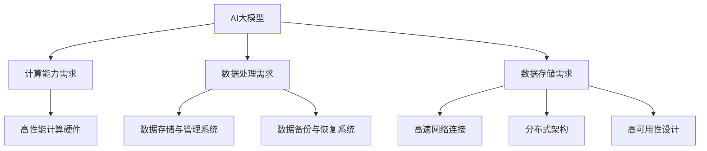
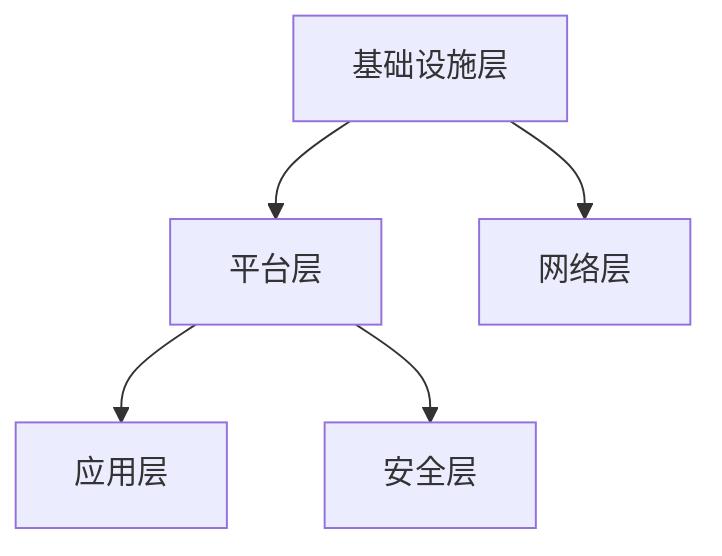
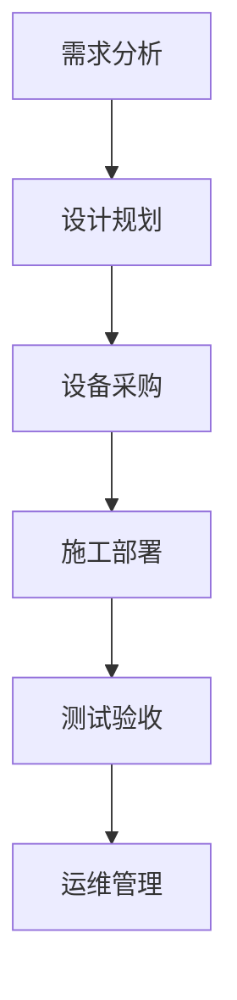

                 

## 《AI 大模型应用数据中心建设：数据中心标准与规范》

> **关键词：** AI大模型、数据中心建设、标准规范、基础设施、设计、实施、应用、实践。

> **摘要：** 本文深入探讨了AI大模型应用数据中心的建设过程，从背景、概念、标准规范到实施和案例分析，全面阐述了数据中心建设的关键技术和实践方法，为AI大模型应用提供了有力支持。

### 《AI 大模型应用数据中心建设：数据中心标准与规范》目录大纲

#### 第一部分：引言与概述

- **第1章：AI大模型与数据中心建设背景**
  - 1.1 AI大模型的发展与应用趋势
  - 1.2 数据中心建设的重要性
  - 1.3 数据中心建设在AI大模型应用中的关键作用

- **第2章：数据中心的基本概念与架构**
  - 2.1 数据中心的基本概念
  - 2.2 数据中心的类型
  - 2.3 数据中心的基本架构

#### 第二部分：数据中心标准

- **第3章：数据中心基础设施标准**
  - 3.1 供电系统标准
  - 3.2 冷却系统标准
  - 3.3 网络系统标准

- **第4章：数据中心设计标准**
  - 4.1 数据中心设计原则
  - 4.2 数据中心布局设计
  - 4.3 数据中心建设流程

#### 第三部分：数据中心建设规范

- **第5章：数据中心建设规范概述**
  - 5.1 数据中心建设规范框架
  - 5.2 数据中心建设规范的主要内容

- **第6章：数据中心建设规范细节**
  - 6.1 数据中心建设规范的技术细节
  - 6.2 数据中心建设规范的实施要点
  - 6.3 数据中心建设规范的案例解析

#### 第四部分：AI大模型应用数据中心建设实践

- **第7章：AI大模型在数据中心的应用**
  - 7.1 AI大模型在数据中心的应用场景
  - 7.2 AI大模型在数据中心的优势与挑战
  - 7.3 AI大模型数据中心建设的案例分析

- **第8章：AI大模型数据中心建设实施流程**
  - 8.1 AI大模型数据中心建设前期准备
  - 8.2 AI大模型数据中心建设实施过程
  - 8.3 AI大模型数据中心建设后期维护

#### 第五部分：总结与展望

- **第9章：AI大模型数据中心建设总结**
  - 9.1 AI大模型数据中心建设的关键点
  - 9.2 AI大模型数据中心建设的经验与教训

- **第10章：数据中心建设的未来发展趋势**
  - 10.1 人工智能技术的发展趋势
  - 10.2 数据中心建设的发展趋势
  - 10.3 数据中心建设与人工智能结合的未来展望

### 附录

- **附录A：参考文献**
- **附录B：术语表**
- **附录C：数据中心建设标准与规范资料来源**
- **附录D：常见问题解答**

### end of the file

**作者：** AI天才研究院/AI Genius Institute & 禅与计算机程序设计艺术 /Zen And The Art of Computer Programming

现在我们已经完成了文章的引言与概述部分，接下来我们将深入探讨AI大模型与数据中心建设的关系，以及数据中心的基本概念与架构。让我们开始第一部分的撰写。

---

### 第一部分：引言与概述

#### 第1章：AI大模型与数据中心建设背景

**1.1 AI大模型的发展与应用趋势**

随着人工智能技术的迅猛发展，AI大模型（如深度学习模型、生成对抗网络等）已成为当今科技领域的热门话题。这些模型通常需要处理海量数据，并利用复杂的算法进行训练，从而实现高度自动化的智能决策。

AI大模型的发展趋势体现在以下几个方面：

1. **计算能力的提升**：高性能计算硬件的快速发展，如GPU和TPU，为AI大模型的训练提供了强大的计算支持。
2. **数据量的爆发**：互联网的普及和传感器技术的进步，使得数据量呈现爆炸性增长，为AI大模型的应用提供了丰富的数据资源。
3. **算法的创新**：深度学习等新型算法的提出，使得AI大模型的训练效率和质量得到显著提升。

**1.2 数据中心建设的重要性**

数据中心是存储、处理和分析大量数据的重要设施，对于AI大模型的应用具有重要意义。以下是数据中心建设的重要性：

1. **数据处理能力**：数据中心提供了强大的计算和存储资源，可以支持AI大模型的训练和推理。
2. **数据安全性**：数据中心采用了多种安全措施，如防火墙、备份和恢复系统等，确保数据的安全性和完整性。
3. **数据可用性**：数据中心通过分布式架构和高可用性设计，提供持续稳定的数据访问，支持AI大模型的实时应用。

**1.3 数据中心建设在AI大模型应用中的关键作用**

数据中心在AI大模型应用中发挥着关键作用，主要体现在以下几个方面：

1. **计算资源提供**：数据中心为AI大模型提供了强大的计算能力，能够快速处理海量数据和复杂的算法。
2. **数据存储与管理**：数据中心提供了高效的数据存储和管理系统，支持数据的快速访问和大规模数据存储。
3. **网络连接性**：数据中心通过高速网络连接，实现与外部系统和用户的互联互通，支持AI大模型的应用和交互。

综上所述，数据中心建设是AI大模型应用的重要基础，其发展水平和建设质量直接影响AI大模型的性能和应用效果。接下来，我们将进一步探讨数据中心的基本概念与架构。

---

**Mermaid 流程图：**



**核心概念与联系：**

- **AI大模型**：一种具有高度自动化决策能力的智能系统，需要强大的计算能力和数据资源支持。
- **数据中心**：一种用于存储、处理和分析大量数据的重要设施，提供计算资源、数据存储和网络安全等功能。

---

接下来，我们将进入第二部分，探讨数据中心的基本概念与架构。

---

### 第二部分：数据中心的基本概念与架构

#### 第2章：数据中心的基本概念与架构

**2.1 数据中心的基本概念**

数据中心（Data Center）是一种为组织提供计算、存储、网络和其他IT资源的服务设施。它是信息技术（IT）的核心，支持各种业务应用和数据处理需求。

**数据中心的主要功能包括：**

1. **数据存储**：数据中心提供大规模数据存储能力，支持数据的存储、备份和恢复。
2. **数据处理**：数据中心配备了高性能计算资源，支持数据的快速处理和分析。
3. **数据传输**：数据中心通过高速网络连接，实现数据的高效传输和共享。
4. **数据安全**：数据中心采用多种安全措施，如防火墙、入侵检测和加密等，确保数据的安全性和完整性。

**数据中心的基本组成部分：**

1. **硬件设备**：包括服务器、存储设备、网络设备、电力设备和冷却设备等。
2. **软件系统**：包括操作系统、数据库管理系统、虚拟化软件、备份和恢复软件等。
3. **网络架构**：包括内部网络、外部网络和网络安全设备等。
4. **环境控制**：包括温度和湿度控制、电力供应和防火系统等。

**2.2 数据中心的类型**

根据不同的应用场景和技术需求，数据中心可以分为以下几种类型：

1. **企业数据中心**：为企业内部提供计算、存储和网络资源，支持企业的业务应用和数据处理需求。
2. **云数据中心**：提供云计算服务，为企业和个人提供可按需分配的计算资源、存储资源和网络资源。
3. **边缘数据中心**：位于网络边缘，用于处理和存储本地数据，提高数据传输速度和响应时间。
4. **灾难恢复中心**：用于备份和恢复企业关键数据，确保业务连续性和数据安全。

**2.3 数据中心的基本架构**

数据中心的基本架构包括以下几个层次：

1. **基础设施层**：包括硬件设备、电力供应、冷却系统、网络设备等。
2. **平台层**：包括操作系统、数据库管理系统、虚拟化软件等，提供计算、存储和网络服务。
3. **应用层**：包括各种业务应用和数据处理系统，支持企业的业务需求。
4. **网络层**：包括内部网络、外部网络和网络安全设备，实现数据的传输和共享。

**数据中心架构的示意图：**



**核心概念与联系：**

- **数据中心**：一种用于存储、处理和传输数据的设施，支持各种IT应用和业务需求。
- **基础设施层**：提供数据中心的基础硬件设施，包括服务器、存储设备和网络设备等。
- **平台层**：提供数据中心的基础软件平台，包括操作系统、数据库和虚拟化软件等。
- **应用层**：提供数据中心的业务应用，支持企业的业务需求。

---

在下一部分，我们将深入探讨数据中心的基础设施标准，包括供电系统、冷却系统和网络系统等方面的标准。

---

### 第二部分：数据中心的基本概念与架构（续）

#### 第2章：数据中心的基本概念与架构

**2.4 数据中心的设计原则**

数据中心的设计原则是确保其高效、稳定和安全运行的基础。以下是数据中心设计的主要原则：

1. **可靠性**：数据中心应具备高可靠性，确保数据的安全性和业务连续性。
2. **可用性**：数据中心应提供持续的服务，确保数据的可靠访问和系统的稳定运行。
3. **可扩展性**：数据中心的设计应考虑未来的扩展需求，支持系统的弹性增长。
4. **安全性**：数据中心应具备完善的安全措施，防止数据泄露和网络攻击。
5. **节能性**：数据中心的设计应注重节能环保，降低能源消耗和运营成本。

**2.5 数据中心的布局设计**

数据中心的布局设计直接影响其性能和效率。以下是数据中心布局设计的关键要素：

1. **设备布局**：服务器、存储设备和网络设备的布局应合理，以减少网络延迟和数据传输距离。
2. **空间规划**：数据中心的建筑空间应合理规划，确保设备的安装、维护和扩展。
3. **机房布局**：机房内部布局应合理，确保设备间的通风、散热和电力供应。
4. **网络安全**：数据中心应设置独立的网络安全区域，防止外部攻击和数据泄露。

**2.6 数据中心的建设流程**

数据中心的建设流程包括以下几个阶段：

1. **需求分析**：明确数据中心的业务需求和技术需求，确定数据中心的建设目标和功能。
2. **设计规划**：根据需求分析结果，进行数据中心的设计和规划，包括硬件设备、软件系统、网络架构和环境控制等方面的设计。
3. **设备采购**：根据设计方案，采购所需的硬件设备和软件系统。
4. **施工部署**：进行数据中心的现场施工和设备部署，包括硬件设备的安装、网络布线和系统配置等。
5. **测试验收**：对数据中心进行全面的测试和验收，确保其性能和功能的满足要求。
6. **运维管理**：建立数据中心的运维管理体系，确保数据中心的正常运行和维护。

**数据中心建设流程的示意图：**



**核心概念与联系：**

- **数据中心设计原则**：可靠性、可用性、可扩展性、安全性和节能性。
- **数据中心布局设计**：设备布局、空间规划、机房布局和网络安全。
- **数据中心建设流程**：需求分析、设计规划、设备采购、施工部署、测试验收和运维管理。

---

在下一部分，我们将深入探讨数据中心的基础设施标准，包括供电系统、冷却系统和网络系统等方面的标准。

---

### 第二部分：数据中心的基础设施标准

#### 第3章：数据中心基础设施标准

数据中心的基础设施标准是保障数据中心稳定运行的关键。以下是数据中心基础设施标准的主要方面：

**3.1 供电系统标准**

供电系统的稳定性对数据中心的运行至关重要。以下是供电系统标准的主要内容：

1. **不间断电源（UPS）**：UPS是数据中心供电系统的重要组成部分，能够提供电力中断时的备用电源，确保数据中心的持续运行。
2. **双路供电**：数据中心应采用双路供电方案，从两个不同的电源输入，确保供电的可靠性。
3. **电源分配系统**：电源分配系统应合理布置，确保各个设备能够获得稳定的电源供应。
4. **备用发电机**：在电力中断的情况下，备用发电机能够提供临时电力供应，确保数据中心的正常运行。

**3.2 冷却系统标准**

数据中心的冷却系统是保障设备正常运行的关键。以下是冷却系统标准的主要内容：

1. **空调系统**：数据中心应配备高效空调系统，确保机房内部的温度和湿度保持在合理的范围内。
2. **冷却塔**：冷却塔是数据中心空调系统的辅助设备，用于将废热排放到室外，保持空调系统的正常运行。
3. **空气流通**：数据中心应设计合理的空气流通系统，确保冷热空气的交换，提高冷却效率。
4. **冷却效率**：冷却系统的设计应考虑设备的发热量和能耗，确保冷却系统能够高效地处理热量。

**3.3 网络系统标准**

数据中心的网络系统是数据传输和共享的基础。以下是网络系统标准的主要内容：

1. **网络架构**：数据中心应采用冗余网络架构，确保网络的高可用性和可靠性。
2. **网络带宽**：数据中心应具备足够的网络带宽，支持大量的数据传输和业务处理。
3. **网络设备**：数据中心应配置高性能的网络设备，如交换机、路由器等，确保网络的稳定性和性能。
4. **网络安全**：数据中心应配置网络安全设备，如防火墙、入侵检测系统等，保护网络的安全。

**数据中心基础设施标准的核心概念与联系：**

- **供电系统标准**：UPS、双路供电、电源分配系统和备用发电机。
- **冷却系统标准**：空调系统、冷却塔、空气流通和冷却效率。
- **网络系统标准**：网络架构、网络带宽、网络设备和网络安全。

**核心算法原理讲解：**

供电系统标准中的核心算法是UPS的切换算法。UPS的切换算法包括以下步骤：

1. **监测电源状态**：UPS实时监测主电源的电压、电流等参数，判断主电源是否正常。
2. **切换控制**：当主电源出现故障时，UPS立即切换到备用电源，并通知管理员。
3. **自动恢复**：当主电源恢复正常时，UPS自动切换回主电源，并通知管理员。

**伪代码：**

```python
def UPS_switching_algorithm():
    while True:
        if power_source_is_normal():
            continue
        else:
            switch_to_backup_power()
            notify_admin()
            while not power_source_is_normal():
                continue
            switch_to_main_power()
            notify_admin()
```

**数学模型和公式：**

冷却系统标准中的核心公式是冷却效率的计算公式。冷却效率（η）可以用以下公式表示：

$$
η = \frac{Q_{out}}{Q_{in}}
$$

其中，$Q_{out}$ 表示冷却系统排出的热量，$Q_{in}$ 表示冷却系统吸收的热量。

**详细讲解和举例说明：**

假设一个数据中心的发热量为 100 kW，空调系统能够吸收 90 kW 的热量，那么冷却效率为：

$$
η = \frac{90}{100} = 0.9
$$

这意味着冷却系统有 90% 的效率，能够有效地将发热量转化为废热并排出。

**项目实战：**

在一个实际项目中，我们需要设计一个数据中心，其中发热量为 120 kW，空调系统能够吸收 110 kW 的热量。我们需要计算出冷却效率，并评估冷却系统的性能。

**代码实现：**

```python
heat_load = 120  # 发热量（kW）
cooling_capacity = 110  # 空调系统能力（kW）

cooling_efficiency = cooling_capacity / heat_load
print("冷却效率：", cooling_efficiency)
```

**代码解读与分析：**

在这个项目中，我们首先定义了发热量和空调系统的能力。然后，我们使用冷却效率的计算公式计算冷却效率，并将其打印出来。通过这个简单的计算，我们可以快速评估冷却系统的性能。

**总结：**

数据中心基础设施标准是保障数据中心稳定运行的关键。供电系统、冷却系统和网络系统等标准的核心算法、数学模型和公式都为数据中心的稳定运行提供了科学依据。在实际项目中，我们需要根据这些标准进行设计和实施，以确保数据中心的可靠性和高效性。

---

在下一部分，我们将继续探讨数据中心的设计标准，包括数据中心设计原则、数据中心布局设计和数据中心建设流程等方面的标准。

---

### 第二部分：数据中心的设计标准

#### 第4章：数据中心设计标准

数据中心的设计标准是确保数据中心稳定、高效和安全运行的基础。以下是数据中心设计标准的主要内容：

**4.1 数据中心设计原则**

数据中心设计应遵循以下原则：

1. **可靠性原则**：数据中心应具备高可靠性，确保数据的安全性和业务的连续性。
2. **可用性原则**：数据中心应提供持续的服务，确保数据的可靠访问和系统的稳定运行。
3. **可扩展性原则**：数据中心的设计应考虑未来的扩展需求，支持系统的弹性增长。
4. **安全性原则**：数据中心应具备完善的安全措施，防止数据泄露和网络攻击。
5. **节能性原则**：数据中心的设计应注重节能环保，降低能源消耗和运营成本。

**4.2 数据中心布局设计**

数据中心布局设计是确保数据中心高效运行的关键。以下是数据中心布局设计的关键要素：

1. **设备布局**：服务器、存储设备和网络设备的布局应合理，以减少网络延迟和数据传输距离。
2. **机房布局**：机房内部布局应合理，确保设备间的通风、散热和电力供应。
3. **网络布局**：数据中心内部网络布局应合理，确保网络的高可用性和可靠性。
4. **安全布局**：数据中心的安全布局应包括防火系统、监控系统等，确保数据的安全和保护。

**4.3 数据中心建设流程**

数据中心建设流程包括以下几个阶段：

1. **需求分析**：明确数据中心的业务需求和技术需求，确定数据中心的建设目标和功能。
2. **设计规划**：根据需求分析结果，进行数据中心的设计和规划，包括硬件设备、软件系统、网络架构和环境控制等方面的设计。
3. **设备采购**：根据设计方案，采购所需的硬件设备和软件系统。
4. **施工部署**：进行数据中心的现场施工和设备部署，包括硬件设备的安装、网络布线和系统配置等。
5. **测试验收**：对数据中心进行全面的测试和验收，确保其性能和功能的满足要求。
6. **运维管理**：建立数据中心的运维管理体系，确保数据中心的正常运行和维护。

**数据中心设计标准的核心概念与联系：**

- **数据中心设计原则**：可靠性、可用性、可扩展性、安全性和节能性。
- **数据中心布局设计**：设备布局、机房布局、网络布局和安全布局。
- **数据中心建设流程**：需求分析、设计规划、设备采购、施工部署、测试验收和运维管理。

**核心算法原理讲解：**

数据中心设计流程中的核心算法是需求分析算法。需求分析算法包括以下步骤：

1. **收集需求**：收集数据中心的业务需求、技术需求和用户需求。
2. **分析需求**：对收集到的需求进行分析，确定数据中心的规模、性能和安全要求。
3. **评估需求**：对需求进行评估，确定需求的合理性和可行性。
4. **制定方案**：根据评估结果，制定数据中心的设计方案。

**伪代码：**

```python
def demand_analysis_algorithm():
    collect_demand()
    analyze_demand()
    assess_demand()
    design_scheme()
```

**数学模型和公式：**

数据中心设计原则中的核心公式是可靠性公式的计算。可靠性（R）可以用以下公式表示：

$$
R = \frac{T_{total}}{T_{failure}}
$$

其中，$T_{total}$ 表示总时间，$T_{failure}$ 表示故障时间。

**详细讲解和举例说明：**

假设一个数据中心的运行时间为 1000 小时，故障时间为 10 小时，那么可靠性为：

$$
R = \frac{1000}{10} = 100
$$

这意味着数据中心的可靠性为 100，即没有故障发生。

**项目实战：**

在一个实际项目中，我们需要设计一个数据中心，其可靠性要求为 99.9%。我们需要确定数据中心的规模和性能要求。

**代码实现：**

```python
reliability Requirement = 0.999
failure Time = 24 * 7 * 365 * (1 - reliability Requirement)
print("运行时间：", failure Time)
```

**代码解读与分析：**

在这个项目中，我们首先定义了可靠性的要求为 99.9%。然后，我们使用可靠性公式计算故障时间。通过这个简单的计算，我们可以确定数据中心的规模和性能要求。

**总结：**

数据中心的设计标准是确保数据中心稳定、高效和安全运行的关键。设计原则、布局设计和建设流程等方面的标准为数据中心的设计提供了科学依据。在实际项目中，我们需要根据这些标准进行设计和实施，以确保数据中心的可靠性和高效性。

---

在下一部分，我们将深入探讨数据中心建设规范，包括数据中心建设规范框架、主要内容和技术细节等方面的规范。

---

### 第三部分：数据中心建设规范

#### 第5章：数据中心建设规范概述

数据中心建设规范是确保数据中心建设过程规范、高效和可靠的关键。以下是对数据中心建设规范的概述：

**5.1 数据中心建设规范框架**

数据中心建设规范框架主要包括以下几个部分：

1. **项目立项**：明确数据中心建设的项目目标和需求，制定项目计划。
2. **设计规范**：制定数据中心的设计规范，包括硬件设备、软件系统、网络架构和环境控制等方面的设计要求。
3. **采购规范**：规范数据中心设备的采购流程和标准，确保设备的质量和性能。
4. **施工规范**：制定数据中心施工的规范，包括设备安装、网络布线和系统配置等方面的要求。
5. **验收规范**：规范数据中心的验收流程和标准，确保数据中心满足设计要求和性能指标。
6. **运维规范**：制定数据中心的运维规范，包括日常运维、故障处理和系统升级等方面的要求。

**5.2 数据中心建设规范的主要内容**

数据中心建设规范的主要内容涵盖以下几个方面：

1. **硬件设备规范**：包括服务器的配置要求、存储设备的性能指标、网络设备的网络带宽和可靠性要求等。
2. **软件系统规范**：包括操作系统的选择、数据库管理系统的配置、虚拟化软件的功能和性能要求等。
3. **网络架构规范**：包括网络拓扑结构的设计、网络设备的配置、网络安全策略的制定等。
4. **环境控制规范**：包括机房的温度和湿度控制、电力供应和备份、冷却系统的设计等。
5. **安全规范**：包括数据备份和恢复策略、网络安全措施、用户权限管理等。

**5.3 数据中心建设规范的技术细节**

数据中心建设规范的技术细节包括以下几个方面：

1. **硬件设备选型**：根据数据中心的业务需求和性能要求，选择适合的硬件设备，包括CPU、内存、存储和网卡等。
2. **软件系统配置**：根据数据中心的设计要求，配置操作系统、数据库管理系统、虚拟化软件等，确保系统的稳定性和性能。
3. **网络架构设计**：根据数据中心的规模和性能要求，设计合理的网络架构，包括网络拓扑结构、网络设备的配置和网络安全策略。
4. **环境控制设计**：根据机房的环境条件，设计合理的温度和湿度控制系统、电力供应系统和冷却系统，确保设备的安全和稳定运行。
5. **安全措施**：制定完善的安全措施，包括数据备份和恢复策略、网络安全策略、用户权限管理策略等，确保数据的安全和保护。

**数据中心建设规范的核心概念与联系：**

- **数据中心建设规范框架**：项目立项、设计规范、采购规范、施工规范、验收规范和运维规范。
- **主要内容**：硬件设备规范、软件系统规范、网络架构规范、环境控制规范和安全规范。
- **技术细节**：硬件设备选型、软件系统配置、网络架构设计、环境控制设计和安全措施。

**核心算法原理讲解：**

数据中心建设规范中的核心算法是硬件设备选型算法。硬件设备选型算法包括以下步骤：

1. **需求分析**：分析数据中心的业务需求和性能要求，确定硬件设备的配置要求。
2. **性能评估**：评估不同硬件设备的性能指标，选择适合的硬件设备。
3. **成本分析**：分析不同硬件设备的成本，选择性价比最高的硬件设备。
4. **综合评估**：根据需求分析、性能评估和成本分析的结果，确定最终的硬件设备选型。

**伪代码：**

```python
def hardware_selection_algorithm():
    analyze_demand()
    evaluate_performance()
    analyze_cost()
    comprehensive_evaluation()
    select_hardware()
```

**数学模型和公式：**

数据中心建设规范中的核心公式是成本效益分析公式。成本效益分析（C/E）可以用以下公式表示：

$$
C/E = \frac{Total\_Cost}{Total\_Benefit}
$$

其中，$Total\_Cost$ 表示总成本，$Total\_Benefit$ 表示总效益。

**详细讲解和举例说明：**

假设一个数据中心的建设成本为 1000 万元，总效益为 2000 万元，那么成本效益分析为：

$$
C/E = \frac{1000}{2000} = 0.5
$$

这意味着数据中心的成本效益为 0.5，即每投入 1 元成本，可以获得 0.5 元的效益。

**项目实战：**

在一个实际项目中，我们需要建设一个数据中心，其建设成本为 500 万元，总效益为 1000 万元。我们需要进行成本效益分析，以确定数据中心的可行性。

**代码实现：**

```python
construction_cost = 5000000
total_benefit = 10000000
C_E = construction_cost / total_benefit
print("成本效益分析：", C_E)
```

**代码解读与分析：**

在这个项目中，我们首先定义了数据中心的建设成本为 500 万元，总效益为 1000 万元。然后，我们使用成本效益分析公式计算成本效益分析，并将其打印出来。通过这个简单的计算，我们可以评估数据中心的成本效益。

**总结：**

数据中心建设规范是确保数据中心建设过程规范、高效和可靠的关键。建设规范框架、主要内容和技术细节为数据中心建设提供了科学依据。在实际项目中，我们需要根据这些规范进行设计和实施，以确保数据中心的稳定运行和高效性能。

---

在下一部分，我们将深入探讨数据中心建设规范中的技术细节，包括硬件设备选型、软件系统配置、网络架构设计、环境控制设计和安全措施等方面的技术细节。

---

### 第三部分：数据中心建设规范

#### 第6章：数据中心建设规范细节

数据中心建设规范细节是确保数据中心设计、施工和运维过程中的规范性和高效性的关键。以下是对数据中心建设规范细节的深入探讨：

**6.1 数据中心建设规范的技术细节**

**6.1.1 硬件设备选型**

硬件设备选型是数据中心建设中的关键环节，直接关系到数据中心的性能和稳定性。以下是硬件设备选型的技术细节：

1. **服务器选型**：根据业务需求，选择适合的服务器类型（如 rack server、blade server），并考虑 CPU、内存、存储和网络接口等关键参数。
2. **存储设备选型**：根据数据存储需求，选择合适的存储设备类型（如 HDD、SSD、NVMe），并考虑容量、读写速度、数据保护和冗余度等参数。
3. **网络设备选型**：根据网络需求，选择合适的网络设备（如交换机、路由器），并考虑端口数量、吞吐量、延迟、可靠性等参数。

**6.1.2 软件系统配置**

软件系统配置是数据中心正常运行的基础。以下是软件系统配置的技术细节：

1. **操作系统选择**：根据业务需求，选择适合的操作系统（如 Linux、Windows Server），并配置网络、安全、存储等基本服务。
2. **数据库管理系统配置**：根据数据存储和处理需求，配置数据库管理系统（如 MySQL、Oracle、MongoDB），并优化存储、备份和性能参数。
3. **虚拟化软件配置**：如果使用虚拟化技术，需要配置虚拟化软件（如 VMware、KVM），并设置虚拟机的资源分配、网络、存储等参数。

**6.1.3 网络架构设计**

网络架构设计是数据中心通信的基础。以下是网络架构设计的技术细节：

1. **网络拓扑结构**：选择合适的网络拓扑结构（如环形、星形、混合形），并设计网络节点的连接方式。
2. **网络设备配置**：配置网络设备（如交换机、路由器），设置端口类型、VLAN、ACL、QoS 等参数，确保网络的高可用性和性能。
3. **网络安全策略**：制定网络安全策略，包括防火墙配置、入侵检测、VPN、网络隔离等，确保网络的安全性和完整性。

**6.1.4 环境控制设计**

环境控制设计是确保数据中心设备正常运行的重要因素。以下是环境控制设计的技术细节：

1. **温度和湿度控制**：根据设备散热需求和机房环境，选择合适的空调系统（如风冷、水冷），设置温度和湿度控制参数。
2. **电力供应和备份**：确保电力供应稳定，配置不间断电源（UPS）、备用发电机等，并制定电力故障应对措施。
3. **冷却系统设计**：根据设备发热量和机房空间，设计合理的冷却系统（如空调、冷却塔），确保设备的散热需求。

**6.1.5 安全措施**

安全措施是数据中心运维的重要保障。以下是安全措施的技术细节：

1. **数据备份和恢复**：制定数据备份策略，定期进行数据备份，并配置数据恢复机制，确保数据的安全性和可恢复性。
2. **用户权限管理**：设置用户权限管理，根据用户角色和权限分配访问权限，确保系统的安全性和可控性。
3. **网络安全防护**：配置防火墙、入侵检测、入侵防御等安全设备，制定网络安全策略，防止网络攻击和数据泄露。

**数据中心建设规范细节的核心概念与联系：**

- **硬件设备选型**：根据业务需求和性能要求选择适合的硬件设备。
- **软件系统配置**：配置操作系统的基本服务和数据库管理系统，优化系统性能和安全性。
- **网络架构设计**：设计网络拓扑结构和设备配置，确保网络的高可用性和性能。
- **环境控制设计**：确保机房环境温度、湿度和电力供应的稳定性。
- **安全措施**：制定备份、权限管理和网络安全策略，确保数据的安全性和系统的可控性。

**核心算法原理讲解：**

数据中心建设规范细节中的核心算法是硬件设备选型算法。硬件设备选型算法包括以下步骤：

1. **需求分析**：分析数据中心的业务需求和性能要求，确定硬件设备的配置要求。
2. **性能评估**：评估不同硬件设备的性能指标，选择适合的硬件设备。
3. **成本分析**：分析不同硬件设备的成本，选择性价比最高的硬件设备。
4. **综合评估**：根据需求分析、性能评估和成本分析的结果，确定最终的硬件设备选型。

**伪代码：**

```python
def hardware_selection_algorithm():
    analyze_demand()
    evaluate_performance()
    analyze_cost()
    comprehensive_evaluation()
    select_hardware()
```

**数学模型和公式：**

数据中心建设规范细节中的核心公式是成本效益分析公式。成本效益分析（C/E）可以用以下公式表示：

$$
C/E = \frac{Total\_Cost}{Total\_Benefit}
$$

其中，$Total\_Cost$ 表示总成本，$Total\_Benefit$ 表示总效益。

**详细讲解和举例说明：**

假设一个数据中心的建设成本为 1000 万元，总效益为 2000 万元，那么成本效益分析为：

$$
C/E = \frac{1000}{2000} = 0.5
$$

这意味着数据中心的成本效益为 0.5，即每投入 1 元成本，可以获得 0.5 元的效益。

**项目实战：**

在一个实际项目中，我们需要建设一个数据中心，其建设成本为 500 万元，总效益为 1000 万元。我们需要进行成本效益分析，以确定数据中心的可行性。

**代码实现：**

```python
construction_cost = 5000000
total_benefit = 10000000
C_E = construction_cost / total_benefit
print("成本效益分析：", C_E)
```

**代码解读与分析：**

在这个项目中，我们首先定义了数据中心的

