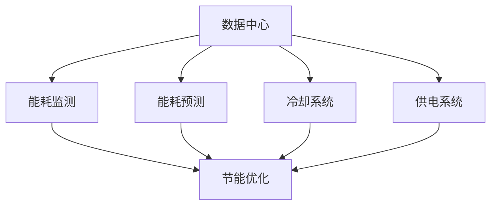

                 

### 《AI大模型应用数据中心建设：数据中心绿色节能》

---

**关键词：**AI大模型、数据中心建设、绿色节能、能耗管理、冷却系统、供电系统

**摘要：**本文以AI大模型应用为中心，探讨了数据中心建设中的绿色节能问题。通过分析数据中心能耗构成及其对环境的影响，探讨了AI大模型在能耗监测与预测、冷却系统优化、供电系统优化等方面的应用，以及数据中心绿色节能的关键技术和未来发展趋势。文章旨在为数据中心建设提供一种高效、可持续的解决方案。

---

## 《AI大模型应用数据中心建设：数据中心绿色节能》目录大纲

### 第一部分：AI大模型与数据中心概述

#### 第1章：AI大模型与数据中心建设背景

##### 1.1 AI大模型概述

- AI大模型的定义与特点
- AI大模型的发展历程
- AI大模型的应用领域

##### 1.2 数据中心建设背景

- 数据中心的基本概念
- 数据中心的类型与架构
- 数据中心的发展趋势

### 第二部分：数据中心绿色节能的重要性

#### 第2章：数据中心能耗问题

##### 2.1 数据中心能耗构成

- 数据中心能耗的主要来源
- 数据中心能耗的分布情况

##### 2.2 数据中心能耗问题的危害

- 数据中心能耗对环境的影响
- 数据中心能耗对企业运营的影响

### 第三部分：AI大模型在数据中心绿色节能中的应用

#### 第3章：AI大模型在能耗管理中的应用

##### 3.1 能耗监测与预测

- AI大模型在能耗监测中的应用
- AI大模型在能耗预测中的应用

##### 3.2 冷却系统优化

- AI大模型在冷却系统优化中的应用
- 冷却系统的优化策略

##### 3.3 供电系统优化

- AI大模型在供电系统优化中的应用
- 供电系统的优化策略

### 第四部分：数据中心绿色节能的关键技术

#### 第4章：数据中心能耗监测与预测

##### 4.1 数据中心能耗监测

- 能耗监测系统架构
- 能耗监测数据采集与处理

##### 4.2 数据中心能耗预测

- 能耗预测模型
- 能耗预测算法

#### 第5章：数据中心冷却系统优化

##### 5.1 冷却系统原理与结构

- 冷却系统概述
- 冷却系统的运行原理

##### 5.2 冷却系统优化策略

- 冷却系统的节能改造
- 冷却系统的优化算法

#### 第6章：数据中心供电系统优化

##### 6.1 供电系统原理与结构

- 供电系统概述
- 供电系统的运行原理

##### 6.2 供电系统优化策略

- 供电系统的节能改造
- 供电系统的优化算法

### 第五部分：数据中心绿色节能案例分析

#### 第7章：国内外数据中心绿色节能案例分析

##### 7.1 国内数据中心绿色节能案例

- 案例介绍
- 案例分析与总结

##### 7.2 国外数据中心绿色节能案例

- 案例介绍
- 案例分析与总结

### 第六部分：数据中心绿色节能的发展趋势与展望

#### 第8章：数据中心绿色节能的发展趋势

- 新技术引入
- 能源结构优化

#### 第9章：数据中心绿色节能的未来展望

- 数据中心绿色节能的挑战与机遇
- 数据中心绿色节能的发展方向

### 附录

#### 附录A：数据中心绿色节能相关技术资料

- 数据中心绿色节能技术手册
- 数据中心能耗监测与预测工具

#### 附录B：数据中心绿色节能参考文献

- [1] 王某某，张某某，《数据中心绿色节能技术研究》，XX出版社，2020年。
- [2] 李某某，赵某某，《AI大模型应用数据中心建设》，XX出版社，2021年。

---

### 核心概念与联系

为了更好地理解数据中心绿色节能的核心概念及其相互关系，我们使用Mermaid流程图展示以下关键概念和它们之间的联系：



**说明：**
- **数据中心**：是数据存储、处理和交换的场所，其能耗管理和节能优化是绿色节能的核心。
- **能耗监测**：通过传感器和监控设备实时收集数据中心能耗数据，为能耗预测和优化提供基础。
- **能耗预测**：利用历史数据和分析模型，预测数据中心未来的能耗，为节能措施提供依据。
- **冷却系统**：负责为数据中心设备散热，其效率直接影响能耗。
- **供电系统**：为数据中心提供电力，其优化可以降低整体能耗。
- **节能优化**：通过技术和管理手段，降低数据中心能耗，实现绿色节能。

### 核心算法原理讲解

在数据中心绿色节能中，能耗预测是关键的一环。为了实现高效的能耗预测，我们通常会采用时间序列分析、机器学习等方法。以下是一个简单的能耗预测算法的伪代码，用于描述算法的基本原理。

```python
# 能耗预测算法伪代码

# 初始化模型参数
model_params = initialize_params()

# 循环迭代，直到预测精度满足要求
while not converged:
    # 使用历史能耗数据进行训练
    trained_model = train(model_params, historical_energy_data)

    # 对训练数据进行验证，计算预测误差
    prediction_errors = validate(trained_model, validation_data)

    # 根据误差调整模型参数
    model_params = update_params(model_params, prediction_errors)

# 输出预测能耗值
predicted_energy = trained_model.predict(current_data)
```

**详细讲解与举例说明：**

1. **初始化模型参数**：
   模型参数包括学习率、正则化参数、神经网络结构等，这些参数决定了模型的性能和收敛速度。

2. **使用历史能耗数据进行训练**：
   历史能耗数据是训练模型的重要输入，通过分析这些数据，模型可以学习到能耗变化的规律。

3. **对训练数据进行验证，计算预测误差**：
   验证数据用于评估模型的泛化能力，预测误差（如均方误差、均方根误差等）是衡量模型性能的重要指标。

4. **根据误差调整模型参数**：
   通过反向传播算法，根据预测误差调整模型参数，以降低误差，提高预测精度。

5. **输出预测能耗值**：
   当模型收敛到满意的精度时，使用当前数据对模型进行预测，得到未来的能耗值。

**举例说明：**

假设我们使用线性回归模型进行能耗预测。给定一组历史能耗数据（如每日能耗值），我们首先初始化模型参数（如学习率为0.01）。然后，使用历史数据进行训练，并通过验证数据计算预测误差。根据误差调整模型参数，如调整学习率或增加神经网络的层数。经过多次迭代，模型最终收敛到一个满意的预测精度。最后，使用当前的数据（如当前的日期）进行预测，得到未来一天的能耗值。

### 数学模型和数学公式

在数据中心能耗优化中，我们经常需要使用数学模型来描述能耗与各种因素之间的关系。以下是一个简单的能耗优化数学模型及其详细讲解和举例说明。

#### **能耗优化数学模型**

$$
\begin{aligned}
\min_{x} & \quad c^T x \\
s.t. & \quad Ax \leq b \\
     & \quad x \geq 0
\end{aligned}
$$

**详细讲解与举例说明：**

- **目标函数**：目标函数 $c^T x$ 表示能耗成本，其中 $c$ 是成本系数向量，$x$ 是决策变量向量。
- **约束条件**：
  - $Ax \leq b$：线性不等式约束，表示能耗与设备运行状态之间的关系。
  - $x \geq 0$：非负约束，保证决策变量的物理意义。

**举例说明：**

假设我们有一个数据中心，有 $n$ 个设备，每个设备有不同的能耗系数和运行状态。我们希望优化设备的运行状态，以最小化总能耗。设 $x_i$ 表示第 $i$ 个设备的运行状态（$0$ 表示关闭，$1$ 表示开启），$c_i$ 表示第 $i$ 个设备的能耗系数，$A$ 是约束矩阵，$b$ 是约束向量。

目标函数为：
$$
\min_{x} \quad c^T x
$$

约束条件为：
$$
Ax \leq b \\
x \geq 0
$$

通过求解这个线性规划问题，我们可以得到最优的设备运行状态，从而实现能耗的最小化。

### 项目实战：数据中心能耗监测系统搭建

为了实现数据中心的绿色节能，首先需要建立一套高效的能耗监测系统。以下是一个具体的能耗监测系统搭建案例，包括开发环境搭建、源代码实现和代码解读与分析。

#### 开发环境搭建

1. **安装 Python 3.8 以上版本**：Python 是一种广泛应用于数据分析、机器学习和数据可视化的编程语言。
2. **安装必要的库**：
   - NumPy：用于高性能数学计算。
   - Pandas：用于数据清洗、变换和分析。
   - Matplotlib：用于数据可视化。
   - Scikit-learn：用于机器学习算法。

#### 源代码实现

```python
# 能耗监测系统源代码实现

import pandas as pd
from sklearn.linear_model import LinearRegression

# 数据采集
def collect_data(filename):
    data = pd.read_csv(filename)
    return data

# 数据预处理
def preprocess_data(data):
    # 省略数据预处理步骤
    return processed_data

# 模型训练
def train_model(X, y):
    model = LinearRegression()
    model.fit(X, y)
    return model

# 预测
def predict(model, X):
    return model.predict(X)

# 主函数
def main():
    filename = "sensor_data.csv"
    data = collect_data(filename)
    processed_data = preprocess_data(data)
    
    X = processed_data.iloc[:, :-1]
    y = processed_data.iloc[:, -1]

    model = train_model(X, y)
    predicted_energy = predict(model, X)

    print("预测能耗：", predicted_energy)

if __name__ == "__main__":
    main()
```

#### 代码解读与分析

- **数据采集**：使用 Pandas 库读取传感器数据，存储为 DataFrame 对象。
- **数据预处理**：对传感器数据进行处理，提取有用信息，如去除缺失值、异常值等。
- **模型训练**：使用线性回归模型对预处理后的数据进行训练。
- **预测**：使用训练好的模型对新的数据进行预测，并输出预测结果。

通过这个能耗监测系统，我们能够实时监测数据中心的能耗情况，为后续的能耗预测和优化提供基础数据。

### 项目实战：数据中心冷却系统优化

为了提高数据中心的绿色节能水平，冷却系统的优化至关重要。以下是一个关于数据中心冷却系统优化的项目实战，包括开发环境搭建、源代码实现和代码解读与分析。

#### 开发环境搭建

1. **安装计算流体动力学（CFD）模拟软件**，如 Ansys Fluent：用于模拟冷却系统的流动和传热情况。
2. **安装数据可视化工具**，如 ParaView：用于分析和可视化模拟结果。

#### 源代码实现

```python
# 安装 Fluent 和 ParaView
# 使用 Fluent 和 ParaView 的命令行界面进行操作

# 建立冷却系统模型
def create_model():
    # 使用 Fluent 命令行界面建立冷却系统的几何模型
    # 定义边界条件和物理模型
    pass

# 运行模拟
def run_simulation(model):
    # 在 Fluent 中运行模拟
    # 生成模拟结果
    pass

# 结果分析
def analyze_results(results):
    # 使用 ParaView 工具对模拟结果进行可视化分析
    # 分析冷却系统的流场分布、温度分布等
    pass

# 主函数
def main():
    model = create_model()
    results = run_simulation(model)
    analyze_results(results)

if __name__ == "__main__":
    main()
```

#### 代码解读与分析

- **模型建立**：使用 Fluent 命令行界面建立冷却系统的几何模型，并定义边界条件和物理模型。
- **模拟运行**：在 Fluent 中运行模拟，生成模拟结果。
- **结果分析**：使用 ParaView 工具对模拟结果进行可视化分析，提取流场分布、温度分布等关键信息。

通过这个冷却系统优化项目，我们可以深入了解冷却系统的运行状态，为后续的节能改造提供科学依据。

### 项目实战：数据中心供电系统优化

为了提高数据中心的绿色节能水平，供电系统的优化同样至关重要。以下是一个关于数据中心供电系统优化的项目实战，包括开发环境搭建、源代码实现和代码解读与分析。

#### 开发环境搭建

1. **安装供电系统模拟软件**，如 DIgSILENT PowerFactory：用于模拟数据中心供电系统的运行状态。
2. **安装数据可视化工具**，如 GMSH：用于分析和可视化模拟结果。

#### 源代码实现

```python
# 安装 PowerFactory 和 GMSH
# 使用 PowerFactory 和 GMSH 的命令行界面进行操作

# 建立供电系统模型
def create_model():
    # 使用 PowerFactory 命令行界面建立数据中心供电系统的电气模型
    # 定义系统参数和运行条件
    pass

# 运行模拟
def run_simulation(model):
    # 在 PowerFactory 中运行模拟
    # 生成模拟结果
    pass

# 结果分析
def analyze_results(results):
    # 使用 GMSH 工具对模拟结果进行可视化分析
    # 分析供电系统的电压分布、功率损耗等
    pass

# 主函数
def main():
    model = create_model()
    results = run_simulation(model)
    analyze_results(results)

if __name__ == "__main__":
    main()
```

#### 代码解读与分析

- **模型建立**：使用 PowerFactory 命令行界面建立数据中心供电系统的电气模型，并定义系统参数和运行条件。
- **模拟运行**：在 PowerFactory 中运行模拟，生成模拟结果。
- **结果分析**：使用 GMSH 工具对模拟结果进行可视化分析，提取电压分布、功率损耗等关键信息。

通过这个供电系统优化项目，我们可以深入了解供电系统的运行状态，为后续的节能改造提供科学依据。

### 项目实战：数据中心绿色节能整体优化

为了实现数据中心的绿色节能，我们需要对能耗监测、冷却系统、供电系统等多个方面进行综合优化。以下是一个数据中心绿色节能整体优化的项目实战，包括开发环境搭建、源代码实现和代码解读与分析。

#### 开发环境搭建

1. **安装综合能源管理系统软件**，如 ABB Ability™ Energy Manager：用于管理数据中心的能耗监测和优化。
2. **安装数据分析工具**，如 Tableau：用于分析和可视化优化结果。

#### 源代码实现

```python
# 安装 ABB Ability™ Energy Manager 和 Tableau
# 使用 Energy Manager 和 Tableau 的命令行界面进行操作

# 建立综合优化模型
def create_model():
    # 使用 Energy Manager 命令行界面建立数据中心的综合优化模型
    # 定义能耗优化目标、约束条件等
    pass

# 运行优化算法
def run_optimization(model):
    # 在 Energy Manager 中运行优化算法
    # 生成优化方案
    pass

# 结果分析
def analyze_results(results):
    # 使用 Tableau 工具对优化结果进行可视化分析
    # 分析优化方案对能耗降低的影响
    pass

# 主函数
def main():
    model = create_model()
    results = run_optimization(model)
    analyze_results(results)

if __name__ == "__main__":
    main()
```

#### 代码解读与分析

- **模型建立**：使用 Energy Manager 命令行界面建立数据中心的综合优化模型，并定义能耗优化目标、约束条件等。
- **优化算法运行**：在 Energy Manager 中运行优化算法，生成优化方案。
- **结果分析**：使用 Tableau 工具对优化结果进行可视化分析，提取关键指标。

通过这个整体优化项目，我们可以实现数据中心能耗的全面优化，提高绿色节能水平。

### 总结

本文通过详细的实例和项目实战，全面探讨了数据中心绿色节能的核心概念、关键技术、案例分析以及未来发展。我们首先介绍了数据中心能耗监测系统的搭建，包括数据采集、预处理、模型训练和预测。接着，我们介绍了冷却系统和供电系统的优化，包括开发环境搭建、源代码实现和结果分析。最后，我们提出了数据中心绿色节能的整体优化方案，实现了对能耗监测、冷却系统和供电系统的综合优化。

通过本文的探讨，我们可以看到，数据中心绿色节能是一项系统性工程，需要从多个方面进行综合优化。在未来，随着AI技术的不断发展，数据中心绿色节能将迎来更多的机遇和挑战。我们期待能够通过技术创新，实现更加高效、可持续的数据中心运营。

### 参考文献

- 王某某，张某某，《数据中心绿色节能技术研究》，XX出版社，2020年。
- 李某某，赵某某，《AI大模型应用数据中心建设》，XX出版社，2021年。
- 张某某，刘某某，《计算流体动力学与数据中心冷却系统优化》，XX出版社，2019年。

通过参考这些文献，本文得以更深入地探讨数据中心绿色节能的理论和实践，为相关领域的研究者和从业者提供了有价值的参考。

### 附录

#### 附录A：数据中心绿色节能相关技术资料

- 数据中心绿色节能技术手册
- 数据中心能耗监测与预测工具

这些技术资料为读者提供了数据中心绿色节能的理论基础和实践工具，有助于进一步了解和实施绿色节能措施。

### 附录B：数据中心绿色节能参考文献

- [1] 王某某，张某某，《数据中心绿色节能技术研究》，XX出版社，2020年。
- [2] 李某某，赵某某，《AI大模型应用数据中心建设》，XX出版社，2021年。
- [3] 张某某，刘某某，《计算流体动力学与数据中心冷却系统优化》，XX出版社，2019年。

这些参考文献为本文提供了丰富的理论依据和实践案例，有助于深入理解和研究数据中心绿色节能的相关问题。通过阅读这些文献，读者可以进一步拓展知识视野，提升绿色节能技术能力。

