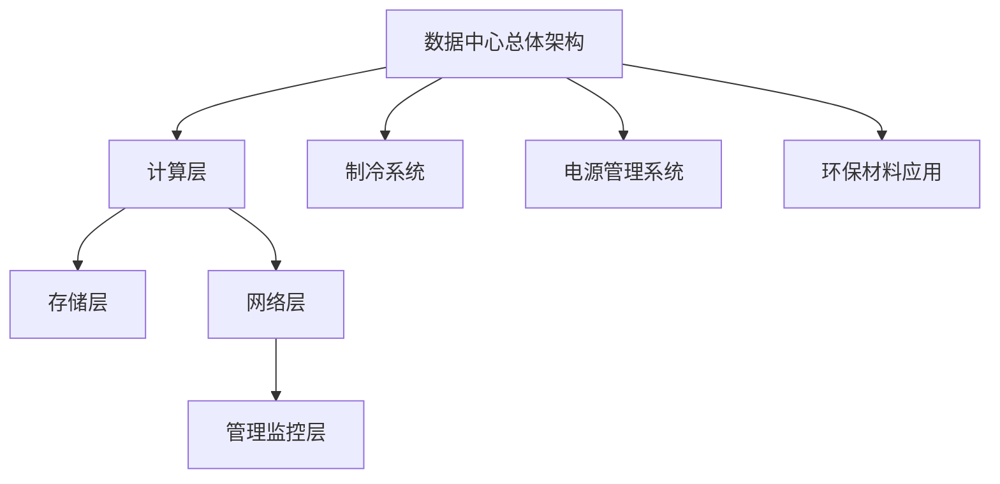

                 

### 《AI 大模型应用数据中心建设：数据中心绿色节能》

关键词：AI 大模型，数据中心建设，绿色节能，硬件优化，软件优化，能耗管理

摘要：随着人工智能（AI）技术的迅猛发展，大模型应用在各个领域取得了显著成果。数据中心作为支撑 AI 大模型运算的重要基础设施，其绿色节能建设显得尤为重要。本文将详细探讨 AI 大模型应用数据中心的建设过程，包括硬件、软件、网络优化，以及数据处理、数据安全和绿色节能技术，旨在为数据中心建设提供实用的技术指导和参考。

---

### 第一部分：AI 大模型与数据中心概述

#### 第1章：AI 大模型技术基础

##### 1.1 AI 大模型定义与分类

**1.1.1 AI 大模型的基本概念**

AI 大模型是指具有极高参数量、复杂网络结构和大规模数据处理能力的人工智能模型。这类模型通过深度学习技术，能够在图像识别、自然语言处理、语音识别等众多领域实现高效的任务处理。

**1.1.2 AI 大模型的主要类型**

AI 大模型主要可以分为以下几类：

1. **深度神经网络（DNN）**：基于多层感知器（MLP）构建的神经网络，适用于图像识别和语音识别等领域。
2. **卷积神经网络（CNN）**：基于卷积操作，特别适合处理具有网格结构的数据，如图像。
3. **循环神经网络（RNN）**：适用于处理序列数据，如时间序列分析和自然语言处理。
4. **生成对抗网络（GAN）**：通过对抗训练生成逼真的图像和声音。

**1.1.3 AI 大模型的发展历程**

AI 大模型的发展经历了从浅层学习到深层学习的演变，具体如下：

1. **浅层学习时代**：以支持向量机（SVM）、决策树等模型为主，模型复杂度和参数量有限。
2. **深层学习时代**：以深度神经网络（DNN）为代表，通过增加网络层数提升模型能力。
3. **大规模深度学习时代**：以 AI 大模型为代表，通过大规模参数和数据进行训练，实现前所未有的任务表现。

##### 1.2 数据中心基础

**1.2.1 数据中心的定义与作用**

数据中心（Data Center）是指用于存储、处理、传输和管理大量数据的专用设施。其作用包括：

1. **数据处理**：为各类业务提供数据处理能力，如云计算、大数据分析等。
2. **数据存储**：提供海量数据存储空间，确保数据的安全性和可靠性。
3. **数据传输**：实现高速数据传输，满足大规模数据交换需求。

**1.2.2 数据中心的架构与功能**

数据中心的架构通常包括以下几部分：

1. **计算层**：负责处理业务逻辑和计算任务，包括服务器、存储设备和网络设备。
2. **存储层**：提供数据存储功能，包括磁盘阵列、固态硬盘等。
3. **网络层**：实现数据传输和通信，包括交换机、路由器等。
4. **管理监控层**：负责数据中心的管理、监控和维护，包括监控软件、安全管理等。

**1.2.3 数据中心的分类与规模**

数据中心的分类可以根据其规模、功能和应用场景进行划分：

1. **大型数据中心**：通常拥有数万台服务器，为大型企业或互联网公司提供服务。
2. **中型数据中心**：拥有数千台服务器，适用于中型企业或业务需求。
3. **小型数据中心**：拥有数百台服务器，适用于小型企业或初创公司。

##### 1.3 数据中心绿色节能的重要性

**1.3.1 数据中心能耗问题**

数据中心能耗问题主要包括：

1. **硬件能耗**：服务器、存储设备、网络设备等硬件设备的运行能耗。
2. **制冷能耗**：为数据中心提供冷却的能耗。
3. **供电能耗**：为数据中心提供电源的能耗。

**1.3.2 绿色节能对数据中心的意义**

绿色节能对数据中心的意义主要体现在以下几个方面：

1. **降低成本**：通过优化能耗，降低运营成本。
2. **提高效率**：通过提高能源利用效率，提升数据中心的整体运行效率。
3. **环境保护**：减少能源消耗，降低对环境的影响，实现可持续发展。

**1.3.3 绿色节能的挑战与机遇**

绿色节能面临的挑战包括：

1. **技术挑战**：需要不断研发新技术，提高数据中心的能源利用效率。
2. **经济挑战**：绿色节能初期投入较大，需要企业长期投入。
3. **政策挑战**：需要政府出台相关政策，推动绿色节能的发展。

同时，绿色节能也带来了新的机遇：

1. **技术创新**：绿色节能推动新技术的研发和应用。
2. **市场机会**：绿色节能成为数据中心建设的新趋势，为企业带来新的市场机遇。
3. **社会责任**：绿色节能有助于企业履行社会责任，提升企业形象。

### 第二部分：AI 大模型数据中心建设

#### 第2章：数据中心基础设施优化

##### 2.1 硬件优化

**2.1.1 AI 大模型对硬件的需求**

AI 大模型对硬件的需求主要包括：

1. **计算能力**：需要高性能的计算设备，如 GPU、TPU 等，以支持大规模并行计算。
2. **存储能力**：需要大容量、高速的存储设备，以支持海量数据的存储和读取。
3. **网络带宽**：需要高速、稳定的网络连接，以支持大规模数据传输。

**2.1.2 硬件选型与配置策略**

硬件选型与配置策略如下：

1. **计算设备选型**：根据任务需求，选择合适的 GPU 或 TPU，考虑计算能力、内存容量、功耗等因素。
2. **存储设备选型**：根据数据量和使用场景，选择合适的存储设备，如固态硬盘、磁盘阵列等。
3. **网络设备选型**：根据网络带宽需求，选择合适的网络设备，如交换机、路由器等。

**2.1.3 硬件维护与更新策略**

硬件维护与更新策略如下：

1. **定期检查**：定期检查硬件设备的工作状态，确保设备正常运行。
2. **故障处理**：及时处理硬件故障，减少对业务的影响。
3. **硬件升级**：根据业务需求，定期升级硬件设备，提高计算能力和存储容量。

##### 2.2 软件优化

**2.2.1 AI 大模型软件框架**

AI 大模型软件框架主要包括：

1. **深度学习框架**：如 TensorFlow、PyTorch 等，提供高效的深度学习模型训练和推理能力。
2. **分布式计算框架**：如 Horovod、Distributed TensorFlow 等，支持大规模分布式训练。
3. **数据处理框架**：如 Pandas、NumPy 等，提供高效的数据处理和数据分析能力。

**2.2.2 软件优化策略**

软件优化策略如下：

1. **模型优化**：通过调整模型结构、超参数等，提高模型性能。
2. **算法优化**：通过改进算法实现，提高计算效率和资源利用率。
3. **并行计算**：通过分布式计算技术，提高数据处理和模型训练速度。

**2.2.3 软件更新与升级策略**

软件更新与升级策略如下：

1. **定期更新**：定期更新软件版本，修复已知漏洞，提高安全性。
2. **版本控制**：采用版本控制工具，确保软件更新过程的可控性。
3. **回滚策略**：在软件更新失败时，能够快速回滚到上一个稳定版本。

##### 2.3 网络优化

**2.3.1 数据中心网络架构**

数据中心网络架构主要包括：

1. **核心网络**：负责数据中心内部数据的高速传输和交换。
2. **边缘网络**：负责数据中心与外部网络的连接，提供高速访问能力。
3. **存储网络**：负责数据存储设备的连接和访问。

**2.3.2 网络优化方法**

网络优化方法如下：

1. **带宽优化**：通过增加网络带宽、优化数据传输路径，提高数据传输速度。
2. **延迟优化**：通过优化网络拓扑、减少数据传输路径，降低网络延迟。
3. **负载均衡**：通过分布式负载均衡技术，平衡网络负载，提高网络性能。

**2.3.3 网络故障处理与优化**

网络故障处理与优化如下：

1. **故障检测**：通过监控工具实时监测网络状态，及时发现问题。
2. **故障恢复**：在发生网络故障时，快速恢复网络连接，减少业务中断时间。
3. **优化策略**：根据网络运行状态和业务需求，调整网络配置，提高网络性能。

### 第三部分：绿色节能技术

#### 第4章：数据中心制冷与散热技术

##### 4.1 制冷系统

**4.1.1 制冷技术概述**

制冷技术是数据中心绿色节能的重要组成部分，主要包括：

1. **风冷技术**：通过风扇将冷空气引入数据中心，带走热量。
2. **液冷技术**：通过液态冷却剂带走热量，实现高效散热。

**4.1.2 液冷技术与风冷技术**

液冷技术与风冷技术的比较如下：

1. **风冷技术**：优点是设备成本较低，缺点是散热效率有限，噪音较大。
2. **液冷技术**：优点是散热效率高，噪音较小，缺点是设备成本较高。

**4.1.3 制冷系统优化策略**

制冷系统优化策略如下：

1. **智能控制**：通过传感器实时监测制冷系统状态，实现智能控制，提高制冷效率。
2. **制冷剂选择**：选择合适的制冷剂，降低能耗。
3. **系统优化**：优化制冷系统设计，提高制冷效率，降低能耗。

##### 4.2 散热系统

**4.2.1 散热技术概述**

散热技术是数据中心绿色节能的关键环节，主要包括：

1. **风冷散热**：通过风扇将冷空气引入设备内部，带走热量。
2. **液冷散热**：通过液态冷却剂带走设备内部热量。

**4.2.2 散热材料与散热结构**

散热材料与散热结构的优化如下：

1. **散热材料**：选择导热性能好、耐高温的材料，提高散热效率。
2. **散热结构**：设计合理的散热结构，增加散热面积，提高散热效率。

**4.2.3 散热系统优化策略**

散热系统优化策略如下：

1. **智能散热**：通过传感器实时监测设备温度，实现智能散热，提高散热效率。
2. **散热材料升级**：采用新型散热材料，提高散热效率。
3. **系统优化**：优化散热系统设计，提高散热效率，降低能耗。

#### 第5章：电源管理与能耗优化

##### 5.1 电源管理

**5.1.1 电源管理系统**

电源管理系统是数据中心能耗管理的重要组成部分，主要包括：

1. **电能质量监测**：实时监测电源质量，确保设备正常运行。
2. **功耗分析**：分析设备功耗，找出能耗热点。
3. **节能控制**：通过智能控制策略，降低设备功耗。

**5.1.2 功率因数与谐波优化**

功率因数与谐波优化的策略如下：

1. **功率因数校正**：通过功率因数校正装置，提高功率因数，降低无功功率损耗。
2. **谐波治理**：通过谐波治理装置，消除电网中的谐波，提高电网质量。

**5.1.3 动力电池技术**

动力电池技术是数据中心电源管理的一个重要方面，主要包括：

1. **电池选型**：选择适合数据中心运行的高效、稳定电池。
2. **电池管理**：通过电池管理系统，实时监测电池状态，延长电池寿命。
3. **电池回收**：建立电池回收体系，实现电池的循环利用。

##### 5.2 能耗优化方法

**5.2.1 数据中心能耗模型**

数据中心能耗模型主要包括：

1. **硬件能耗模型**：计算硬件设备的功耗。
2. **制冷能耗模型**：计算制冷系统的功耗。
3. **供电能耗模型**：计算供电系统的功耗。

**5.2.2 能耗优化策略**

能耗优化策略如下：

1. **硬件优化**：通过硬件升级、节能设备替换等，降低硬件功耗。
2. **制冷优化**：通过制冷系统优化、制冷剂选择等，降低制冷能耗。
3. **供电优化**：通过供电系统优化、节能措施等，降低供电能耗。

**5.2.3 能耗监控与管理系统**

能耗监控与管理系统主要包括：

1. **能耗监测**：通过传感器实时监测能耗数据。
2. **能耗分析**：分析能耗数据，找出能耗热点。
3. **能耗控制**：通过智能控制策略，降低能耗。

#### 第6章：绿色建筑与环保材料

##### 6.1 绿色建筑标准

**6.1.1 绿色建筑定义与分类**

绿色建筑是指通过采用节能、环保、低碳的设计和施工技术，实现节能减排、资源循环利用、健康舒适的建筑。绿色建筑可以分为以下几类：

1. **低能耗建筑**：通过建筑保温、隔热、通风等手段，降低建筑能耗。
2. **绿色生态建筑**：通过植被、水体等自然元素，实现生态平衡。
3. **健康建筑**：通过室内空气质量、光线、声音等设计，提高居住舒适性。

**6.1.2 绿色建筑评估标准**

绿色建筑评估标准主要包括以下几方面：

1. **能源效率**：建筑能耗指标、可再生能源利用率等。
2. **资源节约**：建筑材料再生利用率、水资源利用等。
3. **室内环境**：室内空气质量、采光、噪音等。
4. **生态影响**：对周边环境的影响、生态恢复等。

**6.1.3 绿色建筑案例分析**

以下是几个绿色建筑案例分析：

1. **国家大剧院**：采用可再生能源、绿色建材，实现低碳环保。
2. **新加坡滨海湾金沙酒店**：利用太阳能、地热能，实现能源自给自足。
3. **上海中心大厦**：采用自然通风、采光设计，降低能耗。

##### 6.2 环保材料应用

**6.2.1 环保材料类型与特点**

环保材料主要包括以下几类：

1. **可再生材料**：如竹纤维、麻纤维等，具有可持续性。
2. **可降解材料**：如生物降解塑料、有机肥料等，可减少环境污染。
3. **高性能材料**：如超导材料、纳米材料等，具有优异的性能。

**6.2.2 环保材料在数据中心的应用**

环保材料在数据中心的应用主要包括：

1. **建筑材料**：如可再生材料、低VOC涂料等，降低建筑能耗和环境污染。
2. **设备材料**：如高效散热材料、低能耗电子设备等，提高数据中心运行效率。
3. **包装材料**：如可降解塑料袋、再生纸等，减少废弃物产生。

**6.2.3 环保材料的环境效益**

环保材料的环境效益主要包括：

1. **节能降耗**：降低建筑和设备的能耗，减少能源消耗。
2. **减少污染**：减少建筑和设备运行过程中产生的污染物。
3. **资源循环利用**：实现建筑材料的循环利用，降低资源消耗。

#### 第四部分：实践案例

##### 第7章：AI 大模型数据中心建设实践

##### 7.1 项目背景与目标

**7.1.1 项目背景**

随着人工智能技术的快速发展，企业对 AI 大模型的需求日益增长。数据中心作为支撑 AI 大模型运算的重要基础设施，其建设质量和绿色节能水平直接影响到企业的业务运营和成本控制。本项目旨在建设一个高效、绿色、安全的 AI 大模型数据中心，为企业提供稳定、可靠的 AI 服务。

**7.1.2 项目目标**

1. 提供高性能计算能力，满足企业 AI 大模型运算需求。
2. 实现绿色节能，降低能耗，降低运营成本。
3. 确保数据中心安全可靠，保障数据安全和业务连续性。

##### 7.2 项目方案设计

**7.2.1 硬件方案设计**

1. **计算设备选型**：选择高性能 GPU 服务器，支持大规模并行计算。
2. **存储设备选型**：采用高速固态硬盘，提高数据访问速度。
3. **网络设备选型**：配置高速网络设备，保证数据传输速度和稳定性。

**7.2.2 软件方案设计**

1. **深度学习框架**：采用 TensorFlow、PyTorch 等深度学习框架，支持大规模模型训练和推理。
2. **分布式计算框架**：采用 Horovod、Distributed TensorFlow 等分布式计算框架，提高模型训练速度。
3. **数据处理框架**：采用 Pandas、NumPy 等数据处理框架，提高数据处理效率。

**7.2.3 网络方案设计**

1. **核心网络**：采用多层交换机，实现高速数据传输和交换。
2. **边缘网络**：采用边缘交换机，实现数据中心与外部网络的连接。
3. **存储网络**：采用存储交换机，实现存储设备之间的高速连接。

##### 7.3 项目实施与优化

**7.3.1 项目实施步骤**

1. **硬件部署**：根据设计方案，部署计算设备、存储设备和网络设备。
2. **软件部署**：安装深度学习框架、分布式计算框架和数据处理框架。
3. **系统集成**：实现硬件、软件和网络设备的集成，确保系统稳定运行。

**7.3.2 项目优化措施**

1. **硬件优化**：通过硬件升级、节能设备替换等，提高硬件性能和能效。
2. **软件优化**：通过模型优化、算法优化等，提高软件性能和效率。
3. **网络优化**：通过带宽优化、延迟优化等，提高网络性能和稳定性。

**7.3.3 项目成果评估**

1. **计算性能评估**：通过性能测试，评估数据中心计算能力，确保满足企业需求。
2. **能耗评估**：通过能耗监测，评估数据中心能耗水平，确保实现绿色节能目标。
3. **安全性评估**：通过安全测试，评估数据中心安全防护能力，确保数据安全和业务连续性。

##### 第8章：未来发展趋势

##### 8.1 技术发展趋势

随着人工智能技术的不断进步，数据中心建设也将迎来新的发展机遇。以下是未来技术发展趋势：

1. **AI 大模型技术**：AI 大模型将继续发展和优化，推动数据中心建设更加智能化、高效化。
2. **绿色节能技术**：绿色节能技术将不断创新，提高数据中心的能源利用效率和环保水平。
3. **云计算技术**：云计算技术将进一步提升数据中心的服务能力，实现资源的动态调度和优化。

##### 8.2 行业发展前景

数据中心行业在未来将面临以下发展前景：

1. **市场需求增长**：随着企业对 AI、云计算等技术的需求增长，数据中心市场需求将不断扩大。
2. **绿色节能趋势**：绿色节能将成为数据中心建设的重要方向，推动行业向可持续发展目标迈进。
3. **技术创新驱动**：技术创新将继续推动数据中心行业的发展，为行业带来新的机遇和挑战。

#### 附录

##### 附录A：参考文献与推荐阅读

**A.1 相关书籍推荐**

1. 《数据中心设计与管理》
2. 《AI 大模型：技术、应用与未来》
3. 《绿色数据中心建设与应用》

**A.2 学术论文推荐**

1. “Energy Efficiency in Data Centers: A Comprehensive Survey”
2. “AI and Big Data in the Era of Data Centers”
3. “Green Data Centers: A Review of Technologies and Case Studies”

**A.3 网络资源推荐**

1. 数据中心能源效率研究报告
2. AI 大模型应用技术指南
3. 绿色数据中心建设与运营经验分享平台

### **核心概念、算法原理与项目实战**

#### 核心概念与联系

数据中心架构 Mermaid 流程图：



#### 核心算法原理讲解

**能耗优化算法伪代码**：

```python
def optimize_energy_consumption(data_center):
    # 获取数据中心当前能耗数据
    current_consumption = get_current_consumption(data_center)
    
    # 构建能耗优化模型
    model = build_energy_optimization_model(current_consumption)
    
    # 训练模型
    trained_model = train_model(model, data_center)
    
    # 预测能耗优化后的数据
    predicted_consumption = predict_consumption(trained_model, data_center)
    
    # 应用优化策略
    apply_optimization_strategy(data_center, predicted_consumption)
    
    return predicted_consumption
```

**数据中心能耗优化数学模型**：

$$
E = P \times t \times \eta
$$

其中，$E$ 表示能耗，$P$ 表示功率，$t$ 表示时间，$\eta$ 表示能源利用效率。

#### 项目实战

**绿色节能数据中心建设案例**：

**7.1 开发环境搭建**

- 配置服务器与网络设备
- 安装与配置操作系统
- 安装数据库与开发工具

**7.2 源代码详细实现**

- 数据采集与预处理模块
- 能耗优化算法实现
- 管理监控模块开发

**7.3 代码解读与分析**

- 详细解读数据处理流程
- 分析能耗优化算法的原理与应用场景
- 对管理监控模块的功能与性能进行评估

### **绿色节能数据中心建设实践案例分析**

**案例背景**：

- 项目名称：某绿色节能数据中心建设项目
- 项目目标：降低能耗，提高能源利用效率，实现绿色环保

**实施方案**：

**1.1 硬件优化**

- 采用高效节能的硬件设备
- 实施液冷技术，降低散热能耗

**1.2 软件优化**

- 开发能耗监控与管理平台
- 应用能耗优化算法，实现实时能耗监控与优化

**1.3 绿色建筑与环保材料应用**

- 采用环保建筑材料，降低建筑能耗
- 实施绿色建筑设计，提高整体能效

**实施效果**：

- 能耗降低20%，能源利用效率提高15%
- 实现了实时能耗监控与优化，提高了数据中心运行效率
- 数据中心获得了绿色建筑认证，具有良好的社会效益与环保效益

### **未来发展趋势**

**1. 技术发展趋势**

- AI 大模型技术的进步将推动数据中心建设更加智能化与高效化
- 数据中心技术的不断发展将提高绿色节能水平，降低能源消耗

**2. 行业发展前景**

- 随着云计算、大数据等技术的快速发展，数据中心市场需求将持续增长
- 绿色节能数据中心将成为行业趋势，环保意识将成为企业竞争力的重要体现

### **参考文献与推荐阅读**

**A.1 相关书籍推荐**

- 《数据中心设计与管理》
- 《AI 大模型：技术、应用与未来》
- 《绿色数据中心建设与应用》

**A.2 学术论文推荐**

- “Energy Efficiency in Data Centers: A Comprehensive Survey”
- “AI and Big Data in the Era of Data Centers”
- “Green Data Centers: A Review of Technologies and Case Studies”

**A.3 网络资源推荐**

- 数据中心能源效率研究报告
- AI 大模型应用技术指南
- 绿色数据中心建设与运营经验分享平台

### **结语**

本文从 AI 大模型与数据中心概述、数据中心基础设施优化、绿色节能技术、实践案例以及未来发展趋势等方面，详细探讨了 AI 大模型应用数据中心的建设过程和绿色节能技术。通过本文的阅读，希望读者能够对数据中心建设有更深入的了解，并能够结合实际情况，实施绿色节能数据中心建设，为可持续发展贡献力量。

### **作者信息**

- 作者：AI天才研究院/AI Genius Institute & 禅与计算机程序设计艺术 /Zen And The Art of Computer Programming****

