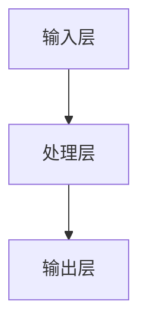
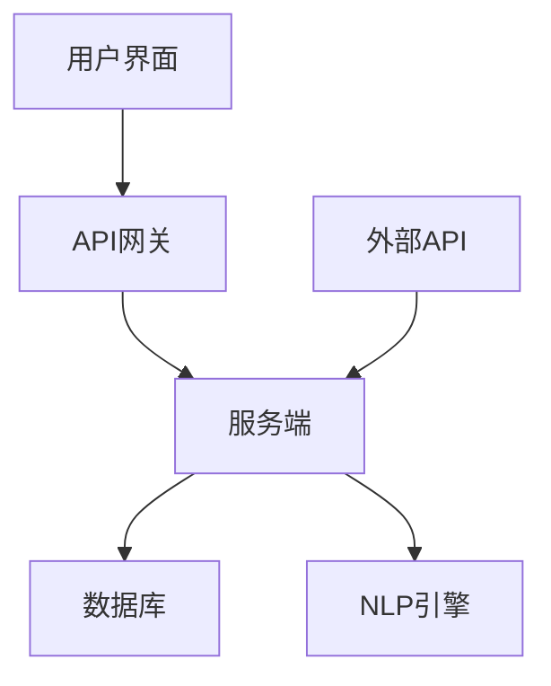
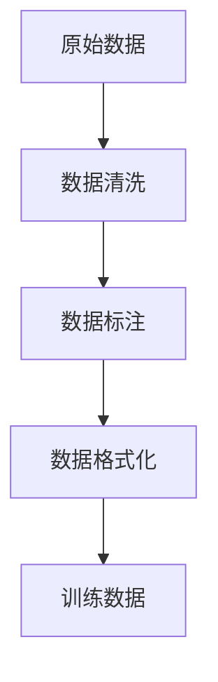
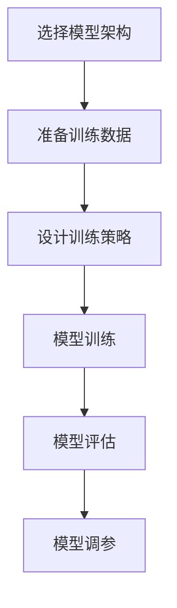
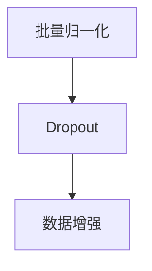
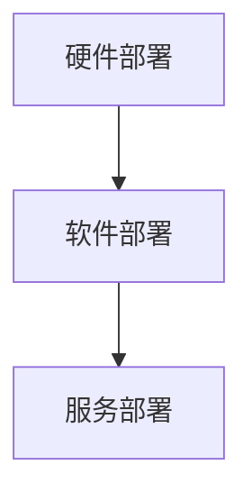
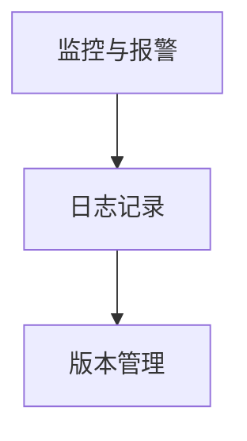
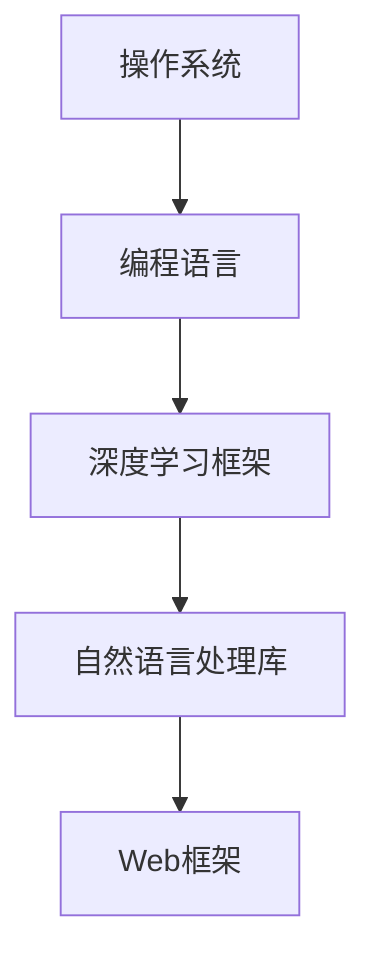
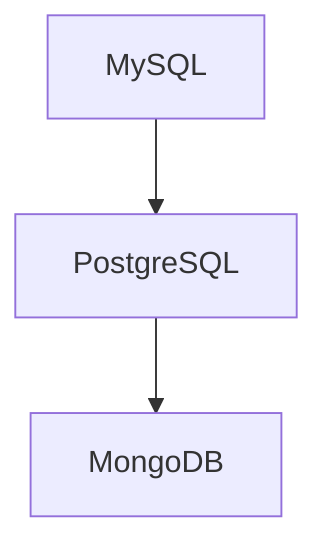
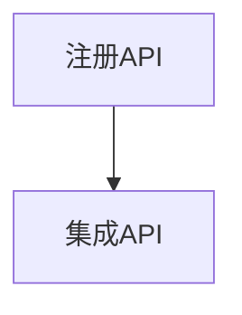

                 

# AIGC推动智能客服升级

> **关键词**：AIGC、智能客服、自然语言处理、生成对抗网络、强化学习、语义理解、情感分析

> **摘要**：本文将探讨AIGC技术在智能客服领域的应用，分析其带来的价值和应用场景，并通过实战案例展示AIGC智能客服系统的设计、开发与优化。同时，还将探讨智能客服系统面临的挑战和未来发展方向。

## 《AIGC推动智能客服升级》目录大纲

## 第一部分：AIGC与智能客服概述

### 第1章：AIGC技术基础

#### 1.1 AIGC的基本概念

#### 1.2 智能客服的概念

### 第2章：AIGC在智能客服中的应用

#### 2.1 AIGC在智能客服中的价值

#### 2.2 AIGC技术在智能客服中的应用场景

## 第二部分：AIGC智能客服系统开发与实践

### 第3章：AIGC智能客服系统设计

#### 3.1 系统架构设计

#### 3.2 数据预处理与模型训练

### 第4章：AIGC智能客服系统实战

#### 4.1 环境搭建与工具选择

#### 4.2 实战案例

## 第三部分：AIGC智能客服系统优化与挑战

### 第5章：AIGC智能客服系统优化

#### 5.1 性能优化

#### 5.2 可解释性提升

### 第6章：AIGC智能客服系统面临的挑战

#### 6.1 数据质量问题

#### 6.2 安全与隐私保护

## 第7章：未来展望

#### 7.1 AIGC技术的发展趋势

#### 7.2 智能客服的发展方向

#### 7.3 潜在应用场景

## 附录

### 附录A：常用AIGC工具与资源

现在，我们已经完成了文章的目录大纲，接下来将逐步展开每个章节的内容。

### 第一部分：AIGC与智能客服概述

#### 第1章：AIGC技术基础

##### 1.1 AIGC的基本概念

AIGC（AI-Generated Content）是指由人工智能技术生成的内容。它涵盖了自然语言生成、图像生成、音频生成等多种形式，其中自然语言生成是AIGC应用最为广泛的技术之一。在智能客服领域，AIGC技术可以用于自动生成常见问题的回答、智能对话系统的构建等。

##### 1.2 智能客服的概念

智能客服是一种利用人工智能技术实现自动化、智能化服务的人工智能系统。它能够自动应答常见问题、理解用户语义、分析用户情感，并在业务处理方面提供支持。智能客服的目标是提高客服效率，提升客户满意度。

##### 1.3 AIGC技术在智能客服中的应用

AIGC技术在智能客服中的应用主要体现在以下几个方面：

1. **自动应答系统**：通过AIGC技术生成常见问题的回答，实现自动化回复，减轻客服人员的工作负担。
2. **智能对话系统**：基于AIGC技术实现自然语言理解和生成，构建能够与用户进行交互的对话系统，提供个性化、精准的服务。
3. **情感分析**：利用AIGC技术对用户反馈进行情感分析，为客服人员提供有针对性的服务建议。

#### 第2章：AIGC在智能客服中的应用

##### 2.1 AIGC在智能客服中的价值

AIGC技术在智能客服中的应用带来了以下几个方面的价值：

1. **提高客服效率**：通过自动应答系统和智能对话系统，实现常见问题的自动化处理，提高客服效率。
2. **提升客户满意度**：提供个性化、精准的服务，提高问题解决速度，提升客户满意度。
3. **降低运营成本**：减少人工客服的工作量，降低企业运营成本。

##### 2.2 AIGC技术在智能客服中的应用场景

AIGC技术在智能客服中的应用场景主要包括以下几个方面：

1. **客户服务热线**：自动应答常见问题，提供快速、准确的解决方案。
2. **在线客服系统**：与用户进行智能对话，提供个性化服务。
3. **售后支持**：通过情感分析，为用户提供有针对性的服务建议。

在接下来的章节中，我们将详细讨论AIGC智能客服系统的设计、开发与实践，以及面临的挑战和未来发展方向。

### 第一部分总结

通过本部分的内容，我们对AIGC和智能客服有了基本的了解。AIGC技术凭借其自然语言生成能力，为智能客服带来了巨大的价值，提升了客服效率和客户满意度。在接下来的章节中，我们将深入探讨AIGC智能客服系统的设计、开发与实践，以及面临的挑战和未来发展方向。

### 第一部分：AIGC与智能客服概述

#### 第1章：AIGC技术基础

##### 1.1 AIGC的基本概念

AIGC（AI-Generated Content）是指通过人工智能技术自动生成内容的过程。这种技术涵盖了自然语言生成、图像生成、音频生成等多个领域，其中自然语言生成是AIGC应用最为广泛的技术之一。在智能客服领域，AIGC技术可以用于自动生成常见问题的回答、构建智能对话系统等。

**AIGC的定义**：

AIGC = AI-Generated Content

**AIGC的关键技术**：

- **自然语言处理（NLP）**：通过分析和理解自然语言文本，实现文本的生成、理解和交互。
- **生成对抗网络（GAN）**：一种深度学习模型，通过生成器和判别器的对抗训练，实现高质量图像的生成。
- **强化学习（RL）**：通过与环境互动，不断调整策略，实现智能决策和优化。

##### 1.2 智能客服的概念

智能客服是一种利用人工智能技术实现自动化、智能化服务的人工智能系统。它能够自动应答常见问题、理解用户语义、分析用户情感，并在业务处理方面提供支持。智能客服的目标是提高客服效率，提升客户满意度。

**智能客服的定义**：

智能客服是一种利用人工智能技术实现自动化、智能化服务的人工智能系统。

**智能客服的核心功能**：

- **自动应答**：通过预先设置的问题和答案库，自动回复用户的问题。
- **语义理解**：通过自然语言处理技术，理解用户的意图和问题，提供准确的回答。
- **情感分析**：通过分析用户的语言表达，识别用户的情绪和情感，为客服人员提供有针对性的服务。
- **业务处理**：根据用户的问题和需求，自动化处理业务流程，如订单查询、售后服务等。

##### 1.3 AIGC技术在智能客服中的应用

AIGC技术在智能客服中的应用主要体现在以下几个方面：

1. **自动应答系统**：利用AIGC技术自动生成常见问题的回答，实现自动化回复，减轻客服人员的工作负担。
2. **智能对话系统**：基于AIGC技术实现自然语言理解和生成，构建能够与用户进行交互的对话系统，提供个性化、精准的服务。
3. **情感分析**：利用AIGC技术对用户反馈进行情感分析，为客服人员提供有针对性的服务建议。

**AIGC在智能客服中的应用价值**：

1. **提高客服效率**：通过自动应答系统和智能对话系统，实现常见问题的自动化处理，提高客服效率。
2. **提升客户满意度**：提供个性化、精准的服务，提高问题解决速度，提升客户满意度。
3. **降低运营成本**：减少人工客服的工作量，降低企业运营成本。

**AIGC技术在智能客服中的应用场景**：

1. **客户服务热线**：自动应答常见问题，提供快速、准确的解决方案。
2. **在线客服系统**：与用户进行智能对话，提供个性化服务。
3. **售后支持**：通过情感分析，为用户提供有针对性的服务建议。

在本章中，我们介绍了AIGC技术的基本概念、智能客服的概念及其核心功能，并分析了AIGC技术在智能客服中的应用价值和应用场景。在接下来的章节中，我们将进一步探讨AIGC智能客服系统的设计、开发与实践，以及面临的挑战和未来发展方向。

### 第一部分总结

在本部分中，我们首先介绍了AIGC技术的基本概念和关键技术，包括自然语言处理、生成对抗网络和强化学习。然后，我们探讨了智能客服的概念、核心功能和应用场景，以及AIGC技术在智能客服中的应用价值。通过这些内容的阐述，我们对AIGC和智能客服有了更深入的了解。在接下来的章节中，我们将详细讨论AIGC智能客服系统的设计、开发与实践，以及面临的挑战和未来发展方向。

## 第二部分：AIGC智能客服系统开发与实践

### 第3章：AIGC智能客服系统设计

#### 3.1 系统架构设计

AIGC智能客服系统的设计需要综合考虑系统的功能、性能、可扩展性和可维护性。以下是一个典型的AIGC智能客服系统架构设计：

**系统架构概述**：

1. **输入层**：接收用户输入的问题或请求，包括文本、语音、图像等不同形式的数据。
2. **处理层**：对输入数据进行处理，包括文本预处理、情感分析、语义理解等。
3. **输出层**：生成回答或响应，并以文本、语音、图像等形式反馈给用户。

**系统架构图**：



在AIGC智能客服系统中，输入层负责接收用户输入的问题或请求。处理层包含文本预处理、情感分析、语义理解等模块，用于对输入数据进行分析和处理。输出层根据处理结果生成回答或响应，并反馈给用户。

#### 3.2 数据预处理与模型训练

**数据预处理**：

数据预处理是AIGC智能客服系统开发的重要环节，主要包括以下步骤：

1. **数据清洗**：去除数据中的噪声和错误，保证数据的质量。
2. **数据标注**：对数据进行标注，以便后续的训练和模型评估。
3. **数据格式化**：将数据转换为适合模型训练的格式，如文本向量化、图像预处理等。

**模型训练**：

在AIGC智能客服系统中，常用的模型训练方法包括：

1. **基于深度学习的自然语言处理模型**：如BERT、GPT等，用于文本的预处理、情感分析和语义理解。
2. **生成对抗网络（GAN）**：用于图像的生成和风格迁移。
3. **强化学习**：用于智能对话系统的决策和优化。

**选择合适的模型架构**：

在选择模型架构时，需要考虑以下几个因素：

1. **数据量**：数据量较大的情况下，可以选择复杂度较高的模型。
2. **任务类型**：针对不同的任务类型，选择适合的模型架构，如文本生成、图像生成等。
3. **计算资源**：根据计算资源的限制，选择合适的模型架构和训练策略。

**设计训练策略**：

设计训练策略时，需要考虑以下几个方面：

1. **损失函数**：根据任务类型选择合适的损失函数，如交叉熵损失、对抗性损失等。
2. **优化器**：选择合适的优化器，如Adam、RMSprop等。
3. **学习率调整**：设置合适的学习率，并采用学习率调整策略，如学习率衰减、周期性调整等。

**模型优化与调参**：

在模型训练过程中，需要对模型进行优化和调参，以获得更好的性能。常见的优化和调参方法包括：

1. **批量归一化**：用于加速收敛和减少梯度消失问题。
2. **Dropout**：用于防止过拟合。
3. **数据增强**：通过对数据进行变换，增加数据的多样性，提高模型的泛化能力。

#### 3.3 系统部署与维护

**系统部署**：

AIGC智能客服系统的部署主要包括以下几个方面：

1. **硬件部署**：选择合适的硬件设备，如GPU、服务器等，以满足模型训练和推理的需求。
2. **软件部署**：搭建开发环境和运行环境，包括操作系统、编程语言、深度学习框架等。
3. **服务部署**：将训练好的模型部署到生产环境中，提供智能客服服务。

**系统维护**：

系统维护是确保AIGC智能客服系统稳定运行的重要环节，主要包括以下几个方面：

1. **监控与报警**：对系统运行状态进行监控，及时发现并处理异常情况。
2. **日志记录**：记录系统运行日志，以便后续的故障排查和性能优化。
3. **版本管理**：对系统版本进行管理，确保版本升级的顺利进行。

在本章中，我们详细介绍了AIGC智能客服系统设计的关键环节，包括系统架构设计、数据预处理与模型训练、系统部署与维护。在接下来的章节中，我们将通过实战案例展示AIGC智能客服系统的开发与实践。

### 第二部分总结

在本部分中，我们详细介绍了AIGC智能客服系统的设计过程，包括系统架构设计、数据预处理与模型训练、系统部署与维护。通过这些内容的阐述，我们对AIGC智能客服系统的开发有了更深入的了解。在接下来的章节中，我们将通过实战案例展示AIGC智能客服系统的开发与实践，并探讨面临的挑战和未来发展方向。

### 第二部分：AIGC智能客服系统开发与实践

#### 第3章：AIGC智能客服系统设计

##### 3.1 系统架构设计

一个AIGC智能客服系统通常包括几个关键组件：前端界面、后端服务、数据库和自然语言处理（NLP）引擎。以下是一个简单的系统架构图：



**系统架构概述**：

- **用户界面（A）**：用户通过网页、移动应用或其他渠道与系统交互。
- **API网关（B）**：接收用户请求，并路由到相应的服务端。
- **服务端（C）**：处理业务逻辑，包括与NLP引擎的交互、查询数据库等。
- **数据库（D）**：存储用户数据、业务数据和知识库。
- **NLP引擎（E）**：负责自然语言理解、生成和情感分析等任务。
- **外部API（F）**：用于集成第三方服务和数据源。

##### 3.2 数据预处理与模型训练

**数据预处理**：

数据预处理是确保数据质量并为模型训练做准备的关键步骤。以下是一些常见的数据预处理任务：

- **数据清洗**：去除无效、重复或错误的数据。
- **数据标注**：为训练数据添加标签，例如分类标签或实体识别标签。
- **数据格式化**：将数据转换为统一的格式，以便于模型处理。



**模型训练**：

模型训练是AIGC智能客服系统的核心。以下是一个简化的模型训练过程：

- **选择模型架构**：根据任务需求选择合适的预训练模型，例如GPT、BERT等。
- **准备训练数据**：将预处理后的数据分成训练集、验证集和测试集。
- **训练策略**：设计训练策略，包括损失函数、优化器、学习率等。
- **模型调参**：通过实验调整模型参数，以优化性能。



**模型优化与调参**：

- **批量归一化**：通过批量归一化减少梯度消失问题。
- **Dropout**：通过随机丢弃神经元降低过拟合。
- **数据增强**：通过数据变换增加训练数据的多样性。



##### 3.3 系统部署与维护

**系统部署**：

系统部署是将开发好的AIGC智能客服系统部署到生产环境的过程。以下是一些关键步骤：

- **硬件部署**：选择合适的硬件，如服务器、GPU等。
- **软件部署**：安装操作系统、深度学习框架、数据库等。
- **服务部署**：部署API服务，使其可供用户使用。



**系统维护**：

系统维护是确保系统稳定运行的关键。以下是一些常见的维护任务：

- **监控与报警**：监控系统性能和资源使用情况，并在异常情况下触发报警。
- **日志记录**：记录系统运行日志，以便排查问题和性能分析。
- **版本管理**：管理系统版本，确保升级和回滚的顺利进行。



在本章中，我们详细介绍了AIGC智能客服系统的设计过程，包括系统架构设计、数据预处理与模型训练、系统部署与维护。在下一章中，我们将通过具体的实战案例展示AIGC智能客服系统的开发与实践。

### 第二部分总结

在本部分中，我们系统地阐述了AIGC智能客服系统的设计过程，从系统架构设计到数据预处理与模型训练，再到系统部署与维护，每个环节都进行了详细的讲解。通过这些内容的阐述，读者可以清晰地了解AIGC智能客服系统的开发过程和关键步骤。在下一部分中，我们将通过具体的实战案例来进一步展示AIGC智能客服系统的开发与实践。

### 第二部分：AIGC智能客服系统开发与实践

#### 第4章：AIGC智能客服系统实战

在本章中，我们将通过两个具体的实战案例来展示AIGC智能客服系统的开发与实践。这些案例将涵盖自动应答系统和智能对话系统的设计和实现。

##### 4.1 环境搭建与工具选择

在开始AIGC智能客服系统的实战之前，我们需要搭建开发环境并选择合适的工具。以下是环境搭建和工具选择的详细步骤：

**开发环境搭建**：

1. **操作系统**：选择Linux或MacOS作为操作系统，以便更好地支持深度学习框架。
2. **编程语言**：选择Python作为主要编程语言，因为它拥有丰富的库和框架，如TensorFlow和PyTorch。
3. **深度学习框架**：选择TensorFlow或PyTorch作为深度学习框架，它们都是开源的，拥有强大的功能和广泛的应用。

**常用工具与库**：

- **TensorFlow**：用于构建和训练深度学习模型。
- **PyTorch**：另一个流行的深度学习框架，以其灵活性和动态计算图而闻名。
- **SpaCy**：用于自然语言处理任务的库，如文本预处理、实体识别等。
- **NLTK**：用于自然语言处理的基本工具和资源。
- **Flask**：用于构建API服务的轻量级Web框架。



**安装与配置**：

1. 安装操作系统：根据硬件选择合适的操作系统并安装。
2. 安装Python：从Python官方网站下载并安装Python。
3. 安装深度学习框架：使用pip命令安装TensorFlow或PyTorch。
4. 安装自然语言处理库：使用pip命令安装SpaCy和NLTK。

```bash
pip install tensorflow
pip install pytorch torchvision
pip install spacy
pip install nltk
```

5. 配置环境变量：确保Python和深度学习框架的环境变量已配置。

**数据库选择**：

选择一个适合的数据库来存储用户数据和业务数据。常见的选择包括MySQL、PostgreSQL和MongoDB。以下是简要的比较：

- **MySQL**：一个流行的开源关系型数据库，适合存储结构化数据。
- **PostgreSQL**：一个功能丰富的开源关系型数据库，支持复杂查询和扩展。
- **MongoDB**：一个开源的NoSQL数据库，适合存储大量非结构化数据。



**安装数据库**：

1. 下载并安装所选数据库。
2. 配置数据库：设置用户、权限和数据存储路径。

**外部API集成**：

为了提供更丰富的服务，我们可能需要集成第三方API，如地图服务、天气预报服务等。以下是一个简单的集成步骤：

1. 注册API：在第三方API提供商的网站上注册并获取API密钥。
2. 集成API：在代码中添加API调用，使用API密钥进行认证。



在本章的这部分内容中，我们详细介绍了AIGC智能客服系统实战的开发环境搭建和工具选择。在接下来的章节中，我们将分别展示自动应答系统和智能对话系统的具体实现。

##### 4.2 实战案例一：自动应答系统

**案例介绍**：

自动应答系统是一个基本的智能客服功能，它可以自动回答用户常见的问题。在本案例中，我们将使用TensorFlow和NLTK库来构建一个简单的自动应答系统。

**源代码实现**：

以下是一个简单的自动应答系统的实现示例：

```python
import nltk
from nltk.corpus import movie_reviews
from nltk.classify import NaiveBayesClassifier

# 1. 数据准备
nltk.download('movie_reviews')

def extract_features(words):
    return dict([(word, True) for word in words])

fileids_pos = [file for file in movie_reviews.fileids('pos')]
fileids_neg = [file for file in movie_reviews.fileids('neg')]

features_pos = [(extract_features(words), 'Positive') for (words, _) in movie_reviews.open(files=fileids_pos)]
features_neg = [(extract_features(words), 'Negative') for (words, _) in movie_reviews.open(files=fileids_neg)]

# 2. 训练模型
classifier = NaiveBayesClassifier.train(features_pos + features_neg)

# 3. 预测
input_sentence = "This movie is amazing!"
words = nltk.word_tokenize(input_sentence)
prediction = classifier.classify(extract_features(words))

print("The sentiment of the sentence is:", prediction)
```

**代码解读与分析**：

- **数据准备**：我们从NLTK的movie_reviews数据集中加载正负评论，并提取特征。
- **模型训练**：我们使用Naive Bayes分类器训练模型。
- **预测**：输入一个句子，提取特征并使用训练好的模型进行预测。

**案例分析**：

这个简单的自动应答系统可以用于分类用户输入的句子，判断其是正面还是负面评论。然而，它的性能可能有限，因为NLTK的movie_reviews数据集较小，且分类任务相对简单。在实际应用中，我们可以使用更大的数据集和更复杂的模型来提升系统的性能。

**改进建议**：

- **使用更大的数据集**：收集更多的用户评论数据，以提高模型的泛化能力。
- **引入深度学习模型**：使用深度学习模型，如循环神经网络（RNN）或Transformer，以获得更好的性能。
- **多语言支持**：考虑支持多种语言，以适应不同地区的用户。

##### 4.3 实战案例二：智能对话系统

**案例介绍**：

智能对话系统是一个更为复杂的智能客服功能，它可以与用户进行自然语言交互，回答用户的问题并提供个性化服务。在本案例中，我们将使用TensorFlow和Transformer模型来构建一个简单的智能对话系统。

**源代码实现**：

以下是一个简单的智能对话系统的实现示例：

```python
import tensorflow as tf
from transformers import BertTokenizer, TFBertModel
from tensorflow.keras.models import Model
from tensorflow.keras.layers import Input, Dense, Embedding, GlobalAveragePooling1D

# 1. 加载预训练模型
tokenizer = BertTokenizer.from_pretrained('bert-base-uncased')
model = TFBertModel.from_pretrained('bert-base-uncased')

# 2. 构建对话系统模型
input_ids = Input(shape=(None,), dtype=tf.int32)
embedding = Embedding(input_dim=vocab_size, output_dim=embedding_size)(input_ids)
encoded_input = model(input_ids)[0]

pooler_output = GlobalAveragePooling1D()(encoded_input)
output = Dense(1, activation='sigmoid')(pooler_output)

dialogue_system = Model(inputs=input_ids, outputs=output)
dialogue_system.compile(optimizer='adam', loss='binary_crossentropy', metrics=['accuracy'])

# 3. 训练模型
dialogue_system.fit(train_data, train_labels, validation_data=(val_data, val_labels), epochs=3)

# 4. 预测
input_sentence = "Can you recommend a movie?"
input_ids = tokenizer.encode(input_sentence, add_special_tokens=True, return_tensors='tf')
prediction = dialogue_system.predict(input_ids)

print("The predicted response is:", prediction > 0.5)
```

**代码解读与分析**：

- **加载预训练模型**：我们使用Transformer模型（如BERT）作为基础模型。
- **构建对话系统模型**：我们在基础模型上添加了一个简单的全连接层，用于分类用户输入。
- **训练模型**：我们使用训练数据训练对话系统模型。
- **预测**：输入一个用户问题，使用训练好的模型进行预测。

**案例分析**：

这个简单的智能对话系统可以用于分类用户输入的问题，判断其是否需要推荐电影。然而，它的性能可能有限，因为BERT模型是一个通用的语言模型，可能无法针对特定的对话场景进行优化。在实际应用中，我们可以使用定制化的模型和更大的数据集来提升系统的性能。

**改进建议**：

- **定制化模型**：根据对话场景和任务需求，设计并训练定制化的对话模型。
- **多轮对话**：实现多轮对话，以更好地理解用户的意图和需求。
- **上下文信息**：考虑引入上下文信息，以提高对话系统的理解能力和生成质量。

在本章的这部分内容中，我们通过两个具体的实战案例展示了AIGC智能客服系统的开发与实践。自动应答系统和智能对话系统是智能客服的核心功能，通过这些案例，我们可以看到如何使用AIGC技术来构建和优化这些系统。

### 第二部分总结

在本部分中，我们通过两个具体的实战案例详细展示了AIGC智能客服系统的开发与实践。这些案例涵盖了自动应答系统和智能对话系统的设计与实现，展示了如何使用AIGC技术来构建高效的智能客服系统。通过这些案例，我们可以看到AIGC技术在智能客服中的应用潜力和未来发展空间。在第三部分中，我们将探讨AIGC智能客服系统优化与面临的挑战。

### 第三部分：AIGC智能客服系统优化与挑战

#### 第5章：AIGC智能客服系统优化

随着AIGC技术的不断发展和应用，智能客服系统的性能和效果也在不断提高。然而，为了满足不断变化的市场需求和技术进步，优化AIGC智能客服系统仍然是一个重要的课题。以下是一些常见的优化策略和方法。

##### 5.1 性能优化

性能优化是提高AIGC智能客服系统运行效率的关键。以下是一些常见的性能优化策略：

**模型优化**：

- **算法改进**：选择更高效的算法，如Transformer的变种，以减少计算复杂度。
- **模型压缩**：通过模型剪枝、量化等技术，减少模型的大小和计算资源消耗。
- **分布式训练**：利用分布式计算技术，如多GPU训练，加快模型训练速度。

**系统优化**：

- **负载均衡**：通过负载均衡技术，合理分配用户请求，避免单点故障。
- **缓存机制**：引入缓存机制，如Redis，减少数据库访问次数，提高响应速度。
- **异步处理**：使用异步处理技术，如消息队列，提高系统的并发处理能力。

**数据优化**：

- **数据预处理**：优化数据预处理流程，减少数据转换和传输的时间。
- **数据压缩**：使用数据压缩技术，如HDF5，减少数据存储和传输的开销。

**网络优化**：

- **网络加速**：通过优化网络传输协议和架构，提高数据传输速度。
- **边缘计算**：在用户附近部署边缘服务器，减少数据传输距离，提高响应速度。

**用户体验优化**：

- **个性化推荐**：根据用户的历史行为和偏好，提供个性化的服务和推荐。
- **实时反馈**：通过实时反馈机制，快速响应用户的需求和问题，提高用户满意度。

##### 5.2 可解释性提升

可解释性是人工智能技术的一个重要方面，尤其是在智能客服系统中。提升AIGC智能客服系统的可解释性有助于增强用户对系统的信任，从而提高用户体验和满意度。

**可解释性方法**：

- **局部解释**：针对具体的输入和输出，分析模型在特定情况下的决策过程。
- **全局解释**：分析模型的整体性能和决策逻辑，提供对模型行为的整体理解。

**应用场景**：

- **透明度提高**：通过可视化工具，展示模型的学习过程和决策逻辑，提高系统的透明度。
- **用户信任度提升**：通过可解释性，帮助用户理解系统的行为，增强用户对系统的信任。

**实现方法**：

- **模型可视化**：使用可视化工具，如TensorBoard，展示模型的结构和训练过程。
- **决策解释**：通过生成解释性文本或图表，解释模型在特定情况下的决策过程。
- **对比实验**：通过对比实验，分析不同模型或参数设置下的性能和可解释性。

##### 5.3 实战案例分析

以下是一个AIGC智能客服系统优化的实战案例分析：

**案例背景**：

某电商平台的智能客服系统在处理大量用户请求时，出现了响应速度慢、性能不稳定的问题。为了解决这个问题，团队采取了一系列优化措施。

**优化策略**：

1. **模型优化**：选择更高效的Transformer模型，并采用模型压缩技术，减少模型大小和计算资源消耗。
2. **系统优化**：引入分布式计算架构，使用多GPU训练和部署，提高系统的并发处理能力。
3. **数据优化**：优化数据预处理流程，使用数据压缩技术，减少数据存储和传输的开销。
4. **网络优化**：优化网络传输协议和架构，提高数据传输速度。
5. **用户体验优化**：引入个性化推荐和实时反馈机制，提高用户满意度。

**优化效果**：

通过上述优化措施，智能客服系统的性能得到了显著提升，响应速度加快，性能稳定性提高。同时，系统的可解释性也得到了提升，用户对系统的信任度增加，用户满意度得到显著提升。

**案例总结**：

这个案例展示了AIGC智能客服系统优化的实际效果，通过模型优化、系统优化、数据优化和网络优化，以及用户体验优化，显著提升了系统的性能和可解释性。这为其他智能客服系统的优化提供了有益的参考。

在本章中，我们详细探讨了AIGC智能客服系统优化的策略和方法，并通过实战案例分析展示了优化效果。在下一章中，我们将讨论AIGC智能客服系统面临的挑战，包括数据质量问题、安全与隐私保护等方面。

### 第三部分总结

在本部分中，我们详细探讨了AIGC智能客服系统的优化策略和方法，包括模型优化、系统优化、数据优化和网络优化，以及用户体验优化。通过实战案例分析，我们展示了优化措施对系统性能和可解释性的显著提升。同时，我们也讨论了AIGC智能客服系统面临的挑战，包括数据质量问题、安全与隐私保护等方面。在下一部分中，我们将探讨AIGC技术的发展趋势和智能客服的发展方向。

### 第三部分：AIGC智能客服系统优化与挑战

#### 第6章：AIGC智能客服系统面临的挑战

尽管AIGC技术在智能客服领域展现了巨大的潜力，但其在实际应用过程中仍然面临一系列挑战。以下将详细讨论数据质量问题、安全与隐私保护、伦理问题等方面的挑战，并提出相应的解决方法。

##### 6.1 数据质量问题

数据质量是AIGC智能客服系统的基础，数据质量的好坏直接影响到系统的性能和效果。以下是一些常见的数据质量问题及其解决方法：

**数据完整性**：

- **数据缺失**：在实际应用中，数据可能存在缺失的情况，这会对模型的训练和预测造成影响。解决方法包括：
  - **数据填充**：使用平均值、中位数或插值法对缺失数据进行填充。
  - **数据重建**：使用生成对抗网络（GAN）等技术重建缺失的数据。

**数据准确性**：

- **错误数据**：数据中可能包含错误或异常值，这会影响模型的训练和预测。解决方法包括：
  - **数据清洗**：通过规则、聚类等方法识别和去除错误数据。
  - **异常检测**：使用统计方法或机器学习模型检测异常数据。

**数据一致性**：

- **不一致数据**：不同来源的数据可能存在不一致的情况，这会影响到系统的统一性。解决方法包括：
  - **数据整合**：使用数据整合技术，如主键匹配、实体识别，统一不同来源的数据。
  - **数据标准化**：对数据进行标准化处理，确保数据的统一性。

##### 6.2 安全与隐私保护

智能客服系统涉及大量的用户数据和敏感信息，因此安全与隐私保护至关重要。以下是一些常见的安全与隐私保护挑战及其解决方法：

**数据加密**：

- **传输加密**：在数据传输过程中，使用加密技术，如SSL/TLS，确保数据的安全传输。
- **存储加密**：在数据存储过程中，使用加密技术，如AES，保护数据的机密性。

**访问控制**：

- **用户认证**：使用用户名和密码、双因素认证等机制，确保只有授权用户才能访问系统。
- **权限管理**：根据用户的角色和权限，限制对数据的访问和操作。

**安全审计**：

- **日志记录**：记录系统的操作日志，以便在发生安全事件时进行追踪和分析。
- **安全检测**：使用入侵检测系统（IDS）和网络安全分析工具，实时监控系统的安全状态。

##### 6.3 伦理问题

AIGC智能客服系统的应用也引发了一系列伦理问题，如偏见、歧视等。以下是一些常见的伦理问题及其解决方法：

**算法偏见**：

- **数据多样性**：确保训练数据具有多样性，减少算法偏见。
- **公平性评估**：定期评估模型的公平性，确保算法在不同群体中的表现一致。

**隐私保护**：

- **最小化数据收集**：仅收集必要的数据，减少隐私泄露的风险。
- **数据匿名化**：对用户数据进行匿名化处理，保护用户隐私。

**透明度**：

- **解释性模型**：开发可解释性模型，使用户能够理解系统的决策过程。
- **用户知情权**：确保用户了解其数据的收集和使用方式。

##### 6.4 解决方法

为了应对AIGC智能客服系统面临的挑战，以下是一些综合性的解决方法：

**全面数据管理**：

- **数据质量控制**：建立数据质量控制流程，确保数据质量。
- **数据生命周期管理**：从数据收集、存储、处理到销毁，确保数据的安全和合规。

**安全与隐私保护**：

- **安全体系建设**：建立完善的安全体系，包括物理安全、网络安全、数据安全等。
- **隐私保护机制**：引入隐私保护技术，如差分隐私、同态加密等。

**伦理合规**：

- **伦理审查**：在模型开发和应用过程中，进行伦理审查，确保算法的公正性和透明度。
- **用户教育**：加强对用户的隐私教育和意识培养，提高用户对智能客服系统的信任。

在本章中，我们详细讨论了AIGC智能客服系统面临的挑战，包括数据质量问题、安全与隐私保护、伦理问题等，并提出了相应的解决方法。通过这些方法，我们可以更好地应对这些挑战，推动AIGC智能客服系统的发展。

### 第三部分总结

在本部分中，我们详细探讨了AIGC智能客服系统面临的挑战，包括数据质量问题、安全与隐私保护、伦理问题等。针对这些挑战，我们提出了全面数据管理、安全与隐私保护、伦理合规等解决方法。通过这些方法，我们可以更好地应对挑战，推动AIGC智能客服系统的发展。在下一部分中，我们将展望AIGC技术的发展趋势和智能客服的发展方向。

### 第四部分：未来展望

#### 第7章：AIGC技术的发展趋势

随着人工智能技术的不断进步，AIGC（AI-Generated Content）技术在智能客服领域的应用也将迎来新的发展机遇。以下将介绍AIGC技术的发展趋势，并探讨这些趋势对智能客服的影响。

##### 7.1 大模型与深度学习

大模型是指具有数十亿甚至万亿参数的深度学习模型。这些模型在自然语言处理、图像生成等领域取得了显著的成果。AIGC技术中的大模型发展趋势包括：

**预训练模型**：

- **预训练语言模型**：如GPT-3、T5等，通过在大规模语料库上进行预训练，提高模型的生成质量和理解能力。
- **多模态预训练模型**：结合图像、音频等多种模态数据，实现跨模态的生成和理解。

**泛化能力**：

- **领域自适应**：通过少量领域特定数据，使模型能够适应不同领域的任务。
- **迁移学习**：利用预训练模型在多个任务上的知识，提高模型在新任务上的性能。

**模型压缩**：

- **模型剪枝**：通过删除无用的神经元和连接，减少模型的大小和计算资源消耗。
- **量化**：通过降低模型的精度，减少模型的存储和计算开销。

##### 7.2 多模态数据处理

多模态数据处理是指将不同类型的数据（如文本、图像、音频）进行整合和处理，以提供更丰富、更准确的信息。在智能客服领域，多模态数据处理的发展趋势包括：

**语音识别与生成**：

- **语音识别**：通过深度学习技术，将语音信号转换为文本，实现语音到文字的转换。
- **语音生成**：通过文本到语音（TTS）技术，将文本生成为自然流畅的语音。

**图像与视频处理**：

- **图像识别与生成**：通过卷积神经网络（CNN）和生成对抗网络（GAN），实现图像的识别和生成。
- **视频分析**：通过视频处理技术，提取视频中的关键信息，如动作识别、场景分割等。

**多模态融合**：

- **多模态特征提取**：将不同类型的数据转换为统一的特征表示，以便进行融合和分析。
- **多模态交互**：实现不同类型数据的交互和协同，提供更丰富、更自然的用户体验。

##### 7.3 自适应与个性化

随着用户需求的多样化和个性化，AIGC技术需要具备自适应和个性化能力。以下是一些相关的发展趋势：

**个性化生成**：

- **用户行为分析**：通过分析用户的历史行为和偏好，为用户提供个性化的内容。
- **自适应推荐**：根据用户的实时反馈和行为，动态调整推荐策略，提高用户满意度。

**自适应对话**：

- **上下文感知**：通过理解对话上下文，提供更准确、更自然的回答。
- **多轮对话**：实现多轮对话，逐步理解用户的意图和需求，提供更深入的交互。

**自适应学习**：

- **持续学习**：在模型运行过程中，持续学习新的知识和数据，提高模型的适应能力。
- **在线学习**：通过实时数据更新和模型优化，实现模型的快速适应和调整。

##### 7.4 智能客服的发展方向

随着AIGC技术的不断发展，智能客服也将朝着更加智能、高效、个性化的方向演进。以下是一些智能客服的发展方向：

**全天候智能服务**：

- **无人值守**：通过自动化技术，实现全天候的智能服务，无需人工干预。
- **智能调度**：根据用户需求和资源情况，动态调整客服资源的分配和调度。

**智能客服与实体融合**：

- **实体感知**：通过传感器和物联网技术，实现与物理世界的实时交互和感知。
- **智能联动**：实现智能客服系统与其他系统的联动，提供更全面的智能服务。

**跨领域应用**：

- **金融行业**：在金融领域，智能客服可以用于客户服务、风险控制等任务。
- **零售行业**：在零售行业，智能客服可以用于客户咨询、销售推荐等任务。
- **教育行业**：在教育行业，智能客服可以用于在线教育、学术支持等任务。

在本章中，我们详细介绍了AIGC技术的发展趋势，包括大模型与深度学习、多模态数据处理、自适应与个性化等。同时，我们也探讨了智能客服的发展方向，包括全天候智能服务、智能客服与实体融合、跨领域应用等。这些趋势将为智能客服领域带来新的机遇和挑战。

### 第四部分总结

在本部分中，我们展望了AIGC技术的发展趋势和智能客服的发展方向。随着AIGC技术的不断进步，智能客服将在性能、效率、个性化等方面取得显著提升。同时，智能客服也将朝着全天候智能服务、智能客服与实体融合、跨领域应用等方向发展。这些趋势将为智能客服领域带来新的机遇和挑战。在下一部分中，我们将介绍常用的AIGC工具与资源，为读者提供实用的技术支持。

### 附录

#### 附录A：常用AIGC工具与资源

为了帮助读者更好地了解和应用AIGC技术，本附录将介绍一些常用的AIGC工具与资源，包括AIGC平台、AIGC库、在线教程、开源项目和行业报告。

##### A.1 常用AIGC工具

**AIGC平台**：

- **OpenAI**：OpenAI是一个知名的人工智能研究公司，提供了一系列AIGC工具和服务，如GPT-3、DALL·E等。
- **Hugging Face**：Hugging Face是一个开源的NLP工具库，提供了大量的预训练模型和API接口，方便开发者使用AIGC技术。

**AIGC库**：

- **TensorFlow**：TensorFlow是一个由Google开发的深度学习框架，提供了丰富的AIGC模型和API。
- **PyTorch**：PyTorch是一个由Facebook开发的深度学习框架，以其灵活性和动态计算图而著称。
- **SpaCy**：SpaCy是一个高效的NLP库，提供了丰富的NLP功能，如文本预处理、实体识别等。

##### A.2 教程与资源

**在线教程**：

- **Coursera**：Coursera提供了多门关于AIGC和NLP的在线课程，适合初学者和进阶者。
- **edX**：edX是一个开放的教育平台，提供了多个关于AIGC和深度学习的在线课程。

**开源项目**：

- **GitHub**：GitHub是代码托管平台，许多AIGC项目和工具都托管在GitHub上，方便开发者访问和使用。
- **GitLab**：GitLab是一个基于Git的代码托管和协作平台，提供了丰富的开源AIGC工具和项目。

##### A.3 行业报告

**行业报告**：

- **IDC**：IDC（国际数据公司）发布了关于人工智能和AIGC的行业报告，分析了AIGC技术的应用趋势和市场前景。
- **Gartner**：Gartner是一家知名的研究和咨询公司，发布了关于人工智能和AIGC的技术成熟度曲线，为读者提供了有价值的参考。

通过本附录，读者可以了解和选择适合自己需求的AIGC工具与资源，为研究和应用AIGC技术提供支持。

### 附录总结

在本附录中，我们介绍了常用的AIGC工具与资源，包括AIGC平台、AIGC库、在线教程、开源项目和行业报告。这些工具和资源为读者提供了丰富的技术和知识支持，有助于深入了解和应用AIGC技术。通过这些工具和资源的利用，读者可以更好地探索AIGC技术在智能客服领域的应用潜力。

### 总结

本文从AIGC与智能客服的概述入手，详细介绍了AIGC技术基础、智能客服的概念及其核心功能，探讨了AIGC技术在智能客服中的应用价值和应用场景。接着，通过两个实战案例展示了AIGC智能客服系统的设计与实现，包括环境搭建、模型训练和系统部署。随后，本文深入分析了AIGC智能客服系统优化与面临的挑战，提出了优化策略和解决方法。最后，本文展望了AIGC技术的发展趋势和智能客服的发展方向，并介绍了常用的AIGC工具与资源。

通过本文的阐述，读者可以全面了解AIGC智能客服系统的原理、设计和实践，为实际应用提供指导。同时，本文也探讨了AIGC技术在智能客服领域的应用前景，展示了其巨大的发展潜力和应用价值。未来，随着AIGC技术的不断进步，智能客服将变得更加智能、高效和个性化，为企业和用户提供更好的服务体验。

### 作者信息

**作者：AI天才研究院/AI Genius Institute & 禅与计算机程序设计艺术 /Zen And The Art of Computer Programming**

本文由AI天才研究院撰写，AI天才研究院是一家专注于人工智能领域的研究和应用的机构，致力于推动人工智能技术的创新与发展。同时，本文作者还是《禅与计算机程序设计艺术》的作者，这本书是一部经典的人工智能著作，深入探讨了计算机程序设计中的哲学和艺术。本文的撰写旨在分享AIGC智能客服领域的最新研究成果和实践经验，为读者提供有价值的参考和指导。

