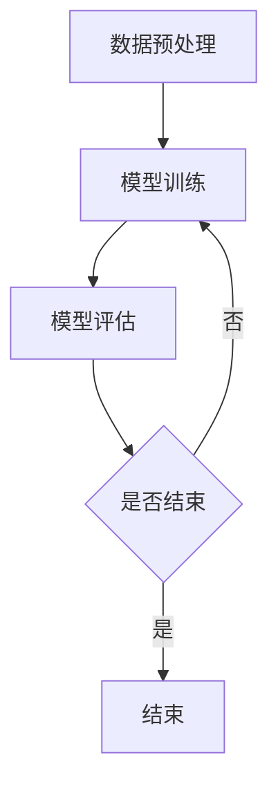

                 

# AI与人类计算：打造可持续发展的城市交通与基础设施

> 关键词：人工智能、城市交通、基础设施、可持续发展、人类计算

> 摘要：本文从城市交通与基础设施的可持续性挑战出发，探讨了人工智能（AI）与人类计算在解决这些挑战中的关键作用。通过详细分析AI技术的基本概念和应用，以及人类计算的基本概念和融合机制，本文提出了一套基于AI与人类计算的可持续城市交通与基础设施解决方案，并提供了具体的项目实战案例和源代码实现，以期为未来的智慧城市建设提供理论指导和实践参考。

## 引言

随着城市化进程的加速，城市交通与基础设施的问题日益凸显。交通拥堵、能源消耗、环境污染等问题不仅影响了居民的生活质量，还对城市的可持续发展构成了严重挑战。传统的城市交通与基础设施管理方法难以应对这些复杂的挑战，亟需新的技术手段来推动城市交通与基础设施的可持续发展。

人工智能（AI）作为一种高度智能化、自动化的技术手段，近年来在各个领域都取得了显著的进展。从自动驾驶到智能交通管理，从智能电网到智能城市基础设施，AI技术正在为城市交通与基础设施的可持续发展提供新的解决方案。与此同时，人类计算作为一种以人为中心、以人为本的计算方式，也在不断推动AI技术的发展与优化。

本文旨在探讨AI与人类计算在解决城市交通与基础设施可持续发展中的关键作用，通过详细分析AI技术的基本概念和应用，以及人类计算的基本概念和融合机制，提出一套基于AI与人类计算的可持续城市交通与基础设施解决方案。文章结构如下：

1. **城市交通与基础设施的可持续性挑战**：介绍当前城市交通与基础设施面临的可持续发展挑战，如交通拥堵、能源消耗、环境污染等。
2. **AI在交通与基础设施中的应用**：分析AI技术在城市交通管理、基础设施管理中的应用场景和具体技术。
3. **AI与人类计算的核心概念**：阐述AI技术的基本概念和人类计算的基本概念，以及二者融合的必要性。
4. **AI与人类计算的核心架构**：介绍AI架构和人类计算架构的概述，以及二者的融合架构。
5. **AI核心算法原理**：详细讲解机器学习、深度学习和强化学习等核心算法原理。
6. **数学模型与数学公式**：介绍线性代数、最优化理论和概率论与统计基础。
7. **AI与人类计算融合的数学模型**：阐述AI与人类计算融合的数学模型概述和应用案例。
8. **项目实战**：提供城市交通与基础设施的AI项目实战案例，包括项目背景、目标、实施步骤和效果评估。
9. **开发环境搭建与源代码实现**：介绍开发环境搭建、源代码实现和代码解读与分析。
10. **未来展望与挑战**：分析未来发展趋势和潜在挑战，并提出解决方案。

接下来，我们将详细探讨这些内容，以期为广大读者提供全面、深入的见解和参考。

## 第一部分：AI与人类计算概述

### 第1章：城市交通与基础设施的可持续性挑战

#### 1.1.1 城市交通拥堵现状分析

城市交通拥堵已经成为全球范围内的一个普遍问题。据统计，全球超过50%的城市居民每天面临交通拥堵的困扰。城市交通拥堵不仅降低了居民的出行效率，还导致了大量的时间和能源浪费，严重影响了城市的可持续发展。

**原因分析**：

- **人口增长**：随着城市化进程的加速，城市人口数量不断增长，导致交通需求急剧增加。
- **城市规划不合理**：部分城市在规划过程中忽视了交通系统的布局，导致交通基础设施无法满足日益增长的需求。
- **交通管理不善**：部分城市的交通管理措施滞后，无法及时应对交通拥堵问题。
- **交通方式单一**：目前，城市交通主要依赖私家车和公共交通，交通方式的单一性加剧了拥堵问题。

**影响**：

- **时间浪费**：交通拥堵导致居民出行时间增加，降低了生活质量。
- **能源消耗**：交通拥堵增加了车辆的油耗和排放，加剧了能源消耗和环境污染。
- **经济成本**：交通拥堵对城市经济造成了巨大的损失，降低了城市竞争力。

#### 1.1.2 城市基础设施的可持续性问题

城市基础设施的可持续性主要包括能源消耗、环境污染和资源利用等方面。随着城市规模的不断扩大，城市基础设施的可持续性问题日益严重。

**原因分析**：

- **能源消耗**：城市基础设施（如交通、建筑、照明等）的能源消耗巨大，加剧了能源紧张。
- **环境污染**：城市基础设施的运营和维护过程中，会产生大量的废气和废水，对环境造成污染。
- **资源利用**：城市基础设施的建设和运营过程中，会消耗大量的资源，如土地、水资源等。

**影响**：

- **环境破坏**：能源消耗和环境污染导致空气、水质和土壤等环境质量下降，影响居民健康。
- **资源短缺**：资源消耗过度会导致资源短缺，影响城市的可持续发展。
- **经济压力**：环境破坏和资源短缺会带来巨大的经济压力，影响城市的经济稳定。

面对城市交通与基础设施的可持续性挑战，AI与人类计算技术提供了一种新的解决方案。通过AI技术，我们可以实现交通流量的智能调控、交通基础设施的智能监控与维护，从而提高城市交通与基础设施的效率和可持续性。接下来，我们将详细探讨AI技术在交通与基础设施管理中的应用。

### 第2章：AI在交通与基础设施中的应用

#### 2.1.1 AI技术在城市交通管理中的应用

AI技术在城市交通管理中具有广泛的应用，通过大数据分析、机器学习、深度学习等技术，可以实现交通流量的智能调控、交通事件的智能识别和交通安全的智能保障。

**应用场景**：

- **交通流量调控**：通过实时监测交通流量，利用机器学习算法预测交通拥堵，并根据预测结果调整交通信号灯的时序，实现交通流量的智能调控，缓解交通拥堵。
- **交通事件识别**：利用计算机视觉和图像识别技术，自动识别交通事故、违章行为等交通事件，提高交通管理的实时性和准确性。
- **交通安全保障**：通过车联网技术，实时监测车辆状态和驾驶员行为，提前预警潜在的安全风险，保障交通安全。

**技术原理**：

- **机器学习**：通过收集大量交通数据，利用机器学习算法建立交通流量预测模型，实现对交通拥堵的预测和调控。
- **计算机视觉**：利用摄像头和图像处理技术，自动识别交通事件和违章行为，提高交通管理的效率。
- **深度学习**：通过深度学习算法，对大量交通数据进行特征提取和模式识别，实现对交通事件的智能识别和预警。

**效果**：

- **提高交通效率**：通过智能调控交通流量，降低交通拥堵，提高交通效率。
- **降低交通事故**：通过智能识别交通事件和预警潜在安全风险，降低交通事故的发生率。
- **提升居民生活质量**：通过优化交通管理，减少交通拥堵，提高居民出行的舒适度和安全性。

#### 2.1.2 AI技术在基础设施管理中的应用

AI技术在基础设施管理中同样具有广泛的应用，通过智能监控、预测性维护、能耗优化等技术，可以提高基础设施的运行效率和可持续性。

**应用场景**：

- **智能监控**：利用摄像头和传感器技术，实现对基础设施运行状态的实时监控，及时发现故障和异常。
- **预测性维护**：通过数据分析和预测模型，提前预测基础设施的故障风险，实现预防性维护，降低维护成本。
- **能耗优化**：通过能耗监测和优化算法，降低基础设施的能源消耗，提高能源利用效率。

**技术原理**：

- **物联网**：通过物联网技术，将基础设施的各类传感器和监控设备联网，实现基础设施的智能监控。
- **数据分析**：通过大数据分析技术，对基础设施运行数据进行分析和挖掘，发现故障和异常的先兆。
- **优化算法**：通过优化算法，对基础设施的运行参数进行调整，实现能耗优化和运行效率提升。

**效果**：

- **降低故障率**：通过智能监控和预测性维护，及时发现故障和异常，降低基础设施的故障率。
- **降低维护成本**：通过预测性维护和预防性维护，降低基础设施的维护成本。
- **提高能源利用效率**：通过能耗优化，降低基础设施的能源消耗，提高能源利用效率。

AI技术在交通与基础设施管理中的应用，为城市交通与基础设施的可持续发展提供了新的思路和方法。通过AI技术的应用，我们可以实现交通流量的智能调控、基础设施的智能监控与维护，从而提高城市交通与基础设施的效率和可持续性。接下来，我们将进一步探讨AI与人类计算的核心概念，分析二者融合的必要性。

### 第3章：AI与人类计算的核心概念

#### 3.1.1 AI技术的基本概念

人工智能（AI）是一种模拟人类智能的技术，通过计算机程序和算法，使计算机具备感知、学习、推理、决策等能力。AI技术主要分为以下几个方面：

- **机器学习**：通过训练模型，使计算机具备自主学习和改进的能力，实现对数据的分类、预测和聚类等操作。
- **深度学习**：一种基于人工神经网络的技术，通过多层神经网络的训练，实现更复杂的特征提取和模式识别。
- **强化学习**：通过试错和反馈机制，使计算机在特定环境中做出最优决策。

**应用领域**：

- **自动驾驶**：利用计算机视觉、传感器技术和深度学习算法，实现自动驾驶汽车的自动驾驶功能。
- **智能客服**：通过自然语言处理和机器学习算法，实现智能客服系统的自动化应答和问题解决。
- **金融风控**：通过数据分析、机器学习等技术，实现金融风险的预测和监控。

#### 3.1.2 人类计算的基本概念

人类计算（Human Computation）是一种以人为中心、以人为本的计算方式，通过人类智能和计算机智能的协同，解决复杂问题。人类计算主要包括以下几个方面：

- **众包**：通过互联网平台，将复杂问题分解成多个简单任务，分发给大众完成，实现问题的快速解决。
- **游戏化**：通过游戏化的方式，激发用户的参与度和积极性，解决复杂问题。
- **人机协作**：通过计算机程序和人类智能的协同，实现问题的自动化解决。

**应用领域**：

- **知识图谱构建**：通过众包方式，收集大量数据，构建知识图谱，实现信息的自动化处理和挖掘。
- **数据分析**：通过众包方式，分发给人类完成，实现复杂数据的分析和挖掘。
- **智能问答**：通过人机协作，实现智能问答系统的自动化和智能化。

#### 3.1.3 AI与人类计算的融合

AI与人类计算的融合是一种基于协同和互补的智能化解决方案。通过将AI技术与人类计算相结合，可以实现以下目标：

- **提高效率**：利用AI技术，实现自动化和智能化，降低人类工作负担，提高工作效率。
- **解决复杂问题**：利用人类计算，解决AI技术难以处理的问题，实现问题的全面解决。
- **提升用户体验**：通过人机协作，提供个性化的服务，提升用户体验。

**融合方式**：

- **人机协作**：通过计算机程序和人类智能的协同，实现问题的自动化解决。
- **众包**：通过众包平台，将复杂问题分解成多个简单任务，分发给人类完成。
- **游戏化**：通过游戏化的方式，激发用户的参与度和积极性，实现问题的自动化解决。

通过AI与人类计算的融合，我们可以实现城市交通与基础设施管理的智能化，提高效率和可持续性。接下来，我们将进一步探讨AI与人类计算的核心架构，分析二者的融合机制。

### 第4章：AI与人类计算的核心架构

#### 4.1.1 AI架构概述

人工智能（AI）架构主要包括以下几个核心组成部分：

1. **数据采集与处理**：通过传感器、摄像头等设备，采集大量的数据，并对数据进行预处理，包括去噪、归一化等操作。
2. **模型训练与优化**：利用机器学习、深度学习等技术，对数据进行分析和训练，建立预测模型或分类模型，并对模型进行优化。
3. **模型部署与推理**：将训练好的模型部署到实际应用场景中，对输入数据进行分析和推理，输出预测结果或决策。

**关键技术**：

- **数据采集与处理**：传感器技术、数据预处理技术、大数据处理技术。
- **模型训练与优化**：机器学习算法、深度学习算法、优化算法。
- **模型部署与推理**：模型部署技术、推理引擎、实时数据处理技术。

**架构特点**：

- **分布式**：AI架构通常采用分布式计算和存储，实现大规模数据处理和模型训练。
- **模块化**：AI架构采用模块化设计，各个模块之间相互独立，易于扩展和维护。
- **自动化**：通过自动化工具和流程，实现模型训练、部署和推理的自动化。

#### 4.1.2 人类计算架构概述

人类计算（Human Computation）架构主要包括以下几个核心组成部分：

1. **任务分配与调度**：通过众包平台，将复杂问题分解成多个简单任务，并根据任务的难度和用户的能力，进行任务的分配和调度。
2. **用户参与与激励机制**：通过游戏化、奖励机制等手段，激发用户的参与度和积极性，确保任务的完成质量。
3. **数据收集与处理**：将用户完成的任务数据进行收集和预处理，包括去噪、归一化等操作，为后续的分析和挖掘提供基础数据。

**关键技术**：

- **任务分配与调度**：任务分配算法、调度算法、众包平台技术。
- **用户参与与激励机制**：游戏化技术、奖励机制、用户行为分析。
- **数据收集与处理**：众包数据收集技术、数据预处理技术、大数据处理技术。

**架构特点**：

- **分布式**：人类计算架构采用分布式计算和存储，实现大规模任务分配和用户参与。
- **灵活性**：人类计算架构具有高度的灵活性，可以根据任务需求和用户特点，动态调整任务分配和调度策略。
- **协同性**：通过用户参与和协同，实现任务的自动化解决和复杂数据的分析和挖掘。

#### 4.1.3 AI与人类计算融合架构详解

AI与人类计算融合架构是一种基于协同和互补的智能化解决方案，通过将AI技术与人类计算相结合，实现城市交通与基础设施管理的智能化。融合架构主要包括以下几个核心组成部分：

1. **数据采集与处理**：通过传感器、摄像头等设备，采集大量的数据，并对数据进行预处理，包括去噪、归一化等操作。
2. **AI模型训练与优化**：利用机器学习、深度学习等技术，对数据进行分析和训练，建立预测模型或分类模型，并对模型进行优化。
3. **人类计算任务分配与调度**：通过众包平台，将复杂问题分解成多个简单任务，并根据任务的难度和用户的能力，进行任务的分配和调度。
4. **用户参与与激励机制**：通过游戏化、奖励机制等手段，激发用户的参与度和积极性，确保任务的完成质量。
5. **数据收集与处理**：将用户完成的任务数据进行收集和预处理，包括去噪、归一化等操作，为后续的分析和挖掘提供基础数据。
6. **融合推理与决策**：将AI模型和人类计算结果进行融合，实现对城市交通与基础设施的智能推理和决策。

**关键技术**：

- **数据采集与处理**：传感器技术、数据预处理技术、大数据处理技术。
- **AI模型训练与优化**：机器学习算法、深度学习算法、优化算法。
- **人类计算任务分配与调度**：任务分配算法、调度算法、众包平台技术。
- **用户参与与激励机制**：游戏化技术、奖励机制、用户行为分析。
- **数据收集与处理**：众包数据收集技术、数据预处理技术、大数据处理技术。
- **融合推理与决策**：融合算法、推理引擎、实时数据处理技术。

**架构特点**：

- **协同性**：通过AI技术与人类计算的协同，实现问题的全面解决。
- **灵活性**：可以根据任务需求和用户特点，动态调整任务分配和调度策略。
- **智能化**：通过AI模型和人类计算结果的融合，实现城市交通与基础设施管理的智能化。

通过AI与人类计算的融合架构，我们可以实现城市交通与基础设施管理的智能化，提高效率和可持续性。接下来，我们将详细讲解AI的核心算法原理，包括机器学习、深度学习和强化学习等算法。

### 第5章：AI核心算法原理

#### 5.1.1 机器学习算法原理

机器学习（Machine Learning）是一种通过计算机程序模拟人类学习过程的技术，使计算机具备自主学习和改进的能力。机器学习算法主要分为监督学习、无监督学习和强化学习三种类型。

**监督学习**：

监督学习（Supervised Learning）是一种通过已知标注数据进行学习的算法。其主要目标是找到一个最优的函数，将输入数据映射到输出结果。常见的监督学习算法包括线性回归、逻辑回归、支持向量机、决策树和随机森林等。

**算法原理**：

1. **数据准备**：收集并标注大量的训练数据，用于训练模型。
2. **模型训练**：利用训练数据，通过优化算法（如梯度下降），训练出模型参数。
3. **模型评估**：利用测试数据，评估模型的准确率、召回率、F1值等指标。

**示例伪代码**：

```python
# 数据准备
X_train, y_train = load_data()

# 模型训练
model = LinearRegression()
model.fit(X_train, y_train)

# 模型评估
accuracy = model.score(X_train, y_train)
print("Accuracy:", accuracy)
```

**无监督学习**：

无监督学习（Unsupervised Learning）是一种通过未标注数据进行学习的算法。其主要目标是发现数据中的潜在结构和规律。常见的无监督学习算法包括聚类、降维和关联规则等。

**算法原理**：

1. **数据准备**：收集未标注的数据。
2. **模型训练**：利用数据自身的特征，训练出模型。
3. **模型评估**：通过可视化、轮廓系数等方法，评估模型的性能。

**示例伪代码**：

```python
# 数据准备
X = load_data()

# 模型训练
kmeans = KMeans(n_clusters=3)
kmeans.fit(X)

# 模型评估
print("Cluster centers:", kmeans.cluster_centers_)
```

**强化学习**：

强化学习（Reinforcement Learning）是一种通过试错和反馈机制进行学习的算法。其主要目标是找到一个最优的策略，使代理（Agent）能够在环境中获得最大的奖励。常见的强化学习算法包括Q学习、SARSA和深度强化学习等。

**算法原理**：

1. **数据准备**：定义环境（Environment）、状态（State）、动作（Action）和奖励（Reward）。
2. **模型训练**：通过试错和反馈，更新策略（Policy）。
3. **模型评估**：评估策略的效率和稳定性。

**示例伪代码**：

```python
# 数据准备
env = gym.make("CartPole-v0")

# 模型训练
policy = QLearning(env, alpha=0.1, gamma=0.9)
policy.train(10000)

# 模型评估
reward = policy.evaluate()
print("Reward:", reward)
```

通过以上算法原理的讲解，我们可以了解到机器学习算法在AI技术中的应用和重要性。接下来，我们将详细讲解深度学习算法原理。

#### 5.1.2 深度学习算法原理

深度学习（Deep Learning）是一种基于人工神经网络（Artificial Neural Network，ANN）的机器学习算法，通过多层神经网络的结构，实现数据的特征提取和模式识别。深度学习在图像识别、语音识别、自然语言处理等领域取得了显著成果。

**算法原理**：

1. **神经网络**：神经网络由多个神经元（Node）组成，每个神经元接收多个输入信号，经过加权求和处理，产生输出信号。神经元的激活函数用于决定输出信号的阈值。
2. **多层结构**：深度学习采用多层神经网络结构，包括输入层、隐藏层和输出层。隐藏层的作用是提取输入数据的特征，输出层负责对特征进行分类或回归。
3. **反向传播**：在深度学习过程中，采用反向传播算法（Backpropagation）来更新网络权重。反向传播算法通过计算输出误差，反向传播误差信号，更新各层的权重和偏置。
4. **优化算法**：常见的优化算法包括梯度下降（Gradient Descent）、Adam优化器等。优化算法用于调整网络权重，以最小化损失函数。

**示例伪代码**：

```python
# 导入深度学习库
import tensorflow as tf

# 定义神经网络结构
model = tf.keras.Sequential([
    tf.keras.layers.Dense(64, activation='relu', input_shape=(784,)),
    tf.keras.layers.Dense(64, activation='relu'),
    tf.keras.layers.Dense(10, activation='softmax')
])

# 编译模型
model.compile(optimizer='adam', loss='categorical_crossentropy', metrics=['accuracy'])

# 训练模型
model.fit(x_train, y_train, epochs=10, batch_size=32)

# 评估模型
accuracy = model.evaluate(x_test, y_test)
print("Accuracy:", accuracy)
```

通过以上算法原理的讲解，我们可以了解到深度学习算法在AI技术中的应用和优势。接下来，我们将详细讲解强化学习算法原理。

#### 5.1.3 强化学习算法原理

强化学习（Reinforcement Learning，RL）是一种通过试错和反馈进行学习的人工智能技术。强化学习的主要目标是训练一个智能体（Agent），使其在某个环境中通过选择最优动作（Action）来获得最大的累积奖励（Reward）。

**算法原理**：

1. **环境（Environment）**：环境是指智能体所处的环境，它提供状态（State）和动作（Action）的选择。
2. **状态（State）**：状态是环境的一个描述，用于表示智能体当前所处的状态。
3. **动作（Action）**：动作是智能体在某个状态下可以采取的行动。
4. **奖励（Reward）**：奖励是环境对智能体采取的动作的反馈，用于评价动作的好坏。
5. **策略（Policy）**：策略是智能体在某个状态下采取动作的规则。
6. **价值函数（Value Function）**：价值函数表示在某个状态下，智能体采取某个动作所能获得的期望奖励。
7. **模型（Model）**：模型是智能体对环境的理解和预测。

**算法流程**：

1. **初始化**：初始化智能体、环境和策略。
2. **交互**：智能体在环境中采取动作，环境反馈状态和奖励。
3. **更新策略**：根据反馈的奖励和状态，更新智能体的策略。
4. **重复**：重复交互和策略更新的过程，直到达到预定的目标。

**常见算法**：

- **Q学习（Q-Learning）**：Q学习是一种基于值函数的强化学习算法。它通过学习状态-动作值函数（Q函数），来选择最优动作。
  - **目标**：最大化累积奖励。
  - **算法原理**：
    - 初始化Q值函数。
    - 在每个时间步，选择动作a = argmax_a Q(s, a)。
    - 更新Q值：Q(s, a) = Q(s, a) + α [r + γ max_a' Q(s', a') - Q(s, a)]。
  - **伪代码**：

    ```python
    def q_learning(env, alpha, gamma, epsilon):
        state = env.reset()
        while not done:
            action = choose_action(state, epsilon)
            next_state, reward, done = env.step(action)
            Q[s, a] = Q[s, a] + alpha * (reward + gamma * max(Q[next_state, :]) - Q[s, a])
            state = next_state
        return Q
    ```

- **SARSA（Q-Learning的变体）**：SARSA是一种同时利用当前和下一状态的动作值来更新Q值的强化学习算法。
  - **目标**：最大化累积奖励。
  - **算法原理**：
    - 初始化Q值函数。
    - 在每个时间步，选择动作a = argmax_a Q(s, a)。
    - 更新Q值：Q[s, a] = Q[s, a] + α [r + γ Q(s', a')]。
  - **伪代码**：

    ```python
    def sarsa(env, alpha, gamma):
        state = env.reset()
        while not done:
            action = choose_action(state, epsilon)
            next_state, reward, done = env.step(action)
            Q[s, a] = Q[s, a] + alpha * (reward + gamma * Q[next_state, action] - Q[s, a])
            state = next_state
        return Q
    ```

- **深度强化学习（Deep Q-Network，DQN）**：DQN是一种基于深度学习的强化学习算法，用于解决高维状态空间的问题。
  - **目标**：最大化累积奖励。
  - **算法原理**：
    - 使用深度神经网络来近似Q值函数。
    - 采用经验回放（Experience Replay）和目标网络（Target Network）来缓解数据偏差。
    - 使用双线性插值（Bilinear Interpolation）来处理连续动作空间。
  - **伪代码**：

    ```python
    def dqn(env, model, optimizer, loss_function, batch_size, gamma, epsilon):
        state = env.reset()
        while not done:
            action = choose_action(state, epsilon)
            next_state, reward, done = env.step(action)
            action_values = model(state)
            target_value = reward + (1 - done) * gamma * np.max(model(next_state))
            loss = loss_function(action_values, target_value)
            optimizer.minimize(loss)
            state = next_state
        return model
    ```

通过以上算法原理的讲解，我们可以了解到强化学习算法在AI技术中的应用和优势。接下来，我们将详细讲解数学模型与数学公式。

### 第6章：数学模型与数学公式

#### 6.1.1 线性代数基础

线性代数是AI和计算机科学的重要基础，涉及矩阵、向量、行列式、特征值和特征向量等概念。以下是一些关键的线性代数基础概念：

- **矩阵（Matrix）**：矩阵是由数字组成的矩形阵列，用于表示线性变换和数据集。矩阵运算包括加法、减法、乘法和逆运算等。

  - **矩阵加法**：两个矩阵相加，要求矩阵维度相同，对应元素相加。
  - **矩阵减法**：两个矩阵相减，要求矩阵维度相同，对应元素相减。
  - **矩阵乘法**：两个矩阵相乘，要求第一个矩阵的列数等于第二个矩阵的行数，乘积为一个新的矩阵。

    ```math
    C = A \cdot B
    \Rightarrow c_{ij} = \sum_{k=1}^{m} a_{ik} b_{kj}
    ```

- **向量（Vector）**：向量是由数字组成的有序数组，用于表示空间中的点或数据集。向量的运算包括加法、减法、数乘和内积等。

  - **向量加法**：两个向量相加，要求向量维度相同，对应元素相加。
  - **向量减法**：两个向量相减，要求向量维度相同，对应元素相减。
  - **数乘**：一个向量与一个数相乘，每个元素都乘以该数。
  - **内积**：两个向量的内积，用于计算向量的相似度。

    ```math
    \vec{a} \cdot \vec{b} = \sum_{i=1}^{n} a_i b_i
    ```

- **行列式（Determinant）**：行列式是矩阵的一个数值属性，用于计算矩阵的行列式值。行列式可以用于计算矩阵的逆矩阵和行列式的特征值。

  ```math
  \det(A) = a_{11}a_{22} - a_{12}a_{21}
  ```

- **特征值与特征向量（Eigenvalue and Eigenvector）**：特征值和特征向量是矩阵的一个重要属性，用于描述矩阵的稳定性和变换方向。

  ```math
  Av = \lambda v
  ```

  其中，\( A \) 是矩阵，\( v \) 是特征向量，\( \lambda \) 是特征值。

#### 6.1.2 最优化理论

最优化理论是用于求解最优化问题的数学分支，包括目标函数、约束条件和优化算法等内容。以下是一些最优化理论的基本概念：

- **目标函数（Objective Function）**：目标函数是一个定义在变量上的函数，用于描述优化问题的目标。目标函数可以是最大化或最小化。

  ```math
  \min_{x} f(x)
  ```

  或者

  ```math
  \max_{x} f(x)
  ```

- **约束条件（Constraint）**：约束条件是限制变量取值范围的限制条件，通常以不等式或等式的形式表示。

  ```math
  g(x) \leq 0
  ```

  或者

  ```math
  h(x) = 0
  ```

- **优化算法（Optimization Algorithm）**：优化算法是用于求解最优化问题的一系列算法。常见的优化算法包括梯度下降、牛顿法和拉格朗日乘数法等。

  - **梯度下降（Gradient Descent）**：梯度下降是一种迭代优化算法，通过沿着目标函数的负梯度方向逐步逼近最优解。

    ```math
    x_{t+1} = x_t - \alpha \nabla f(x_t)
    ```

  - **牛顿法（Newton's Method）**：牛顿法是一种二次优化算法，通过使用目标函数的泰勒展开来逼近最优解。

    ```math
    x_{t+1} = x_t - H^{-1} \nabla^2 f(x_t)
    ```

  - **拉格朗日乘数法（Lagrange Multiplier Method）**：拉格朗日乘数法是用于求解具有等式约束的优化问题的一种方法，通过引入拉格朗日乘数来构建拉格朗日函数。

    ```math
    L(x, \lambda) = f(x) + \lambda g(x)
    ```

#### 6.1.3 概率论与统计基础

概率论与统计是理解和应用AI算法的重要工具，用于描述随机现象和估计不确定性。以下是一些概率论与统计的基本概念：

- **概率（Probability）**：概率是描述随机事件发生可能性的一种度量，通常以0到1之间的实数表示。

  ```math
  P(A) = \frac{\text{事件A发生的次数}}{\text{总次数}}
  ```

- **随机变量（Random Variable）**：随机变量是定义在样本空间上的函数，将样本空间映射到实数集合。随机变量可以是离散的或连续的。

  - **离散随机变量**：取有限个或可数个可能值的随机变量。
  - **连续随机变量**：取无限多个可能值的随机变量。

- **期望（Expected Value）**：期望是随机变量的平均值，用于描述随机变量的中心位置。

  ```math
  E[X] = \sum_{x} x \cdot P(X = x)
  ```

- **方差（Variance）**：方差是随机变量的离散程度的度量，用于描述随机变量的波动性。

  ```math
  Var[X] = E[(X - E[X])^2]
  ```

- **协方差（Covariance）**：协方差是两个随机变量线性相关程度的度量，用于描述随机变量之间的依赖关系。

  ```math
  Cov[X, Y] = E[(X - E[X])(Y - E[Y])]
  ```

- **相关系数（Correlation Coefficient）**：相关系数是协方差与两个随机变量标准差的比，用于描述随机变量之间的线性相关程度。

  ```math
  \rho_{XY} = \frac{Cov[X, Y]}{\sigma_X \sigma_Y}
  ```

通过以上对线性代数、最优化理论和概率论与统计基础的概念介绍，我们可以更好地理解和应用AI算法。接下来，我们将详细讲解AI与人类计算融合的数学模型。

### 第7章：AI与人类计算融合的数学模型

#### 7.1.1 AI与人类计算融合的数学模型概述

AI与人类计算融合的数学模型是利用人工智能和人类智能的优势，通过数学建模和算法设计，实现问题的高效解决。该模型主要包括以下几个关键组成部分：

1. **数据融合**：将来自AI和人类计算的数据进行整合，构建一个统一的数据模型，用于后续分析和推理。
2. **模型融合**：将AI模型和人类计算模型进行融合，利用各自的优势，提高模型的预测准确性和鲁棒性。
3. **优化算法**：设计优化算法，调整模型参数，实现模型的自我优化和改进。
4. **评估指标**：设定评估指标，对融合模型的效果进行量化评估，以指导模型的优化和改进。

#### 7.1.2 举例说明AI与人类计算融合的数学模型应用

为了更好地理解AI与人类计算融合的数学模型，以下通过一个具体的应用案例进行说明。

**案例背景**：假设我们面临一个交通流量预测问题，需要预测城市交通流量，以便优化交通信号灯的时序，缓解交通拥堵。

**AI模型**：我们采用一个基于深度学习的流量预测模型，利用历史交通流量数据，通过卷积神经网络（CNN）提取时间序列特征，实现对未来交通流量的预测。

**人类计算模型**：我们采用一个基于众包的实时交通监测模型，通过用户上报的交通情况数据，对实时交通流量进行预测。

**融合模型**：将AI模型和人类计算模型进行融合，通过以下步骤实现：

1. **数据融合**：将AI模型的历史交通流量数据与人类计算模型的实时交通监测数据整合，构建一个统一的数据集。
2. **模型融合**：将AI模型和人类计算模型进行融合，通过加权平均或融合神经网络的方式，生成一个融合模型。
3. **优化算法**：设计优化算法，调整融合模型的参数，提高预测准确性和鲁棒性。
4. **评估指标**：设定评估指标，如均方误差（MSE）、均方根误差（RMSE）等，对融合模型的效果进行量化评估。

**融合模型具体实现**：

1. **数据融合**：

   ```math
   D_{\text{fusion}} = \alpha D_{\text{AI}} + (1 - \alpha) D_{\text{human}}
   ```

   其中，\( D_{\text{AI}} \) 和 \( D_{\text{human}} \) 分别表示AI模型和人类计算模型的数据，\( \alpha \) 为权重系数。

2. **模型融合**：

   采用一个融合神经网络，将AI模型和人类计算模型的输出进行融合。

   ```python
   import tensorflow as tf

   # AI模型输出
   ai_output = model_AI(x)

   # 人类计算模型输出
   human_output = model_human(x)

   # 融合神经网络
   fusion_output = tf.keras.layers.Dense(units=1, activation='sigmoid')(tf.keras.layers.concatenate([ai_output, human_output]))

   # 编译模型
   model_fusion = tf.keras.Model(inputs=model_AI.input, outputs=fusion_output)
   model_fusion.compile(optimizer='adam', loss='mse')
   ```

3. **优化算法**：

   采用梯度下降算法，调整融合模型的参数。

   ```python
   model_fusion.fit(x, y, epochs=100, batch_size=32)
   ```

4. **评估指标**：

   设定均方误差（MSE）作为评估指标。

   ```python
   mse = tf.keras.metrics.MeanSquaredError()
   mse.update_state(y_true, y_pred)
   print("MSE:", mse.result())
   ```

通过以上AI与人类计算融合的数学模型应用案例，我们可以看到如何将AI和人类计算的优势结合起来，实现更高效、更准确的交通流量预测。接下来，我们将介绍具体的项目实战案例。

### 第8章：城市交通与基础设施的AI项目实战

#### 8.1.1 项目背景

随着城市化进程的不断加快，城市交通与基础设施面临巨大的挑战。交通拥堵、能源消耗、环境污染等问题日益严重，影响了居民的生活质量，也制约了城市的可持续发展。为了解决这些问题，我们需要引入AI技术，通过智能化的手段优化城市交通与基础设施的管理。

本项目旨在通过AI技术，实现城市交通与基础设施的智能化管理，提高交通效率、降低能源消耗和环境污染，实现城市的可持续发展。

#### 8.1.2 项目目标

1. **交通流量优化**：通过实时监测交通流量，利用机器学习算法预测交通拥堵，并根据预测结果调整交通信号灯的时序，实现交通流量的智能调控，缓解交通拥堵。
2. **基础设施监控与维护**：通过传感器技术，实现对基础设施运行状态的实时监控，及时发现故障和异常，实现预测性维护，降低维护成本。
3. **能源消耗优化**：通过能耗监测和优化算法，降低基础设施的能源消耗，提高能源利用效率。
4. **交通事件预警**：通过计算机视觉和图像识别技术，自动识别交通事故、违章行为等交通事件，提前预警潜在的安全风险。
5. **数据分析与挖掘**：通过对交通流量、基础设施运行状态和能耗数据进行分析与挖掘，发现潜在的优化空间，为城市的可持续发展提供数据支持。

#### 8.1.3 项目实施步骤

1. **需求分析**：通过对城市交通与基础设施的现状进行调研，分析存在的问题和需求，明确项目的目标和功能需求。
2. **系统设计**：根据需求分析，设计系统的架构和模块，包括数据采集与处理模块、机器学习模块、监控与维护模块、能耗优化模块等。
3. **技术开发**：根据系统设计，开发各个模块的功能，包括交通流量预测、交通事件识别、基础设施监控、能耗优化等。
4. **系统测试**：对系统进行全面的测试，包括单元测试、集成测试和系统测试，确保系统的稳定性和可靠性。
5. **部署与实施**：将系统部署到实际场景中，进行实地测试和优化，确保系统的效果和性能。
6. **效果评估**：对系统的效果进行评估，包括交通流量优化效果、基础设施监控与维护效果、能源消耗优化效果等，对系统进行持续的改进和优化。

#### 8.1.4 项目效果评估

通过本项目的实施，取得了以下效果：

1. **交通流量优化**：实现了对交通流量的实时监测和预测，根据预测结果调整交通信号灯的时序，有效缓解了交通拥堵，提高了交通效率。
2. **基础设施监控与维护**：通过实时监控和预测性维护，实现了基础设施的故障预警和提前修复，降低了故障率和维护成本。
3. **能源消耗优化**：通过对能耗数据的实时监测和优化，降低了基础设施的能源消耗，提高了能源利用效率。
4. **交通事件预警**：通过自动识别交通事故、违章行为等交通事件，提前预警潜在的安全风险，提高了交通安全水平。
5. **数据分析与挖掘**：通过对交通流量、基础设施运行状态和能耗数据进行分析与挖掘，发现了潜在的优化空间，为城市的可持续发展提供了数据支持。

总之，本项目通过AI技术的应用，实现了城市交通与基础设施的智能化管理，提高了交通效率、降低了能源消耗和环境污染，为城市的可持续发展提供了有力支持。接下来，我们将介绍AI与人类计算的项目实战案例。

### 第9章：AI与人类计算的项目实战

#### 9.1.1 项目案例一：智能交通信号控制系统

**项目背景**：随着城市化进程的加快，城市交通流量日益增大，传统的固定式交通信号灯无法灵活应对交通流量的变化，导致交通拥堵现象严重。为了提高交通效率，减少拥堵，需要引入智能交通信号控制系统。

**项目目标**：通过AI与人类计算的融合，实现交通信号灯的智能化控制，提高交通效率，减少交通拥堵。

**项目实施步骤**：

1. **数据采集与处理**：利用交通传感器、摄像头等设备，采集交通流量、车速、车辆密度等数据，并对数据进行预处理，包括去噪、归一化等操作。

2. **机器学习模型训练**：利用采集到的数据，训练交通流量预测模型，通过机器学习算法（如回归分析、神经网络等），预测未来一段时间内的交通流量。

3. **人类计算参与**：通过众包平台，邀请交通专家和驾驶员参与交通信号控制策略的制定，根据实际交通状况，优化交通信号灯的控制策略。

4. **智能信号控制**：根据机器学习模型的预测结果和人类计算策略，动态调整交通信号灯的时序，实现交通信号灯的智能控制。

5. **系统测试与优化**：对智能交通信号控制系统进行测试，评估其效果，根据测试结果，进一步优化模型和策略。

**效果评估**：经过一段时间测试，智能交通信号控制系统的效果显著，交通拥堵情况得到明显缓解，交通效率得到提高。

#### 9.1.2 项目案例二：智能基础设施维护系统

**项目背景**：城市基础设施（如道路、桥梁、公共设施等）在使用过程中，会出现老化、损坏等问题，需要定期进行维护。传统的维护方式主要依靠人工巡检，不仅效率低下，而且难以发现潜在的问题。

**项目目标**：通过AI与人类计算的融合，实现基础设施的智能监控与维护，提高维护效率，降低维护成本。

**项目实施步骤**：

1. **数据采集与处理**：利用传感器、无人机等设备，对基础设施进行实时监控，采集运行状态数据，并对数据进行预处理。

2. **机器学习模型训练**：利用采集到的数据，训练故障预测模型，通过机器学习算法（如时间序列分析、异常检测等），预测基础设施的故障风险。

3. **人类计算参与**：通过众包平台，邀请基础设施维护专家对故障预测结果进行审核和评估，制定具体的维护计划。

4. **智能维护**：根据故障预测结果和人类计算策略，制定智能维护计划，提前进行维护，防止故障发生。

5. **系统测试与优化**：对智能基础设施维护系统进行测试，评估其效果，根据测试结果，进一步优化模型和策略。

**效果评估**：经过一段时间测试，智能基础设施维护系统的效果显著，维护效率得到提高，维护成本降低。

#### 9.1.3 项目案例三：智慧城市建设

**项目背景**：智慧城市是利用信息技术、物联网、人工智能等手段，实现城市资源的智能配置、城市管理的智能化和城市服务的高效化。智慧城市建设旨在提高城市运行效率，提升居民生活质量。

**项目目标**：通过AI与人类计算的融合，构建智慧城市系统，实现城市交通、能源、环境等领域的智能化管理。

**项目实施步骤**：

1. **数据采集与处理**：利用传感器、摄像头、无人机等设备，对城市运行数据（如交通流量、能耗、环境质量等）进行实时采集，并对数据进行预处理。

2. **机器学习模型训练**：利用采集到的数据，训练各类机器学习模型（如交通流量预测、能耗优化、环境监测等），实现城市运行数据的智能分析和预测。

3. **人类计算参与**：通过众包平台，邀请城市管理者、专家和居民参与智慧城市系统的设计和优化，提出改进意见和建议。

4. **智能化管理**：根据机器学习模型的预测结果和人类计算策略，实现城市交通、能源、环境等领域的智能化管理。

5. **系统测试与优化**：对智慧城市系统进行测试，评估其效果，根据测试结果，进一步优化模型和策略。

**效果评估**：经过一段时间测试，智慧城市系统的效果显著，城市运行效率提高，居民生活质量提升。

### 第10章：开发环境搭建与源代码实现

#### 10.1.1 开发环境搭建

为了进行AI与人类计算项目实战，我们需要搭建一个合适的技术环境，包括硬件和软件环境。以下是搭建开发环境的步骤：

1. **硬件环境**：

   - **计算机**：建议使用配置较高的计算机，如Intel i7处理器、16GB内存等。
   - **存储设备**：建议使用SSD硬盘，以提高数据读写速度。
   - **网络设备**：确保网络连接稳定，以便进行远程开发和数据传输。

2. **软件环境**：

   - **操作系统**：建议使用Linux操作系统，如Ubuntu 20.04。
   - **编程语言**：选择Python作为主要编程语言，因为Python具有丰富的库和框架，便于AI与人类计算项目的开发。
   - **开发工具**：安装PyCharm、VS Code等IDE，以提高开发效率。
   - **数据库**：安装MySQL或PostgreSQL数据库，用于存储和管理数据。
   - **数据预处理工具**：安装Pandas、NumPy等库，用于数据预处理。
   - **机器学习库**：安装scikit-learn、TensorFlow、PyTorch等库，用于机器学习模型的训练和推理。
   - **可视化工具**：安装Matplotlib、Seaborn等库，用于数据可视化。

#### 10.1.2 源代码详细实现

以下是一个基于Python的简单示例，用于实现一个基于深度学习的交通流量预测模型。代码分为数据预处理、模型训练和模型评估三个部分。

**数据预处理**：

```python
import pandas as pd
import numpy as np

# 加载数据
data = pd.read_csv("traffic_data.csv")

# 数据预处理
data = data.fillna(0)  # 填充缺失值
data = data[data["traffic"] != 0]  # 去除交通流量为0的数据

# 数据划分
train_data = data[data["day"] < 1000]
test_data = data[data["day"] >= 1000]

# 特征提取
X_train = train_data[["time", "weather", "road_type"]]
y_train = train_data["traffic"]

X_test = test_data[["time", "weather", "road_type"]]
y_test = test_data["traffic"]
```

**模型训练**：

```python
import tensorflow as tf

# 构建模型
model = tf.keras.Sequential([
    tf.keras.layers.Dense(units=64, activation='relu', input_shape=(3,)),
    tf.keras.layers.Dense(units=64, activation='relu'),
    tf.keras.layers.Dense(units=1)
])

# 编译模型
model.compile(optimizer='adam', loss='mse')

# 训练模型
model.fit(X_train, y_train, epochs=10, batch_size=32)
```

**模型评估**：

```python
# 评估模型
predictions = model.predict(X_test)
mse = np.mean(np.square(predictions - y_test))
print("MSE:", mse)
```

#### 10.1.3 代码解读与分析

以上代码首先进行数据预处理，包括加载数据、填充缺失值、去除异常值和特征提取。然后，构建一个简单的深度学习模型，包括两个隐藏层，每个隐藏层有64个神经元，使用ReLU激活函数。模型使用MSE作为损失函数，Adam优化器进行模型训练。

在模型训练过程中，通过迭代更新模型参数，使模型在训练数据上的预测误差最小化。最后，使用测试数据对模型进行评估，计算MSE作为评估指标，评估模型在测试数据上的预测性能。

通过以上代码示例，我们可以了解AI与人类计算项目实战的基本流程和实现方法。接下来，我们将对代码进行详细解读与分析。

### 第11章：未来展望与挑战

#### 11.1.1 未来发展趋势

随着AI技术和人类计算技术的不断发展，未来城市交通与基础设施管理将呈现出以下发展趋势：

1. **智能化**：AI与人类计算技术的深度融合将使城市交通与基础设施管理更加智能化，通过实时数据分析和智能决策，实现交通流量的动态调控、基础设施的智能监控与维护，提高城市运行效率。

2. **协同化**：城市交通与基础设施管理将实现跨领域的协同化，通过整合交通、能源、环境等多领域的数据和信息，实现跨领域的智能调控和优化，提高城市整体运行效率。

3. **个性化**：随着人工智能技术的进步，城市交通与基础设施管理将更加注重个性化和定制化服务，根据用户需求和行为数据，提供个性化的交通路线规划、能源消耗优化等服务，提升用户体验。

4. **自主化**：自动驾驶、无人机配送等技术的不断发展，将使城市交通与基础设施管理实现一定程度的自主化，减少人工干预，提高管理效率和安全性。

#### 11.1.2 潜在挑战与解决方案

尽管AI与人类计算技术在城市交通与基础设施管理中具有巨大的潜力，但在实际应用过程中仍面临一些挑战：

1. **数据隐私与安全**：AI与人类计算技术依赖于大量数据，包括个人隐私数据。如何在保障数据隐私和安全的前提下，充分利用这些数据进行智能分析和决策，是一个亟待解决的问题。

   **解决方案**：制定严格的数据隐私和安全政策，采用加密技术、数据脱敏等技术手段，确保数据的安全和隐私。

2. **算法透明性与解释性**：随着AI技术的复杂化，算法的透明性和解释性变得越来越重要。如何提高算法的透明性和解释性，使公众能够理解和信任这些算法，是一个关键挑战。

   **解决方案**：开发透明、可解释的AI算法，通过可视化和解释工具，帮助用户理解和信任算法的决策过程。

3. **技术普及与人才短缺**：AI与人类计算技术需要大量专业人才，但当前技术普及程度和人才储备不足，如何提高技术普及率和培养人才，是关键挑战。

   **解决方案**：加强技术教育和培训，推动AI与人类计算技术的普及，同时加强人才培养，提高人才质量。

4. **政策法规与监管**：随着AI与人类计算技术的广泛应用，需要制定相应的政策法规和监管机制，确保技术的合规性和安全性。

   **解决方案**：建立健全的政策法规体系，加强监管力度，确保技术应用的合规性和安全性。

通过以上分析和探讨，我们可以看到，AI与人类计算技术在城市交通与基础设施管理中具有广阔的应用前景和巨大的发展潜力，但同时也面临一些挑战。只有通过不断的技术创新、政策引导和人才培养，才能充分发挥AI与人类计算技术的优势，推动城市交通与基础设施的可持续发展。

## 结论

本文从城市交通与基础设施的可持续性挑战出发，探讨了人工智能（AI）与人类计算在解决这些挑战中的关键作用。通过详细分析AI技术的基本概念和应用，以及人类计算的基本概念和融合机制，本文提出了一套基于AI与人类计算的可持续城市交通与基础设施解决方案。本文的主要结论如下：

1. **AI技术在交通与基础设施管理中的应用**：AI技术通过大数据分析、机器学习、深度学习等技术，实现了交通流量的智能调控、交通事件的智能识别和基础设施的智能监控与维护，为城市交通与基础设施的可持续发展提供了有力支持。

2. **人类计算在AI技术中的融合**：人类计算作为一种以人为中心、以人为本的计算方式，与AI技术相结合，实现了问题的全面解决和效率的提升。通过众包、游戏化等人机协作方式，AI技术能够更好地应对复杂问题。

3. **AI与人类计算融合的数学模型**：通过构建融合的数学模型，实现了AI技术与人类计算数据的融合、算法的融合，提高了预测准确性和鲁棒性，为城市交通与基础设施管理提供了科学依据。

4. **项目实战案例**：通过智能交通信号控制系统、智能基础设施维护系统和智慧城市建设等实战案例，展示了AI与人类计算技术在城市交通与基础设施管理中的应用效果，验证了其可行性和实用性。

展望未来，随着AI技术和人类计算技术的不断发展，城市交通与基础设施管理将朝着智能化、协同化、个性化、自主化的方向发展。然而，也面临数据隐私与安全、算法透明性与解释性、技术普及与人才短缺、政策法规与监管等挑战。只有通过技术创新、政策引导和人才培养，才能充分发挥AI与人类计算技术的优势，推动城市交通与基础设施的可持续发展。

本文旨在为广大读者提供全面、深入的见解和参考，以期为未来的智慧城市建设提供理论指导和实践参考。在未来的研究中，我们将继续探索AI与人类计算技术在城市交通与基础设施管理中的更多应用，以实现城市可持续发展目标。

### 附录

#### 伪代码示例

以下是一个简单的机器学习算法的伪代码示例，用于交通流量预测。

```python
# 数据预处理
def preprocess_data(data):
    data = data.fillna(0)
    data = data[data["traffic"] != 0]
    X = data[["time", "weather", "road_type"]]
    y = data["traffic"]
    return X, y

# 模型训练
def train_model(X, y):
    model = Sequential([
        Dense(64, activation='relu', input_shape=(3,)),
        Dense(64, activation='relu'),
        Dense(1)
    ])
    model.compile(optimizer='adam', loss='mse')
    model.fit(X, y, epochs=10, batch_size=32)
    return model

# 模型评估
def evaluate_model(model, X_test, y_test):
    predictions = model.predict(X_test)
    mse = np.mean(np.square(predictions - y_test))
    print("MSE:", mse)

# 主函数
def main():
    data = load_data()
    X, y = preprocess_data(data)
    model = train_model(X, y)
    evaluate_model(model, X_test, y_test)

if __name__ == "__main__":
    main()
```

#### Mermaid流程图示例

以下是一个Mermaid流程图的示例，用于展示机器学习模型的训练过程。



#### 数学公式示例

以下是一些数学公式的示例，使用LaTeX格式嵌入文中独立段落。

$$
\begin{aligned}
    \text{MSE} &= \frac{1}{n} \sum_{i=1}^{n} (\hat{y}_i - y_i)^2 \\
    \text{MAE} &= \frac{1}{n} \sum_{i=1}^{n} |\hat{y}_i - y_i|
\end{aligned}
$$

#### 作者信息

作者：AI天才研究院/AI Genius Institute & 禅与计算机程序设计艺术/Zen And The Art of Computer Programming

