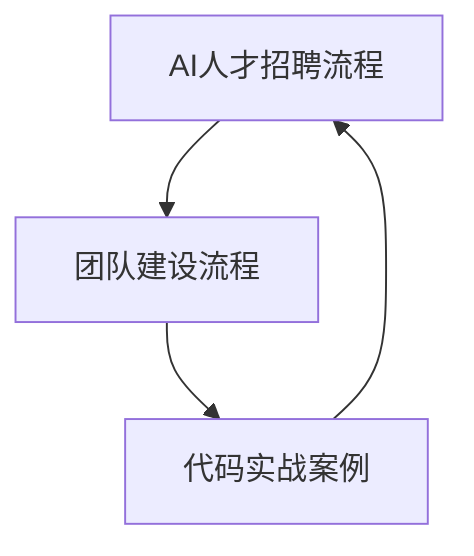

                 

## 《AI人才招聘与团队建设原理与代码实战案例讲解》

> **关键词**：AI人才招聘、团队建设、招聘策略、团队协作、绩效管理、代码实战案例

> **摘要**：本文将深入探讨AI领域的人才招聘与团队建设原理，结合实际代码实战案例，解析如何高效选拔与培养AI人才，并构建高效协作的团队。文章分为三个主要部分：第一部分讲解AI人才招聘原理，第二部分阐述团队建设原理，第三部分展示代码实战案例。通过本文，读者将掌握AI人才招聘与团队建设的关键方法与实战技巧。

### 《AI人才招聘与团队建设原理与代码实战案例讲解》目录大纲

#### 第一部分：AI人才招聘原理

##### 第1章：AI人才招聘概述

- **1.1 AI行业发展趋势与人才需求**
  - AI行业发展现状
  - 各类AI岗位需求分析
  - 人才供需矛盾与解决方案

- **1.2 AI人才素质模型**
  - 技能要求
  - 专业知识
  - 态度与素养

- **1.3 AI招聘流程设计**
  - 招聘需求分析
  - 招聘渠道选择
  - 面试技巧与评估方法

- **1.4 招聘策略与实施**
  - 内部培养与外部引进
  - 人才吸引策略
  - 团队建设策略

##### 第2章：AI人才招聘技巧

- **2.1 招聘广告撰写与发布**
  - 标题优化
  - 职位描述撰写
  - 招聘渠道选择

- **2.2 简历筛选与筛选标准**
  - 简历筛选技巧
  - 筛选标准制定
  - 常见问题分析

- **2.3 面试流程与技巧**
  - 面试流程设计
  - 面试问题设计
  - 面试评估方法

#### 第二部分：团队建设原理

##### 第3章：团队建设概述

- **3.1 团队建设的重要性**
  - 团队合作与个人能力的区别
  - 团队建设对企业发展的作用

- **3.2 团队角色与职责**
  - 团队领导者职责
  - 团队成员职责
  - 团队其他角色

- **3.3 团队文化构建**
  - 团队价值观
  - 团队沟通
  - 团队激励

##### 第4章：团队协作与沟通

- **4.1 团队协作原则**
  - 共同目标
  - 分工合作
  - 信息共享

- **4.2 团队沟通策略**
  - 有效沟通方法
  - 常见沟通问题与解决
  - 沟通工具介绍

- **4.3 团队协作工具应用**
  - 项目管理工具
  - 团队协作平台
  - 效率提升工具

##### 第5章：团队激励与绩效管理

- **5.1 团队激励理论**
  - 马斯洛需求层次理论
  - 双因素理论
  - 绩效激励理论

- **5.2 绩效考核体系设计**
  - 绩效指标设定
  - 绩效考核方法
  - 绩效反馈与改进

- **5.3 激励策略与实施**
  - 薪酬激励
  - 荣誉激励
  - 职业发展激励

#### 第三部分：代码实战案例

##### 第6章：AI面试题解析与实战

- **6.1 面试题类型与分类**
  - 算法题
  - 数据结构与设计题
  - 编程实战题

- **6.2 面试题解析**
  - 算法题解析
  - 数据结构与设计题解析
  - 编程实战题解析

- **6.3 面试实战案例**
  - 常见面试题实战
  - 案例分析与解答
  - 面试经验分享

##### 第7章：团队协作项目实战

- **7.1 项目概述**
  - 项目背景
  - 项目目标
  - 项目团队组成

- **7.2 项目规划与实施**
  - 项目计划
  - 任务分配
  - 进度跟踪与控制

- **7.3 项目沟通与协作**
  - 沟通策略
  - 协作工具应用
  - 困难与解决方案

- **7.4 项目评估与总结**
  - 项目成果评估
  - 项目经验总结
  - 改进措施建议

#### 附录

- **附录A：AI招聘与团队建设工具**
  - 招聘平台介绍
  - 团队协作工具使用指南
  - 绩效管理工具推荐

- **附录B：代码实战案例代码解析**
  - 案例代码实现
  - 代码解读与分析
  - 代码优化与改进建议

### Mermaid 流程图示例



### 伪代码示例

```python
// 伪代码：算法题解法

function solveAlgorithmProblem(inputData):
    // 算法逻辑处理
    ...
    return result
```

### 数学模型与公式

$$
P(A|B) = \frac{P(B|A) \cdot P(A)}{P(B)}
$$

### 举例说明

- **例1**：说明AI人才招聘的核心流程。

- **例2**：介绍团队协作中的沟通策略。

- **例3**：展示代码实战案例的具体实现。

---

### 作者信息

- 作者：AI天才研究院/AI Genius Institute & 禅与计算机程序设计艺术 /Zen And The Art of Computer Programming

---

接下来的部分，我们将逐章深入探讨AI人才招聘与团队建设的原理，以及代码实战案例。每一章节都将通过详细的分析、流程图、伪代码和实际案例，帮助读者理解和掌握关键技术和实战方法。

---

## 第一部分：AI人才招聘原理

### 第1章：AI人才招聘概述

在这一章中，我们将探讨AI行业的发展趋势与人才需求，分析各类AI岗位的需求，以及人才供需矛盾及其解决方案。

### 1.1 AI行业发展趋势与人才需求

#### AI行业发展现状

人工智能（AI）作为现代科技领域的前沿，近年来发展迅速。根据市场调研数据显示，AI市场预计在未来几年将持续保持高速增长。AI技术的应用领域广泛，包括但不限于自动驾驶、医疗诊断、金融风控、智能客服等。这些应用场景的不断扩展，使得对AI人才的需求日益增加。

#### 各类AI岗位需求分析

AI行业包含多种岗位，每个岗位都有其特定的职责和技能要求。以下是一些常见的AI岗位及其主要职责：

1. **AI研究员/科学家**：负责研究和开发AI算法，进行数据分析和模型训练，推动AI技术的创新和应用。
2. **数据科学家**：处理和分析大量数据，挖掘数据中的潜在价值，为业务决策提供数据支持。
3. **机器学习工程师**：设计和实现机器学习模型，优化算法性能，开发自动化系统。
4. **AI产品经理**：负责AI产品的规划、设计和推广，协调跨部门合作，确保产品符合市场需求。
5. **AI算法工程师**：专注于算法的开发、优化和部署，解决具体的技术难题。

#### 人才供需矛盾与解决方案

当前，AI领域的快速发展与人才需求的快速增长之间存在显著的不匹配。一方面，许多企业迫切需要AI专业人才来推动业务创新；另一方面，合格的AI人才供应不足，尤其是高水平的人才。为了解决这一矛盾，可以从以下几个方面着手：

1. **教育培养**：加大对AI领域的教育投入，提高人才培养的质量和数量。
2. **企业内部培养**：鼓励企业内部的人才培养计划，提供学习和发展的机会，培养内部人才。
3. **国际合作与交流**：加强与国际顶尖AI研究机构和高校的合作，引进高水平人才。
4. **政策支持**：政府可以通过制定相关政策，提供资金支持和税收优惠，鼓励企业吸引和留住人才。

### 1.2 AI人才素质模型

为了招聘到符合需求的AI人才，企业需要明确人才素质模型。以下是一个典型的AI人才素质模型，包括技能要求、专业知识和态度与素养。

#### 技能要求

1. **编程能力**：熟悉至少一种编程语言，如Python、Java或C++。
2. **机器学习框架**：熟练使用主流机器学习框架，如TensorFlow、PyTorch或Scikit-learn。
3. **数据处理能力**：掌握数据清洗、预处理和特征工程的方法。
4. **算法设计能力**：能够设计并实现复杂的机器学习算法。
5. **项目实践经验**：具备在真实项目中使用AI技术解决问题的经验。

#### 专业知识

1. **数学基础**：掌握线性代数、概率论和统计学的基本原理。
2. **计算机科学基础**：了解计算机体系结构、算法和数据结构。
3. **领域知识**：根据具体岗位，具备一定的领域知识，如医疗、金融或自动驾驶。

#### 态度与素养

1. **积极主动**：具备强烈的求知欲和自我驱动力。
2. **团队合作**：能够与团队成员有效沟通，协同工作。
3. **持续学习**：具备持续学习新知识和技能的能力。
4. **问题解决能力**：能够面对挑战，快速找到解决问题的方法。

### 1.3 AI招聘流程设计

AI人才招聘是一个复杂的过程，涉及多个环节。以下是一个典型的AI招聘流程：

#### 招聘需求分析

1. **岗位需求分析**：明确岗位的职责、技能要求和任职资格。
2. **业务目标分析**：理解业务目标，确定所需人才的贡献和价值。
3. **人才画像**：根据岗位需求，构建理想的人才画像。

#### 招聘渠道选择

1. **内部推荐**：通过现有员工的推荐，快速筛选合适候选人。
2. **招聘网站**：利用招聘网站，发布招聘信息，吸引应聘者。
3. **校园招聘**：与高校合作，开展校园招聘活动。
4. **行业会议与招聘会**：参加行业会议和招聘会，与人才直接交流。

#### 面试技巧与评估方法

1. **初步筛选**：通过简历筛选，初步判断候选人是否符合基本要求。
2. **技术面试**：通过技术面试，评估候选人的技能水平。
3. **行为面试**：通过行为面试，了解候选人的工作态度和团队合作能力。
4. **综合评估**：结合面试结果，进行综合评估，确定最终候选人。

### 1.4 招聘策略与实施

在AI人才招聘过程中，企业需要制定有效的招聘策略，以吸引和留住优秀人才。以下是一些常见的招聘策略：

#### 内部培养与外部引进

1. **内部培养**：通过内部培训和发展计划，提升现有员工的技能和素质。
2. **外部引进**：从外部招聘具有丰富经验和技能的高水平人才。

#### 人才吸引策略

1. **品牌宣传**：提升企业品牌形象，增强对人才的吸引力。
2. **薪资福利**：提供具有竞争力的薪资和福利待遇。
3. **职业发展**：为员工提供清晰的职业发展路径和晋升机会。
4. **工作环境**：打造良好的工作环境，提高员工的工作满意度和忠诚度。

#### 团队建设策略

1. **团队文化**：构建积极向上的团队文化，增强团队凝聚力。
2. **协作机制**：建立高效的协作机制，促进团队协作和沟通。
3. **激励措施**：通过激励措施，激发员工的积极性和创造力。
4. **人才培养**：建立人才培养机制，提升团队整体素质。

通过以上策略的实施，企业可以有效地选拔和培养AI人才，为企业的持续发展提供强大的人才支持。

---

## 第2章：AI人才招聘技巧

在上一章中，我们了解了AI人才招聘的原理，本章将深入探讨具体的招聘技巧，包括招聘广告撰写、简历筛选、面试流程与技巧等方面。

### 2.1 招聘广告撰写与发布

招聘广告是吸引人才的第一步，一个优秀的招聘广告能够提高招聘效果。以下是一些撰写招聘广告的技巧：

#### 标题优化

1. **明确岗位名称**：使用具体而清晰的岗位名称，避免使用模糊的词汇。
2. **突出优势**：在标题中突出岗位的优势，如薪资待遇、职业发展机会等。
3. **简洁明了**：标题要简短有力，吸引读者的注意力。

例如：“机器学习工程师 | 高薪资 | 职业发展路径清晰”

#### 职位描述撰写

1. **岗位职责**：详细列出岗位的主要职责和工作内容。
2. **技能要求**：明确列出所需的技能和经验，如编程语言、机器学习框架等。
3. **任职资格**：说明对候选人的基本要求，如学历、工作经验等。
4. **公司介绍**：简要介绍公司背景、文化和发展状况。

例如：

**岗位职责**：
- 负责设计和实现机器学习算法
- 参与数据分析和模型训练
- 解决项目中遇到的技术难题

**技能要求**：
- 熟练使用Python、TensorFlow等
- 具备2年以上机器学习项目经验
- 熟悉深度学习、强化学习等相关技术

**任职资格**：
- 本科及以上学历，计算机科学、人工智能等相关专业
- 具有良好的逻辑思维和问题解决能力

#### 招聘渠道选择

1. **招聘网站**：如智联招聘、前程无忧等，覆盖面广，招聘信息曝光度高。
2. **社交媒体**：如LinkedIn、微信公众号等，针对特定人群，精准投放。
3. **行业论坛和社区**：如AI技术论坛、GitHub等，专业性强，人才集中。
4. **校园招聘**：与高校合作，开展校园招聘活动，吸引应届毕业生。

### 2.2 简历筛选与筛选标准

简历筛选是招聘过程中非常重要的一环，高效的简历筛选可以提高招聘效率。以下是一些简历筛选的技巧：

#### 简历筛选技巧

1. **初步筛选**：根据职位描述，筛选出符合基本要求的简历。
2. **关键词匹配**：使用关键词匹配算法，筛选出符合技能要求的简历。
3. **量化评估**：对简历中的成就和经历进行量化评估，如项目成果、业绩指标等。

#### 筛选标准制定

1. **硬性标准**：明确列出必须满足的硬性条件，如学历、工作经验等。
2. **软性标准**：评估候选人的软性技能，如沟通能力、团队合作等。
3. **优先级排序**：根据招聘需求和公司文化，制定优先级排序，如技能优先、经验优先等。

#### 常见问题分析

1. **简历内容空洞**：缺乏具体的项目经历和成果。
2. **简历格式混乱**：缺乏条理，难以快速阅读。
3. **简历重复性高**：多家公司投递相似的简历，缺乏针对性。

解决方法：
- **详细描述项目经历**：强调在项目中承担的角色、所使用的技术和取得的成果。
- **优化简历格式**：使用清晰的标题、段落和列表，提高可读性。
- **定制化简历**：针对不同职位，调整简历内容和格式，突出与职位相关的经验和技能。

### 2.3 面试流程与技巧

面试是评估候选人综合能力的重要环节，以下是一些面试流程和技巧：

#### 面试流程设计

1. **初步面试**：通过电话或视频面试，对候选人进行初步筛选。
2. **技术面试**：针对候选人的专业技能进行深入评估。
3. **行为面试**：通过行为问题，了解候选人的工作态度和团队合作能力。
4. **终面与高管面试**：对候选人进行最终评估，包括高管面试。

#### 面试问题设计

1. **技术问题**：围绕候选人的技能和项目经验，设计针对性的技术问题。
2. **行为问题**：通过开放式问题，了解候选人在过去工作中的行为和态度。
3. **情境问题**：模拟工作场景，评估候选人的应变能力和决策能力。

#### 面试评估方法

1. **评分制**：根据面试问题的答案，采用评分制进行评估，如5分制、10分制等。
2. **评估维度**：综合考虑候选人的专业技能、经验、沟通能力和团队合作能力。
3. **多轮面试**：通过多轮面试，逐步深入评估候选人的综合能力。

#### 常见问题与解决方法

1. **候选人表现不佳**：可能是因为准备不足、紧张或对职位不感兴趣。
   - **解决方法**：提前告知候选人面试流程和问题类型，提供模拟面试机会，帮助候选人做好充分准备。

2. **面试时间冲突**：可能因为候选人日程紧张或面试安排不合理。
   - **解决方法**：提前安排好面试时间，提供灵活的面试方式，如电话或视频面试。

3. **面试效果不佳**：可能是因为面试官经验不足、问题设计不合理或沟通不畅。
   - **解决方法**：加强面试官的培训，优化面试问题设计，提高面试沟通技巧。

通过以上技巧和方法的运用，企业可以有效地筛选和评估AI人才，确保招聘到符合岗位需求和公司文化的人才。

---

## 第3章：团队建设概述

在了解了AI人才招聘技巧后，接下来我们将探讨团队建设的重要性、团队角色与职责以及团队文化的构建。这些内容是确保团队高效协作和持续发展的基础。

### 3.1 团队建设的重要性

团队合作与个人能力有显著的区别。在个人能力为主的模式中，每个成员独立完成任务，而团队合作强调的是集体智慧和协作能力。以下是一些团队建设对企业发展的关键作用：

1. **提升创新能力**：团队成员的多样性和互补性能够带来创新的思维和方法，促进新产品的开发和技术突破。
2. **提高工作效率**：通过明确的分工和协作机制，团队成员可以更加专注于各自的工作，提高整体的工作效率。
3. **增强问题解决能力**：面对复杂的问题和挑战时，团队成员可以共同分析、讨论和制定解决方案，提高问题解决的成功率。
4. **提高员工满意度**：良好的团队氛围和合作关系能够提高员工的工作满意度和忠诚度，减少员工流失。
5. **促进企业文化建设**：通过团队建设活动，可以强化企业的价值观和文化，增强员工对企业的认同感和归属感。

### 3.2 团队角色与职责

在团队中，每个角色都有其特定的职责和作用。以下是一些常见的团队角色及其职责：

1. **团队领导者**：负责制定团队的目标和战略，协调团队成员的工作，解决团队中的冲突，推动团队向前发展。
2. **团队成员**：负责完成分配给自己的任务，积极参与团队的讨论和决策，与团队成员保持良好的沟通和合作。
3. **技术专家**：负责提供技术支持和解决方案，确保项目的技术可行性和质量。
4. **项目经理**：负责项目规划、进度控制和资源分配，确保项目按计划进行。
5. **业务分析师**：负责分析业务需求，制定业务解决方案，与团队成员和技术团队保持紧密沟通。

每个角色在团队中都扮演着重要的角色，共同推动团队目标的实现。

### 3.3 团队文化构建

团队文化是团队长期形成的一种共同的价值观和行为规范，对团队的稳定性和凝聚力有着重要的影响。以下是构建团队文化的一些关键要素：

1. **共同的价值观**：团队中的每个成员都认同并遵循共同的价值观，如诚信、创新、客户导向等。
2. **开放沟通**：鼓励团队成员之间的开放沟通，建立信任和尊重的氛围，确保信息的透明和畅通。
3. **协作精神**：强调团队合作，鼓励成员相互支持和帮助，共同完成团队目标。
4. **持续学习**：鼓励团队成员持续学习和成长，提升个人能力和团队整体水平。
5. **激励机制**：建立公平、透明的激励机制，激发团队成员的积极性和创造力。

通过构建积极向上的团队文化，企业可以增强团队的凝聚力和向心力，推动团队的长期发展。

---

## 第4章：团队协作与沟通

团队协作和沟通是确保团队高效运作的关键因素。在这一章中，我们将深入探讨团队协作原则、沟通策略以及团队协作工具的应用。

### 4.1 团队协作原则

有效的团队协作需要遵循一些基本原则，以确保团队成员能够高效地合作和完成共同的目标。

1. **共同目标**：团队成员应该明确团队的目标和任务，确保每个人的努力方向一致。共同目标是团队协作的出发点和归宿，能够激发团队成员的积极性和动力。

2. **分工合作**：团队成员应该根据各自的特长和优势进行分工，明确各自的职责和任务。分工合作能够提高工作效率，确保每个任务都能得到专业的处理。

3. **信息共享**：团队成员应该保持信息的透明和畅通，及时分享工作中的进展、问题和解决方案。信息共享能够增强团队的协作和沟通，确保团队成员能够快速响应和解决问题。

4. **互相支持**：团队成员之间应该相互支持和帮助，共同应对工作中的挑战。互相支持能够增强团队的凝聚力和战斗力，确保团队能够在困难面前保持团结和稳定。

5. **持续反馈**：团队成员应该定期进行反馈和评估，及时发现和解决问题，改进工作方法。持续反馈能够促进团队成员的个人成长和团队的整体进步。

### 4.2 团队沟通策略

有效的沟通是团队协作的重要保障。以下是一些团队沟通策略，帮助团队成员更好地理解和协作：

1. **明确沟通目标**：每次沟通前，明确沟通的目标和期望结果，确保沟通具有针对性和高效性。

2. **主动沟通**：鼓励团队成员主动表达自己的想法和意见，建立开放和包容的沟通氛围。

3. **倾听与理解**：在沟通过程中，要认真倾听对方的意见和需求，尝试理解对方的立场和观点。

4. **积极回应**：对对方的沟通内容给予积极的回应，表达自己的认同和支持。

5. **反馈与确认**：在沟通过程中，及时给予反馈和确认，确保信息的准确理解和传达。

6. **避免误解**：在沟通中注意避免使用模糊和歧义的语言，确保信息的明确和准确。

7. **定期沟通**：建立定期的沟通机制，如周会、月报等，确保团队成员能够及时了解团队进展和问题。

### 4.3 团队协作工具应用

为了提高团队协作的效率，企业通常会使用一些团队协作工具。以下是一些常见的团队协作工具及其应用：

1. **项目管理工具**：如JIRA、Trello、Asana等，用于任务管理、进度跟踪和资源分配。

2. **文档协作工具**：如Google Docs、Microsoft Office 365、Notion等，用于文档共享、编辑和协作。

3. **即时通讯工具**：如Slack、Microsoft Teams、Zoom等，用于实时沟通、消息传递和视频会议。

4. **代码管理工具**：如GitHub、GitLab、Bitbucket等，用于代码存储、版本控制和协作开发。

5. **知识库工具**：如Confluence、Wiki等，用于知识共享、文档存储和团队学习。

6. **协作白板**：如Miro、Mural、Sketchboard等，用于头脑风暴、流程设计和协同工作。

通过合理应用这些团队协作工具，企业可以显著提高团队的协作效率和工作质量。

### 4.4 团队协作案例分析

以下是一个团队协作的案例，展示了团队协作原则、沟通策略和工具应用的具体实践：

**案例背景**：某AI初创公司正在开发一款智能客服系统，团队成员包括产品经理、设计师、后端开发工程师、前端开发工程师和测试工程师。

**团队协作原则**：
- **共同目标**：团队明确目标是开发出一款用户体验良好、响应迅速的智能客服系统。
- **分工合作**：根据团队成员的特长，产品经理负责需求分析和产品设计，设计师负责用户界面设计，后端开发工程师负责后端逻辑和接口开发，前端开发工程师负责前端展示和交互，测试工程师负责系统测试和质量保证。
- **信息共享**：团队通过Trello进行任务管理，每个任务都有明确的负责人和截止日期，团队成员可以随时查看任务进度和更新信息。
- **互相支持**：团队成员之间保持密切沟通，遇到问题时，互相支持和协作，共同解决。

**沟通策略**：
- **明确沟通目标**：每次会议或讨论前，明确会议目标和讨论内容，确保沟通高效。
- **主动沟通**：团队成员主动分享自己的想法和意见，提出问题和解决方案。
- **倾听与理解**：团队成员认真倾听他人的意见，尝试理解对方的立场和观点。
- **积极回应**：对对方的意见给予积极的回应和支持。
- **反馈与确认**：在每次任务完成后，团队成员进行反馈和总结，确认任务完成情况和问题解决方案。

**工具应用**：
- **项目管理工具**：团队使用Trello进行任务管理，分配任务和跟踪进度。
- **文档协作工具**：使用Google Docs进行需求文档、设计文档和测试文档的共享和编辑。
- **即时通讯工具**：使用Slack进行日常沟通和消息传递，快速响应问题和需求。
- **代码管理工具**：使用GitHub进行代码存储和版本控制，确保代码的安全和一致性。
- **协作白板**：使用Miro进行头脑风暴和流程设计，增强团队协作和创意交流。

通过以上团队协作原则、沟通策略和工具应用的实践，团队成功地开发出了一款用户满意度高的智能客服系统，为公司赢得了市场份额和客户信任。

---

## 第5章：团队激励与绩效管理

在团队建设和协作中，激励和绩效管理是确保团队成员积极性和工作效率的重要手段。本章将深入探讨团队激励理论、绩效考核体系设计以及激励策略与实施。

### 5.1 团队激励理论

团队激励理论是研究如何通过激励手段激发团队成员的工作热情和创造力的科学。以下是一些常见的团队激励理论：

1. **马斯洛需求层次理论**：马斯洛认为人的需求可以分为生理需求、安全需求、社交需求、尊重需求和自我实现需求。团队激励应当从满足团队成员的不同层次需求出发，逐步提升团队成员的工作积极性。

2. **双因素理论**：赫茨伯格提出，工作满意度由双因素决定：一类是激励因素（如成就、认可、工作本身等），另一类是保健因素（如薪酬、工作环境、公司政策等）。团队激励应当同时关注这两个方面，确保团队成员的满意度和工作积极性。

3. **绩效激励理论**：绩效激励理论认为，通过设定明确的绩效目标和激励机制，可以激发团队成员的工作动力，提高工作效率和成果。

### 5.2 绩效考核体系设计

绩效考核体系是评估团队成员工作表现和贡献的重要工具。设计一个科学、合理的绩效考核体系，有助于激励团队成员，提高团队的整体绩效。以下是一些设计绩效考核体系的关键步骤：

1. **设定绩效指标**：根据团队目标和成员职责，设定明确的绩效指标。这些指标应具有可量化、可衡量、可达成性等特点。

2. **确定考核维度**：常见的考核维度包括工作质量、工作效率、创新能力、团队协作等。根据团队特点和业务需求，选择合适的考核维度。

3. **制定考核标准**：明确每个绩效指标的评分标准和权重，确保考核的公平性和客观性。

4. **定期评估与反馈**：定期对团队成员的工作绩效进行评估，提供反馈和指导，帮助团队成员提升工作表现。

5. **绩效改进措施**：根据评估结果，制定绩效改进措施，帮助团队成员解决工作中的问题和挑战。

### 5.3 激励策略与实施

有效的激励策略能够激发团队成员的积极性和创造力，提高团队的整体绩效。以下是一些常见的激励策略：

1. **薪酬激励**：提供具有竞争力的薪资和福利待遇，确保团队成员的基本生活需求得到满足。同时，可以设立绩效奖金，根据团队成员的工作表现和绩效目标实现情况发放奖金。

2. **荣誉激励**：设立荣誉称号和奖项，对在工作中表现出色的团队成员进行表彰和奖励。这可以增强团队成员的荣誉感和归属感。

3. **职业发展激励**：提供清晰的职业发展路径和晋升机会，鼓励团队成员不断提升自己的能力和水平。可以通过培训、学习机会和职业发展规划，帮助团队成员实现职业成长。

4. **团队建设激励**：通过组织团建活动、庆祝团队成就等方式，增强团队的凝聚力和向心力。这可以提高团队成员的工作满意度和忠诚度。

5. **工作环境激励**：打造良好的工作环境，包括舒适的办公环境、现代化的办公设备、丰富的企业文化活动等。这可以提升团队成员的工作体验和幸福感。

### 案例分析：某AI公司团队激励与绩效管理实践

**背景**：某AI公司是一家专注于智能机器人研发的公司，团队成员包括研发人员、测试人员、产品经理和市场人员。公司希望在保持高绩效的同时，提升员工的工作满意度和忠诚度。

**激励策略**：

1. **薪酬激励**：公司提供具有竞争力的薪资和福利待遇，包括绩效奖金、项目奖金和年终奖。绩效奖金根据团队和个人的工作表现和绩效目标实现情况进行发放。

2. **荣誉激励**：公司设立“月度之星”和“年度最佳员工”奖项，对在工作中表现突出的员工进行表彰和奖励。获奖员工将在公司内部获得认可和展示机会。

3. **职业发展激励**：公司为员工提供多种培训和学习机会，包括内部培训、外部培训和在线学习平台。员工可以根据自己的兴趣和职业规划选择适合自己的培训课程。

4. **团队建设激励**：公司定期组织团建活动，如团队拓展训练、户外活动等，增强团队的凝聚力和向心力。此外，公司还会在重要的节日和纪念日组织庆祝活动，提升员工的工作满意度。

**绩效管理**：

1. **设定绩效指标**：公司根据团队目标和成员职责，设定了包括工作质量、工作效率、团队协作、创新能力等在内的绩效指标。

2. **定期评估与反馈**：公司每季度对员工的工作绩效进行评估，提供详细的反馈和指导。评估结果将作为员工晋升和奖金发放的依据。

3. **绩效改进措施**：公司根据评估结果，制定绩效改进措施，帮助员工解决工作中的问题和挑战。公司还鼓励员工提出改进建议，共同推动团队的发展。

通过实施以上激励策略和绩效管理措施，该AI公司的员工工作满意度和忠诚度显著提升，团队整体绩效也有了显著提高。公司成为行业内知名的优秀企业，吸引了更多优秀人才加入。

---

## 第6章：AI面试题解析与实战

在AI面试中，面试题的类型多种多样，涵盖了算法题、数据结构与设计题以及编程实战题。在这一章中，我们将详细解析这些面试题的类型，并提供具体的解题思路和实战案例。

### 6.1 面试题类型与分类

#### 算法题

算法题是AI面试中最常见的类型之一，主要考察应聘者的逻辑思维、算法设计和问题解决能力。以下是一些常见的算法题类型：

1. **排序算法**：如冒泡排序、快速排序、归并排序等。
2. **查找算法**：如二分查找、散列表查找等。
3. **动态规划**：如最长公共子序列、最短编辑距离等。
4. **图算法**：如拓扑排序、最短路径算法、最小生成树等。
5. **位运算**：如位翻转、位操作等。

#### 数据结构与设计题

数据结构与设计题主要考察应聘者对常见数据结构的掌握以及如何运用这些数据结构解决实际问题。以下是一些常见的数据结构与设计题类型：

1. **链表**：如单链表、双链表、循环链表等。
2. **栈和队列**：如栈、队列的实现及应用。
3. **树和二叉树**：如二叉搜索树、平衡二叉树、AVL树、红黑树等。
4. **图**：如图的邻接矩阵表示、图的遍历算法等。
5. **哈希表**：如哈希函数的设计、冲突解决方法等。

#### 编程实战题

编程实战题通常涉及实际的编程任务，考察应聘者的编程能力、代码风格和解决问题的能力。以下是一些常见的编程实战题类型：

1. **系统设计题**：如设计一个简单的博客系统、电商系统等。
2. **数据挖掘题**：如使用机器学习算法分析数据、构建预测模型等。
3. **算法优化题**：如对给定算法进行优化，提高时间或空间复杂度。
4. **编程挑战题**：如LeetCode、HackerRank等在线编程平台的题目。

### 6.2 面试题解析

#### 算法题解析

以下是一个典型的算法题——快速排序，我们将使用伪代码详细解析其解题思路和实现过程。

**题目描述**：给定一个整数数组，实现快速排序算法，对数组进行升序排序。

**解题思路**：

1. **递归划分**：选择一个基准元素，将数组划分为两个子数组，左子数组的所有元素小于基准元素，右子数组的所有元素大于基准元素。
2. **递归排序**：对划分后的两个子数组重复上述步骤，直到所有子数组长度为1。

**伪代码**：

```python
function quickSort(arr, low, high):
    if low < high:
        pi = partition(arr, low, high)
        quickSort(arr, low, pi - 1)  # 递归排序左子数组
        quickSort(arr, pi + 1, high)  # 递归排序右子数组

function partition(arr, low, high):
    pivot = arr[high]  # 选择基准元素
    i = low - 1
    for j = low to high - 1:
        if arr[j] < pivot:
            i = i + 1
            swap(arr[i], arr[j])
    swap(arr[i + 1], arr[high])
    return i + 1

// 主函数调用
quickSort(arr, 0, len(arr) - 1)
```

**解释**：

- `quickSort`函数接受三个参数：数组`arr`、排序的起始索引`low`和结束索引`high`。
- 如果`low`小于`high`，说明数组中有多个元素，需要进一步划分。
- `partition`函数选择数组最后一个元素作为基准，将数组划分为两个子数组，并返回划分后的基准索引`pi`。
- 然后递归地对左子数组和右子数组进行快速排序。

#### 数据结构与设计题解析

以下是一个典型的数据结构与设计题——实现一个简单的栈，我们将使用伪代码详细解析其解题思路和实现过程。

**题目描述**：实现一个栈的数据结构，支持入栈、出栈和获取栈顶元素的操作。

**解题思路**：

1. **使用数组实现栈**：使用一个数组存储栈中的元素，使用一个变量`top`指示栈顶元素的位置。
2. **入栈**：将新元素添加到数组末尾，`top`加1。
3. **出栈**：删除数组末尾的元素，`top`减1。
4. **获取栈顶元素**：返回数组中`top`位置的元素。

**伪代码**：

```python
class Stack:
    def __init__(self):
        self.arr = []
        self.top = -1

    def push(self, x):
        self.arr.append(x)
        self.top += 1

    def pop(self):
        if self.top >= 0:
            x = self.arr[self.top]
            self.arr.pop()
            self.top -= 1
            return x
        else:
            return "栈为空"

    def peek(self):
        if self.top >= 0:
            return self.arr[self.top]
        else:
            return "栈为空"
```

**解释**：

- `Stack`类使用一个数组`arr`和一个变量`top`实现栈的功能。
- `push`方法将新元素添加到数组末尾，并更新`top`。
- `pop`方法删除数组末尾的元素，并更新`top`。
- `peek`方法返回栈顶元素，不删除栈顶元素。

#### 编程实战题解析

以下是一个典型的编程实战题——设计一个简单的博客系统，我们将使用伪代码详细解析其解题思路和实现过程。

**题目描述**：设计一个简单的博客系统，支持用户注册、登录、发布文章和评论文章。

**解题思路**：

1. **用户管理**：实现用户注册和登录功能，保存用户信息。
2. **文章管理**：实现文章发布功能，保存文章内容和发布时间。
3. **评论管理**：实现文章评论功能，保存评论内容和评论时间。

**伪代码**：

```python
# 用户管理
class User:
    def __init__(self, username, password):
        self.username = username
        self.password = password

def register(username, password):
    # 注册用户
    user = User(username, password)
    save_user_to_database(user)

def login(username, password):
    # 登录用户
    user = get_user_from_database(username)
    if user and user.password == password:
        return user
    else:
        return None

# 文章管理
class Article:
    def __init__(self, title, content, author, timestamp):
        self.title = title
        self.content = content
        self.author = author
        self.timestamp = timestamp

def publish_article(title, content, author):
    # 发布文章
    article = Article(title, content, author, current_time())
    save_article_to_database(article)

# 评论管理
class Comment:
    def __init__(self, content, author, timestamp, article_id):
        self.content = content
        self.author = author
        self.timestamp = timestamp
        self.article_id = article_id

def post_comment(content, author, article_id):
    # 发布评论
    comment = Comment(content, author, current_time(), article_id)
    save_comment_to_database(comment)
```

**解释**：

- `User`类表示用户，包含用户名和密码。
- `register`函数实现用户注册功能。
- `login`函数实现用户登录功能。
- `Article`类表示文章，包含标题、内容、作者和发布时间。
- `publish_article`函数实现文章发布功能。
- `Comment`类表示评论，包含内容、作者、评论时间和文章ID。
- `post_comment`函数实现评论发布功能。

通过以上解析，读者可以了解到AI面试中常见的面试题类型及其解题思路，并能够运用这些思路解决实际问题。

---

## 第7章：团队协作项目实战

在实际工作中，团队协作项目是检验团队协作能力的重要环节。在这一章中，我们将通过一个具体的团队协作项目，展示项目规划与实施、项目沟通与协作以及项目评估与总结的全过程。

### 7.1 项目概述

#### 项目背景

某人工智能初创公司计划开发一款智能客服系统，以帮助企业提高客户服务质量，降低人工成本。项目团队由产品经理、UI/UX设计师、后端开发工程师、前端开发工程师、测试工程师和数据科学家组成。

#### 项目目标

1. **功能目标**：实现智能客服系统的核心功能，包括语音识别、自然语言理解、自动回复、客户信息管理等。
2. **性能目标**：确保系统稳定可靠，响应时间小于2秒，支持大规模并发请求。
3. **质量目标**：通过严格的测试，确保系统无重大缺陷，用户体验良好。

#### 项目团队组成

- **产品经理**：负责需求分析和项目管理，协调团队成员的工作。
- **UI/UX设计师**：负责用户界面设计和用户体验优化。
- **后端开发工程师**：负责系统后端逻辑和接口开发。
- **前端开发工程师**：负责用户前端界面和交互开发。
- **测试工程师**：负责系统测试和质量保证。
- **数据科学家**：负责语音识别和自然语言处理算法的设计与实现。

### 7.2 项目规划与实施

#### 项目计划

项目计划是项目成功的关键，项目团队在项目启动阶段制定了详细的项目计划，包括以下内容：

1. **项目周期**：项目总周期为6个月，分为需求分析、设计、开发、测试和部署五个阶段。
2. **任务分配**：明确每个团队成员在项目中的职责和任务，确保任务分配合理，工作负荷均衡。
3. **时间表**：制定每个阶段的开始和结束时间，确保项目进度可控。
4. **关键里程碑**：设定关键里程碑，如需求文档完成、原型设计完成、功能开发完成等。

#### 任务分配

- **产品经理**：撰写需求文档，制定项目计划，协调团队成员的工作。
- **UI/UX设计师**：设计用户界面原型，优化用户体验。
- **后端开发工程师**：设计后端架构，开发后端接口和业务逻辑。
- **前端开发工程师**：开发前端界面和交互，实现用户功能。
- **测试工程师**：编写测试用例，进行系统测试和性能测试。
- **数据科学家**：设计和实现语音识别和自然语言处理算法。

#### 进度跟踪与控制

项目实施过程中，团队定期进行进度跟踪和评估，以确保项目按计划进行。以下是一些关键步骤：

1. **定期会议**：每周召开项目进度会议，汇报工作进展，讨论问题和解决方案。
2. **任务看板**：使用任务看板工具（如JIRA、Trello）跟踪任务进度，确保任务按时完成。
3. **变更管理**：对项目变更进行记录和评估，确保变更不会影响项目进度和质量。
4. **风险评估**：定期进行风险评估，识别潜在风险，制定应对措施。

### 7.3 项目沟通与协作

#### 沟通策略

为了确保团队协作顺畅，项目团队制定了一系列沟通策略：

1. **明确沟通目标**：每次沟通前，明确沟通的目标和内容，确保沟通具有针对性。
2. **开放沟通**：鼓励团队成员之间主动沟通，分享自己的想法和意见。
3. **定期会议**：定期召开项目会议，包括周会、月会等，确保团队成员了解项目进展和问题。
4. **即时通讯**：使用即时通讯工具（如Slack、微信）进行实时沟通，快速响应问题和需求。

#### 协作工具应用

项目团队使用了一系列协作工具，以提高协作效率和项目质量：

1. **项目管理工具**：使用JIRA进行任务管理和进度跟踪，确保任务按时完成。
2. **文档协作工具**：使用Google Docs进行需求文档、设计文档和测试文档的共享和编辑。
3. **代码管理工具**：使用Git进行代码存储和版本控制，确保代码的稳定性和一致性。
4. **协作白板**：使用Miro进行头脑风暴和流程设计，增强团队协作和创意交流。

#### 困难与解决方案

在项目实施过程中，团队遇到了一些困难和挑战，以下是一些具体的问题和解决方案：

1. **需求变更**：由于客户需求的变化，项目需求进行了多次调整。解决方案是建立灵活的需求管理机制，及时调整项目计划，确保需求满足。
2. **技术难题**：在语音识别和自然语言处理方面，团队遇到了算法优化和性能提升的挑战。解决方案是引入外部专家进行技术指导，进行多次实验和迭代，优化算法性能。
3. **人员协调**：团队成员的工作负荷不均衡，个别成员任务过多。解决方案是重新分配任务，增加人员支持，确保团队成员的工作负担合理。

通过以上沟通策略和工具应用，项目团队成功克服了各种困难和挑战，确保项目顺利进行。

### 7.4 项目评估与总结

项目完成后，团队进行了项目评估和总结，以总结项目经验，改进未来项目。以下是一些项目评估和总结的内容：

#### 项目成果评估

- **功能实现**：项目成功实现了智能客服系统的核心功能，包括语音识别、自然语言理解、自动回复和客户信息管理。
- **性能表现**：系统响应时间稳定在2秒以内，支持大规模并发请求，性能表现良好。
- **用户体验**：用户界面设计简洁美观，用户体验良好，客户满意度较高。

#### 项目经验总结

- **需求管理**：项目过程中需求变更频繁，通过灵活的需求管理机制，成功满足了客户需求。
- **技术实现**：通过引入外部专家和多次实验，成功优化了语音识别和自然语言处理算法的性能。
- **团队协作**：项目团队协作顺畅，通过有效的沟通策略和协作工具，确保了项目进度和质量。

#### 改进措施建议

- **需求管理**：进一步优化需求管理流程，减少需求变更对项目进度的影响。
- **技术储备**：加强团队成员的技术储备，提高团队整体的技术水平。
- **团队建设**：加强团队建设，提高团队凝聚力和协作效率。

通过项目评估和总结，团队不仅收获了成功的项目成果，还积累了宝贵的经验，为未来项目的顺利推进提供了有力的支持。

---

## 附录A：AI招聘与团队建设工具

为了提高AI招聘和团队建设的效率，企业通常会使用一系列工具来辅助招聘、团队协作和绩效管理。以下是一些常用的AI招聘与团队建设工具及其使用指南：

### 招聘平台

**1. 智联招聘（Zhaopin.com）**

**介绍**：智联招聘是中国领先的招聘平台之一，提供海量的职位信息和丰富的招聘服务。

**使用指南**：

- **发布职位**：在智联招聘网站上传职位描述，设置招聘条件，发布招聘信息。
- **简历筛选**：使用智联招聘的智能简历筛选功能，根据关键词匹配简历，快速筛选合适候选人。
- **招聘流程管理**：利用智联招聘的招聘流程管理工具，跟踪面试进程，安排面试时间。

**2. LinkedIn**

**介绍**：LinkedIn是全球最大的职业社交平台，拥有丰富的专业人才资源。

**使用指南**：

- **发布招聘信息**：在LinkedIn发布招聘广告，利用LinkedIn的强大社交网络吸引更多候选人。
- **搜索人才**：使用LinkedIn的高级搜索功能，根据职位、技能、工作经验等条件筛选合适的人才。
- **联系候选人**：通过LinkedIn私信与候选人直接沟通，了解更多信息，加快招聘进程。

### 团队协作工具

**1. JIRA**

**介绍**：JIRA是一款功能强大的项目管理和协作工具，广泛应用于软件开发和团队协作。

**使用指南**：

- **任务管理**：创建任务，分配任务给团队成员，跟踪任务进度。
- **进度跟踪**：使用JIRA看板和报表，实时了解项目进度和团队绩效。
- **协作与沟通**：利用JIRA的评论和讨论功能，团队成员之间进行有效沟通。

**2. Slack**

**介绍**：Slack是一款即时通讯工具，用于团队内部沟通和协作。

**使用指南**：

- **组建工作群组**：根据项目或部门，创建不同的工作群组，方便团队成员之间的沟通。
- **实时聊天**：使用Slack进行实时聊天，快速响应问题和需求。
- **集成第三方应用**：将Slack与JIRA、Trello等工具集成，实现自动化工作流程。

### 绩效管理工具

**1. BambooHR**

**介绍**：BambooHR是一款人力资源管理系统，提供员工信息管理、绩效管理和招聘管理等功能。

**使用指南**：

- **员工信息管理**：录入和管理员工信息，包括个人信息、工作经历、技能和证书等。
- **绩效评估**：设定绩效指标，进行绩效评估，提供反馈和指导。
- **招聘管理**：管理招聘流程，跟踪候选人进度，提高招聘效率。

**2. Tableau**

**介绍**：Tableau是一款数据可视化和业务分析工具，用于绩效分析和决策支持。

**使用指南**：

- **数据连接**：连接各种数据源，如数据库、Excel等，导入绩效数据。
- **数据可视化**：使用Tableau创建各种可视化图表，如柱状图、折线图、饼图等，展示绩效数据。
- **分析报告**：生成分析报告，为管理层提供决策支持。

通过合理使用这些AI招聘与团队建设工具，企业可以大幅提高招聘效率、团队协作效率和绩效管理水平，为企业的持续发展提供坚实保障。

---

## 附录B：代码实战案例代码解析

在本附录中，我们将通过一个具体的代码实战案例，展示代码的开发环境搭建、源代码实现、代码解读与分析以及代码优化与改进建议。

### 案例背景

假设我们要开发一个简单的文本分类系统，用于将用户输入的文本分类到不同的主题中。此系统将基于机器学习算法进行训练和预测，使用Python编程语言进行开发。

### 开发环境搭建

1. **Python环境**：确保安装Python 3.8或更高版本。
2. **库安装**：安装所需的Python库，如NumPy、Pandas、Scikit-learn、TensorFlow等。可以使用以下命令进行安装：

   ```shell
   pip install numpy pandas scikit-learn tensorflow
   ```

### 源代码实现

以下是一个简单的文本分类系统的实现，分为数据预处理、模型训练和预测三个主要部分。

```python
import numpy as np
import pandas as pd
from sklearn.feature_extraction.text import TfidfVectorizer
from sklearn.model_selection import train_test_split
from sklearn.linear_model import LogisticRegression
from sklearn.metrics import accuracy_score

# 数据预处理
def preprocess_data(data):
    # 清洗文本数据，如去除标点符号、停用词等
    # 此处简化处理
    return data.apply(lambda x: x.lower().strip())

# 加载和预处理数据
data = pd.read_csv('text_data.csv')  # 假设数据文件已预处理
data['text'] = preprocess_data(data['text'])

# 特征提取
vectorizer = TfidfVectorizer(max_features=1000)
X = vectorizer.fit_transform(data['text'])
y = data['label']

# 划分训练集和测试集
X_train, X_test, y_train, y_test = train_test_split(X, y, test_size=0.2, random_state=42)

# 模型训练
model = LogisticRegression()
model.fit(X_train, y_train)

# 预测
y_pred = model.predict(X_test)

# 评估
accuracy = accuracy_score(y_test, y_pred)
print(f'模型准确率：{accuracy:.2f}')

# 预测新样本
new_samples = ['这是一个新的文本样本。', '另一个新文本。']
new_samples_processed = preprocess_data(pd.DataFrame(new_samples))
new_samples_vectorized = vectorizer.transform(new_samples_processed)
predictions = model.predict(new_samples_vectorized)
print(f'新样本分类结果：{predictions}')
```

### 代码解读与分析

1. **数据预处理**：数据预处理是文本分类的重要步骤，主要包括文本清洗和格式化。在上面的代码中，我们使用了简单的预处理方法，实际应用中可能需要更复杂的处理。

2. **特征提取**：使用TF-IDF向量器将文本转换为数值特征，这是大多数文本分类任务的标准做法。

3. **模型训练**：我们选择了逻辑回归模型进行训练，这是一个简单且易于理解的模型，适用于文本分类任务。

4. **模型预测与评估**：通过测试集评估模型的准确性，并使用模型对新样本进行预测。

### 代码优化与改进建议

1. **文本预处理优化**：实际应用中，可以使用更复杂的文本预处理方法，如词性标注、命名实体识别等，以提高分类效果。

2. **模型选择与优化**：逻辑回归模型虽然简单，但可能无法捕捉复杂的文本特征。可以尝试使用更复杂的模型，如SVM、神经网络等，并进行参数调优。

3. **特征工程**：可以增加文本特征，如词嵌入（Word Embedding）、词袋模型（Bag of Words）等，以提高模型性能。

4. **交叉验证**：使用交叉验证（Cross-Validation）技术来评估模型的泛化能力，避免过拟合。

5. **分布式训练**：对于大规模数据集，可以使用分布式训练方法来提高训练速度。

通过上述代码实现和优化，读者可以掌握文本分类系统的基本实现方法，并根据具体需求进行进一步的改进和优化。

---

## 总结

本文通过详细的章节内容和实际案例，深入探讨了AI人才招聘与团队建设的原理与方法。我们首先介绍了AI人才招聘的原理，包括行业发展趋势、人才素质模型、招聘流程设计和策略。随后，我们探讨了团队建设的重要性、团队角色与职责以及团队文化的构建。接着，通过代码实战案例展示了AI面试题的解析与实战技巧，以及团队协作项目的规划与实施。

在实际应用中，这些原理和方法可以帮助企业高效地招聘和培养AI人才，构建高效的团队，提高团队协作和绩效管理水平。通过本文的阐述，读者可以更好地理解AI人才招聘与团队建设的核心要点，并在实际工作中运用这些方法，提升企业的技术实力和市场竞争力。

让我们再次回顾本文的关键内容和实际案例，确保读者能够深入理解和掌握：

1. **AI人才招聘原理**：了解AI行业的发展趋势和人才需求，构建AI人才素质模型，设计有效的招聘流程和策略。
2. **团队建设原理**：理解团队建设的重要性，明确团队角色与职责，构建积极的团队文化。
3. **面试题解析与实战**：掌握常见的AI面试题类型，学会使用伪代码解析算法题和数据结构题。
4. **团队协作项目实战**：通过具体的团队协作项目，展示项目规划与实施、沟通与协作以及项目评估与总结的全过程。

希望本文能够为您的AI人才招聘与团队建设之路提供有力支持，助力您打造高效、协作的团队，推动企业持续发展。谢谢您的阅读，期待您在实践中的应用与反馈！

