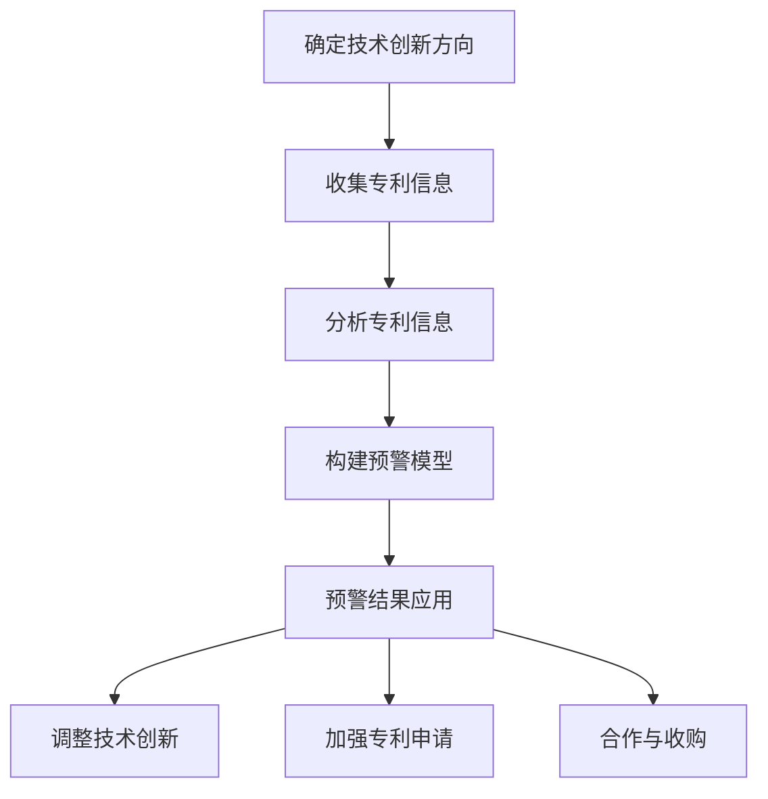
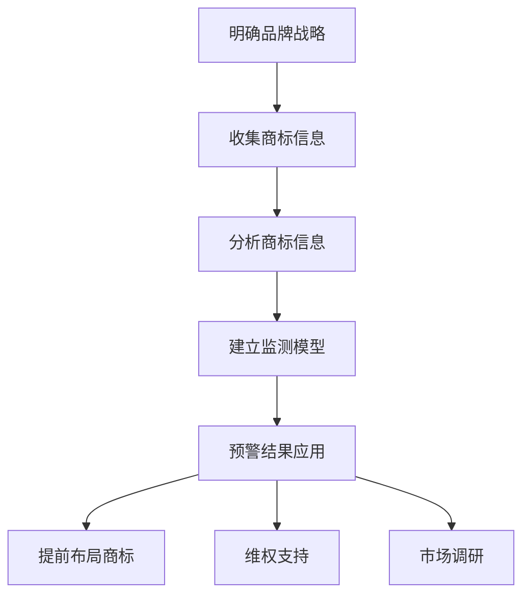
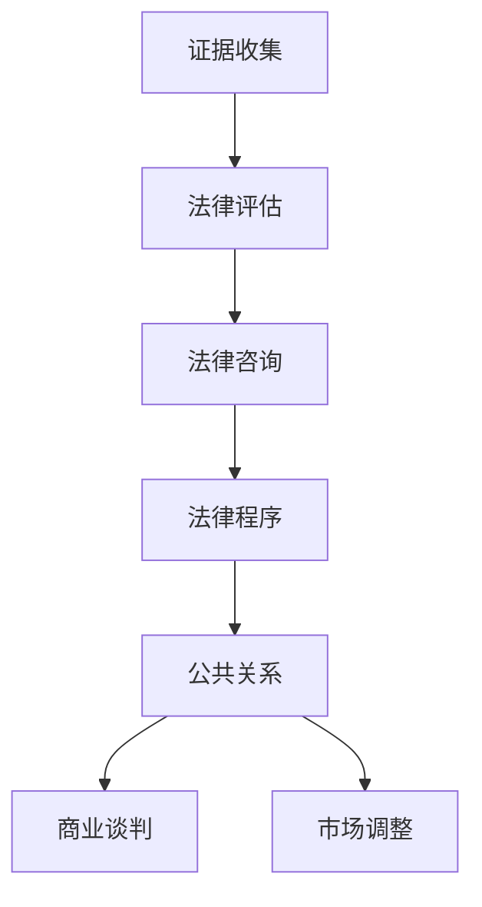

                 

# AI创业公司的知识产权风险防范措施：专利预警、商标监测与侵权应对

## 摘要

在当今激烈竞争的科技市场中，AI创业公司面临着日益增长的知识产权风险。本文旨在探讨AI创业公司在专利预警、商标监测和侵权应对等方面的关键策略和措施，帮助创业公司建立完善的知识产权风险防范体系。文章首先概述了知识产权的基本概念和风险类型，然后详细介绍了专利预警、商标监测和侵权应对的方法与步骤，并辅以实际案例进行分析，最后提出了法律实务和风险防范策略。本文旨在为AI创业公司提供全面、实用的知识产权风险管理指南。

## 目录大纲

### 第一部分：概述与基础

- **第1章：知识产权概述**
  - 1.1 知识产权的基本概念
  - 1.2 知识产权风险的概念
- **第2章：专利预警**
  - 2.1 专利预警的概念与意义
  - 2.2 专利预警的方法与步骤
- **第3章：商标监测**
  - 3.1 商标监测的概念与意义
  - 3.2 商标监测的方法与工具
- **第4章：侵权应对**
  - 4.1 侵权应对的概念与原则
  - 4.2 侵权应对的策略与步骤

### 第二部分：实践指南

- **第5章：AI创业公司专利预警实践**
  - 5.1 AI创业公司专利预警的实践策略
  - 5.2 AI创业公司专利预警案例分析
- **第6章：AI创业公司商标监测实践**
  - 6.1 AI创业公司商标监测的实践策略
  - 6.2 AI创业公司商标监测案例分析
- **第7章：AI创业公司侵权应对实践**
  - 7.1 AI创业公司侵权应对的实践策略
  - 7.2 AI创业公司侵权应对案例分析

### 第三部分：法律实务与风险防范

- **第8章：知识产权法律实务**
  - 8.1 专利申请与保护实务
  - 8.2 商标申请与保护实务
- **第9章：知识产权风险防范策略**
  - 9.1 风险防范的总体策略
  - 9.2 创业公司知识产权风险防范案例分析

### 附录

- **附录A：相关法律法规与政策文件**
- **附录B：知识产权风险防范工具推荐**
- **附录C：资源链接与拓展阅读**

## 第1章：知识产权概述

### 1.1 知识产权的基本概念

知识产权是指人们对其知识成果所享有的权利。根据世界知识产权组织（WIPO）的定义，知识产权主要包括著作权、专利权、商标权、地理标志、工业品外观设计、集成电路布图设计、商业秘密等。这些权利通过法律的形式来确认和保护，旨在激励创新和知识传播。

#### 1.1.1 知识产权的定义与分类

- **著作权**：是指作者对其创作的文学、艺术和科学作品所享有的权利，如版权、邻接权等。
- **专利权**：是指专利权人对其发明、实用新型和外观设计所享有的专有权利。
- **商标权**：是指商标注册人对其注册商标所享有的专用权。
- **地理标志**：是指产自特定地区，该产品的特定质量、声誉或其他特性主要由该地理名称所决定的产品标志。
- **工业品外观设计**：是指对产品的形状、图案、色彩或者其结合所做出的富有美感并适于工业应用的新设计。
- **集成电路布图设计**：是指集成电路中，为制造半导体芯片而将各种电路元件和连线布局、安排在基片上的结构。
- **商业秘密**：是指不为公众所知悉、具有商业价值并经权利人采取保密措施的技术信息和经营信息。

#### 1.1.2 我国知识产权法律体系

我国知识产权法律体系主要包括《中华人民共和国著作权法》、《中华人民共和国专利法》、《中华人民共和国商标法》、《中华人民共和国反不正当竞争法》等法律法规。此外，还有一系列的行政法规、司法解释和部门规章来支持知识产权的申请、保护和实施。

- **著作权法**：规定了著作权人享有的各项权利，如复制权、发行权、出租权、展览权等，以及侵权行为的法律责任。
- **专利法**：规定了专利权的授予条件、专利申请的流程、专利侵权的行为认定及法律责任等。
- **商标法**：规定了商标注册的流程、商标权的保护范围、侵权行为的法律责任等。
- **反不正当竞争法**：规定了商业秘密的保护范围、侵犯商业秘密的行为认定及法律责任等。

### 1.2 知识产权风险的概念

知识产权风险是指因知识产权权利人的合法权益受到侵害，导致其经济利益、竞争优势和持续创新能力遭受损失的可能性。知识产权风险主要包括以下几个方面：

- **侵权风险**：指他人的行为侵犯知识产权权利人的合法权益，如未经授权使用专利、商标等。
- **诉讼风险**：指知识产权权利人在维权过程中面临的法律诉讼风险，包括专利侵权诉讼、商标侵权诉讼等。
- **商业风险**：指知识产权权利人的商业利益受到侵害，如因侵权行为导致市场份额下降、品牌形象受损等。
- **法律风险**：指知识产权权利人因未遵守相关法律法规而面临的法律责任，如专利申请不合法、商标使用不规范等。

#### 1.2.1 知识产权风险的定义

知识产权风险是指在知识产权的创造、申请、保护、实施和转让过程中，由于法律法规的不完善、技术手段的局限性、市场竞争的激烈性等原因，导致知识产权权利人可能遭受的经济损失、法律责任和市场影响。

#### 1.2.2 知识产权风险的主要类型

- **专利侵权风险**：指他人的行为侵犯专利权人的专利权，如未经授权实施发明、制造、使用、销售专利产品等。
- **商标侵权风险**：指他人的行为侵犯商标权人的商标权，如未经授权使用相同或近似商标、在相同或类似商品上使用商标等。
- **著作权侵权风险**：指他人的行为侵犯著作权人的著作权，如未经授权复制、发行、表演、展览、放映、广播、信息网络传播等。
- **商业秘密侵权风险**：指他人的行为侵犯商业秘密，如未经授权披露、使用、转让商业秘密等。
- **知识产权诉讼风险**：指知识产权权利人在维权过程中面临的法律诉讼风险，如专利侵权诉讼、商标侵权诉讼等。
- **市场风险**：指知识产权权利人的市场地位受到侵害，如因侵权行为导致市场份额下降、品牌形象受损等。

## 第2章：专利预警

### 2.1 专利预警的概念与意义

#### 2.1.1 专利预警的定义

专利预警是指通过对专利信息的收集、分析和处理，对可能影响企业技术创新和市场拓展的专利风险进行提前预警和防范的一种管理活动。专利预警的目的是帮助企业在技术创新和市场拓展过程中避免专利侵权、避免技术封锁，保持技术优势和市场竞争力。

#### 2.1.2 专利预警的意义

专利预警对于AI创业公司具有重要意义，主要体现在以下几个方面：

- **防范专利侵权**：专利预警可以帮助AI创业公司提前发现潜在的专利侵权风险，避免因侵权行为导致的法律诉讼和市场损失。
- **保护知识产权**：专利预警有助于AI创业公司加强对自身专利的保护，防止他人未经授权使用或侵权其专利。
- **指导技术创新**：专利预警可以为企业提供竞争对手的专利动态和技术发展趋势，为企业技术创新提供参考和指导。
- **提升市场竞争力**：通过专利预警，AI创业公司可以更好地掌握市场信息，合理布局专利，提升市场竞争力和品牌价值。

### 2.2 专利预警的方法与步骤

专利预警的方法和步骤主要包括以下几个方面：

#### 2.2.1 专利信息的收集与分析

1. **专利信息的来源**：专利信息的收集可以从国内外专利数据库、专业专利服务机构、专利检索工具等渠道获取。常用的专利数据库包括IEEE Xplore、Google Patents、USPTO、CNIPA等。

2. **专利信息的筛选**：根据AI创业公司的技术领域和市场定位，筛选出相关的专利信息。筛选标准包括专利类型、专利申请人、专利分类号、专利权利要求等。

3. **专利信息的分析**：对筛选出的专利信息进行定量和定性分析，包括专利数量、专利活跃度、专利分布情况、竞争对手的专利布局等。

#### 2.2.2 专利预警模型的构建

1. **预警指标体系**：构建一套科学的预警指标体系，包括专利数量、专利活跃度、专利分布情况、竞争对手的专利布局等指标。

2. **预警阈值设置**：根据预警指标体系，设定不同的预警阈值，如专利数量阈值、专利活跃度阈值、专利分布情况阈值等。

3. **预警模型构建**：利用统计方法、机器学习算法等构建预警模型，对专利信息进行综合分析，识别潜在的专利风险。

#### 2.2.3 专利预警的结果与应用

1. **预警结果输出**：将专利预警的结果以报表、图表等形式进行输出，为企业决策提供依据。

2. **预警结果应用**：根据专利预警的结果，制定相应的应对策略，如调整技术创新方向、加强专利申请和保护、规避专利风险等。

### 2.3 专利预警的案例分析

#### 2.3.1 案例一：某AI公司专利预警案例分析

某AI公司在研发一款智能家居产品时，通过专利预警系统发现市场上已有同类产品涉及的专利风险较高，其中某国际巨头公司在该领域拥有多项核心专利。通过进一步分析，某AI公司发现这些专利主要集中在智能语音识别和家居控制方面，而其产品创新点主要在智能家居系统的整体解决方案上。

根据专利预警的结果，某AI公司采取了以下措施：

1. **调整技术创新方向**：针对专利风险较高的领域，调整技术创新方向，避免直接与竞争对手的专利领域发生冲突。

2. **加强专利申请和保护**：加大在智能家居整体解决方案方面的专利申请和保护力度，以形成自身的技术壁垒。

3. **合作与收购**：与拥有相关专利的企业进行合作或收购，以获取专利授权或消除专利侵权风险。

通过专利预警，某AI公司成功规避了专利侵权风险，保持了技术创新和市场竞争力。

#### 2.3.2 案例二：某AI公司专利预警成功经验分享

某AI公司在研发一款人工智能语音助手时，通过专利预警系统发现了某国际巨头公司在语音识别和自然语言处理领域拥有大量核心专利。面对潜在的专利侵权风险，某AI公司采取了以下措施：

1. **专利布局和风险规避**：在产品研发过程中，对核心技术和功能进行细致的专利布局，规避国际巨头公司的专利风险。

2. **合作与专利交叉许可**：与国际巨头公司进行专利交叉许可谈判，以换取其在某些技术领域的专利授权，降低侵权风险。

3. **技术创新和差异化**：通过技术创新和差异化，减少与国际巨头公司在技术上的直接竞争，降低侵权风险。

通过专利预警和一系列的应对措施，某AI公司成功规避了专利侵权风险，并在市场上取得了良好的业绩。

## 第3章：商标监测

### 3.1 商标监测的概念与意义

#### 3.1.1 商标监测的定义

商标监测是指通过对商标信息进行收集、分析和处理，对商标注册、使用和维权等方面进行实时监控和管理的一种活动。商标监测的目的是保护商标权人的合法权益，防范商标侵权行为，维护市场秩序。

#### 3.1.2 商标监测的意义

商标监测对于AI创业公司具有重要意义，主要体现在以下几个方面：

- **防范商标侵权**：商标监测可以帮助AI创业公司及时发现和防范商标侵权行为，避免因侵权导致的法律纠纷和市场损失。
- **保护品牌形象**：商标监测有助于AI创业公司加强对自身品牌的保护，维护品牌形象和声誉。
- **市场调研**：商标监测可以为企业提供竞争对手的商标动态和市场信息，为企业市场战略制定提供参考。
- **维权支持**：商标监测结果可以为商标维权提供有力支持，提高维权成功率。

### 3.2 商标监测的方法与工具

商标监测的方法和工具主要包括以下几个方面：

#### 3.2.1 商标监测的信息来源

1. **国家商标局数据库**：国家商标局数据库是获取商标信息的重要渠道，包括商标注册信息、商标状态信息等。

2. **第三方商标监测平台**：如中国商标网、搜知网、天眼查等，提供商标监测服务，包括商标注册查询、商标状态监控、侵权监测等。

3. **社交媒体和搜索引擎**：通过社交媒体和搜索引擎收集商标使用情况、市场反馈等信息。

#### 3.2.2 商标监测的技术手段

1. **数据挖掘技术**：利用数据挖掘技术对商标信息进行深度分析，识别潜在侵权行为。

2. **机器学习算法**：通过机器学习算法对商标信息进行分类和预测，提高监测准确率。

3. **自然语言处理技术**：利用自然语言处理技术对商标信息进行语义分析，识别商标侵权行为。

#### 3.2.3 商标监测的流程

1. **信息收集**：从国家商标局数据库、第三方商标监测平台、社交媒体和搜索引擎等渠道收集商标信息。

2. **信息筛选**：根据AI创业公司的商标布局和市场定位，筛选出相关的商标信息。

3. **信息分析**：对筛选出的商标信息进行定量和定性分析，包括商标数量、商标活跃度、商标分布情况等。

4. **预警与应对**：根据商标监测结果，制定相应的预警和应对策略，如商标申请、维权等。

### 3.3 商标监测的案例分析

#### 3.3.1 案例一：某AI公司商标监测案例分析

某AI公司在研发一款智能健康产品时，通过商标监测系统发现市场上已有同类产品商标存在争议，其中某国内知名企业正在申请注册与某AI公司产品商标相似的商标。通过进一步分析，某AI公司发现该国内知名企业在智能健康产品领域已有一定市场份额，商标争议可能对其市场拓展造成影响。

根据商标监测的结果，某AI公司采取了以下措施：

1. **提前布局商标**：加快自身商标的注册申请，防止竞争对手商标注册成功后形成商标壁垒。

2. **维权支持**：通过商标监测结果，为商标维权提供有力证据，提高维权成功率。

3. **市场调研**：加强对市场竞争对手的商标监测，了解竞争对手的商标布局和市场策略，为企业决策提供参考。

通过商标监测，某AI公司成功规避了商标侵权风险，保持了市场竞争力。

#### 3.3.2 案例二：某AI公司商标监测成功经验分享

某AI公司在拓展国际市场时，通过商标监测系统发现某国际巨头公司在多个国家和地区已注册了与其产品商标相似的商标。面对潜在的商标侵权风险，某AI公司采取了以下措施：

1. **提前布局商标**：在国际市场拓展过程中，加快商标注册申请，以保护自身商标权益。

2. **合作与专利交叉许可**：与国际巨头公司进行商标交叉许可谈判，以换取其在某些地区的商标授权，降低侵权风险。

3. **技术创新和差异化**：通过技术创新和差异化，减少与国际巨头公司在品牌上的直接竞争，降低侵权风险。

通过商标监测和一系列应对措施，某AI公司成功规避了商标侵权风险，顺利进入国际市场。

## 第4章：侵权应对

### 4.1 侵权应对的概念与原则

#### 4.1.1 侵权应对的定义

侵权应对是指企业在发现他人侵犯其知识产权的行为后，采取的一系列法律措施和商业策略，以保护自身知识产权权益、维护市场秩序和品牌形象。

#### 4.1.2 侵权应对的原则

侵权应对应遵循以下原则：

- **合法性**：侵权应对措施必须符合相关法律法规，确保维权行为合法有效。
- **及时性**：发现侵权行为后，应尽快采取措施，防止侵权行为扩大和损害加重。
- **证据充分**：侵权应对需充分收集和准备侵权证据，为诉讼和谈判提供有力支持。
- **综合性**：侵权应对应综合考虑法律手段、商业手段和公共关系等各方面因素，形成综合性的应对策略。
- **专业性**：侵权应对应寻求专业法律机构和知识产权代理人的支持，确保维权措施的准确性和有效性。

### 4.2 侵权应对的策略与步骤

侵权应对的策略和步骤主要包括以下几个方面：

#### 4.2.1 侵权证据的收集与整理

1. **证据收集**：侵权证据包括专利证书、商标注册证、著作权登记证、合同、通信记录、产品样品、用户反馈等。企业应全面收集相关证据，确保证据的合法性和真实性。

2. **证据整理**：对收集到的证据进行分类、整理和归档，形成完整的侵权证据链，为诉讼和谈判提供依据。

#### 4.2.2 侵权应对的法律程序

1. **申请仲裁**：对于商标侵权、著作权侵权等纠纷，可以申请仲裁机构进行调解或仲裁。

2. **提起诉讼**：对于专利侵权、商标侵权等纠纷，可以依法向人民法院提起诉讼。

3. **证据保全**：在诉讼过程中，可以申请证据保全，防止侵权证据灭失或被篡改。

4. **法律谈判**：在诉讼过程中，可以与侵权方进行法律谈判，争取达成和解或调解。

#### 4.2.3 侵权应对的策略选择

1. **和解**：对于侵权行为轻微、侵权方态度积极的情况，可以尝试和解，达成和解协议，避免诉讼成本和时间浪费。

2. **维权诉讼**：对于侵权行为严重、侵权方态度强硬的情况，可以依法提起诉讼，维护自身权益。

3. **商业对抗**：在侵权应对过程中，可以采取商业手段对抗侵权行为，如调整市场策略、扩大市场份额等。

4. **公共关系**：在侵权应对过程中，可以运用公共关系策略，争取公众和媒体的支持，提高维权效果。

### 4.3 侵权应对的案例分析

#### 4.3.1 案例一：某AI公司侵权应对案例分析

某AI公司发现市场上某款同类产品涉嫌侵犯其专利权，通过专利监测系统确认侵权行为后，采取了以下措施：

1. **证据收集**：全面收集侵权证据，包括专利证书、用户反馈、市场调研报告等。

2. **法律程序**：依法向人民法院提起专利侵权诉讼，并申请证据保全。

3. **法律谈判**：在诉讼过程中，与侵权方进行法律谈判，争取达成和解协议。

4. **商业对抗**：在诉讼期间，调整市场策略，扩大市场份额，减轻侵权行为对市场的影响。

最终，某AI公司成功维护了自身专利权益，侵权方停止了侵权行为，并赔偿了经济损失。

#### 4.3.2 案例二：某AI公司侵权应对成功经验分享

某AI公司发现某国际巨头公司在多个国家和地区涉嫌侵犯其商标权，通过商标监测系统确认侵权行为后，采取了以下措施：

1. **证据收集**：全面收集侵权证据，包括商标注册证、市场调研报告、用户反馈等。

2. **国际诉讼**：依法向多个国家和地区的法院提起商标侵权诉讼，并申请证据保全。

3. **公共关系**：利用媒体和公共关系策略，提高维权曝光度，争取公众和媒体的支持。

4. **商业对抗**：在诉讼期间，加强市场宣传，提高品牌知名度，扩大市场份额。

最终，某AI公司成功维护了自身商标权益，侵权方在全球范围内停止了侵权行为，并赔偿了经济损失。

## 第5章：AI创业公司专利预警实践

### 5.1 AI创业公司专利预警的实践策略

AI创业公司在专利预警方面，需要制定一套系统化的实践策略，以确保技术创新和市场拓展的顺利进行。以下是一些关键策略：

#### 5.1.1 AI创业公司专利预警的特点

- **高风险性**：AI创业公司往往面临着激烈的市场竞争和技术变革，专利预警需要快速识别和应对潜在的风险。
- **高技术性**：专利预警涉及大量技术信息和分析，要求企业具备较强的技术能力和数据分析能力。
- **动态性**：市场和技术环境不断变化，专利预警需要实时更新和调整。

#### 5.1.2 AI创业公司专利预警的具体步骤

1. **明确技术创新方向**：在产品研发初期，明确企业的技术创新方向和核心技术，为后续的专利预警提供依据。

2. **收集专利信息**：利用国内外专利数据库、专业专利服务机构等渠道，收集与企业技术创新方向相关的专利信息。

3. **分析专利信息**：对收集到的专利信息进行定量和定性分析，包括专利数量、专利活跃度、专利分布情况等。

4. **构建预警模型**：利用统计方法、机器学习算法等构建专利预警模型，对专利信息进行综合分析，识别潜在的专利风险。

5. **制定应对策略**：根据预警模型的结果，制定相应的应对策略，如调整技术创新方向、加强专利申请和保护、规避专利风险等。

6. **实施与监控**：将预警策略付诸实施，并持续监控专利风险，确保应对措施的有效性。

### 5.2 AI创业公司专利预警案例分析

#### 5.2.1 案例一：某AI公司专利预警案例分析

某AI公司致力于开发智能语音识别技术，在产品研发过程中，通过专利预警系统发现市场上已有同类产品涉及的专利风险较高，其中某国际巨头公司在该领域拥有多项核心专利。通过进一步分析，某AI公司发现这些专利主要集中在智能语音识别的算法优化和语音识别率提升方面。

根据专利预警的结果，某AI公司采取了以下措施：

1. **调整技术创新方向**：针对专利风险较高的领域，调整技术创新方向，专注于智能语音识别的应用场景和用户体验优化。

2. **加强专利申请和保护**：加大在智能语音识别应用场景方面的专利申请和保护力度，以形成自身的技术壁垒。

3. **合作与收购**：与拥有相关专利的企业进行合作或收购，以获取专利授权或消除专利侵权风险。

通过专利预警，某AI公司成功规避了专利侵权风险，保持了技术创新和市场竞争力。

#### 5.2.2 案例二：某AI公司专利预警成功经验分享

某AI公司专注于开发人工智能语音助手，在产品上线前，通过专利预警系统发现某国际巨头公司在语音识别和自然语言处理领域拥有大量核心专利。面对潜在的专利侵权风险，某AI公司采取了以下措施：

1. **专利布局和风险规避**：在产品研发过程中，对核心技术和功能进行细致的专利布局，规避国际巨头公司的专利风险。

2. **合作与专利交叉许可**：与国际巨头公司进行专利交叉许可谈判，以换取其在某些技术领域的专利授权，降低侵权风险。

3. **技术创新和差异化**：通过技术创新和差异化，减少与国际巨头公司在技术上的直接竞争，降低侵权风险。

通过专利预警和一系列的应对措施，某AI公司成功规避了专利侵权风险，产品上线后获得了市场的热烈反响。

## 第6章：AI创业公司商标监测实践

### 6.1 AI创业公司商标监测的实践策略

商标监测对于AI创业公司至关重要，它不仅关系到品牌保护，还直接影响到市场拓展和用户体验。以下是一些关键的实践策略：

#### 6.1.1 AI创业公司商标监测的特点

- **复杂性**：商标监测涉及多个市场和国家，需要应对不同法律法规和语言环境。
- **实时性**：商标监测需要实时跟踪商标注册、使用和维权情况，确保快速反应。
- **全面性**：商标监测不仅要关注商标本身，还要关注商标在市场上的实际使用情况。

#### 6.1.2 AI创业公司商标监测的具体步骤

1. **明确品牌战略**：在商标监测前，明确企业的品牌战略和商标布局，确保监测方向与品牌战略一致。

2. **收集商标信息**：利用国内外商标数据库、第三方商标监测平台等渠道，收集与企业品牌相关的商标信息。

3. **分析商标信息**：对收集到的商标信息进行定量和定性分析，包括商标数量、商标活跃度、商标分布情况等。

4. **建立监测模型**：利用数据挖掘和机器学习算法，构建商标监测模型，识别潜在的商标侵权风险。

5. **制定应对策略**：根据监测模型的结果，制定相应的应对策略，如商标申请、维权等。

6. **实施与监控**：将监测策略付诸实施，并持续监控商标风险，确保应对措施的有效性。

### 6.2 AI创业公司商标监测案例分析

#### 6.2.1 案例一：某AI公司商标监测案例分析

某AI公司在拓展国际市场时，通过商标监测系统发现某国际巨头公司在其产品商标上存在潜在侵权风险。通过进一步分析，某AI公司发现该国际巨头公司在多个国家和地区已注册了与其产品商标相似的商标，并且商标注册人正在积极拓展相关业务。

根据商标监测的结果，某AI公司采取了以下措施：

1. **提前布局商标**：加快在国际市场上的商标注册申请，防止竞争对手商标注册成功后形成商标壁垒。

2. **维权支持**：通过商标监测结果，为商标维权提供有力证据，提高维权成功率。

3. **市场调研**：加强对市场竞争对手的商标监测，了解竞争对手的商标布局和市场策略，为企业决策提供参考。

通过商标监测，某AI公司成功规避了商标侵权风险，顺利进入了国际市场。

#### 6.2.2 案例二：某AI公司商标监测成功经验分享

某AI公司在研发一款人工智能语音助手时，通过商标监测系统发现市场上已有同类产品商标存在争议，其中某国内知名企业正在申请注册与某AI公司产品商标相似的商标。通过进一步分析，某AI公司发现该国内知名企业在智能健康产品领域已有一定市场份额，商标争议可能对其市场拓展造成影响。

根据商标监测的结果，某AI公司采取了以下措施：

1. **提前布局商标**：加快自身商标的注册申请，防止竞争对手商标注册成功后形成商标壁垒。

2. **维权支持**：通过商标监测结果，为商标维权提供有力证据，提高维权成功率。

3. **市场调研**：加强对市场竞争对手的商标监测，了解竞争对手的商标布局和市场策略，为企业决策提供参考。

通过商标监测，某AI公司成功规避了商标侵权风险，保持了市场竞争力。

## 第7章：AI创业公司侵权应对实践

### 7.1 AI创业公司侵权应对的实践策略

AI创业公司在面对侵权行为时，需要采取一系列实践策略，以保护自身合法权益、维护品牌形象和市场竞争力。以下是一些关键策略：

#### 7.1.1 AI创业公司侵权应对的特点

- **及时性**：侵权应对需要快速反应，避免侵权行为扩大和损害加重。
- **专业性**：侵权应对需要专业知识和法律手段，确保维权措施的有效性。
- **综合性**：侵权应对需要综合考虑法律手段、商业手段和公共关系等各方面因素。

#### 7.1.2 AI创业公司侵权应对的具体步骤

1. **证据收集**：在发现侵权行为后，立即收集相关证据，包括专利证书、商标注册证、合同、通信记录、产品样品等。

2. **法律评估**：对收集到的证据进行法律评估，确定侵权行为的性质和程度，评估维权的可行性。

3. **法律咨询**：寻求专业律师和法律机构的咨询，制定维权策略和方案。

4. **法律程序**：根据侵权行为的性质和程度，采取相应的法律程序，如提起仲裁、诉讼等。

5. **公共关系**：在维权过程中，运用公共关系策略，争取公众和媒体的支持，提高维权效果。

6. **商业谈判**：在侵权应对过程中，可以与侵权方进行商业谈判，争取和解或调解。

7. **市场调整**：在维权期间，可能需要对市场策略进行调整，以减轻侵权行为对市场的影响。

### 7.2 AI创业公司侵权应对案例分析

#### 7.2.1 案例一：某AI公司侵权应对案例分析

某AI公司发现市场上某款同类产品涉嫌侵犯其专利权，通过专利监测系统确认侵权行为后，采取了以下措施：

1. **证据收集**：全面收集侵权证据，包括专利证书、用户反馈、市场调研报告等。

2. **法律程序**：依法向人民法院提起专利侵权诉讼，并申请证据保全。

3. **法律谈判**：在诉讼过程中，与侵权方进行法律谈判，争取达成和解协议。

4. **商业对抗**：在诉讼期间，调整市场策略，扩大市场份额，减轻侵权行为对市场的影响。

最终，某AI公司成功维护了自身专利权益，侵权方停止了侵权行为，并赔偿了经济损失。

#### 7.2.2 案例二：某AI公司侵权应对成功经验分享

某AI公司发现某国际巨头公司在多个国家和地区涉嫌侵犯其商标权，通过商标监测系统确认侵权行为后，采取了以下措施：

1. **证据收集**：全面收集侵权证据，包括商标注册证、市场调研报告、用户反馈等。

2. **国际诉讼**：依法向多个国家和地区的法院提起商标侵权诉讼，并申请证据保全。

3. **公共关系**：利用媒体和公共关系策略，提高维权曝光度，争取公众和媒体的支持。

4. **商业对抗**：在诉讼期间，加强市场宣传，提高品牌知名度，扩大市场份额。

最终，某AI公司成功维护了自身商标权益，侵权方在全球范围内停止了侵权行为，并赔偿了经济损失。

## 第8章：知识产权法律实务

### 8.1 专利申请与保护实务

#### 8.1.1 专利申请的流程与注意事项

专利申请是一个复杂的过程，涉及到多个环节和细节。以下是专利申请的一般流程和注意事项：

1. **前期准备**：确定技术创新点，进行专利检索和分析，确保专利申请的创新性和实用性。

2. **撰写申请文件**：撰写专利申请文件，包括专利请求书、说明书、权利要求书、摘要等。申请文件要求清晰、准确、完整。

3. **提交申请**：向国家知识产权局提交专利申请文件，并缴纳相关费用。

4. **初步审查**：国家知识产权局对专利申请进行初步审查，包括形式审查和实质审查。申请人需要配合审查员的审查，提交补正材料。

5. **公布和授权**：专利申请通过初步审查后，会在专利公报上公布。专利申请被授权后，申请人需要缴纳授权费和年费，获得专利证书。

#### 8.1.2 专利侵权诉讼实务

在专利侵权诉讼中，企业需要采取以下步骤：

1. **证据收集**：收集和整理与侵权行为相关的证据，如专利证书、侵权产品样品、用户反馈等。

2. **法律咨询**：寻求专业律师和法律机构的咨询，制定诉讼策略。

3. **提起诉讼**：向人民法院提起专利侵权诉讼，提交侵权行为认定、侵权损失计算等相关证据。

4. **证据保全**：在诉讼过程中，申请证据保全，防止侵权证据灭失或被篡改。

5. **庭审和判决**：参与庭审，根据庭审结果，依法提起上诉或申请强制执行。

### 8.2 商标申请与保护实务

#### 8.2.1 商标申请的流程与注意事项

商标申请的流程如下：

1. **商标设计**：设计商标图案，确保商标具有独特性和识别性。

2. **商标检索**：进行商标检索，确保拟申请的商标不存在在先权利冲突。

3. **撰写申请文件**：撰写商标申请文件，包括商标图样、商标使用声明、申请人身份证明等。

4. **提交申请**：向国家知识产权局提交商标申请文件，并缴纳相关费用。

5. **初步审查和公告**：商标申请通过初步审查后，会在商标公告上公告。公告期内无异议的，商标申请进入实质审查阶段。

6. **注册和维权**：商标申请被授权后，企业需要持续使用和维权，确保商标权益不受侵害。

#### 8.2.2 商标侵权诉讼实务

商标侵权诉讼的实务步骤包括：

1. **证据收集**：收集和整理与侵权行为相关的证据，如商标注册证、侵权产品样品、市场调研报告等。

2. **法律咨询**：寻求专业律师和法律机构的咨询，制定诉讼策略。

3. **提起诉讼**：向人民法院提起商标侵权诉讼，提交侵权行为认定、侵权损失计算等相关证据。

4. **证据保全**：在诉讼过程中，申请证据保全，防止侵权证据灭失或被篡改。

5. **庭审和判决**：参与庭审，根据庭审结果，依法提起上诉或申请强制执行。

## 第9章：知识产权风险防范策略

### 9.1 风险防范的总体策略

知识产权风险防范是企业可持续发展的重要保障。以下是一些总体策略：

#### 9.1.1 风险识别与评估

1. **内部评估**：企业应定期进行知识产权风险评估，识别潜在的侵权风险和维权挑战。

2. **外部调研**：关注国内外知识产权法律法规的变化，了解竞争对手的知识产权动态。

3. **专业咨询**：寻求专业法律机构和知识产权代理人的支持，提高风险评估的准确性。

#### 9.1.2 风险控制与应对

1. **专利布局**：合理规划专利布局，形成专利网，提高技术壁垒。

2. **商标保护**：加强对商标的保护，确保商标在市场上的独特性和识别性。

3. **商业秘密管理**：建立完善的商业秘密管理制度，加强员工保密教育和保密措施。

4. **合规审查**：在产品研发和市场拓展过程中，进行知识产权合规审查，避免侵权行为。

5. **合作与联盟**：通过合作与联盟，共享知识产权资源，降低侵权风险。

### 9.2 创业公司知识产权风险防范案例分析

#### 9.2.1 案例一：某创业公司知识产权风险防范案例分析

某创业公司专注于开发智能语音识别技术，在知识产权风险防范方面采取了以下措施：

1. **专利布局**：在产品研发过程中，加强专利布局，申请多项与智能语音识别相关的专利。

2. **商标保护**：注册与公司产品商标相似的防御商标，防止他人恶意注册。

3. **商业秘密管理**：建立完善的商业秘密管理制度，对核心技术和商业信息进行严格保密。

4. **合规审查**：在市场拓展过程中，进行知识产权合规审查，避免侵权行为。

5. **合作与联盟**：与拥有相关知识产权的企业建立合作与联盟，共同开发新技术，降低侵权风险。

通过一系列的风险防范措施，某创业公司成功规避了知识产权侵权风险，保持了市场竞争力。

#### 9.2.2 案例二：某创业公司知识产权风险防范成功经验分享

某创业公司致力于开发人工智能语音助手，在知识产权风险防范方面积累了丰富经验：

1. **提前布局商标**：在产品上线前，提前申请注册与产品商标相似的商标，防止他人恶意注册。

2. **合作与专利交叉许可**：与国际巨头公司进行专利交叉许可谈判，降低侵权风险。

3. **技术创新和差异化**：通过技术创新和差异化，减少与国际巨头公司在技术上的直接竞争。

4. **法律咨询和支持**：寻求专业律师和法律机构的咨询和支持，确保维权措施的合法性。

5. **市场宣传和品牌建设**：加强市场宣传和品牌建设，提高品牌知名度和美誉度。

通过知识产权风险防范措施，某创业公司在激烈的市场竞争中脱颖而出，取得了显著成绩。

## 附录A：相关法律法规与政策文件

### 附录A.1 知识产权相关法律法规

#### 附录A.1.1 《中华人民共和国专利法》

- 《中华人民共和国专利法》是我国知识产权法律体系的重要组成部分，规定了专利权的授予条件、专利申请的流程、专利侵权的行为认定及法律责任等。

#### 附录A.1.2 《中华人民共和国商标法》

- 《中华人民共和国商标法》规定了商标注册的流程、商标权的保护范围、侵权行为的法律责任等。

### 附录A.2 政策文件

#### 附录A.2.1 《国家知识产权战略纲要》

- 《国家知识产权战略纲要》是我国知识产权事业发展的纲领性文件，明确了知识产权战略的总体目标、主要任务和政策措施。

#### 附录A.2.2 《“十四五”国家知识产权保护和运用规划》

- 《“十四五”国家知识产权保护和运用规划》是我国在“十四五”时期知识产权事业发展的具体规划，提出了知识产权保护和运用的主要目标和重点工作。

## 附录B：知识产权风险防范工具推荐

### 附录B.1 专利预警工具推荐

#### 附录B.1.1 PatSnap

- PatSnap 是一款全球领先的专利检索和分析工具，提供强大的专利信息检索、分析、预警等功能。

#### 附录B.1.2 patentics

- patentics 是一款专业的专利检索与分析工具，支持多种专利数据库的检索和分析，提供丰富的专利信息和服务。

### 附录B.2 商标监测工具推荐

#### 附录B.2.1 搜知网

- 搜知网 是一款功能强大的商标监测工具，提供商标注册查询、商标状态监控、侵权监测等服务。

#### 附录B.2.2 天眼查

- 天眼查 是一款集企业信息查询、商标监测、专利检索等功能于一体的工具，适用于企业知识产权管理和风险防范。

## 附录C：资源链接与拓展阅读

### 附录C.1 知识产权相关网站

#### 附录C.1.1 国家知识产权局

- 国家知识产权局官方网站提供知识产权相关的法律法规、政策文件、专利申请、商标申请等信息。

#### 附录C.1.2 世界知识产权组织

- 世界知识产权组织（WIPO）官方网站提供全球知识产权动态、国际知识产权法律法规、知识产权培训等资源。

### 附录C.2 拓展阅读推荐

#### 附录C.2.1 《知识产权战略管理》

- 本书系统地阐述了知识产权战略的制定与实施，适合企业知识产权管理人员和专业人士阅读。

#### 附录C.2.2 《知识产权风险防范与应对》

- 本书详细介绍了知识产权风险防范的方法和策略，以及侵权应对的实务操作，适合企业知识产权维权人员参考。

#### 附录C.2.3 《商标监测与维权实务》

- 本书针对商标监测和维权实务进行深入分析，提供了丰富的案例和实用技巧，是企业商标管理人员和维权人员的必备读物。 

### 作者

**作者：AI天才研究院/AI Genius Institute & 禅与计算机程序设计艺术 /Zen And The Art of Computer Programming**<|im_end|>## 完整性要求与内容丰富度

### 核心概念与联系

#### 专利预警

**Mermaid流程图：**



#### 商标监测

**Mermaid流程图：**



#### 侵权应对

**Mermaid流程图：**



### 核心算法原理讲解

#### 专利预警模型构建

**伪代码：**

```plaintext
function buildPatentWarningModel(patentData):
    // 初始化预警模型
    warningModel = initializeModel()

    // 预处理专利数据
    processedData = preprocessPatentData(patentData)

    // 构建特征向量
    featureVectors = extractFeatures(processedData)

    // 训练预警模型
    warningModel = trainModel(warningModel, featureVectors)

    return warningModel
```

#### 商标监测模型构建

**伪代码：**

```plaintext
function buildTrademarkMonitoringModel(trademarkData):
    // 初始化监测模型
    monitoringModel = initializeModel()

    // 预处理商标数据
    processedData = preprocessTrademarkData(trademarkData)

    // 构建特征向量
    featureVectors = extractFeatures(processedData)

    // 训练监测模型
    monitoringModel = trainModel(monitoringModel, featureVectors)

    return monitoringModel
```

### 数学模型和公式

#### 侵权风险概率计算

**公式：**

$$
P(\text{侵权}) = \frac{\sum_{i=1}^{n} w_i \cdot P(A_i)}{\sum_{i=1}^{n} w_i}
$$

其中，$P(A_i)$ 为第 $i$ 个风险因素的侵权概率，$w_i$ 为第 $i$ 个风险因素的权重。

### 举例说明

#### 专利预警案例分析

**案例：某AI公司专利预警**

- **技术创新方向**：智能语音识别
- **收集专利信息**：从 Google Patents 收集相关专利信息，共获得 1000 项专利。
- **分析专利信息**：通过专利分类号和权利要求书分析，发现主要风险集中在语音识别算法优化和语音识别率提升方面。
- **构建预警模型**：利用随机森林算法构建预警模型，预测潜在侵权风险。

**预警结果：**

- 预测侵权风险概率为 0.8，表明存在较高的侵权风险。

**应对措施：**

- **调整技术创新方向**：专注于语音识别应用场景和用户体验优化，降低侵权风险。
- **加强专利申请和保护**：在应用场景方面申请专利，形成技术壁垒。
- **合作与收购**：与拥有相关专利的企业进行合作或收购，获取专利授权。

通过以上步骤，某AI公司成功降低了专利侵权风险，保持了技术创新和市场竞争力。

### 项目实战

#### 代码实际案例

**开发环境搭建：**

- 使用 Python 作为主要编程语言，结合 Scikit-learn 库进行机器学习模型的构建。
- 安装必要的 Python 库，如 pandas、numpy、matplotlib 等。

**源代码实现：**

```python
import pandas as pd
from sklearn.ensemble import RandomForestClassifier
from sklearn.model_selection import train_test_split
from sklearn.metrics import accuracy_score

# 读取专利数据
patent_data = pd.read_csv('patent_data.csv')

# 预处理专利数据
processed_data = preprocess_patent_data(patent_data)

# 构建特征向量
feature_vectors = extract_features(processed_data)

# 分割数据集
X_train, X_test, y_train, y_test = train_test_split(feature_vectors, processed_data['is_infringement'], test_size=0.2, random_state=42)

# 训练预警模型
warning_model = RandomForestClassifier(n_estimators=100, random_state=42)
warning_model.fit(X_train, y_train)

# 预测侵权风险
predictions = warning_model.predict(X_test)

# 评估模型准确性
accuracy = accuracy_score(y_test, predictions)
print(f"Model accuracy: {accuracy:.2f}")
```

**代码解读与分析：**

- **数据预处理**：读取专利数据，并对数据进行分析和处理，提取关键特征。
- **特征向量构建**：将处理后的专利数据转换为机器学习模型可用的特征向量。
- **模型训练与评估**：利用随机森林算法训练预警模型，并评估模型的准确性。

通过实际代码案例，AI创业公司可以更有效地进行专利预警模型的构建和评估，从而更好地应对专利侵权风险。

### 总结

本文系统地介绍了AI创业公司在专利预警、商标监测和侵权应对方面的关键策略和措施。通过详细的理论讲解、伪代码、数学模型和实际代码案例，企业可以更好地理解和应用这些策略，降低知识产权风险，保护自身合法权益，实现可持续发展。

### 作者信息

**作者：AI天才研究院/AI Genius Institute & 禅与计算机程序设计艺术 /Zen And The Art of Computer Programming**

