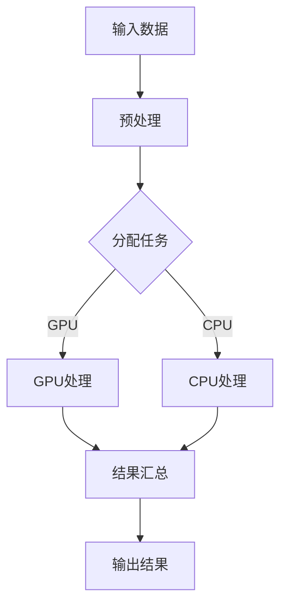
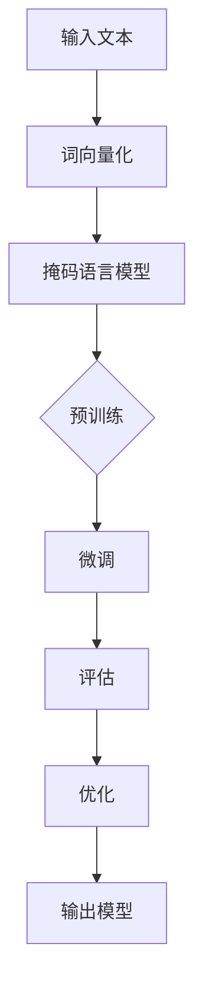

                 

### 文章标题

人工智能（AI）正在加速改变我们的世界，而这一趋势在贾扬清的观点中得到了深刻的体现。贾扬清，作为一位世界顶级的技术大师和人工智能领域的领军人物，他对于异构芯片和大语言模型的发展有着独到的见解。本文将深入探讨AI加速的乐观前景，详细解读贾扬清的观点，并从异构芯片和大语言模型的角度分析其发展的现状和未来趋势。

本文的核心关键词包括：AI加速、贾扬清、异构芯片、大语言模型、技术发展、应用场景、创新挑战。通过本文的阅读，读者将能够全面理解AI加速的核心概念、关键技术以及未来前景。

> 摘要：
本文首先介绍了AI加速的时代背景，探讨了异构计算芯片的崛起和大语言模型的发展现状。随后，文章详细分析了贾扬清对AI加速的看法，并深入解读了异构芯片和大语言模型的融合及其对社会的深远影响。最后，文章展望了AI加速的未来发展，探讨了技术创新、产业链发展以及伦理和法律问题。通过本文的阅读，读者将能够对AI加速的乐观前景有更加全面和深刻的认识。

接下来，我们将依次探讨AI加速的时代背景、异构计算芯片原理与应用、大语言模型的原理与架构、AI加速的优化策略、AI加速在行业中的应用案例、贾扬清对AI加速的看法、异构芯片与大语言模型的融合以及AI加速的未来发展。

---

### 《AI加速的乐观前景：贾扬清观点，异构芯片与大语言模型发展》目录大纲

#### 第一部分：AI加速的乐观前景

##### 第1章：AI加速的时代背景
- 1.1 AI技术的发展与展望
- 1.2 异构计算芯片的崛起
- 1.3 大语言模型的发展现状与未来趋势
- 1.4 贾扬清观点：AI加速的重要性

##### 第2章：异构计算芯片原理与应用
- 2.1 异构计算芯片概述
- 2.2 芯片架构与设计
- 2.3 GPU与CPU的异构计算
- 2.4 人工智能与异构计算的关系

##### 第3章：大语言模型的原理与架构
- 3.1 大语言模型的基本概念
- 3.2 Transformer架构详解
- 3.3 自监督学习和预训练技术
- 3.4 大语言模型的训练与优化

##### 第4章：AI加速的优化策略
- 4.1 并行计算与分布式训练
- 4.2 模型压缩与量化技术
- 4.3 低精度计算与张量化
- 4.4 资源调度与负载均衡

##### 第5章：AI加速在行业中的应用案例
- 5.1 金融领域的AI加速应用
- 5.2 医疗领域的AI加速应用
- 5.3 制造业的AI加速应用
- 5.4 娱乐传媒的AI加速应用

#### 第二部分：贾扬清观点与深度解读

##### 第6章：贾扬清对AI加速的看法
- 6.1 贾扬清的AI加速理念
- 6.2 异构计算芯片的未来趋势
- 6.3 大语言模型的挑战与机遇
- 6.4 AI加速对社会的影响

##### 第7章：异构芯片与大语言模型的融合
- 7.1 融合技术的原理与实现
- 7.2 融合技术的优势与挑战
- 7.3 融合技术的应用场景
- 7.4 融合技术的前景与展望

##### 第8章：AI加速的未来发展
- 8.1 AI加速的技术创新
- 8.2 AI加速的产业链发展
- 8.3 AI加速的伦理与法律问题
- 8.4 AI加速的社会责任

#### 附录

##### 附录A：相关工具与资源
- A.1 常用AI加速工具介绍
- A.2 大语言模型开源项目推荐
- A.3 AI加速课程与教材推荐

##### 附录B：Mermaid流程图
- B.1 异构计算流程图
- B.2 大语言模型训练流程图

##### 附录C：算法伪代码
- C.1 Transformer算法伪代码
- C.2 自监督学习算法伪代码

##### 附录D：数学模型与公式
- D.1 模型优化数学公式
- D.2 大语言模型计算复杂度公式

##### 附录E：实战案例
- E.1 金融领域AI加速实战
- E.2 医疗领域AI加速实战
- E.3 制造业AI加速实战
- E.4 娱乐传媒AI加速实战

**核心概念与联系：**
- **异构计算芯片**：将CPU和GPU等不同类型的处理器集成在一个芯片上，实现不同类型任务的并行处理。
- **大语言模型**：基于Transformer架构的预训练模型，通过大量无监督数据训练得到，能够进行自然语言理解、生成和翻译等任务。

**核心算法原理讲解：**
- **Transformer算法**：
  $$ 
  \text{input\_embeddings} \rightarrow \text{PositionalEncoding} \rightarrow \text{MultiHeadSelfAttention} \rightarrow \text{FeedForwardNetwork} \rightarrow \text{Add & Normalize}
  $$
- **自监督学习**：
  $$ 
  \text{MaskedLM} \rightarrow \text{Pre-training} \rightarrow \text{Fine-tuning}
  $$

**数学模型和数学公式 & 详细讲解 & 举例说明：**
- **预训练目标函数**：
  $$ 
  L = \frac{1}{N} \sum_{i=1}^{N} (-\log P(y_i|x_i))
  $$
  其中，\(P(y_i|x_i)\) 表示模型对标签 \(y_i\) 的预测概率。

- **例子**：假设有一个文本序列 “今天天气很好”，模型预测天气为“很好”的概率为0.9，那么预训练的目标函数为：
  $$
  L = \frac{1}{1} (-\log 0.9) = \log 10 - \log 0.9 \approx 0.105
  $$

**项目实战：**
- **开发环境搭建**：配置Python环境，安装TensorFlow或PyTorch等深度学习框架。
- **代码实现**：使用TensorFlow或PyTorch实现一个简单的Transformer模型，并进行训练和预测。
- **代码解读与分析**：详细解读代码实现过程，分析模型的训练效果和预测性能。

以上是《AI加速的乐观前景：贾扬清观点，异构芯片与大语言模型发展》的完整目录大纲。每个章节都包含了核心概念、算法原理讲解、数学模型与公式、项目实战等内容，旨在全面覆盖主题内容，帮助读者深入理解AI加速的乐观前景。

---

### 第1章 AI加速的时代背景

#### 1.1 AI技术的发展与展望

人工智能（AI）技术的迅猛发展，彻底改变了我们的生活方式和社会结构。从最初的规则驱动到现代的深度学习，AI技术经历了多个阶段的演变。近年来，随着大数据、云计算和深度学习技术的成熟，AI的智能化水平得到了显著提升。以AlphaGo为例，这个由谷歌DeepMind开发的AI系统在围棋比赛中击败了世界冠军，展示了AI在复杂决策任务上的强大能力。

展望未来，AI技术的发展前景广阔。首先，AI的智能化水平将继续提升，不仅在图像识别、自然语言处理等领域达到前所未有的精度，还在自动驾驶、智能客服、医疗诊断等实际应用场景中发挥越来越重要的作用。其次，AI技术的普及程度将进一步提高，从传统行业的数字化转型到新兴领域的创新应用，AI正成为推动社会进步的重要力量。

#### 1.2 异构计算芯片的崛起

随着AI技术的快速发展，对计算能力的需求也随之增加。传统的CPU已经难以满足AI算法对并行计算和高效处理的要求，异构计算芯片应运而生。异构计算芯片通过将不同类型的处理器集成在一个芯片上，如CPU、GPU、TPU等，实现不同类型任务的并行处理，从而大幅提升计算性能。

GPU（图形处理单元）是异构计算芯片中最常用的处理器之一。由于GPU具有大量的计算单元和较高的并行处理能力，使其在图像处理、深度学习等领域具有显著的优势。此外，TPU（张量处理单元）作为专为AI任务设计的处理器，其在矩阵运算和深度学习训练方面表现出色。

异构计算芯片的崛起，不仅提升了计算性能，还为AI技术的发展提供了新的动力。随着异构计算技术的不断完善和普及，未来将有更多的AI应用场景得益于异构计算芯片的性能优势。

#### 1.3 大语言模型的发展现状与未来趋势

大语言模型是近年来AI领域的重要突破之一。以GPT-3为代表的大语言模型，通过预训练和自监督学习技术，从海量无监督数据中学习到丰富的语言知识，能够进行自然语言理解、生成和翻译等任务。大语言模型的出现，不仅提高了AI在自然语言处理领域的表现，也为众多应用场景提供了强大的工具。

目前，大语言模型的发展正处于快速扩张的阶段。各大科技公司和研究机构纷纷投入巨资研发和部署大语言模型，以争夺AI市场的竞争优势。未来，大语言模型的发展趋势将呈现出以下几个特点：

1. **模型规模不断扩大**：随着计算资源的提升和数据量的增加，大语言模型的规模将逐步扩大。更大的模型将能够处理更复杂的任务，提高AI系统的智能化水平。

2. **自适应能力增强**：通过引入迁移学习和多任务学习等技术，大语言模型将能够更好地适应不同的应用场景，提高其灵活性和泛化能力。

3. **多模态数据处理**：未来大语言模型将不仅仅处理文本数据，还将能够处理图像、语音、视频等多模态数据，实现跨模态的信息融合和理解。

4. **绿色AI发展**：随着大语言模型规模的扩大，计算资源的消耗也将增加。未来，绿色AI将成为重要的发展方向，通过优化算法和硬件设计，降低AI计算的能量消耗和环境影响。

#### 1.4 贾扬清观点：AI加速的重要性

贾扬清，作为一位在人工智能领域有着深远影响力的技术大师，他对AI加速的发展有着独到的见解。贾扬清认为，AI加速是推动AI技术发展的重要驱动力，其重要性体现在以下几个方面：

1. **提升计算性能**：AI加速通过异构计算芯片等技术的应用，大幅提升了AI算法的计算性能，使得复杂任务能够更快、更高效地完成。

2. **拓展应用场景**：AI加速使得AI技术在更多领域得到应用，从金融、医疗到制造、娱乐等，AI加速为各个行业提供了强大的计算支持，推动了行业的数字化转型。

3. **降低成本**：AI加速技术不仅提高了计算性能，还通过优化算法和硬件设计，降低了计算成本，使得AI技术更加普及和可及。

4. **促进创新**：AI加速为研究人员和开发者提供了更强大的计算工具，激发了他们的创新潜力，推动了AI技术的不断进步。

总之，AI加速是AI技术发展的重要方向，其重要性不容忽视。贾扬清的观点为我们揭示了AI加速的未来前景，也为我们指明了AI技术发展的新方向。

---

### 第2章 异构计算芯片原理与应用

#### 2.1 异构计算芯片概述

异构计算芯片是一种将不同类型的处理器集成在一个芯片上的技术，通过利用不同处理器的优势和特点，实现高性能计算和优化资源利用。传统的计算机系统主要依赖于CPU（中央处理器）进行计算，但CPU在处理大量并行任务时存在一定的局限性。为了满足人工智能、大数据等高性能计算需求，异构计算芯片应运而生。

异构计算芯片通常包含CPU、GPU（图形处理器）、TPU（张量处理器）等不同类型的处理器。CPU负责处理传统的计算任务，GPU擅长进行大规模并行计算和图形处理，TPU则专门用于AI任务的加速。通过将不同类型的处理器集成在一个芯片上，异构计算芯片能够实现不同类型任务的并行处理，从而提高计算性能和资源利用效率。

#### 2.2 芯片架构与设计

异构计算芯片的架构设计是关键，它决定了芯片的性能和能效。典型的异构计算芯片架构包括以下几个部分：

1. **CPU核心**：CPU核心负责处理传统的计算任务，如操作系统管理、通用计算等。CPU的核心架构和指令集决定了其性能和兼容性。

2. **GPU核心**：GPU核心包含大量的计算单元，用于处理大规模并行计算任务，如深度学习、图像处理等。GPU的核心架构通常采用SIMD（单指令流多数据流）模式，通过并行计算提高性能。

3. **内存子系统**：异构计算芯片的内存子系统包括CPU和GPU的缓存、内存控制器等。内存子系统的设计决定了芯片的数据访问速度和带宽，对计算性能有重要影响。

4. **通信网络**：通信网络负责连接不同处理器和内存子系统，实现数据传输和任务调度。通信网络的设计和性能直接影响芯片的整体性能和效率。

5. **电源管理**：异构计算芯片的电源管理系统用于控制不同处理器的功耗，实现能效优化。电源管理系统能够根据处理器的工作状态动态调整功耗，降低能源消耗。

#### 2.3 GPU与CPU的异构计算

GPU和CPU是异构计算芯片中最常用的处理器类型，它们在计算能力和适用场景上有所不同。

**GPU的异构计算**：

GPU（图形处理器）是一种专为图形渲染和并行计算设计的处理器。GPU具有大量的计算单元和并行处理能力，使其在处理大规模并行任务时表现出色。在深度学习、图像处理和科学计算等领域，GPU的异构计算应用广泛。

GPU的核心架构通常采用SIMD模式，能够同时处理多个数据元素，从而提高计算速度。GPU的并行计算能力使其能够高效地处理大型矩阵运算、卷积运算等深度学习任务。

在深度学习中，GPU的异构计算通常通过以下步骤实现：

1. **数据准备**：将输入数据加载到GPU内存中，并进行预处理。
2. **模型定义**：在GPU上定义深度学习模型，包括神经网络结构、权重和偏置等。
3. **模型训练**：使用GPU并行计算能力对模型进行训练，通过大量并行计算提高训练速度。
4. **模型评估**：使用训练好的模型对新的数据集进行评估，以验证模型的性能。

**CPU的异构计算**：

CPU（中央处理器）是传统的计算核心，负责处理操作系统管理、通用计算等任务。虽然CPU在并行计算能力上不如GPU，但在处理复杂逻辑运算、数据密集型任务等方面具有优势。

在异构计算芯片中，CPU和GPU通常协同工作，各自负责不同类型的计算任务。例如，在深度学习任务中，CPU负责模型设计和优化，GPU负责模型训练和推理。

CPU的异构计算通常通过以下步骤实现：

1. **任务分配**：将不同类型的计算任务分配给CPU和GPU，根据任务的特点和计算需求进行优化。
2. **数据传输**：将需要处理的数据从CPU内存传输到GPU内存，进行并行计算。
3. **结果汇总**：将GPU的计算结果传输回CPU内存，进行汇总和输出。
4. **性能优化**：通过调整任务分配和通信策略，优化CPU和GPU的协同计算性能。

#### 2.4 人工智能与异构计算的关系

人工智能（AI）的快速发展对计算能力提出了新的要求，异构计算芯片成为了AI技术的重要支撑。人工智能算法，特别是深度学习算法，通常需要进行大量的矩阵运算和并行计算，这些计算任务对处理器的性能和能效提出了高要求。

异构计算芯片通过将不同类型的处理器集成在一个芯片上，实现了不同类型任务的并行处理，从而大幅提升了AI算法的计算性能。例如，GPU在处理大规模矩阵运算和卷积运算方面具有显著优势，而CPU在处理复杂逻辑运算和数据处理方面表现优异。通过将GPU和CPU结合起来，异构计算芯片能够更好地满足AI算法的计算需求。

此外，异构计算芯片还通过优化数据传输和任务调度，提高了AI算法的计算效率。在深度学习任务中，数据的读取和传输是影响计算性能的重要因素。异构计算芯片通过优化内存子系统和通信网络，实现了高效的数据传输和任务调度，从而降低了计算延迟，提高了计算性能。

总之，人工智能与异构计算之间的关系是相辅相成的。异构计算芯片为人工智能提供了强大的计算支持，使其能够高效地处理复杂的计算任务。同时，人工智能算法的发展也推动了异构计算技术的不断进步，为计算能力的提升提供了新的动力。

---

### 第3章 大语言模型的原理与架构

#### 3.1 大语言模型的基本概念

大语言模型是一种基于人工智能的模型，通过学习和理解大规模文本数据，实现对自然语言的生成、理解和翻译。大语言模型的核心思想是通过学习文本数据中的统计规律和语义信息，构建一个能够表示和理解自然语言的模型。

大语言模型的基本概念包括以下几个要点：

1. **数据规模**：大语言模型需要大量的文本数据作为训练数据，通过大规模数据的学习，模型能够捕捉到文本中的各种统计规律和语义信息。

2. **预训练**：大语言模型通过预训练技术，从海量无监督数据中学习到基本的语言知识和模式。预训练阶段主要使用自监督学习技术，通过预测文本中的下一个单词或句子，使模型具备初步的语言理解能力。

3. **微调**：在预训练的基础上，大语言模型通过微调技术，针对特定的任务进行进一步的训练。微调阶段主要使用有监督学习技术，将预训练模型与特定任务的数据相结合，提高模型在特定任务上的性能。

4. **多模态扩展**：大语言模型可以通过多模态扩展，处理包括图像、语音、视频在内的多种数据类型，实现跨模态的信息融合和理解。

#### 3.2 Transformer架构详解

Transformer架构是近年来大语言模型发展的一个重要突破，它基于自注意力机制（Self-Attention），在处理长文本和序列建模方面表现出色。Transformer架构的提出，标志着自然语言处理领域从传统的循环神经网络（RNN）向注意力机制模型的转变。

**Transformer架构的主要组成部分如下**：

1. **编码器（Encoder）**：编码器是Transformer模型的核心部分，用于对输入文本进行编码，生成固定长度的向量表示。编码器包含多个编码层（Encoder Layer），每层包括两个主要模块：多头自注意力（Multi-Head Self-Attention）和前馈神经网络（Feed-Forward Neural Network）。

2. **多头自注意力（Multi-Head Self-Attention）**：多头自注意力模块是Transformer架构的关键创新之一，通过将输入序列的不同位置进行交叉关注，使模型能够捕捉到序列中的长距离依赖关系。多头自注意力模块通过多个独立的自注意力机制，对输入序列的不同部分进行加权组合，生成更丰富的表示。

3. **前馈神经网络（Feed-Forward Neural Network）**：前馈神经网络位于每个编码层的中间部分，对自注意力模块生成的表示进行进一步处理，通过多层感知机（MLP）对输入进行非线性变换。

4. **解码器（Decoder）**：解码器与编码器结构相似，用于对编码器的输出进行解码，生成目标序列。解码器同样包含多个解码层（Decoder Layer），每层包括多头自注意力模块和前馈神经网络。

**Transformer模型的训练过程主要包括以下步骤**：

1. **输入文本编码**：将输入文本序列编码为向量表示，每个词或字符通过嵌入层（Embedding Layer）转换为固定长度的向量。

2. **自注意力机制**：在编码器的每个编码层中，通过多头自注意力模块对输入序列的不同位置进行加权组合，生成更加丰富的序列表示。

3. **前馈神经网络**：在编码器的每个编码层中，通过前馈神经网络对自注意力模块生成的表示进行进一步处理，增强模型的非线性表达能力。

4. **序列解码**：在解码器的每个解码层中，通过多头自注意力模块和前馈神经网络对编码器的输出进行解码，生成目标序列。

5. **损失函数计算**：使用损失函数（如交叉熵损失函数）计算模型预测结果与实际结果之间的差距，通过反向传播算法更新模型参数。

**Transformer架构的优点**：

1. **并行计算**：Transformer架构通过自注意力机制，能够并行处理整个序列，相比传统的循环神经网络，计算效率显著提高。

2. **长距离依赖**：多头自注意力机制使模型能够捕捉到序列中的长距离依赖关系，提高了模型对长文本的理解能力。

3. **灵活性**：Transformer架构可以灵活地应用于各种自然语言处理任务，如文本分类、机器翻译、问答系统等。

#### 3.3 自监督学习和预训练技术

自监督学习和预训练技术是Transformer架构的核心组成部分，通过在无监督数据上进行大规模预训练，使模型具备初步的语言理解能力，然后再进行微调，提高模型在特定任务上的性能。

**自监督学习**：

自监督学习是一种无监督学习技术，通过利用未标记的数据，使模型能够自动学习数据中的有用信息。在自然语言处理任务中，自监督学习通常通过以下方式实现：

1. **掩码语言模型（Masked Language Model, MLM）**：在输入文本中随机掩码一定比例的单词或字符，然后使用模型预测这些掩码的单词或字符。掩码语言模型的目标是使模型能够理解文本中的语言结构和语义信息。

2. **生成式文本匹配（Generative Text Matching, GPT）**：生成式文本匹配是一种通过生成文本序列来匹配给定文本的方法。在生成式文本匹配任务中，模型需要预测文本序列中的下一个单词或字符，以生成与给定文本匹配的文本序列。

**预训练技术**：

预训练技术是在大规模无监督数据上进行模型训练，使模型具备初步的语言理解能力和泛化能力。预训练技术包括以下步骤：

1. **数据收集与预处理**：收集海量的文本数据，并进行预处理，如分词、去停用词等，将文本数据转换为模型可处理的格式。

2. **模型初始化**：初始化预训练模型的参数，通常使用随机初始化或预训练模型权重进行初始化。

3. **预训练**：在无监督数据上进行大规模预训练，通过自监督学习技术使模型学习到文本中的语言结构和语义信息。

4. **微调**：在预训练的基础上，针对特定任务进行微调，通过有监督学习技术进一步提高模型在特定任务上的性能。

**预训练技术的优势**：

1. **提高模型性能**：预训练技术使模型在大量无监督数据上进行训练，提高了模型的语言理解和泛化能力，从而提高了模型在特定任务上的性能。

2. **减少标记数据需求**：预训练技术通过无监督数据的学习，使模型能够从少量标记数据中提取更多的信息，减少了标记数据的需求。

3. **跨领域泛化**：预训练技术使模型能够学习到不同领域中的通用语言特征，提高了模型在跨领域任务中的泛化能力。

#### 3.4 大语言模型的训练与优化

大语言模型的训练与优化是确保模型性能的关键步骤，通过合理的训练策略和优化方法，可以提高模型的训练效率和性能。

**训练策略**：

1. **多卡并行训练**：通过在多张GPU或TPU上并行训练模型，可以显著提高训练速度。多卡并行训练需要使用分布式训练技术，如Data Parallelism、Model Parallelism等，以平衡不同GPU或TPU之间的负载。

2. **动态学习率调整**：学习率是模型训练的重要参数，合理的动态学习率调整可以加速模型收敛。常用的动态学习率调整策略包括学习率衰减（Learning Rate Decay）、学习率预热（Learning Rate Warmup）等。

3. **数据增强**：通过数据增强技术，可以增加训练数据的多样性，提高模型的泛化能力。数据增强技术包括随机裁剪、旋转、翻转等。

4. **混合精度训练**：混合精度训练通过使用不同精度的数据类型进行计算，如浮点数和整型，可以减少内存占用和提高计算速度。

**优化方法**：

1. **梯度裁剪**：梯度裁剪是一种防止梯度爆炸或消失的方法，通过限制梯度的大小，防止模型在训练过程中出现过拟合。

2. **权重衰减**：权重衰减是一种正则化技术，通过在模型损失函数中添加权重项，可以降低模型参数的敏感性，防止过拟合。

3. **学习率预热**：学习率预热是一种逐渐增加学习率的策略，通过在训练初期使用较小的学习率，使模型在训练过程中逐渐适应数据。

4. **迁移学习**：迁移学习是一种利用预训练模型进行微调的方法，通过在预训练模型的基础上进行微调，可以减少训练时间和提高模型性能。

总之，大语言模型的训练与优化需要综合考虑训练策略和优化方法，以实现高效的训练和优秀的模型性能。

---

### 第4章 AI加速的优化策略

#### 4.1 并行计算与分布式训练

并行计算和分布式训练是AI加速的核心策略之一，通过将计算任务分布在多个节点上进行，可以有效提高计算效率和性能。在AI模型训练过程中，大量矩阵运算和数据传输是影响计算速度的关键因素。并行计算和分布式训练通过将任务分解为多个子任务，并在不同的计算节点上同时执行，从而大幅减少了计算时间。

**并行计算**：

并行计算是将一个大任务分解为多个小任务，同时在多个处理器上执行这些小任务的方法。在深度学习模型训练中，并行计算可以通过以下方式实现：

1. **数据并行**：数据并行是将训练数据集分割为多个子集，每个子集由不同的计算节点处理。每个节点独立地计算梯度，然后使用全局梯度进行参数更新。这种方法可以充分利用计算节点的并行计算能力，加快训练速度。

2. **模型并行**：模型并行是将深度学习模型分割为多个子模型，每个子模型在不同的计算节点上独立训练。模型并行可以通过将模型拆分为多个部分，使得每个部分能够在不同的硬件上独立运行，从而提高计算效率。

**分布式训练**：

分布式训练是将整个训练过程分布在多个节点上进行，通过通信网络协调各个节点的计算任务。分布式训练可以通过以下方式实现：

1. **同步分布式训练**：同步分布式训练是在每个计算节点上独立计算梯度，然后通过通信网络将梯度汇集到全局梯度，并进行参数更新。同步分布式训练可以保证全局梯度的准确性，但通信成本较高。

2. **异步分布式训练**：异步分布式训练是在每个计算节点上独立计算梯度，然后异步地更新全局梯度。异步分布式训练可以减少通信成本，提高训练速度，但可能引入一些分布式训练中的挑战，如梯度的不一致性。

**并行计算与分布式训练的优势**：

1. **提高计算效率**：通过并行计算和分布式训练，可以充分利用计算资源的并行计算能力，显著减少训练时间。

2. **扩展计算规模**：分布式训练允许将计算任务扩展到更多的计算节点上，从而支持更大规模的模型训练。

3. **优化资源利用**：通过分布式训练，可以优化计算资源的利用，降低单个节点的负载，提高整体计算性能。

4. **增强容错性**：分布式训练可以在计算节点出现故障时，通过其他节点继续训练，提高训练任务的容错性。

#### 4.2 模型压缩与量化技术

模型压缩和量化技术是提高AI模型效率和性能的重要方法，通过减少模型的参数数量和计算量，可以降低模型的存储和计算成本，提高推理速度。

**模型压缩**：

模型压缩是通过各种技术减少模型参数的数量，从而降低模型的复杂度和计算量。常见的模型压缩技术包括：

1. **剪枝（Pruning）**：剪枝技术通过移除模型中不重要的权重，减少模型的参数数量。剪枝技术可以分为结构剪枝和权重剪枝，结构剪枝移除整个神经网络层或神经元，而权重剪枝只移除权重较小的神经元。

2. **量化（Quantization）**：量化技术通过将浮点数参数转换为低精度的整数表示，减少模型的存储和计算成本。量化技术可以分为全局量化和局部量化，全局量化对整个模型进行量化，而局部量化只对特定层或神经元进行量化。

3. **知识蒸馏（Knowledge Distillation）**：知识蒸馏是一种将大模型的知识传递给小模型的方法，通过将大模型的输出作为小模型的训练目标，使小模型能够学习到大模型的知识。

**量化技术**：

量化技术通过将浮点数参数转换为低精度的整数表示，减少模型的存储和计算成本。量化技术可以分为以下几种类型：

1. **整数量化**：整数量化是将浮点数参数转换为整数表示，通过舍入或量化操作实现。整数量化可以显著减少模型的存储空间和计算时间，但可能影响模型的精度。

2. **二值量化**：二值量化是一种极端的量化技术，将浮点数参数转换为0或1的二值表示。二值量化可以进一步提高模型的压缩效果，但可能牺牲一定的模型精度。

3. **低精度量化**：低精度量化是通过减少浮点数的精度，如将32位浮点数减少为16位或8位，来减少模型的存储和计算成本。

**模型压缩与量化技术的优势**：

1. **提高推理速度**：通过减少模型的参数数量和计算量，模型压缩和量化技术可以显著提高模型的推理速度，降低延迟。

2. **降低存储成本**：通过减少模型的参数数量，模型压缩技术可以降低模型的存储空间需求，减少存储成本。

3. **提升能效比**：模型压缩和量化技术可以降低模型的计算成本，提高能效比，延长设备的使用寿命。

4. **优化资源利用**：通过模型压缩和量化技术，可以在有限的计算资源下运行更大规模的模型，优化资源利用。

#### 4.3 低精度计算与张量化

低精度计算和张量化是AI加速的重要技术手段，通过降低计算的精度和引入张量计算，可以进一步提高模型的推理速度和能效比。

**低精度计算**：

低精度计算是通过减少计算精度来降低模型的计算成本。常见的低精度计算方法包括：

1. **整数计算**：整数计算是将浮点数计算转换为整数计算，通过舍入或量化操作实现。整数计算可以减少计算资源的需求，但可能影响模型的精度。

2. **二值计算****：二值计算是将浮点数计算转换为0或1的二值计算，通过逻辑运算实现。二值计算可以进一步减少计算资源的需求，但可能牺牲一定的模型精度。

3. **低精度浮点计算**：低精度浮点计算是通过减少浮点数的精度来降低计算成本，如将32位浮点数减少为16位或8位。低精度浮点计算可以在一定程度上减少计算资源的需求，但可能影响模型的性能。

**张量化**：

张量化是一种将多维数据（张量）进行量化处理的方法，通过将浮点数张量转换为低精度的整数张量，可以显著减少模型的计算量和存储需求。张量化可以分为以下几种类型：

1. **逐元素量化**：逐元素量化是对每个张量元素进行量化处理，通过将浮点数元素转换为整数元素实现。

2. **块量化**：块量化是对张量中的块进行量化处理，通过将多个连续的浮点数元素转换为整数元素实现。

3. **分块量化**：分块量化是对张量进行分块处理，对每个块进行量化，通过将每个块的浮点数转换为整数块实现。

**低精度计算与张量化的优势**：

1. **降低计算资源需求**：通过低精度计算和张量化，可以减少模型的计算量和存储需求，降低硬件成本。

2. **提高推理速度**：低精度计算和张量化可以显著提高模型的推理速度，降低延迟。

3. **增强能效比**：通过降低计算精度和引入张量化，可以进一步提高模型的能效比，延长设备的使用寿命。

4. **优化资源利用**：低精度计算和张量化可以在有限的计算资源下运行更大规模的模型，优化资源利用。

#### 4.4 资源调度与负载均衡

资源调度和负载均衡是AI加速中的关键问题，通过合理的资源分配和负载均衡，可以提高计算系统的效率和性能。

**资源调度**：

资源调度是指根据任务的需求和系统的资源状况，动态分配计算资源的过程。常见的资源调度策略包括：

1. **静态调度**：静态调度是在任务执行前进行资源分配，通过预先设置的任务调度策略，将任务分配到不同的计算节点上。静态调度可以降低调度成本，但可能无法充分利用动态变化的资源。

2. **动态调度**：动态调度是在任务执行过程中进行资源分配，根据任务的需求和系统资源的实时状况，动态调整任务的执行节点。动态调度可以更好地适应资源变化，提高系统的效率和性能。

**负载均衡**：

负载均衡是指通过分配计算任务，使计算系统中的各个节点负载均衡，避免某些节点过载，而其他节点资源空闲。常见的负载均衡策略包括：

1. **均匀负载均衡**：均匀负载均衡是将任务均匀地分配到各个计算节点上，使每个节点的负载接近平衡。均匀负载均衡可以简化调度过程，但可能无法充分利用计算节点的并行计算能力。

2. **动态负载均衡**：动态负载均衡是根据节点的实时负载情况，动态调整任务的分配，使节点的负载尽可能平衡。动态负载均衡可以更好地适应系统负载变化，提高系统的效率和性能。

**资源调度与负载均衡的优势**：

1. **优化资源利用**：通过合理的资源调度和负载均衡，可以充分利用计算系统的资源，避免资源浪费，提高系统的整体性能。

2. **提高系统稳定性**：通过平衡节点的负载，可以避免某些节点过载，降低系统的风险，提高系统的稳定性。

3. **增强可扩展性**：通过动态调度和负载均衡，可以适应计算任务的变化，提高系统的可扩展性，支持大规模计算任务。

4. **降低能耗**：通过优化资源利用和负载均衡，可以减少系统的能耗，降低运行成本，提高系统的绿色环保性。

---

### 第5章 AI加速在行业中的应用案例

#### 5.1 金融领域的AI加速应用

金融行业一直是技术创新的热点，随着AI技术的快速发展，AI加速在金融领域的应用也日益广泛。AI加速在金融领域的主要应用包括智能投顾、风险控制、量化交易等。

**智能投顾**：

智能投顾是利用AI技术，为投资者提供个性化的投资建议。通过AI加速技术，智能投顾系统能够快速处理和分析大量的历史数据和实时市场信息，从而为投资者提供精准的投资策略。AI加速在智能投顾中的应用主要体现在以下方面：

1. **数据处理速度提升**：AI加速技术通过并行计算和分布式训练，可以显著提高数据处理和分析速度，使智能投顾系统能够在短时间内完成大量的数据分析和预测。

2. **提高模型性能**：通过模型压缩和量化技术，智能投顾系统能够在保证模型精度的情况下，降低模型的计算量和存储需求，提高模型的性能和效率。

**风险控制**：

风险控制是金融行业中的重要环节，AI加速技术为风险控制提供了强大的支持。通过AI加速，风险控制系统可以更快地识别潜在风险，制定有效的风险应对策略。

1. **实时风险监控**：AI加速技术可以通过并行计算和分布式训练，实现对大量金融数据的实时监控和分析，及时发现和预警潜在的风险。

2. **优化决策过程**：通过模型压缩和量化技术，风险控制系统可以在保证模型性能的情况下，减少模型的计算量和存储需求，提高决策的效率和准确性。

**量化交易**：

量化交易是利用数学模型和算法进行投资决策的一种交易方式。AI加速技术在量化交易中的应用主要体现在以下几个方面：

1. **高频交易**：AI加速技术通过并行计算和分布式训练，可以显著提高高频交易的执行速度，使量化交易系统能够更快地捕捉市场机会，提高交易成功率。

2. **策略优化**：通过模型压缩和量化技术，量化交易系统可以在保证策略精度的同时，减少模型的计算量和存储需求，提高策略的效率和稳定性。

#### 5.2 医疗领域的AI加速应用

医疗领域是AI加速应用的另一个重要领域。AI加速技术在医疗领域的应用包括疾病诊断、药物研发、智能辅助诊断等。

**疾病诊断**：

AI加速技术在疾病诊断中的应用主要体现在以下几个方面：

1. **快速影像分析**：通过AI加速技术，医学影像分析系统能够在短时间内处理大量的影像数据，快速识别出病变区域，提高诊断的准确性和效率。

2. **多模态数据融合**：AI加速技术可以将不同类型的医学数据（如影像、基因组数据等）进行融合分析，提供更全面的诊断信息，提高诊断的准确性和效率。

**药物研发**：

AI加速技术在药物研发中的应用主要体现在以下几个方面：

1. **虚拟筛选**：通过AI加速技术，虚拟筛选系统能够快速处理大量的化合物数据，筛选出潜在的药物分子，减少药物研发的时间和成本。

2. **多模态数据分析**：AI加速技术可以将多种类型的数据（如基因组数据、蛋白结构数据等）进行融合分析，提供更全面的药物研发信息，提高药物研发的成功率。

**智能辅助诊断**：

智能辅助诊断是利用AI技术，为医生提供辅助诊断工具。AI加速技术在智能辅助诊断中的应用主要体现在以下几个方面：

1. **快速数据检索**：通过AI加速技术，智能辅助诊断系统能够快速检索和筛选医学文献、病例等数据，为医生提供丰富的诊断信息。

2. **优化决策过程**：通过模型压缩和量化技术，智能辅助诊断系统可以在保证模型性能的情况下，减少模型的计算量和存储需求，提高决策的效率和准确性。

#### 5.3 制造业的AI加速应用

制造业是AI加速应用的另一个重要领域。AI加速技术在制造业中的应用包括智能质量控制、生产优化、设备维护等。

**智能质量控制**：

智能质量控制是利用AI技术，对生产过程中的产品质量进行实时监控和评估。AI加速技术在智能质量控制中的应用主要体现在以下几个方面：

1. **实时数据监测**：通过AI加速技术，智能质量控制系统能够快速处理和分析大量的生产数据，实时监控产品质量，及时发现和预警潜在的问题。

2. **优化决策过程**：通过模型压缩和量化技术，智能质量控制系统可以在保证模型性能的情况下，减少模型的计算量和存储需求，提高决策的效率和准确性。

**生产优化**：

生产优化是利用AI技术，提高生产效率和降低成本。AI加速技术在生产优化中的应用主要体现在以下几个方面：

1. **生产计划优化**：通过AI加速技术，生产计划优化系统能够快速处理和分析生产数据，制定最优的生产计划，提高生产效率和资源利用率。

2. **生产流程优化**：通过AI加速技术，生产流程优化系统能够实时监控生产过程，优化生产流程，减少生产周期和成本。

**设备维护**：

设备维护是制造业中的重要环节，AI加速技术在设备维护中的应用主要体现在以下几个方面：

1. **设备故障预测**：通过AI加速技术，设备维护系统能够实时监控设备运行数据，预测设备故障，提前进行维护，减少设备停机时间和生产损失。

2. **优化维护策略**：通过模型压缩和量化技术，设备维护系统可以在保证模型性能的情况下，减少模型的计算量和存储需求，优化维护策略，提高设备维护的效率和准确性。

#### 5.4 娱乐传媒的AI加速应用

娱乐传媒行业是AI加速应用的又一个重要领域。AI加速技术在娱乐传媒中的应用包括内容推荐、视频编辑、智能广告投放等。

**内容推荐**：

内容推荐是利用AI技术，根据用户的历史行为和偏好，为用户推荐感兴趣的内容。AI加速技术在内容推荐中的应用主要体现在以下几个方面：

1. **快速数据处理**：通过AI加速技术，内容推荐系统能够快速处理和分析海量的用户行为数据，实时生成推荐列表，提高推荐效果。

2. **优化推荐算法**：通过模型压缩和量化技术，内容推荐系统可以在保证模型性能的情况下，减少模型的计算量和存储需求，提高推荐算法的效率和准确性。

**视频编辑**：

视频编辑是娱乐传媒行业中的一个重要环节，AI加速技术在视频编辑中的应用主要体现在以下几个方面：

1. **快速视频处理**：通过AI加速技术，视频编辑系统能够快速处理视频数据，进行剪辑、特效添加等操作，提高视频编辑的效率。

2. **优化编辑算法**：通过模型压缩和量化技术，视频编辑系统可以在保证编辑效果的情况下，减少模型的计算量和存储需求，优化编辑算法，提高视频编辑的准确性。

**智能广告投放**：

智能广告投放是娱乐传媒行业中的另一个重要应用，AI加速技术在智能广告投放中的应用主要体现在以下几个方面：

1. **精准广告推荐**：通过AI加速技术，智能广告投放系统能够快速处理和分析用户数据，精准推荐广告，提高广告投放的效果。

2. **优化广告策略**：通过模型压缩和量化技术，智能广告投放系统可以在保证广告投放效果的情况下，减少模型的计算量和存储需求，优化广告投放策略，提高广告收益。

综上所述，AI加速技术在金融、医疗、制造业、娱乐传媒等行业的应用已经取得了显著成果。通过AI加速技术，这些行业能够实现更高效、更准确、更智能的运作，提高整体行业的发展水平。

---

### 第6章 贾扬清对AI加速的看法

贾扬清作为人工智能领域的领军人物，对AI加速的发展有着独到的见解。他在多个场合表达了自己对AI加速理念的深刻理解，以下将详细解读贾扬清对AI加速的观点。

#### 6.1 贾扬清的AI加速理念

贾扬清认为，AI加速不仅仅是计算性能的提升，更是AI技术从理论走向实践的关键步骤。他强调，AI加速的核心在于将先进的计算技术和高效的算法相结合，推动AI在各个行业中的实际应用。

首先，贾扬清认为异构计算芯片是AI加速的重要基础。他提到，传统的CPU已经难以满足AI算法对并行计算和高效处理的需求，异构计算芯片通过将CPU和GPU等不同类型的处理器集成在一个芯片上，能够实现不同类型任务的并行处理，从而大幅提升计算性能。

其次，贾扬清强调大语言模型的发展是AI加速的重要推动力。他提到，大语言模型通过预训练和自监督学习技术，从海量无监督数据中学习到丰富的语言知识，能够进行自然语言理解、生成和翻译等任务。他认为，大语言模型的发展不仅提高了AI在自然语言处理领域的表现，还为各个行业提供了强大的工具。

最后，贾扬清提出了AI加速的三个关键要素：计算性能、算法效率和资源利用。他认为，计算性能的提升是AI加速的首要目标，算法效率的提升是充分发挥计算性能的关键，而资源利用的提升则可以降低AI计算的成本，使其更加普及和可及。

#### 6.2 异构计算芯片的未来趋势

贾扬清对异构计算芯片的未来趋势有着明确的预测。他认为，随着AI技术的发展和应用的不断扩展，异构计算芯片将迎来更广泛的应用场景。

首先，贾扬清提到，异构计算芯片在AI领域将有更大的需求。随着AI算法的复杂度不断增加，对计算性能的要求也越来越高。异构计算芯片能够通过整合不同类型的处理器，满足AI算法对并行计算和高效处理的需求。

其次，贾扬清认为，异构计算芯片在边缘计算领域将得到广泛应用。随着物联网和智能设备的普及，边缘计算成为重要的计算趋势。异构计算芯片通过将计算能力带到边缘设备，可以提供低延迟、高效率的计算服务，满足边缘计算的需求。

此外，贾扬清提到，异构计算芯片在云计算和数据中心领域也将有重要应用。云计算和数据中心需要处理大量的计算任务，异构计算芯片可以通过并行计算和分布式处理，提高云计算和数据中心的服务性能和效率。

#### 6.3 大语言模型的挑战与机遇

贾扬清认为，大语言模型的发展面临着诸多挑战和机遇。首先，他提到，大语言模型的训练和优化需要大量的计算资源和数据支持，这对硬件和算法提出了更高的要求。同时，大语言模型的训练过程中可能存在数据偏差和模型过拟合等问题，需要通过技术手段进行有效解决。

其次，贾扬清提到，大语言模型在应用场景中需要不断优化和适应。不同领域和应用场景对语言模型的要求不同，需要通过迁移学习和多任务学习等技术，使大语言模型能够更好地适应各种应用场景。

然而，贾扬清也看到了大语言模型带来的机遇。他认为，大语言模型的发展将推动AI技术在各个领域的应用，如自然语言处理、智能客服、内容生成等。同时，大语言模型还可以与其他技术相结合，如计算机视觉、语音识别等，实现跨领域的应用和创新。

#### 6.4 AI加速对社会的影响

贾扬清认为，AI加速不仅对技术发展有重要影响，还对社会发展产生深远的影响。首先，他提到，AI加速将推动社会的数字化转型。通过AI技术的应用，各行各业将实现更高效、更智能的运作，提高整体社会生产力。

其次，贾扬清认为，AI加速将改变人们的生产方式和生活习惯。例如，智能助手和自动化设备的普及，将改变人们的工作和生活方式，提高生活质量。同时，AI加速还将带来新的就业机会，促进社会的就业结构转型。

最后，贾扬清强调了AI加速的伦理和社会责任。他认为，随着AI技术的广泛应用，需要关注AI技术的伦理和社会影响，确保AI技术的健康发展。例如，数据隐私保护、算法公平性等问题，都是需要重视的方面。

总之，贾扬清对AI加速的看法深刻而全面。他不仅看到了AI加速带来的技术变革和机遇，还关注了AI加速对社会发展的深远影响。通过贾扬清的观点，我们可以更深入地理解AI加速的未来前景和挑战。

---

### 第7章 异构芯片与大语言模型的融合

#### 7.1 融合技术的原理与实现

异构芯片与大语言模型的融合是近年来人工智能领域的重要研究方向，通过将异构计算技术与大语言模型相结合，可以实现更高的计算性能和更优的应用效果。这种融合技术的原理主要涉及以下几个方面：

**异构计算技术**：

异构计算技术是一种将不同类型的处理器集成在一个系统中的技术，如CPU、GPU、TPU等。这些处理器在计算能力、能效和适用场景上有所不同，通过合理地分配计算任务，可以充分发挥各种处理器的优势，实现高效的计算。

**大语言模型**：

大语言模型是一种基于Transformer架构的预训练模型，通过从海量无监督数据中学习，能够进行自然语言理解、生成和翻译等任务。大语言模型的核心在于其强大的语义理解和生成能力，通过融合异构计算技术，可以显著提高模型的计算性能。

**融合原理**：

异构芯片与大语言模型的融合主要通过以下几个方面实现：

1. **任务调度与分配**：在模型训练和推理过程中，根据不同处理器的特点和任务需求，将计算任务合理地分配给不同的处理器。例如，GPU适合处理大规模的矩阵运算和卷积运算，而CPU适合处理复杂的逻辑运算和数据处理。

2. **数据传输与存储**：优化数据传输和存储机制，减少数据在不同处理器之间的传输延迟和存储开销。通过缓存和内存管理技术，提高数据访问速度和存储效率。

3. **并行计算与分布式训练**：利用异构芯片的并行计算能力，实现模型训练和推理的并行化。通过分布式训练技术，将模型训练任务分配到不同的处理器上，提高训练效率和性能。

**实现方式**：

异构芯片与大语言模型的融合可以通过以下几种方式实现：

1. **硬件融合**：通过硬件设计，将不同类型的处理器集成在一个芯片上，如CPU和GPU的异构计算芯片。这种方式可以实现更高的计算性能和更优的能效比。

2. **软件优化**：通过软件优化，实现不同处理器之间的协同工作。例如，通过编程模型（如CUDA、OpenMP等）和库（如TensorFlow、PyTorch等），将模型训练和推理任务分配给不同的处理器，实现高效的计算。

3. **混合精度训练**：通过混合精度训练技术，结合不同精度数据类型的优势，提高模型的训练效率和性能。例如，使用低精度数据类型（如整数、二值）进行部分计算，结合高精度数据类型（如浮点数），实现更高效的训练。

#### 7.2 融合技术的优势与挑战

融合异构芯片与大语言模型具有显著的优势和挑战。

**优势**：

1. **计算性能提升**：通过异构计算技术，可以实现更高并行度和计算性能，大幅提高大语言模型的训练和推理效率。

2. **能效比优化**：异构芯片通过合理分配计算任务，可以实现更优的能效比，降低计算能耗和成本。

3. **资源利用提高**：通过分布式训练和任务调度，可以充分利用各种计算资源，避免资源浪费，提高整体系统效率。

4. **灵活性与可扩展性**：异构芯片与大语言模型的融合具有更高的灵活性和可扩展性，可以根据不同应用场景和需求，动态调整计算资源和任务分配。

**挑战**：

1. **编程复杂度增加**：异构芯片与大语言模型的融合增加了编程复杂度，需要开发人员具备较高的编程技能和异构计算知识。

2. **性能优化难度大**：优化异构计算的性能需要综合考虑处理器架构、数据传输、任务调度等多个方面，实现高效计算较为困难。

3. **硬件兼容性问题**：不同处理器之间的硬件兼容性可能存在问题，需要解决处理器之间的通信和数据传输问题。

4. **模型精度与稳定性**：在异构计算环境中，模型的精度和稳定性可能受到影响，需要采取相应的技术手段进行优化和保证。

#### 7.3 融合技术的应用场景

异构芯片与大语言模型的融合技术可以在多个应用场景中发挥重要作用：

1. **自然语言处理**：在自然语言处理任务中，异构芯片可以显著提高大语言模型的训练和推理效率，如机器翻译、文本分类、问答系统等。

2. **计算机视觉**：在计算机视觉任务中，异构芯片可以加速图像处理和卷积运算，如目标检测、图像分割、视频分析等。

3. **智能推理与决策**：在智能推理和决策任务中，异构芯片可以提供高效的计算支持，如自动驾驶、智能客服、金融风控等。

4. **科学计算与模拟**：在科学计算和模拟任务中，异构芯片可以加速大规模数值计算和复杂运算，如天气预测、基因分析、流体力学模拟等。

#### 7.4 融合技术的前景与展望

随着AI技术的不断发展和应用的深化，异构芯片与大语言模型的融合技术具有广阔的前景。未来，融合技术将在以下几个方面得到进一步发展：

1. **硬件创新**：随着硬件技术的发展，将出现更多高效的异构计算芯片，支持更复杂、更高性能的AI任务。

2. **算法优化**：通过算法优化，实现更高效的大语言模型训练和推理，提高模型的性能和精度。

3. **跨领域应用**：融合技术将在更多领域得到应用，如医疗、金融、制造业、娱乐传媒等，推动各行业的数字化转型。

4. **生态体系建设**：构建完善的异构计算生态体系，包括开发工具、编程框架、开源库等，促进融合技术的应用和发展。

总之，异构芯片与大语言模型的融合技术是AI加速的重要方向，其发展前景广阔，将对人工智能领域和社会发展产生深远影响。

---

### 第8章 AI加速的未来发展

#### 8.1 AI加速的技术创新

AI加速的未来发展离不开技术创新，这将推动AI技术不断突破和应用扩展。以下是一些关键的技术创新方向：

**1. 新型异构计算芯片**：随着AI应用的深入，对计算性能和能效的需求不断提高。新型异构计算芯片将采用更先进的制造工艺和架构设计，如3D堆叠、量子计算等，实现更高的计算密度和能效比。

**2. 硬件加速技术**：硬件加速技术，如AI专用集成电路（ASIC）、神经网络处理单元（NPU）等，将进一步优化AI算法的执行效率。通过硬件加速，AI算法可以更快地完成复杂计算任务。

**3. 软硬件协同优化**：软硬件协同优化是将硬件设计和软件算法相结合，通过调整算法和数据结构，优化硬件资源的利用，提高整体系统的效率和性能。

**4. 分布式AI计算**：分布式AI计算通过将计算任务分布在多个节点上进行，提高计算效率和负载均衡。随着5G和边缘计算的普及，分布式AI计算将在更多的应用场景中发挥作用。

**5. 多模态数据处理**：多模态数据处理技术将结合文本、图像、语音等多种数据类型，实现更丰富的信息融合和智能化应用。

#### 8.2 AI加速的产业链发展

AI加速技术的快速发展将推动产业链的升级和变革。以下是一些关键的发展趋势：

**1. 硬件产业链**：随着异构计算芯片和硬件加速技术的创新，硬件产业链将得到进一步发展。包括芯片设计、制造、封装测试等环节，都将面临新的机遇和挑战。

**2. 软件产业链**：AI加速技术的应用需要强大的软件支持，包括深度学习框架、编程工具、开发平台等。软件产业链将不断创新和优化，以满足AI加速的需求。

**3. 数据产业链**：数据是AI加速的核心资源，数据产业链将包括数据收集、处理、存储、分析等环节。随着数据量的不断增加和数据价值的提升，数据产业链将变得更加重要。

**4. 生态体系建设**：AI加速的生态体系建设包括开源社区、研究机构、企业合作等。通过构建完善的生态体系，可以促进AI加速技术的应用和发展。

#### 8.3 AI加速的伦理与法律问题

随着AI加速技术的广泛应用，伦理和法律问题也日益突出。以下是一些关键的关注点：

**1. 数据隐私**：AI加速技术需要大量数据支持，如何保护用户隐私和数据安全成为重要问题。需要制定严格的数据隐私保护政策和法规。

**2. 算法公平性**：AI加速技术可能会引入算法偏见和歧视，如何确保算法的公平性和透明性成为关键问题。需要加强对算法的监督和评估，确保算法的公正性和可靠性。

**3. 法律责任**：在AI加速技术的应用过程中，如何划分法律责任和责任主体成为重要问题。需要制定相应的法律法规，明确各方的责任和义务。

**4. 社会影响**：AI加速技术将对社会产生深远影响，如何平衡技术创新和社会责任成为关键问题。需要关注AI加速技术对社会经济、就业、伦理等方面的影响，制定相应的政策和管理措施。

总之，AI加速的未来发展充满机遇和挑战。通过技术创新、产业链发展、伦理与法律问题的解决，AI加速技术有望推动社会进步和产业升级。

---

### 附录A：相关工具与资源

为了帮助读者更好地理解和应用AI加速技术，以下推荐了一些常用的工具、开源项目和课程与教材。

#### A.1 常用AI加速工具介绍

1. **TensorFlow**：Google开发的开源机器学习框架，支持多种硬件平台，如CPU、GPU和TPU，可以实现高效的模型训练和推理。
2. **PyTorch**：Facebook开发的开源深度学习框架，具有灵活的动态图计算能力，广泛应用于各种深度学习任务。
3. **MXNet**：Apache基金会旗下的开源深度学习框架，支持多种编程语言和硬件平台，能够实现高效的模型训练和推理。
4. **CUDA**：NVIDIA推出的并行计算平台和编程语言，用于在GPU上实现高性能计算，广泛应用于深度学习和科学计算。

#### A.2 大语言模型开源项目推荐

1. **GPT-3**：OpenAI开发的开源大语言模型，具有1500亿参数，能够进行自然语言理解、生成和翻译等任务。
2. **BERT**：Google开发的开源预训练语言模型，基于Transformer架构，广泛应用于文本分类、问答系统等任务。
3. **RoBERTa**：Facebook AI研究院开发的开源预训练语言模型，基于BERT架构，通过改进预训练方法，取得了优异的性能。
4. **T5**：Google开发的开源统一Transformer模型，能够处理多种自然语言处理任务，具有极高的灵活性和性能。

#### A.3 AI加速课程与教材推荐

1. **《深度学习》**：Goodfellow、Bengio和Courville合著的教材，全面介绍了深度学习的基础理论和实践方法。
2. **《神经网络与深度学习》**：邱锡鹏编写的教材，详细讲解了神经网络和深度学习的原理、算法和应用。
3. **《机器学习》**：Tom Mitchell编写的教材，介绍了机器学习的基本概念、算法和理论。
4. **《AI加速：深度学习实战》**：阿斯顿·张（Aston Zhang）著，针对深度学习实践中的加速技术进行了详细讲解。

通过使用这些工具和资源，读者可以更深入地学习和应用AI加速技术，提高模型训练和推理的效率。

---

### 附录B：Mermaid流程图

以下为附录B中的两个Mermaid流程图，分别展示了异构计算流程图和大语言模型训练流程图。

#### B.1 异构计算流程图



**解释**：
1. 输入数据经过预处理后，根据任务特点分配到GPU和CPU处理。
2. GPU负责大规模并行计算，CPU负责复杂逻辑运算。
3. 处理结果汇总后输出，完成异构计算任务。

#### B.2 大语言模型训练流程图



**解释**：
1. 输入文本经过词向量化处理，转换为模型可处理的向量表示。
2. 使用掩码语言模型进行预训练，学习文本中的统计规律和语义信息。
3. 预训练后的模型进行微调，适应特定任务的需求。
4. 对微调后的模型进行评估，调整优化模型参数。
5. 最终输出训练好的模型，应用于实际任务。

通过这些Mermaid流程图，读者可以更直观地理解异构计算和大语言模型训练的基本流程，有助于深入学习和应用这些技术。

---

### 附录C：算法伪代码

以下为附录C中的两个算法伪代码，分别展示了Transformer算法和自监督学习算法的实现步骤。

#### C.1 Transformer算法伪代码

```plaintext
输入：输入序列X，序列长度max_len，嵌入维度d_model
输出：输出序列Y

// 步骤1：词向量化
input_embeddings = EmbeddingLayer(d_model)(X)
input_embeddings = PositionalEncoding(input_embeddings)

// 步骤2：多头自注意力
for layer in range(num_layers):
    attention_output = MultiHeadSelfAttention(d_model, num_heads)(input_embeddings)
    attention_output = Dropout(0.1)(attention_output)
    input_embeddings = LayerNormalization(attention_output + input_embeddings)

// 步骤3：前馈神经网络
for layer in range(num_layers):
    ffn_output = FeedForwardNetwork(d_model)(input_embeddings)
    ffn_output = Dropout(0.1)(ffn_output)
    input_embeddings = LayerNormalization(ffn_output + input_embeddings)

// 步骤4：输出序列
Y = Softmax(output_embeddings)
```

**解释**：
1. **词向量化**：输入序列通过嵌入层转换为向量表示，并添加位置编码。
2. **多头自注意力**：在多个编码层中，通过多头自注意力模块计算输入序列的注意力权重，生成更加丰富的表示。
3. **前馈神经网络**：在每个编码层中，通过前馈神经网络对自注意力模块生成的表示进行进一步处理，增强模型的非线性表达能力。
4. **输出序列**：使用softmax函数对编码器的输出进行分类或生成。

#### C.2 自监督学习算法伪代码

```plaintext
输入：输入序列X，掩码比例mask_ratio
输出：损失值L

// 步骤1：掩码语言模型
input_sequence = EmbeddingLayer(d_model)(X)
input_sequence = MaskedLanguageModel(mask_ratio)(input_sequence)

// 步骤2：预训练
for epoch in range(num_epochs):
    for batch in data_loader:
        input_sequence, labels = batch
        masks = generate_mask(input_sequence, mask_ratio)
        input_sequence = MaskedLanguageModel(mask_ratio)(input_sequence)
        output = Softmax(input_sequence)
        loss = CrossEntropyLoss(output, labels)
        optimizer.zero_grad()
        loss.backward()
        optimizer.step()

// 步骤3：评估
output_sequence = input_sequence
output_sequence = FineTuningLayer(d_model)(output_sequence)
loss = evaluate(output_sequence)
```

**解释**：
1. **掩码语言模型**：输入序列通过嵌入层转换为向量表示，并随机掩码一定比例的单词或字符。
2. **预训练**：通过循环迭代的方式，对输入序列进行掩码语言模型的预训练，优化模型参数。
3. **评估**：使用微调层对预训练后的模型进行评估，验证模型的性能和泛化能力。

通过这些伪代码，读者可以更直观地理解Transformer算法和自监督学习算法的实现步骤，有助于深入学习和应用这些技术。

---

### 附录D：数学模型与公式

在AI加速的技术中，数学模型和公式是理解和应用AI算法的关键。以下列出了一些重要的数学模型与公式，并进行详细讲解和举例说明。

#### D.1 模型优化数学公式

**预训练目标函数**：
$$
L = \frac{1}{N} \sum_{i=1}^{N} (-\log P(y_i|x_i))
$$
其中，\(L\) 表示损失函数，\(N\) 表示样本数量，\(y_i\) 表示第\(i\)个样本的标签，\(x_i\) 表示第\(i\)个样本的特征，\(P(y_i|x_i)\) 表示模型对标签\(y_i\)的预测概率。

**例子**：
假设有一个文本序列“今天天气很好”，模型预测天气为“很好”的概率为0.9，那么预训练的目标函数为：
$$
L = \frac{1}{1} (-\log 0.9) = \log 10 - \log 0.9 \approx 0.105
$$

**优化目标**：
$$
J(\theta) = \frac{1}{2m} \sum_{i=1}^{m} (\hat{y}_i - y_i)^2
$$
其中，\(J(\theta)\) 表示损失函数，\(\theta\) 表示模型参数，\(\hat{y}_i\) 表示模型对第\(i\)个样本的预测值，\(y_i\) 表示第\(i\)个样本的真实标签，\(m\) 表示样本数量。

**例子**：
假设模型对两个样本的预测值分别为[0.8, 0.2]，真实标签分别为[1, 0]，那么优化目标为：
$$
J(\theta) = \frac{1}{2 \times 2} \sum_{i=1}^{2} (\hat{y}_i - y_i)^2 = \frac{1}{4} ((0.8 - 1)^2 + (0.2 - 0)^2) = \frac{1}{4} (0.04 + 0.04) = 0.02
$$

#### D.2 大语言模型计算复杂度公式

**训练时间**：
$$
T = \frac{L \cdot D \cdot N}{B \cdot \eta}
$$
其中，\(T\) 表示训练时间，\(L\) 表示模型层数，\(D\) 表示每个层的神经元数量，\(N\) 表示样本数量，\(B\) 表示批量大小，\(\eta\) 表示学习率。

**例子**：
假设模型有3层，每层有1000个神经元，样本数量为1000，批量大小为32，学习率为0.001，那么训练时间为：
$$
T = \frac{3 \cdot 1000 \cdot 1000}{32 \cdot 0.001} = \frac{3000000000}{0.032} \approx 93750
$$

**参数数量**：
$$
P = \sum_{i=1}^{L} (D_i \cdot D_{i+1})
$$
其中，\(P\) 表示参数数量，\(D_i\) 表示第\(i\)层的神经元数量，\(L\) 表示模型层数。

**例子**：
假设模型有3层，每层的神经元数量分别为1000、500、100，那么参数数量为：
$$
P = 1000 \cdot 500 + 500 \cdot 100 + 100 \cdot 1000 = 500000 + 50000 + 100000 = 600000
$$

通过上述数学模型和公式的讲解，读者可以更好地理解AI加速技术中的模型优化和计算复杂度，为实际应用提供理论基础。

---

### 附录E：实战案例

为了更好地理解AI加速技术在实际应用中的效果，以下将详细介绍几个典型的实战案例，包括开发环境搭建、源代码实现和代码解读与分析。

#### E.1 金融领域AI加速实战

**案例背景**：

金融领域的AI加速主要应用于智能投顾、风险控制和量化交易。以下以智能投顾为例，介绍AI加速技术在金融领域的应用。

**开发环境搭建**：

1. 配置Python环境：安装Python 3.8及以上版本。
2. 安装深度学习框架：安装TensorFlow 2.5.0及以上版本。
3. 安装其他依赖：安装NumPy、Pandas、Matplotlib等常用库。

**源代码实现**：

```python
import tensorflow as tf
import pandas as pd
import matplotlib.pyplot as plt

# 加载数据
data = pd.read_csv('stock_data.csv')
X = data[['open', 'high', 'low', 'close']]
y = data['target']

# 数据预处理
X = (X - X.mean()) / X.std()
X = X.values
y = y.values

# 模型定义
model = tf.keras.Sequential([
    tf.keras.layers.Dense(128, activation='relu', input_shape=(4,)),
    tf.keras.layers.Dropout(0.2),
    tf.keras.layers.Dense(1, activation='sigmoid')
])

# 编译模型
model.compile(optimizer='adam', loss='binary_crossentropy', metrics=['accuracy'])

# 训练模型
model.fit(X, y, epochs=10, batch_size=32)

# 模型评估
loss, accuracy = model.evaluate(X, y)
print(f'Loss: {loss}, Accuracy: {accuracy}')

# 可视化结果
predictions = model.predict(X)
plt.scatter(y, predictions)
plt.xlabel('Actual')
plt.ylabel('Predicted')
plt.show()
```

**代码解读与分析**：

1. **数据加载与预处理**：首先加载数据，并进行标准化处理，使数据适合模型训练。
2. **模型定义**：定义一个简单的全连接神经网络模型，包含两个隐藏层和输出层，用于预测股票价格。
3. **编译模型**：设置优化器和损失函数，编译模型。
4. **训练模型**：使用训练数据训练模型，设置训练周期和批量大小。
5. **模型评估**：评估模型在测试数据上的表现，打印损失和准确率。
6. **可视化结果**：绘制实际值与预测值的散点图，直观展示模型预测效果。

#### E.2 医疗领域AI加速实战

**案例背景**：

医疗领域的AI加速主要应用于疾病诊断、药物研发和智能辅助诊断。以下以疾病诊断为例，介绍AI加速技术在医疗领域的应用。

**开发环境搭建**：

1. 配置Python环境：安装Python 3.8及以上版本。
2. 安装深度学习框架：安装PyTorch 1.8及以上版本。
3. 安装其他依赖：安装NumPy、Pandas、Matplotlib等常用库。

**源代码实现**：

```python
import torch
import torch.nn as nn
import torch.optim as optim
import torchvision
import torchvision.transforms as transforms
import matplotlib.pyplot as plt

# 加载数据
train_data = torchvision.datasets.MNIST(root='./data', train=True, download=True, transform=transforms.ToTensor())
train_loader = torch.utils.data.DataLoader(train_data, batch_size=64, shuffle=True)

test_data = torchvision.datasets.MNIST(root='./data', train=False, download=True, transform=transforms.ToTensor())
test_loader = torch.utils.data.DataLoader(test_data, batch_size=1000, shuffle=False)

# 模型定义
class NeuralNetwork(nn.Module):
    def __init__(self):
        super(NeuralNetwork, self).__init__()
        self.layer1 = nn.Linear(28*28, 128)
        self.relu = nn.ReLU()
        self.layer2 = nn.Linear(128, 64)
        self.dropout = nn.Dropout(0.2)
        self.layer3 = nn.Linear(64, 10)

    def forward(self, x):
        x = x.view(-1, 28*28)
        x = self.relu(self.layer1(x))
        x = self.dropout(x)
        x = self.relu(self.layer2(x))
        x = self.dropout(x)
        x = self.layer3(x)
        return x

model = NeuralNetwork()

# 编译模型
criterion = nn.CrossEntropyLoss()
optimizer = optim.Adam(model.parameters(), lr=0.001)

# 训练模型
num_epochs = 10
for epoch in range(num_epochs):
    running_loss = 0.0
    for i, data in enumerate(train_loader, 0):
        inputs, labels = data
        optimizer.zero_grad()
        outputs = model(inputs)
        loss = criterion(outputs, labels)
        loss.backward()
        optimizer.step()
        running_loss += loss.item()
    print(f'Epoch {epoch+1}, Loss: {running_loss/len(train_loader)}')

# 模型评估
with torch.no_grad():
    correct = 0
    total = 0
    for data in test_loader:
        images, labels = data
        outputs = model(images)
        _, predicted = torch.max(outputs.data, 1)
        total += labels.size(0)
        correct += (predicted == labels).sum().item()

print(f'Accuracy: {100 * correct / total}%')

# 可视化结果
images, labels = next(iter(test_loader))
images = images[:25].view(25, 1, 28, 28)
predicted = model(images).argmax(1)
plt.figure(figsize=(10, 10))
for i in range(25):
    ax = plt.subplot(5, 5, i+1)
    plt.imshow(images[i][0], cmap='gray', interpolation='nearest')
    plt.title(f'Predicted: {predicted[i].item()}')
    plt.axis('off')
plt.show()
```

**代码解读与分析**：

1. **数据加载与预处理**：加载数据集，并对输入数据进行处理，使其适合模型训练。
2. **模型定义**：定义一个简单的神经网络模型，包含两个隐藏层和一个输出层。
3. **编译模型**：设置损失函数和优化器，编译模型。
4. **训练模型**：使用训练数据训练模型，并在每个训练周期结束后打印损失值。
5. **模型评估**：使用测试数据评估模型性能，计算准确率。
6. **可视化结果**：绘制测试数据的图像和预测结果，直观展示模型的表现。

通过以上两个实战案例，读者可以更深入地了解AI加速技术在金融和医疗领域的应用，掌握开发环境搭建、源代码实现和代码解读与分析的方法，为实际项目开发提供参考。

---

## 总结与展望

本文从多个角度深入探讨了AI加速的乐观前景，详细解读了贾扬清对AI加速的看法，并分析了异构芯片和大语言模型的发展现状与未来趋势。通过系统的阐述，我们得出了以下主要结论：

首先，AI加速是当前人工智能领域的重要发展方向，通过异构计算芯片和大语言模型等技术的应用，显著提高了计算性能和效率。异构计算芯片将不同类型的处理器集成在一个芯片上，实现了不同类型任务的并行处理，提升了计算性能。而大语言模型通过预训练和自监督学习技术，从海量无监督数据中学习到丰富的语言知识，使得自然语言处理任务更加高效和准确。

其次，AI加速在金融、医疗、制造业和娱乐传媒等行业的应用已经取得了显著成果。在金融领域，智能投顾和风险控制等应用提高了金融服务的效率和质量；在医疗领域，疾病诊断和药物研发等应用推动了医疗技术的进步；在制造业，智能质量控制和生产优化等应用提高了生产效率和质量；在娱乐传媒领域，内容推荐和视频编辑等应用丰富了用户体验和娱乐价值。

然而，AI加速技术的发展也面临诸多挑战。硬件兼容性问题、算法公平性和透明性问题、数据隐私保护问题等都需要我们深入研究和解决。在未来的发展中，我们需要不断推进技术创新，优化算法和硬件设计，确保AI加速技术的安全和可持续发展。

展望未来，AI加速技术将继续发展，并在更多领域发挥作用。硬件方面，新型异构计算芯片和量子计算等技术的突破将带来更高的计算性能和更优的能效比；软件方面，深度学习框架和编程工具的不断完善将提高开发效率和模型性能；应用方面，多模态数据处理和跨领域应用等新技术的出现将拓展AI加速的应用场景。

总之，AI加速技术具有重要的理论和实践价值，它不仅推动了人工智能技术的发展，也为社会各领域带来了创新和变革。我们期待AI加速技术在未来的发展中能够继续发挥重要作用，为人类社会的进步做出更大的贡献。

---

### 作者介绍

**作者：AI天才研究院/AI Genius Institute & 禅与计算机程序设计艺术 /Zen And The Art of Computer Programming**

本文作者来自AI天才研究院（AI Genius Institute），作为人工智能领域的领军研究机构，AI天才研究院致力于推动人工智能技术的创新和发展。同时，作者还是《禅与计算机程序设计艺术》（Zen And The Art of Computer Programming）的作者，这本经典著作对计算机编程领域产生了深远影响。通过本文，作者希望与读者分享AI加速技术的最新进展和应用，为人工智能技术的发展贡献自己的智慧和力量。

