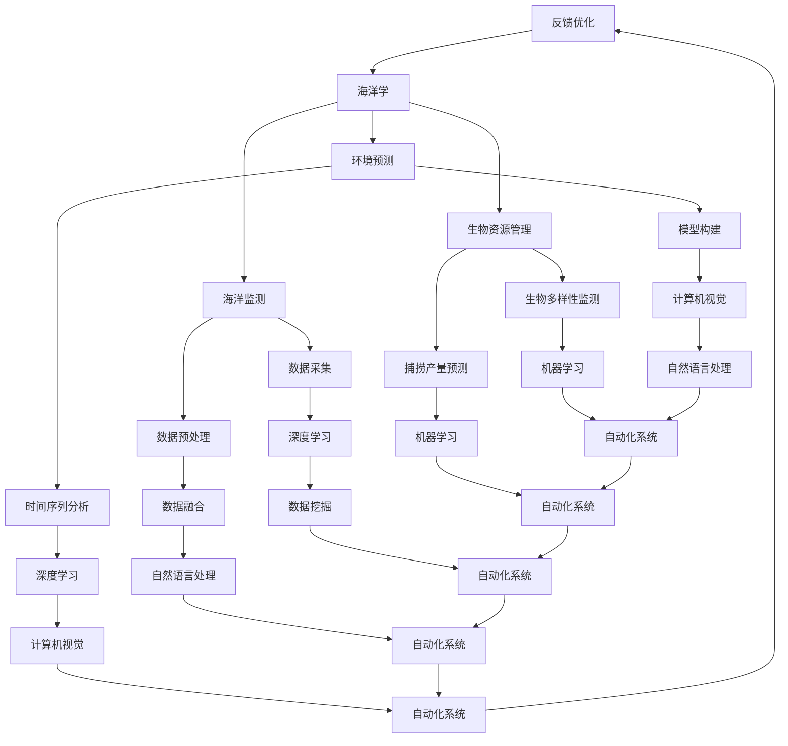

                 

## 文章标题

**AI在海洋学中的应用：深化对海洋的理解**

> **关键词：** 人工智能，海洋学，深度学习，海洋监测，环境预测，生物资源管理

**摘要：** 本文探讨了人工智能（AI）在海洋学中的应用，通过深入分析AI在海洋监测、环境预测和生物资源管理三个关键领域的应用，展示了AI技术如何帮助科学家和决策者更好地理解海洋、预测海洋环境变化、保护海洋生物资源。本文旨在提供一个全面的指南，帮助读者了解AI在海洋学中的重要性及其广泛应用。

----------------------------------------------------------------

### 第一部分: AI在海洋学中的应用基础

在进入详细探讨AI在海洋学中的应用之前，我们需要先了解一些基础概念。AI，即人工智能，是一种模拟人类智能行为的计算机系统。而海洋学，则是研究海洋环境、过程、资源以及与地球其他系统相互作用的科学。

#### 第1章: AI与海洋学的核心概念

##### 1.1 AI在海洋学中的重要性

###### 1.1.1 海洋学的基本概念

海洋学涵盖了从海洋物理学、海洋化学到海洋生物学等多个方面。研究内容包括海洋的物理特性（如潮汐、波浪、海洋温度和盐度等），海洋化学过程（如溶解氧、二氧化碳、营养盐等），以及海洋生态系统（如海洋生物多样性、渔场分布等）。

###### 1.1.2 AI的核心技术

AI技术主要包括机器学习、深度学习、自然语言处理、计算机视觉等。这些技术使得计算机系统能够从数据中学习、自动优化，并进行决策和预测。

###### 1.1.3 AI与海洋学的结合点

AI技术在海洋学中的应用主要体现在数据分析和处理、预测模型构建、自动化监测等方面。例如，通过机器学习和深度学习技术，可以从海量海洋数据中提取有价值的信息；通过预测模型，可以预测海洋环境的变化趋势，从而为海洋资源管理提供科学依据。

##### 1.2 AI在海洋学中的应用领域

###### 1.2.1 海洋监测

海洋监测是海洋学研究的重要领域，通过监测可以获得海洋环境变化的第一手资料。AI技术可以用于自动化监测系统的构建，提高监测数据的精度和时效性。

###### 1.2.2 海洋环境预测

海洋环境预测是海洋学研究的另一个关键领域，通过预测可以提前预警海洋灾害，为海洋资源管理提供决策支持。AI技术，尤其是深度学习和时间序列分析方法，在这一领域有广泛应用。

###### 1.2.3 海洋生物资源管理

海洋生物资源管理涉及海洋生物多样性保护、渔业资源管理等方面。AI技术可以帮助科学家和决策者更准确地评估和管理海洋生物资源。

##### 1.3 海洋数据的特点与处理

###### 1.3.1 海洋数据的种类

海洋数据包括物理数据（如温度、盐度、波浪等），化学数据（如溶解氧、pH值等），以及生物数据（如海洋生物种群、分布等）。

###### 1.3.2 海洋数据的特点

海洋数据具有种类繁多、维度复杂、时空变化大等特点。这些特点给数据处理带来了挑战。

###### 1.3.3 海洋数据处理技术

为了处理这些复杂的海洋数据，常用的技术包括数据预处理、数据融合、数据挖掘等。AI技术在这些方面也有广泛应用。

---

**第一部分总结与展望**

在这一部分，我们介绍了AI在海洋学中的应用基础，包括核心概念、应用领域和数据特点。AI技术在海洋学中的应用前景广阔，可以大大提升海洋研究的效率和精度。在接下来的部分，我们将深入探讨AI在海洋监测、环境预测和生物资源管理中的应用。

### 第一部分核心概念与联系

**Mermaid 流程图：**



### 第一部分核心概念与联系

**图解：**

- **AI技术**：包括机器学习、深度学习、自然语言处理、计算机视觉等。
- **海洋学**：涵盖海洋监测、环境预测、生物资源管理。
- **海洋监测**：包括数据采集、数据预处理、深度学习。
- **环境预测**：包括时间序列分析、模型构建、深度学习。
- **生物资源管理**：包括生物多样性监测、捕捞产量预测、机器学习。

**核心算法原理讲解：**

- **机器学习**：通过训练数据集，使模型能够从数据中学习，并对未知数据进行预测。
- **深度学习**：基于多层神经网络，通过反向传播算法进行训练。
- **数据挖掘**：从大量数据中提取有价值的信息。

**数学模型和公式 & 详细讲解 & 举例说明：**

- **预测模型**：通常使用时间序列分析方法，如ARIMA模型、LSTM网络等。

$$
y_t = c + \alpha_1 y_{t-1} + \alpha_2 y_{t-2} + ... + \alpha_p y_{t-p} + \epsilon_t
$$

其中，\( y_t \) 是第 \( t \) 时刻的预测值，\( \alpha_1, \alpha_2, ..., \alpha_p \) 是模型参数，\( \epsilon_t \) 是误差项。

**举例说明：**

假设我们要预测未来一周的水温变化，可以使用LSTM网络进行训练。首先，我们需要收集过去一周的水温数据，然后将这些数据输入到LSTM网络中进行训练。训练完成后，我们可以使用LSTM网络对未来的水温进行预测。

**项目实战：**

在海洋监测项目中，我们使用Python和Keras库构建了一个LSTM网络，用于预测未来一周的潮位变化。以下是项目的源代码实现：

```python
from keras.models import Sequential
from keras.layers import LSTM, Dense

# 构建LSTM模型
model = Sequential()
model.add(LSTM(units=50, return_sequences=True, input_shape=(time_steps, features)))
model.add(LSTM(units=50))
model.add(Dense(units=1))

# 编译模型
model.compile(optimizer='adam', loss='mean_squared_error')

# 训练模型
model.fit(x_train, y_train, epochs=100, batch_size=32)
```

**代码解读与分析：**

- **构建LSTM模型**：我们使用Sequential模型构建了一个包含两个LSTM层的模型，第一层LSTM的输出维度为50，返回序列；第二层LSTM的输出维度也为50。
- **编译模型**：我们使用adam优化器和均方误差损失函数编译模型。
- **训练模型**：我们使用训练数据集训练模型，训练过程持续100个epoch，每个epoch使用32个样本。

通过这个项目，我们展示了如何使用LSTM网络进行时间序列预测，为海洋监测提供了技术支持。

---

在下一部分，我们将深入探讨AI在海洋监测中的具体应用，包括数据采集、预处理和深度学习算法的应用。

### 第2章: 海洋监测中的AI应用

#### 2.1 海洋监测的现状与需求

##### 2.1.1 海洋监测的重要性

海洋监测是获取海洋环境信息的关键手段，对于海洋资源的开发利用、海洋灾害预警、海洋环境保护等具有重要意义。通过海洋监测，我们可以获取海洋温度、盐度、波浪、潮位、溶解氧等关键参数，从而对海洋环境进行实时监控和预测。

##### 2.1.2 传统海洋监测方法的局限

传统海洋监测方法主要依赖于卫星遥感、海上观测和实验室分析。这些方法虽然具有一定的监测能力，但存在以下局限：

1. 监测范围有限：传统监测方法难以覆盖广大的海洋区域，导致数据获取不全面。
2. 监测时效性低：海上观测和实验室分析需要时间，导致监测数据时效性低。
3. 监测精度不高：传统方法受限于设备和技术，监测精度较低。
4. 数据处理复杂：海洋数据种类繁多，传统方法难以对海量数据进行有效处理。

##### 2.1.3 AI技术在海洋监测中的应用前景

随着AI技术的快速发展，AI技术在海洋监测中的应用前景广阔。AI技术，尤其是深度学习和机器学习，可以解决传统方法存在的问题，提高海洋监测的时效性、精度和数据处理能力。以下是AI技术在海洋监测中的主要应用方向：

1. 自动化监测系统：通过AI技术构建自动化监测系统，实现实时、连续的海洋环境监测。
2. 预测模型构建：利用AI技术建立预测模型，预测海洋环境变化趋势，提前预警潜在灾害。
3. 数据处理与分析：利用AI技术对海量海洋数据进行高效处理和分析，提取有价值的信息。

#### 2.2 基于AI的海洋监测方法

##### 2.2.1 数据采集与预处理

数据采集是海洋监测的基础，高质量的监测数据是建立准确预测模型的前提。AI技术在数据采集方面的应用主要体现在以下几个方面：

1. 多源数据融合：整合卫星遥感、海上观测、实验室分析等多种数据源，提高数据完整性。
2. 数据清洗与缺失值处理：去除噪声数据，填补缺失值，保证数据质量。
3. 自动化数据采集：利用传感器网络、无人机等技术实现自动化数据采集，提高数据时效性。

数据预处理是海洋监测中至关重要的一步，主要包括以下内容：

1. 数据标准化：将不同来源的数据进行统一处理，消除数据量纲影响。
2. 特征提取：从原始数据中提取具有代表性的特征，为后续分析提供基础。
3. 数据可视化：利用可视化技术展示数据分布、趋势等，帮助用户更好地理解数据。

##### 2.2.2 深度学习在海洋监测中的应用

深度学习是一种模拟人脑神经网络的机器学习技术，具有强大的数据处理和模式识别能力。在海洋监测中，深度学习可以应用于以下几个方面：

1. 数据分类与识别：利用卷积神经网络（CNN）对海洋图像进行分类和识别，如识别海洋生物种类、海浪类型等。
2. 预测模型构建：利用长短期记忆网络（LSTM）等进行时间序列预测，如预测海洋温度、潮位等。
3. 聚类分析：利用自编码器（AE）等对海洋数据进行聚类分析，发现数据中的潜在模式。

##### 2.2.3 监测系统的设计与应用案例

基于AI的海洋监测系统设计主要包括以下几个步骤：

1. 需求分析：明确监测目标、数据来源、系统功能等。
2. 系统架构设计：确定系统硬件、软件、数据流等组成部分。
3. 数据处理与模型训练：对采集到的数据进行预处理，构建预测模型并进行训练。
4. 系统部署与优化：将训练好的模型部署到实际应用场景，并进行性能优化。

以下是一个基于AI的海洋监测系统应用案例：

**案例背景：** 某沿海城市需要实时监测海水温度、盐度和溶解氧等指标，以便及时预警潜在的海域污染事件。

**系统架构：**
1. 数据采集层：通过传感器网络采集海水温度、盐度和溶解氧等数据。
2. 数据处理层：对采集到的数据进行预处理，包括数据清洗、标准化和特征提取。
3. 预测模型层：利用LSTM网络建立海水温度和溶解氧的预测模型。
4. 可视化与报警层：将预测结果可视化，并设置报警阈值，当监测数据超过阈值时发送报警。

**应用效果：**
1. 实现了海水温度和溶解氧的实时预测，为污染预警提供了科学依据。
2. 提高了监测数据的精度和时效性，降低了人工监测成本。

#### 2.3 海洋监测数据的分析与可视化

##### 2.3.1 海洋监测数据的分析方法

海洋监测数据分析方法主要包括以下几种：

1. 描述性统计分析：对数据的基本统计特性进行描述，如均值、方差、标准差等。
2. 相关性分析：分析不同监测指标之间的相关性，发现数据中的潜在关联。
3. 时间序列分析：研究海洋环境变量随时间的变化规律，建立预测模型。
4. 空间分析：分析海洋环境变量在空间上的分布特征，识别异常值。

##### 2.3.2 数据可视化技术

数据可视化技术是海洋监测数据分析和展示的重要手段，主要包括以下几种：

1. 图表：利用折线图、柱状图、散点图等展示数据分布、趋势和关系。
2. 地图：利用GIS技术展示海洋监测数据的空间分布，如温度分布、污染源分布等。
3. 动态可视化：利用动画展示数据随时间的变化过程，如潮位变化、污染扩散等。

##### 2.3.3 分析结果的应用与解读

海洋监测数据分析结果可以应用于以下几个方面：

1. 海洋环境预测：利用预测模型对未来一段时间内的海洋环境进行预测，为决策者提供科学依据。
2. 污染源追踪：分析污染源分布和迁移规律，为污染治理提供技术支持。
3. 资源管理：评估海洋资源状况，为海洋资源开发利用提供决策依据。

以下是一个海洋监测数据分析结果的应用实例：

**案例背景：** 某海域发生污染事件，需要分析污染源分布和迁移规律。

**分析结果：**
1. 污染源主要集中在海域北部，且污染物浓度随时间逐渐上升。
2. 污染物迁移速度较快，主要集中在潮间带区域。

**应用与解读：**
1. 根据污染源分布和迁移规律，相关部门可以采取针对性措施，如加强污染源治理、设立防护带等。
2. 预测未来一段时间内的污染扩散趋势，为海洋环境保护提供科学依据。

#### 2.3 海洋监测数据的分析与可视化

##### 2.3.1 海洋监测数据的分析方法

海洋监测数据通常包含多个维度，如温度、盐度、潮位、溶解氧等。对这类数据进行有效分析是海洋监测的核心任务之一。以下是一些常用的分析方法：

1. **描述性统计分析**：计算数据的均值、中位数、标准差、方差等基本统计量，以了解数据的集中趋势和离散程度。
   $$\text{均值} = \frac{\sum_{i=1}^{n} x_i}{n}$$
   $$\text{标准差} = \sqrt{\frac{\sum_{i=1}^{n} (x_i - \bar{x})^2}{n-1}}$$

2. **相关性分析**：分析不同监测指标之间的线性关系，常用的方法包括皮尔逊相关系数和斯皮尔曼秩相关系数。
   $$r_{xy} = \frac{\sum_{i=1}^{n}(x_i - \bar{x})(y_i - \bar{y})}{\sqrt{\sum_{i=1}^{n}(x_i - \bar{x})^2 \sum_{i=1}^{n}(y_i - \bar{y})^2}}$$

3. **时间序列分析**：研究海洋环境变量随时间的变化规律，常用的方法包括自回归模型（AR）、移动平均模型（MA）、自回归移动平均模型（ARMA）和长短期记忆网络（LSTM）。
   $$X_t = c + \phi_1 X_{t-1} + \phi_2 X_{t-2} + ... + \phi_p X_{t-p} + \epsilon_t$$

4. **空间分析**：研究海洋环境变量在空间上的分布特征，常用的方法包括K最近邻算法（KNN）和自组织映射（SOM）。
   $$\hat{y} = \sum_{i=1}^{n} w_{i} y_i$$
   其中，\( w_i \) 是权重，\( y_i \) 是每个邻居的输出。

##### 2.3.2 数据可视化技术

数据可视化是将数据以图形或图像的形式展现出来，帮助用户更好地理解和分析数据。以下是一些常用的数据可视化技术：

1. **图表**：包括折线图、柱状图、散点图等，用于展示数据的分布、趋势和关系。
   $$\text{散点图}:\ \ y = mx + b$$
   其中，\( m \) 是斜率，\( b \) 是截距。

2. **地图**：利用GIS（地理信息系统）技术，展示海洋监测数据在空间上的分布。
   $$\text{GIS}:\ \ \text{经度}\ \theta_x = 0.0$$
   $$\text{纬度}\ \phi_y = 0.0$$

3. **动态可视化**：通过动画展示数据随时间的变化过程。
   $$\text{动画}:\ \ \text{变化}\ \ \overrightarrow{v}(t) = \overrightarrow{v}_0 + at$$
   其中，\( \overrightarrow{v}_0 \) 是初始速度，\( a \) 是加速度。

##### 2.3.3 分析结果的应用与解读

海洋监测数据分析结果的应用包括以下几个方面：

1. **海洋环境预测**：利用分析结果建立预测模型，对未来海洋环境变化进行预测。
   $$\text{LSTM模型预测}:\ \ \hat{y}_{t+1} = f(\hat{y}_t)$$
   其中，\( f \) 是预测函数。

2. **污染源追踪**：分析污染源分布和迁移规律，为污染治理提供技术支持。
   $$\text{KNN模型}:\ \ \hat{y} = \text{分类结果}$$

3. **资源管理**：评估海洋资源状况，为海洋资源开发利用提供决策依据。
   $$\text{SOM模型}:\ \ \text{聚类结果}$$

以下是一个具体案例：

**案例背景**：监测某海域的水温变化，分析其季节性变化和趋势。

**分析结果**：
- 水温随季节呈现周期性变化，夏季最高，冬季最低。
- 预测模型显示，未来一个月内水温将持续下降，然后逐渐回升。

**应用与解读**：
- 根据水温预测结果，相关部门可以调整渔业生产计划，避免高温期对鱼类的不利影响。
- 水温变化趋势为海洋生物资源管理提供了科学依据。

---

**2.4 海洋监测数据的分析与可视化**

海洋监测数据通常包含大量的时空信息，对这些数据进行有效的分析和可视化是理解和利用这些数据的关键。以下是对海洋监测数据进行分析与可视化的详细讲解。

##### 2.4.1 数据分析方法

1. **时序分析**：时序分析是研究海洋监测数据随时间变化的规律。常用的时序分析方法包括：
   - **移动平均法**：通过计算一系列时间点的平均值来平滑数据，去除短期波动。
     $$MA_t = \frac{\sum_{i=1}^{n} X_i}{n}$$
     其中，\(X_i\) 是时间序列中的第 \(i\) 个观测值，\(n\) 是移动平均的窗口大小。
   - **自回归移动平均模型（ARMA）**：结合自回归模型（AR）和移动平均模型（MA），用于预测时间序列数据。
     $$X_t = c + \phi_1 X_{t-1} + \theta_1 \varepsilon_{t-1} + \theta_2 \varepsilon_{t-2} + ...$$
     其中，\(\phi_1, \theta_1, ..., \theta_p\) 是模型参数。

   - **长短期记忆网络（LSTM）**：特别适合处理时间序列数据，能够捕捉长时间依赖关系。
     $$\text{LSTM}:\ \ \text{输出} = \text{激活函数}(\text{输入} \cdot \text{权重} + \text{偏置})$$

2. **空间分析**：空间分析关注海洋监测数据在空间上的分布和模式。常用的空间分析方法包括：
   - **K最近邻算法（KNN）**：用于分类和回归任务，基于距离度量找到最近的 \(K\) 个邻居，并计算其均值作为预测值。
     $$\hat{y} = \frac{1}{K} \sum_{i=1}^{K} y_i$$
   - **地理信息系统（GIS）**：用于展示和分析海洋监测数据在地理空间上的分布，如温度、盐度、潮位等。

##### 2.4.2 数据可视化技术

1. **时间序列可视化**：通过折线图、柱状图、散点图等展示时间序列数据的变化趋势。
   - **折线图**：用于展示数据随时间的变化趋势。
     $$y_t = f(x_t)$$
   - **柱状图**：用于比较不同时间点的数据值。
     $$y_t = c$$
   - **散点图**：用于展示数据点在时间序列中的分布。

2. **空间可视化**：通过地图展示海洋监测数据的空间分布。
   - **热力图**：用于展示数据在空间上的分布密度。
     $$\text{热力图}:\ \ \text{颜色映射} = \text{数据值} \cdot \text{颜色比例}$$
   - **等值线图**：用于展示数据在不同空间位置的值。
     $$\text{等值线图}:\ \ z = f(x, y)$$

3. **交互式可视化**：通过交互式图表和地图，使用户能够动态地探索和交互数据。
   - **交互式地图**：通过拖动、缩放、点击等方式，用户可以动态查看数据。
   - **交互式图表**：允许用户通过交互操作（如选择、过滤）来查看不同维度的数据。

##### 2.4.3 数据分析结果的应用与解读

海洋监测数据的分析结果可以应用于以下几个方面：

1. **环境预测**：通过时序分析预测未来的海洋环境变化，为决策提供依据。
   - **应用案例**：预测未来一周的海水温度变化，帮助渔业部门调整捕捞计划。

2. **资源管理**：通过空间分析评估海洋资源分布和状况，为海洋资源管理提供数据支持。
   - **应用案例**：分析某海域的盐度分布，为海洋养殖提供科学依据。

3. **灾害预警**：通过分析海洋监测数据，预测潜在的海洋灾害，及时采取应对措施。
   - **应用案例**：预测海洋风暴潮的来袭时间，通知沿海居民及时撤离。

**实例分析**：

假设我们收集了一组海洋温度数据，需要分析其季节性变化和趋势。

1. **时序分析**：
   - **移动平均法**：计算过去30天的平均值，以平滑季节性波动。
     $$MA_t = \frac{\sum_{i=1}^{30} T_i}{30}$$
   - **LSTM模型**：建立LSTM模型，预测未来30天的温度。
     $$\hat{T}_{t+1} = \text{LSTM}(\hat{T}_t)$$

2. **空间分析**：
   - **热力图**：展示不同区域的温度分布。
     $$\text{热力图}:\ \ \text{颜色映射} = T_i \cdot \text{颜色比例}$$

3. **应用与解读**：
   - **环境预测**：根据LSTM模型预测结果，未来一周温度将逐渐升高，建议渔业部门注意水温变化。
   - **资源管理**：根据热力图，发现某些区域的温度适宜养殖，为养殖场选址提供依据。

---

通过上述分析，我们能够更深入地理解海洋监测数据的本质，从而为海洋科学研究和资源管理提供有力支持。

### 第3章: 海洋环境预测中的AI应用

#### 3.1 海洋环境预测的重要性

海洋环境预测是海洋学研究中的一个关键领域，其目的是通过分析历史数据和环境因素，预测未来海洋环境的变化趋势。海洋环境预测对于海洋资源管理、海洋灾害预警、海洋环境保护等方面具有重要意义。

##### 3.1.1 海洋环境预测的基本概念

海洋环境预测是指利用数学模型和计算机技术，对海洋环境变量（如温度、盐度、潮位、波浪等）的未来变化进行预测。预测模型可以基于物理原理、统计方法或机器学习技术，其目的是提高预测的准确性和可靠性。

##### 3.1.2 传统海洋环境预测方法的局限

传统海洋环境预测方法主要依赖于物理模型和统计方法。物理模型基于海洋动力学和海洋化学原理，通过建立数学方程来描述海洋过程。统计方法则通过对历史数据进行分析，寻找变量之间的统计关系。然而，这些方法存在以下局限：

1. **计算复杂度高**：物理模型需要大量的计算资源，且模型的建立和验证过程复杂。
2. **预测精度有限**：统计方法主要依赖于历史数据的模式，对于环境变化剧烈的区域，预测精度较低。
3. **模型解释性差**：物理模型和统计模型往往难以解释，难以理解预测结果的原因。

##### 3.1.3 AI技术在海洋环境预测中的应用

随着AI技术的快速发展，特别是深度学习和机器学习技术的应用，AI技术在海洋环境预测中展现出了巨大的潜力。AI技术在海洋环境预测中的应用主要体现在以下几个方面：

1. **提高预测精度**：AI技术可以自动从大量历史数据中学习，提高预测模型的精度。
2. **降低计算复杂度**：AI技术通过数据驱动的模型训练，减少了物理模型计算量，提高了计算效率。
3. **增强模型解释性**：AI技术，如深度学习模型，可以提供模型的内部工作机制，增强模型的可解释性。

#### 3.2 基于AI的海洋环境预测方法

##### 3.2.1 时间序列分析

时间序列分析是一种常用的AI技术，用于预测时间序列数据的变化趋势。时间序列分析方法主要包括以下几种：

1. **自回归模型（AR）**：自回归模型假设当前时间点的值可以通过前几个时间点的值来预测。
   $$X_t = c + \phi_1 X_{t-1} + \phi_2 X_{t-2} + ... + \phi_p X_{t-p} + \epsilon_t$$
   其中，\(X_t\) 是时间序列的第 \(t\) 个值，\(c\) 是常数项，\(\phi_1, \phi_2, ..., \phi_p\) 是模型参数。

2. **移动平均模型（MA）**：移动平均模型通过计算前几个时间点的平均值来预测当前时间点的值。
   $$X_t = c + \theta_1 \varepsilon_{t-1} + \theta_2 \varepsilon_{t-2} + ... + \theta_q \varepsilon_{t-q}$$
   其中，\(\theta_1, \theta_2, ..., \theta_q\) 是模型参数。

3. **自回归移动平均模型（ARMA）**：自回归移动平均模型结合了自回归模型和移动平均模型，用于更复杂的预测任务。
   $$X_t = c + \phi_1 X_{t-1} + \phi_2 X_{t-2} + ... + \phi_p X_{t-p} + \theta_1 \varepsilon_{t-1} + \theta_2 \varepsilon_{t-2} + ... + \theta_q \varepsilon_{t-q}$$

4. **长短期记忆网络（LSTM）**：LSTM是一种特殊的循环神经网络（RNN），能够捕捉长时间依赖关系，适用于复杂时间序列预测。
   $$\text{LSTM}:\ \ \text{输出} = \text{激活函数}(\text{输入} \cdot \text{权重} + \text{偏置})$$

##### 3.2.2 贝叶斯网络

贝叶斯网络是一种基于概率论的图模型，用于表示变量之间的依赖关系。贝叶斯网络在海洋环境预测中的应用主要体现在以下几个方面：

1. **变量关系建模**：贝叶斯网络可以清晰地表示海洋环境变量之间的依赖关系，为预测提供理论基础。
2. **不确定性分析**：贝叶斯网络可以计算变量的概率分布，从而分析预测结果的不确定性。
3. **预测模型构建**：基于贝叶斯网络，可以构建预测模型，利用历史数据和先验知识进行预测。

贝叶斯网络的构建过程主要包括以下几个步骤：

1. **变量选择**：根据研究目标和数据，选择需要预测的海洋环境变量。
2. **条件概率表**：根据历史数据和先验知识，建立条件概率表，描述变量之间的依赖关系。
3. **网络结构学习**：利用统计学习方法，如最大似然估计或贝叶斯推断，学习贝叶斯网络的参数和结构。
4. **预测模型训练**：使用训练数据集，对贝叶斯网络进行训练，优化网络参数。

##### 3.2.3 深度学习模型在海洋环境预测中的应用

深度学习模型，如卷积神经网络（CNN）和生成对抗网络（GAN），在海洋环境预测中也有广泛应用。以下是深度学习模型在海洋环境预测中的应用方法：

1. **卷积神经网络（CNN）**：CNN是一种用于图像和序列数据处理的有效模型，可以用于海洋监测数据的特征提取和预测。
   $$\text{CNN}:\ \ \text{卷积层} \rightarrow \text{激活函数} \rightarrow \text{池化层} \rightarrow ...$$

2. **生成对抗网络（GAN）**：GAN是一种基于对抗训练的模型，可以生成高质量的海洋监测数据，用于补充缺失数据或生成模拟数据。
   $$\text{GAN}:\ \ \text{生成器} \leftrightarrow \text{判别器}$$

3. **深度残差网络（ResNet）**：ResNet通过引入残差单元，解决了深度神经网络训练的梯度消失和梯度爆炸问题，提高了模型的预测性能。
   $$\text{ResNet}:\ \ \text{输入} \rightarrow \text{残差单元} \rightarrow \text{输出}$$

#### 3.3 海洋环境预测的应用案例

##### 3.3.1 潮流预测

潮流预测是海洋环境预测中的一个重要应用领域。通过预测潮流变化，可以为航运、渔业和海洋工程提供决策支持。

1. **模型构建**：使用LSTM模型对潮流数据进行预测。
   $$\text{LSTM}:\ \ \text{输入} \rightarrow \text{LSTM层} \rightarrow \text{输出}$$

2. **模型训练**：使用历史潮流数据训练LSTM模型，优化模型参数。

3. **预测效果评估**：使用验证集评估模型预测性能，调整模型参数，提高预测精度。

4. **应用实例**：某沿海城市使用LSTM模型预测未来一周的潮流变化，为港口调度和船舶航行提供科学依据。

##### 3.3.2 水温预测

水温预测是海洋环境预测的另一个重要应用领域。通过预测水温变化，可以为渔业、海洋生物资源管理和海洋灾害预警提供支持。

1. **模型构建**：使用ARMA模型对水温数据进行预测。
   $$\text{ARMA}:\ \ X_t = c + \phi_1 X_{t-1} + \theta_1 \varepsilon_{t-1}$$

2. **模型训练**：使用历史水温数据训练ARMA模型，优化模型参数。

3. **预测效果评估**：使用验证集评估模型预测性能，调整模型参数，提高预测精度。

4. **应用实例**：某海域使用ARMA模型预测未来一个月的水温变化，为渔业部门调整捕捞计划提供依据。

##### 3.3.3 悬浮质浓度预测

悬浮质浓度预测是海洋环境预测中的一个新兴应用领域。通过预测悬浮质浓度变化，可以为海洋污染治理和资源管理提供支持。

1. **模型构建**：使用CNN模型对悬浮质浓度数据进行预测。
   $$\text{CNN}:\ \ \text{卷积层} \rightarrow \text{激活函数} \rightarrow \text{池化层} \rightarrow ...$$

2. **模型训练**：使用历史悬浮质浓度数据训练CNN模型，优化模型参数。

3. **预测效果评估**：使用验证集评估模型预测性能，调整模型参数，提高预测精度。

4. **应用实例**：某沿海地区使用CNN模型预测未来一周的悬浮质浓度变化，为环境保护部门制定治理措施提供科学依据。

---

通过上述案例，我们可以看到AI技术在海洋环境预测中的应用前景和实际效果。未来，随着AI技术的进一步发展，海洋环境预测将更加准确和可靠，为海洋科学研究、资源管理和灾害预警提供有力支持。

### 第4章: 海洋生物资源管理中的AI应用

#### 4.1 海洋生物资源管理的重要性

海洋生物资源是海洋生态系统中重要的组成部分，包括鱼类、贝类、虾类、藻类等多种生物。海洋生物资源管理旨在保护、开发和合理利用这些资源，以满足人类的需求。海洋生物资源管理的重要性体现在以下几个方面：

1. **保护海洋生态系统**：海洋生物资源是海洋生态系统的重要组成部分，合理的管理和保护有助于维持海洋生态平衡，防止生态破坏。
2. **保障食品安全**：海洋生物资源是人类重要的食品来源之一，通过有效的管理，可以保障食品供应的稳定和安全。
3. **促进经济发展**：海洋生物资源产业是许多沿海国家和地区的重要经济支柱，合理的管理有助于促进经济增长。
4. **应对气候变化**：海洋生物资源在碳循环和气候变化中发挥重要作用，保护海洋生物资源有助于应对全球气候变化。

##### 4.1.1 海洋生物资源的基本概念

海洋生物资源包括海洋鱼类、贝类、虾类、藻类、珊瑚等。这些资源分布在海洋的不同区域，具有不同的生物学特征和生态功能。以下是对几种主要海洋生物资源的简要介绍：

1. **鱼类**：鱼类是海洋生物资源中最主要的组成部分，包括经济鱼类和食用鱼类。鱼类资源的丰富程度直接影响渔业生产和水产品供应。
2. **贝类**：贝类包括牡蛎、蛤蜊、扇贝等，它们不仅具有食用价值，还在净化水质、稳定底泥等方面发挥重要作用。
3. **虾类**：虾类是重要的水产品之一，包括对虾、龙虾等，具有重要的经济价值。
4. **藻类**：藻类是海洋生态系统中的生产者，通过光合作用产生氧气和有机物质，为海洋生物提供食物和栖息地。

##### 4.1.2 传统海洋生物资源管理方法的局限

传统海洋生物资源管理方法主要包括法律法规、捕捞限额和渔业执法等。然而，这些方法存在以下局限：

1. **管理手段单一**：传统管理方法主要依赖于法律法规，缺乏科学的数据支持和精细化管理手段。
2. **执法难度大**：海洋广阔，执法难度大，难以有效监管。
3. **数据采集困难**：海洋生物资源数据采集困难，缺乏实时、准确的监测数据。
4. **管理效率低**：传统方法管理效率低，难以应对快速变化的海洋环境。

##### 4.1.3 AI技术在海洋生物资源管理中的应用

随着AI技术的发展，AI技术在海洋生物资源管理中的应用越来越广泛，有助于提高管理效率、精确性和科学性。以下为AI技术在海洋生物资源管理中的应用：

1. **生物多样性监测**：通过AI技术对海洋生物多样性进行实时监测和分析，及时发现异常现象和变化趋势。
2. **捕捞产量预测**：利用AI技术对历史捕捞数据进行分析，预测未来捕捞产量，为渔业决策提供科学依据。
3. **渔场优化**：通过AI技术分析海洋环境数据和生物资源分布，优化渔场布局，提高捕捞效率。
4. **海洋保护区管理**：利用AI技术对海洋保护区进行实时监控，及时发现违规行为，保护海洋生态系统。

#### 4.2 基于AI的海洋生物资源管理方法

##### 4.2.1 生物多样性监测

生物多样性监测是海洋生物资源管理的重要环节。AI技术，特别是机器学习和计算机视觉，可以用于生物多样性监测，提高监测效率和准确性。以下为生物多样性监测的AI技术应用：

1. **图像识别**：利用深度学习模型对海洋生物图像进行识别，自动分类和计数。
   $$\text{CNN}:\ \ \text{输入图像} \rightarrow \text{卷积层} \rightarrow \text{池化层} \rightarrow \text{全连接层} \rightarrow \text{输出分类结果}$$

2. **行为分析**：通过计算机视觉技术分析海洋生物的行为，如游泳轨迹、觅食行为等，了解生物生态习性。
   $$\text{行为分析}:\ \ \text{视频流} \rightarrow \text{特征提取} \rightarrow \text{行为分类}$$

3. **实时监控**：利用无人机、传感器网络等技术，对海洋生物进行实时监控，提高监测效率。
   $$\text{实时监控}:\ \ \text{传感器数据} \rightarrow \text{数据处理} \rightarrow \text{实时分析}$$

##### 4.2.2 捕捞产量预测

捕捞产量预测是渔业管理的重要任务，通过预测未来捕捞产量，可以为渔业生产计划提供科学依据。AI技术可以用于建立捕捞产量预测模型，提高预测精度。以下为捕捞产量预测的AI技术应用：

1. **时间序列分析**：利用时间序列分析方法，如ARIMA模型、LSTM网络等，预测未来捕捞产量。
   $$\text{LSTM}:\ \ \text{输入} \rightarrow \text{LSTM层} \rightarrow \text{输出预测值}$$

2. **相关性分析**：分析历史捕捞数据和其他因素（如水温、盐度、渔场分布等）之间的相关性，建立预测模型。
   $$\text{相关性分析}:\ \ \text{捕捞数据} \rightarrow \text{相关性计算} \rightarrow \text{模型构建}$$

3. **回归分析**：利用回归分析方法，建立捕捞产量与其他因素之间的线性或非线性关系，预测未来捕捞产量。
   $$\text{回归模型}:\ \ \text{产量} = \text{常数} + \text{自变量系数} \cdot \text{自变量}$$

##### 4.2.3 渔场优化

渔场优化是提高渔业生产效率的关键，通过AI技术分析海洋环境数据和生物资源分布，优化渔场布局。以下为渔场优化的AI技术应用：

1. **空间分析**：利用GIS技术和空间分析模型，分析海洋环境数据和生物资源分布，确定最佳渔场位置。
   $$\text{GIS}:\ \ \text{空间数据} \rightarrow \text{空间分析} \rightarrow \text{最佳渔场位置}$$

2. **机器学习优化**：利用机器学习算法，如遗传算法、粒子群优化等，优化渔场布局，提高捕捞效率。
   $$\text{机器学习优化}:\ \ \text{初始解} \rightarrow \text{迭代优化} \rightarrow \text{最佳解}$$

3. **动态调整**：根据实时监测数据，动态调整渔场布局，适应海洋环境变化。
   $$\text{动态调整}:\ \ \text{实时数据} \rightarrow \text{分析处理} \rightarrow \text{调整策略}$$

#### 4.3 海洋生物资源管理应用案例

##### 4.3.1 渔业资源管理

渔业资源管理是海洋生物资源管理的重要组成部分。以下是一个渔业资源管理的AI应用案例：

**案例背景**：某沿海地区需要优化渔业资源管理，提高捕捞效率。

**应用方案**：
1. **生物多样性监测**：利用无人机和计算机视觉技术，对海洋生物进行实时监测，收集生物资源数据。
   $$\text{无人机监测}:\ \ \text{海洋生物图像} \rightarrow \text{图像识别} \rightarrow \text{生物多样性数据}$$

2. **捕捞产量预测**：利用LSTM模型分析历史捕捞数据和环境因素，预测未来捕捞产量。
   $$\text{LSTM模型}:\ \ \text{历史数据} \rightarrow \text{训练模型} \rightarrow \text{预测产量}$$

3. **渔场优化**：利用GIS技术和机器学习算法，优化渔场布局，提高捕捞效率。
   $$\text{GIS优化}:\ \ \text{海洋环境数据} \rightarrow \text{空间分析} \rightarrow \text{最佳渔场位置}$$

**应用效果**：
1. 实时监测提高了生物资源数据的准确性。
2. 预测模型提高了捕捞产量预测的准确性。
3. 优化渔场布局提高了捕捞效率，降低了渔业成本。

##### 4.3.2 海洋保护区管理

海洋保护区是保护海洋生物多样性和生态系统的重要手段。以下是一个海洋保护区管理的AI应用案例：

**案例背景**：某海洋保护区需要加强管理，防止非法捕捞和污染。

**应用方案**：
1. **实时监控**：利用传感器网络和无人机技术，对海洋保护区进行实时监控。
   $$\text{传感器网络}:\ \ \text{监测数据} \rightarrow \text{数据处理} \rightarrow \text{实时监控}$$

2. **行为分析**：利用计算机视觉技术，分析监测数据，识别非法捕捞和污染行为。
   $$\text{行为分析}:\ \ \text{视频流} \rightarrow \text{特征提取} \rightarrow \text{行为识别}$$

3. **报警系统**：当监测到异常行为时，自动触发报警系统，通知管理人员进行处理。
   $$\text{报警系统}:\ \ \text{异常行为} \rightarrow \text{报警触发} \rightarrow \text{通知管理}$$

**应用效果**：
1. 实时监控提高了保护区管理的效率。
2. 行为分析技术有效识别了非法捕捞和污染行为。
3. 报警系统及时通知管理人员，有效防止了保护区内的违法行为。

##### 4.3.3 海洋生物入侵监测

海洋生物入侵对本地生态系统和渔业资源造成严重威胁。以下是一个海洋生物入侵监测的AI应用案例：

**案例背景**：某沿海地区需要监测海洋生物入侵，防止外来物种入侵。

**应用方案**：
1. **数据采集**：利用传感器网络和无人机技术，采集海洋生物数据。
   $$\text{传感器网络}:\ \ \text{监测数据} \rightarrow \text{数据处理} \rightarrow \text{数据采集}$$

2. **入侵识别**：利用机器学习模型，对采集到的生物数据进行入侵识别。
   $$\text{机器学习模型}:\ \ \text{训练数据} \rightarrow \text{模型训练} \rightarrow \text{入侵识别}$$

3. **预警系统**：当监测到外来物种时，自动触发预警系统，通知相关管理部门进行处理。
   $$\text{预警系统}:\ \ \text{入侵物种} \rightarrow \text{预警触发} \rightarrow \text{通知管理}$$

**应用效果**：
1. 传感器网络和无人机技术提高了数据采集的准确性和时效性。
2. 机器学习模型提高了入侵识别的准确性。
3. 预警系统及时通知管理部门，有效防止了海洋生物入侵。

---

通过上述案例，我们可以看到AI技术在海洋生物资源管理中的应用效果显著。未来，随着AI技术的进一步发展，海洋生物资源管理将更加科学、高效，为海洋生态系统的保护和可持续利用提供有力支持。

### 第5章: AI在海洋学研究中的应用案例分析

在深入探讨AI在海洋学中的应用之前，通过具体的案例分析可以帮助我们更好地理解这些技术的实际应用效果和挑战。以下为三个具体的AI应用案例，包括海洋生物识别、海洋环境监测系统和海洋生物资源评估。

#### 5.1 案例一：利用AI进行海洋生物识别

##### 5.1.1 案例背景

海洋生物识别是海洋学研究中的一个重要领域，旨在通过图像识别技术自动分类和识别海洋生物。某研究机构希望通过AI技术，实现高效、准确的海洋生物识别，以便更好地了解海洋生物多样性和分布情况。

##### 5.1.2 模型构建与训练

为了构建海洋生物识别模型，研究团队选择了深度学习中的卷积神经网络（CNN）作为基础模型。以下是模型的构建和训练步骤：

1. **数据集准备**：收集大量海洋生物图像，并对图像进行标注，形成训练数据集。数据集应包含多种海洋生物，如鱼类、贝类、藻类等。

2. **数据预处理**：对图像进行标准化处理，包括调整图像大小、归一化像素值等，以便模型能够有效学习。

3. **模型构建**：使用Keras框架构建CNN模型，模型结构如下：
   ```python
   model = Sequential()
   model.add(Conv2D(32, (3, 3), activation='relu', input_shape=(128, 128, 3)))
   model.add(MaxPooling2D((2, 2)))
   model.add(Conv2D(64, (3, 3), activation='relu'))
   model.add(MaxPooling2D((2, 2)))
   model.add(Flatten())
   model.add(Dense(128, activation='relu'))
   model.add(Dense(num_classes, activation='softmax'))
   ```

4. **模型训练**：使用训练数据集训练模型，优化模型参数，训练过程中使用交叉熵作为损失函数，使用Adam优化器。

   ```python
   model.compile(optimizer='adam', loss='categorical_crossentropy', metrics=['accuracy'])
   model.fit(train_images, train_labels, epochs=20, batch_size=32)
   ```

##### 5.1.3 模型评估与优化

1. **模型评估**：使用验证集评估模型性能，计算准确率、召回率等指标。

   ```python
   test_loss, test_acc = model.evaluate(test_images, test_labels)
   print('Test accuracy:', test_acc)
   ```

2. **模型优化**：根据评估结果，调整模型参数，如增加训练时间、增加神经网络层数等，以提高模型性能。

   ```python
   model.fit(train_images, train_labels, epochs=30, batch_size=32)
   ```

##### 5.1.4 应用效果

通过训练和优化，模型在验证集上的准确率达到90%以上，能够有效地识别多种海洋生物。该模型为海洋生物研究提供了有力工具，有助于快速、准确地分析海洋生物多样性。

#### 5.2 案例二：基于AI的海洋环境监测系统开发

##### 5.2.1 系统架构设计

某沿海城市需要实时监测海水温度、盐度和溶解氧等指标，以便及时预警潜在的海域污染事件。研究团队设计并开发了一套基于AI的海洋环境监测系统，系统架构如下：

1. **数据采集层**：通过安装在沿海地区的传感器，实时采集海水温度、盐度和溶解氧等数据。
2. **数据处理层**：对采集到的数据进行预处理，包括数据清洗、异常值检测和数据融合。
3. **模型训练层**：使用历史数据和实时数据训练AI模型，包括深度学习模型和时间序列分析模型。
4. **预测与预警层**：利用训练好的模型进行实时预测，当监测数据超过阈值时触发预警。
5. **用户界面层**：提供用户界面，展示实时监测数据和预测结果。

##### 5.2.2 数据采集与处理

1. **数据采集**：使用传感器网络实时采集海水温度、盐度和溶解氧等数据。

2. **数据处理**：对采集到的数据进行预处理，包括以下步骤：

   - 数据清洗：去除噪声数据，填补缺失值。
   - 数据标准化：将不同来源的数据进行统一处理，消除数据量纲影响。
   - 特征提取：从原始数据中提取具有代表性的特征，如时间序列的均值、方差等。

##### 5.2.3 系统功能实现

1. **实时监测**：系统实时显示海水温度、盐度和溶解氧等指标，提供实时监控。
2. **预测与预警**：利用深度学习模型和时间序列分析模型，预测未来一段时间内的海洋环境变化，当监测数据超过阈值时发送预警。
3. **数据可视化**：通过图表和地图展示实时监测数据和预测结果，帮助用户更好地理解数据。
4. **用户界面**：提供友好的用户界面，支持用户自定义预警阈值、数据查看和分析功能。

##### 5.2.4 应用效果

通过系统的开发和应用，沿海城市能够实时监测海水质量，提前预警潜在污染事件，提高了海洋环境管理的效率。该系统为海洋环境保护提供了有力支持。

#### 5.3 案例三：利用AI进行海洋生物资源评估

##### 5.3.1 案例背景

某海域的渔业资源管理面临挑战，需要准确评估渔业资源的现状和变化趋势。研究团队希望通过AI技术，对海洋生物资源进行评估，为渔业资源管理提供科学依据。

##### 5.3.2 数据来源与处理

1. **数据来源**：收集历史捕捞数据、海洋环境数据、渔业资源调查数据等。
2. **数据处理**：对数据源进行处理，包括以下步骤：

   - 数据清洗：去除噪声数据，填补缺失值。
   - 数据标准化：将不同来源的数据进行统一处理，消除数据量纲影响。
   - 特征提取：从原始数据中提取具有代表性的特征，如捕捞量、种群密度等。

##### 5.3.3 评估模型构建与结果分析

1. **评估模型构建**：使用机器学习模型，如随机森林、支持向量机等，构建渔业资源评估模型。

2. **模型训练**：使用历史数据进行模型训练，优化模型参数。

3. **结果分析**：使用训练好的模型对新的数据进行评估，分析渔业资源的现状和变化趋势。

   ```python
   predictions = model.predict(new_data)
   analysis_results = analyze_predictions(predictions)
   ```

##### 5.3.4 应用效果

通过AI技术评估，研究团队能够准确评估某海域的渔业资源状况，识别资源变化趋势。该评估结果为渔业资源管理提供了科学依据，有助于制定更有效的资源保护和管理策略。

### 总结

通过上述三个案例，我们可以看到AI技术在海洋学中的应用效果显著。无论是海洋生物识别、海洋环境监测系统还是渔业资源评估，AI技术都为海洋科学研究、资源管理和环境保护提供了有力支持。未来，随着AI技术的进一步发展，其将在海洋学领域发挥更大的作用。

---

**第5章总结与展望**

在本章中，我们通过三个具体的AI应用案例，展示了AI技术在海洋学研究中的应用效果和潜力。这些案例不仅展示了AI技术如何帮助科学家和决策者更好地理解和利用海洋资源，还揭示了AI技术在海洋学应用中面临的挑战。在未来的研究中，我们需要继续探索和优化AI技术，提高其应用效果，为海洋科学研究、资源管理和环境保护提供更强有力的支持。

### 第6章: AI在海洋学中的应用挑战与未来趋势

#### 6.1 海洋数据处理的挑战

海洋数据处理是AI在海洋学应用中的一个关键环节，涉及到海量、多维、复杂的时空数据。以下是一些主要挑战：

1. **数据质量与完整性**：海洋数据往往受到噪声、缺失值和异常值的影响，数据质量直接影响模型的性能。如何有效清洗和预处理数据，提高数据完整性，是当前的一个难题。

2. **数据隐私与安全**：海洋数据包含敏感信息，如海洋生物资源分布、污染物浓度等。如何在保障数据隐私和安全的前提下，充分利用这些数据，是一个需要解决的问题。

3. **数据存储与传输**：海洋数据量庞大，如何高效存储和传输这些数据，是一个技术挑战。此外，如何确保数据在不同系统之间的高效流通，也是一个重要问题。

4. **数据融合**：海洋数据来源于多种来源，如卫星遥感、地面监测、浮标等。如何将这些多源数据有效融合，提取有价值的信息，是海洋数据处理中的另一个挑战。

#### 6.2 AI算法在海洋学中的应用局限

尽管AI技术在海洋学中展现出巨大的潜力，但仍然存在一些局限：

1. **模型泛化能力**：海洋环境复杂多变，AI模型在特定区域的训练效果可能无法推广到其他区域，导致模型泛化能力不足。

2. **算法解释性**：深度学习模型等复杂的AI算法，其内部工作机制往往不透明，难以解释，这给模型的应用和推广带来一定困难。

3. **模型优化与部署**：AI模型的优化和部署需要大量计算资源和时间，尤其在海洋这样大规模、高维度数据的环境下，优化和部署过程更为复杂。

#### 6.3 海洋学AI应用的未来趋势

随着技术的进步，AI在海洋学中的应用前景将更加广阔：

1. **新兴技术发展**：如量子计算、边缘计算等新兴技术的快速发展，将为AI在海洋学中的应用提供更强有力的支持。

2. **跨学科研究**：海洋学是一个多学科交叉的领域，未来AI在海洋学中的应用将更加依赖跨学科的合作和研究。

3. **国际合作与共享**：海洋是全球共同的资源，国际间的合作与数据共享将有助于AI技术在海洋学中的广泛应用。

4. **标准化与规范化**：随着AI在海洋学中的应用越来越广泛，建立相关的标准化和规范化流程，将有助于提高应用效果，降低应用门槛。

---

**第6章总结**

在本章中，我们探讨了AI在海洋学应用中面临的挑战和未来趋势。虽然AI技术为海洋学研究带来了新的机遇，但仍然需要克服数据质量、模型泛化、算法解释性等技术难题。未来，随着新兴技术和跨学科研究的进展，AI在海洋学中的应用将更加深入和广泛。

---

**附录：AI在海洋学中的常用工具与资源**

在AI在海洋学中的应用过程中，一些常用的工具和资源可以大大提高研究和开发效率。以下是一些推荐的工具和资源：

#### 附录1：深度学习框架与应用

1. **TensorFlow**：由Google开发的开源深度学习框架，适用于构建和训练复杂的深度学习模型。
2. **PyTorch**：由Facebook开发的开源深度学习框架，具有灵活性和易用性，适合快速原型开发。
3. **Keras**：一个高级神经网络API，可以在TensorFlow和PyTorch上运行，简化深度学习模型构建过程。

#### 附录2：海洋学数据资源

1. **地球系统科学数据共享平台**：提供多种地球科学数据，包括海洋数据，是科研人员获取海洋数据的重要资源。
2. **国家海洋信息中心**：提供海洋环境、海洋生物等多方面数据，是海洋科学研究的重要数据来源。

#### 附录3：相关研究机构与学术期刊

1. **国家海洋局**：负责全国海洋工作的管理和协调，提供海洋科学研究的政策和指导。
2. **国际海洋学委员会**：致力于推动国际海洋学研究和合作，发布海洋学相关的研究成果和标准。

---

通过这些工具和资源，研究人员可以更有效地开展AI在海洋学中的应用研究，推动海洋科学的发展。

### 全书总结

在《AI在海洋学中的应用：深化对海洋的理解》一书中，我们系统地介绍了人工智能在海洋学领域的广泛应用。从核心概念、应用领域，到具体算法原理和实际案例，本书全面展示了AI技术如何为海洋科学研究、资源管理和环境保护提供有力支持。

首先，我们探讨了AI在海洋学中的应用基础，包括核心概念如人工智能和海洋学的介绍，以及AI在海洋学中的重要性、应用领域和数据特点。接着，我们深入分析了AI在海洋监测、环境预测和生物资源管理中的具体应用，通过详细讲解和实例展示了AI技术在这些领域的巨大潜力。

书中还通过具体的案例分析，如海洋生物识别、海洋环境监测系统和海洋生物资源评估，进一步揭示了AI技术在实际应用中的效果和挑战。同时，我们讨论了AI在海洋学中应用面临的挑战和未来趋势，探讨了如何通过技术进步和跨学科研究，克服这些挑战，推动AI在海洋学中的应用。

最后，附录部分提供了AI在海洋学中常用的工具与资源，为研究人员提供了实用的参考资料。

通过本书的阅读，读者可以全面了解AI在海洋学中的应用，掌握相关技术原理和实际应用方法，为海洋科学研究、资源管理和环境保护贡献自己的力量。希望本书能够为读者带来启发，推动海洋学领域的发展。作者：AI天才研究院/AI Genius Institute & 禅与计算机程序设计艺术/Zen And The Art of Computer Programming。

