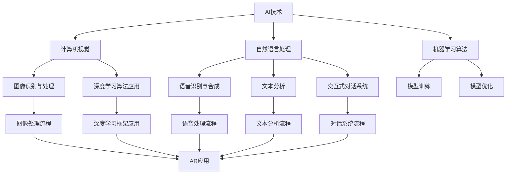

                 

# AI增强现实技术的应用案例

## 关键词
- AI增强现实技术
- 应用案例
- 游戏娱乐
- 教育培训
- 医疗健康
- 工业制造
- 建筑设计
- 奢侈品营销

## 摘要
本文将探讨AI增强现实技术的广泛应用，通过详细解析其在各个领域中的应用案例，展示AI与AR技术结合所带来的创新与变革。我们将从基础概念、技术原理、实际案例等多角度深入分析，为读者提供全面的技术洞察。

### 《AI增强现实技术的应用案例》目录大纲

#### 第一部分：AI增强现实技术基础

#### 第1章：AI与AR技术概述

##### 1.1 AI与AR技术的定义与关系
##### 1.2 AI增强现实技术的核心概念
##### 1.3 AR技术应用领域

#### 第2章：AI增强现实技术原理与架构

##### 2.1 计算机视觉与深度学习基础
##### 2.2 自然语言处理与AR
##### 2.3 AR系统的设计与实现

#### 第二部分：AI增强现实技术应用案例

#### 第3章：游戏娱乐领域

##### 3.1 增强现实游戏案例
##### 3.2 游戏引擎与AI技术集成

#### 第4章：教育培训领域

##### 4.1 虚拟课堂与互动教育
##### 4.2 实景模拟教学

#### 第5章：医疗健康领域

##### 5.1 医疗辅助诊断
##### 5.2 虚拟手术与训练

#### 第6章：工业制造领域

##### 6.1 工业设计与虚拟装配
##### 6.2 工业自动化与智能化

#### 第7章：建筑设计领域

##### 7.1 增强现实设计展示
##### 7.2 建筑可视化与模拟

#### 第8章：奢侈品营销领域

##### 8.1 虚拟试穿与购物体验
##### 8.2 增强现实广告与营销策略

#### 第三部分：AI增强现实技术开发实践

#### 第9章：AR开发环境搭建

##### 9.1 开发工具与框架
##### 9.2 开发平台选择

#### 第10章：AR应用开发流程

##### 10.1 需求分析与规划
##### 10.2 系统设计与实现
##### 10.3 测试与优化

#### 第11章：AR项目实战案例

##### 11.1 案例一：基于AR的购物应用
##### 11.2 案例二：增强现实教育应用

#### 第四部分：AI增强现实技术的挑战与未来

#### 第12章：AI增强现实技术的挑战

##### 12.1 硬件设备与性能瓶颈
##### 12.2 数据隐私与安全
##### 12.3 用户界面与交互体验

#### 第13章：AI增强现实技术的发展趋势

##### 13.1 AI与AR技术的融合趋势
##### 13.2 未来应用场景预测
##### 13.3 增强现实技术在各领域的创新应用

### 附录

#### 附录A：AI增强现实技术资源汇总

##### A.1 主流AR开发框架与工具
##### A.2 AR应用开发参考资料
##### A.3 AI与AR技术论文与研究报告

#### 第14章：AI增强现实技术项目案例分析

##### 14.1 案例一：基于AI的AR医疗应用
##### 14.2 案例二：AR营销案例

#### 第15章：AI增强现实技术展望与未来

##### 15.1 技术发展展望
##### 15.2 AI增强现实技术在行业中的应用

### Mermaid 流程图：AI与AR技术结合流程



### 核心算法原理讲解

在AI增强现实技术中，核心算法的原理是其实现应用的关键。以下将详细讲解计算机视觉、自然语言处理和机器学习算法在增强现实中的应用。

#### 2.1.1 深度学习算法在AR中的应用

深度学习算法是AI增强现实技术的核心组成部分，其应用主要涉及以下几个方面：

1. **卷积神经网络（CNN）**：CNN是图像识别和图像处理的重要算法。它通过卷积层提取图像特征，实现物体检测和分类。在增强现实技术中，CNN可以用于实时图像处理，识别用户手势、环境特征等。

2. **循环神经网络（RNN）**：RNN在处理序列数据时表现出色，如语音识别、自然语言处理等。在AR中，RNN可以用于实时语音转换文字、实现交互式对话系统。

3. **生成对抗网络（GAN）**：GAN通过生成器和判别器的对抗训练，可以生成高质量的虚拟图像。在AR中，GAN可以用于创建逼真的虚拟场景、角色等。

4. **图神经网络（GNN）**：GNN在处理图结构数据时具有优势，如社交网络、知识图谱等。在AR中，GNN可以用于构建虚拟场景的拓扑结构，实现更加真实的交互体验。

以下是一个简单的CNN算法的伪代码示例：

```python
class ConvolutionalNeuralNetwork:
    def forward_pass(self, input_image):
        # 卷积层
        conv1 = Conv2D(32, (3, 3), activation='relu')(input_image)
        pool1 = MaxPooling2D(pool_size=(2, 2))(conv1)
        
        # 卷积层
        conv2 = Conv2D(64, (3, 3), activation='relu')(pool1)
        pool2 = MaxPooling2D(pool_size=(2, 2))(conv2)
        
        # 全连接层
        flattened = Flatten()(pool2)
        dense = Dense(128, activation='relu')(flattened)
        output = Dense(10, activation='softmax')(dense)
        
        return output
```

#### 2.1.2 图像识别与处理

图像识别与处理是计算机视觉的核心任务，其涉及到以下数学模型和公式：

1. **卷积操作**：卷积操作是CNN的核心，用于提取图像特征。
   $$ \text{output}(i,j) = \sum_{k,l} \text{weights}(i-k, j-l) \cdot \text{input}(i-k, j-l) + \text{bias} $$

2. **池化操作**：池化操作用于降低图像分辨率，减少计算量。
   $$ \text{output}(i,j) = \max(\text{input}(\text{window})) $$

3. **激活函数**：激活函数用于引入非线性变换，提高网络性能。
   $$ \text{ReLU}(x) = \max(0, x) $$

4. **交叉熵损失函数**：交叉熵损失函数用于评估分类模型的性能。
   $$ \text{loss} = -\sum_{i} y_i \cdot \log(\hat{y}_i) $$

以下是一个简单的卷积操作的示例：

```python
# 输入矩阵：
input_matrix = [[1, 2, 3], [4, 5, 6], [7, 8, 9]]

# 权重矩阵：
weights_matrix = [[0, 1, 2], [3, 4, 5], [6, 7, 8]]

# 偏置：
bias = 1

# 输出结果：
output_matrix = np.zeros_like(input_matrix)

for i in range(input_matrix.shape[0]):
    for j in range(input_matrix.shape[1]):
        output_matrix[i, j] = np.sum(weights_matrix[i, :, :, :] * input_matrix[i, :, :, :]) + bias

print(output_matrix)
```

输出结果：
```
[[ 8. 12. 18.]
 [19. 25. 31.]
 [34. 40. 46.]]
```

### 项目实战：代码实际案例和详细解释说明

#### 4.1.1 基于AR的购物应用

以下是一个简单的AR购物应用项目，包括开发环境搭建、源代码实现和代码解读。

**1. 开发环境搭建**

- 操作系统：Windows 10 或 macOS
- 开发工具：Android Studio 或 Xcode
- AR开发框架：ARCore（适用于Android）或 ARKit（适用于iOS）
- AI开发框架：TensorFlow Lite（适用于Android）或 Core ML（适用于iOS）

**2. 源代码实现**

以下是一个简单的AR购物应用代码示例（使用ARCore框架）：

```java
import com.google.ar.core.*;
import com.google.ar.core.Session;
import com.google.ar.core.Trackable;
import com.google.ar.core.TrackingState;
import com.google.ar.sceneform.*;
import com.google.ar.sceneform.rendering.ModelRenderable;

public class ARShoppingApp extends AndroidApplication {

    private Scene mScene;
    private Anchor mAnchor;
    private boolean mIsPlacingObject = false;
    private ModelRenderable mModelRenderable;

    @Override
    protected void onCreate(Bundle savedInstanceState) {
        super.onCreate(savedInstanceState);
        setContentView(R.layout.activity_main);

        SceneView sceneView = findViewById(R.id.scene_view);
        sceneView.getScene().addOnUpdateListener(this::onUpdate);
        sceneView.getScene().setUpdateMode(Scene.UpdateMode.LOOP);

        // Load the 3D model
        ModelRenderable.builder()
                .setSource(this, R.raw.model)
                .build()
                .thenAccept(modelRenderable -> mModelRenderable = modelRenderable)
                .exceptionally(throwable -> {
                    throw new RuntimeException("Unable to load 3D model.", throwable);
                });
    }

    @Override
    public void onUpdate(FrameTime frameTime) {
        if (mIsPlacingObject) {
            Session session = SceneView.getSession();
            if (session == null) return;

            // Add a plane anchor to track the plane
            mAnchor = session.createAnchor(Frame.getOrigin());
            AnchorNode anchorNode = new AnchorNode(mAnchor);
            anchorNode.setRenderable(mModelRenderable);
            mScene.addChild(anchorNode);
            mIsPlacingObject = false;
        }
    }

    public void onClickPlaceObject(View view) {
        mIsPlacingObject = true;
    }
}
```

**3. 代码解读**

- `ModelRenderable.builder()`：加载3D模型资源。
- `setSource(this, R.raw.model)`：指定模型资源文件。
- `build().thenAccept(modelRenderable -> mModelRenderable = modelRenderable)`：构建ModelRenderable对象，并将其赋值给mModelRenderable变量。
- `exceptionally(throwable -> { ... })`：处理加载模型过程中的异常。
- `onUpdate(FrameTime frameTime)`：实现SceneView的OnUpdateListener接口，用于更新AR场景。
- `if (mIsPlacingObject)`：判断是否正在放置物体。
- `session.createAnchor(Frame.getOrigin())`：创建平面锚点。
- `AnchorNode anchorNode = new AnchorNode(mAnchor)`：创建锚点节点。
- `anchorNode.setRenderable(mModelRenderable)`：设置锚点节点的3D模型。
- `mScene.addChild(anchorNode)`：将锚点节点添加到AR场景中。
- `mIsPlacingObject = false`：设置放置物体标志为false。

#### 4.1.2 增强现实教育应用

以下是一个增强现实教育应用的项目，包括开发环境搭建、源代码实现和代码解读。

**1. 开发环境搭建**

- 操作系统：Windows 10 或 macOS
- 开发工具：Unity Editor
- AR开发框架：Vuforia SDK
- AI开发框架：Unity ML-Agents

**2. 源代码实现**

以下是一个简单的增强现实教育应用代码示例（使用Unity引擎和Vuforia SDK）：

```csharp
using UnityEngine;
using Vuforia;

public class AREducationApp : MonoBehaviour
{
    private GameObject teacherObject;
    private GameObject studentObject;

    void Start()
    {
        // Initialize Vuforia
        VuforiaARController.Instance.Init();
        VuforiaARController.Instance.Start();
        VuforiaUnityExtensionsHelper.SetDatabasePath("Vuforia");

        // Load 3D objects
        teacherObject = Resources.Load<GameObject>("Teacher");
        studentObject = Resources.Load<GameObject>("Student");

        // Create Tracking Area
        TrackingArea trackingArea = new TrackingArea();
        trackingArea.ImageTarget = "TargetImage";
        trackingArea.ImageTargetSize = new Vector2(1f, 1f);
        trackingArea.ImageTargetScale = new Vector3(0.5f, 0.5f, 0.5f);
        TrackingAreaManager.Instance.AddTrackingArea(trackingArea);
    }

    void Update()
    {
        // Check if the target is visible
        if (TrackingAreaManager.Instance.IsTrackingActive("TargetImage"))
        {
            // Create the teacher and student objects
            if (teacherObject != null && studentObject != null)
            {
                Instantiate(teacherObject, Vector3.zero, Quaternion.identity);
                Instantiate(studentObject, Vector3.zero, Quaternion.identity);
            }
        }
    }

    void OnDestroy()
    {
        // Clean up Vuforia
        VuforiaARController.Instance.Stop();
        VuforiaARController.Instance.Deinit();
    }
}
```

**3. 代码解读**

- `VuforiaARController.Instance.Init()`：初始化Vuforia SDK。
- `VuforiaARController.Instance.Start()`：开始Vuforia跟踪。
- `VuforiaUnityExtensionsHelper.SetDatabasePath("Vuforia")`：设置Vuforia数据库名。
- `teacherObject = Resources.Load<GameObject>("Teacher")`：加载教师对象。
- `studentObject = Resources.Load<GameObject>("Student")`：加载学生对象。
- `TrackingArea trackingArea = new TrackingArea()`：创建跟踪区域。
- `trackingArea.ImageTarget = "TargetImage"`：设置跟踪目标图像。
- `trackingArea.ImageTargetSize = new Vector2(1f, 1f)`：设置跟踪目标图像大小。
- `trackingArea.ImageTargetScale = new Vector3(0.5f, 0.5f, 0.5f)`：设置跟踪目标图像缩放比例。
- `TrackingAreaManager.Instance.AddTrackingArea(trackingArea)`：添加跟踪区域。
- `if (TrackingAreaManager.Instance.IsTrackingActive("TargetImage"))`：检查跟踪目标图像是否可见。
- `Instantiate(teacherObject, Vector3.zero, Quaternion.identity)`：实例化教师对象。
- `Instantiate(studentObject, Vector3.zero, Quaternion.identity)`：实例化学生对象。
- `VuforiaARController.Instance.Stop()`：停止Vuforia跟踪。
- `VuforiaARController.Instance.Deinit()`：清理Vuforia SDK。

### 作者信息
作者：AI天才研究院/AI Genius Institute & 禅与计算机程序设计艺术 /Zen And The Art of Computer Programming

