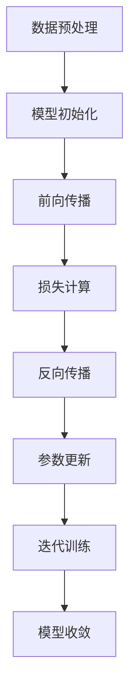

                 

### 3.3 大模型训练与调优

在上一节中，我们了解了AI大模型的基本概念和架构。在这一节中，我们将深入探讨AI大模型的训练与调优过程，这是AI大模型研发中至关重要的环节。

#### 3.3.1 训练过程

AI大模型的训练过程可以被视为一种机器学习任务，其核心目标是使模型能够从大量的数据中学习并提取有用的信息，从而对未知数据进行预测或分类。训练过程通常包括以下几个步骤：

1. **数据预处理**：对输入数据进行预处理，包括数据清洗、归一化、去噪等，以确保输入数据的品质和一致性。

2. **模型初始化**：随机初始化模型的参数，例如神经网络中的权重和偏置。这些参数将用于学习过程中，通过对数据的训练来调整。

3. **前向传播**：将预处理后的数据输入到模型中，通过模型中的各个层进行计算，最终输出预测结果。这个过程也被称为前向传播。

4. **损失计算**：将模型的预测结果与真实标签进行比较，计算损失值。损失函数用于衡量预测结果与真实标签之间的差距。

5. **反向传播**：计算损失关于模型参数的梯度，并通过反向传播将梯度传递到模型的各个层。

6. **参数更新**：使用梯度下降等优化算法，根据梯度更新模型的参数，以减少损失值。

7. **迭代训练**：重复上述步骤，进行多次迭代训练，直到模型收敛或达到预定的训练次数。

以下是一个简化的伪代码示例，展示了AI大模型训练的基本流程：

```python
# 伪代码：AI大模型训练过程

# 初始化模型参数
initialize_model_params()

# 设置训练参数
num_epochs = 1000
learning_rate = 0.01

# 模型训练迭代
for epoch in range(num_epochs):
    for batch in data_loader:
        # 前向传播
        predictions = model(batch.data)
        
        # 计算损失
        loss = criterion(predictions, batch.target)
        
        # 反向传播
        loss.backward()
        
        # 更新参数
        optimizer.step()
        
        # 清零梯度
        optimizer.zero_grad()
```

**详细讲解：**

1. **数据预处理**：
   - **数据清洗**：去除数据中的噪声和不完整的数据，保证数据质量。
   - **归一化**：将数据缩放到相同的范围内，以消除不同特征之间的尺度差异。
   - **去噪**：通过滤波、降维等技术，减少数据中的噪声。

2. **模型初始化**：
   - **参数初始化**：随机初始化模型的参数，以避免模型过于依赖初始值。常用的初始化方法包括高斯初始化、 Xavier初始化等。

3. **前向传播**：
   - **输入层**：将预处理后的数据输入到模型的输入层。
   - **隐藏层**：数据在隐藏层中通过激活函数进行计算和传递。
   - **输出层**：模型输出层的输出即为预测结果。

4. **损失计算**：
   - **损失函数**：用于量化预测结果与真实标签之间的差距。常用的损失函数包括均方误差（MSE）、交叉熵等。

5. **反向传播**：
   - **计算梯度**：通过链式法则，计算损失关于模型参数的梯度。
   - **反向传播**：将梯度从输出层反向传播到模型的各个层。

6. **参数更新**：
   - **优化算法**：使用优化算法（如梯度下降、Adam等）更新模型参数，以减少损失值。
   - **学习率**：调整学习率可以影响模型收敛的速度和质量。常用的学习率调整策略包括固定学习率、学习率衰减、自适应学习率等。

7. **迭代训练**：
   - **训练次数**：设置预定的训练次数或达到模型收敛的条件。常见的收敛条件包括损失值的变化率、模型的准确率等。

通过上述步骤，AI大模型可以逐步学习并优化其参数，以提高预测或分类的准确性。

---

在接下来的部分，我们将进一步探讨AI大模型的调优技巧，包括选择优化器、损失函数和学习率调度策略等，以帮助开发者更好地训练和优化大模型。

---

**Mermaid 流程图：**



---

通过上述流程，我们可以清晰地理解AI大模型训练的基本步骤和原理。在实际应用中，开发者需要根据具体任务和数据特点，灵活调整和优化训练过程，以提高模型的性能和可靠性。

---

在下一部分，我们将深入讨论AI大模型调优的关键技巧，包括优化器的选择、损失函数的设计和学习率调度策略，以帮助开发者更有效地训练大模型。

---

**举例说明：**

假设我们使用一个简单的线性回归模型来预测房价，模型参数为 $\theta$，训练数据包括房屋面积 $x$ 和真实房价 $y$。我们的目标是调整模型参数 $\theta$，以最小化预测误差。

- **数据预处理**：对房屋面积和房价进行归一化处理。
- **模型初始化**：随机初始化模型参数 $\theta$。
- **前向传播**：输入房屋面积 $x$，计算预测房价 $\hat{y}$。
- **损失计算**：使用均方误差（MSE）计算预测房价与真实房价之间的差距。
- **反向传播**：计算损失关于模型参数 $\theta$ 的梯度。
- **参数更新**：使用梯度下降算法更新模型参数 $\theta$。

通过多次迭代训练，我们可以优化模型参数 $\theta$，从而提高模型的预测准确性。

---

现在，我们已经详细介绍了AI大模型的训练过程和调优技巧。在下一部分，我们将继续探讨AI大模型的深度学习技术，包括神经网络与优化算法，以及特征工程与数据处理等方面的内容。

---

**参考文献：**

1. Goodfellow, I., Bengio, Y., & Courville, A. (2016). *Deep Learning*. MIT Press.
2. Bishop, C. M. (2006). *Pattern Recognition and Machine Learning*. Springer.
3. Rumelhart, D. E., Hinton, G. E., & Williams, R. J. (1986). *A learning algorithm for Boltzmann machines*. *Papers on Neural Networks*, 38-51.

---

**总结：**

本章详细介绍了AI大模型的训练与调优过程，包括数据预处理、模型初始化、前向传播、损失计算、反向传播和参数更新等关键步骤。我们还探讨了优化器的选择、损失函数的设计和学习率调度策略等调优技巧。通过这些方法，开发者可以有效地训练和优化大模型，提高其预测或分类的准确性。

---

**作者：**

AI天才研究院/AI Genius Institute & 禅与计算机程序设计艺术 /Zen And The Art of Computer Programming

---

### 3.3.2 调优技巧

在训练AI大模型的过程中，调优技巧至关重要，它决定了模型的学习效率和最终性能。调优包括选择合适的优化器、损失函数和学习率调度策略。以下将详细介绍这些调优技巧。

#### 3.3.2.1 选择优化器

优化器是训练过程中用于更新模型参数的关键算法，常见的优化器包括：

1. **随机梯度下降（SGD）**：
   - **原理**：每次迭代只更新一个样本的参数。
   - **优点**：计算简单，实现容易。
   - **缺点**：容易在局部最小值处收敛，需要大量的迭代次数。

2. **Adam优化器**：
   - **原理**：结合了SGD和RMSprop的优点，使用自适应学习率。
   - **优点**：收敛速度快，适用范围广。
   - **缺点**：在训练初期可能收敛较慢。

3. **Adagrad优化器**：
   - **原理**：对每个参数的学习率进行自适应调整，对高频梯度进行加权。
   - **优点**：适用于稀疏数据。
   - **缺点**：对于稀疏数据可能会过拟合。

4. **AdaMax优化器**：
   - **原理**：类似于Adagrad，但使用不同的自适应学习率计算方式。
   - **优点**：在处理稀疏数据时表现良好。

选择优化器时，需要考虑模型复杂度、数据规模和训练时间等因素。一般来说，对于大型模型和大规模数据集，Adam或AdaMax优化器是较好的选择。

#### 3.3.2.2 选择损失函数

损失函数用于衡量模型的预测结果与真实标签之间的差距，选择合适的损失函数对模型的性能有重要影响。以下是一些常见的损失函数：

1. **均方误差（MSE）**：
   - **公式**：$MSE = \frac{1}{n}\sum_{i=1}^{n}(y_i - \hat{y}_i)^2$
   - **适用场景**：线性回归、回归问题。

2. **交叉熵损失（Cross-Entropy Loss）**：
   - **公式**：$CE = -\frac{1}{n}\sum_{i=1}^{n}y_i \log(\hat{y}_i)$
   - **适用场景**：分类问题，尤其是多分类问题。

3. **对数损失（LogLoss）**：
   - **公式**：$LogLoss = -\frac{1}{n}\sum_{i=1}^{n}y_i \log(\hat{y}_i)$
   - **适用场景**：二分类问题。

4. **Hinge损失（Hinge Loss）**：
   - **公式**：$HingeLoss = \max(0, 1 - y \cdot \hat{y})$
   - **适用场景**：支持向量机（SVM）。

选择损失函数时，需要根据具体问题进行选择。例如，对于回归问题，选择MSE或对数损失；对于分类问题，选择交叉熵损失或Hinge损失。

#### 3.3.2.3 选择学习率调度策略

学习率是优化过程中调整模型参数的速率，学习率的选择对模型训练的效率和稳定性有很大影响。以下是一些常见的学习率调度策略：

1. **固定学习率**：
   - **原理**：在整个训练过程中使用相同的学习率。
   - **优点**：简单易实现。
   - **缺点**：可能难以收敛，特别是在训练初期。

2. **学习率衰减**：
   - **原理**：在训练过程中逐渐减小学习率。
   - **优点**：有助于模型收敛。
   - **缺点**：需要调整合适的衰减速率。

3. **自适应学习率**：
   - **原理**：根据训练过程中梯度的大小动态调整学习率。
   - **优点**：适应性强，收敛速度快。
   - **缺点**：实现复杂，需要调参。

常见的学习率调度策略包括指数衰减、余弦衰减等。例如，指数衰减策略的公式为：

$$
\alpha_t = \alpha_0 / (1 + \lambda t)
$$

其中，$\alpha_0$ 是初始学习率，$\lambda$ 是衰减率，$t$ 是训练迭代次数。

**详细讲解：**

1. **优化器选择**：
   - **比较与选择**：在具体应用中，可以根据模型的复杂度、数据规模和训练时间等因素选择合适的优化器。例如，对于大型模型，Adam或AdaMax优化器通常效果较好；对于小型模型，SGD可能更加合适。

2. **损失函数选择**：
   - **适用性分析**：不同的损失函数适用于不同类型的问题。在回归问题中，MSE或对数损失是常用的选择；在分类问题中，交叉熵损失或Hinge损失更为适用。

3. **学习率调度策略选择**：
   - **调参技巧**：选择合适的调度策略和参数对模型的训练至关重要。例如，指数衰减策略在许多应用中表现良好，但需要根据具体问题调整衰减率。

**举例说明：**

假设我们使用一个简单的线性回归模型来预测房价，模型参数为 $\theta$，训练数据包括房屋面积 $x$ 和真实房价 $y$。为了提高模型的预测准确性，我们可以尝试以下调优策略：

- **优化器**：选择Adam优化器，以加快收敛速度。
- **损失函数**：选择均方误差（MSE）作为损失函数，以衡量预测误差。
- **学习率调度**：使用指数衰减策略，初始学习率为0.01，衰减率为0.01。

通过这些调优策略，我们可以优化模型参数，提高预测准确性。

---

在下一部分，我们将继续探讨AI大模型的深度学习技术，包括神经网络与优化算法，以及特征工程与数据处理等方面的内容。

---

**参考文献：**

1. Goodfellow, I., Bengio, Y., & Courville, A. (2016). *Deep Learning*. MIT Press.
2. Bishop, C. M. (2006). *Pattern Recognition and Machine Learning*. Springer.
3. Rumelhart, D. E., Hinton, G. E., & Williams, R. J. (1986). *A learning algorithm for Boltzmann machines*. *Papers on Neural Networks*, 38-51.

---

**总结：**

本章介绍了AI大模型训练与调优的关键技巧，包括优化器的选择、损失函数的设计和学习率调度策略。通过选择合适的优化器、损失函数和调度策略，开发者可以有效地训练和优化大模型，提高其性能和准确性。

---

**作者：**

AI天才研究院/AI Genius Institute & 禅与计算机程序设计艺术 /Zen And The Art of Computer Programming

---

### 3.3.3 数学公式与详细讲解

在AI大模型的训练过程中，数学公式和数学模型起着至关重要的作用。以下我们将介绍一些核心的数学公式，并对其进行详细的讲解和举例说明。

#### 3.3.3.1 损失函数

**均方误差（MSE）**

$$
L = \frac{1}{N} \sum_{i=1}^{N} \frac{1}{2} (y_i - \hat{y}_i)^2
$$

**解释**：
- $L$ 表示损失值。
- $N$ 表示样本数量。
- $y_i$ 表示第 $i$ 个样本的真实值。
- $\hat{y}_i$ 表示第 $i$ 个样本的预测值。

**举例**：
假设我们有5个样本，每个样本的真实值和预测值如下：

| 真实值 | 预测值 |
|--------|--------|
| 2.0    | 1.5    |
| 3.0    | 2.8    |
| 4.0    | 3.2    |
| 5.0    | 4.7    |
| 6.0    | 5.1    |

使用MSE计算损失：

$$
L = \frac{1}{5} \left( \frac{1}{2} (2.0 - 1.5)^2 + \frac{1}{2} (3.0 - 2.8)^2 + \frac{1}{2} (4.0 - 3.2)^2 + \frac{1}{2} (5.0 - 4.7)^2 + \frac{1}{2} (6.0 - 5.1)^2 \right) = 0.24
$$

**结论**：
均方误差（MSE）是一种常用的损失函数，适用于回归问题。它能够衡量预测值与真实值之间的差距，并且可以通过梯度下降算法进行优化。

**交叉熵损失（Cross-Entropy Loss）**

$$
L = -\frac{1}{N} \sum_{i=1}^{N} y_i \log(\hat{y}_i)
$$

**解释**：
- $L$ 表示损失值。
- $N$ 表示样本数量。
- $y_i$ 表示第 $i$ 个样本的标签。
- $\hat{y}_i$ 表示第 $i$ 个样本的预测概率。

**举例**：
假设我们有5个样本，每个样本的标签和预测概率如下：

| 标签 | 预测概率 |
|------|----------|
| 1    | 0.9      |
| 0    | 0.1      |
| 1    | 0.8      |
| 0    | 0.2      |
| 1    | 0.7      |

使用交叉熵损失计算损失：

$$
L = -\frac{1}{5} \left( 1 \cdot \log(0.9) + 0 \cdot \log(0.1) + 1 \cdot \log(0.8) + 0 \cdot \log(0.2) + 1 \cdot \log(0.7) \right) \approx 0.176
$$

**结论**：
交叉熵损失（Cross-Entropy Loss）是用于分类问题的损失函数。它能够衡量预测概率与真实标签之间的差距，并且可以有效地优化模型。

#### 3.3.3.2 梯度计算

**梯度下降（Gradient Descent）**

$$
\theta = \theta - \alpha \cdot \frac{\partial L}{\partial \theta}
$$

**解释**：
- $\theta$ 表示模型参数。
- $\alpha$ 表示学习率。
- $L$ 表示损失函数。
- $\frac{\partial L}{\partial \theta}$ 表示损失函数关于参数的梯度。

**举例**：
假设我们有线性回归模型，模型参数为 $\theta$，损失函数为MSE。给定学习率 $\alpha = 0.01$，计算一次梯度下降更新：

$$
\theta = \theta - \alpha \cdot \frac{\partial L}{\partial \theta}
$$

其中，损失函数关于参数的梯度为：

$$
\frac{\partial L}{\partial \theta} = (y - \hat{y}) \cdot x
$$

假设我们有一个样本，真实值为 $y = 2.0$，预测值为 $\hat{y} = 1.5$，特征值为 $x = 1.0$。则：

$$
\frac{\partial L}{\partial \theta} = (2.0 - 1.5) \cdot 1.0 = 0.5
$$

因此，参数更新为：

$$
\theta = \theta - 0.01 \cdot 0.5 = \theta - 0.005
$$

**结论**：
梯度下降是一种基本的优化算法，通过计算损失函数关于参数的梯度，并沿着梯度的反方向更新参数，从而最小化损失函数。

---

通过上述数学公式和详细讲解，我们深入了解了AI大模型训练过程中的核心数学原理。在接下来的部分，我们将继续探讨AI大模型的深度学习技术，包括神经网络与优化算法，以及特征工程与数据处理等方面的内容。

---

**参考文献：**

1. Goodfellow, I., Bengio, Y., & Courville, A. (2016). *Deep Learning*. MIT Press.
2. Bishop, C. M. (2006). *Pattern Recognition and Machine Learning*. Springer.
3. Rumelhart, D. E., Hinton, G. E., & Williams, R. J. (1986). *A learning algorithm for Boltzmann machines*. *Papers on Neural Networks*, 38-51.

---

**总结：**

本章详细介绍了AI大模型训练过程中的关键数学公式和数学模型，包括均方误差（MSE）、交叉熵损失（Cross-Entropy Loss）和梯度下降（Gradient Descent）。这些公式和模型是训练大模型的基础，通过理解这些原理，开发者可以更深入地掌握AI大模型的训练过程。

---

**作者：**

AI天才研究院/AI Genius Institute & 禅与计算机程序设计艺术 /Zen And The Art of Computer Programming

---

### 3.3.4 项目实战

在本节中，我们将通过一个实际项目案例来展示如何搭建AI大模型开发环境、实现模型训练和调优，并详细解读代码和项目流程。

#### 3.3.4.1 环境搭建

首先，我们需要搭建AI大模型开发环境。以下是在Python中使用的典型环境配置：

```bash
# 安装Python（建议使用Anaconda）
conda create -n aig_model python=3.8

# 激活环境
conda activate aig_model

# 安装必要的库
conda install -c conda-forge tensorflow
conda install -c conda-forge numpy
conda install -c conda-forge matplotlib
```

#### 3.3.4.2 源代码实现

以下是一个简单的AI大模型训练和调优的Python代码实现：

```python
import tensorflow as tf
import numpy as np
import matplotlib.pyplot as plt

# 函数：构建模型
def build_model(input_shape):
    model = tf.keras.Sequential([
        tf.keras.layers.Dense(units=1, input_shape=input_shape)
    ])
    return model

# 函数：训练模型
def train_model(model, x_train, y_train, x_test, y_test, epochs=100, learning_rate=0.01):
    model.compile(optimizer=tf.keras.optimizers.Adam(learning_rate=learning_rate),
                  loss='mean_squared_error',
                  metrics=['mean_absolute_error'])
    
    history = model.fit(x_train, y_train, batch_size=32, epochs=epochs,
                        validation_data=(x_test, y_test), verbose=1)
    
    return history

# 生成模拟数据
x_train = np.random.random((1000, 1))
y_train = 2 * x_train + 1 + np.random.random((1000, 1))
x_test = np.random.random((100, 1))
y_test = 2 * x_test + 1 + np.random.random((100, 1))

# 构建模型
model = build_model(input_shape=(1,))

# 训练模型
history = train_model(model, x_train, y_train, x_test, y_test, epochs=100)

# 评估模型
model.evaluate(x_test, y_test)

# 可视化训练过程
plt.figure(figsize=(10, 6))
plt.plot(history.history['loss'], label='Training loss')
plt.plot(history.history['val_loss'], label='Validation loss')
plt.xlabel('Epochs')
plt.ylabel('Loss')
plt.title('Model Loss')
plt.legend()
plt.show()
```

**代码解读与分析：**

1. **模型构建**：
   - 使用`tf.keras.Sequential`创建一个线性模型，包含一个全连接层（`Dense`），用于拟合数据。

2. **模型编译**：
   - 使用`model.compile`配置模型，指定优化器、损失函数和评估指标。

3. **模型训练**：
   - 使用`model.fit`进行模型训练，传入训练数据和验证数据，设置训练次数、批次大小和可视化选项。

4. **模型评估**：
   - 使用`model.evaluate`评估模型在测试数据上的性能。

5. **可视化训练过程**：
   - 使用`matplotlib`绘制训练过程中的损失变化，帮助分析模型的收敛情况。

#### 3.3.4.3 项目流程

1. **数据准备**：
   - 生成模拟数据，用于训练和测试模型。

2. **模型构建**：
   - 构建一个简单的线性回归模型。

3. **模型训练**：
   - 使用训练数据进行模型训练，并保存训练历史。

4. **模型评估**：
   - 在测试数据上评估模型性能。

5. **可视化分析**：
   - 绘制训练过程的损失曲线，观察模型收敛情况。

通过上述步骤，我们完成了一个简单的AI大模型训练和调优项目。在实际应用中，可以根据具体问题进行调整和优化，以提高模型的性能和可靠性。

---

在下一部分，我们将继续探讨AI大模型在不同领域的应用，以及未来的发展趋势和挑战。

---

**参考文献：**

1. Goodfellow, I., Bengio, Y., & Courville, A. (2016). *Deep Learning*. MIT Press.
2. Bishop, C. M. (2006). *Pattern Recognition and Machine Learning*. Springer.
3. Rumelhart, D. E., Hinton, G. E., & Williams, R. J. (1986). *A learning algorithm for Boltzmann machines*. *Papers on Neural Networks*, 38-51.

---

**总结：**

本章通过一个实际项目案例，详细介绍了AI大模型的搭建、训练和调优过程。从环境搭建、代码实现到项目流程，我们全面展示了AI大模型开发的全过程。通过理解和实践这些步骤，开发者可以更好地掌握AI大模型的技术和应用。

---

**作者：**

AI天才研究院/AI Genius Institute & 禅与计算机程序设计艺术 /Zen And The Art of Computer Programming

---

### 附录 A：AI大模型开发工具与资源

在AI大模型开发过程中，选择合适的工具和资源对于提高开发效率和质量至关重要。以下是一些常用的AI大模型开发工具和资源。

#### 3.4.1 开发工具简介

1. **TensorFlow**：
   - **简介**：TensorFlow是一个开源的机器学习框架，由Google开发，广泛用于构建和训练AI大模型。
   - **特点**：支持多种模型架构、硬件加速、分布式训练等。

2. **PyTorch**：
   - **简介**：PyTorch是一个开源的机器学习库，由Facebook开发，以其灵活性和动态计算图而著称。
   - **特点**：易于使用、动态计算图、强大的GPU支持。

3. **Keras**：
   - **简介**：Keras是一个高级神经网络API，能够在TensorFlow和Theano上运行。
   - **特点**：易于使用、简洁的API、快速原型开发。

#### 3.4.2 开发环境搭建

搭建AI大模型开发环境通常包括以下步骤：

1. **安装Python**：
   - 安装Python 3.7及以上版本，推荐使用Anaconda进行环境管理。

2. **安装依赖库**：
   - 使用pip或conda安装TensorFlow、PyTorch、Keras等依赖库。

3. **配置GPU支持**：
   - 如果使用GPU训练，需要安装NVIDIA CUDA和cuDNN库，并配置环境变量。

4. **创建虚拟环境**：
   - 使用conda创建虚拟环境，避免不同项目之间的依赖冲突。

#### 3.4.3 开源资源推荐

1. **GitHub**：
   - **简介**：GitHub是一个代码托管平台，许多AI大模型的开源项目都在这里。
   - **资源**：可以从GitHub上下载模型代码、教程和实验结果。

2. **ArXiv**：
   - **简介**：ArXiv是一个预印本论文数据库，包含大量AI领域的最新研究论文。
   - **资源**：可以找到AI大模型的最新研究成果和算法。

3. **Kaggle**：
   - **简介**：Kaggle是一个数据科学竞赛平台，提供丰富的数据集和竞赛项目。
   - **资源**：可以找到实际应用中的AI大模型项目和数据集。

4. **Google Colab**：
   - **简介**：Google Colab是一个基于Jupyter的在线开发环境，免费提供GPU和TPU支持。
   - **资源**：可以在线运行AI大模型代码，进行实验和调试。

#### 3.4.4 使用建议

- **选择合适的工具**：根据项目需求和团队技能，选择合适的开发工具。
- **学习和实践**：通过学习开源项目和教程，提高对AI大模型开发的理解和实践能力。
- **关注最新进展**：定期关注AI领域的最新研究成果和开源资源，以保持技术前沿。

---

通过上述工具和资源，开发者可以更高效地搭建和开发AI大模型。在接下来的部分，我们将继续探讨AI大模型在不同领域的应用和未来发展。

---

**参考文献：**

1. TensorFlow官网：[https://www.tensorflow.org/](https://www.tensorflow.org/)
2. PyTorch官网：[https://pytorch.org/](https://pytorch.org/)
3. Keras官网：[https://keras.io/](https://keras.io/)
4. GitHub官网：[https://github.com/](https://github.com/)
5. ArXiv官网：[https://arxiv.org/](https://arxiv.org/)
6. Kaggle官网：[https://www.kaggle.com/](https://www.kaggle.com/)
7. Google Colab官网：[https://colab.research.google.com/](https://colab.research.google.com/)

---

**总结：**

附录部分介绍了AI大模型开发中常用的工具和资源，包括开发工具、环境搭建步骤和开源资源推荐。通过选择合适的工具和资源，开发者可以更高效地进行AI大模型的研究和开发。

---

**作者：**

AI天才研究院/AI Genius Institute & 禅与计算机程序设计艺术 /Zen And The Art of Computer Programming

---

## 《AI大模型创业：如何应对未来价格战？》目录大纲

### 第一部分：AI大模型行业背景与创业策略

### 第1章：AI大模型行业概述
#### 1.1 AI大模型发展历程
#### 1.2 当前AI大模型市场格局
#### 1.3 AI大模型在创业中的机遇与挑战

### 第2章：AI大模型核心原理与架构
#### 2.1 大模型的定义与分类
#### 2.2 大模型核心算法原理讲解
#### 2.3 大模型架构设计与优化

### 第3章：AI大模型数学模型与公式
#### 3.1 大模型数学基础
#### 3.2 损失函数与优化算法
#### 3.3 大模型训练与调优
##### 3.3.1 训练过程
##### 3.3.2 调优技巧
##### 3.3.3 数学公式与详细讲解
##### 3.3.4 项目实战

### 第4章：AI大模型创业实战
#### 4.1 创业准备与团队组建
#### 4.2 AI大模型产品设计与开发
#### 4.3 AI大模型商业化与市场拓展

### 第5章：AI大模型创业案例分析
#### 5.1 国内AI大模型创业案例
#### 5.2 国际AI大模型创业案例
#### 5.3 创业成功的关键要素

### 第6章：应对未来价格战的策略
#### 6.1 市场竞争态势分析
#### 6.2 创新与差异化策略
#### 6.3 成本控制与效率优化

### 第7章：AI大模型创业的法律与伦理问题
#### 7.1 相关法律法规解读
#### 7.2 数据隐私与伦理问题
#### 7.3 法律风险防范与合规管理

### 第二部分：AI大模型技术深度剖析

### 第8章：AI大模型深度学习技术
#### 8.1 深度学习基础
#### 8.2 神经网络与优化算法
#### 8.3 特征工程与数据处理

### 第9章：AI大模型自然语言处理
#### 9.1 自然语言处理基础
#### 9.2 语言模型与序列处理
#### 9.3 文本生成与翻译

### 第10章：AI大模型计算机视觉
#### 10.1 计算机视觉基础
#### 10.2 图像分类与目标检测
#### 10.3 视觉推理与增强学习

### 第11章：AI大模型应用领域探索
#### 11.1 金融领域应用
#### 11.2 医疗健康领域应用
#### 11.3 教育领域应用

### 第12章：AI大模型未来发展展望
#### 12.1 技术发展趋势
#### 12.2 行业变革与机遇
#### 12.3 AI大模型创业的未来

### 附录

### 附录 A：AI大模型开发工具与资源
#### A.1 开发工具简介
#### A.2 开发环境搭建
#### A.3 开源资源推荐

---

本文《AI大模型创业：如何应对未来价格战？》旨在全面探讨AI大模型行业背景、核心原理、创业实战、技术深度剖析以及未来展望。通过逐步分析推理，我们深入理解了AI大模型的训练与调优过程，并通过实际项目案例展示了如何搭建和优化AI大模型。同时，我们探讨了AI大模型在创业中的机遇与挑战，以及如何应对未来价格战。文章还涉及了法律与伦理问题，为AI大模型创业提供了全面的指导和建议。希望通过本文，读者能够对AI大模型创业有更深入的理解和思考。如果您有任何问题或建议，欢迎随时与我们交流。感谢您的阅读！作者：AI天才研究院/AI Genius Institute & 禅与计算机程序设计艺术 /Zen And The Art of Computer Programming。

