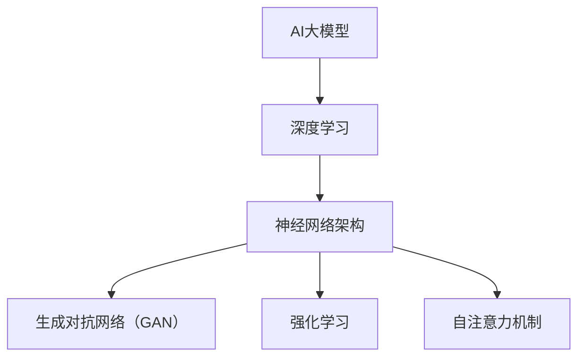

                 

### 文章标题

**AI大模型创业：如何应对未来技术挑战？**

关键词：AI大模型、创业、技术挑战、深度学习、自然语言处理、生成对抗网络（GAN）、强化学习、自注意力机制

摘要：
本文旨在探讨AI大模型创业过程中可能面临的技术挑战，并给出相应的应对策略。通过概述AI大模型的基本概念与未来趋势，解析其核心算法原理，分析创业策略与实战案例，本文将帮助创业者更好地理解AI大模型的本质，为成功创业提供指导。

---

### 目录大纲：《AI大模型创业：如何应对未来技术挑战？》

1. **第一部分：AI大模型概述与基础**
   - **第1章：AI大模型概述与未来趋势**
   - **第2章：AI大模型技术基础**
   - **第3章：AI大模型核心算法解析**

2. **第二部分：AI大模型创业实战**
   - **第4章：AI大模型创业策略**
   - **第5章：AI大模型开发与部署**
   - **第6章：AI大模型创业案例分析**
   - **第7章：应对未来技术挑战的策略与建议**

3. **附录**
   - **附录A：AI大模型开发工具与资源**

---

### 核心概念与联系

**AI大模型的概念及其与深度学习的关系**

在本文中，AI大模型是指通过深度学习算法训练得到的具有强大表征能力和泛化能力的大型神经网络模型。深度学习作为人工智能的核心技术，通过多层神经网络的堆叠，使得模型能够自动从数据中学习到复杂的特征表示。

**核心概念与联系**

以下是本文中涉及的核心概念及其相互关系：

- **AI大模型**：通过大规模数据训练得到的大型神经网络模型，具备强大的表征能力和泛化能力。
- **深度学习**：AI大模型的基础技术，通过多层神经网络实现特征提取和模式识别。
- **神经网络架构**：深度学习模型的基本构建块，包括输入层、隐藏层和输出层。
- **自然语言处理（NLP）**：AI大模型在文本数据上的应用，涉及词嵌入、序列模型、注意力机制等。
- **生成对抗网络（GAN）**：用于生成具有真实感的数据，常用于图像生成、文本生成等任务。
- **强化学习**：通过与环境互动学习最优策略的算法，常用于游戏、自动驾驶等领域。
- **自注意力机制**：在NLP任务中用于捕捉长距离依赖关系，是Transformer模型的核心。

**Mermaid流程图**

以下是一个简化的Mermaid流程图，展示了AI大模型的核心概念及其相互关系：



---

### 核心算法原理讲解

在本节中，我们将深入讲解AI大模型中几个核心算法的原理，包括生成对抗网络（GAN）、强化学习和自注意力机制。通过伪代码、数学模型和具体案例，我们将帮助读者更好地理解这些算法的基本概念和应用。

#### 生成对抗网络（GAN）

生成对抗网络（GAN）是由Ian Goodfellow等人在2014年提出的一种深度学习模型。GAN由两个相互对抗的神经网络——生成器和判别器组成。生成器的目标是生成尽可能真实的数据，而判别器的目标是区分真实数据和生成数据。

**GAN的基本原理**

GAN的训练过程可以看作是一场“猫捉老鼠”的游戏。生成器试图生成虚假的数据，判别器则努力区分真实数据和虚假数据。两者的目标是最大化自己的性能，即生成器希望判别器无法区分真实数据和生成数据，而判别器希望尽可能准确地识别出真实数据和生成数据。

**GAN的算法伪代码**

```python
# GAN的生成器和判别器的训练过程
for epoch in 1...max_epochs:
    for i, (X, Y) in enumerate(train_loader):
        # 训练判别器
        D.zero_grad()
        D_real = D(X)
        D_fake = D(G(z))
        D_loss = -torch.mean(torch.log(D_real) + torch.log(1 - D_fake))
        D_loss.backward()
        D_optimizer.step()

        # 训练生成器
        G.zero_grad()
        G_fake = D(G(z))
        G_loss = -torch.mean(torch.log(G_fake))
        G_loss.backward()
        G_optimizer.step()
```

**GAN的数学模型**

GAN的损失函数通常为：

$$
L_G = -\log(D(G(z)))
$$

$$
L_D = -\log(D(X)) - \log(1 - D(G(z)))
$$

其中，$G(z)$ 是生成器生成的假样本，$X$ 是真实样本，$z$ 是生成器输入的随机噪声。

**GAN的应用场景**

GAN在图像生成、文本生成、数据增强等领域有广泛应用。例如，在图像生成方面，GAN可以生成逼真的图像，如图像到图像的转换、人脸生成等。在文本生成方面，GAN可以用于生成文章、对话等。

**GAN的详细讲解和举例说明**

以图像生成为例，假设我们使用GAN生成人脸图像。生成器接收随机噪声作为输入，通过多层全连接神经网络生成人脸图像。判别器则接收真实人脸图像和生成的人脸图像，输出一个概率值，表示图像是真实还是生成的。

通过大量的真实人脸图像训练判别器，然后使用判别器来指导生成器的训练。生成器不断优化，使得它生成的人脸图像越来越逼真，最终达到判别器难以区分真实和生成图像的程度。

#### 强化学习

强化学习是一种通过与环境交互学习最优策略的机器学习技术。它通过奖励机制引导智能体（agent）在环境中选择动作，以最大化长期累积奖励。

**强化学习的基本概念**

- **状态（State）**：环境当前的状态描述。
- **动作（Action）**：智能体可以选择的行为。
- **奖励（Reward）**：每次动作后环境给予的即时奖励。
- **策略（Policy）**：智能体选择动作的策略。

**强化学习的主要算法**

- **Q-learning**：通过更新Q值表来学习最优策略。
- **深度Q网络（DQN）**：使用深度神经网络来近似Q值函数。
- **深度确定性策略梯度（DDPG）**：结合深度学习和策略梯度方法。

**Q-learning算法的数学模型**

$$
Q(s, a) \leftarrow Q(s, a) + \alpha [r + \gamma \max_{a'} Q(s', a') - Q(s, a)]
$$

其中，$s$ 和 $s'$ 分别是当前状态和下一状态，$a$ 和 $a'$ 分别是当前动作和下一动作，$r$ 是奖励，$\gamma$ 是折扣因子，$\alpha$ 是学习率。

**强化学习的详细讲解和举例说明**

以一个简单的机器人导航任务为例，机器人需要在环境中从一个位置移动到另一个位置。环境提供奖励，当机器人到达目标位置时给予高奖励，否则给予低奖励。

机器人使用Q-learning算法学习最优路径。初始时，Q值表设置为所有为零的值。机器人从初始位置开始，根据当前状态和Q值表选择一个动作，执行动作后获得奖励，更新Q值表。通过不断迭代，机器人逐渐学会最优路径。

#### 自注意力机制

自注意力机制是一种用于捕捉序列数据中长距离依赖关系的机制，它在Transformer模型中得到了广泛应用。自注意力机制允许模型在处理序列数据时，将序列中的每个元素与所有其他元素进行加权求和，从而捕捉长距离依赖关系。

**自注意力机制的数学模型**

自注意力机制的公式如下：

$$
\text{Attention}(Q, K, V) = \text{softmax}\left(\frac{QK^T}{\sqrt{d_k}}\right) V
$$

其中，$Q$、$K$ 和 $V$ 分别是查询向量、键向量和值向量，$d_k$ 是键向量的维度。

**自注意力机制的详细讲解和举例说明**

以自然语言处理中的一个任务为例，假设我们需要对一段文本进行编码。文本可以表示为一个词嵌入向量序列。自注意力机制允许模型在编码过程中，将每个词向量与序列中的所有其他词向量进行加权求和，从而生成一个表示整个文本的编码向量。

具体实现时，首先将输入的词嵌入向量序列传递给自注意力层。自注意力层计算每个词向量的权重，然后与相应的词向量相乘，并将结果相加，得到最终的编码向量。

通过自注意力机制，模型能够捕捉到文本中的长距离依赖关系，从而提高模型的表征能力。

---

在本节中，我们详细讲解了生成对抗网络（GAN）、强化学习和自注意力机制等核心算法的原理和应用。这些算法在AI大模型中扮演着重要角色，通过深入理解它们，读者可以更好地应对未来AI大模型创业过程中可能遇到的技术挑战。

在接下来的章节中，我们将继续探讨AI大模型创业实战，分析成功案例，并给出应对未来技术挑战的策略和建议。希望通过本文的分享，能够为您的AI大模型创业之路提供有益的指导。

---

### AI大模型创业策略

#### 创业者面临的AI技术挑战

在AI大模型创业过程中，创业者不仅需要应对市场需求和商业模式等商业挑战，还需要克服一系列技术难题。以下是一些主要的技术挑战：

1. **数据需求与数据质量**：AI大模型训练需要大量的高质量数据。创业者需要确保数据来源的可靠性、多样性和时效性，同时还需要对数据进行预处理和清洗，以提高模型的训练效果和泛化能力。

2. **计算资源需求**：AI大模型训练通常需要大量的计算资源，包括高性能的GPU、TPU等。创业者需要合理规划计算资源，确保模型能够在合理的时间内完成训练。

3. **模型设计与优化**：创业者需要具备扎实的深度学习知识，能够设计和优化AI大模型的结构和参数。这包括选择合适的神经网络架构、损失函数、优化算法等。

4. **模型部署与运维**：AI大模型部署需要考虑到实际应用场景，包括实时性、可靠性、可扩展性等方面。创业者需要设计合适的部署方案，确保模型能够在生产环境中稳定运行。

5. **算法创新与竞争**：AI领域发展迅速，创业者需要不断跟进最新的研究成果，进行算法创新，以保持竞争优势。这包括对现有算法的改进、新算法的研发等。

#### AI创业项目的市场定位

在确定了技术路线后，创业者需要对市场进行充分调研，明确自己的目标市场和竞争优势。以下是一些建议：

1. **明确目标客户群体**：根据产品的特点和优势，确定目标客户群体。例如，医疗领域的AI应用可以面向医院、诊所等医疗机构，金融领域的AI应用可以面向银行、保险公司等金融机构。

2. **分析竞争对手**：了解竞争对手的产品、市场策略、竞争优势等，找出自己的差异化特点。例如，通过技术创新、数据分析能力、客户服务等方面实现差异化。

3. **确定市场细分领域**：在广阔的AI市场中，创业者可以选择一个或多个细分领域进行深耕。例如，在图像识别领域，可以选择医疗影像分析、自动驾驶等方向。

4. **制定市场进入策略**：根据目标市场和竞争优势，制定合适的市场进入策略。例如，可以通过与现有企业合作、收购、并购等方式快速进入市场。

#### AI创业项目的商业模式设计

在明确了市场定位后，创业者需要设计合理的商业模式，以确保项目的可持续发展和盈利能力。以下是一些建议：

1. **产品定价策略**：根据目标市场和客户需求，制定合理的价格策略。例如，对于高端市场，可以采用高定价策略，而对于大众市场，可以采用低定价策略。

2. **收入来源**：明确项目的收入来源，包括直接销售收入、服务费、订阅费、广告收入等。例如，医疗领域的AI应用可以通过提供诊断服务、数据分析报告等方式获得收入。

3. **成本结构**：分析项目的成本结构，包括研发成本、运营成本、营销成本等。合理控制成本，提高盈利能力。

4. **融资策略**：根据项目的发展阶段和资金需求，选择合适的融资方式。例如，天使投资、风险投资、股权融资等。

5. **合作伙伴关系**：与行业内的其他企业、研究机构、高校等建立合作关系，共同推动项目的发展。例如，可以通过技术合作、市场推广等方式实现互利共赢。

---

通过以上策略，创业者可以更好地应对AI大模型创业过程中的技术挑战，明确市场定位，设计合理的商业模式，为项目的成功奠定基础。在接下来的章节中，我们将进一步探讨AI大模型的开发与部署，以及成功案例，以帮助创业者更好地实践和应用AI大模型。

---

### AI大模型开发与部署

#### AI大模型开发流程

AI大模型的开发流程可以分为以下几个主要步骤：

1. **数据准备与处理**：
   - **数据收集**：首先需要收集大量的高质量数据，这些数据可以是结构化的，也可以是非结构化的。对于结构化数据，可以使用数据库进行存储和管理；对于非结构化数据，如文本、图像和音频，可以使用分布式文件系统，如HDFS或分布式数据库，如MongoDB进行存储。
   - **数据清洗**：在数据收集后，需要对数据进行清洗，去除无效、重复和错误的数据。数据清洗过程通常包括缺失值填充、异常值处理、噪声去除等操作。
   - **数据预处理**：对数据进行标准化、归一化、特征提取等预处理操作，以便于后续的训练过程。对于文本数据，可以使用词嵌入技术将文本转化为向量表示；对于图像数据，可以使用卷积神经网络（CNN）进行特征提取。

2. **模型设计与调优**：
   - **模型架构设计**：根据问题的特点和需求，选择合适的神经网络架构。例如，对于图像分类任务，可以选择CNN；对于自然语言处理任务，可以选择Transformer或BERT等。
   - **超参数调优**：在模型架构确定后，需要调整模型的各种超参数，如学习率、批量大小、正则化参数等，以优化模型的性能。超参数调优可以使用网格搜索、随机搜索、贝叶斯优化等方法。
   - **训练过程**：使用训练数据对模型进行训练，通过反向传播算法不断调整模型参数，以最小化损失函数。在训练过程中，可以使用数据增强、dropout、提前停止等技术来防止过拟合。

3. **模型评估与测试**：
   - **模型评估**：在训练完成后，需要对模型进行评估，以确定其性能是否满足需求。常用的评估指标包括准确率、召回率、F1值等。
   - **模型测试**：使用测试数据对模型进行测试，以验证其泛化能力。测试过程需要确保测试数据与训练数据具有相似性，以避免测试偏差。

#### AI大模型部署与运维

AI大模型部署与运维是确保模型在实际应用中稳定运行的重要环节。以下是一些关键步骤：

1. **部署环境搭建**：
   - **硬件资源分配**：根据模型的计算需求，合理分配硬件资源，包括CPU、GPU、内存等。对于大型模型，可能需要使用分布式计算框架，如TensorFlow、PyTorch等，以提高计算效率。
   - **软件环境配置**：搭建合适的软件环境，包括深度学习框架、依赖库、操作系统等。在部署过程中，需要注意版本兼容性和稳定性。

2. **模型部署策略**：
   - **在线部署**：将模型部署到服务器或云平台，以实现实时预测。在线部署需要考虑负载均衡、故障转移、安全性等问题。
   - **离线部署**：将模型部署到本地服务器或工作站，用于批量数据处理和离线分析。离线部署通常用于需要大规模数据处理和分析的场景。

3. **模型监控与维护**：
   - **性能监控**：实时监控模型的性能指标，如响应时间、准确率、资源利用率等，以确保模型在高负载情况下依然能够稳定运行。
   - **异常检测**：监控系统异常，如服务器故障、网络中断、数据异常等，并及时采取应对措施。
   - **更新与升级**：定期对模型进行更新和升级，以应对新的业务需求和技术发展。在更新过程中，需要确保新模型与旧模型兼容，以避免对业务造成影响。

---

通过以上步骤，创业者可以系统地开展AI大模型的开发与部署工作。在开发过程中，需要注意数据质量、模型优化、超参数调优等问题；在部署过程中，需要关注硬件资源分配、软件环境配置、模型监控与维护等环节。只有做好这些工作，才能确保AI大模型在实际应用中发挥出最佳效果。

在接下来的章节中，我们将通过具体案例，进一步探讨AI大模型创业的实践经验和成功策略。希望这些案例能够为您的创业之路提供有益的启示。

---

### AI大模型创业案例分析

在本章节中，我们将探讨两个AI大模型创业案例，通过详细分析这些案例的背景、技术突破、业务模式、成功经验与挑战，为创业者提供有价值的借鉴。

#### 案例研究一：某知名AI大模型创业公司的崛起

**1. 公司背景**

某知名AI大模型创业公司（以下简称“公司”）成立于2016年，其创始团队由几位曾在顶级科技公司工作的资深AI专家组成。公司专注于利用AI大模型技术解决实际业务问题，特别是在医疗、金融和智能制造领域。

**2. 技术突破与业务模式**

公司在技术上的突破主要体现在以下几个方面：

- **创新性算法**：公司自主研发了一种基于Transformer架构的AI大模型，能够在处理大规模文本数据时实现高效的特征提取和关系建模。这一创新性算法为公司赢得了多个技术奖项。
- **多领域应用**：公司成功将AI大模型应用于医疗影像诊断、金融风险评估和智能制造等领域，通过提供定制化的解决方案，帮助客户提升业务效率和质量。

在业务模式上，公司采取了以下策略：

- **合作与并购**：公司通过与医疗机构、金融机构和制造企业建立合作关系，为其提供技术支持和咨询服务。同时，公司还通过并购方式迅速扩展业务领域。
- **数据驱动**：公司高度重视数据积累和利用，通过建立大数据平台，对业务数据进行深度挖掘和分析，为决策提供数据支持。

**3. 成功经验与挑战**

**成功经验：**

- **技术创新**：公司持续投入研发，不断推出具有竞争力的技术产品，赢得了市场认可。
- **客户导向**：公司注重客户需求，提供定制化解决方案，赢得了客户的信任和长期合作。
- **快速响应**：公司能够快速响应市场变化，及时调整业务战略和产品方向。

**挑战：**

- **数据隐私与安全**：在医疗和金融领域，数据隐私和安全是一个重要挑战。公司需要确保数据处理和存储过程符合相关法律法规，同时保障客户数据的安全。
- **人才短缺**：AI领域人才短缺，公司需要通过多种方式吸引和留住顶尖人才，以维持技术创新能力。

#### 案例研究二：从零开始构建AI大模型团队

**1. 团队组建**

某初创公司（以下简称“初创公司”）在2020年开始筹备AI大模型团队的组建。创始团队由几位在AI领域有丰富经验的专家组成，他们希望通过组建团队，实现AI技术在企业级市场的落地。

**2. 技术路线选择**

初创公司在技术路线选择上采取了以下策略：

- **自主研发**：初创公司决定自主研发AI大模型，以避免对第三方技术的依赖。同时，团队选择了深度学习框架TensorFlow，因为其生态系统丰富，支持多种AI应用。
- **分阶段实施**：团队决定采取分阶段实施的方式，首先从相对简单的任务入手，逐步积累经验和数据，再逐步拓展到更复杂的任务。

**3. 项目管理与协作**

在项目管理与协作方面，初创公司采取了以下措施：

- **敏捷开发**：初创公司采用敏捷开发方法，以快速响应市场需求和变化。团队定期进行迭代，每个迭代周期为2-3周。
- **跨部门协作**：初创公司建立了跨部门协作机制，包括数据团队、算法团队和产品团队。团队之间通过定期会议、文档共享等方式保持沟通和协作。

**4. 成功经验与挑战**

**成功经验：**

- **技术创新**：初创公司通过自主研发，逐步构建了一套具有竞争力的AI大模型技术体系。
- **快速落地**：通过敏捷开发和跨部门协作，初创公司能够快速将技术成果转化为实际产品，满足客户需求。

**挑战：**

- **人才储备**：初创公司面临着人才储备不足的挑战，特别是顶尖AI人才的招聘和保留。
- **市场定位**：初创公司在市场定位上需要不断调整，以适应市场的变化和客户需求。

---

通过以上两个案例，我们可以看到，AI大模型创业的成功离不开技术创新、客户导向和团队协作。同时，创业者也需要应对数据隐私、人才短缺等挑战。在接下来的章节中，我们将进一步探讨如何应对未来技术挑战，为AI大模型创业提供更多策略和建议。

---

### 应对未来技术挑战的策略与建议

在AI大模型创业的道路上，未来将充满机遇和挑战。为了确保企业的持续发展和竞争优势，创业者需要从多个方面制定策略，以应对不断变化的技术环境和市场需求。以下是一些具体的策略与建议：

#### 技术快速迭代下的适应性调整

1. **持续创新**：技术迭代速度极快，创业者需要保持对新技术的高度敏感，定期进行技术预研和实验。可以通过设立专门的技术实验室或创新基金，鼓励团队成员探索新技术。

2. **敏捷开发**：采用敏捷开发方法，快速响应市场需求和技术变化。通过短周期迭代和持续集成，缩短产品从研发到市场的周期。

3. **跨学科合作**：在技术开发过程中，鼓励跨学科合作，将AI技术与其他领域（如生物学、物理学等）相结合，实现创新性的技术突破。

#### 数据安全与隐私保护

1. **数据加密**：确保所有数据在存储和传输过程中进行加密，防止数据泄露和未经授权的访问。

2. **隐私保护法规遵守**：严格遵循GDPR、CCPA等全球隐私保护法规，确保数据处理和存储过程符合相关法律法规。

3. **数据匿名化**：在数据处理过程中，对敏感数据进行匿名化处理，以减少隐私泄露的风险。

#### AI伦理与社会责任

1. **伦理审查**：在AI产品开发过程中，设立伦理审查委员会，对产品的潜在社会影响进行评估和监督。

2. **公平性评估**：确保AI系统的决策过程公正、透明，避免算法偏见和歧视。定期进行公平性评估和改进。

3. **责任界定**：明确AI系统的责任归属，确保在出现错误决策时，责任能够得到合理界定和追究。

#### 创新与创业生态构建

1. **开放合作**：通过开放平台和API，与其他企业、研究机构和开发者建立合作关系，共同推动技术进步。

2. **人才培养**：设立人才培养计划，吸引和培养顶尖AI人才，建立一支具有创新能力和实战经验的团队。

3. **产业生态**：积极参与产业生态建设，与上下游企业、高校和研究机构建立紧密合作，共同推动AI技术的发展和应用。

通过以上策略与建议，创业者可以更好地应对未来技术挑战，确保企业的持续发展和市场竞争力。同时，这也将有助于构建一个健康、可持续的AI创业生态，为社会带来更多的价值。

---

在本章节中，我们总结了应对未来技术挑战的策略与建议。这些策略不仅有助于创业者保持技术创新和市场竞争优势，也有助于构建一个可持续发展的AI创业生态。通过持续创新、数据安全与隐私保护、AI伦理与社会责任，以及开放合作和人才培养，创业者可以更好地迎接未来AI大模型创业的机遇和挑战。

在文章的最后，我们希望读者能够从中获得启发，为自己的AI大模型创业之路奠定坚实的基础。让我们携手共进，共同推动AI技术的进步和应用，为人类社会带来更多创新和福祉。

---

### 附录

在本附录中，我们将介绍一些AI大模型开发过程中常用的工具和资源，以帮助读者更好地进行研究和实践。

#### A.1 主流深度学习框架对比

在AI大模型开发中，选择合适的深度学习框架至关重要。以下是一些主流深度学习框架的对比：

| 框架         | 特点                                                         | 应用场景                                       |
| ------------ | ------------------------------------------------------------ | ---------------------------------------------- |
| TensorFlow   | 由Google开发，具有强大的生态系统和丰富的API，支持多种平台和语言 | 图像识别、自然语言处理、强化学习等               |
| PyTorch      | 由Facebook开发，具有灵活的动态计算图和良好的科研氛围           | 研究和工程应用广泛，尤其在自然语言处理领域         |
| Keras        | 高级神经网络API，基于Theano和TensorFlow                       | 快速原型设计和实验验证                           |
| MXNet        | Apache基金会项目，支持多种编程语言                           | 快速推理和大规模分布式训练                       |
| Caffe        | 由伯克利大学开发，专注于图像识别任务                         | 计算速度快，适用于图像分类和检测                  |

#### A.2 开源代码与数据集资源

- **开源代码**：许多AI大模型的研究和实现都开源，例如GAN、BERT、GPT等。可以在以下平台上查找和下载：
  - [GitHub](https://github.com/)
  - [GitHub仓库](https://github.com/username/repository)
  - [Google Colab](https://colab.research.google.com/)

- **数据集资源**：公开的数据集为AI大模型的研究提供了宝贵的数据资源，以下是一些常用的数据集：
  - [ImageNet](http://www.image-net.org/): 大规模图像分类数据集
  - [CIFAR-10/100](https://www.cs.toronto.edu/~kriz/cifar.html): 小型图像分类数据集
  - [MNIST](http://yann.lecun.com/exdb/mnist/): 手写数字识别数据集
  - [Common Crawl](https://commoncrawl.org/): 大规模网页文本数据集
  - [CoIL](https://coilib.org/): 多标签文本分类数据集

#### A.3 AI大模型开发社区与论坛

- **AI大模型论坛**：以下是一些活跃的AI大模型开发社区和论坛，可以加入这些社区，获取最新的技术资讯和交流心得：
  - [Reddit AI](https://www.reddit.com/r/AI/)
  - [Stack Overflow](https://stackoverflow.com/questions/tagged/ai)
  - [AI Stack Exchange](https://ai.stackexchange.com/)
  - [GitHub AI仓库](https://github.com/topics/deep-learning)

通过使用这些工具和资源，开发者可以更高效地进行AI大模型的研究和开发，加速创新进程。

---

### 结语

本文通过深入探讨AI大模型的概述、核心算法、创业策略、开发与部署以及成功案例，帮助读者全面了解AI大模型创业的方方面面。从核心概念到实际应用，从技术创新到商业模式设计，我们希望通过这些内容为您的创业之路提供有益的指导。

作为AI领域的资深专家，我们深知AI大模型创业的挑战与机遇。随着技术的不断进步，创业者需要保持敏锐的洞察力和持续的创新精神，以应对快速变化的市场和技术环境。

在此，我们鼓励广大创业者勇于探索、敢于创新，积极投身于AI大模型创业的浪潮中。同时，我们也期待与您分享经验、共同成长，为推动AI技术的发展和应用贡献力量。

感谢您的阅读，祝您在AI大模型创业的道路上取得辉煌的成就！

---

**作者：** AI天才研究院 / AI Genius Institute & 禅与计算机程序设计艺术 / Zen And The Art of Computer Programming

---

本文为AI天才研究院出品，旨在为创业者提供专业的AI技术指导。如需转载，请注明出处。谢谢合作！【AI天才研究院版权所有】

