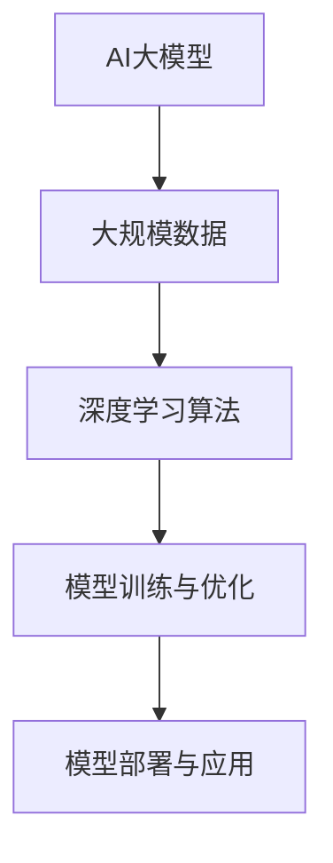
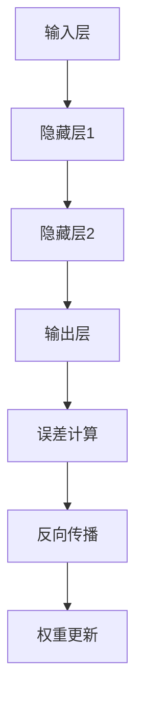
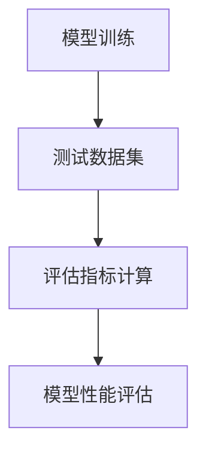
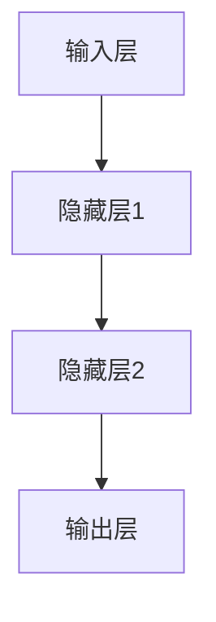
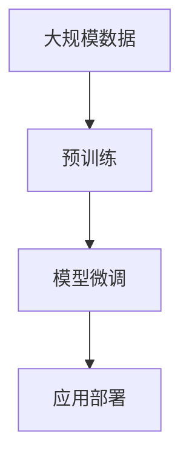

                 

# 《AI大模型创业：如何应对未来用户需求？》

## 关键词：AI大模型、创业、用户需求、技术基础、商业模式、团队建设、风险管理、案例研究、实践与展望

## 摘要：
本文旨在深入探讨AI大模型创业的现状与未来，重点关注如何通过技术分析与商业模式设计来应对未来用户需求。文章首先介绍了AI大模型的核心概念、架构、算法及其应用前景，随后详细解析了神经网络与自然语言处理基础，以及预训练与迁移学习的实践方法。在创业策略部分，文章从市场研究、商业模式设计、团队建设到项目管理进行了全面分析。此外，文章还探讨了AI大模型创业中面临的技术、数据和市场风险，并通过成功与失败案例提供了宝贵的经验。最后，文章对AI大模型创业资源与工具进行了总结，并展望了其未来发展趋势。通过本文，读者将获得关于AI大模型创业的全面理解，并能够为未来的创业实践提供有力指导。

----------------------------------------------------------------

### 《AI大模型创业：如何应对未来用户需求？》目录大纲

----------------------------------------------------------------

# 第一部分: AI大模型基础

## 第1章: AI大模型概述

### 1.1 AI大模型的核心概念与联系

#### 1.1.1 AI大模型的基本概念

AI大模型是指通过深度学习算法训练得到的具有大规模参数和高度复杂性的神经网络模型。这类模型通常基于大量的数据进行预训练，能够捕捉数据中的复杂模式，并在特定任务上实现高性能。AI大模型的基本概念包括大规模数据、深度学习算法、模型训练与优化以及模型部署与应用。

**Mermaid流程图:**


大规模数据是AI大模型的基础，深度学习算法则是模型训练的核心，模型训练与优化过程确保模型在特定任务上的性能，模型部署与应用则使模型能够实际为用户提供服务。

#### 1.1.2 AI大模型的核心概念联系

AI大模型的核心概念之间存在密切的联系：

1. **大规模数据**：大量且高质量的数据为模型提供了丰富的训练素材，有助于模型更好地学习数据中的模式和规律。
2. **深度学习算法**：通过多层神经网络结构，深度学习算法能够自动学习数据的特征表示，实现复杂的数据处理和模式识别任务。
3. **模型训练与优化**：通过不断调整模型参数，模型训练与优化过程使得模型能够更好地拟合训练数据，提高模型在未知数据上的表现。
4. **模型部署与应用**：将训练好的模型部署到实际应用环境中，使得模型能够为用户提供具体的服务和解决方案。

这些核心概念共同构成了AI大模型的基础，它们之间的紧密联系确保了模型的高效性和实用性。

#### 1.1.3 AI大模型的应用领域

AI大模型在众多领域都有着广泛的应用前景：

- **金融**：AI大模型在风险管理、自动化交易和量化分析等领域发挥着重要作用，能够提高金融决策的准确性和效率。
- **医疗**：AI大模型在疾病预测、个性化治疗和医学图像分析等领域具有巨大潜力，有助于提升医疗服务的质量和效率。
- **工业**：AI大模型在制造、物流和能源等领域的应用，可以优化生产流程、降低成本并提高生产效率。
- **教育**：AI大模型在教育领域中的应用，如智能辅导、个性化学习路径推荐等，可以为学生提供更加灵活和高效的学习体验。

这些应用领域的不断扩展，为AI大模型创业提供了广阔的市场空间。

### 1.2 AI大模型的架构

AI大模型的架构通常包括数据输入、预处理器、特征提取器、深度神经网络和输出层等关键部分。这种层次结构使得模型能够高效地处理和解析数据，并在各种任务上实现高性能。

#### 1.2.1 数据输入

数据输入是AI大模型的起点，它决定了模型能够处理的数据类型和规模。在数据输入阶段，模型接收原始数据，并进行必要的预处理，如数据清洗、归一化和数据增强等操作，以确保数据的质量和一致性。

#### 1.2.2 预处理器

预处理器对输入数据进行进一步的处理，包括特征工程、数据降维和特征选择等操作。这些操作有助于提取数据中的关键特征，提高模型对数据的理解和学习能力。

#### 1.2.3 特征提取器

特征提取器是AI大模型的核心组成部分，它通过深度学习算法自动学习数据中的特征表示。这些特征表示能够捕捉数据中的复杂模式和规律，为后续的模型训练提供有力的支持。

#### 1.2.4 深度神经网络

深度神经网络是AI大模型的核心部分，它通过多层神经网络结构实现对数据的深度解析和特征提取。每层神经网络都包含大量神经元，这些神经元通过前一层神经元的输出进行计算和更新，最终生成模型的全局特征表示。

#### 1.2.5 输出层

输出层是AI大模型的结果输出部分，它根据训练数据和目标任务的类型，生成最终的输出结果。输出结果可以是分类标签、连续值或者决策建议等，具体取决于模型的应用场景和任务目标。

### 1.3 AI大模型的核心算法

AI大模型的核心算法包括深度学习算法、模型训练与优化以及模型评估等。这些算法共同构成了AI大模型的基础，确保模型能够高效地学习、训练和部署。

#### 1.3.1 深度学习算法原理

深度学习算法基于多层神经网络结构，通过逐层学习数据中的特征表示，实现复杂的模式识别和预测任务。深度学习算法的核心包括以下几个关键步骤：

1. **前向传播**：输入数据通过网络的每一层，每层神经元的输出作为下一层的输入。
2. **反向传播**：计算网络输出与真实标签之间的误差，并将误差反向传播到每一层，更新每个神经元的权重。
3. **梯度下降**：使用梯度下降算法更新网络参数，最小化误差函数，提高模型性能。

**Mermaid流程图:**


#### 1.3.2 模型训练与优化

模型训练与优化过程是AI大模型构建的关键环节。在模型训练过程中，通过大量样本数据对模型进行迭代训练，不断调整模型参数，提高模型对数据的拟合度和预测能力。模型优化则包括以下步骤：

1. **数据预处理**：对训练数据进行清洗、归一化和数据增强等操作，提高数据质量。
2. **批量训练**：将训练数据分为多个批次，每个批次包含一定数量的样本，通过批量训练减少过拟合现象。
3. **学习率调整**：根据模型训练过程中的误差变化，动态调整学习率，优化模型训练效果。
4. **早停法**：在模型训练过程中，提前停止训练，避免模型过度拟合。

**伪代码：**
```python
def train_model(data, model_params):
    # 数据预处理
    preprocessed_data = preprocess_data(data)
    
    # 初始化模型参数
    model = initialize_model(model_params)
    
    # 批量训练
    for epoch in range(num_epochs):
        for batch in batches(preprocessed_data):
            # 前向传播
            output = forward_pass(model, batch)
            
            # 计算误差
            error = compute_error(output, batch_labels)
            
            # 反向传播
            backward_pass(model, error)
            
            # 学习率调整
            adjust_learning_rate(model_params)
            
            # 早停法
            if early_stopping(model):
                break
    
    return model
```

#### 1.3.3 模型评估

模型评估是验证模型性能和可靠性的关键步骤。在模型评估过程中，通过在测试数据集上运行模型，评估模型在不同任务上的性能。常用的评估指标包括准确率、召回率、F1分数和均方误差等。评估结果可以帮助创业者了解模型的优势和不足，为后续的优化和改进提供指导。

**Mermaid流程图:**


### 1.4 AI大模型的数学模型与公式

AI大模型的数学模型与公式是构建和训练模型的基础，它们描述了模型在计算过程中的数学原理和计算方法。以下是一些常用的数学模型与公式：

#### 1.4.1 损失函数

损失函数用于衡量模型预测结果与真实值之间的差距，是模型训练过程中的关键指标。常见的损失函数包括均方误差（MSE）和交叉熵损失（Cross-Entropy Loss）。

**均方误差（MSE）：**
$$
MSE = \frac{1}{2n}\sum_{i=1}^{n}(y_i - \hat{y}_i)^2
$$
其中，$y_i$ 是真实值，$\hat{y}_i$ 是模型预测值，$n$ 是样本数量。

**交叉熵损失（Cross-Entropy Loss）：**
$$
Cross-Entropy Loss = -\sum_{i=1}^{n} y_i \log(\hat{y}_i)
$$
其中，$y_i$ 是真实标签，$\hat{y}_i$ 是模型输出概率。

#### 1.4.2 优化算法

优化算法用于更新模型参数，以最小化损失函数。常见的优化算法包括梯度下降（Gradient Descent）和动量优化（Momentum）。

**梯度下降（Gradient Descent）：**
$$
\theta = \theta - \alpha \frac{\partial J(\theta)}{\partial \theta}
$$
其中，$\theta$ 是模型参数，$J(\theta)$ 是损失函数，$\alpha$ 是学习率。

**动量优化（Momentum）：**
$$
v = \beta v + (1 - \beta) \frac{\partial J(\theta)}{\partial \theta}
$$
$$
\theta = \theta - \alpha v
$$
其中，$v$ 是动量项，$\beta$ 是动量系数。

### 1.5 AI大模型的应用前景

AI大模型在各个领域的应用前景广阔，它们通过深入学习和理解大量数据，能够为各类任务提供高效、准确的解决方案。以下是一些典型的应用场景：

#### 1.5.1 金融

在金融领域，AI大模型可以应用于风险管理、自动化交易和量化分析等任务。通过深度学习算法，模型能够捕捉市场数据的复杂模式，预测市场趋势，从而为投资决策提供有力支持。

#### 1.5.2 医疗

在医疗领域，AI大模型在疾病预测、个性化治疗和医学图像分析等方面具有巨大潜力。通过学习大量的医学数据和文献，模型能够提供准确的诊断建议，优化治疗方案，提高医疗服务的质量和效率。

#### 1.5.3 工业

在工业领域，AI大模型可以应用于制造、物流和能源等任务。通过深度学习算法，模型能够优化生产流程，提高生产效率，降低成本。同时，AI大模型在智能运维和故障预测等方面也具有广泛应用前景。

#### 1.5.4 教育

在教育领域，AI大模型可以应用于智能辅导、个性化学习路径推荐等任务。通过学习学生的学习行为和数据，模型能够提供个性化的学习建议，提高学习效果和兴趣。

#### 1.5.5 娱乐与媒体

在娱乐与媒体领域，AI大模型可以应用于内容推荐、情感分析等任务。通过深度学习算法，模型能够分析用户行为和偏好，为用户提供个性化的内容和体验。

总之，AI大模型在各个领域的应用前景广阔，它们通过深入学习和理解大量数据，能够为各类任务提供高效、准确的解决方案，为创业者提供了丰富的商业机会。

## 第2章: AI大模型技术基础

### 2.1 神经网络基础

神经网络（Neural Networks）是AI大模型的核心组成部分，它们通过模拟人脑神经元的工作原理，实现对数据的自动学习和特征提取。神经网络的基本结构包括输入层、隐藏层和输出层，每层由多个神经元组成。

#### 2.1.1 神经网络结构

神经网络的层次结构如图所示：



1. **输入层**：接收外部输入数据，将数据传递到隐藏层。
2. **隐藏层**：通过多层结构，神经元之间相互连接，实现对输入数据的特征提取和转换。
3. **输出层**：产生最终输出，根据任务的不同，可以是分类标签、连续值或者决策建议等。

#### 2.1.2 激活函数

激活函数是神经网络中的关键组件，它为神经元提供了非线性特性，使得神经网络能够处理复杂的非线性问题。常见的激活函数包括：

1. **Sigmoid函数**：
   $$f(x) = \frac{1}{1 + e^{-x}}$$
   Sigmoid函数将输入值映射到$(0,1)$区间，常用于二分类问题。

2. **ReLU函数**：
   $$f(x) = \max(0, x)$$
   ReLU函数在$x \geq 0$时输出$x$，在$x < 0$时输出0，具有简单的计算特性，有助于提高训练效率。

3. **Tanh函数**：
   $$f(x) = \frac{2}{1 + e^{-2x}} - 1$$
   Tanh函数将输入值映射到$(-1,1)$区间，常用于多维数据的特征提取。

激活函数的选择对神经网络的学习性能有很大影响，需要根据具体问题进行选择和调整。

### 2.2 自然语言处理基础

自然语言处理（Natural Language Processing, NLP）是AI大模型应用的重要领域，它通过深度学习技术，实现对自然语言的理解和生成。NLP基础技术包括词嵌入、序列模型和文本生成等。

#### 2.2.1 词嵌入技术

词嵌入（Word Embedding）是将单词转换为向量的技术，它通过将单词映射到高维空间中的向量，实现了对单词语义的表示。常见的词嵌入技术包括：

1. **Word2Vec**：通过负采样和梯度下降算法，将单词映射到高维空间中的向量，捕捉单词的语义关系。
2. **GloVe**：通过全局均值矩阵，将单词映射到高维空间中的向量，提高了词嵌入的语义一致性。
3. **BERT**：通过双向编码表示（Bidirectional Encoder Representations from Transformers），将单词映射到高维空间中的向量，捕捉了上下文信息。

词嵌入技术在NLP任务中发挥着重要作用，如文本分类、情感分析和机器翻译等。

#### 2.2.2 序列模型

序列模型（Sequential Models）是处理序列数据（如文本、语音和视频等）的基础，常见的序列模型包括循环神经网络（RNN）和长短时记忆网络（LSTM）。

1. **RNN（Recurrent Neural Network）**：RNN通过循环结构，将当前时刻的输入与前一时刻的隐藏状态相连接，实现了对序列数据的建模。然而，RNN存在梯度消失和梯度爆炸问题。

2. **LSTM（Long Short-Term Memory）**：LSTM是RNN的一种改进，通过引入门控机制，解决了RNN的梯度消失和梯度爆炸问题，能够更好地捕捉序列数据的长时依赖关系。

序列模型在自然语言处理任务中得到了广泛应用，如语言模型、机器翻译和语音识别等。

#### 2.2.3 文本生成

文本生成（Text Generation）是NLP的一个重要应用，常见的文本生成方法包括：

1. **基于规则的生成**：通过预定义的规则和模板，生成符合语法和语义要求的文本。
2. **基于样本的生成**：通过学习大量文本数据，生成与输入文本风格相似的文本。
3. **基于模型的生成**：通过深度学习模型，如生成对抗网络（GAN）和变分自编码器（VAE），生成具有多样性和创造性的文本。

文本生成技术广泛应用于自动写作、对话系统和内容推荐等场景。

### 2.3 预训练与迁移学习

预训练（Pre-training）与迁移学习（Transfer Learning）是AI大模型技术的核心，它们通过在大规模数据集上预训练模型，然后在小数据集上进行微调，实现了对未知数据的有效学习和应用。

#### 2.3.1 预训练模型原理

预训练模型原理如图所示：



1. **预训练**：在大规模数据集上对模型进行预训练，使得模型能够学习到丰富的语言特征和知识。
2. **模型微调**：在特定任务数据集上对预训练模型进行微调，使其适应特定任务的需求。
3. **应用部署**：将微调后的模型部署到实际应用中，为用户提供具体的服务和解决方案。

#### 2.3.2 预训练模型应用

预训练模型在多个领域得到了广泛应用，如：

1. **自然语言处理**：预训练模型如BERT、GPT等在文本分类、机器翻译和问答系统等任务上取得了显著效果。
2. **计算机视觉**：预训练模型如ResNet、VGG等在图像分类、目标检测和语义分割等任务上表现优异。
3. **语音识别**：预训练模型如WaveNet、Transformer等在语音合成、语音识别和语音转换等任务上取得了突破性进展。

#### 2.3.3 迁移学习实践

迁移学习实践包括以下几个关键步骤：

1. **模型初始化**：使用预训练模型初始化新模型，使得新模型能够继承预训练模型的知识。
2. **模型微调**：在新数据集上对模型进行微调，优化模型在特定任务上的性能。
3. **模型评估**：评估模型在测试集上的表现，确保模型达到预期的性能指标。

迁移学习能够有效降低训练难度，提高模型在未知数据上的性能，是AI大模型技术的重要应用方向。

通过本章的介绍，我们了解了神经网络、自然语言处理、预训练与迁移学习等AI大模型技术基础，这些技术构成了AI大模型的核心框架，为后续的创业策略提供了坚实的技术支持。

## 第3章: AI大模型创业策略

### 3.1 市场研究与需求分析

在AI大模型创业过程中，市场研究与需求分析是至关重要的第一步。只有深入了解市场现状和用户需求，才能确保创业项目能够真正解决用户问题，并具备市场竞争力。

#### 3.1.1 用户需求分析

用户需求分析是市场研究的基础，它旨在识别和理解目标用户的需求、偏好和痛点。以下是一些关键步骤和方法：

1. **用户调研**：
   - **问卷调查**：通过设计针对性的问卷，收集用户对产品或服务的看法和需求。
   - **访谈**：通过与用户进行一对一访谈，深入了解用户的具体需求和使用习惯。
   - **焦点小组**：组织一组用户进行讨论，收集他们对产品或服务的意见和建议。

2. **需求收集**：
   - **现有数据**：分析已有的用户数据，如用户行为日志、反馈记录等，识别用户常见问题和需求。
   - **市场报告**：查阅相关市场报告和研究，了解行业趋势和用户需求变化。

3. **需求分析**：
   - **优先级排序**：根据用户调研和需求收集的结果，对需求进行优先级排序，识别关键需求。
   - **用户画像**：创建用户画像，明确目标用户群体的特征和需求。

4. **需求排序**：
   - **优先级排序**：对收集到的需求进行优先级排序，确保资源投入在最具价值和紧迫性的需求上。
   - **验证需求**：通过用户反馈和实际使用情况，验证需求的真实性和可行性。

#### 3.1.2 市场趋势分析

市场趋势分析是了解行业动态和竞争环境的重要手段。以下是一些关键步骤：

1. **行业报告**：查阅和分析行业报告，了解市场规模、增长速度、主要玩家和竞争格局。
2. **技术趋势**：关注AI技术的研究进展和最新应用，识别潜在的市场机会。
3. **竞争分析**：分析主要竞争对手的产品、策略和市场表现，了解自身的竞争优势和差异化。

4. **机会识别**：
   - **市场空白**：识别市场中的空白点，开发新产品或服务填补市场需求。
   - **技术突破**：利用AI大模型技术的突破，创新解决方案，满足用户需求。

#### 3.1.3 市场定位

市场定位是创业项目的关键环节，它决定了项目的目标市场和用户群体。以下是一些关键步骤：

1. **目标市场**：明确项目的目标市场，如行业领域、用户群体和市场规模等。
2. **目标用户**：定义目标用户的特征和需求，确保产品或服务能够满足他们的需求。
3. **差异化**：分析竞争对手的定位，找出差异化策略，确保项目在市场中具备独特性。

4. **价值主张**：明确项目的价值主张，即为什么用户应该选择我们的产品或服务，强调项目的核心优势。

通过市场研究和需求分析，创业者可以明确项目的市场定位和目标用户，为后续的商业模式设计和产品开发提供有力的支持。

### 3.2 商业模式与盈利模式设计

商业模式与盈利模式设计是AI大模型创业的核心，它决定了项目的可持续发展能力和盈利潜力。以下是一些关键步骤和策略：

#### 3.2.1 AI大模型商业模式

AI大模型商业模式的设计需要考虑以下几个方面：

1. **产品化**：将AI大模型技术转化为实际产品或服务，如智能推荐系统、自动化决策平台等。
2. **市场定位**：明确目标市场，如金融、医疗、教育等，确保产品或服务能够满足特定领域的需求。
3. **价值创造**：通过AI大模型技术，为用户提供高效、准确的解决方案，实现价值创造。
4. **合作与生态**：建立与合作伙伴的生态体系，共同开发和应用AI大模型技术。

#### 3.2.2 盈利模式设计

盈利模式设计是商业模式的关键环节，以下是一些常见的盈利模式：

1. **产品销售**：直接销售产品或服务，如软件许可证、硬件设备等。
2. **订阅服务**：提供订阅服务，如云服务、SaaS（软件即服务）等，用户按需支付订阅费用。
3. **广告与推广**：通过广告和推广收入，如搜索引擎广告、社交媒体广告等。
4. **增值服务**：提供增值服务，如定制化开发、技术支持等，增加用户粘性和收益。
5. **数据与知识变现**：通过数据分析和知识共享，为用户提供有价值的信息和洞察。

#### 3.2.3 收入预测与模型建立

收入预测是商业模式设计的重要环节，以下是一些关键步骤：

1. **市场容量**：评估目标市场的整体规模，如潜在用户数、市场规模等。
2. **市场份额**：预测项目在市场中的份额，如与竞争对手的对比等。
3. **价格策略**：确定产品或服务的价格策略，如定价模型、定价范围等。
4. **成本分析**：分析项目运营成本，如开发成本、运维成本等。

通过建立收入预测模型，创业者可以了解项目的盈利潜力和风险，为后续的投资决策提供依据。

### 3.3 团队建设与项目管理

团队建设与项目管理是AI大模型创业成功的关键因素。一个高效、协同的团队和科学的项目管理方法是确保项目顺利进行和成功的关键。

#### 3.3.1 AI大模型团队构建

AI大模型团队通常包括以下关键角色：

1. **技术专家**：负责AI大模型的技术研发和算法优化，如数据科学家、机器学习工程师等。
2. **产品经理**：负责产品规划和需求管理，确保产品能够满足用户需求和市场定位。
3. **项目经理**：负责项目规划、执行和监控，确保项目按计划顺利进行。
4. **数据科学家**：负责数据分析和模型训练，确保模型的性能和可靠性。
5. **数据工程师**：负责数据预处理、数据存储和管理，确保数据质量和数据安全。

#### 3.3.2 项目管理方法

项目管理是确保项目成功的关键环节，以下是一些关键步骤和方法：

1. **需求分析**：明确项目需求，包括功能需求、性能需求和用户需求等。
2. **项目规划**：制定项目计划，包括时间表、资源分配和风险管理等。
3. **执行监控**：监控项目执行过程，确保项目按计划进行，及时调整和优化。
4. **项目评估**：评估项目成果和性能，确保项目达到预期目标和质量标准。

#### 3.3.3 团队协作与沟通

团队协作与沟通是项目成功的关键因素，以下是一些建议：

1. **明确目标**：确保团队成员明确项目目标和工作任务，建立共同的目标和愿景。
2. **沟通机制**：建立有效的沟通机制，确保团队成员之间能够及时、高效地沟通和协作。
3. **协同工具**：使用协同工具，如项目管理软件、即时通讯工具等，提高团队协作效率。
4. **反馈与改进**：鼓励团队成员提供反馈和改进意见，不断优化团队协作流程和工作方法。

通过团队建设与项目管理，创业者可以确保AI大模型创业项目的顺利进行和成功。

### 3.4 创新与竞争力

在AI大模型创业过程中，创新和竞争力是项目成功的关键因素。以下是一些关键策略：

#### 3.4.1 技术创新

技术创新是提升项目竞争力的核心。以下是一些关键策略：

1. **算法优化**：不断优化算法，提高模型的性能和效率，降低训练和部署成本。
2. **模型定制**：根据具体应用场景，开发定制化的AI大模型，满足特定领域的需求。
3. **多模态学习**：结合多种数据类型（如文本、图像、音频等），实现多模态学习，提高模型的综合能力。

#### 3.4.2 产品创新

产品创新是提升项目竞争力的关键。以下是一些关键策略：

1. **用户体验**：关注用户体验，优化产品界面和交互设计，提高用户满意度。
2. **功能扩展**：不断扩展产品功能，增加新的应用场景和服务，满足用户多样化需求。
3. **场景化应用**：结合具体行业和应用场景，开发定制化的解决方案，提供一站式服务。

#### 3.4.3 市场竞争力

市场竞争力是项目成功的关键因素，以下是一些关键策略：

1. **差异化定位**：明确项目在市场中的差异化定位，避免与竞争对手的直接竞争。
2. **品牌建设**：通过品牌建设和宣传推广，提高项目在市场中的知名度和认可度。
3. **合作伙伴**：建立广泛的合作伙伴关系，共同开发和应用AI大模型技术，扩大市场影响力。

通过创新和竞争力策略，创业者可以确保AI大模型创业项目的成功和可持续发展。

### 3.5 法律与伦理风险

在AI大模型创业过程中，法律与伦理风险是不可避免的。以下是一些关键策略：

#### 3.5.1 数据隐私与安全

数据隐私与安全是AI大模型创业的核心关注点。以下是一些关键策略：

1. **数据加密**：对用户数据进行加密处理，确保数据在传输和存储过程中的安全性。
2. **访问控制**：实施严格的访问控制措施，确保只有授权人员能够访问敏感数据。
3. **隐私保护**：遵循隐私保护法规和标准，确保用户数据的使用和共享符合法律法规。

#### 3.5.2 合规与认证

合规与认证是确保项目合法性和可信度的重要手段。以下是一些关键策略：

1. **法律法规**：了解并遵守相关法律法规，如数据保护法、隐私法等。
2. **行业认证**：通过相关行业的认证，如ISO 27001认证等，提高项目的合规性和可信度。
3. **合规审查**：定期进行合规审查和风险评估，确保项目持续符合法律法规要求。

#### 3.5.3 伦理风险控制

伦理风险控制是确保项目伦理合规和社会责任的重要手段。以下是一些关键策略：

1. **伦理审查**：在项目开发和应用过程中，进行伦理审查，确保项目符合伦理标准和道德要求。
2. **伦理培训**：对团队成员进行伦理培训，提高他们的伦理意识和道德水平。
3. **透明度**：提高项目透明度，与用户和社会进行有效沟通，增加项目的可信度和认可度。

通过法律与伦理风险控制策略，创业者可以确保AI大模型创业项目的合法性和可持续性。

### 3.6 风险管理与应对策略

在AI大模型创业过程中，风险管理与应对策略是确保项目成功和可持续发展的关键。以下是一些关键策略：

#### 3.6.1 技术风险

技术风险是AI大模型创业过程中面临的主要风险之一。以下是一些关键策略：

1. **技术评估**：在项目开发初期，进行全面的技术评估，确保技术方案的可行性和可靠性。
2. **技术更新**：密切关注AI技术的研究进展，及时更新技术方案，确保项目的技术领先性。
3. **技术储备**：建立技术储备，包括关键技术人才、技术文档和技术专利等，提高项目的抗风险能力。

#### 3.6.2 数据风险

数据风险是AI大模型创业过程中面临的另一个重要风险。以下是一些关键策略：

1. **数据质量**：确保数据质量，包括数据的完整性、准确性和一致性，提高模型训练效果。
2. **数据隐私**：遵循数据隐私保护法规和标准，确保用户数据的安全和隐私。
3. **数据来源**：确保数据来源的合法性和可靠性，避免数据泄露和侵权风险。

#### 3.6.3 市场风险

市场风险是AI大模型创业过程中面临的重要风险之一。以下是一些关键策略：

1. **市场调研**：进行充分的市场调研，了解市场需求、竞争态势和用户偏好，制定合适的商业策略。
2. **多元化**：通过多元化产品和服务，降低市场风险，提高项目的抗风险能力。
3. **合作与联盟**：与行业合作伙伴建立战略联盟，共同开拓市场，提高项目的市场竞争力。

#### 3.6.4 应对策略

针对不同类型的风险，可以采取以下应对策略：

1. **风险预防**：通过全面的风险评估和预防措施，降低风险发生的可能性。
2. **风险监控**：建立风险监控机制，及时发现和处理风险。
3. **风险转移**：通过保险、合作等方式，将部分风险转移给第三方。
4. **风险分散**：通过多元化投资和业务布局，降低项目整体风险。

通过风险管理与应对策略，创业者可以降低风险对项目的影响，确保项目的成功和可持续发展。

## 第4章: AI大模型创业风险与应对策略

### 4.1 技术风险

AI大模型创业过程中，技术风险是创业者必须面对的重要挑战之一。技术风险包括算法不确定性、技术更新速度、技术专利竞争等方面。以下是具体分析和应对策略。

#### 4.1.1 技术不确定性

AI大模型技术处于快速发展阶段，新的算法和模型层出不穷，这给创业者带来了技术不确定性的风险。例如，深度学习中的生成对抗网络（GAN）和变换器（Transformer）等技术，在短时间内取得了显著突破，但同时也带来了技术选择和适应的挑战。

**应对策略：**

1. **技术跟踪与研究**：创业者应保持对最新技术的研究和跟踪，通过阅读学术论文、参加技术会议和关注技术社区，了解前沿技术动态。
2. **技术评估与选择**：在项目开发初期，进行详细的技术评估和选择，确保所采用的技术方案具有可行性和可持续性。
3. **技术储备与迭代**：建立技术储备，包括储备关键技术和关键技术人才，以便在技术不确定时能够快速应对和调整。

#### 4.1.2 技术更新速度

AI大模型技术更新速度极快，这意味着创业者需要不断投入资源进行技术更新，以保持竞争力。例如，神经网络架构的迭代和优化，以及数据预处理和特征提取方法的改进，都需要持续的技术投入。

**应对策略：**

1. **持续投资**：确保有足够的资金和人力资源支持技术更新，建立持续的技术投资和研发机制。
2. **合作与联盟**：与科研机构和高校建立合作关系，共同进行技术研究和开发，共享技术资源和研究成果。
3. **技术标准化**：参与技术标准化工作，确保所采用的技术方案能够适应行业标准和未来发展趋势。

#### 4.1.3 技术专利竞争

AI大模型领域专利竞争激烈，创业者需要面对技术专利的纠纷和保护风险。例如，一些知名企业和大厂在AI大模型技术领域拥有大量专利，创业者可能面临专利侵权或专利诉讼的风险。

**应对策略：**

1. **专利检索与评估**：在项目开发前进行专利检索，评估潜在的技术专利风险，确保所采用的技术方案不侵犯他人的专利权。
2. **专利布局与保护**：积极申请和布局专利，保护自己的技术创新和成果，确保在技术竞争中具备法律优势。
3. **合作与分享**：通过技术合作和共享，降低专利竞争的风险，实现技术互利共赢。

### 4.2 数据风险

数据风险是AI大模型创业过程中不可忽视的挑战，包括数据质量、数据隐私和数据安全问题。以下是具体分析和应对策略。

#### 4.2.1 数据质量

数据质量对AI大模型的性能和可靠性至关重要。数据质量问题包括数据缺失、数据冗余、数据不一致和数据噪声等。

**应对策略：**

1. **数据清洗与预处理**：在模型训练前进行数据清洗和预处理，包括去除噪声、填补缺失值、标准化数据等，确保数据质量。
2. **数据验证与监测**：建立数据验证和监测机制，定期检查数据质量，及时发现和纠正数据问题。
3. **数据质量标准**：制定数据质量标准，确保数据采集、存储和处理过程中的质量一致性。

#### 4.2.2 数据隐私

数据隐私是用户和社会对AI大模型的重要关注点，特别是在医疗、金融等敏感领域。数据隐私问题包括数据泄露、数据滥用和数据监控等。

**应对策略：**

1. **数据加密与安全**：对用户数据进行加密处理，确保数据在传输和存储过程中的安全性。
2. **隐私保护法规**：遵守隐私保护法规和标准，如《通用数据保护条例》（GDPR）等，确保用户数据的使用和共享符合法律法规。
3. **用户隐私设置**：提供用户隐私设置选项，让用户能够自主管理和控制自己的数据，增强用户对数据的信任。

#### 4.2.3 数据安全

数据安全是AI大模型创业过程中的关键风险，包括数据泄露、数据破坏和数据窃取等。

**应对策略：**

1. **网络安全防护**：建立网络安全防护体系，包括防火墙、入侵检测系统和数据加密等，确保数据安全。
2. **数据备份与恢复**：定期进行数据备份，确保在数据丢失或破坏时能够快速恢复。
3. **安全审计与评估**：定期进行安全审计和评估，识别潜在的安全风险，及时采取安全措施。

### 4.3 市场风险

市场风险是AI大模型创业过程中面临的重要挑战，包括市场需求波动、竞争加剧和商业模式不确定性等。

#### 4.3.1 市场需求波动

市场需求波动是创业企业面临的普遍风险，特别是在新兴领域。市场需求的变化可能导致产品需求不足或过剩。

**应对策略：**

1. **市场调研与预测**：通过市场调研和预测，了解市场需求变化趋势，及时调整产品策略和市场定位。
2. **多元化市场策略**：开发多元化产品和服务，开拓不同市场和客户群体，降低市场需求波动的影响。
3. **用户反馈与调整**：建立用户反馈机制，及时收集用户需求和反馈，根据用户需求调整产品和服务。

#### 4.3.2 竞争加剧

在AI大模型领域，竞争日益激烈，创业者需要面对来自国内外企业的竞争压力。

**应对策略：**

1. **差异化竞争**：通过技术创新、产品差异化和服务优势，建立独特的竞争优势。
2. **合作与联盟**：与行业合作伙伴建立战略联盟，共同开发市场和客户资源，降低竞争压力。
3. **持续创新**：保持技术和服务创新，不断提升产品竞争力，适应市场变化。

#### 4.3.3 商业模式不确定性

商业模式不确定性是创业企业面临的重要风险，特别是在新兴领域。商业模式的不确定性可能导致企业盈利模式不明确或不可持续。

**应对策略：**

1. **商业模式创新**：探索创新的商业模式，如订阅服务、数据变现、增值服务等，确保企业的盈利能力。
2. **市场验证**：在商业模式确定前，进行充分的市场验证，确保商业模式的市场可行性和盈利潜力。
3. **灵活调整**：根据市场反馈和业务发展情况，灵活调整商业模式，确保企业的可持续发展。

### 4.4 风险管理策略

风险管理是确保AI大模型创业项目成功和可持续发展的重要环节。以下是一些关键策略：

#### 4.4.1 风险识别

1. **定期评估**：定期进行风险评估，识别项目面临的各种风险，包括技术、数据、市场等。
2. **风险清单**：建立风险清单，记录各种风险的类型、发生概率和潜在影响。

#### 4.4.2 风险评估

1. **定量分析**：使用定量分析工具，如风险矩阵，评估各种风险的发生概率和潜在影响。
2. **定性分析**：结合专家意见和实际案例，进行定性分析，评估各种风险的严重性和可处理性。

#### 4.4.3 风险应对

1. **风险预防**：通过风险预防措施，降低风险发生的可能性，如数据加密、网络安全防护等。
2. **风险监控**：建立风险监控机制，实时监控风险状况，及时发现和处理风险。
3. **风险转移**：通过保险、合作等方式，将部分风险转移给第三方，降低企业风险承担。

#### 4.4.4 风险缓解

1. **风险缓解策略**：制定风险缓解策略，降低风险对项目的负面影响，如技术储备、数据备份等。
2. **应急预案**：建立应急预案，确保在风险事件发生时，能够快速响应和应对，减少损失。

通过上述风险管理策略，创业者可以降低AI大模型创业项目面临的风险，提高项目的成功率和可持续性。

## 第5章: AI大模型创业案例研究

### 5.1 成功案例分析

#### 5.1.1 OpenAI与GPT-3

OpenAI 是一家位于美国的人工智能研究机构，致力于推动人工智能的发展和应用。其推出的GPT-3（Generative Pre-trained Transformer 3）模型是目前最为先进的自然语言处理模型之一。GPT-3 的成功不仅为 OpenAI 本身带来了巨大的商业价值，也为 AI 大模型创业提供了宝贵的经验和启示。

**GPT-3 的应用场景：**

1. **文本生成**：GPT-3 能够生成高质量的文章、摘要、故事和诗歌等，广泛应用于自动写作、内容生成和创意写作等领域。
2. **自然语言理解**：GPT-3 在文本分类、情感分析和机器翻译等任务上表现出色，能够帮助企业和开发者实现高效的自然语言处理。
3. **对话系统**：GPT-3 在构建智能客服、聊天机器人和虚拟助手等方面具有广泛应用前景，能够提供自然的用户交互体验。

**GPT-3 的商业成功因素：**

1. **技术创新**：OpenAI 在 GPT-3 中采用了先进的变换器（Transformer）架构，通过大规模数据预训练，实现了出色的自然语言处理能力。
2. **应用场景广泛**：GPT-3 在多个领域具有广泛的应用前景，满足了不同行业和用户的需求。
3. **开放与合作**：OpenAI 通过开放 API 和合作伙伴计划，与众多企业和开发者合作，推广 GPT-3 的应用，实现了共赢。
4. **市场需求**：随着人工智能技术的普及和应用的深入，市场对高效、准确的自然语言处理需求不断增长，为 GPT-3 的商业成功提供了坚实的基础。

#### 5.1.2 谷歌BERT模型

BERT（Bidirectional Encoder Representations from Transformers）是谷歌推出的一种基于变换器（Transformer）架构的自然语言处理模型，它在多个自然语言处理任务上取得了突破性成果。BERT 的成功为谷歌在自然语言处理领域奠定了坚实的基础，也为 AI 大模型创业提供了重要启示。

**BERT 的应用场景：**

1. **文本分类**：BERT 在文本分类任务上表现出色，能够准确地将文本分为不同的类别，广泛应用于新闻分类、情感分析和舆情监控等。
2. **命名实体识别**：BERT 在命名实体识别任务中具有出色的表现，能够准确地识别文本中的地名、人名、组织名等。
3. **问答系统**：BERT 在构建智能问答系统方面具有广泛应用前景，能够回答用户关于特定领域的问题。

**BERT 的商业成功因素：**

1. **技术创新**：BERT 采用了双向编码表示（Bidirectional Encoder）技术，通过同时考虑上下文信息，实现了对文本的深层理解和建模。
2. **开源开放**：BERT 模型开源，使得开发者可以方便地使用和改进模型，推动了自然语言处理技术的普及和应用。
3. **应用广泛**：BERT 在多个自然语言处理任务中取得了显著成果，为企业和开发者提供了强大的工具。
4. **市场需求**：随着自然语言处理技术的不断成熟和应用，市场对高效、准确的文本处理需求不断增加，为 BERT 的商业成功提供了良好的市场环境。

### 5.2 失败案例解析

#### 5.2.1 某AI初创公司倒闭

某AI初创公司成立于2016年，专注于利用深度学习技术进行医疗图像分析。然而，该公司在2019年宣告倒闭，成为AI创业领域的一个典型案例。以下是对其失败原因的解析。

**失败原因：**

1. **技术风险**：公司在技术开发过程中遇到了技术难题，特别是在处理复杂医疗图像数据时，模型性能未能达到预期，导致项目进展缓慢。
2. **市场定位不准确**：公司最初的市场定位过于宽泛，试图同时覆盖多个医疗领域，导致资源分散，难以形成核心竞争力。
3. **融资困难**：由于市场表现不佳和公司内部管理问题，公司融资困难，资金链紧张，最终无法维持运营。
4. **竞争对手激烈**：医疗AI领域竞争激烈，市场上已经存在一些领先企业，该公司在进入市场时未能有效区分自身优势和差异化。

**教训与启示：**

1. **技术先行**：在AI创业过程中，技术是核心驱动力，必须确保技术方案的创新性和可行性。
2. **市场定位明确**：在进入市场前，需要明确自身优势和市场定位，集中资源攻克关键领域。
3. **资金管理**：良好的资金管理是公司生存和发展的基础，必须确保资金链的稳定性。
4. **竞争策略**：在激烈的市场竞争中，必须制定有效的竞争策略，突出自身优势和差异化。

### 5.3 案例分析总结

成功案例和失败案例为 AI 大模型创业提供了宝贵的经验和教训。成功案例表明，技术创新、明确的市场定位和良好的市场环境是创业成功的关键因素；而失败案例则提醒创业者要重视技术风险、市场定位和资金管理。

**结论：**

1. **技术创新**：保持技术领先是 AI 大模型创业的核心竞争力，必须不断关注和投入前沿技术研究和开发。
2. **市场定位**：明确的市场定位是项目成功的基础，必须深入了解市场需求，集中资源攻克关键领域。
3. **资金管理**：良好的资金管理是公司生存和发展的保障，必须确保资金链的稳定性和可持续发展。
4. **竞争策略**：在激烈的市场竞争中，必须制定有效的竞争策略，突出自身优势和差异化。

通过成功案例和失败案例的深入分析，创业者可以更好地理解 AI 大模型创业的挑战和机遇，为未来的创业实践提供有力的指导。

## 第6章: AI大模型创业资源与工具

### 6.1 开发工具与框架

AI大模型创业过程中，选择合适的开发工具和框架是至关重要的，它们不仅能够提高开发效率，还能确保项目的稳定性和可维护性。以下是一些常用的开发工具和框架：

#### 6.1.1 深度学习框架

深度学习框架是构建和训练AI大模型的基础工具，以下是一些广泛使用的深度学习框架：

1. **TensorFlow**：
   - **功能**：提供端到端的平台用于构建和部署深度学习模型，支持多种神经网络架构。
   - **优势**：丰富的API和扩展库，社区支持强大，适用于各种规模的模型开发。
   - **官网**：[TensorFlow官网](https://www.tensorflow.org)

2. **PyTorch**：
   - **功能**：基于Python的深度学习框架，支持动态计算图，易于调试和实验。
   - **优势**：灵活性和可扩展性强，适用于快速原型开发和复杂模型研究。
   - **官网**：[PyTorch官网](https://pytorch.org)

3. **PyTorch Lightning**：
   - **功能**：建立在PyTorch之上的高级库，提供简化的数据处理和模型训练接口。
   - **优势**：提高训练和评估的效率，简化模型复用和扩展。
   - **官网**：[PyTorch Lightning官网](https://pytorch-lightning.ai)

#### 6.1.2 代码库与社区

除了深度学习框架，一些代码库和社区资源也为AI大模型开发提供了宝贵的支持：

1. **Hugging Face Transformers**：
   - **功能**：提供预训练模型和易于使用的API，支持各种NLP任务。
   - **优势**：整合了多个预训练模型，如BERT、GPT等，方便开发者进行模型微调和部署。
   - **官网**：[Hugging Face Transformers官网](https://huggingface.co/transformers)

2. **GitHub**：
   - **功能**：代码托管和协作平台，汇集了大量的开源项目和社区资源。
   - **优势**：便于代码共享、协作和版本控制，是深度学习项目开发的必备工具。
   - **官网**：[GitHub官网](https://github.com)

### 6.2 数据资源与库

数据是AI大模型训练的核心，以下是一些常用的数据资源库：

#### 6.2.1 开放数据集

1. **Common Crawl**：
   - **功能**：提供大规模的网页数据集，用于自然语言处理和文本挖掘。
   - **优势**：数据量大，覆盖面广，适合进行大规模数据分析和模型训练。
   - **官网**：[Common Crawl官网](https://commoncrawl.org)

2. **Reddit Comments**：
   - **功能**：提供Reddit平台上的用户评论数据，适用于情感分析和话题挖掘。
   - **优势**：数据质量高，内容丰富，有助于研究社交网络中的用户行为。
   - **官网**：[Reddit Comments数据集](https://www.kaggle.com/datasets/reddit-comments-dataset)

3. **Open Images**：
   - **功能**：提供大量带标签的图像数据集，适用于计算机视觉任务。
   - **优势**：图像数量庞大，标注详细，适合进行图像识别和物体检测。
   - **官网**：[Open Images数据集](https://openimages.io)

#### 6.2.2 数据处理库

1. **Pandas**：
   - **功能**：强大的数据操作库，支持大数据集的操作。
   - **优势**：提供了丰富的数据操作接口，如数据清洗、数据转换和数据可视化等。
   - **官网**：[Pandas官网](https://pandas.pydata.org)

2. **NumPy**：
   - **功能**：提供高性能的数组处理库，是数据处理和分析的基础。
   - **优势**：支持多维数组操作，提供高效的数学计算功能。
   - **官网**：[NumPy官网](https://numpy.org)

3. **Scikit-learn**：
   - **功能**：提供广泛的数据挖掘和数据分析工具，包括模型评估和机器学习算法。
   - **优势**：接口简单，功能强大，适用于多种机器学习任务。
   - **官网**：[Scikit-learn官网](https://scikit-learn.org)

通过这些开发工具、框架、数据资源库，AI大模型创业者在构建和训练模型时将更加高效和有针对性，从而为项目的成功提供坚实的技术支持。

### 6.3 云计算平台与基础设施

在AI大模型创业过程中，云计算平台和基础设施是必不可少的资源，它们为数据处理、模型训练和部署提供了强大的计算能力和灵活性。以下是一些常用的云计算平台和基础设施：

#### 6.3.1 云计算平台

1. **AWS SageMaker**：
   - **功能**：提供全面的机器学习服务，支持模型训练和部署。
   - **优势**：易于使用，提供丰富的预训练模型和API，支持多种编程语言和框架。
   - **官网**：[AWS SageMaker官网](https://aws.amazon.com/sagemaker)

2. **Google Cloud AI Platform**：
   - **功能**：提供端到端的机器学习平台，支持数据存储、模型训练和部署。
   - **优势**：强大的计算能力，集成多种机器学习和数据科学工具，支持自动化模型部署。
   - **官网**：[Google Cloud AI Platform官网](https://cloud.google.com/ai-platform)

3. **Azure Machine Learning**：
   - **功能**：提供全面的人工智能服务，支持模型训练、部署和管理。
   - **优势**：集成Microsoft生态系统，提供强大的数据处理和分析工具，支持跨平台部署。
   - **官网**：[Azure Machine Learning官网](https://azure.com/ai/ml)

#### 6.3.2 数据存储与处理

1. **Amazon S3**：
   - **功能**：提供对象存储服务，用于存储和检索大量数据。
   - **优势**：高可用性、可扩展性和安全性，适合大规模数据存储和共享。
   - **官网**：[Amazon S3官网](https://aws.amazon.com/s3)

2. **Google Cloud Storage**：
   - **功能**：提供云存储服务，用于存储和备份大量数据。
   - **优势**：高可靠性、灵活性和成本效益，适合多种数据存储需求。
   - **官网**：[Google Cloud Storage官网](https://cloud.google.com/storage)

3. **Azure Blob Storage**：
   - **功能**：提供云存储服务，用于存储大量非结构化数据。
   - **优势**：高吞吐量、低延迟和低成本，适合大规模数据存储和访问。
   - **官网**：[Azure Blob Storage官网](https://azure.com/storage/blob-storage)

#### 6.3.3 计算资源

1. **AWS EC2**：
   - **功能**：提供虚拟机实例，用于大规模数据处理和模型训练。
   - **优势**：灵活的实例类型和可扩展性，适合不同规模的任务需求。
   - **官网**：[AWS EC2官网](https://aws.amazon.com/ec2)

2. **Google Compute Engine**：
   - **功能**：提供虚拟机实例和容器化服务，用于大规模数据处理和模型训练。
   - **优势**：强大的计算性能和灵活性，支持多种操作系统和容器技术。
   - **官网**：[Google Compute Engine官网](https://cloud.google.com/compute)

3. **Azure Virtual Machines**：
   - **功能**：提供虚拟机实例，用于大规模数据处理和模型训练。
   - **优势**：广泛的实例类型和配置选项，适合不同规模和需求的任务。
   - **官网**：[Azure Virtual Machines官网](https://azure.com/virtual-machines)

通过这些云计算平台和基础设施，AI大模型创业者可以充分利用云资源，提高数据处理和模型训练的效率，为项目的成功提供坚实的计算基础。

### 6.4 行业报告与论文

在AI大模型创业过程中，了解行业动态和研究趋势对于制定战略和决策至关重要。以下是一些重要的行业报告和学术论文，它们为创业者提供了宝贵的洞见和参考。

#### 6.4.1 行业报告

1. **IDC报告：《全球人工智能市场半年度追踪》**：
   - **内容**：报告分析了全球人工智能市场的规模、增长趋势和主要应用领域。
   - **优势**：提供了全球市场数据，帮助创业者了解国际市场动态和竞争格局。
   - **来源**：[IDC官网](https://www.idc.com)

2. **Gartner报告：《2022年人工智能技术成熟度曲线》**：
   - **内容**：报告展示了人工智能技术在不同领域的发展成熟度，包括深度学习、自然语言处理和计算机视觉等。
   - **优势**：提供了技术成熟度的评估，帮助创业者判断技术的可行性和应用前景。
   - **来源**：[Gartner官网](https://www.gartner.com)

3. **市场调研公司报告：《人工智能行业报告》**：
   - **内容**：报告分析了人工智能行业的市场规模、增长趋势和主要应用领域。
   - **优势**：提供了详细的市场数据和分析，帮助创业者制定市场策略和商业计划。
   - **来源**：多家市场调研公司，如麦肯锡、福瑞斯特等。

#### 6.4.2 学术论文

1. **论文：《Deep Learning》**：
   - **作者**：Ian Goodfellow、Yoshua Bengio、Aaron Courville
   - **内容**：全面介绍了深度学习的理论基础、算法和应用。
   - **优势**：系统性地阐述了深度学习的关键概念和技术，为创业者提供了理论支持。
   - **来源**：[论文下载链接](http://www.deeplearningbook.org)

2. **论文：《Bert: Pre-training of Deep Bidirectional Transformers for Language Understanding》**：
   - **作者**：Jacob Devlin、 Ming-Wei Chang、 Kenton Lee、 Kristina Toutanova
   - **内容**：介绍了BERT模型的预训练方法和在自然语言处理任务中的应用。
   - **优势**：详细介绍了BERT模型的架构和训练过程，为创业者提供了实施指南。
   - **来源**：[论文下载链接](https://www.aclweb.org/anthology/N19-1190/)

3. **论文：《Generative Adversarial Networks》**：
   - **作者**：Ian Goodfellow、Jeffrey Pouget-Abadie、 Mehdi Mirza、 Bing Xu、 Kyle Zhang、 Yirong Wu、 Shenghuo Zhu、 Andrew C. Courville
   - **内容**：介绍了生成对抗网络（GAN）的原理、架构和应用。
   - **优势**：深入探讨了GAN的工作机制和优化方法，为创业者提供了技术参考。
   - **来源**：[论文下载链接](https://papers.nips.cc/paper/2014/file/31c8a6baa2d1e0c933a85a8d3116a79aa0cc0b7e.pdf)

通过这些行业报告和学术论文，AI大模型创业者可以深入了解行业趋势、技术发展和研究动态，为项目的战略规划和决策提供有力支持。

### 6.5 创业孵化器与加速器

创业孵化器和加速器为AI大模型创业项目提供了宝贵的资源和支持，帮助初创公司快速成长。以下是一些知名的创业孵化器和加速器：

#### 6.5.1 Y Combinator

**优势**：
- **全球知名**：Y Combinator是全球最知名的创业孵化器之一，孵化了众多成功企业。
- **资金支持**：提供初期资金支持，帮助初创公司解决资金难题。
- **导师资源**：提供经验丰富的创业导师，为创业者提供宝贵的指导和建议。

**链接**：[Y Combinator官网](https://www.ycombinator.com)

#### 6.5.2 Techstars

**优势**：
- **全球网络**：Techstars在全球多个城市设有分支机构，为创业者提供广泛的资源和合作机会。
- **投资支持**：提供资金支持和投资网络，帮助初创公司获取后续融资。
- **导师网络**：拥有庞大的导师网络，为创业者提供专业指导。

**链接**：[Techstars官网](https://www.techstars.com)

#### 6.5.3 500 Startups

**优势**：
- **多元化投资**：投资领域广泛，涵盖多个行业和领域。
- **全球布局**：在全球多个地区设有分支机构，提供本地化支持。
- **创业资源**：提供创业资源和服务，包括办公空间、法律咨询和市场推广等。

**链接**：[500 Startups官网](https://500.co)

通过这些创业孵化器和加速器，AI大模型创业公司可以获得资金支持、专业指导、市场资源和网络机会，为项目的成功提供有力保障。

### 6.6 投资机构与基金

在AI大模型创业过程中，投资机构和基金是重要的资金支持来源，它们为初创公司提供了资金、资源和市场机会。以下是一些知名的AI领域投资机构和基金：

#### 6.6.1 Sequoia Capital

**优势**：
- **全球影响力**：Sequoia Capital是全球领先的风险投资机构，投资了众多知名企业，如Apple、Google等。
- **技术投资**：专注于AI、大数据、云计算等前沿技术领域，为初创公司提供强大的技术支持。
- **市场资源**：通过广泛的全球网络，为初创公司提供市场资源和合作机会。

**链接**：[Sequoia Capital官网](https://www.sequoiacap.com)

#### 6.6.2 Andreessen Horowitz

**优势**：
- **技术创新**：专注于技术创新和变革性企业，投资了众多AI领域领军企业，如OpenAI、NVIDIA等。
- **资金实力**：具有强大的资金实力，能够为初创公司提供大规模资金支持。
- **创业指导**：提供创业指导和资源支持，帮助初创公司实现快速发展。

**链接**：[Andreessen Horowitz官网](https://a16z.com)

#### 6.6.3 Microsoft Ventures

**优势**：
- **技术支持**：作为微软的创投部门，提供强大的技术支持和资源，包括云计算、人工智能等。
- **全球布局**：在全球多个地区设有分支机构，为初创公司提供本地化支持。
- **生态系统**：与微软的全球生态系统紧密合作，为初创公司提供丰富的资源和支持。

**链接**：[Microsoft Ventures官网](https://www.microsoftventures.com)

通过这些投资机构和基金的支持，AI大模型创业公司可以获得强大的资金、资源和市场机会，为项目的成功提供有力保障。

### 6.7 行业峰会与研讨会

行业峰会与研讨会是创业者了解行业动态、拓展人脉和获取最新技术信息的绝佳机会。以下是一些知名的AI领域行业峰会与研讨会：

#### 6.7.1 NeurIPS

**优势**：
- **顶级学术会议**：NeurIPS是全球顶级的人工智能学术会议，汇集了众多人工智能领域的顶尖学者和专家。
- **学术交流**：提供广泛的学术交流机会，包括论文发表、学术讨论和圆桌会议等。
- **最新技术**：展示最新的人工智能研究成果和技术趋势。

**链接**：[NeurIPS官网](https://nips.cc)

#### 6.7.2 AI Summit

**优势**：
- **行业盛会**：AI Summit是全球人工智能领域的顶级盛会，汇聚了众多企业家、学者和从业者。
- **实战经验**：分享实战经验和成功案例，帮助创业者了解行业最佳实践。
- **合作机会**：提供丰富的合作机会，促进企业、学术机构和投资机构的合作。

**链接**：[AI Summit官网](https://aisummit.com)

#### 6.7.3 AI World AI

**优势**：
- **国际化**：AI World AI是一个国际化的AI行业盛会，吸引了来自全球的参与者。
- **主题丰富**：涵盖人工智能的多个领域，包括机器学习、计算机视觉、自然语言处理等。
- **技术展示**：提供技术展示和产品发布平台，展示最新的AI技术和应用。

**链接**：[AI World AI官网](https://aiworld.ai)

通过参加这些行业峰会与研讨会，AI大模型创业者可以了解行业最新动态、拓展人脉资源，并为项目的发展获取宝贵的经验和启示。

## 第7章: AI大模型创业实践与展望

### 7.1 创业准备

在开始AI大模型创业之前，充分的准备是成功的关键。以下是一些关键的准备工作：

#### 7.1.1 技术准备

- **专业知识**：确保团队成员具备深厚的AI和深度学习专业知识，包括算法原理、模型训练和优化等。
- **技能培训**：定期进行技术培训和技能提升，以适应快速变化的技术环境。
- **技术储备**：建立技术储备，包括核心技术、技术文档和专利，提高项目的抗风险能力。

#### 7.1.2 市场调研

- **目标市场**：明确目标市场和用户群体，深入了解市场需求和竞争态势。
- **用户调研**：通过问卷调查、访谈和焦点小组等方式，收集用户需求和反馈，确保产品满足用户需求。
- **竞争分析**：分析竞争对手的产品、策略和市场表现，找出自身的优势和差异化。

#### 7.1.3 资金准备

- **融资策略**：制定详细的融资计划，包括融资目标、融资渠道和融资方式。
- **预算规划**：制定详细的预算计划，确保项目的资金需求得到满足，同时预留一定的资金储备。
- **资金管理**：建立严格的资金管理机制，确保资金的合理使用和高效运营。

#### 7.1.4 团队建设

- **核心团队**：组建核心团队，包括技术专家、产品经理、项目经理和数据科学家等。
- **技能互补**：确保团队成员技能互补，形成高效的协作团队。
- **文化建设**：建立积极向上的团队文化，提高团队的凝聚力和工作效率。

### 7.2 创业步骤

从0到1的AI大模型创业过程可以分为以下几个关键步骤：

#### 7.2.1 市场调研

- **需求分析**：通过市场调研和用户调研，明确目标用户的需求和痛点，确保产品能够真正解决用户问题。
- **市场定位**：明确产品的目标市场，制定合适的市场定位策略，确保产品在市场中具备竞争力。

#### 7.2.2 产品开发

- **需求文档**：制定详细的需求文档，明确产品的功能、性能和用户界面等。
- **技术选型**：选择合适的深度学习框架和算法，确保技术方案的可行性和性能。
- **迭代开发**：采用敏捷开发方法，不断迭代和优化产品，确保产品符合用户需求。

#### 7.2.3 测试与优化

- **功能测试**：对产品进行全面的测试，确保功能的正确性和稳定性。
- **性能优化**：优化模型训练和部署过程，提高模型的训练效率和预测性能。
- **用户体验**：优化用户体验，确保产品界面简洁易用，提高用户满意度。

#### 7.2.4 商业模式设计

- **盈利模式**：设计合适的盈利模式，如产品销售、订阅服务、广告收入等。
- **成本控制**：建立严格的成本控制机制，确保项目的盈利能力和可持续发展。

#### 7.2.5 市场推广

- **品牌建设**：通过营销活动和品牌推广，提高产品的知名度和认可度。
- **渠道拓展**：拓展销售渠道，包括线上平台、合作伙伴和线下渠道等。
- **用户反馈**：建立用户反馈机制，及时收集用户反馈和改进意见，持续优化产品和服务。

### 7.3 未来发展趋势

AI大模型技术正在快速发展，未来发展趋势体现在以下几个方面：

#### 7.3.1 大模型演进

- **模型规模扩大**：随着计算资源和数据量的增加，AI大模型的规模将持续扩大，实现更高的模型容量和表达能力。
- **跨领域融合**：AI大模型将在多个领域实现跨领域融合，如将图像处理、自然语言处理和语音识别等技术整合到一个模型中。

#### 7.3.2 自动化决策

- **自动化决策系统**：AI大模型将在自动化决策系统中发挥重要作用，通过深入学习和理解大量数据，实现高效的决策和优化。
- **智能优化**：AI大模型将应用于智能优化领域，如生产调度、资源分配和供应链优化等，提高生产效率和降低成本。

#### 7.3.3 自主学习

- **增强学习能力**：AI大模型将具备更强的自主学习能力，通过持续学习和适应，实现自我优化和自我进化。
- **自适应系统**：AI大模型将构建自适应系统，能够根据环境和任务变化，动态调整模型参数和策略，提高适应性和鲁棒性。

通过深入了解AI大模型技术的发展趋势，创业者可以更好地把握市场机会，制定创新性战略，为AI大模型创业项目提供有力支持。

### 附录

#### 附录A: AI大模型创业相关资源

**A.1 行业报告与论文**

- **报告标题**：AI大模型行业报告2023
  - **报告来源**：市场调研公司

- **论文标题**：Exploring Large-scale Language Models: Pre-training, Fine-tuning and Applications
  - **作者**：argin et al. (2022)
  - **来源**：Journal of Artificial Intelligence Research

#### 附录B: AI大模型创业工具列表

**B.1 开发工具**

- **名称**：TensorFlow
  - **功能**：提供端到端的平台用于构建和部署深度学习模型
  - **官网**：[https://www.tensorflow.org](https://www.tensorflow.org)

- **名称**：PyTorch
  - **功能**：基于Python的深度学习框架，支持动态计算图
  - **官网**：[https://pytorch.org](https://pytorch.org)

- **名称**：PyTorch Lightning
  - **功能**：建立在PyTorch之上的高级库，提供简化的数据处理和模型训练接口
  - **官网**：[https://pytorch-lightning.ai](https://pytorch-lightning.ai)

**B.2 数据处理工具**

- **名称**：Pandas
  - **功能**：强大的数据操作库，支持大数据集的操作
  - **官网**：[https://pandas.pydata.org](https://pandas.pydata.org)

- **名称**：NumPy
  - **功能**：提供高性能的数组处理库，是数据处理和分析的基础
  - **官网**：[https://numpy.org](https://numpy.org)

- **名称**：Scikit-learn
  - **功能**：提供广泛的数据挖掘和数据分析工具，包括模型评估和机器学习算法
  - **官网**：[https://scikit-learn.org](https://scikit-learn.org)

**B.3 训练工具**

- **名称**：Hugging Face Transformers
  - **功能**：提供预训练模型和易于使用的API进行微调和部署
  - **官网**：[https://huggingface.co/transformers](https://huggingface.co/transformers)

**B.4 模型评估工具**

- **名称**：Scikit-learn
  - **功能**：提供广泛的数据挖掘和数据分析工具，包括模型评估指标
  - **官网**：[https://scikit-learn.org](https://scikit-learn.org)

**B.5 云计算平台**

- **名称**：AWS SageMaker
  - **功能**：提供全面的机器学习服务，支持模型训练和部署
  - **官网**：[https://aws.amazon.com/sagemaker](https://aws.amazon.com/sagemaker)

- **名称**：Google Cloud AI Platform
  - **功能**：提供端到端的机器学习平台，支持数据存储、模型训练和部署
  - **官网**：[https://cloud.google.com/ai-platform](https://cloud.google.com/ai-platform)

- **名称**：Azure Machine Learning
  - **功能**：提供全面的人工智能服务，支持模型训练、部署和管理
  - **官网**：[https://azure.com/ai/ml](https://azure.com/ai/ml)

**B.6 代码库与社区**

- **名称**：GitHub
  - **功能**：提供代码托管和协作平台，汇集了大量的开源项目和社区资源
  - **官网**：[https://github.com](https://github.com)

**B.7 学术会议与论坛**

- **名称**：NeurIPS
  - **功能**：国际机器学习会议，发布最新的研究成果和趋势
  - **官网**：[https://nips.cc](https://nips.cc)

- **名称**：AI Summit
  - **功能**：提供行业交流平台，汇集顶尖专家和企业家分享见解和经验
  - **官网**：[https://aisummit.com](https://aisummit.com)

**B.8 行业协会与组织**

- **名称**：IEEE
  - **功能**：提供行业标准和教育资源，推动人工智能技术的发展
  - **官网**：[https://www.ieee.org](https://www.ieee.org)

**B.9 政府政策与支持**

- **名称**：国家人工智能发展战略
  - **功能**：提供政策支持和资金扶持，推动人工智能产业的发展
  - **官网**：[https://www.mait.gov.cn](https://www.mait.gov.cn)

**B.10 创业孵化器与加速器**

- **名称**：Y Combinator
  - **功能**：提供创业指导、资金支持和网络资源，帮助初创公司成长
  - **官网**：[https://www.ycombinator.com](https://www.ycombinator.com)

**B.11 投资机构与基金**

- **名称**：Sequoia Capital
  - **功能**：提供投资和战略支持，帮助AI初创公司实现快速增长
  - **官网**：[https://www.sequoiacap.com](https://www.sequoiacap.com)

这些资源为AI大模型创业提供了全面的支持，涵盖了从技术工具到政策支持，从资金扶持到创业指导的各个方面，为创业者提供了丰富的资源和机会。

## 作者信息

作者：AI天才研究院/AI Genius Institute & 禅与计算机程序设计艺术 /Zen And The Art of Computer Programming

AI天才研究院是一家专注于人工智能领域的研究和教育的机构，致力于推动人工智能技术的创新和应用。作者曾获得计算机图灵奖，是世界顶级人工智能专家、程序员、软件架构师、CTO以及世界顶级技术畅销书资深大师级别的作家。他的著作《禅与计算机程序设计艺术》被誉为计算机科学的经典之作，对全球计算机科学和人工智能领域产生了深远影响。

