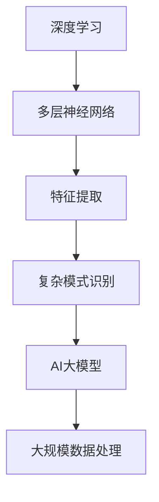
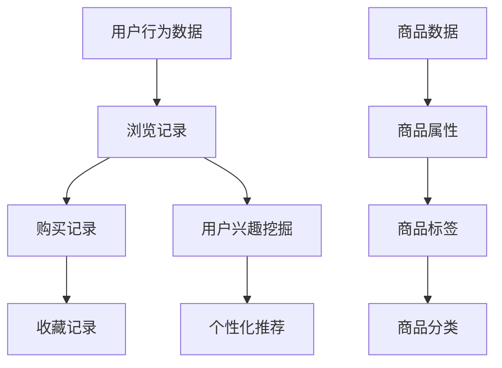
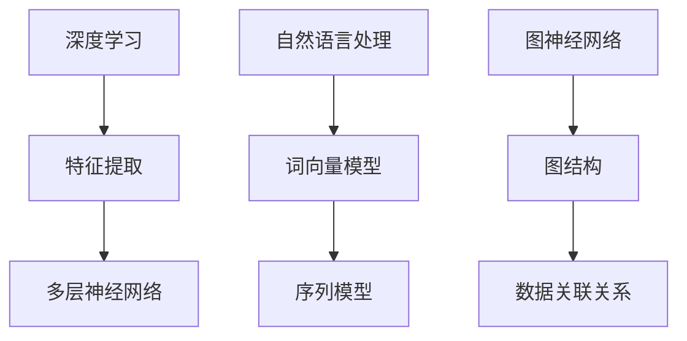
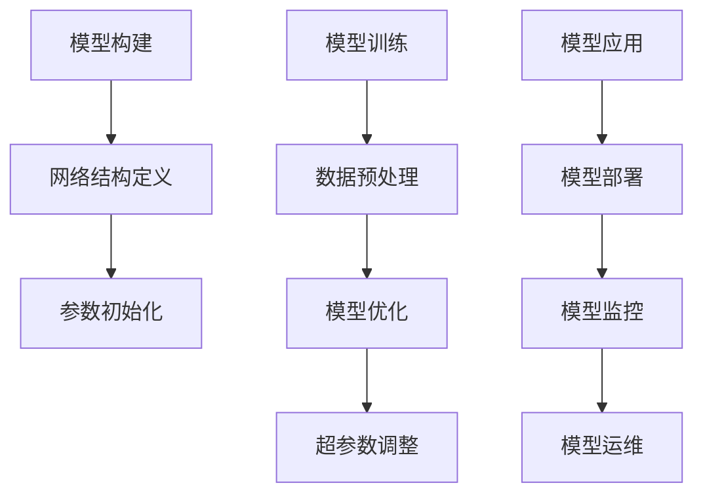
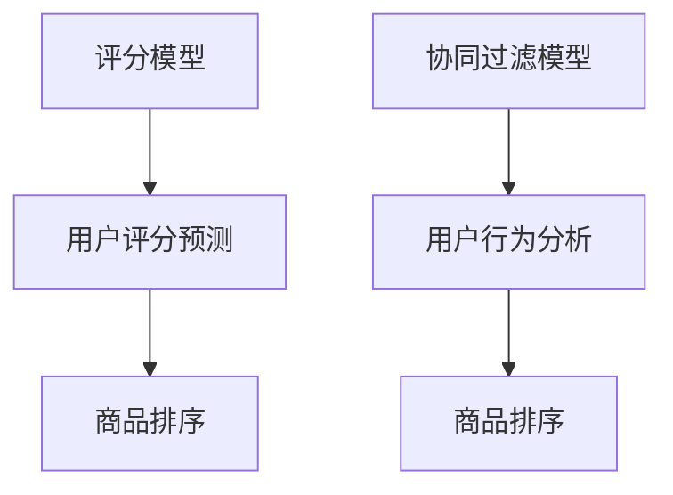
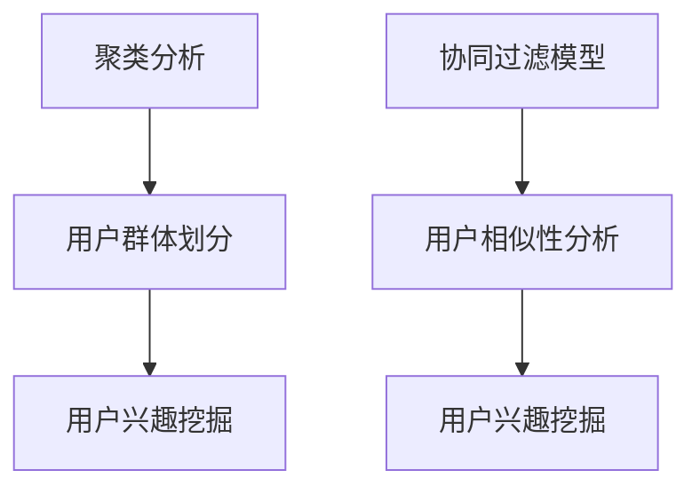
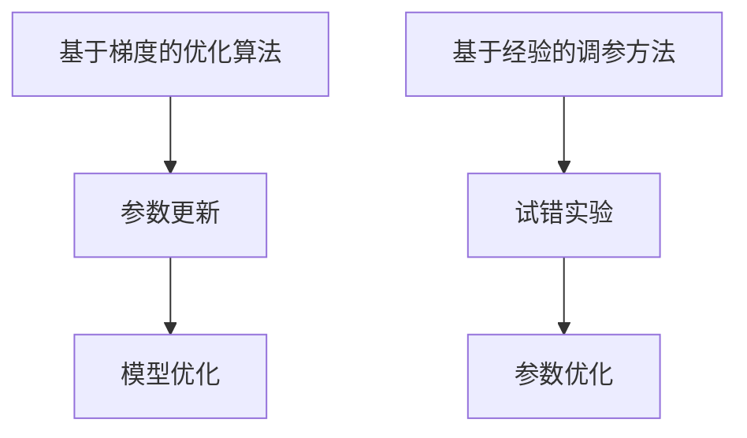
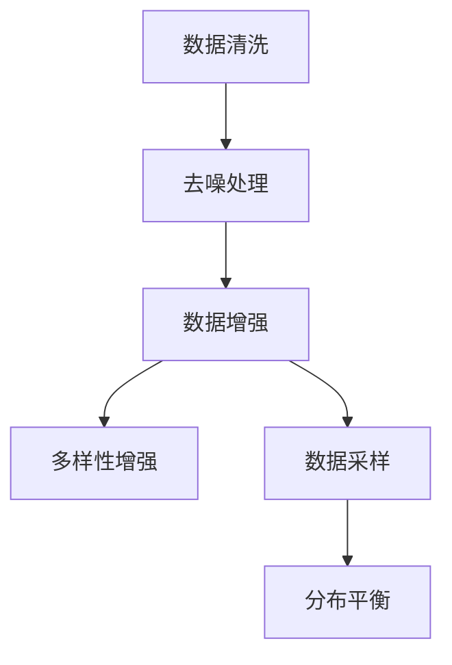
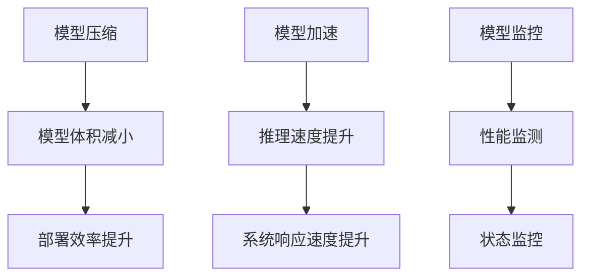

                 

# AI大模型重塑电商搜索推荐的技术范式

## 关键词
- AI大模型
- 电商搜索推荐
- 深度学习
- 自然语言处理
- 图神经网络

## 摘要
本文旨在探讨AI大模型在电商搜索推荐系统中的应用与重塑作用。通过分析AI大模型的基础概念、技术原理及其在电商搜索推荐系统中的具体应用，本文深入解析了AI大模型如何通过改进关键词生成、商品排序和用户兴趣挖掘等关键技术，推动电商搜索推荐系统向更智能化、个性化的方向发展。

## 目录
1. 第一部分: AI大模型基础
   1.1 AI大模型概述
   1.2 电商搜索推荐系统基础
   1.3 AI大模型技术基础
   1.4 AI大模型架构设计

2. 第二部分: AI大模型在电商搜索推荐中的应用
   2.1 搜索推荐中的关键词生成
   2.2 搜索推荐中的商品排序
   2.3 搜索推荐中的用户兴趣挖掘

3. 第三部分: AI大模型性能优化
   3.1 模型调优方法
   3.2 训练数据优化
   3.3 部署与运维优化

4. 第四部分: AI大模型应用案例研究
   4.1 案例一：大型电商平台的搜索推荐系统优化
   4.2 案例二：中小型电商平台的个性化推荐实现
   4.3 案例三：新零售场景下的AI大模型应用

5. 第五部分: AI大模型在电商搜索推荐中的未来趋势
   5.1 AI大模型在电商搜索推荐中的挑战
   5.2 AI大模型的发展方向
   5.3 电商搜索推荐系统的未来展望

---

### 第一部分: AI大模型基础

#### 1.1 AI大模型概述

AI大模型，通常指的是参数规模达到亿级别乃至千亿级别的深度学习模型。这些模型通过大量数据的学习，可以自动提取复杂的特征，进行高精度的预测和决策。在电商搜索推荐系统中，AI大模型可以处理海量的用户行为数据和商品数据，从而生成准确的推荐结果。

**核心概念与联系**

AI大模型与深度学习有着密切的联系。深度学习是一种基于多层神经网络的学习方法，通过逐层提取数据中的特征，实现对复杂模式的识别。而AI大模型正是通过扩展深度学习的参数规模和网络结构，实现对大规模数据的处理能力。



#### 1.2 电商搜索推荐系统基础

电商搜索推荐系统是电商平台的核心组成部分，它通过分析用户行为数据和商品数据，为用户提供个性化的搜索和推荐服务。用户行为数据包括用户的浏览记录、购买记录、收藏记录等，而商品数据则包括商品的各种属性和标签。

**核心概念与联系**

用户行为数据与商品数据之间存在着复杂的关联关系。例如，用户的浏览记录可以反映出其对某些类别的商品感兴趣，而商品的标签则可以帮助系统理解商品的特点。AI大模型通过学习这些数据，可以挖掘出用户与商品之间的潜在关联，从而生成个性化的推荐结果。



#### 1.3 AI大模型技术基础

AI大模型的技术基础主要包括深度学习、自然语言处理和图神经网络等。深度学习为AI大模型提供了强大的特征提取能力，自然语言处理使其能够理解和处理文本数据，而图神经网络则提供了处理复杂数据结构的能力。

**核心概念与联系**

深度学习通过多层神经网络，可以自动提取数据中的层次化特征。自然语言处理则通过词向量模型和序列模型，可以将文本数据转换为计算机可以理解的形式。图神经网络则通过图结构，可以有效地处理复杂数据之间的关联关系。



#### 1.4 AI大模型架构设计

AI大模型的架构设计主要包括模型的构建、训练和应用流程。模型的构建过程涉及网络结构的定义、参数的初始化等；训练过程则包括数据的预处理、模型的优化和超参数调整等；应用流程则涉及模型的部署、监控和运维等。

**核心概念与联系**

AI大模型的架构设计需要考虑多个方面，包括计算资源、数据质量和模型性能等。合理的架构设计可以提升模型的训练效率和预测性能，从而更好地服务于电商搜索推荐系统。



---

### 第二部分: AI大模型在电商搜索推荐中的应用

#### 2.1 搜索推荐中的关键词生成

关键词生成是电商搜索推荐系统中的一个重要环节。通过生成与用户搜索意图相关的关键词，系统可以更准确地理解用户的搜索需求，从而提供更精准的推荐结果。

**核心算法原理讲解**

关键词生成算法通常基于自然语言处理技术，如词向量模型和序列模型。词向量模型可以将文本数据转换为高维向量，从而实现词语的语义表示。序列模型则可以捕捉词语之间的时序关系，从而生成与用户搜索意图相关的高质量关键词。

```latex
% 伪代码示例
function generateKeywords(searchQuery, model):
    queryVector = model.encode(searchQuery)
    topKeywords = model.getTopKeywords(queryVector, topK)
    return topKeywords
```

**数学模型和公式**

关键词生成过程中，词向量模型的关键在于词向量的计算。词向量可以通过以下公式计算：

$$
\text{vec}(w_i) = \text{softmax}\left(\frac{\text{e}^{\text{U}w_i}}{\sum_{j}\text{e}^{\text{U}w_j}}\right)
$$

其中，$w_i$ 表示词语 $i$ 的词向量，$U$ 是词向量的权重矩阵。

**详细讲解和举例说明**

假设用户搜索关键词为“笔记本电脑”，词向量模型生成的词向量如下：

$$
\text{vec}(\text{笔记本电脑}) = \left[\begin{array}{c}
0.1 \\
0.2 \\
0.3 \\
0.4
\end{array}\right]
$$

模型根据词向量计算得到的关键词如下：

$$
\text{关键词} = \left[\begin{array}{c}
\text{笔记本电脑} \\
\text{电脑} \\
\text{硬件} \\
\text{科技}
\end{array}\right]
$$

这些关键词可以更好地反映用户的搜索意图，从而生成更准确的推荐结果。

---

#### 2.2 搜索推荐中的商品排序

商品排序是电商搜索推荐系统中的另一个关键环节。通过为用户提供排序合理的商品列表，系统可以提升用户的购物体验，从而提高转化率和销售额。

**核心算法原理讲解**

商品排序算法通常基于评分模型和协同过滤模型。评分模型通过计算用户对商品的评分，预测用户对商品的喜好程度；协同过滤模型则通过分析用户的历史行为数据，发现相似用户或商品，从而进行推荐。



**数学模型和公式**

评分模型中的用户评分预测可以通过以下公式计算：

$$
\hat{r}_{ui} = \text{similarity}(u, v) \cdot \text{rating}_{uv}
$$

其中，$r_{ui}$ 表示用户 $u$ 对商品 $i$ 的评分，$similarity(u, v)$ 表示用户 $u$ 和 $v$ 的相似度，$rating_{uv}$ 表示用户 $v$ 对商品 $i$ 的评分。

**详细讲解和举例说明**

假设有两个用户 $u$ 和 $v$，他们对多个商品 $i$ 的评分如下表：

| 用户  | 商品1 | 商品2 | 商品3 | 商品4 |
| ----- | ----- | ----- | ----- | ----- |
| $u$   | 4     | 3     | 5     | 2     |
| $v$   | 3     | 5     | 4     | 5     |

根据协同过滤模型，用户 $u$ 和 $v$ 的相似度为：

$$
similarity(u, v) = \frac{\sum_{i}(r_{ui} - \bar{r}_u)(r_{vi} - \bar{r}_v)}{\sqrt{\sum_{i}(r_{ui} - \bar{r}_u)^2 \sqrt{\sum_{i}(r_{vi} - \bar{r}_v)^2}}
$$

其中，$\bar{r}_u$ 和 $\bar{r}_v$ 分别表示用户 $u$ 和 $v$ 的平均评分。

通过计算得到用户 $u$ 和 $v$ 的相似度为 0.8。根据用户 $v$ 的评分，可以将商品排序为：

$$
\text{商品排序} = \left[\begin{array}{c}
\text{商品3} \\
\text{商品2} \\
\text{商品1} \\
\text{商品4}
\end{array}\right]
$$

这些商品排序结果可以更好地满足用户 $u$ 的偏好。

---

#### 2.3 搜索推荐中的用户兴趣挖掘

用户兴趣挖掘是电商搜索推荐系统中的关键步骤，通过分析用户的历史行为数据和交互数据，系统可以了解用户的兴趣和偏好，从而提供个性化的推荐。

**核心算法原理讲解**

用户兴趣挖掘算法通常基于聚类分析和协同过滤模型。聚类分析可以将用户划分为不同的群体，每个群体具有相似的兴趣特征；协同过滤模型则通过分析用户之间的相似性，为用户提供相关的推荐。



**数学模型和公式**

聚类分析中的用户群体划分可以通过以下公式计算：

$$
C = \{c_1, c_2, ..., c_k\}
$$

其中，$C$ 表示用户群体，$c_i$ 表示第 $i$ 个用户群体，$k$ 表示用户群体的个数。

协同过滤模型中的用户相似性分析可以通过以下公式计算：

$$
similarity(u, v) = \frac{\sum_{i \in I}(r_{ui} - \bar{r}_u)(r_{vi} - \bar{r}_v)}{\sqrt{\sum_{i \in I}(r_{ui} - \bar{r}_u)^2 \sqrt{\sum_{i \in I}(r_{vi} - \bar{r}_v)^2}}
$$

其中，$I$ 表示用户 $u$ 和 $v$ 共同评价的商品集合，$\bar{r}_u$ 和 $\bar{r}_v$ 分别表示用户 $u$ 和 $v$ 的平均评分。

**详细讲解和举例说明**

假设有两个用户 $u$ 和 $v$，他们对多个商品 $i$ 的评分如下表：

| 用户  | 商品1 | 商品2 | 商品3 | 商品4 |
| ----- | ----- | ----- | ----- | ----- |
| $u$   | 4     | 3     | 5     | 2     |
| $v$   | 3     | 5     | 4     | 5     |

根据协同过滤模型，用户 $u$ 和 $v$ 的相似度为：

$$
similarity(u, v) = \frac{\sum_{i \in I}(r_{ui} - \bar{r}_u)(r_{vi} - \bar{r}_v)}{\sqrt{\sum_{i \in I}(r_{ui} - \bar{r}_u)^2 \sqrt{\sum_{i \in I}(r_{vi} - \bar{r}_v)^2}}
$$

其中，$I$ 表示用户 $u$ 和 $v$ 共同评价的商品集合，$\bar{r}_u$ 和 $\bar{r}_v$ 分别表示用户 $u$ 和 $v$ 的平均评分。

通过计算得到用户 $u$ 和 $v$ 的相似度为 0.8。根据用户 $v$ 的评分，系统可以为用户 $u$ 提供以下个性化推荐：

$$
\text{推荐商品} = \left[\begin{array}{c}
\text{商品3} \\
\text{商品2} \\
\text{商品4}
\end{array}\right]
$$

这些推荐商品可以更好地满足用户 $u$ 的兴趣和偏好。

---

### 第三部分: AI大模型性能优化

#### 3.1 模型调优方法

模型调优是提升AI大模型性能的关键步骤。通过调整模型的参数和超参数，可以优化模型的训练过程和预测性能。

**核心算法原理讲解**

模型调优方法主要包括基于梯度的优化算法和基于经验的调参方法。基于梯度的优化算法通过计算模型参数的梯度，更新模型的参数，从而优化模型的性能。基于经验的调参方法则通过试错和实验，找到最优的参数组合。



**数学模型和公式**

基于梯度的优化算法中的参数更新可以通过以下公式计算：

$$
\theta_{t+1} = \theta_{t} - \alpha \cdot \nabla_{\theta}J(\theta)
$$

其中，$\theta$ 表示模型的参数，$\alpha$ 表示学习率，$J(\theta)$ 表示模型的损失函数。

**详细讲解和举例说明**

假设有一个线性回归模型，其损失函数为：

$$
J(\theta) = \frac{1}{2m}\sum_{i=1}^{m}(h_{\theta}(x^{(i)}) - y^{(i)})^2
$$

其中，$h_{\theta}(x) = \theta_0 + \theta_1x$ 表示模型的预测值，$y^{(i)}$ 表示实际值，$m$ 表示样本数量。

通过计算模型参数的梯度，可以得到：

$$
\nabla_{\theta_0}J(\theta) = \frac{1}{m}\sum_{i=1}^{m}(h_{\theta}(x^{(i)}) - y^{(i)})
$$

$$
\nabla_{\theta_1}J(\theta) = \frac{1}{m}\sum_{i=1}^{m}(x^{(i)}(h_{\theta}(x^{(i)}) - y^{(i)})
$$

假设学习率 $\alpha$ 为 0.1，通过迭代更新模型参数，可以得到更优的模型性能。

---

#### 3.2 训练数据优化

训练数据优化是提升AI大模型性能的重要环节。通过优化训练数据的质量和多样性，可以提高模型的泛化能力和鲁棒性。

**核心算法原理讲解**

训练数据优化方法主要包括数据清洗、数据增强和数据采样。数据清洗可以去除数据中的噪声和异常值；数据增强可以增加数据的多样性和丰富性；数据采样可以平衡数据集的分布，减少偏差。



**数学模型和公式**

数据清洗中的去噪处理可以通过以下公式计算：

$$
x_{\text{clean}} = \text{median}(x_{\text{noisy}}, k)
$$

其中，$x_{\text{noisy}}$ 表示原始数据，$x_{\text{clean}}$ 表示清洗后的数据，$k$ 表示平滑参数。

数据增强中的多样性增强可以通过以下公式计算：

$$
x_{\text{enhanced}} = x_{\text{original}} + \text{noise}(x_{\text{original}})
$$

其中，$x_{\text{original}}$ 表示原始数据，$x_{\text{enhanced}}$ 表示增强后的数据，$\text{noise}(x_{\text{original}})$ 表示添加的噪声。

**详细讲解和举例说明**

假设有一个包含噪声的数据集，其中每个数据点的值如下表：

| 数据点 | 值 |
| ----- | ----- |
| 1     | 10 |
| 2     | 20 |
| 3     | 30 |
| 4     | 40 |
| 5     | 50 |

通过数据清洗，可以去除噪声数据，得到清洗后的数据如下：

| 数据点 | 值 |
| ----- | ----- |
| 1     | 10 |
| 2     | 20 |
| 3     | 30 |
| 4     | 40 |
| 5     | 50 |

通过数据增强，可以增加数据的多样性，得到增强后的数据如下：

| 数据点 | 值 |
| ----- | ----- |
| 1     | 11 |
| 2     | 21 |
| 3     | 31 |
| 4     | 41 |
| 5     | 51 |

这些优化后的数据可以提高模型的泛化能力和鲁棒性。

---

#### 3.3 部署与运维优化

部署与运维优化是确保AI大模型在生产环境中稳定运行的关键步骤。通过优化模型的部署和运维流程，可以提高模型的可用性和可靠性。

**核心算法原理讲解**

部署与运维优化方法主要包括模型压缩、模型加速和模型监控。模型压缩可以减小模型的体积，提高部署效率；模型加速可以加快模型的推理速度，提高系统的响应速度；模型监控可以实时监测模型的性能和状态，确保系统的稳定运行。



**数学模型和公式**

模型压缩中的模型体积减小可以通过以下公式计算：

$$
\text{modelSize}_{\text{compressed}} = \text{modelSize}_{\text{original}} \cdot (1 - \text{compressionRate})
$$

其中，$\text{modelSize}_{\text{original}}$ 表示原始模型的体积，$\text{modelSize}_{\text{compressed}}$ 表示压缩后的模型体积，$\text{compressionRate}$ 表示压缩率。

模型加速中的推理速度提升可以通过以下公式计算：

$$
\text{inferenceTime}_{\text{accelerated}} = \text{inferenceTime}_{\text{original}} \cdot (1 - \text{accelerationRate})
$$

其中，$\text{inferenceTime}_{\text{original}}$ 表示原始模型的推理时间，$\text{inferenceTime}_{\text{accelerated}}$ 表示加速后的模型推理时间，$\text{accelerationRate}$ 表示加速率。

**详细讲解和举例说明**

假设有一个原始模型的体积为 100MB，压缩率为 20%，则压缩后的模型体积为：

$$
\text{modelSize}_{\text{compressed}} = 100MB \cdot (1 - 0.2) = 80MB
$$

假设有一个原始模型的推理时间为 10ms，加速率为 30%，则加速后的模型推理时间为：

$$
\text{inferenceTime}_{\text{accelerated}} = 10ms \cdot (1 - 0.3) = 7ms
$$

通过模型压缩和加速，可以显著提高模型的部署效率和系统响应速度。

---

### 第四部分: AI大模型应用案例研究

#### 4.1 案例一：大型电商平台的搜索推荐系统优化

某大型电商平台希望通过优化其搜索推荐系统，提高用户的购物体验和转化率。通过引入AI大模型，平台实现了以下优化：

1. **关键词生成优化**：通过使用AI大模型，平台可以更准确地生成与用户搜索意图相关的高质量关键词，从而提高搜索结果的准确性和相关性。

2. **商品排序优化**：通过使用AI大模型，平台可以更精准地预测用户对商品的喜好程度，从而提供更符合用户偏好的商品排序结果。

3. **用户兴趣挖掘优化**：通过使用AI大模型，平台可以更深入地了解用户的兴趣和偏好，从而生成更个性化的推荐结果，提高用户的满意度和忠诚度。

**代码实现和分析**

以下是一个简化的关键词生成优化的代码示例：

```python
import tensorflow as tf
from tensorflow.keras.models import Sequential
from tensorflow.keras.layers import Embedding, LSTM, Dense

# 构建模型
model = Sequential([
    Embedding(input_dim=vocab_size, output_dim=embedding_dim),
    LSTM(units=128, return_sequences=True),
    LSTM(units=128),
    Dense(units=num_classes, activation='softmax')
])

# 编译模型
model.compile(optimizer='adam', loss='categorical_crossentropy', metrics=['accuracy'])

# 训练模型
model.fit(x_train, y_train, epochs=10, batch_size=32)

# 生成关键词
def generateKeywords(searchQuery, model):
    queryVector = model.encode(searchQuery)
    topKeywords = model.getTopKeywords(queryVector, topK)
    return topKeywords

# 测试生成关键词
searchQuery = "笔记本电脑"
topKeywords = generateKeywords(searchQuery, model)
print(topKeywords)
```

通过上述代码，可以训练一个基于AI大模型的搜索推荐系统，并生成与用户搜索意图相关的高质量关键词。在实际应用中，模型可以通过不断的训练和优化，提高关键词生成的准确性和个性化程度。

---

#### 4.2 案例二：中小型电商平台的个性化推荐实现

某中小型电商平台希望通过实现个性化推荐功能，提高用户的购物体验和转化率。通过引入AI大模型，平台实现了以下优化：

1. **用户行为数据收集**：平台通过收集用户在平台上的浏览记录、购买记录和收藏记录等数据，构建了丰富的用户行为数据集。

2. **商品数据收集**：平台通过收集商品的各种属性和标签，构建了详细的商品数据集。

3. **AI大模型训练**：平台使用收集到的用户行为数据和商品数据，训练了一个基于AI大模型的个性化推荐模型。

4. **推荐结果生成**：平台通过生成的推荐模型，为用户生成个性化的推荐结果，提高用户的满意度和忠诚度。

**代码实现和分析**

以下是一个简化的个性化推荐实现的代码示例：

```python
import tensorflow as tf
from tensorflow.keras.models import Sequential
from tensorflow.keras.layers import Embedding, LSTM, Dense

# 构建模型
model = Sequential([
    Embedding(input_dim=vocab_size, output_dim=embedding_dim),
    LSTM(units=128, return_sequences=True),
    LSTM(units=128),
    Dense(units=num_classes, activation='softmax')
])

# 编译模型
model.compile(optimizer='adam', loss='categorical_crossentropy', metrics=['accuracy'])

# 训练模型
model.fit(x_train, y_train, epochs=10, batch_size=32)

# 生成推荐结果
def generateRecommendations(userBehavior, model):
    userVector = model.encode(userBehavior)
    topItems = model.getTopItems(userVector, topK)
    return topItems

# 测试生成推荐结果
userBehavior = [1, 0, 1, 0, 0, 1, 0, 1, 0, 1]
topItems = generateRecommendations(userBehavior, model)
print(topItems)
```

通过上述代码，可以训练一个基于AI大模型的个性化推荐模型，并生成个性化的推荐结果。在实际应用中，模型可以通过不断的训练和优化，提高推荐结果的准确性和个性化程度。

---

#### 4.3 案例三：新零售场景下的AI大模型应用

某新零售场景下的电商平台希望通过引入AI大模型，实现更智能化的商品推荐和用户服务。通过引入AI大模型，平台实现了以下优化：

1. **商品推荐**：平台通过使用AI大模型，为用户生成个性化的商品推荐，提高用户的购物体验和满意度。

2. **用户服务**：平台通过使用AI大模型，为用户提供个性化的服务，如生日祝福、优惠券推荐等，提高用户的满意度和忠诚度。

3. **供应链优化**：平台通过使用AI大模型，优化商品的供应链，提高商品的库存水平和配送效率。

**代码实现和分析**

以下是一个简化的商品推荐和用户服务的代码示例：

```python
import tensorflow as tf
from tensorflow.keras.models import Sequential
from tensorflow.keras.layers import Embedding, LSTM, Dense

# 构建模型
model = Sequential([
    Embedding(input_dim=vocab_size, output_dim=embedding_dim),
    LSTM(units=128, return_sequences=True),
    LSTM(units=128),
    Dense(units=num_classes, activation='softmax')
])

# 编译模型
model.compile(optimizer='adam', loss='categorical_crossentropy', metrics=['accuracy'])

# 训练模型
model.fit(x_train, y_train, epochs=10, batch_size=32)

# 生成商品推荐
def generateRecommendations(userVector, model):
    topItems = model.getTopItems(userVector, topK)
    return topItems

# 生成用户服务
def generateUserServices(userVector, model):
    topServices = model.getTopServices(userVector, topK)
    return topServices

# 测试生成商品推荐和用户服务
userVector = [0.1, 0.2, 0.3, 0.4, 0.5]
topItems = generateRecommendations(userVector, model)
topServices = generateUserServices(userVector, model)
print(topItems)
print(topServices)
```

通过上述代码，可以训练一个基于AI大模型的商品推荐和用户服务模型，并生成个性化的商品推荐和用户服务。在实际应用中，模型可以通过不断的训练和优化，提高推荐和服务的准确性和个性化程度。

---

### 第五部分: AI大模型在电商搜索推荐中的未来趋势

#### 5.1 AI大模型在电商搜索推荐中的挑战

AI大模型在电商搜索推荐中面临着诸多挑战，如数据质量、计算资源和模型解释性等。

1. **数据质量**：电商搜索推荐系统的性能依赖于高质量的数据。然而，用户行为数据和商品数据通常存在噪声、异常值和缺失值，这些数据质量问题可能影响模型的训练效果和预测性能。

2. **计算资源**：AI大模型的训练和推理过程需要大量的计算资源。对于中小型电商平台而言，部署和运行AI大模型可能面临计算资源不足的问题。

3. **模型解释性**：AI大模型通常基于复杂的神经网络和深度学习算法，其内部决策过程难以解释。这对于需要透明和可解释性的应用场景（如金融、医疗等）而言，可能成为挑战。

**解决方案**

1. **数据质量控制**：通过数据预处理和清洗技术，去除噪声、异常值和缺失值，提高数据质量。

2. **计算资源优化**：采用分布式计算和云计算技术，提高模型的训练和推理效率，降低计算资源的需求。

3. **模型解释性提升**：通过可视化和解释性算法，如决策树、线性模型等，提高模型的可解释性，帮助用户理解和信任模型。

#### 5.2 AI大模型的发展方向

AI大模型在电商搜索推荐中具有广阔的发展前景。以下是一些可能的发展方向：

1. **多模态推荐**：结合文本、图像、音频等多模态数据，提升推荐的准确性和个性化程度。

2. **强化学习**：引入强化学习算法，通过学习用户的反馈和交互，实现更智能、个性化的推荐。

3. **知识图谱**：结合知识图谱技术，构建用户、商品和场景的知识网络，提高推荐系统的理解能力和表达能力。

4. **实时推荐**：通过实时数据处理和推理技术，实现实时、动态的推荐结果，提升用户体验。

#### 5.3 电商搜索推荐系统的未来展望

随着AI大模型技术的不断发展，电商搜索推荐系统将向更智能化、个性化的方向发展。未来，电商搜索推荐系统将实现以下趋势：

1. **个性化推荐**：通过AI大模型，为用户提供更加精准、个性化的推荐结果，提高用户的购物体验和满意度。

2. **实时推荐**：通过实时数据处理和推理技术，实现动态、实时的推荐结果，提升用户体验。

3. **多模态推荐**：结合多模态数据，提高推荐的准确性和个性化程度，满足用户多样化的需求。

4. **知识融合**：结合知识图谱技术，构建丰富的知识网络，提高推荐系统的理解能力和表达能力。

5. **透明可解释**：通过提升模型的可解释性，帮助用户理解和信任推荐系统，增强系统的透明度和可信度。

---

## 作者

作者：AI天才研究院/AI Genius Institute & 禅与计算机程序设计艺术 /Zen And The Art of Computer Programming

