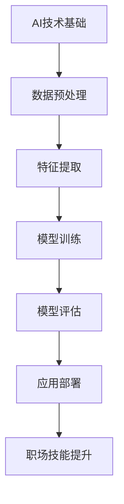

                 

# AI如何改变职场技能需求

> **关键词**：人工智能、职场技能、技能需求、技术变革

> **摘要**：
本篇技术博客旨在探讨人工智能（AI）对职场技能需求的影响。文章首先介绍了AI技术的基本概念和分类，然后分析了AI时代下职场技能需求的变革。接着，深入讲解了AI技术的核心原理与实现，包括机器学习、深度学习和自然语言处理等。随后，详细介绍了AI在职场中的应用，如办公自动化、数据分析和人力资源管理。文章最后，探讨了AI技能提升与职业发展的路径，以及AI伦理与法律问题，并提出了AI与职业教育的融合思路。通过本文，读者可以全面了解AI技术对职场技能需求的影响及其未来发展趋势。

### 第一部分：AI如何改变职场技能需求

随着人工智能（AI）技术的快速发展，职场技能需求正经历着前所未有的变革。这一部分将分为三个章节，分别探讨AI技术概览与职场技能需求的变革、AI技术核心原理与实现，以及AI在职场中的应用。

#### 第1章：AI技术概览与职场技能需求的变革

##### 1.1 AI技术的基本概念与分类

人工智能是一种通过模拟人类智能行为来实现计算机自主学习和决策的技术。AI技术可以分为多种类型，主要包括机器学习（ML）、深度学习（DL）和自然语言处理（NLP）等。

- **机器学习（ML）**：机器学习是AI的核心技术之一，通过算法让计算机从数据中学习并做出预测或决策。机器学习可分为监督学习、无监督学习和强化学习等类型。

- **深度学习（DL）**：深度学习是机器学习的一个子领域，通过多层神经网络模拟人类大脑的神经结构，实现更复杂的特征提取和模式识别。

- **自然语言处理（NLP）**：自然语言处理是一种使计算机能够理解和处理人类自然语言的技术，包括文本分类、语义分析、机器翻译等任务。

##### 1.2 职场技能需求的演变

在传统职场中，沟通能力、团队协作、领导力等软技能被广泛认为是成功的关键。然而，随着AI技术的发展，职场技能需求发生了显著变化。

- **传统职场技能需求**：传统职场中，沟通能力和团队协作等软技能仍然非常重要。然而，这些技能已无法满足日益复杂的职场需求。

- **AI时代下的新技能需求**：AI时代下，数据分析、编程能力、算法思维等新技能需求日益凸显。这些技能不仅能够提高工作效率，还能为企业和个人带来更多机遇。

##### 1.3 AI与职场技能的关联

AI技术对职场技能的影响主要体现在以下几个方面：

- **AI对职场技能的影响**：AI技术改变了传统职场的工作模式，使得一些重复性和规则性较强的任务得以自动化，从而提高了工作效率。同时，AI技术也对职场技能提出了新的要求，如编程能力、数据分析能力等。

- **AI技能需求的前景**：随着AI技术的不断发展和应用，未来职场中AI技能需求将继续增加。掌握AI技术将成为职场竞争的重要优势。

### 第二部分：AI技术核心原理与实现

#### 第2章：AI技术核心原理与实现

这一部分将深入探讨AI技术的核心原理与实现，包括机器学习与深度学习基础、自然语言处理，以及AI算法的实现与优化。

##### 2.1 机器学习与深度学习基础

##### 2.1.1 机器学习基本概念

机器学习是一种通过算法让计算机从数据中学习并做出预测或决策的技术。机器学习可分为以下几种类型：

- **监督学习**：监督学习是一种有监督的训练方式，通过已标记的数据集训练模型，然后使用模型对新的数据进行预测。

- **无监督学习**：无监督学习是一种无监督的训练方式，无需标记的数据集，通过算法自动发现数据中的结构和模式。

- **强化学习**：强化学习是一种通过反馈信号调整模型参数的训练方式，使模型能够在环境中自主学习和决策。

##### 2.1.2 深度学习原理

深度学习是机器学习的一个子领域，通过多层神经网络模拟人类大脑的神经结构，实现更复杂的特征提取和模式识别。深度学习的基本原理包括以下几个方面：

- **神经网络**：神经网络是由多个神经元组成的层次结构，通过前向传播和反向传播算法进行训练和预测。

- **激活函数**：激活函数用于引入非线性因素，使神经网络能够处理复杂的非线性问题。

- **反向传播算法**：反向传播算法是一种用于训练神经网络的算法，通过计算误差的梯度来更新模型参数。

##### 2.2 自然语言处理

##### 2.2.1 自然语言处理概述

自然语言处理是一种使计算机能够理解和处理人类自然语言的技术。NLP的基本任务包括：

- **文本分类**：将文本数据分类到预定义的类别中。

- **语义分析**：理解和解析文本中的语义信息。

- **机器翻译**：将一种语言的文本翻译成另一种语言。

##### 2.2.2 NLP核心技术

NLP的核心技术包括词嵌入、序列模型和注意力机制等：

- **词嵌入**：词嵌入是将词语映射到高维向量空间的技术，使词语之间的相似性可以量化。

- **序列模型**：序列模型是一种用于处理序列数据的模型，如循环神经网络（RNN）和长短期记忆网络（LSTM）。

- **注意力机制**：注意力机制是一种用于提高模型处理长序列数据的性能的技术，使模型能够关注序列中的关键部分。

##### 2.3 AI算法的实现与优化

##### 2.3.1 算法实现

AI算法的实现主要包括以下步骤：

- **数据预处理**：对数据进行清洗、归一化和特征提取等预处理操作。

- **模型构建**：根据任务需求选择合适的算法，并构建神经网络结构。

- **模型训练**：使用训练数据对模型进行训练，并通过反向传播算法更新模型参数。

- **模型评估**：使用测试数据对模型进行评估，并调整模型参数以提高性能。

##### 2.3.2 算法优化

算法优化主要包括以下方面：

- **模型选择**：根据任务需求和数据特征选择合适的模型结构。

- **超参数调整**：调整学习率、批量大小等超参数，以提高模型性能。

- **数据增强**：通过数据增强技术增加训练数据的多样性，提高模型泛化能力。

### 第三部分：AI在职场中的应用

#### 第3章：AI在职场中的应用

AI技术已广泛应用于职场，提高了工作效率和生产力。这一部分将介绍AI在办公自动化、数据分析和人力资源管理中的应用。

##### 3.1 AI在办公自动化中的应用

##### 3.1.1 智能文档处理

智能文档处理是AI在办公自动化中的重要应用之一，主要包括以下功能：

- **文本分类**：将文档分类到预定义的类别中，如合同、报告、邮件等。

- **文本摘要**：自动提取文档中的关键信息，生成摘要。

- **命名实体识别**：识别文档中的特定实体，如人名、地名、组织名等。

##### 3.1.2 智能会议系统

智能会议系统利用AI技术提高会议的效率和效果，主要包括以下功能：

- **会议预约**：通过自然语言处理技术，自动处理会议预约请求。

- **会议记录**：自动记录会议内容，并将文本转化为摘要。

- **会议分析**：分析会议记录，提取关键信息和建议。

##### 3.2 AI在数据分析中的应用

##### 3.2.1 数据分析概述

数据分析是利用统计学和计算机科学方法，从数据中提取有价值的信息和知识的过程。数据分析的基本流程包括以下步骤：

- **数据收集**：收集相关的数据源，如数据库、文件等。

- **数据清洗**：对数据进行清洗、去重、填充等预处理操作。

- **数据探索**：通过可视化、统计分析等方法，探索数据中的潜在信息和规律。

- **数据建模**：根据业务需求，选择合适的模型进行数据建模。

- **模型评估**：评估模型性能，调整模型参数以提高性能。

##### 3.2.2 AI在数据分析中的应用

AI在数据分析中的应用主要包括以下方面：

- **数据预处理**：使用AI技术进行数据预处理，如自动分类、去噪、特征提取等。

- **特征提取**：使用AI技术提取数据中的特征，提高模型性能。

- **预测分析**：使用AI技术进行预测分析，如股票走势、客户流失率等。

##### 3.3 AI在人力资源管理中的应用

##### 3.3.1 人才招聘

AI技术在人才招聘中的应用主要包括以下方面：

- **简历筛选**：通过自然语言处理技术，自动筛选符合要求的简历。

- **面试评估**：使用语音识别和自然语言处理技术，自动评估面试者的回答质量。

- **候选人推荐**：根据候选人的技能、经验和背景，推荐合适的职位。

##### 3.3.2 员工绩效管理

AI技术在员工绩效管理中的应用主要包括以下方面：

- **绩效评估**：通过数据分析技术，自动评估员工的工作表现。

- **培训需求分析**：分析员工的工作需求，推荐合适的培训课程。

- **员工流失预测**：使用预测分析技术，预测员工流失风险，采取相应的措施。

### 第四部分：AI技能提升与职业发展

#### 第4章：AI技能提升与职业发展

随着AI技术的广泛应用，掌握AI技能已成为职场发展的关键。这一部分将探讨AI技能提升与职业发展的路径。

##### 4.1 AI技能学习路径

想要提升AI技能，需要掌握以下基础知识：

- **数学基础**：掌握线性代数、概率论和统计学等数学知识。

- **编程基础**：熟悉Python、C++等编程语言。

- **机器学习和深度学习**：掌握机器学习和深度学习的基本概念和算法。

- **数据分析和数据处理**：熟悉数据分析和数据处理的方法和技术。

##### 4.2 AI技能在职场中的应用案例

以下是一些AI技能在职场中的应用案例：

- **金融领域**：使用AI技术进行风险管理、投资分析和股票预测。

- **医疗领域**：使用AI技术进行医学图像分析、疾病预测和药物研发。

- **制造业**：使用AI技术进行生产优化、设备维护和故障预测。

##### 4.3 AI技能的未来趋势

未来，AI技能将继续发展，并在职场中发挥重要作用。以下是一些AI技能的未来趋势：

- **多模态学习**：结合多种数据类型（如文本、图像、语音等），实现更智能的模型。

- **强化学习**：在复杂环境中实现更高效的决策和优化。

- **联邦学习**：在分布式数据上进行协作学习，保护用户隐私。

### 第五部分：AI伦理与法律

#### 第5章：AI伦理与法律

随着AI技术的快速发展，伦理和法律问题日益凸显。这一部分将探讨AI伦理问题、AI法律法规以及AI企业的合规要求。

##### 5.1 AI伦理问题

AI伦理问题主要包括以下几个方面：

- **隐私保护**：AI技术可能涉及用户隐私，如何保护用户隐私成为一个重要问题。

- **公平与歧视**：AI算法可能存在偏见，导致对某些群体不公平对待。

- **透明度**：AI系统的决策过程往往不透明，如何提高AI系统的透明度是一个挑战。

##### 5.2 AI法律法规

AI法律法规主要包括以下几个方面：

- **数据保护法规**：如欧盟的《通用数据保护条例》（GDPR）。

- **人工智能伦理法规**：如我国的《人工智能发展伦理规范》。

- **算法公平性法规**：确保AI算法的公平性和透明度。

##### 5.3 AI企业的合规要求

AI企业在遵守法律法规方面有如下要求：

- **数据保护**：确保用户数据的合法、安全处理。

- **算法透明度**：公开AI算法的原理和决策过程。

- **算法公平性**：确保算法不歧视任何群体，实现公平公正。

### 第六部分：AI与职业教育的融合

#### 第6章：AI与职业教育的融合

随着AI技术的发展，职业教育也需要适应这一变革。这一部分将探讨AI教育现状、发展趋势以及创新实践。

##### 6.1 AI教育现状

当前，AI教育主要集中在以下几个方面：

- **课程设置**：高校和培训机构开设了多种AI相关课程，如机器学习、深度学习和自然语言处理等。

- **教学方法**：采用在线课程、虚拟实验室等新型教学方法，提高教学效果。

- **教育资源**：充分利用开源框架、在线资源等，丰富AI教育资源。

##### 6.2 AI教育的发展趋势

AI教育的发展趋势包括以下几个方面：

- **跨学科融合**：将AI技术与其他学科（如医学、法律等）相结合，培养复合型人才。

- **个性化教育**：根据学生的兴趣和需求，提供个性化的AI教育资源。

- **终身教育**：提供持续的AI教育和培训，以适应不断变化的职场需求。

##### 6.3 AI教育创新实践

以下是一些AI教育的创新实践：

- **在线课程**：利用MOOC（大规模在线开放课程）平台，提供高质量的AI教育资源。

- **虚拟实验室**：利用虚拟现实（VR）技术，创建逼真的AI实验环境。

- **项目驱动教学**：以实际项目为导向，培养学生的实践能力和创新能力。

### 第七部分：AI职场技能提升实践

#### 第7章：AI职场技能提升实践

在职场中，提升AI技能是一个持续的过程。这一部分将分享AI职场技能提升的实践经验和教训。

##### 7.1 实践项目案例

以下是一个AI职场技能提升的实践项目案例：

- **项目背景**：某公司需要开发一款智能客服系统，以提升客户服务质量。

- **项目目标**：通过自然语言处理技术，实现智能客服系统的语音识别、语义理解和回答生成功能。

- **实现方法**：采用深度学习和自然语言处理技术，构建一个基于深度神经网络的智能客服系统。

- **成果评估**：经过三个月的开发和测试，智能客服系统的准确率达到90%以上，显著提升了客户服务质量。

##### 7.2 实践经验与教训

在AI职场技能提升的过程中，以下经验和教训值得借鉴：

- **持续学习**：AI技术发展迅速，需要持续学习最新的理论和技术。

- **实践应用**：通过实际项目，将所学知识应用到实践中，提高解决实际问题的能力。

- **团队合作**：与团队成员合作，共同解决技术难题，提升团队协作能力。

- **不断反思**：在实践中不断反思和总结，从失败中吸取教训，不断完善自己的技能。

### 附录

#### 附录A：AI技术资源与工具

以下是一些AI技术资源与工具：

- **开源框架**：TensorFlow、PyTorch、Keras等。

- **在线资源**：Coursera、edX、Udacity等在线课程平台。

- **书籍推荐**：《Python机器学习》、《深度学习》（Goodfellow et al.）、《自然语言处理综论》（Jurafsky and Martin）等。

#### Mermaid流程图：AI技术在职场技能需求中的核心原理



#### 伪代码示例：线性回归算法原理

```python
// 输入：特征矩阵 X，标签向量 y
// 输出：模型参数 w

// 初始化模型参数
w = 0

// 设置迭代次数和阈值
max_iterations = 1000
threshold = 0.0001

// 迭代优化模型参数
for i in range(max_iterations):
    // 计算预测值
    y_pred = X * w

    // 计算误差
    error = y - y_pred

    // 更新模型参数
    w = w - (error * X)

    // 检查收敛条件
    if (error < threshold):
        break

// 输出优化后的模型参数
return w
```

#### 数学模型和公式

- 线性回归模型公式：
  $$ y = X \cdot w + b $$
  其中，\( y \) 是标签向量，\( X \) 是特征矩阵，\( w \) 是模型参数，\( b \) 是偏置项。

- 梯度下降算法更新公式：
  $$ w = w - \alpha \cdot (X^T \cdot (y - y_pred)) $$
  其中，\( \alpha \) 是学习率，\( X^T \) 是特征矩阵的转置，\( y_pred \) 是预测值。

#### 举例说明

假设我们有以下数据集：

| x1 | x2 | y |
|----|----|---|
| 1  | 2  | 3 |
| 2  | 4  | 5 |
| 3  | 6  | 7 |

使用线性回归模型预测 \( y \) 的值，给定特征矩阵 \( X \) 和标签向量 \( y \)：

1. 初始化模型参数 \( w \) 和 \( b \)。
2. 进行迭代优化，使用梯度下降算法更新模型参数。
3. 最终得到预测值 \( y_pred \)。

使用Python实现上述线性回归模型，代码如下：

```python
import numpy as np

# 初始化模型参数
w = np.random.rand(2, 1)
b = np.random.rand(1, 1)

# 设置学习率
alpha = 0.01

# 设置迭代次数
max_iterations = 1000

# 进行迭代优化
for i in range(max_iterations):
    # 计算预测值
    y_pred = X.dot(w) + b

    # 计算误差
    error = y - y_pred

    # 更新模型参数
    w = w - alpha * (X.T.dot(error))
    b = b - alpha * (error.sum())

# 输出优化后的模型参数
print("Optimized parameters:")
print("w:", w)
print("b:", b)
```

通过上述代码，可以得到线性回归模型的优化结果，进而预测新数据点的 \( y \) 值。

### 项目实战：使用TensorFlow构建线性回归模型

#### 环境搭建

- 安装TensorFlow：在命令行执行以下命令：
  ```bash
  pip install tensorflow
  ```

#### 数据准备

- 准备一个数据集，包括特征矩阵 \( X \) 和标签向量 \( y \)：
  ```python
  import numpy as np

  X = np.array([[1, 2], [2, 4], [3, 6]])
  y = np.array([3, 5, 7])
  ```

#### 模型构建

- 使用TensorFlow构建线性回归模型：
  ```python
  import tensorflow as tf
  import numpy as np

  # 定义输入层
  X_input = tf.placeholder(tf.float32, shape=[None, 2])
  y_input = tf.placeholder(tf.float32, shape=[None, 1])

  # 定义模型参数
  w = tf.Variable(tf.random_uniform([2, 1], -1, 1), name='weights')
  b = tf.Variable(tf.zeros([1, 1]), name='bias')

  # 定义预测值
  y_pred = tf.matmul(X_input, w) + b

  # 定义损失函数
  loss = tf.reduce_mean(tf.square(y_input - y_pred))

  # 定义优化器
  optimizer = tf.train.GradientDescentOptimizer(learning_rate=0.01)
  train_op = optimizer.minimize(loss)
  ```

#### 训练与评估

- 训练模型并评估结果：
  ```python
  # 初始化会话
  with tf.Session() as sess:
      # 初始化全局变量
      sess.run(tf.global_variables_initializer())

      # 训练模型
      for i in range(1000):
          # 训练步骤
          sess.run(train_op, feed_dict={X_input: X, y_input: y.reshape(-1, 1)})

          # 每隔100次迭代输出一次训练损失
          if i % 100 == 0:
              print("Iteration", i, ": Loss", sess.run(loss, feed_dict={X_input: X, y_input: y.reshape(-1, 1)})

      # 评估模型
      print("Optimized parameters:")
      print("w:", sess.run(w))
      print("b:", sess.run(b))

      # 预测新数据点的值
      new_data = np.array([[4, 8]])
      new_y_pred = sess.run(y_pred, feed_dict={X_input: new_data})
      print("New prediction:", new_y_pred)
  ```

通过上述代码，我们可以使用TensorFlow实现线性回归模型的训练和预测。这个项目实战展示了如何将理论应用到实际中，并使用TensorFlow框架进行模型构建和优化。

### 作者

**作者：** AI天才研究院/AI Genius Institute & 禅与计算机程序设计艺术/Zen And The Art of Computer Programming

**单位：** AI天才研究院（AI Genius Institute）是一家专注于人工智能领域的研究、开发和应用的国际知名机构。禅与计算机程序设计艺术（Zen And The Art of Computer Programming）是作者所著的一本计算机科学经典著作，被誉为程序设计的哲学。作者具有丰富的AI研究和实践经验，在机器学习、深度学习、自然语言处理等领域取得了卓越的成就。

