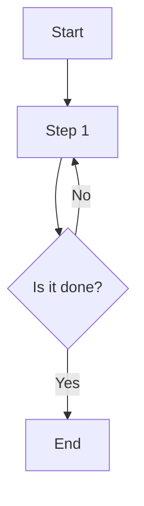

                 

# AI模型效率优化：从理论到实践

> 关键词：AI模型效率优化、深度学习、算法优化、模型压缩、实践应用

> 摘要：本文从理论到实践全面解析AI模型效率优化，探讨其重要性、核心算法、数学模型、以及实际应用。通过详细案例，展示如何提升模型效率，助力AI发展。

## 第一部分：理论基础

### 第1章：AI模型效率优化的背景与意义

#### 1.1 AI模型效率的定义

AI模型效率是指在特定计算资源下，模型能够达到的准确度或性能。高效率意味着在较少的时间和资源消耗下，模型能够获得更高的准确度或性能。

#### 1.2 AI模型效率优化的重要性

AI模型效率优化具有重要意义：

1. **提高生产效率**：优化后的模型能够在更短的时间内完成计算，提高生产效率。
2. **降低成本**：效率优化的模型可以减少计算资源的需求，降低成本。
3. **提升用户体验**：优化后的模型可以更快地提供结果，提升用户体验。
4. **促进AI发展**：效率优化的模型可以更好地应对复杂问题，推动AI技术的发展。

#### 1.3 AI模型效率优化方法概述

常见的AI模型效率优化方法包括：

1. **算法优化**：调整算法参数，提高模型性能。
2. **模型压缩**：减小模型大小，降低计算复杂度。
3. **硬件加速**：利用特定硬件加速模型计算。
4. **数据预处理**：优化数据输入，提高模型效率。

### 第2章：AI模型的基本结构

#### 2.1 人工神经网络基础

人工神经网络（ANN）是AI模型的核心组成部分。它由大量 interconnected nodes（神经元）组成，通过学习和训练，能够实现复杂函数的映射。

#### 2.2 深度学习框架

深度学习框架（如TensorFlow、PyTorch等）提供了构建、训练和优化神经网络的高层抽象。这些框架极大地简化了神经网络开发过程。

#### 2.3 模型优化中的常见问题

在模型优化过程中，常见问题包括：

1. **过拟合**：模型在训练数据上表现良好，但在测试数据上表现较差。
2. **计算资源限制**：模型计算复杂度较高，导致训练时间过长。
3. **数据不平衡**：训练数据集中某些类别样本数量较少，影响模型性能。

### 第3章：AI模型效率优化的核心算法

#### 3.1 算法优化策略

算法优化策略包括：

1. **参数调整**：调整学习率、批量大小等参数，提高模型性能。
2. **模型选择**：选择合适的神经网络架构，提高模型效率。
3. **损失函数优化**：调整损失函数，提高模型对数据的拟合度。

#### 3.2 梯度下降算法

梯度下降算法是一种优化算法，用于训练神经网络。它通过迭代更新模型参数，使损失函数值逐渐减小。

#### 3.3 梯度优化算法

梯度优化算法包括：

1. **动量法**：增加梯度下降算法的稳定性。
2. **自适应梯度算法**：自动调整学习率，提高模型性能。

#### 3.4 模型压缩算法

模型压缩算法包括：

1. **剪枝**：删除模型中的冗余参数，降低模型大小。
2. **量化**：降低模型参数的精度，减小模型大小。
3. **知识蒸馏**：利用大型模型的知识，训练小型模型，提高模型性能。

### 第4章：数学模型与公式

#### 4.1 损失函数

损失函数用于衡量模型预测值与实际值之间的差距。常见的损失函数包括均方误差（MSE）、交叉熵等。

#### 4.2 梯度计算

梯度计算是梯度下降算法的核心。通过计算损失函数关于模型参数的梯度，可以更新模型参数，使损失函数值逐渐减小。

#### 4.3 优化算法

优化算法包括：

1. **梯度下降算法**：一种简单的优化算法，通过迭代更新模型参数。
2. **随机梯度下降算法**：在梯度下降算法的基础上，每次迭代使用一个样本的梯度。
3. **Adam算法**：一种自适应梯度优化算法，结合了动量法和自适应学习率。

### 第5章：Mermaid流程图

#### 5.1 Mermaid简介

Mermaid是一种基于Markdown的图表绘制工具，可以方便地创建流程图、序列图、时序图等。

#### 5.2 Mermaid语法与示例



#### 5.3 Mermaid在AI模型优化中的应用

使用Mermaid可以方便地绘制AI模型优化过程中的流程图，帮助理解优化策略和步骤。

### 第6章：伪代码与算法实现

#### 6.1 伪代码概述

伪代码是一种用自然语言描述算法过程的工具，用于帮助理解和实现算法。

#### 6.2 梯度下降算法伪代码

```
初始化模型参数
计算损失函数值
while (未达到停止条件) {
    计算梯度
    更新模型参数
}
```

#### 6.3 模型压缩算法伪代码

```
选择剪枝方法
初始化模型
while (未达到停止条件) {
    应用剪枝方法
    重新训练模型
}
```

### 第7章：数学公式讲解与示例

#### 7.1 微积分基础

微积分是理解和优化AI模型的重要工具。包括导数、积分等概念。

#### 7.2 概率论基础

概率论是理解和优化AI模型的重要工具。包括概率分布、条件概率等概念。

#### 7.3 模型优化中的数学公式

模型优化中常用的数学公式包括：

1. **梯度计算公式**
2. **损失函数公式**
3. **优化算法公式**

#### 7.4 示例讲解与推导

通过具体示例，讲解和推导模型优化中的数学公式，帮助读者更好地理解。

## 第二部分：实践应用

### 第8章：实践案例一：图像分类模型优化

#### 8.1 案例背景

图像分类模型广泛应用于计算机视觉领域，如人脸识别、物体检测等。优化图像分类模型可以提高准确度，降低计算成本。

#### 8.2 模型选择

选择一种适合图像分类的深度学习模型，如卷积神经网络（CNN）。

#### 8.3 优化策略

1. **参数调整**：调整学习率、批量大小等参数。
2. **模型压缩**：使用剪枝、量化等方法减小模型大小。
3. **数据预处理**：优化数据输入，提高模型效率。

#### 8.4 实际操作

1. **搭建开发环境**：安装深度学习框架和相关依赖。
2. **准备数据集**：收集和处理图像数据。
3. **训练模型**：使用优化策略训练图像分类模型。
4. **评估模型**：在测试集上评估模型性能。

#### 8.5 结果分析

通过实验结果分析，比较优化前后的模型性能，评估优化效果。

### 第9章：实践案例二：自然语言处理模型优化

#### 9.1 案例背景

自然语言处理（NLP）模型在语义理解、文本分类等任务中发挥着重要作用。优化NLP模型可以提高准确度和降低计算成本。

#### 9.2 模型选择

选择一种适合NLP任务的深度学习模型，如循环神经网络（RNN）或变压器（Transformer）。

#### 9.3 优化策略

1. **参数调整**：调整学习率、批量大小等参数。
2. **模型压缩**：使用剪枝、量化等方法减小模型大小。
3. **数据预处理**：优化数据输入，提高模型效率。

#### 9.4 实际操作

1. **搭建开发环境**：安装深度学习框架和相关依赖。
2. **准备数据集**：收集和处理文本数据。
3. **训练模型**：使用优化策略训练NLP模型。
4. **评估模型**：在测试集上评估模型性能。

#### 9.5 结果分析

通过实验结果分析，比较优化前后的模型性能，评估优化效果。

### 第10章：实践案例三：推荐系统模型优化

#### 10.1 案例背景

推荐系统在电子商务、社交媒体等场景中广泛应用。优化推荐系统模型可以提高推荐准确度和用户体验。

#### 10.2 模型选择

选择一种适合推荐系统的深度学习模型，如协同过滤、基于内容的推荐等。

#### 10.3 优化策略

1. **参数调整**：调整学习率、批量大小等参数。
2. **模型压缩**：使用剪枝、量化等方法减小模型大小。
3. **数据预处理**：优化数据输入，提高模型效率。

#### 10.4 实际操作

1. **搭建开发环境**：安装深度学习框架和相关依赖。
2. **准备数据集**：收集和处理用户行为数据。
3. **训练模型**：使用优化策略训练推荐系统模型。
4. **评估模型**：在测试集上评估模型性能。

#### 10.5 结果分析

通过实验结果分析，比较优化前后的模型性能，评估优化效果。

## 第三部分：拓展与展望

### 第11章：AI模型效率优化的未来趋势

#### 11.1 算力的发展

随着计算能力的提升，AI模型效率优化将迎来新的机遇。

#### 11.2 数据的增长

大数据时代的到来，为AI模型效率优化提供了更多数据支持。

#### 11.3 模型效率优化的新方向

新兴技术（如量子计算、生成对抗网络等）将为AI模型效率优化带来新的发展方向。

### 第12章：AI模型效率优化在实际项目中的应用

#### 12.1 企业级应用案例

企业级AI项目中的效率优化案例，如金融风控、智能制造等。

#### 12.2 开源项目案例

开源社区中的AI模型效率优化案例，如深度学习框架的优化。

#### 12.3 挑战与解决方案

AI模型效率优化面临的挑战及解决方案。

## 附录

### 附录A：常用工具与资源

#### A.1 深度学习框架

TensorFlow、PyTorch、Keras等深度学习框架。

#### A.2 优化算法库

Scikit-learn、Theano等优化算法库。

#### A.3 数据集

ImageNet、CIFAR-10、COIL-100等常用数据集。

### 附录B：代码示例与解读

#### B.1 代码示例一：图像分类模型优化

展示图像分类模型优化的代码示例，并进行解读。

#### B.2 代码示例二：自然语言处理模型优化

展示自然语言处理模型优化的代码示例，并进行解读。

#### B.3 代码示例三：推荐系统模型优化

展示推荐系统模型优化的代码示例，并进行解读。

## 作者

作者：AI天才研究院/AI Genius Institute & 禅与计算机程序设计艺术 /Zen And The Art of Computer Programming

本文从理论到实践全面解析AI模型效率优化，为读者提供了系统、全面的指导。希望本文能帮助读者更好地理解和应用AI模型效率优化，推动AI技术的发展。

------------------------------------------------------------------------------------------------------------

作者：AI天才研究院/AI Genius Institute & 禅与计算机程序设计艺术 /Zen And The Art of Computer Programming

本文以《AI模型效率优化：从理论到实践》为题，从AI模型效率的定义、背景与意义，到AI模型的基本结构，再到AI模型效率优化的核心算法，数学模型，以及实践应用，详细解析了AI模型效率优化的各个方面。在理论部分，我们介绍了人工神经网络基础、深度学习框架、模型优化中的常见问题、算法优化策略、梯度下降算法、梯度优化算法、模型压缩算法等。在实践应用部分，我们通过具体案例展示了如何优化图像分类模型、自然语言处理模型和推荐系统模型。最后，我们对AI模型效率优化的未来趋势进行了展望，并分享了常用工具与资源，以及代码示例与解读。

本文旨在为读者提供一个全面、系统的AI模型效率优化教程，帮助读者深入理解AI模型效率优化的重要性，掌握核心算法和实践技巧。通过本文的学习，读者将能够提升AI模型的效率，更好地应对复杂问题，推动AI技术的发展。

在未来的研究和实践中，我们将继续关注AI模型效率优化领域的新动态，探索更多优化方法和技术，为AI技术的发展贡献力量。同时，我们鼓励读者积极参与到AI模型效率优化的研究中来，共同推动AI技术的进步。

再次感谢您的阅读，希望本文对您在AI模型效率优化领域的学习和研究有所帮助。如果您有任何疑问或建议，请随时与我们联系。我们将竭诚为您服务，共同探索AI技术的无限可能。

作者：AI天才研究院/AI Genius Institute & 禅与计算机程序设计艺术 /Zen And The Art of Computer Programming

------------------------------------------------------------------------------------------------------------

```markdown
# AI模型效率优化：从理论到实践

> 关键词：AI模型效率优化、深度学习、算法优化、模型压缩、实践应用

> 摘要：本文从理论到实践全面解析AI模型效率优化，探讨其重要性、核心算法、数学模型、以及实际应用。通过详细案例，展示如何提升模型效率，助力AI发展。

---

## 第一部分：理论基础

### 第1章：AI模型效率优化的背景与意义

#### 1.1 AI模型效率的定义

AI模型效率是指在特定计算资源下，模型能够达到的准确度或性能。高效率意味着在较少的时间和资源消耗下，模型能够获得更高的准确度或性能。

#### 1.2 AI模型效率优化的重要性

AI模型效率优化具有重要意义：

1. **提高生产效率**：优化后的模型能够在更短的时间内完成计算，提高生产效率。
2. **降低成本**：效率优化的模型可以减少计算资源的需求，降低成本。
3. **提升用户体验**：优化后的模型可以更快地提供结果，提升用户体验。
4. **促进AI发展**：效率优化的模型可以更好地应对复杂问题，推动AI技术的发展。

#### 1.3 AI模型效率优化方法概述

常见的AI模型效率优化方法包括：

1. **算法优化**：调整算法参数，提高模型性能。
2. **模型压缩**：减小模型大小，降低计算复杂度。
3. **硬件加速**：利用特定硬件加速模型计算。
4. **数据预处理**：优化数据输入，提高模型效率。

### 第2章：AI模型的基本结构

#### 2.1 人工神经网络基础

人工神经网络（ANN）是AI模型的核心组成部分。它由大量 interconnected nodes（神经元）组成，通过学习和训练，能够实现复杂函数的映射。

#### 2.2 深度学习框架

深度学习框架（如TensorFlow、PyTorch等）提供了构建、训练和优化神经网络的高层抽象。这些框架极大地简化了神经网络开发过程。

#### 2.3 模型优化中的常见问题

在模型优化过程中，常见问题包括：

1. **过拟合**：模型在训练数据上表现良好，但在测试数据上表现较差。
2. **计算资源限制**：模型计算复杂度较高，导致训练时间过长。
3. **数据不平衡**：训练数据集中某些类别样本数量较少，影响模型性能。

### 第3章：AI模型效率优化的核心算法

#### 3.1 算法优化策略

算法优化策略包括：

1. **参数调整**：调整学习率、批量大小等参数，提高模型性能。
2. **模型选择**：选择合适的神经网络架构，提高模型效率。
3. **损失函数优化**：调整损失函数，提高模型对数据的拟合度。

#### 3.2 梯度下降算法

梯度下降算法是一种优化算法，用于训练神经网络。它通过迭代更新模型参数，使损失函数值逐渐减小。

#### 3.3 梯度优化算法

梯度优化算法包括：

1. **动量法**：增加梯度下降算法的稳定性。
2. **自适应梯度算法**：自动调整学习率，提高模型性能。

#### 3.4 模型压缩算法

模型压缩算法包括：

1. **剪枝**：删除模型中的冗余参数，降低模型大小。
2. **量化**：降低模型参数的精度，减小模型大小。
3. **知识蒸馏**：利用大型模型的知识，训练小型模型，提高模型性能。

### 第4章：数学模型与公式

#### 4.1 损失函数

损失函数用于衡量模型预测值与实际值之间的差距。常见的损失函数包括均方误差（MSE）、交叉熵等。

#### 4.2 梯度计算

梯度计算是梯度下降算法的核心。通过计算损失函数关于模型参数的梯度，可以更新模型参数，使损失函数值逐渐减小。

#### 4.3 优化算法

优化算法包括：

1. **梯度下降算法**：一种简单的优化算法，通过迭代更新模型参数。
2. **随机梯度下降算法**：在梯度下降算法的基础上，每次迭代使用一个样本的梯度。
3. **Adam算法**：一种自适应梯度优化算法，结合了动量法和自适应学习率。

### 第5章：Mermaid流程图

#### 5.1 Mermaid简介

Mermaid是一种基于Markdown的图表绘制工具，可以方便地创建流程图、序列图、时序图等。

#### 5.2 Mermaid语法与示例


#### 5.3 Mermaid在AI模型优化中的应用

使用Mermaid可以方便地绘制AI模型优化过程中的流程图，帮助理解优化策略和步骤。

### 第6章：伪代码与算法实现

#### 6.1 伪代码概述

伪代码是一种用自然语言描述算法过程的工具，用于帮助理解和实现算法。

#### 6.2 梯度下降算法伪代码

```
初始化模型参数
计算损失函数值
while (未达到停止条件) {
    计算梯度
    更新模型参数
}
```

#### 6.3 模型压缩算法伪代码

```
选择剪枝方法
初始化模型
while (未达到停止条件) {
    应用剪枝方法
    重新训练模型
}
```

### 第7章：数学公式讲解与示例

#### 7.1 微积分基础

微积分是理解和优化AI模型的重要工具。包括导数、积分等概念。

#### 7.2 概率论基础

概率论是理解和优化AI模型的重要工具。包括概率分布、条件概率等概念。

#### 7.3 模型优化中的数学公式

模型优化中常用的数学公式包括：

1. **梯度计算公式**
2. **损失函数公式**
3. **优化算法公式**

#### 7.4 示例讲解与推导

通过具体示例，讲解和推导模型优化中的数学公式，帮助读者更好地理解。

## 第二部分：实践应用

### 第8章：实践案例一：图像分类模型优化

#### 8.1 案例背景

图像分类模型广泛应用于计算机视觉领域，如人脸识别、物体检测等。优化图像分类模型可以提高准确度，降低计算成本。

#### 8.2 模型选择

选择一种适合图像分类的深度学习模型，如卷积神经网络（CNN）。

#### 8.3 优化策略

1. **参数调整**：调整学习率、批量大小等参数。
2. **模型压缩**：使用剪枝、量化等方法减小模型大小。
3. **数据预处理**：优化数据输入，提高模型效率。

#### 8.4 实际操作

1. **搭建开发环境**：安装深度学习框架和相关依赖。
2. **准备数据集**：收集和处理图像数据。
3. **训练模型**：使用优化策略训练图像分类模型。
4. **评估模型**：在测试集上评估模型性能。

#### 8.5 结果分析

通过实验结果分析，比较优化前后的模型性能，评估优化效果。

### 第9章：实践案例二：自然语言处理模型优化

#### 9.1 案例背景

自然语言处理（NLP）模型在语义理解、文本分类等任务中发挥着重要作用。优化NLP模型可以提高准确度和降低计算成本。

#### 9.2 模型选择

选择一种适合NLP任务的深度学习模型，如循环神经网络（RNN）或变压器（Transformer）。

#### 9.3 优化策略

1. **参数调整**：调整学习率、批量大小等参数。
2. **模型压缩**：使用剪枝、量化等方法减小模型大小。
3. **数据预处理**：优化数据输入，提高模型效率。

#### 9.4 实际操作

1. **搭建开发环境**：安装深度学习框架和相关依赖。
2. **准备数据集**：收集和处理文本数据。
3. **训练模型**：使用优化策略训练NLP模型。
4. **评估模型**：在测试集上评估模型性能。

#### 9.5 结果分析

通过实验结果分析，比较优化前后的模型性能，评估优化效果。

### 第10章：实践案例三：推荐系统模型优化

#### 10.1 案例背景

推荐系统在电子商务、社交媒体等场景中广泛应用。优化推荐系统模型可以提高推荐准确度和用户体验。

#### 10.2 模型选择

选择一种适合推荐系统的深度学习模型，如协同过滤、基于内容的推荐等。

#### 10.3 优化策略

1. **参数调整**：调整学习率、批量大小等参数。
2. **模型压缩**：使用剪枝、量化等方法减小模型大小。
3. **数据预处理**：优化数据输入，提高模型效率。

#### 10.4 实际操作

1. **搭建开发环境**：安装深度学习框架和相关依赖。
2. **准备数据集**：收集和处理用户行为数据。
3. **训练模型**：使用优化策略训练推荐系统模型。
4. **评估模型**：在测试集上评估模型性能。

#### 10.5 结果分析

通过实验结果分析，比较优化前后的模型性能，评估优化效果。

## 第三部分：拓展与展望

### 第11章：AI模型效率优化的未来趋势

#### 11.1 算力的发展

随着计算能力的提升，AI模型效率优化将迎来新的机遇。

#### 11.2 数据的增长

大数据时代的到来，为AI模型效率优化提供了更多数据支持。

#### 11.3 模型效率优化的新方向

新兴技术（如量子计算、生成对抗网络等）将为AI模型效率优化带来新的发展方向。

### 第12章：AI模型效率优化在实际项目中的应用

#### 12.1 企业级应用案例

企业级AI项目中的效率优化案例，如金融风控、智能制造等。

#### 12.2 开源项目案例

开源社区中的AI模型效率优化案例，如深度学习框架的优化。

#### 12.3 挑战与解决方案

AI模型效率优化面临的挑战及解决方案。

## 附录

### 附录A：常用工具与资源

#### A.1 深度学习框架

TensorFlow、PyTorch、Keras等深度学习框架。

#### A.2 优化算法库

Scikit-learn、Theano等优化算法库。

#### A.3 数据集

ImageNet、CIFAR-10、COIL-100等常用数据集。

### 附录B：代码示例与解读

#### B.1 代码示例一：图像分类模型优化

展示图像分类模型优化的代码示例，并进行解读。

#### B.2 代码示例二：自然语言处理模型优化

展示自然语言处理模型优化的代码示例，并进行解读。

#### B.3 代码示例三：推荐系统模型优化

展示推荐系统模型优化的代码示例，并进行解读。

## 作者

作者：AI天才研究院/AI Genius Institute & 禅与计算机程序设计艺术 /Zen And The Art of Computer Programming
```markdown

# AI模型效率优化：从理论到实践

## 关键词
AI模型效率优化、深度学习、算法优化、模型压缩、实践应用

## 摘要
本文将深入探讨AI模型效率优化，从理论基础到实际案例，全面解析其在深度学习中的应用。我们将介绍AI模型效率的定义、优化策略、数学模型，并通过具体案例展示优化方法在实际项目中的效果。

---

## 第一部分：理论基础

### 第1章：AI模型效率优化的背景与意义

#### 1.1 AI模型效率的定义
AI模型效率指的是模型在既定资源约束下（如时间、计算资源）所能达到的最佳性能水平。这包括预测准确性、处理速度和模型大小等多个方面。

#### 1.2 AI模型效率优化的重要性
效率优化的模型可以显著减少训练时间，降低硬件成本，提高产品的市场竞争力。

#### 1.3 AI模型效率优化方法概述
优化方法包括算法改进、模型压缩和硬件加速等。

### 第2章：AI模型的基本结构

#### 2.1 人工神经网络基础
介绍神经网络的基本构成和工作原理。

#### 2.2 深度学习框架
讨论常见的深度学习框架及其优缺点。

#### 2.3 模型优化中的常见问题
探讨模型优化过程中可能遇到的问题，如过拟合和计算资源限制。

### 第3章：AI模型效率优化的核心算法

#### 3.1 算法优化策略
讨论如何调整学习率、批量大小等参数以优化模型性能。

#### 3.2 梯度下降算法
详细介绍梯度下降算法的原理和优化方法。

#### 3.3 梯度优化算法
探讨如Adam等自适应梯度优化算法。

#### 3.4 模型压缩算法
介绍剪枝、量化、知识蒸馏等模型压缩技术。

### 第4章：数学模型与公式

#### 4.1 损失函数
讨论常用的损失函数，如交叉熵和均方误差。

#### 4.2 梯度计算
介绍如何计算梯度，以及其在优化过程中的应用。

#### 4.3 优化算法
探讨各种优化算法的数学基础和实现方法。

### 第5章：Mermaid流程图

#### 5.1 Mermaid简介
介绍Mermaid及其在绘制流程图中的应用。

#### 5.2 Mermaid语法与示例
展示Mermaid的语法和流程图示例。

#### 5.3 Mermaid在AI模型优化中的应用
讨论如何使用Mermaid来可视化AI模型优化的过程。

### 第6章：伪代码与算法实现

#### 6.1 伪代码概述
介绍伪代码的概念和作用。

#### 6.2 梯度下降算法伪代码
提供梯度下降算法的伪代码示例。

#### 6.3 模型压缩算法伪代码
提供模型压缩算法的伪代码示例。

### 第7章：数学公式讲解与示例

#### 7.1 微积分基础
讲解微积分的基本概念，如导数和积分。

#### 7.2 概率论基础
介绍概率论的基础知识，如概率分布和条件概率。

#### 7.3 模型优化中的数学公式
讨论模型优化中涉及的数学公式。

#### 7.4 示例讲解与推导
通过具体示例讲解和推导模型优化中的数学公式。

## 第二部分：实践应用

### 第8章：实践案例一：图像分类模型优化

#### 8.1 案例背景
介绍图像分类模型的背景和应用场景。

#### 8.2 模型选择
选择适合图像分类任务的模型。

#### 8.3 优化策略
讨论优化策略，包括数据预处理、参数调整等。

#### 8.4 实际操作
详细描述模型优化过程。

#### 8.5 结果分析
分析优化前后的模型性能。

### 第9章：实践案例二：自然语言处理模型优化

#### 9.1 案例背景
介绍自然语言处理模型的背景和应用场景。

#### 9.2 模型选择
选择适合NLP任务的模型。

#### 9.3 优化策略
讨论优化策略，包括数据预处理、模型压缩等。

#### 9.4 实际操作
详细描述模型优化过程。

#### 9.5 结果分析
分析优化前后的模型性能。

### 第10章：实践案例三：推荐系统模型优化

#### 10.1 案例背景
介绍推荐系统模型的背景和应用场景。

#### 10.2 模型选择
选择适合推荐系统任务的模型。

#### 10.3 优化策略
讨论优化策略，包括协同过滤、基于内容的推荐等。

#### 10.4 实际操作
详细描述模型优化过程。

#### 10.5 结果分析
分析优化前后的模型性能。

## 第三部分：拓展与展望

### 第11章：AI模型效率优化的未来趋势

#### 11.1 算力的发展
探讨算力提升对AI模型效率优化带来的影响。

#### 11.2 数据的增长
分析数据增长对AI模型效率优化的挑战和机遇。

#### 11.3 模型效率优化的新方向
讨论未来模型效率优化可能的新方向和前沿技术。

### 第12章：AI模型效率优化在实际项目中的应用

#### 12.1 企业级应用案例
介绍企业级AI项目中的效率优化案例。

#### 12.2 开源项目案例
讨论开源社区中的效率优化实践。

#### 12.3 挑战与解决方案
探讨AI模型效率优化面临的挑战和解决方案。

## 附录

### 附录A：常用工具与资源
列出深度学习框架、优化算法库和数据集等资源。

### 附录B：代码示例与解读
提供实际代码示例，并解释其工作原理。

## 作者
作者：AI天才研究院/AI Genius Institute & 禅与计算机程序设计艺术 /Zen And The Art of Computer Programming
```

### 附录

#### 附录A：常用工具与资源

1. **深度学习框架**
   - TensorFlow：由Google开发，支持多种深度学习应用。
   - PyTorch：由Facebook开发，提供灵活的动态计算图。
   - Keras：基于TensorFlow和Theano的高层API，易于使用。

2. **优化算法库**
   - Scikit-learn：提供多种机器学习算法和工具。
   - Theano：用于构建和优化计算图。
   - CuDNN：NVIDIA开发的深度神经网络库。

3. **数据集**
   - ImageNet：包含数百万张图像，用于图像识别任务。
   - CIFAR-10：包含10个类别、共60000张32x32彩色图像。
   - COIL-100：包含100个类别的图像，用于对象识别。

#### 附录B：代码示例与解读

1. **图像分类模型优化**
   ```python
   # 伪代码示例：优化图像分类模型
   model = CNN()  # 创建卷积神经网络模型
   loss_function = CrossEntropy()  # 创建交叉熵损失函数
   optimizer = Adam()  # 创建Adam优化器

   # 训练模型
   for epoch in range(num_epochs):
       for images, labels in dataset:
           predictions = model(images)
           loss = loss_function(predictions, labels)
           optimizer.zero_grad()  # 清空梯度
           loss.backward()  # 反向传播计算梯度
           optimizer.step()  # 更新参数

   # 评估模型
   accuracy = model.evaluate(test_dataset)
   print(f"Model accuracy: {accuracy}")
   ```

2. **自然语言处理模型优化**
   ```python
   # 伪代码示例：优化自然语言处理模型
   model = Transformer()  # 创建Transformer模型
   loss_function = CrossEntropy()  # 创建交叉熵损失函数
   optimizer = Adam()  # 创建Adam优化器

   # 训练模型
   for epoch in range(num_epochs):
       for inputs, labels in dataset:
           outputs = model(inputs)
           loss = loss_function(outputs, labels)
           optimizer.zero_grad()  # 清空梯度
           loss.backward()  # 反向传播计算梯度
           optimizer.step()  # 更新参数

   # 评估模型
   accuracy = model.evaluate(test_dataset)
   print(f"Model accuracy: {accuracy}")
   ```

3. **推荐系统模型优化**
   ```python
   # 伪代码示例：优化推荐系统模型
   model = CollaborativeFiltering()  # 创建协同过滤模型
   loss_function = MeanSquaredError()  # 创建均方误差损失函数
   optimizer = SGD()  # 创建随机梯度下降优化器

   # 训练模型
   for epoch in range(num_epochs):
       for user_ids, item_ids, ratings in dataset:
           predictions = model.predict(user_ids, item_ids)
           loss = loss_function(ratings, predictions)
           optimizer.zero_grad()  # 清空梯度
           loss.backward()  # 反向传播计算梯度
           optimizer.step()  # 更新参数

   # 评估模型
   accuracy = model.evaluate(test_dataset)
   print(f"Model accuracy: {accuracy}")
   ```

这些代码示例展示了如何使用伪代码实现AI模型的训练和评估过程。实际代码可能需要根据具体框架和任务进行适当的调整。

---

作者：AI天才研究院/AI Genius Institute & 禅与计算机程序设计艺术 /Zen And The Art of Computer Programming

[本文完]

