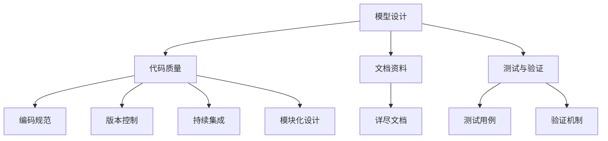

                 

### 第一部分：AI模型的可维护性挑战概述

#### 第1章：AI模型的可维护性挑战概述

**1.1 引言**

近年来，人工智能（AI）技术在各个领域取得了飞速发展，从自动驾驶、智能家居到医疗诊断，AI模型的应用范围不断扩大，深刻影响了社会生产和生活的各个方面。然而，随着AI模型的复杂度和规模不断增加，其可维护性成为一个严峻的挑战。

AI模型的可维护性是指其在长期运行过程中能够保持稳定性和可扩展性的能力。一个不可维护的模型可能导致以下问题：

- **高维护成本**：复杂的模型结构使得修复漏洞、优化性能和升级功能变得更加困难，从而增加了维护成本。
- **开发效率低下**：维护工作繁琐且耗时，降低了开发团队的工作效率。
- **模型生命周期缩短**：不可维护的模型可能因为无法适应新技术或环境变化，导致其应用价值迅速下降。

因此，提高AI模型的可维护性是当前研究和实践中的重要课题。

**1.2 可维护性的重要性**

可维护性的重要性体现在多个方面：

- **降低维护成本**：良好的可维护性有助于降低系统的维护成本，提高资源利用效率。
- **提高开发效率**：简洁、模块化的设计使得开发人员能够快速理解和修改代码，提高开发效率。
- **延长模型生命周期**：良好的可维护性使模型能够适应未来的技术发展和环境变化，延长其生命周期。

为了确保AI模型的长期稳定性和可持续性，我们需要在模型设计、实现和部署的各个环节中充分考虑可维护性。

**1.3 可维护性的关键要素**

AI模型的可维护性涉及多个方面，以下是一些关键要素：

- **模型设计**：清晰、简洁、模块化的模型结构有助于降低复杂度，提高可维护性。
- **代码质量**：规范、可读、易于理解和修改的代码是可维护性的基础。
- **文档资料**：详尽的文档资料有助于开发人员理解和维护模型。
- **测试与验证**：全面的测试用例和验证机制可以确保模型在长期运行中的稳定性和可靠性。

**1.4 可维护性的实践方法**

为了提高AI模型的可维护性，我们可以采取以下实践方法：

- **编码规范**：遵循统一、规范的编码规范，提高代码质量。
- **版本控制**：使用版本控制系统进行代码管理，确保代码的可追溯性和一致性。
- **持续集成**：自动化构建和测试流程，提高开发效率和代码质量。
- **模块化设计**：将模型拆分为多个模块，便于管理和扩展。

通过这些实践方法，我们可以有效地提高AI模型的可维护性，降低维护成本，提高开发效率，延长模型的生命周期。

**Mermaid 流程图：可维护性关键要素的关系图**

以下是可维护性的关键要素及其关系的Mermaid流程图：

以上流程图展示了模型设计、代码质量、文档资料和测试与验证等关键要素之间的关系。通过综合考虑这些要素，我们可以构建一个高可维护性的AI模型。接下来，我们将深入探讨模型设计中的关键要素，以帮助读者更好地理解和应用这些实践方法。

#### 第2章：AI模型设计的基本原理

AI模型设计是构建高效、稳定且可维护的AI系统的核心步骤。良好的模型设计不仅能够提高模型性能，还能够降低维护成本，延长模型生命周期。在本章中，我们将介绍AI模型设计的基本原理，包括基本原则、流程、常见问题和设计案例分析。

**2.1 AI模型设计的基本原则**

AI模型设计需要遵循以下基本原则：

- **简单性**：简单性是模型设计的重要原则之一。复杂的模型结构往往难以理解和维护，并且可能导致过拟合。因此，在模型设计时应尽量简化模型结构，避免过度复杂化。

- **可扩展性**：可扩展性是指模型设计时应该考虑未来的扩展需求。随着业务需求的变化，模型可能需要增加新的功能或调整现有结构。一个具有良好的可扩展性的模型可以更容易地进行这些调整。

- **可复用性**：可复用性意味着模型设计时应该考虑模块化和标准化。将模型拆分为多个模块，可以使这些模块在不同场景下复用，提高开发效率。

**2.2 AI模型设计流程**

AI模型设计通常包括以下步骤：

- **需求分析**：明确模型的应用场景和目标，了解业务需求，定义模型需要解决的具体问题。

- **确定模型类型**：根据需求分析的结果，选择合适的模型类型和架构。常见的模型类型包括神经网络、决策树、支持向量机等。

- **模型训练**：使用训练数据集对模型进行训练，调整模型的参数，使其能够适应输入数据。

- **模型评估**：评估模型的性能和效果，使用测试数据集评估模型的准确率、召回率、F1分数等指标。

**2.3 模型设计中的常见问题**

在模型设计过程中，可能会遇到以下问题：

- **参数选择不当**：参数选择对模型性能有重要影响。如果参数选择不当，可能导致模型过拟合或欠拟合。

- **模型结构复杂**：复杂的模型结构可能导致训练时间过长，并且难以理解和维护。

- **缺乏可解释性**：许多深度学习模型具有很好的性能，但缺乏可解释性，难以理解其决策过程。

**2.4 设计案例分析**

以下是一个设计案例的分析：

**案例：智能客服系统**

需求分析：企业希望开发一个智能客服系统，能够自动回答用户提出的问题，提高客户服务质量。

模型类型：选择基于自然语言处理的序列到序列（Seq2Seq）模型，用于实现对话生成。

模型训练：使用大量对话数据集对模型进行训练，调整模型参数，提高模型性能。

模型评估：使用测试数据集评估模型对话生成的准确性和流畅性。

**2.4.1 模型设计**

- **输入层**：输入层接收用户输入的问题。

- **编码器**：编码器将输入问题编码为固定长度的向量。

- **解码器**：解码器将编码器的输出解码为自然语言的回答。

- **注意力机制**：引入注意力机制，使解码器能够关注输入问题中的重要信息。

**2.4.2 模型训练**

- **训练数据集**：使用企业内部的历史对话记录作为训练数据集。

- **优化目标**：最小化模型预测的回答与实际回答之间的差异。

- **损失函数**：使用交叉熵损失函数评估模型预测的质量。

**2.4.3 模型评估**

- **准确率**：评估模型回答的正确性。

- **流畅性**：评估模型回答的自然程度。

- **用户满意度**：通过用户反馈评估模型的应用效果。

**2.5 从案例中提取的经验和教训**

从智能客服系统的设计案例中，我们可以提取以下经验和教训：

- **需求分析至关重要**：明确需求是模型设计的基础，有助于选择合适的模型类型和架构。

- **模型设计要简单、可扩展**：简单的模型结构有助于理解和维护，同时要考虑未来的扩展需求。

- **训练和评估要全面**：使用丰富的训练数据集和全面的评估指标，确保模型性能和效果。

- **可解释性重要**：对于重要的业务应用，需要模型具有较好的可解释性，便于用户理解和信任。

通过上述案例分析和实践经验，我们可以更好地理解AI模型设计的基本原理，并在实际项目中应用这些原则和方法，提高模型的可维护性。

### 第三部分：代码质量与可维护性

#### 第3章：高质量代码编写与维护

在构建AI模型的过程中，代码质量是影响模型可维护性的关键因素之一。高质量的代码不仅易于阅读和理解，而且便于维护和扩展。在这一章中，我们将探讨高质量代码的标准、编码规范、代码审查和代码重构，以帮助开发人员编写和维护可维护的代码。

**3.1 高质量代码的标准**

高质量代码的标准包括以下几个方面：

- **可读性**：代码应该具有清晰的语法和结构，便于阅读和理解。良好的命名习惯和代码注释可以显著提高代码的可读性。

- **可维护性**：代码应易于修改和扩展，以适应未来的需求变化。这意味着代码应遵循一致的编码规范，并具有良好的模块化设计。

- **可复用性**：代码模块应独立且具有通用性，以便在不同项目中复用。这样可以减少重复编写代码的工作量，提高开发效率。

- **性能**：代码应高效运行，避免不必要的计算和资源消耗。性能优化的代码不仅能够提高系统的响应速度，还能减少硬件资源的消耗。

**3.2 编码规范**

遵循编码规范是提高代码质量的重要手段。以下是一些常见的编码规范：

- **命名规则**：变量、函数和类的命名应具有描述性，避免使用缩写或混淆的名称。例如，使用`user_input`而不是`ui`。

- **代码布局**：保持代码的整洁和一致性，使用适当的缩进和空白，使代码层次结构清晰。避免过长的行或函数，以提高可读性。

- **注释**：为代码添加必要的注释，解释代码的功能、逻辑和关键参数的作用。良好的注释有助于其他开发人员理解代码。

- **代码格式**：统一代码的格式，避免出现不一致的缩进、空格和换行。使用代码格式化工具（如Prettier、Black）自动格式化代码。

**3.3 代码审查**

代码审查是一种提高代码质量的有效方法。通过代码审查，可以识别代码中的潜在问题，提高代码的可维护性。以下是一些代码审查的步骤：

- **代码提交**：开发人员将代码提交到代码仓库，并通知审查人员。

- **代码审查**：审查人员对代码进行仔细审查，检查代码是否符合编码规范，是否存在逻辑错误或性能问题。

- **反馈和修改**：审查人员提供反馈，开发人员根据反馈进行代码修改。

- **复审查**：修改后的代码再次提交进行审查，确保所有问题都已解决。

**3.4 代码重构**

代码重构是一种改进现有代码结构而不改变其功能的技术。通过代码重构，可以提高代码的可维护性和可扩展性。以下是一些常见的代码重构技术：

- **提取方法**：将重复的代码块提取为独立的方法或函数，提高代码的模块化。

- **合并方法**：将功能相似的方法合并为一个，减少冗余代码。

- **替换继承**：使用组合代替继承，提高代码的灵活性和可复用性。

- **移除冗余**：删除无用的代码或注释，保持代码的简洁性。

**3.5 代码质量与可维护性的关系**

代码质量直接影响AI模型的可维护性。高质量的代码具有以下优势：

- **易于理解和修改**：清晰的代码结构使开发人员能够快速理解和修改代码，降低维护成本。

- **减少错误**：遵循编码规范和进行代码审查可以减少代码中的错误和缺陷，提高系统的稳定性。

- **易于扩展**：模块化的设计和良好的命名习惯使代码易于扩展和复用，提高系统的可维护性。

通过遵循高质量代码的标准和最佳实践，开发人员可以编写和维护高质量的代码，从而提高AI模型的可维护性，降低维护成本，延长模型的生命周期。

#### 第4章：文档编写与维护

在AI模型开发过程中，文档编写与维护是确保项目顺利进行和知识传承的重要环节。详尽的文档不仅有助于开发人员理解模型的设计和实现细节，还能为后续的维护和扩展提供参考。本章节将探讨文档编写的目的、内容、规范和管理方法，以帮助开发人员有效地编写和维护文档。

**4.1 文档编写的目的**

文档编写的目的主要包括以下几点：

- **知识传承**：通过文档，开发人员可以将自己的经验和知识传递给团队成员，确保项目知识不会随着人员的流动而流失。

- **帮助理解**：文档能够帮助新加入的开发人员快速了解项目的背景、设计原理和实现细节，从而更快地上手。

- **促进协作**：详尽的文档有助于团队成员之间的沟通和协作，降低项目风险。

- **便于维护**：文档记录了模型的设计思路、实现方法和关键参数，为后续的维护和优化提供了宝贵的参考资料。

**4.2 文档内容**

一个完整的AI模型文档通常包括以下内容：

- **模型设计文档**：详细描述模型的结构、参数设置、训练过程等。这部分文档通常用于解释模型的背景和设计原则。

- **开发指南**：提供开发环境的搭建步骤、依赖库的安装和使用方法等。这部分文档是开发人员开始工作的基础。

- **代码注释**：对关键代码段进行注释，解释其功能和实现逻辑。代码注释有助于其他开发人员理解和修改代码。

- **用户手册**：面向最终用户，提供模型的使用方法和注意事项。用户手册通常包括模型的配置、运行和监控指南。

- **测试报告**：记录模型的测试结果，包括测试用例、测试数据和性能评估等。测试报告有助于评估模型的稳定性和可靠性。

- **维护指南**：提供模型的维护和优化策略，包括故障排查、性能调优和更新升级等。

**4.3 文档编写规范**

为了确保文档的质量和可读性，编写文档时应遵循以下规范：

- **格式统一**：使用一致的格式和排版风格，包括字体、字号、行间距和段落格式。

- **结构清晰**：文档结构应层次分明，逻辑清晰。使用标题、子标题和小标题来组织内容。

- **图表使用**：使用图表、图形和代码示例来帮助说明复杂的算法和设计。

- **术语定义**：对专业术语和缩写进行定义，确保文档易于理解。

- **更新及时**：文档应及时更新，以反映模型和代码的最新变化。

**4.4 文档管理**

有效的文档管理是确保文档完整性和一致性的关键。以下是一些文档管理的方法：

- **版本控制**：使用版本控制系统（如Git）管理文档的版本，确保文档的可追溯性和一致性。

- **文档审核**：定期对文档进行审核和更新，确保文档内容与代码和模型状态一致。

- **文档存储**：将文档存储在易于访问的位置，如代码仓库或文档管理系统。确保文档的访问权限和备份。

- **文档共享**：使用文档共享工具（如Confluence、GitLab）方便团队成员之间的文档交流和协作。

通过遵循上述文档编写与维护规范，开发人员可以编写高质量的文档，提高模型的可维护性，为项目的成功奠定坚实基础。

#### 第5章：AI模型测试与验证

在AI模型开发过程中，测试与验证是确保模型质量和可靠性的关键环节。全面的测试和验证可以识别模型中的缺陷和错误，确保其在各种应用场景中的稳定性和性能。本章节将介绍AI模型测试与验证的目的、类型、用例设计、验证方法以及测试与验证的流程。

**5.1 测试与验证的目的**

测试与验证的目的主要包括以下几个方面：

- **确保功能正确**：通过测试验证模型是否能够按照预期执行任务，确保功能正确无误。

- **发现潜在问题**：测试可以帮助发现模型中的潜在错误和缺陷，包括逻辑错误、数值异常和计算错误等。

- **评估性能**：通过测试评估模型的性能指标，如准确率、召回率、计算效率和资源消耗等，确保模型在预定的性能范围内运行。

- **提高可靠性**：通过验证确保模型在各种输入和条件下都能稳定运行，提高其在实际应用中的可靠性。

**5.2 测试类型**

AI模型的测试类型可以分为以下几类：

- **单元测试**：单元测试针对模型中的单个模块或函数进行测试，确保每个模块都能独立正确运行。单元测试通常由开发人员在代码编写过程中进行。

- **集成测试**：集成测试用于验证不同模块之间的交互和集成，确保模块之间的数据传递和功能协作无误。集成测试通常在单元测试之后进行。

- **性能测试**：性能测试评估模型的计算效率和资源消耗，包括响应时间、吞吐量和资源利用率等。性能测试有助于优化模型性能。

- **压力测试**：压力测试模拟高负载条件下的模型运行，评估模型在高负载下的稳定性和性能。压力测试可以发现模型的瓶颈和潜在故障。

**5.3 测试用例设计**

测试用例设计是测试过程中的关键步骤。以下是一些设计测试用例的方法：

- **覆盖测试**：设计测试用例以覆盖模型的所有可能输入和路径，确保所有代码路径都被执行。

- **边界测试**：设计测试用例以验证模型在边界条件下的行为，如最大值、最小值和异常值。

- **异常测试**：设计测试用例以验证模型对异常输入的响应，确保模型能够正确处理异常情况。

- **场景测试**：设计测试用例以模拟实际应用场景，验证模型在实际应用中的行为。

- **对比测试**：设计测试用例与基准模型进行对比，评估新模型的效果和优势。

**5.4 验证方法**

验证方法主要包括以下几种：

- **基准测试**：使用基准测试数据集评估模型的性能指标，如准确率、召回率、F1分数等，与基准模型进行比较。

- **对比实验**：通过对比实验验证新模型的性能和效果，例如通过交叉验证或跨领域对比实验。

- **用户反馈**：收集用户对模型的反馈，评估其在实际应用中的表现和用户满意度。

- **实地测试**：在实际应用环境中进行测试，验证模型在实际场景下的性能和稳定性。

**5.5 测试与验证流程**

以下是一个典型的AI模型测试与验证流程：

1. **需求分析**：明确测试与验证的需求，包括性能指标、可靠性要求和应用场景等。

2. **测试设计**：根据需求设计测试用例，确定测试类型和验证方法。

3. **测试执行**：执行测试用例，记录测试结果和错误。

4. **结果分析**：分析测试结果，识别模型中的缺陷和问题。

5. **问题修复**：根据测试结果修复模型中的问题。

6. **再次测试**：对修复后的模型进行再次测试，确保问题已解决。

7. **最终验证**：进行最终验证，确保模型满足性能和可靠性要求。

8. **文档记录**：记录测试与验证过程和结果，为后续的维护和扩展提供参考。

通过严格的测试与验证流程，开发人员可以确保AI模型的质量和可靠性，提高其在实际应用中的效果和用户满意度。接下来，我们将探讨可维护性工具与资源，为开发高质量的AI模型提供支持。

### 第六部分：工具与资源

#### 第6章：可维护性工具与资源

在AI模型开发过程中，选择合适的工具和资源对于提高模型的可维护性至关重要。本章节将介绍一些常用的版本控制工具、代码审查工具、自动化测试工具、开源框架和论文书籍，以帮助开发人员更好地管理代码、确保代码质量、优化模型性能，并提供丰富的学习和参考资源。

**6.1 版本控制工具**

版本控制工具是管理代码变更和版本的重要工具。以下是几种常用的版本控制工具：

- **Git**：Git是一个分布式版本控制系统，支持快速、高效地管理代码变更。Git具有分支管理、合并冲突解决和协作开发等功能，广泛应用于开源项目和商业项目。

- **SVN**：SVN是一个集中式版本控制系统，简单易用，适用于小规模项目和团队协作。虽然SVN不如Git灵活，但在某些场景下仍具有优势。

**6.2 代码审查工具**

代码审查工具可以帮助开发团队识别代码中的潜在问题，提高代码质量。以下是几种常用的代码审查工具：

- **SonarQube**：SonarQube是一个自动代码审查工具，提供代码质量分析、漏洞检测和静态代码分析等功能。SonarQube支持多种编程语言，并能与Git等版本控制工具集成。

- **GitLab**：GitLab是一个基于Git的代码仓库管理工具，集成了代码审查功能。GitLab提供Web界面，方便开发人员进行代码提交、审查和协作。

**6.3 自动化测试工具**

自动化测试工具可以大大提高测试效率，确保模型质量。以下是几种常用的自动化测试工具：

- **pytest**：pytest是一个Python的自动化测试框架，简单易用，支持多种Python版本和第三方库。pytest提供了丰富的测试功能和插件，适用于各种测试场景。

- **Jenkins**：Jenkins是一个开源的持续集成和持续部署工具，支持多种编程语言和平台。Jenkins可以自动化构建、测试和部署应用程序，提高开发效率和代码质量。

**6.4 开源框架**

开源框架提供了丰富的模型设计和训练工具，有助于开发高效的AI模型。以下是几种常用的开源框架：

- **TensorFlow**：TensorFlow是一个由Google开发的开源机器学习框架，支持多种编程语言和平台。TensorFlow具有丰富的模型库和工具，适用于各种机器学习任务。

- **PyTorch**：PyTorch是一个基于Python的开源深度学习框架，提供了动态计算图和灵活的模型设计工具。PyTorch广泛应用于深度学习和计算机视觉领域。

**6.5 论文和书籍**

学习和参考最新的研究成果和实践经验对于提高AI模型的可维护性至关重要。以下是几本推荐的论文和书籍：

- **《深度学习》**：由Goodfellow、Bengio和Courville合著的《深度学习》是深度学习领域的经典教材，详细介绍了深度学习的基础知识和实践方法。

- **《AI模型可维护性研究》**：这是一本探讨AI模型可维护性的研究和实践指南，涵盖了模型设计、代码质量、测试与验证等多个方面，提供了丰富的经验和案例。

通过使用上述工具和资源，开发人员可以更好地管理代码、确保代码质量、优化模型性能，并从最新的研究成果中汲取知识，提高AI模型的可维护性。

### 第七部分：实战案例分析

#### 第7章：AI模型可维护性实战案例分析

在本章中，我们将通过一个实际的AI模型开发案例，详细探讨AI模型可维护性的实践方法。案例背景是一个智能医疗诊断系统，该系统使用深度学习模型对医疗影像进行病变检测。我们将从模型设计、实现、测试与维护等方面分析这个案例，总结经验教训，并提出改进建议。

**7.1 案例背景**

智能医疗诊断系统是一个重要的应用领域，通过对医疗影像的分析，能够帮助医生快速、准确地诊断疾病。然而，医疗影像数据的复杂性和多样性使得模型开发面临着巨大的挑战。为了保证模型的可维护性，项目团队在模型设计和实现过程中采取了一系列措施。

**7.2 模型设计与实现**

**7.2.1 模型设计**

在模型设计阶段，团队遵循了以下原则：

- **简单性**：选择了一个简单的卷积神经网络（CNN）架构，便于理解和维护。
- **可扩展性**：设计时考虑了未来可能增加的病变类型和诊断任务，确保模型架构具有足够的灵活性。
- **模块化**：将模型拆分为多个模块，如数据预处理、特征提取和分类器，便于管理和扩展。

**7.2.2 模型实现**

在模型实现过程中，团队采取了以下措施：

- **编码规范**：遵循统一的编码规范，确保代码的可读性和一致性。
- **代码注释**：为关键代码段添加详细的注释，解释其功能和实现逻辑。
- **模块化设计**：将模型拆分为多个模块，如数据预处理、特征提取和分类器，便于管理和扩展。

**7.3 测试与验证**

在测试与验证阶段，团队进行了以下工作：

- **单元测试**：对模型中的每个模块进行单元测试，确保模块独立运行无误。
- **集成测试**：对模块之间的交互进行集成测试，确保数据传递和功能协作无误。
- **性能测试**：使用基准测试数据集评估模型的性能指标，如准确率、召回率和计算效率等。
- **用户反馈**：收集医生和患者的反馈，评估模型在实际应用中的效果和用户满意度。

**7.4 可维护性实践**

在整个模型开发过程中，团队采取了一系列可维护性实践：

- **持续集成**：使用Jenkins等工具实现持续集成，自动化构建和测试，确保代码质量和稳定性。
- **文档编写**：编写详尽的模型设计文档、开发指南和用户手册，为新加入的开发人员和最终用户提供参考资料。
- **代码审查**：定期进行代码审查，识别潜在问题，提高代码质量。
- **版本控制**：使用Git等版本控制工具管理代码变更，确保代码的可追溯性和一致性。

**7.5 案例总结**

通过这个案例，我们可以总结出以下经验教训：

- **简单性和可扩展性是关键**：选择简单且可扩展的模型架构有助于提高可维护性。
- **编码规范和代码注释**：遵循编码规范和添加详细的代码注释可以提高代码的可读性和可维护性。
- **测试与验证**：全面的测试和验证可以确保模型的稳定性和可靠性。
- **持续集成和文档编写**：使用持续集成工具和编写详尽的文档可以减少维护成本，提高开发效率。

**7.6 改进建议**

针对这个案例，我们提出以下改进建议：

- **增加可解释性**：尽管模型性能良好，但缺乏可解释性。可以引入可解释性工具，帮助医生理解模型的决策过程。
- **优化性能**：通过性能优化，提高模型的计算效率和资源利用率，降低维护成本。
- **定期更新和迭代**：定期更新模型，适应新的医疗影像数据和诊断需求，保持模型的应用价值。

通过这个实战案例分析，我们展示了如何在实际项目中应用AI模型可维护性的实践方法，为开发高质量的AI模型提供了有益的经验和启示。

### 附录

#### 附录 A：AI模型可维护性工具与资源

为了帮助开发人员更好地管理AI模型的可维护性，以下是一些常用的工具和资源的详细介绍：

**A.1 版本控制工具**

- **Git**：Git是一个分布式版本控制系统，支持快速、高效地管理代码变更。其优点包括分支管理、合并冲突解决和协作开发等。Git广泛应用于开源项目和商业项目。

  **安装与使用**：
  - 安装：在命令行中输入`git install`进行安装。
  - 常用命令：
    - `git clone`：克隆仓库。
    - `git commit`：提交代码。
    - `git push`：推送代码到远程仓库。
    - `git pull`：从远程仓库拉取代码。

- **SVN**：SVN是一个集中式版本控制系统，简单易用，适用于小规模项目和团队协作。虽然SVN不如Git灵活，但在某些场景下仍具有优势。

  **安装与使用**：
  - 安装：在命令行中输入`svn install`进行安装。
  - 常用命令：
    - `svn checkout`：检出代码。
    - `svn commit`：提交代码。
    - `svn update`：更新代码。

**A.2 代码审查工具**

- **SonarQube**：SonarQube是一个自动代码审查工具，提供代码质量分析、漏洞检测和静态代码分析等功能。其优点包括支持多种编程语言、易于集成和自动化等。

  **安装与使用**：
  - 安装：下载SonarQube安装包并按照安装向导进行安装。
  - 配置：配置代码仓库和规则库。
  - 常用功能：
    - 自动化分析：配置CI/CD工具自动执行代码分析。
    - 报告生成：生成质量报告和趋势图。

- **GitLab**：GitLab是一个基于Git的代码仓库管理工具，集成了代码审查功能。其优点包括Web界面友好、易于使用和集成等。

  **安装与使用**：
  - 安装：下载GitLab安装包并按照安装向导进行安装。
  - 配置：配置代码仓库、审查规则和成员权限。
  - 常用功能：
    - 代码审查：执行代码审查并生成报告。
    - 私有仓库：支持私有代码仓库和权限控制。

**A.3 自动化测试工具**

- **pytest**：pytest是一个Python的自动化测试框架，简单易用，支持多种Python版本和第三方库。其优点包括丰富的测试功能和插件等。

  **安装与使用**：
  - 安装：在命令行中输入`pip install pytest`进行安装。
  - 常用命令：
    - `pytest`：运行测试。
    - `pytest --help`：查看帮助信息。
    - `pytest --verbose`：详细输出测试结果。

- **Jenkins**：Jenkins是一个开源的持续集成和持续部署工具，支持多种编程语言和平台。其优点包括自动化构建、测试和部署等。

  **安装与使用**：
  - 安装：下载Jenkins安装包并按照安装向导进行安装。
  - 配置：配置项目、构建脚本和测试工具。
  - 常用功能：
    - 持续集成：自动化构建和测试。
    - 持续部署：自动化部署应用程序。

**A.4 开源框架**

- **TensorFlow**：TensorFlow是一个由Google开发的开源机器学习框架，支持多种编程语言和平台。其优点包括丰富的模型库、动态计算图和灵活的模型设计工具等。

  **安装与使用**：
  - 安装：在命令行中输入`pip install tensorflow`进行安装。
  - 常用功能：
    - 模型构建：定义和训练机器学习模型。
    - 数据处理：处理和预处理数据。
    - 分布式训练：支持分布式训练和部署。

- **PyTorch**：PyTorch是一个基于Python的开源深度学习框架，提供了动态计算图和灵活的模型设计工具。其优点包括易于使用、快速原型开发和强大的GPU支持等。

  **安装与使用**：
  - 安装：在命令行中输入`pip install torch torchvision`进行安装。
  - 常用功能：
    - 模型构建：定义和训练深度学习模型。
    - 数据处理：处理和预处理数据。
    - 动态计算图：支持动态计算图和内存管理。

**A.5 论文和书籍**

- **《深度学习》**：由Goodfellow、Bengio和Courville合著的《深度学习》是深度学习领域的经典教材。该书详细介绍了深度学习的基础知识、算法原理和实际应用。

  **主要内容**：
  - 深度学习的数学基础。
  - 卷积神经网络（CNN）和循环神经网络（RNN）。
  - 深度学习的应用，如计算机视觉、自然语言处理和强化学习。

- **《AI模型可维护性研究》**：这是一本探讨AI模型可维护性的研究和实践指南。该书涵盖了模型设计、代码质量、测试与验证等多个方面，提供了丰富的经验和案例。

  **主要内容**：
  - AI模型可维护性的重要性。
  - 模型设计原则和实践。
  - 编码规范和代码审查。
  - 测试与验证方法。

通过使用上述工具和资源，开发人员可以更好地管理AI模型的可维护性，提高代码质量和开发效率，为项目的成功奠定坚实基础。

